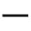
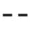

 *第十集 易经的思维*

想看懂《易经》，首先要学会《易经》的思维方式。虽然人的思维方式有很多种，但归纳起来不外乎三种。第一种是一分法，就是你说什么我都相信，或者你说什么我都不相信，这种全盘肯定或者全盘否定的思维方式当然是错误的。第二种思维方式是二分法，是非分明，就是对就是对，错就是错。这种是非分明的二分法，应该是正确的吧？

二分法是最可怕的陷阱，那么《易经》的思维方式是什么样的呢？它就是第三种方式，叫三分法。什么叫作三分法？我们又应该怎么样运用这种思维方式来妥当地处理生活中所遇到的问题呢？

我们今天要谈一谈《易经》的思维方式。每个国家为什么有不同的看法，每一个人为什么有不同的观点，主要就在于思维方式不一样。全世界有很多种思维方式，但是归纳起来只有三种。

一种是一分法思维。什么叫一分法？就是你说什么我都相信，或者你说什么我都不相信，这两种是同样的。听到什么就相信，跟听到什么都不相信，这两种是一样的。大家不要以为它们不一样，其实它们通通是一分法。拥有一分法思维的人本身没有意见，反正别人说什么他都这样，像海绵体一样吸进来。别人问：“到底有没有鬼？”他说：“有。”别人问他：“你怎么知道有鬼？”他答：“大家都说有鬼，所以当然有鬼。”很多人都是这种态度。“到底有没有鬼？”“没有鬼。”“为什么没有鬼？”“他们都说没有鬼，所以就没有鬼。”这种人现在也很多，很可爱。这种思维方式就叫一分法。但是这种人，慢慢会变成少数，因为我们现代的教育都在教二分法。

二分法是经过思虑，经过分辨，经过判断，自己来分是非。二分法就是是非分明。我们现在都很喜欢是非分明的人，其实这是错误的。是非分明是对就是对，错就是错，但是《易经》告诉我们六十四卦里面，纯阳卦只有一个，它所占的比例很小，只有六十四分之一。纯阴卦也只有一个。所以，绝对对或绝对错，比例太小了。六十四卦中有六十二卦都是有对有错的。

因为二分法这种思维方式在现在非常普遍，所以我必须要多花一些时间来说明。人类基本上是没有资格是非分明的。第一，人类的认知是很有限的。根本搞不清楚，就分是非，怎么分呢？第二，人类的选择能力很贫乏，经常会选错。第三，人类的判断能力很薄弱。当老师的人多半如此。小学老师多半是只有对与错。中学老师多半是“课本说对就是对，我也不知道”，已经比较有弹性了。因为他自己知道，他没有能力分是非，但是最起码教科书是这样写的。我们现在的教育教的就是这个，然而我们又骂这种人，因为这种人是很典型的死脑筋、一刀切、脑筋拐不了弯。可是是我们的教育把他教成这样的。

我请问各位：如果一分法叫作是非分明，二分法是不是就叫是非不明？绝对不是。

在我们的惯性思维当中，一分法的全盘肯定或者全盘否定的思维方式当然是错误的，但是二分法的是非分明应该是正确的呀。可曾仕强教授却说，一分法和二分法在本质上是相同的，所以都是错误的，那么正确的思维方式，应该是什么样子的呢？

它就是第三种方式了，这就是三分法。三分法根本没有答案，因为它随时在变。《易经》经常会给我们第三种答案。这叫什么？说清楚，它既不是是非不明，也不是是非分明。我相信大家心里头已经很清楚了。我们中国人最讨厌的就是是非不明的人，但是我们也最不喜欢是非分明的人。你聪明，你了不起，你看得准，我不跟你来往可以吧？凡是是非分明的人，人际关系都很差。这是现代人很麻烦的一件事情。这叫什么？这叫三分法，是非难明。

这样各位才了解，为什么你问中国人什么问题，他都回答你三个字：很难讲。没有一件事情是好讲的。那怎么办？中国人很聪明，三个字又化解了——看着办。有时候要这样，有时候要那样，灵活使用。这就是中国人很了不起的一个地方。

老子在《道德经》里面告诉我们：“道可道非常道。”他先告诉我们道是很难讲的，然后才开始讲道。中国人先说很难讲，然后才开始讲；先说我不知道，然后才告诉你。这些说话方式就是从《易经》里面来的。就是我两边会兼顾，告诉你的事情只是我知道的部分。但是有些部分，我还是不知道。

我们经常是不明言。你看，我们讲话都是点到为止，不会讲得很清楚。讲话讲得很清楚跟讲话讲得不清楚都是不对的。这个是要好好去学习的。

请问大家：观念要改变，对不对？说对，那就是这个；说不要，还是这个。中国人凡是两边选一个的，都是二分法。二分法是最可怕的陷阱，多少人跳进去，一辈子跳不出来。

按照《易经》的思维方式，是非永远是相对的，但我们在现实生活中经常需要对身边的事物进行选择和判断。当我们面对不同的观念时，我们应该选择同意还是不同意呢？当我们被问到是甲对还是乙对的时候，我们又应该如何回答呢？

观念要改变，真正的答案只有一个，看状况。有些观念是要改变的，有些观念是不能改变的，就算要改变也只能调整，不能完全变掉。比如：做生意要赚钱，对不对？你说当然对，二分法。你说不要紧，没有人会相信。你说做生意是不赚钱的，谁相信？绝对没有人相信。正确的答案是：做生意要赚钱，但是还是要顾虑到良心。

任何一句话一定要有“但是”，要有条件，就是阴阳不能分割。我们现在都把阴阳分割了，一分割就完了。“一阴一阳之谓道”告诉我们，阴阳始终是在一起的。比如：饿了要吃饭，对不对？你看，这么简单的事情，我们都不敢说对。关于这件事诸葛亮讲得最清楚了。当一个人饿的时候，你不能马上给他东西吃，他会撑死的。所以，一个很饿的人，你拿一个鸡腿给他吃，是准备害死他。你只能用很稀的稀饭，给他喝一点点，不是舍不得，而是为他好。

记住，每一件事情都可以有六十四种不同的状况，不能一概而论，否则那就太粗糙、太鲁莽、太幼稚。我们现在最常听的话就是二十一世纪，需要新的观念。绝对是二分法。有些观念不管是几世纪，永远不会改变。比如：勤劳、节俭、负责、认真，只要有人类，就不可能变。我们现在一直想变，变到最后，连自己的根都没有了，这是最要命的事情。

请问大家，到底有没有鬼神？说有，二分法；说没有，还是二分法。大家可以拿这个去试试自己的亲戚朋友，一开口就是二分法。因为我们掉入这个陷阱太久太久，要拔出来很困难，但是一定要想办法。

到底有没有鬼神？有没有标准答案？有，当然有答案。心中有鬼，就有鬼；心中没有鬼，根本就没有鬼。什么鬼？就是疑神疑鬼。如果突然间看到鬼在那里，千万不能跑，一看到鬼在那儿拔腿就跑，一辈子就都认为有鬼了。我碰到过鬼，我看过了。你用我的方法试试看，有鬼，看他一眼，再看一眼，它就没有了，它本来就没有。人都是自己心中有鬼，才怕东怕西。你看，小孩子是不会说他怕鬼的，因为他根本就不知道鬼是什么，怎么会怕？都是有一天，有一个比他大的人来告诉他鬼是很吓人的，才开始怕鬼，都是大人教他的。教他这些干吗？不是找麻烦吗？自己被鬼吓，然后还去吓人，你的心跑到哪里去了？没良心。

《易经》的思维方式告诉我们，所有的是非对错都是有条件的。对与错在不同的情况之下，随时会发生变化。其实我们在生活中，也经常会遇到这样的情况。明明我说的是实话，对方却生气了；明明我是一片好心，对方却对我有意见。这是什么原因？我们又应该如何处理呢？

我举个例子，一个媳妇买了只鸡，放了一些香菇，煮了一锅很香的香菇鸡汤。煮好了，很高兴，就大声问婆婆：“婆婆，你要不要吃香菇鸡汤呢？”我请问大家，如果你是她的婆婆，会怎么回答？你会回答才怪。那个婆婆跟我诉苦：“我那个媳妇好到问我，你要不要喝香菇鸡汤。我心里想糟糕了。我回答说要，丢儿子的脸，好像我这个婆婆从来没有喝过这么香的汤。我说不要，他们两小口就喝光了，我就没得喝了，那也不行。”所以，这个媳妇就不应该问婆婆喝不喝，因为《论语》里面讲得很清楚。

我们只会背《论语》，根本不会用《论语》，那读了《论语》有什么用呢？《论语·为政篇》讲得很清楚：如果奉养父母没有敬意的话，跟喂一匹马、喂一条狗有什么不同？如果叫公公婆婆来吃饭只说一句“来”，那跟喂狗有什么分别？那就不叫孝了。孝而不敬，就是不孝。

你看，有的人，她抱着狗，然后说：“婆婆，你当心一点儿，我没办法照顾你，我要照顾它。”她宁可去照顾狗，对狗有说有笑，而看到婆婆就板脸。她受什么害？受电影的害，电影多半是假的，你把它当真，不糟糕了吗？你看，电影里面的年轻男女结成连理，然后从此过上幸福愉快的生活。大家不要上当，因为它没有续集。续集一出来，两个人骂得比谁都凶。你上当干什么？现实生活，永远不像电影里所描述的那样。

“婆婆，你要喝汤吗？”这句话是不能问的，这是不敬的。你要怎么办？把汤盛好了，端到婆婆房间：“婆婆，我不知道这个汤好不好喝，因为我没有经验，你喝喝看，点评点评。”让她很有面子，她才会喝。你让她没有面子，她宁可不喝。现代人懂不懂？不懂。所以才会拼命怪婆婆脾气不好，架子大。

我有个年轻的朋友，赚了钱以后，就请他的父母下馆子，可最后他的父母非常不高兴。为什么？因为儿子把他们二老服侍好之后，讲了一句话：“这个馆子我常来。”爸爸就不高兴了，心想：常来？那你到现在才请我来？你早就该叫我来了！你吃到不想吃了，才叫我来吃，是不是？我点了好几道好菜给你吃，你看什么都不想吃。那个老爸心情不好，所以就跟我发牢骚，说：“我儿子请客，一点儿诚意都没有。他只是想在我面前炫耀：你看，我比你会赚钱吧？你当年有没有这样请你爸爸？他是来教训我的。”我说：“人家一句话都没有说。”他说：“他说的话，我只听一句；他没有说的话，我听到几百句。”中国人专门听你没有说出来的话，中国人厉害就厉害在这里。你不过说了那几句话，但我知道你没说的更多。我再三说，你不读《易经》，根本看不懂中国人！

无论是媳妇请婆婆喝汤，还是儿子请父亲吃饭，虽然儿女是一片好心，但是如果说话不妥当，父母仍然会不满意的。中华民族非常强调孝道，但如果父母要求儿女做错误的事情时，儿女是应该答应还是应该拒绝呢？

再问各位一句非常熟悉的话，但是今天这句话被严重误解，而且引起很多争论：天下无不是的父母。这句话是圣人说的。圣人会说错话吗？你比圣人还了不起吗？如果这一句话是不对的，老早就不见了，怎么会传到现在？我建议各位，凡是会传几千年的话，多半都有它的道理，要不然很早就失传了，怎么会传下来呢？它是绝对正确的，只是我们没有完全理解，是我们解释错了。

“天下无不是的父母”是这样解释的。天下的父母基本上都是人，既然是人，就一定会犯错误，因为人非圣贤孰能无过。所以天下的父母不管怎样，就算他官做得很大，就算他有很多学问，就算他赚很多钱，还是会犯错误。只不过站在子女的立场，没有权利去说他，没有资格去说他。但是，是不是这样就认为他们没有错呢？那也不是。心里知道这个不对，嘴巴上却不能讲，这个就叫“天下无不是的父母”。

中国话没有那么容易懂的。我再举个例子，妈妈有天跟儿子讲：“儿子，端午节快到了，你要赶快准备去送礼。你看，你都好几年没有升官了。你要去送礼啊，不送人家会提拔你吗？”作为儿子该怎么办？如果儿子讲：“妈，现在时代不同了，大家都在反腐败，你叫我去送礼，不是害我吗？”大家看他讲的话，百分之百对，但就是不孝。因为父母再怎么样也是把你养大的人，你长大了，却反过来教训父母，对吗？子女没有权利教训父母。而现在很多人是读了一点儿书，就开始回家教训父母，这样的子女要来干什么？

可是我们又不能听从妈妈的话去送礼，又不能当着她的面讲，那只好走这条路了，这条路是非常灵光的。走这条路的原则是：妈妈讲的话永远是对的，只不过下面有个尾巴，不一定听她的就对了。中国人最厉害的就是这一点。你干吗非当面跟她讲？比如，妈妈把手上的金戒指拿下来，说：“我没别的东西，你把金戒指拿去变卖，赶快去送。”你说“好”，然后把金戒指拿去好好收起来，没有动静。如果你没有动静，妈妈也没问，那就不了了之了。如果妈妈问：“儿子，端午节都过了，你到底送没送？怎么送礼都没有消息呢？”你说：“妈妈，我去打听打听看。”你会去问吗？你根本没有送，你去问谁？可你回来，说：“妈妈，我打听到了，所有送礼的人，不是被调到别省去，就是被降级了。”妈妈说：“真的？那我不是害你吗？”你说：“你没有害我。因为我去金店卖金戒指的时候，金店老板说这是你妈妈的东西，怎么可以卖，所以我就没敢卖。而且人家不敢买，我怎么卖呢？然后我又听说不能送，送很危险。”妈妈说：“你真是我的好儿子，幸亏你没有送，不然妈妈晚上都睡不着了。”

你看，这样还是把事情化解掉了。干吗非要表示自己很能干，表示自己比父母还懂事，表示自己不送就是不送呢？我们应该把所有问题都当着所有人面很圆满地化解掉，而不是总觉得别人错自己对。天下有错有对，一定是两个人都错才会有错有对。

我年轻时不懂事，老板打电话问我现在有没有空，我想：老板问我有没有空，我只能说有，我能说没有吗？于是答“有”，然后这样几次，我就惨了，因为大家都传，说老板讲的，这个曾某人整天不办事，我每次打电话给他，他都说有空。从此以后我就知道不能说有空，会害死自己。所以后来老板再问我现在有没有空，我都说没有，结果他当场就问我：“你摆那么大架子干什么？对我都敢讲没有，那对别人还得了？你给我滚过来。”是我惹他了？

“你现在有没有空？”你说“有”或“没有”都是死路一条。后来我终于懂了，老板再问“你现在有没有空”，应该回答“我马上来”。我马上来就好，你管我有没有空。这就厉害了。大家要去体会这种思维方法给我们带来的方便跟乐趣，同时它可以创造很高的价值。

在现实生活中，我们也体会到，我们不应该说假话，但如果完全讲真话，又很容易得罪人，所以是非分明的人，人际关系很难处好，但是是非不明的人，又会被认为是一个糊涂虫，那么我们又应该怎样运用《易经》中的三分法来妥当地处理问题呢？

有一天，你的一位姓李的叔叔来找你。请问大家，要不要见他？中国人一听，李叔叔来找我，心里马上盘算一下，他来找我干吗？然后一想，他八成是要来打我的。请问大家怎么办？要是出去对他说：“你要打我，我就不跟你见面。”他马上就打你，你不倒霉吗？但如果躲起来，他永远在客厅等你。所以，唯一的办法就是叫你的儿子出去告诉他你不在家。可是如果你的儿子被你训练得是非分明，他会觉得爸爸今天怎么这个样子，于是他出去就讲：“我爸爸在里面，叫我出来告诉你他不在家。”你肯定气死了，笨小孩儿！可是这是你教出来的呀。如果你的儿子有这个脑筋，出去就会说：“我爸爸不在家。你有什么事情吗？要不要我转告他？”

我告诉大家，一个人不说实在话，不一定是骗人。我绝对不骗人，但是常常不说实在话，这不可以吗？我们只讲第三种话，叫作妥当话。中国人只可以讲妥当话。我们没有资格，没有权利讲老实话。因为讲老实话一出口就伤人。我们不能骗人，骗人是没有良心的。我们不骗人，不说实在话，专门讲妥当话。这样才有办法沟通，不然怎么沟通？

可是我们不会教孩子。我们只会教他去告诉李叔叔自己不在家，这样是会害死孩子的。下面的事情大家模拟模拟。以后叫孩子去告诉李叔叔自己不在家，客人走后，一定要把孩子叫过来，问他：“我明明在家，为什么叫你去告诉他我不在家，这是什么意思？”一定要告诉他，不然他一辈子受害。你这样一问，他就会有一个答案，很有趣的，他说：“你骗人。”你说：“我怎么可以骗人？你从小到大，我都教你不能骗人，怎么我自己反而在骗人？”孩子依旧会讲一句很可笑的话，他说：“小孩子不可以，大人可以。”你说：“根本不是这样。小孩子不可以，大人更不可以！”我们整天学辩证法，却不会用在生活上。孩子问你：“那你为什么要这样做？”你就趁机教育他，说：“我告诉你爸爸为什么这样做。平常李叔叔见我，我都很高兴跟他见面，但这一次我猜测他是要来打我的。那我是出去被他打，还是躲起来比较好？我当然要躲起来了，出去给他打干什么？可是我自己出去告诉他我躲起来，我躲得掉吗？”他说：“那当然躲不掉了。”你说：“那怎么办？只有你出去告诉他，我不在家了。那这样算不算骗人？”他说：“不算骗人。”你说：“明明是骗人，怎么不算骗人呢？”这样讲完，孩子的整个智慧就开了。于是他会讲一句非常有智慧的话。他说：“爸爸，这个不能怪你，这完全是李叔叔做人太不像话。人家明明在家，都不愿意跟他见面，他要检讨他自己，跟你有什么关系？”你说：“你太了不起了，终于把这条线搞懂了。”你看，多少人一辈子整条线都摸不着，只会死脑筋走直线。

《易经》有六十四卦，代表着宇宙人生六十四种不同的情境。除了乾卦和坤卦之外，所有的卦象里面都是有阴有阳，这也代表着，世界上所有的事情都是错综复杂的。那么我们应该怎样运用《易经》的思维方式来处理好错综复杂的人际关系呢？

世界上有各式各样的情况，没有办法完全用一种方式来代表。所以，为什么中国人老讲看着办，就是看情况，做适当调整，而不是说我不要就不要，要就是要。你有这样的英雄气概，那你要承担太多的压力。你看喝酒就好了。你可以试，我讲的话你都可以试。下次一开始你就把酒杯翻过来，说：“我不喝酒。”你试试看。没有这个动作人家不一定要让你喝酒，有了这个动作，所有人都想尽办法，今天非把你灌醉不可。

我碰到一位了不起的人，我们一起吃饭，他筷子动来动去，一口都没有吃。因为我这个人很细心，我坐在他旁边，他一口都没吃，我就知道他是吃素的，而且吃纯素。我们吃荤，他没有讲。他没有讲才是有修养，因为他一讲大家就不高兴了，你吃素的，为什么不早讲，早讲我们就不请你了。你一个人来搞乱了我们，什么意思？所以他不讲才是修养。那我也不能说他是吃素的，否则我变成罪人了，我就害得所有人都讨厌我了，怎么办？我就跑去厨房，说我们那一桌有一个吃素的，你也不要惊动大家，就给他煮碗素面，放几片白菜就好了，给他充充饥。然后厨师做完就端给他。大家猜他怎么说？他说不用了，我吃得很饱。你看人家修养多好，一传出去，大家都说这个人了不起。

我们知道《易经》的思考法则，也知道孔子画了很多卦，其实每个人一辈子都在画很多卦，所以我们要来看看《易经》里面的卦。

《易经》是以八卦做基数，所以讲《易经》时，八卦就代表六十四卦。但是既然是六十四卦了，我们就要给每一卦一个代号，叫作卦名。有乾卦、坤卦、既济卦、未济卦、泰卦、否卦……每一卦有一个卦名。可是卦名出来以后，大家是不是就很明白了呢？还不一定，因此还要有卦辞。卦辞就是解释为什么要取这个卦名的。

卦是代表大的环境，每个大的环境里面还有不同的阶段变化，就叫作爻。一个卦有六个爻，就告诉我们，任何一件事情最好把它分成六个不同的阶段，然后再去探究它阶段性的变化，大概就能八九不离十地知道它最后的结果会怎么样。既然有六个爻，我们就给每个爻一个不同的爻辞，来说明这个卦处于这个阶段的特性是什么，要注意什么事项。这样一来，当我们看到一个卦的时候，从整体的环境到部分的操作，都会非常清楚了。

六十四卦里面，除了卦辞和爻辞以外，还有“用九”和“用六”。凡是有阳()出现的时候，你就知道它是用九。凡是有阴()出现的时候，你就要考虑到用六。

用六比较简单，就是说如果是阴爻的时候，你只有一个原则，那就是对你的人、对你的事要忠诚到底。因为阴是配合的，配合的人不能有太多的主见、太多的主张，而是要全力配合，忠贞到底。

当阳出现的时候，你就知道它是创造性的，跟阴是不太一样的。一个有创造性的东西，不能乱变。所以用九告诉你，虽然你是阳，虽然你要创造，但是你要完完全全把握住不同阶段的特性，不能只想到创造，否则到最后就是乱变，就会祸患无穷。所以对用九要非常小心，要告诫自己，就算是阳刚十足，就算是创造力无穷，也要注意一句话，叫作阶段性的调整。因此同样是龙，有的龙可以飞，有的龙还是不能飞，要看自己在什么位置，是什么特性，不能随便地表现。

要看《易经》里面的卦，当然得从乾卦开始说起。所以我们下一讲就要说说：乾卦说了些什么？

