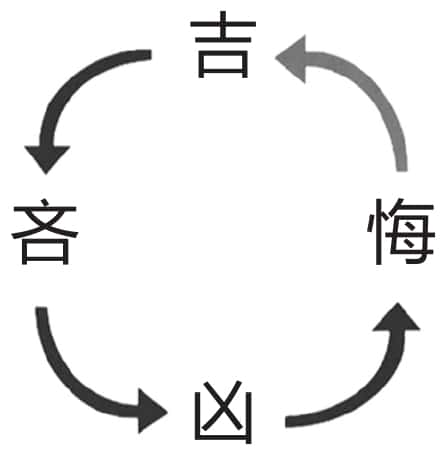
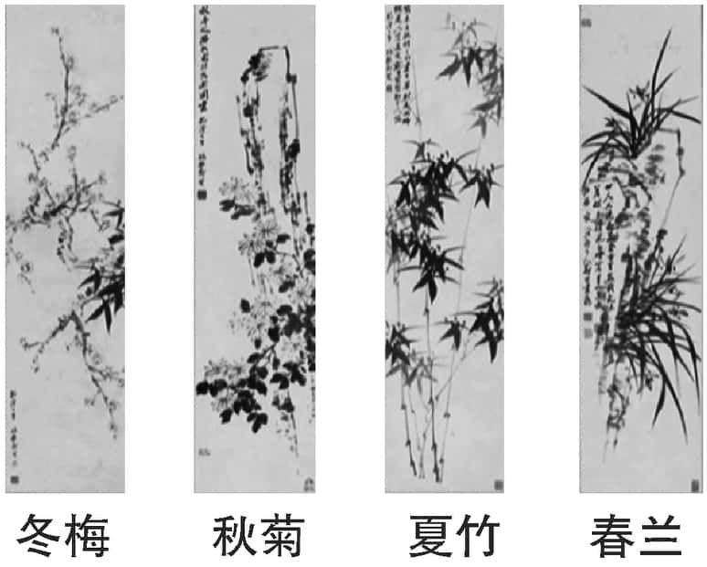
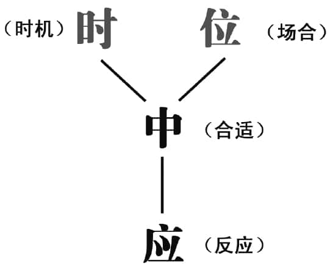
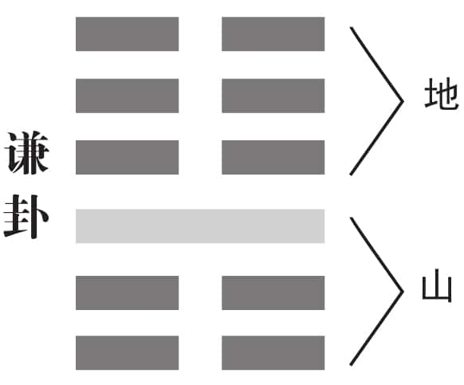

 *第十七集 超越吉凶*

《易经》的奥妙，就在于运用大自然的规律，贯通掌握人类社会的规律。大自然中月圆则缺，潮起潮落，而人类社会也同样存在着这种物极必反的规律。人生就是吉凶悔吝的循环往复，这个叫作无奈的必然律。那么我们应该怎样做，才能够跳出吉凶悔吝的必然律，立于不败之地呢？曾仕强教授告诉我们，六十四卦里面的一个谦卦就是让我们立于不败之地的。

人们常说福祸相依，有很多人热衷于算卦，就是希望能够预知未来，趋吉避凶。那么学习《易经》，是不是可以帮助人们趋吉避凶呢？曾仕强教授说：人有了理想，也就没有什么吉凶了。那么，我们又应该如何理解卦象的爻辞中所说的吉凶呢？

《易经》真的能够趋吉避凶吗？我们先要知道，什么叫作吉凶。吉凶跟利害是不一样的，我们讲惯了吉利，以为吉就是利，凶就是害，其实不是。《易经》里面所讲的吉凶的意思，是你如果按照《易经》的道理去做，那就是吉，因为你一定会有所得；你如果不按照《易经》的道理去做，那就是凶，因为即使你有所得，也一定守不住。

什么是有所得？即使生意亏本，也会有所得，因为亏了本，学到了经验，长进了，这对于自己的成长来讲就是有所得；被别人骗了，也会有所得，因为自己的品性变好了——本来他骗我，我就要骗他，现在他骗我，我也不骗他了，这不就是得吗？当然，这些行为都必须是依易理而行才可以。

如果不按照《易经》的道理去做，虽然可以获得很多的利益，但结局一定是凶的，因为那样的财产和所得根本就守不住。从这个角度我们才能够了解，什么叫作不义之财，什么叫合义之财，什么叫正当所得，什么叫不当所得，否则很难接受这种观念。

我们现在因为观念混淆，老觉得吉凶就是利害。假如真是如此，我们直接趋利避害就好了，为什么还要讲吉凶呢？利害其实是短暂的现象，得失才是比较长期的效果。

有两句话，我相信大家都听过：恩生于害，害生于恩。领导对你好，你就不长进了，放纵自己，养成很多坏习惯。相反的，领导一直督促你，对你很严苛，你就学到一身的功夫。利是害的来源，害才是利的基础。一个人如果能够按照《易经》的思维，把利跟害合在一起想，就会慢慢得到正确的观念。

一个人成功的时候，最怕的就是马上要失败。你成绩不那么好，别人不会追赶你，你成绩一好，所有人都追赶你，你就给自己带来很多压力。如果你这一次排名是冠军，你要知道有很多人都在默默地努力，发奋地学习，只有一个期望，就是想超过你。因此，我们千万要记住，做任何事都只问应该不应该，少问结果会怎么样。人生应该是享受过程，而不是计较结果。

做一件事情，先问问自己心里有没有理想，有了理想你就没有什么吉凶了，没有理想你就会有吉凶。如果这件事情是我一生一定要做的，那我不管失败成功都要做，不要再去考虑结果是吉还是凶。人一旦有了吉凶观念，就表示已经不是最高等的了，已经来到中等了。如果不敢说吉凶是自己在定，而是相信吉凶是命在定，那就更下一等了。

所以人分三种：一种人认为吉凶是命在定，这是最差的；一种人认为吉凶是自己在定，这还不错；一种人认为根本没有吉凶，做任何事只问应该不应该，如果应该，就算是死也很愉快。

明末的民族英雄史可法，面对强势来犯的清军，死守扬州城，他难道不能逃吗？以前的战争要逃跑非常简单，骑一匹快马，一会儿就逃得不见人影了。史可法可以逃而不逃，宁愿选择死，就是死得其所，死得其时。这是由人决定，不是由命决定的。可能大家又会说，既然不能扭转局势，我去跳楼好了，这就又错了。在中国的哲学里面，是不容许任何人自杀的。自杀就是对自己不负责任，就是对家人不负责任，就是对社会不负责任。从容就义跟自杀是两码事，因为义很重要。什么叫作义？义就是合理。合理的死，我什么都不怕；不合理的死，我宁可人家笑我贪生怕死，也没有什么不对。

很多人热衷于算卦，就是希望能够预知未来，趋吉避凶。但曾仕强教授指出，按照《易经》的道理，人生的最高境界是没有吉凶的。但是我们在卦辞里经常会看到吉字或者凶字，为什么曾教授却说《易经》是没有吉凶的呢？

自然是没有吉凶的。一朵花开了又谢了，它本身并没有好，也没有坏；一只兔子死了，没有凶；一只虫生了，也没有吉。这些都没有吉凶，吉凶是人才会产生的感觉。一只动物跟你很有感情，它死了，你会觉得很难过。一只动物跟你一点儿感情都没有，死就死了，你不会觉得怎么样。所以同样一只狗，为什么有人讨厌它，有人喜欢它？因为不同的人，对狗的感情不一样，不能一概而论。如果你看到一个人抱着一只狗，比跟他妈妈还亲，比对他爸爸还好，你也不要笑他，也不要生气，因为他是存心气他父母，迟早他会自作自受。我们每个人都要保持平常心，而平常心就是追求大家公认的、正常的、合理的东西。

在小事上，我们不要独立特行。要独立特行，一定要在大事上面。在小事上标新立异，只会让人家看不起你。现在有些年轻人一个耳朵上挂三四个环，让人看了觉得很奇怪。要知道，人只有耳垂这个地方是没有软骨的，老天爷就是让你在这里挂耳环的，其他地方通通有软骨，是不能伤害的。有的人嫌在耳垂上挂一个耳环不够，软骨上还要挂一个，鼻子上再来一个，那是自己残害自己。软骨一受伤，细菌一进去，很容易发炎。这是很简单的道理，没有什么难懂的。

我们曾经说过，人生不要有吉凶，不要一天到晚求大吉大利，我们要的是无咎。《易经》所说的无咎，就是说一个人会犯错，但是犯错后会改正补救，然后就无咎了。这个世界上哪个人会不犯错呢？你说你不犯错，那肯定是骗人。

《易经》里面列举了很多错，到最后都演化成无咎，是因为人知错后会去补救，不是单单去改而已，很多人只知道改改改，改有什么用？善于补救，才会使损害降低到最小，这是一个人该负的责任。

有时候夫妻吵架，丈夫学西方的方式说：“太太，我最爱你。”太太心里想，你讲过好几百次了。效果如何，可想而知。丈夫再学西方的方式道歉说：“太太，我对不起你。”太太心里想，这样对不起就算了？有没有别的表示？所以这种西式行为对中国人是没有效果的。夫妻吵架后最好的方式，是丈夫倒杯热茶给太太，什么话都不要讲，太太拿双拖鞋给丈夫，十分钟以后两个人就有说有笑了！

无咎，就是不后悔，也不找理由。《易经》里面经常出现两个字，一个叫悔，一个叫吝。悔是从心，就是一个人做错了事情后心里面真的想改过，而且会用实际行动来补过。吝是什么？吝是找理由说：我不是有意的，我实在是没有办法。“吝”字上面是个“文”，下面是个“口”，意思就是嘴巴找很多理由来掩饰过错，心里面却完全没有想要改过。

人在很顺的时候容易大意，讲话就随便了，然后就变成凶，这是人生的规律。因为你一放纵自己，就会在无意当中得罪很多人，这些被你得罪的人就会反扑，于是凶就来了。这时候你会怎么样？你有两种办法：一种是后悔——我真的对不起人家，无论如何都不应该那样刺激人家，然后勇敢地面对这种挑战，去化解当中的问题；另外一种是找理由——我骂他不对，可他也骂过我！他当年骂得比我凶多了，我现在骂他有什么不对？可此时你这些话通通都没有用了。

人生的悲剧就是吉、凶、悔、吝，这个叫作无奈的必然律，人从小到大都无法摆脱这个必然律，所以人的情绪会经常起起伏伏。那么，面对这个人生的必然律，我们又该怎么办呢？

《易经》的奥妙就在于运用大自然中的规律，来贯通掌握人类社会的规律。大自然中月圆则缺，潮起潮落，而人生的悲剧，也在吉凶悔吝中，无奈地重复着。那么，是否有什么办法，能够跳出这种无奈的重复呢？

答案太简单了，一点儿也不难。我们首先要知道：吉生吝，吝生凶，凶生悔，悔生吉（见图17-1）。当一个人很顺利的时候，他就开始吝啬，能帮忙的也不愿意帮忙。我们细心观察一下周围的人就会发现，凡是穷人大都乐意帮助别人，很大方，而有钱人多半不太乐意帮别人，很吝啬，这是非常奇怪的事情。有人解释说：反正穷人没有钱，就是通通给别人也没有多少；有钱人则会想，我有这么多，给你还得了？这种解释我也不反对，因为现实就是这样，有钱人很吝啬，没钱的人反而很大方。但是我要说的是，如果有钱人能够不吝啬，穷的人能够合理节省的话，那么整个世界就改观了。这就叫反之道。说得再清楚一些，《易经》中的爻辞，告诉你这样做的同时，就是告诉你如果不照这样做，你还有另外一条路走。《易经》是有选择的，当它说这样会吉的时候，就在告诉你，你如果不这样，则一定凶；当它说这样会凶的时候，你就知道反其道而行之就会吉。所以一切都是你自己在决定，不是所谓的命在决定。

图17-1

我们中国很多家庭会在客厅中挂上四君子的国画（见图17-2）：春兰、夏竹、秋菊、冬梅，但是我相信很多人搞不清楚为什么挂这四君子。按照自然的规律，梅兰竹菊四君子不可能同时存在，因为它们生长在四个不同的季节里，春天兰花朵朵开，夏天竹影幽幽然，秋天菊花风中立，冬天梅花傲雪寒。但是我们却把它们挂在一起，为什么？这就是告诉人们，要学会超越时空，把不可能在一起的事物整合在一起，从而做到兼顾并重。有钱的时候，要想到万一穷的时候怎么办；没有钱的时候，要想到万一富的时候如何应对。如果没有钱就觉得自己都穷到底了，没有什么可怕的，就开始偷人家东西，将来万一有钱了，人家把这些丑事揭发出来，不是很难看吗？

图17-2

我们要记住，一切都要兼顾，想想自己，更想想别人，想想大的，也想想小的。事业重要，家庭也要兼顾，不能为了一个而牺牲另外一个，将来想补救都来不及。中国传统思想一方面告诉我们，时间就像流水一样，过去就过去了，所以春、夏、秋、冬是不可能同时出现；另一方面也告诉我们，如果要让处于四季的不同事物同时出现，就得在春天时，想到夏天该怎么过，处于秋天，要想到冬天到了怎么办。

全世界只有我们中国人，当一个小孩儿出生的时候，父母就开始讨论将来要不要让他读北大。这一点，外国人永远不能认同，他们认为想那么早干什么？可我们想的是，要想将来读北大，从现在就要开始做准备。甚至有人会说，生下来再想就已经晚了，我胎教时就开始了，怀着小孩儿时就唱北大校歌给他听。我们中国人考虑事情是非常长远的。

可能有人会觉得这很迷信，其实不是的。我们以前一直认为草木无情，现在我们已经知道草木也会听音乐，也有感觉，只是没有人那么灵敏而已。新买一辆汽车，如果你特别爱护它，它的性能就保持得好，寿命就长；假如你不把它当回事，它很快就折旧报废了。我们过去只讲人与人心灵相通，现在科学都已经证明了，人跟万物也都可以相通。这从另一个角度证明，我们中国人“天人合一”的思想是非常有道理的。

尽管人生的最高境界是超越吉凶，但是对于大部分普通人来说，还是希望能够趋吉避凶，所以中国人考虑事情比较长远。俗话说，出远门的时候，一定要饱带干粮暖带衣，就是说不能只看眼前，而要防患于未然。那么学习《易经》，是不是可以帮助我们趋吉避凶呢？

什么叫趋吉避凶？一句话就讲清楚了，就是要从吉凶悔吝这个人生必然律里面挣脱出来。那么，怎么才能挣脱人生的必然律呢？答案很简单，只要能后悔在先，不要后悔在后，就完全可以趋吉避凶。

做任何一件事之前都要想事情的后果可能怎么样，出现这种后果我后悔吗？如果事先不想，万事都先做了再说，到时候再后悔就晚了，因为凶已经出现了。如何才能让凶永远不出现呢？中国人有一句老话，叫作立于不败之地。一个人能够立于不败之地，当然就没有凶了。可是，我们会发现，这样也没有吉了，因为人生本来就是要超越吉凶的。

我们把预先考虑事情后果叫作具有忧患意识，这绝不是自寻烦恼。自寻烦恼是无事生非，而具有忧患意识则是未雨绸缪，二者是完全不一样的。

小孩子长到差不多了就要给他灌输男生女生的观念，做父母的要及时给他一些辅导。比如，我家老大是女儿，我女儿读完大学以后，要去美国留学，我送她到机场，什么话都不说，只讲一句话：你不可以嫁给外国人。这就叫作讲重点。你讲一大堆有什么用？你讲一大堆，她都忘光了。就讲一句重点的话，其他都不要讲。有没有效？当然有效了。

大家会不会觉得我这个人观念很狭隘？我并不反对我们中国的女性同胞嫁给外国人，我只反对我女儿，其他人爱怎么做就怎么做，只要出去以后不要忘记我们的中华文化就好。很多事情是自己在控制，不是命在控制。命怎么控制？多少女孩到国外留学，嫁给外国人，会说是命或环境造成的，我不相信这些东西。

我的孙子在美国一出生，我二话不说，只讲一句话，在家不许说英语。谁叫你是中国人呢？生为中国人，死为中国鬼。一出生就要讲中国话，少来那套。有没有效？绝对有效。比如，他进幼儿园的时候，幼儿园老师拿了个杯子告诉他“cup”，我那个小孙子就说“杯子”，老师觉得很奇怪，因为不管怎么教，我的小孙子都坚持说“杯子”。最后弄得老师找我的儿子说：“是我教他英语，还是他教我中文？”

这才是堂堂中国人，哪能出去就忘根，忘了自己祖宗叫什么的。我们的命脉是在文字上，每个文字都有象数理，每个文字都是一个太极。它是有生命的，它绝对是活的。

吉悔常用的时候，吝凶就可以减免，这是我们的法则。吉跟悔是联系在一起的，当我们顺利的时候，先不要高兴，应该想到自己这样顺利，会不小心得罪很多人，然后就倍加小心，这样可以避免很多麻烦。如果你赚了钱一回到老家，就把新房子高高地盖起来，你就得罪左右邻居了。因为你让邻居们都没有面子：你有钱了是不是？你可以盖高楼是不是？你笑话我们是不是？你欺负我们是不是？如果邻居们有这样的想法，自己迟早要吃苦头。

以前中国人赚了钱回家也要盖高楼，但是有一个过程，不会什么都不顾，自己想盖就盖，而是首先请左右邻居吃饭。中国人的传统思维是，别人一请他吃饭，他就开始想：为什么请我吃饭呢？想来想去大家就有数了，知道你这是为了自己家要盖大房子。喝酒吃饭的时候，主人一句盖房子的话都不讲，而是问左邻右舍：“您最近怎么样？小孩儿怎么样？”绝不讲自己的事情。这时候一定会有人说：“你赚了钱了，应该把房子重新装修一下，而且你家人口多了，平房不够，最少得盖三层楼。”主人一定说：“不行不行，万万不可，我们这么久的邻居，要同甘共苦。”马上会有人说：“你不能这样啊，事情有个先后，你先盖起来，我们再学你的样子，不也很好吗？你客气什么？”主人此时会更推辞说：“不行不行，你们的好意我领了，但是我做人不可以这样。”马上又有人会敬他酒：“我们全村就靠你争气了，你再不盖高楼的话，我们全村都没有面子。”“好，为了全村我就盖！”主人这时候就不能再推辞了。这样沟通下来，发财的人会得罪谁呢？今天我们大部分人就是不懂这一套，把所有人都得罪光了。要记住，你尊重别人，别人自然尊重你。

《易经》告诉我们，只要小心翼翼，按部就班，一辈子都不会败。

《易经》告诉我们，要想趋吉避凶，就要跳出吉凶悔吝的必然律，做到后悔在先。当我们取得成就的时候，就要想到，不能得意忘形，要尊重别人。当我们获得财富的时候，就要想到，不能丢掉勤俭的好传统，要尽力去帮助别人。那么，除了这些以外，还有什么要注意的呢？

有没有更具体的办法呢？《易经》就讲四个字：时、位、中、应（见图17-3）。要想在言行上挣脱这个人生必然律，就要把凶跟吝、悔都去掉，所以我们必须从现在开始养成习惯，讲话之前先想想时机对不对，这个时候讲这句话合不合适。

图17-3

现在很多广播都没有注意这类问题，在大家午餐的时候，广播说哪里有多少死牛死羊，那是很不人道的。我们该怎么办？不看就好了。可是现在很多人照看不误，一吃饭就把电视打开，然后胃坏了，肠子也坏了，吃了半天不知道吃什么。这说到底是跟自己过不去。我去餐厅，第一件事就是让服务员把电视关掉。我们要专心吃饭，不能虐待自己的肠胃。老实讲，我吃奇怪的东西前，还要跟自己的肠胃商量：这个东西我以前没有吃过，今天第一次吃，你好好准备一下。

要知道，我们身上有一套完整的防御系统，我们吃家常食物的时候，肠胃知道这是经常吃的食物，会很快接受，并想办法去消化了。我们吃奇怪的食物时，这套系统不知道吃进去的是什么，于是全体动员将食物排解掉，我们吃了白吃，还死伤了很多血球，得不偿失。我们从来没有认真照顾过自己的五腑六脏，认为它们就应该接受你给的一切，所以它们会抗议，一会儿胃痛，一会儿肠子紧缩，这就是告诉你要知道它们的存在，如果你再不注意，还会有别的毛病出现，比如头痛、掉头发等。这是身体在向我们发出警告，提醒我们不要一天到晚看外面的事情，应该好好照顾一下自己。虽然很多人说要爱护自己，其实人对自己是最残忍的，该睡觉时不睡觉，吃饭时不吃七分饱，一定要吃十分饱，然后一直说肚皮撑，谁撑的？都是自己撑的。

人的一言一行都要分身份、时间、地点和场合。有一个很好的例子，孔子只要当天参加过丧礼，他那天绝对不会唱歌。如果场合不对，身份不对，时机不对，再好的话也不能讲，如果硬要去做的话，就会不合时宜，从而留下一大堆后遗症。

一个人若能做到时时刻刻谨慎，不乱说一句话，不乱做一件事，即使会有难，也可以避免掉，就能挣脱那个必然律，立于不败之地。这些完全是自己可以做主的，跟命一点儿关系都没有，为什么老是一天到晚依靠命运呢？

人跟动物有什么不同？就是两个字而已——体面，人要体面而动物没有体面。同样是吃东西，人要吃得体面一点儿，不是说要奢侈，而是说吃饭得像个吃饭的样子。穿衣服是为了体面，适合自己的身份最重要，不是为了穿名牌。所以安分守己，就是说话做事都符合自己的身份。当然，我们也不能狭隘地理解体面，把它当作一种负担。在这个场合该怎么做就怎么做，至于别人怎么想那是别人的事，因为任何人都不可能顾虑到所有人。顺了张三就逆了李四，如果整天为这个摇摆不定，那就苦恼死了。盲目竞争，而不知目标在哪里，说得不好听，就是每个人都削尖了头想赚钱，那样的人生还有什么价值，还有什么意义？

《易经》就是被商业操作湮没掉的。一听说别人学过《易经》，马上过去找他算卦。学《易经》就一定要算卦吗？这是对《易经》最大的误解。我们应该明白，《易经》讲的是一套道理，是把人生的密码整个解开，碰到不同的卦，可以有不同的因应。永远合乎易理，才能立于不败之地，六十四卦里面只有一个谦卦是教我们立于不败之地的。

在《易经》的六十四个卦中，六十三个卦里的爻辞，都是有吉有凶的，只有一个谦卦，所有的爻辞全都是吉，没有凶，所以按照谦卦去做，不仅可以趋吉避凶，而且可以超越吉凶，永远立于不败之地。那么谦卦是一个什么样的卦？又能给我们的人生带来什么重要的启示呢？

谦卦下面是山，上面是地，叫作地山谦（见图17-4）。山明明在地上，为什么要躲到地底下去？我们现代人要了解这个太容易了，山高高在上，推土机一来，很容易就把地上面的山给整个铲平了。当山躲到地下面去，就是开十部推土机来都推不倒它。

图17-4

谦卦第一爻，它的密码是两个字，叫作谦谦。我相信大家对此比较熟悉，因为我们常说谦谦君子。什么叫谦谦？有人可能会说谦谦就是谦了又谦，其实不是那么简单的。谦谦的意思是，谦有两个层次，下面是艮谦，上面是坤谦。一个人能够做到艮谦就已经不得了了，真要做到了坤谦，那就是圣贤了。从卦象看，下面的山和上面的地把人限制住，所以人还要时时刻刻限制自己，约束自己，因为你功夫还不够。哪一天什么限制都没有了，但是你还是不会违反，那就叫坤谦。人一辈子能够做到艮谦已经了不起了，进入坤谦的人少之又少，但是我们一定要知道还有那个境界在。孔子是进入到坤谦了的，他是“从心所欲”，但是“不逾矩”。他没有说要用艮来约束自己，因为他根本不需要。爱怎么做就怎么做，但永远都不会违反规矩，这个境界就叫作坤谦。

第二爻是鸣谦。就是当你表现得很谦虚，工作也做得很好时，有人就开始赞美你，说你不但勤劳、有责任感，还很有能力，做人也很谦虚。这时候你要小心了，这些话很容易把人害死。如果你真听信了这些，觉得自己就是跟别人不一样，领导就应该对你另眼看待，应该特殊提拔你才对，那你就不会再有什么发展了。要记住，工作好是你的本分，不需要人家给你激励。如果你是为了激励而这样做，你的心就已经不正了，就是有贪图了。工作做得好，人家一定会赞美，但你不要受这个影响。受到表扬而没有什么表示，说明这个人修养难得。凡是得到奖就高兴得不得了的，那就表示他这辈子只能拿这个小奖了，大奖他根本承受不了。小奖就已经要发疯了，大奖不是要把他搞死掉了？

艮的顶端是第三爻，是山的顶端，叫作劳谦。劳谦就是一个人有贡献，有和别人很不一样的表现，却还是很谦虚，这个人就很了不起。没有贡献而谦，不值得我们去表扬；有了很大的功劳还说“托天之福、谢天谢地”，这不是虚伪，而是体现了谦卦的精神。如果你说是老天帮忙，没有人会不高兴；可是你说这是自己玩命努力的成果，会有多少人从心里服你？现在很多人喜欢讲“这是我个人的创见，是我自己奋发有为的结果”，这些话真的没有人喜欢听。

第四爻是挥谦，此时已经从艮谦进入到坤谦了。挥是发挥的意思，就是要对上谦也要对下谦。老实讲，对上谦比较容易，对下谦比较难。如果一个主管老是在部属面前表示自己能干，这个人是没有太大作为的。就算是因为比别人能干才当的主管，如果以此炫耀的话也是很不合身份的。当了主管而能够礼贤下士，能够爱护年轻人，能够多多指导年轻人，能够把表现的机会让给年轻人，这才了不起，就是做到了挥谦。不仅仅要自己谦虚，要带动大家都发扬挥谦的美德。

第五爻是护谦。到了六五爻，就表示这个人是整个组织的头目，他要护谦，要维护谦的风气，不能自己率先败坏。如果一个人当到总经理时就开始讲本公司如何如何了不起，五年以后要怎么样不得了，就把谦卦破坏掉了。可惜我们现在大多数人都是这样做的。

最上面的上六爻跟第二爻一样，都是鸣谦，但这两爻位置不一样，解释也就大不一样。一个人到了这个位置的时候要记住，如果五是老大的话，最上面就是大佬。好不容易有了声望，人家把你当大佬，就要记住，只要谁不谦虚，你就可以骂他：这么不谦虚，人家给你面子，你还以为你真的能干？只有大佬讲这种话才合适。老大不能随便得罪人，大佬就必须去动手修理那些不谦虚的人，以这种方式来帮助老大，才能够把谦虚的风气维持住。

孔子一生最大的贡献，就是把《易经》整理出来，把《易经》从一本用来占卜的书，提高为宣扬哲理的书。而这种哲理是完全可以在日常生活当中真正实践的。因此，我们下一次要讲：孔子为什么赞易。

