# 附录

# 附录一
****六十四卦精解**

《易经》把宇宙所有事情划分为六十四种情境，就是六十四卦。当你卜到某一个卦时，就可以参考六十四卦精解，有所警惕，然后趋吉避凶……

### 第一卦　【乾为天】

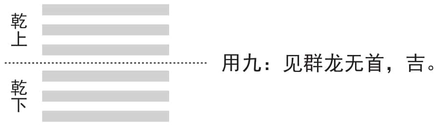

【乾卦】卦辞：乾，元、亨、利、贞。卦辞精解：万物资始，自强不息。

【初九】爻辞：潜龙勿用。初九精解：尚未成熟，无能作为。

【九二】爻辞：见龙在田，利见大人。九二精解：有贤才者，宜见权势。

【九三】爻辞：君子终日乾乾，夕惕若厉，无咎。九三精解：自强不息，随时警惕。

【九四】爻辞：或跃在渊，无咎。九四精解：进退谨慎，不生差错。

【九五】爻辞：飞龙在天，利见大人。九五精解：有权势者，宜见贤才。

【上九】爻辞：亢龙有悔。上九精解：居高而亢，必将懊悔。

### 第二卦　【坤为地】

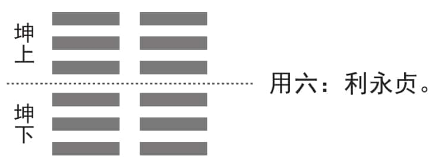

【坤卦】卦辞：坤，元亨，利牝马之贞。君子有攸往，先迷，后得主，利。西南得朋，东北丧朋。安贞吉。卦辞精解：深厚素养，负载万物。

【初六】爻辞：履霜坚冰至。初六精解：履霜坚冰，防患未然。

【六二】爻辞：直方大，不习，无不利。六二精解：恢宏伟大，纯属自然。

【六三】爻辞：含章可贞，或从王事，无成有终。六三精解：内含华美，正固自守。

【六四】爻辞：括囊，无咎无誉。六四精解：保守秘密，谨慎无害。

【六五】爻辞：黄裳元吉。六五精解：居高谦和，大为得计。

【上六】爻辞：龙战于野，其血玄黄。上六精解：进逼君子，不服领导。

### 第三卦　【水雷屯】

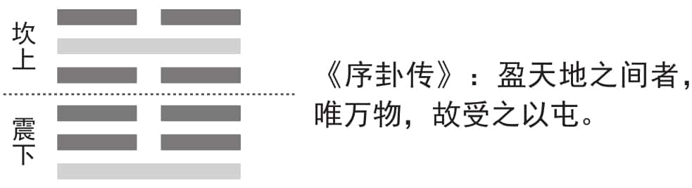

【屯卦】卦辞：屯，元、亨、利、贞。勿用有攸往，利建侯。卦辞精解：险难行动，深谋远虑。

【初九】爻辞：磐桓，利居贞，利建侯。初九精解：徘徊难进，宜居于正。

【六二】爻辞：屯如邅如，乘马班如。匪寇，婚媾。女子贞不字，十年乃字。六二精解：难进而返，疑遇寇盗。

【六三】爻辞：即鹿无虞，惟入于林中。君子几，不如舍，往吝。六三精解：见微知著，不可独往。

【六四】爻辞：乘马班如，求婚媾，往吉，无不利。六四精解：下求贤才，共济时艰。

【九五】爻辞：屯其膏，小，贞吉；大，贞凶。九五精解：积聚恩泽，君子失策。

【上六】爻辞：乘马班如，泣血涟如。上六精解：环境艰难，急速返回。

### 第四卦　【山水蒙】

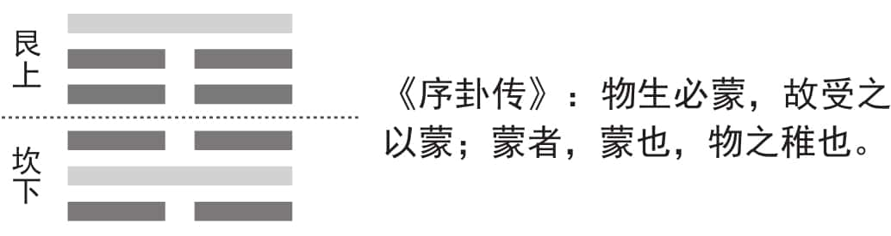

【蒙卦】卦辞：蒙，亨。匪我求童蒙，童蒙求我。初筮告，再三渎，渎则不告。利贞。卦辞精解：果断力行，培育素养。

【初六】爻辞：发蒙，利用刑人，用说桎梏，以往吝。初六精解：启发蒙昧，宜用严师。

【九二】爻辞：包蒙，吉。纳妇，吉。子克家。九二精解：包容蒙昧，贤者治国。

【六三】爻辞：勿用取女。见金夫，不有躬，无攸利。六三精解：见异思迁，教育无益。

【六四】爻辞：困蒙，吝。六四精解：困于蒙昧，未受教育。

【六五】爻辞：童蒙，吉。六五精解：童子蒙昧，易于施教。

【上九】爻辞：击蒙，不利为寇，利御寇。上九精解：惩治蒙昧，注意教法。

### 第五卦　【水天需】

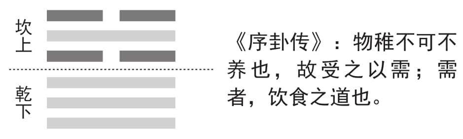

【需卦】卦辞：需，有孚，光亨，贞吉，利涉大川。卦辞精解：饮食宴乐，以待时机。

【初九】爻辞：需于郊，利用恒，无咎。初九精解：栖身山林，持之以恒。

【九二】爻辞：需于沙，小有言，终吉。九二精解：可进可退，不计闲言。

【九三】爻辞：需于泥，致寇至。九三精解：已临险境，敬慎处之。

【六四】爻辞：需于血，出自穴。六四精解：深陷险地，仍能脱出。

【九五】爻辞：需于酒食，贞吉。九五精解：安于生活，守正得计。

【上六】爻辞：入于穴，有不速之客三人来，敬之，终吉。上六精解：进入险境，以敬待客。

### 第六卦　【天水讼】

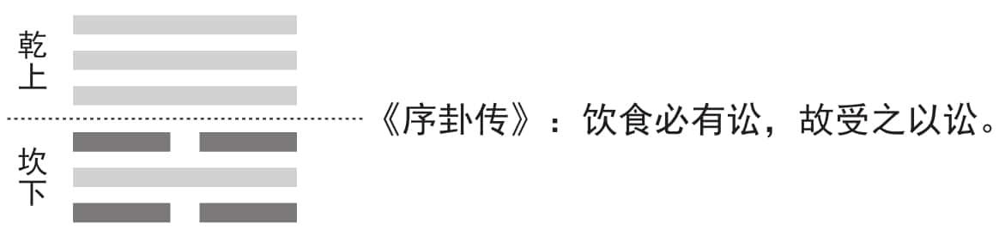

【讼卦】卦辞：讼，有孚窒，惕，中吉；终凶。利见大人，不利涉大川。卦辞精解：争讼刚险，谋虑于始。

【初六】爻辞：不永所事，小有言，终吉。初六精解：言辞之争，不久可止。

【九二】爻辞：不克讼，归而逋，其邑人三百户，无眚。九二精解：争讼不胜，归隐以避。

【六三】爻辞：食旧德，贞厉，终吉。或从王事，无成。六三精解：容忍旧恶，不与争讼。

【九四】爻辞：不克讼，复即命，渝，安贞吉。九四精解：争讼不胜，宜安于正。

【九五】爻辞：讼，元吉。九五精解：争讼得计，由于中正。

【上九】爻辞：或锡之鞶带，终朝三褫之。上九精解：争讼虽胜，不足尊敬。

### 第七卦　【地水师】

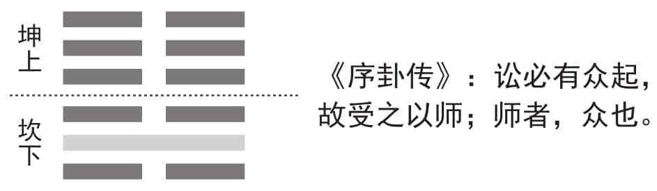

【师卦】卦辞：师，贞，丈人吉，无咎。卦辞精解：包容人民，蓄养群众。

【初六】爻辞：师出以律，否臧凶。初六精解：出兵依律，不善则凶。

【九二】爻辞：在师，中吉，无咎。王三锡命。九二精解：恩威并用，得王信赖。

【六三】爻辞：师或舆尸，凶。六三精解：作战用人，要专要当。

【六四】爻辞：师左次，无咎。六四精解：作战胜败，兵家常事。

【六五】爻辞：田有禽，利执；言，无咎。长子帅师；弟子舆尸。贞凶。六五精解：敌人来侵，贤才统兵。

【上六】爻辞：大君有命，开国承家，小人勿用。上六精解：封国立家，不用小人。

### 第八卦　【水地比】

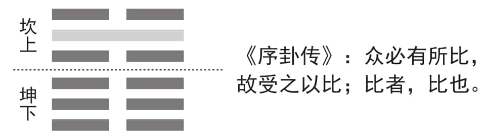

【比卦】卦辞：比，吉。原筮，元永贞，无咎。不宁方来，后夫凶。卦辞精解：在下顺从，上下相应。

【初六】爻辞：有孚比之，无咎。有孚盈缶，终来有它吉。初六精解：与人亲辅，充满诚信。

【六二】爻辞：比之自内，贞吉。六二精解：诚心亲辅，正而得计。

【六三】爻辞：比之匪人。六三精解：亲辅坏人，悲伤失策。

【六四】爻辞：外比之，贞吉。六四精解：亲辅贤人，正而得计。

【九五】爻辞：显比，王用三驱，失前禽，邑人不诫，吉。九五精解：光大亲辅，施爱于人。

【上六】爻辞：比之无首，凶。上六精解：无始无终，亲辅失策。

### 第九卦　【风天小畜】

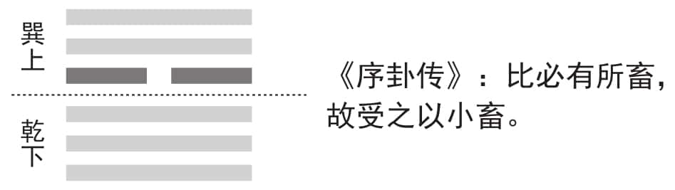

【小畜卦】卦辞：小畜，亨。密云不雨，自我西郊。卦辞精解：稍有畜积，尚不能用。

【初九】爻辞：复自道，何其咎？吉。初九精解：自复畜道，无咎得计。

【九二】爻辞：牵复，吉。九二精解：同复畜道，不自有失。

【九三】爻辞：舆说辐，夫妻反目。九三精解：刚而不进，受制于柔。

【六四】爻辞：有孚，血去惕出，无咎。六四精解：畜养诚信，无害无忧。

【九五】爻辞：有孚挛如，富以其邻。九五精解：诚信及人，财富共享。

【上九】爻辞：既雨既处，尚德载。妇贞厉，月几望。君子征凶。上九精解：物质畜积，过丰危险。

### 第十卦　【天泽履】

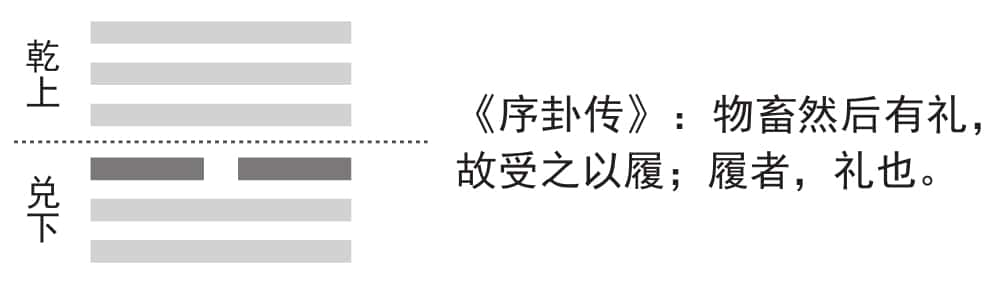

【履卦】卦辞：履，履虎尾，不咥人，亨。卦辞精解：分辨上下，安定民心。

【初九】爻辞：素履，往无咎。初九精解：不受干扰，独行己愿。

【九二】爻辞：履道坦坦，幽人贞吉。九二精解：幽独之人，道路平阔。

【六三】爻辞：眇能视，跛能履，履虎尾，咥人，凶。武人为于大君。六三精解：见解不明，有害于人。

【九四】爻辞：履虎尾，愬愬，终吉。九四精解：实践戒惧，终必得计。

【九五】爻辞：夬履，贞厉。九五精解：刚愎自用，虽正而危。

【上九】爻辞：视履考祥，其旋元吉。上九精解：审查实践，考核得失。

### 第十一卦　【地天泰】

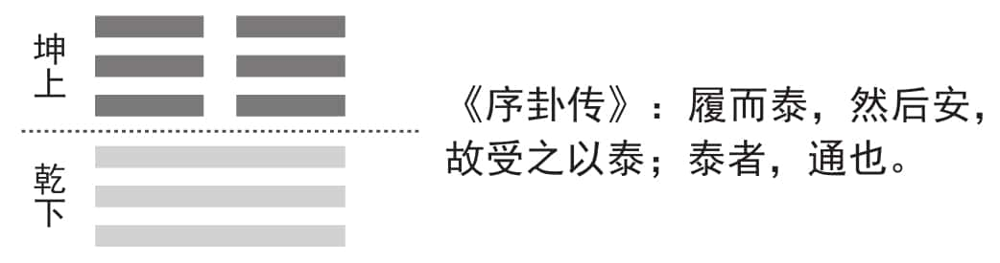

【泰卦】卦辞：泰，小往大来，吉亨。卦辞精解：内健外顺，上下一体。

【初九】爻辞：拔茅茹，以其汇，征吉。初九精解：同类仕进，以行其道。

【九二】爻辞：包荒，用冯河，不遐遗。朋亡，得尚于中行。九二精解：不远失君，舍弃暱友。

【九三】爻辞：无平不陂，无往不复，艰贞无咎。勿恤其孚，于食有福。九三精解：盛极必衰，不可置疑。

【六四】爻辞：翩翩，不富以其邻，不戒以孚。六四精解：不富得邻，不诚得信。

【六五】爻辞：帝乙归妹，以祉元吉。六五精解：贤明帝王，嫁女幸福。

【上六】爻辞：城复于隍，勿用师。自邑告命，贞吝。上六精解：泰极否来，不可用兵。

### 第十二卦　【天地否】

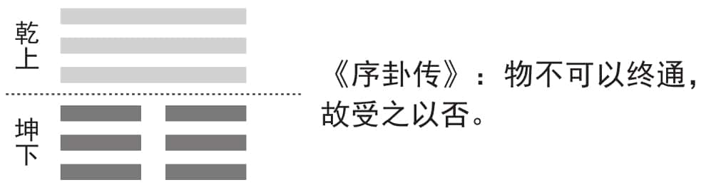

【否卦】卦辞：否之匪人，不利君子贞，大往小来。卦辞精解：上下闭塞，必须守正。

【初六】爻辞：拔茅茹，以其汇，贞吉，亨。初六精解：小人同类，顺从君子。

【六二】爻辞：包承，小人吉，大人否，亨。六二精解：包容承顺，大人不可。

【六三】爻辞：包羞。六三精解：包容小人，是可羞耻。

【九四】爻辞：有命无咎，畴离祉。九四精解：承受上命，共事明主。

【九五】爻辞：休否，大人吉，其亡其亡，系于苞桑。九五精解：逆运虽已，仍宜戒惧。

【上九】爻辞：倾否，先否后喜。上九精解：逆运终止，后有喜悦。

### 第十三卦　【天火同人】

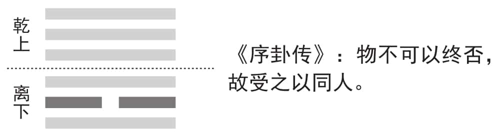

【同人卦】卦辞：同人于野，亨，利涉大川，利君子贞。卦辞精解：正道合群，能解困难。

【初九】爻辞：同人于门，无咎。初九精解：合群无私，没有差错。

【六二】爻辞：同人于宗，吝。六二精解：合群狭隘，令人惋惜。

【九三】爻辞：伏戎于莽，升其高陵，三岁不兴。九三精解：伏藏兵戎，绝不合群。

【九四】爻辞：乘其墉，弗克攻，吉。九四精解：意欲攻击，更不合群。

【九五】爻辞：同人，先号咷而后笑，大师克，相遇。九五精解：合群不易，要经奋斗。

【上九】爻辞：同人于郊，无悔。上九精解：合群广远，无可懊悔。

### 第十四卦　【火天大有】

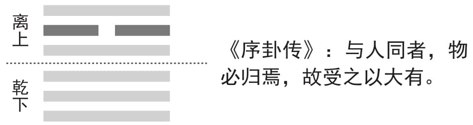

【大有卦】卦辞：大有，元亨。卦辞精解：遏恶扬善，顺天应命。

【初九】爻辞：无交害，匪咎，艰则无咎。初九精解：尚无伤害，艰难警惕。

【九二】爻辞：大车以载，有攸往，无咎。九二精解：能有为者，促进丰盛。

【九三】爻辞：公用亨于天子，小人弗克。九三精解：有才德者，享受富贵。

【九四】爻辞：匪其彭，无咎。九四精解：丰盛不极，没有差错。

【六五】爻辞：厥孚交如，威如，吉。六五精解：诚信交往，应有威严。

【上九】爻辞：自天佑之，吉无不利。上九精解：上天保佑，极为得计。

### 第十五卦　【地山谦】

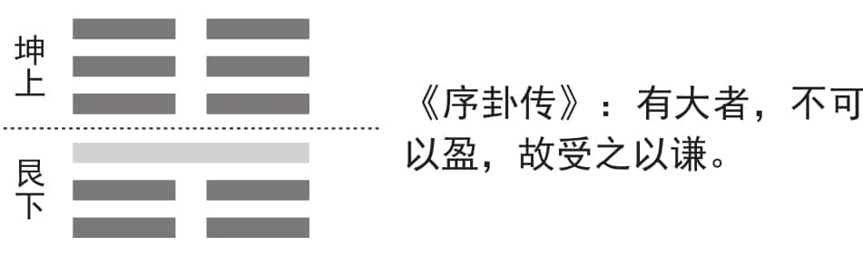

【谦卦】卦辞：谦，亨。君子有终。卦辞精解：减多益寡，自能受益。

【初六】爻辞：谦谦君子，用涉大川，吉。初六精解：德谦君子，克服困难。

【六二】爻辞：鸣谦，贞吉。六二精解：著称的谦，正而得计。

【九三】爻辞：劳谦，君子有终，吉。九三精解：有功的谦，终能受益。

【六四】爻辞：无不利，撝谦。六四精解：发挥谦德，没有不利。

【六五】爻辞：不富以其邻，利用侵伐，无不利。六五精解：谦德极盛，要施威武。

【上六】爻辞：鸣谦，利用行师，征邑国。上六精解：过分卑逊，仅治小事。

### 第十六卦　【雷地豫】

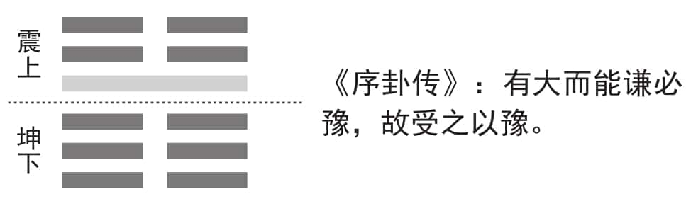

【豫卦】卦辞：豫，利建侯行师。卦辞精解：顺理行动，众人服从。

【初六】爻辞：鸣豫，凶。初六精解：自鸣得意，和乐失策。

【六二】爻辞：介于石，不终日，贞吉。六二精解：和乐逢迎，必将后悔。

【六三】爻辞：盱豫，悔。迟，有悔。六三精解：操守坚定，不溺于乐。

【九四】爻辞：由豫，大有得。勿疑，朋盍簪。九四精解：和乐有自，大有获得。

【六五】爻辞：贞疾，恒不死。六五精解：乐不忘忧，常能存在。

【上六】爻辞：冥豫成，有渝，无咎。上六精解：和乐至极，必将生悲。

### 第十七卦　【泽雷随】

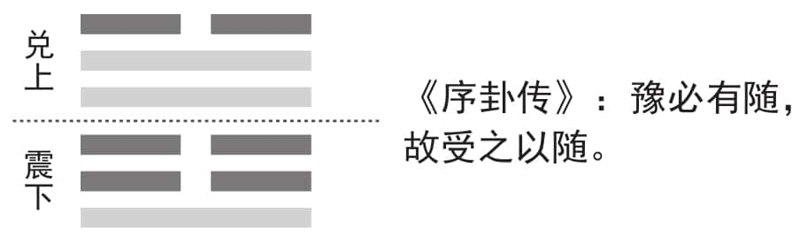

【随卦】卦辞：随，元亨利贞，无咎。卦辞精解：随从卑下，必须守正。

【初九】爻辞：官有渝，贞吉。出门交有功。初九精解：主管变动，无私交往。

【六二】爻辞：系小子，失丈夫。六二精解：接近小人，随从不当。

【六三】爻辞：系丈夫，失小子。随有求，得，利居贞。六三精解：接近君子，随从要正。

【九四】爻辞：随有获，贞凶。有孚在道以明，何咎？九四精解：诚信有道，随从有得。

【九五】爻辞：孚于嘉，吉。九五精解：诚信于心，随至嘉美。

【上六】爻辞：拘系之，乃从维之，王用享于西山。上六精解：用竭诚心，求人相随。

### 第十八卦　【山风蛊】

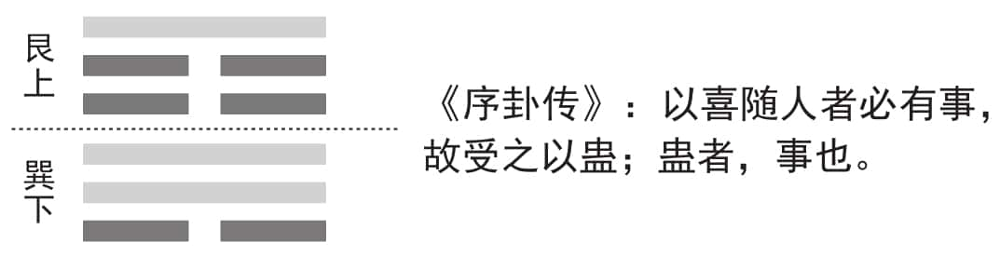

【蛊卦】卦辞：蛊，元亨，利涉大川。先甲三日，后甲三日。卦辞精解：败坏之后，必有整饬。

【初六】爻辞：干父之蛊，有子，考无咎，厉终吉。初六精解：整饬精神，要用新人。

【九二】爻辞：干母之蛊，不可贞。九二精解：整饬物质，不可固执。

【九三】爻辞：干父之蛊，小有悔，无大咎。九三精解：整饬精神，稍有懊悔。

【六四】爻辞：裕父之蛊，往见吝。六四精解：宽容精神，将有惋惜。

【六五】爻辞：干父之蛊，用誉。六五精解：整饬精神，用人得誉。

【上九】爻辞：不事王侯，高尚其事。上九精解：没有败坏，不需整饬。

### 第十九卦　【地泽临】

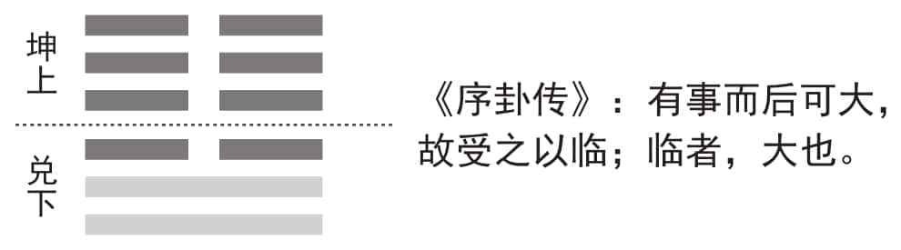

【临卦】卦辞：临，元亨利贞，至于八月有凶。卦辞精解：礼贤下士，及时而为。

【初九】爻辞：咸临，贞吉。初九精解：感应临近，正而得计。

【九二】爻辞：咸临，吉，无不利。九二精解：感应临近，得计有利。

【六三】爻辞：甘临，无攸利。既忧之，无咎。六三精解：甜言谄媚，临近无益。

【六四】爻辞：至临，无咎。六四精解：亲切临近，没有差错。

【六五】爻辞：知临，大君之宜，吉。六五精解：明智临近，大君所宜。

【上六】爻辞：敦临，吉，无咎。上六精解：敦厚临近，得计无咎。

### 第二十卦　【风地观】

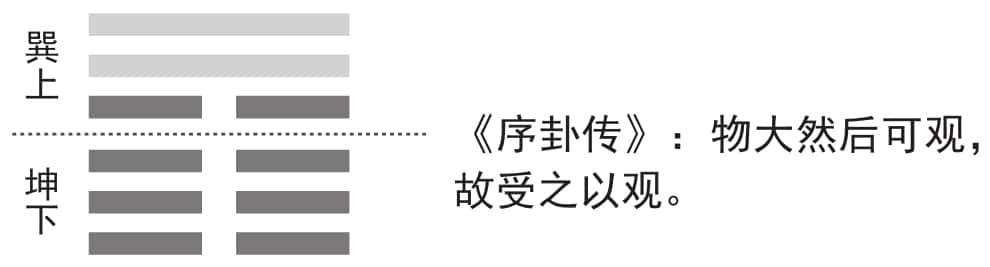

【观卦】卦辞：观，盥而不荐，有孚，颙若。卦辞精解：观察民情，创立教化。

【初六】爻辞：童观，小人无咎，君子吝。初六精解：观察幼稚，君子不为。

【六二】爻辞：窥观，利女贞。六二精解：由门偷看，女子正道。

【六三】爻辞：观我生，进退。六三精解：自身反省，以凭进退。

【六四】爻辞：观国之光，利用宾于王。六四精解：观国之光，以求仕进。

【九五】爻辞：观我生，君子无咎。九五精解：自己反省，始为君子。

【上九】爻辞：观其生，君子无咎。上九精解：旁观他人，始为君子。

### 第二十一卦　【火雷噬嗑】

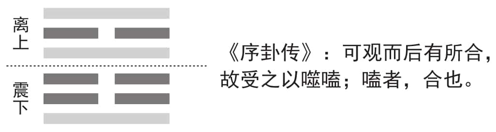

【噬嗑卦】卦辞：噬嗑，亨。利用狱。卦辞精解：明定刑罚，宣布法令。

【初九】爻辞：屦校灭趾，无咎。初九精解：足部刑具，惩治小罪。

【六二】爻辞：噬肤，灭鼻，无咎。六二精解：头部刑具，惩治大罪。

【六三】爻辞：噬腊肉，遇毒，小吝，无咎。六三精解：惩治强悍，反受其害。

【九四】爻辞：噬干胏，得金矢，利艰贞，吉。九四精解：惩治极悍，遇着反击。

【六五】爻辞：噬干肉，得黄金，贞厉，无咎。六五精解：惩治罪人，需要中正。

【上九】爻辞：何校灭耳，凶。上九精解：头部刑具，惩治极恶。

### 第二十二卦　【山火贲】

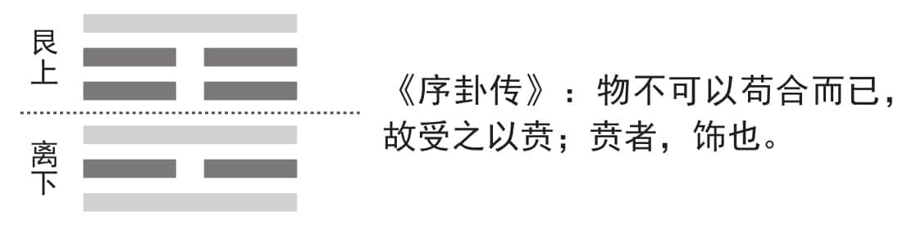

【贲卦】卦辞：贲，亨。小利有攸往。卦辞精解：修明庶政，慎重断狱。

【初九】爻辞：贲其趾，舍车而徒。初九精解：必要修饰，以利进行。

【六二】爻辞：贲其须。六二精解：文饰品德，随贤兴起。

【九三】爻辞：贲如濡如，永贞吉。九三精解：文饰润泽，宜永守正。

【六四】爻辞：贲如皤如，白马翰如。匪寇，婚媾。六四精解：急于嫁娶，文饰人生。

【六五】爻辞：贲于丘园，束帛戋戋。吝，终吉。六五精解：礼贤下士，得赠薄礼。

【上九】爻辞：白贲，无咎。上九精解：返朴还真，没有差错。

### 第二十三卦　【山地剥】

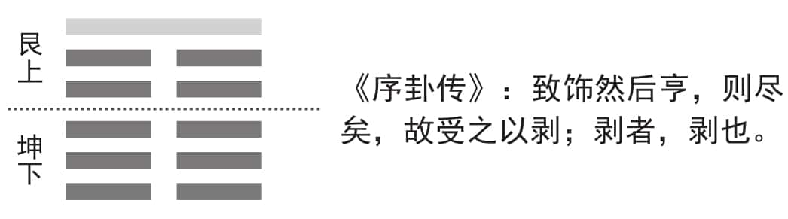

【剥卦】卦辞：剥，不利有攸往。卦辞精解：对下宽厚，上才安固。

【初六】爻辞：剥床以足，蔑贞凶。初六精解：安身之所，基层剥落。

【六二】爻辞：剥床以辨，蔑贞凶。六二精解：安身之所，支干剥落。

【六三】爻辞：剥之，无咎。六三精解：脱离小人，呼应君子。

【六四】爻辞：剥床以肤，凶。六四精解：安身之所，有切肤患。

【六五】爻辞：贯鱼，以宫人宠，无不利。六五精解：率众群小，听命君子。

【上九】爻辞：硕果不食，君子得舆，小人剥庐。上九精解：一线生机，小人破坏。

### 第二十四卦　【地雷复】

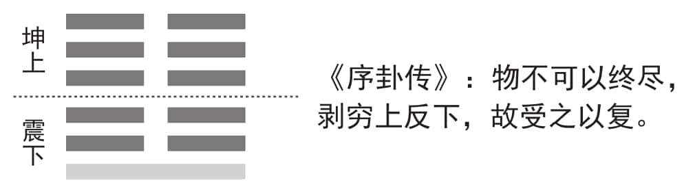

【复卦】卦辞：复，亨。出入无疾，朋来无咎。反复其道，七日来复。利有攸往。卦辞精解：一阳初复，万物生机。

【初九】爻辞：不远复，无祗悔，元吉。初九精解：有过即改，不致后悔。

【六二】爻辞：休复，吉。六二精解：向善得计，下附于仁。

【六三】爻辞：频复，厉，无咎。六三精解：屡过屡改，危而无错。

【六四】爻辞：中行独复。六四精解：单独迁善，中正独行。

【六五】爻辞：敦复，无悔。六五精解：择善固执，没有懊悔。

【上六】爻辞：迷复，凶，有灾眚。用行师，终有大败，以其国君凶，至于十年不克征。上六精解：执迷不悟，必有灾祸。

### 第二十五卦　【天雷无妄】

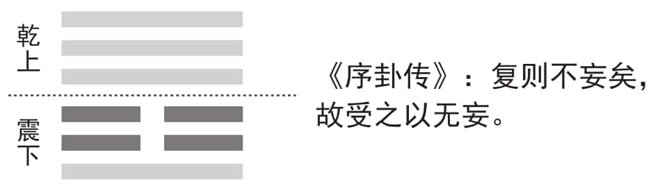

【无妄卦】卦辞：无妄，元亨，利贞。其匪正有眚，不利有攸往。卦辞精解：顺合天时，生育万物。

【初九】爻辞：无妄，往吉。初九精解：至诚而律，得遂心意。

【六二】爻辞：不耕获，不菑畬，则利有攸往。六二精解：只顾耕耘，不问收获。

【六三】爻辞：无妄之灾，或系之牛，行人之得，邑人之灾。六三精解：意外事件，无妄之灾。

【九四】爻辞：可贞，无咎。九四精解：应当固守，没有差错。

【九五】爻辞：无妄之疾，勿药有喜。九五精解：无妄之疾，勿药自愈。

【上九】爻辞：无妄，行有眚，无攸利。上九精解：轻举妄动，没有好处。

### 第二十六卦　【山天大畜】

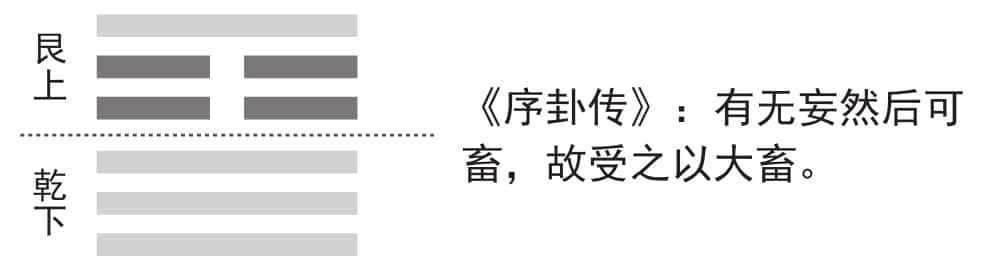

【大畜卦】卦辞：大畜，利贞，不家食，吉，利涉大川。卦辞精解：刚健笃实，素养日增。

【初九】爻辞：有厉，利已。初九精解：进有危险，应该停止。

【九二】爻辞：舆说輹。九二精解：车脱离輹，不能前进。

【九三】爻辞：良马逐，利艰贞。曰闲舆卫，利有攸往。九三精解：良马奔逐，不可妄动。

【六四】爻辞：童牛之牿，元吉。六四精解：小牛横木，易制刚性。

【六五】爻辞：豮豕之牙，吉。六五精解：去势雄猪，易制刚性。

【上九】爻辞：何天之衢，亨。上九精解：青云得志，无往不利。

### 第二十七卦　【山雷颐】

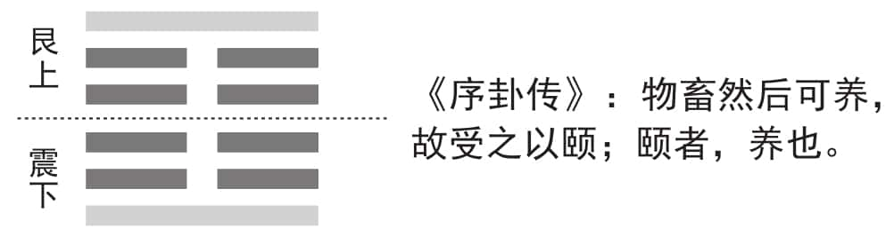

【颐卦】卦辞：颐，贞吉。观颐，自求口实。卦辞精解：谨慎言语，节制饮食。

【初九】爻辞：舍尔灵龟，观我朵颐，凶。初九精解：能自颐养，不可求人。

【六二】爻辞：颠颐，拂经于丘颐，征凶。六二精解：上求下养，违背常理。

【六三】爻辞：拂颐，贞凶，十年勿用，无攸利。六三精解：颐养无道，真正失策。

【六四】爻辞：颠颐，吉。虎视眈眈，其欲逐逐，无咎。六四精解：上求下养，措施光明。

【六五】爻辞：拂经，居贞吉，不可涉大川。六五精解：颐养无道，不可冒进。

【上九】爻辞：由颐，厉吉。利涉大川。上九精解：由此颐养，宜怀戒惧。

### 第二十八卦　【泽风大过】

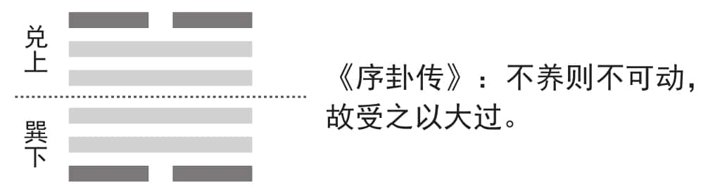

【大过卦】卦辞：大过，栋桡，利有攸往，亨。卦辞精解：特立独行，无所畏惧。

【初六】爻辞：借用白茅，无咎。初六精解：在下过软，没有差错。

【九二】爻辞：枯杨生稊，老夫得其女妻，无不利。九二精解：老夫少妻，过而谐和。

【九三】爻辞：栋桡，凶。九三精解：刚愎失策，不得人助。

【九四】爻辞：栋隆，吉。有它吝。九四精解：有所作为，且要专注。

【九五】爻辞：枯杨生华，老妇得其士夫，无咎无誉。九五精解：老妇少夫，无咎无誉。

【上六】爻辞：过涉灭顶，凶，无咎。上六精解：小人失败，不应怨尤。

### 第二十九卦　【坎为水】

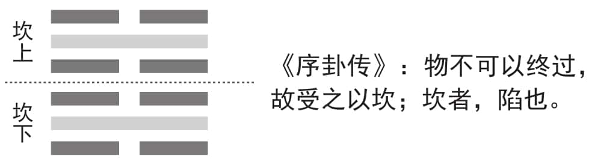

【坎卦】卦辞：习坎，有孚，维心，亨。行有尚。卦辞精解：常保素养，熟习教化。

【初六】爻辞：习坎，入于坎窞，凶。初六精解：在重险中，入于深处。

【九二】爻辞：坎有险，求小得。九二精解：坎陷危险，求稍出险。

【六三】爻辞：来之坎坎，险且枕，入于坎窞，勿用。六三精解：进退皆险，复依奸人。

【六四】爻辞：樽酒，簋贰，用缶，纳约自牖，终无咎。六四精解：重视精神，终可出险。

【九五】爻辞：坎不盈，祗既平，无咎。九五精解：坎险未平，不能出险。

【上六】爻辞：系用徽纆，置于丛棘，三岁不得，凶。上六精解：大罪的人，监禁三年。

### 第三十卦　【离为火】

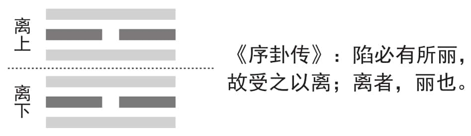

【离卦】卦辞：离，利贞，亨。畜牝牛，吉。卦辞精解：不断明贤，照耀四方。

【初九】爻辞：履错，然，敬之，无咎。初九精解：行履错乱，慎重从事。

【六二】爻辞：黄离，元吉。六二精解：黄色光明，以得中道。

【九三】爻辞：日昃之离，不鼓缶而歌，则大耋之嗟，凶。九三精解：已过中年，勿嗟老大。

【九四】爻辞：突如其来如，焚如，死如，弃如。九四精解：道不光明，不为人容。

【六五】爻辞：出涕沱若，戚嗟若，吉。六五精解：忧伤嗟叹，知所警惕。

【上九】爻辞：王用出征，有嘉折首，获匪其丑，无咎。上九精解：折取魁首，不究附从。

### 第三十一卦　【泽山咸】

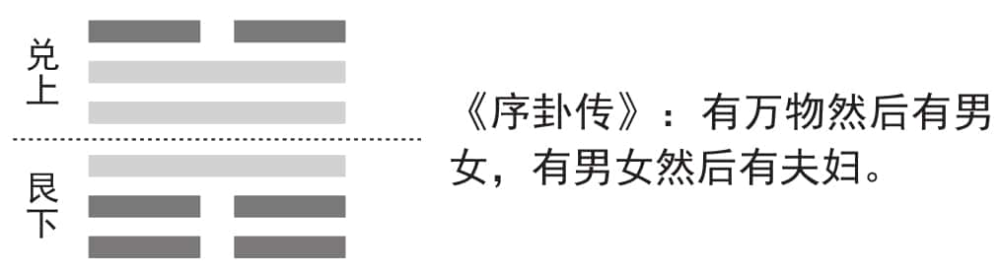

【咸卦】卦辞：咸，亨，利贞，取女吉。卦辞精解：人心感应，天下和谐。

【初六】爻辞：咸其拇。初六精解：在感之初，不能动人。

【六二】爻辞：咸其腓，凶，居吉。六二精解：感时宜静，不动得计。

【九三】爻辞：咸其股，执其随，往吝。九三精解：随人而动，所执卑下。

【九四】爻辞：贞吉，悔亡。憧憧往来，朋从尔思。九四精解：心志不定，所感不多。

【九五】爻辞：咸其脢，无悔。九五精解：志在微末，不能感人。

【上六】爻辞：咸其辅颊舌。上六精解：仅凭口舌，不能感人。

### 第三十二卦　【雷风恒】

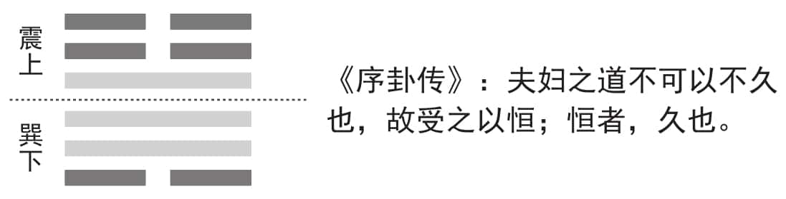

【恒卦】卦辞：恒，亨，无咎，利贞，利有攸往。卦辞精解：立身处事，不改常道。

【初六】爻辞：浚恒，贞凶，无攸利。初六精解：凡事起始，莫求常道。

【九二】爻辞：悔亡。九二精解：常守中道，没有懊悔。

【九三】爻辞：不恒其德，或承之羞，贞吝。九三精解：变节受辱，令人惋惜。

【九四】爻辞：田无禽。九四精解：职位不当，徒劳无功。

【六五】爻辞：恒其德，贞。妇人吉，夫子凶。六五精解：长守柔顺，只宜女人。

【上六】爻辞：振恒，凶。上六精解：在上位者，莫动失恒。

### 第三十三卦　【天山遁】

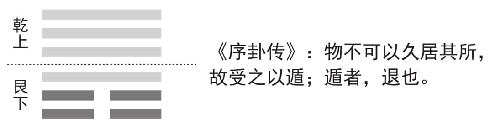

【遁卦】卦辞：遁，亨，小利贞。卦辞精解：远避小人，随机行止。

【初六】爻辞：遁尾，厉，勿用有攸往。初六精解：遁应机先，不然莫遁。

【六二】爻辞：执之，用黄牛之革，莫之胜说。六二精解：坚持退避，不能改变。

【九三】爻辞：系遁，有疾厉。畜臣妾，吉。九三精解：恋旧不遁，将有危害。

【九四】爻辞：好遁，君子吉，小人否。九四精解：弃爱而遁，富有机智。

【九五】爻辞：嘉遁，贞吉。九五精解：美好的遁，心志正当。

【上九】爻辞：肥遁，无不利。上九精解：宽裕的遁，没有不利。

### 第三十四卦　【雷天大壮】

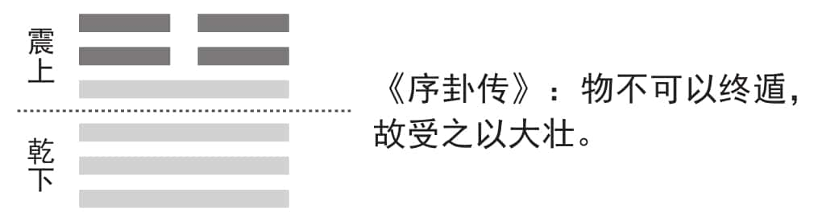

【大壮卦】卦辞：大壮，利贞。卦辞精解：健壮正直，不践非礼。

【初九】爻辞：壮于趾，征凶，有孚。初九精解：旺盛之初，行动莫猛。

【九二】爻辞：贞吉。九二精解：正固得计，以守中道。

【九三】爻辞：小人用壮，君子用罔，贞厉。羝羊触藩，羸其角。九三精解：小人逞强，受制于人。

【九四】爻辞：贞吉，悔亡。藩决不羸，壮于大舆之輹。九四精解：正固得计，前途无阻。

【六五】爻辞：丧羊于易，无悔。六五精解：对于刚者，宜制以柔。

【上六】爻辞：羝羊触藩，不能退，不能遂，无攸利。艰则吉。上六精解：旺盛躁进，不能进退。

### 第三十五卦　【火地晋】

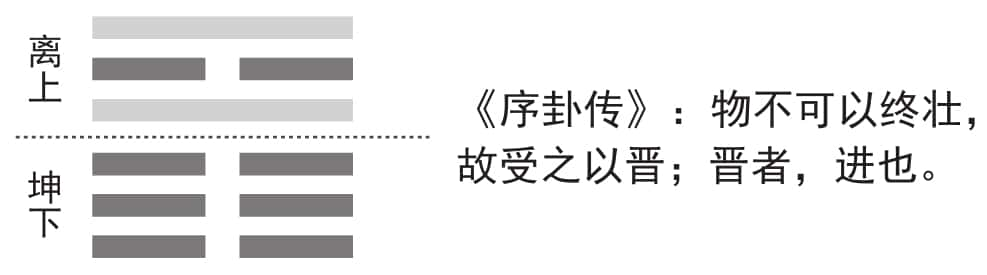

【晋卦】卦辞：晋，康侯用锡马蕃庶，昼日三接。卦辞精解：柔顺上进，光明素养。

【初六】爻辞：晋如，摧如，贞吉。罔孚，裕无咎。初六精解：晋而抑退，宽容处之。

【六二】爻辞：晋如，愁如，贞吉。受兹介福，于其王母。六二精解：晋而忧虑，乃获大福。

【六三】爻辞：众允，悔亡。六三精解：为众信孚，始得晋升。

【九四】爻辞：晋如鼫鼠，贞厉。九四精解：才德不称，晋而危险。

【六五】爻辞：悔亡，失得勿恤。往吉，无不利。六五精解：不顾得失，晋升就好。

【上九】爻辞：晋其角，维用伐邑，厉吉，无咎。贞吝。上九精解：晋至极点，只能小用。

### 第三十六卦　【地火明夷】

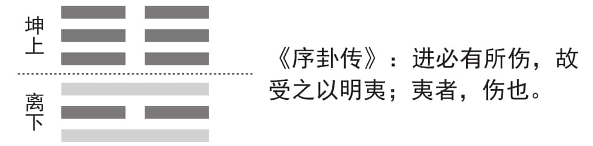

【明夷卦】卦辞：明夷，利艰贞。卦辞精解：暗藏明哲，愈能彰明。

【初九】爻辞：明夷于飞，垂其翼。君子于行，三日不食，有攸往，主人有言。初九精解：受人伤害，未展长才。

【六二】爻辞：明夷，夷于左股，用拯马壮，吉。六二精解：受伤不重，宜速离去。

【九三】爻辞：明夷于南狩，得其大首。不可疾贞。九三精解：征伐除害，莫急纠正。

【六四】爻辞：入于左腹，获明夷之心，于出门庭。六四精解：知伤明哲，远去避之。

【六五】爻辞：箕子之明夷，利贞。六五精解：处置伤明，应该守正。

【上六】爻辞：不明晦，初登于天，后入于地。上六精解：初登高位，终陷黑暗。

### 第三十七卦　【风火家人】

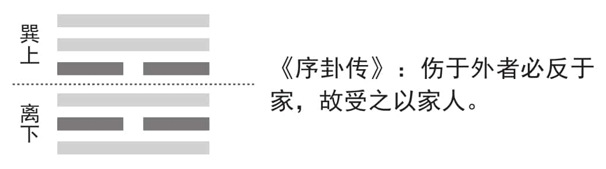

【家人卦】卦辞：家人，利女贞。卦辞精解：言语据实，行为有法。

【初九】爻辞：闲有家，悔亡。初九精解：防闲于治，没有懊悔。

【六二】爻辞：无攸遂，在中馈，贞吉。六二精解：无所专成，只主中馈。

【九三】爻辞：家人嗃嗃，悔厉，吉。妇子嘻嘻，终吝。九三精解：治家严厉，优于散漫。

【六四】爻辞：富家，大吉。六四精解：使家富裕，以女柔顺。

【九五】爻辞：王假有家，勿恤，吉。九五精解：王道感化，家有幸福。

【上九】爻辞：有孚，威如，终吉。上九精解：诚信威严，由于反省。

### 第三十八卦　【火泽睽】

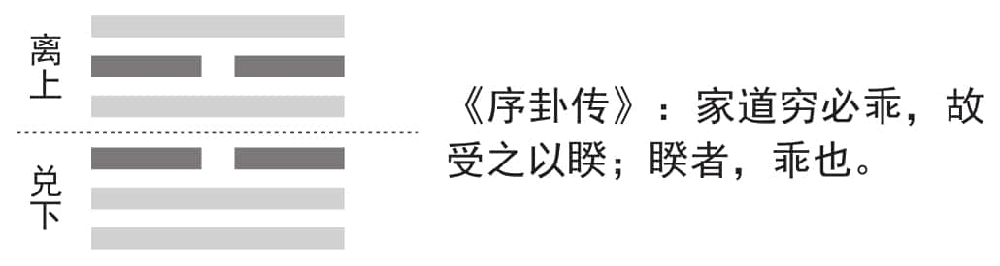

【睽卦】卦辞：睽，小事吉。卦辞精解：大同之中，应有小异。

【初九】爻辞：悔亡。丧马勿逐，自复。见恶人，无咎。初九精解：既见乖离，勿急求合。

【九二】爻辞：遇主于巷，无咎。九二精解：遇主于巷，未失其道。

【六三】爻辞：见舆曳，其牛掣，其人天且劓。无初有终。六三精解：初虽无得，终将有成。

【九四】爻辞：睽孤，遇元夫，交孚，厉无咎。九四精解：乖离孤立，相待以诚。

【六五】爻辞：悔亡。厥宗噬肤，往何咎？六五精解：深入易合，不睽有庆。

【上九】爻辞：睽孤，见豕负涂，载鬼一车。先张之弧，后说之弧。匪寇，婚媾。往遇雨则吉。上九精解：乖离孤立，释疑则可。

### 第三十九卦　【水山蹇】

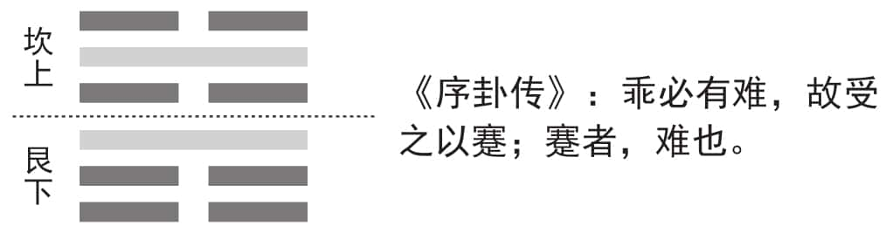

【蹇卦】卦辞：蹇，利西南，不利东北。利见大人，贞吉。卦辞精解：见险能止，反省修德。

【初六】爻辞：往蹇，来誉。初六精解：进有险难，退有美誉。

【六二】爻辞：王臣蹇蹇，匪躬之故。六二精解：赴王之难，不顾自身。

【九三】爻辞：往蹇，来反。九三精解：进有险难，归来避之。

【六四】爻辞：往蹇，来连。六四精解：进有险难，连合共济。

【九五】爻辞：大蹇，朋来。九五精解：非常险难，应得友助。

【上六】爻辞：往蹇，来硕。吉，利见大人。上六精解：进有险难，应求贤才。

### 第四十卦　【雷水解】

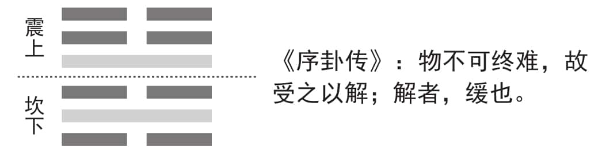

【解卦】卦辞：解，利西南。无所往，其来复吉。有攸往，夙吉。卦辞精解：赦免过失，宽宥罪恶。

【初六】爻辞：无咎。初六精解：解决于初，没有差错。

【九二】爻辞：田获三狐，得黄矢，贞吉。九二精解：利用君子，克制小人。

【六三】爻辞：负且乘，致寇至，贞吝。六三精解：重用小人，招致失败。

【九四】爻辞：解而拇，朋至斯孚。九四精解：解除小人，君子自至。

【六五】爻辞：君子维有解，吉。有孚于小人。六五精解：君子能解，小人信赖。

【上六】爻辞：公用射隼于高墉之上，获之，无不利。上六精解：位高无权，打击小人。

### 第四十一卦　【山泽损】

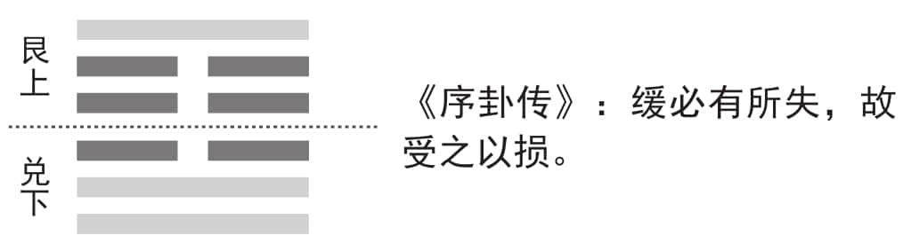

【损卦】卦辞：损，有孚，元吉，无咎，可贞，利有攸往。曷之用？二簋可用享。卦辞精解：惩戒愤怒，窒塞意欲。

【初九】爻辞：已事遄往，无咎，酌损之。初九精解：停止己事，速去益人。

【九二】爻辞：利贞，征凶。弗损，益之。九二精解：守正不损，有益于人。

【六三】爻辞：三人行，则损一人。一人行，则得其友。六三精解：损应损除，益应益缺。

【六四】爻辞：损其疾，使遄有喜，无咎。六四精解：速损其疾，可喜可庆。

【六五】爻辞：或益之十朋之龟，弗克违，元吉。六五精解：无心益人，确是得计。

【上九】爻辞：弗损益之，无咎，贞吉，利有攸往。得臣无家。上九精解：不损自己，却利他人。

### 第四十二卦　【风雷益】

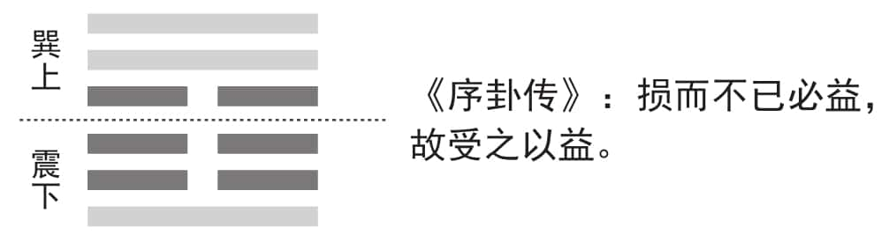

【益卦】卦辞：益，利有攸往，利涉大川。卦辞精解：见善则迁，有过则改。

【初九】爻辞：利用为大作，元吉，无咎。初九精解：利用益道，大有作为。

【六二】爻辞：或益之十朋之龟，弗克违，永贞吉。王用享于帝，吉。六二精解：无心益人，大为得计。

【六三】爻辞：益之用凶事，无咎。有孚中行，告公用圭。六三精解：患难临之，有益于身。

【六四】爻辞：中行，告公从，利用为依迁国。六四精解：中庸行为，公众从之。

【九五】爻辞：有孚惠心，勿问，元吉。有孚惠我德。九五精解：施惠于人，感激我德。

【上九】爻辞：莫益之，或击之。立心勿恒，凶。上九精解：不增益之，存心不常。

### 第四十三卦　【泽天夬】

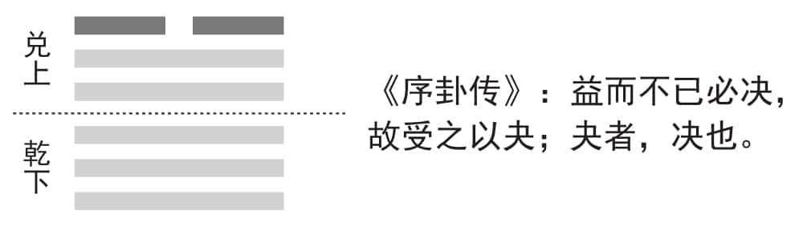

【夬卦】卦辞：夬，扬于王庭，孚号有厉。告自邑，不利即戎，利有攸往。卦辞精解：施禄及下，莫以为善。

【初九】爻辞：壮于前趾，往不胜，为咎。初九精解：轻举妄动，往而不胜。

【九二】爻辞：惕号，莫夜有戎，勿恤。九二精解：警惕呼号，有备无患。

【九三】爻辞：壮于頄，有凶。君子夬夬独行，遇雨若濡，有愠，无咎。九三精解：坚决独往，受害遭怨。

【九四】爻辞：臀无肤，其行次且。牵羊悔亡，闻言不信。九四精解：行而又止，共进无悔。

【九五】爻辞：苋陆夬夬，中行无咎。九五精解：尽去小人，行为中正。

【上六】爻辞：无号，终有凶。上六精解：无处呼号，终必失策。

### 第四十四卦　【天风姤】

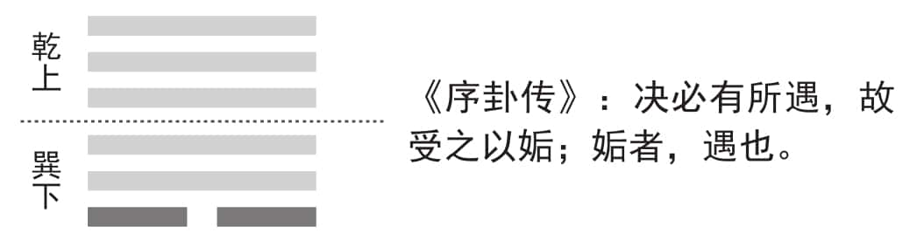

【姤卦】卦辞：姤，女壮，勿用取女。卦辞精解：施行命令，诰戒四方。

【初六】爻辞：系于金柅，贞吉。有攸往，见凶，羸豕孚蹢躅。初六精解：小人初长，应加阻止。

【九二】爻辞：包有鱼，无咎，不利宾。九二精解：阻止小人，莫害来宾。

【九三】爻辞：臀无肤，其行次且，厉，无大咎。九三精解：行路难进，无所遇合。

【九四】爻辞：包无鱼，起凶。九四精解：未容下属，独立失策。

【九五】爻辞：以杞包瓜，含章，有陨自天。九五精解：包容下属，下施美德。

【上九】爻辞：姤其角，吝，无咎。上九精解：在上而刚，难与人合。

### 第四十五卦　【泽地萃】

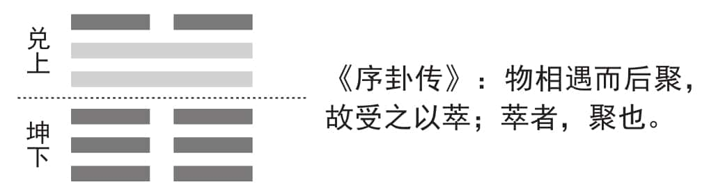

【萃卦】卦辞：萃，亨。王假有庙，利见大人，亨，利贞。用大牲吉，利有攸往。卦辞精解：发现有才，示以诚敬。

【初六】爻辞：有孚不终，乃乱乃萃。若号，一握为笑。勿恤，往无咎。初六精解：诚信无终，聚集紊乱。

【六二】爻辞：引吉，无咎。孚乃利用禴。六二精解：诚心聚集，不在形式。

【六三】爻辞：萃如，嗟如，无攸利。往无咎，小吝。六三精解：无人与聚，嗟叹无益。

【九四】爻辞：大吉，无咎。九四精解：居位不当，大吉无咎。

【九五】爻辞：萃有位，无咎。匪孚，元永贞，悔亡。九五精解：不恃权位，要有诚信。

【上六】爻辞：赍咨涕洟，无咎。上六精解：求聚不能，痛悔无咎。

### 第四十六卦　【地风升】

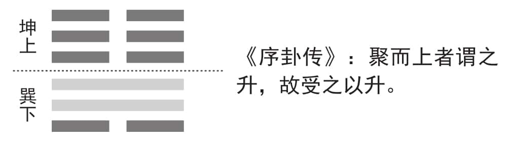

【升卦】卦辞：升，元亨。用见大人，勿恤。南征吉。卦辞精解：因时上进，有贤应援。

【初六】爻辞：允升，大吉。初六精解：得当地升，合于上志。

【九二】爻辞：孚乃利用禴，无咎。九二精解：极为诚信，应援上进。

【九三】爻辞：升虚邑。九三精解：上进无阻，无所疑惧。

【六四】爻辞：王用亨于岐山，吉，无咎。六四精解：柔顺从事，上进享受。

【六五】爻辞：贞吉，升阶。六五精解：逐步上进，得行其志。

【上六】爻辞：冥升，利于不息之贞。上六精解：昏冥上进，宜正不息。

### 第四十七卦　【泽水困】

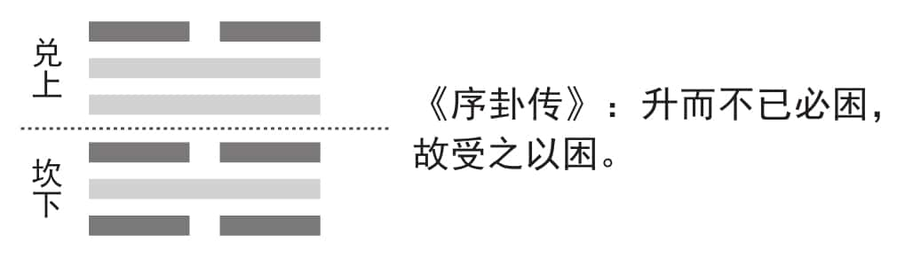

【困卦】卦辞：困，亨，贞，大人吉，无咎。有言不信。卦辞精解：处险而悦，守正寡言。

【初六】爻辞：臀困于株木，入于幽谷，三岁不觌。初六精解：困处黑暗，不求人知。

【九二】爻辞：困于酒食，朱绂方来，利用享祀。征凶，无咎。九二精解：酒食不足，待机而动。

【六三】爻辞：困于石，据于蒺藜，入于其宫，不见其妻，凶。六三精解：外有困难，内失其妻。

【九四】爻辞：来徐徐，困于金车。吝，有终。九四精解：困于富贵，终能有为。

【九五】爻辞：劓刖，困于赤绂，乃徐有说，利用祭祀。九五精解：困于禄位，以诚脱离。

【上六】爻辞：困于葛藟，于臲卼，曰动悔。有悔，征吉。上六精解：困于纠缠，动而有悔。

### 第四十八卦　【水风井】

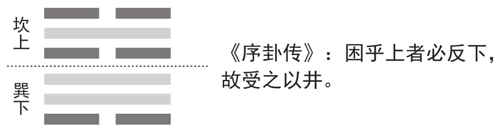

【井卦】卦辞：井，改邑不改井，无丧无得，往来井井。汔至亦未繘井，羸其瓶，凶。卦辞精解：绳入于水，引其向上。

【初六】爻辞：井泥不食，旧井无禽。初六精解：底泥莫食，废井无禽。

【九二】爻辞：井谷射鲋，瓮敝漏。九二精解：井孔洩水，如器破漏。

【九三】爻辞：井渫不食，为我心恻。可用汲，王明并受其福。九三精解：井除污秽，尚未食用。

【六四】爻辞：井甃，无咎。六四精解：用砖砌井，井已修治。

【九五】爻辞：井洌，寒泉食。九五精解：井水澄清，冷泉可食。

【上六】爻辞：井收，勿幕。有孚，元吉。上六精解：井已完成，公用无私。

### 第四十九卦　【泽火革】

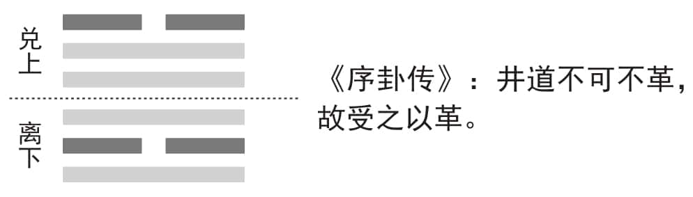

【革卦】卦辞：革，巳日乃孚，元亨利贞，悔亡。卦辞精解：革新改造，顺天应人。

【初九】爻辞：巩用黄牛之革。初九精解：改变之初，不可妄动。

【六二】爻辞：巳日乃革之，征吉，无咎。六二精解：立信以后，始可改革。

【九三】爻辞：征凶，贞厉。革言三就，有孚。九三精解：广求意见，审慎改革。

【九四】爻辞：悔亡，有孚改命，吉。九四精解：改革天命，得计无悔。

【九五】爻辞：大人虎变，未占有孚。九五精解：大人改革，令人信服。

【上六】爻辞：君子豹变，小人革面，征凶，居贞吉。上六精解：继革失策，宜居常态。

### 第五十卦　【火风鼎】

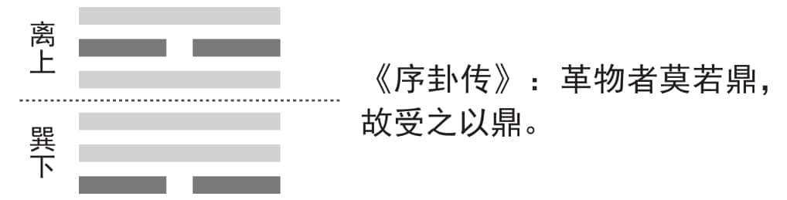

【鼎卦】卦辞：鼎，元吉，亨。卦辞精解：端正安重，凝固使命。

【初六】爻辞：鼎颠趾，利出否。得妾以其子，无咎。初六精解：鼎足倾倒，利除腐物。

【九二】爻辞：鼎有实，我仇有疾，不我能即，吉。九二精解：腹中有实，慎重处理。

【九三】爻辞：鼎耳革，其行塞，雉膏不食。方雨亏悔，终吉。九三精解：鼎耳革除，功用丧失。

【九四】爻辞：鼎折足，覆公餗，其形渥，凶。九四精解：鼎足折殿，倾覆公食。

【六五】爻辞：鼎黄耳金铉，利贞。六五精解：鼎内美食，发挥功用。

【上九】爻辞：鼎玉铉，大吉，无不利。上九精解：玉的扛具，刚柔调济。

### 第五十一卦　【震为雷】

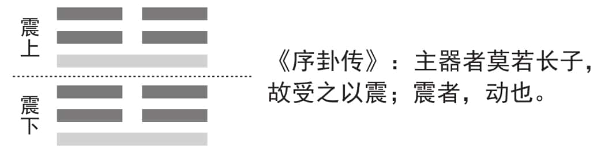

【震卦】卦辞：震，亨。震来虩虩，笑言哑哑。震惊百里，不丧匕鬯。卦辞精解：恐惧警惕，始能安闲。

【初九】爻辞：震来虩虩，后笑言哑哑，吉。初九精解：先有警惕，后能从容。

【六二】爻辞：震来，厉，亿丧贝，跻于九陵，勿逐，七日得。六二精解：震撼严重，避不顾失。

【六三】爻辞：震苏苏，震行无眚。六三精解：震止又起，其行无害。

【九四】爻辞：震遂泥。九四精解：不能振奋，未能光大，

【六五】爻辞：震往来，厉。亿无丧，有事。六五精解：往来危险，不丧其事。

【上六】爻辞：震索索，视矍矍，征凶。震不于其躬，于其邻，无咎。婚媾有言。上六精解：震惧不安，应早警惕。

### 第五十二卦　【艮为山】

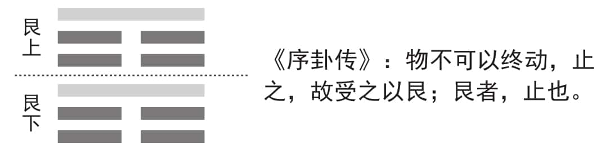

【艮卦】卦辞：艮其背，不获其身；行其庭，不见其人。无咎。卦辞精解：止中有动，动静合时。

【初六】爻辞：艮其趾，无咎，利永贞。初六精解：止动于初，宜永守正。

【六二】爻辞：艮其腓，不拯其随，其心不快。六二精解：不能救上，当止则止。

【九三】爻辞：艮其限，列其夤，厉熏心。九三精解：不当地止，必神不安。

【六四】爻辞：艮其身，无咎。六四精解：休止其身，独善其身。

【六五】爻辞：艮其辅，言有序，悔亡。六五精解：谨慎言语，出言有序。

【上九】爻辞：敦艮，吉。上九精解：笃实于止，敦厚而终。

### 第五十三卦　【风山渐】

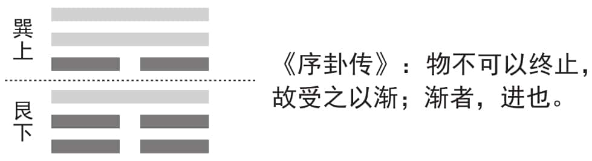

【渐卦】卦辞：渐，女归吉，利贞。卦辞精解：止顺自然，行不穷困。

【初六】爻辞：鸿渐于干，小子厉，有言，无咎。初六精解：少年初进，受责无咎。

【六二】爻辞：鸿渐于磐，饮食衎衎，吉。六二精解：饮食和乐，不尸其位。

【九三】爻辞：鸿渐于陆，夫征不复，妇孕不育，凶。利御寇。九三精解：夫征不复，妇孕不育。

【六四】爻辞：鸿渐于木，或得其桷，无咎。六四精解：不安于树，或安于架。

【九五】爻辞：鸿渐于陵，妇三岁不孕，终莫之胜，吉。九五精解：怀才不遇，终能有成。

【上九】爻辞：鸿渐于陆，其羽可用为仪，吉。上九精解：贤人高洁，言行可法。

### 第五十四卦　【雷泽归妹】

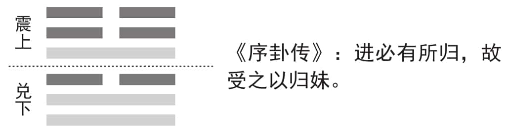

【归妹卦】卦辞：归妹，征凶，无攸利。卦辞精解：天地大义，人道开始。

【初九】爻辞：归妹以娣，跛能履，征吉。初九精解：随姊出嫁，委屈相从。

【九二】爻辞：眇能视，利幽人之贞。九二精解：地位不正，德美有为。

【六三】爻辞：归妹以须，反归以娣。六三精解：反回妾身，等待出嫁。

【九四】爻辞：归妹愆期，迟归有时。九四精解：出嫁过时，晚嫁待时。

【六五】爻辞：帝乙归妹，其君之袂，不如其娣之袂良。月几望，吉。六五精解：帝乙嫁女，不重衣饰。

【上六】爻辞：女承筐无实，士刲羊无血，无攸利。上六精解：出嫁未成，无何利益。

### 第五十五卦　【雷火丰】

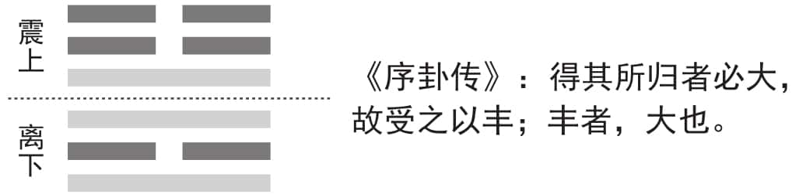

【丰卦】卦辞：丰，亨，王假之，勿忧，宜日中。卦辞精解：照察实情，用刑惩恶。

【初九】爻辞：遇其配主，虽旬无咎，往有尚。初九精解：遇着配主，初丰可嘉。

【六二】爻辞：丰其蔀，日中见斗，往得疑疾。有孚发若，吉。六二精解：盛大障蔽，不宜求丰。

【九三】爻辞：丰其沛，日中见沫。折其右肱，无咎。九三精解：盛大障蔽，掩蔽刚明。

【九四】爻辞：丰其蔀，日中见斗。遇其夷主，吉。九四精解：盛大障蔽，遇着平手。

【六五】爻辞：来章，有庆誉，吉。六五精解：召来贤才，助其盛大。

【上六】爻辞：丰其屋，蔀其家，窥其户，阒其无人，三岁不觌，凶。上六精解：盛大屋舍，障蔽家庭。

### 第五十六卦　【火山旅】

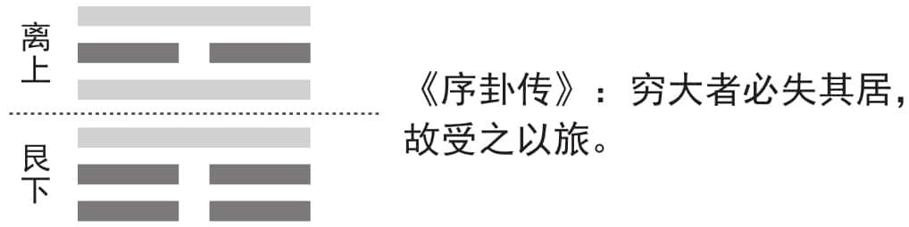

【旅卦】卦辞：旅，小亨，旅贞吉。卦辞精解：柔和守中，有所不为。

【初六】爻辞：旅琐琐，斯其所取灾。初六精解：琐细卑鄙，贼役取害。

【六二】爻辞：旅即次，怀其资，得童仆贞。六二精解：就舍藏财，用人忠诚。

【九三】爻辞：旅焚其次，丧其童仆，贞厉。九三精解：焚毁馆舍，用人不忠。

【九四】爻辞：旅于处，得其资斧，我心不快。九四精解：虽得资斧，心不快乐。

【六五】爻辞：射雉一矢亡，终以誉命。六五精解：猎取荣誉，终必获得。

【上九】爻辞：鸟焚其巢，旅人先笑后号咷。丧牛于易，凶。上九精解：栖身无处，先乐后悲。

### 第五十七卦　【巽为风】

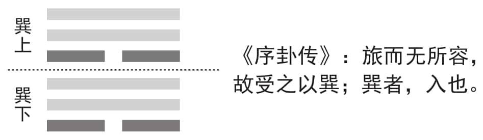

【巽卦】卦辞：巽，小亨，利有攸往，利见大人。卦辞精解：上下卑顺，贯彻命令。

【初六】爻辞：进退，利武人之贞。初六精解：犹疑不决，要果断正。

【九二】爻辞：巽在床下，用史巫纷若，吉，无咎。九二精解：过分卑顺，不如守中。

【九三】爻辞：频巽，吝。九三精解：屡次卑顺，令人惋惜。

【六四】爻辞：悔亡，田获三品。六四精解：猎获高禄，懊悔消失。

【九五】爻辞：贞吉，悔亡，无不利。无初有终。先庚三日，后庚三日，吉。九五精解：一再叮咛，并加检讨。

【上九】爻辞：巽在床下，丧其资斧，贞凶。上九精解：过分卑顺，丧失果断。

### 第五十八卦　【兑为泽】

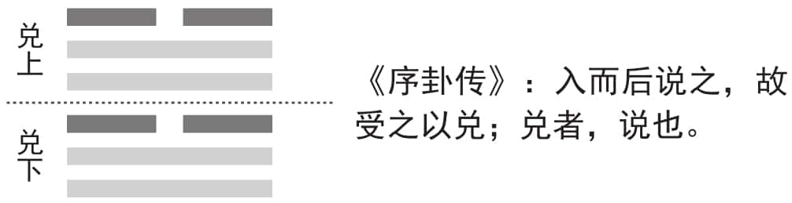

【兑卦】卦辞：兑，亨，利贞。卦辞精解：和悦亨通，忘劳忘死。

【初九】爻辞：和兑，吉。初九精解：以和而悦，行为无疑。

【九二】爻辞：孚兑，吉，悔亡。九二精解：以信而悦，志存诚信。

【六三】爻辞：来兑，凶。六三精解：就人求悦，居位不当。

【九四】爻辞：商兑未宁，介疾有喜。九四精解：考虑所悦，应恶阴邪。

【九五】爻辞：孚于剥，有厉。九五精解：任令剥蚀，危险正着。

【上六】爻辞：引兑。上六精解：牵引以悦，有失光明。

### 第五十九卦　【风水涣】

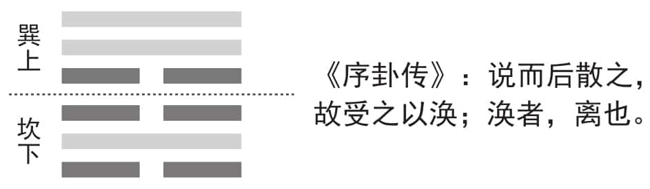

【涣卦】卦辞：涣，亨。王假有庙，利涉大川，利贞。卦辞精解：同舟共济，克服困难。

【初六】爻辞：用拯马壮，吉。初六精解：拯救涣散，宜用贤才。

【九二】爻辞：涣奔其机，悔亡。九二精解：涣散之时，急就所安。

【六三】爻辞：涣其躬，无悔。六三精解：不顾自己，有志于外。

【六四】爻辞：涣其群，元吉。涣有丘，匪夷所思。六四精解：散去私党，得大团结。

【九五】爻辞：涣汗其大号，涣，王居无咎。九五精解：除民疾苦，散与财货。

【上九】爻辞：涣其血，去逖出，无咎。上九精解：避祸出走，出于警惕。

### 第六十卦　【水泽节】

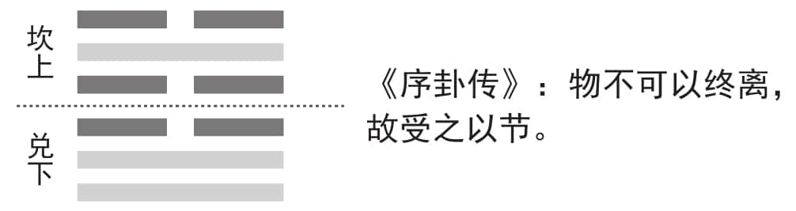

【节卦】卦辞：节，亨。苦节不可贞。卦辞精解：沉着应对，能得畅通。

【初九】爻辞：不出户庭，无咎。初九精解：不出户庭，知所行止。

【九二】爻辞：不出门庭，凶。九二精解：不出门庭，丧失时机。

【六三】爻辞：不节若，则嗟若，无咎。六三精解：不加节制，则有伤叹。

【六四】爻辞：安节，亨。六四精解：安然节制，以承上道。

【九五】爻辞：甘节，吉。往有尚。九五精解：过度节制，居中而正。

【上六】爻辞：苦节，贞凶，悔亡。上六精解：过度节制，正也失策。

### 第六十一卦　【风泽中孚】

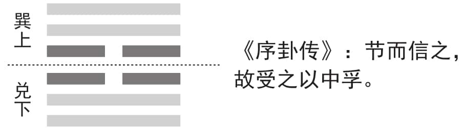

【中孚卦】卦辞：中孚，豚鱼吉，利涉大川，利贞。卦辞精解：内诚感人，克服困难。

【初九】爻辞：虞吉，有它不燕。初九精解：意志不定，不能安适。

【九二】爻辞：鸣鹤在阴，其子和之。我有好爵，吾与尔靡之。九二精解：鹤鸣子和，酒食共享。

【六三】爻辞：得敌，或鼓或罢，或泣或歌。六三精解：得着敌对，缺乏内诚。

【六四】爻辞：月几望，马匹亡，无咎。六四精解：尚未凌君，输诚承上。

【九五】爻辞：有孚挛如，无咎。九五精解：居位正当，感通天下。

【上九】爻辞：翰音登于天，贞凶。上九精解：自鸣太高，反失内诚。

### 第六十二卦　【雷山小过】

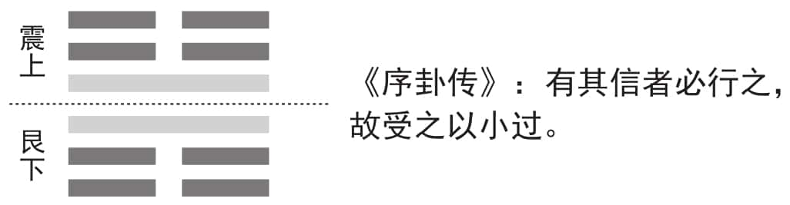

【小过卦】卦辞：小过，亨，利贞，可小事，不可大事。飞鸟遗之音，不宜上宜下，大吉。卦辞精解：小事得计，不可大事。

【初六】爻辞：飞鸟以凶。初六精解：进取高禄，小人失策。

【六二】爻辞：过其祖，遇其妣，不及其君，遇其臣，无咎。六二精解：不僭越君，与臣共济。

【九三】爻辞：弗过防之，从或戕之，凶。九三精解：不过防恶，受其戕害。

【九四】爻辞：无咎。弗过遇之，往厉必戒，勿用永贞。九四精解：柔而遇合，猛进危险。

【六五】爻辞：密云不雨，自我西郊，公弋取彼在穴。六五精解：密云不雨，过阴无成。

【上六】爻辞：弗遇过之，飞鸟离之，凶，是谓灾眚。上六精解：好高骛远，将有灾祸。

### 第六十三卦　【水火既济】

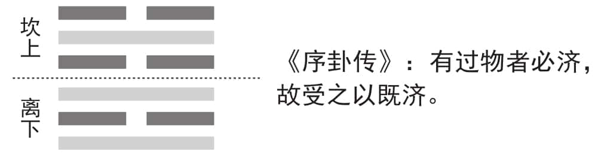

【既济卦】卦辞：既济，亨小，利贞，初吉终乱。卦辞精解：小事亨通，终必紊乱。

【初九】爻辞：曳其轮，濡其尾，无咎。初九精解：徘徊不进，不动没错。

【六二】爻辞：妇丧其茀，勿逐，七日得。六二精解：表面败坏，不久可复。

【九三】爻辞：高宗伐鬼方，三年克之，小人勿用。九三精解：克制边远，贤才不易。

【六四】爻辞：繻有衣袽，终日戒。六四精解：不忘忧患，终日戒惧。

【九五】爻辞：东邻杀牛，不如西邻之禴祭，实受其福。九五精解：盛祭奢靡，莫如落祭。

【上六】爻辞：濡其首，厉。上六精解：沉溺于酒，将有危险。

### 第六十四卦　【火水未济】

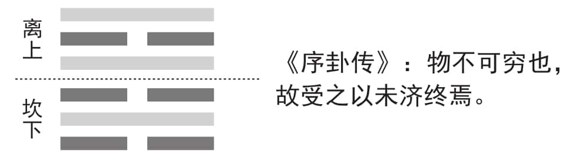

【未济卦】卦辞：未济，亨，小狐汔济，濡其尾，无攸利。卦辞精解：慎加考虑，始能亨通。

【初六】爻辞：濡其尾，吝。初六精解：未加考虑，也不量力。

【九二】爻辞：曳其轮，贞吉。九二精解：不轻进退，正道得计。

【六三】爻辞：未济，征凶。利涉大川。六三精解：无成不动，能克困难。

【九四】爻辞：贞吉，悔亡，震用伐鬼方，三年有赏于大国。九四精解：戒惧奋斗，终得报偿。

【六五】爻辞：贞吉，无悔。君子之光，有孚，吉。六五精解：君子光辉，出于诚信。

【上九】爻辞：有孚于饮酒，无咎。濡其首，有孚失是。上九精解：诚信待时，饮酒自遣。

# 附录二 八卦记忆歌诀

#### 【八卦歌诀】

乾三连，坤六断，震仰盂，艮覆碗，

离中虚，坎中满，兑上缺，巽下断。

#### 【八卦代数】

乾一，兑二，离三，震四，巽五，坎六，艮七，坤八。

#### 【八卦五行】

乾、兑（金）；震、巽（木）；坤、艮（土）；离（火）；坎（水）。

# 附录三 六十四卦记忆歌诀

#### 【六十四卦卦名次序歌】

乾坤屯蒙需讼师，比小畜兮履泰否；

同人大有谦豫随，蛊临观兮噬嗑贲；

剥复无妄大畜颐，大过坎离三十备。

咸恒遁兮及大壮，晋与明夷家人睽；

蹇解损益夬姤萃，升困井革鼎震继；

艮渐归妹丰旅巽，兑涣节兮中孚至；

小过既济兼未济，是为下经三十四。

#### 【六十四卦分宫卦象歌】

乾为天，天风姤，天山遁，天地否，风地观，山地剥，火地晋，火天大有。

坎为水，水泽节，水雷屯，水火既济，泽火革，雷火丰，地火明夷，地水师。

艮为山，山火贲，山天大畜，山泽损，火泽睽，天泽履，风泽中孚，风山渐。

震为雷，雷地豫，雷水解，雷风恒，地风升，水风井，泽风大过，泽雷随。

巽为风，风天小畜，风火家人，风雷益，天雷无妄，火雷噬嗑，山雷颐，山风蛊。

离为火，火山旅，火风鼎，火水未济，山水蒙，风水涣，天水讼，天火同人。

坤为地，地雷复，地泽临，地天泰，雷天大壮，泽天夬，水天需，水地比。

兑为泽，泽水困，泽地萃，泽山咸，水山蹇，地山谦，雷山小过，雷泽归妹。

