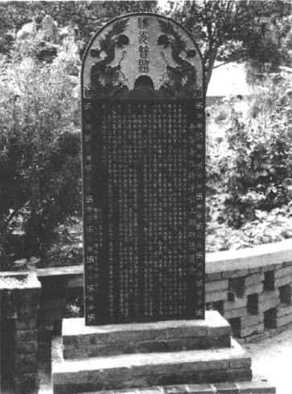
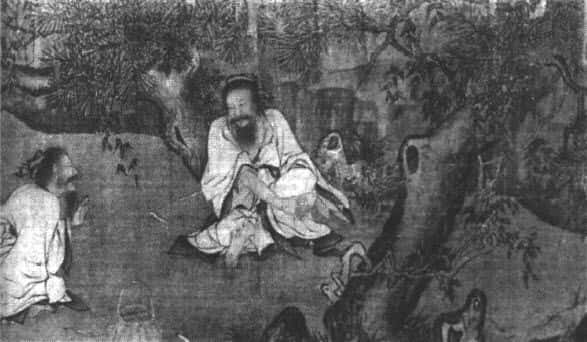
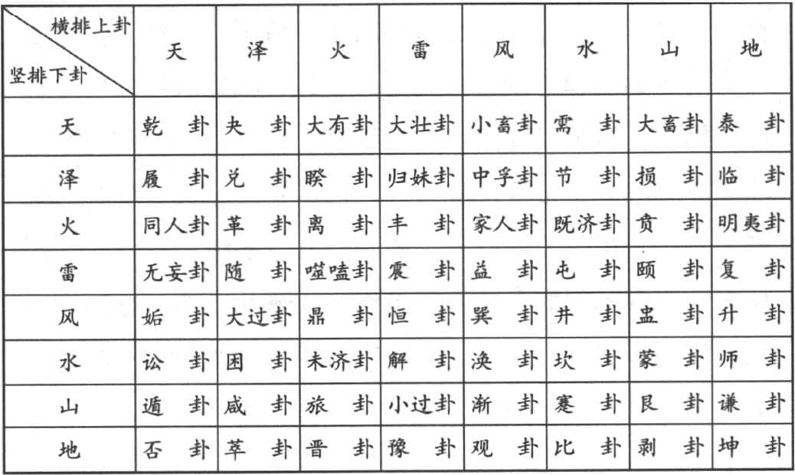

很多年前，我在比利时鲁汶大学教书。由于饮食习惯很难改变，到国外之后，我跟大多数中国人一样，先找中国餐厅。有一家餐馆老板知道我是教哲学的，他就对我说，我们这餐馆生意不太好，因为犯了“路冲”。犯了“路冲”之后怎么办呢？他就买了一个“先天八卦图”挂在餐馆门口。挂了一个多月，生意并没有改善，他就说，你帮我看看，这个图是不是有问题？我一看，发现那个挂着的“先天八卦图”（参看本书62页）底下两个卦画反了——难怪无效。但是，后来改正之后，是否有效？

# 学习《易经》的心得 

很多时候，我们把《易经》当做心理上一种需求的满足。事实上，《易经》能否消灾解厄、趋吉避凶呢？《易经》的重点不在这里，而在于==“修德”、“行善”==。我上面提的那个经历，就是因为八卦就在《易经》里面，也是我们最古老的传统。谈到学习《易经》，我有三句话作为心得。

*第一，不学一定不会。* 你没有学过《易经》，就肯定是不懂的。有什么学问是不学也会懂的？假设你没有学过儒家，没有仔细读过《四书》，我说你要好好“修德行善”、“忠信孝悌”，你一听也知道这是儒家；假设你没有学过道家，对于老庄也不曾仔细研究，我说你要“顺其自然”、“不争”、“无为”，你一听也知道是道家。很多学问虽然你没有学过，也会知道一些大概，但是《易经》不一样，多少人买了《易经》，打开一看，只有两个字——“天书”，不知道它在写什么。它里面最主要是六十四个卦象，对于卦象，如果你没有花一两个小时入门的话，根本就不知道它代表什么；而每一个象都很像，很接近，都是两条线合成的，一条横线是没有断裂的，另外一条是断裂的。所有的卦都是两条线合成的，两条线很简单，但是合成六条线之后就复杂了，就有六十四个。所以，你不学一定不会。

文王拘而演周易 

*第二，学了不一定会。* 学了还不一定会，那是怎么回事呢？《易经》有两个大的范围：一个叫“义理”，说明要如何==修德==，要培养好的德行，这个理解起来倒是比较容易，因为“义理”是人生正确的道理。另外一个叫==“象数”==，象数就很麻烦了，它关系到==一个卦象可以用数字来表达它的意思==，这就跟占卦有关了。学《易经》只学“义理”的话，一辈子不懂占卦，显然不太圆满；但是专门讲占卦，最后好像变成算命的，那更不是《易经》原本的意思。所以，不学一定不会，学了不一定会。

还好有*第三，学会终身受用*。 你一旦学会，终身受用。对自己来说，==知道为什么要修德，什么时候要采取什么样的行为==，都非常清楚。对自己的生命掌握一种==主动性，培养智慧，发展能力，又有德行==，这是《易经》最高的理想。由此可知，我们确实要了解一下《易经》到底是什么？我分以下几个方面来介绍。

# 《易经》、《易传》、“易学” 

《易经》是一本最古老的书，因为古代的书是竹简，所以内容简单扼要，材料很少，只是后代发挥得比较多。《易经》为《十三经》之首，那时还没有《十三经》的讲法，在先秦只讲《五经》，就是《诗》、《书》、《礼》、《乐》、《易》。==《诗》（《诗经》）代表文学；《书》（《尚书》）代表历史；《礼》（《礼经》）代表生活规范；《乐》（《乐经》）代表艺术、音乐修养；《易》（《易经》）代表哲学==。一说到哲学，感觉“玄之又玄”，好像与生活脱了节。《易经》本身在古代被列为哲学范围，它有何特色呢？哲学是“爱好智慧”，==智慧有一个特色——“完整而根本”==。也就是说，你不能只看人的世界，还要看自然界和天道，即天、地、人三方面都要兼顾；不能只看现在，还要看过去、未来。所以，在空间和时间（即宇宙）上两方面都要兼顾。

《易经》作为哲学的代表，它在古代是最根源的，它包括三大部分：经、传、学。这也是学术界目前公认的分类方式。如果只念“经”，最多二十页。因为《易经》的“经”本身很少，只有六十四个卦象，加上卦辞、爻辞，二十页就写完了，但是这二十页没有人看得懂，不知道它在写什么，因为太扼要、简单了，所以就有《易传》。

*《易传》* 是孔子与后代弟子们持续研究，可以说是整个学派的合作才完成的。所以，你现在买任何一本《易经》，都是《易经》、《易传》合在一起的。一旦分开，你就不知道它在说什么。经过儒家的解释，《易传》的内容很丰富，有十个部分，叫做“十翼”，“翼”就是辅助，好像翅膀一样，作为辅助，助你了解《易经》。“十翼”首先是 *《彖传》、《象传》* ，各分两部分，总共四篇。《彖传》是 *解释卦辞* 的部分，==《象传》就是解释*卦义和爻辞*，解释卦义的叫做《大象传》，解释爻辞的叫做《小象传》==。以《小象传》为主，《大象传》只有一句话。“彖”有上下，“象”有大小。其次是《系辞传》，*《系辞传》是哲学方面独立的精彩论述*，分上下的理由不一样，是因为内容太长，所以分上下两部分。这样一来就有“六翼”了，还剩下四个：*《文言传》、《说卦》、《序卦》、《杂卦》*。《文言传》是专门针对乾卦、坤卦做一系列特别的说明，因为这两卦太重要了。《说卦》是要说明*每一卦为什么需要出现，为什么是这个名称*。《序卦》是讲六十四卦*为什么有这个顺序*。《杂卦》即没有顺序，很多卦混在一起讲，很多人认为《杂卦》并没有什么道理，应该不算什么伟大的作品。

司马迁认为“十翼”是孔子所作，后人认为是孔子的学生传至司马迁的父亲司马谈，是为第十代。司马迁家学渊源，懂得《易经》，“究天人之际，通古今之变，成一家之言”，就是因为懂得变化的道理才写成《史记》。

整个《易经》的思想基本上是==在时间的变化过程中，看人应该如何根据自然界的变化安排自己的行为==，目的是要“趋吉避凶”。人活在世界上当然是希望过得快乐，谁都不喜欢有痛苦、有烦恼、有灾难。吉凶就变成：在世界上活得开心不开心？要的东西能不能得到？或者不想失去的东西会不会失去？总的来说，我们要了解“十翼”只是十种对于《易经》内容所做的说明，属于《易传》的部分。

“易学”是汉代以来的学者各自研究，门派多得不得了。你随便查一下，大概有一百多部易学作品。==介绍《易经》，我们要以“经”和“传”为主==，把《易经》与人生的道理说清楚。有些人喜欢成语，而很多成语就是从《易经》里面发展来的。

总之，我们首先要了解，《易经》是最古老的书，古代经典的第一部，它里面包括==“经”、“传”、“学”==，我们的重点在“经”和“传”。“学”这一部分非常复杂，没有人搞得清楚，天下没有一个人敢说他全部懂《易经》，就是学会某一部分，也得花上几年的时间，因此能够入门，就很不错了。本书的目的即在于此，希望从介绍里面，能够让我们了解《易经》与人生的相关性。现代人为什么还要学习这么古老的智慧？它到底有没有启发性呢？这是我们的重点。人生的智慧在《易经》里面可以说是集大成，得到了一种完整的解释，就看你以后如何延伸及应用。

有人问，《易经》的大原理是什么？一句话：“*观天道以立人道*。”“天道”代表宇宙大自然的规则，“人道”就是人的世界应该如何生存的道理。你不能够关起门过人的生活，因为你要*随时与自然界互动*产生关系。你住在山边就有适合山的特性的生活，住在海边就是另外一套了。你不能说我是一个人，到任何地方都是完全一样，如果不能够适应自然条件，春夏秋冬都不能分辨，怎么生存？所以*人的生活跟自然界息息相关*。我们讲到《易经》的开始，就要从这里入手。

# 《易经》是符号象征 

如何观察天道来安排人之道呢？它的特色是什么？答案是：使用符号象征。这是《易经》最特别的地方。平常我们见面都要先交换名片或请教大名，人从小开始就要有名字，名字本身不变，但这个人天天都在变。我们想想看，我们小时候生下来叫的名字，这个名字是不变的，但是你哪一天不在变呢？从小学一路到现在，毕业几十年了，名字是一样的，这说明什么？《易经》的智慧就表现在使用==符号象征==上面。西方有个学派，就强调人是使用符号的动物。说到人的特性，跟动物相比有什么特别？以前西方人说“人是有理性的动物”，但是有理性的动物，为什么会做出很多非理性的事情呢？人类历史上确实是有无数非理性的事情。换一种说法：“人是唯一会笑的动物。”说实在的，人会笑，有时候是笑里藏刀；有时候是表面笑，里面哭。并且，你怎么知道动物不会笑呢？

因此，人是唯一使用符号的动物。什么叫符号呢？符号不同于记号，譬如，你过马路看到红灯就停，这叫做记号；你如果发现国旗被人家烧了，就会很愤怒。像中东很多国家抗议美国，就拿美国国旗来烧，美国人就很生气。他们干吗生气呢？只不过在烧一块布而已？那不是普通的布，一旦==画上某些符号以后，就变成国家的象征了，这就叫做符号==。==记号是一对一的，符号则有无限的引申空间，跟个人的生命意义有关==，只是有些人对国旗没什么感觉，有些人感情深厚而已。

《易经》是使用==象征的符号系统==，基本的象征是什么？变化。“易”就是变化。变化就有==主动力和受动力==。主动力称作“阳爻”（ ），“爻”是什么意思？“爻”就是效法的意思。“阳爻”这条线，就是效仿宇宙的主动力。但是只有主动力不够，还需要有受动力，否则主动力一下子就没有了，就好像水流入泥沙之中，不见踪影。因此需要由受动力把它接过来继续发展，就是所谓的“阴爻”（ ）。“阳爻”代表主动力，“阴爻”代表受动力，这两个主动力、受动力构成了宇宙万物的变化。所以，《易经》是使用符号象征最早的示范。对整个人类历史来说，这是非常伟大的发明。现在我们使用符号已经习惯了，像北京2008年的奥运徽标，就是一个符号象征，你一看就知道，这是我们国家办的奥运会。像现在很多重大的活动或者很多地方，只要是人做的，它都喜欢弄个LOGO，代表自己的团体。

这就是《易经》开始用“阴”、“阳”来代表宇宙万物变化的出发点，阴爻、阳爻两条线构成基本的“三爻”，就是八卦。六十四卦则是“六爻”，再翻一倍，八八六十四，这是简单的数字，我们就点到为止，将来再做详细的说明。

# 什么叫做“易” 

什么叫做“易”呢？“易”有三个意思：第一个是“变化”，这是最基本的意思。第二是“不变”。为什么又不变？因为规则不变。变化有变化的规则，规则是不能变的。第三个是什么？叫做“易简”，容易和简单。为什么讲“易简”，不说“简易”呢？你说“简易”好像很容易，事实上不见得。在《易经》里面讲的是“易简”，==“易”代表时间，“简”代表空间。“易简”代表时间和空间==。“乾卦”代表时间、创造力；“坤卦”代表空间，可以承受、发展。这样的话，“易”就包括三个意思，“变易”、“不易”、“易简”。

说到《易经》，外国人很喜欢研究这本书，他们虽然是靠翻译来读这部经典，但也同样有很多心得，尤其是在心理学方面。我记得，我在美国读书时遇到一位教授，他看到很多人研究我们的《易经》，就对我说，听说这本书是你们中国人古代智慧的代表，但是它到底在讲什么呢？在当时，外国人认为《易经》的“易”就是“I”，“经”就是“CHING”，这是一种外语式的拼音法，他把它念成“爱情”。他说你们中国有一本书叫做《爱情》，我想了半天，我们怎么会有本书叫《爱情》呢？后来才知道他讲的是《易经》，因为发音不同。他打开一看，也是很多图案在那里边，根本看不懂，觉得很有趣，好像有一种对称的规则，八八六十四卦，没有重复。我就告诉这位教授，说这是我们的古人用符号表达宇宙里面变化的道理。

# 观察天道安排人之道 

《易经》最重要的是“安排人之道”。“人之道”有什么特色？“人之道”的特色跟万物不一样。万物是有规则的，规则叫做自然规律，因为有规则，自然的就是必然的。譬如，我手上拿一只手表，我的手放开，表自然掉下去，也可以说“手表必然掉下去”。所以，黑格尔说“自然的就是必然的”。人的生命不一样，身体属于大自然，饿了一定要吃饭，渴了必须喝水；但是人的特色在于他有“自由”，“自由”两个字一出现，天下的问题就出现了，天下就麻烦了。因为人有自由，所以就有选择的可能，==选择需要先认知，认知恐怕会有错误，认知的错误、选择的错误，加上各种偏差的考虑，包括欲望在内，到最后弄得天下大乱。==所以古代人发现，==自然界的规律在人的世界不一定适用==。有些人宁可饿死，也不去抢钱、抢面包，他认为“饿死事小，失节事大”，这是一种选择；也有的人说，我才不那么笨呢，好歹也要吃饱了再说，于是他甚至使用非法的手段或其他的方式让自己吃饱。有的饿死了，有的吃饱了，但是，后代看起来都死了，人没有不死的。

周文王灵台石碑 

所以，你就要问，你用什么方式要自己活下去呢？这个方式需不需要考虑到正当性呢？或者说，活着就好。一般的生物活着就好，没有比活着更重要的事。有的生物虽然有放弃生命的，但那是为了繁殖。==一般的生物只为两件事：“活着”和“繁殖”==。人类不一样，可以为了某种理由、某种理想而牺牲、奋斗，在所不惜。你要安排“人之道”的话，就要问自然界有它的规则；而人的世界，身体许多方面属于大自然，另外还有属于人的部分。在西方就是说，前者是“实在的情况”，后者是“应该的情况”，人之所以为人，有自由可以选择。那么选择的标准何在？你为什么要行善避恶？况且==行善很困难，为恶很容易==。

==一个人一旦顺着*本能及欲望*，想怎么发展就怎么发展，最后的结果就是为恶；你要行善，必须时常提醒自己，儒家叫做“慎独”==。譬如，“十目所视，十手所指”，真是紧张，一个人在房间，好像五个人看着你一样，这种压力真大。为什么要这么辛苦？辛苦的压力是从外面来的吗？不然。如果讲外面的压力，那不叫儒家，那只是别人在约束你；==真正的儒家是由内而发，我约束我自己，因为“人性向善”，我真诚引发自我要求==。所以儒家思想对于《易经》这个理想发展起来最自然、最合理。

道家也学到《易经》，像“柔弱胜刚强”，很多地方你可以发现，从正面不见得达到效果，从反面等待一段时机，说不定可以达到很好的效果。道家比较偏向这一方面。所以，我们谈到“观察天道安排人之道”，这也是有关“义理”方面的。

# 《易经》如何解决疑惑 

古人如何解决疑惑？像古代的天子，要不要迁都呢？迁都关系国家命脉，一般人都不愿意迁居，好不容易买了房子，你一迁都，房子怎么办？古代人也一样，他也喜欢安居乐业。

古代天子有困惑，要参考五个方面：

第一，自己思考怎么做。

第二，与大臣商量。因为有专门负责的大臣，他们了解实际业务。

第三，与老百姓商量。我们很难想象古时候也有民意测验：要问问老百姓的意见，到市场上跑一跑，收集一些资料。前面这三种都是跟人有关的，天子自己想清楚，请大臣一起来开会，然后再问老百姓的意见如何。

第四，就是占卦。宰杀一只乌龟，古代的乌龟真惨，只要它的壳长到五尺以上的都很危险。用龟壳占卜，譬如要不要打仗，宰杀一只龟，龟壳上就刻上“战”和“不战”两方面的问题；然后放在火上烤，哪一边先裂开，就按照哪边刻的去做，代表上天启示我们要不要打仗。事实上，这是一个*提升士气*的方法。国君本来就可以下命令打仗，臣民谁敢违抗呢？但是光靠一个人下命令，底下人没有信心是不行的，底下人甚至会认为国君与那一国的国君感情不好，要去报仇，拿我们当牺牲品。因此，为避免这种不必要的人心浮动，就要占卦。用龟壳来占，但是用龟壳占不太好，可以在壳上做手脚。知道国君喜欢打仗的，这一边用力刻深一点，火一烤先裂开，就按这裂开的一边去做。

第五，就是《易经》。用《易经》又叫占筮，“筮”是指古代的一种草——==蓍草==，我们现在很难找到这种草了，只能参考古人的描写。这种草在古代被视为天生神物，很灵的一种东西，所以作为《易经》的占卦所用。古代有“太卜之官”，专门负责占卜的官。你说这是迷信吗？我认为不是。我认为，你前面已经思考了三方面，把人的智慧都穷尽了，但是人的思考总是难免百密一疏，再怎么样都会有盲点，都会有执著。经过鼓动、宣传、介绍，大家就想“好”的一方面，而忽略“坏”的一方面，最后出了问题谁负责呢？所以就要靠“卜”与“筮”，就是“占卜”、“占筮”。

这五种方法合并来看，自然显示不一样的结果，不太可能五种完全一致，全部说要迁都，全部说要打仗，不可能的。所以还要考察，你问的是国内的事还是国际的事？是说内政还是外交？要看情况而定，这五种赞不赞成，列出来之后，就看哪几项配合起来如何如何。这是古时候的方法，代表什么？代表《易经》在古代本来就是拿来“占筮”的。

用于占筮的话，它基本的原理是什么？鉴往知来，让你避开盲点与执著。所以，我们才要说，《易经》到底是什么？一路下来，最重要的是“==观天道以立人道==”，这是讲“义理”方面，人类应该如何生存。我们知道人类生存当然希望趋吉避凶，希望所有的吉祥都能够到我们身上来，所有的凶险灾难都不要碰到。但是，没有那么简单的事，因为变化。当你认为一切都很顺利的时候，底下开始出现了凶险；当你最近一切都不顺时，说不定很快就要过去，底下就是幸福了。这是《易经》里面的观念。老子后面后来说的一句话，就很符合这个道理：“==祸兮福之所倚，福兮祸之所伏。==”灾难旁边就靠着幸福，幸福底下就藏着灾难。所以，当你现在正在幸福，就要小心了，居安思危；当你现在受苦受难好多年，不要绝望，旁边就靠着幸福，你终于撑过去了，雨过天晴，幸福开始。这就是受到《易经》的启发，说明宇宙万物都是在变化之中。

# 《易经》的变化观念：在变化之中保持优势 

那么，如何在变化之中，始终保持你的优势呢？《易经》会告诉你，==把焦点拉回自己的身上，保持自己的主动性，让自己始终处在一种优越的位置。==譬如，你现在很顺利，那就不要骄傲。你要准备失败的来临，你准备好了，失败就不来了。当你遭遇低潮的时候，赶快充实自己，等待机会的来临，随时去把握它。

《易经》讲到变化的道理，很符合我们实际的生活经验，非常的深刻。我们讲“天道没有吉凶”。什么叫“天道”呢？六十四卦整个的循环构成了天道。天道是没有吉凶的，如果你说这个卦不好，但《易经》里面有些卦本来就是很困难的。譬如==四大“难卦”==。我们将来会专门谈到的。哪些难卦呢？譬如，有一卦就叫做“困卦（ ）”，“困卦”代表什么？水在沼泽底下流走了，“泽水困”，上面是沼泽，水到底下去了，沼泽空了，代表==山穷水尽==了。那怎么办？这就是困难的卦之一。你碰到凶险你该怎么办？这个时候，就要知道“天道无吉凶”。我现在说《易经》每一个卦都是好的，有这种事吗？

《采薇图》：隐者楷模 

==其实人与人相处，都是在比较之中，只有相对的好坏，并没有绝对的好坏==。如果要说常常保持优势，最好的方法就是“修德”，“修德”就是掌握到“天道无吉凶”。==人的吉凶来自欲望，化解欲望就没有吉凶问题。==别人认为不好的，你不在意，就因为你化解了欲望；欲望强的话，跟别人就会竞争、斗争，到最后战争。==我一旦消解欲望，别人认为不好的，我不认为不好，我就可以接受；但是我本身有一种自处的态度，有一种处在困境里面的方法，即修德行善。==

可见，《易经》给我们的启发，对读书人来说，真的是良师益友。我自己学习《易经》的心得，在经验上来说，是在大学的时代老师教《易经》里面很短的一段——乾卦的《文言传》。当时老师读得津津有味，我们听得头昏脑涨，因为才大学一年级，完全不知道是怎么回事。当时只知道乾卦是一个卦，六条线都是阳爻，谁都会画，却不知道相同的线却有不一样的命运。为什么不一样？因为位置。在不同的位置，就有不同的情况。大学时代了解的是很简单的东西。后来只听到别人说《易经》很神秘，很有道理，但是也不知道它怎么样有道理。再后来看到“先天八卦图”和“后天八卦图”，觉得这些图很有趣味，里面还有数字的对照，但是也不知道是怎么一回事。我也没有时间去想太多，就先研究儒家、道家，因为它们的文本比较容易理解，你只要用功就可以了。譬如，我读《论语》，看历代两千多年四百多家注解，把这些注解都看完，自然就懂了，问题只在于如何选择一个正确的注解，构成一个完整的系统。

后来，到了五十岁的时候，我就想到孔子说的话：子曰：“假我数年，五十以学易，可以无大过矣”。孔子说，让我多活几年，到了五十岁可以专心研究《易经》，将来就不会有大的过失了。==孔子学《易经》，目的是希望将来没有大的过失，这说明什么？人活在世界上，小的过失是难免的，大的过失为什么可以不犯呢？因为学习《易经》就可以避免。==孔子说这个话是很实在，也是很谦虚的。儒家的思想在《易经》里面很清楚地表现出来。有人说，儒家讲“人性本善”，其实不然，孔子这一句话就证明，他到五十岁研究《易经》，只希望不要有大的过失，小的过失还是很难避免的。可见，“人性本善”是句空话，不实在。孔子的修养到七十岁，才能“从心所欲不逾矩”，代表他七十岁以前“从心所欲”，想怎么样做就怎么样做，可能会违反规矩、礼仪、法规等等。从这些地方知道，孔子为何很重视《易经》。司马迁曾经说孔子“读《易》，韦编三绝”，那时的《易经》是竹简，竹简是绳子绑起来的，绳子断了三次，我们就知道他多用功了。古代念书人，《易经》都是放在案头，每天有空就翻一翻。“闲坐小窗读周易，不知春去已多时”，打发时间最好的方法，是看《易经》，因为怎么看都不会全懂，但是又很有趣，每种卦象都有某种象征。有的跟实际的事物很像，譬如鼎，古代人烧饭用的是鼎，鼎卦（）看起来就很像鼎的样子。但是到底哪一个先呢？是先用鼎再有鼎卦，还是先有鼎卦再有鼎？在古代来说，这些都是很有趣的问题。还有其他许多卦，你看样子就知道它所代表的是什么东西，并且它的主要的含义，一想就知道是好还是不好。这些我们将来会举例说明。

# 我学习《易经》的经历 

所以，学《易经》不能心急，你一定要给自己至少一两个小时的时间，把最基础的八卦完全弄清楚，将来再看六十四卦的时候，就知道都是两个基本卦的合成。像乾卦（ ），六条横线六阳爻，三条线就是一个基本的乾卦（ ），像这样的有八个（乾 、坤 、震 、艮 、离 、坎 、兑 、巽 ），然后再合成八八六十四卦，完整的卦象。这个时候，每个卦都是六爻，就比较复杂了。

我五十岁开始学《易经》，照着朱熹的方法==“乾坤屯蒙需讼师”，即卦序歌，整个背下来，背下来之后，还要做简单的测验，别人随便说哪一卦，我就可以把卦象画下来，不能画错。==学《易经》后来的乐趣，真可谓学会终身受用，是非常有趣的事。

有一次我碰到一个年轻人，他在企业界工作，他说他去年算命，算到师卦（ ）。问我好不好？我就把师卦画下来给他看。我跟他说，你现在的情况，代表很多人支持你，做生意当然需要有人支持，代表众人；另一方面，出现了竞争的对手，所以你有压力。因为师也代表战争——商场上的竞争，他一听，也说我讲得真准。我也不知道我哪里准，我只是把《易经》基本的道理懂了，每一个卦基本的卦象和它所象征的实际情况了解了；了解之后，他一问，我就给他做了介绍。这些基本上是常识，我们每一个人都有权利去了解《易经》，我们今天就要善用这个权利。

# 如何理解《易经》的占卦 

在这里，我们就要看两部分，第一部分是“观察天道安排人之道”，第二部分是古人有疑惑怎么办？==一方面研究义理，一方面讲究象数==。所以研究《易经》不能偏废。

从宋朝的程颐开始，偏重在义理方面，认为《易经》不能谈占卦这一部分，但是事实上孔子也占过卦，孔子占什么卦呢？孔子他在四十几岁的时候，心里想要不要做官呢？他就占卦，占到哪一卦呢？占到贲卦（ ），贲卦的“贲”字意思就是装饰品，孔子一算，做官只是装饰品，只是好看，没什么用，他就退下来，删《诗》《书》、订《礼》《乐》、缮《周易》、作《春秋》。他后来从政，做得不错，又发现有阻碍了，有困难了，怎么办呢？占卦。所以==占卦的作用是在你理性不能够解决疑惑的时候，就求助于超理性，而不是非理性。==可见，《易经》代表==超理性的神奇妙用==，古人发明《易经》本来就有属于“象数”作为独立的一部分。孔子一占之后，占到什么卦？旅卦（ ），“旅”代表旅行，出去旅行吧。他就不做官了，出去旅行十三年，周游列国。

你说，孔子难道非占卦不可吗？说实在的，我们很难再回到以前的情况，用理性思考的话，很容易导致主观看法，因为主观有一种愿望，让你最后心想事不成，导致你忽略了其他的因素。所以，==《易经》最主要的是什么？让你知道天、地、人的变化，让你知道同时发展的所有情况==，一般人看问题，都是因果式的，过去有原因，现在就有结果，现在做的事是原因，将来有结果，这是单向式的发展。而在《易经》里面，它注意同时性的状况，它不再是历史性、时间性，过去不再回来，它是同时性的，就是现在指示的情况如何，什么事情正在同时发生，它都有互相的含义。譬如，我们看整个世界的局势，你看过去的历史，没有用的，已经过去了。现在整个国际的形势，一看你就知道我们在什么位置，我们要往哪里走，这叫做同时性的思考模式。在《易经》里面，很多时候你参考历史的资料不够，参考其他人的经验也不够，因为还有某些因素是你不能控制的。这个时候你占卦，等于是得到全方位的信息。孔子这两次占卦，是后代学者的一些记录，不见得有明确的证据，只能反映出《易经》里面，占卦之后得到的信息和后面的发展可以配合起来。==一个人平常不需要占卦，理性思维可以找到结果的，就没有问题。==

后来的荀子就说“善为易者不占”，真正懂得《易经》的人是不占卦的。为什么不占卦？他了解“==修德在己==”，占卦的话，有一半求助于鬼神，还不如自己修德行善。人有理性，总希望知道将来会怎么样？譬如，我现在做这个决定，我就要问这个决定好不好？变数太多了，==你现在做这个决定好，没有问题，所有人都说好，那你怎么知道过几年出什么事呢？==譬如，忽然来一个疾病，像SARS，忽然来一个地震，那是没有人可以预测得到的，你在国内没有问题，国际上发生什么事，谁知道呢？在地球上没事的话，碰上彗星撞地球，那怎么办呢？像这种事情是没有人可以完全了解的。如果说“尽人事听天命”，在《易经》来说的话，不能盲目地听天命，还是可以有好多种方式来解决困难。

# 占卦容易　解卦难 

《易经》占卜的问题在什么地方？占卦容易，解卦难。历代人在解卦的时候，就出了问题，这个卦这样解、那样解都好像说得通，往往在事后才发现应该怎么解才对。这都没有关系，本来就需要做作业，最后可以有结果出现，==这个结果为什么可以准确呢？就要回到周文王。==周文王曾经被商纣王关在羑里七年，各位知道，坐牢的优点是什么呢？可以读书，反正你不能到处走动，有人供你吃，有人供你住，看着你，不让你走，那你只有读书，只有思考。周文王在七年之内，就把《易经》的六十四卦，每一卦写一句话；每一卦六爻，三百八十四爻，每一爻写一句话。他总共写了六十四句卦辞，加上三百八十四句爻辞，这就是《易经》最基本的部分，这些主要都是周文王写的。现在流传下来的很多《易经》的书也很有趣，譬如日本有位学者，研究《易经》很透彻，他也是因为坐牢七年，出来之后写了一本解卦的书（即《高岛易断》），写得不错，同样是花了七年。所以大概要花多少时间学《易经》，我们心里也有数，大概要有七年专心去探讨。

每一个人解卦的方式都不一样，我们现在一般按照朱熹的方式，但是也有别的不同的理解。我们学《易经》的时候两边要兼顾：一方面是==义理==，做人的道理，以修德为主；另一方面是==占卦==，譬如你有困惑，你一下想不通该怎么办了。中国传统一向是两方面兼顾，我们今天谈《易经》的时候，不用特别去排斥，也千万不要只把它当做算命、占卦的一种工具。你只用来占卦的话，到最后可能忽略它的道理。

提到占卦，我讲三句话，作为格言：第一，==“不诚不占”==。没有诚心不要占。第二，==“不义不占”==。不是你该占的不要占，譬如，我要占一下你有没有私房钱，这是不义的事情，不是我该问的事。第三，==“不疑不占”==。有真正的疑惑，理性可以解决的就不要问了，理性实在是不能解决的，左右为难的，你再来问。所以，“不诚不占”、“不义不占”、“不疑不占”，把这三个不占合起来，就知道荀子为什么说“善为易者不占”，也有些人说研究《易经》到后来，一个人会变成什么情况呢？一方面是好的，==“絜静精微”==，研究《易经》心思要非常单纯，思想上非常的透彻。但有一个毛病，叫做“贼”，“贼”不是小偷，==“贼”代表你想太多了==，到最后恐怕偏离了人生的正途，这就非常可惜了。

# 结　论 

对《易经》来说，我做一个简单的介绍，希望能够把《易经》这本一般被认为天书的书，用最简单的方式来做一个说明。在这里需要的就是每一次都要用心，要知道前面的基本的八卦怎么画。在将来我们会陆续加以解释。

关于这一讲，我大概把我们的构想做一个介绍。首先，我们今天先说《易经》是什么？它是一本书，《十三经》之首，古代智慧最早的一个来源。但是，它的经的部分只有二十页左右，六十四个卦象，卦辞、爻辞，材料很少，没有人看得懂。后面还有《易传》，《易传》就是孔子和他的学生们，一代一代，至少传了十代，到司马迁的爸爸司马谈，这些人合作做成的《易传》。《易传》就有十个部分，从《彖传》、《象传》、《文言传》、《系辞传》再到《说卦》、《序卦》、《杂卦》这些，有十个部分，这十个部分就把《易经》的内容开展出来，成为最基本的材料。

古代人研究《易经》有各种说法，我们今天在现代21世纪，要取他们研究的正面的优点、正面的心得来加以学习、运用，基本的道理就是最后要回到自己身上，培养三点：第一是==德行==。修德是永无止境的，譬如，我本来有很多欲望，经过修德之后，==欲望调节==了也化解了，哪里还有吉凶的问题？==别人认为这样不好，我觉得可以接受就好==。第二是==智慧==。你判断各种事情的时候，不可自以为是，而要==开阔心胸，接受各种信息，再做一个比较完整的、合理的判断==。第三要培养一种能力。从《易经》里面你学到==做人处事有不同的办法，对待许多事情的发展，你都有*更高*的能力表现==。以上就是我们所说的有关《易经》的介绍，大概做个说明。

# 易经小常识 

## 基本八卦（八经卦）的口诀 

乾三连（ ），坤六断（ ），

震仰盂（ ），艮覆盌（ ），

离中虚（ ），坎中满（ ），

兑上缺（ ），巽下断（ ）。

# 《易经》六十四卦卦象图 

注：1．上表中两单卦合二为一，成六十四卦，如上卦“天”，下卦“地”，合成“否卦”；上卦“火”，下卦“风”，合成“鼎卦”。
2．其中，八种自然现象又代表八个经卦，即分别为乾（天）、兑（泽）、离（火）、震（雷）、巽（风）、坎（水）、艮（山）、坤（地）。

