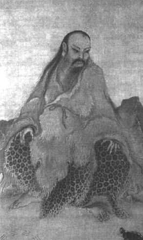
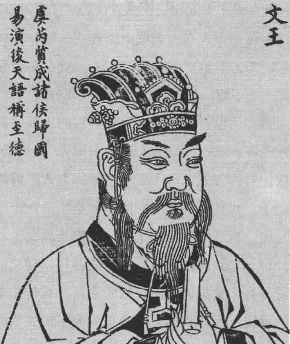
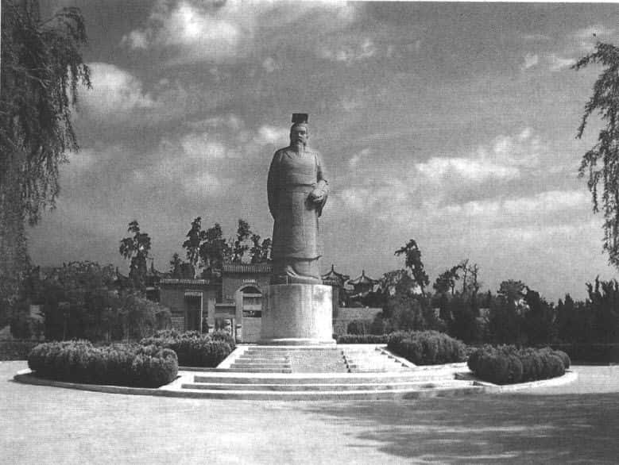
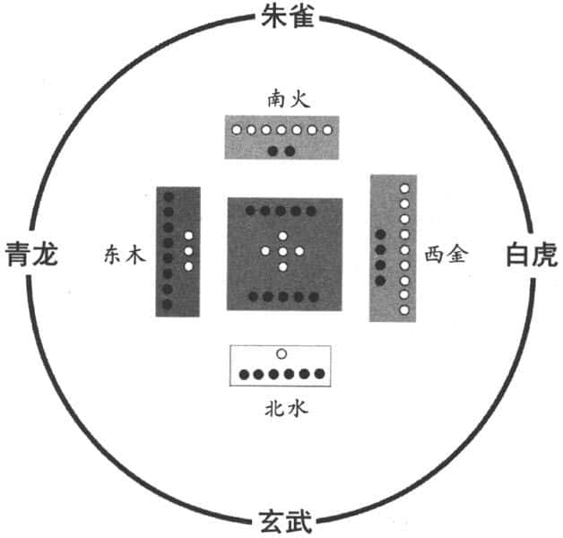

说到《易经》的由来，是个非常枯燥的问题，会涉及许多古代历史的情况。但是《易经》对我们中国人来说，确实是一个值得珍惜的宝贝。

我在美国读书的时候，有一个读化学的台湾学生，经常抱怨他的指导教授，因为该教授有一个规定，每星期三下午化学系的研究生要聚会，什么都可以谈，就是不可以谈化学。这下糟糕了，这位仁兄从小喜欢化学，除了化学什么都不懂。一到聚会就没话说，常常被人嘲笑。美国同学对他说，你不是中国人吗？中国不是有很悠久的文化吗？你怎么好像没有文化呢？因此他向我求助，我就对他说，好吧，我给你一个法宝。我就拿一张纸，画了一个先天八卦图给他，然后解释八卦——乾、坤、震、艮、离、坎、兑、巽，针对的是：天、地、雷、山、火、水、泽、风。我大概讲解了一下这八个符号的象征意义，代表八种自然界的现象，然后这些现象的组合构成一种状况。他听懂之后就去复印了几十份，第二个星期三下午聚会时就发给每一个人，大家一看，对他都非常尊敬。为什么？因为看不懂。然后就请他帮忙解释，他就照我讲的解释一遍说，用符号代替真实事物，符号的组合代表事物的变化；符号组合成六十四卦，再加上三百八十四爻，等于是六十四个大的状况、大的趋势，三百八十个位置，你在什么位置，你应该怎么办？这些人生的问题大致都涵盖在里面。讲完之后，那些外国老师、学生都对他非常佩服。别人问他，这是多久以前画的东西？他说，大概五千多年前吧。外国人听了更佩服了，因为五千多年以前，外国人的祖先还在森林里面玩“泰山”的游戏，我们中国已经有这样的八卦图出来了。这是一个我在异国关于《易经》的小插曲，我今天就要说明一下《易经》的由来。

# 《易经》形成的三个阶段 

《易经》可以推到四五千年前，它反映了人类在蛮荒之中的蒙昧阶段开始创造文明，它基本的过程是什么？研究中国古代历史不能忽略这一段，我们对于《易经》该怎么去了解呢？

一般来说，《易经》经过三位圣人，第一位伏羲氏（包牺氏），第二位周文王，第三位孔子。我们常说的上古时代之有巢氏、燧人氏、伏羲氏、神农氏，其实代表四个生活阶段。因为古人过的是群体性的生活模式。伏羲氏开始有渔猎社会，从事畜牧，养殖一些动物。神农氏就变成农耕社会，往后就是黄帝。伏羲氏如何画出基本的八卦呢？

伏羲氏 

我们想象一下，在开天辟地之后，人类在洪荒世界怎么生存呢？所有的一切都是最原始的，也没有任何可用的工具。如果要到一个地方去，想知道这个地方是好是坏，怎么做记号呢？就用结绳的方式。譬如，发现好地方或好事情，绳子就不打结，代表阳爻；发现地方不好或者危险的情况，就在绳子中间打一个结，代表“阴爻”，中间已经断了；然后每三个连在一起或六个连在一起，变成一个完整的现象，别人看到这些结绳的记号，就会对前面的状况整体上有一个了解，从而判断是好还是不好。

这说明古代没有文字，也没有书写的工具，只能用最原始的方式留下记号，即结绳记事。所以，从伏羲氏开始，以这样做记号的方式，等于是用结绳的方式，最原始的八卦就出现了，八卦出现之后，接着就是八八六十四卦，在伏羲的时代，也已经展示出来了。接着是周文王，周文王为每一卦写一句卦辞，每一卦的六爻各写一句爻辞。后代很多人说卦辞、爻辞里面所记载的资料，有一些是在周文王以后的事情，因此我们可以说是周公帮忙完成的。他们父子二人合作完成卦辞、爻辞。从伏羲氏到周文王，《易经》始成。后面是孔子和他的学生一代一代，好几代合作完成《易传》部分，以上就是《易经》本身写成的过程。

# 《易经》系出忧患意识 

这些先哲们为什么要写《易经》？它的目的是因为人有忧患意识。譬如周文王是在商纣阶段，商朝要结束，周朝要兴起。这时候难免很担心，因为天下乱的时候，谁知道将来是否平定呢？如果一直乱下去，就不可收拾了，人类就面临毁灭。为什么需要忧患意识？假设你家门前种一棵树，你且不去管它，在阳光、空气、水的作用下，这棵树自然会成长。其他的生物也一样，天上的飞鸟有窝巢，地上的狐狸有洞穴，你根本不用担心，万物自生自灭。但是人不一样，人如果跟其他动物一样，自然成长出来，就会变成很奇怪的动物了。

文王像 

换句话说，人不能离开人的社会，而人的社会需要有某种教化。在德国，曾经发现过一个狼孩子，他生下来被带到野外去，被狼叼走了。后来猎人抓到他，从他的骨骼、牙齿计算出，他已经十六岁，十六年来一直与狼生活在一起，他跑的姿态、叫的声音都和狼一样。被人救出来之后，用人类的方式怎么教他都没有用，几年后就死了。这说明什么？人不能够放在自然界，让他自由去发展，自由发展等于是没有人的生命。人类这种生命是最特别的，从身体结构开始，最重要的是心理。人能够学习、能够选择，这就让人担心，因为人的本能决定了他会替自己考虑。替自己考虑，就没有限制，到最后变成损人利己、以私害公。而其他生物很单纯，假设一只熊抓来一只兔子，它不会说今天手气不错，多抓几只存起来。它没有那个观念。狮子去抓羚羊，很顺利抓到一只，说今天手气不错，可以多抓几只，明天可以放假。狮子没那个观念，它每天填完肚子，吃完这些弱小的动物之后就休息。饿了就继续捕捉动物充饥，被抓的动物不是可怜、委屈，而是淘汰了，弱者淘汰了，留下来的是比较强的品种。这就是生物界的循环规律。

但人不一样，人如果这样的话，他可以发展他的欲望到无限的程度，譬如强凌弱、众暴寡，天下则不成为人的世界了。所以，古代的帝王、真正的领袖，他一定要有忧患意识，譬如如何让一个人遵守某种规范、能够互相帮助？因为人都有弱势的时候，小时候需要照顾，老了也需要照顾，不能只看中间这一段，只看中间这一段，大家都很厉害，年轻力壮、为所欲为。古代的这些政治领袖，之所以要制作《易经》出来，是因为什么？“忧患”两个字。我们也常常说“生于忧患，死于安乐”（《孟子·告子下》），在忧患中可以生存，在安乐中人恐怕就会灭亡了。这是中国儒家一贯的思想。这种思想非常正确，到今天也是一样。如果一个人没有受到好的教育，后果将不堪设想，他能力越强对社会危害越大。古代《易经》的由来，可以说跟这几位领袖人物有关，跟他们的忧患意识有关，到现在还是一样。我们常常提到《易经》里面的“居安思危”，在安定的时候就要想到危险的时候，太平的时候就要想到乱世的时候，如此一来你才会珍惜和平，才会长期保持平安健康的状况。

# 《易经》所描述的古代历史 

《易经》里面所描述的古代历史，跟我们今天所想象的古代历史是不是有落差呢？我们需要做一番介绍。我们看看《易经》怎么描写的，《系辞》中说：
> 古者庖牺氏之王天下也，仰则观象于天，俯则观法于地，观鸟兽之文与地之宜。近取诸身，远取诸物。于是始作八卦，以通神明之德，以类万物之情。作结绳而为网罟，以佃以渔，盖取诸离（ ）。庖牺氏没，神农氏作，斲木为耜，揉木为耒，耒耨之利，以教天下，盖取诸益（ ）。日中为市，致天下之民，聚天下之货，交易而退，各得其所，盖取诸噬嗑（ ）。神农氏没，黄帝、尧、舜氏作，通其变，使民不倦，神而化之，使民宜之。《易》穷则变，变则通，通则久。是以“自天祐之，吉无不利”。黄帝、尧、舜垂衣裳而天下治，盖取诸乾（ ）坤（ ）。刳木为舟，剡木为楫，舟楫之利，以济不通，致远以利天下，盖取诸涣（ ）。服牛乘马，引重致远，以利天下，盖取诸随（ ）。重门击柝，以待暴客，盖取诸豫（ ）。断木为杵，掘地为臼，杵臼之利，万民以济，盖取诸小过（ ）。弦木为弧，剡木为矢，弧矢之利，以威天下，盖取诸睽（ ）。上古穴居而野处，后世圣人，易之以宫室，上栋下宇，以待风雨，盖取诸大壮（ ）。古之葬者，厚衣之以薪，葬之中野，不封不树，丧期无数，后世圣人易之以棺椁，盖取诸大过（ ）。上古结绳而治，后世圣人易之以书契，百官以治，万民以察，盖取诸夬（ ）。 
第一位是伏羲氏（即上文中的“庖牺氏”）。我们看看怎么描写？古代伏羲氏统治天下时，抬头就观看天体的现象，低头就考察大地的规则。上面是天，底下是地。天有天体，如太阳、月亮、星星，还有风云变化。古人认为“天圆地方”，天体的运行是有规则的，有规则代表“去而复返”，一定是圆形；地本身看起来无穷尽，往东南西北哪一方看，都好像是平的，就是“地方”。所以，古代人认为“天圆地方”，是跟他们观察天体有关系的。天体的变化过程是昼夜这种自然现象的出现；地有山川、沙漠、高原，还有平地，它都有不同的规则；再仔细地检视鸟兽的足迹和花纹，以及山川地域的各种特性。伏羲氏把这些都了解之后，再根据自己的经验，参考各种事物的实际情况，然后着手制作八卦。

从伏羲氏统治天下到着手制作八卦，中间经过的一个过程就是仔细观察。为什么我们以前说“观察天道安排人之道”？就是因为人在开始面对世界的时候，一定要先了解这个世界。了解之后才能够选择一个更好的方式，配合天时、地利，能够更安稳地生存下去。后来农业社会的春耕、夏耘、秋收、冬藏都是类似的道理。

伏羲氏把八卦制作出来，有什么用处呢？首先是用于会通神明的功能。古代人对于很多事情不能解释，就归于神明。譬如，宇宙为什么要出现？人类为什么要发展？人类为什么是这样而不是那样？这只能说是神明的安排。所以，你要去会通神明的功能。

其次是用象征的方式“比拟”万物的实况。你要了解世界，你看每一卦的变化就够了，等于是“以简驭繁”，用简单来说明复杂。我们为什么说它是哲学呢？西方也是一样。西方第一位哲学家是古希腊的泰勒斯，他说宇宙的起源是水，用水的变化来解释世界的变化。很多东西是火、是土、是风，跟水有什么关系？他说，你把水烧开就变成气体，水凝结成冰就成固体。所以，水是液体、气体、固体统统兼顾在内。这种说法虽然不是很科学，但是，重要的是他作为哲学家，他不再用神话的方式来理解世界的起源。因为，当时哲学的出发点背后是神话。以前的人用神的故事来解释宇宙万物，神怎么造世界，神怎么造人；真正的哲学出现是用理性在人的经验世界里面，找到一个基本的材料，虽然这种说明很有限。我们中国用伏羲氏的背景来说，也是一样。他在观察各方面之后，用八卦来解释，而不用任何具体的物质；因为具体的物质、单一的因素，很难解释复杂的变化。

伏羲氏接着怎么做呢？开始使用《易经》里面的卦。第一步结草为绳，把草藤捆起来制成绳子，然后开始制作罗网，用罗网来打猎、捕鱼。代表伏羲氏时代是渔猎社会。“伏羲”二字我们平常理解为驯养野兽，把野兽变成我们的家畜来加以利用。《易经》里面就提到古人如何把野牛变成家牛的，把野牛抓来之后，在小牛的角上绑一个木板，让小牛在顶人的时候，人不会受伤，牛顶了半天发现没有用，就不再顶人了。因为牛的角是它最好的防身武器，也是攻击武器。任何东西来的时候，牛都用角顶。但是，你在牛角上绑一块木板，它怎么顶，你都不会受伤。久而久之，牛就放弃顶人的习惯了，就开始被驯养了。这种方法其实非常有智慧。就像印度人驯养野象，野象很大，人根本挡不住，不是它对手。怎么驯养呢？就把家象和野象绑在一起，让野象觉得：都是象，为什么家象这么乖呢？所以，野象也慢慢变成驯养的象了。这是印度人的方法，与我们老祖先的类似。对付小野牛是如此，对付猪的话就更简单了，猪的獠牙很厉害，在山上碰到野猪的话，我们平常人只有逃命的份。野猪很厉害，古人怎么办呢？把它去势（即阉割），去势之后它就不再那么凶了，野猪就变成我们的家畜。

《易经》里提到这些，说明在伏羲氏那个时代，就知道怎样制作罗网来驯养野兽，成为人类的家畜。但是不要忘记，《系辞传》提到的第一个卦，叫离卦（ ）。离卦本身并不是离别的意思，离也是罗网，它的卦象一看就知道，像罗网的样子可以去捕东西。但更重要的是“离”代表火，这说明火是文明的起源。

就像希腊悲剧家埃斯库罗斯写的《普罗米修斯》三部曲，普罗米修斯是巨人族，他看到人类活在阴暗潮湿的世界，深觉可怜，就到天上去偷火，把火种偷下来给人类。人类因为有了火之后，就开始发明各种东西，火是一切文明的开始。但是普罗米修斯得罪了天神宙斯，就要被罚。怎么罚呢？把他绑在高加索山上，让老鹰吃他的肝脏。“求仁得仁又何怨”，普罗米修斯也不会抱怨。但麻烦在哪里？就是这个可怕的惩罚，每天老鹰把肝脏吃完之后，第二天他又长出新的肝脏来。这个比喻是什么？我们顺便引申一下，就好比艺术家为了创作理想，而不顾日常的生活，穷困得不得了。往往在晚上的时候，心里想算了算了，明天去随便找个工作，至少每天领固定的薪水，不用再画画了。第二天早上起来，“肝脏”又长出来了，他又继续画画了。这是以前真正的艺术家。现在的艺术家不太一样，随便画一幅画，一卖可以卖好几万人民币，那不叫真的艺术家，跟古代艺术家完全不一样，画画变成商品了。火代表人类文明的开始，我们现在发现在伏羲氏里面所提到的，他制作各种事物的开始，不讲乾卦，坤卦，而是讲离卦，就是火，这是非常有趣的一种巧合，说明人类文明从火开始。

伏羲氏死后，神农氏兴起，开始砍削木头，做成犁，揉弯木条做成柄，可以耕田、锄草，教导天下百姓进入农耕社会。这几句话说得很简单，从渔猎社会进入农耕社会。作为政治领袖，就要有发明。要发明一种器具，可以使生活阶段往前推一步。接着更有趣的是开始建构市场，每天正午的时候开设市集，召来天下的百姓，聚集天下的货物，大家相互交换然后散去。最早不是用钱来买东西，是以物易物的交换方式，每个人都可以得到自己最需要的东西。为什么要在中午呢？因为“是”字，日正为“是”，太阳在正中间的时候，旁边没有阴影，一切都一目了然。在市场做生意，就是要一目了然，不能有任何舞弊的行为。所以，在中午的时候进行交易最公平。在神农氏的时候，已经发展到这一步了。

再接着之后是黄帝的出现。黄帝之后是尧、舜，他们几位就是设法让生活充满变化，让百姓不会倦怠，因为老百姓活在世界上容易觉得无聊，生活很单调。有时候每天看风景也很无趣，我们羡慕古代所谓园林式的生活，好像跟自然界的美景结合在一起。其实，以前的生活不一定快乐，“日出而作，日落而息，帝力于我何有哉？”听起来好像很愉快，太阳一出来我去工作，太阳一下山我就回家，天子、皇帝这些跟我有什么关系呢？在这里，你要想到的是辛苦，没办法休息，并且这种工作不断发展的话，最后就是五个字：重复而乏味。人最怕重复而乏味，古人也一样，黄帝时期就开始有各种花样出现了，让百姓不要倦怠，同时解决老百姓的困难，让他们活得比较愉快。从这里就推展出来黄帝、尧、舜的一些作为，无论如何都要让百姓过得快乐。这个时候才接着说乾、坤两卦的出现，叫做“垂衣裳而天下治”，“衣”代表上衣，“裳”代表裙子，古时候人都穿着衣与裳，今天女性才穿裙子，古时候大家都是上衣下裳。衣裳垂下来天下治好了，“衣”代表乾卦（ ），“裳”代表坤卦（ ）。“衣”在上，“裳”在下，这才是完整的意思，所以黄帝和尧、舜可以治好天下。

周文王被商纣囚禁地——羑里 

# 学《易经》，“穷则变，变则通，通则久” 

学《易经》，要特别提到一句话：“穷则变，变则通，通则久。”当你穷困了没有路走的时候，就要懂得因应变化，譬如，你做这一行走不通了，这行过时了，你就要改变；你不改变的话就会被淘汰。变之后就通达了，就有路走了，转个弯，前面就更宽。“通则久”，通了之就能持久。但是久了之后呢？久则穷，再回到开始，“穷则变，变则通、通则久”，不断地循环。《易经》谈到政治领导时，就注意到这些问题，“穷”、“变”、“通”、“久”，才能够长期去发展一个社会。活在世界上，对一般人来说是很辛苦的。为什么？因为没有明白人生的道理，就是活着而已。活着做什么？我们都知道“养儿防老、养女防老”，但事实上不见得可以达到这样的效果，而人的希望总是放在子女身上。很多人都有类似的经验，一旦有了孩子以后，看他们的成长；孩子越小，父母的希望越大；孩子越大，父母的希望越小；等到孩子都成年时，父母也就不抱什么希望了。

人在这个过程里面，自己慢慢老去，来不及后悔，来不及重新选择，人生就去掉大半了。请问这样的人生有什么意义？但是没办法，这就是我们所了解的实情，两三千年下来就是如此。今天这个时代不一样了，我们可以研究《易经》。《易经》在古代只有少数人可以读的。“不学易不足以为将相”，要当将军、要当宰相的人在学《易》。我们一般老百姓学了《易》，要做什么呢？今天就要突破这个范围，我们每个人都要学《易》，就要让每个人感觉到我的生命是独特的、独一无二的、不可替代的。所以，我们学《易经》就要了解古代历史怎么发展，人类文明怎么进步，今天我该怎么办？这样才能进一步接到下一步，要怎么样去掌握到主体性，让我自己的生命有它内在的价值，修养德行、培养智慧。

我们都知道，古代读书人很少，读书变成少数人的专利，所以很多人写的都是给那些统治者或者将来的统治者所看的，一般人就只能被人家安排过日子。现在不一样了，现在知识普及、知识开放，这是大好的机会。

# 《易经》与古代文明的发展 

那么黄帝、尧、舜之后，他们建构的社会规范到底是什么？首先开始造船，然后就有水陆交通的方便。那时的古人最怕碰到什么？最怕碰到河流，河流的水深不可测，充满危险，根本不敢渡过。所以在《易经》里面提到“坎卦（ ）”，“坎”就是水。然后看到山，高山，山为“艮”，艮卦（ ），代表阻止你过去，如果没有爬山的工具，太危险了，过水则更危险。如果开始造船，有了舟楫之利，就可以跟远方来往。接着，就要驯服牛、马，把货物带到远方，这样才慢慢完成从一个小的部落到大的部落的集合。古代就是部落的集合体，夏、商、周三代，夏朝有万国之称，有一万个部落（当然，“万”是代表一个很大的数字）；一直到周朝，才开始慢慢组成一个统一的国家，用封建的方式治国，而在这以前都是部落。所以，我们今天说尧舜如何伟大，其实是一个小的部落，治理起来比较容易，他们做好事，大家都可以看到。水陆交通方便了，接着为了社会治安的保障，武器、防备也出现了，因为有好人就有坏人，有老百姓就有强盗，这是没办法的事，这个时候百姓就需要保护。所以需要重重门户阻挡外面的不速之客，“不速之客”四个字也来自《易经》。《易经》里面很多语句都是我们现在还在用的。

舟车、武器、防备都具备了，接着就要设法安居乐业。譬如盖房子，古人大多住在山洞里面，像古代的“司空”之官职，相当于今天的建设部长，负责建设的。为什么司空变成建设部长呢？因为那时在北方靠山，在山底下挖洞当做住处，于是负责挖山洞的就变成“司空”，进而成为负责建设的官职。以前是挖洞，后来就发明盖房子住。要不然，住在原始的荒野或者普通的洞穴很危险，没有什么保障，盖了房子之后，才可以安居乐业。

再接着是丧葬仪式，因为人的生命发展到最后总是要结束。结束的时候，古代很简单。古代人死了以后怎么处理？根据《易经》的说法，人死了之后，就用很多柴草，把人一层一层裹起来，裹起来之后丢到荒野，既没有坟墓，也没有立一个墓碑。就这样子也不知道多少年代过去了，甚至丧葬守葬的时间长短也没有规定，有的难过几天算了，有的难过一辈子，这就说明当时迫切需要有人制订一个基本的规范。在《孟子》里面提到，丧礼是怎么出现的。当然孟子也是想象的，因为孟子不可能看过实际的情况。他说，上古时代，一个人的父母死了，就丢在山沟里面，有一天这个做儿子的上山，经过那边一看，很不忍心，为什么？因为野狗吃这个尸体，苍蝇、蚊子叮这个尸体，做儿子的一看，头上就冒汗了。孟子这样描写，好像他看见一样。这个做儿子的很惭愧，父母的尸体被这样子糟蹋，真是不忍心，不知不觉就冒汗了。不知不觉冒汗就是因为心里面不忍，然后开始有葬礼仪式，好好挖洞埋起来。孟子说的和《易经》里面所说的对照就知道古代的情况，后来就发明棺椁（内棺外椁），丧葬仪式通通上轨道了。

接着是古时候的生活，刚才讲过结绳记事。结绳记事就是用结个绳子代表某种状况，但是它无法传之久远，隔一段时间就不见了。后来发明了文字，发明文字以后就可以记录，记录的许多事情就变成古代历史的资料，这些留下来就可以对照，再评估一下，这个官做得好不好？如果没有过去的对照，怎么知道这个官做得好不好呢？没有资料无可奈何，有资料就不一样了。老百姓可以检查以前这个官怎么做，因为有文字的记录。有文字之后，可以受教育，我们说话就不一样了。但是，人类文字的发明也是很大的挑战。有人说仓颉造字，人生的困难常常是从认识字开始，据说仓颉造字之后，“天地动容，鬼哭狼嚎”，有文字以后，人类开始进入不同的世界，亦即文字思想的世界。平常我们的世界就是每天的生活，今天要吃什么，今天要喝什么，今天晚上在哪里过夜，这个照顾好没有。一有文字以后就开始想，我们怎么跟别人比较，怎么是比较好的方式，有资料可以对照，可以来讨论了。人的生命与文化为什么可以发展？就是因为可以摆脱当下的需求。何谓当下的需求？如果你每天只活在现在，吃了这一顿，不知下一顿，你不可能有任何办法去发明、制作文化的产品。你一定要能够共同合作，安定下来，譬如我认真做我的桌子，桌子做完之后，别人会把粮食给我，我可以跟他交换。如果你桌子做完之后，别人说不行，我耕的田，我自己的粮食自己吃，那你做桌子你吃桌子吧。那怎么办呢？没有人类生活的互助合作，一切都不可能再进一步发展。

因此，有些人专门去从事文化的发展。文化的发展在西方有个理论非常好，叫做“文化起源于闲暇”。什么叫闲暇呢？譬如，今天下午你有空，有休闲的时间，你才可能发展文化。各种文化的产品都要求精致精美，远远超过实用的需要。如果光讲实用，一个茶杯、纸杯都可以用，用久了之后，有的茶杯还需要美观一点，它除了实用之外，还可用来欣赏。我们日常生活里面，所谓今天留下来的文化古迹，很多都是属于这一方面，实用之外还要欣赏。因为你行有余力，就可以发展休闲生活，将文化生活向更高的方面改善。这样古代文明一步步下来，就好像我们今天看一些纪录片一样。

# 易经的卦象 

卦象是什么？虽然只有八个基本的卦，但还是需要用心学习。我们一旦了解《易经》里面任何一卦，一看就知道它在说什么，就不会迷惑了。任何一套学问，都有其基本的术语。基本的术语你没有学会，只凭常识去了解，永远都不能入门。相对的，你把基本的术语学会，就像你学数学、几何，把基本的公理、定理学会了，后面就很简单，只是运算而已。《易经》也是一样。从伏羲到神农氏，到黄帝、尧舜，都是根据《易经》里面的卦象来创造发明，创造发明各种生活上的必需品之后，人的社会才能稳定发展。这是第一次的应用。

我们将来再讲到《易经》每个卦的时候，都要开始联想，非常丰富的联想，等于说它的象征是个无限的象征。为什么一个卦六条线就这么特别呢？因为你先定好规则，先定好每个卦代表什么，用的时候可以重复使用。譬如，“巽”代表木头，同时又代表风。譬如说船怎么在水上走呢？因为上面是风，底下是水。风又是木头，木头就是船，船在水上走，变成航行了。慢慢习惯这一套之后，我们平常跟别人来往或者读书的时候，也同样地会有各种联想力，学习的能力也会越来越强。

# 古代成为圣人的条件 

最后我们再看一下，古代圣人的条件。学《易经》的目的有三：第一，提高自己的德行；第二，增强自己的能力；第三，培养自己的智慧。古代圣人就这三个条件。第一个谈德行，只有德行高的人才能让天下人都心意相通。“德行”基本上是帮助别人，我做好事，你做好事，被帮助的人当然会觉得开心，觉得我们很了解他。我们都知道所谓的善恶，有一个最简单的定义方法。“善”就是替别人着想，“恶”就是自私自利。所以，宋朝的学者就提到“公心”和“私心”，只要你有公开的心、替别人设想的心就是“善”；你有私心，什么都替自己着想，那就变成“恶”了。同样，你有德行，你自然而然尊重别人、帮助别人，天下人就跟你情投意合。德行是唯一能够号召每一个人来支持你的，否则，你能力很强，德行不够，你就变成曹操了。这样的人，天下人都不会服从、接受你；相反，你德行很好，能力不太强，照样得到很多人的肯定，因为大家都知道，你上来会对底下的人很好，这是普遍的愿望。

古今中外都一样。德行是第一个条件，如果你从儒家来解释的话，才能讲得圆满，因为儒家讲的是“人性向善”，“向善”有一个基本原则，叫做真诚。你不真诚，你所过的就不是人的生活，所做的就不是人的事情，只是生物而已，吃饱喝足，只为自己的需要而考虑，所以跟人无关。一旦真诚，立刻就会发现我跟别人之间有一种适当的关系要我去实现。我坐车的时候看到老人家，我就让座，为什么？因为我跟他之间的关系，他坐着，我站着，比较适当。我这样做的时候，有两种考虑：第一，将来我老的时候，别人也会让座给我；第二，我不管将来会不会有人让座给我，我现在该让座，让座之后心里愉快。儒家讲求第二种，为什么？你如果讲第一种，谁能保证我年轻的时候经常让座，我老了之后，别人也会让座给我，这恐怕是幻觉。这样一来，你就没有什么把握了，然后就不愿意长期做下去了。儒家讲“人性向善”，有一个重要的结果，当你行善的时候，快乐一定要放在第一位，这是最主要的关键。你讲宗教的话，善恶的报应恐怕在来世，恐怕在将来的世界。讲儒家，善恶的报应，行善心安，心安的快乐最大。为恶的话，也许表面有利益，别人也许不知道，但是你内心里面放不过自己，会责怪自己，内心里面很难过，心里面难过，也就是一种恶报。这就是最简单的一种理解方式，从儒家来说。这就是第一点，德行才能够让天下人心意相通。

第二，有能力，才能安定天下人的事业。天下人有许多事情，像农田水利，开运河，造长城，那需要有能力。能力不够，长城垮塌，运河也不可以航行，那怎么办呢？所以古代圣人讲究能力，这个能力一定要从基本的要求，慢慢磨炼。磨炼之后，能力自然就强。

第三点是智慧。《易经》比较强调的德行之外就是智慧。因为你要替天下人判断他们的疑惑是什么，让他们解除疑惑。人生充满困惑，每一个人都如此，尤其是年纪大的人，常常要回答年轻人所提的问题。他问你这个怎么回事，那个怎么回事。我们就必须负责回答，你不能回答，代表你智慧不够。因为你回答的事情，不见得是你都经验过的。如果我经验过，我当然可以回答，很容易，因为我自己有经验。但是很抱歉，各行各业的经验怎么可能都有呢？各种人生的经验这么复杂，怎么可能你都具备呢？孔子说，“有鄙夫问于我”，有一个乡下人问我。“空空如也”，代表这个人非常诚恳老实的样子。“吾有知乎哉，无知也”，我有这个智慧吗？我有认知吗？其实我也是无知的。孔子说他是无知的，与西方的苏格拉底可以相应。西方的苏格拉底，表现得极为精彩。他曾经说，神说我苏格拉底最聪明，是因为所有人里面只有我一个人知道我是无知的。听起来像是反话，苏格拉底说只有他知道自己是无知，别人连自己无知都不知道，所以比他更无知。孔子也说过，“我无知”，但是有人问我问题，怎么办？“叩其两端而竭焉”，我就问题的两方面，“要”或者“不要”，“好”或者“不好”，仔细研究，然后给他一个答案。通常我们回答问题的方法，不在于回答而在于分析，把问题分析清楚了，提问题的人就知道该怎么回答了。因为只有提问题的人，才知道问题的答案在哪里，这就是儒家的智慧。古代的圣人，他们的智慧就要靠判断，天下人的疑惑该怎么解决，这里就牵涉到占卦的问题。

# 结　论 

我们这节讲《易经》的由来，可以说把古代历史最早的那一页做个说明。从最早的伏羲氏到尧舜的阶段，你可以看到文明的演化，一步一个脚印，慢慢走过来。它的关键是忧患意识，所以制作《易经》、制作这些卦象的人，心里面就有忧患意识。忧患意识是儒家的特色，关于忧患意识，在《中庸》里面就提到“天地虽大，人犹有所憾”，人的遗憾跟《易经》所说的忧患是同一件事。为什么遗憾呢？是自然界你不用管它，它有生态平衡，有食物链的各种安排；而人类一出现，问题非常大而且多，人类如果没有受适当的教育，始终不能安顿自己。遗憾和忧患就在这一点上。我们看到《易经》的时候，就知道《易经》里面原来充满了各种忧患意识，在今天来说还是值得重视的。今天每一个人都会觉得，我活着意义在哪里？现代人什么都有了，物质生活不是问题，社会生活也都已经上轨道了；但是常常还是会问，人生有什么意义？所以抑郁症越来越严重，很多人什么都有，就是觉得生活没什么意思，好像每天都差不多；也没有什么生活的动力，感觉活着不活着，差别也不大。这就是我们要面对的问题，现代人也是一样，怎么样去面对忧患，怎么样去化解。以上就是有关《易经》的由来，到这里告一段落。

# 易经小常识 

## 关于《易经》的传说：河图与洛书 

河图洛书是中华文化、易经八卦和阴阳五行术数之源。相传在上古时期，龙马负图出于黄河，伏羲依此创“先天八卦”；大禹治水时，洛河中浮出一只神龟，大禹用它制成“九畴”（见《尚书·洪范》）。后世的人们便以“河出图”、“洛出书”象征太平社会的祥瑞。

**河图** （见下图）

河图 

《河图》使用十个黑白圆点来表示阴阳、五行、四象的，其图为四方形。分别为：北方是1个白点在内，6个黑点在外，五行为水，象为玄武；南方是7个白点在外，2个黑点在内，五行为火，象为朱雀；东方是3个白点在内，8个黑点在外，五行为木，象为青龙；西方是9个白点在外，4个黑点在内，五行为金，象为白虎；中央是5个白点在内，10个黑点在外，表示时空起点，五行为土。其中，白点为单数（奇数）为阳，黑点为双数（偶数）为阴，阳数相加为25，阴数相加为30，阴阳相加共为55数，即万物之数皆由阴阳（天地）之数化生而来；“四象”按古人坐北朝南的方向为正位依次是：前朱雀、后玄武、左青龙、右白虎，为风水象形之源。

# 洛　书 

将河图西方的八个数旋转而排成八方而为八卦，每方一个数纳地支十二气象，就是洛书。洛书的1、2、3、4、5、6、7、8、9阴阳和为45，为五行天地万物生死存亡之数。洛书将河图的四面化为八方，五行数位也相应起了变化：水一、火二、木三、金四、土五。阳数和为9，阴数和为6，所以《易经》卦爻中，阳爻称九，阴爻称六。阴阳数和为15，为天地人三才五行的数。

