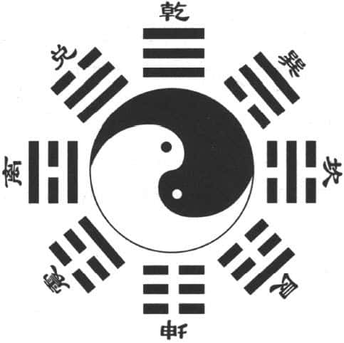
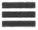
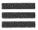
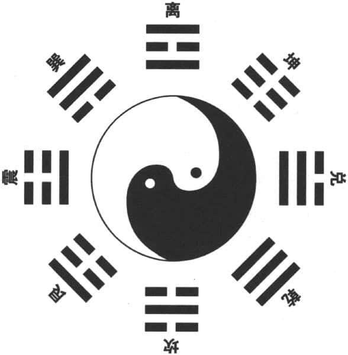
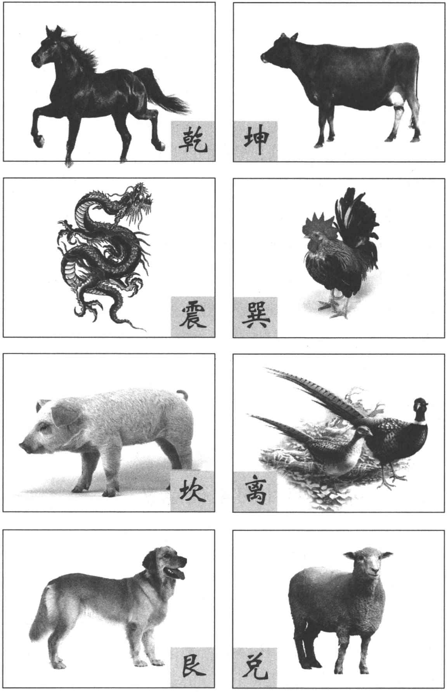
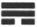
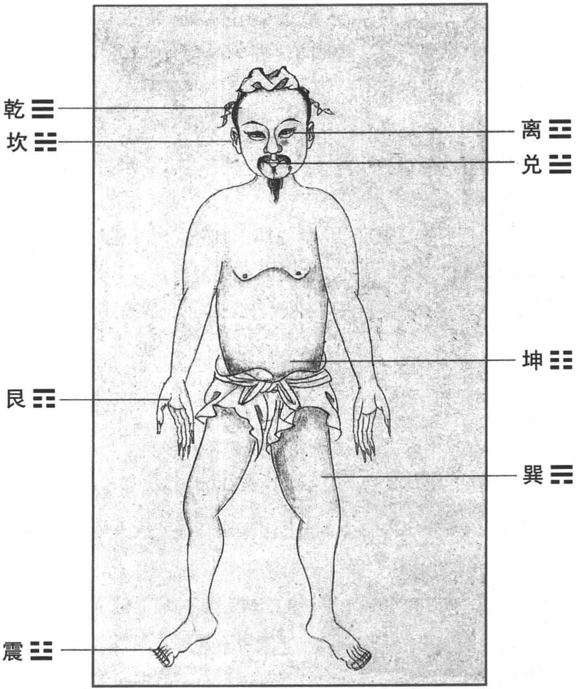
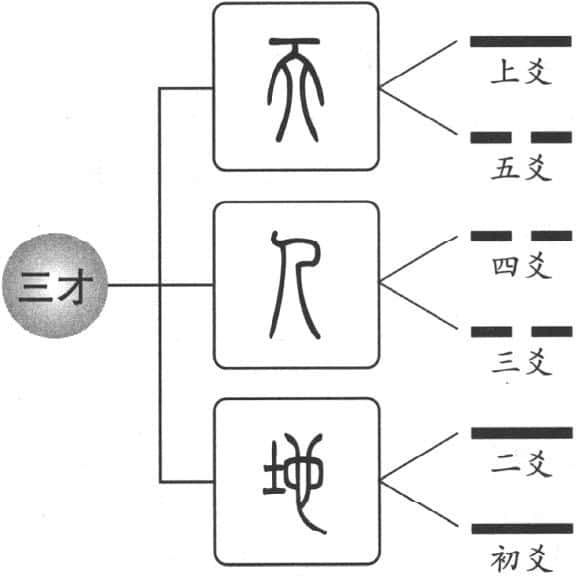

我自己学习中国古代经典的时候，把《易经》放在最后，因为它最难，也需要有某种生活的体验之后才有可能去了解，而且孔子本身，也是五十岁才研究《易经》的。虽然它的内容扼要，但是它里面的道理很深刻，需要有生活经验的对照才能够觉悟。古人研究《易经》，往往把《易经》当做老师或父母来面对，因为人到中年（五十岁）之后，父母年纪大了，老师也不在身边了，这时需要别人给你指导、启发，怎么办呢？学习《易经》，所以，以我自己来说的话，把易经当做我的精神导师。历代很多读书人也是一样，个人的生活少不了《易经》，尤其在五十岁左右这个阶段，把《易经》学会，就可以得到古人智慧最好的精华。

我们接着就要谈到卦象，不了解卦象的话，只能永远把《易经》当天书来看，了解卦象的话，你“虽不中亦不远矣”，就是任何卦出现之后，你就会知道说上面什么卦，底下什么卦。念的时候有它特别的念法，像乾、坤这些卦，我们将来会谈到比较详细的部分，今天最主要的是要介绍基本的八卦的卦象。

# 先天八卦图 

通常我们看到一个卦，会觉得很陌生，因为不了解其结构。如果我们从最基础的去了解，《易经》六十四卦都不会难倒我们。

通常，我们可以看到很多地方，都会用到“先天八卦图”（见下图）。我们看的时候，要以中间的太极图作为核心，从内向外看，你要把它的中心当做底部，由下往上看。《易经》的卦是由下往上画的，为什么？任何东西都应该有根基才能够往上发展，小孩子慢慢长成大人，公司、企业、各个单位从基层开始往上发展，这是一个基本原则。这个先天八卦图中间是一个太极图，太极图黑中有一个白点，白中有一个黑点，称作“阴阳鱼”。鱼有眼睛，眼睛与身体的颜色是对照的，代表“阴中有阳，阳中有阴”，互相变化。所以阴阳没有一定的，要看你的位置而定，其本身代表一种力量，即创造力和发展力。“先天八卦图”上面是乾卦，代表天，三条阳爻，三条横线非常充实。最底下三条阴爻构成坤卦，代表地。左边为离卦，“离”就是火，阴爻在中间。右边为坎卦，中间是阳爻，上下是阴爻。左下角是震卦，右下角是艮卦，左上角是兑卦，右上角是巽卦，阴爻在最底下的位置。这基本的八卦又代表了八种自然现象，乾是天、坤为地、离属火、坎为水，震是雷，艮是山，兑是泽，巽为风。这就是“先天八卦图”。

先天八卦图 

# 说　卦　传 

基本的八卦都代表什么，《易经·说卦传》里有说明，我们先看一下：
> 乾，健也；坤，顺也；震，动也；巽，入也；坎，陷也；离，丽也；艮，止也；兑，说也。 > 乾为马，坤为牛，震为龙，巽为鸡，坎为豕，离为雉，艮为狗，兑为羊。 > 乾为首，坤为腹，震为足，巽为股，坎为耳，离为目，艮为手，兑为口。 > 乾，天也，故称乎父；坤，地也，故称乎母；震一索而得男，故谓之长男；巽一索而得女，故谓之长女；坎再索而得男，故谓之中男。离谓之中男；离再索而得女，故谓之中女；艮三索而得男，故谓之少男；兑三索而得女，故谓之少女。 > 乾为天，为圆，为君，为父，为玉，为金，为寒，为冰，为大赤，为良马，为老马，为瘠马，为驳马，为木果。 > 坤为地，为母，为布，为釜，为吝啬，为均，为子母牛，为大舆，为文，为众，为柄。其于地也为黑。 > 震为雷，为龙，为玄黄，为旉，为大途，为长子，为决躁，为苍筤竹，为萑苇。其于马也，为善鸣，为足，为作足，为的颡。其于稼也，为反生。其究为健，为蕃鲜。 > 巽为木，为风，为长女，为绳直，为工，为白，为长，为高，为进退，为不果，为臭。其于人也，为寡发，为广颡，为多白眼，为近利市三倍。其究为躁卦。 > 坎为水，为沟渎，为隐伏，为矫輮，为弓轮。其于人也，为加忧，为心病，为耳痛，为血卦，为赤。其于马也，为美脊，为亟心，为下首，为薄蹄，为曳。其于舆也，为多眚，为通。为月，为盗。其于木也，为坚多心。 > 离为火，为日，为电，为中女，为甲胄，为戈兵。其于人也，为大腹。为干卦，为鳖，为蟹，为蠃，为蚌，为龟。其于木也，为科上槁。 > 艮为山，为径路，为小石，为门阙，为果蓏，为阍寺，为指，为狗，为鼠，为黔喙之属。其于木也，为坚多节。 > 兑为泽，为少女，为巫，为口舌，为毁折，为附决。其于地也，为刚卤。为妾，为羊。 
以下是具体的说明。

# 八卦的象征意义（以乾卦为例） 

我们接着就要说明每一个卦具体代表的是什么？主要是五个部分：第一，自然界的现象。譬如，我们看乾卦（ ），乾卦是三阳爻构成，乾卦代表自然界的天，天生万物。坤卦代表地，是完成阶段。天和地分工合作，所以天代表一个创始的力量。在乾卦（ ）的《象传》说：“天行健，君子以自强不息。”“健”就代表生命力无限的强大，因为乾卦都是阳爻，阳爻代表主动力，产生的力量自然很大，刚健不已。另外，人类的观察首先就是天象，如日月星辰，尤其是看到日月的活动从来没有停止过。所以，我们要知道，每一个卦有自然界主要的现象作为其象征。

第二，代表性情。譬如乾卦为“健”，刚健不已，生命力旺盛；坤卦为“顺”，代表柔顺。

后天八卦图 

第三，代表家庭关系。乾卦为父，坤为母，然后父母生了三男三女，参考**后天八卦图** （见上图）。

另外六个卦就是三男三女，长男、中男、少男，长女、中女、少女。

第四，代表人的身体结构。譬如乾为“首”，坤为“腹”，因为母亲会生孩子，就像大地生产万物一样。其他的手、脚、眼睛、耳朵各有代表（譬如震为足、巽为股、坎为耳、离为目、艮为手、兑为口）。把这些掌握住以后，将来占卦的时候才知道这个卦代表某一身体器官，如此可以帮助理解。

第五，代表某一动物。譬如乾是马，坤是牛，所谓父母亲做牛做马，就是如此来的。为什么说乾为“马”呢？因为在古代，跑得最快、最久的就是马，代表马可以象征乾卦的“健行不已”。

以上是从八卦的自然象征、基本性质，再到人类的家庭结构和身体，以及周围的动物，至于底下延伸发展的象征就更多。譬如“君”，“乾”当然是国君，“坤”就是民众，有君就有臣或者老百姓。乾卦也象征金、玉，代表非常贵重的东西，颜色就象征大红色，因为在古代红色是正色，由此可见，你把基本的八卦都了解之后，可以发现每一卦所象征的意义很清楚。

# 坤卦的象征意义 

接着是坤卦（ ），坤卦是三个阴爻，由下往上。坤是指地，坤的特色是顺从。上天给你沙漠就是沙漠，给你河流就是河流，大地完全不会选择，你给我什么，我就发展什么。这里适合种植稻米、种植小麦，完全接受，就像作为母亲一样。母亲是完全顺从的，逆来顺受。在家庭里面，坤卦当然是象征母亲了，这就不用解释了。在身体结构里是代表“腹”，就是肚子，我们刚刚说过。哪种动物最像“坤卦”呢？就是牛，因为牛最顺从，牛能拉车，又能耕田，非常的辛苦，它的特性就是顺从，任劳任怨。那底下另外的象征就是“众”，即国君所辖的臣民，现在的坤卦代表民众，有君就有大众。还有“布”，母亲要负责织布；“釜”，代表母亲要烧饭。接着是“大舆”，大车是就是牛车，古代的车分大小，大车是牛车，小车是马车，牛车可以载重，马车跑得快。

八卦与动物的关系 

# 震卦的象征意义 

接着是震卦（ ），为什么叫震卦呢？因为它的阳爻在底下，《易经》反映的是人类的思维模式，“物以稀为贵”，哪一个爻比较少，越少的越贵重。震卦三爻，底下一个是阳爻，上面两个是阴爻，阳爻比较贵重，这个卦就叫阳性卦，就是属于男性。属于男性，底下一个从下往上，叫做“初”，谓长男，家中第一个男孩。从下往上算的话，第一个是阳爻，上面两个阴爻，阳爻为主。我们讲到女性的阴性卦的时候，也是一样的方式。“震”代表雷，打雷是震动，让大家都注意，长男诞生了，将来要继承位置的。它的特性就是“动”。我们说春雷乍响，万物又重新开始了生机。那么，哪一种动物最像长男呢？我们常说“望子成龙”，当然是龙了。很多人说有龙这种动物吗？我们讲乾卦的时候会专门讲龙，我们就会知道到底有没有龙？龙代表青色、青黄色这些颜色。震卦的身体部位就是“足”，“足”就是脚。震卦代表“大涂”，即大马路，也代表急躁，耐不住安静。还包括“善鸣马”，叫的声音很响，它一叫，别人就知道它来了。

# 巽卦的象征意义 

有长男就有长女，长女是哪一卦呢？巽卦（ ）。巽卦初爻是阴爻，上面两个阳爻，物以稀为贵，这叫做阴性卦，代表长女。巽在大自然中象征风，风代表空气，有天有地，又打雷的，当然还有空气。空气的特性是什么？“入”。“入”代表没有任何地方没有空气，代表非常的顺利。长女做任何事情很顺从，跟母亲的顺从不一样，坤卦的顺从是我顺着你，巽卦的顺从本身没有什么立场，什么地方需要，它就在哪里，它本身是无所不入。那么，哪一种动物能够代表巽卦呢？就是鸡。我们都知道，鸡跟人类很亲密，但是鸡也很辛苦的。现在测风向的时候，很多地方就竖一根竹竿，上面画一只鸡的样子，我们叫“风鸡”，看风向何在，因为它是巽卦。我们的身体哪一部分属于巽卦呢？就是“股”，即大腿，“股”本身不能动，只是顺着脚怎么走，脚怎么走，大腿是配合的，跟它作为风本身没有主张、顺从有相当的关系。巽卦的其他什么象征呢？像“绳直”，像木头一样直，代表“木”，树木的“木”。还有“进退”，风本身有前进有后退，它没有什么特别坚持的立场，可进可退。另外还有“不果”，就是没有结果，没有什么具体的成果表现；“近利市三倍”，如果说你现在要做生意，占卦出现了巽卦，很好，恭喜你有利可图。这就是巽卦，它代表风，代表无所不入，非常的柔顺，但是就因为你顺利，也没什么特别的结果，变成进退不定，随别人摆布。从这里我们就可以知道，每一个卦发展出来都是有优点，有缺点，就好像我们平常讲星座，每个星座都有优点和缺点。在家庭的结构里面，你总是扮演某一个身份角色，我们不能说哪个角色一定都好，譬如在古代长子就有长子的压力，因为他被寄予重任，要继承父亲的位置，压力很大，有时候很难发展他的个性。

# 坎卦的象征意义 

接着，我们看坎卦（ ），坎卦就是水，它代表中男，三爻里面，中间那一爻是阳爻，上下是阴爻，显然是一个阳性的卦。水有什么特色呢？坎者，“陷也”，当你看到水的时候，不知道它有多深。有时候表面好像很浅，其实里面有漩涡。所以坎代表陷阱、危险。一般看到坎卦，都会警惕。坎卦象征人的哪一部分？耳朵。为什么象征耳朵呢？因为耳朵可以集聚声音，就好像水可以聚在一起一样，哪个地方比较低，水就聚在一起。在我们周围的生物里面，它象征哪一种动物呢？“豕”，即猪。这些古代的象征，你一看就知道，是从渔猎社会到农耕社会的一个过程，选一些很熟悉的生物来作为每个卦的象征。我们都知道，猪喜欢潮湿、黑暗的地方，可以好好睡觉。在心理学上来说，中男是很难做的，上有哥哥，下有弟弟，所谓两头受气。在其他象征方面，坎代表月亮，然后也代表强盗，为什么？危险。古时候就是怕强盗，没有其他什么复杂的对立因素。接着，坎是“沟渎”，即水沟，人有时候看不清楚它有多深；又是“加忧”，所以碰到这个坎卦的时候，又有危险，又可能有强盗，令人忧愁。然后，它是“美脊马”，它的背脊很漂亮。再就是“多眚舆”，就是多灾多难的车子。我们占卦的时候，有时候会很紧张，可不要占到坎卦，因为坎卦一出现，就代表不会那么平顺，会有各种麻烦，但是也不用担心，危机有时候就是转机，就看你如何去面对。这就是坎卦。

# 离卦的象征意义 

然后，当然是中女了，就是离卦（ ），离卦三爻里面一个阴爻居中，两个阳爻各居上下，以阴爻为主，是阴性卦。离卦在自然界代表火，它有什么特性呢？特性叫做“丽”，“附丽”依附的意思。因为火不能独立，火离不开可燃烧的材料。你说你在路上看到鬼火在飘，那也不是真正的独立，是因为有磷的缘故。小时候我们住在乡下，经过坟墓区的时候，一到傍晚看到鬼火，小朋友们都很紧张，长大之后才知道，那是因为坟墓里的骨头里面含磷，到了一定温度就燃烧。哪一种生物最像我们所见的离卦，就是“雉”，野鸡。在古代，“雉”是很美丽的一种动物，我们刚刚提过长女叫“鸡”，鸡是家里养得很乖的，中女就不太乖了，就要当“雉”，打扮得漂漂亮亮的，反正姐姐把家务都做了，我就应该可以去表现一下了。在身体上，离代表眼睛，因为火代表光明。能够让你看到东西，感受到光明的，就是眼睛。离卦也代表“日”，太阳。另外它还代表闪电，闪电就有亮光；还有甲胄、戈兵，这是打仗用的，水火无情，火一出现代表战火。这个离卦也就演变出很多复杂的东西，譬如“大腹人”，就是肚子特别大的人。为什么这样说呢？因为它跟乌龟很像，乌龟是可以拿来占卦的、占卜的，指示隐微的道理。这是离卦的象征。

我们谈的每一个卦最基本的特征，我们一定要记得，尤其我们所列出来的每一个，都应该把它放在心上。譬如，看到离卦就要想，我该怎么去看这个卦呢？因为将来看到基本的六十四卦，都是八卦两两相合，八乘八就是六十四。每一个卦都是六爻，我们现在看的每一个卦都是基本卦，你把三爻基本卦都掌握住了，将来再加一倍，变成六爻的一个基本卦，就没有问题了。离卦代表火，火是依附在别的东西上面的，在家庭里面代表中女，在身体上代表眼睛，可以看到东西，在自然界又代表太阳，像这些都是要联想的。在哪一个卦需要想到什么东西？将来就会发现，用得最多是它的特性，像离卦的“丽”，就会想到依附；还有光明，看到离卦，就会想到大放光明。它们的引申象征确实非常丰富，有时候需要联想，联想出来的时候就会发现原来是这个意思，就像我们在生活上许多事情，不是一目了然的，许多事情本来就有各种含义，你想东，他想西，问题是谁想得比较周全，谁就没有什么盲点了。

# 艮卦的象征意义 

我们继续看最后两个卦，最后两个卦，当然是少男、少女。代表少男的是“艮卦”（ ），艮卦是阳爻在上，第三个位置。艮就是山，它像不像山呢？我们平常看山的时候，不会看山脚，会看山有多高，看山的棱线。平常我们画山的时候，底下不会很明显地画，而是勾画上面。所以，它上面是实的，底下是虚的，这就是艮卦，代表山。山的特性是“停止”。古时候的人，没有办法越过高山，所以看到高山只好停下来，在山脚下筑室而居，不要想去翻山越岭。身体上什么地方可以让别人停止？手。譬如，一个人要过来，用手挡住他，手就是“艮卦”的身体部位象征。我们所了解的生物里，哪一种生物可以帮我们挡住别人呢？当然是狗。狗可以看门，让你不再前进，这是最基本的象征。再引申的话，就发现它代表“门阙”，即门槛，也代表小的路，小石径路（震卦代表大马路，艮卦是小径），还代表“果蓏”，即果实，然后代表“黔喙之鼠”，就是嘴巴是黑色的，尖尖的，反正嘴巴突出的、尖尖的，在艮卦都是可以作为象征的。当然，有的象征是相对于别的卦象征才有用，如果光看这个卦的话，前面五点可以，后面引申的象征就很复杂了，后面引申的往往代表相对。别的卦代表某种动物，长男代表龙，将来可以接位子，长女比较辛苦，代表鸡，要做很多家事；中男没人管，就当猪好了，中女的话，打扮得漂亮一点，当雉。少男当狗的话，少女当什么？就是羊。

# 兑卦的象征意义 

最后，要说一下第八个卦兑卦（ ）。兑卦在自然界里面代表沼泽，我们比较疏忽的就是沼泽。因为别的卦听起来很熟悉，上有天，下有地，长男就是雷，长女就是风，中男就是水，中女就是火，天、地、雷、风、水、火，都很熟悉。艮代表山，谁没有看过山呢？兑卦代表“泽”，沼泽的泽，古时候有很多沼泽，泽与水一样吗？不一样，坎卦的水是流动的，危险的，但是沼泽的水是安静的、静止的。古时候的人或者其他的生物，看到沼泽都很开心。所以，兑即“悦”，看到沼泽都很开心，因为大家都需要水，没有水怎么生活呢？在家庭里面代表少女。在人的身体的部位，代表口，因为你要让别人开心，就要说话。像我们跟别人来往，你多说好话，别人一定会开心，你不说话光用眼睛，光用其他方面的手势都是不够的，一定要说话，要说好听的话让别人开心。兑卦代表哪一种生物呢？当然是羊，羊最柔顺。你想到羊，就想到说这个羊真的很乖的，就跟小女孩一样，这是最基本的象征。但是，它底下延伸的部分就比较复杂了。譬如“口舌是非”，既然是口的话，当然会有“口舌是非”了，讲话可以讲好话，也可以是坏话，到最后传了很多八卦消息，都是从口出来的。另外还有“毁折”，你要说别人坏话或者说一个东西坏了，就跟这个也有关系。兑卦也代表“巫”、“妾”，“妾”是年纪比较轻的，这跟少女是有关系的。

这样一来，就可以大概了解，原来古人真是聪明，用八个基本的卦象，天地各种现象都呈现出来。阳爻、阴爻之主动、受动配合起来，不断变化，推动世界循环发展。

# 结　论 

由上可知，“先天八卦图”所代表的是一个基本的结构。那么如何把这八个基本的卦的卦象记住呢？古人给我们编了一个口诀，有利于我们记住，即：“乾三连，坤六断；震仰盂，艮覆盌；离中虚，坎中满；兑上缺，巽下断。”这个基本的八卦我们一定要很熟悉，平常要多看几遍，多想一想每个卦代表什么，在自然界有什么现象，基本的性质如何。然后在家庭里面，它代表什么样的角色，代表什么样的位置，代表身体上哪一个部位，以及我们所养的动物里面哪一种动物，再引申出来一些基本的观念。这样你就会掌握到《易经》的密码，以基本的三爻卦为基础，合成标准的六十四个六爻卦，那时我们就开始又进入一个非常复杂有趣的《易经》世界了。以上就是对《易经》的基本卦象做的一个介绍，这是最基本的部分。

乾为首　坤为腹　震为足　巽为股

坎为耳　离为目　艮为手　兑为口

八卦与人体部位的关系 

# 易经小常识 

## 关于爻的一些术语 

**内外卦** ：六十四卦是由八个经卦（三爻）两两相重，合成六爻卦。底下的三爻卦称为内卦或下卦，上面的三爻卦称为外卦或上卦。在念的时候，要由下而上，念成“初、二、三、四、五、上”。譬如，乾卦（六爻皆阳）要念成“初九、九二、九三、九四、九五、上九”。坤卦（六爻皆阴）要念成：“初六、六二、六三、六四、六五、上六”。依此方式，其他各卦都是阳爻念“九”，阴爻念“六”。

**当位** ：由下往上，初、三、五是阳位或刚位，二、四、六是阴位或柔位。阳爻或阴爻在其适当位置，就称为“当位”。如：初九、九三、九五，六二、六四、上六，都是当位。否则就是不当位。

**应** ：内外两个小卦之间，有其相对应的爻，如初与四、二与五、三与上。两者若是阴阳相应，为吉。若是为邻，称比。

**乘与承** ：上对下为“乘”，下对上为“承”。一般认为，阳乘阴，阴承阳为佳。反之则为不顺。

**得中** ：内外二小卦皆有中位，亦即二与五。凡得中者为佳，表示言行结合乎中道。

**三才** ：六爻八卦每相临两爻一组，成形“天、地、人”三才。其在空间上，可分为天道、地道、人道三个层次；在时间上，代表未来、现在和过去。

