在金庸小说里面，有一部叫做《射雕英雄传》，男主角郭靖向丐帮的帮主洪七公学习武功，名为“降龙十八掌”。“降龙十八掌”一出手，天下人没有人挡得住。在“降龙十八掌”里就有好几个掌的名称与《易经》的乾卦有关，像“潜龙勿用”、“见龙在田”、“龙跃于渊”、“飞龙在天”，以及最后一招最厉害的“亢龙有悔”。说实在的，你就是请金庸大侠自己来表演，他也不知道怎么表演。这都是好的名称，武侠小说本来就是虚构的，各种武功描写得神之又神，我们看了也是非常羡慕，非常崇拜。但是，它基本上来自《易经》的启发，乾卦六爻有五个爻都被他用上了，变成降龙十八掌里面的五掌。我们今天，就从这里开始，要详细地说明一下“天下第一卦”——乾卦与自强不息的关联。

# 乾卦卦象和卦辞 

“自强不息”就是乾卦基本的启发。乾卦六爻皆阳（见下图），代表了无限的生命力，整个宇宙能够开始，就是由乾卦创始的。“乾”代表天，“坤”代表地；乾卦六爻皆阳，坤卦六爻皆阴，这两卦是最标准的、最基本的，所以我们要做比较完整的、充分的介绍。其他的六十二卦都是阴阳交错的或者是阴阳分配在特定的位置。看到阳爻，就会想到它的基础在于乾卦，它是标准的六爻皆阳的阳性卦；同理，看到任何一个阴爻就要想到坤卦。所以说“乾、坤”是进入《易经》的门户，意思就在这里。你不懂这两个卦，没有彻底了解，就不知道后来在说什么。《易经》的乾坤两卦，在《易传》里面解释得特别多，比别的卦多了好几倍的篇幅，目的就是希望我们一开始能好好掌握住这个基础。

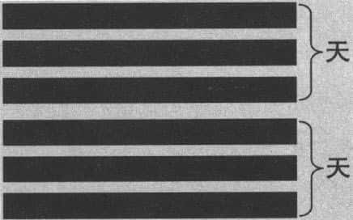

乾卦卦象 

乾卦六爻该怎么念呢？要由下往上，即初九、九二、九三、九四、九五、上九。我们可以发现，它不讲一跟六，“一”要念成“初九”或“初六”，六要念成“上九”或“上六”，其他的则是“六（九）二、六（九）三、六（九）四、六（九）五”，这个念法是标准念法，将来碰到任何一个卦，它的爻在第几个位置，就照着“初、二、三、四、五、上”来念，“九”代表阳爻，“六”代表阴爻。“九”为什么代表阳爻？我们简单说一下。古人看数字“一”到“十”，一、三、五、七、九是奇数，阳代表奇数，阴就是偶数。阳爻是生命力，生命力要发展到极限，所以要以“九”为主，因为它是众奇数中最强的，所以用“九”代表阳爻。阴爻为什么称“六”呢？为什么不称“八”或“十”呢？因为阴爻是以静、安静为主，所以要趋于平衡，六在中间（二、四、六、八、十），保持平衡。关于这些说法有很多种，我们讲的是最容易了解的一种，所以阳爻称“九”、阴爻称“六”是这样来的。可见，《易经》的读法很简单，每一爻都有它的名称。

打开《易经》的书，我们就会看到每个卦象之后，有一句话，这句话很短，往往只有几个字。譬如乾卦，就四个字：“元、亨、利、贞”。这四个字叫做卦辞。卦辞是在说明整个卦的含义。乾卦的卦辞，首先是“元”，“元”代表创始，就是宇宙万物的创始。只有在乾卦里“元”才代表“创造”，在别的卦中的“元”就是开始。其次是“亨”，代表能够通达，因为万物都来自乾卦，当然有路可走，万物都可以通达。第三是“利”，“利”代表适宜，每一样东西都有它适宜的时间和空间，都有它适宜发展的路线和方向。再就是“贞”，在《易经》里面，可以有两种理解：其一，“贞”就是问，占卦，其二，“贞”就是坚固，能够坚定地在自己的立场上不动。我们觉得第二种解释比较合理，因为前面讲创始、通达、适宜，后面讲坚固，代表万物可以长久发展。这就是乾卦的卦辞。

# 乾卦六爻详解 

根据乾卦的卦辞，我们就可以知道它代表着无限的生命力的创造、发展。接着，我们就要谈到乾卦六爻的爻辞。每一爻都有一句话，即爻辞：

> 初九。潜龙勿用。 
> 九二。见龙在田，利见大人。 
> 九三。君子终日乾乾，夕惕若，厉，无咎。 
> 九四。或跃在渊，无咎。 
> 九五。飞龙在天，利见大人。 
> 上九。亢龙有悔。 
> 用九。见群龙无首，吉。 

我们且看详细的解释。

**“初九。潜龙勿用。”** “潜龙勿用”意即“龙潜伏着不要有所作为”。为什么在乾卦里讲到“龙”呢？《易经》里有很多“龙”吗？不见得。乾卦里讲到“潜龙勿用、见龙在田、飞龙在天、亢龙有悔、群龙无首”，坤卦里也讲到“龙战于野”，以后的卦就没有再提“龙”了。

我们上次谈到，震卦的象征是龙。因此我们现在说一下，何谓龙呢？龙在古代是三栖动物，在水、陆、空都可以生活。最特别的是，龙代表变化无穷的力量，作为一种生物来说，龙在古代存不存在呢？答案是肯定的，在古代有龙这种生物。如果没有龙的话，古人为什么用这个字呢？否则，说的时候，别人怎么可能听懂呢？还可以拿来沟通呢？孔子拜访老子，这是很有名的故事。拜访老子之后，孔子回家跟学生说“我见到龙了”，他是用比喻的方式说老子跟龙一样，一方面是“神龙见首不见尾”，太厉害了，老子的境界太高了；另一方面是“乘风云而上天”这代表龙的特色，乘着风云到天上去了。在其他典籍中也提到龙，不是作为神话传说来说的，譬如在《庄子·列御寇》里写道，有一个人叫朱坪漫，专门去拜师，学习“屠龙术”（金庸写的《倚天屠龙记》，大概就是从这里得到的启发），这个人为了学屠龙术，散尽家财，终于学会了，学会之后，才发现已经没有龙可以屠了，龙都不见了。同样是在《庄子·列御寇》中，庄子说有一个人住在河边，他的儿子潜到河水里面去，找到一颗宝珠。做父亲的立刻对儿子他说：“拿石头来敲碎它！千金宝珠一定藏在九重深渊黑龙的颔下，你能取得宝珠，一定是碰到它正在睡觉。如果黑龙是醒的，你还能保住小命吗？”当然，这两个故事是庄子所讲的寓言，但是如果没有龙，没有人知道什么是龙，讲寓言给谁听？可见，古代是有龙这种生物，并且国家设有一种水官，负责管理水生物的官，就是负责养龙的，因为龙不好养，能潜水，能到陆地，又能飞上天，到最后龙就找不到了。这是我讲到乾卦用龙做象征时，顺便说一下龙这种生物。

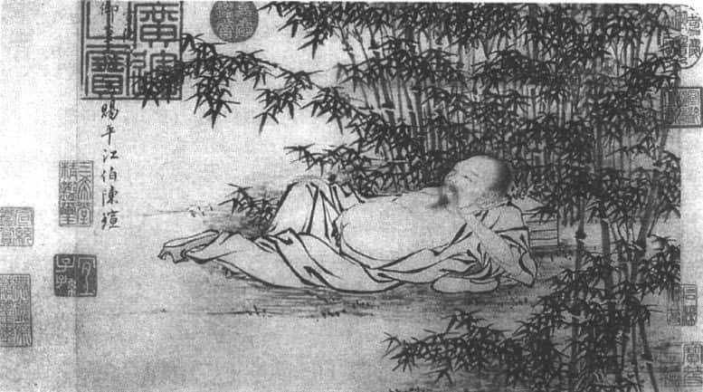

《武侯高卧图》：潜龙勿用 

在这一爻中，“潜龙勿用”是什么意思呢？这就关系到我们个人人生的发展。譬如你今年十九岁还不到二十岁，你没有到“二”字头，就叫初九，这时做什么呢？读书。读书时期就不可能有所作为，这时候要有所作为的话，你没有发展的地方。因为往上一看是五个阳爻，一个比一个厉害，你根本无路可走。乾卦的初九，往上一看全部是阳爻，不是只有我是阳爻，我有生命力，上面统统挡住，所以你不要急，“潜龙勿用”，慢慢修炼，时候到了，你自然会有机会的。

**“九二。见龙在田，利见大人。”** 意即“龙出现在地上，适宜见到大人”。“大人”是谁？大人就是有德行、有地位的重要人物。古人一般讲故事的时候，就会提到舜。舜的生平最重要的转机是遇到尧。尧遇到舜，知道有人可以接替他的位置，把天下治好。舜碰到尧的时候就是九二，“见龙在田，利见大人”，就好像一个大学毕业生，在二十岁以后到三十岁之间，他本身是一个人才了，经验还不够，这时就得有人来赏识你。但是别人再怎么赏识，你还是在“二”的位置，不要忘记上面还有四条龙。在“二”的位置已经是很好的了，为什么好？因为六爻中最好的位置是“二”和“五”。“二”跟“五”为什么最好？因为六爻卦是两个三爻卦合成的，“二”在下卦中是中间，“五”在上卦中也是中间，中间的位置往往最好，因为不会直接碰到外面的各种挑战。所以“二”和“五”一向被认为是最好的位置。一般来说，“九二”很不错，已经是“龙”出现在地上。大家一看这是个人才，这时候适宜见到大人。有人赏识是关键，等于是九二有君之“德”，而没有君之“位”，像这样的“九二”上去之后，就是“九五”（跟“九二”相对的是“九五”）了。

我们看“初九。潜龙勿用”和“九二。见龙在田，利见大人”就知道，“初”和“二”的位置代表地。“初九”是在地的下面，叫做潜龙，等于是潜在地底下。一方面在地，另一方面在地的底下这一爻，所以变成潜龙。“九二”不一样，也是潜龙，但是它已经出现在地上了，在地上面这一爻，“见龙在田”，“田”就是地。同样是“地”，初与二的位置却差很多。我们千万不要认为“初九”、“九二”差不多，差得太多了，就年龄来说，有时候一差就是十年，譬如你现在几岁？我今年假设六十岁，到了“六”了，准备退休吧。你不退休，别人怎么上来？

**“九三。君子终日乾乾，夕惕若，厉，无咎。”** 意即“君子整天勤奋不休，到了晚上还是戒惕、谨慎。这样的话，有危险但没有灾难”。在乾卦中，最上面两爻“五”和“上”代表天，“初”和“二”代表地，中间的“三”和“四”就是人。处在人的状况就是最危险的时候，为什么危险？因为“三”在下卦的上边缘，“四”在上卦的下边缘，在边缘就有危险，因为它有各种选择性。同样，人在天地之间，天地比较稳，人在中间就可以做选择，选择可上可下，就看你自己本身的做法。所以一到“九三”和“九四”的时候，就出现很多可能性，有变化的可能。在自然界的阶段是必然的，到了人的阶段，就变成有自由了。

“九三”爻辞说“厉，无咎”，“无咎”就是没有灾难。《易经》所谓的占卦，提到没有灾难就不错了，要怎么样做才没有灾难呢？整天勤奋不休，晚上还戒惕谨慎，就这么简单。你如果没有做到这两点，将来灾难就会出现了。我们看《易经》的时候，每一个爻都会告诉你一句话，你在这个位置，看看上面，看看底下，然后你应该怎么做；如果你不做的话，后面的发展如何，它也会给你一个很明确的提示。“整天勤奋不休，到晚上还要戒惕谨慎”等于是人生的什么阶段呢？从三十岁开始。那是最辛苦的时候，这个时候不奋斗，你将来就不可能有到五十岁以后的“飞龙在天”（九五爻辞）了。所以人生是一个连续的整体，你可以用各种方式来看。一个人生命的发展，到三十出头和四十之前，这时叫做“九三”。整天勤奋不休，晚上还戒惕谨慎，但是还有危险，为什么有危险呢？竞争激烈。社会上的竞争与学校读书的竞争完全不一样。学校的竞争，读书好不好，我在这个学校最后一名，换到另外一个学校，说不定是第一名；而社会上的竞争，有时候成功就成功，失败就失败。所以，“三”这个位置，特别紧张。

**“九四。或跃在渊，无咎。”** 意即“或往上跃升，或留在深渊，没有灾难”。“九四”到了上卦，已经展现出这个卦的特色。《易经》的卦有六爻，底下三爻是打基础的，把基础打好之后，上面三爻是把卦的特性真正表现出来。并且到“四”这个位置，已经是主管阶层了，底下是一个一个从基础慢慢往上走，到了“四”的时候，已经是王公贵族了，这时怎么办呢？还是要谨慎，因为你还处在中间的位置。

通常来说，《易经》里面，“九四”的位置要特别小心，用三句话来讲就是：“上不在天，下不在田，中不在人。”由这三句话就知道它的意思，“九四”“不在天”，天是“五”和“上”，“下不在田”，田就是地，地是“初”和“二”，脚踩不到地。“中不在人”，为什么中不在人？“九四”不是在人的位置吗？因为人的位置应该踩在地的位置上，所以“九三”在人的位置上，“九四”在位置的上面，中间也没有踩到地上。可见，“九四”的位置特别紧张，“上不在天，下不在田，中不在人。”我们讲现在人的话再加一句“内不在己”，就是不知道自己是谁。

“九四”的位置也正是现代人的困扰。我们再引申一下，因为这句话有很深刻的意思。现代人的困扰何在呢？第一个“上不在天”，与神明、信仰、祖先都好像隔阂了，有时候你问自己到底相信什么？人死了之后，还有不同的世界吗？这些都不太清楚。“上不在天”，说明我们与我们的来源隔绝了。“下不在田”是说我们跟自然界的关系，今天发展经济，自然生态呢？我们都有目共睹，经济发展之后，自然界受到破坏了。“中不在人”，我们与别人之间产生了隔阂，我们平常有很多朋友，但是没有知己，或者说大家之间都是表面上的客气，其实不见得真正能够有默契。“内不在己”呢？自己是谁也弄不清楚，现在很多人都有心理方面的困扰问题，甚至出现抑郁症。

古代人已经指出，作为一个人要特别小心。虽然到了中间的位置，各方面都稳固，但是第四爻是“或跃在渊”，或往上走、或往下走，就在这个时候。我们再引申到孔子的思想进一步说明，孔子说他“三十而立，四十而不惑”，大多数人在四十岁的时候，开始出现人生的各种迷惑。为什么以前没有出现呢？因为在以前都照规矩来，该读书就读书，该做事就做事，该听话就听话。到了四十岁该是自己做主了，这个时候做决定就特别困难。该怎么做决定呢？是往上还是往下呢？往下比较安全，不用再奋斗，往上的话，就要继续努力了。由此可见，到“九三”和“九四”的中间位置，特别值得警惕。

**“九五。飞龙在天，利见大人。”** 意即“龙飞翔在天空，适宜见到大人”。到了“九五”就不一样了，“飞龙在天，利见大人”。一般人都很喜欢“飞龙在天”，我们平常说的“九五之尊”就从这里来的。“九五”是最高的位置，但其上的“上九”就不好了，要准备离开这个位置了。整个卦的运动是由下往上，在上面的位置是高处不胜寒，因为就要被推走了，推走了之后，这个卦才能继续变化。毕竟宇宙没有停下来的时候，所以我们在年轻的时候不要着急。年轻的时候没有耐心，想立刻到上面去，就算上去也坐不住。年轻的时候，必须等待机会。那么，只有年轻的时候，才算是“潜龙”吗？不是的，潜龙不见得一定年轻。我们都知道诸葛亮。诸葛亮隐居的时候，绰号卧龙，就跟潜龙有关系，别人称他“卧龙先生”，代表这条龙还没有开始运动，还没有开始飞翔，卧在那里等待机会。等到刘备三顾草庐，他才出来。

因此，一个人要懂得“潜龙”，还要看时代、局势的变化；时代要是不好，你即使有才华，也要当潜龙。现在很多人中年转业，原本在本行做得不错，但是因为时代变化了，“穷则变，变则通”，所以要换一个新工作。年纪虽然不小了（四五十岁），但是换了新工作，还是从头开始——“潜龙”。所以，龙潜在水里面，不要有所作为，不仅仅是针对年轻人和小孩子，还包括像诸葛亮碰到乱世这个情况或中年转到新的行业，又是从头开始。当然了，将来可能走得比较快。如果你开始不能够好好潜伏着，没有等各种条件成熟，你就有所作为的话，后面一定会有危机。所以，我们看到《易经》的每一卦的每一爻，就要想：它对我现在的处境有什么启发？

到了“九五”“飞龙在天”，是最好的状况了，在上卦的中间，可以统摄整个局面，底下都得听“九五”的话，等于是五十岁到五十九岁正好当上最高领导，这个阶段是前面累积的德行展现出的效果。但是不要忘记，为什么“九五”“利见大人”，跟“九二”一样？因为好的领导，也需要好的属下来配，否则，一个人唱独角戏，唱不下去。可见，“九二”代表舜碰到尧，尧提拔他；“九五”代表尧碰到舜，赶快提拔他，等于是舜一来就传位，所以后代说“尧天舜日”，人们才有好日子过。

**“上九。亢龙有悔。”** 意即“龙飞得太高，已经有所懊恼”。往上到了“上九”，龙飞得太高，就好比一个人到了退休的时候，才会觉得没有办法发挥自己的理想了，要让位了。你如果不曾坐过高位，就不知道什么叫让位，让位是很大的压力。我再过几年就要退休了，看到年轻的学生慢慢上来，有时候也在想：“他们在想什么？”是不是想说：“你怎么还不走呢？我等好久了。”因为我以前也这么想：老师怎么还不走呢？他们不走我们怎么有机会呢？一报还一报，现在别人问：“为什么你还不走呢？”可见，“亢龙有悔”是因为你现在没有办法找到别人帮忙，你到最高的位置，你没有实权了。你退休养老，这些让别人来做，这是世代交替，自然的道理，也是人生应该考虑的规则。所以“亢龙有悔”出现了。

以上就是乾卦的爻辞，由此我们可以得知《易经》每一卦六爻的时间和空间概念。有一点要我们注意的是，在乾卦中特别加上一句话：“用九。见群龙无首，吉。”意思是：用在乾卦整体，显示六个阳爻无首无尾，吉祥。在《易经》六十四卦中，只有乾卦另加“用九”，坤卦另加“用六”。这二卦为六爻皆同的纯阳卦与纯阴卦，所以可以使用（或贯通）于全卦各爻。“群龙无首”代表一往平等，因为从底下到上面都充满活力，每一个都是阳爻，每一个都是同样的机会。这些龙不分首，不分尾，无首无尾，没有人是头，没有人是尾，整个社会构成一个圆满的循环。就像老一辈、小一辈都是人类社会发展不可缺少的，在《易经》乾卦里面可以找到生命的活力。

# 真诚：闲邪存其诚，修辞立其诚 

我们接触了《易经》卦辞和爻辞，但是还是不知道它在说什么，这就需要了解《易传》，即孔子和后代学生用《文言传》、《彖传》、《象传》等“十翼”来加以说明的文字部分。譬如《文言传》，《文言传》只有乾、坤两卦出现，其余六十二卦都没有《文言传》的介绍。何谓文言呢？就是用文字加以介绍。既然只有乾、坤两卦出现，可见这两卦最重要，文言介绍得很精彩，讲得也非常详细。譬如乾卦《文言传》，原文如下：
> 初九曰“潜龙勿用”，何谓也？子曰：“龙德而隐者也。不易乎世，不成乎名，遁世无闷，不见世无闷。乐则行之，忧则违之，确乎其不可拔，潜龙也。” > 九二曰“见龙在田，利见大人”，何谓也？子曰：“龙德而正中者也。庸言之信，庸行之谨，闲邪存其诚，善世而不伐，德博而化。《易》曰‘见龙在田，利见大人’，君德也。” > 九三曰“君子终日乾乾，夕惕若，厉，无咎”，何谓也？子曰：“君子进德修业。忠信，所以进德也；修辞立其诚，所以居业也。知至至之，可与言几也；知终终之，可与存义也。是故，居上位而不骄，在下位而不忧。故乾乾因其时而惕，虽危无咎矣。” > 九四曰“或跃在渊，无咎”，何谓也？子曰：“上下无常，非为邪也。进退无恒，非离群也。君子进德修业，欲及时也，故无咎。” > 九五曰“飞龙在天，利见大人”，何谓也？子曰：“同声相应，同气相求；水流湿，火就燥；云从龙，风从虎；圣人作而万物睹。本乎天者亲上，本乎地者亲下，则各从其类也。” > 上九曰“亢龙有悔”，何谓也？子曰：“贵而无位，高而无民，贤人在下位而无辅，是以动而有悔也。” 
在“九三”、“九四”时怎么办？很简单，就四个字——“进德修业”。很多人认为，“进德修业”是用来鼓励年轻的学生，其实不然。“进德”是增进德行，“修业”是树立功业。古人讲“修业”并不是回家写作业，写作业只有年轻的学生。到“九三”、“九四”的时候，“修业”代表功业、事业，要开始好好为百姓做一些事了。有功业，有事业，就有人生的方向可以走。所以我们在学《易传》的时候，会很受启发。

我自己学《易经》时，读到乾卦的《文言传》非常开心。我们讲儒家的时候，很喜欢强调真诚。但是，怎么样叫做真诚？每一个人都认为自己真诚，那你怎么知道自己是不是真的真诚呢？很可能变成是主观的一厢情愿了。我学到《易经》的乾卦，才知道真诚有两个重点：

**第一，“闲邪存其诚”，防范邪恶以保持内心的真诚。** 换句话说，你如果要真诚，就要跟邪恶势不两立。你绝不能说“我很真诚地做坏事”，我很真诚地抢银行，那不行。你只要知道什么是坏事，像作弊、抢银行是坏事，就不能说很真诚地做坏事。因为真诚与邪恶势不两立。一个人明明知道什么是坏事，他去做了的话，就不真诚。他不能说做坏事也是很真诚的，那是错误的说法，不能够原谅。所以，真诚是要和邪恶势不两立的。

**第二，“修辞立其诚”，修饰言词以确保其诚意。** 你想要建立真诚，要修饰言辞，因为“言为心声”，说话就代表心里面的意思，你要小心怎么说话。人类一张口要特别小心，“病从口入，祸从口出”，说话有时候不要太夸张。孔子常常提醒我们，刚毅木讷，才接近人生的正路（原文是：子曰：“刚、毅、木、讷，近仁。”《论语·子路》）。你如果口才非常好，小心了，孔子说：“巧言令色，鲜矣仁。”（《论语·学而》），意思是说：说话美妙动听，表情讨好热络，这种人是很少有真诚的。“仁”即真诚，这是儒家的重点。所以，我们就要记得，你可以说话很好听，表情热络，但是内心一定要真诚。我现在教书，在社会上做演讲，有时候我就觉得自己就是“巧言令色”，讲话尽量让别人听得很开心，别人愿意听，但是我记得要很真诚，我讲的每一句话，都是我内心里面愿意说的，想清楚再说的。这就是《易经》乾卦的《文言传》所说的“闲邪存其诚、修辞立其诚”，前面是“行”，行动与做事，后面是“言”，人生就是两件事，“言”和“行”。也就是说，一个人做事的时候，一定跟邪恶势不两立；一个人说话能够表达得恰到好处，内心的情感不多也不少。这就是儒家所要求我们做的。

说到跟邪恶势不两立，很多人问，万一我不知道什么是坏事怎么办呢？“不知者无罪”，当然不能怪他了。西方哲学家苏格拉底在世时，学生柏拉图问说，老师你过世的话，我们将来怎么办呢？苏格拉底的回答，今天听起来还是有效的，还是可以给我们很多启发的。苏格拉底说，今后你们要按照你们所知道的“最善的方式”去生活。这句话是千古不变的真理，你每一个人都要按照自己知道的最善的方式去生活。譬如，我现在知道这样做是最好的，我就做。我将来知道更好的，我再做。你千万不要说：我现在知道最好的，不一定有用，因为说不定将来发现今天最好的不是最好的，那我今天先不要做，等将来发现最好的再来做。那你永远不要做了，因为你永远会发现说，将来还有更好的，就好像我们做事后悔一样。譬如说我做这件事后悔了，早知道我就不要这样做。问题来了，我今天这样做将来可能后悔了。如果我今天这样做，将来可能后悔，为了避免将来后悔，我今天先不这样做。那么什么都不要做了，因为人生不能够有停顿的，所以说我们要防范邪恶这个说法在《易经》里面的出现，可以把它与所有古今中外的圣贤所说的话连在一起，让你达到真诚的要求。

# 天行健，君子以自强不息 

接着，我们看乾卦的《大象传》：**“天行健，君子以自强不息。”** 意思即“天体的运行刚健不已，君子因而要求自己不断奋发上进”。天体的运行，譬如太阳、月亮最明显，在古人心目中，太阳、月亮一直在运转，他们认为，太阳、月亮，星星这些天体一直在运转之中，我们人活在世界上，就不能停下来休息，要自强不息。什么叫自强不息？我有一个朋友每天慢跑，他说他在自强不息。这是事实，每天慢跑不容易，慢跑需要恒心，确实自强不息。但是这只是身体的运动，如果讲《易经》讲了半天叫你每天慢跑，那需要《易经》来教吗？每个运动员都知道。也有人说自强不息是每天读书，每天一定要花时间把书看一看，三日不读书，便觉面目可憎，语言乏味，所以我每天读书。但是读书是你个人的事情，你还要跟别人相处怎么办呢？

所以，《易经》讲的自强不息，意思很清楚，要归结到德行的修养上，跟别人的来往就是培养德行。你现在说我跟别人来往常常犯错，以至于产生各种恩恩怨怨，有时候会觉得很遗憾。没关系，“人非圣贤，孰能无过”，孔子也说：“过而不改，是谓过矣。”（《论语·卫灵公》）你有过错不去改，才是真的过错。我每一次看到这一句话，都会想到金庸小说《神雕侠侣》中的杨过，杨过的名字意思就是有过则改。犯错误、做错事不要紧，关键是如何补救自己的过错，像孔子也说：“假我数年，五十以学《易》，可以无大过矣。”意思是：让我多活几年，到五十岁时专心研究《易经》，以后就不会有大的过错了。

由此可见，真正的“自强不息”是每天增加自己的德行。因而我们每天都要想想：今天自己有没有比昨天更进一步，比昨天更改善？跟父母别人来往的时候，有没有更孝顺一点，更友爱一点，更诚实一点，更谦虚一点？每天这样做的话，你就会发现生命充满意义。人活在世界上，在许多地方都一再强调，最怕五个字：“重复而乏味。”你一旦觉得生命不断重复，今天跟昨天差不多，下个星期与这个星期大概也差不多，明年与今年大概也不会差太远。这样的日子好过吗？西方人为什么有心理问题？甚至很多先进的国家，发达的国家自杀率特别高？就是“重复而乏味”五个字。社会安定了，经济繁荣了，政治上轨道了，什么都有了，最后发现再多活几年，都差不多，一个人对于自己做的事情，兴趣自然会降低。就好比你第一次去吃好的菜，很兴奋，第二次就变得兴趣缺乏了。

因此，你每天都要问：“我如何让自己感觉到自己的活力？”否则光是重复而乏味，人生真是无趣。所以，在《易经》里面就强调自强不息，即增进自己的德行。那么，如何能发现自己的德行每天进步呢？从真诚开始。所以，我们强调儒家的思想——“人性向善”，其中“向”字最重要，“向”代表什么？就是由真诚而引发力量，力量由内而发，源源不绝。我自己要自己做好事，不是别人叫我做的，这样才有力量，因为真诚。我自己要我自己做，因此快乐也是由内而发，而不是别人给我快乐，别人让我快乐，别人可以拿走，别人可以停止供应；我自己的快乐由内而发，天下没有人可以把它夺走。这是儒家思想最可贵的地方，《易经》里面的《易传》就是儒家的手笔。我们看到自强不息，就要想到，人生如果自强不息，生命看起来很有活力，很有动力，就好像乾卦一样，充满无限的生命力。整个宇宙的创造和发展，是由乾卦开始的，乾卦开始创造之后，宇宙万物才有价值的问题。

我们要特别强调中国哲学思想的两句话：第一句，“宇宙万物充满生命”；第二句，“人的生命需要实现价值”。实现价值，代表我的生命不是活着而已。除了人类之外，其他生物只是活着而已，只希望多活一天，活得久一点；人类不一样，人类不光跟其他生物一样，多活一天，活久一点，这不是人的生活。老子曾经提到，十个人当中，有三个活到自然的寿命结束；另外三个因为各种疾病、战乱而提早结束；还有另外三个就是因为养生养得太好而结束了，就好像你现在富贵，就得富贵病了，养生养得太好了。十个人里面只有一个可以得到“道”。不同的学派，他们看人的生命最终是殊途同归。你如何让你的生命重要的地方凸现出来，不是外在的，不在于身体的层面，而在于你内心的一种自我要求，即德行的修养上。

# 乾卦的启发：人的生命充满着无限的可能 

乾卦是《易经》第一卦，宇宙万物有乾卦，才有后续的发展。乾卦代表无限的生命力，有生命之后就要掌握到价值，宇宙万物都有价值，但只有人类可以作为价值的评断和选择。价值不能离开人，如果没有人的话，宇宙万物有价值也没有用，因为没有人去欣赏，没有人去肯定，没有人去选择。宇宙万物就因为人的存在，而展现出它丰富的意义。人类当然要珍惜了，在佛教里面也说，“人身难得”，人的身体最难得。佛教里讲“六道轮回”——天、人、阿修罗、畜生、恶鬼、地狱，所有有生命的动物都轮回在一起了，人是六道轮回里的第二道，作为人，实在是太难得的机缘了。所以我们在这个世界上，不要说对自己，对每一个人都要觉得非常的珍惜，并予以尊重。

每一个人的生命都充满着无限的可能。为什么？因为他可以实现价值。一个小孩子开始不懂事，大人觉得他是小孩子，见了他摸摸头：有没有好好读书？几年之后，大学毕业读到硕士、博士，变成一个学者，有的在社会上发展得很好，成为一个企业的领导或者国家的领导。这就说明，人的生命充满无限的价值，你永远不要忽略这些小孩子，认为这些小孩没什么了不起。错了，我们以前也是小孩子，别人也老是看不起我们，我们就好好努力，这个世界就是如此，一代一代往下交棒。因此，重要的不是人类，重要的不是这一代人，重要的是每一个人，每一个人都有他生命的价值。你也不要想：我要怎么样发展，出人头地呢？不要想这些，因为出人头地需要竞争，压力很大。你要想的是：我要怎么样实现我生命的价值、生命的力量？以生命为例，就要以乾卦作为参考。

年轻的时候“潜龙勿用”，好好读书，把基础打好。二十岁到二十九岁“见龙在田，利见大人”，学好知识本领，开始表现，希望别人赏识你。三十和四十这个阶段要加倍努力，因为这是中间阶段，往上谁能上去，谁不能上去，就看这二十年。你好好努力的话，累积生活经验，能慢慢了解社会人情世故，才有办法去领导统驭，进行人性管理。到了五十岁到五十九岁，等于是你自己生命里面的“九五”，这时你已成家立业，看到部下慢慢成长、发展，这时候你就要问自己准备好了没有。因为你心里要有数，退休之后是“亢龙有悔”，“悔”不是坏事，懊恼是好事，一个人知道懊恼就有希望，因为跟“悔”相对的就是“吝”。“吝”代表困难，有困难还不知道后悔，那就危险了，接着就是灾难。我现在发现处境不太好，有各种复杂的情况出现，我开始懊恼，一懊恼就开始转向吉祥。一个人希望一生一帆风顺，没有这样的人生。你说这一生非常坎坷、崎岖，好像别人都比你幸运，你不要只看到这一点，通常你看到别人比你幸运，别人说不定还羡慕你呢。因为你没有看到别人的痛苦和烦恼，你跟别人来往，往往只看表面上过得不错。别人跟你的想法是一样的。别人也看到你快快乐乐的，他说不定也羡慕你。所以在这时候，你要对自己负责，假设你现在已经过了六十，到“亢龙有悔”的阶段，没关系，知道整个情况如何，就放开手让别人去做，让别人去发展。

# 结　论 

从以上乾卦的《易经》的部分（卦辞、爻辞），以及《易传》的解释说明（《文言传》、《象传》等），我们可以得到很多启发，尤其是“自强不息”。自强不息是指德行的修养，德行的修养要从真诚着手，可以说是很好的生活教训。一般讲占卦的时候，譬如占到乾卦，代表这件事情充满活力，发展绝对没有问题。乾卦六爻皆阳，每一爻都不一样，有的爻不要动。虽然占到乾卦，但是“潜龙勿用”。第五爻“飞龙在天”，是人生发展的高峰，到第三爻、第四爻就要小心了，这时就面临着各种选择、各种考验。为什么我们讲学《易经》不能只看一半呢？因为我刚刚讲的是“义理”，人生的道理，而《易经》需要另外一半，即占卦。占卦就是问哪一爻印证在你的问题上面。我有疑惑、问题，我去占卦，占了卦之后，就要看是哪一个卦的哪一爻。因为一个卦里面，有的爻很好，有的爻不太好。有的最坏的卦里也有最好的爻。所以两边同时要兼顾，《易经》最难的就在这里。一方面你要知道道理，做人处事的道理；另一方面，你要知道如何解决困惑。即两方面——义理派跟象数派，二者都要兼顾。我们今天不需要学古人把二者分派，而要把它们合在一起，合在一起你才知道，每一卦的六爻所体现的象，究竟是何状况；另外，也可以从中学到，每一种处境里，会有什么样的遭遇，应该怎么样去面对，采取何种适当的方法，而“修德”是关键，贯穿在整部《易经》里面。以上就是介绍乾卦的内容，先谈到这里。

# 易经小常识 

## 十二消息卦与二十四节气 

在世界天文史上，中国是最早使用阴阳合历的国家之一。八卦最早的主要用途是应用于历法，所以易经六十四卦与二十四节气有着重要的关系。

中国古代历法将两个冬至之间的周期称为“岁”，即一年。将“岁”分为二十四个等份，即二十四气。每一节气大约三十天，相当于一个月，其中“节”和“气”各占大约十五天。以冬至起算，历小寒、大寒、立春、雨水、惊蛰、春分、清明、谷雨、立夏、小满、芒种、夏至、小暑、大暑、立秋、处暑、白露、秋分、寒露、霜降、立冬、小雪、大雪，再到冬至为一岁。这二十四节气根据地球绕太阳的黄道而分，故称为阳历。一节一气为一月，以冬至起（即子月），后来至夏朝，则以立春为一年的开始，即寅月，一直沿用至今，也就是夏历。

后人从伏羲六十四卦中抽取十二个卦表示节气的变化规律，称作十二辟卦，即十二消息卦，也称十二月卦、十二候卦。消息卦是指同性爻由下而上，与异性爻不相交错的卦，共有十二个。消者，消退；息者，成长；万物此消彼长，恒在变化之中。十二消息卦分为两组，一是阳爻由下而上，如复卦（ ），临卦（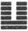 ），泰卦（ ），大壮卦（ ），夬卦（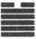 ），乾卦（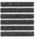 ）。另一组为阴爻由下而上，如姤卦（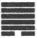 ），遁卦（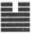 ），否卦（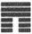 ），观卦（ ），剥卦（ ），坤卦（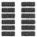 ）。在消息卦之外的52卦，大部分在谈到卦变（一卦如何变成）时，都会参考消息卦的资料。《归藏易》中的说法是：子复、丑临、寅泰、卯大壮、辰夬、巳乾、午姤、未遁、申否、酉观、戌剥、亥坤。十二消息卦与夏历（农历）对照，依序为：复为十一月，临为十二月，泰为正月，大壮为二月，夬为三月，乾为四月，姤为五月，遁为六月，否为七月，观为八月，剥为九月，坤为十月。

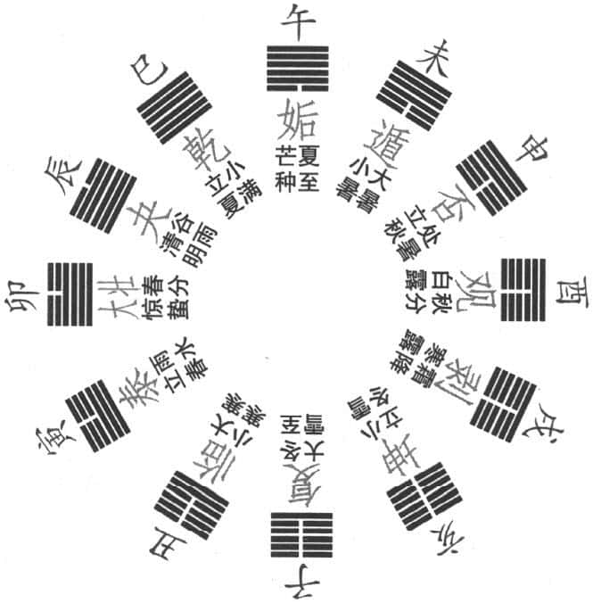

文王十二卦月气图 

复卦（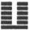 ）代表子月，节气为冬至。复卦六爻代表大雪至小寒的三十余天。子月相当于农历十一月。复卦是五阴一阳，阳爻居初位，此时一阳来复，阳气始升，将会打开新局。

临卦（ ）代表丑月，节气为大寒。临卦六爻代表小寒至立春的三十余天。丑月相当于农历十二月。临卦卦象已有二阳，说明天气虽冷，但春天即将来临。临卦卦辞说：“……至于八月有凶。”为何说“至于八月有凶”？因为临卦为十二月，经过八个月，正好是八月的观卦，成为临的覆卦，并且显然是阳消阴长，所以说“有凶”。并且夏历八月多雨，最易洪水泛滥，针对临卦（泽在地下），会形成相反的局面（泽在地上），所以“有凶”。

泰卦（ ）代表寅月，节气为雨水。泰卦六爻代表立春至惊蛰的三十余天。寅月相当于农历的一月（正月）。泰卦卦象为三阳在下，说明春天开始了，万物就要复苏，新的生命就要破土而出了。成语“三阳开泰”即是此意。

大壮（ ）代表卯月，节气为春分。大壮卦六爻代表惊蛰至清明的三十余天。卯月相当于农历的二月。大壮卦六爻已有四阳在下，说明阳气已经战胜阴气，此时万物都开始活动，草木生长发芽，动物开始繁衍。并且大壮卦是“上震下乾”，雷在天上，天上始有雷声。

夬卦（ ）代表辰月，节气为谷雨。夬卦六爻代表清明至立夏的三十余天。辰月相当于农历的三月。夬卦六爻已呈现五阳之象，天地间只有一阴气残余，阳气最是充足时期。正如人们所说，阳春三月，草长莺飞，正是踏青旅游好时光。

乾卦（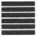 ）代表巳月，节气为小满。乾卦六爻代表立夏至芒种的三十余天。巳月相当于农历的四月。此时卦象六爻纯阳，天气已没有一丝寒意，人们可以穿单衣，正是草木茂盛季节。

姤卦（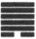 ）代表午月，节气为夏至。姤卦六爻代表芒种至小暑的三十余天。午月相当于农历的五月。姤卦卦象显示底部出现一阴爻，天地之气阳极阴生，说明由于温度过高，出现潮湿天气。

遁卦（ ）代表未月，节气为大暑。遁卦六爻代表小暑至立秋的三十余天。未月相当于农历的六月。遁卦卦象底部已有两个阴爻，阳动阴藏，有些农作物已成熟。天气因阴气的加重更加闷热而潮湿，人和动物躲藏起来，以避暑气。遁即躲避，也告诉人们要学会躲藏以生存。

否卦（ ）代表申月，节气为处暑。否卦六爻代表立秋至白露的三十余天。申月相当于农历的七月。否卦卦象已有三个阴爻在下，正所谓泰极否来。此时阴气已经变得很强盛，也就是说，天气虽然很热，但是还是容易着凉。多事之秋意即如此。此时需要祈福消灾，七月十五为鬼节，人们会在此时祭祖先及鬼神，以求庇佑，同时由此领悟，要收敛修德以避开灾难，以求吉祥。

观卦（ ）代表酉月，节气为秋分。观卦六爻代表白露至寒露的三十余天。酉月相当于农历的八月。观卦卦象已经是四个阴爻了，说明天气渐冷，正是秋风萧瑟，农作物的生命已到尽头，已经成熟。而仲秋美景也开始呈现，明月当空，中秋佳节，合家团聚，正是观赏好时节。古时有“二八之月，奔者不禁”之说法，正是观玩之意。

剥卦（ ）代表戌月，节气为霜降。剥卦六爻代表寒露至立冬的三十余天。戌月相当于农历的九月。剥卦卦象已有五个阴爻，仅一阳爻在上，说明阴气强盛，连一点余阳都要排挤掉。此时万物凋零，落叶纷飞，天地间生气被剥夺。

坤卦（ ）代表亥月，节气为小雪。坤卦六爻代表立冬至大雪的三十余天。亥月相当于农历的十月。坤卦卦象六爻纯阴，阴气最盛，此时万物隐藏起来，动物开始进去冬眠时期，天地闭塞成冬，一年到了终点。由于阴中有阳，阳中有阴，坤卦当令的时节也会有两三天小阳春，所以又有“十月小阳春”的说法。

