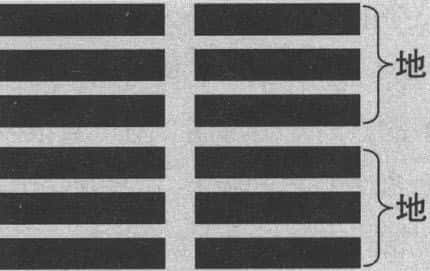
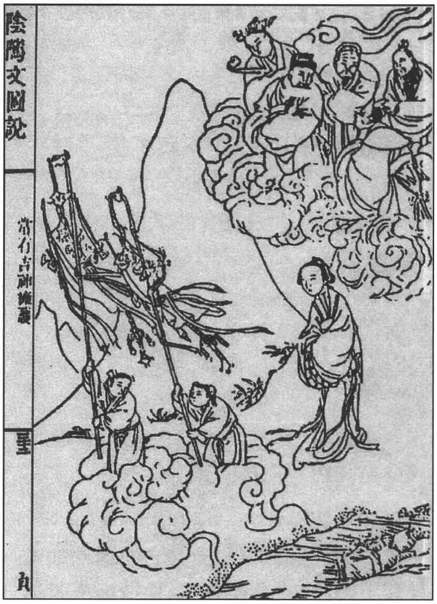
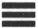
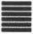

易经的第二卦是坤卦，乾卦讲的是自强不息，相对来说，坤卦讲的是厚德载物。乾是天，坤是地；乾是父，坤是母；乾卦六爻皆阳，坤卦六爻皆阴，以后我们看到任何一个阴爻，就知道都有坤卦的特性；就跟看到任何一个阳爻都有乾卦的特性一样。

# 柔弱胜刚强 

坤卦六爻皆阴，作为母亲、作为大地，柔顺无比，我们可以把它看做是阴的示范代表，即“柔弱”，由此我们可以联想到老子的“柔弱胜刚强”。西方人也说：“女子虽弱，为母则强。”这话很有道理。女子相对的是男子，在社会分工各方面看起来，男子从事体力劳动，需要外在的刚强，女子负责家务、照顾子女，是比较柔弱的一方；但是作为母亲的话，她又变成一个主导者、刚强者。西方简单的两句话，也符合我们《易经》的原则。“柔弱胜刚强”有很多例子，譬如大风吹来的时候，越是坚挺的树木，越先被吹倒；相反，柔弱的柳树很少被吹倒。再譬如“滴水穿石”，一滴水能穿石头吗？当然不行，它需要时间上的长期的效果，才能显示柔弱的力量。人在老的时候，牙齿很少还完好的，但是舌头还跟以前一样，这就说明“柔弱”更符合生存的道理。

在古代有个故事，有一勇士专诸，身强体壮，武功高强，最喜欢做的事就是每天去外面跟别人打架，而且不到十个人他不应战，他一定要和十几个、二十几个打架才过瘾。有一天，外面很多人聚在一起，准备找他打一场架，大声叫他出去，他当时一看人多，可以好好地大显身手，于是往外走，走了几步，听到后面有一个娇弱的声音喊了一声“专诸”，他立刻掉头回去。别人笑他，说他怕老婆，老婆一叫，立刻就回去，真没出息。他回头对那些人说：“唯其在一人之下，才能在万人之上。”这说明什么？也是柔弱胜刚强。

# 坤卦的卦象和卦辞 

坤卦六爻皆阴（见下图），它能给我们什么启发呢？在此，我们就要深入了解坤卦的卦象和卦辞对此卦的描述。坤卦六爻，从下至上依次是：初六、六二、六三、六四、六五、上六。“六”代表阴爻。坤卦的卦辞较长，原文是：**“元亨，利牝（pìn）马之贞。君子有攸往，先迷后得主。利西南得朋，东北丧朋。安贞吉。”** 意思是：“开始，通达，适宜像母马那样的正固。君子有所前往时，领先而走会迷路，随后而走会找到主人。有利于在西南方得到朋友，并在东北方丧失朋友。安于正固就会吉祥”。

坤卦卦象 

我们还记得，乾卦是四个字——“元、亨、利、贞”，代表无所不利。天下万物都来自乾卦，所以对任何万物都是适合的，可以长期发展的。但是坤卦不一样，坤卦六爻皆阴，也是“元、亨”，但是这里的“元”不是“创始”，而是“开始”，因为乾卦是主动力，坤卦代表受动力，完全接受之后，才要发展，这是开始；“亨”即通达，在大地上产生万物，不断发展。“牝马之贞”，“牝马”就是母马。我们都知道，“马”跟人类关系非常密切，并且母马本身是非常驯良的。为什么要提到马呢？马本来是描写乾卦的（见《说卦》），我们还记得，坤卦的象征是牛。其实这些并不是重复，而是各种不同理解的方式，“牝马”的用意是跟从。因为坤卦虽然是指大地，但是天体的运行永远需要与大地配合。我们要了解，你开创一个时代，固然是需要力量，但是跟随它、发展它也需要力量。天体的不断运行，地面的万物也不断生长，地本身也需要有恒常的、强健的性格，但它的强健不在于引导，而在于跟从。很多时候，我们跟别人走了一半，别人继续走，我们停下来了。孔子教学生的时候，就告诉学生，从事政治，要记得两个字——“无倦”，即不要倦怠。人就是很容易倦怠，一开始很努力，一开始很热闹，大家都愿意不断地做，做了一半心里却想：已经差不多了，有点成绩了，可以休息了。一停下来就糟糕了，为什么？因为整个时代不断进步，天下所有的人都在努力竞争；你一停下来就跟不上了。坤卦用母马来代表，是因为“母”代表“坤”，“马”代表健行，能够一直走下去，有恒心。

坤卦就适合母马的前进，有什么特色？“君子有攸往，先迷后得主”，一个君子到适合的地方，不要走在前面，因为坤卦是要跟别人走的，即跟着“乾”去走；如果走在前面就会迷路，因为没有任何力量可以引导你往前面开创，走到后面就会找到主人，有人可以带着你走。很多时候，我们不要老想着自己来做开路先锋，开路先锋很辛苦的，有时候跟着别人后面走，踩着别人的足迹慢慢前进，也不见得是坏事。像牛顿，在西方是一位大物理学家，他也说，我们要站在巨人的肩膀上。你不能说要当巨人，从头开始建构宏伟的科学研究，不可能的。站在巨人肩膀上，就看得更高、看得更远。坤卦要求你，不要走在前面，而要跟在后面，就可以找到你的主人。

“利西南得朋，东北丧朋”，适合在西南方得到朋友，在东北方失去朋友。这在说什么呢？西南代表比较柔顺，属于平原的地带，东北多山、多高原，代表很多阻碍。这牵涉到“后天八卦”，我们先不深入探讨。如果你到西南方，跟同伴在一起，会很柔顺；而你到东北方就会失去同伴，就好像一个女孩子没结婚之前，跟很多好朋友在一起很开心，一旦结婚之后，就要离开朋友跟她的丈夫走。这叫做“东北丧朋”。因为你得到一个“主”，“主”代表能带你走的人。看到这里很多人想说，这样好像对我们女性不是很公平。我要特别说明一下，每一个人都有乾卦、坤卦，随着你的角色、身份和你所面对的对象而定。譬如，我在家里是男主人，是“乾”；上班的时候，看到我的上司，我变成了“坤”，上司变成“乾”，他要我怎么做我就照着做，但是他到他的上级单位，他也变成了“坤”；上级的再上级，在外面都是“乾”，回家以后，说不定跟专诸一样，听老婆的话，就变成“坤”了；有的人在任何时候都是“乾”，碰到子女就变成了“坤”。像诗句“横眉冷对千夫指，俯首甘为孺子牛”，我在外面可以号令天下，莫敢不从，可是回家以后小孩子爬在我身上，叫我当牛给他骑，我也认了，这就是说父母有时候看到孩子，就变成另外一个角色了。就好像有些人抽烟，别人劝他戒烟，照抽不误，最后是女儿劝，女儿一劝就有用了，他“听话”了。这些说明什么？人活在世界上，都有“乾”、“坤”两面。所以，了解“坤卦”，对每个人都有帮助。

由此可见，坤卦的卦辞意思很简单，首先告诉我们要像母马一样，一方面很柔顺，一方面能够健行，才跟得上天体的运行，跟得上乾卦的脚步。其次是君子有所前进的时候，走在前面会迷路，走在后面才可以找到你的主人。最后告诉我们，适合在西南方得到朋友，在东北方丧失朋友，就是要以柔顺为主。如果你占到这个卦，就要从这里去理解。

# 坤卦六爻详解 

爻辞：
> 初六。履霜，坚冰至。 > 六二。直方大，不习，无不利。 > 六三。含章可贞。或从王事，无成有终。 > 六四。括囊，无咎无誉。 > 六五。黄裳，元吉。 > 上六。龙战于野，其血玄黄。 > 用六。利永贞。 
**“初六。履霜，坚冰至。”** 意即“初六。脚下踏着霜，坚冰将会到来”。这是坤卦最有趣的一个爻。脚下踩到霜，前面就会有坚硬的冰块，这是什么意思呢？这里的前面并不是指方位，它是说，现在漫天风雪，结冰那么厚，怎么搞的？什么时候出现的？代表任何事情都是有迹可寻——当你脚下踩着霜的时候，就知道冬天开始来了。

任何事情都是渐渐发展的。我先说一段很有名的历史故事，在周朝初年封建的时候，齐国始祖是姜太公姜子牙，鲁国的始祖是周公，他的儿子封在鲁国。这两位国家大老，接到分封的命令就开始聊天，姜太公问周公，你准备怎么治理鲁国？周公说了四个字——“尊尊、亲亲”。什么意思呢？要尊重身份地位高的人，亲近有血缘关系的人。他讲完之后，姜太公就说，鲁国从此“积弱不振”。为什么呢？因为讲究“尊”和“亲”的话，一定是不考虑他们的能力、才华和本事，考虑的是你身份高，我才尊重你，但能力够不够是另一回事；血缘很接近，我就亲近你，你是我的亲戚，你能力不够我不管，我们鲁国就是比较重视情感，重视道义。所以姜太公说，鲁国将来会弱了。接着周公就问姜太公，那你将来如何治理齐国？姜太公说：“举贤而尚功。”“举贤”，推举有贤才的人；“尚功”，把功劳当做当官的一个标准。意思就是要推举有能耐的人，只要有才干，我们齐国就推举你；要是你有功劳，我就封你做大的官。这是齐国的原则，一开国，就定了国政方针。周公听了之后就说，齐国后世必有“劫杀之君”，就是说齐国的国君，一定有被别人弑君的。后来果然是齐国越来越强，春秋五霸第一霸就是齐桓公，齐国确实很强。但是传到二十四世，齐国就被田氏篡位了，“田氏篡齐”的故事，正好发生在孔子的时候，孔子听到田恒把齐国国君杀了，上朝报告鲁君说齐国发生了造反的事，要不要派兵去讨伐那个造反的人？因为当时各诸侯国有合约，哪一国发生内乱，别的国可以组织联合军队去平定内乱。但是鲁国哪里有可能呢？它比齐国还弱，加上政权还不在鲁君手上，在三家大夫手上。所以鲁君说，你不要问我，去问那三家大夫。孔子只好去问三家大夫，三家大夫当然不同意，因为他们自己都想把鲁君干掉。

齐国很强盛，传到二十四世被田氏所篡，为什么老百姓没有意见呢？因为田氏懂得收买人心，如何收买人心？他们用小斛（斗）收租，用大解放贷，给百姓恩惠，齐国百姓都拥护田氏。他后来篡了齐国，没有人反对，就因为这个原因。鲁国一直“积弱不振”，但是传了三十二世才结束。由此看来，开始建国的时候，姜太公和周公所说的话，就是坤卦第一爻所强调的“履霜，坚冰至”，就是说，开始立国的原则是什么，后面就会有它的发展，没有例外的。

“坤卦”第一爻“初六”，其《文言传》曰：**积善之家，必有余庆；积不善之家，必有余殃。臣弑其君，子弑其父，非一朝一夕之故，其所由来者渐矣，由辨之不早辨也。《易》曰：“履霜，坚冰至。”盖言顺也。** 其中就有一句话：“积善之家，必有余庆；积不善之家，必有余殃。”一个家族常做好事，好事做到后来，后代子孙就有多余的喜庆。因为你常常做好事，子孙得到一些庇荫，一定会过得很愉快。相反，如果这个家族经常做坏事，做到最后一定会有多余的灾难，留给子孙。为什么？因为从开始就知道，后果是渐渐发展而来的。

积善之家 

坤卦为什么提到“霜”呢？因为在初六的时候，往上一看，全部是阴爻，“阴爻”代表只能够跟着别人走，不能够自己独立。然后后面的发展，就要知道阴爻代表阴冷的、寒冷的一面，但是也代表整个事情的趋势是慢慢形成的。这就是“初六”，“初六”就已经含义很丰富了，进入到一个特殊的状况。

**“六二。直方大，不习，无不利。”** 意思即“六二。直接产生，遍及四方，广大无边；不必修习，无不有利”。六二特别好，因为位置好。讲到位置，再补充说明一下。从底下往上看，总共六爻：初、二、三、四、五、上。“初”、“三”、“五”是奇数，奇数最适合阳爻，“二”、“四”、“上”为偶数，偶数最适合阴爻。所以不管阳爻还是阴爻，也要看它的位置，如果在“初”，“初”这个位置本来是阳爻，现在是阴爻，就不是很理想，你要小心。“二”本来就是偶数，“六二”最好，“六二”阴爻，它又是“二”，所以，“六二”一向是很好的位置，因为正好在偶数，是阴爻应该有的位置。这就是所谓的“当位不当位”，位置是不是适当。

到“六二”的位置，就把阴爻的整个特色表现出来，即三个字：“直、方、大。”“直”就是直接产生；“方”就是遍及四方；“大”就是广大无边。三句话正好代表“地”，大地的形势。大地是怎么样的呢？万物在里面直接产生，根本不用设计，有植物、有动物、有矿物，什么都可以出现。“方”代表遍及四方，世界上每个地方都有各种不同的生物，都有不同的自然景观；“大”就是广大无边，包容一切。“直”、“方”、“大”这三个字就说明了坤卦的主要特色，等于是大地的一种表现，你不用花任何脑筋，它就是无所不利。可见，六二是好位置。

**“六三。含章可贞。或从王事，无成有终。”** 意思即“六三。蕴含文采而可以正固。或者跟随君王做事，没有功业却有好的结局”。到“六三”的时候，底下三爻已经结束。“含章可贞”，就是说可以坚持原则，既然是坤卦，就要守住，尽量不要参与行动。因为在第三个位置，“三”的位置本来适合阳性的，现在是阴性的，在“六三”，就不是很理想。还有，它在下卦的边缘，代表有选择性，有选择就有变动，不能预测。到“六三”的时候，如果跟随君王做事的话也可以，你不会有什么成就，但是要考虑结果。为什么没有成就？你才到底下三爻，怎么会有成就呢？但是“六三”构成一个小的坤卦（ ），已经有好的结果了，代表已经完成一个坤卦的基础。

**“六四。括囊，无咎无誉。”** 意即“六四。扎起口袋，没有灾难也没有称誉”。“六四”底下有一个坤卦，代表已经到达一个很重要的位置。讲到六爻的时候，我们要有一个大概的观念。“初”的位置，叫做“士”，念书的人；第二个位置代表“大夫”，已经到中间了；第三个位置是“公卿”，第四个位置是“诸侯”，公卿和诸侯的责任都很重；到第五个位置就是“国君”，第六个位置代表“宗庙”——祖先，已经退休了。到了“六四”的位置，就要“括囊”，把袋子扎起来，没有灾难，也没有称赞。就是说没有好也没有坏。为什么到“六四”就要收敛呢？因为你是坤卦，到“六四”就要收敛，不收敛，将来就会有问题。现在虽然当了一个小小的领袖，因为到了上卦，可以统治下卦，这时依然要收敛。像大禹治理洪水之后，一点都不骄傲，一点都不自夸，后来舜才把帝位传给他。像周公的功劳也是很大，但他也不骄傲，依旧很诚恳地辅佐幼主。孔子特别称赞周公，说周公既不骄傲，又不吝啬。因为骄傲和吝啬都是以自我为中心，喜欢跟别人比，胜过别人，有好处不肯分给别人，这叫“既骄且吝”，不值得欣赏。所以，像大禹、周公这些伟大的古人，他们到这个阶段还不是天子，他们就要收敛，这时不要求得什么荣誉，也不要去担心，不会有灾难。人有的时候就是要收敛，避开锋芒，因为你所处的位置还不到时候，不适合出来当领导。

在这个时候，就要学习道家的思想，道家很多地方都学到坤卦的做法，譬如我们前面讲的“柔弱胜刚强”，就告诉我们要顺从、要不争。老子说：“夫唯不争，故天下莫能与之争。”就因为不争，所以天下没有人能跟他争。说到“争”与“不争”，你跟别人争什么呢？当然是争自己有本事的部分，你有本事，但别人比你更厉害，正所谓“人外有人，天外有天”。所以你要避开锋芒，不跟别人直接竞争。不过也不要说自己什么都不行，什么都不会，这样缺乏自信。这是我们谈到坤卦“六四”的时候，就要记得收敛，因为你已经到了高的位置，可以统治底下了。这时就要“括囊”，扎起口袋。

**“六五。黄裳，元吉。”** 意思即“六五。黄色的衣裙，最为吉祥”。“元吉”即上上大吉。关于“元吉”，我们了解一下《易经》所谓的“占验之词”，就是说占卦时，所占到的卦，又分等级，最好的就是“元吉”，即最为吉祥，上上大吉。其次是“大吉”，大大的吉祥，非常吉祥。第三才是“吉祥”。再往下就是“无咎”，没有灾难，就是平常的状态。西方有一句话：“没有新闻就是好新闻。”这就是“无咎”，我们不要老想着今天有什么好事，其实没有事就是好事，每天都是好日子。“无咎”往下依次为“悔”、“吝”，“悔”就是懊恼，因为很多事情都做错了；“吝”就是困难。有困难还不知道改过、悔改的话，接着就是“咎”、“厉”，“咎”为灾难，“厉”代表危险。最后还有“凶”，“凶”就是最可怕的了。这就是《易经》里面对于各种占验的区分。

我们看这些占验之词，就知道“无咎”是好的，怎么样才能“无咎”呢？就是“善补过者也”，一个人善于补救过错，他就不会有灾难。这句话对于现在的人来说，还非常有启示性。各位想想看，你为什么有灾难？因为你有过失不知道去补救。“人非圣贤，孰能无过”，有过失，没关系，要善于补救过失，赶快改。跟别人有什么地方合不来，自己有错赶快道歉，你只要赶快补救过失，别人就不跟你计较了。往往是你有过失还死不承认，或者硬是要跟别人坚持下去，到最后有了灾难，就不能怪人了。所以，对于“无咎”的标准，要求就是善于补救过错。

在《易经》里面，乾卦六爻并没有出现“元吉”，只说适宜见到大人，并没有说到“吉”。在坤卦“六五”出现了“元吉”。为什么说“黄裳，元吉”呢？我们先说明一下“黄裳”的意思，“黄裳”就是穿上黄色的裙子。古代的“衣”代表上衣，“裳”代表下裙，“垂衣裳而天下治”。坤卦本身不能直接当领袖，要跟别人走，跟别人走代表不是“衣”，只是“裳”，穿衣代表要自己当领袖，在乾卦位置了。你需要跟别人走，所以你要穿上“裳”。何谓黄色？黄色是土的颜色，土在中间。古代关于颜色又有说法，东边是青色，因为太阳从东边升起，东边是草木繁荣。南边是红色，因为南边最热，变成红色。然后西边是白色，北边是黑色。中间则是黄色，黄代表土。颜色和方向又配合金木水火土，东方属木是青色，南方属火是红色，西方属金是白色，北方属水是黑色，中间属土是黄色。坤卦“六五”的位置是在上卦的中间，中间是黄色，所以要穿上黄色的裙子，代表我知道我是“六五”，不是“九五”，“九五”才有真正的实权。“六五”再怎么厉害，都要知道，我是要跟随别人。而现在在“六五”这个位置，不是我求的，是我正好碰上这个位置。怎么办呢？“黄裳元吉”，变成是“上上大吉”。

可见，你在任何地方，只要你了解自己的处境，有适当的一种反应，就是吉祥了。吉祥并没有在乾卦出现，在坤卦反而出现了一个“上上大吉”，这说明什么道理？正是柔弱胜刚强，柔弱是每一个人都应该放在心上的、在社会上可以实践的态度。大多数人都是老百姓，作为老百姓的话，要甘于过平凡的生活，要知道自己的分寸，不要强出头。这就是我们谈到的“六五”“黄裳元吉”。

**“上六。龙战于野，其血玄黄。”** 意即“上六。龙在郊野争战，它的血是青黄色的”。我们都知道，乾卦的“上九”是“亢龙有悔”，处境并不好。在坤卦也是一样，“上六”也不好。《易经》的六十四卦，每到最高的位置，不是“上六”，就是“上九”，大部分都不太好，最后好的只有两个卦（即“履卦”和“井卦”），这两卦最后都是“元吉”，我们将来会特别介绍。坤卦“上六”“龙战于野，其血玄黄”，这在说什么呢？郊野代表外面，“上”就是外面，象征郊外。这又是一个象征了，六爻位置最外面的，就变成郊外。古时候分郊，郊外有野，郊外之内就是“邑”，城邦。

为什么在坤卦的“上六”出现龙在郊外作战呢？根据《易经》的解释，因为这一卦六爻皆阴，没有看到阳爻，就以为天下就是我们的。天下是你的吗？不一定，天下是你的话就守不住，因为本身是阴爻，没有实力，没有主动力。在这个时候，就变成是以为自己是龙，然后真正的龙出现了，因为你已经走完了。正如《文言传》所说：“阴疑于阳必战。为其嫌于阳也，故称龙焉。犹未离其类也，故称血焉。”意思是：阴气受到阳气猜疑，必然发生争战。由于阴气猜测没有阳气存在，所以也称它为龙。但是阴气尚未离开它的类别，亦即阴无法胜过阳，所以用流血来描写。

坤卦之后出现的卦，不可能是全部阴爻或全部阳爻，因为乾卦、坤卦出现过了，所以，底下出现的六十二卦，任何一卦都是有阳有阴，代表阴爻出现之后，一定会有阳爻再出现，真正的龙要跟假龙开始作战了。正如历史上的典故，譬如赵高篡秦，秦灭亡了，赵高也被杀了；王莽篡汉，汉朝式微，王莽也失去力量。因为赵高和王莽都是趁着机会称霸天下，但是不能当真正的龙，因为天下都是一片小人，如赵高指鹿为马，就以为自己是真正的龙，小人当道，其他的纷争就会出现，所以“龙战于野，其血玄黄”。“血”就代表斗争，很惨烈的后果。

坤卦最后再加一句：**“用六。利永贞。”** 意即：“用在坤卦整体。适宜永久正固。”作为坤卦，最好能够守住你的位置，就不错了。我们还记得，乾卦的“用九”是“见群龙无首，吉”。“用九”和“用六”只有乾、坤两卦可以用，因为六爻都一样。

# 厚德载物 

在坤卦里面，更重要的是什么？就是我们所说的厚德载物。坤卦《象传》说：“地势坤，君子以厚德载物。”大地的形势顺应无比，君子努力培养自己的德行，用来承载万物。

所谓的培养德行是什么意思？点点滴滴慢慢做，不要着急。人的品德绝对不是一天形成的，不能说我昨天还是一个不懂事的人，今天忽然就懂事了，什么都顺了，不可能。人的品德没有侥幸的，你多下工夫，它就慢慢累积，十年、二十年，不到一个时段，它不可能有效果。佛教的觉悟就讲究“渐修”和“顿悟”，两种主张好像不一样，其实不能分开。“渐修”就是每天修，每天修，什么时候觉悟也不知道，也不要管。在还没有到觉悟的时候，往往感觉前途茫茫，好像很遥远；你觉得觉悟了，其实离你还挺远。你一旦觉悟的时候才发现，其实随时都可能觉悟。“顿悟”就是突然的觉悟，好像没读什么书，也没什么修行，突然之间就觉悟了。

最有名的故事是有关禅宗六祖慧能的。大家都知道，慧能是个文盲，而神秀是五祖的首席大弟子，学问非常好。有一天，五祖弘忍法师要门下弟子写偈，神秀偈曰：“身似菩提树，心如明镜台。时时勤拂拭，勿使惹尘埃。”这是很有学问的话，告诉我们每天都要努力工作，累积工夫。慧能当时还不是五祖门下弟子，没念过什么书，听到别人一念，不以为然，他稍微改了一下，偈曰：“菩提本无树，明镜亦非台。本来无一物，何处惹尘埃。”这一改不得了，这是悟道的话，深得五祖认可，后传衣钵于慧能，始有六祖。两个人相比较，神秀偏向渐修，慢慢修炼，慧能就是顿悟。慧能如果没有砍柴、挑水，没有实实在在做工夫的话，怎么忽然之间有这种效果呢？

所以，这个时候你就要知道，在学习的时候，你不要幻想在德行上可以忽然之间有什么成就，要慢慢来。坤卦就告诉你，要忍住性子，了解自己的情况，不要着急，不要躁进，认认真真地每天一点点慢慢做，才能达到“厚德载物”的目的。

“物”在古代指万物，包括人类在内。很多人说，我品德再高，怎么承载万物呢？人那么小，万物那么大？不要说一座山，随便一座小丘陵都搬不动。坤卦讲的“物”是特别指人类，就是说你要学习坤卦，像母亲一样包容万物。后来的道家思想深受坤卦的影响，老子就很喜欢用母亲来比喻“道”，万物来自道。老子的三宝，第一叫做“慈”，慈就是母亲的爱，母亲的爱是完全包容的。母亲绝对不会说：这个孩子我生的，真是很差劲，我怎么会生这种小孩？没有这样的母亲。母亲的爱就是伟大，西方有一句话说：“上帝不能照顾每一个人，所以给每一个人派一个母亲。”这是多么深刻的含义！老子说：“慈故能勇。”真正的慈爱才有勇敢。这跟孔子的话很接近：“仁者必有勇。”真正有仁德的人，一定有勇气做好事。看到有人被欺负，我来帮忙，我来保护；看到有人太凶，我来加以制止。这是出于慈悲、仁爱的心，才会有勇敢。他不是为自己，只要不是为自己就有真正的力量。我们也有这样的经验，如果你为自己考虑，会觉得心虚。别人说：你做了官还不是为你自己？你就觉得不好意思。因为我为我着想的话，别人也为他自己的话，到底听谁的呢？所以我如果替别人着想，我就必须能够化解这方面的问题，真正的勇敢就会出现。

# 君子：敬以直内，义以方外，敬义立而德不孤 

要做到厚德载物，在坤卦里就提到很多修养。坤卦《文言传》曰：“……君子敬以直内，义以方外，敬义立而德不孤……”后来的宋朝学者就把其中八个字拿来当座右铭，即“敬以直内，义以方外”。这八个字意思就是用严肃的态度来持守内心的真诚，用正当的方式来规范言行的表现。两句话一方面是内心，一方面是外表表现出来的。首先对待自己内心，一定是修炼自己，用严肃的态度来持守内心的真诚，这是第一步，要不然就变成虚伪了。其次是向外，用正当方式来表现自己的言行。因为人表现在外面的，就是“言”与“行”，说话、做事要注意正当，合乎道义。内在要求真诚，非常严肃看待，一定要对自己说，我一定要真诚，就好像乾卦所提到的“闲邪存其诚，修辞立其诚”，注意外在的行为表现，并且言辞也要注意适当。这八个字，很多宋朝学者拿来当座右铭，有了座右铭之后，就知道一个人要往哪里走了。

接着是“敬义立而德不孤”，做到既严肃又正当，他的德行就不会孤单了。“德不孤”三个字在《论语·里仁》也出现过，孔子说：“德不孤，必有邻。”“邻”代表邻居、朋友、同道的人。有德行的人是不会孤单的，他必定得到人们的亲近与支持。儒家这种思想怎么来的？我们一猜也知道，为什么有德行不会孤单呢？因为“人性向善”，你有德行马上表现出来，其他人看到你做出来的是善，我们都是人，都“向善”，谁不喜欢别人行善呢？因为行善本身代表对大家有利。譬如，我行善，跟周围的人一定相处很好，因为我帮助别人。如果我为自己着想，怎么能说行善呢？所以儒家的思想和道家的思想，很多地方都可以看到，深受《易经》的启发。

# 结　论 

综上所述，我们可知，坤卦与乾卦是对立的，但是它和乾卦是相辅相成、相反相成的一个卦。乾卦代表主动力创造万物，坤卦代表受动力，接受过来之后发展万物。如果只有乾卦，没有坤卦，万物也不可能有这么好的发展。如果只有坤卦，没有乾卦，怎么可能创造出万物呢？

坤卦六爻皆阴，是它的特色。我们将来看到任何一卦的阴爻，就要想到坤卦。我们将来要谈的，就是从六十四卦里选一些特别重要的卦作为参考，说明它为什么重要，对人生有什么启发。我们在进行占卦的时候，如果占到这个卦，就要问哪一个爻是动爻，它一动，代表这个爻会印证在这件事情上，这时候你就要好好参详。譬如占到坤卦“六四”：“括囊，无咎无誉。”就是你本身有一些实力，有才华、有文采，要收敛起来，不要表现，这样你就不会有灾难，也不会有称赞。宁可不要称赞，也不要受批评。

人生有时候走到“六四”那个阶段，就是中年阶段，虽然有某些出色的表现，但不是真正的领导，没有办法开创自己的事业，这时就要注意了，要收敛。我们在乾卦提到初九“潜龙勿用”，在坤卦“六四”提到“括囊”，都是不要表现，这样不会有“咎”，也不会有“誉”，这是人生一个过渡的阶段。

到了“六五”的时候，虽然是“六五”的好位置还是一样，但要注意“黄裳”，才能“元吉”，要穿“下裙”，不能穿“上衣”，承认自己是一个顺从的位置，就是当一个大臣，再怎么功高，也不能震主。否则，下场就不好。

同样，处在任何位置都要有因应之道。有时候这个位置显然不好，那你只能从不好的一面，看到一个出路，就避开不好的局面。就好像孔子教学生“见贤思齐”，看到别人有优点，跟他学、向他看齐；“见不贤而内自省”，看到别人不好，就要问自己有没有跟他一样不好。这就是我们在学习坤卦时，可以得到的启发。

# 易经小常识 

## 关于卦象的一些术语 

覆卦与变卦：《易经》六十四卦，每连续两卦（如1与2，3与4）之间的关系是“非覆即变”。因此，六十四卦可分为32组。覆卦是指由下往上翻覆过去，如第三卦屯卦（ ）与第四卦蒙卦（ ）。变卦是指六爻皆变，如第一卦乾卦（ ）与第二卦坤卦（ ）。

综卦与错卦：这是“非覆即变”的另一说法，称为“非综即错”。

互卦：一卦六爻由两个经卦所组成。其中的二三四五爻又形成两个小卦，二三四爻为下互卦，三四五爻为上互卦。在解说爻辞时，常会参考互卦所提供的资料。

纯卦：由八经卦自身相重所构成的，称为纯卦。

