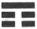
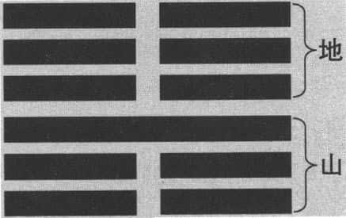
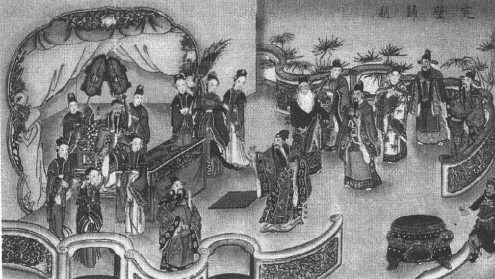
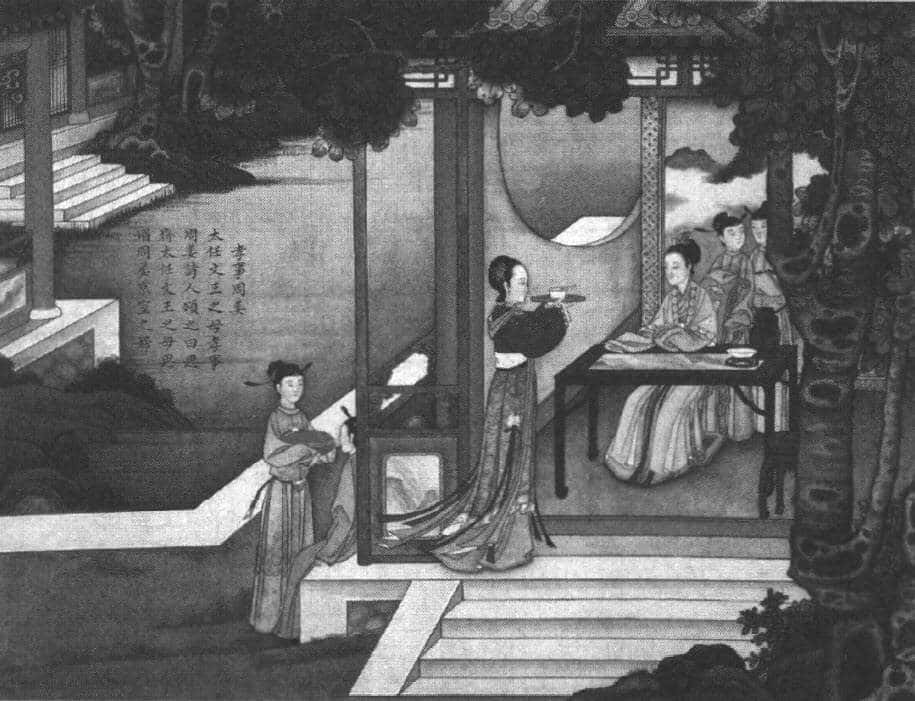

谦卦是一个很特别的卦，它的六爻“非吉则利”。说到“谦”这个字，譬如“满招损，谦受益”、“谦虚纳百福”等等，都可以和“谦”搭上关系，我们也知道，一个人谦虚时，话说得比较委婉，跟别人来往，摆一些低姿态。这些不太难，很多人都可以做到。但是，真正的谦虚要从何理解？

# 古圣先贤谦虚的态度 

我们要从古代的一些资料说起。譬如，孟子最推崇舜。他有一次提到舜，一连做了一系列介绍。他先说孔子的学生子路，因为一般人听到子路，都会觉得这个人非常豪爽，有豪侠气概，他应该不会随便表现谦虚吧。孟子居然说了一句话：“子路闻过则喜。”子路听到别人讲自己的过错，就非常高兴。这很难了，我们一般人是“闻过则怒”，你说我的坏话，说我有过错，我就很生气；要不然就设法找借口，说那不能怪我，要怪别人。子路听到过失就觉得很高兴，代表他也是谦虚，要是不谦虚的话，听到别人讲你有过失，恼羞成怒。

接着，孟子提到大禹，“禹闻善言则拜”，大禹听到有价值的话就向别人拜谢。别人提的有价值，不见得我不懂，只要他有心来告诉我，我就向他拜谢，这也是谦虚。实际上作为大禹，有什么话不懂的？这些伟大的圣人，自己都是很聪明的，但他还是感谢别人的好心，因为你再怎么聪明，也不可能了解天下所有的事情。

最后是舜，“大舜有大焉，善与人同”，何谓“善与人同”呢？根据孟子的解释，舜的善都是从别人身上学来，然后自己去实践，做的时候让别人知道：这是我跟你学的。这不容易，所以舜到任何地方都受欢迎，因为他看到别人有优点，就学过来，别人称赞他，他说你不要称赞我，这是你身上的优点，我从你身上学来我再做的，代表“我与人为善”，跟别人一起来实现善，这是多么谦虚的态度！舜到任何地方，都受到欢迎和肯定，老百姓跟着他去，不到三年那里就变成一个都城了，再过三年就变成一个国家了。所以尧后来才特别肯定他、欣赏他，因为他谦虚。成功人物没有不谦虚的，不谦虚的话，很快就会失败，众叛亲离，这种例子太多太多了。

# 谦卦的特别之处：谦虚纳百福 

我们为什么要特别介绍谦卦呢？因为它是整个《易经》六十四卦中，唯一的一卦六爻“非吉则利”。其他的每一卦都有一些好的和不太好的。我们讲到乾卦的“九三”、“九四”时，只希望做到“无咎”，讲坤卦则要收敛、小心，坤卦一开始就提醒你：“履霜，坚冰至。”

谦卦如何特别呢？它的底下三爻是“吉”，吉祥；上面三爻是“无不利”，什么都适合，没有任何不利，做什么都可以。六爻“非吉则利”。并且，最特别的是，在《易经》里面出现好几次有关鬼神的，但是在谦卦《彖传》里面就直接说：天道会祝福谦卑的人，地道会帮助你，人道也会肯定你，鬼神也会祝福你。提到鬼神，其他各卦很少在《彖传》里面提到鬼神的。（原文是：天道下济而光明，地道卑而上行。天道亏盈而益谦，地道变盈而流谦，鬼神害盈而福谦，人道恶盈而好谦。）一般来讲，天道是指大的自然环境，像天体运行、春夏秋冬，这属于上天决定的；地道代表地理山川这种客观的形势；人道代表人类社会的规则。

以天道来说，“冬天来了，春天还会远吗？”这句话代表什么？冬天冷得过头了，应该谦虚一点了，该变温暖了。从天道来说，一过头了，就要收敛了。同样，夏天太热了，秋天也不远了。天道就说明任何事情都不要过分，因为谦的反面是“盈”，“盈”就是满，志得意满。以地道来说，让你高的地方低一点，低的地方可以稍微填满一点。就像一桶水，一旦倒下去，往低处流。我们平常说河东河西、沧海桑田这些，就说明大地本身就有一种调节的作用。你过高，它就会让你比较低。

鬼神是什么呢？古代讲鬼神有两种基本的来源：第一种是人死为鬼。所以鬼神就是我们的祖先。我们的祖先跟我们一样，也是喜欢谦虚的人，讨厌那些骄傲的人。另外一种是人间里面伟大的政治人物变成神。譬如，古代有些人做官做得好，譬如管泰山的、管黄河的都是官，这些官死后就会变成泰山的神、黄河的神。人间伟大的政治人物变成神，我们的祖先是鬼，年代久了之后，鬼神就变成一个团体。人与鬼神在某种程度上可以互相沟通，但是我们得首先学会人与人之间的来往。譬如，子路请教孔子如何服侍鬼神。孔子说，你还不懂得怎么跟人来往，你就不要想那么多了。因为跟人来往和跟鬼神来往的道理是一样的，鬼神是我们的祖先，你不可能跟鬼神处得很好，却跟人来往得不好。这样一来，你就有谄媚鬼神的嫌疑了。古人认为鬼神是不能被你蒙骗的，像两国缔结盟约时，常常要请鬼神来做见证，代表我们定了盟约，谁违约，鬼神就来惩罚。所以两国定约的时候，都有这样的一个文字资料。再看人，人的社会，你看到谁谦虚了，就愿意肯定他；看到谁骄傲，志得意满，你虽然斗不过他，你心里也很讨厌他。所以，在这里就可以说，“谦”给人类的启发特别地深刻。

# 谦卦卦象的启发：学会谦卑自处 

谦卦到底在说什么？我们且先把卦象了解清楚。我们看卦象（见下图），组合是“地”和“山”，“地山谦”，读的时候要先读上面再读下面。下面是艮卦（ ），艮是山；上面是坤卦（ ），坤是地。下艮上坤，这是学术界的读法，一般人都不喜欢这样读。所以，我们照习惯的读法，因为中国人写字是先写上面再往下写，但是《易经》的卦是先从下面再往上面发展，学术界的读法是“下艮上坤”，一般读法是“地山谦”，上面是地，底下是山。不过，我们画卦的时候，务必从下面往上画，不要说“地山谦”，就先画地，再往下画山，这就违背规矩，毕竟习惯还是要照它的规则来。

谦卦卦象 

谦卦的卦象有什么特色？六爻只有一个是阳爻，“九三”是主爻。一卦六爻，往往有一个爻是主爻，主爻最能够表现卦的特色，等于是以它为主心骨，以它为脊椎。这里的“九三”最重要，因为另外五个全部是阴爻，“物以稀为贵”，当然是主。不过，不要以为只有阳爻是“主”，如果倒过来，五个是阳爻，一个是阴爻的时候，阴爻就变成主爻了。

谦卦的卦象是一座山在底下，上面是地。山代表停止，因为山很高耸，山有实力，有真才实学。但是里面有真才实学，外面跟平地一样，一望无际，非常的顺从，所以它的外表给别人完全没有任何压力。一个人有学问或是有本事、有钱、有地位、有权力。最怕的是仗着他的能力、本事给别人压力，这样就不合乎谦卦的原则。谦卦的原则是：不管你有名利权位，有何等本事，都要把它们放在底下，就像外面是一片平原，跟别人一样非常柔顺，好像若无其事。因为人活在世界上，有各种发展、成就，又有非常复杂的因素。譬如庄子所说的一个故事，即成语“朝三暮四”。今天听到“朝三暮四”这个词，都知道这个人不好，早上想什么晚上又改了，没有恒心，说话不算话，没有原则。但是庄子说的不是这个意思，他说有一个人养猴子，养到后来没钱了，就和猴子们开会商量，以后给他们吃的食物，早上三升栗子，晚上四升栗子。猴子听了都很生气。他说，那倒过来吧，早上四升栗子，晚上三升栗子。猴子听了都很高兴。我们都知道，早三晚四和早四晚三，加起来都是七。为什么前面很生气而后面很高兴呢？因为猴子不会算术，只知道先吃多一点比较好，跟小孩子一样，没有概念。这代表什么？整体是一样的，所以你不要受情绪干扰，就像有些人少年得志，有些人大器晚成。你在学习《易经》的时候，这些相关的资料都可以让你去想到说，我现在要“谦”，是因为我的时机没到，别人到了，让他去发展，轮到我的话，我就要谦卑自处。因为将来别的人也会发展。我今天得意的时候太骄傲，将来别人得意的时候，那不是更要看扁我吗？我今天顺利了，我很谦虚，别人看到我顺利的时候谦虚，他将来顺利的时候，也不至于在你面前过于嚣张。在人生的过程里面，没有谁有绝对的优势，一路顺到底，没有这样的人生。如果说往上一路很顺利，没有任何障碍，这样的人是不可思议的，在人间不可能出现的。

我们都知道北宋苏东坡才华太高，一辈子都不太得意，屡次被贬谪。他越被贬，文章写得越好，这是他唯一的成就。但是就他本身来说的话，很苦。后来他年纪大了，有经验了，就调整观念了。他写了一首诗《洗儿》：“人皆养子望聪明，我被聪明误一生。惟愿孩儿愚且鲁，无灾无难到公卿。”意思就是说：别人养孩子都喜欢小孩聪明，读书考试第一名，但是我苏东坡被聪明误一生；我现在只希望小孩子又愚又鲁，宁可你笨一点，反应慢一点，但是人生不要有灾难而可以做到公卿。这是做梦，人生怎么可能无灾无难做到公卿呢？苏东坡这种做父母的心愿，是令人感动，想到之后就觉得真是伟大，但是不切实际。为什么希望孩子无灾无难呢？事实上，灾难（困难）才能锻炼一个人的生命，使他在这里面发展潜能，造就自己。

# 谦卦六爻详解 

谦卦的爻名依次是：初六、六二、九三、六四、六五、上六。我们先看一下卦辞，它的卦辞很简单：“亨，君子有终。”意即“通达，君子有好的结果”。谦卦就是“亨”，通达，一个人谦虚，到处都走得通，然后有好的结果。

**“初六。谦谦君子，用涉大川，吉。”** 意即“初六。谦而又谦的君子，可以渡过大河，吉祥”。为什么讲“谦谦”两个字？因为它在谦卦的最底下。像这个就很有趣了，本身是谦卦，“初六”又在最低的位置，完全符合谦卦。为什么吉祥？因为本身是在作为山的基础，有实力，但是你很谦虚，并且有本事渡过大河，当然吉祥。在《易经》里，能够渡过大河的不多，不到十个卦。它可以渡过大河，代表它力量很够。通常这个卦都是有风（巽卦）或是有天（乾卦），在这里山（艮卦）也有能力渡过大河，就因为谦虚。渡过大河是很不简单的，因为古时候很少好的船作为渡河的交通工具，渡河是很危险的事情，但是它照样有这个实力和能力，可见，一个人越谦虚，就好像你要跳高，起跳之前，蹲得越低，跳得越高。这是第一爻。

**“六二。鸣谦，贞吉。”** 意即“六二。响应谦卑的态度，正固吉祥”。“鸣”就是响应谦虚的态度。谦卦只有一个“九三”阳爻，其他全部是阴爻，跟“九三”有关系的是什么？第一个有关系的是“六二”，跟九三靠在一起。在《易经》里，讲六爻关系的时候，靠在一起的叫“比”，“比邻而居”。比邻而居有一个原则，如果阴爻在下，阳爻在上，这是好位置。阴爻在底下，上面有阳爻，可以当靠山，所以很好。相反，如果上面是阴爻，对阳爻来说，不是很好，对阴爻来说，更不好。在谦卦里面，跟“九三”有关系的有两个爻，第一个是“六二”，它跟“九三”靠在一起。第二个则是上面的“上六”，《易经》的六爻是由两个三爻卦所合成的，相对位置叫做相应。譬如，“初”和“四”、“二”和“五”、“三”和“上”相应，这很容易。相应最好的是阴阳相应，一阴一阳能够调节，能够会通，两个都是同性，同性则相排斥。在这个时候你就会发现，原来在《易经》里面，有这么复杂的一种“比应”。这些都不是问题，我们慢慢熟悉之后，将来看每一个卦，一看就知道，要看哪些东西。第一，它本身的位置当不当位？“初”、“三”、“五”是不是阳爻？“二”、“四”、“上”是不是阴爻？第二，就要看下卦与上卦要相应，“初”和“四”、“二”和“五”、“三”和“上”相应。这些都是参考好坏的标准。第三，就是上面所说的相邻的卦（比）怎么样？以谦卦来说，“六二”与“九三”相比，与九三有关的是“上六”，“上六”是阴爻，“九三”是阳爻，两个相对的话，阴阳调和。“六二”的爻辞是“鸣谦”，响应谦虚的态度，“上六”也是“鸣谦”，响应谦虚的态度。因为爻辞是谁写的呢？周文王写的，周文王被商纣关在牢里七年没事做，每天就在那里写，这该怎么下断语呢？从这里面出来，它的规则你慢慢发现了之后，你也会写，只要给七年的时间，你也会写了。写出来之后就会有道理，就说你这个位置，就应该有这样的反映。第二个，你在“六二”的位置，很好。“六二”本身是好位置，我是阴爻，是“二”的（位）数，是偶数，本来就是柔的位置。所以，你最好不要动，“鸣谦贞吉”，响应谦卑的态度，能够正固就很吉祥。

**“九三。劳谦君子，有终，吉。”** 意即“九三。有功劳而谦卑的君子，有好结果，吉祥”。上文就讲过，“九三”是主爻，整个谦卦就靠“九三”。没有“九三”的话，谦卦就变成坤卦了。“九三”是“有功劳而谦卑的君子”，有好的结果，吉祥。连续三个“吉祥”，《易经》里面没有见过，下卦三爻三个“吉祥”只有谦卦。有功劳而谦卑的君子是谁呢？这就提醒我们，没有功劳很难谦卑。就好像说一个人非常谦虚，有能力、有本事、有学问，他才能谦虚，否则什么本事都没有，你说你很谦虚，这不叫谦虚，是实事求是。每一个人都有专长，你的专长胜过别人，你不要以为自己就胜过别人，你要想到别人有不同的专长。每一个人都各有专长，就很自然地把自己的专长当做平常的事，就不会特别夸张了，认为自己胜过别人。所以，人活在世界上，谦卑是一种最正常、最合理的态度。

想到谦卑，就想到骄傲，西方中世纪一千多年受基督教的影响，他们有种观念，叫七大死罪，骄傲排第一。我记得有一部电影，片名就叫《七宗罪》（又译《火线追缉令》），电影里面有七种人被杀，这七种人就是犯了七大死罪，每个人犯一种。第一个是骄傲，后面是贪财、好色、贪吃、嫉妒、愤怒、懒惰。我们就要问了，为什么西方人如此讨厌骄傲，而我们如此推崇谦虚呢？这都有异曲同工之妙。西方人讨厌骄傲是受宗教影响，因为人是上帝造的。人是上帝造的话，人实际上是受造物，叫你活你就活，叫你死你就不能不死。但是人是万物之灵，就会想跟上帝差不多，意图对抗一下，这就是自大骄傲的想法。因此你一有骄傲的念头，马上就要被毁灭。可见，西方最讨厌骄傲，是因为在宗教背景下，人要知道自己实际的情况，有生就有死。一个有生有死的人，他的生命非常短暂、非常脆弱，没有任何理由骄傲。有人说骄傲就是了不起、有本事。这哪里是呢？我们都知道，人要生病的时候，稍微风一吹就感冒了，稍微出个问题，马上就不见（死亡）了。很多年纪都是五十几岁的人，早上还在打球，下午就走了，这种事例很多。说明什么？人要谦卑。谦卑不是说你修养很好所以谦卑，而是说你本来就应该谦卑，没有什么条件可以骄傲的。

《完璧归赵》：劳谦，君子有终 

捷克作家米兰·昆德拉曾说：“人类一思考，上帝就发笑。”上帝发笑，不是开心地笑，而是在嘲笑我们。人类能想什么花样出来呢？像罗丹的雕塑作品《思想者》，雕像托着头在思考，那个姿势摆出来还能思考吗？身体都扭曲了，痛苦得很。人类一思考，上帝就觉得很好笑：“你们人类在想什么问题？”人为什么要安分呢？因为谦卑才能够实事求是，就人的立场来做该做的事。人跟人相处，千万不要看不起别人；别人也是上帝造的，你怎么可以看不起呢？看不起别人等于看不起上帝，上帝当然不喜欢你了。可见，从西方的背景得知骄傲的可怕。人最怕的就是狂妄，到最后发疯了。西谚云：“上帝要毁灭一个人，就先让他发疯。”发疯的人一定是骄傲狂妄得不得了，天下唯我独尊。你看金庸小说里面，那些想争武林第一的人到最后变成几乎发疯的情况，像西毒欧阳锋想争天下第一，最后走火入魔，忘了自己是谁？这是很具讽刺性的例子。这是狂妄、发疯，到最后忘了自己是谁。我们看到这些类似的情况后，焦点要转到谦卦，你就知道谦卦为什么重要，因为==有功劳而谦卑的君子，每一个人都会肯定他，他会有好的结果。==

**“六四。无不利，撝（huī）谦。”** 意即“六四。没有任何不适宜的事，只要发挥谦卑的精神”。“六四”为什么可以做到谦卑呢？因为它位置好，“六”是阴爻，“四”是偶数，代表柔的位置，阴爻在柔的位置就没有问题。我们可以发现，谦卦六爻，“六二”很好，“九三”很好，“六四”也不错，再往上走的话，变成“六五”了。

**“六五。不富以其邻，利用侵伐，无不利。”** 意即“六五。不靠财富就得到邻居支持，适宜进行征战，没有不利的事。”“六五”很特别，就是不用财富，就得到邻居的支持。因为谦卦上面三爻都是阴爻，“六五”在中间，它本身也没有财富，它是虚的，得到邻居的支持。但是它又有实力，可以利于作战，安定社会。为什么这样讲？因为你再怎么谦虚，你也是国君，“六五”的位置等于是“飞龙在天”的位置。这时光谦虚不行，身为国家领导，不能谦虚到没有原则，要有威严，恩威并重。不能说你是国家领导，你很谦虚，到最后别人欺负你，你都不计较。这时的你不是为自己，而是为国家的稳定。像周公这么谦虚的人，也照样派兵平定武庚之乱（管叔、蔡叔兄弟造反），他再怎么谦虚，也要出兵，因为他知道，他不是为了自己的权位着想，是为了天下百姓。历史上讲到谦恭、谦卑的时候，常常会以周公做例子，原因就在这里。

像如今做领导的该怎么做呢？学习刘邦吧。我们都知道，刘邦本身的才华，说实在的，远远比不上三个人——张良、韩信、萧何。他自己都承认：我比不上你们三个人，但是我就是可以用你们。为什么可以用呢？谦卑的态度。可见，如果你真的当领导者，你更可以发挥谦卑的精神，因为这时你有实力，位置适当。你不要说一谦卑，就统统放弃了，那谁不会呢？什么都不做或者什么都让别人做，不是谦虚的意思。谦卑要看位置，你在“六五”这个位置，你谦卑的表现才有相当的力量，即刚柔并济。为什么讲“六五”是刚柔并济呢？因为“六”是柔，“五”是刚的位置，柔、刚配合在一起，就是很好的状况。要不然光是柔，怎么能当领袖呢？

**“上六。鸣谦，利用行师，征邑国。”** 意即“上六。响应谦卑的态度，适宜派遣军队，讨伐属邑小国”。“上六”与“六二”一样，都是“鸣谦”。到“上六”的时候要“鸣谦”，这时也适合出兵作战，适合就是有利。为什么上六响应谦卑的态度？因为“上六”，与“九三”，正应，阴阳对应；而“六二”与“九三”相比，阴阳正应。“九三”是整个谦卦的主爻，“六二”与“九三”相邻，“上六”与“九三”相应，所以，这两爻都讲究“鸣谦”，这是呼应主爻的一种做法。

在这个卦里，初六“谦谦君子”，“六四”发挥谦卑的态度，几乎每一个爻都有特定的角色。从这里我们可以知道，原来每一爻是这样写出来的，每一句话的出现都有特定的时间和空间，如此慢慢熟悉之后，我们再看谦卦，就变成一个立体的了，就知道你现在在什么位置，任何一个位置的人都可以谦卑，绝对不能说，年轻人谦卑一点，事实上老人家也要谦卑。到老的时候，乾卦是“亢龙有悔”，坤卦是“龙战于野”，还有各种灾难、战争，何况是别的卦？

# 谦卦给予我们的启示 

我们学习一个卦的时候，就要常常想，我们从这个卦可以得到什么样的启发。谦卦也不例外。为什么很多人研究《易经》，他不一定占卦？光讲义理就得到很多启发。譬如，我从谦卦里想：人生应该怎么办？谦卦六爻非吉则利，怎么理解呢？那就要问你现在在哪一个位置？如果你达到“九三”的位置，那是一个检验，因为一般人有功劳就不会谦虚。老子特别强调：“不自伐，故有功。”就是我有成就，我不要自夸，这样功劳就不会离开你。通常我们称赞一个人，是因为他有功劳，但很谦卑，说自己是大家造就的，大家合作才能完成这件事。他越这样谦卑，大家越肯定他有功劳。因为他有功劳，不会站在我们上面，不会欺压我们。如果他认为自己有功劳，就要占上风，摆出姿态来，你们大家都要听我的了。在老子看来，这样反而不好，功劳反而变成一个障碍，你功劳很大，你上去的话，变成是你以为天下就只需要你一个人。没有那回事，你有功劳之后，你要得到别人支持，才能够维持长久。

在谦卦里面，如果举孔子的学生为例，最好的示范是谁呢？当然是颜渊。颜渊在《易传》的部分经常出现，孔子有很多学生，他最喜欢拿颜渊做例子。颜渊有什么特色呢？像曾参就说颜渊真了不起，他本身能力很强，但是他会请教能力差的人。他本身学问很好，他会请教学问差的人，“有”好像“没有”一样，“多”好像“少”一样，“充实”好像“空虚”一样，这样描写颜渊。颜渊明明知道，为什么还要请教呢？实际上，颜渊的“知道”是一个理性上的觉悟，他确实知道，他也确实有能力。但是每一个人不一样，假设今天开会，开会的时候，你主张什么样的看法，别人不一定赞成，你就要设法让别人来说他的主张，别人说的时候，你自己再来呼应、附和，效果就很大。否则你主张“东”，别人主张“西”，到时候吵不完。好的领导就要让别人来说出你主张的东西，别人讲出来之后，你再说支持谁，大家都会觉得你很客观，事实上都在你的安排之中。

颜渊是孔子最好的学生，子贡曾经就比较过，他说颜渊“闻一知十”，古人算数以“一”到“十”为止，十代表圆满。子贡自己说只能够“闻一知二”，当然子贡是谦虚，但从另一方面来看，颜渊确实聪明。这时孔子就对子贡说，你确实比不上颜渊，我跟你都比不上颜渊。这又是孔子的谦虚。像这种师生之间的关系真是了不起，孔子年纪比颜渊大了三十岁，比子贡大了三十一岁，他身为老师，没必要说“我跟你都比不上颜渊”。但是你不要忘记，后来韩愈的《师说》，也强调：“闻道有先后，术业有专攻。是故弟子不必不如师，师不必贤于弟子。”这样社会才会进步，如果每个学生都比老师差，那不是越来越差吗？一个老师就希望教出胜过自己的学生，今天你看到很多年轻的朋友，几年之后胜过我们，应该高兴才对，这样社会才会进步。我们讲谦卑的时候，不是一个人处事的态度而已，而是一个社会，整个社会都应该发展这种谦卑的精神，每一个人都会既安分又能负责任。

《孔子圣迹图》：孝事周姜 

讲谦卑或者骄傲，往往在比较的基础上才会出现。我们就要问了，需要比较吗？答案是避免比较。一旦比较，就会涉及标准的问题。你在这个时候得意，稍微有点成绩，将来换作别人。你得意的时候，别人难过；别人得意的时候，你也难过。如此一来，在社会上怎么可能保持平衡和谐呢？我们特别谈到谦卦，用意就在这里。我们都知道，《易经》六十四卦代表了六十四种人生的处境，六十四种大的形势。而在这六十四卦里面，只有唯一的谦卦是六爻非吉则利，下面三爻是吉，上面三爻是没有不利的事，都非常好。

# 结　论 

我们今天谈到《易经》的谦卦，确实是有很多启发。尤其是人在相处的时候，“谦虚纳百福”。一个人只要谦，“满招损，谦受益”，不但天道、地道、人道来支持他，鬼神也会支持他。那么谦虚最根本的观念何在？还是在于真诚。万物和人类都有一定的发展阶段，所以我们不要过度地夸张自己在顺利的时候所有的表现。

老子说：“天地不仁，以万物为刍狗。圣人不仁，以百姓为刍狗。”古人在祭祀的时候，要用草扎一些狗放在祭桌上面，叫做刍狗，这时你要向它跪拜，但是祭祀完之后，这些草扎成的狗就乱丢了，丢在地上，被人家踩踏，捡回去当柴烧。这说明什么？天地没有偏爱，万物就是刍狗。现在是冬天，该开什么花就开，到春天的时候，这个花不开了，换春天的花开。每一个季节都有不同的花开放，过了那个季节，你就不要问它在哪里。当你“荣”时，兴盛的时候，就上台；当你“枯”时，别人让你下台的时候，换别人上台，你就下去吧。万物就是这样的一种方式在循环、在轮转，作为人类，有什么好狂妄、好骄傲的呢？“圣人不仁，以百姓为刍狗”也是一样，圣人是悟道的统治者，悟道之后，统治老百姓就要以老百姓为刍狗，譬如，我们现在发展什么地方，将来再发展别的地方，不能说整个中国同时发展。现在发展沿海，再发展内陆，发展哪一个省，再哪一个省，都有轮流顺序，不可能沿海一直发展下去，将来说不定恐怕到海上去了，没有地方可以走了。任何地方都是一样，都会有轮流上场的机会。这是老子的智慧，它是看全面，没有任何偏爱。因为自然界的规则是非常客观的。

我们今天介绍谦卦，要把这些放在心中参考，看这个卦的时候，我相信你会看得更清楚、更透明。我们已经介绍了三个完整的卦：乾卦、坤卦、谦卦。将来再谈别的卦的时候，都是几个卦合起来说，因为那样比较丰富，从这些卦我们就可以很清楚地知道自己处在人生的何种处境、状态，应该采取什么样的态度来面对、因应。

# 易经小常识 

## 卦　象　歌 

乾为天　天风姤　天山遁　天地否　风地观　山地剥

火地晋　火天大有　坎为水　水泽节　水雷屯

水火既济　泽火革　雷火丰　地火明夷　地水师

艮为山　山火贲　山天大畜　山泽损　火泽睽　天泽履

风泽中孚　风山渐　震为雷　雷地豫　雷火解　雷风恒

地风升　水风井　泽风大过　泽雷随　巽为风

风天小畜　风火家人　风雷益　天雷无妄　火雷噬嗑

山雷颐　山风盅　离为火　火山旅　火风鼎　火水未济

山水蒙　风水涣　天水讼　天火同人　坤为地

地雷复　地泽临　地天泰　雷天大壮　泽天夬　水天需

水地比　兑为泽　泽水困　泽地萃　泽山咸　水山蹇

地山谦　雷山小过　雷泽归妹

## 卦序歌 

乾坤屯蒙需讼师，比小畜兮履泰否；

同人大有谦豫随，盅临观兮噬磕贲；

剥复无妄大畜颐，大过坎离三十备。

咸恒遁兮及大壮，晋与明夷家人睽；

蹇解损益夬姤萃，升困井革鼎震继；

艮渐归妹丰旅巽，兑涣节兮中孚至；

小过既济兼未济，是为下经三十四。

