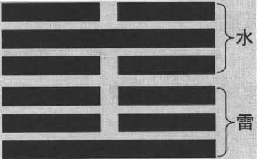
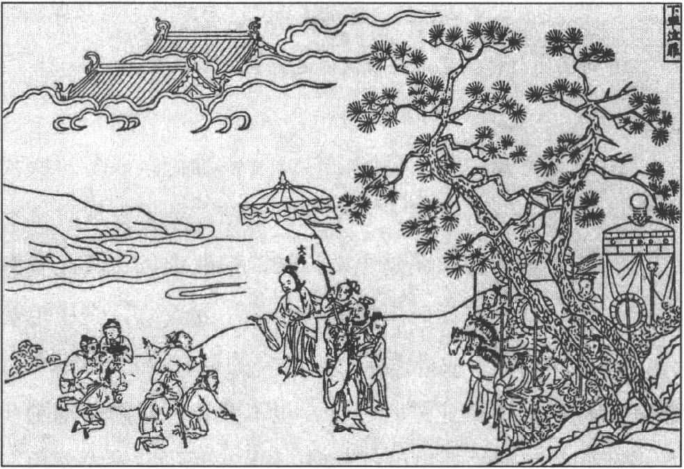
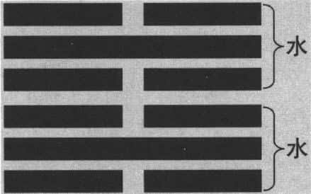
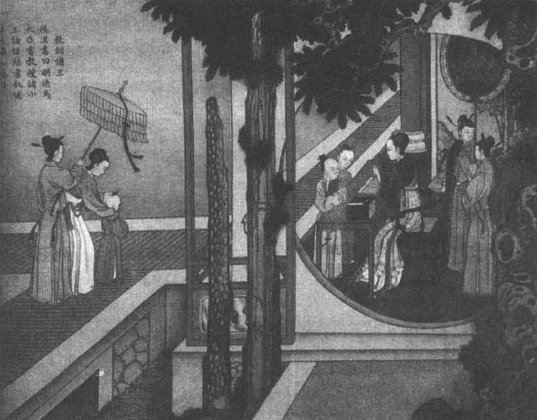
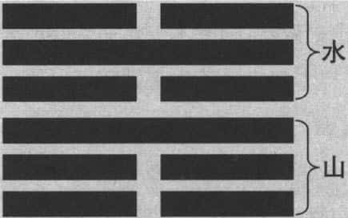
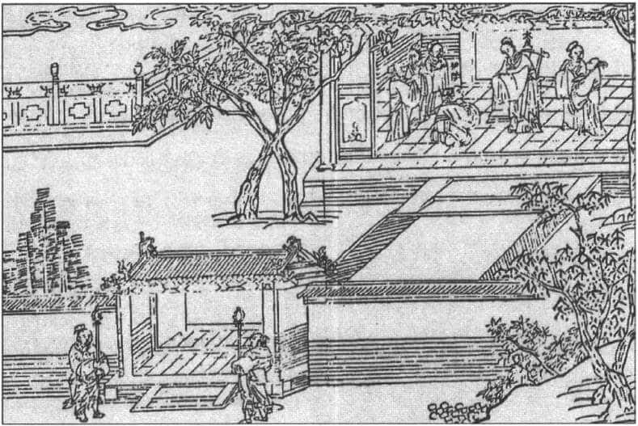
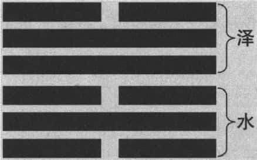
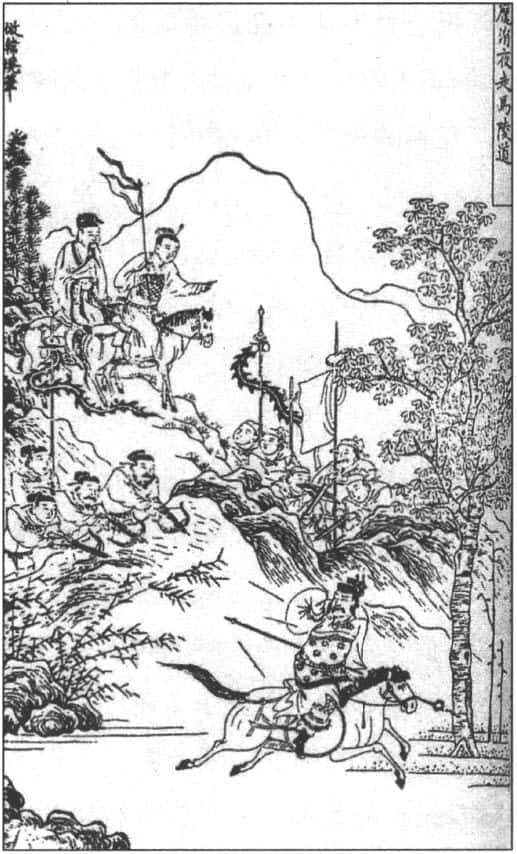
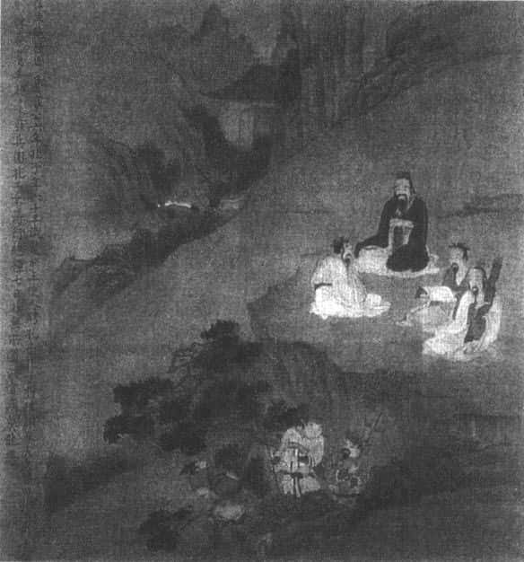

我们这一讲的主题是“面对困境的智慧”。一个人在顺利的时候，往往不容易听从劝告，但是他处在困境的时候，就愿意去听了。我们有时候不需要等别人建议，自己就可以觉悟。在《易经》六十四卦中，有所谓的四大困难的卦。即屯（zhūn）卦（ ）、习坎卦（ ）、蹇卦（ ），困卦（ ）。屯卦是万事开头难；习坎卦是危机四伏；蹇卦是山穷水尽；困卦是坐困愁城。这些都是困境。

# 困境是激发一个人成功的动力 

困境真的那么可怕吗？其实不然。面对困境，很多人有成功的经验，困境对他们来说，不见得是坏事。今年奥运在北京举行，提到奥运，大家就想到很多杰出的运动员，我们最熟悉的运动员之一姚明。姚明曾经在接受访问时说，他自己有五大缺点：第一是左耳听力有问题；第二是肩膀窄（当然我们看不出他怎么窄了，可能跟身高比例有关系）；第三是手臂的长短与身高不成比例，一般人双臂伸开，就是身高，他的手臂伸开来不到个子高；第四是臀部大；第五是跟腱短，就是脚后跟跟腱短。就因为这五大缺点，他才刻苦努力练习，最后克服之后，才能够出人头地。所以，对于运动员你千万不要以为，他生下来就这么好，没那回事。像迈克尔·乔丹，他打篮球的镜头，实在是让人回味无穷。但他怎么说自己呢？他说他年轻的时候，练习打篮球，每天要投进五百个空心球，才让自己休息。再如高尔夫球，有名的老虎伍兹，他从八岁就开始练习打球，打了十三年，到二十一岁才拿到全美高尔夫球的冠军。我还记得美国以前有一位田径女将，参加奥运得到两面金牌，退役之后改打高尔夫球，结果两年之后，就得到全美国女子高尔夫球赛冠军。体育记者立刻报道说她是运动天才。这位女运动员出来抗议，她说，我不是天才，从我练习打高尔夫球开始，每天挥杆一千多次，挥到手发抖、抓不住球杆为止，一年之后球杆就跟手一样，连在一起了，爱怎么挥就怎么挥。这就是长期苦练使技术变成本能，有如艺术了。

可见，成功没有侥幸的，有时候困境反而会是激发一个人成功的动力。我现在到处上课，很多人常说，你好像说得还蛮快的，口才还可以。这实在是误会，我小时候就有严重的问题，即说话口吃。你能想象吗？我读小学时，最怕老师叫我起来读课文，一叫到我就口吃，一个字重复几十次念不出来，全班大笑，有时候老师笑得最大声。所以，我非常自卑。我为什么可以演讲呢？因为以前有过惨痛的经验，从这个痛苦里面，才发展自己的专长，这就是所谓的困境磨炼。

# 屯卦：万事开头难 

屯卦是《易经》的第三卦，屯卦的卦象是“水雷屯”（见下图），上面是水（坎），底下是雷（震）。这个卦为什么排第三呢？因为天、地开始交通，天是乾卦，地是坤卦，开始交通、阴阳交错之后第一个出现的就是屯卦。==屯卦代表的是自然界的洪荒时代==。很多电影介绍洪荒世界的时候，像南美洲、非洲的原始丛林都是这样子，你到里面会觉得很可怕，飞禽走兽都是我们的敌人。人类怎么生活呢？在体力方面很小、很差，跑不过马，力量斗不过牛，任何一只野猪都可以把你摆平。

屯卦卦象 

屯卦描写的“洪荒时代”，屯卦《彖传》曰：**“屯，刚柔始交而难生。动乎险中，大亨贞。雷雨之动满盈，天造草昧……”** 那时“阳刚之气与阴柔之气开始交流，困难随之而生。在险厄中活动不已，==要使一切通达而正固==。==打雷下雨遍布各地，上天的造化仍在草创蒙昧的阶段==”。我们常说，我们的祖先“筚路蓝缕，以启山林”，这说明什么？万事开头难。在这个时候，你应该先安定下来，因为你想发展也没机会。屯卦下卦是震卦，代表动；上卦是坎卦，代表危险。就好像人类刚刚有了机会，要好好发展，但上面是水，有危险。里面想动，外面有危险，怎么动都不会有成绩的。

屯卦卦辞说：**“屯。元亨利贞。勿用有攸往，利建侯。”** 意即“屯卦。开始、通达、适宜、正固。不要有所前往，适宜建立侯王”。卦辞告诉我们，不要急，要安定下来，==先建立人间的部落，找一个好的领导==。因为人群合作是人类社会继续生存的第一步。假设你创造新的公司，你不要马上图发展，首先就是稳定基础，建立内部的秩序。安定是不容易的，因为看别人发展很快会着急的。别人一日千里，几年下来变成大的企业，我还在原地踏步。不要着急，因为你刚刚开始，如果基础没有打好，将来的发展也不会走得太远。屯卦就是要提醒我们，在刚刚开始的阶段，一定要记得，先稳定下来，打好基础，有时候==安静、稳定==也是一种很好的决策，它是蓄势待发的阶段。屯卦接下来是蒙卦，蒙卦代表启蒙，由此可知，原来==历史的发展，也像人类小孩子的时候一样，眼睛蒙着只靠本能很危险，所以需要启蒙==。

《下车泣罪》：大禹以贵下贱 

屯卦有“坎”在其上，坎代表陷阱、危险，如果说你非走不可、非动不可，从以下的“六二”、“六四”、“上六”三爻爻辞就可以知道。

> “六二。屯如邅如，乘马班如。匪寇，婚媾，女子贞不字，十年乃字。”（意即：“六二。困难重重，徘徊难行，骑上马也是团团打转。要是没有盗贼，就前去结婚了。女子守正而不出嫁，十年才可出嫁。”） 
>
>“六四。乘马班如。求婚媾，往吉，无不利。”（意即：“六四。骑上马而团团打转。若是要求结婚，前往是吉祥的，没有什么不适宜。”） 
>
>“上六。乘马班如，泣血涟如。”（意即：“上六。骑着马团团打转，哭泣得血泪涟涟。”） 

由爻辞可知，骑上马团团转，寸步难行。很多时候我们都希望能够一日千里，立刻就有成绩。结果发现时机不成熟、条件不具备，还是原地打转，白费力气。因此看到屯卦，我们就要想任何事情的开始，不要着急，先稳定基础。假设你高中毕业进大学，进大学的第一年，你是新生，稍安毋躁；大学毕业进入社会，也不要着急，你是刚刚开始。我们对照别的卦也可以发现，连乾卦都说“潜龙勿用”，何况是屯卦呢？骑上马团团打转，这就强调不会有发展的。那就先建立自己的基础，万事开头难，开头是个危机，也是个转机。我们要把握住这个契机，后面就不会有危险了，慢慢发展，会有很好的未来。这是第一个困难的卦——屯卦。

# 习坎卦：修德习教，诚信为上 

第二个困难的卦是“习坎卦”。为什么叫“习坎”呢？“习”代表重复，上面是水，底下是水，两个坎在一起，叫“习坎”。这个卦一出现的话，我们就要知道，要小心了，因为重重险阻、步步危机、危机四伏，这时只能希望“无咎”，不要有灾难。当你碰到危机的时候，不要希望立刻反败为胜，这时要求的是你能够诚信。==一个人在困难的时候，要保持他的诚信。==为什么可以做到诚信呢？我们看卦象（见下图），“九二”和“九五”中间两个位置都是实在的，而另外四个位置是虚的，代表==中间很实在，内心很真诚，别人可以相信你==。

习坎卦卦象 

一个人在危险中，==危险一定不好吗？不见得。有时候危险会提醒你，让你更谨慎。==并且水流是有常性的，“流水不腐”，流水里面的东西是不会腐烂的。讲到“险”这个字，人生也不能没有危险，古代就有天险、地险、人险。天险就是春夏秋冬所造成的季节变化，是人类不能够克服的。地险就是所谓的“高山大河”，古代建立城邦，就要注意这些。孟子有一句话可以参考：“天时不如地利，地利不如人和。”天时就是气候、季节。要进攻一个城堡，有天时才能把它围住，围了半天打不进去，代表它有地利。地利就代表这个地方易守难攻，如果说攻城要成功，攻城的人要比守备的人多好几倍的人力，这代表地利的作用。接下来是“人和”，明明守得住，为什么会失败呢？因为内部不和。人生不可能只是个人在奋斗，==以一个团体来说的话，就要设定某些危险，“险”代表设定一些障碍，不要让别人攻进来，自己可以得到某些保障。==“人险”就是说，==设法设定某些法律规章，谁违背了就要受到制裁，这样才能够保障整个团体的安全==。

修德习教 

因为危险，所以我们知道如何去设法求得平安。如果没有任何危险，碰到危险就来不及了。习坎卦是重复的坎卦出现，也就是说重重的危机。尤其在最下面往上一看，一个坎接着一个坎，会觉得压力挺大。我们有时候在事业上、在各方面奋斗的时候，往往会碰到“习坎卦”这种情况。遇到习坎卦的状况，有一个原则，就是做到==“无咎”，不求有功，但求无过，因为形势比人强。==你不能说在任何情况下都要抗争、奋斗，有时候要能够收敛，要看时机，量力而行。

孔子有很多好朋友，其中有一位叫蘧伯玉的，得到孔子特别的称赞。蘧伯玉是卫国的大夫。孔子说，蘧伯玉是一位君子，国家上轨道，他出来做官；国家不上轨道，他就“卷而怀之”，把自己像草席一样卷起来，不出来做官了（原文见《论语·卫灵公》：邦有道，则仕；邦无道，则可卷而怀之）。国家上轨道的时候，做官没问题；如果不上轨道，那就很危险了，你没必要白白牺牲，你就退下来，隐藏起来，等待时机改变，等待机会出现。可见，儒家的思想也是一样，不跟它硬碰硬。不是说碰到危险的时候我不怕，冒险看看，什么“富贵险中求”，求了半天，说不定就活不下去了。

这就是《易经》的智慧，你碰到“习坎”的时候，要记得诚信，因为流水是不断地在流动，有恒性、有常性。==“习坎”的“险”提醒你如何去设定一种障碍，不受到别人的侵犯。==对自己来说，你就要能够从险里面找到出路，等待适当的时机。正如习坎卦《大象传》云：“水洊至，习坎。君子以常德行，习教事。”（意即：“水连续不断流过来，这就是习坎卦。君子由此领悟，要==不断修养德行，熟习政教之事。==”）所以要修德，熟悉各种教化的事情。这是第二个困难的卦，习坎卦。

# 蹇卦：反省自己，修养德行 

第三个困难的卦，叫做蹇卦。蹇卦比较有趣了，它是什么样的卦象呢？它是“水山蹇”（见下图），“蹇”字很特别，底下是足，等于是脚走累了，走不动了。人生到这个时候，叫做山穷水尽。我们都知道，山本来是阻挡，看到山（艮）就停止。艮就是止，水就是危险。如果说水在上，山在下，山已经是阻碍了，山上还有水，还有危险，谁还能走呢？

蹇卦卦象 

碰到蹇卦怎么办呢？我举一个例子。在2007年的暑假期间，我在北京前后待了四十来天，我在台湾出发之前占了一卦，就占到蹇卦，卦代表什么？很累，困难重重，因为我第一次来内地这么久。蹇卦底下是脚，代表会走得很累。我就有一个方法，我到北京之后，只要有空，每天晚上都会去做==足底按摩==。为什么？因为你卦象显示底下有个脚，很累的，结果那四十天就靠足底按摩，过得还不错。足底按摩之后，恢复了精力。对我来说，看到这个卦，提醒自己要做足底按摩，这个是巧合，也是灵感，因为古人并没有足底按摩这一套。所以我们学《易经》之后，心思要灵活一点，千万不要“交通堵塞”，好像是一条路一个解释就到底了，没那回事。《易经》的可贵就在这里，它让你本身充满各种想象的空间。《易经》本身就是符号象征，符号象征就有很多的可能性，就看你如何就地取材。

==碰到蹇卦，就是碰到阻碍，怎么处理呢？很简单，退回去。退回去说明什么呢？说明你在适当的时候就要顺从，不要勉强，在这个阶段里面，什么都顺从外面的安排。==在这时，我们不要有个人主观的立场，说一定要如何，如果坚持的话，不见得做得到。因为这一卦是大的形势，==形势比人强==，所以在这种情况下，就设法顺从，做自己该做的事。

《德灭祥桑》：君子反身修德 

在《孟子》里面，就强调==“反求诸己”==。我刚刚讲的自己的例子，很多人可能会问，既然占到蹇卦，怎么不退回去呢？为什么还要到处跑呢？因为已经有计划了，毕竟蹇卦还没有到伤害生命的地步，你就可以继续跑。心里知道这是蹇卦，跑的过程中心里有数，要低姿态、要低调、要顺从。也就是说任何问题都要先问自己，不要归咎于别人。譬如，我现在有困难不要怪别人，要先怪自己，这是孟子的原则。

孟子说，我如果对别人好，别人并没有对我这么样亲近，我就要问自己，是不是不够仁德？首先是，“爱人不亲，反其仁。”我爱护别人，别人跟我疏远，不愿意跟我亲近，我就要问自己是不是不够仁德。我们教书教久了，有时候会觉得有一点遗憾。我对学生很好，学生看到我就跑。为什么看到我就跑呢？学生一般都不太喜欢跟老师照面，照面之后，我就会问最近有没有读书，功课怎么样，就有压力了。学生以后见到我就转弯。我对学生这么好，学生对我不够亲近，我不要怪学生，要反省自己，我是不是不够仁德，不够爱心，还应该对他们更好。这是第一个。

第二，==“治人不治，反其智。”==“治”即治理别人，别人不上轨道，我就要问我自己，够不够聪明。因为我治理别人，我当一个小的单位主管，治理别人，治了半天还是不上轨道。不要怪别人，要怪自己，我是不是不够聪明，以至于没有找到好的方法。

第三，==“礼人不达，反其敬。”==我对别人很有礼貌，但是别人根本就没有回应我，他根本就不太理我，我要问自己是不是不够恭敬。否则我对你很有礼貌，你为什么对我不太搭腔呢？这代表我对你有礼貌，但是我态度恐怕不够恭敬。这是孟子的话，我们要知道，孟子给别人的印象都是很强势的。别人都说他喜欢辩论。孟子说：“==予岂好辩哉，予不得已也！==”他是不得已，因为作为儒家不能强势，一定要先自我要求。

我们看到蹇卦的时候，就要记得，如果此路不通，你先回去。要“反身”来自我要求，“行有不得者，皆反求诸己”，做任何事情，没有达到预期的标准，不要怪别人，要先“反求诸己”，我是不是做得不够好？我是不是没有用心把它做完？这就是蹇卦，第三个困难卦。

# 困卦：天无绝人之路 

第四个困难卦，就是困卦。“困”就是不能施展，坐困愁城。困卦是泽水困（见下图）。何谓泽水困呢？沼泽里面没有水了，水从沼泽下面流走了。没有水，根本就不成沼泽。很多人喜欢沼泽，是因为它带来喜悦（泽，兑卦代表喜悦）。在古代，沼泽的水，是人和其他动物所需要的。“泽水困”则是泽在上，水在下不见了，那就叫做“困”，无路可走。

困卦卦象 

“泽水困”是无计可施，这时的特色是什么呢？“有言不信”，说话别人不会相信。什么意思呢？我们都知道，一个人陷入困难之中，说话的时候周围的人都不愿意相信，因为锦上添花的人多，雪中送炭的人少。当你困难的时候，别人帮助你的话，不是也跟着陷入困难吗？帮你再多的忙，也不知道这窟窿多大，能不能帮成，也不知道，还是避开的好。一般人都有这种想法，什么样的人最近倒霉，看他的样子，不太能够翻身了，我们都要避开。反正是人生的困难自己去面对，我们自己陷入困难的时候，不是一样吗？大家都知道你陷入困难，“坐困愁城”，但别人不愿意帮忙，说话别人不太会相信。你再怎么诚恳，也没什么用，确实是真正的困难所在。

遇到这一卦，该怎么办？要祭祀。譬如，**“九二。困于酒食，朱绂方来，利用享祀。征凶，无咎。”** （意即：九二。困处于酒食中，大红官服刚刚送来，适宜用来祭献。前进会有凶祸，没有灾难。）和 **“九五。劓刖，困于赤绂。乃徐，有说，利用祭祀。”** （意即：“九五。鼻被割去、足被砍去，困处于红色官服中。于是慢慢行动，可以脱离困境，适宜举行祭祀。”）一卦六爻，两次出现要祭祀，这种情况很少。我们都知道，==古人把祭祀当做生活里面最重要的一部分。==譬如夏、商、周三代，商朝人对于祭拜鬼神，特别地用心，后人就批评商人尚鬼，商朝的天子一年有一百一十二天，要到庙里祭拜祖先。一年不过三百六十五天，几乎每三天就有一天，早上起来要到祖庙祭拜祖先。这说明什么？==他们太相信祖先的力量了==。到周朝的时候，就比较相信人文，比较相信人自己的力量，周公制礼作乐，孔子特别推崇他，这跟他的人文精神有关。但是，这种风气在商朝如此，在周朝也有类似的情况，尤其在困难的时候。想想看，在困难的时候，呼天天不应，叫地地不灵，别人都不愿意帮忙，因为你说话别人不太相信。人在困难的时候只求脱困，有时候什么话都说，什么事情都答应。在困难的时候，跟别人借钱周转一下，什么话都说，如“卖房子也还你”、“下个月绝对还你”，我就碰到这样的朋友，因为看到他很诚恳，我就是没有记得《易经》的教训：==一个人在困境的时候，说话要打折==。我还是相信他，因为我们是受到儒家的教育，总觉得朋友的情义超过财物。但是财物也是辛苦赚来的，我们又没有什么祖产可以让自己去挥霍，所以，钱借他以后就不见了。他也不是故意骗你，他实在是无能为力。结果是你帮他忙的时候，自己也陷入了困境。

这时你不要急，要注意到祭祀，==人在困难的时候，在这世界上找不到出路，你还有祖先，你就祭祀祖先。==祭祀的时候，心神会专一，心情会静下来。自己为什么会走到这一步，好好想一想，就不会重蹈覆辙。==如果说一有困难别人就帮你忙，隔几年还是一样。因为人的性格会决定他的命运，什么性格，就会做什么样的事情，最后的结果是经常重复的。==黑格尔有一句话说得很好，他说：“人类从历史里面只学到一个教训，那就是人类没有从历史学到任何教训。”也就是说，一个人会一再重犯他的错误，一个国家、一个社会也是如此。这时讲到祭祀，代表你把心思往上提升。在《易经》里面，有好几个地方都会提到祭祀，一方面是在古老的年代，人类本身的能力有一定的限制，知识也不够发达，对自然界的了解更是有限。古人为什么重视《易经》？我在前文也说过，古代天子有困惑的时候，有五种方法解惑：第一个，自己好好去想；第二个，找负责各部门的大臣来商量；第三个，问问老百姓的意见；第四个，杀一只乌龟，用龟壳占；第五个，就是用《易经》占筮。五个方法合起来再问：你要问的问题是哪一方面。因为每一方面的问题，要看这几个组合，哪几个赞成？哪几个反对？然后综合各方面的意见，提出一个妥善可行的决策。古代在这时，也需要通过占卜、占筮，向神灵祖先请教。所以，一个人走入困境的时候，不要忘记上有祖先。

《庞涓夜走马陵道》 

我们常说“天生我材必有用”，这句话说得太远了，==最可靠的是“天无绝人之路”==，不管走到什么情况，总有路可以走。==人生一定有路可走，只要你活下去。==在困卦里面，你不能忽略这些观念。

《易经》谈到祭祀的时候，有几个卦很有趣，顺便提一下。第一个是萃卦（ ）。==人群聚在一起要祭祀祖先==。为什么？因为人群聚在一起，就开始各种利益的竞争，到最后大家会见利忘义。==祭拜祖先就代表要收敛==，心存祖先，对很多利益就会跟别人分享，而不是独占，以致最后其他人无法生存下去。第二是涣卦（ ）。==人群分散的时候要祭拜祖先==，否则一个国家、社会，一分散就都跑光了，国家就不存在了。

《易经》里面经常会出现有关祭祀的字眼，我们要这样理解：==人活在世界上，一方面确有自己的限制，另一方面自己的生命不是凭空而来的，是上有祖先，下有子孙。通过祭祀让你的心收敛一下，回到一个比较正常的情况，不要只看现实的利害关系。一般人的困难，常常是现实上碰到困难，但是如果他转个弯，*调节一下自己的欲望和需求*，人生马上变得不一样了。==

对于某些宗教的现象，我在这里顺便做一个简单的说明。很多宗教上的活动，它的目的不在于我们表面所见的。譬如伊斯兰教徒，一生中要去一趟麦加朝圣，麦加有一块黑石，被视为神圣的石头。但是现在去的意义可能就不如过去那么大，因为一坐飞机就到了。古时候去才显得更有意义，为什么？要长途跋涉。就好像很多人笃信佛教，他要去朝圣，必须步行，有时三步一拜。==在现代来说，重要的不是你去了没有，而是过程，当你去的过程中，心里想的是我要去哪里，开始收敛自己，中间的过程很痛苦、很烦恼，让你知道人生的路本来就是痛苦、烦恼，你到那个地方才能得到安慰、解脱。在这个过程里面，你的生命离开现实世界的家，可能变得十分的快乐。==因为现实世界的家对你来说，只是一个过客，不是归人。这个世界对每一个人都是过客，有谁在世界上找到真正的家呢？宗教有一句话很重要：“==把世界当做一个桥梁，不要在桥梁上建筑你的房子。==”只有心灵通过这个世界的检验，我们才会让自己的生命变得纯粹、变得净化，不再带有任何杂质。

我们从有关祭祀与当代宗教现象对照来看，就知道原来宗教有这么大的作用。因为==人如果完全不谈宗教的话，很容易陷入现实世界的成败得失，在那里面打转，稍微成功就得意，稍微失败就难过，碰到困难就想放弃，甚至出现了抑郁症。==《易经》的思想为什么值得我们学习？因为它把人生的困难的状况做一个说明，让我们可以了解。

# 结　论 

我们再简单地做一个总结。一般研究《易经》认为，《易经》有四大难卦，困难的卦。那你该怎么办呢？我们把它推到人生四种现象、四种处境来看：第一、==万事开头难==。屯卦告诉我们，我们人生途中刚刚开始的时候，建立一个事业，包括建立家庭、公司或者是其他方面的组合，开始一定是最难的。在这时，我们就要心存谨慎，怎么样先安定下来，安定下来再寻求发展，把基础打好，时机调整以后，过了这一关，再往后发展。这是第一，万事开头难，由屯卦可以得到很多启发。如果你在屯卦的情况之中，非走不可的话，它里面也提到，即使你骑上马也是团团打转，因为有大雷雨，你怎么走？由屯卦可知，==做任何事都要注意它的形势==。

第二，==习坎卦，重重危险==。这时候怎么办呢？要特别注意诚信，开始修养德行。很多时候危机就是转机，在危险的情况下，你尤其要掌握到“九二”和“九五”两个阳爻，这两个中间的位置是==实实在在==的。只要中间把握住了，另外四个是阴爻，就没多大关系了。因此，在习坎卦里，要特别注意到==诚心，要能够知险，谨言慎行==。

第三，蹇卦，==出门在外，底下是足，代表你走路不顺==。“水山蹇”，山叫你停止，水又代表危险，几乎是==穷途末路，山穷水尽==的状况。有一句诗说得好：“山穷水复疑无路，柳暗花明又一村。”碰到蹇卦这种情况，你就要==回头，“回头是岸”，这种回头不只是回头，还包括自我反省。走不通就回头，回头代表我自我要求。==跟别人来往，孟子说“行有不得者，皆反求诸己”，你回过来要求自己，就会改善自己，改善之后你再走，路就通了。人生不可能要求事事顺利，那不是人生。我们一再强调这一点。台湾有一句俗话说得很生动：吃苦就是吃补。小孩子吃苦就是吃补，小孩子如果没有任何苦的话，将来很难发展。柏拉图是西方的大哲学家，他自己没有结婚，但是他对于小孩子的观察，有一句话确实说得好：“==你要害一个孩子，最有效的方法就是让他心想事成。==”尤其是三四岁的小孩子，让他欲望都满足的话，这个孩子将来就是废物了，他完全不能够有自己的抗压性，情绪智商也很差。所以，他不能忍受挫折。因为从小父母全部顺着他，让他心想事成。==相反，我们小时候很多欲望不能实现，每一个人会了解自己，接受自己的位置，在这里面发展。==小时候有痛苦、有困难，反而是培养、训练自己最好的一个机会。所以，“反求诸己”是一个很好的立足点。

最后是困卦。真正的困难来了，泽中无水，简直是坐困愁城、一筹莫展，说话也没有人相信，别人只知道你想逃避困难。人在困难的时候，有时候是什么话都愿意讲，什么约都愿意签，签了后变废纸。==困卦提醒我们做什么？祭祀。你不一定要信仰宗教，但家里面至少有祖先，我们祭拜祖先的时候，收敛心神，知道自己的生命是有祖先的。自己要收敛，不要替祖先丢人，因为我后面还有子孙。这一想通之后，在困境里面就开始*改变心态，用不同的方式来面对你的处境*，到最后困境也会过去。==每一个卦都有它的特色，它不是固定的，不是说我这一辈子都在困卦，哪里会是一辈子，一定是不断在变的。

《孔子在陈绝粮》：困而不失其所 

就像困卦倒过来变什么卦？变成“水风井”（ ），井卦就不一样了，就变成很好的一个卦。可见，《易经》六十四卦每一卦与其他的很多卦都有关系，稍微一个爻变，就变成新的卦。这就是说，你在遇到困难的时候，在哪一方面设法调整，改变一点点因素，后面就跟着变了。因为《易经》是变化的书，充满无限的变化。

我们今天谈到面对困境的智慧，因为人生的困境是难免的。碰到困境的时候，不但不要灰心、不要气馁，反而要认真了解是怎么一回事，它是哪一种情况，是“屯”，是“习坎”，是“蹇”，还是“困”？或者，还有别的？当然，==除了这四个是标准的难卦，还有其他困难的卦，只是这四个比较有代表性。==在《易经》里面。如果你要分的话，六十四卦中，有三十二个比较顺利的，三十二个比较有困难的。我们将来还会谈到哪些卦很顺利，为什么可以吉祥？为什么可以顺利？了解了之后，就可以往那个方向去发展。整个《易经》的思想，我们这样一路下来慢慢介绍，希望大家可以从这里面开始知道，用心去读这本书，有人提供意见参考，照样可以读得通。书是每一个人都要读的，关键是==读完之后，放在自己的生命经验里，对照的时候要尽量客观==。很多事情不是你要就有的，与其去要不要，不如先去设法了解，了解之后才能采取适当的方式来面对。我相信以这种方式和态度来学习《易经》，对我们人生才会有真正的帮助。

# 易经小常识 

## 《易经》的问卜用语 

在开始占卦时，先在心中默念：“假尔泰筮有常，某（自己名字）今以某事，未知可否。爰质所疑于神之灵，吉凶、得失、悔吝、忧虞，惟尔有神，尚明知之。”

《易经》卦爻辞对吉凶下的断语，按顺序可分为九个等次：

吉：吉祥、吉利，成功之象。

亨：畅通，顺利。

利：有益，适宜。

无咎：没有过错，平平常常。

悔：是“小疵”，==有过失而悔恨，能接受教训，走向“无咎”，趋向“吉”==。

吝：也是“小疵”，==羞辱，但不知羞辱会走向“凶”==。

厉：危险，但吉凶未卜。按照卦爻辞的指示做会化险为夷，反之则是致凶，变本加厉。

咎：出现过失，要承担责任，比凶的后果要好一点，但灾害是免不了的。

凶：凶恶、凶险，是最坏的后果。

