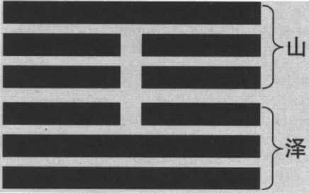
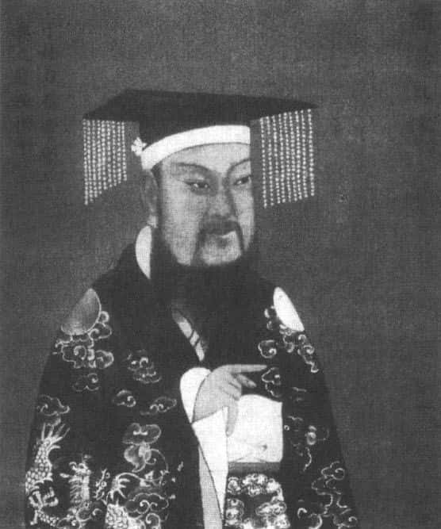
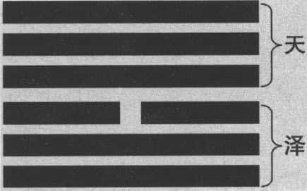
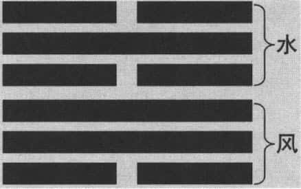
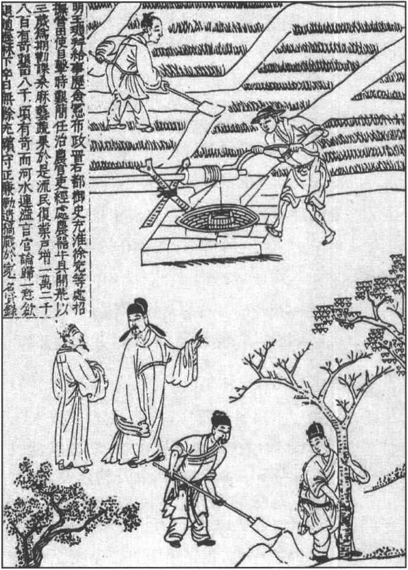
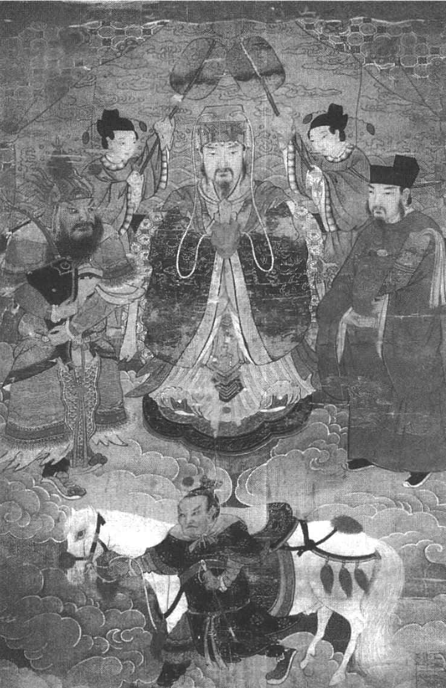
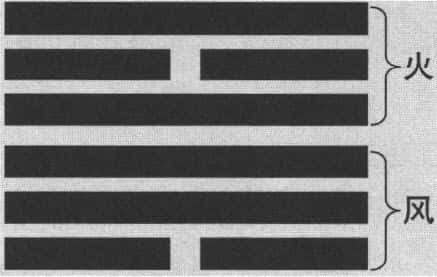
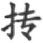

“自求多福”四个字，在《诗经·大雅》就出现过：“永言配命，自求多福。”意思是说，你要设法经常配合自己的使命来自求多福。一个人要自求多福，当然是靠自己了，他首先要知道大的形势，譬如我处在什么位置，别人跟我什么关系，相处的目的是什么？你了解得越多，就越能够掌握到自己的主动性。在西方有一个小故事，说有个小女孩在旅馆门前，很多人拿她开玩笑，让她选择要一块钱还是五毛钱，小女孩每一次都选五毛钱。大家就说，怎么会有这么笨的孩子呢？怎么会选择五毛钱呢？为什么她选少的呢？因为小女孩知道，如果选一块钱，下次没有人找她玩这个游戏了。像这个就是了解自己是什么处境，别人是什么心态。与别人互动的时候，你应该知道用什么样的方式，来达成效果。

我们现在要介绍的几个卦，在《易经》里面是很特别的，有的卦是在卦辞中直接说“元吉”，即上上大吉，有的卦是在第六爻说“元吉”。“元吉”在《易经》里面出现，不过十几次。我特别挑选其中的四卦，有两卦是卦辞说“元吉”，你只要占到这个卦，上上大吉；另外两个卦是走完的时候说“元吉”。平常一个卦走到最后不是“上六”就是“上九”，通常都不太好，一个卦结束的时候，等于是要下台了，要离开这个卦了；因为每一个卦都代表一个世界，上有天，下有地，中间是人，不断在运转之中。

# 损卦：损己利人 

今天介绍自求多福的方法。第一个就要介绍损卦（ ）。损卦卦辞说：**“损。有孚，元吉，无咎，可贞。利有攸往。曷之用？二簋（guǐ）可用享。”** 意即“损卦。有诚信，最为吉祥，没有灾难，可以正固。适宜有所前往。要使用什么？二簋就可以用来献祭”。卦辞中出现了“元吉”，同样在第五爻（六五）也出现了“元吉”：“六五。或益之十朋之龟，弗克违。元吉。”

关于损卦，孔子有个学生，名字正好叫做“损”，就是有名的闵损，即闵子骞。他以孝顺闻名，在孔子学生里面，德行排名第二，仅次于颜渊。闵子骞有什么事迹呢？他从小母亲过世，父亲娶了后母，又生了两个弟弟。有一次冬天的时候，父亲叫他拉车拉不动，就用皮鞭打下去，结果把棉袍打破了，发现棉袍里面是稻草。父亲当然很生气，怎么可以虐待孩子呢？非要把后母休掉不可。闵子骞当时就说，千万不要这么做，“母在一子寒，母去三子单”。一个孩子能说这样的话，真的令人感动。他了解自己的处境，也了解在家庭里面需要父亲、母亲。他宁愿自己吃亏、受委屈。这种行为表面看起来，好像是不太聪明，事实上他是了解到各种情况。难道闵损在小时候就懂得《易经》吗？当然不懂了。但是人在很多时候，只要以真诚的心去做事，在思考自己跟别人关系时，就能够想得透彻。

“损”这个字，老子和孔子都说过，跟它相对的是“益”，像今天做生意都要看“损益表”，哪一方面花了钱，哪一方面赚了钱。孔子当时说的时候，是描述客观的现象。他说，商朝从夏朝接过礼，就进行“损益”，去掉一些，增加一些；周朝把商朝的礼接过去，也是去掉一些，增加一些。可见，礼的改变，也是损益，减少一些，增加一些。像今天的婚丧喜庆，跟古时候不一样，它是慢慢地改变过来的。孔子的“损益”二字，等于是我们平常讲增加、减少而已。老子讲话就更有趣了，老子说：“为学日益，为道日损，损之又损，以至于无为。”你要追求学问，每天增加一点，每天读书准没错。天天读书，马上就发现自己学了不少东西。但是，你要追求“道”，就要每天减少。“道”代表整体，你在整体里面，如果增加许多人类的思想与欲望，你增加得越多，与整体恐怕是越隔阂，距离越远，主要是因为你增加了许多个人的观念，即人类所谓的知识，你反而看不到最后的真实。老子说要追求“道”，要追求真实，你就要减少各种人为的想法、意见、观念、欲望。“损之又损，以至于无为”，减到最后什么都不要去做。他后面加一句“无为而无不为”，什么都没做等于什么都做好了。为什么？如果你想做什么事情，你会去设计，人类的设计一定有其后遗症，即使是好的事情，后面也都要付出代价，就像我们现在发展经济，环境就受到压力。可见，老子提到说“益”跟“损”，跟孔子不完全一样。

我们今天讲“自求多福”，怎么提到一个损卦呢？“损卦”最基本的观念是“损己利人”，与我们平常所说的损人利己正好相反，这才是损卦的用意。为什么损卦是“元吉”，上上大吉呢？因为它讲的是损己利人。且看这个卦象（见下图），从下往上，初九、九二、六三、六四、六五、上九，是“山泽损”，上面是山（艮），底下是泽（兑）。我们到任何地方参观风景，真正好看的山，是它的倒影在沼泽里面，一般来说，比较大的沼泽就是湖，“湖光山色”正是我们所向往的美景。再者，沼泽在底下，对山上的植物、动物，甚至矿物，都有滋润作用。可见，沼泽是帮助山的，沼泽本身是平的，山是高耸的，等于是底下的沼泽帮助上面的山。

损卦卦象 

我们也可以这样说，下卦就是我，上卦则是代表别人。我是损己利人，我本身不要求什么。为什么损己利人呢？这个卦有一个阳爻在上面，等于是卦有卦的变化。这个卦的变化很简单，是因为上面的“上九”是从底下上去的，所以我底下减损一个阳爻，等于给上面一个阳爻，才能够形成一座山。这是它基本的卦象。我们看每一个卦，先看卦象。卦象往往就配合所谓的互动关系所形成的自然现象，由此可以开始联想，为什么“山泽损”，损是好的，因为损己利人。

提到损卦的时候，需要什么条件？第一，要诚信。你要真诚、有信用，愿意去做，不是勉强的，也不是为了别的动机或目的。第二，你要有奉献的心。你有奉献的心，就不用担心自己，因为你是愿意做损己利人的事情。我们要知道，一个人损己利人，自会到处受欢迎。有时候在一个单位里面，有一个人甘于牺牲奉献，任何劳累、辛苦的事情，他都愿意做，不计较。时间长久之后，大家都觉得这个人很好相处、很乐于帮忙。现代社会是一个用服务代替领导的时代，你用服务代替领导，愿意损己利人，当然是普遍受到欢迎了。这也完全符合老子的观点，就是我领导别人，要站在别人后面，不要站在别人面前，不要给别人压力。说话的时候就要谦卑，让别人感觉受到尊重。

我们且看损卦的《大象传》：“山下有泽，损。君子以惩忿窒欲。”损卦有什么样的教训呢？“惩忿窒欲”，意思是说要能够压制自己的愤怒，要谨慎地戒惕自己的欲望。毕竟人的欲望很复杂，我们愤怒的时候力量最大，因为生气、愤怒使人失去理性。人跟人相处有时候觉得不公平、不合理，你自然就觉得生气是有道理的。生气有时是一种情绪，它会带动你的力量。所以一个人愤怒的时候，力量特别大。所以我们修炼的时候，就要从愤怒下手，在生气的时候，要设法压制、消解。有欲望的时候，就要让它窒息，让欲望不再发展。欲望发展出来，一定是倒过来——损人利己。因为欲望总是自我中心，这是很自然的。有人说，为什么要我违背人性自然的一种欲望呢？甚至还说“人不为己，天诛地灭”，这句话太可怕了，其实是没有什么道理的。人不自私，还不是一样活得愉快，活得很好，很受欢迎？

一般来说，跟别人相处，要考虑到别人的需求，别人得到快乐，我们自然也得到快乐。就好像小孩子为什么要孝顺？孩子孝顺父母亲，父母亲开心、快乐。谁第一个受益？孩子自己受益。我孝敬父母亲，父母亲对我更好。当然孝顺也不是说为了对我很有利，而是要设法让父母开心，而父母开心，自然就对我好。像我对朋友讲道义，朋友觉得很满意，他对我更好。人与人之间，有时候你先付出，看起来有一点冒险、吃亏，事实上，恐怕你最后得到的更多，并且你给别人的越多，越觉得自己内在充实。因为你感觉到人与人心意相通，物质只是有形可见、可以计算的东西，可多可少，可有可无；但是心灵感觉到的，是自己知足常乐，对外在事物没有特殊的执著，那是很愉快的事情。

谈到“利己”与“利他”，西方有这么一个简单的故事。有一位教授专门讲“利己”，因为美国很多学者，根据研究之后，觉得人还是为自己着想，哪里有人一天到晚为别人着想？譬如，我在等飞机，心里会想“别人的飞机都来吧，我的飞机不来没关系”吗？那我干吗去机场呢？我永远坐不上飞机了。没有这种人，每一个人等飞机都跟我一样，希望自己的航班飞机准时来，别人的就管不着了。因此，美国有位教授专门对学生说，我们就是替自己考虑、要利己。结果有一天上街的时候，后面跟着一个学生，他没注意到。教授听到旁边的乞丐大声喊：可怜我吧，给我点钱吧。教授真的给了他钱。学生立刻跑上去说，老师，你不是教我们要利己，不要去利他吗？你为什么拿钱给那个乞丐呢？教授说，我还是利己，因为他叫的声音太难听了，我为了让他闭嘴，我才给他钱。换句话说，我为了利己，也可以利他。这两者并不妨碍，与损己利人其实是殊途同归。

这是我们第一个介绍的“损卦”，损己利人，以下来帮助上，等于是“山泽损”的“泽”来帮助“山”。总的来说，损卦是损下益上，下为内，为己，上为外，为人。能做到损己利人，表示“有孚”，然后就“元吉，无咎”，并且“可贞”。以诚信态度与人交往，以己之能来帮助别人，所以“利有攸往”。

# 履卦：一切依礼而行 

第二个我们要介绍的卦，走到最后出现了一个“元吉”，叫做履卦（ ）。“履”字，即依礼而行。但是“履”和“礼”二字要分开，“履”代表鞋子，代表走路。人生就是走路，西方人很喜欢说：人生就是旅行。为什么我们说生命在天地之间，只是一个过客，不是归人？就是因为人生就是旅行。那么该如何走这一生呢？这时就要注意到礼仪、礼节、礼貌，人跟人相处，为什么需要讲“礼”呢？

在古代讲究“礼乐”。讲“礼”，使人与人之间分得很清楚，就像长幼尊卑四个字，你一说“长幼尊卑”，就觉得很严肃，我们小的时候，看到长辈都很紧张，大人说话，小孩子不能插口，吃饭时大人没动筷子，小孩子不能吃。像这都是我们小时候学到的礼。可见，礼的原则是“分”，为什么要分？因为人与人不能够一天到晚打成一片，没有规矩怎么建立人间的秩序呢？“礼”也是规规矩矩的态度，一谈“礼”，首先就要鉴定身份，你什么身份，我什么角色，我们之间应当如何，“应当”两个字就代表规矩，这一定要遵守。孔子教学生颜渊，就说“非礼勿视，非礼勿听，非礼勿言，非礼勿动”，视、听、言、动都要按照“礼”来做。孔子自己也不例外，他说他自己“七十而从心所欲不逾矩”，到了七十岁才能够“从心所欲”，而不会违背规矩。代表什么？他修炼了七十年，终于成功了。他在七十岁以前，“从心所欲”偶尔还会“逾矩”。孔子很诚实，我们是更差了。“从心所欲”必定“逾矩”，一“从心所欲”就违背规矩了。规矩就包括礼仪、规范。人活在世界上，不能没有规范，因为人有自由，有自由而没有规范，那会形成灾难，每一个人都是以私害公、以权谋私，这样一来，社会怎么办？

《商汤王像》：履帝位而不疚 

“乐”则是“和”，“和”就要靠音乐。我们都有这样的经验，大家在一起，上班上得很紧张，忽然听到音乐的话，心情马上开朗些，老板与员工都会觉得很轻松、很愉快，大家变得更有默契，情感也变得比较协调了，这叫做和谐。“礼”重视“分”，“乐”重视“和”，人生就是要有分有和，才能够促成适当的关系，才能保持长期稳定的秩序。

说到履卦，它的卦辞特别提醒我们，叫做“履虎尾”，踩到老虎的尾巴。履卦卦辞说：“履。履虎尾，不咥人，亨。”（意即：履卦。踩在老虎尾巴上，老虎不咬人，通达。）《易经》的卦辞中出现老虎，是很少见的，在“履卦”出现了。履卦卦象是“天泽履”（见下图），这个卦有什么特色呢？六爻只有“六三”是阴爻，另外五个是阳爻。我们还记得，当出现五个同样的爻和另外一个不一样的爻时，这一个就变成主爻，“六三”是阴爻，“六三”变成主爻。“六三”是阴，面对一个卦里面五个阳爻，压力很大，一个阴爻怎么办呢？所以要好好重视礼仪。因为你面对很多人，尤其是面对长辈的时候，就很容易显示一种状态，好像踩在老虎尾巴上，但是老虎不咬人。老虎为什么不咬人？因为你有礼貌。我们年轻的时候，面对长辈、老师、父母亲，就要小心按照礼仪、规范，该怎么说话，该怎么做事，手脚该怎么摆，都照规矩来。老虎不咬人，你踩到尾巴，它也不咬你，为什么？因为你有规矩。在此，特别用老虎咬不咬人来说，强调人与人之间的关系有其紧张与危险。

履卦卦象 

人有时候站在一个高的位置，他要去对付底下的人很容易。我在美国读书的时候也碰到类似的情况。有两位指导教授，在临近毕业时，其中一位教授对我说，他们两个人打电话商量，到底让不让我通过。他跟我讲话的时候，脸上有一股杀气。我看了之后很紧张，因为我在美国读书压力很大，“非我族类，其心必异”，外国人的心里也是想不通的。我的指导教授是从比利时来的，他的情绪智商（就是情商）很差，喜怒哀乐阴晴不定，同学们给他起个绰号，叫做“最不可预测的人”。我曾经亲眼看到，他把一个博士班学生写了三百页的论文丢在地上，这在我们中国那还得了，立刻找报社记者，说教授欺负学生，在美国没那回事。他一个耶鲁大学堂堂的讲座教授，把博士生的三百页论文丢在地上，学生还得低头捡起来，自己回去重写。这说明什么？人在年轻的时候，尤其当学生、晚辈的时候确实是危险，那怎么办呢？自求多福，谨慎地从危险里面经历这个挑战。

可见，“履卦”和我们这一生怎么走路、做人处事，一辈子的发展都有关系。有礼仪、礼节、礼貌，就可以走遍天下。“履卦”走到最后，才出现“元吉”：“上九。视履考祥，其旋元吉。”（意即：上九。审视走过的路，考察吉凶祸福，如此返回最为吉祥。）换句话说，“履”（礼）要坚持一生。你不能说，现在我到中年了，已经是一个基层的主管了，我就不要“履”了。不行，“履”要一辈子做到，尤其到老的时候也是一样。因为老人家需要年轻人来照顾、奉养，这时也要按规矩来。这个规矩对人来说，是一个束缚吗？没错，是一个束缚。如果没有这个束缚，世界变成什么样了？从这一方面，就知道“履卦”有它的用意，“履”就是走路，代表了人的一生。你这一生要怎么走路？按照礼仪。否则，就好像踩在老虎尾巴上。古人常说“伴君如伴虎”，就是说不要以为在帝王身边，权力很大；权力越大，你的危险程度也就越高。因此，你要懂得按规矩办事，只要一切按规矩来，没有人能够怪你。

在《孟子》里面有一段话，说齐景公打猎的时候，叫一个猎场的管理员过来。但是他用的方法不对，平常猎场管理员的官位很低，国君叫他来的时候，就要拿皮帽挥一挥，那个猎场的管理员就会过来。结果齐景公用了旗子一挥，叫那个管理员过来。用旗子一挥，代表叫大夫过来。挥旗子、挥帽子或者用其他代表的信物，是不一样的人过来。挥旗子叫那个小官过来，他当然不敢来，他知道来的话，就会杀头，因为不守规矩。但是国君叫他来而他不来，也要面临杀头的危险。孟子讲这段话时，特别引用孔子称赞这个小官的话：“志士不忘在沟壑，勇士不忘丧其元。”孔子称赞猎场小吏所取的就是，不是他所应该接受的召唤之礼，就不前往。这个人他就是不去，因为他知道横竖都是死，至少坚持原则。由此可见，“履”（礼）真是重要，我们中国称为礼仪之邦是有道理的。

# 井卦：有福同享 

第三个卦叫做“井卦”，古时候有“井田制度”，“井然有序”、“井井有条”等成语就跟“井”有关，因为古代的社会，“改邑不改井”，搬家的时候整个村庄迁移，井不能带走，所以你要迁就它。

井卦有什么特色呢？我们先看卦象，叫做“水风井”（见下图）。“风”代表巽卦，巽卦代表木头，水装在木桶里面，把水从井里面打上来。井卦也是一样，到最后才出现“元吉”。我们且看井卦六爻爻辞：

井卦卦象 
> 初六。井泥不食，旧井无禽。（意即：初六。井中的淤泥不能食用，旧的水井没有禽兽来。） > 九二。井谷射鲋，瓮敝漏。（意即：九二。井中积水向下流注，水罐又破又漏。） > 九三。井渫不食，为我心恻。可用汲，王明，并受其福。（意即：九三。井淘干净而不去食用，使我内心感到悲伤。可以用来汲水，君王英明，大家一起受到福佑。） > 六四。井甃，无咎。（意即：六四。井的内壁砌好了，没有灾难。） > 九五。井冽寒泉，食。（意即：九五。井中有甘洁清凉的泉水，可以食用。） > 上六。井收勿幕，有孚元吉。（上六。井口收拢而不要加盖，有诚信而最为吉祥。） 
我们看看，整个六爻非常生动。一开始就说，旧的井底下都是淤泥，连飞禽走兽都不过来，因此只有把淤泥清除掉，把井壁砌好，把井口收拢。井卦很生动，描述了古人的生活模式。人不能离开水，在古时候，你到任何地方都要找水井，没有水井，就无法生活。从第一爻、第二爻、第三爻一直上去，到第四爻，水井的修复工作大致已经完成了，但是还不够好。要到第五爻时就是井中的水，非常的清凉、可口了。当你占到井卦，就要知道整个的过程，不到最后的结果，你不能说很好。

因为井卦的卦辞就提到：“汔至亦未繘井，羸其瓶，凶。”如果你把水打上来，瓶子在井口碰破的话，就是凶。所以，占到井卦就要小心，这个卦一定要走到底，直到水已经离开井口，你真的饮用了，那才是好事。否则，井水这么样的干净，这么样的清凉，这么样的甜美，但是你没有打上来，还是没用。等于是你做一件事情，做到最后没有结果。

井在古代是一个重要的资产，所以，经常有人在井边打架。在那时，“井”就代表要讲求秩序，我们经常说“往来井井”、“井然有序”，就来自古人使用井的方法。正如到井边打水不排队，每一个人都要往前挤，井口那么小，怎么可能每一个人都如愿以偿呢？一定会出现许多复杂的问题，因此就要照顺序，一个一个来。这个井就是提醒我们，要设法坚持到最后结束的时候，你才能够得到井水的利益。

最后一爻是精彩的部分，当一个井做好之后，“上六”“元吉”。为什么到最后居然是最好的呢？是因为你把井都做好了，“井收勿幕”，上面不要加盖子，大家来分享。不管做任何事，只要想到大家来分享，就没有问题了。一个人成功，基本上都是好事，如果你的成功建立在别人的失败上，那就要小心了，别人不会祝福你的，心里面还会想，你成功我才失败。

君子以劳民相劝 

井卦的用意何在？从井然有序开始，大家守秩序、守规矩，要从水井里面打水上来饮用，一定要离开井口，瓶子都好好的，那才算达成一种好的结果。在最后这一爻，就是说井口不要加盖，就算是你做的水井，你一个人也用不完，并且水井很有意思，它是“无得无丧”，就是没有得也没有失，你不管怎么打水，水井的水始终维持一定高度。它没有得，也没有失，你尽量使用吧，这可以说是古人对于水井的观察。

说到井，确实有它很深刻的含义。古代的井田制，显然跟井有关系。井田制在古代是很重要的制度，一个地方八家人生活，在一块田地画一个“井”，就有九个位置，中间的叫公田，旁边有八家人耕自己的私田。公田大家一起耕种，那时不收税，就把中间那一块田收成的东西归给国家，等于是收九分之一的税。所以，大家就努力先把公家的田耕好，下雨的时候都说，老天下雨先把雨降在公田吧，再把雨降到私田。古时候很多这样的说法，反映出古时候生活的模式，有它很可爱的地方。井田制度最可贵的是什么？根据孟子说的，这八家人“出人相友，守望相助”，出去、回来大家结伴做朋友，因为大家都在同一个井的范围，构成一个小的生活圈，叫做社区生活，“守望相助”，如果生病的话，“疾病相扶持”。我读孟子的书，这三句话读得真感动。古时候的老百姓构成一个生活圈，就能互相帮助。“出入相友，守望相助，疾病相扶持”，谁不生病呢？谁不老呢？但有时不能光靠自己的子女，这是古代社会的一种描述。我们提到井的时候，可以想到井田，想到古代生活的方式。

# 鼎卦：除旧布新　安邦定国 

最后一个要介绍的是鼎卦（ ）。“鼎卦”就很有来头了，古代的诸侯想看看自己有什么能耐，就要尝试是否可以“问鼎中原”。“鼎”本来是古人烧饭的用具，讲得通俗一点，就是烧饭的锅子。后来在一个国家里面，鼎就变成国家的宝物，国家的重器，作为国家的象征。像“三国鼎立”，一个人说话有分量——“一言九鼎”，都是从“鼎”来的。

“鼎”字为什么那么重要呢？因为它有一个功能，能把生的食物煮成熟的食物。古人开始的时候还是吃生的食物，后来发明火了之后，可以把食物烧烤，但是老吃烧烤的食物，身体没法接受，发明了鼎之后，可以把食物煮熟、煮烂，小孩、老人都可以食用了。要不然烧烤的食物，只有年轻人可以享用，所以能够发明鼎，把生的食物变成可口的熟食，大家都可以吃得很健康，生活逐渐得到改善。

鼎是国家的重器，代表国家的象征，也就是说，一个人要建立国家，等于是一个鼎能够立起来。如此一来，鼎的含义就非常深刻了。鼎卦卦辞说：**“鼎。元吉，亨。”** 鼎就是元吉，因为鼎一定走得通。它基本的构想是什么呢？鼎卦《彖辞》说“圣人亨以享上帝，而大亨以养圣贤”，就是说作为一个天子，用鼎来煮好的食物来奉献给上帝，进而大量烹煮食物来养育圣贤。在《易经》里上帝就出现这么一次，就在鼎卦。

为什么忽然有上帝这个概念呢？学者们认为，商朝崇拜的是上帝，周朝崇拜的是天，而事实上“上帝”与“天”的功能、角色是差不多的，都是作为最高的主宰，赏善罚恶，是最后的神明。身为国君，用鼎做好的食物奉献给上帝，煮好食物用来养贤，让天下好的官员、有才干的人物，得到好的工资、好的薪水。他们才会去照顾百姓，光靠统治者一个人，怎么照顾天下人呢？它毕竟需要分层负责，等于是用鼎产生出来各种好东西，让上帝满意，让大臣满意，让这些贤者都满意，他们再来照顾老百姓。可见，提到鼎的时候，是要建立国家、安定社稷。

说到鼎的观念，我们也发现，鼎卦六爻，大致不错。但是我们得强调，第四爻是凶的。鼎卦虽然是元吉，整个卦是上上大吉，但里面还是可能会有凶的爻。也就是说，再怎么好的情况，形势一片大好，还是有某些人处在“凶”的情况。这就提醒我们：任何一个卦再怎么不好，也有好的爻；再怎么好的卦，也有不好的爻。我们为什么在开始要强调“天道无吉凶”呢？就因为每一个爻都是天道之一，即天道循环里面的一个环节，每一个卦都是一个形势，每一个爻则是一个位置。把这些掌握住之后，我们就知道，既然天道没有吉凶，那吉凶从何而来？从欲望而来。所以，人生最主要的路线是修养德行、降低欲望，自然会就逢凶化吉，这是最好的方法。

《黄帝圣像图》：圣人南面而听天下 

鼎卦卦象 

我们介绍这四个卦，到鼎卦的时候，就会特别强调要把自己位置的责任尽好，你在什么位置，在其位就谋其政，把事情做好。就像鼎卦的卦象“火风鼎”（见上图），底下是风（巽），风代表木头。上面是火，底下是木头，木头在下面燃烧，燃烧之后就把食物给煮熟。中间三个阳爻“九二”、“九三”、“九四”，底下是两只脚，为什么两只脚，不是三只脚？因为看过去的时候，只看到前面两只脚，后面那只不见得看得到。所以看这个图像，像不像一个鼎？底下“初六”两只脚，后面还有一只，中间三阳爻代表鼎腹。那“九四”为什么凶呢？（“九四”爻辞：**九四。鼎折足，覆公餗，其形渥，凶。** ）因为“九四”到了上卦，以为自己可以享受了，事实上不是。“九四”为什么不好？因为“九四”与“初六”正应，这两个正应的话，“九四”就想和“初六”配合，一配合，恐怕就翻过去了。所以并非“九四”位置有问题，“四”是偶数，偶数应该是柔的位置，最好是阴爻，偏偏它是阳爻，这样一来，对“九四”很危险，跟底下的“初六”正应的话，很容易翻过去，就是我跟你配合，鼎就失去它的作用了，变成鼎打翻了，打翻之后，谁都吃不到东西了。在鼎卦里面提到“凶”，就是“九四”这个地方不太好。

“六五”是鼎的耳朵，因为鼎很重，我们常说“扛鼎之作”，鼎怎么扛得起来，大力士也做不到，所以鼎就要抬。“六五”为什么是阴爻？正好是耳朵穿过一根铁杠，然后很多人把它抬起来。“上九”就是鼎的盖子，要不然怎么煮东西呢？这样一个鼎的样子就出现了。到“六五”的时候，耳朵可以让鼎抬着走，说明没有问题，在这里就会出现吉祥了**（“六五。鼎黄耳金铉。利贞。”）** ，到“上九”最好**（“上九。鼎玉铉，大吉，无不利。”）** ，因为鼎完成了，大功告成。

# 结论：自求多福 

我们再把自求多福的方法做一个简单的回顾。

第一，损卦，要自求多福，就要损己利人。在任何地方都替别人的需要设想，想办法去让别人得到多一点，让别人开心一点，就是损己利人。像资本主义社会开始的时候，问题很严重，马克思批判资本主义是有他的道理的。他在英国研究的时候，看到英国很多刚刚建立的工厂，都是剥削得不得了。老板一个人发财，工人住的地方像鸽笼一样，工人每天起早赶晚地工作，生病也没人管，收入微薄。现在不一样了，从美国的福特公司开始，股份大家分享。工人工作的时候可以得到工作的成果。像这就是一种损己利人的观念，老板要想得开，让每一个人都得到更多。所以你要有利人的观念，帮助别人的观念。

第二，履卦，要重视礼仪、礼节、礼貌。我们有一句话“礼多人不怪”，你对别人客气，总不会是坏事。但是，客气要注意真诚，不是表演给别人看的。其中始终贯穿着真诚的心。而且，你要是礼貌不够的话，反而有危险，踩到老虎尾巴了。

第三，井卦，井然有序、井井有条。“井”是我们人类社会互动的基础，要照顺序一个接一个，不要着急，要有秩序。同时这个井是“利众”，帮助每一个人，就好像每一个人都可以用水井，建成的时候上面不要加盖，任何人经过都可以去打水喝。水井是开放的，让每一个人分享；等于是你有功劳，不要独占，让大家都可以分享。

最后是鼎卦，就好像要完成你的使命。做一件事，知道这个事情有很大的挑战，你就要从基础慢慢建立起。我再补充一句，就是在鼎的第一步，在“初六”的时候，叫做鼎的脚，鼎的脚本身很脆弱，它是阴爻，站不住。一开始把鼎整个翻过去，里面清干净，到你要煮食物的时候，要先把里面剩下的、旧的东西去掉，去掉之后，再把它立正之后，再开始煮新的食物，它有这样复杂的意象。

由此可见，“鼎”代表一个国家社会的建立，能够安邦定国。损卦要一生都抱着损己利人的心态。履卦是这一生走路，一路到底都没有放弃按照“礼”的方式来行动。井卦是不管做成任何事，都愿意跟别人分享。这四方面都提醒我们，要自求多福是可以的，得按照这四个方面，看你自己的处境来加以理解。以上就是有关自求多福的方法，我们只说了四个卦，可以作为参考。

# 易经小常识 

## 《易经》的研习流派：两派六宗 

《易经》的研习流派众多，但总的来说可归为两派六宗。两派指“象数派”和“义理派”，六宗是指占卜、禨祥、图书、老庄、儒理、史事。六宗中，占卜、禨祥、图书三宗为象数派，老庄、儒理、史事三宗为义理派。

## 象数学派 

象数本是分开的，在易学中被连起来用，“象”指形状，也称“易象”；“数”指树木和计算，也称“易数”。传统观点认，《易经》的象有三个方面的含义：一、八卦、六十四卦及三百八十四爻的形状，即卦象、爻象；二、八卦所象征的事物，如乾为天为父、坤为地为母等；三、卦辞、爻辞所说的具体事物，如乾卦卦辞中的龙、坤卦卦辞中的牝马。这三种含义成为“易象”。

易数也有三种含义：一、一卦各爻属性的数，即“六、七、八、九”四个数，阳爻为奇数，阴爻为偶数，大数为老，小数为少，这四个数又分别称为少阴六、少阳七、老阴八、老阳九；二、爻位顺序的数，依次为初、二、三、四、五、上，即爻的变化规律；三、占筮求卦的方法，即对占卦过程中，根据蓍草数量的计算推导出所需的卦象。

可见，象数学派注重卦象、卦变的研究，以其所理解的道理推断人事吉凶。象数学派代表人物有汉代的孟喜、京房、焦延寿，以及宋代的陈 、邵雍等。

## 义理学派 

顾名思义，义即意义，理即道理。义和理无形无象，不能单独存在，需要通过文字或图形的描述方能显示。象数和义理可看作是同一事物的两面。譬如乾之所以为刚健之义，就是因为日月等天体的运行规律周而复始，从不间断，且威力强大。义理学派注重《易经》的卦名、卦爻辞和卦象中所蕴含的意义和道理。

义理学派的代表人物为创始者王弼，继承其学说的是宋代的胡援、程颐、杨万里、李光。

