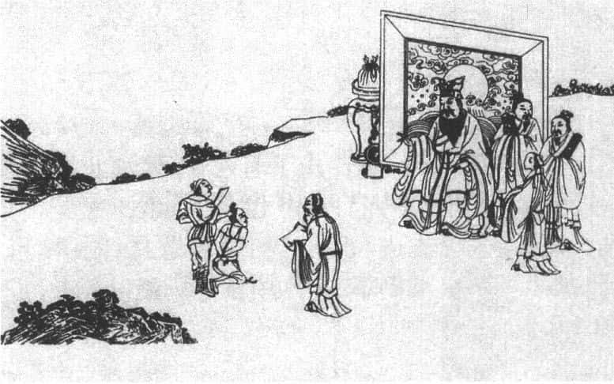
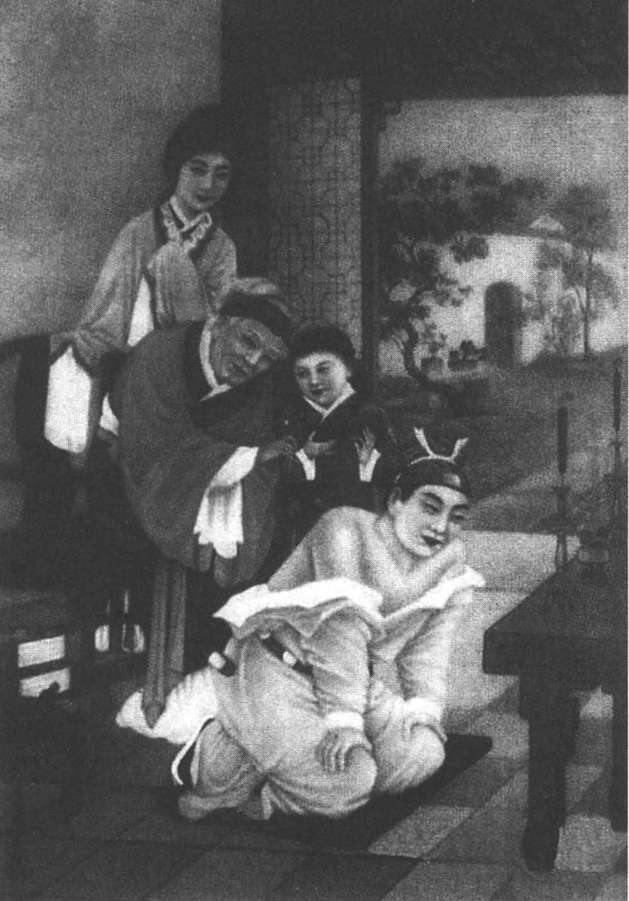

一位日本心理医生认为自己生意不好，便占一卦，得到复卦（ ），底下一个阳爻，上面五个阴爻。一个阳爻从底下往上走，下一步可能带着别的阳爻一起往上走，说明什么？这个人阴气太重，五个阴爻。这位医生就说，我不能太客气了，要有一点阳刚的精神。所以他以后跟病人说话就很肯定。因为一般人看医生，他需要医生的权威。譬如，我现在生病了，看医生。我跟医生说，我是感冒吗？医生说，不一定。那我怎么办？那我到底有什么病呢？不清楚。这样讲的话，找医生干吗？心理医生也一样，你找心理医生说，我这个算不算抑郁症？他说还不能算是，到底算什么呢？很难确定。这样你下次不会找他了。所以病人当然希望医生用肯定的语气说，就这么做，这么做就对了，你不要担心，每天早上起来运动，如何如何。医生讲话要有权威，不然病人怎么办？就跟老师教学生也一样，学生问老师说，老师这样做对吗？老师说不一定，这样做也对，那样做也对。学生请教孔子，孔子从来没有说不一定。孔子从来没有说，明天我们再研究，我回去再查资料。你一查资料，学生都不信赖你了。

这又是说明什么？《易经》确实可以用在很多地方，对这个日本医生来说，他的解释也合理。他一看自己占的卦，先不讲别的什么“一阳复起，大地更新”，只强调自己现在生意不太好，因为阳气不够，阴气太盛，以后变得阳刚一点，别人问问题，斩钉截铁地回答，病人才有信心。这样一试，后来果然改善了。

# 易经与现代人的关系 

《易经》虽然是我们民族古老的智慧，它跟现代人依然有很大的关系，依然具有现代意义。那么《易经》跟现代人的关系是什么呢？

第一，跟现代人的宇宙观有关。说到宇宙观，西方人的宇宙观有一个非常明确的发展路线，近代有机械论的宇宙观。宇宙是一个机器，它内在没有动力，它的动力是由外而来给它的，它本身是拼凑而来的，物质加上动力就构成了整个宇宙的变化，这叫做机械论。机械论的宇宙观是与牛顿物理学配合的。牛顿物理学的解释，也是以此作为根据。西方近代发展机械宇宙观，把宇宙看作一个机器，哪里有问题就对付哪里。到了二十世纪以后，就开始发展机体论的宇宙观。机械跟机体不一样。机体正如“牵一发而动全身”，机械可以拆掉，机体不能乱拆。一块黄金切一半，可以变成两块黄金，但是一只狗切一半，就不能变成两只狗，而是死狗，因为狗是一个有机体。这就是我们中国人的宇宙观，从《易经》就开始了，宇宙是一个整体，全面互相关联。

《易经》六十四卦，彼此可以换来换去，每一卦只有两个爻的变化，即一阳一阴，怎么换都可以连到一起，因为都来自乾、坤。可见，《易经》的观点，就是一种机体的宇宙观。西方的科学到二十世纪以后，从“相对论”到“测不准原理”，再到“量子论”，一路发展下来到现在，西方人才发现宇宙是一个有生命的东西，是一个有机体。对他们来说，很惊讶我们的文化，为什么在那么早就发现了？其实，我们的是素朴的宇宙观，并没有经过西方这种认真的思辨。不过这也说明了，古人的智慧是何其伟大。

伏羲时代就有“观象设卦”，我观察，这叫做直观，直观的时候，我与观察的对象是一个整体。通常我们很难了解整体，因为我们自己在里面，“不识庐山真面目，只缘身在此山中”。但《易经》很早就告诉我们，整个宇宙是一个互动的整体。这种整体观对西方人来说，是值得欣赏的。以前他们会觉得，我们的文化所讲的跟科学脱离，现在才发现，最符合他们新的科学研究结果，就是机体的宇宙观。

第二，计算机或电脑跟我们的《易经》有关。在清朝初年那个阶段，西方有位大学者莱布尼兹（1646～1716），看到传教士用拉丁文翻译的《易经》，他从《易经》的六十四卦体会到二元对数，二进位制。什么叫二元对数呢？用阳爻代表一，阴爻代表零，一和零叫做二元对数，二元对数的思考模式发展出来计算机。当然，计算机演变成电脑，那是后来的发展了。我们不能说把这个电脑的发明也拉到古代的祖先那里去。我们也觉得很惭愧，老是等别人发明完之后，才说原来也是我们最先知道的。但是计算机基本构成的模式和思考的方法，是从《易经》来的，这是有相关性的。当然我们不能说如果莱布尼兹没有读到《易经》的翻译本，他就不可能发明计算机。至少我们可以明白，计算机的原理在《易经》里面早就出现了。

第三，最重要的地方是在于心理分析。一般讲心理学，当代应用最多的是心理分析方面的治疗。心理分析治疗，来自心理学家弗洛伊德。弗洛伊德特别强调潜意识的作用，他的代表作是《梦的解析》。为什么人会做梦，代表他有潜意识，在梦里面所出现的各种故事跟生活脱节了，为什么好好的一个人做梦时候变成一只鸟，像庄子变成蝴蝶呢？梦到底有什么含义呢？的确，从小到大，我们在某个阶段会专门做某些梦，如果你有兴趣的话，把自己这几年之内做的梦，把细节都写下来，就会发现基本的模式和结构或基本的内容和剧情是类似的。那代表什么？代表你小时候曾经发生的某些事，进入潜意识。你不察觉它，它一直存在，做梦的时候，它就出来了。弗洛伊德通过梦的解析，就从这里帮助现代人摆脱生命中出现的各种异化现象，异化就是脱离，跟上天脱离，跟大地脱离，跟人群脱离，跟自我也脱离，到最后一个人孤孤单单，感觉到各种痛苦、烦恼。西方人一有痛苦、烦恼就找心理医生，心理医生就请他躺下来，说说做过的梦，这个学问就从这里开始运作。听人讲梦讲了半天讲得不清不楚，就用催眠法，让你睡着。睡着的时候，你就想到前世，有没有前世我们也很难证明，但知道有些人在催眠法的使用下，他会想到前世。这叫做潜意识的作用。所以，心理分析它能帮你把你过去的许多事情，通过做梦、催眠回想起来，再帮你把它化解。一个人的痛苦是一个结果，前面一定有原因，帮你找出原因，就可以把结果消减，甚至消除。这是一种因果式的思考模式，现在的痛苦是结果，以前一定有一个原因造成这个结果，这是一种模式，叫做单向的思想。在时间的过程里面，因果不断地发展。

心理学家荣格就受到《易经》的启发。荣格这个人很特别，他一方面师从弗洛伊德，另一方面又说他讲得太偏了。因为弗洛伊德的心理学，到最后变成性心理学，压抑的都是性，性需要、性冲动，满脑子都是性幻想。荣格讲究集体潜意识。譬如，我们中国人对于“龙”就有集体潜意识。历代很多人起名叫“梦龙”，因为龙是真命天子，这就是我们的民族集体潜意识。荣格最可贵的是不断地学习，他不仅学习印度教、炼金术，他还学习《易经》。他学《易经》学得非常透彻，每个卦仔细研究，为什么写这个卦辞、爻辞，每一个爻该怎么样去设法变。他提出一个想法，即同时性思考法。何谓同时性呢？你现在心里不舒服，不见得是过去的原因，可能是现在正在发生的事情使你不愉快。通常我们都会忽略这一点，都会说你心里痛苦是不是，找心理医生，回忆过去，这是一种方式。这种方式不够好，因为人很多时候会有同一个时代的问题。这个时代的问题，今天大家都感受到了，但是过去找原因找不到，这叫做同时性的思考模式。

《易经》的特色在什么地方？旁通。一个卦跟别的卦可以通，这说明它是一种全信息思考模式。譬如，“天地人”三才，上有天、下有地、中间有人，这是同时性的，它是一种空间式的思考，不需要靠时间的昨天、今天、明天，而是同时性。人的思考历来都是贯时性的，把过去、未来贯穿在一起。现在当下同时发生的事，即同时性的，很少有人注意。换句话说，同时发生的事也是你要去注意的。荣格提出一个新的词，现在开始受到注意了，即“有意义的偶然”，我们平常讲的偶然是无意义的，我偶然碰到你。但是天下没有偶然的事，所有的偶然都是有意义的，只是当时你没有发现。往往隔了很久之后才想到，当初碰到你，那个偶然不是偶然，天下所有重要的事情，都是偶然出现的；只是当时你没有注意，事后才发现那个偶然不是偶然，是有意义的偶然。

很多人有交朋友的经验，请问地球有六十五亿人，为什么碰到这个朋友？你为什么对他（她）特别有感觉呢？那一刹那正好是身心状态到达的一种情况，对方也一样，一见面就有一种感觉。这种感觉为什么以前不出现，以后也不见得出现呢？这就叫做有意义的偶然。很多时候我们都会忽略这一点，认为很多事情是偶然发生的，不要管它。事实上它正好提醒某些事情可能要发生了。我讲一个真正的故事，什么叫有意义的偶然呢？

在台北有一个“区公所”，“区公所”里面有一个科长，有一次带着十几科员去郊游，他一下车一脚踩到狗屎，我们都会说真是倒霉。他说不一定，这恐怕是有某种暗示。于是一人出一百台币去买彩券，结果中头彩，一人分一百万，这是事实。报道登出来，大家都很羡慕，大家都去找“狗屎”，你真的去找“狗屎”，就不算了，因为你是故意安排的，要是这样的话，满街都中奖了。这就是说无意间出现一件事，你有没有去注意到，你注意到的话，就有一种心电感应，今天会发生什么好事，因为坏事已经出现了，好事应该要出来了。所以很多时候你就要注意到同时发生的事，恐怕是有一种暗示作用。我们不否认人会接受心理暗示。譬如，朋友约打麻将的时候，我就会注意，我走到巷口，一辆全新的计程车来了，我知道今天一定赢，好像是为我准备好的；有时候走到巷口，计程车等好久都没有，来一辆旧车，我就知道今天完了。它会有心理作用，它会暗示你说，今天很顺利。这说明什么？人本来就有各种心理暗示，你为什么要忘记呢？像我们看《易经》的卦象，它也有心理暗示，你说我能不能完全客观呢？天下没有完全客观的事，任何事情发生了，当事人和局外人都牵扯到里面去了，其实你也受到某种影响。平常我们说教育的时候，一定不能让孩子打开电视之后，什么都看，上网之后什么都看，这样对他不好。因为信息进入脑中，不会消失。它会潜伏，在将来产生某种作用。

中国古人从胎教开始，就要看好的东西，听好的话，听好的音乐，这是一种正常的做法，说明他接受的信息是很全面的。这是心理学上，目前《易经》应用最广。西方现在发展一种新的学问，叫做哲学治疗。一般人只知道心理治疗，不知道什么叫哲学治疗。哲学治疗简单说起来，跟心理治疗不太一样，就是分析一些概念，我们学哲学很喜欢分析概念。譬如你看到一幅画，你说这幅画真美，学哲学的人就要问，你所谓的美是什么意思？如果你没有想清楚什么是美，美只是你个人的感觉，别人为什么要接受呢？天下没有任何画所有人都说是美的。一幅画卖很高的价钱，但是买画的人看得懂吗？为什么值那么多钱呢？不懂。我有时候到美术馆看到画展，我在标价越高的画面前，站得越久，我站久一点，才不会被人家嘲笑。外行人只能这样做了。但是什么是美？真的没有人答得出来。哲学的意义就在这里，我们就要去分辨概念。如果你找读哲学的帮你做心理治疗，我今天心情不好，因为别人对我不公平。很好，请你坐下来，第一我们先讨论，什么叫做公平？讨论完之后，保证你不觉得自己受到不公平的待遇。因为你根本不知道什么叫不公平。耶稣有没有受到公平的待遇？才活了三十三岁就被钉在十字架上死了，太委屈了。苏格拉底他活了七十岁，被人家冤枉、诬告，也判了死刑。公平吗？不公平。他们这些人都不公平，你求什么公平？哪里有人受到公平的待遇？现在问每一个人，你觉得老板对你公平吗？当然不公平，工资不够多，升职升得慢。你分析之后就发现，原来别人对我不公平，是我自己的误会。我根本不知道什么叫公平，我怎么知道别人对我不公平呢？这是哲学的方法。但是光这样不够，以后没有人敢跟你讲话了。最后你还是要有一些积极的建设。

你说不公平，那我告诉你《易经》的道理。《易经》告诉我们，所有的东西都是不断在变化的。你说你现在很委屈，将来说不定就发展了。我们常说，蹲得越低，跳得越高。你直接站立，怎么跳呢？跟僵尸一样跳是不可能的。你要常常想到，生命是一屈一伸，是相互配合的，有光明就有黑暗，有白天就有晚上，有春天就有冬天，这些都是配合起来的。你如果现在心情不好，没关系，将来会变得不一样。你如果现在很得意，《易经》会提醒你，不要太得意，将来可能会有问题。人最难了解的往往是自己的处境，很难跳出去看自己，说话很主观，认为自己就是世界的中心，许多事情发生的时候，不能化解，常常觉得：别人为什么会对我这样子呢？我一片好心别人不理解。为什么有这种想法呢？因为你没有从别人的角度来看你自己，所以我们要练习换位思考。现在很多人都强调换位思考，是有道理的。

我们讲到有关《易经》的时候，对于现代人来说，越来越重要。《易经》这门学问，帮助我们了解自然界，帮助我们了解了人群社会，帮助我们了解自己。透过《易经》，只要通过第一关，了解基本的八卦，再合成六十四个六爻卦；就慢慢知道，人生有六十四种处境，每一个卦有六爻，变成三百八十四爻，代表三百八十四种位置。六十四个大的形势，三百八十四个位置，你总能从里面找到一个地方吧？但是找地方又要记得，它不断在变化，“易”就是变化。随时知道居安思危，任何状态表面上是安静的，其实它照样充满动力，随时都有新的状况出现，最怕的是不知道将来怎么样。人最可怕的是无知，以为将来还是很好，那太天真了；以为将来都不好，那太悲观了。看《易经》就知道，它的变化规则大概是什么，这个卦后面接什么卦，都有一定的道理存在。在这里对于《易经》与现代人的关系，我大概做个这样的说明。

# 古人如何看待《易经》 

以孔子来说，孔子在五十岁左右，就专心研究《易经》。他是五十岁才读《易经》这本书的吗？像孔子这么用功的人，小时候不可能没读过《易经》，他年轻的时候几乎什么书都读。当时的书不多，最主要的是五本，《诗》、《书》、《礼》、《乐》、《易》，五本肯定都读了。但是有的书你当时可以读懂，而有的书，如果你没有累积相当的经验和人生的体会，读了也没用，只看字面而已。读《易经》，一般来说，五十左右的生活经验丰富，应该有的经历都有了，等于是一卦六爻到第五爻了，大概知道整体的情况了，再老了再读就来不及了，已经到第六爻，读了也没什么机会了，准备出局了。

孔子五十左右研究《易经》，他需要的是减少过失。《易经》为什么可以让他减少过失？我们常提到《易经》的自强不息、厚德载物，要让自己“惩忿窒欲”，让各种负面的特性、欲望、情绪慢慢化解，亦即增进自己的德行，替别人设想，建构一个比较理想的社会。在这里孔子得到一些启发，在《孟子》里面没有直接说到《易经》，但孟子很强调一个字，即“时”，做任何事都要看时机。他还特别说，孔子是圣人里面最重视时机的，他要学就学孔子，因为做任何事都有时机。时机不对，事倍功半；时机对的话，顺水推舟，那简直是太愉快了。这是对于儒家来说。

孔子诛杀少正卯：君子以果行育德 

另外一个是荀子，他说：“善为易者不占。”真正懂得《易经》的人，不愿意占卦。为什么不愿意占卦呢？因为《易经》的道理合乎理性的思维。理性的思维，如果掌握清楚，何必去占卦呢？因为占卦代表你实在面临很难解决的事情，确实有困惑，你才去占卦。

但是我们还是要说，人生确实有困惑，很多时候你借助于《易经》，一定要记得两方面的作用：一方面是它的义理。你学的时候就知道做人处事的道理，我们提到哪些卦是有困境，你应该怎样面对、增益智慧。哪些卦代表吉祥，它为什么吉祥？你要掌握住它的原理，设法去实践，自然就会达到那种效果。这是义理方面。另一方面是占卦。古代学《易经》至少有四方面，你如果重视言语，就会推崇它的言辞。《易经》里面很多成语，如果从《易经》得到很多启发，使用成语你会觉得非常文雅，话说出来言简意赅，说话很简单，意思又很完整、很完备。这是第一种，重视言语。第二种重视行动，有些人重视行动，就会推崇易经的变化，变化无常。但是再怎么变，都不能离开你的抉择，你本身的态度。第三种是重视制作器物。譬如说要盖房子，房子怎么盖。你要盖其他东西，要怎么盖，从《易经》的图像里面，都会得到一定的启发。这是第三种，要重视它的象。最后一种是注意到卜筮的人，就是占卜，这种人就要注意到“占验”之词，重视占卦。这四种人就从《易经》里面可以得到不同的材料，重视它不同的方面。

古代读书人，按照《易经》的说法，原则很简单，平常在家里翻翻《易经》，看看它的卦象、卦辞和爻辞。平常没事做，如何让自己感觉到每天都有进步呢？《易经》是一个可以参考的东西，它里面充满象征和符号，好像打哑谜一样，它写一句话，你就要问这句话代表什么意思？像我们提过，“履卦”踩在老虎尾巴上，这代表什么意思？你就可以有不同的想象。这是说明在平常的生活中研究每一个卦象、卦辞、爻辞，行动的时候就要注意到变化和它的占验之词。“占验”就是占卦的验证，是吉还是凶？中间还有什么？无咎，还有更好的“大吉”、“元吉”，“无咎”底下还有“悔”，还有“吝”，还有“厉”，代表危险，这些占验说得准不准。古人占卦，不是一次就到位的，不是学会之后，一占就准，不可能的。

那么怎么解卦呢？我现在就讲一个从孔子就开始使用的方法，用五十根筹策，古时候用蓍草，筹策一般是竹片做的。占卦的方法我们可以参考《易经·系辞传》，原文如下：
> 大衍之数五十，其用四十有九。分而为二以象两，挂一以象三，揲之以四以象四时，归奇于扐以象闰；五岁再闰，故再扐而后挂。乾之策二百一十有六，坤之策百四十有四，凡三百六十，当期之日。二篇之策，万有一千五百二十，当万物之数也。是故四营而成易，十有八变而成卦。 > （白话：在进行大型演算时，准备五十根筹策，真正使用的是四十九根。将这四十九根分为两组，象征天地两仪；由任何一组中抽出一根挂在左手小指间，象征天地人三才；再以四为单位去计算筹策，象征一年的四季；把剩下的零数夹在左手中三指间，象征闰月；每五年有两次闰月，所以要把另一组筹策依四计算所剩下的零数，也夹在指缝挂起来。乾卦的策数是二百一十六，坤卦的策数是一百四十四，总数为三百六十，相当于一年的天数。《易经》上下篇六十四卦的策数有一万一千五百二十，相当于万物的数目。所以，要经过四次经营才能形成《易经》的一爻，经过十八次变化才能完成一卦。） 
占卦出来之后，怎么解卦呢？解卦有很多的方法，宋朝的朱熹就整理了一套解卦的原则，可以参考（见本章后附录）。解卦的时候就会发现有些爻是动爻，有时候称作变爻，就会变成新的卦。现在的情况是本卦，新的卦叫做之卦，代表你下一步要往哪里去。这样一来，就变成是你占一个事情，后面有变化。否则，光是占一卦没有用，现在的情况知道了，怎么知道下一步呢？我们更关心的是下一步往哪里发展。因为很多选择，后面的发展有各种可能性。真正正确的占卦方法是有本卦、之卦，通过动爻来决定应验在什么地方，这需要长期经验的累积。

# 学习《易经》的三个重要收获 

学《易经》可以得到多重启发，我把它归纳为三点，《易经》学会之后，有三个重要的收获。

第一，**昭示文化的源头。** 《易经》告诉我们，我们的文化根源何在？很多人问，《易经》是儒家的书，还是道家的书？事实上《易经》本身的材料很少，远在儒、道之前就有了。所以你问的时候，是包括《易传》在内的，那当然是儒家的书，尤其我提到《大象传》，里面大都提到君子如何如何，儒家才会强调君子要修德。而我们提到损卦的时候，道家好像也主张减法（损），不主张加法（益）。减法就是减少一点物质欲望，减少一点渴慕，减少各方面的娱乐，通常烦恼来自东西太多。譬如，我现在很穷，只有一个选择——生存下去，我就没有别的念头了；我现在有钱了，我有十个选择，该选哪一个呢？选任何一个就要放弃九个，压力就很大了。在《老子》里面就会说“损”，要设法减少。从这里面可以知道，《易经》昭示我们文化的源头。儒家和道家都从里面得到很多的启发，尤其是儒家，孔子本身教很多学生《易经》，一代一代传下来，到司马迁的父亲司马谈，都是儒家研究《易经》的代表人物。这些人集体的合作成果，构成了《易传》。《易传》是用来解释《易经》的基本材料。所以，我们如果想了解中国文化的源头，一定要知道《易经》——《十三经》之首——到底在说什么。

第二，**指引人生的方向。** 什么时候应该趋吉避凶，什么时候收敛、要尽量谦卑、损己利人；什么时候可以发展建立国家、建立自己的事业；什么时候、什么时机、该如何做，这叫做指引人生的走向。人生的走向没有标准的方式，别人这样走可以成功，你这样走却不见得成功。因为条件不同或者时机不同，很多人常说，如果在三十年前努力奋斗，做不到现在的成功，因为还没有改革开放。现在努力奋斗，钱就很容易赚到，因为整个社会条件不一样。过去努力奋斗没有什么效果，现在效果很大，但是不可能一直繁荣下去，将来一定是慢慢平衡下来，让你从注意外在的效果，转向一种自我的修炼。这是必然的趋势。否则你一直往外发展，欲望的深渊是没有止境的。西方人把欲望比作为滚雪球，开始只有一小块，滚到山脚下的时候变成一大片，欲望就是如此，带着你滚，不会停下来。所以，你向外发展到，最后还是要回到自己的内心，回到自己的生命里面。我曾经特别提到乾卦，开始的时候“潜龙勿用”、“见龙在田”，“九三”、“九四”努力奋斗、进德修业，到“九五”才能够“飞龙在天”，这叫做人生的走向。你不要着急，你说我年纪不小了，那怎么办呢？人家诸葛亮还当卧龙呢？等到出来的时候就一飞冲天。到最后你就要知道，到该退休的时候就要潇洒一点，人生潇洒走一回。退休的时候，知道“亢龙有悔”，“悔”不是坏事，“悔”知道懊恼，你不要等到最后才懊恼，知道将来退休会有懊恼，现在就好好地广结善缘，跟别人好好相处，对年轻人、对属下多照顾一点、照顾多一点，到最后下台的时候，别人还是会感谢你。学到这个之后，人生该怎么安排就很清楚了。

第三，**启发个人的安顿。** 个人的安顿有两方面，一方面是“乐天知命”，“天”就是各方面的条件，不能改变的都属于“天”，只好接受它，很多时候我们要从忍受到接受再到享受。一个人的享受是跟别人不一样，只有物质享受是享受吗？不一定，还有心理上的享受，但是它需要先下工夫。譬如读书，有人读书很快乐，有人读书很痛苦；读书痛苦的是在忍受，而读书快乐的是在享受。那怎样才是享受呢？中间有一个过程，就是接受。如何才能接受？通过理解。一个小孩子读书想要考大学，高考的时候压力很大，读书不快乐。他不懂得为什么要读书，等到他大学毕业之后，如果他还愿意读书，代表他知道读书有味道，可以不断增加观念，知识就是成长，知识就是力量。到后来再进一步，年纪更大了，读书更是一种快乐，就是享受，乐在其中。这就是说，“乐天知命”取决于你个人该如何去做。

《岳母刺字》：君子以致命遂志 

另一方面是具体的情况。譬如，我最近选择要不要出国读书或者我要不要投资一笔生意，或者是要不要跟什么人做朋友，甚至结婚。这些都是重大的事情，没有任何事情是“有百利而无一弊”的，所有的选择都是利弊并存。假设你每一个选择都是好，没有坏，那你何必选呢？一定是这个选择有一点好，有一点不好，此时便“陷入困惑”，不知道该怎么办。这个时候要设法学《易经》的另外一招，就是占卦，帮助解决现在面临的困境。

可见，我们学《易经》之后，有一个人生的大原则要掌握，即乐天知命。另一方面是占卦，这一方面是就具体的事情做选择，关系重大，是理性不能够立刻找到答案的。那就设法用《易经》的占卦，《易经》的占卦绝对不是迷信，而是相信人的生命里面，有它不可知的侧面。用四个字来说，《易经》占卦是“人谋”、“鬼谋”。人在谋划、设计，并且“鬼”也在谋划。鬼代表我们的祖先，他们在不同的世界，但是他们的感悟能力远超过我们，因为他们没有身体。身体就是一个限制，有身体的限制，就会出现各种欲望冲动和要求，使人的思考局限在某一个范围里，看不清楚、不透彻，也看不远。而“鬼神”或者是灵的世界，它不受限制。

# 领导者必须具备的三个条件 

我们学《易经》是讲老祖先的智慧，一方面是我在算，就是“人谋”，另一方面是不可掌握的地方，叫做“鬼谋”。任何隐秘的事情，《易经》都可以算得出来，在《易经·系辞传》说得很明白：**“其出入以度，外内使知惧，又明于忧患与故，无有师保，如临父母。初率其辞而揆其方，既有典常。”** 即使没有老师与保护者，也会好像面临父母在指导一样。一个人为什么可以担任一个单位、一个公司、一个国家的领导呢？因为他有这种对《易经》的认识，即古代所谓的帝王之学。《易经》里提到圣人，圣人就是伏羲氏、神农氏，一路下来作为领导的这些人。他们需要三个条件。

**第一个需要德行。** 一个人修德行善，与其他人才会心意相通。因为修德的人，就不会以自我为中心，不会自私自利，会替别人考虑。这样做的话，别人当然跟他有默契，自然而然人缘就很好。这是第一个德行，德行可以使天下人心意相通。

**第二个是能力。** 作为古代圣人要有能力，譬如伏羲，**“仰则观象于天，俯则观法于地，观鸟兽之文与地之宜”。** （意思是：抬头就观看天体的现象，低头就考察大地的规则，检视鸟兽的花纹与地理的特性。）观察之后有了心得，制作出八八六十四卦，再来发展各种生活上所需要的器物。如果能力不够，光有德行，而不能发展经济，生活、生存怎么办呢？可见作为帝王还要发展经济等具体生活方面的需求，就是能力。

**第三个是智慧。** 人生不只是靠德行和能力，没有智慧，碰到人际之间复杂的问题，或各种困惑，不知该怎么办。作为领袖人物，需要有智慧，智慧就从《易经》占卦得到启发，解决各种困惑。人生的困惑，最大的问题是它不能重来。人生不能重来，借西方一位诗人所写的诗来说：“我要穿过一片树林，树林很多人都走过了。有的地方走出一条路。”说明什么？很多人都走这条路。如果我觉得这条路不太好，我想走另外一条路，但是那条路很少人走，很阴暗。现在很多年轻的朋友，面对人生的选择，一条路是很多人在走的，一条路是很少人走的，有些人说，我选择很多人走的路。心里还在想，如果这条路我不喜欢，将来再回头选另外一条很少人走的路。但是，路前还有路，一直走下去，你一旦走出第一步，很难再回头。很多人到中年的时候，才知道人生不能重来，所以你不要去幻想。与其幻想，不如去了解像《易经》这样伟大深刻的智慧，了解之后，你就明白，不管过去怎么样，现在要把握住，让将来自己觉得满意。

# 结　论 

人生是要自己负责的，我们不管谈任何人生哲学，儒家、道家，以及它们的根源——《易经》，都是一样的，你还是要自己负责，也不要幻想有很多奇怪的力量来支持你。“天助自助者”，你能够自己帮助自己，所有的万物都会来帮助你。

# 易经小常识 

## 《易经》占卦方法——筹策运算说明 

原文：《易经·系辞上·第十章》

“大衍之数五十，其用四十有九。分而为二以象两，挂一以象三，揲之以四以象四时，归奇于扐以象闰；五岁再闰，故再扐而后挂。乾之策二百一十有六，坤之策百四十有四，凡三百六十，当期之日。二篇之策，万有一千五百二十，当万物之数也。是故四营而成易，十有八变而成卦。”

——（白话及解读参考拙作《解读易经》，上海三联版第435页）

说明：

筮者准备五十根筹策（古代用蓍草或竹片），取出一根，放在一边，备而不用，是为四十有九。（大衍之数五十，其用四十有九）

第一次运算：

1．任一分四十九根为两组，甲与乙。（分而为二以象两）

2．从甲组中取出一根，放置于二指之间。（挂一以象三）

3．甲组以四除之。（揲之以四以象四时）

4．甲组所余之数，为一或二或三或四，将此余数放置于二指之间。（归奇于扐以象闰）

5．乙组以四除之。（再揲之以四以象四时）

6．重复步骤4的做法。

7．将二指之间所得之根数置于一旁。所余者为四十四根或四十根。

第二次运算：

1．将所余之四十四根或四十根，任意分为甲乙两组。

2．重复第一次运算中的步骤2至7。此时余数应为四十或三十六或三十二。

第三次运算：

1．为第二次运算之重复

2．余数应为三十六或三十二或二十八或二十四。

经过以上三次运算（三变），才可决定一爻之阴或阳。亦即最后余数以四除之，则为九或八或七或六。九为老阳，七为少阳；六为老阴，八为少阴（九、六为可变之爻；七、八为不变之爻）。六爻共需十八次运算，是为“十有八变而成卦”。

注：老阳为夏季，老阴为冬季；少阳为春季，少阴为秋季。

# 《易经》解卦方法参考 

一、请遵守“三不占”原则：不义不占、不疑不占、不诚不占。

二、解卦步骤：

1．针对所占问之事，本卦代表当前的处境，之卦（之，往也）代表未来的趋势。要配合心中的疑惑，详细思考两卦的卦辞含义，以求得到启发。这是最重要的一步。

2．六爻皆不变者，只有本卦而无之卦，则参考本卦卦辞。

3．一爻变者，则参考本卦变爻的爻辞。

4．二爻变者，则参考本卦二个变爻的爻辞，但以上爻为主。

5．三爻变者，则参考本卦及之卦的卦辞，但以本爻为主。

6．四爻变者，则参考之卦中二不变之爻的爻辞，但以下爻为主。

7．五爻变者，则参考之卦中不变之爻的爻辞。

8．六爻变者，则参考乾坤二卦的用（九、六）辞，并参考之卦卦辞。

注：1．以上2～8，主要参考朱熹《易经启蒙》之说，但不可忽略解卦所需要的生活经验以及个人主观的动态力量。

2．对同一问题，至少隔三月再占，请记住荀子所云：“善为易者不占。”懂《易经》的人要努力经由理性思维与德行修养而主导自己的命运。

