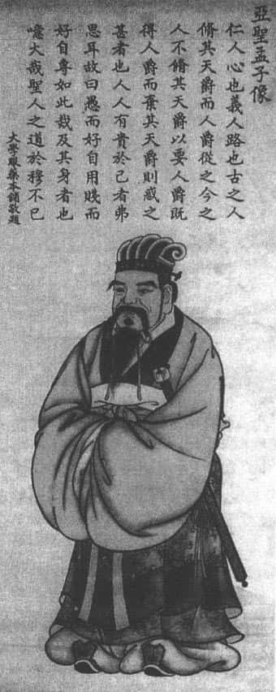
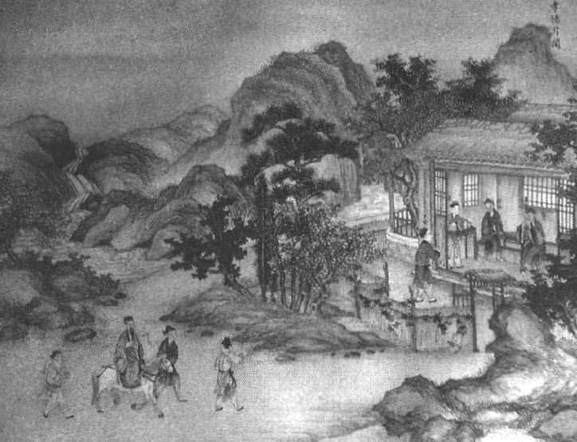
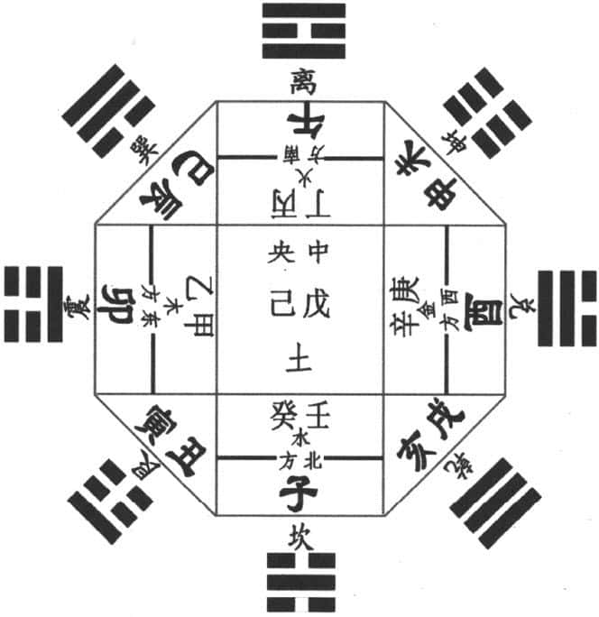

**观众：** 傅教授，刚才听了你的演讲非常受教育，我的问题是：什么是我们中国文化的核心？中国文化和西方文化有什么区别？还有第三个问题，现在很多人把人生的价值都搞乱了，不是房多、车多，就是钱多。什么是人生的根本价值？人为什么要活着？

**傅佩荣：** 这是“大哉问”了。第一，我们说中国文化的核心是什么。我用我的老师方东美先生的话来说，很简单的三句话：第一，以生命为中心的宇宙观。我们看整个宇宙是充满生命的，中国人看宇宙从来不把它看做是死的，连山都是有生命的，像诗句“我见青山多妩媚，料青山见我应如是”，我与山就有生命的互动，并且宇宙本来就充满生命，怎么可能有任何东西是真正死的物质呢？这是第一点，以生命为核心的宇宙观。第二，以价值为中心的人生观。人活在世上不是光活着，活得越老越好，而是你活着就要实现价值。一般来说，价值是“真善美”，我的理智追求“真”，我的情感追求“美”，我的意志追求“善”，这叫做价值。换句话说，以价值为中心的人生观，要求我们年纪越大，德行也要越高。就是我们的价值不断地实现。第三，要向着超越界而开放。你不能够只是到死为止，人总是会死的，到死为止的话，不用谈人生，因为死了之后，大家都是一样。因此要向超越界开放，儒家的“天”、道家的“道”就是超越界。为什么提“超越界”呢？因为我们的经验、我们的理性所能掌握的这一切，本身都是有限的，充满变化的，不能解释它为什么存在，这就需要有一个超越界。“超越界”就因为它不是你可以掌握的，但是它又必须存在。它如果不存在，我们所掌握的经验的世界和理性的世界，本身不能被理解。超越界可以说是非存在不可，西方的上帝也是这样来的。这是讲中国文化的特色，三句话，这是我的老师方东美先生的启发。

中国文化跟西方文化有什么差别？这是个很大的问题了。西方文化也是多样的，我们最多只能说，中国这种文化跟西方主体的基督教所造成的文化有什么差别？这可以对照，我在《心灵导师》一书中谈了不少，可以参考。

到底人生有什么样的价值？首先，人生的价值在内不在外。如果讲在外的话，“名利权位”就决定了。我们的价值怎么比得上有钱人呢？怎么比得上有名的人呢？怎么比得上有地位有权力的人呢？那我们的价值就低了吗？不见得，因为他得到名利权位，不见得是他努力的结果。有时候他生下来就是好命，有时候他得到别人提拔，有时候是他运气好，很难说的。那么，怎么在内呢？儒家思想认为人的价值在德行修养上面。职业没有贵贱，人格上有高低。在社会上每一个人不同的行业，行业没有贵贱，我当教授，行业比较高贵吗？另外一个人扫地、收垃圾，他的职业比较低贱吗？不一定。人格才有高低的分别，不管任何行业，只要是正当行业，都是一样的立足点。

其次，人生的价值在于发展德行。你就要看《易经》里面怎么说。像谦卦，六爻“非吉则利”。你不要以为乾卦是第一卦，中间“九三”、“九四”，“无咎”，没有灾难就不错了。但是谦卦就不一样，你只要做到谦虚，六爻不是吉就是利，那是唯一最好的卦。那说明什么？你要从“谦”着手，“谦”是修炼，不是说现在开始我很谦虚，谦虚还要条件，你才华不够，能力不够，谦虚什么，你本来就是如此。所以，人生的价值何在，我们首先要掌握到价值在内不在外，并且人人平等的立足点，叫做德行的修养。

第三，人生的价值在于无我。德行修养是从有我到无我，从身到心到灵的层面，到灵就是到无我的境界。人有身、心、灵。身体互相排斥，心智可以沟通，灵性打成一片。譬如，你现在坐这个座位，别人不能坐了；公司里面你当了总经理，别人不能当了；这个钱你赚了，别人不能赚了，都是互相排斥的。只要跟身体有关的、具体有形的，各种有利条件都互相排斥。所以，人类社会充满压力互相竞争，都很辛苦。其次，心智可以沟通。大家来到这里，一起听我来讲《易经》，听了之后，大家都会有默契。一说乾卦就知道什么东西，一说“谦”就是好，大家都可以沟通。最后是什么？灵性。到灵的层面打成一片。一个人的修养到最后到“无我”了，我看到每一个人都跟我的手足同胞一样，我见到其他生物，也都跟我的生命有关系。整个宇宙是个整体，庄子说“天地与我并生”，天地与我一起同在，“万物与我为一”，万物跟我合成一个整体。庄子不是说大话吓人的，他有他的根据，就是我们这里所说的，一个人到灵性的层面，根本就没有自我中心的想法，看到每一个人都非常的自在，非常的亲切，好像人生本来就是如此，见面就是有缘，大家在一起就客客气气的，没有那种自我要胜过别人的欲望，别人也感觉不到他有什么压力。

人生的价值就在什么地方？我只能够就我想到的跟你分享这几点：在内不在外，德行作为大家共同努力的目标，最后达到无私，达到人类最高的一个境界。

**观众：** 我想提一个很简单很直接的问题。您刚才说的孔子、庄子、孟子，他们都达到了这种“灵”的境界，他们可以说与天地共存，只要有天有地就有他们。但是我们呢？我感觉我是一个平凡的人，凭着我们的修为，想达到那种“灵”是不可能的。也不能说我太没自信，我感觉是不太可能的。作为我们这百分之九十八的人，怎么来生活？我们生活在现实当中，有的时候看别人去占小便宜，觉得这种行为不道德，可是大家又都这样，那我们该怎么做呢？去追求孔子吧，又觉得追求不上。

**傅佩荣：** 你说得非常具体，也是很现实的问题。我们可以这样想，通常我们讲到一个人的使命感的时候，不能脱离你的生活空间、时间。在这个时候该怎么办呢？像我们今天在这里在一起，我教书教了一辈子，但是对我来说，今天这个场面，我认真地讲，每一句话都是我研究的心得，没有任何话是我自己不相信的，把今天这件事情做好，我就是一个好老师；大家今天在这里听，非常安静，一两个小时，你就是最好的听者，你做到了你该做的事。这就是说，对于每一件小事情你都真诚面对，跟别人互动的时候互相尊重，这样就够了。如果到超市里面，别人怎么样，你也怎么样。如果说大家都这样做，法律准许，没有什么反对，没有什么规矩，也没有人会怪你。每个人都有贪小便宜心理，只要不损害别人都无所谓的。问题在什么地方？你还是要跟别人有适当的关系。譬如，你的亲戚朋友、同事、同学这些人，只要有关系的时候，就有利害关系的摩擦，这时你就要修炼了。人生就在修炼里面才能成长。

有时候，千万不要羡慕伟大的人。像孟子最推崇谁？舜。你知道舜怎么生活的？舜的父亲娶了后母，生了一个弟弟象，这弟弟坏得不得了，“日以杀舜为事”，每天都以杀舜作为工作目标。这是什么家庭？一家四个人，三个人联手要杀一个人，怎么杀都杀不死。舜因此被整变成圣人。想想看，如果是舜觉得自己倒霉：为什么在这种问题家庭呢？你对我不仁，休怪我对你不义。舜不是这样做的，他正好修炼德行。所以，我们在平凡的生活里面，平凡是快乐，也是福气。问题是你有没有忧患意识。平常跟别人来往的小地方都注意，从小地方注意起到最后注意起心动念，从根本上让自己化解自私的念头，看到别人占小便宜也没感觉了，自己稍微牺牲一点，自己觉得很快乐。老子说得好：“既以与人己愈多。”就是你给别人多，你自己变得越多。如果是钱的话，我给别人就没有了；但是精神上的力量，我替别人设想越多，越关心别人，我的爱心绵绵不绝。这就是所谓的“灵”，这就是精神方面的。我为别人想得越多，代表我内在的能力越强。通常一个伟大的人，他替别人服务的时候，他感觉很快乐。因为越牺牲奉献，内在越充足。相反，一个人越是得到许多财物，譬如外在的名声、权力的时候，他得到的越多，其实他剩下的越少。他根本就没有内在的自我，都靠外在来充实自我，其实是很可怜的。一个人如果说什么都没有，他反而拥有天下。像印度的甘地，死的时候只剩下一件换洗的衣服和一副眼镜，但是谁敢说甘地贫穷？特雷莎修女也在印度修行，她是阿尔巴尼亚人，到印度去当修女，帮助很多人，死了之后，只有一个水桶和一件换洗的衣服。那么穷困，但是天下有谁比他们富足？你就知道生命的特色了。多少王公贵族，包括英国皇室那些人，钱多得不得了，他快乐吗？他事实上非常穷困的，穷得只剩下钱了。

《亚圣孟子像》：积小以高大 

我们一般老百姓，千万不要以为说，他们成为圣人，有伟大的成就，我们没希望。错了，每一个人都是一样的希望，只要你平常多去了解儒家和道家的道理，提醒自己在每件事情中，只要跟别人相互来往冲突的时候，尽量自我约束。就像“损卦”，损己利人，你只要损己利人就是好事。我们大家一起为这个互相勉励，好不好？

**观众：** 您好，傅教授！您是中国人，又接受国外比较规范的科学教育。我想让您从科学角度，看一下《易经》，能不能证实或者是证伪？它是否具有普世性？

**傅佩荣：** 好的。这个问题是非常根本的问题。《易经》是不是有科学性，能不能证伪？证伪就是科学里面做研究的时候，提出一个假设，能不能经过各种检验、证伪，说它不是假的。它如果是假的，就经不过这个检验。《易经》基本上是人类思维的一个精彩表现，一方面它先观察万物的现象，画出了基本的卦，观象设卦；另一方面，设卦之后，又从卦里面得到生活上面很多启发，是一个循环互动的过程，心与物互相交际来往的结果。因此，它并不是我们今天所谓的科学研究，面对一个有形可见的清楚的对象、某些物质（包括天文、地理各方面）加以研究。所以，你不能用证伪，证明它是真还是假，不能用科学上的一种方式来说它是否合乎科学。我只能说，它是用符号象征来代表万物的一种非常精彩的表现。因为人有思考能力，思考能力就是把万物的变化，找到它基本的象征和规则，你把这个规则掌握之后，你看到万物的变化就不至于觉得迷惑。像《易经》基本的八卦，八个象，八个象两两相合变成是六十四个，六十四个卦象每一个卦象代表一个大的时势，每一个卦有六爻，六爻代表六个位置，每一个位置有它不同的时和位的配合，就知道吉凶祸福。而吉凶祸福往往与人的欲望有关，于是就要强调修德。修德之后，欲望就调整了，吉凶祸福自然降低它的影响力。力量在主，而不在客；在内，不在外，这是它基本的原理。你刚才所说的能不能证伪，就好像西方哲学家柏拉图说的理想国，他不需要用一种科学的方式，提出检验，作为唯一的标准。

《易经》有没有普世性呢？我就举个例子，在清朝初年的时候，西方有位大学者莱布尼兹，他从传教士手中，看到了拉丁文翻译的《易经》。《易经》翻译成拉丁文，可能觉得不好理解，但再怎么翻，六十四卦还是一样的。他研究之后，从这里面得到二元对数的一种启发，阳爻代表一，阴爻代表零，一跟零就可以构成计算机的原理。这是他们自己的心得。当时，他还申请到中国来，被我们清朝的皇帝拒绝了，太可惜了。我们看到《易经》，虽然是老东西，但里面的东西是有永恒价值的。我们也不喜欢把它说得太神奇，说得古今中外所有人都要从《易经》里面学到什么启发。在第九讲里，就谈到《易经》对现代人到底是不是还有启发，西方的科学家、心理学家怎么样从《易经》里面得到启发。

**观众：** 这几年易学研究和应用非常热，请教一下在香港、台湾地区还有国外，对易学的研究情况怎么样？他们是侧重于“义理”的研究呢？还是在象数应用更多一些？

**傅佩荣：** 这个问题很大，我没有做比较系统的了解。我只能这样说，一般研究《易经》是两个分开的。讲到“义理派”，大部分是学校里面的教授们，因为学校不太喜欢讲象数。如果我上课时说，各位同学我们来占卦，这就不太好。因为占卦之后，每个人都很紧张了，会想对自己有利还是有害呢？到最后什么事情都不能做了。我以前有个同事，他就是会占卦算命，算得很准。结果后来上课的时候，学生都问：老师我最近要做什么事，你帮我算一下？这不像上课了。所以，象数方面在大学里面很少谈。因为它容易引起一种跟算命有关的迷信之误解，让每一个人都考虑自己的利害，而没有客观求知的态度。大学里面讲《易经》，大部分讲“义理”，“义理”就说人生应该怎么做，像“自强不息”、“厚德载物”。

但是在社会上《易经》的应用，从汉朝以后太丰富了，譬如“堪舆”，跟地理风水有关，跟五行配合起来。所以，在社会上讲象数，就是应用到生活上，直接占卦算命。但是占卦必须要慎重，以前的人占卦前还要斋戒沐浴，口中念念有词，天地神明如何如何，很虔诚。占卦容易，解卦很难。占卦以后要怎么解释呢？要研究。一天到晚研究《易经》。像“潜龙勿用”、“飞龙在天”，一辈子都用不完。因为每一个事情都不一样，你可能占到同一个卦，不同的事情，请问你怎么解释？这就需要丰富的生活经验，并且也要灵感。所以，讲到象数的运用，是全世界最吸引人的，大家都觉得有兴趣。你把它运用到养生也可以，天干地支在《易经》里面，也可以找到一些简单的根据。但这不是重点。

孔子圣迹图：孝德升闻 

**观众：** 傅教授，很荣幸今天在这里聆听您的课，我想请教三个问题，第一个问题是《周易》和河图洛书的关系，是先有的《周易》再有的河图洛书，还是《周易》从河图洛书里分化出来的？第二个，大家都知道，《周易》是由两个爻合并起来的，然后阴中有阳，阳中有阴，这样才能够运转，包括天体、人类、世界的发展。这一点是说人的发展和世界的发展，必须有好的一面和坏的一面同时进步呢？还是有其他的意思呢？

**傅佩荣：** 这三个问题都非常好，可以写成专门的论文了。第一，河图洛书的问题，一般把河图洛书当做数学，中国古代最早数学基本的方阵，跟《易经》卦象的关系可以配合起来。我们有时候写八卦图的时候，都会写数字。乾是一，兑是二，离是三，震是四，艮是五，坎是六，艮是七，坤是八，相对加起来就是九，这是“先天八卦”。“后天八卦”相对加起来都是十，因为中间加一个，所以就变成十。这都是跟河图洛书有关。在《易传》里面提到河图洛书，孔子也提过“河不出图”这些。河图洛书怎么来的，到现在为止还没有定论。所以你问我河图洛书，我只能告诉你，河图洛书上面所显示的那些点代表数字，跟中国古代的数学发展是有关系的。《易经》里面所谓的象数的数也是与它有关系的。但是，到现在为止还没有定论。我有些朋友专门研究象数的，写的书根本没有人看得懂，都是数学运算的方式，非常的神秘。你说哪一个早，哪一个晚？我只能说，很难说，如果说早的话，当然是《易经》本身是最早的，而《易经》本身那些卦象跟数字关系并没有那么明显，我只能这样说。

第二个，阴中有阳、阳中有阴和好人、坏人这些问题。我只能这样说，用我们人做例子，现在西方研究也发现，每一个男生心里面都有阳性的魂和阴性的魂，只是阳性的魂表现得比较明显，女生也是一样，只是女孩子从小被教育，譬如服装上、言行上像女生的样子。一教之后，她阴性特质发展出来，阳性表现得就比较少。我们很欣赏一个男生，他阳刚，但是也柔顺；欣赏一个女生，她阴柔，但是也有阳刚的部分，像我们说：“女子虽弱，为母则强。”并且阴阳是相对的。譬如，我在家里面做父亲我是阳，上班的时候我有老板，我变成阴。阴阳是随着相对的对象，整个关系而调整的。每个人都有阴阳两种特性，不可能有一个纯粹的阳到底，不可能的。所以，太极图“阴阳鱼”里面，眼睛跟它的身体是不一样的颜色，含义就在这里。

**观众：** 傅先生曾经说过，有余暇才有文化。我们假设上个世纪九十年代初为一个分界线的话，在这之前我觉得这句话是成立的，在这之后我觉得就有点不合适。因为在我们现实生活中，很多人有了空闲，但是并没有人去制造属于我们的文化。我一直认为，很多流行的词，如“郁闷”，很多这样的现象，一直在我们生活之中。我想请教一下傅先生，您是如何看待这个问题的？另外，您在讲《易经》的时候，我注意到引用了好多儒家经典，因为我们对儒家经典比较熟悉，但是在“易学”这方面，我们就比较生疏一些。我的问题是，现在易学由它原来的衰落到现在到它的盛行，是否代表着一种什么现象或者什么问题？最后一个问题，先生如何告诉我们让我们现在的年轻人，去正确地认识《易经》呢？

**傅佩荣：** 好的。第三个问题比较容易，我现在做的就是第三点，希望大家正确认识《易经》。因为很多人听到《易经》，以为是迷信，以为是算命，那是非常偏差、狭隘的看法。我们今天透过这样的方式讲出来，必须经过大家的检验。因为电视播出，每一个人都要看的。很多有名的学者，他一定也在看。我们不能有任何话乱讲的，乱讲要被批判的。我们既然在透过这么好的媒体跟大家介绍，要负责任的。所以我如果说错了话，就要负责任接受大家的指教。

再回到你刚刚所说的闲暇的问题。闲暇与九十年代和制造文化没什么关系。你不要忘记，闲暇会制造文化，但是文化有不同的层次。你刚才所说的是娱乐性的文化，娱乐性的文化受制于感官的刺激，很快让你满足感官的需求，像听的、看的、速成的，立刻感到一种生活的调剂。但久了之后，刺激递减，慢慢感觉到比较乏味。真正的文化是什么？譬如我在美国耶鲁大学，都有核心课程，大学生不管是哪一个系的，四年毕业之前要读完二十五本书，一定包括《柏拉图对话录》，包括康德的某一本书，这是西方的传统。他们为什么要这样做？这样做是要受过高等教育的知识分子知道，在休闲的时候有可以思考的内容。思想最怕没有内容。你不读书的话，就没有观念，你想了半天，只能想每天发生的事，今天什么新闻，今天什么头条，今天什么八卦，那怎么可能创造文化呢？只是麻醉感官兴趣而已。我们讲闲暇等于创造文化的机会，是说闲暇的时候要静下来，不要去玩，不要担心什么生活。举个例子，在日本，有一段时间，不少作家所得到的稿费以及所付的所得税都是全日本最高的。在日本你可以随便举十个作家，他赚的钱是一般人的几十倍。为什么？他为什么拿那么多钱呢？因为他是作家，他需要做什么呢？需要休息。每天在那边发呆，他一年只要写一本书出来，对文化就很有帮助了。假设你作曲，每天作个曲子卖十块钱，累死了也不可能作出好的曲子。相反，你作个曲子有版权保障，这个曲子将来很多人唱，你坐在家里面，很多钱来了之后，不要担心生活的问题，专心想怎么作好的曲子，一个好的曲子出来，影响整个社会。我们讲的文化创造，是这一方面的。所以说闲暇才能够创造文化。

至于提到用儒家来解释《易经》的问题。这是很好的问题。研究《易经》，从古以来就有各种的方法。一种叫做讲道理，像儒家的道理、道家的道理。第二种讲历史。我偶尔会提到，像我们提到坤卦的时候，就提到姜太公与周公开始的时候如何，用历史故事来验证每一个卦、每一个爻，到底是不是讲得有道理。你要找道理很容易，因为例子太多太多了，找任何例子都可以找到。这是用历史来证明。还有一些要验证，还有其他各种方式。我用儒家来解释是一个最正常的、最经常使用的办法。为什么？因为《易传》就是儒家的产品。《易经》篇幅很小，《易经》最多二十页，六十四个卦象，每一个卦一句话，卦辞，每一卦六爻，六爻再加上六句话，六句爻辞。这样一来，《易经》最多二十页念完了。那到底在讲什么呢？跟猜谜一样，很难懂的。所以就有《易传》，《易传》是孔子和他的学生们集体合作的成果。《易传》就很丰富，用儒家的方式来理解，这也是两千多年的历史了，成为了习惯，也是很合理的方式。我这样做一个简单的说明，好不好？

**观众：** 傅老师，听您的课很受启发，“听君一席话，胜读十年书”。我想问您一个问题，就是“医”、“易”不分家，中医和易学大有关系，我想请您说一下这个问题。另外，今天您讲“先天八卦图”的方位，但在实际使用过程中，用的是“后天八卦”的方位，您能不能在这个地方说一下？

**傅佩荣：** 我替大家画一下“后天八卦图”（见下图）。

后天八卦与五行的关系 

第一个，“医”、“易”不分家。医学跟《易经》不分家，是从汉代开始，把《易经》应用在医学、天文学，甚至风水、阴阳五行的配合，都是汉代的成果。对于医学来说，提到《易经》是合理的。就《易经》而言，像我跟各位介绍的几个卦，如乾、坤、谦等卦，好像觉得跟医学没什么特别关系。其实在汉代的时候，把五行加进去，五行相生相克，就跟医学有很大关系了，这里面也很有趣的。

各位看后天八卦，首先从左开始，代表东方，震卦。看这个图的时候，跟看地图相反，《易经》是从北方往南方看，上面是南，下面是北，所以东在左手边。后天八卦从震卦开始，因为震卦代表东，东代表宇宙万物生命的出发点。接着是巽卦，从震卦到巽卦到离卦，离代表南方。坤在西南，乾在西北。兑卦在西方，艮卦在东北。如果配合五行，东方属木，南方属火，西方属金，北方属水，中间属土。这就是后天八卦。

接着我说一下五行相生相克。木、火、土、金、水，叫做五行，按照这个顺序，“比相生而间相胜”，“比”就是邻居，“比相生”就是邻居会相生；“间”就是间隔一个，“胜”就是克。譬如，木生火，木头一烧出现火了；火生土，火烧完毕之后成灰了，变成土；土生金，山里面都有金，土里面底下埋着金；金生水，金多的地方就一定有水；水再生木。这叫做“比相生”，从木开始，邻居它直接相生，木生火、火生土、土生金、金生水，水生木。“间相胜”是什么意思？间隔一个就相克。木克什么？木克土，木隔着火到土，树木可以长到土里面去。火克金，火可以把金属燃烧熔化。然后土克水，水来土掩。金克木，钉子可以钉进木头。最后水克火，水可以浇熄火。这就是“比相生而间相胜”。五行又和我们的心肝脾胃肺对起来，就跟医学有关系了。

五行是配合后天八卦的，刚才你说得没错，一般人在使用的时候，大部分使用后天八卦。但是，作为基础的是“先天八卦”，“先天八卦”是最原始的，“后天八卦”是周文王以后再用的。因为周朝在西边，西北是乾卦，西南是坤卦，它是从周朝的角度来看八卦位置，就跟原来最原始的不一样。后代讲到占卦、算命，各种应用都是“后天八卦”。

其实很容易，任何东西只要一讲就懂了。你以前不懂会觉得很陌生，只是因为没有人讲。这有什么特别的呢？东方属木，泰山在东边，太阳先照这边，它属木，草木繁盛；南边是火，热得要命；西边是沼泽多，多金；北方是水；坤卦放中间，中间是土。上一次我们提到，坤卦的“六五。黄裳元吉”，黄是中间的颜色，因为它在中间，坤卦正好是土。在坤卦“六五”的话，你在中间就有中间的颜色，就要穿坤卦阴爻的衣服（“裳”），“黄裳元吉”代表你知道自己的位置，知道自己的身份，就上上大吉了。

**观众：** 傅老师，您好！我想问一下主爻的问题，八个经卦里面都有一个爻是主爻，决定这个爻的属性。谦卦里面“九三”也是决定整个爻的属性。我非常困惑，这个少数的一个爻，它怎么决定这个卦和整个三爻和六爻的属性？这是第一个问题。第二个问题，我从小接触的就是唯物论的哲学。但是现在来看，《周易》代表的哲学非常有道理，就是阴阳两派代表的就是世界的本质。但是，另一方面也无法解释这些玄妙的现象。我们这一代人从唯物论走过来，无法解决这些问题的时候，心里就会很困惑。这个世界的本质到底是什么样的？《周易》只是介绍一种方法，还是向我们介绍这个世界的本质？第三个问题，您一直说在中国哲学就是生命，我以前看过一些书，很多人都支持生命的哲学。您也一直在说我们破除对一些小事、对一些欲望的执著，是不是现在执著是一种生命？那种生命的状态是什么样的？天地之间是不是大生命的状态，大状态的生命又是什么样子的？

**傅佩荣：** 先说第三个问题，天地之间是不是大的生命？我们对生命的执著，算不算执著呢？其实我们都知道，外在很多物质使我们产生欲望。这种欲望的执著，包括名利、权位这些，它确实是一种执著，因为是对外。生命的执著不见得是一种执著，因为它是对内的。譬如，我珍惜每一天的生活，我只能珍惜，不能执著。因为我执著也抓不住，今天还是要过去。所以我们讲到对生命的了解，说宇宙充满大的生命，是让你看宇宙的时候，不要把它切割，说这是植物、这是动物、这是无生物，你要把它当做一个整体，缺了任何一样东西，别的东西就不能发展。这样一来，对于宇宙充满大的生命这一点，就会有所感觉，感觉到自己的生命不是孤单的，我的生命跟别的生命可以相通，我的生命跟天地可以相通。宋朝学者讲得好：“乾为父、坤为母。”“乾”是我的父亲，“坤”是我的母亲，这就开阔了，变成天地，我们人在天地之间，万物跟兄弟姐妹一样。

第二个问题，你提到有关唯物论的问题。古代的思维没有这么明确的区分。唯物论是近代德国哲学，尤其是笛卡尔之后，到德国的唯心论出现，才有马克思主义的唯物论。你从小所学的唯物论是一个历史发展里面特定的阶段所出现的。古时候有“素朴”唯物论，“素朴”就代表很天真，认为世界就是看到的世界，但是并没有想这个世界是物质。它说世界有“灵”，山有山“神”，太阳有太阳“神”，月亮有月亮“神”，它们是混在一起的，有物有神，整个是混在一起的。通常我们讲古代思想使用了唯物论这个词，这个唯物论是“素朴”的唯物论，不是那种精密发展的。这个问题比较大，我觉得你受的教育是偏向中间这一段。你如果看希腊哲学，他们也有这种唯物论，他们说宇宙的起源是“水”。第一位希腊哲学家泰勒斯说，宇宙的起源是水。但他第二句话说一切都充满神明。宇宙的起源是水，代表水是物质；但是一切又充满神明，代表万物是充满神明的力量。所以要全面看，这样才能够理解西方的思想。如果只说近代以来的唯物论，就变成历史里的某一个阶段，有时候稍微窄了一点，不能包括再往前的各种想法，也不能包括中国古代的一些思想。

第一个问题，主爻的问题。六爻里面为什么主爻是少的呢？因为物以稀为贵，一个国家里面，国君是一个，群众很多。如果你现在说阳爻一定要为主，但是五个阳爻有什么用呢？五个阳爻代表五个君一个民，那怎么办呢？满天月亮一颗星，不可能。一个社会的结构一定是少的在引导，多的就服从。在《易经》基础卦里面的三爻，三爻里面两个阳爻，一个阴爻。一个阴爻就是为主，因为两个阳爻是多数，千万不要以为，二比一才多一，其实是多一倍。如果六爻里面有一个爻不一样，它是主爻。麻烦的是什么？两个或者三个爻不一样，两个，二比四；三个，三比三。怎么选主爻？那就要看哪一个爻所说的爻辞和卦辞、《彖传》所说的类似，就是主爻。这是一个方法，不是绝对的，基本上可以讲得通。

