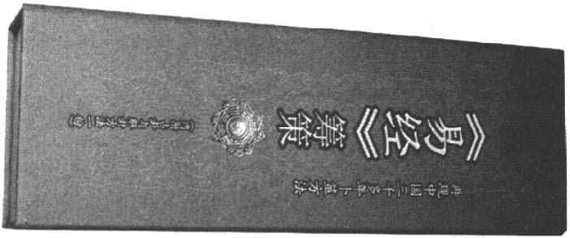
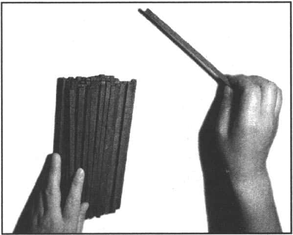
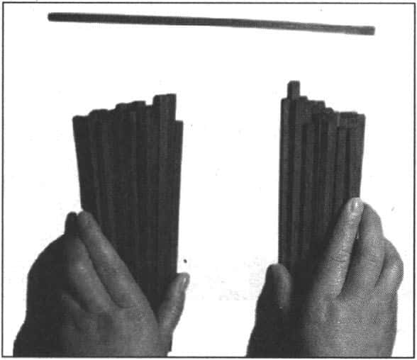
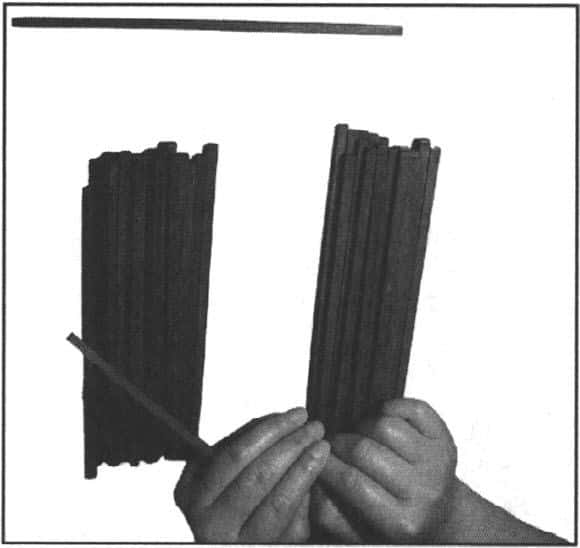
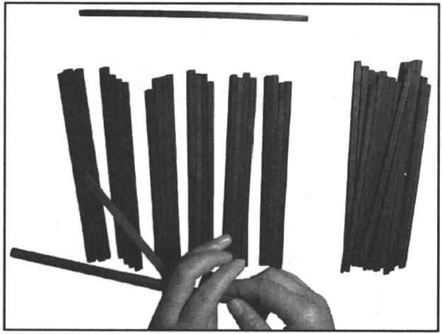
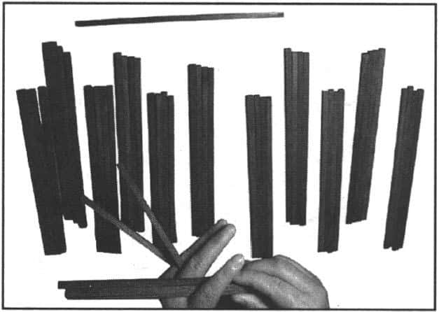
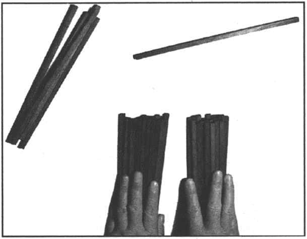
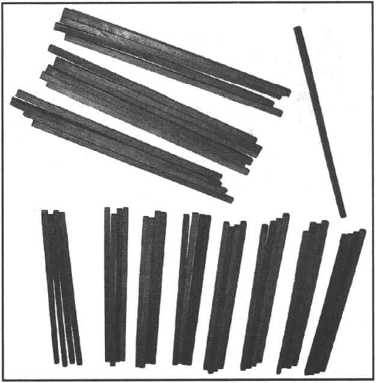

**附录：古人用《易经》占卦预测示例**  

古人用蓍草来进行占卦预测，也叫筹策（见下图）。

其步骤如下：

第一步：准备50根筹策（因蓍草现在很难见到，可用竹签、筷子、火柴棍作为代替用具），取出其中一根放在一旁不用，以象征太极。（“大衍之数五十，其用四十有九”）（见下图）：

第二步：把余下的49根筹策随意分为左右两堆，左边的一堆象征天，右边的一堆象征地。（“分而为二以象两”）见下图：

第三步：从右边一堆筹策中取出一根，夹在左手的小指与无名指之间，以象征人。（“挂一以象三”）见下图：

第四步：用右手数左边一堆筹策，以4根为一组，以象征四时；数到余下4根或少于4根为止，把余下的筹策夹于左手无名指和中指之间，以象征闰月；再以右手以同样的方式数右边一堆筹策，把余下的筹策夹于左手中指与食指之间。（“揲之以四以象四时，归奇于扐以象闰”）见下图：

以上“分二”“挂一”“揲之以四”“归奇”四个动作，称为“四营”，一次四营则称为“一变”。

第五步：把夹于左手手指间的筹策从手上取下，合在一起，置于一旁。见下图：

第六步：除第一步和第五步中取出放在一旁的筹策，另外所有筹策合在一起，再重复第二步至第五步的动作。见上图。

第七步：除第一步、第五步、第六步中取出的放在一旁的筹策，另外所有的筹策合在一起，再重复第二步至第五步的动作。

第八步：第七步余下的筹策放在一旁，数一下4根一组的筹策组数，得出的数必为6、7、8、9四个数中的一个。其中6为老阴、8为少阴，为阴爻（ ）；7为少阳、9为老阳，为阳爻（ ）。这样便得出《易经》六画卦中的第一爻，即初爻（“四营而成易”）见上图：

再把上述的第二步至第八步的动作重复五遍，便可一次得出二爻、三爻、四爻、五爻、上爻，这样一个完整的卦形就出现了。（“十有八变而成卦”）

得到一个完整的卦形之后，还要弄清楚变爻和不变爻的概念。变爻就是上述的老阴和老阳，因为它们已发展到阴和阳的极点，即将发生阴阳的转化；不变爻就是上述的少阴和少阳，不会发生爻的变化。

**策　　划：** 贺鹏飞

**责任编辑：** 张娟娟

**特约编辑：** 闫富斌

**装帧设计：**  

**网络书店：**  

**网上商城：** 

