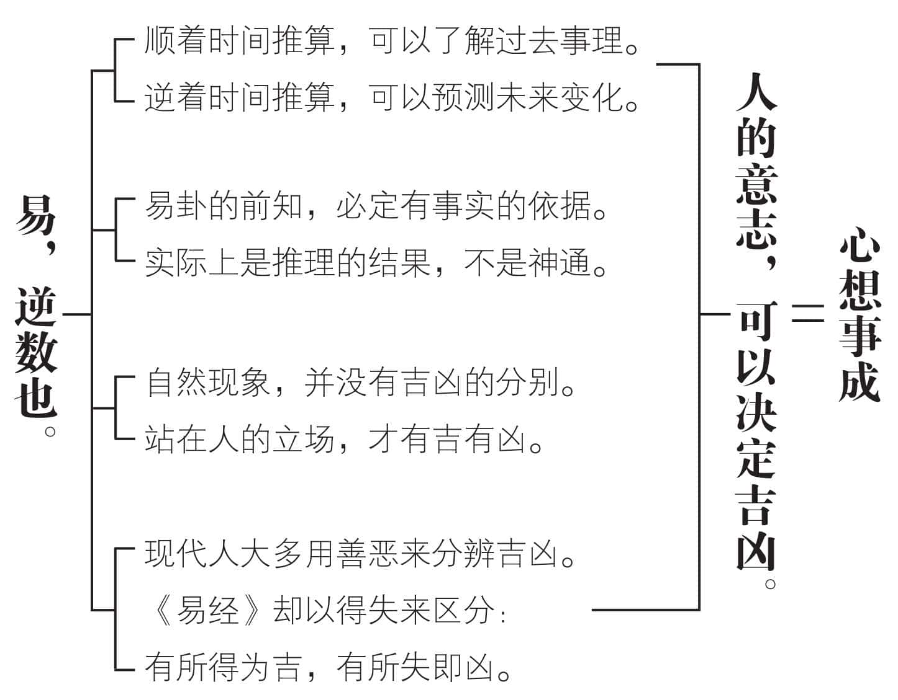
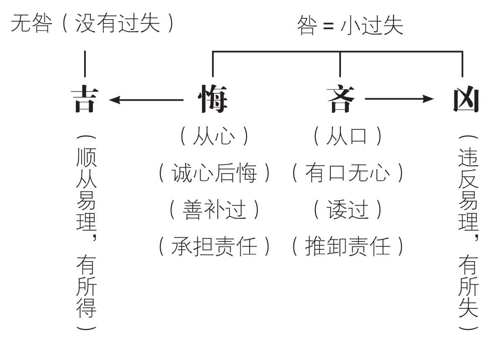
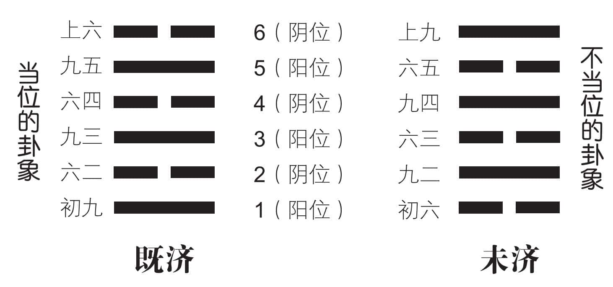
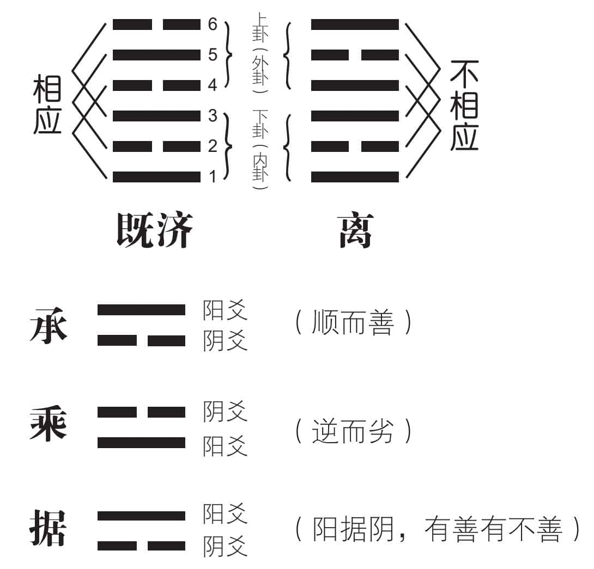
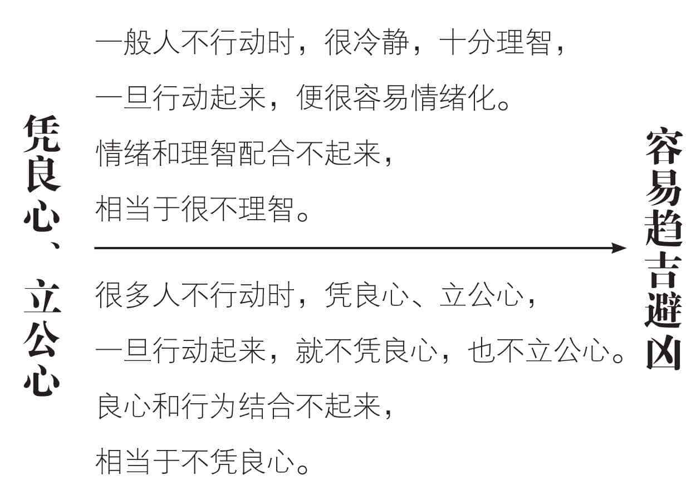
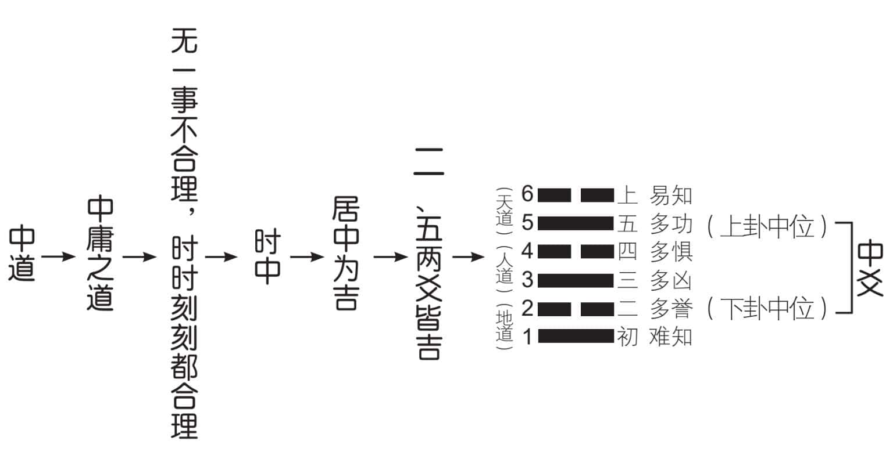

 **第五章**

 **怎样趋吉避凶？**

趋吉避凶，是心想事成的结果，

人人都有这样的心态，也是一种人之常情。  

由悔而吉，真心改过最要紧，

口是心非，那就由吝趋凶了。  

从时空的变动，找出对应的力量，

若是感应良好，自然易于趋吉避凶。  

重卦的上下卦，各有三爻，

彼此之间的承、乘关系，要清楚辨别。  

自己凭良心、立公心，

可以感应他人的良心和公心。  

致中和，行中道，凡事求合理，

用理智指引感情，自然趋吉避凶。

# 一　吉凶悔吝是可以预知的

孔子说：“学易可以减少过失。”这是什么道理？因为易卦对可能遭遇到的吉凶悔吝，事前都预言得十分清楚。

《说卦传》记载：“数往者顺，知来者逆，是故易，逆数也。”我们顺着时间推算，可以了解过去的事理。想要预测未来，那就要逆着时间推算了。逆数有前知的意思，很多自命为《易经》大师的人，都很喜欢预测未来的变化，还说得很神。实际上易卦的前知，必定有事实的依据，是推理的结果，并不是毫无依据，便能够前知五百年，令人不禁生疑。

系辞下传说：“变动以利言，吉凶以情迁，是故爱恶相攻而吉凶生。”每一卦都有六爻，各爻的变化，透过爻辞，来预言“利”或“不利”，而结果的吉或凶，则是依据事物的具体情况而变迁，于是产生“爱而相合”或者“恶而相敌”两种矛盾的现象。爻与爻相邻近，却不相合，表示多凶；爻与爻相邻又相合，那就多吉。一切吉凶，都伴随我们的七情六欲而产生，只要我们的情绪起了爱好或憎恶的变化，吉凶便随之出现。心想事成，在这里说明得十分清楚：我们的意志，可以决定吉凶。这种“不易”的原则，有待于我们在实际生活中，亲自体验印证。

自然现象本身并没有吉凶的分别，站在人类的立场，才有吉和凶，因而产生悔或吝的反应。现代人大多用善恶来分辨吉凶，实际上，《易经》却以得失来区分：有所得为吉，有所失即凶。遵循《易经》所揭示的道理，自然有所得而吉；违反易理，那就有所失而凶，这才是吉凶的原本意义。

# 二　吉凶悔吝之外还有无咎

吉的意思，是顺从《易经》所说的道理。系辞上传所说“自天佑之，吉无不利”，意思是上天所佑助的人，必定顺应天道，所以吉祥而无所不利。我们常把“吉利”连在一起，实际上吉是吉，而利是利。吉无不利，但并不是利都是吉。有些利带来吉祥，有些利反而导致不吉，也就是凶。

同样的道理，凶必然害，而害并不一定凶。有时候看起来是害，结果却带来吉祥。善恶也是如此，善未必吉，而恶也不一定凶。从《易经》的道理来说，一阴一阳的变化，无论如何都是善的，并没有相对的恶。读通《易经》，自然明白：世界上原本没有恶的存在，只是人所不喜欢的，就把它叫做恶。社会上有善有恶，则是人与人之间纠缠不清的结果。感情上会产生悔吝，一旦理智清醒，那就无不善了。

至于悔吝，系辞上传说是“忧虞之象”，意思是悔恨或遗憾，都是心中忧愁或顾虑的象征。悔和吝是犯了过失之后，心中产生忧虑。不过悔字从心，而吝字从口，仍然有所不同。犯了过失，心中想要补过向善，叫做悔；犯了过失，口头上说要补过，心里头却缺乏诚意，甚至还要找理由掩饰或推诿，即为吝。通常的结果，是悔后趋吉，而吝常趋凶。因为不诚心改过，必然小过失变大过错，岂能不凶？系辞上传说：“悔吝者，言乎其小疵也。无咎者，善补过。”悔或吝，固然是有小过失，只要善于补救过错，便可以无咎，也就是不产生祸害。悔、吝、凶都是过失，都叫“咎”。但是善补过，便可变成无咎，所以“悔”十分重要。

# 三　爻有当位的也有不当位

每一卦有六爻，由下而上，分别称为初、二、三、四、五、上。定位的基本准则，为分阴分阳。初、三、五这三爻是阳位，二、四、上这三爻为阴位。凡是以阳爻居阳位的，也就是一卦之中，初、三、五这三个爻位是阳爻，都属于当位；若是阳爻居于二、四、上这三个爻位，便是不当位。

当位又称为正位或得位，表示阳爻居阳位，而阴爻居阴位。不当位又称为失位或非其位，表示阳爻居阴位，或阴爻居阳位。当位的爻辞，通常为吉，但有其他因素影响时，也可能不吉。不当位的爻辞，大多为凶，但有时也不一定。这种情况，和正当行为不一定事事亨通，而不正当的行为有时反而十分得意，是相同的道理。因为还有其他的因素，必须考虑在内，才能判断可能的结果。

六十四卦当中，六爻都当位的，只有“既济”卦()。初九、九三、九五三个阳爻位，都是阳九。六二、六四、上六三个阴爻位，也都是阴六。所以卦辞指出事业已成，接着勉励当事人必须保持守正以防危乱。因为一不小心，就容易变成六爻都不当位的“未济”卦()：初六、六三、六五三爻，阴居阳位；而九二、九四、上九三爻，又都阳居阴位。所以卦辞提醒必须勉力促成，或可得亨通。如果处事不慎，则必无所利。当位时要提防不当位的可怕，不当位时又提供善补过，以求挽回的途径。时时以趋吉避凶为念，所以系辞下传说：“作易者，其有忧患乎？”具有忧患意识，才能够趋吉避凶。进者退之，退者进之，必须合理应变。

# 四　时应承乘也有很大影响

“位”虽然很重要，却离不开“时”。“时”如果是河流，“位”不过是水流中的漂流物。地位再崇高，只要岁月如流水，届龄退休，也一定要下台。各爻的吉凶，实际上都以时为背景。以时间定吉凶，卦就是时，时一改变，吉凶也就跟着改变。卦是时，爻为位。重卦由两个基本卦（三爻卦）组合而成，上三爻为外卦，也叫做上卦；下三爻为内卦，又称为下卦。六十四卦，每卦都有内外的分别，下卦为内，上卦为外。上下卦各有三爻，一与四、二与五、三与六有互相感应的作用，称为“相应”。“应”是同志的意思，若是下卦的初爻和上卦的四爻，一为阴爻而另外一爻为阳爻，便是“相应”。如果同为阴爻或阳爻，那就是“不相应”、“无应”或“敌应”。二爻与五爻、三爻与上爻，可依此类推。阴阳相应，大多是吉象。但也有例外，有的因为相应而得，有的反而因为相应而失，有时由于无应而凶，随着时势而定。

和“相应”有密切关系的是“相比”。凡相邻近的二爻，阴爻在阳爻之下，承助在上的阳爻，称为“阴承阳”，或“柔承刚”，这种情况便是“承”，大多顺而善。阴爻在阳爻之上，乘驾在下的阳爻，称为“阴乘阳”或“柔乘刚”。这种情况即为“乘”，大多逆而劣。就阳爻来看，最好是“据阴”，也就是位居阴爻之上，可以得其用。这时候位居阳爻之下的阴爻，处于承阳的状态，也十分有利。但是仍然要一并考虑其他因素，才能断定吉凶。综合研判，不宜有所偏失。

# 五　先凭良心再求趋吉避凶

同样的时和位，为什么反应不相同？主要是“应”的力量所造成的影响。“应”是看不见的那一只手，《易经》说人与人、人与物、人与天、天与物、物与物，实际上，都有相应的力量。其中人与人的相应，特别称为感应，成为我们与他人心与心感通的联系、互动力量，对吉凶的影响很大。

中国历代的圣贤和伟人，都是从平凡中表现才华，并没有什么超能力的神奇力量。他们按照系辞上传所说“二人同心，其利断金”的道理，深知同心协力的力量无穷，而且秉持咸卦所揭示的“圣人感人心而天下和平”，发挥“敬人者，人恒敬之”的精神，自己凭良心、立公心。引起众人的反馈作用，同样凭良心、立公心，透过相互感应，收到圣人感人心的良好效果。

“易”称为《易经》，而不叫“难经”，便是要我们去掉“难”的观念，用“易”来代替。最简单的办法，就是记住“天下无难事，只怕有心人”这句话，再难的事，只要心里想着很简单、很容易，它就不难了。这种心想事成的力量，不用白不用，为什么不试试看呢？一切凭良心，感应得他人也凭良心，再难解决的事，不也就容易化解了吗？

最要紧的是，把良心和行为结合在一起。因为大多数人，都知道凭良心的重要，因此嘴上常常说凭良心，只是在行动时，却忘记了凭良心。不行动时凭良心，一行动便不凭良心，这种人多得很。不行动时很理智，一行动就十分情绪化，这样的人，不容易趋吉避凶，反而自作自受。

# 六　秉持中道以求事事合理

卦气由下往上，所以画卦时，也由下而上。最底下的一爻，称为初；最上面的一爻，即为上。系辞下传指出：“其初难知，其上易知。”因为初爻反映事物的根本，比较不容易明了；上爻是事物的末端，最后的结果反而比较明显易懂。至于中间二、三、四、五这四爻：二多誉而四多惧，三多凶而五多功。由于第二爻居于下卦的中位，通常多有称誉。第五爻居于上卦的中位，通常多获得成功。第三爻虽然和第五爻同样具有阳刚的功能，却因为所处的爻位不同，通常多有凶险。第四爻通常多有忧惧。重卦之后，原有三爻卦的天、人、地三才，变成兼三才而两之。初、二两爻为地道，三、四两爻为人道，而五、上两爻则为天道。

这种二、五两爻位居下卦和上卦的中位，由于二多誉、五多功所显示的“居中为吉”，成为中道的依据。然而，《易经》认为宇宙万物变动不居，不可能有固定不变的位置。中的意思，应该是“合理”。而合理与否，必须配合时、空的变化，依据“应”、“承”、“乘”等关系，来加以妥当地调整。《易经》讲求“时中”，便是“无一时不合理”，也就是“无一事不合理”，才合乎中庸之道。

西方人辨明是非，只就事理上着眼，对事不对人。炎黄子孙分是非，必须分到圆满的地步，大家才会觉得满意。圆满的意思，其实就是大家都有面子，才不致产生纷争。我们必须采用“合”的观点，“全”的立场，所以不可能对事不对人。研习《易经》的道理，更加容易事事合理。

# 我们的建议

1.趋吉避凶，是大家共同的愿望。求神拜佛、占卜问卦，只能当做辅助。最重要的，还是要靠自己做人做事都力求合理，明白“自作自受”的道理，并且贯彻奉行。

2.《易经》取法天地的变化，透过阴阳两个符号来设卦垂象，告诉我们应对进退的道理。只有能适时持经达变，才能依据原则做出合理的变通。尽量在圆满中分辨是非，发挥“善补过”的精神，方能有所得而渐趋于吉，而远离于凶。

3.我们处在吉顺的时候，最容易得意忘形。难免有一些小缺失，也不愿意诚心诚意地善补过，反而用“吝”的态度，尽量推诿责任，于是凶便随之而至，这才开始后悔。这种由吉而吝，招来凶祸才心生后悔的态度，值得大家反省改进。

4.老子说：“祸兮福之所倚，福兮祸之所伏。”一般人都会背诵，却不能体会其中的用意。人生不如意事，十常八九，大家都应该坚忍耐烦，才有趋吉避凶的可能。

5.卦是时，而爻为位，再加上看不见的应，以及承、乘、据的关系，综合起来用心研判，以论断吉凶。关键不在利害，而在于得失。有所得为吉，有所失即是凶。

6.凭良心、立公心、求合理，是趋吉避凶的主要力量，而且主导权在我们自己，只要意志够坚定，自然心想事成。按照这种简而易行的方法去做，才合乎《易经》时时刻刻求合理的时中精神。

