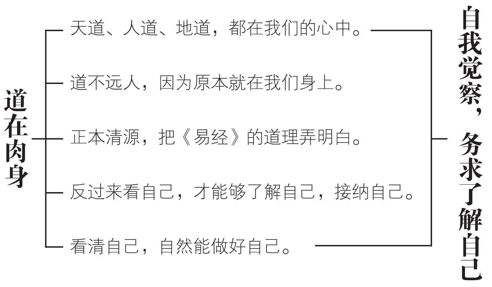
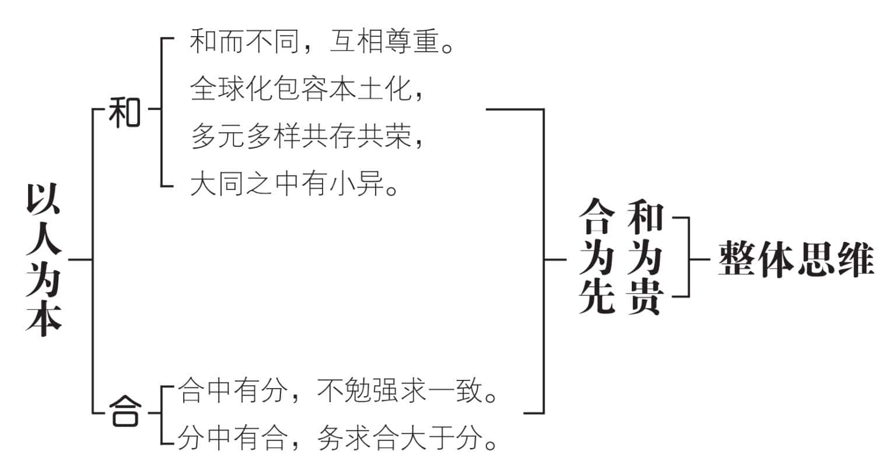
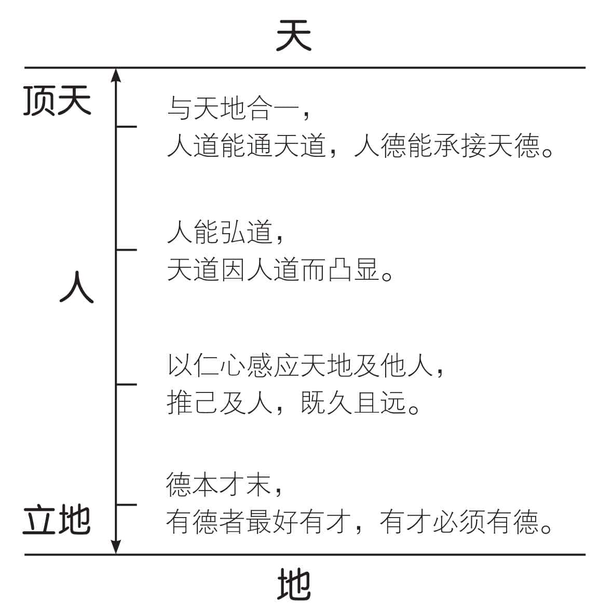
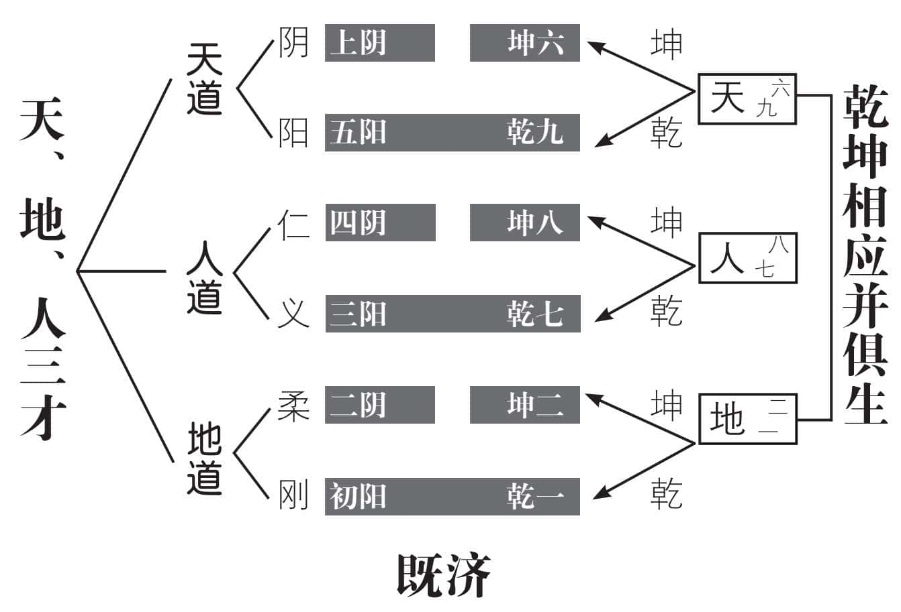
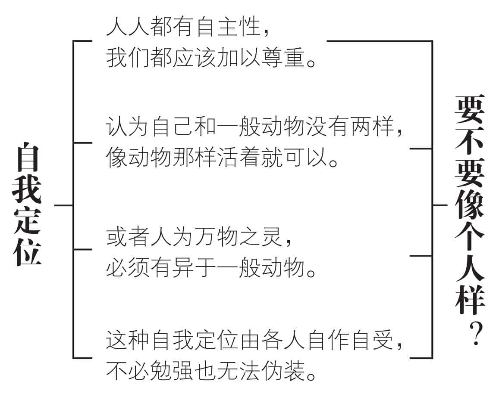
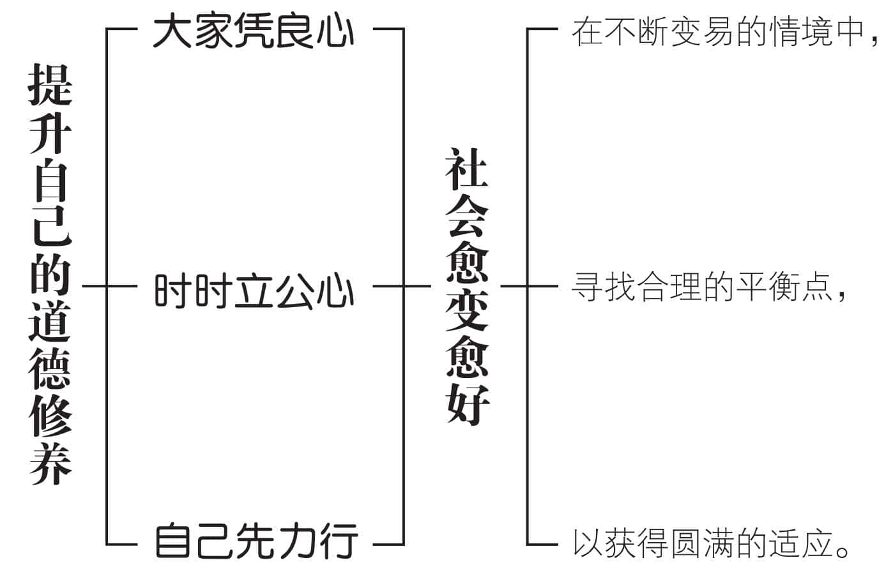

 **第六章**

 **道德修养为什么是做人的根本？**

宇宙万事万物，各有不同本性，

然而不同之中，必有共同的通性。  

物质方面，个别差异很大，

各有不同需求，各有各的表现。  

只有仁是万事万物的共通需求，

仁则生，不仁，就会麻木而枯死。  

仁是人固有的，也是万物所固有的，

仁不是固定的德目，而是道德的根本。  

做人必须不厌不倦，终生追求仁德，

所以道德修养，是做人的共同根本。  

透过道德修养，可以通天道和地道，

人道的价值，于是因道德而长久弘大。

# 一　道在肉身可惜难以觉察

《易经》所说的天道、人道、地道，实际上都存在于我们的身上。因为天道和地道，都需要人来辅助。这种“赞天地之化育”的责任，使人成为万物之灵。人只要以人道通天道和地道，必然可以人定胜天，而且没有不良后遗症。

道不能弘人，虽然道存在于人的肉身，有手、有足、也有脑，却不知道用心，也是徒然。人才能弘道，只要有心，一切都在我的掌握之中，当然随时随地可以弘道。

由于眼睛向外长，使我们只看到外面，却看不见内心的深处。向外学习很多知识，仍然不明白道理，是现代人普遍的缺陷。原本讲求“由情入理”，如今“情”不见了，“理”又建立不起来，难怪中不中、西不西，愈来愈不知如何是好。最好的办法，莫过于正本清源，把《易经》的道理好好研读，弄明白我们长久以来，知其然而不知其所以然的学问，其中所蕴含的道理，以及真正的用意。把基本原则确立起来，然后持经达变，才能够国际化而不失去自我，现代化却不忘掉根本。认识自己的面目，才有资格做真正的我。

我们是《易经》的民族，易道早已和我们的肉身共存。可惜一般人不能觉察，反而舍本逐末，去学一些枝枝节节的东西，把整全的概念丢掉了，非常可惜。

易道主张一分为二，而二合为一。合大于分，和西方的分大于合，基本精神并不相同。二十一世纪全球化，必须以合大于分的易道，具有广大包容性的易经为基础，才能够顺利完成。所以全球热烈研习《易经》，已经成为一股新的风潮且日愈旺盛。

# 二　以人为本发展整体思维

所有的学问，都是为了人的需要，才会发展出来的。从最古老的神话到宗教，再由哲学而科学，无一不是为了解决宇宙人生的种种疑惑和问题。但是，我们不能忘记，人类不过是宇宙的一部分。宇宙是一个大太极，我们只是一个个小太极。我们思虑任何问题，都应该站在宇宙整体的立场，必须发展出整体思维，才能够兼顾并重，面面俱到。

“一阴一阳之谓道”，告诉我们万事万物都出于一阴一阳的合二为一，必须依据一阴一阳的规律而变化。没有阴阳交错的基本矛盾，八卦、六十四卦就无法成立。矛盾不必对立，以免引起冲突，却应该化解，务求大化小，小化无，以达到和谐发展的效果。阴阳的变化，永远不停滞。然而变化的规律，却永远不变。我们把不变的法则，看做“经”，然后持经达变，以求制宜，求得随时随地都合理的化解方法。这种简单、明了、易行的整体思维，不但放之四海而皆准，而且历久弥新而不变，既能天人合一，又可以包容各种族、各地区、不同文化的特殊性。依求同存异的原则，在和而不同的气氛下，达成地球村的大同（小异）理想，实在是二十一世纪人类共存共荣的最佳途径。

《易经》的整体思维，可以用“和合”两字来描述。“和”指和而不同，“合”为合中有分。“和而不同”，表示大同之中有小异，必须互相尊重，不能勉强求其一同；“合中有分”表示全球化应该尊重本土化，以保持世界的多样化，符合生态发展的需求。和为贵，合为先，是世界大同的总原则。

# 三　德本才末以道德为根本

道德这两个字，原本是分开的。“道”就是“道理”；“德”是“得”的意思，把道理付诸实践而有所得，便是德。道表示明白《易经》的道理，德指把《易经》的道理应用在日常生活当中，获得具体有效的良好效果。易卦六爻，分成天道、人道、地道三才。这三才的位置不同，却都以阴()、阳()两个符号组成。阴阳已经不是天、地或人特有的形象，而成为天地万物的共象。天道与地道分不开，人道也不能离开天道和地道，所以天、人、地的整体和谐与协调，便显得十分重要。

我们放眼世界，只有人可以与天地合一。人道能成天道，人德能承接天德。天道因人道而凸显，所以人能弘道。但是人力毕竟十分有限，而天道无穷。我们所能做的，不过是发挥仁心，以感应天地与他人。在物质方面，我们不可能照顾到每一个人；然而精神方面，却是可以推己及人，既久且远。换句话说，我们在许多方面，都无法与天地相通。只有道德精神方面，随时可以和天地万物相合。

系辞上传说：《易经》的道理，和天地相近似，所以不致违背天地的道理。能明白易理，既涵盖万物又足以匡济天下，行为不会过头，乐从天道，谨守本分，自然不会忧愁。安于所处的环境，敦厚地施行仁义，自能爱己爱人。一切的才能，都要以道德修养为基础。品德良好，又有才能的，叫做才德兼备。有德有才，当然最好。若是有才无德，那就非常可怕。不如无德也无才，来得安全。德本才末，是我们检验人才的基本准则，迄今仍然至关紧要。

# 四　仁义道德主宰时代盛衰

卦有六爻，分为三才：初、二两爻为地道，以刚柔为主；三、四两爻为人道，以仁义为主；五、上两爻为天道，以阴阳为主。地最重视规矩，无论开垦、挖掘、种植、施肥、收割、建屋、排水等等，如果不依法处理，很可能出大问题。地表现得相当干脆，能就能，不能也毫不客气地不予接受。这种刚柔分明的特性，十分明显。天和地刚好相反，不明白表示，只是阴阳变化不定，让人自己去猜测，还经常猜不透，也测不准。人处于天地之间，一方面要脚踏实地，规规矩矩，有地道的精神；一方面又要学习天的模糊和变化，于是“无规矩不足以成方圆”，就成为做人的原则。先站稳足部，再求表现手足的技巧。摸索了很久，终于找到了“仁”和“义”这两个最基本的要件。

从历史上看，中华民族可以在所有变化、动乱、灾难之后，恢复原先的社会秩序，真正做到《三国演义》所言“合久必分，分久必合”，便是基于这种人道的修养。

我们甚至可以说，中华民族的历史，从看得见的方面来说，是英雄豪杰的丰功伟绩所造成。然而由看不见的那一方面来说，可以发现自古迄今，是一群默默无闻，却始终坚持仁义道德的贤士，在承先启后，一以贯之。我们漫长的历史洪流中，凡是仁义道德弘扬的，必属盛世。反过来说，不重视品德修养，不仁不义的时代，自然衰落。看起来是了不起的人在改变时势，实际上却是仁义道德在主宰时代的兴衰。人道的力量，实在不可忽视。

# 五　人生在世共同做一件事

一样米养百样人，表示人人都有个别差异。既不能也不必求其一同，只要大同小异，共同维护社会秩序，就应该求同存异，彼此包容，互相尊重，保持和而不同。

共同的事情，说起来只有一种，那就是品德修养。只要品德修养相同，其他生活方式、专业技能大可以不同。《易经》的整体思维，告诉我们人与天、人与人、人与物，都应该互相依存，无法独立。因此我们的“人伦本位”和西方的“个人本位”，出发点既不一样，所发展的人际关系也大不相同。我们重视义务，西方强调权利；我们要求合理，西方重视合法。地球村的潮流，不论是西方压倒东方，还是中国压倒外国，结果都不可能持久，而且还可能会引起剧烈的抗争。就算真的做到了，也严重违反了多元发展、多样生存的自然法则，承受这种恶果的，必然是人类自己。

解决二十一世纪的最大难题，也就是消弭全球化与本土化的矛盾与冲突，最好的方法，依然是把人生共同的事情——道德修养落实好。共同以和合的仁义精神，好好商量来谋求化解，而不是动不动就要谈判，或是一心要求速战速决。

人和一般动物最大的不同，在于具有精神生命。随着历史的演进，人类经过无数的经验教训，心智终于逐渐成熟，开始发现自身处于变化莫测的自然环境里，不仅仅是一个物质生命的存在，同时也是一个精神生命的存在。我们能自主，有创造力，必须提升道德修养，才能够不辱“人之所以为人”的“性命”力，而不是活着就好的“生命力”。

# 六　道德促使社会愈变愈好

一卦六爻，分上下两个基本卦。二爻与五爻为中，且以六二和九五为既中又正，大多为吉。中华文化自伏羲、神农、黄帝、尧、舜、禹、汤、文、武、周公、孔子，以至于现代，一脉相承，都秉承《尚书》所说的“人心惟危，道心惟微，惟精惟一，允执厥中”的中道精神。其根本原理，即在《易经》“在不断变易的情境中，寻求合理的平衡点，以获得圆满的适应”，由各人的“时中”，谋求整体的和谐发展。我们是《易经》的民族，在此获得更进一步的证明。

变是必然的，也是十分危险的。因为时间永远在往坏的方向流动——人愈变愈老，东西愈变愈旧，事情愈变愈糟。我们常说“人生不如意十常八九”，便是“变有百分之八十是不好的，只有百分之二十是好的”。这种二十、八十定律对变化来说也不例外。我们不可不变，却不能乱变。意思是必须做好控制，在百分之二十的良好效果范围内，适当应变，也应该在百分之八十的不良后果范围内，做出更为小心谨慎的调整。由此可见，道德修养对于变好、变坏的关键性作用，实在不可忽视。

系辞上传说：“变而通之以尽利。”意思是变化会通三百八十四爻，来施利于天下。系辞下传说：“易穷则变，变则通，通则久。”告诉我们《易经》的基本道理，在于事物穷极了就发生变化，变化了自然就会通达，通达了就能够持久。只要我们提升自己的道德修养，大家凭良心，时时立公心，自己先力行，人人如此，自然合理变通而生生不息。

# 我们的建议

1.长久以来，人类走向偏道，远离中道，以致愈变愈乱，愈来愈不安宁。主要原因，在望文生义、不求甚解，而且自以为是，造成对《易经》的扭曲、误解和轻视。

2.最好的方法，便是彼此劝勉，共同以“大家凭良心，时时立公心，自己先力行”互相勉励，把易理的中道精神，及早恢复起来。由人类自救，来救世界！

3.二十世纪西方科学发展神速，使大家从“质能互变”中，回头看见《易经》“阴阳互变”的智慧光芒。可惜《易经》所重视的“道德”，迄今仍然被“科技专业知识”所淹没，把道德修养是做人的根本，从头到尾彻底地遗忘掉了。

4.我们把道德的意义，说到大家都听不懂；把道德的标准定得太高，弄得大家都做不到，因此有很多人自动放弃，也宁愿做一个不凭良心的人。从这个角度来看，人类是退步的，并不全然是进步的，值得大家深思。

5.二十世纪最不幸的观念，便是“求新求变”。大家盲目地认为新就表示好，而旧的便应该淘汰，把“变”当成是唯一的途径，不久的未来就变得江郎才尽，以致乱变到不知如何收拾残局。

6.人类要想自救，最好的方法，便是重新好好认识道德的价值，及其对人类、对宇宙万事万物的重要性。离开了道德，人类不过是自己创造出来的器物、制度、知识所利用的工具，与役使的奴隶！

