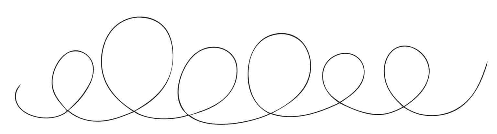
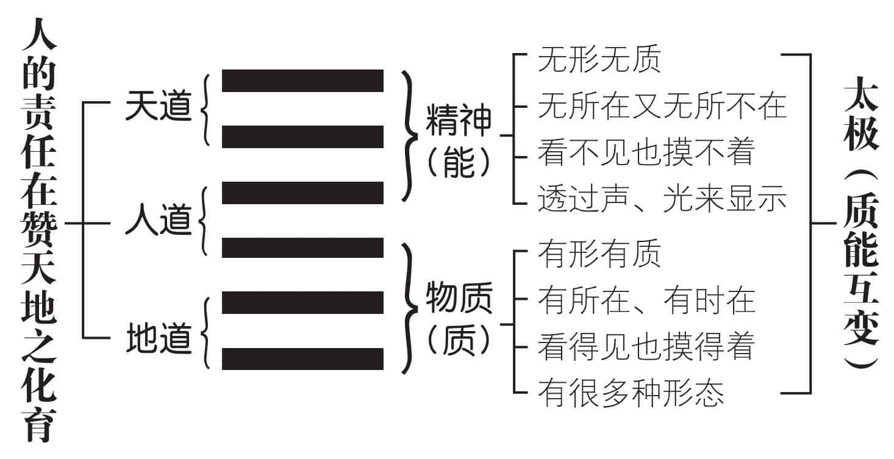
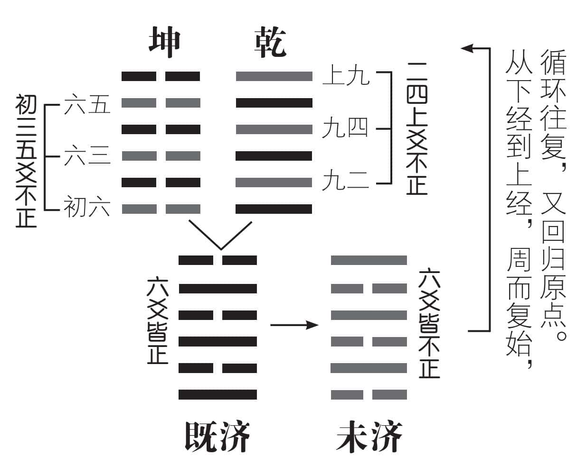
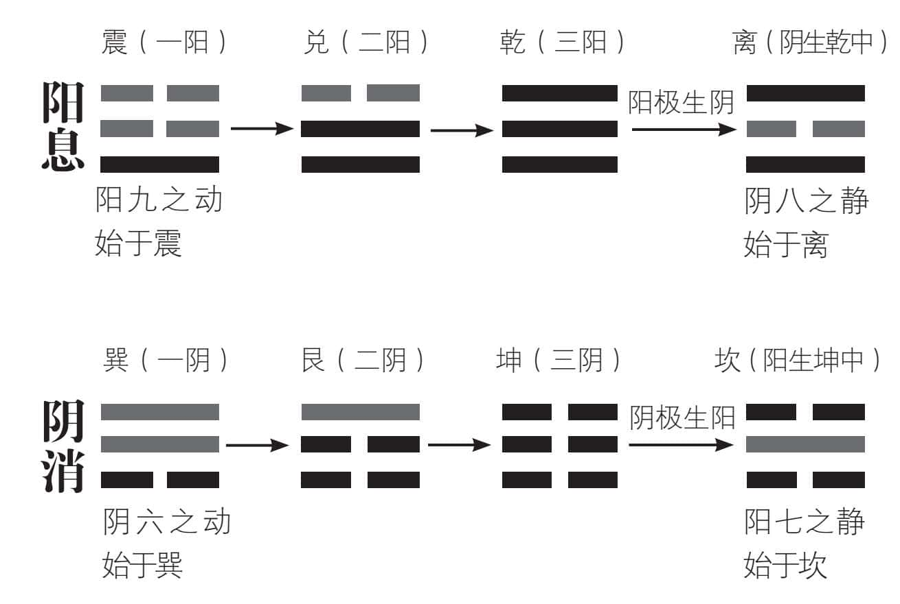
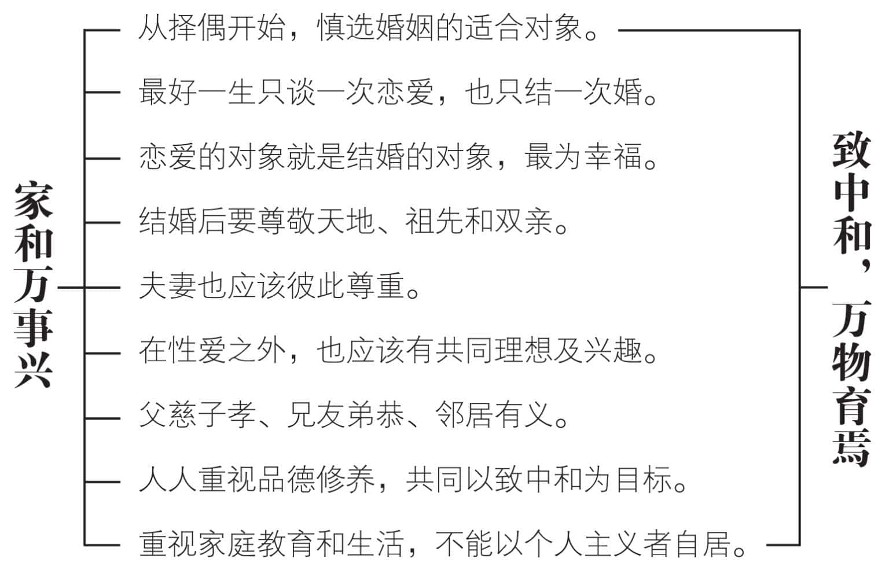
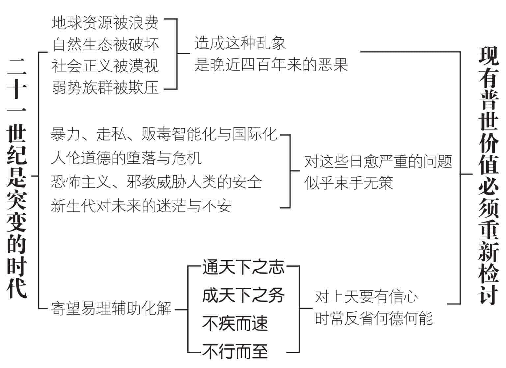

 **第七章**

 **宇宙可能永续经营吗？**

现代社会要求永续经营，

唯有和平发展这一条途径。  

两者缺一，就没有希望。

不是同归于尽，便是一起饿死。  

人人必须下定决心，

只要我活着，就不让人类毁灭。  

死了以后怎么办？

活着的人就要自己想办法。  

多研读大象、小象，

对卦名也要多加玩味。  

务须先求通天下之志，

然后才能成天下之务。

# 一　和平与发展任重而道远

阴阳平衡，不过是理想的状态。六十四卦当中，只有“既济”卦()做得到。即使如此，卦辞仍然提出“初吉终乱”，也就是刚开始时很好，不久就会引起困乱的警告。因为平衡的状态，随时会受到内外环境的变数所干扰，又变成不平衡。不平衡时谋求平衡，平衡时又被打破平衡，形成不平衡。这种变动不居的宇宙现象，使得人类时时刻刻，都有事情要做，必须活到老学到老，才有乐趣。

人类的历史，就是循环往复，周而复始的周流过程。系辞下传说：“变动不居，周流六虚，上下无常，刚柔相易，不可为典要，唯变所适。”意思是平衡与不平衡的变动，普遍流行于各卦六爻之间，向上或向下，没有一定的法则。阳刚与阴柔也互相变易，不能拘执于一定的规格，只是按照所适合的方式，不断地变化。六十四卦的次序，由乾、坤、屯、蒙……一直发展到既济，已经完成圆道周流，未济开始又步入另一个圆道周流。生生不息，却一起一伏，形成我们常说的“风水轮流转”，有时东风压倒西风，有时则西风压倒东风，形势比人强，所以说“一切有定数”。

现代社会，由于科技发达，武器的威力十分可怕。人类必须和平发展，别无其他办法。因此和平与发展，成为二十一世纪人类唯一可行的途径。然而长久以来，人类好战成性，又拥有十分可怕的武器，可以说格外危险。《易经》的“一阴一阳之谓道，继之者善也”，应该是地球村的共同认知，才不致由于擦枪走火，造成无法弥补的不幸。

历史会不断重现，但是每一次都不一样，

平衡时打破平衡，不平衡时谋求平衡，

只要人活着，就永远有做不完的事情。

# 二　永续经营是人类的责任

系辞上传开宗明义，便指出“天尊地卑，乾坤定矣”。天在上而尊，地在下而卑，用意在提醒我们，天是精神的代表，地是物质的呈现。为了避免重视物质而轻忽精神，所以才特别分出尊卑，使大家知所警惕，而自我改善。

《易经》以精神为上达的对象，而视物质为下学的项目。用这样的观点，来探究孔子“下学而上达”的主张，应该比较容易了解。物质提供我们生存的保障，精神才能够使我们生活得更有意义、更有价值。三才的天道表示精神界，地道表示物质界。人道的上爻代表精神界，下爻则为物质界。可见人虽然经过下学，可以了解并运用物质，以谋求生存，然而仍必须要上达以了解天命，才能够妥善完成应有的责任。我们的天命，即在“赞天地之化育”，期待能够永续经营。

从《易经》的角度来看，天下的事物，各有不同的开关。开就是阳()，表示电流接通了，可以产生动能，发生作用；关便是阴()，表示电流中断了，电能不流通，暂时无法发生作用。开关不但要灵敏，而且应该适时妥为操作，才能合乎“一阴一阳之谓道”的要求，保持正常作业。

《易经》的宇宙观，是从仰观俯察的实际经验而来，既不迷信，更合乎科学精神。只要去私心、存公道、不忘本、不忘恩，什么是自己的责任，应该很容易明白。

人人都是一个太极，有物质的需求，也有精神的觉醒。上半夜想想自己，下半夜也应该想想别人。有所变也有所不变，时时以合理为诉求，凡事好商量，人类就有福了。

# 三　回归原点以求重新出发

天地生万物，为人类所用。人类有能力参与天地的化育，必须设法使宇宙万物生生不息，永续经营。然而宇宙是虚空的，天地才是真实的。乾为天、坤为地，是《易经》这个大家庭的父母。《序卦传》不称“乾坤”而直接指出“天地”，便是彰显天地的永恒存在。

上经从乾坤始而以坎离终，共三十卦，以天地水火为主，着重于自然现象，透过天道来说明人道；下经由咸恒开始，一直到既济、未济，共三十四卦，以人文为主，但仍取法于自然，告诉我们最好配合天道、地道，以恪尽人道。乾坤两卦演变到既济、未济，既济、未济两卦，乾坤仍在其中。

孔子在《序卦传》中记得十分清楚：“有天地然后有万物，有万物然后有男女，有男女然后有夫妇，有夫妇然后有父子，有父子然后有君臣，有君臣然后有上下，有上下然后礼义有所错（措置的意思）。”可见夫妻之道不可以不长久地存在，所以在象征男女交感、夫妇之义的咸卦之后，接下去便是恒卦，表示男女一旦成为夫妇，便应该持之以恒，永结同心，百年偕老。

人道的伦理道德，从夫妇开始。乾道成男，坤道成女。乾坤定位，表示男女平等而不同性质。现代人只重平等却不理会不一样的性质，以致乾坤不能定位，一切都乱了规矩。我们呼喊要回归原点，却不知道原点在哪里。乾坤不定，其他还有什么可为？五伦都乱了，还奢谈什么第六伦？回归原点，把乾坤定位，好好整理一番，继旧开新，看看能不能有一番新的气象，人类未来的希望，即在于此。

# 四　易经大家庭的阳息阴消

八卦的变化，可以用阳息、阴消来观察。阳九之动始于震，表示阳的性质向上增长。在纯阴的坤卦中，一阳开始出现于下，向上的息长，也就是增长的意思。由一阳震、二阳兑，到纯三阳乾。这时候阳气已经息长至极，阳极（老）则一阴（少）生于乾中而成为离。阴包在阳中，便是阳中静态的阴，称为“阴八之静”。反过来说，阴六之动始于巽，表示阴的性质向下消剥，在纯阳的乾卦中，一阴开始由下向上消剥，于是一阴巽、二阴艮，以至于纯三阴坤。这时候阴气消剥至极，阴极（老）而一阳（少）生于坤中而为坎。阳包在阴中，即为阴中静态的阳，称为“阳七之静”。我们常说的“消息”，其实就是阳向上增长，而阴向上消剥，所产生的变化。今天称为讯息，意思是一样的。

阳的功能，在使阴减少；阴的功能，同样在使阳减少，并没有善恶、好坏、利害的分别，还是一句老话：合理就好。在《易经》这个大家庭当中，乾代表父，坤即为母。震是长男，坎为次男，艮即少男。乾为老阳，震、坎、艮是少阳。巽是长女，离为次女，兑即少女。坤为老阴，巽、离、兑都是少阴。乾坤生六子的步骤，便是系辞上传所说的“乾道成男，坤道成女”。少阴、少阳、老阴、老阳就是四象，可以用七（少阳）、八（少阴）、九（老阳）、六（老阴）四个数字来表示。乾坤定位，父母扮演好父母的角色，其余各卦自然随着定位，也就是子女扮演好子女的角色。重新加强家庭教育，重视人伦，才是回归原点。

（本图采自周大利著：《周易要义》）

# 五　从家和万事兴到致中和

《易经》大家庭的基本成员，以八卦为代表。看起来为数不多，然而八卦相乘，重为六十四卦，表示宇宙万物的生生不息。其中的基本原理，便是我们常说的“致中和”。

古人的婚礼，新郎必须亲自以花轿到女方家中迎聘新娘，既不是新娘自己投入新郎的家，也不是由新娘父亲、兄长，或其他长辈把新娘交给新郎，充分显示对新娘的高度尊重。婚礼开始，新郎与新娘左右并立，一拜天地，二拜祖先，三拜高堂，然后夫妻互拜，表示除了尊敬天地、祖先、父母之外，还要夫妻互相尊重。

结了婚的男人，应该有正当可靠的工作，好好养活自己的家。夫妻不能过分重视性爱，或者在性爱方面无限制享受，以致很快就力衰情竭，彼此产生恶感。最好培养更高层次的共同目标与兴趣，避免因冷漠而导致婚变。

家和万事兴，说起来容易，实际上牵连的因素很多。从不忘根本、夫妻有别、父慈子孝、兄友弟恭，到邻居有义，都离不开良好的品德修养。人人以致中和为共同目标，在和平中求发展，才可能孳生繁衍、生生不息。

现代人只谈恋爱不结婚，大腹便便犹未结婚，居然还上电视侃侃而谈，毫无羞愧的感觉，也有歹徒为了诈取保险金，可以谋杀妻小或父母……科技再发达，教育再普及，请问又有何用？

从乾坤定位着手，以家和万事兴为共同努力的目标，而不再以“只要我喜欢，有什么不可以”的个人主义自居，然后推而广之，逐步致中和，人类才能有光明的未来。

# 六　易经在廿一世纪的效能

现代人相信“知识即权力”，可以提升生存能力，提高生活品质。科技发展主导了快速的改变，导致生态与环境的破坏。偏重智育而忽视德育的严重后果，更促使赢家愈来愈强，输家愈来愈弱。M型社会固然是事实，却具体表现人类的不凭良知与缺乏羞耻心。为了自身的利益，运用谋略巧取豪夺，似乎是理所当然，甚至还能获得赞赏。

站在人类永续经营的立场，令人不禁怀疑：晚近四百年间，由西方所主导的价值取向、文化目标，是不是应该重新加以检讨？而我们经常挂在口头上的普世价值，是不是需要加以合理地调整和改变？因为按照目前的情况，再继续发展下去，似乎十分不乐观，使人胆战心惊而至感不安。

《易经》认为宇宙间的天地交感，组成和谐共生的生态网。人与人之间，必须有所觉悟，唯有“通天下之志”，才能“成天下之务”。成就天下的一切事务，先决条件是通晓天下人的心志。心志相通，是齐家、治国、平天下的基础。如何才能够心志相通呢？同人卦指出，只有具备正德的君子，才有可能与天下人心志相通。换句话说，多研读《象传》的大象、小象，对卦名多加玩味，从多角度触发道德实践的意念，经常提醒自己何德何能，再加上谦恭与自省。这不是缺乏自信，而是对上天有信心。明白自己能通天下之志，是上天保佑，并非凭自己的知识和能力所能够完成的。有了良好的道德实践，知识当然就是力量。否则仁智不能互动，知识专门用来欺骗比较缺乏知识的人，当然会造成很多社会乱象。

# 我们的建议

1.不要老算过去的旧账，而是要向前看，多想想未来应该怎么办。过去的历史，不能够当做包袱，它是一面镜子，使我们学得宝贵的教训，并思考出未来应该走的途径。

2.现有的普世价值，发展了几百年，已经漏洞百出，经不起考验。并不是对与错的问题，而是不够周密，也不够周详，必须加以调整，以求符合时代的演变。

3.最好的方式，是回归原点，然后重新出发。人性的原点，其实就是宇宙的原点，具体而言就是一个“仁”字。知识既然发展，不可能也不应该回到从前。然而仁智不能并重，知识便可以害人——这一点已经成为事实，必须及早改善。

4.光凭阴阳的符号，顶多看出一些近似形象，很难体会出其中的道理。透过卦名和卦义，才能够明白道德实践的指引。多加玩味，便知道更深一层的心路历程。

5.二十一世纪相较于近来愈变愈快的几个世纪，是一个突变的世纪。说起来也是我们相信求新求变的必然结果，我们在自作自受之余，应该负起应变的责任，不能轻忽。

6.如此看来，《易经》在二十一世纪的功能，实在十分清楚。二十一世纪需要易道的指引，易理将在二十一世纪获得发扬，几乎无可怀疑。身为炎黄子孙，如何能把易道重新整理，发挥力量，应该是对世界人类的最大贡献。

