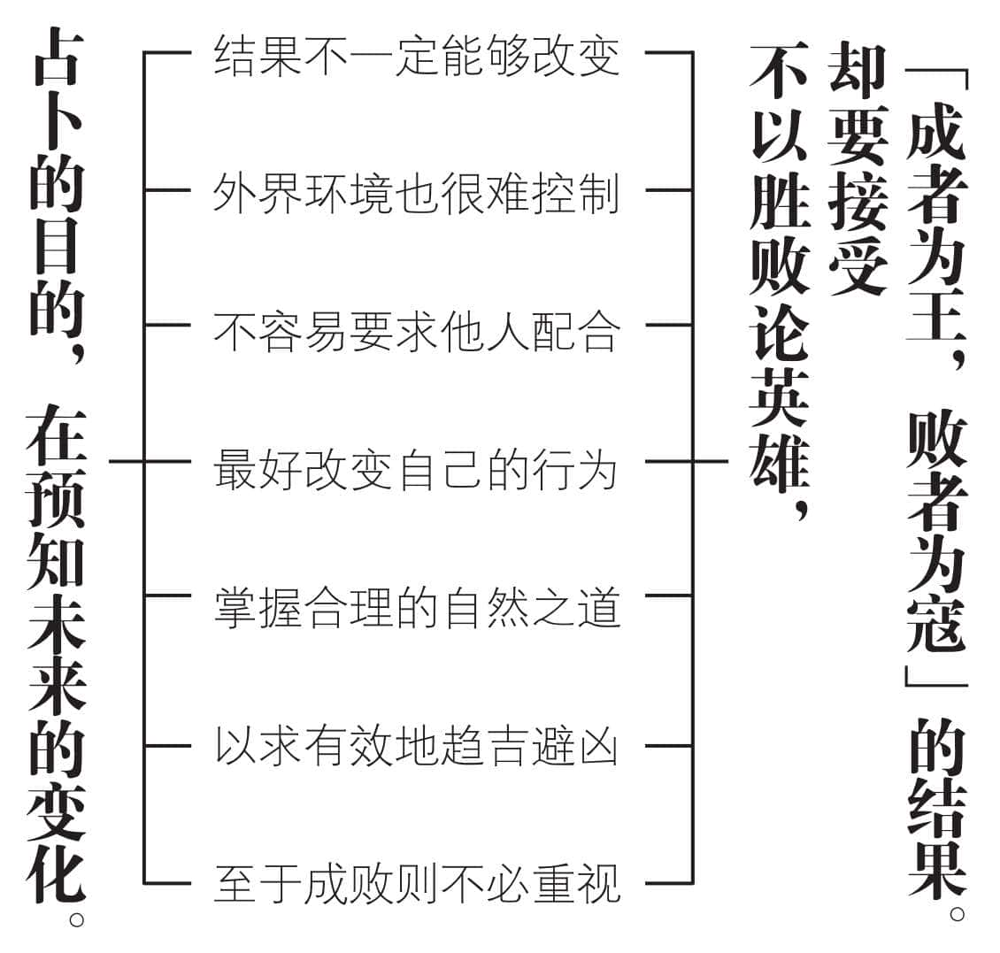
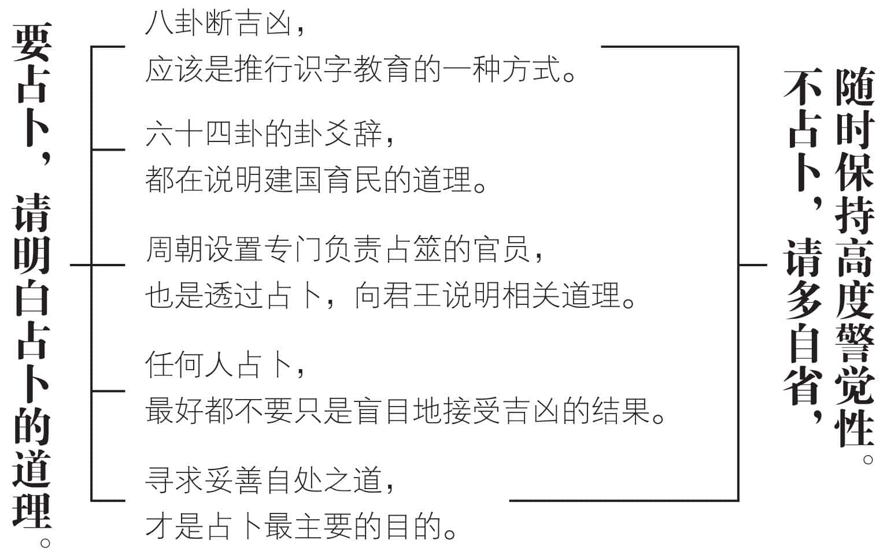
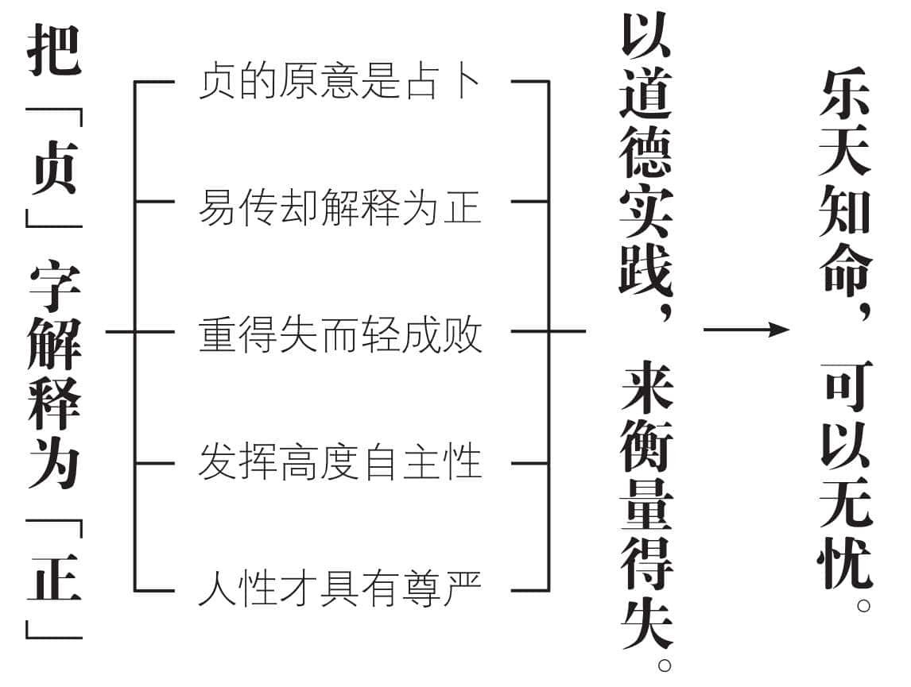
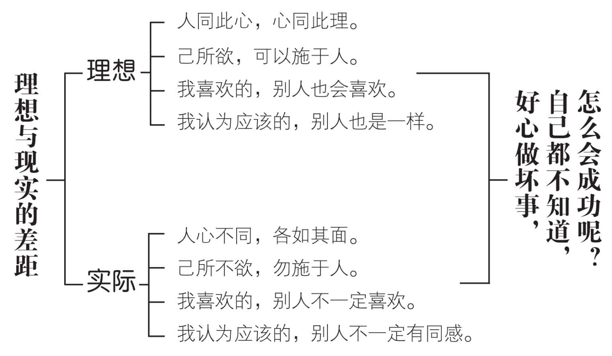
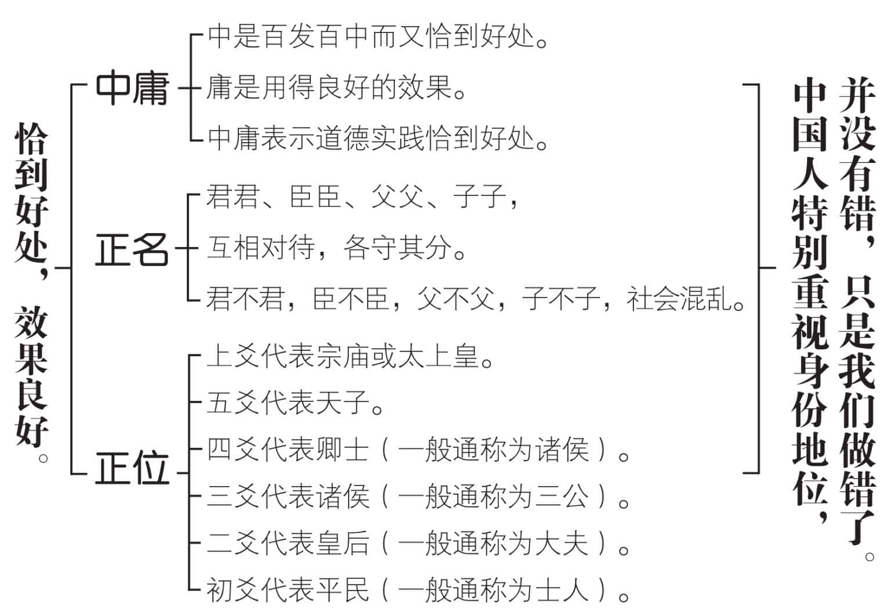
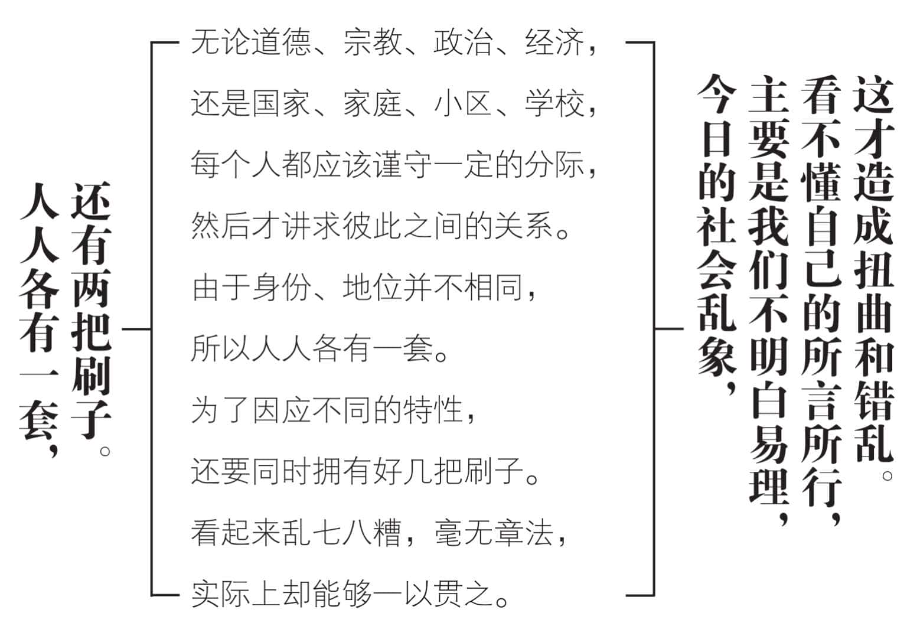

 **第十章**

 **易学的功能到底是什么？**

研习易学，可以有不同的目的，

但是真正的功能，在于“心易”。  

用心改变自己的行为，

提升自己的品德修养。  

品德良好的人，有占卜的资格，

看看求雨能不能应验便知道了。  

外界环境不容易加以改变，

寻求妥善自处之道比较实在。  

求神不如求人，求人不如求己，

自己的事情自己调整，效果更如意。  

人人各有一套，还要有两把刷子，

看起来很紊乱，实际上是乱中有序。

# 一　真正的功能其实是心易

研修易学，真正的功能，是改变自己的命运。方法十分简便，就是以自己的心，来改变自己的行为态度。也可以说，用心选择合乎自己需求的人生途径。简单一句话，用心变易，所以叫做“心易”，和“心想事成”是一样的。很可惜一般人只知道把“心想事成”当做祝福用的祈愿语，却不知道它原来是一种可以成为事实的叙述语。

起心动念，想正确的事，表现出合理的行为态度，事情就顺利地完成了，这不是很简单、方便、愉快吗？

《易经》的卦爻辞中，经常出现“贞”字。如“乾，元亨利贞”（乾卦卦辞）、“坤，元亨利牝马之贞”（坤卦卦辞）、“含章可贞”（坤卦六三爻辞）、“屯，元亨利贞，勿用有攸往”（屯卦卦辞）、“女子贞，不字，十年乃字”（屯卦六二爻辞）、“小贞吉，大贞凶”（屯卦九五爻辞）等等，其中的“贞”字，原本指“占卜”。而占卜的主要作用，在预测吉凶。系辞上传说：“极数知来之谓占。”意思是占卜的目的在“知来”，预知未来是吉还是凶。知道了，怎么因应呢？能改变结果吗？恐怕未必。能改变外在的环境吗？实在很困难。能改变他人吗？并没有把握。看来趋吉避凶，全在于自己的合理调整。至于结果如何，外界能不能稍有配合，恐怕不是自己所能够控制的。

我们所能做的，应该是知所自处。也就是调整自己的态度和行为，以求趋吉避凶。“心易”的意思，便是依据占卜的结果和《易经》所说的道理，来合理变易自己的言行态度。

# 二　不占卜也可以妥善自处

孔子提出“不占而已矣”的观点，主要在占卜准不准，牵涉到很多问题。若是假手于人，怎样判断这个人居心如何？假定自己占卜，又有多大的信心？求神问卜，各人的解说经常不一致，到底要听谁的？何况占卜的目的，不在接受占卜的结果，而在调整自己的行为，以趋吉避凶。既然如此，按照道理做人做事，时时立公心，事事求合理，处处都谨慎，就用不着占卜了。曾子的每日“三省吾身”，随时提高警觉，常常如履薄冰，应该就是最好的实践。

占卜的正确用法，应该是针对不方便明说的人，讲解道理之用。周朝设置专门负责占筮的官员，每逢国家大事，都由他占卜，然后透过占卜的结果，向君王讲授一些相关的道理，以免有冒犯或轻视的嫌疑。一般人如果以占卜来发现自己现有的处境，寻求妥善自处之道，实在也无可厚非。但是每卜一卦，都应该用心研究其中的道理，而不是只问吉凶。这样累积下来，对于卦爻辞愈来愈熟悉，相关的道理也愈来愈明白。遇到事情，稍为冷静下来，很快就会明了自己的处境，寻思妥为自处的因应，也就可以不占了。

占或不占，我们尊重每个人的选择。只是占卜之后，还是要善尽努力，不可以知道吉凶的结果，便全盘地接受，什么事情都不做，放弃自己的自主性和创造力。如此一来，就算占到吉，恐怕也会变成凶。

妥善自处，还需要随时应变，因为内外环境的变数很多，不可能固定下来后便一劳永逸。“时中”的要求，最好常常放在心上。随时提醒自己：即使不占，也应该有趋吉避凶的能力与准备。

# 三　重视道德实践才是根本

系辞上传记载孔子的一番话：《易经》是做什么的呢？是开创万物，成就事务，包容天下万事万物的道理。圣人以《易经》来通晓天下人的心志，确定天下的大业，决断天下的所有疑难。因为《易经》本身没有思虑，也没有作为，它寂静不动，却能够透过阴阳的交感，通晓天下万事万物。要达到这样的境界，必须重视道德实践，具有美好的德行。

孔子的用意，在唤醒我们本有的自由意志，也就是自主性。人的尊严，实际上系于高度的自主性。若是完全接受占卜的结果，那就是放弃自主，接受命运的摆布。重视人性尊严，不可能如此。若要发挥自由意志的力量，必须以道德实践来改变自己的言行态度。所以《易传》把“贞”字解释为“正”，和周文王重卦时用做“占卜”，有着极大的不同。

以“贞”为“正”，是不计较成败而重视得失的重大改变。成败的标准比较复杂，所牵涉的因素很多。从某一角度来看，很可能是成，而从另外的角度来看，却可能是败。有时对“忠孝难两全”的抉择，就很难分出成败。得失的标准，相对比较单纯。实践道德而有所得，便是得，反之即为失。忠孝两全难以兼顾，是国和家的需要不同。依据各人不同的情况和价值观，比较容易做出此时、此地对自己有所得的决定。当年齐桓公杀死公子纠，管仲并未以死相报，孔子说管仲不算是有仁德，却又赞扬他辅佐齐桓公对于保存中原种族和文化的伟大功绩，说他是一位了不起、有功于天下后世的大政治家，便是很好的案例。

# 四　道德实践不能保证成功

我们说“人同此心，心同此理”的时候，只想到中华文化的普遍性、广大性和悠久性。而当我们想起“人心不同，各如其面”时，我们又会怎样解释？是不是想到同样身为中华民族，却由于种种原因，各有其特殊性、狭小性和短暂性？易学所重视的“时”和“位”，便是提醒我们，随着身份、场合、时机、情势的变迁，合理的标准也会有所不同。圣人和盗贼，各有不同的道。虽然说“盗亦有道”，毕竟和“圣人之道”大不相同。同样是运用科技，有的对人有益，有的却对人显然有害。

孔子说过：“君子之道有四件事，我还没有做好一件：为人子事奉父母应该做的事，我尚未完全做好；做臣子事奉君上应该做的事，我还没有完全做到；做弟弟的敬兄长应该做的事，我都没能够做到；朋友之间互相对待应该做的事，我也不能以身作则，率先做好。”圣人尚且如此，一般人想要“平常的德行尽力实践，平常讲话力求谨慎、说话时顾到能否实践，而做事时也要考虑到自己所说的话”，实在是谈何容易！我们常常觉得很不服气，这样尽心尽力，怎么不会成功？想想孔子的话：“人莫不饮食也，鲜能知味也。”天天都在吃东西，却只有很少的人，能够品尝真正的滋味。现代人的智慧，大多被知识淹没了，缺乏选择的能力。太多的人，都在好心做坏事，自己还不能知晓。在这种情况下，徒叹“好人不长命，祸害活千年”又有什么用？不如好好反省，看看是不是定位出了差错？

# 五　中庸是恰到好处的效果

道德实践要求产生良好的效果，必须“致中和”，合乎中庸之道。“中”的意思是百发百中而又恰到好处，“庸”表示用得有功效。“中庸”就是道德实践恰到好处，必然成功。并不是一般人所说的“走中间路线”或者“骑墙观望不置可否”，当然，也不一定“不走极端”。

孔子主张“正名”，提示我们君君、臣臣、父父、子子相对待的道理。“正名”就是易学所重视的“正位”，我们常说中国人和外国人相比较，中国人特别重视身份地位。这句话是正确的，并没有什么不妥。可惜一般人不理解，误以为中国人喜欢摆臭架子，造成人际间的不平等。

系辞上传，开宗明义便点出：“天尊地卑，乾坤定矣。卑高以陈，贵贱位矣。”天在上而尊，地在下而卑，这是人人都看得出来的自然现象。乾为天，坤为地，乾尊坤卑的地位也因此而确定。投射到人类社会，身份地位愈高，愈接近天，所以君王自称天子。身份地位愈高，愈是和天一样，一言一行，都是千目所视，千手所指，大家都看得到，明的暗的都加以批评。尊卑不过是高低的地位，并不一定高就贵而低便贱。高要贵，还得费一番心神，花很多功夫，讲求身份地位，就要比别人更加小心翼翼，时刻不可大意。易卦初爻，代表平民的位置，三爻代表诸侯，四爻代表卿士，上爻代表宗庙或太上皇。二、五两爻，通常代表皇后和天子，各有定位，也各有名分。现代社会，应该怎样定位才合理？不妨依据实际现况，以求做出合理的定位。

# 六　名位不同各有行事准则

系辞上传指出：“方以类聚，物以群分。”天下的人为数虽然很多，可以按照类别的不同，各自聚合，成为不一样的族群。天下万物，同样可以按照群体的不同，彼此有所区分。只要人、事、物都各归其位，而又表现得各当其位，按照各自不同的行事准则，扮演好不一样的角色，社会的秩序正常，国家治理得好，人民就要安居乐业了。

现代社会日趋复杂而且多变化，我们要做到道德、宗教、政治、国家、家庭、学校、社区等等，都能够谨守一定的分际，实在是谈何容易？政治归政治、宗教归宗教、社区归社区、家庭归家庭，各当其位，各自保持不一样的独特性，然后再讲求彼此之间的相互关系。因为各种活动并不可能各自孤立，必须有所关联。这种分中有合、合中有分的做法，保持乱中有序，才合乎易理的要求。

近百年来，我们羡慕西方的科技发展、生活富有、自由活泼。穷到连志气都没有了，竟然用西方的标准，反过来检视我们的言行，把优点也看成缺点，以致自信心低落，自尊心丧失。明明是对的，却被骂得抬不起头来；好意被误解成坏意，好人被看成坏人；有功劳的挨骂，没有功劳的受奖励；自己看不懂，却反而笑别人；不知道的人，说起话来最大声……凡此种种，都是不明易理的缘故。无心，却造成很大的祸害，必须正本清源，把《易经》好好读一读，先了解自己的所言所行，原来是有所本的，不过和西方人有很多不同的地方，不一定是错的。把自己的“心易”功夫做好，才能走上正道。

# 我们的建议

1.《易经》的道理，并没有错，是我们看不懂，听不明白，也想不通，所以造成很多误解。其实我们所言所行，很多仍然依据易理，可惜知其然而不知其所以然，不容易拿捏得恰到好处，反而产生很多流弊，令人失望。

2.《易经》重位，有人说换了位置便换了脑袋，这是对的。只不过不该换的换了，该换的部分却反而不换，当然要挨骂。换是换了，换得不能恰到好处，自己活该受罪。

3.中外文化交流，主要靠翻译。这是高度困难的事情，翻错了会引起双方面的误解。我们又习惯于望文生义、不求甚解，而且自以为是，因此造成很多扭曲、错乱和冤枉。好像谁也没有错，通通是翻译惹来的祸！

4.西方人说“公平”，即是“不能不公平”。我们说“公平”，大家都心知肚明，便是“有一点不公平”。可惜我们现在用西方的标准来检验我们的话，请问公平吗？

5.我们的资源有限，机会也不充足，根本没有公平的可能，做得到“合理的不公平”，大家就已经心满意足。为什么一定要欺骗自己，凡事都要求一视同仁地公平对待，是不是有一点可笑？

6.诸如此类的问题很多，除非恢复易理的标准，否则我们永远看不清楚自己到底是怎么回事。很多人一辈子不了解自己，我们又不方便明说，只好祈祷他能自己回头了。

