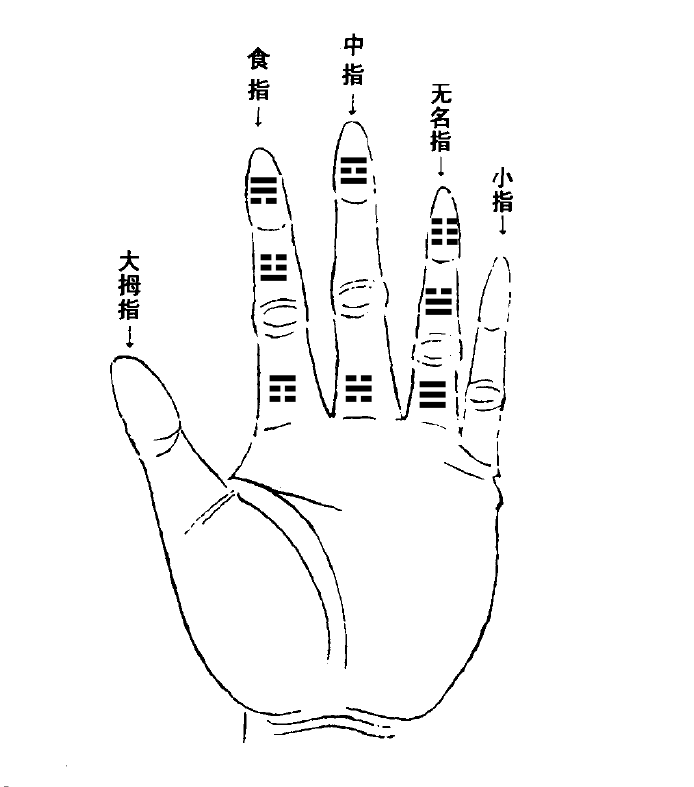
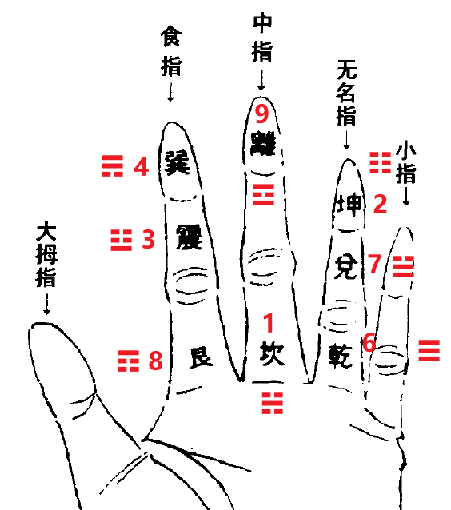

# 卦符号
而易经八卦符号则编码于杂项符号区块内：(在Macbook中输入时，要将“U”替换成“option键”。）

两仪：U+268A..U+268B（⚊ ⚋）
四象：U+268C..U+268F（⚌ 老阳， ⚍ 少阴[阳上生一阴]， ⚎ 少阳[阴上生一阳]， ⚏ 老阴）
八卦：U+2630..U+2637（☰乾 ☱兑 ☲离 ☳震 ☴巽 ☵坎 ☶艮 ☷坤）
区块
易经六十四卦符号
Yijing Hexagram Symbols[1]
Unicode Consortium 官方码表（PDF）
 	0	1	2	3	4	5	6	7	8	9	A	B	C	D	E	F
U+4DCx	䷀	䷁	䷂	䷃	䷄	䷅	䷆	䷇	䷈	䷉	䷊	䷋	䷌	䷍	䷎	䷏
U+4DDx	䷐	䷑	䷒	䷓	䷔	䷕	䷖	䷗	䷘	䷙	䷚	䷛	䷜	䷝	䷞	䷟
U+4DEx	䷠	䷡	䷢	䷣	䷤	䷥	䷦	䷧	䷨	䷩	䷪	䷫	䷬	䷭	䷮	䷯
U+4DFx	䷰	䷱	䷲	䷳	䷴	䷵	䷶	䷷	䷸	䷹	䷺	䷻	䷼	䷽	䷾	䷿
注释
1.^ 依据 Unicode 15.0
# 拼音

第一声（阴平）： ā ē ī ō ū ǖ 
第二声（阳平）： á é í ó ú ǘ 
第三声（上声）： ǎ ě ǐ ǒ ǔ ǚ 
第四声（去声）： à è ì ò ù ǜ

# 手掌

  

“戴九履一，左三右七，二四为肩，六八为足。”  

“一数坎来二数坤，三震四巽是中分，五为中宫六乾是，七兑八艮九离门。”  

  
  

## 解释四象

四象（太阳⚌、少阴⚍、少阳⚎、太阴⚏）来源于阴阳两仪的交叠。它的生成有一个固定的、自上而下的逻辑顺序：

第一层（根本）：阳（⚊）与阴（⚋）。 这是最初的“两仪”。

第二层（叠加）：在阳或阴之上，再分别叠加阳或阴。 请注意，这个叠加是从上往下读的，或者说从外向内、从先往后生成的。

我们用“/”表示“上面叠加下面”的关系：

阳 上 加 阳 = ⚌（太阳）： 可以理解为 阳 / 阳。阳气之上再加阳气，是纯阳、至阳。

阳 上 加 阴 = ⚎（少阳）： 阳 / 阴。 阳气为根、为内，阴气覆于其上、为外。内阳外阴，阳气在内被阴气包裹、压制，但它是根本，所以是 “初生之阳”。

阴 上 加 阳 = ⚍（少阴）： 阴 / 阳。 阴气为根、为内，阳气覆于其上、为外。内阴外阳，阴气在内，但外表有阳气，所以是 “初生之阴”。

阴 上 加 阴 = ⚏（太阴）： 阴 / 阴。 阴气之上再加阴气，是纯阴、至阴。
