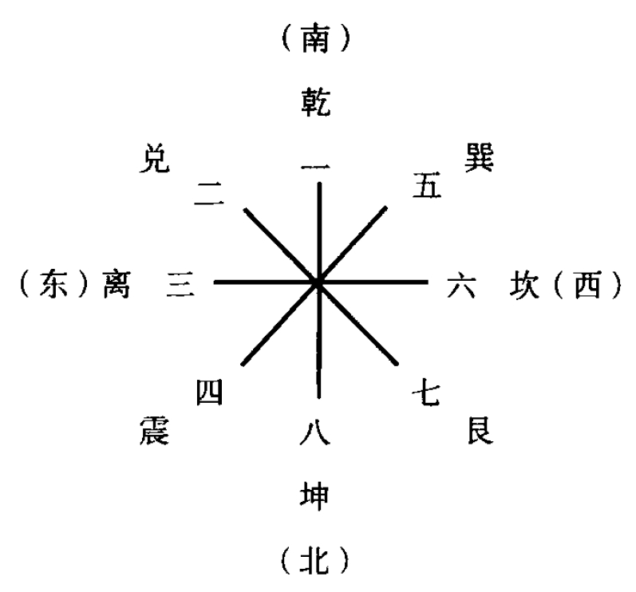
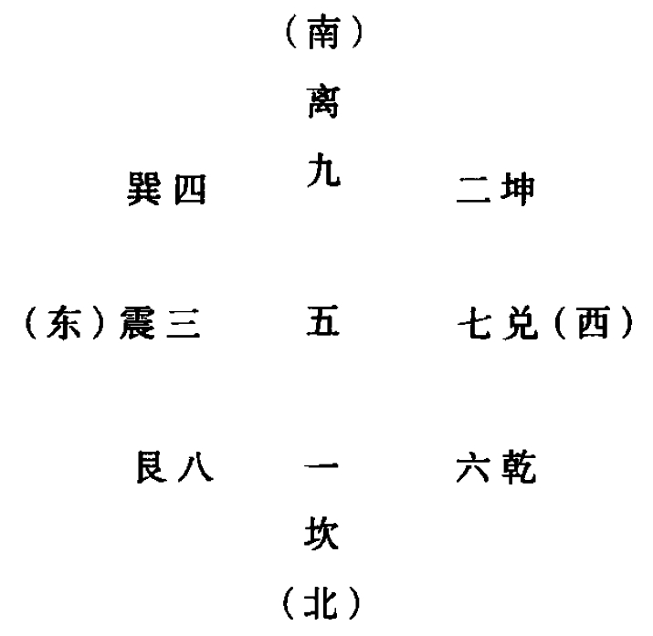

***说卦传***

# 1

**昔者圣人之作《易》也，幽赞于神明而生著，参天两地而倚数，观变千阴阳而立卦，发挥于刚柔而生交，和顺千道德而理于义，穷理尽性以至千命。**

## 【译文】

从前圣人创制《易经》，是要暗中赞助神明的作用而发明蓍草占筮，从天是奇数地是偶数出发来确定演算方式，观察阴阳的变化而设立卦，依循刚柔的活动而产生丈，协调顺从规律与功能而以合宜为依归，穷究事理探求本性直到掌握命运为止。

## 【注解】

①本章说明圣人作《易经》的用心与目的。首先肯定神明的作用极为奥妙，须由蓍草占筮才可得知其理。朱熹说：“幽赞神明，犹言赞化育。”《龟策传》曰：天下和平，王道得，而蓍茎长丈，其丛生满百茎。“蓍”是取其圆茎为策，用以占筮。  

②五个生数（一、二、三、四、五）之中，有三个奇数，两个偶数。天圆地方，天奇而地偶。因为圆周上没有对称点，所以其数为奇，而方形则有对称而为偶。所以说“参天两地”，这是《易经数理演算的出发点。“倚数”的“倚”为立，是确定之意。  

③本章谈及蓍、数、卦、爻、义、命。所谓“义”，是指合宜而正当。至于“道德”，则指天地的规律与功能。“理于义”的“理” 为动词，有整理为系统之意。最后所说的“性”为本性，万物各有其本性。“命”为命运，指万物的客观条件与注定的归趋。

# 2

**昔者圣人之作《易》也，将以顺性命之理。是以立天之道曰阴与阳，立地之道曰柔与刚，立人之道曰仁与义。兼三才而两之，故《易》六画而成卦。分阴分阳，迭用柔刚，故《易》六位而成章。**

## 【译文】

从前圣人创制《易经》，是要以它顺应本性与命运的道理。因此确立天的法则，称之为阴与阳；确立地的法则，称之为柔与刚；确立人的法则，称之为仁与义。综括天地人三才而两相重叠，所以《易经》以六画组成一卦。分开阴与阳，交替使用刚与柔，于是《易经》以六个爻位组成一卦的交错。

## 【注解】

①本章继续发挥圣人作《易经》的目的。天之道为阴与阳，这是笼罩地与人在内的两大原理。地之道为柔与刚，则显然已经落入物质世界，易于理解与分辨。  

②人之道为仁与义，表示人的生命必须以实现价值为其依归。这也是儒家的基本立场。

# 3

**天地定位，山泽通气，雷风相薄，水火不相射，八卦相错。数往者顺，知来者逆，是故《易》逆数也。**

## 【译文】

天与地上下定位，山与泽气息贯通，雷与风相互激荡，水与火背道而驰，八卦形成彼此交错的现象。推算过去，要顺序向前数； 测知未来，要逆序向后数。因此之故，《易经》是逆序而数的。

## 【注解】

①本章先谈八卦所象征的八大自然现象，大致可以分为两两相  关的四组。“薄”为近，引申为激荡；“射”为侵入，引申为往来。  

②八卦的顺数为：乾一，兑二，离三，震四，巽五，坎六，艮七，坤八。这是伏羲氏的先天八卦，其图如下：  

 
②八卦的逆数为：坎一，坤二，震三，淉四，中五，乾六， 七，艮八，离九。这是后天八卦，其图如下：  

  

# 4 

**雷以动之，风以散之，雨以润之，日以烜(xuǎn)之，艮以止之，兑以说(yuè)之，乾以君之，坤以藏之。**
## 【译文】

雷（震卦）可以振作万物，风（巽卦）可以散播万物，雨（坎卦）可以滋润万物，日（离卦）可以晒干万物，艮卦（山）可以阻止万物，兑卦（泽）可以愉悦万物，乾卦（天）可以主宰万物，坤卦（地）可以包容万物。

## 【注解】

①本章简述八卦及其所代表的现象对千万物的重大作用。“烜”为晒干，“说”为悦。  

②本章将八卦分为两组，前四句说物象，后四句说四卦，所以翻译时加注在内。依其次序可知两卦一组，仍依先天八卦的方式排列，亦即位置对立的为一组。

# 5

**帝出乎震，齐乎巽，相见乎离，致役乎坤，说言乎兑，战乎乾，劳乎坎，成言乎艮。万物出乎震，震东方也。齐乎巽，巽东南也；齐也者，言万物之絮(jié)齐也。离也者，明也；万物皆相见，南方之卦也；圣人南面而听天下，向明而治，盖取诸此也。坤也者，地也；万物皆致养焉，故曰致役乎坤。兑，正秋也；万物之所说也，故曰说言乎兑。战乎乾，乾，西北之卦也，言阴阳相薄也。坎者，水也，正北方之卦也；劳卦也，万物之所归也，故曰劳乎坎。艮，东北之卦也，万物之所成终而所成始也，故曰成言乎艮。**

## 【译文】

天帝从震位出发，到了巽位使万物整齐生长，到了离位使万物彼此相见，到了坤位使万物得到帮助，到了兑位使万物愉悦欢喜，到了乾位使万物相互交战，到了坎位使万物劳苦疲倦，到了艮位使万物成功收场。万物从震位生长出来，震卦位在东方。到了巽位万物整齐生长，巽卦位在东南方；所谓整齐，是说万物完备而整齐。离位是指光明而言；使万物都可以相见，它是南方的卦；圣人面向南方听取天下事务，面向光明来治理，大概就是取象于此。坤位是指大地而言；万物都依赖大地的养育，所以说它使万物得到帮助。兑位是正秋；是万物所喜欢的，所以说它使万物愉悦欢喜。到了乾位使万物相互交战，乾卦是西北方的卦，是说阴气与阳气在此互相接触而激荡。坎位是指水，正北方的卦；它是劳苦的卦，是万物要归藏的地方，所以说它使万物劳苦疲倦。艮位是东北方的卦，物在此成功结束又重新开始，所以说它使万物成功收场。

## 【注解】

①“帝”有二解。一是以“帝” 为北极星，此星在古代有“帝”之称。如此则本章所述为依循后天八卦，配合天文地理，再推及人世间的某种规律。二是以“帝”为万物之造化者，其位阶显高于乾卦。在此，不妨视之为造化万物的力量，或根本的元气。  

②本章分为两层，第一层简述震、巽、离、坤、兑、乾、坎、艮的不同功能，此为后天八卦的位序。第二层则引巾说明前面的述，并且明确界定了各卦的方位与顺序，值得仔细研读。

# 6

**神也者，妙万物而为言者也。动万物者莫疾乎雷，万物者莫疾乎风，燥万物者莫焕(hàn)乎火，说万物者说乎泽，润万物者莫润乎水，终万物始万物者莫盛乎艮故水火不相逮，雷风不相悖，山泽通气，然后能变化，成万物也。**

## 【译文】

所谓神，是就万物的奥妙而说的词语。震动万物，没有比雷更捷的；曲挠万物，没有比风更快速的；干燥万物，没有比火更炎的；取悦万物，没有比泽更有效的；滋润万物，没有比水更潮湿的使万物终结又重新开始，没有比山更宏大的。所以水火不相容纳，风不相背离，山泽气息贯通，然后才能出现变化，生育成就万物。
 

## 【注解】

②“神”字在此得到明确的界说，指的是万物的神奇奥妙，尤其是其中变化之难以预测。   

②本章就六大自然现象对万物的作用，说明它们何以可用之为一切变化之示范。此处未谈乾与坤，因为这两者代表天与地，有如造成一切变化之父母。

# 7

**乾，健也；坤，顺也；震，动也；巽，入也；坎，陷也；离，丽也；艮，止也；兑，说也。**

## 【译文】

乾为刚健，坤为柔顺，震为震动，巽为进入，坎为下陷，离为附丽，艮为阻止，兑为喜悦。

## 【注解】

①此为八卦的属性，人类的视角已经从自然现象本身转移至这种自然现象的特性，并且与人类生活产生了联系。  

②我们在理解六十四卦时，要以这八种属性作为认知的基础，再辅以后续的各种取象。在此所谈的顺序又回到了先天八卦，以两两相对的方式呈现，并且自此以后皆依此序。
 
# 8

**乾为马，坤为牛，震为龙，巽为鸡，坎为豕，离为雉，艮为狗，兑为羊。**

## 【译文】

乾是马，坤是牛，震是龙，巽是鸡，坎是猪，离是野鸡，艮狗，兑是羊。

## 【注解】

①乾为马，马能健行。坤为牛，牛性温顺，又能负重致远。震为龙，则因震为东方之卦，而古代四象以苍龙居东。巽为风，古 风神皆为鸟形，鸡属鸟类。  

②坎为水，而猪喜潮湿，《贾子· 胎教》有“彘者，北方之牲也”的说法。离为南方之卦，而古代四象以朱雀居南，所以说它是雉。艮为狗，狗能看守家门，阻人入内。兑为羊，在西部草原的沼泽边大最牧养。以上各种说法仅供参考，并非定论。

# 9

**乾为首，坤为腹，震为足，巽为股，坎为耳，离为目， 艮为手，兑为口。**

## 【译文】

乾是头，坤是肚子，震是脚，箕是腿，坎是耳朵，离是眼睛， 艮是手，兑是口。

## 【注解】

①这是以八卦配合人的身体部位所作的说明。乾为主宰，理当在头。坤能容纳，成为肚子。震为动，指涉双脚。巽为风行，有如股腿。
②坎能积水，有如耳能聚声。离为光明，有如目之能视。《淮南子·精神训》说：“耳目者，日月也。”艮为手，人手可以止物。兑为泽又为口，因为人口可吞吐如泽。以上说法亦仅供参考。

# 10

**乾，天也，故称乎父；坤，地也，故称乎母。震一索而得男，故谓之长男。巽一索而得女，故谓之长女。坎再索而得男，故谓之中男。离再索而得女，故谓之中女。艮三索而得男，故谓之少男。兑三索而得女，故谓之少女。**

## 【译文】

乾卦象征天，所以称为父；坤卦象征地，所以称为母。震卦是坤卦从乾卦索取到笫一个阳爻而生出的男孩，所以称为长男。巽卦是乾卦从坤卦索取到笫一个阴爻而生出的女孩，所以称为长女。坎卦是坤卦从乾卦索取到笫二个阳爻而生出的男孩，所以称为中男。离卦是乾卦从坤卦索取到笫二个阴爻而生出的女孩，所以称为中女。艮卦是坤卦从乾卦索取到笫三个阳爻而生出的男孩，所以称为少男。兑卦是乾卦从坤卦索取到笫三个阴爻而生出的女孩，所以称为少女。

## 【注解】

①乾坤象征天地，进而象征父母。乾坤生六子，所指原是自然界的六大现象，现在亦可用于人类家庭的成员。  

②震（☳）为长子，因为阳交居初位，象征首生之子。其形则如坤卦向乾卦索取一阳，其余子女皆可依此类推。
 
# 11

**乾为天，为圜(yuán), 为君，为父，为玉，为金，为寒，为冰，为大赤，为艮马，为老马，为痔马，为驳马，为木果。**   

**坤为地，为母，为布，为釜，为吝啬，为均，为子母牛，为大舆，为文，为众，为柄，其于地也为黑。**

## 【译文】

乾卦的象包括：天，圆形，君主，父亲，玉，金，寒，冰，大红色，艮马，老马，瘦马，杂色马，植物果实。  

坤卦的象包括：地，母亲，布帛，锅，吝啬，均匀，小母牛， 大车，文采，众人，握柄，就地而言是黑色的。  

震为雷，为龙，为玄 黄，为旉(fū)为大涂，为长子，为决躁，为苍茛(láng)竹，为萑(huán)苇。其于马也，为善鸣，为馵(zhù)足，为作足，为的(dì)颡(sǎng)。其于稼也，为反生。其究为健，为蕃鲜。  
巽为木，为风，为长女，为绳直，为工，为白，为长，为高，为进退，为不果，为臭(xiù)。其于人也，为寡发，为广颓，为多白眼，为近利市三倍。其究为躁卦。

## 【译文】

震卦的象包括：雷，龙，青黄色，展开，大路，长子，急躁， 青色的竹子，芦荻苇子。就马而言，是善鸣，后左蹄白色，抬足而动，白额头。就禾稼而言，是反向而生。变到最后是刚健的乾卦，茂盛鲜洁的巽卦。  

巽卦的象包括：木，风，长女，准绳，工巧，白色，长，高， 进退不定，没结果，有气味。就人而言，是头发少，大脑袋，白眼多，近利市三倍。变到最后是急躁的震卦。  

# 12

**坎为水，为沟渎，为隐伏，为矫鞣，为弓轮。其于人也，为加忧，为心病，为耳痛，为血卦，为赤。其于马也，为美脊，为亟(jí)心 ，为下首，为薄蹄，为曳。其千舆也，为多眚，为通。为月，为盗。其于木也，为坚多心。**  

**离为火，为日，为电，为中女，为甲胄，为戈兵。其于人也，为大腹。为干卦，为鳖，为蟹，为嬴(luǒ),  为蚌，为龟。其于木也，为科上搞。**

## 【译文】

坎卦的象包括：水，沟渠，隐伏，可曲可直，弓或车轮。就人而言，是忧愁多，心病，耳痛，血象，红色。就马而言，是美脊， 心急，低头，薄蹄，肯拉车。就车而言，是多灾难，通行。月亮， 强盗。就树木而言，是坚实多刺。  

离卦的象包括：火，日，电，中女，盔甲，戈兵武器。就人而言，是大肚子。干燥之象，鳖，培蟹，蚌蛉一类的东西，蚌，龟。就树木而言，是树叶脱落而枯搞。

艮为山，为径路，为小石，为门阙，为果蓏(luǒ) , 为阍(hūn)寺，为指，为狗，为鼠，为黔喙之属。其于木也，为坚多节。
 
兑为泽，为少女，为巫，为口舌，为毁折，为附决。其于地也，为刚卤。为妾，为羊。

## 【译文】

艮卦的象包括：山，小路，小石，门阙，瓜果，守门人，手指狗，鼠，黑嘴禽兽。就树木而言，是坚硬多节。  

兑卦的象包括：泽，少女，巫现，口舌是非，毁折，脱落。地而言，是坚硬多咸。妾，羊。  

