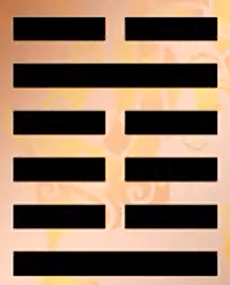
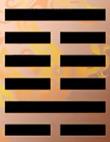
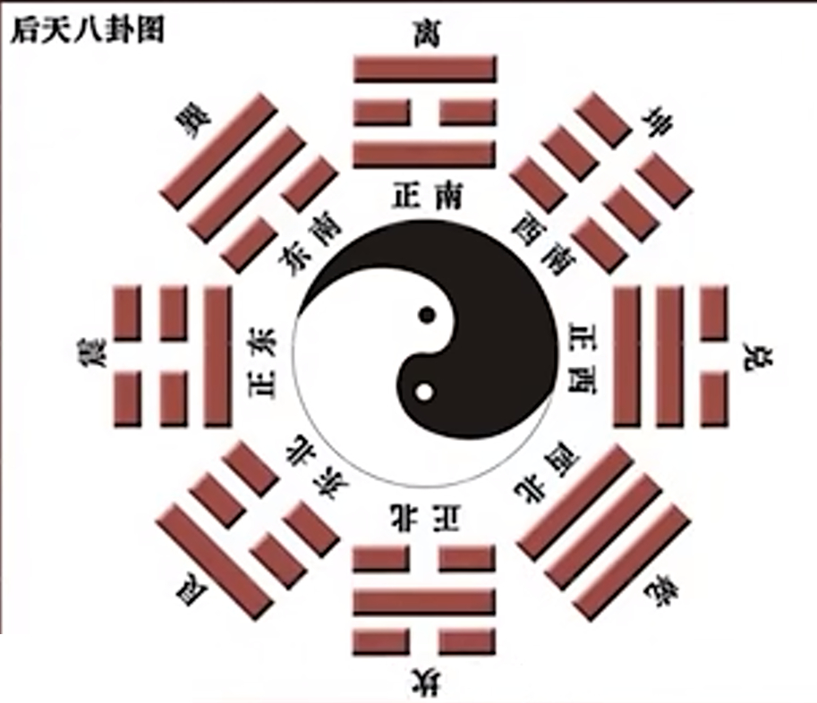
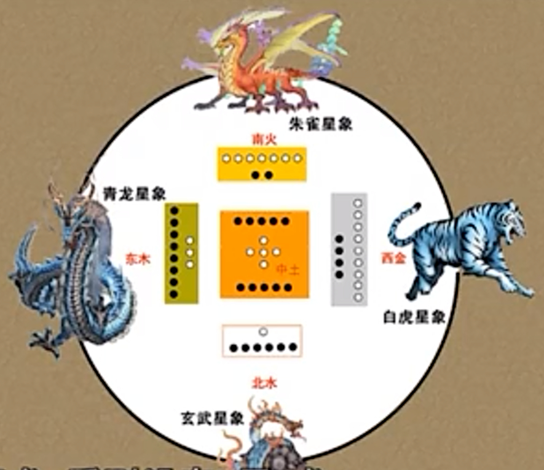
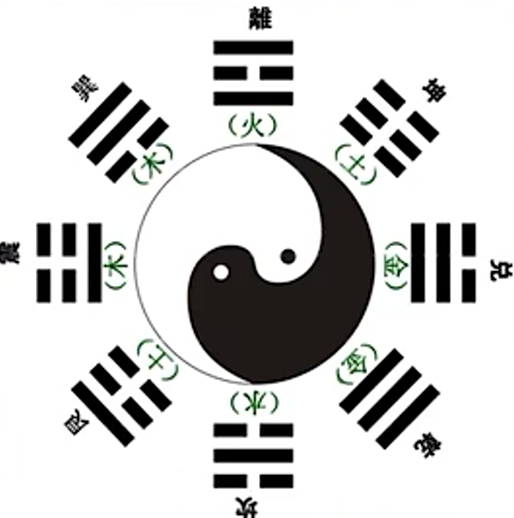
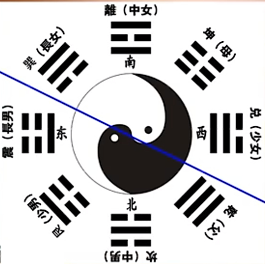

***02坤卦䷁***   

~~卦的关系，有两种：非覆即变[非综zòng即错，一个意思]。易经共六十四卦，可以分三十二组。每两卦中第一卦和第二卦的关系也是非覆即变。~~   

~~覆就是整个翻过去，屯卦（水雷屯），下一卦，蒙卦（山水蒙）~~  

~~乾，坤，离，坎。这四个卦他们的覆卦都是他们自己~~   

~~卦变指的是，将来看这个卦的时候，有本卦，有之卦(由“本卦”的一个或多个爻发生变动后，所生成的新卦象。)，卦的变化。~~   
 
# 六爻递进

（遇到不好的事情、消极的事情） 

【用六】始终如一地以柔顺辅佐乾刚  

- ⚋ 穷极期（*穷极则争*）
- ⚋ 尊贵期（*谦*逊居尊）
- ⚋ 审*慎*期（慎言）
- ⚋ *内含*期（内含光华）
- ==⚋== *彰显*期（坚守*本性*，平直、端方、广博）
- ⚋ *见微*期（洞察先机）

# 【2 · 1】

**坤。元亨，利牝（pìn）马之贞。君子有攸往 ~~攸者所也，有所往~~ ，*先*迷*后*得主。利西南得朋，东北丧朋。安贞吉。**

## 【译文】

坤卦。开始，通达，适宜==像母马那样的正固==。 ~~《乾》：不言所利大矣哉。乾卦有利于万物，而坤卦只利牝马之贞。乾卦用马来代表，而这里坤卦指牝马母马，特别温顺，一般人说坤完全被动，但这里有一点很重要，完全被动代表*完全跟着主动走*，这也需要健行（否则跟不上）。这里举了上课做例子，跟着上课上到最后也不简单。~~ 君子有所前往时，==领先而走会迷路，随后而走会找到主人。== ~~表示不能起带头作用，只能随从跟从（我觉得这里和谦卦的创始形成了鲜明的对比）~~ 有利于==在西南方得到朋友，并在东北方丧失朋友。== ~~这里说，坤卦表示女性(/阴性/弱势/相对较弱)，这句话是说女性(/阴性/弱势/相对较弱)在结婚前有很多好朋友，但是在东北方可以找到主人（却失去朋友）~~ 安于正固就会吉祥。

***后天八卦图：***   
  

***青龙白虎：***  
====  

***五行和八卦配合***（作用，相生相克）  
  
 
## 【注解】

“元”只有在乾卦是指创始，在其他卦则是指开始。不过==坤卦的“元”==特别是指==继创始之后的*最初生成作用*==。这一点在《彖传》会有所说明。万物生成之后所形成的整体，自然也是==通顺畅达==的。==*相对*==于乾为天，坤是地，是万物之母。

坤卦异于乾卦之处，是“利牝马之贞”，而不是普遍的利贞。牝马是母马，柔顺而健行，所以取为象征。在此，牝马象征==坤道有如大地，顺着天的法则健行不已==，又能==养育==万物。

“君子有攸（所）往”时，要参考坤卦的随顺，而==不能率先带头==。随顺在后，则会找到主人，亦即以乾卦为其依归。《易经》有==阳先阴从==的观念。

西南是阴方，坤可以找到同类；东北是阳方，虽然失去同类，但获得了主人。因此以上二者皆为有利。关于方位，在此可参考《后天八卦图》：==西南皆为阴类，东北则属阳类。==

***方位***

  

 ~~西南方有巽卦，离卦，（坤卦），兑卦，都是柔顺的阴性卦~~  
 
 ~~东北方有震卦，艮卦，坎卦，乾卦，都是阳刚的卦~~  

# 【2 · 2】

 ~~再一次说明一下，彖传专门来研究、解释卦辞~~ 

**《彖》曰：至 ~~至：至广~~ 哉坤元 ~~乾卦是大哉乾元~~ ，万物资生 ~~万物借它而得以生成~~ ，乃顺承天。坤厚载物，德合无疆 ~~德：功能，大地的功能~~ 。含弘光大 ~~包容宽裕而广阔远大~~ ，品物咸亨 ~~亨：通顺畅达~~ 。牝马地类，行地无疆，柔顺利贞。君子攸行，先迷失道，后顺得常。西南得朋，乃与类行；东北丧朋，乃终有庆。安贞之吉，应地无疆。**

## 【译文】

《彖传》说：至广啊！坤卦所象征的元气，万物借它而得以生成，它也==由此顺应了天体==。坤卦代表的大地以其厚重来==承载万物==，功能也==响应了无边无际的需求。==它包容宽裕而广阔远大，使各类物种都通顺畅达。母马是属于大地的生物，驰行大地而没有疆界，性格柔顺而适宜正固。君子在前进时，率先行动会迷惑而失去正道，==在后随顺就可以获得恒常法则==。在西南方得到朋友，是指==*伴随同类前进*==；在东北方丧失朋友，是指==*最终会有喜庆*==。安于正固的吉祥，在于==配合大地而没有疆界==。

## 【注解】

从坤卦开始，都是在卦辞之后，接上《彖传》与《象传》（《大象》）。然后是分述各爻爻辞。各爻的《象传》（《小象》）则直接附于其爻辞之后。

“至哉坤元”，“至”有微妙无比之意，在此译为至广，是为了配合地的属性；“坤元”，乾与坤称“元”，有如父与母，代表原始的生命力。由此可知，《易经》在以乾为首时，并未忽略要靠乾坤并建、阳与阴合作，才可充分说明万物生成变化之理。乾是“资始”，坤是“资生”；乾是“统天”，坤是“顺承天”，各有功能，不可或缺。我们以天地为万物之父母，即出于类似观点。

坤卦六爻皆阴，所象征的是==无比的承受力与柔顺度==。这正是与天相对应的地。像母马那样，既能健行又至为柔顺，如此恒常坚持，就是它的“利贞”所在。换言之，这种柔顺其实也是一种刚强。君子效法坤卦，随顺而行，但仍可“得常”。

“西南得朋”与“东北丧朋”各有其利。譬如，女子年轻时有众多同性朋友，后来离开众友而与男子成亲，二者皆利。朱震说：==“得君者，臣之庆；得亲者，子之庆；得夫者，妇之庆。庆者，未有不离其朋类而得者也。==”由此可知，乾与坤（阳与阴）的关系是可以应用在多重人际关系上的。一般而言，阳主阴从，阳先阴后，阳为主动者，阴为受动者。==坤卦以“安贞”为吉，其故也在此。==

# 【2 · 3】

**《象》曰：地势坤 ~~坤：顺~~ ，君子以厚德载物。**

## 【译文】

《象传》说：==*大地的形势顺应无比*==，君子因而厚植自己的道德来承载万物。 ~~这里物包括了人~~ 

## 【注解】

《大象》是解说全卦的。坤卦由下坤上坤组成。它所代表的是地，而其性质则是顺。

相对于==乾卦的“自强不息”，坤卦是“厚德载物”== ~~这里说的很鲜明对比，乾是自强，对内，对自己。而坤则是载物，对外。即严于律己宽于待人。~~ 。两者搭配，则==过程与目的== ~~难道这里说，自强不息为的是厚德载物？突然发现这个厚德载物德解释，层次高了许多，即万物资生，万物借它而得以生成~~ 同时显现，而君子的人生规划也十分清楚。

# 【2 · 4】

**初六。==履霜，坚冰至==。**
 ~~*《乾》：初九。==潜==龙勿用。*~~ 

《象》曰：履霜坚冰，阴始凝也。驯致其道，至坚冰也。

## 【译文】

初六。脚下踏着霜，坚冰将会到来。 ~~见微知著。这里举了周公和姜太公的对话预示鲁国日后的弱小，及陈氏代齐~~ 

《象传》说：脚下踏着霜，坚冰将会到来，这是因为霜是阴气开始凝结。循着此一规律发展下去，就会出现坚冰。

## 【注解】

坤卦第一爻是阴爻，称为“初六”，位居最下，有如人之足，所以用“履”字。霜是稀薄的碎冰，看似微不足道，但是见微知著，可以判断将有坚冰。

程颐说：“犹小人==始虽甚微，不可使长，长则至于盛也==。”==《易经》常以阴爻比拟小人==，可供参考。

# 【2 · 5】--主爻，居中且正

**六二。直方大，不习，无不利。**  

 *~~《乾》：九二。见龙在田，利见大人。~~* 

《象》曰：六二之动，直以方也。不习，无不利，*地道光也*。

## 【译文】

六二。==直接==产生，遍及==四方==，==广大无边==，不必修习，无不有利。

《象传》说：六二这一爻的活动，是直接产生而可以遍及四方。不必修习却*无不有利*，是因为*大地之道广大无边*。

## 【注解】

六二居下卦之中，又是阴爻居柔位，并且二是地位，所以是最足以代表全卦之爻。爻辞无异于对坤卦作为“地道”的描述。

古人认为天的运动是圆环状，地的运动是直线状，由此形成天圆地方的观念。孔颖达云：“生物不邪，谓之直也；地体安静，是其方也；无物不载，是其大也。”换言之，“直”是==万物各自依其条件直接产生==，==只要条件成熟就自然出现了==。能够如此，才会==使万物遍及四方，由此造成广大无边的大地现象==。“地道光也”的“光”通“广”。

“地道”是“直方大”，==君子在效法时，“直”代表真诚，“方”代表方正，“大”代表包容。==对内*真诚*而对外*方正*，互为表里，而根本态度则是包容。“习”是不必刻意修习或修治，顺其自然就可以了。“无不利”之意是无不有利（而不只是没有不利），如此文义较顺并且符合“地道”的性质。

# 【2 · 6】

**六三。含章可贞。或从王事，无成有终。** ~~这里涉及到社会结构，初爻代表士（读书人，政府基本任职），接下来是--大夫，公卿，诸侯，天子，祖庙（祖先）~~ 

 *~~《乾》：九三。君子终日乾乾，夕惕若，厉，无咎。~~* 

**《象》曰：含章可贞，以时发也。或从王事，知光大也。**

## 【译文】

六三。蕴涵文采而可以正固。或者跟随君王做事，==没有功业却有好的结局。==  ~~原因是到三已经成一个坤卦。说没有功业是提醒你不要居功，当你不在九五位置时，功劳一定（要认为）属于上面~~ 

《象传》说：蕴涵文采而可以正固，是要等待时机再作发挥。或者跟随君王做事，是因为智虑周延而远大。

## 【注解】

六三进入人位，相较于天位而言，它代表了臣道。此外，六三处于==下卦之上，必须待时而动。==  

此时虽有文采（亦即德行可观），也要正固守之，等待时机成熟。

“或从王事”的“或”字，代表可能性，这是配合六三的位置而言。==如果真有这种机会，也须“无成”，不谈功业，要将荣耀归于君王，如此才会“有终”。==处于危疑变动之际，最需要的就是“知光大也”。“光”字通“广”。

由全卦看来，六三已经形成一个单卦的坤，具有坤的基本德行，但是因为处于下卦，所以合而言之是“含章可贞”。其次，==六三尚未形成完整 ~~是指六爻坤卦~~ 的坤卦（无成），但是下卦已经走到终点（有终）。==

# 【2 · 7】

**六四。括囊 ~~更加收敛~~ ，无咎无誉。**

 ~~《乾》：九四。或跃在渊，无咎。~~ 

**《象》曰：括囊无咎，慎不害也。**

## 【译文】

六四。扎起口袋，没有灾难也没有称誉。

《象传》说：扎起口袋而没有灾难，是因为谨慎所以没有祸害。

## 【注解】

六四开始进入上卦，处境危疑不安，最好==*加以*==收敛。“括囊”是不管才华如何杰出，也须扎起袋口，不要外露，像守口如瓶一般谨言慎行。

如此，自然可以“无咎”，但是相对的也==不会有任何称誉。==如果==与乾卦的九三与九四对照==  ~~所以坤卦里我把谦卦的爻辞也复制过来了。我觉得如曾仕强教授所言，乾坤两卦是一体的，任何时候阴阳都是同时存在的，须一起看。~~ ，可知处在三、四这二爻能做到“无咎”，就应该满意了。

# 【2 · 8】

**六五。黄裳，元吉。**

**《象》曰：*==黄裳元吉==*，文在中也。**

## 【译文】

六五。黄色的衣裙，最为吉祥。

《象传》说：黄色的衣裙，最为吉祥，是因为既有文采又居于中位。

## 【注解】

六五是==阴爻居阳位，并且是中位。==这时应该怎么办？“黄”是中色，依后代的五行之说，==黄是土之色，并且位居中间==（东为木，青色；南为火，红色；西为金，白色；北为水，黑色；中为土，黄色）。“裳”是下身之衣（古代所谓的==衣裳，是指*上衣下裳*==），所以译为衣裙。六五居中位，所以穿上黄色（中色，又是土地之色）的裳。==裳是下衣，表示阴之顺阳，不敢居上位。==因此，配合大地之色，又是居中的黄色，穿上黄色衣裙，可谓完全符合坤卦的角色，因此称为“元吉”。==*“元吉”的美好程度最高，超过了“大吉”。*==  ~~坤卦里六爻皆阴，它本身是一个天地，在这个里面没有任何一个阳爻出现，那我六五为什么不能够称王称天子，可以的，因为那个位置本来就是你负责。但是你也知道自己是阴爻，自己在坤卦，那就采取适当方式，才能元吉！~~ 

==如果在此没有采取“黄裳”，则后果不堪设想。这无异于以臣代君，以妇代夫，“元吉”可能成为大凶。==至于“文在中也”，则再度强调==有文采而能守中==的重要。

# 【2 · 9】

**上六。龙战于野，其血玄黄。** ~~带血，凶~~ 

**《象》曰：龙战于野，其道穷也。** ~~穷：尽头~~ 

## 【译文】

上六。==*龙在郊野争战*==，它的血是青黄色的。

《象传》说：龙在郊野争战，是因为它的路已经到了尽头。

## 【注解】

上六是坤卦完成的一爻，此时==六爻皆阴，阴气盛极，也可以称为龙==。它与象征乾卦的龙在郊野（上六居六爻最外，有如在大地的边远地区）作战。 ~~这里是说阳爻在外面等着要进来，我觉得有点像从十二消息卦的角度来分析，坤是六爻皆阴，接下来就是复卦䷗~~ 

“玄”为青，是天色；“黄”是地色。“血”是受伤之证，表示==阴爻在让位之前的挣扎，出现交接之际的玄黄混杂阶段==。 ~~两败俱伤~~ 

乾卦上九爻辞说“亢”，坤卦上六象辞说“穷”，都在提醒我们==上位是个结束==，必须==改弦更张。只有变化才可能找到新的出路，也才可能让生命力持续发展。==

# 【2 · 10】

**用六。利永贞。**

**《象》曰：用六永贞，以大终也。**

## 【译文】

用在坤卦整体。==适宜永久正固。==

《象传》说：用在坤卦整体可以永久正固，是因为它是大的终局。

## 【注解】

“用六”有如乾卦的“用九”，是《易经》中仅有的两句附加象辞。由于坤卦六爻皆阴，就以“用六”说明如何应用于全卦。由于坤卦本性==柔顺==，所以须由“永贞”而有利。 ~~坚持、稳定地跟着别人后面走~~ 

乾为始，坤为终。==乾创始万物，坤接纳万物，犹如大地让一切安顿，把上天所造的一切都加以完成。==为了扮演此一大的终局，则要靠“永贞”。

# 【2 · 11】

**《文言》曰：坤至柔而动也刚，至静而德方。后得主而有常，含万物而化光。坤道其顺乎，承天而时行。**

## 【译文】

《文言传》说：坤卦==最为柔顺，但活动时却是刚健==的；==最为静止，但功能遍及四方。 ~~这里再次说明了乾坤一体~~ ==它随后而走才找到主人，但却有恒常法则；包容万物，并且化育广大。坤卦的原理就是顺应吧，它==顺承天体==并且按照时序运行。

## 【注解】

《文言传》只论乾坤二卦，无异于==揭示纯阳与纯阴的性质、功能及启发。==对于理解其余六十二卦的阴阳关系是不可或缺的。

《易经》有一套相对观，就是==*以阳表示动、刚、圆、开，以阴表示静、柔、方、合*==，但是阳与阴并非截然二分，而是==*彼此相含*==，有如太极图中的*阴阳鱼*（阴鱼有阳眼，阳鱼有阴眼）。以坤卦为例，它是至柔的（顺承天体），但活动却依然刚健（按时序进行而不曾中止）；它是至静的（宛如没有任何变动），但功能却遍及四方。在此，“德方”常被译为德行方正，这是联想到人的修养功夫，离本段主题稍远。

最能代表坤卦的是六二，配合六二爻辞的“直方大”，可知本段所指：“动也刚”是描写 *“直”（直接产生）*，“德方”是描写 *“方”（遍及四方）*，“化光”是描写 *“大”（广大无边）*。最后谈及“坤道”时，再回归到《彖传》的主旨。==本段*以下*分别述及各爻，则发挥《象传》主旨，其中着重*君子*所得之启发。==这也是我们不把本段的“德方”译为德行方正的原因之一。

“承天而时行”一语中的“天”，是指天体或天体的运行法则（此时可称为天道）。在此若使用“天道”一词，必须强调其自然义，否则“时行”二字失去对应。

# 【2 · 12】

**积善之家，必有余庆；积不善之家，必有余殃。 ~~家庭关系~~ 臣弑（shì）其君，子弑其父，非一朝一夕之故，其所由来者渐矣，由辩之不早辩也。《易》曰：“履霜，坚冰至。”盖言顺也。**

## 【译文】

（初六）积累善行的人家，必定会有多余的吉庆留给后代；积累恶行的人家，必定会有多余的灾祸留给后代。像臣子杀害国君，儿子杀害父亲这种大罪，其原因不是一天之内突然发生的，而是长期逐渐累积形成的，只是由于没有及早辨明罢了。《易经》说：“脚下踏着霜，坚冰将会到来。”说的就是==循着趋势发展==的现象。

## 【注解】

从人的性格养成，到社会各种现象，都是逐渐形成的，所以对于恶行要防微杜渐。等到出现重大祸害，就来不及了。因此，要留意趋势与方向，早作防备。

“积善之家”一语，是由上述趋势观点来强调“积”的重要，并且以“必有”来下断语，提醒人们多加注意。不过，==所谓的善恶，若以家为单位，则每一个人作为行动主体与道德主体的角色，将会显得模糊。==一方面，长期下来，每一家的善恶在加加减减之下可能差不太多；另一方面，后代子孙由于家有余庆或余殃，那么他==个人的角色与责任==如何界定呢？结果可能变成：每一个人都须为祖先及子孙负责，却反而忘记了==对自己负责才是人生的重点==。 ~~这里对于家与个人我不是很理解。视频说个人作用没凸显出来，但我觉得古人一直也有“修身齐家治国平天下”的思想，说明也知道个人的作用~~ 

# 【2 · 13】

**直其正也，方其义也。君子*敬以直内* ~~敬：严肃~~ ，*义以方外*  ~~方：规范。外：表现。~~ ，敬义立而德不孤。直方大，不习，无不利，则不疑其所行也。**

## 【译文】

（六二）直接产生，是说它的正确*模式*；遍及四方，是说它的适当*表现*。君子以*严肃*态度持守内心的真诚，以*正当*方式规范言行的表现。做到==既严肃又正当，他的德行就不会孤单==了。直接产生，遍及四方，广大无边，不必修习，无不有利。这样就==不会疑惑自己的所作所为==了。

## 【注解】

由“直其正也，方其义也”一语，可知是==到了《文言传》，才推衍出爻辞的道德意义==。由直接（直）与正确（正），推及严肃（敬）与内心真诚（直内）；由四方（方）与适当（义），推及正当（义）与规范言行（方外）。而“德不孤”即是“大”的效应。这种效应将会==自动出现==，所以可以“不疑其所行”。

《论语·里仁》：“德不孤，必有邻。”如果深思此语，可知其前提是==人性向善==，所以有德者必定引发人心的支持。《论语·雍也》也记载孔子的话：“人之生也直，罔之生也幸而免。”在此的“直”是指真诚而正直。可供参考。

# 【2 · 14】

**阴虽有美，含之，以从王事，弗敢成也。地道也，妻道也，臣道也。*地道无成，而==代==有终也*。**

## 【译文】

（六三）阴性角色虽有美好条件也要隐藏起来，以这种态度跟随君王做事，不敢成就什么功业。这是地的法则，妻的法则，臣的法则。地的法则并不成就什么，只是代替天去完成好的结局。

## 【注解】

古人的阴阳观念在此说得较为明确。属于阳性的有天、夫、君，阴性则有地、妻、臣。这是==*相对而相成*==的想法，彼此相需而各有功能。此外，阴阳角色是多重而复杂的。譬如，==一男子为臣，则属阴；为夫，则属阳。==

“地道”的“无成”有三种可能：==*一、真正没有成就；二、有成就而不自居；三、不敢有所成就（弗敢成）。在此，还有第四种可能，就是它的成就是完成天所开始的工作，让一切顺利终结。*==

# 【2 · 15】

**天地变化，草木蕃。*天地闭，贤人隐*。《易》曰：“括囊，无咎无誉。”盖言谨也。**

## 【译文】

（六四）天地之间变化不已，草木滋长茂盛。*天地之间闭塞不通，贤人就会隐退。*《易经》说：“扎起口袋，没有灾难也没有称誉。”说的就是要谨慎啊。

## 【注解】

“天地变化”是指阴阳二气交感流通，连草木都茂盛，何况人世间？但是遇到“天地闭”，万物凋零，==贤人就应该隐遁，表示小心谨慎==  ~~因为阴爻收敛，没有动力。这里天也可解释为天子，而地可相对应解释称百姓。~~ 。

人的出处进退，要==考量时势==。==孟子推崇孔子为“圣之时者也”==（《孟子·万章下》），认为这是最高明的圣人。

# 【2 · 16】

**君子黄中通理，正位居体，美在其中，而畅于四支，发于事业，美之至也。**

## 【译文】

（六五）君子采用==黄的中色==，表示他明白道理；坐在正确的位置上，表示他==处世安稳==；他内心蕴涵的美德，流通在身体的行动中，再展现于他所经营的==事业==上，这真是美德的极致啊。

## 【注解】

坤为地，六五为中，而黄色正是属地的中色。君子明白道理，由此可见六五居中为正，君子立身安稳。

“美在其中”是含蓄之德，内在有源头活水，才会真诚而自动地显示于行动中，再扩及他的事业。==古人以所*经营*的为“事”，*经营成功*的为“业”。==“美之至也”一语，表示美德以实践出来为最理想。

# 【2 · 17】

**阴疑于阳必战。为其嫌于无阳也，故称龙焉。犹未离其类也，故称血焉。夫玄黄者，天地之杂也。天玄而地黄。**

## 【译文】

（上六）阴气==受到阳气猜疑==，必然发生争战。由于==阴气猜测 ~~猜测：自以为。~~ 没有阳气存在，所以也称它为龙。==但是阴气尚未离开它的类别，亦即阴无法胜过阳，所以用流血来描写。至于玄黄（青黄），那是天地混杂的颜色。*天是青色，地是黄色。*

## 【注解】

到了上六，六爻皆阴，阴气盛极，必然会受到相对的另一元素——阳气——的猜疑，因而发生争战。此时，阴气以为根本没有阳气，所以可以称之为龙。这是双龙争霸的局面。

不过，阴气毕竟仍是阴气，==依其类别就无法胜过阳气，相斗的结果只能用“血”来描写。==换言之，==极盛的阴气与*蓄势待发*的阳气，仍只是战个平手==而已。“其血玄黄”一语，表示两败俱伤。*既然如此，还是放弃独大的心态，让阴阳二气合作来演变后续的六十二卦吧。*

