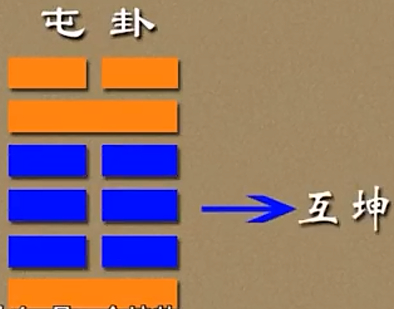
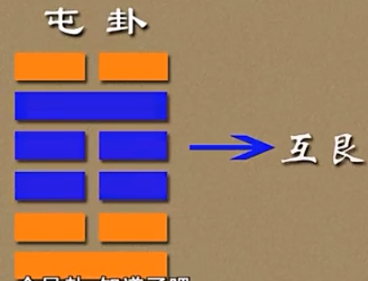

***03屯卦䷂***  

~~有天地然后万物生焉。盈天地之间者，惟万物，故受之以屯。屯者盈也。屯物之始生也。《序卦》~~  
~~屯见而不失其居。《杂卦》~~   

~~易经中的象，是自然界中千变万化的现象，易经中的理是不变的规律。我们==通过象来探究卦中之理==。~~  

# 六爻递进

- ⚋困穷之*极*——悲泣无援
- ⚊施为之*度*——小施则吉
- ⚋合作之机——*求贤*共济
- ⚋妄动之诫——*知*机而*止*
- ⚋进取之艰——守贞*待时*
- ==⚊==创始之*基*——守正固本

# 【3 · 1】

**䷂ 屯（zhūn）。元亨利贞。勿用有攸往，利建侯。**

## 【译文】

屯卦。开始 ~~注意，这里不是创始~~ 、通达、适宜 ~~只指利建侯~~ 、正固。不要有所前往，适宜建立侯王。

## 【注解】

屯卦是下震上坎，亦即“水雷屯”。《序卦》说：“盈天地之间者唯万物，故受之以屯。屯者，盈也；屯者，物之始生也。”

“元”在此是指开始，而==不是乾卦的创始，也异于坤卦的生成==。屯卦象征万物开始出生的阶段，这种生命力将会使万物充满天地之间，进而通顺畅达，并且显得适宜而正固。“元亨利贞”是卦的四德，这四者只有==在乾卦是充分而完美==的意义，在其他各卦则是具体而微，并且各有其限制。譬如，屯卦的“利”是指“建侯”而言。

“勿用有攸往”，此时==万物刚刚出现==，一切都在动荡之中，人们==没有必要到处奔走，却反而适宜安定下来==，建国立侯。

# 【3 · 2】

**《彖》曰：屯，刚柔始交而难生。动乎险中，大亨贞 ~~大：使一切……~~ 。雷雨之动满盈，天造草昧。宜建侯而不宁。**

~~《易经·序卦传》：盈天地之间者唯万物，故受之以屯，屯者，盈也。屯者，物之始生也。~~  ~~--屯代表满，盈~~ 

## 【译文】

《彖传》说：屯卦，阳刚之气与阴柔之气开始交流，困难随之而生。在险厄中活动不已，要使一切通达而正固。打雷下雨遍布各地，上天的造化仍在草创冥昧的阶段，==适宜建立侯王==，并且勤奋努力不休。

## 【注解】

“刚柔始交”，在卦象上是指阳爻与阴爻开始交错搭配，所指即是二气交流开始具体产生万物。这时的困难是指==万物始生之不易==。

“动乎险中”，来自下震上坎的解说。震为动，居下卦；坎为险，居上卦。==*下与上，犹如内与外，内为外所包，所以说“动乎险中”*==。“大亨贞”的==“大”有普遍涵盖之意==，所以译为要使一切通达而正固。

“雷雨之动”也是取象。震为雷，有==振起==之用；坎为水或为雨，有==滋润==之用，两者合作足以==引发万物生生不息==。不过，==万物的创始根源仍须归之于天（由乾卦所象征）==。此时对人而言是==原始的草昧阶段，最好*聚集成部落*，建国立侯来领导大家，而不能安逸休息。==

# 【3 · 3】

**《象》曰：云雷，屯。君子以经纶。**

## 【译文】

《象传》说：上卦坎为云雨， ~~水还没下来叫做云~~ 下卦震为雷，两者相合就是屯卦。君子由此领悟，要努力==经营筹划==  ~~商量，安内，非行动，非对外发展~~ 。

## 【注解】

此为《大象》。==解释卦象，依例都是先说明上下卦的组合，再指出它对人们的启发。==坎是水，引申为雨，或为云。有关“云雷屯”，可以对照“雷雨解”（解是第四十卦，下坎上震（䷧），可知==以坎为云时，是说云在聚集，正如“屯”有屯聚之意，尚未解开==，所以君子要“经纶”以化解困难。

坎为水，为坎陷；震为足，为行动。==行动入于坎陷，则有回旋难进之象==，这是解析各爻时可以参考的。有关基本八卦所指涉之丰富而多样的物象，请参考本书《说卦传》。

# 【3 · 4】

**初九。磐(pán)桓(huán），利居贞 ~~找到立足点之后守住它~~ 。==利建侯==。**

~~在卦辞或者彖传出现过一次又在某爻辞中出现了，他就是主爻~~ 
~~`慎选立足点是做任何事情的第一个原则`~~  

**《象》曰：虽磐桓 ~~震起触艮而止，又动险中，故“盘桓”~~ ，志行正也。 ~~阳从二动而退居初（说的是坎卦(☵)的九二退到下面，即震卦(☳)由坎二爻退守而来~~ 以贵下贱，大得民也。**

## 【译文】

初九。徘徊不进，适宜守住正固，适宜建立侯王。

《象传》说：虽然徘徊不进，但是前进的心意是正当的；尊贵而处于卑贱之下，这样可以广泛得到百姓支持。

## 【注解】

屯卦由下震上坎组成。震为行，总要有所作为，而震卦的初九正是发动的力量所在。这也是本爻的“志行”，==此“志行”之“正”，在于阳爻居阳位，并且上有六四与之相应==（初与四，二与五，三与上，若为==*一阴一阳，则属正应*==）。至于“磐桓”的缘由，则是==上卦坎为险，使它无法顺利前进==。

《易经》以阳爻为贵，阴爻为贱。由全卦看来，==初九在三个阴爻之下，是“以贵下贱”==，而这三个阴爻又形成一个坤卦的互卦（==六爻之二、三、四、五，可以另行组为不同的单卦，称为互卦；对于理解某爻之意，常可提供参考==）。坤为民，自然拥护谦虚的初九，愿意推举他为侯王。

~~一个卦里面总共四个卦，例如本卦，其中两个：水雷屯。还有互坤和互艮~~ 

 

~~坤代表民众，老百姓。【乾代表君，坤代表民】。这里就是以贵下贱(一[高贵的]阳爻在坤底下，表示谦卑)的意思，即阳到坤的底下了~~ 

~~有个坎卦，又有个互艮，所以不能走~~  

# 【3 · 5】

~~六二跟九五相应(一三，二五，三六，阴阳相异则相应)，所以说的是从六二、并从九五出人头地~~  
~~不要心猿意马，乱求婚~~  

**六二。屯如 ~~阳动而止~~ 邅（zhān）如 ~~如：辞。邅如，难行不进~~ ，乘马 ~~震为马作足，二乘阳，故乘马，且互坤为牝马~~ 班（pán） ~~马相别而鸣曰班~~ 如。匪寇，婚媾（gòu），女子贞不字，十年乃字。**

**《象》曰：六二之难，==乘刚==也。十年乃字，==反常== ~~回到正常~~ 也。**

## 【译文】

六二。困难重重，徘徊难行，骑上马也是团团打转。要是没有盗贼，就前去结婚了。女子==守正而不出嫁==，十年才可出嫁。

《象传》说：六二的难局，是因为==乘驾在刚爻之上==；十年才可出嫁，是因为最后一切回归正常。

~~`从阴爻的角度`~~ 
~~承：顺承、支撑。指下爻对上爻的顺承关系，即阴爻位于阳爻之下，则称阴承阳，多为吉。【且没有“阳承阴”的说法】~~    
~~乘：凌乘、压制。指上爻对下爻的压制关系，即阴爻位于阳爻之上，阴乘阳，多为凶。【且没有“阳乘阴”的说法】~~  
~~即“承”，“乘”只从阴爻的角度来说。~~  

~~`从阳爻的角度`~~ 
~~“据”，从阳爻的角度来看，一个阳爻位于阴爻之上，表示阳刚强者==占据==有利位置。~~  
~~“附/依”，从阳爻的角度来看，一个阳爻位于阴爻之下，表示刚强者依附、顺从于柔弱。或者说，==为……(某阴爻)所乘==，如“九二为六三所乘”。~~ 

## 【注解】

六二处于困境之中，即使骑上马也走不得，原因在于==*“乘刚”*==（阴爻居阳爻之上，这是不吉利的现象）。它所乘的初九即是“寇”，而它所欲婚媾的对象则是九五（二与五正应）。 ~~而且上面又是互艮又是坎，困难重重~~ 

~~为什么这里出现马，视频给出解释，源于《说卦传》，震卦表示马，而六二在初九上，即骑在马上~~  

六二居下卦之中，又是阴爻居柔位，并且上有正应，所以可以“贞”得住。至于“十年乃字”，有二说：==一是十为数之终，只要坚持到底，总会回归正常；二是十为坤之数，而六二在互坤（坤作为坤卦的简称）里==，所以如此说。

# 【3 · 6】

**六三。即鹿无虞 ~~虞人，掌禽兽者。~~ ，惟入于林中。君子几，不如舍。 ~~刚开始时精力有限，必须取舍有道。~~ 往吝。**

**《象》曰：即鹿无虞，以从禽也。君子舍之，往吝，穷也。**

## 【译文】

六三。追逐野鹿却==没有猎官带领==，这样只会困处于山林中。君子察知几微，不如放弃算了。前往会有困难。

《象传》说：追逐野鹿却没有猎官带领，是因为贪图禽兽。君子放弃了，是因为前往会有困难，会陷于困境。

## 【注解】

六三在下卦震里，震为行动；又在互坤里，坤为地为田。两者相合而引申为==田猎==。不过，==六三以阴爻居刚位，又与上六相敌（不应就是敌），所以没有虞人==（古代掌山林的官，担任打猎时的向导）来配合。六三、六四、九五这三爻形成互艮，艮为山，所以说它“惟入于林中”。

“禽”泛指飞禽走兽。==“从禽”是贪念在作祟==，君子察觉事情不妙，只好放弃了。==*“吝”是吉凶断语之一，有困难、屈辱之意。再往下就是“厉”（危险）与“咎”（灾难）了。*==

# 【3 · 7】

**六四。乘马班如，求婚媾 ~~是指和相应的初九。这里引申为礼贤下士~~ ，往吉，无不利。**

**《象》曰：求而往 ~~放心的发展~~ ，明也。**

## 【译文】

六四。骑上马而团团打转。若是要求结婚，前往是吉祥的，没有什么不适宜。

《象传》说：要求结婚而前往，是明智的做法。

## 【注解】

六四在下震之上，震为==作足马(马双足腾空、跃跃欲试、准备奔腾而起的姿态)==，所以说“乘马”。“乘马”之象虽比六二清楚，但处境同样是“班如”，因为仍然处于屯卦下震上坎的大格局中。

*“求婚媾”有二途：一是比*（相邻为比），亦即找相邻的九五，但是九五与六二正应，对六四没兴趣。*二是应*，六四与初九正应，所以说“往吉”。*舍五取初，是明智的选择*。

~~六四，阴爻在柔位（当位）；有初九正应（相应）；有九五可以靠（承）~~  
# 【3 · 8】

**九五。屯其膏 ~~膏：滋润的资源、食物。这里是说要爱惜力气、资源~~ ，小贞吉，大贞凶 ~~爱之，适足以害之~~ 。**

**《象》曰：屯其膏，施未光也。**

## 【译文】

九五。==囤积恩泽，小规模的正固是吉祥的，*大规模的正固*(不要盲目扩张)就有凶祸==。

《象传》说：囤积恩泽，是因为施布不够广大。

## 【注解】

九五居坎卦之中，坎在此为云，表示集聚为==云气而尚未转化为普施天下的雨==，所以说“屯其膏”。膏是油脂、膏泽，屯而未施，表示==天子的恩泽未能广布==。

==九五与六二正应==，在此表示有所私，是“施未光也”，所以适宜小规模（或小事上）正固，亦即以*渐进*方式守正，而*无法全面大规模要求正固*。若是勉强为之，则大贞将会带来凶祸。另一说法是，以贞为占，亦即*占问小事吉祥，占问大事则凶险*。从象辞“施未光也”看来，以正固的规模大小来解释“大贞”、“小贞”，较为合宜。

~~意思是在屯卦里没办法把效果显示出来~~  

# 【3 · 9】

**上六。乘马班如，泣血涟如。**

**《象》曰：泣血涟如，何可长也？**

## 【译文】

上六。骑着马团团打转，哭泣得血泪涟涟 ~~这里曾仕强教授解释成哭红眼睛，是喜悦，终于熬出头了。（虽然有一点道理，但我也不太认同这个解释，尤其后面《象》曰还来了句“何可长也”。我觉得更像是不好的意思，说没法长久，我觉得还有其他含义比如表示结束往新的发展。~~ 。

《象传》说：哭泣得血泪涟涟，怎么能够长久呢？

## 【注解】

上六居坎卦上爻，坎为下首马，所以说“乘马”。==本卦三个阴爻（二、四、上）都居柔位，也都提及“乘马”==（二与四虽乘阳，但更得承五），意图有所前进，但是三者都陷于“班如”的处境。这是屯卦的特色。

==上六走到顶点，前无去路（无所承）==，下与六三又是敌而不应，所以情况最惨。它所居的*坎卦，又有水、血之象*，于是只得“泣血涟如”了。这样是不会持久的。==*屯卦也到了向前变化的时机了。（上六，亦即将离开这个卦）*==

~~还有一说，二，四，六本身是阴爻没有其他动力，需要底下的马来帮忙~~  
~~初创时，谨守本分步步为营，不要夸大不实。~~ 