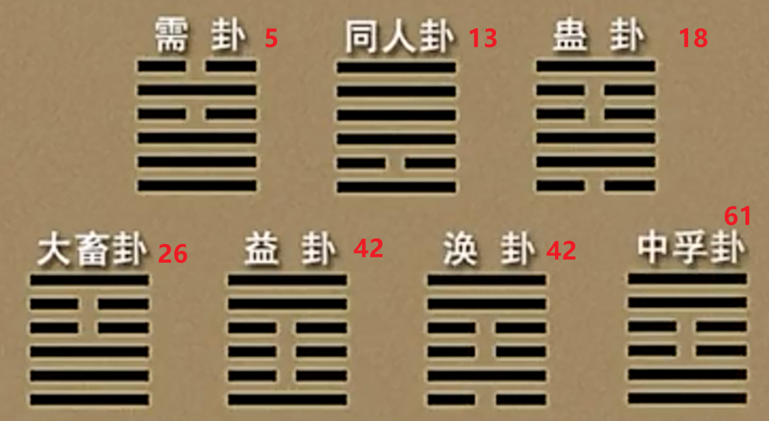

***05需卦䷄***  

~~物稚不可不养也，故受之以需。需者饮食之道也。《序卦》~~    
~~需不进也。~~需晋旁通。晋，进也。 

~~“旁通”是虞翻等易学家提出的重要概念，指两个卦的每一爻阴阳完全相反。这样的两卦构成一对，代表着事物一体两面的极端状态。~~
~~需卦䷄：乾下坎上~~  
~~晋卦䷢：坤下离上~~  

# 【5 · 1】

**䷄ 需。有孚，光亨，贞吉。利涉大川。** ~~需结束后，可以利涉大川。~~ 

~~利涉大川的七个卦：~~

  

注意，这里只有==需卦(水天需䷄)和涣卦(泽水涣䷺)含有坎(☵)卦==
~~这七个卦的特色，有乾☰(代表刚健、有能量)或者巽☴(代表风，有风配合，让你的木头、船过河)在里面~~  
## 【译文】

需卦。有诚信 ~~二五都是阳爻~~ ，光明 ~~九三六四九五，互离~~ 通达，正固吉祥。适宜渡过大河。

## 【注解】

需卦是下乾上坎，亦即“水天需”。《序卦》说：“物稚不可不养也，故受之以需。需者，饮食之道也。”==有所*需要*，也是有所*等待*。==

“孚”是信，“有孚”是指*诚而有信*。《易经》常以“有孚”描写*异性爻的亲近遇合，如本卦九五（上下皆为阴爻）即是“有孚”*。有了诚信，就会光明通达，*守住正固*而得吉祥。

==本卦由下乾上坎组成，乾为健，即使遇水（坎为水），也能奋勇前进==，所以说“利涉大川”。

# 【5 · 2】

**《彖》曰：需，须也，险在前也。刚健而不陷，其义 ~~义：理当。~~ 不困穷矣。需有孚，光亨，贞吉，位乎天位，以正中也 ~~正中，又是天位，只有九五了~~ 。利涉大川，往有功也。**

 ~~須，面毛也。~~   ~~会不会是因为长胡须得经过一定时间，所以引申为等待~~  

## 【译文】

《彖传》说：需卦，有所等待，因为前面出现了危险。==有刚健之德而不会陷于险难==，从道理上讲不会走到困穷的地步。需卦有诚信，光明通达，正固吉祥。九五处在天位，可以端正而守中。适宜渡过大河，前往可以建立功业。

## 【注解】

“须”是待，要等待条件成熟才可以行动。上卦为坎，坎为险；==上为前，下为后，所以说“险在前也”==。下卦为乾，乾有刚健之德，所以不会陷入险中。==“义”指道理或合宜的推断==。

“天位”是五位；九五是阳爻居天位，足以做到正与中。“利涉大川”是常见的用语，意指像大河这样的险阻也挡不住，并且还有利可得，亦即建立功业。

# 【5 · 3】

**《象》曰：云上于天，需。君子以饮食宴乐。**

## 【译文】

《象传》说：云气上升到天空，这就是需卦的取象。君子由此领悟，要饮食与宴乐。

## 【注解】

本卦下乾上坎，乾为天，坎为水，==水在天上，引申为云。云在天上，尚未凝聚成雨，所以要耐心等待。==君子即使有才德，也须待机而动。

君子在等待时，该做什么？程颐说：“==饮食以养其气体，宴乐以和其心志==，所谓居易以俟命也。”==处于平常日子，准备接受天命==。

~~居移气，养移体，大哉居乎~~  居中的地方决定了气，吃的东西决定了身体 

# 【5 · 4】䷄

**初九。需于郊，利用恒，无咎。** ~~卦的每一爻其实是以坎为参照物，不断接近坎~~ 

《象》曰：需于郊，不犯难行也；利用恒，无咎，未失常也。

## 【译文】

初九。在郊野等待，适宜守常不动，没有灾难。

《象传》说：在郊野等待，是不要冒险前进；适宜守常不动而没有灾难，是因为没有失去常理。

## 【注解】

需卦显示“等待”之意。==初九离上坎的危险最远==，有如处在郊野。《尔雅》谓：“邑外谓之郊，郊外谓之野。”在都城之外等待，只要守常不动，就没有灾难。

“未失常也”，是因为阳爻居初位，上又有六四相应，所以可以远离危险，等待时机。

~~初九是阳爻本性是要动的，但由于本卦是需卦，所以让他不动~~  

# 【5 · 5】䷄

**九二。需于沙，小有言，终吉。** ~~九二出现在互兑☱，兑，口舌是非。《说卦传》~~ 

**《象》曰：需于沙，衍在中也；虽小有言，以终吉也。**

## 【译文】

九二。在沙滩上等待，有些小的责难，最后吉祥。

《象传》说：在沙滩上等待，是因为==沙洲浮现在水中（九五）==；虽然有些小的责难，最后还是吉祥收场。

## 【注解】

九二离水（上坎为水）较近，到了沙滩。由于是==阳爻居柔位== ~~但中胜于正~~ ，并且在互兑（九二、九三、六四）中，兑为口，为毁折，所以有些小的口舌是非。不过，处在下卦中位，又是等待不前，所以终究还是吉祥。

“衍”是水中泥沙，有如沙洲。==九二的对应是九五==，九五为坎中（水中）之阳爻，有如沙洲。==九二与九五敌而不应== ~~九五代表危险，反而是好事~~ ，有如见沙洲而无法前行。

# 【5 · 6】䷄

**九三。需于泥，致寇至。** ~~寇，说的就是坎。~~ 

**《象》曰：需于泥，灾在外也。自我致寇，敬慎不败也。**

## 【译文】

九三。在泥沼中等待，招来了强盗。

《象传》说：在泥沼中等待，是因为外面就有强盗。==由我自己招来强盗，所以恭敬*谨慎*就不会陷于祸败。==

## 【注解】

九三居下卦之上，紧邻坎水，等于停留在河边泥沼中。它若继续向前行动，就会引来强盗（坎为盗），因为强盗就在外面。

九三与上六相应，等于自己招来了强盗。这时若能==“敬慎”==  ~~九三知道自己的处境，这个说法由来-->九三，六四，九五构成互离☲~~ ，即可立于不败之地，因为==下卦为乾，为健 ~~且自己正位~~ ==，尚有自卫能力。

# 【5 · 7】

**六四。需于血， ~~坎：水，血，酒。~~ 出自穴。**

**《象》曰：需于血，顺以听也。**

## 【译文】

六四。==在血泊中等待， ~~(但能够)~~ 从洞穴中逃出来==。

《象传》说：在血泊中等待，是因为以听命来表示顺从。

## 【注解】

六四下临三个刚爻的进逼，有如阴阳之战，必定见血。并且，六四已经进入坎卦，而坎为血卦。这双重取义，使六四“需于血”。同时，坎为陷，引申为陷阱或地下之穴。==六四“出自穴”，表示大难不死==。

在血泊中等待而可以逃生，是因为以==阴爻居柔位==（顺），又==有初九与之相应==（听），“顺以听”可以保住性命。

# 【5 · 8】

**九五。需于酒食， ~~酒食，与坎有关~~ 贞吉。**

**《象》曰：酒食贞吉，以中正也。**

## 【译文】

九五。在享用酒食中等待，正固吉祥。

《象传》说：在享用酒食中等待，是因为==守中而端正==。

## 【注解】

九五为需卦主爻，所以，爻辞与《彖传》相应。九五居上卦中位，又是阳爻居刚位，为正。行为守中而端正，守住正固自然吉祥。

由此可知，==“酒食”（饮食宴乐）在等待时机的时候也是不可或缺的。==关键在于自己是否合乎中正之道。

# 【5 · 9】

**上六。入于穴，有不速之客三人来，敬之终吉。**

**《象》曰：不速之客来，敬之终吉；虽不当位，未大失也。**

## 【译文】

上六。==进入洞穴中== ~~因为外面没有路走，走到了尽头。只好回去，且尊敬九三~~ ，有不请自来的三个客人到了，尊敬他们，最后吉祥。

《象传》说：不请自来的客人到了，==尊敬他们，最后吉祥==；上六虽然位置不当，但没有大的过失。

## 【注解】

上六 ~~当位~~ 为坎卦上爻，相对于下卦而言，是入于坎（为穴）的内部，又是阴爻居柔位，算是可以安居了。“速”是召请，==“不速之客”是指下卦三个*阳爻*（三人）而言==。需卦最后“利涉大川”，所以三个阳爻要往上前进，变成不召而来。

==“不当位”是指上六对九五“乘刚”而不顺，并且到了全卦末爻，挡不住需卦的前进趋势。== *“未大失”是指还有九三的正应*。九三说“敬慎不败”，上六说“敬之终吉”，两者*呼应*可以逢凶化吉。

