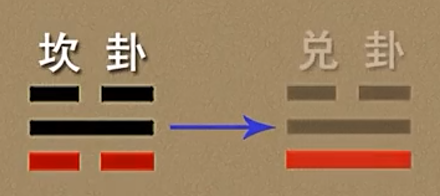
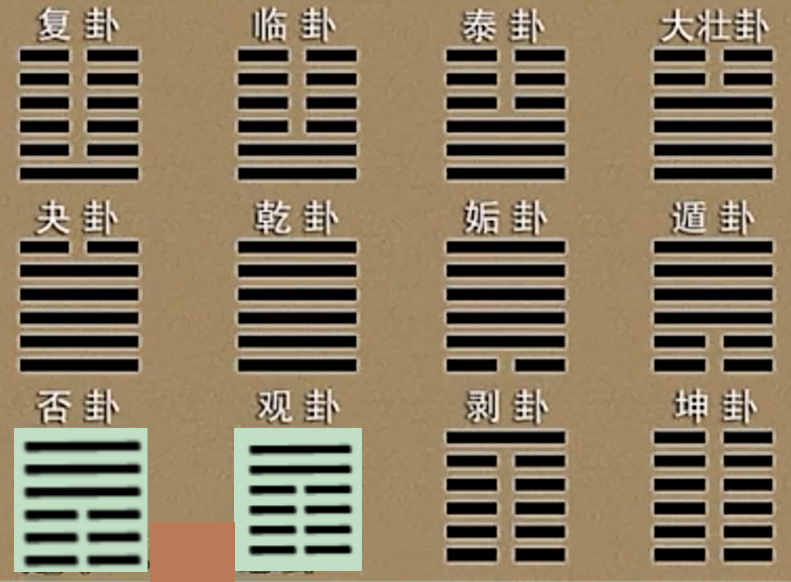
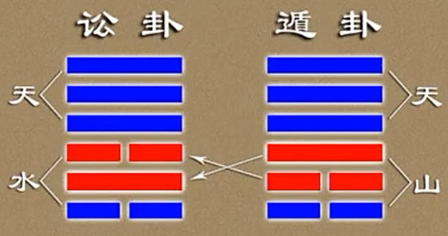
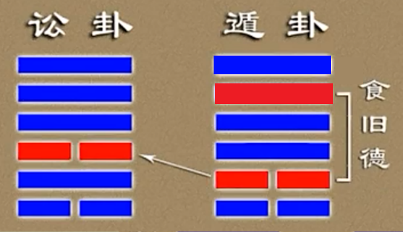

***06讼卦䷅***  

~~饮食必有讼，故受之以讼。《序卦传》~~  
~~讼不亲也。《杂卦》~~  
# 六爻递进

- ⚊讼之终——胜而致辱
- ==⚊==讼之公——中正决讼
- ⚊讼之悟——讼败知命
- ⚋讼之守——安分免争
- ⚊讼之退——败讼避锋
- ⚋讼之始——讼不可长
# 【6 · 1】

**䷅ 讼。有孚，窒惕，中吉，终凶。利见大人，不利涉大川。**

## 【译文】

讼卦。有==凭证可信== ~~二五都是阳爻~~ ，窒塞而须==警惕（因为有争讼）==，==中间吉祥，最后有凶祸== ~~不论官司输赢，最终都是凶，双方会有怨恨~~ 。适宜见到大人 ~~好的法官、判官。这里还有另一个含义，就是得有共识，那么争讼才有基本的意义~~ ，不适宜渡过大河 ~~不要到处跑（我觉得这里意思是不要再投机取巧？~~ 。

~~“有孚”：心中有诚信、有实情、有凭据。你认为自己是占理的、受委屈的一方。“窒”：（关键在这里） 你心中的这份诚信、实情和道理，在现实中遇到了阻碍（委屈），行不通了。【由此可见以前的书籍真可谓==*字字珠玑*==】~~  

## 【注解】

讼卦是下坎上乾，亦即“天水讼”。《序卦》说：“饮食必有讼，故受之以讼。”人与人之间因为争取需求而发生诉讼。

“孚”是信，在此是指有凭证或证据可以采信。但是，处于讼卦，==证据未必被人采信，显示窒塞不通的状况，==所以要小心戒惧。

“中吉”，所指为九二，因为它居下卦中位，并且拥有上下两个柔爻而“有孚”。“终凶”，诉讼若不能适可而止，则最后的结局将是凶祸。==此时适宜见到公正廉明的大人，而不适宜逞勇冒险。 ~~不利涉大川~~ ==

# 【6 · 2】䷅

**《彖》曰：讼。上刚下险 ~~外表刚强，内心险恶（内心比较复杂）~~ ，险而健，讼。讼有孚，窒惕，中吉，刚来而得中也。终凶，讼不可成 ~~没有成就~~ 也。利见大人 ~~九五~~ ，尚中正也。不利涉大川，入于渊也。**

## 【译文】

《彖传》说：讼卦。上卦刚强，下卦险恶；遇到险恶还健行不已，就形成讼卦。讼卦有凭证可信，却窒塞而须警惕；==至于中间吉祥，是因为刚爻来到下卦并居于中位==。最后有凶祸，是因为==*争讼不可能成就任何事*==。适宜见到大人，是因为==崇尚守中 ~~我觉得这里守中更像是说不偏心？以公理论事~~ 而端正==的品德；不适宜渡过大河，是因为本身陷于深渊之中 ~~坎在乾下~~ 。

## 【注解】

讼卦由下坎上乾组成。坎为险，乾为刚，是为“上刚下险”。==遇到险恶还往前奋进，或者内心险恶外表刚强==，自然难免争讼了。

九二虽“有孚”，但处于下卦坎中。坎有险阻之意，并且对人而言，坎是加忧、心病，所以合成“窒惕”。若是不窒，何必争讼？“中吉”由九二居中的中，引申为争讼的中间过程。“终凶”是指争讼不会有好结果。

==九五阳爻居刚位，又在上卦之中，是具有中正之德的“大人”，可以秉公断案。== ~~九五是主爻~~ “入于渊也”，是指九二本身在坎的中间。

# 【6 · 3】

**《象》曰：天与水违行 ~~天往高处走，水往低处行~~ ，讼。君子以作事谋始。**

## 【译文】

《象传》说：天与水相违而行，就是讼卦。君子由此领悟，==做事要在开始时就谋划好==  ~~比如两人合作，*事先说好，才不会事后有争议*~~ 。

## 【注解】

讼卦下坎上乾，乾为天，坎为水。天原本居上，水原本在下，两者==背道而驰，无法沟通交流==，所以会有争讼。

君子做任何事都要想到将来的最坏结果，所以在开始时谨慎筹谋。否则的话，“人无远虑，必有近忧” ~~近：现在~~ （《论语·卫灵公》）。

# 【6 · 4】䷅

**初六。不永所事，小有言，终吉。**

**《象》曰：不永所事，讼不可长也。虽小有言，其辩明也。**

## 【译文】

初六。==不要把事情做到底==，有小的责难，最后吉祥。

《象传》说：不要把事情做到底，因为争讼不可以长期坚持。虽然有小的责难，还是可以辩明道理。

## 【注解】

讼卦初六是==争讼的开始阶段，柔爻表示不会长久进行此事（争讼之事），所以只有口舌之争，最后吉祥==。  ~~阴爻在柔位，很弱，退一步，所以吉（或者说 讼不起来）~~ 

初六有“其辩（辨）明也”，是因为==*上有九四为正应，近又有九二为比邻*==。讼卦既是争讼，每一爻的敌与应就扮演重要角色了。==敌则相抗，应则支持。==

 ~~口舌之争另一个解释~~ 
   
 ~~问初六，那就看看初六变了之后怎么样来看~~ 
  ~~祸从口出？~~ 
# 【6 · 5】䷅

**九二。不克讼，归而逋（bǔ），其邑人三百户 ~~九二，大夫的位置，管理三百户~~ 无眚（shěng）。**

**《象》曰：不克讼，归逋窜也。自下讼上，患至掇（chuò）也。**

## 【译文】

九二。==争讼没有成功==，回来躲避，他采邑的三百户人口没有灾害。

《象传》说：争讼没有成功，回来躲避是要逃开争讼的事。==居下位而与居上位者争讼，祸患来到是*自己找的*。==

## 【注解】

==九二与九五敌而不应，而九五为尊位，==所以九二争讼不能成功。并且这是明显的“自下讼上”，无异于自取祸患。九二在下卦坎中，坎为险，情况极为不利。 ~~九二是中，虽然中胜于正(胜于不正)，但九五是中正（既中又正）~~ 

“二”是大夫位，大夫的采地为“邑”。三百邑为下大夫所有。九二败诉逃回来，由于居下卦中位，所以勉强没事，并且邑人也不会受到牵连。

“逋”是逃避躲藏，“眚”是较小的灾祸，“掇”是拾取。==本爻强调形势比人强，先避讼免祸再说。==

# 【6 · 6】䷅

**六三。食旧德，贞厉，终吉。或从王事，无成。**

**《象》曰：食旧德，从上吉也。**

## 【译文】

六三。享用祖先的余荫，守住正固，有危险，最后吉祥。或者跟随君王做事，没有成就。

《象传》说：享用祖先的余荫，是因为跟随上位者就会吉祥。

## 【注解】

“旧德”是祖先的恩德，亦即承袭所得的爵禄。==“三”是公位，是由祖先的余荫而来。只要正固守之，虽有危险但尚可自保，“终吉”==。

==六三有上九正应，上九在乾卦中，乾为君，所以说“从上吉也”==。至于“厉”与“无成”，则来自==六三的承乘皆为刚爻（上下皆为阳爻），难以有成。==

~~补充，讼（䷅）是由遁（䷠）所变而来~~   
~~以下是十二消息卦，消息卦的用处之一就是可以作为卦的变化来加以理解，变的原则是只变一次~~ 
~~消息，消：消退，息：成长，例：息肉，息，多出来的。~~  

食旧德：因为六三原本是遁卦中的六二，与九五正应，所以说他食旧德
  

  

讲卦变的时候以消息卦为主，但是有四个卦不是从消息卦来的。

- 卦变 是一个宏观、广义的理论概念，指的是六十四卦之间相互转化、衍生的规律和系统。
- 变卦 是一个具体、狭义的占卜术语，特指在起卦过程中，因为一个或多个爻的阴阳变动，而从本卦衍生出的那个新卦。

《象传》说：争讼，最为吉祥，是因为守中而端正。

| 月份 | 地支 | 节气（约） | 卦名与卦象 |
| :--- | :--- | :--- | :--- |
| 十一月 | 子 | 冬至 | 复卦 ䷗ |
| 十二月 | 丑 | 大寒 | 临卦 ䷒ |
| 正月 | 寅 | 立春 | 泰卦 ䷊ |
| 二月 | 卯 | 春分 | 大壮卦 ䷡ |
| 三月 | 辰 | 清明 | 夬卦 ䷪ |
| 四月 | 巳 | 立夏 | 乾卦 ䷀ |
| 五月 | 午 | 夏至 | 姤卦 ䷫ |
| 六月 | 未 | 大暑 | 遁卦 ䷠ |
| 七月 | 申 | 立秋 | 否卦 ䷋ |
| 八月 | 酉 | 秋分 | 观卦 ䷓ |
| 九月 | 戌 | 寒露 | 剥卦 ䷖ |
| 十月 | 亥 | 立冬 | 坤卦 ䷁ |

## 【注解】

==*九五阳爻居刚位，得正，五又是上卦中位*==，这表示==*大人得位，以公正严明的态度处理*==诉讼。就争讼而言，没有更好的情况了。

*“元吉”是上上大吉，接着才是“大吉”与“吉”*。占筮之辞以此为最理想。

# 【6 · 7】䷅

**九四。不克讼，复即命，渝安贞，吉。**

**《象》曰：复即命，渝安贞，吉，不失也。**

~~到这里可以看出，九二和九四都是阳爻，都产生了争讼~~  

## 【译文】

九四。争讼没有成功，*返回到自己命定的角色*，变得安于正固，吉祥。

《象传》说：返回到自己命定的角色，变得安于正固，吉祥，是因为这样没有失去身份。

## 【注解】

九四与九二的处境相同，都是“不克讼”，因为讼卦的主角是九五。==九四（为诸侯）争不过九五（为天子）==；它==与初六正应，又不必兴讼==。所以争讼无成。

“渝”是变，变得安于正固，就是回到命限。==九四在上卦乾中，乾为天，又在互巽（六三、九四、九五）中，巽为*风（代表命令）*，犹如传来天之命==，*因此诸侯守住天命，没有失去身份*，自然吉祥。

# 【6 · 8】

**九五。讼，元吉。**

**《象》曰：讼，元吉，以中正也。**

## 【译文】

九五。争讼，最为吉祥。

《象传》说：争讼，最为吉祥，是因为守中而端正。

## 【注解】

九五阳爻居刚位，得正，五又是上卦中位，这表示==大人得位，以公正严明的态度处理诉讼。==  ~~审判善恶，让人心都可以得到平和~~ 就争讼而言，没有更好的情况了。

“元吉”是上上大吉，接着才是“大吉”与“吉”。占筮之辞以此为最理想。

# 【6 · 9】

**上九。或锡(cì)之鞶(pán)带，终朝三褫(chǐ)之。**

**《象》曰：以讼受服，亦不足敬也。**

## 【译文】

~~上九：打官司打完了。~~  
~~乾卦是衣坤卦是裳，上九正好完成了上面的乾卦，所以这里说到衣服。打官司赢了所以说衣服的象就出现了~~  

上九。或许受赐官服大带，但是一天之内被剥夺三次。

《象传》说：因为争讼而获得官服，也就不值得尊敬了。

## 【注解】

上九居讼卦顶端，可以由争讼而取利；但是又走到了乾卦上爻，可谓刚极之至，即使胜诉也必结怨。

“锡”，赐也；“鞶带”，大带，为古代官服的一部分。借着争讼而获官职，并不值得尊敬。“终朝”是终日，指一天之内。“三褫之”，“褫”是夺走。若由象上看，==*乾为白昼，三阳爻为三次（三表示多次）*==  ~~前面水天需䷄，上六也提到三，不过是三个人，指的是下卦的三个阳爻~~ 。上九有悔，是可以理解的。

