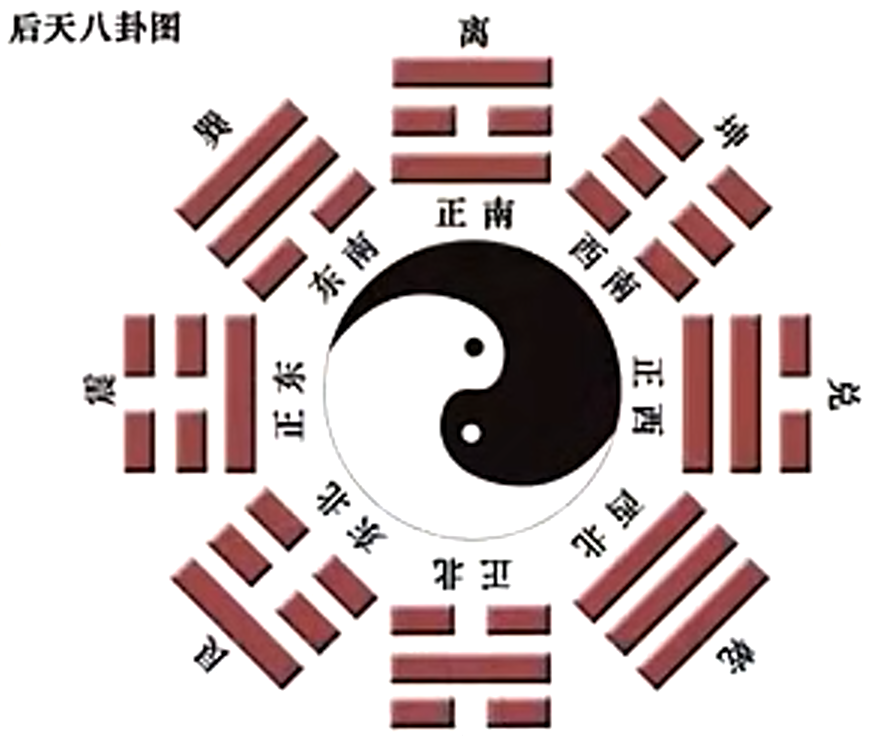
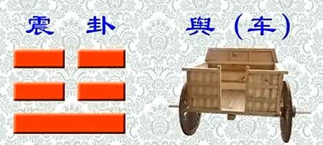
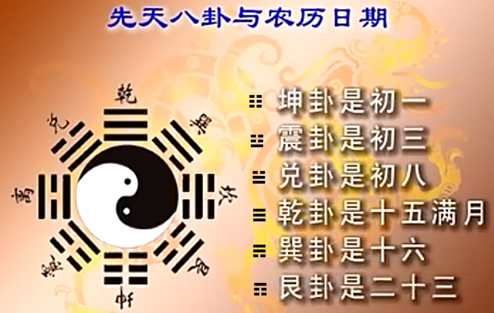

***09小畜卦䷈***  

# 【9 · 1】

**䷈ 小畜（xù）。亨。密云不雨，自我西郊。**

## 【译文】

小畜卦。通达。浓云密布而不下雨 ~~䷈中有个互兑（☱）。上卦是风。有风，有泽，所以说密云不雨。~~ ，从我西边的郊野飘聚过去。

~~后天八卦图：~~    

  

~~䷈底下是乾卦，由下往上走，即西北往东南走。也就是由西边（乾）吹到东南（巽）~~  

## 【注解】

小畜卦是下乾上巽，亦即“风天小畜”。《序卦》说：“比必有所畜，故受之以小畜。”相对于此，另有大畜卦（椆，第二十六卦）可资参考。

云是阴阳二气互动所形成的，但是尚未凝结为雨。小畜卦下乾上巽，==乾之位在西北，巽之位在东南，爻画由下而上，等于风雨（巽为风）由西北吹向东南，使浓云未及下雨就飘聚过去，所以说“自我西郊”==。

如果扣紧“西风”一词，则可说：本卦以六四为主爻，六四在上巽（风）与互兑（九二、九三、六四）中，兑之位在西，所以合为“西风”。

小畜是蓄积较少，成云而未及下雨，但是到了上九就“既雨”了。

# 【9 · 2】䷈

**《彖》曰：小畜，柔得位而上下应之，曰小畜。健而巽（xùn），刚中而志行，乃亨。密云不雨，尚往也。自我西郊，施未行也。**

## 【译文】

《彖传》说：小畜卦，柔爻得居正位而上下都来应合，称之为“小畜”。健行又能顺利，阳刚居中 ~~指九二和九五~~ 而==心意可以推行==，所以通达。浓云密布而不下雨，是因为风往上吹。从我西边的郊野飘聚过去，是因为施雨还不到实现的时候。  ~~西北往东南吹的风不会下雨~~ 

## 【注解】

小畜卦一阴五阳，==六四阴爻居柔位，是最恰当的正位==，上下五个阳爻都来呼应。其次，本卦下乾上巽，乾为健，巽为入，为顺，既健行又顺利；==二、五皆为阳爻，是既刚且中==，可以“志行”，所以“亨”。

“密云不雨”，因为下乾上巽，是风在天上吹。“尚往也”，“尚”即是“上”。“施未行”是说“小畜”（恩泽）所积尚不足以大行于天下。

# 【9 · 3】䷈

**《象》曰：风行天上，小畜。君子以懿（yì）文德。**

## 【译文】

《象传》说：风在天上吹行，这就是小畜卦。君子由此领悟，要==美化自己的文采与道德==。

## 【注解】

“风行天上”，刚健的乾卦位居随顺的巽卦之下，这是小畜的取象。==以柔蓄养刚==，并且是==一柔对五刚==，格局与效果都有限，所以称为“小畜”。

程颐说：“==君子所*蕴蓄*者，大则道德经纶之业，小则文章才艺。==”此==处所谓的==“文德”，可以兼指文采与道德，是君子所不可或缺的。

~~子曰：“志于*道*，据于*德*，依于*仁*，游于*艺*(礼、乐、射、御、书、数)。”~~  
~~道，*人类*共同的道路。德：得之于道者为德。据：紧紧握握住。仁：*我*这个人的正路~~  
# 【9 · 4】䷈

**初九。复自道 ~~道：正道~~ ，何其咎？吉。** ~~复，这里其实和“冒进”形成鲜明的对比。~~ 

**《象》曰：复自道，其义吉也。**

## 【译文】

初九。循着正路回来，会有什么灾难？吉祥。

《象传》说：循着正路回来，理当是吉祥的。

## 【注解】

初九==阳爻居刚位，又有六四正应==，代表==依循正路回到此位==。所以不会有咎。

小畜卦是==小格局的蓄积==，初九可以==循规蹈矩、安于本分==，就是可贵的吉象了。

# 【9 · 5】

**九二。牵复，吉。**

**《象》曰：牵复在中，亦不自失也。**

## 【译文】

九二。由牵连而回来，吉祥。

《象传》说：由牵连而回来，位置居中，也算没有失去自己的立场。

## 【注解】

九二的牵连很明显，它的上下都是阳爻，而相对的九五亦然，好像非回来不可。

九二的吉，主要是==居下卦之中，又有九五配合==（*五阳面对一柔时，彼此不会相斥*），所以不会失去立场。

# 【9 · 6】䷈

**九三。舆说辐，夫妻反目。**

**《象》曰：夫妻反目，不能正室也。**

## 【译文】

九三。大车脱落辐条，夫妻反目失和。

《象传》说：夫妻反目失和，是因为不能端正家庭关系。

## 【注解】

“舆”是车，“说”同“脱”，“辐”是车轮上的辐条。车脱落辐条，就无法前进，正如九三的去路被全卦唯一的阴爻六四所阻。

九三也像其他阳爻一般，要与六四呼应，奈何==六四居上乘刚，使夫妻的上下关系颠倒了==，以至于“反目”。此外，在==下乾上巽的结构中，乾为男，巽为女，且是“多白眼”==，而九三首当其冲，难怪“不能正室”。

~~震卦就跟车一样：~~    

~~白眼：~~    

~~巽为木，为风，为长女，为绳直，为工，为白，为长，为高，为进退，为不果，为臭(xiù)。其于人也，为寡发，为广颓，为多白眼，为近利市三倍。《说卦传》~~  

# 【9 · 7】䷈

**六四。有孚，血去惕出，无咎。**

**《象》曰：有孚惕出，上合志也。**

## 【译文】

==六四。有诚信==  ~~六四有初九正应，阴爻在柔位，且承阳（九五）~~ ，避开流血并走出戒惧，没有灾难。

《象传》说：==有诚信而走出戒惧==，是因为与上位者心意相合。

## 【注解】

六四以==一柔面对五刚== ~~想到坤卦上六“龙战于野，其血玄黄”~~ ，必须有诚信，否则后果不堪设想。诚信足够，则不会有伤害（血去），也不必再==*戒惧*==（惕出）。六四为全卦主爻，只能做到“无咎”，实因以柔待刚，力有未逮。

==“上合志”的“上”是指九五而言==。

# 【9 · 8】䷈

**九五。有孚挛(luán)如，富以其邻。**

**《象》曰：有孚挛如，不独富也。**

## 【译文】

九五。有诚信而系念着，要与邻居一起富裕。

《象传》说：有诚信而系念着，是因为不要独自富裕。

## 【注解】

九五以阳刚居上卦中位，可谓==既中且正==，是尊贵的领袖，又有六四紧承其下，是“有孚”充实之象。“富以其邻”的“以”是“与”的意思。九五在上卦巽中，==巽为近利市三倍==，所以九五==有能力“富以其邻”==。

九五的“挛如”来自它不想独自富裕，而愿与各爻分享。==“挛”为蜷曲抽紧，系念于心。==

# 【9 · 9】䷈

**上九。既雨既处，尚德载。==妇贞厉==。月几望，==君子征凶==。**

**《象》曰：既雨既处，德积载也。君子征凶，有所疑也。**

## 【译文】

上九。已经下了雨，已经可以安居，要推崇==道德满载==。*妇女* ~~六四~~ 正固会有危险。月亮快要满盈，*君子*前进会遭凶祸。

《象传》说：已经下雨了，已经可以安居，是因为道德累积到满载。君子前进会遭凶祸，是因为有所疑虑。

## 【注解】

本卦卦辞是“密云不雨”，上九完成此卦，表示“小畜”告一段落，所以“既雨”，各爻也都可以安居“既处”。这种“德载”值得推崇，但是不可忘记它是由六四所下的功夫。

巽居乾上，巽为妇。妇虽有功，但须功成身退，所以正固会有危险。这种情形有如==月亮将要满盈==（月几望） ~~这里为什么是巽☴，而不是兑☱呢。因为（䷈）上九可以看到互兑（九二九三六四）~~ ，在阴柔的势力笼罩下，君子有所行动就会“凶”。此时所“疑”，是上九为最后一爻，已无路可走，并且==“月几望”，阳未必可以胜阴==。换言之，==阴到了盛极而衰的地步【坤☷，震☳，兑☱，乾。这里上九看到☱，即使月亮即将满盈，阴已经衰退，但阳仍需待时而动】，而阳仍须待时而动。==

  

