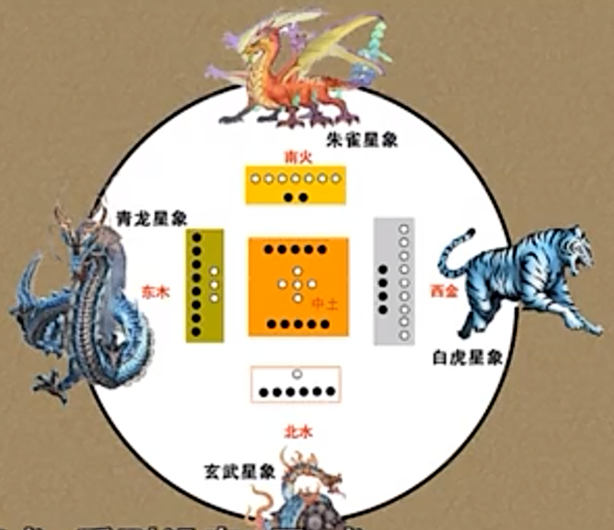

***10履卦䷉***   

~~物蓄然后有礼，故受之以履。《序卦》~~  
~~履德之基也。履和而至。履以和行。《系辞》~~  
~~礼者，履也。所以事神致福也。《说文解字》~~  
# 【补充·六爻递进】

- 行之始——质朴而行
- 行之安——守静则吉
- 行之戒——妄动致凶
- 行之慎——惧慎则安
- 行之决——刚愎则危
- 行之成——复盘则吉

# 【10 · 1】

**䷉ 履（lǚ）。履虎尾，不咥（dié）人，亨。**

~~这里说到老虎，有一个原因，是因为兑在西边。左青龙右白虎。另一个说法，这里的虎指“乾卦”，乾卦力量大（我觉得第二个解释比较靠谱）~~  

## 【译文】

履卦。踩在老虎尾巴上，老虎不咬人，通达。

## 【注解】

履卦是下兑上乾，亦即“天泽履”。《序卦》说：“*物畜然后有礼，故受之以履。履者，礼也。*”

“履”的意思是鞋子，引申为穿鞋走路、行事合乎礼仪。==本卦的通达，在于遭遇最危险的事，也不会受害。==

本卦下兑上乾，兑为口，为悦，乾为人；有口而不咬人，反而==以悦待人，自然通达==了。

# 【10 · 2】䷉

**《彖》曰：履，柔履刚也。说（yuè，同“悦”）而应乎乾，是以履虎尾，不咥人，亨。刚中正，履帝位而不疚，光明也。**

## 【译文】

《彖传》说：履卦，柔顺者以礼对待刚强者。==以和悦去响应强健==，所以踩在老虎尾巴上，老虎不咬人，通达。==刚强者居中守正==，踏上帝位也没有愧疚，是因为光明坦荡。

## 【注解】

本卦的用意在于肯定“柔履刚”。不过，下兑上乾，是下柔上刚，为何说是“柔履刚”？理由是：柔在下，原是恰当的，==以其柔顺方式来对待阳刚==，亦即依礼行事，则可以走遍天下。

==九五刚爻，既中且正，又居君位==，因为在履卦，所以说是“履帝位”，没有愧疚可言。又因为==主爻是六三（唯一的阴爻）==，六三在互离（九二、六三、九四）中，离为火，为光明，所以称之“光明”。

# 【10 · 3】

**《象》曰：上天下泽，履。君子以辨上下，定民志。**

## 【译文】

~~泽：沼泽。比土地还低，土地有坑、有洞，才叫沼泽。~~  

《象传》说：天在上，泽在下，这就是履卦。君子由此领悟要分辨==上下秩序==，安定百姓的心意。

## 【注解】

履卦下兑上乾，兑为泽，乾为天，所以是上天下泽，这是自然界原本的位序。

君子分辨社会上应有的秩序，才可使人各安其位，相互以礼来往，进而安定百姓的心意。

# 【10 · 4】䷉

**初九。素履往，无咎。**

**《象》曰：素履之往，独行愿也。**

## 【译文】

初九。按平常的践履方式前往，没有灾难。

《象传》说：按平常的践履方式前往，是因为只想实现自己的愿望。

## 【注解】

“履”卦意在向前走去，而初九阳爻有动力，又==位在足（初爻如足）==，所以依其平素正常方式去践履（实践、履行），就可以“无咎”。

“独行愿”是独行其志，而不是为了任何利益。

# 【10 · 5】䷉

**九二。履道坦坦，幽人贞吉。**

**《象》曰：幽人贞吉，中不自乱也。**

## 【译文】

九二。所走的路平坦宽阔，幽隐的人正固吉祥。

《象传》说：幽隐的人正固吉祥，是因为他守中使自己不乱。

## 【注解】

九二居下卦之中，从初九一路走来，道路已经“坦坦”。不过，由于下卦兑为泽，所以适合==泽中之人（幽人）正固吉祥==。“中不自乱”，因为他位居中爻，可以==守常==不乱。

“幽人”的原意为处于幽暗中的人，与“视不明”有关。九二在==下卦兑中，兑为毁折==；又在==互卦离（九二、六三、九四）中，离为目==，合之则为==目有毁折，所以处身幽暗==。在此则指幽隐之人。

# 【10 · 6】䷉

**六三。眇（miǎo）能视，跛能履。履虎尾，咥人，凶。武人为于大君。**

**《象》曰：眇能视，不足以有明也。跛能履，不足以与行也。咥人之凶，位不当也。武人为于大君，志刚也。**

## 【译文】

六三。眼有疾还能看，脚跛了还能走。踩在老虎尾巴上，老虎咬人，凶祸。勇武之人要做大王。

《象传》说：眼有疾还能看，但没办法看清楚。脚跛了还能走，但没办法走远路。老虎咬人的凶祸，是因为==位置不适当==。勇武之人要做大王，是因为心意刚强。

## 【注解】䷉

六三在下卦兑（毁折）与互卦离（目）中，是眼有疾；又在互卦巽（六三、九四、九五）中，巽为股，是腿受伤。既看不清又走不远，只要一冒险前进（履虎尾），就有凶祸。兑为口，六三等于落入虎口。兑为西方之卦，其象为虎，所以本卦一再谈及“虎”。

六三是全卦唯一的阴爻，因而成为主爻，但是以阴爻居刚位，又是乘刚，所以==位不当==。它得到五个阳爻上下呼应，自信满满，表现有如勇武之人，又有上九与之正应，所以想“为于大君”。

# 【10 · 7】䷉

**九四。履虎尾，愬（sè）愬终吉。**

**《象》曰：愬愬终吉，志行也。**

## 【译文】

九四。踩在老虎尾巴上，戒慎恐惧，最后吉祥。

《象传》说：戒慎恐惧而最后吉祥，是因为心意是要往前走。

## 【注解】

九四“履虎尾”而未被咬，是因为==已脱离兑卦，中间有了分界==。不过，==恐惧发抖（愬愬）还是难免==。

九四下有六三来顺承，本身又刚健能行。在履卦中，它的心意可以实现，所以“终吉”。

# 【10 · 8】

**九五。夬（guài）履贞厉。**

**《象》曰：夬履贞厉，位正当也。**

## 【译文】

九五。刚决履行，正固有危险。

《象传》说：刚决履行而正固有危险，是因为位置居正而当令。

## 【注解】

九五居上卦中位，上下二爻皆阳，连对应的九二亦阳，等于手握大权，行动刚决，如此坚持下去会有危险。“夬”亦为卦名（検，第四十三卦）。

九五为君位，又处乾卦（阳刚而进取）中爻，可谓“位正当”。程颐说：“居至尊之位，据能专之势，而自任刚决，不复畏慎，虽使得正，亦危道也。”

# 【10 · 9】

**上九。视履考祥，其旋元吉。**

**《象》曰：元吉在上，大有庆也。**

## 【译文】

上九。审视走过的路，考察吉凶祸福，如此返回最为吉祥。

《象传》说：最为吉祥的居于上位，这是大有喜庆的事。

## 【注解】

履卦到了上九，完成任务，可以回顾过去所践履的，并考核其吉凶（祥）。既然有此体验，返回时不再行差踏错，结果“元吉”。

上九居上卦乾的最高位，又有六三与之正应，所以说是“大有庆也”。

本卦多次提及虎，虎应与兑卦有关。依后天八卦所示，震在东，离在南，兑在西，坎在北，以此配合古代天文学的观念，亦即东为苍龙，南为朱雀，西为白虎，北为龟蛇。此说若可信，则涉及虎的六三与九四，以及卦辞本身，就得到了更清楚的说明。

