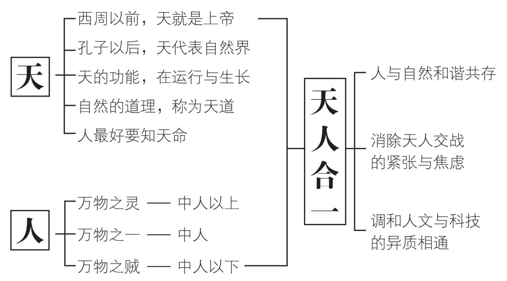
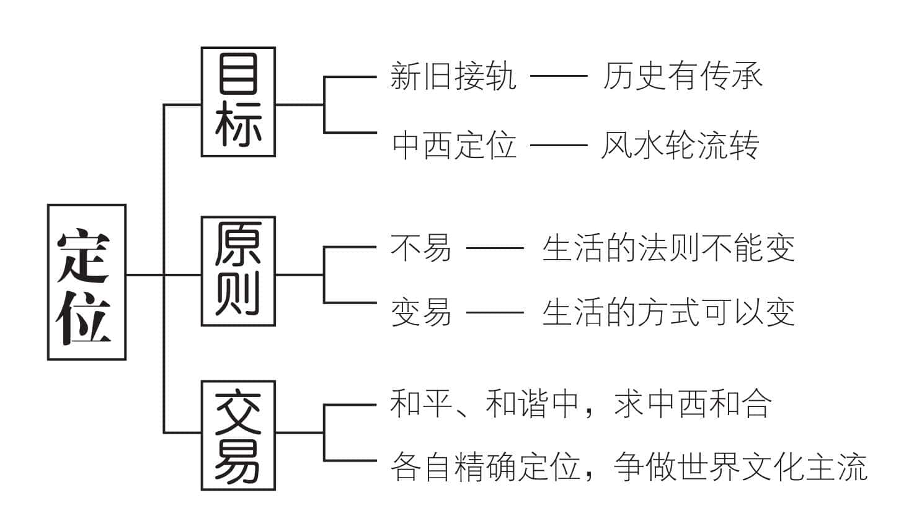
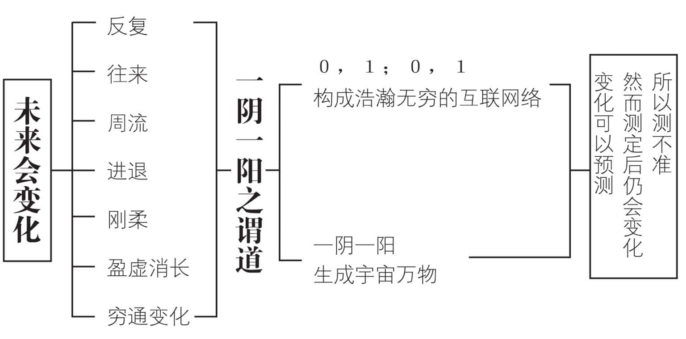
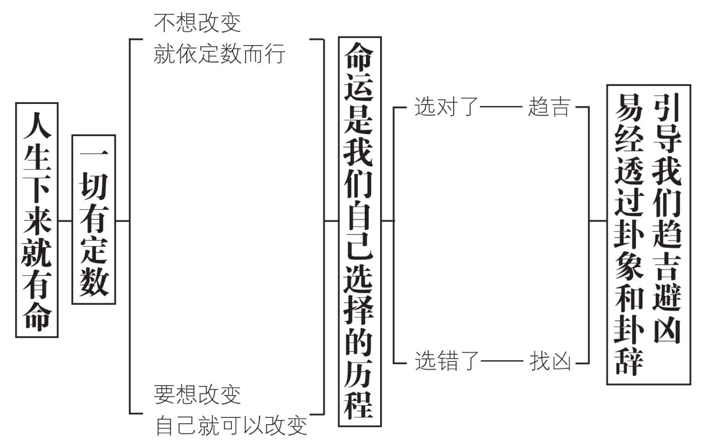
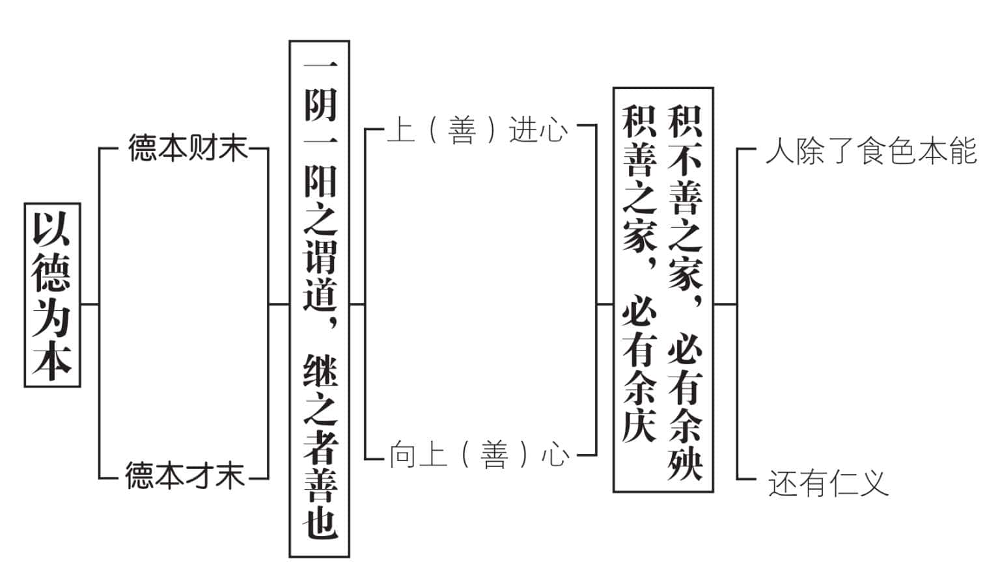
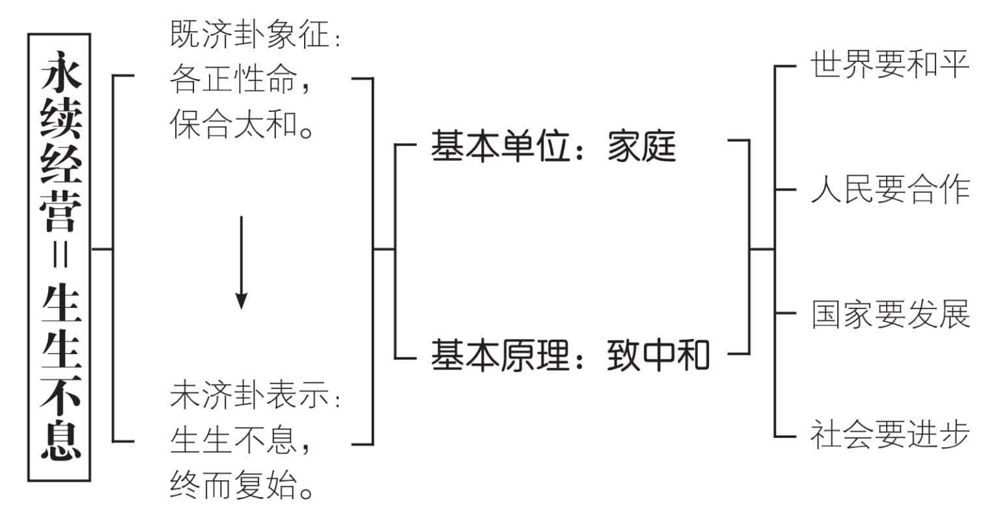

 **第一章**

 **易经是什么样的学问？**

《易经》是“天人合一”的学问，

真正有助于人类与自然的和谐共存。  

是协助我们做好“精确定位”的学问，

能达成“新旧接轨，中西定位”的目标。  

也是“未来变化”的学问，

把定位和时间的变迁因素一并考虑。  

当然是“趋吉避凶”的学问，

使我们能明白是非，做好正确的选择。  

更是“以德为本”的学问，

道德修养可以改变我们的命运。  

现代成为“永续经营”的学问，

宇宙人生都应该生生不息，继旧开新。

# **一　是一门天人合一的学问**

很多人怀疑，我们的祖先有那么高的智慧？在古老的时代，什么科学基础都没有，一下子就能搞出这么高明的《易经》，是怎么做到的？

我们常说“神仙中人”“神乎其技”“神奇不测”。《易经》很可能是“神来之笔”所留下来的痕迹，透过“神道设教”，使大家逐渐“神而明之”，达成“神机妙算”的效果。只要对“神”不“神经过敏”，便能“神通广大”地“神之又神”，过着“神怡心旷”的美好日子。

人可以略分为两种：一为“万物之灵”，一为“万物之贼”。“万物之灵”能够研究天道，探索宇宙自然的道理，把它应用于实际的日常生活之中。换句话说，也就是具有天地万物合一的“天人合一”观念，使百姓尊敬如神。后者则仍然存有“人同兽争”的旧观念，只知道以科技代替人力，来战胜其他动物，导致环境破坏、物种大量消失，当然会被归类为万物之贼。

“天人合一”是自然界与人类和谐共存的美好境界，不但可以消解天人交战的紧张与焦虑，而且能够调和人文与科技的异质相通。在科技发达的现代，尤为重要。

《易传》告诉我们，自然界的变化，并不是由于某种超然的或外在的动因所造成。它的变化，是由于宇宙的原动力，也就是阴和阳的互动、交感，可以说是天人互动、交感的结果。我们必须在“天定胜人”和“人定胜天”的合一中，找出“人之所以为人”的合理定位。在敬天、顺天、事天的大原则下，发挥人类的潜力，谋求天下太平。

# **二　是一门精确定位的学问**

当今地球村时代，大家最期待的，莫过于“新旧接轨，中西定位”。现代人的定位，最好能达到这样的目标。

近百年来，我们饱受“求新求变”的折磨，盲目地把“新”当做进化的象征，断定一切旧的，都不如新的。殊不知《易经》的“易”字，一方面有“变易”的意思，而另一方面，也有“不易”的需求。凡是盲目求新，一味地求变，便是只看到“变易”，却严重地忽略了“不易”。

“不易”是常则，这种变中之常，是超越时空的，无所谓新旧。《易经》的“经”字，便是不变的道理，必须经常当做遵守的法则。我们最好明白：“生活的方式可以变，而生活的法则不能变。”这种持经达变的精神，有所变也有所不变，才是值得长期保持的“应变”（意思是应该变的才变，不应该变的不能变），以便找出精确的定位。

中西文化，各有不同的取向和内涵，合乎阴阳互动共存的道理。有时“东风压倒西风”，有时“西风压倒东风”，才符合“风水轮流转”的法则。现代出现某些“西方文化消灭东方文化”或“东方文化融合西方文化”的主张，不符合“多元互动”的需求，显然不可能。

《易经》的“易”字，另外有一个“交易”的意思。中西文化做出合理的交易，属于正常良好的现象。但是要求融合为一，不必要也不可能。彼此精确定位，各领风骚，才是不易的道理。在全球化的浪潮中，各自扮演合理的角色，以和合、和平、和谐的精神，争做世界的主流文化。

# **三　是一门未来变化的学问**

定位之后，又会产生很多的变数，造成很大的干扰，所以必须再度定位，才能合理。《易经》提示很多有关反复、往来、周流、进退、刚柔、盈虚消长、穷通变化的观念，告诉我们“不断变化”就是未来的最大特性。因为自然中的事物必然依循着阴、阳两种原动力，而持续互动、交感着，所以变化无穷。

《易传》指出“一阴一阳之谓道”。电脑问世之后，0和1的变化无穷，构成浩瀚无边的互联网络——其实上述两种说法殊途同归，都在描述阴(0)、阳(1)的不断变化。

未来的变化，有一定的规律，便是我们常说的“道”。《易经》最基本的信念，即在整个宇宙都井然有序。有如中国人的交通，看起来杂乱无章，实际上却乱中有序。

我们的历史，看起来千变万化，单单一部《三国演义》，就变化无穷。然而仔细体会，原来和《三国演义》开头所言“分久必合，合久必分”，有十分密切的关系。

未来会变化，因此需要预测。但是预测得再准确，测定之后仍然会产生变化，所以测不准。既然测不准，何必要测？《易经》的观念，就是虽然测不准，但还是要测。至少能帮助我们明白当前的处境和未来可能的变化，再加以合理地调整。一旦我们对未来变化的掌握度增高，风险性也就能大幅度降低。

占卜的功能，在预测未来变化方面显得十分重要。它不是迷信，而是透过占卜的过程，引发我们的第六感。然后据以做出判断，以求合理地选择。目的在于趋吉避凶，别无他意。

# **四　是一门趋吉避凶的学问**

我们常说：“万金难买早知道。”意思是宇宙的秩序，是有机的，并不是机械的。“一切有定数”的真实意义，在于“不想改变时，依照原有的定数，循序渐进；想要改变时，原有的定数可以改变”，其中的变或不变，实际上也是一种定数。换句话说，人如果发挥自由意志，便可以做出有效的改变，和“创造论”的主张十分接近；人若是放弃自由意志，完全听从命运的摆布，那就成为“命定论”的一员，怨不得天，也尤不得人。

《易经》透过卦象和卦辞，提示我们趋吉避凶的道理，宇宙万象，实际上都遵守着一定的轨道，并且各有一定的限度。这一定的轨道和限度，便是《易经》的不易法则。我们在“变易”的现象中，找出“不易”的法则，自然能对于本末、先后、轻重、缓急，有合理的辨别，并据以做出正确的选择，期能趋吉避凶。在日常生活当中，我们时常听到“早知道，我就不会这样做”、“早知道有今天，我当时就会做出不一样的选择”之类的感叹，实际上就是不明事理，难以趋吉避凶的不良后果。吉凶往往是事后才呈现出来的结果，并不是事先所能掌握的。所以研究易理，寻找趋吉避凶的途径，便是研读《易经》的重要目的之一。

人生而有命，如果连命都没有，怎么活得成？但是命不是直线前进的，而是有多重选择的。人生的命运，决定于自己的选择。我们才是自己的主宰，经由慎重的选择来趋吉避凶，便是最有效的改命途径，人人都能走得通。

# **五　是一门以德为本的学问**

《易经》所用的辞句，大多隐晦不明。历来各家解释，又多牵强附会，使得读《易经》有如解谜语，以致许多人敬而远之。

实际上，《易经》的最高指导原则，就在“积善之家，必有余庆；积不善之家，必有余殃”（坤卦文言），意思是多做好事，积累善行的人家，一定会有充裕的喜庆；常做坏事，积累恶行的人家，一定会留祸殃给后代子孙。这一席话，有如我们现代的交通信号灯，绿灯通行而红灯停止，是不需要证明，自然如此的。如果怀疑这句话的真实性，恐怕再怎么努力研习《易经》，也是枉费时间和精力，毫无用处。

占卜得再精准，选择得再正确，也不能保证效果必然良好。这当中的变数，主要是关乎品德修养，与行善或作恶。

《系辞》上传“一阴一阳之谓道”，紧接着便指出“继之者善也”——一阴一阳的相互对待和作用，是万物的根本，我们把它称为“道”；而继承道的开创万物，便是“善”。

中国人自古以来，普遍具有高度的上进心，也就是向上心。“上”和“善”音相近，我们可以说成“善进心”或“向善心”。人人都有向善的善进心，不必向外寻求。我们一方面以“人”为本，一方面以“德”为本，便是把道德修养看成是做人的根本。

《系辞》下传指出：天地最伟大的德性，是化生万物；圣人最珍贵的，是崇高的地位。而此两者皆是以仁德和道义来维持的。人类在食、色两种本能之外，还有仁义，成为和一般动物不一样的特性。“德本财末”、“德本才末”，是《易经》给我们的重要观念，对一切向钱看，而又特别重视才能的现代人来说，应该显得十分有意义。

# **六　是一门永续经营的学问**

《易经》的宇宙观，把宇宙看做有机的整体，生生不已。《易经》的八卦，代表宇宙大家庭的基本成员：“乾”象征父亲，“坤”表示母亲；“震”为长子，“坎”为次子，“艮”为幺儿子；“巽”为长女，“离”为次女，而“兑”为幺女儿。这乾、坤、艮、兑、震、巽、坎、离，相当于宇宙家庭的一家八口，成员虽然不多，却能够相互交感而持续繁衍，生生不息。

“生生不息”用现代话来说，便是永续经营。不但我们这一代要过得好，也要让后代子孙能够过好的生活。今日的环境保护、生态保育，以及节能减耗，都是人类追求永续经营时，在生活上的必要措施。《易经》指出八卦相乘，化为六十四卦，代表生生不息，其基本原则即在于“致中和”。

当今地球村时代，和平与发展必须相辅相成，缺一不可。“和”的思想，不能只是一种愿望、祈求或理念，应该落实在现实生活中。唯有“和而不同”，才能有效化解全球化与本土化的冲突和抗争。世界要和平、人民要合作、国家要发展、社会要进步，人类就必须努力“致中和”。

近四百年来，由西方主导，大家认为理所当然的价值取向、文化目标、普世要求，已经造成科技发展、经济成长和文明交会失去控制的乱局，导致地球村能源被浪费，自然生态被破坏，社会正义被漠视，弱势族群被欺压。地球村想要永续经营，必须发扬《易经》的精神，才会再度扬起希望。

“既济”卦之后，出现“未济”卦，象征生生不息，终而复始。天地之大德曰“生”，人类却需要自己“致中和”，才能获得天佑。

# **我们的建议**

1.自然的变化，并非由于外在的动因所造成，而是一阴一阳的互动、交感产生的结果。我们是自己的主宰，必须为自己的所作所为，负起全部的责任。

2.定位就是守分，每一个人都做好自己分内的事情。不应该改变的原则，就必须确实遵循；应该改变的方式，就要适时权宜去改变。有所变，有所不变，才能获得精确定位。

3.未来会变化，主要的控制力量，在于我们自己的心。心想事成的先决条件，在于遵守自然规律。所以敬天、顺天、事天，透过占卜来引发第六感，可以掌握未来的变化。当然，也还有若干风险性必须承担。

4.心想事成，决定未来的变化。我们透过卦象和卦辞，力求趋吉避凶，可减少“早知道”的遗憾。人生而有命、有定数，却可以透过努力加以改变，所以选择自己所要走的路十分重要。

5.降低风险性的最佳方式，其实不是买保险，而是提升自己的品德修养，多做善事，多积德。多多发扬我们的向上（善）心，上（善）进心，以德为本，是做人的不二法门。

6.《易经》中把“一阴一阳之谓道”和“继之者善也”的道理，从家庭中开始落实、实践，乃至于国家、地球村、全宇宙，从而体会中和之道，以化解全球化和本土化的冲突，促使和平与发展的相辅相成，应该是人类永续经营的有效途径。

