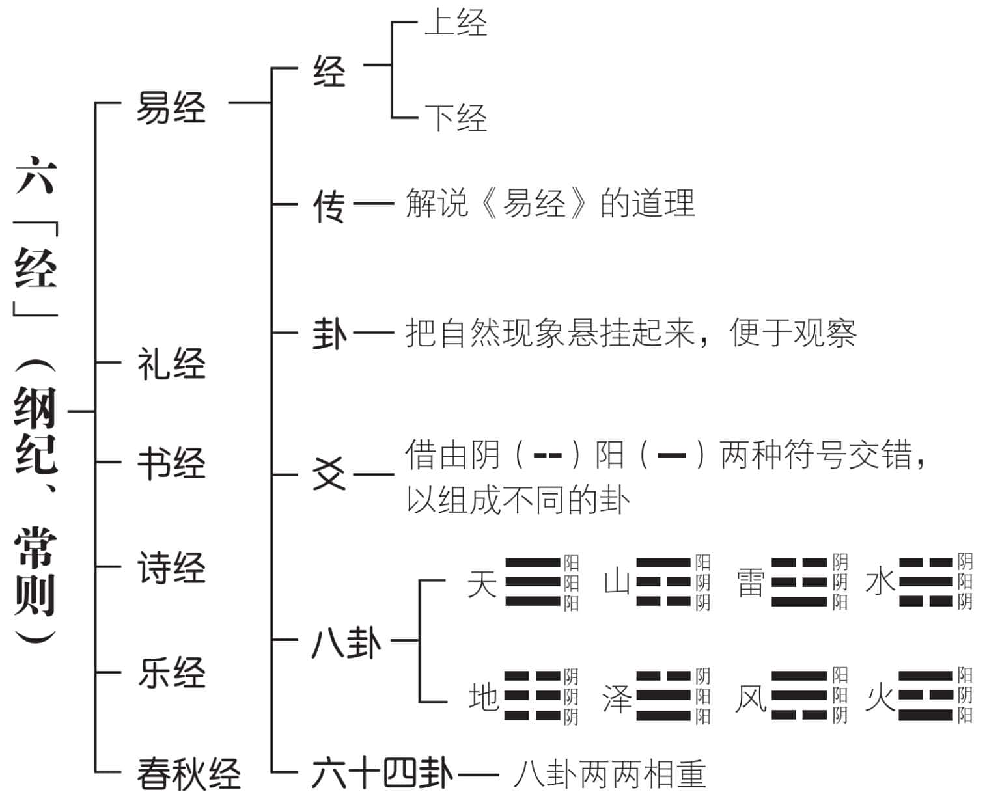
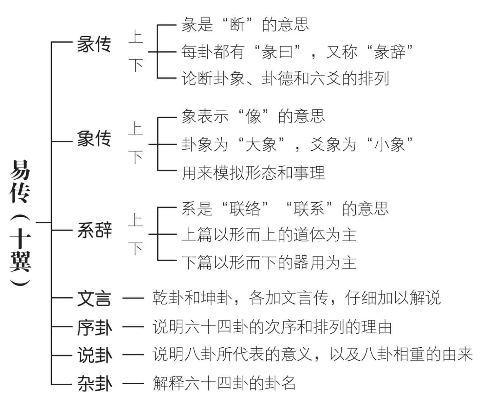
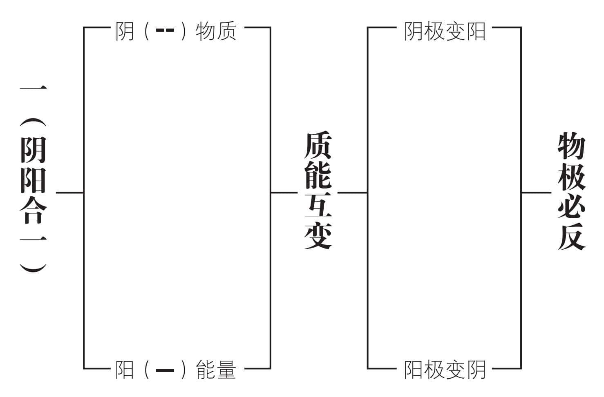
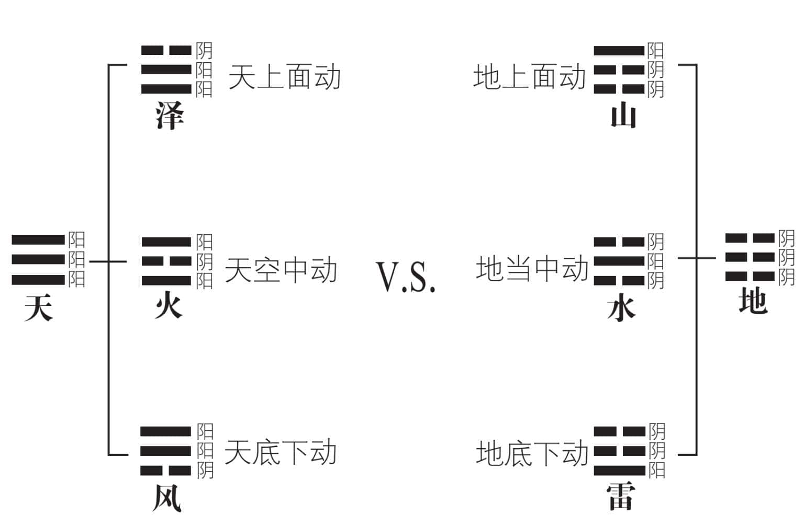
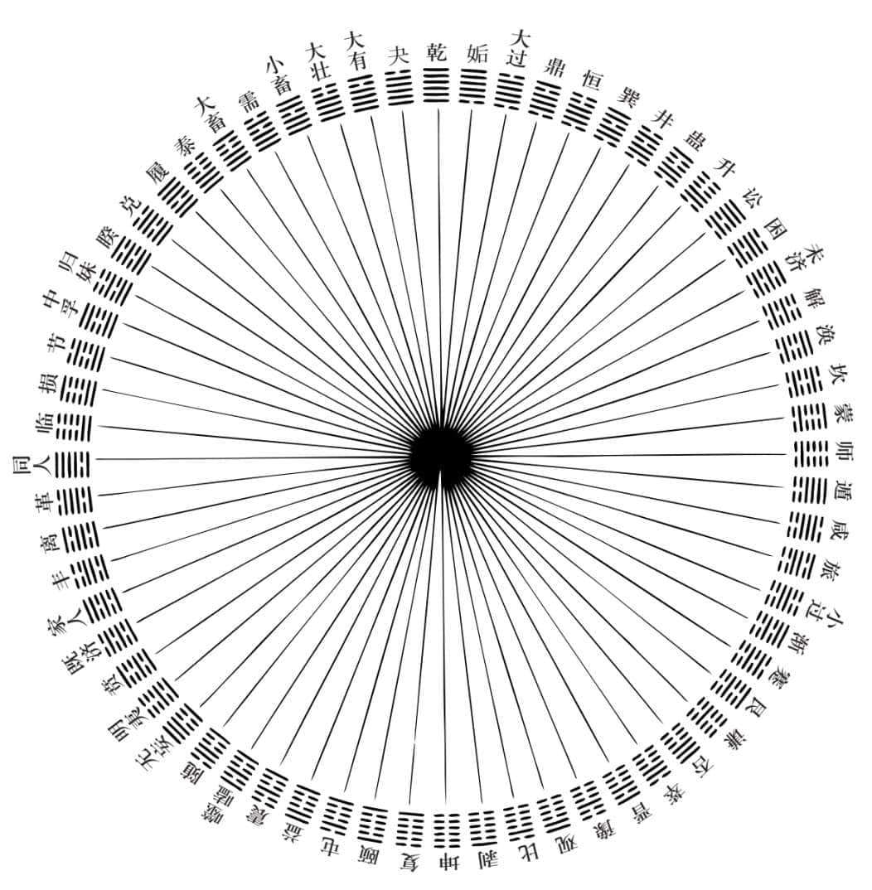
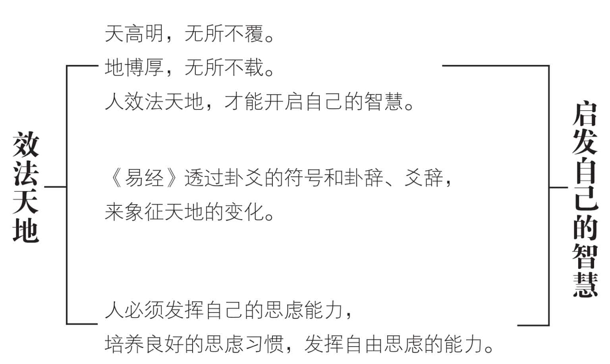

 **第二章**

 **为什么天人可以合一？**

天那么高，人这样渺小，

就算有了人造卫星，也很难天人合一。  

《易传》称为“十翼”，表示十只翅膀。

明白《易传》的道理，相当于内外合一。  

将外在的世界，纳入人的内心，

用道德精神，来点化理想人格。  

透过“人”合“天”的交感互动，

把人事问题与自然现象合而观之。  

从自然天道寻找人类行为的合理途径，

用模拟万物的形态和事理来辅导众人。  

天人在我们的内心合一，

人发自内心敬天、顺天，自然天人合一。

# 一　请先了解几个基本概念

织布时纵的丝线为“经”，横的丝线为“纬”，“经纬”后来被引申为“纲纪”，也就是不容轻易改变的基本原则。汉朝时以《易》（易经）、《礼》（礼经）、《书》（书经）、《诗》（诗经）、《乐》（乐经）、《春秋》（春秋经）为六经。由于《乐经》早亡，后世只存五经。

《易经》原名《变经》，可能是担心大家望文生义，知变而不知常，所以改称《易经》。希望读者能兼顾“变易”和“不易”的道理，以求持经达变。坚持原则（经），却能够因人、因事、因时、因地而通权达变（权），寻找出合理的平衡点。

“易”中有“经”也有“传”，“传”是用来解释《易经》的。古人说《易经》，常把《易传》也涵括在内。

“卦”是悬挂的意思，把宇宙间一切自然现象，用八种符号，也就是八卦来标示，每一种符号可以代表几十种事物。八卦两两相重，形成六十四卦，代表更多的变化。

八卦由三个符号所构成，六十四卦由于八卦两两相重，所以各有六个符号。

基本符号只有两个，为阳，为阴。卦是由下向上读的，阳阳阳代表天，阴阴阴代表地，阴阴阳表示山，阳阳阴表示泽，阳阴阴即为雷，阴阳阳即为风，阴阳阴便是水，阳阴阳便是火。所有六十四卦，都由阴()和阳()两种符号组合而成，既整齐又美观。

每一个符号，都称为一“爻”。八卦各有三“爻”，六十四卦每卦各有六“爻”；爻的意思，是“交错”。借由阴()阳()的交错，构成不同的卦象。

# 二　学易经最好先研读易传

《易传》是用来阐述、解释《易经》的，共分为七个部分：

1.《彖传》上下两篇——《易经》六十四卦，每卦都有“彖曰”，也叫做“彖辞”。彖是“断”的意思，彖辞用来论断一卦的卦象、卦德和六爻的排列。

2.《象传》上下两篇——每卦的“彖曰”后面，紧接着是“象曰”，称为大象，总论这一卦的象；每一卦有六爻，爻辞后面的“象曰”，叫做小象，分论这六爻的象。象的功能，在模拟万物的形态和事理。

3.《系辞传》上下两篇——系的意思是联络，把易道的义理，联系起来，相当于《易经》的总论或通论，并不局限于哪一卦或哪一爻。上篇以形而上的道体为主，下篇以形而下的器用为主，合起来可以称为“易大传”。

4.《文言传》一篇——乾卦和坤卦，是六十四卦的第一和第二卦，称为“易的门户”。其余六十二卦，都由这两卦互动、交感所形成。易道变化、阴阳交易，都以乾坤为本。这两卦的卦辞和爻辞，显得特别重要，所以各加文言传，以详细解释，很可能是后世易学家的见解所辑录而成。

5.《序卦传》一篇——说明六十四卦的次序和排列的理由。

6.《说卦传》一篇——说明八卦所代表的意义，以及八卦相重的由来。

7.《杂卦传》一篇——解释六十四卦的卦名。

以上七个部分，一共十篇，称为“十翼”，表示易学起飞的十只翅膀。相传为孔子所作，也有学者认为是集体创作。

# 三　阴阳两种符号合而为一

相传，伏羲氏是远古时代一位非常喜欢动脑筋的人。他十分好奇：“宇宙万象，为何如此井然有序？”他用心观察自然现象，发现有白天、黑夜之分，而且白天、黑夜好像永远不会错置；海水高涨，然后逐渐退回原位，又再度高涨，旋即悄然消退；草木成长、枯萎；人类出生、死亡，无不井然有序，是不是有一种巨大的力量在操控宇宙呢？

伏羲氏没有提出“主宰神”的观念，也没有发展出“外星人”的理论。他假设有一种强大的动能，驱使万物做出如此有规律的变动，并且用一根棍子，画一条直线，造出一个“”的符号，来代表此一强大的动能。

然而，经过仔细的观察、体会和反思，使伏羲氏很快便否定了自己的假设。因为每天升起和降落的太阳，应该是同一个；今年的春、夏、秋、冬，也仿佛是去年重现。他觉得宇宙的变动，绝不是单一的力量能够造成的。于是，他把木棍折断，画一条中间断裂的线，造出另一个“”的符号。后人把“”称为阳，将“”称为阴。

阴、阳合而论之，代表一种巨大的动能；分而观之，又可代表两种不同性质的动能。用现代话来说，“”代表物质，“”表示能量。由于质能互变，动起来是“”，静下来便成“”。说阴阳是一，可以；说阴阳是二，也未尝不可。我们把它称为一之多元，把“一”和“多”合起来想，不分开来看。由于一内含二，所以合起来是一，分开来便成为二（多）。这种观念，对中国人的思维，有很大的影响。

# 四　八卦代表静态自然现象

“易”字是变化、变革、变易的意思，透过模拟天地变化的自然现象，来精研周而复始、生生不息的生命过程。伏羲氏观察自然现象，抬头看见高高在上的天，发现天上没有任何物质，否则受到地心引力，必然向下坠落。因此用三个阳的符号，来代表天()。

他低下头来，看到地上充满了物质。为了天地相对应，他用三个阴的符号，来表示地()。

天()地()的代表符号定下来之后，他发现天()有三种可能的变化，分别为天上面有动静，天空中有动静，以及天底下有动静。同样发现地()也有三种可能的变动，分别为地上面动，地中间动，地底下动。

他用表示地，于是就成为地上面动的象。只有山在地面上动，所以代表山。地中间动是，表示水在地当中流动。表示地下面动，那就是雷，好像在地下震动。山()、水()、雷()和地()关系密切，也就是地上面动为山，地当中动为水，地底下动为雷。

天底下有树木，风吹来，树木摇动，所以天底下动()为风；天空中一片红色的火焰，表示火烧得很旺，所以天空中动()为火。最难想象的应该是天上面动。那时人造卫星尚未问世，飞机也还没有影子，谁能知道天上面有什么景象？我们看到湖泽，由上往下看，看出天的倒影，好像天在湖泽的水下，而泽在天上面动。因此用泽来表示天上面动()，实在是有趣的巧思。

# 五　依天道求人类生活法则

八卦(、、、、、、、)代表宇宙间最常见、与人类生活最具密切关系的八种相对静态的自然现象。将八个基本卦两两相重，由于上下两卦发生互动、变通、交易的关系，产生六十四种不同的人事变化。

从自然天道（天），寻觅人类行为（人）的合理途径，便是《易经》（传）所揭示的天人合一。

天下万事万物，实际上都脱离不了自然律的支配。人类向自然学习，找出正确的生活法则，应该是一条合理有效的途径。我们以八卦两两相重所造成的六十四卦，来代表六十四种人事变化的类型。将古圣先贤所累积的宝贵人生经验，透过卦辞和爻辞呈现出来，提供大家作为参考。当我们觉得泰然自若时，赶紧查阅“泰”()卦，以求持盈保泰。当我们陷入“否”的状态时，必须查阅“否”()卦，才有可能否极泰来。打仗时遵循“师”()卦；诉讼时参考“讼”()卦，都是天人合一的实际应用。依天道寻找人事的化解之道，实在十分方便。

反过来说，我们把人事可能发生的现象，归纳成为六十四种类型，把它和六十四卦，适当地配合起来。凡是遭遇到某一类型的人事问题，便寻找相对应的那一个卦，从卦辞和爻辞的提示，找出自己应当采取的因应方式。

我们也可以透过卦像，发现自己的处境，寻找趋吉避凶的方法。或者透过卦像，来施行教化，使大家明白在那一种人事状态，必须依循哪一种自然规律，以求天人合一。

六十四卦

六十四卦代表六十四种不同的人事变化，每一卦都有合乎天道的自然定律。

从自然天道（天），寻觅人类行为（人）的合理途径，即为天人合一。

透过卦像，发现自己所处的状态，或者施行教化，以天人合一的方式，来获得合理的正当应对方式。

# 六　效法天地变化启发智慧

系辞下传记载：伏羲氏抬头观察日月星辰等天象，低头观察地形高下升降的法则；观看飞禽走兽身上的纹理，以及适宜生长在地上的植物。他透过阴()阳()两种符号，观象设卦。由基本的八卦，两两相重而生六十四卦。每一个重卦，有六爻。六十四卦合起来，总共三百八十四个爻。卦象符号，用以反映宇宙和人生的复杂变化。古圣先贤，在这种变化中，归纳出不容易改变的自然规律，作为判断吉凶悔吝的标准，从而发展衍生出人类行为的准则，作为大家日常生活的重要参考。

天所显示的，是“高明”，无所不覆；人所秉持的，是“智慧”，能活用经由学习而来的知识；地所表现的，是“博厚”，无所不载。人居天地之中，为天地所生，也成为天地间的一分子，最好效法天地的变化，启发自己的智慧。《易经》透过卦、爻的符号，以及卦辞、爻辞，来象征天地的变化。这些变化多端的卦、爻，并没有十分清楚的解说，提供我们很大的思考空间。可以从不同的角度，体会它的意义，根据不一样的需要，来发挥它的功能。从这个层面来看，称《易经》为智慧之书，乃实至名归。

系辞上传记载：天地产生各种变化，圣人就仿效它；天上垂示各种天象，显示吉凶的征兆，圣人就模仿它。凡是顺应天道的人，上天必然加以佑助。但是天助己助者，一切仍然要靠自己的努力。诚心诚意和天地感应，自然比较容易获得上天的指点。透过反省，逐渐改善自己，最为有效。

# 我们的建议

1.人生观的最高境界，即为天人合一。《易经》研究宇宙人生的道理，由自然规律，推演出人事法则。用简易的方法，阐明宇宙的变易规律，现代仍然可以沿用。

2.八个基本卦，把宇宙间常见的自然现象，用八种符号来表示。我们用天上面动、天空中动、天底下动，地上面动、地当中动、地底下动，配合天地两卦来想象，很容易想出泽、火、风，山、水、雷的形象，十分简便。

3.要明白《易经》的道理，最好先研读《易传》。透过“十翼”的解说，知道天地间任何一种东西，都是由阴()阳()所构成。阴阳两爻，贯穿六十四卦，很容易天人合一。

4.彖、象、系辞、文言、说卦、序卦、杂卦，都在说明卦的意思。这些观念，自伏羲、神农、黄帝、尧、舜、禹、汤、文、武、周公，到孔子集其大成。迄今仍一脉相传，我们可以说是《易经》的民族，十分特别。

5.宇宙是一个大生命，人是这个大生命当中的一个小单位，所秉持以生存发展的原理，完全相同。天人合一的共同原理，即在“一阴一阳之谓道”。人应该法天、敬天、顺天，才能致中和。

6.《易经》的文句，有很多不明白、不清楚的地方，正好留给我们很大的思虑空间。方便我们依据不同的需求，作出不一样的解释，只要合理，彼此都应该尊重，互相观摩切磋。

