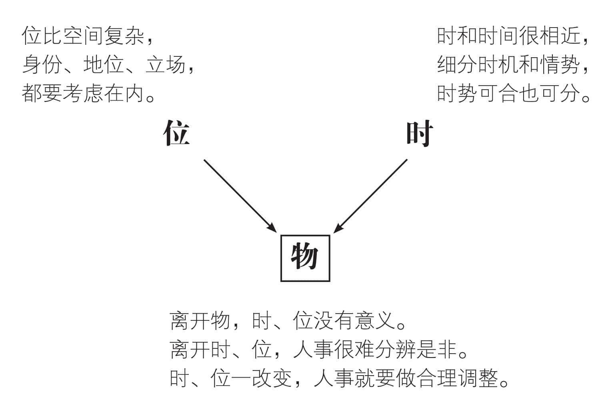
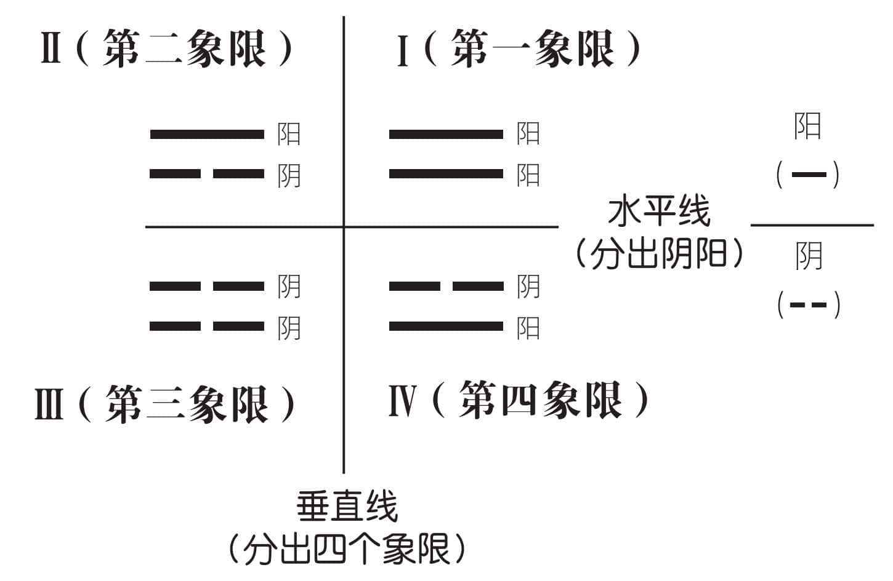
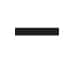
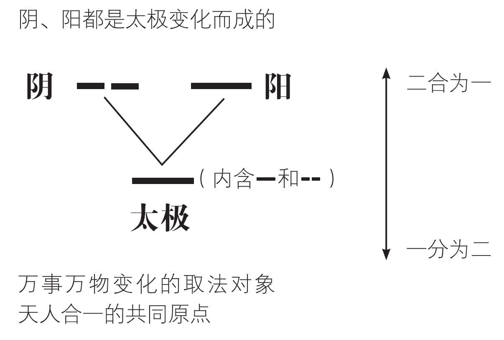
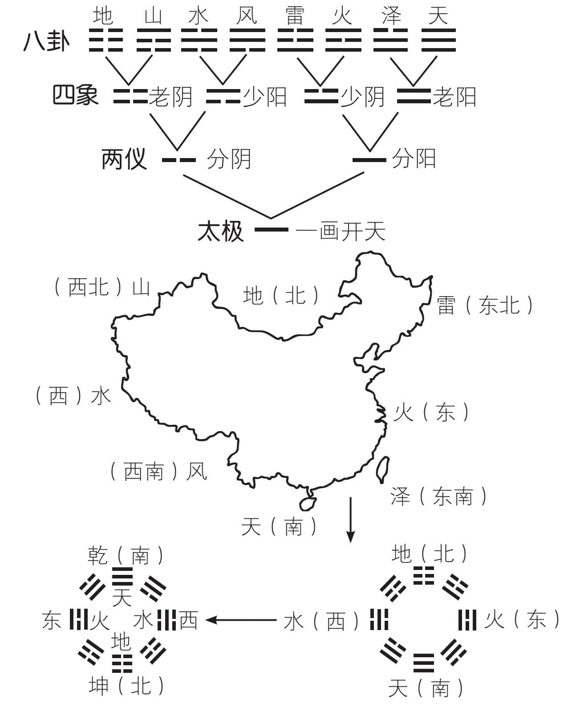
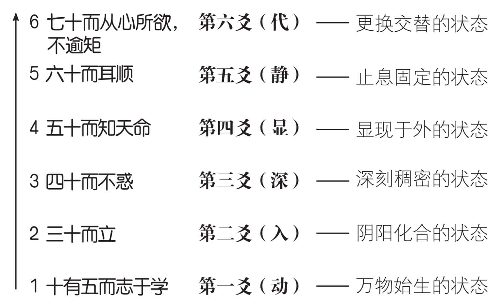
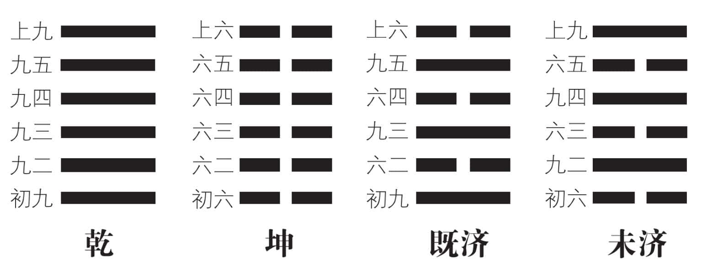

 **第三章**

 **为什么需要合理定位？**

位指空间、身份、地位，

由下而上，一阶段一阶段地向上提升。  

每一阶段，都有合适的身份和地位，

做好自我定位，便是我们常说的守分。  

万事万物，若是分成六大阶段，

分别以动、入、深、显、静、代来考察。  

配合每一段的实际状况，

采取合理的必要措施，自然能顺利发展。  

时、位和事物的性质，这三种要件，

我们可以利用两个数字，来加以标示。  

不但明确定位，一目了然，

而且开启了“把二看成三”的智慧。

# **一　时与位是变化两大要件**

时间和空间，通常合起来称为“宇宙”。四方上下叫做“宇”，古往今来便是“宙”。《易经》不这样说，而是用“时”和“位”来描述。“时”和“时间”的差别比较小，“位”和“空间”则有相当大的不同。《易经》的“位”，和主体的“物”必须合在一起。我们认为，若是没有”物“的存在，”空间“是没有必要加以讨论的。

“物”离不开“时”“位”，然而“同时”未必“同位”，因为立场不一样。同样一件事情，只要立场不一样，看法就不一定相同。

系辞上传一开始就说明“天尊地卑，乾坤定矣”。乾是天，坤为地；天地即乾坤，乾坤也就是天地。乾()为纯阳，坤()是纯阴，代表八卦这个《易经》大家庭中的父母，成为一家之主。后来演变成男尊女卑，完全是望文生义，不求甚解，而又自以为是的不良后果。

位有高低，高的不一定贵。高贵表示既高又贵，并不是凡位高的必定贵。低贱表示既低又贱，不一定低就是贱。两个字相连接，各有各的意义，合起来又是另一种意思。千万不要合久了，就忘记分开的解释。

天尊地卑，和贵贱没有关系。男尊女卑，表示男女同权不同质。虽然平等，仍然各有特性，不容忽视。

时、位一改变，物就必须做出合理的调整。以此类推，人事要以时、位为背景，才能够判断是非。离开时、位，就没有是非可言。人事要不要调整？应该怎样调整？最好看时、位的变化，寻找合理的平衡点。定位、正位、当位的重要性，我们从现在开始，就要逐渐加以说明。

# **二　一画开天是定位的开始**

我们虚拟一下人类原始时代，最常挂在嘴边的，是哪一句话？应该是“你在哪里”，对不对？因为人类是群居的动物，若是单打独斗，根本不是其他动物的对手，所以聚众共事，同心协力，可说是十分必要。为了找到对方，我们必须发出“你在哪里”的讯号。对方要正确回应，自非明确定位不可。

伏羲氏一画开天，用现代话语来说，便是“画一条水平线”。把三百六十度的空间，一下子分成了两个一百八十度的空间：水平线以上为阳，用“”这个符号来代表；水平线以下叫做阴，用“”这个符号来表示。

刚开始大家觉得很方便，很快就可以找到对方所在的位置。然而不久后就觉得不够用，于是加上一条垂直线，成为四个象限，也就是四象。阴()和阳()称为两仪。仪的意思是“仪态”。阴()和阳()表示两种相对的仪态，也就是我们常说的“样子”。清晨朝阳初起，温度不高，大地依然阴凉，象征阳在上阴在下，其象为上阳下阴()，即为少阳。中午太阳热度充足，完全驱除大地的阴凉，便是二阳重叠的老阳()。到了夕阳无限好，可惜近黄昏的时刻，大家感觉阳光的热力减少，但是地气仍然炙热，其象为上阴下阳()，故名少阴。逐渐进入午夜，成为老阴()。因此，我们就能从原先的阴阳两位，变成老阳、少阴、老阴、少阳四位，称为四象。

阴阳称为两仪，两仪交易，阴爻变阳爻，阳爻变成阴爻，结果形成四象。一画开天之后，人们把空间愈分愈细，对于寻找定位，愈加精确而方便。接着，我们想起了：原点。

# **三　太极是天人合一的原点**

现代社会愈来愈复杂，以致到处都洋溢着“回归原点”(Back to Basic)的诉求，希望能借由化繁为简，来找到单纯的原点。厘清思绪，弄清楚原本的真正意义，再重新出发。

天人合一的起点，也就是万事万物的原点，我们把它称为“太极”。“太”这个字，由“大”和“、”组合而成，“大”极了，加上“、”（小）极了，就称为“太极”。好比我们家里，有这么一个人，大起来比谁都大，小起来比谁都小，我们就把她称为“太太”。

大极了，大到其大无外，够大了吧！小极了，小到其小无内，也够小了吧！它既没有固定的形状，也没有一定的功能。当然，原本也没有名称，便姑且把它命名为“太极”。

系辞下传说：“天下之动，贞夫一者也。”意思是天下万事万物的所有活动，都是取法于太极。其中的“”，代表伏羲氏最早想到的基本动能。后来发现这个基本能量，内含两种相对的力量，分别称为阴()、阳()。

太极和阴阳是合一的，没有阴阳就没有太极，没有太极也就没有阴阳。“”是太极，阳()和阴()也都是太极。我们可以说阳爻()原本就包含了阴爻()，因为阴爻()中间有一个空隙，表示“折断了的阳爻”。如此观之，太极是阳爻()和阴爻()“二合为一”；而阴爻()和阳爻()则是太极分化而成，叫做“一分为二”。阴阳既能合一，又能分化为多元，所以称为是“一之多元”，把“一”和“多”等而视之。

# **四　先天八卦配合中国方位**

伏羲氏想到太极的时候，连带两仪、四象、八卦的概念，也十分清晰。换句话说，太极、两仪、四象、八卦，乃至于后续的十六卦、三十二卦、六十四卦都同时出现了。

中华民族发源于古代的中原地区，算起来都是北方人。为了照顾南方广大的同胞，君王必须面向南方而坐，所以一眼看出去，就看到天；回头看自己的座位，才是地。因此天南地北，便成为正当的方位。太阳由东方升起，一片火红，火在东，自然一目了然。一江春水向东流，我国的水流，发源地在西边，向东流是十分自然的现象。东南沿海，用泽来表示；西北多山，以山为代表；西南多风，而东北多雷，正好和伏羲氏先天八卦的方位相配合。

太极一分为二，形成阴()阳()两仪。阴可以和阴互动，阴也可以和阳互动。反过来看，阳可以和阳互动，阳也可以和阴互动。依据排列组合的结果，形成老阳()、少阴()、少阳()、老阴()四象。如果画成四个象限，那就稳定而难以发展。我们画成树状，表示可以持续向上发展，含有生生不息的精神。老阳和阳互动，成为天()；和阴互动，即为泽()。少阳和阳互动，变成风()；和阴互动，便是水()。少阴和阳互动，造成火()；和阴互动，形成雷()。老阴和阳互动，就是山()；和阴互动，即是地()。天、地、水、火、风、雷、山、泽这八种自然现象，成为人类生活的基本条件。伏羲画卦，至三爻为止，个中真义，值得我们深思。

# **五　重卦六爻表示六大阶段**

我们把伏羲氏所画的八个基本卦，配合我国地形所构成的八卦，称为“先天八卦”，便是相对于周文王把八卦两两相重，构成六十四卦，所组成的“后天八卦”。

八卦原本由三个爻组合而成，周文王把两个基本卦重叠在一起，形成每卦六个爻。用意是每一个人、事、地、物，都可以产生变化。我们把它划分成六个阶段，来加以观察、分析、比较，应该更容易了解和掌握未来的变化。譬如乾卦，原本只有三横，再加上三横，成为六横()；坤卦原本只有三条中断线，再加上三条中断线，便成为六条中断线()。其余六十二卦，都依此类推。

这六爻的次序，和“易气由下生”一样，皆是从下往上计算。最底下为第一爻，表示第一阶段，然后依次向上，分别为第二爻、第三爻、第四爻、第五爻和第六爻，也就是第二阶段、第三阶段、第四阶段、第五阶段，以及第六阶段。我们用“动”（万物始生的状态）、“入”（阴阳化合的状态）、“深”（深刻稠密的状态）、“显”（显现于外的状态）、“静”（止息固定的状态）、“代”（更换交替的状态）来表示演变进化的历程。

孔子自述他的一生：十有五志于学，三十而立，四十不惑，五十而知天命，六十而耳顺，七十而从心所欲，不逾矩，便是划分为六个阶段，分别加以明确的定位。

有了明确的目标，也就是定位，我们一方面知所努力，一方面也找到检核的标准。按部就班，逐渐完成人生使命。

# **六　把时位和性质合起来看**

六十四卦，每卦六爻，由下而上，分别称为初、二、三、四、五和上爻。可以说是把“时”和“位”合在一起，也就是将初、二、三、四、五、末的“时”，和下、二、三、四、五、上的“位”合并起来。取“初”舍“末”，表示万物始生之际的“时”比“位”重要，而用“上”不用“下”，则表示终了时，“位”比“时”更为重要。因为时和位的六大阶段，二、三、四、五是共通的，只有初、末和上、下的说法不一样，而初、末代表“时”，上、下表示“位”，不采取初、末或上、下的对应，却说成初、上，虽然不相对，却巧妙地涵盖了时和位，两者并举。

时（初、二、三、四、五、末）和位（下、二、三、四、五、上）之外，还需要了解事物的性质，是阴或是阳。用两个数字，来表达时、位、性质三样要件，对我们中华子孙来说，开启了“把二看成三”的智慧。我们常常在正、反，上、下，和对、错之外，产生第三种说法，那就是“不正不反”、“中间”和“很难讲”，实在十分灵活。

上经的最初两个卦，乾卦六爻，用初九、九二、九三、九四、九五、上九来表示。《易经》的阳爻，用九来代表，所以乾卦从第一爻到第六爻，全部都是九。初爻“时”最重要，所以先说初，再说九。末爻“位”最要紧，因此先说上后说九。其余四爻，先说性质，然后才标示时位。《易经》的阴爻，以六为代表。坤卦六爻，分别为初六、六二、六三、六四、六五和上六。其余六十二卦，都是阴爻和阳爻交错出现，应该如何用两个数字来标示，必须多多练习，务求十分熟练。

# **我们的建议**

1.人生在世，最重要的事情，莫过于提升自己的道德修养。由于年幼无知，必须分阶段进行。《易经》六爻分成六大阶段，各有定位，比较容易逐步提升，循序渐进。

2.六十四卦各有六爻，依爻的性质，阴爻分别标示为初六、六二、六三、六四、六五和上六；阳爻则标示为初九、九二、九三、九四、九五和上九，必须熟练。

3.一、三、五、七、九为奇数，属阳。这五个数字当中，九最大，用来表示阳爻的性质。因为阳的性质，是向外扩展，所以九是老阳，用来表示阳爻，十分合适。

4.一、二、三、四、五是“生数”，一只手掌伸出来便已具备；六、七、八、九是成数，必须伸出两只手掌，才能合并而成。这四个成数当中，六和八属阴，七和九属阳。七比九小，所以七代表少阳，而九代表老阳。

5.六和八属阴，是偶数。由于阴爻的性质，是向内收缩，六比八小，显示收缩得比较紧，所以八是少阴，而六反而是老阴。我们用九代表阳，以六表示阴，含有阳胀阴缩的意思，果然把性质表达得很清楚。多多练习，自然熟悉。

6.《易经》每一卦由下向上，依次为初、二、三、四、五、上六位，分别代表六阶段变化的状态。我们当然不能固定地把所有事物都做出这样的划分，但是八九不离十，做一种概括性的区分，应该是妥善的定位方式。

