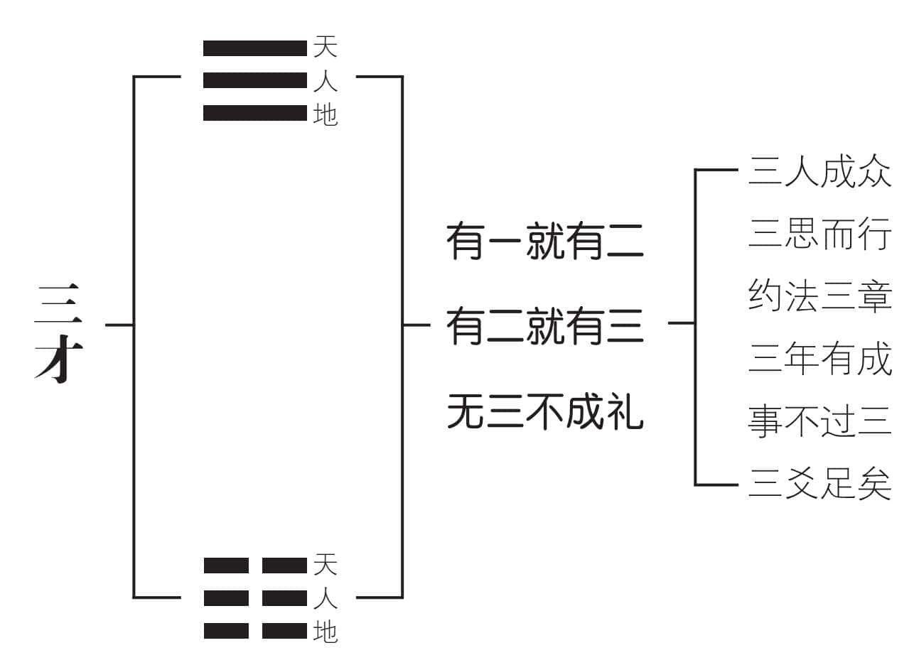
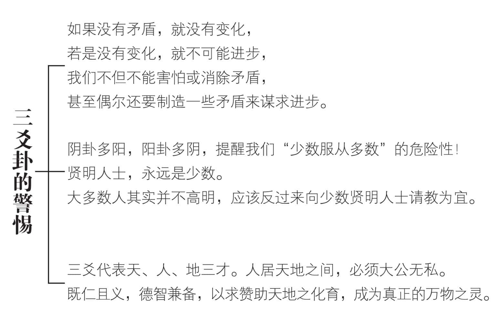
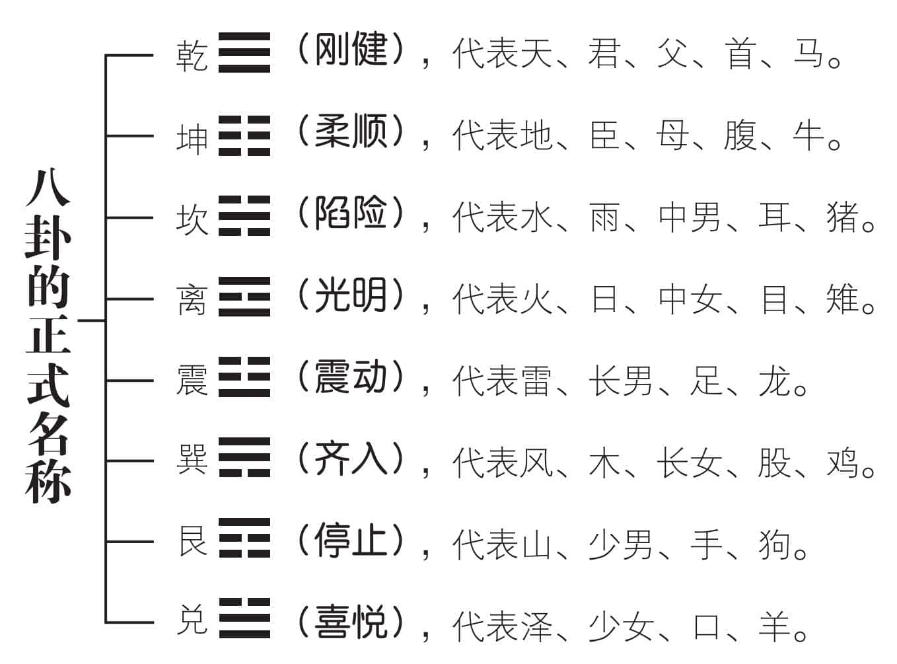
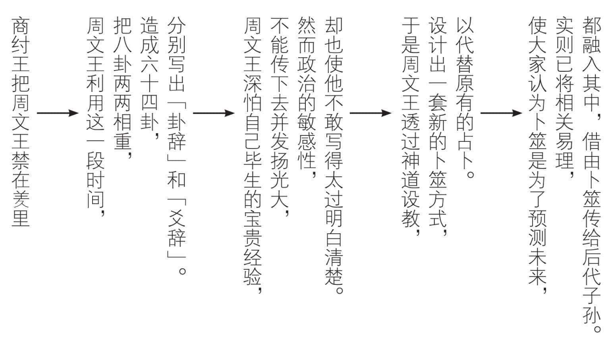
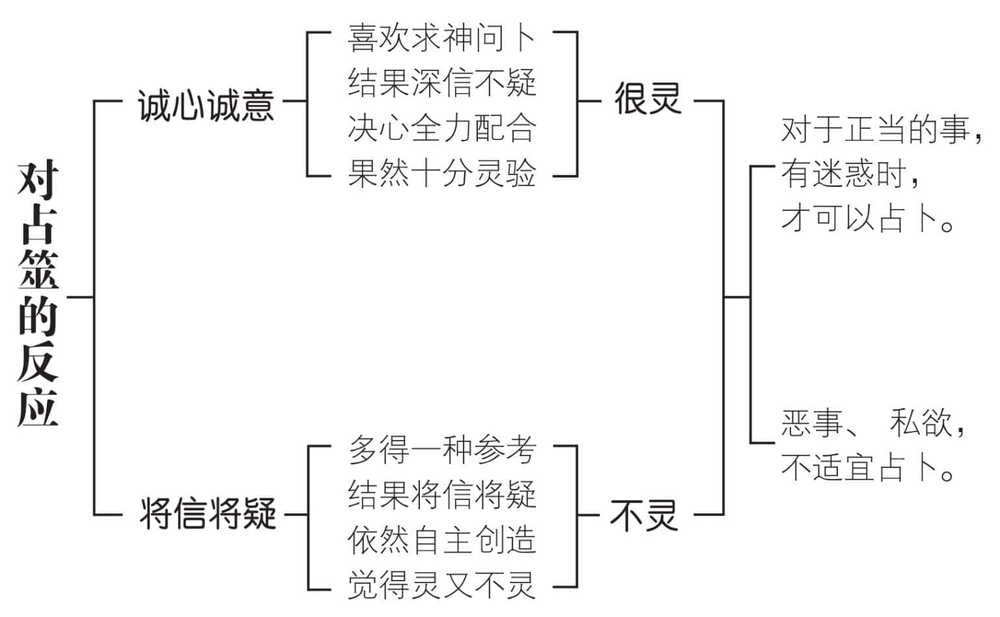
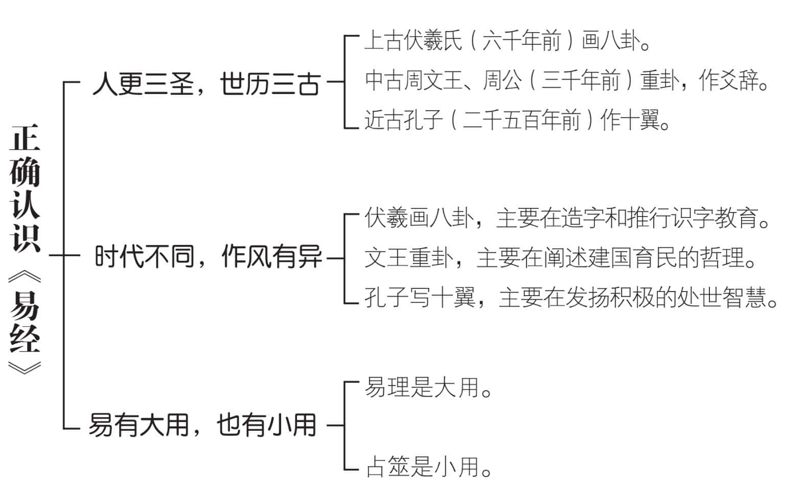

 **第四章**

 **能预测未来的变化吗？**

伏羲氏完成了八卦的符号，

原本的用意，不完全是为了造字。  

周文王和周公重卦写爻辞，

是用来阐述建国育民的哲理。  

为了逃过被纣王迫害的劫数，

不得不以神道设教，利用占筮。  

孔子深知占筮的目的不在卜问结果，

而是指引大家，应当如何思考行事方为妥善。  

我们不应该成为听天由命的宿命论者，

而是要知命，决定自己人生的正当途径。  

孔子提倡“不占而已矣！”

鼓励大家发扬易理，遵循大道而行。

# **一　伏羲氏画三爻卦的启示**

中华民族在黄帝以前，历经渔猎、畜牧、农耕的阶段。相传伏羲氏是畜牧时期的开创者，教导人民驯养牛羊牲畜，过着比较安定的日子。那时候还没有文字，伏羲氏画卦，很可能是为了方便记事，和创造文字有密切的关系。

他首先一画开天，用最简单方便的“”，代表万事万物的根本。依现代的观点，宇宙万象错综复杂，变化无穷，而且永不停息。控制宇宙的机制，必须十分单纯而简易，否则无法达成这样的功能。然后分阴“”分阳“”，告诉我们一切都出于阴阳的互动和变化。他把阴爻和阳爻，两两相重，造成老阳()、少阴()、老阴()、少阳()四象。再进一步，画出天()、地()、水()、火()、雷()、风()、山()、泽()八卦。然而为什么伏羲氏不继续画四爻卦、五爻卦呢？

因为他抬头看到天，低头看着地，中间有万事万物，而以人为代表。三爻卦的上爻若是表示天，下爻如果表示地，则中间那一爻，便可以用来表示人，构成天、人、地三才，也就是宇宙的三个主要原素。如果再增加一爻，变成四爻卦，不但增加复杂的程度，而且不如三爻卦合理。三爻卦一共三爻，不是阴多阳少，便是阳多阴少，很容易变化。不像四爻卦那样，若是阴阳数目相同，平衡稳定，反而不容易产生变化。三爻卦告诉我们：“无三不成礼”——只要“三人成众”，通过“约法三章”，加上凡事“三思而行”，必能“三年有成”。事不过三，三爻卦足矣！

# **二　三爻卦对现代人的警惕**

伏羲氏的时代，人类的生活原始而简朴，天地之间的景象十分单纯，没有什么人造的器物，显得很简单。

现代社会，充满了人为的东西。我们想到回归原点，最好对三爻卦做一番反思，看看有什么值得警惕的地方。

首先，三爻卦除了天是纯阳()、地为纯阴()之外，其余六卦，不是阴多阳少，便是阳多阴少，形成阴阳不平衡的局面。我们不要忘记：天地之间，如果没有矛盾，就不可能产生变化，也就不会进步。我们不但不能够害怕矛盾或消除矛盾，反而应该面对矛盾，设法化解。说得露骨一些，偶尔还要刻意制造一些矛盾，才能促进变化与进步。

阳多阴少的卦，称为阴卦，一共有三个：泽()、火()、风()。阴多阳少的卦，叫做阳卦，一共也有三个：山()、水()、雷()。阴卦多阳，阳卦多阴，提醒我们：少数贤明的人士，远比多数脑筋不清楚的人要来得重要。现代人过分相信“少数服从多数”的必要性，致使人类在某些方面愈来愈退步，令人十分忧虑。

三爻卦的上爻代表天，中爻代表人，下爻表示地，形成天、人、地三才，告诉我们：天、人、地各有不同性质的才能。天高明而无所不覆，地博厚而无所不载，人必须德智兼备，公而忘私，以求既大且久，生生不息。天地之间有万物，由于人为万物之灵，所以负有顶天立地、辅助天地的任务。为了致中和，人必须讲求仁义。凡是伤天害理，污染环境，破坏生态系统的事情，一概不能做。

# **三　八卦名称的转变和意义**

如果说只能代表天，只能够代表地，其余六卦，也都只能代表单纯的现象，那么八卦的功能，就会受到很大的限制。有了文字以后，八卦获得正式的名称：天为乾，地为坤，水为坎，火为离，雷为震，风为巽，山为艮，而泽为兑。目的在扩大原有自然现象的内涵，将相近似的功能、性质、意义合并起来，以增进其效能。

“乾”的意思是刚健，代表向上生长的大动能。象征天的自强不息，恒久主动。天、君、父、首、马，都属于乾的性质。

“坤”的意思是柔顺，表示收缩、安静的包容性。象征地的厚德载物，安顺贞吉。地、臣、母、腹、牛，都属于坤的性质。

“坎”的意思是下陷，代表危险的状态。象征水的难以治理和深浅莫测。水、雨、中男、耳、猪，都属于坎的性质。

“离”的意思是美丽光明，为了预防大家盲目追求美丽光明而弄得离心离德，所以用离字来表示。象征火的明亮，终将由于燃烧的物质灰飞烟灭而止熄。火、日、中女、目、雉，都属于离的性质。

“震”的意思是启动，代表起伏的状态。象征春雷发声，地下震动。雷、长男、足、龙，都具有震的性质。

“巽”的意思是齐、入，表示整体划一的状态。象征风的无孔不入，草木顺势伏地。风、木、长女、股、鸡都具有巽的性质。

“艮”的意思是止，代表山行艰难的状态。象征山路难行，有停止不前的念头。山、少男、手、狗，都具有止的性质。

“兑”的意思是喜悦，表示使人喜悦的景象。象征泽的反映天象，赏心悦目。泽、少女、口、羊，都具有喜悦的性质。

# **四　周文王重卦的神道设教**

周文王原本是商朝西方的诸侯，由于仁厚贤德，被尊称为西伯。当时商朝的帝王，是横征暴敛、荒淫无道的纣王。人民失望怨恨，诸侯也开始反叛。有人向纣王密告，纣王便把西伯囚禁在羑里，也就是现代河南汤阴。文王利用这段时间，把伏羲氏的八卦，两两相重，演出六十四卦，将他毕生的宝贵经验，撰写成“卦辞”和“爻辞”。因为内容涉及十分敏感的政治，所以不敢写得太过明白、清楚，又假借新的筮术以代替原有的占卜，实际上是以神道设教，来避人耳目。表面上看，好像有“神通”的意味，实际上却是一种推理。我们可以如此解读：直截了当地把结果说出来，叫做“神通”；把推测研判的过程说出来，然后才说明结果，即为“推理”。这两者有许多相通之处，不能够用二分法来加以划分。

古人占卜时，内心十分虔诚，仪式则简单隆重。孔子一方面推崇文王的伟大贡献，一方面却倡导“不占而已矣”。因为时代愈进步，知识愈普及，更能够理智地推论出自己目前的处境，合乎六十四卦中哪一卦的状态，那么也就用不着占卜，直接查阅该卦所揭示的道理，切实笃行即可。然而，若是不能理智推论出自己所处的卦位，还是可以依据占卜来找到定位。

不论查阅或占卜，目的都在预测未来的变化。我们都知道“预防胜于治疗”，“及时的一针，胜过事后九针”的道理。透过占卜来预知未来，是《易经》的主要功能之一。即使测不准，还是很想测，这是人之常情，毕竟多一种参考，多一种选择，对每个人来说，皆是利多于弊的。

# **五　现代占卜愈来愈不准确**

往昔的生活变化不大，大家的看法大同小异。搞怪的人并不多，求新求变的观念也不普及。在那个单纯的年代里，诚心诚意的人比较多，对于占卜的结果，很容易相信，也显现高度的配合。在这种情况下，占卜准确度当然很高。

现代人自主性提高，大多喜欢自作主张，不相信权威，对于占卜的结果将信将疑。即使诚心诚意，也不过是口头上的不反驳，态度上的貌似恭敬，如此而已。

世界愈变愈快，根本的原因，即在于大家的心，并不安定。满脑子求新求变，自然造成愈变愈快的结果。

科学愈发达，科学家愈明白：科学不可能告诉我们真相。它只是一条“渐近线”——愈来愈接近真相，却始终有一段距离。至少我们可以肯定：未来并不是科学所能够控制，或者全盘知晓的。只有看水晶球、看手相、求签问卦的人，才会相信这种“科学的预知”。这种“科学”，实际上已经变成一种“宗教”，信到差不多就好，再信下去，必然成为“迷信”。迷信科学，对未来的变化，并不一定正确，因为科学本身也在变化，每隔一段时间，就会出现新的见解，而这些新的见解，也未必正确。

现代人很容易陷入两极化：不是过分悲观，认为未来的变化太过复杂，根本不可测，便是过分乐观，以为科学和技术是万能的，可以适时解决未来的各种难题。这两种态度，对占卜的结果，便常是姑妄听之、姑妄信之。即使占卜真的十分准确，对于这两类人士来说，也可能变得极不准确。

# **六　孔子倡导不占卜的道理**

《易经》成书的过程是“人更三圣，世历三古”，意思是由八卦到十翼，经过悠久的岁月。从上古的伏羲，中古的文王、周公，到近古的孔子，可以说是源远流长。周文王和周公是父子，合起来算一圣，加上前后两圣，也就是伏羲和孔子，所以说是经过三位圣人的费心劳神，才能有这样的丰硕成果。

伏羲画卦，原本或许是为了造字。用八卦断吉凶，可以说是推行识字教育的一种方法。文王借重卦爻辞的变化，揭示建国育民的哲理，唯恐不见容于暴虐的纣王，不得不透过神道设教。借由占卜的包装掩护，不但使文王逃过生前的劫数，也使《易经》逃过后代秦始皇的焚书禁令。从此《易》为占卜之书流传迄今。有些人鄙而视之，有些人却盲目迷信，殊不知孔子作“十翼”，其目的在阐扬易理，并且破除迷信。

我们的行为，最好凭良心，合乎伦理、道德的要求。凡是应该做的，不论结果怎样，都应当去做。只问耕耘，不问收获，才是正当的态度。求神问卜的时候，若是只看结果，挑对自己有利的才行动，动机已经很不纯正。孔子对于这样的占卜，持反对的态度。相反地，占卜的人，不应只是消极地等待占卜的结果，而是要更进一步，询问应当如何进行。一方面坚持正当的目标和途径，一方面则寻求趋吉避凶的方法。把消极的占卜，变成积极的处世智慧，才是孔子把《易经》列为必修的六经之一，所乐于见到的行为“变易”。

正当的事必须去做，在方法上有迷惑时，可以透过占卜作为参考。恶事、私欲，根本不可以占卜。可与不可的分际，必须妥为掌握。

# **我们的建议**

1.八卦的基本作用是阴阳，万事万物都离不开阴阳变化。代表阴阳符号的是六和九两个数字，也就是《易经》常用的数。我们常说“心中有数”，便代表对未来变化有所准备。

2.与其说《易》为群经之首，不如说《易》为群经之始。因为伏羲画卦，原本是为了造字，透过八卦的运用，来推行识字教育，是经学的开始，当之无愧，用来启发人类本有的智慧，然后学得的知识，才能够灵活地正当运用，对人类有益。

3.占卜者，若是以易当做教化的工具，透过这种方式，可使大家明白道理。选择应当走的途径，不畏困难，不怕挫折地勇往直前，便是善用占卜来积极开发自己的处世智慧。

4.八卦代表八种自然现象，原本没有吉凶可言。文王写卦辞、爻辞，指出人生祸福的因缘。孔子则直接说明吉凶祸福，实际上由我们自己的道德来决定。聪明人懂得透过占卜的过程来明白道理，然而，若是完全相信结果，很可能会误了自己。

5.孔子说不占，并不是反对正当的占卜。对君王、长上，不方便说道理，仿佛对其教般极不妥当，有时便可假借占卜之名，说明其中的道理，当然是一种良好而有效的方法。

6.完全相信占卜的结果，等于放弃自己的自主权。把自己的未来，交由他人决定，合适吗？还不如参考占卜的结果，再从中找出趋吉避凶的方法。然而，我们应该要做的事，还是要努力去实践。

