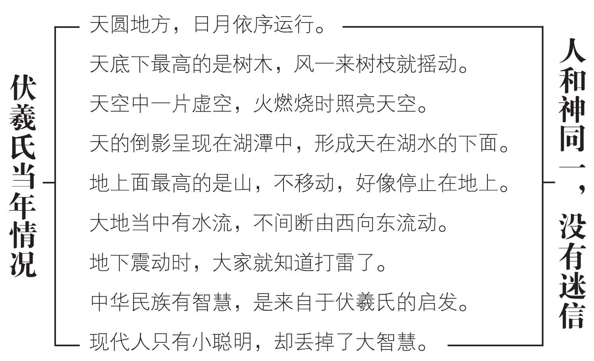
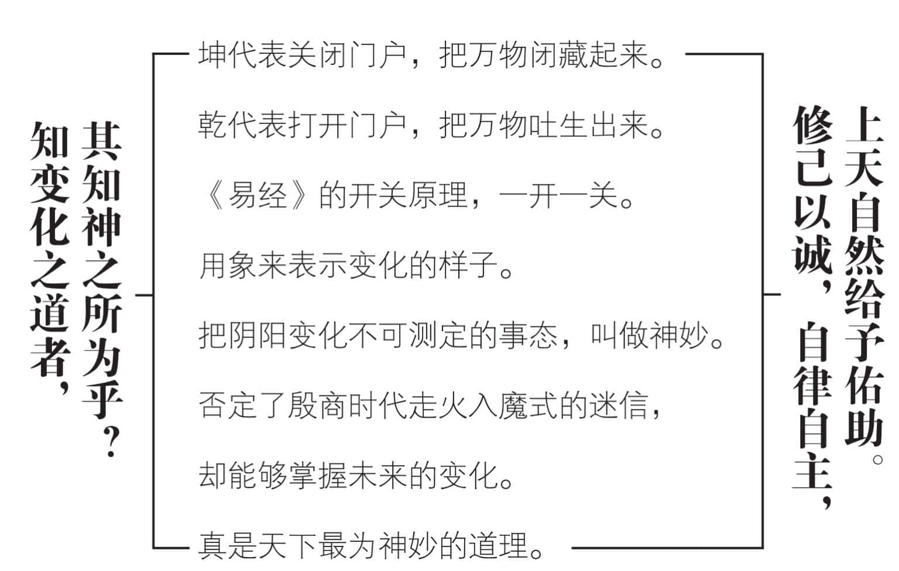
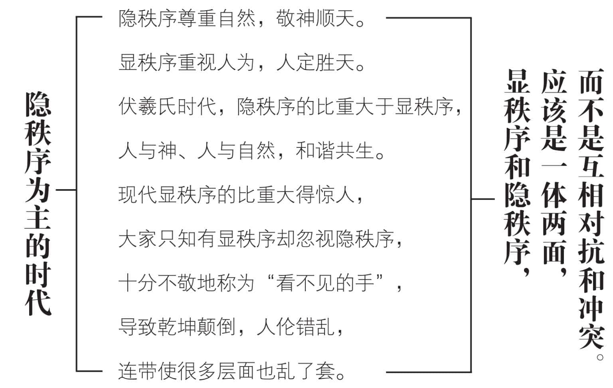
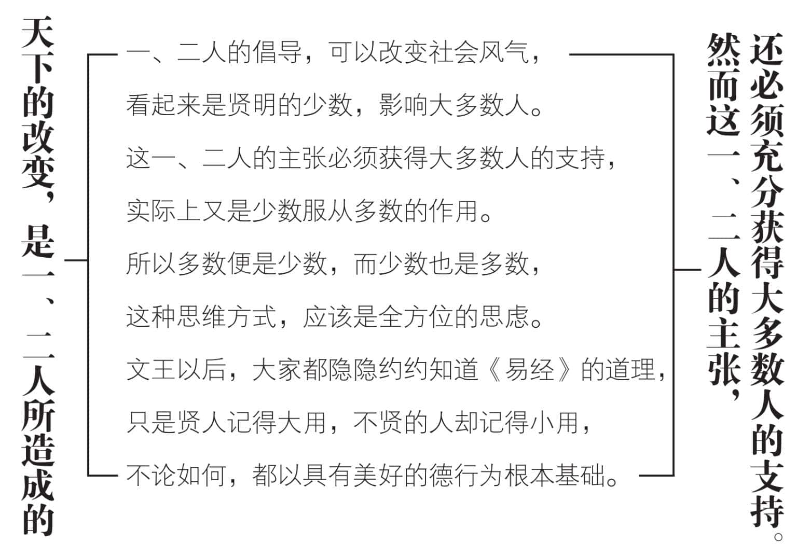
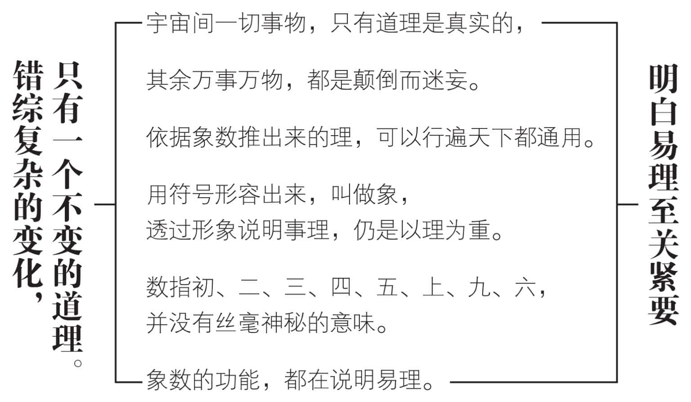
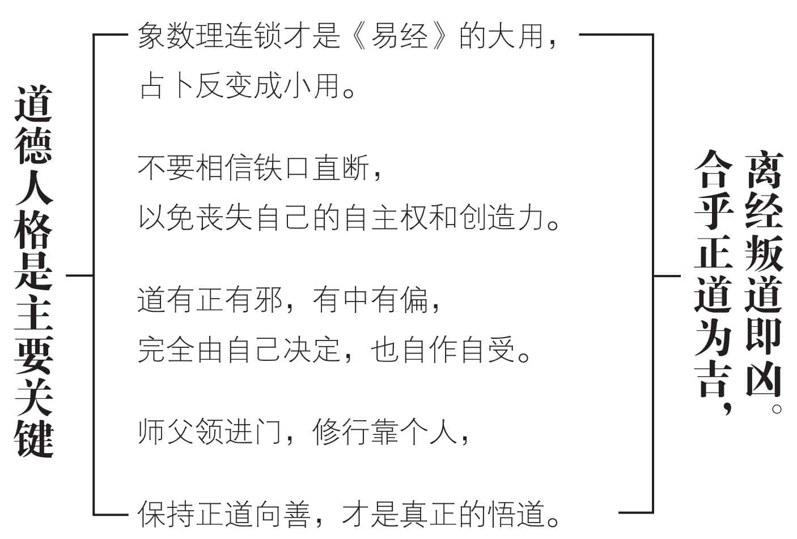

 **第八章**

 **易经是怎样开始的？**

想了解《易经》开始的情况，

请模拟伏羲氏当年的自然景象。  

环境既单纯又自然，

人心也相对地简单而纯洁。  

随着时代的变迁，

显秩序和隐秩序愈来愈遥远。  

这时候回想《易经》开始的情况，

对回归原点，正本清源十分有助益。  

天地万物的变化，只有一个道理，

称为象数理的连锁作用，生生不息。  

道德人格是主要的关键，

保持善的方向不变，才是正道。

# **一　想一想伏羲当年的情况**

要了解《易经》的起源，必须先想象一下伏羲氏当年所处的环境，所能看到的景象，到底是什么样子？既没有现代的高楼大厦，天空底下最高的就是树，风吹来，树枝、树叶会跟着摆动，所以天底下动的就是风()；那时没有地下铁道，行驶起来有震动的感觉，因此地底下动的，只有雷()；那时候环境十分自然，人心也相对单纯，八个基本卦，也就够用了。由于一阳一阴之谓道，天底下如果有看得见的显秩序，就一定有看不见的隐秩序。伏羲氏的时代，自然的景象居多，人为造作很少，人们很习惯于隐秩序，显秩序反而不明显。就算逐渐增加一些显秩序，也大多引申隐秩序，彼此相当吻合，没有什么“天定胜人”或“人定胜天”的争论。经过伏羲氏的指引，大家都接受宇宙是一个大太极，人人都只是一个小太极的观念，真的十分简易。

伏羲氏最大的贡献，是以他的智慧，为人民定出了方向。如果他指出所有的秩序，都是神在主宰，中华民族势必走向宗教途径。然而，伏羲氏并没有这样做，一直到现代，我们受到他的影响，有信仰而没有宗教，成为最大的特色。“智慧”和“知识”不同，方向的指引，主要靠智慧。中华民族，本来很有智慧，现代却丢失了，学了很多知识，只落得小聪明——得到小聪明，失去大智慧，是现代中国人最大的不幸。伏羲氏的时代，人和神是同一的，既没有神圣的灵光，也没有迷信的色彩。对于《易传》所说的“神”，我们应该好好体会一番，才不致为小聪明所误！

# **二　神就是知变化之道的人**

系辞上传说：“知变化之道者，其知神之所为乎！”懂得变化规律的人，知晓神明的所作所为，大家也就把他当做神了。我们把通达变化的人，称为了解事态，却把阴阳变化不可测定的事态，叫做“神妙”。若有人能够掌握未来的变化，摸清楚神妙的事态，那当然是神明，用不着怀疑。

《易经》本身既没有思虑，也没有作为。它寂静不动，却能够透过阴阳交感而通晓天下万事万物。如果不是天下最神妙的道理，又有谁能够达到这种地步呢？

“坤”表示关闭门户，把万物闭藏起来；“乾”代表打开门户，把万物吐生出来。这样一关一开，便是常见的变化。用来推知未来的变化，叫做“会通”。把变化显现出来，称为“表象”。变化成有形的器具，使用它，就是“效法”。人们反复不断地利用这些器具，却不知道它们的原理，岂不是十分神妙？

孔子不说怪、力、乱、神，却在《易传》中说了不少的神奇、神妙、神明、神灵，他还原了伏羲氏心目中的神，却巧妙地否定了殷商时代人们走火入魔式的迷信神。

伏羲氏告诉我们，只有自己努力尽责任，才能够获得来自上天的佑助，吉祥而无所不利。但是孔子在系辞下传又指出：“天下之动，贞夫一者也。”意思是天下万事万物的一切活动，都应该坚守贞正的精诚专一，也就是回归原点，既仁又诚。可见上天佑助与否，完全端视我们的道德实践正或不正，当位或不当位。求神不如求人，求人不如求己。只有修己以诚，自律自主，上天才会加以佑助，所以积善之家必有余庆。

# **三　伏羲时代以隐秩序为主**

既然一阴一阳之谓道，那么有隐秩序就有显秩序。前者无形无迹，很难掌握，也不容易说得清楚。后者有形有迹，比较容易掌握，也比较容易说清楚、讲明白。隐秩序要透过显秩序来表现，但仍有隐而不现的部分，我们称之为“看不见的手”。显秩序当中，确实有隐秩序的影子，使我们隐隐约约，觉得那一只看不见的手，真的若隐若现。

但是，我们必须警觉：现代的隐秩序所占的比重，刚好是伏羲时代显秩序的部分；而伏羲时代隐秩序的比重，却和现代的显秩序一样。乾坤颠倒，人伦错乱，连带使很多层面都乱了套。

伏羲时代，天圆地方是大家都看得见的自然景象。他用一个单纯的符号，把主宰一切变化的隐秩序，前无古人地彰显出来，成为人类建立显秩序的第一道曙光。

我们今天说天圆地方是可笑的，因为地球是圆的，地怎么能方呢？实际上圆就是方，而方就是圆。大方是圆的另一种说法，方到很大很大，不就成为圆了？小圆是方的另一种称呼，圆到很小很小，逐渐有棱有角，那不是方是什么？阴阳互变，方圆也不过是一种相对的名称。

八卦表示人类早期的显秩序，由于大多由隐秩序孕育而来，符合自然的规律，合乎人性的需求。伏羲氏说可以通神明之德，也可以类万物之情，意思是不但贯通了神妙光明的德性，而且也按类区分，描述了万事万物的情状。

显秩序和隐秩序，应该是一体两面，而不是互相竞争、对抗、冲突，可惜由于人类的小聪明愈趋发达而忘却了。

# **四　文武之道不坠各有见解**

周文王重卦，使八卦发展为六十四卦，同样是居于当时的需要，并不是文王贤德，登高一呼，大家就群起响应。

天下的改变，表面上看起来，是一、二人所造成的。实际上这一、二人并不一定能成功，还是要靠大多数人的支持。所以少数就是多数，多数便是少数。少数服从多数，和多数服从少数，不能用二分法的思维来加以分别。

文王距离伏羲三千多年，显秩序的势力，愈来愈强大，和隐秩序的距离，愈来愈遥远。文王不得不用当时的显秩序，来解说他所明白的隐秩序。一直到五百年后的孔子时代，依然争议不断。所以孔子才说：文王、武王的道理，并没有失落，仍有人传着。不过贤人记得“大用”的“道理”，不贤的人记得“小用”的“术数”。各有见解，也各有不同的用途。

六十四卦以人道思想为主，把八卦的天道思想，应用在人生的教化方面。因为人是天地自然所生，效法天地自然是必然的。效法什么呢？效法周流变化的道理，便是我们常说的“道”。人依道行事，就叫做“正道”的君子。正道是变化的，并非固定的。所以系辞上传说：“看到天下万物的道理深奥复杂，把它比拟成具体的形态，用来象征事物适宜的意义，称为‘象’。看到天下万物的运动变化，观察事物的会合变通，用来推行典章礼仪，透过六十四卦三百八十四爻的爻辞来判断事物的吉凶，叫做‘爻’。把这些变化的道理，真正应用在日常生活上，还要靠知晓“易理”的人，本身具有美好的德行。”

# **五　天地万物只有一个道理**

宇宙的变化，其实只有一个道理。系辞下传说：“天下之动，贞夫一者也。”便是告诉我们，千变万化的背后，有一个不变的道理。换句话说，有看得见的现象，就有看不见的势力。宋朝的朱子说得好：宇宙间一切事物，只有“道理”是真实的，其余万事万物，都是颠倒而迷妄。每一时刻，都有变化、毁灭的可能。这个不变的道理，并不是凭空想象出来的，它是依据“象”和“数”推理出来的，称为“象、数、理的连锁作用”，是推理而不是神通。

《易经》把宇宙变化的道理，透过阴（物质）、阳（精神）、时（时间）、位（空间）四大要素，依象数理来说明。伏羲氏有卦无辞，只有阴阳的象。简单八种形象，随人任意解释，当然包罗万象。周文王重成六十四卦，阐明“数”和“理”，从此理在象数之中，由象数以推理，便成为我们经常“观察有关现象，寻找有关数据，研究改变道理”的依据。长久以来，大家感觉到确实有效。

“象”是名词，“像”什么？就成为动词。道理显而不现，用符号把它形容出来就叫做“象”。八卦象征万事万物，六十四卦象征万事万物的变化。象征的意思，是透过形象来说明事理，还是以理为重，不能仅止于象。

“数”指初、二、三、四、五、上，说明“时”和“位”，九代表“阳”而六代表“阴”，并没有丝毫神秘的意味。不能把象数说成神迹，以免引起迷信。

象数的功能，都在说明道理，阐明易理最为重要。

# **六　道德人格成为主要关键**

现在开始，我们要把《易经》称为“易学”。因为自从《易传》出现以后，《易经》原有的占卜功能，逐渐为“易理”所取代。象数理的连锁，成为“大用”，占卜反而变成“小用”。卦爻定吉凶，只能当做趋吉避凶的参考。最好不要相信“铁口直断”，避免丧失了自主性和创造力。因为各爻的吉凶，实际上有“物极必反”的观念。卦象吉的，最后一爻大多反而不吉；卦象凶的，最后一爻有时反而吉。

前文所述“居中为吉”的观念，更是告诉我们：无论处于哪一种状态，都有可供选择的自然之道，那就是“变中不变”的“中”。“中”便代表“正”，也就是“正道”，所以吉祥。

吉凶的依据，则是隐秩序与显秩序兼顾并重的宇宙秩序，便是“道”。道有正道，邪道，有中道、偏道，完全由我们自己选择，也必须自作自受，不能够怨天尤人。

趋吉避凶要靠自己，主要关键在于自己的道德人格。上天是公正的，人人随时都能够“求道”、“修道”、“明道”、“悟道”，以致我们常常互相询问“知不知道”。中华民族有信仰而没有宗教，便是提醒我们，要信仰上天是公正而无法公平的，给我们同样的机会，却不保佑或保证我们有同样的结果。师父领进门，修行在个人。在个人的什么？在个人的道德人格上。系辞上传所说“继之者善也”，“继”就是保持方向，也就是保持正道向善的精神。人或事的“吉”、“凶”，即是依据合不合乎道的向善。合乎正道即吉，离经叛道当然是凶了。

# **我们的建议**

1.《易经》由八卦开始，“”、“”两个符号，是“象”。三爻排列组合，便成“数”。“象”、“数”当中，都透露出“理”来，我们常常观看现象，查阅数据，然后依理判断，找出因应之道，便是象、数、理的连锁作用。

2.最早的社会秩序，都由宇宙秩序来指引。所以显秩序和隐秩序相当吻合，也就是说天人合一的作用十分明显。现代社会显秩序逐渐远离隐秩序，最好提高警觉。

3.六十四卦，主要在提示我们，宇宙秩序是周而复始、循环往复的。以既济、未济两卦收尾，既济表示完成，而未济则代表尚未完成，又是另一周流的开始。

4.我们说“否极泰来”，便是“物极必反”的意思。趋吉避凶是我们共同的要求，但是关键在于我们自己的道德人格。一切自作自受，表示自己必须负起全部责任。

5.“道”有中有偏，我们必须觉悟，人有偏道的倾向，只要稍微松懈、放纵、狂妄，立即走上偏道。现代人的通病，即在于此。想一想《易经》是怎样开始的，然后正本清源，好好调整现有的普世价值，以求继旧开新，走上正道。

6.“正”是“变中不变”的道理，现代人盲目求新求变，远离中道，是自取其咎。回归原点，不能只是口头上说说，必须付诸实践。行中道，才是至关紧要。

