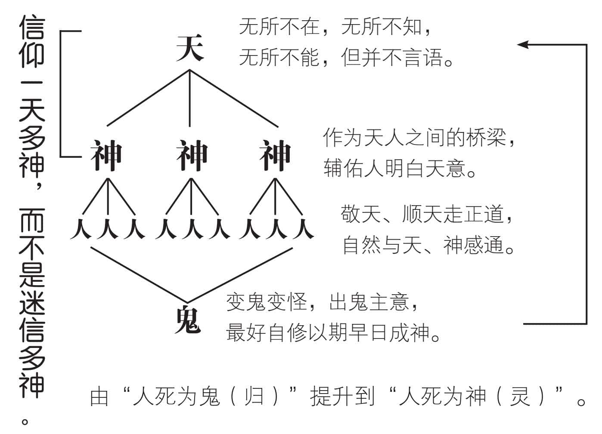
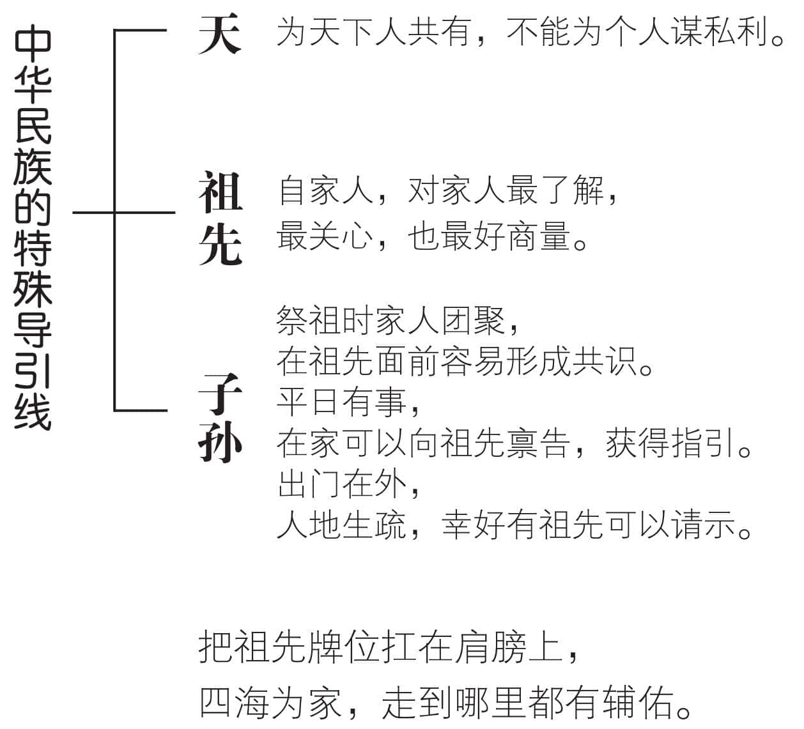
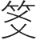
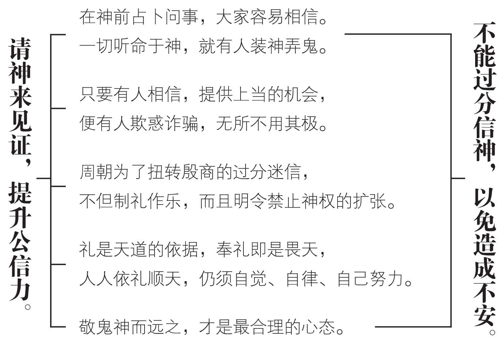
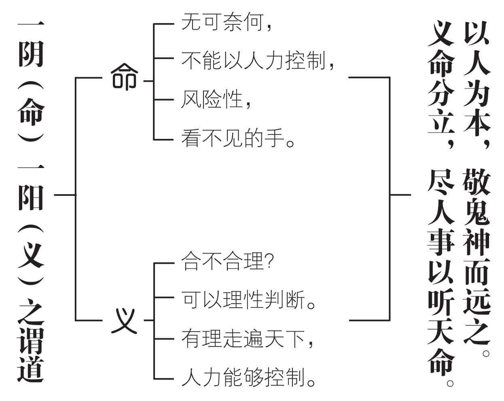
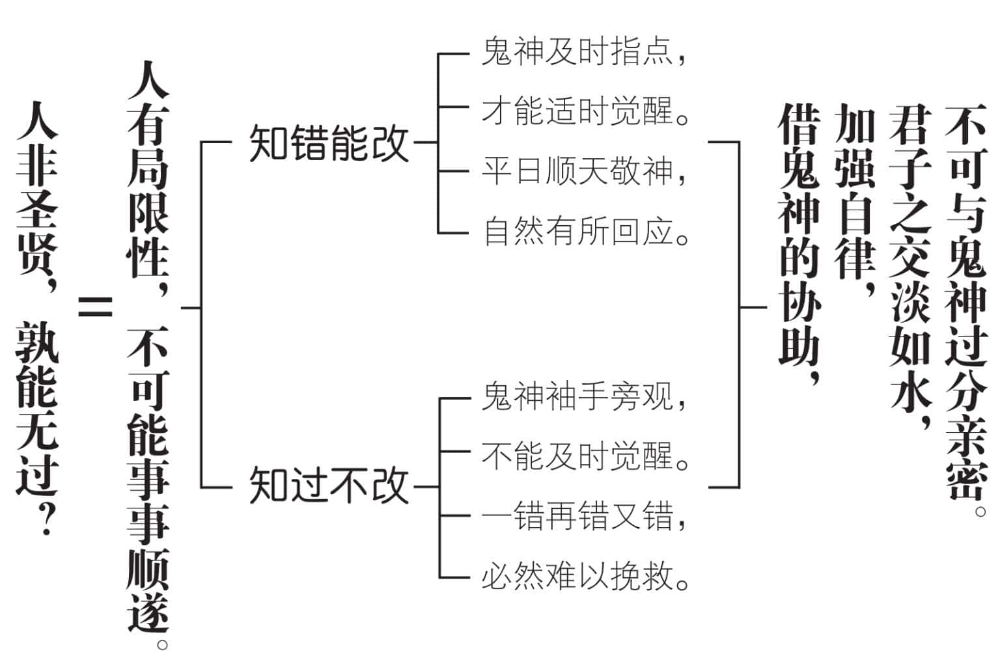
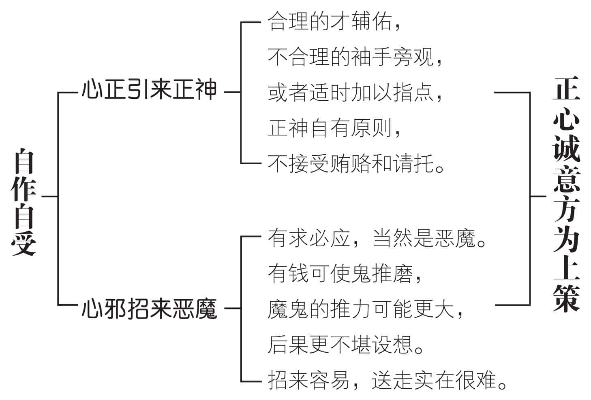

 **第九章**

 **易学的神是什么？**

避谈鬼神，难免是心虚的表现，

要谈鬼神，实在缺乏具体的证据。  

孔子虽然不谈鬼神，

却肯定了鬼神的存在。  

希望大家“敬鬼神而远之”，

以“情”感通，不模拟鬼神的形状。  

敬鬼神而远之，才是真正的敬，

可以启发自己的智慧，并努力向善。  

一方面承先启后，负起自己的责任；

一方面精神不死，务求不让后人辱骂。  

祷告鬼神的用意在求得自己清明感通，

不能索求功名利禄或因未如己愿而加以侮辱。

# **一　古代人与天及神的关系**

中国古代，把“天”当做人间的最高主宰，相当于基督教所说的“上帝”。这种观念，一直到现代，仍然具有很大的影响。由于“天”和“上帝”一样，都是“无所不在，无所不知，无所不能”，现代年轻人经常无意间发出“老天，My God”的呼喊，表示潜意识中，天即上帝。

然而，“天”毕竟和“上帝”不同。中国人只把人力所不能决定的部分归于天意。人力所能及的，人必须自行负责。孔子把它归纳成为：“尽人事以听天命”，人只管恪尽自己的心力，成败与否由天来做最后的决定。

天无言，人只好猜测天意。猜得准的，大家就认为很“神”。逐渐引申为“凡能协助人明白天意的”，都称之为神。所以后世神愈来愈多，遍及各地。我们信仰“一天多神”，和《易经》的“一（太极）之多元（两仪、四象、八卦）”相类似，并不是一般人所说的信奉“多神”教，因为我们只有信仰，却没有宗教。我们“祭天”，是尊敬上天的公正廉明，除非为大众求雨、求国泰民安，不能为私事向上天请求。一般人祈求上天保佑，不过是一种心理上的安慰。所以事过境迁，就抛诸脑后，实为人之常情。我们“祭祖”，是向逝世的祖先保证自己致力于光宗耀祖，不辱家风。由于血缘关系、骨肉情深，有时连声呼喊祖宗保佑，更是常见的事。天看得见，但天意难测，因为天看得远，还要顾及四方，不是我们所能了解的。神看不见，却没有不可解释的神秘性。天和神，都没有超越世界之上的权力，无所不能，也只能在世界的范围内施行。

# **二　神鬼依人世的习惯运作**

我们说神没有不可解释的神秘性，主要是“一阴一阳之谓道”，生死不过是阴阳的变化，所以“人死为神”，便很容易为大家所接受。天是天下人所共有的，只能为天下人设想，不会为任何个人谋取私利，因此十分公正，被尊称为“天公”。于是，我们便想起祖先，是自己家里的人，死后为神，对家人最清楚，也最为关爱。于是便在家里立起祖先牌位，有事好商量。中国人习惯把祖宗牌位扛在肩膀上，走到哪里就带到哪里。多了一条导引线，把我们和祖先的灵，紧密地结合在一起。祭祖先时家人团聚，在祖先面前交换意见，总归比较容易形成共识。平日有事，在家也可以向祖先牌位禀告一番，把不方便说出口的事情，默默地向祖先提出咨询，若是获得启示，就等于有名师指点。神和人的行为及价值标准，基本上十分接近，哪里有什么神秘性？由于人有品德修养的高下，所以死后也按其生前的表现，分别经过严格的考核，品德良好的为神，较差的为鬼。

中国人最有趣的事情，便是把自己的祖先当做神，却把同样是别人祖先的游魂称为鬼。当然，有时候对自己人不满意，也会骂一声“死鬼”，不过很快就会改口了。

这种亲密的神、鬼和人的关系，同样应该适可而止，否则就会成为迷信。但是，一旦有人相信，就会有人加以利用。天地间最擅长装神弄鬼的莫过于人，有人便有装神弄鬼的情况发生，不过是严重与否的程度有所不同而已。孔子极力加以导正，仍然免不了有很多观念，迄今仍然存在。

# **三　占卜祈求神示的公信力**

占卜祈求神示，用现代话来解释，应该是占卜的人，为了增加公信力所假定的一种方式。一直到现代，仍然有人相信在神前掷，同样是一种占卜用具。

伏羲氏画八卦，原来可能是为了造字，并透过符号的变化，以实施教化。但是免不了被神化，应用做迷信的工具。到了殷商时代，大家过度信神，所有人事都诉之于神，以致利用占卜欺惑大众，层出不穷，反而造成不安。

周文王重卦，原本想要扭转当时一切听命于神的不良现象，希望大家透过卦爻的变化来趋吉避凶，而不是接受吉凶的判定。但是，当时的大环境，不容易迅速加以改变，以致周朝开始制礼，限制人民信神，提出反神权的观念，这些都是周公的“天命无常”所引发出来的。他不断说明：上帝（当时通用的称呼）引导人民走向安乐，夏朝能适度安乐，所以上帝和他们在一起。后来夏君不依照上帝的意思而过度逸乐，上帝便不关心他，命令成汤革夏朝的命。从成汤到帝乙，没有一个敢违背上帝的命令，没有不配合天意的。到了殷（纣）王，由于过度享乐，不顾天理和人民的痛苦，于是上帝不再保护他。孔子曾经说过，他在睡觉做梦时，都忘不了周公，便是制礼作乐的功能，使他十分敬佩。孔子不称“上帝”，恢复“天”的名称。以“礼”为“天道”的依据，“奉礼”便是“畏天”，人人依礼顺天。而礼的基础，在于人的自觉，并不在天。开启了“祭如在，祭神如神在”的新观念，以“敬鬼神而远之”为常态。

# **四　以人为本的天神鬼定位**

孔子自述五十知天命，主要是在“人所能主宰”的“义”（应该、合理）和“人不能主宰”的“无可奈何”（看不见的手、风险性）做出适当的区隔。我们深信这种主张，符合伏羲氏、周文王、周公的原意，可谓一脉相承。

一直到现代，我们仍然停留在“既没有能力证明鬼神的存在，也没有能力证明鬼神并不存在”的无奈阶段。如果一定要把不可确知的鬼神，当做知识来研究，实在很难获得具体的答案，也不容易建立起大家的共识。

孔子尊重每一个人的自主性，是居于“敬人者人恒敬之”的人性基础，让大家自己做决定，相信不相信鬼神的存在？相信的，可以参与祭祀；不相信的，也不勉强。但是，孔子虽然不谈鬼神，却肯定了鬼神的存在。他认为鬼神的形状，固然无法加以描述；然而鬼神的精神，却是可以透过感应而获得印证的。祭祀时诚心诚意，自然会感觉到鬼神的精神，好像出现在自己的面前。有了这一层体会，使人对自己的精神，产生“不死”的信心。于是有限的生命，可以借由精神的无限延伸，而增加很大的价值。加重了我们承先启后的责任，也加强了我们自作自受的警惕。

敬神，不是把自己的命运委任给神，而是祈求神赐给我们智慧，使我们明白做人做事的道理。自己选择未来，发挥以人为本的高度自主性，神鬼对我如何，并不重要，我自己要怎样回应，才更要紧。孔子提出敬而远之的主张，实在是真正的诚心诚意，值得大家深思遵行。

# **五　敬鬼神目的在加强自律**

人性的需求，是自由、自主、自在。我们不希望被管制、受束缚、遭禁锢。不幸的是，一旦自由、自主、自在，我们就觉得好像可以为所欲为，偏偏适时出现很多听起来十分受用的声音，因而得意忘形，犯下重大的过错，这才后悔莫及，造成很大的遗憾。周文王重卦，用意即在提醒大家不要得意忘形，时时提高警觉性，以免害人害己。

孔子主张“敬鬼神而远之”，便是人具有局限性，无法遇事样样顺遂。不断地犯过错，不断地改过，好像是人人必经的共同途径。知过能改，隐含着鬼神及时的启示，当然，这种及时的启示，也是我们自作自受的结果。

同样是人，为什么有人知过能改，有些人却不知过错，或者明知过错也不能改？关键在于这个人的品德修养。品德良好的，鬼神不忍心袖手旁观，所以热心指点他，促使其知过即改。品德修养不好的人，和鬼神不可能有感通，不能够获得及时的指点，因此不知改过。

孔子用道德修养来打通幽冥世界和人生的界限，对鬼神采取“似有若无，似无若有”的“亦即亦离”心态，借由鬼神的感通来提高人的自律。鬼神不论存在与否，我们一律“敬而远之”，实在是有百利而无一害，何乐而不为？

不求鬼神，却促使鬼神主动佑助我，既尊重自己，也尊敬鬼神。既不迷信，又能加强自律，岂不是上策！

请神容易送神难，敬而远之，保持合理的安全距离，应该是“君子之交淡如水”的最佳写照，可供参考。

# **六　透过鬼神意在求得感通**

人的生命有限，原本就是一种无奈。人必有死，是无法改变的事实，而追求永生，又成为大家共同的愿望。透过“人死为归”，“归”即为“鬼”，若是继续生前的品德修养，不断地为公众服务，便有机会被尊奉为“神”，我们终于找到了一条可以永生的有效途径。人死之后，躯体归于尘土，只有精神能够长存。因此神的外形如何，无法定论，而神的感情，永远存在世人的心中，则是可以证明的事实。

只要大家记得孔子，孔子永远活在我们的心中，孔子就获得某种形式的永生。只要祖先活在我们心中，表示我们心中有祖先的存在，祖先便成就了某种程度的神性。

这样，我们有生之年，只要尽心行善，用心实践仁道，凡事力求合理，死后便能够通于鬼神而获得永生。立德、立功、立言三不朽，就是有效的途径。教育出贤孝的子孙，心目中有祖先的存在，能尽心尽力光宗耀祖，更是人人都走得通的大路。长久以来，我们知其然而不知其所以然，现在明白这个道理，更应该努力实践，以不枉此生。

鬼神的永生，不在于外形，否则相当恐怖，也很难妥善因应。中国人不讲求宗教仪式，主张随缘即可，因为我们重视的，是鬼神的德性。无形无迹，却便于感通。品德高的为神，低的为鬼。我们只会说“有钱可使鬼推磨”，从来没有人认为有钱可以买通神明。如果不问合理与否，全部都有求必应，恐怕已经不是神鬼，而是恶魔了。善心引善神，邪心招来恶魔，这又是另一种自作自受！

# **我们的建议**

1.“天”无所不在，无所不知，也无所不能，这是事实。但是天并不采取“无所不管”的策略，否则人就难以发展自主性和创造力。所以天只管大事，小事仍然由人自主。如此一来，天才看得出什么人比较上进，以资考核。

2.天高高在上，人自觉渺小，倍感天意难测。这时候有人测出天意，替天行道，大家便尊敬如“神”。人活着会变，有时测得准，有时测不准。死后盖棺论定，品德良好又经常测得很准的，就会被大家封为“神”。

3.后来“人死为神”的观念，由亲及疏，先由自己的祖先开始，扩大到各方神灵，都尊称为“神”。我们信仰“一天多神”，并不是一般人所说的“多神”崇拜。

4.天和人之间，有神做媒介。我们在神前占卜，不过为了增强公信力。但是，不论如何，都必须诚心诚意地占卜，不能视为儿戏，迄今仍然是占卜的必要心态，不可轻忽。

5.神还要依赖天，人怎么能够依赖神？我们敬天，希望获得神的辅助，而基本条件，仍在于自己必须争气，一心向善。易学到了孔子，已经奠定了这种良好基础。

6.人在宇宙间的地位，能赞天地之化育，实在非常崇高。我们应该以替天行道自居，不宜把神当做天看待。去私心存公道，不可以求鬼神特别呵护。敬神不能迷信，方为正道。

