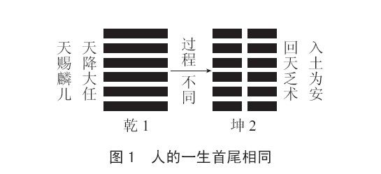
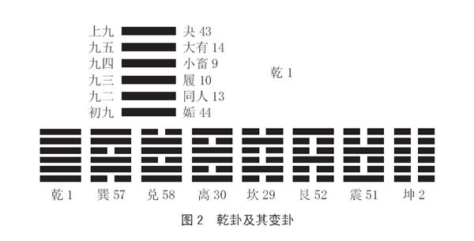
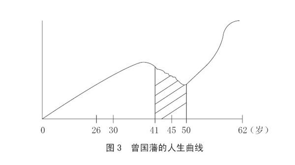
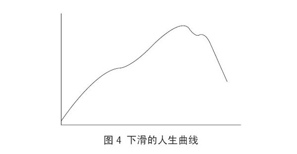
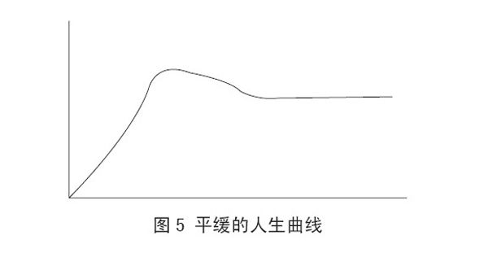
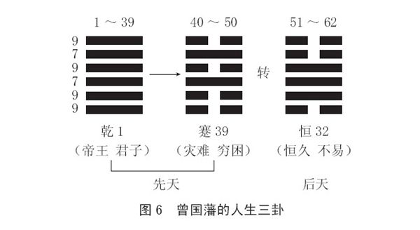
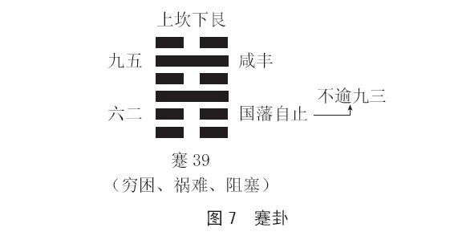
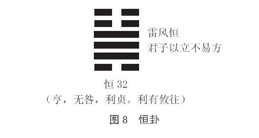

 *第一章 从平庸中崛起的一生*

曾国藩，是清朝一位非常了不起的人物。他与李鸿章、左宗棠、张之洞被并称为“晚清四大名臣”，官至武英殿大学士、两江总督，他也是湘军之父，是湘军的创立者和统率者。曾国藩一生追求修身、齐家、治国，在文学、军事、学术思想等方面都有极高的成就，是晚清道光、咸丰、同治年间政治、军事、文化上极有影响的代表人物。有人说，如果以人物断代的话，曾国藩是中国古代历史上的最后一人、近代历史上的第一人。

梁启超曾这样评价曾国藩：“岂惟近代，盖有史以来不一二睹之大人也已；岂惟我国，抑全世界不一二睹之大人也已……然乃立德、立功、立言三不朽，所成就震古铄今而莫与京者……”毛泽东也曾说“愚于近人，独服曾文正”。蒋介石对曾国藩更是顶礼膜拜，认为其为人之道，“足为吾人之师资”，“其著作为任何政治家所必读”，他还将《曾文正公全集》常置案旁，终生拜读不辍。徐中约则在《中国近代史》中这样评价他：“曾国藩的政治家风度、品格及个人修养很少有人能予匹敌。他或许是十九世纪中国最受人敬仰、最伟大的学者型官员。”

可以说，曾国藩是中国近代现代化建设的开拓者、修身齐家治国的千古完人、中国传统文化持家教子的最成功者，也是中国传统文化人格精神的典范式人物，更是深刻影响数代人的精神偶像。

一般人在看历史人物的时候，会不知不觉地去重视他的时代背景，这点当然很重要，可是年代、地名等其实与我们并没有太大的关系。我讲曾国藩，会采取不同的方向，也就是说，关注点不在时代背景这类问题上，我比较重视的是他真正值得我们学习的地方。曾国藩在历史上争议很大，但是他确实有一些公认的出色之处，比如为官、治家、修身，这些都是深受人们钦佩和敬仰的。

# 第一节 人可以改变自己的命运

## 一、人只是死后是龙是虫的区别

做人，其实都是大同小异。人有生必有死，没有人能够例外，人生所不同的只是过程（见图1）。每个人，尤其是我们中国人，生下来都是一条龙，只是死后到底是龙还是虫的区别。任何人生了一个孩子，人们都说他是天赐的婴儿，说他是要担当大任的人。现在如果赶上龙年，很多人都想生小孩，其实这是很不妥当的，因为这实际上是在害自己的孩子。龙年生的人多，将来考试的人多，找工作的人多，孩子的竞争者自然也就更多。我们以为是对的，其实经常是错的，我们以为是错的，反而往往是对的，这是现代人最大的悲哀。可是大家就是相信那些错误的想法，那有什么办法？只能自作自受，怪不了别人。有一句话叫“人多的地方不要去”，就是说不要盲目从众，你也少去传播不正确的说法，这也是功德。

孩子出生了，作为父母，我们对他有期待，有希望，这没有错。可是到最后，孩子临死时，任何人都会对此回天乏术，他最终还是会入土为安，他的一生也就这样结束了。所以人与人不同的是过程。但现代人不重视过程，现代人更重视结果。无论做什么都是赢了就是赢了，输了就是输了，完全不在乎是怎么赢或怎么输的。人生应该重视的是过程，而不应该是结果。因为结果往往不是我们所能控制的，我们所能掌握的只是过程，在过程中如何做好每一件事。

大家都知道，《易经》是一部专论“八卦”的书。《易经》六十四卦（六十四卦即为八卦两两相重而得），每卦由六条线条组成，这些线条称为“爻”。“爻”象征事物性质与现象的错综复杂。所以孔子说：“爻者，言乎变者也。”“——”称为“阳爻”，用“九”表示；“——”称为“阴爻”，用“六”表示。六爻的位置称为“爻位”，自下而上分别为“初”“二”“三”“四”“五”“上”。从下至上分别为初爻、二爻、三爻、四爻、五爻、上爻，这六爻代表事物发展的六个阶段。每个爻题就是由阴、阳爻数字名称，即六、九和爻位名称组成的。如乾卦自下而上分别为初九、九二、九三、九四、九五、上九爻。

其实，每个人生下来都是乾卦。为便于大家理解，我在这里画一个图（见图2）：只要有一个爻变动，整个卦就会变成不同的卦。《易经》的乾卦、巽卦、兑卦、离卦、坎卦、艮卦、震卦、坤卦这八卦，都是由乾卦变出来的。乾卦的初九爻一变，就变成第44卦——姤卦；九二爻一变，就变成第13卦——同人卦；九三爻一变，就变成第10卦——履卦；九四爻一变，就变成第9卦——小畜卦；九五爻一变，就变成第14卦——大有卦；上九爻一变，就变成第43卦——夬卦。我们常听人说“变卦”，也就是改变主意的意思，实际上人是很容易变卦的，只要起心动念，就会变卦，因此没有固定的卦这一说。世界上的事情都是变动不居的，只要差一点，整个就会改变。有人常说“变一点没有关系”，其实怎么会“没有关系”，绝对有关系，任何事物都是“牵一发而动全身”的。

我们知道，曾国藩的一生，其实也是有很多因素牵扯着的，他实际上很容易走上斜路，但是他没有。那他是怎样使他的一生那么成功的呢？这是真正值得我们学习的地方，也是我们后面会着重关注和讨论的问题。

## 二、每个人一辈子都只喝两杯酒

每个人的一生其实都是一条曲线。如果这条曲线最后是往下走，那就是晚节不保。很多人年轻时飞黄腾达，可是到了晚年一败涂地。其实我们倒情愿这条线一直是从下往上走的，虽然一开始是谷底，但是没有关系，始终都会朝好的方向发展。最怕的是越走越向下，那会很糟糕。

每个人的一生也都是起起伏伏的，为什么？因为老天是公平的，它不可能让你一直都走得很顺，也不可能让你一直都走得不顺。每个人一辈子只喝两杯酒：一杯苦酒，一杯甜酒。关键就看你怎么喝，你先把甜的灌下去喝光，后面就会受罪。其实我们宁可年轻的时候受点罪、吃点苦，然后随着自己成长，以后就会越来越轻松。

不要怕孩子吃苦，这是现在为人父母者应该注意的一点。过分爱孩子，最后只是害孩子。孩子一点苦都不能吃，那他长大以后要怎么生活呢？父母不可能跟随子女一辈子，这句话，做父母的应该牢记于心。

我们来看曾国藩的人生曲线（见图3），他30～41岁到一个顶点之后开始往下走，而且曲折不堪，从50岁起又开始往上走，最后到62岁善终。人生就是一条曲线，每个人都是经过中间的种种曲折，最后走完自己的一生。

曾国藩有十年时间吃尽了苦头，要死死不得，要活活不了。从41岁到50岁，这整整十年，是他一生中最艰难、最痛苦，但也是他最成功、最幸运的一段时期。他被尊称为“大清中兴名臣”“湘军之父”“东南之王”“儒学大师”。其实“湘军之父”并不是他，而是罗泽南，是罗泽南把这个称号让给曾国藩的，这里面有一段故事，我们后面会专门讲到。

我之所以会提到这件事，主要是想说，当你修炼得很好的时候，坏人碰到你都会变为好人；而当你修炼得不好的时候，所有好人遇到你统统变为坏人，那你的处境就会很艰难。其实一切都在于你自己的感应，而不是别人存心要对你怎么样。因为曾国藩能让众人心服口服，所以罗泽南也愿意把“湘军之父”这个称号放在他身上以锦上添花。

曾国藩之所以有这么高的名望，可以说，就是因为有这十年的锻炼。他一生中最了不起的就是那十年受尽了千苦万难。所以说这也是他一生中最成功、最幸运的时期。如果没有这十年的锻炼，他后来很可能就不会修成正果。中国人所讲的“修成正果”，其实就是善终、好死，但是要想得到好死，却是非常不容易的。

其实人应该受苦，吃苦就是吃补。经常有一些年长的朋友问我应该怎样养生、怎样保健之类的问题。其实一个人到65岁以后，只要记住三句话就够了：第一句话，绝对不要吃好；第二句话，绝对不要吃饱；第三句话，绝对不要跌倒。就这么简单。其实很多事情是很容易的，但一定要靠自己，不能单纯靠医生，别人都是靠不住的。养生保健也要靠自己多加注意，光靠医生是不顶用的。千万记住，只有自己最可靠。

再来看看我们普通人的人生曲线。有些人的人生曲线是到后面就往下走（见图4），有些人的人生曲线则是到后面还依旧持续平缓发展（见图5），还有的人的人生曲线只画了一半，比如早逝了。所以大家有空的时候可以画一画自己的人生曲线，看看自己已经走过的曲线是怎样的，以及接下来要怎么继续走完，这就叫自我改造命运。这是用很科学、很实际的方法把你从以前到现在以及未来准备怎么走的情况，很清楚地展示出来，让你自己心中有数，也能指导你更好地走完接下来的人生旅程。如果你会卜卦的话，也是可以去卜一卜自己的本命卦的，这样你就能大概知道你这辈子是要来干什么的。我不知道曾国藩有没有卜过自己的本命卦，但我知道他很懂《易经》，这一点可以从很多地方得到印证。他完全是把自己的命由蹇卦改成了恒卦，否则按蹇卦走下去，他的一生是会很惨的。当年曾国藩如果去卜了自己的本命卦，卜出来的会是乾卦和蹇卦这两个卦（见图6），曾国藩的本命卦是乾卦，然后变成了蹇卦。乾卦代表的是帝王，是君子，他也的确有皇帝命。可是后面却变了，变成蹇卦，充满灾难、困窘，他就寸步难行，左右为难，辛苦异常。就是这一变，让他有十年差点活不下去。幸好他自己努力给自己转运。

这告诉我们，一个人是可以改变自己的命运的。但是千万记住：只能你自己改，别人改不了。心念的转变，行为的改变，完全是自己的行为，别人是帮不了你的。

人要改变自己的命运，其实也很简单。因为“相由心生”，相一变，命就会变了。所以最终要改的是什么？是你的心。心是什么？心就是观念。你只要观念正确，你的命整个就变了。这说起来是很简单的事情，但是观念要变，只能你自己主动变，别人谁有办法替你改变你的观念呢？相随心转，自改造命。乾卦到蹇卦是本命，蹇卦到恒卦就是造命。所以我刻意在这里用了一个“转”字（见图6），就是想告诉你，你自己要去转变，你活到现在，应该知道过去走的是什么卦。那你愿不愿顺着命运一直走？愿意，那就心甘情愿一直这样走下去，不要抱怨；不愿意，那就赶快改变，越早改越好。

曾国藩后来又转成了恒卦，恒卦是什么？恒久，不易。所以他能够善终，这就很不简单。如果只看他的八字，我相信，他是会不得善终的。一个人无缘无故把自己的名字改得听上去那么强硬干什么？（曾国藩把自己的本名“子城”改为“国藩”）那就是他自己在“转”。“国藩”就是为国藩篱，那别人听了这个名字，会不会提防他？当然会。所以连皇帝都怕他，皇帝觉得“你要为国藩篱，那我算什么呢？”可是那时候他才28岁，他又怎么知道改名字也会后患无穷呢？一个人千万千万要记住，一切都是自己造成的，这句话一定要放在脑海里。所有的事情都是你自己造成的，所有后果也只能由你自己去承担。

# 第二节 曾国藩把自己的命改了

曾国藩1811年（嘉庆十六年）11月26日（农历十月十一日）生，为什么还要注上农历十月十一日？就是因为他了不起，如果他不是了不起，这些日期根本没有人会理会。我说这话的意思是，人活得有没有价值，要看你死了以后别人会不会重视你是哪年哪月生的，你的家乡住址是哪里，你的生平事迹有哪些。比如我们知道曾国藩是湖南湘乡人，他的乳名叫宽一，本名叫子城，字叫伯涵，号叫涤生，28岁的时候改名为国藩，死后谥文正，等等。

人活着固然重要，但不是最重要的；人死了，看起来没有什么，死后名声才是最重要的。中国人不争一时争千秋。现在很多人忙活一辈子，精疲力竭，看上去很热闹、很有贡献，但可能死后二十年之内就销声匿迹了，那基本就等于白忙活了。可是老子只写了五千余字的《道德经》，不得了，到现在还“活”着，我们对他依然有着浓厚的兴趣，这才叫作人生价值。口袋里有很多钱又能怎么样？迟早会花光；身体很好又能怎么样？最后还是会被装进棺材。

我们要留一些东西给后人。台湾街上的乞丐经常说的几句话里蕴藏着深刻的智慧。“好心”，是说人要凭良心做事；“有度量”，是说人要能够宽恕别人的错误；“拿一些来分”，就是说人要跟人家分享。所以不要以为乞丐没有学问，乞丐其实是最有学问的人。他用三句话就把所有道理都讲完了。他提醒你做事要凭良心，要舍得把东西拿出来与人分享。有时候，其实宝贝就在我们身边，只是我们没有发现罢了。

曾国藩不但把曾家的地位提高了，把湖南的地位提高了，把他“国藩”这两个字的名望提高了，他还留给我们很多财富。这些财富当中最重要的是什么呢？就是——识人用人。识人用人是他最大的本领。用我们今天的话说，叫知人善任。所以为什么说“为官要学曾国藩”，因为他会看人，他会用人，而不是样样都是自己在做。什么事都是自己做是不行的，你怎么可能什么都做得好呢？“无所不至管”，样样管，肯定管不完。现在知人的人很少，会用人的人也不多，那人类到底是进步，还是退步了呢？这是值得我们去探讨的问题。

## 一、屡考不中：最妙的就是连考不中

曾国藩一开始走的是乾卦，乾卦的初九爻，爻辞是“潜龙勿用”。（卦爻辞，即系于卦形符号下的文辞，其中卦辞每卦一则，总括全卦大意，爻辞每爻一则，分指各爻旨趣。）很多人看到“潜龙勿用”就可能会笑说：“哎呀，潜龙勿用，意思是有才能不表现，那不就跟没有才能一样吗？这根本就是废话。”像这种话，大家以后少听为妙，因为说这种话的人根本就不懂。

“潜龙”，比喻人隐居不出，静处不动。遇此爻，不可有所作为。中国人说“潜”，其意思就是要用，如果你不用，那你连“潜”也不必了，你就没什么前途可言了。“勿用”不是不用，而是暂时不要用，但最后该用的时候一定要用。中国话没有那么容易解释的。现在都只按字面理解，“‘潜龙勿用’，意思就是不要用，既然不要用，那你的才能用来干什么呢？”这听起来很有道理，实际却害人不浅。

曾国藩16岁以前，随他爸爸曾麟书读书，曾麟书是谁？如果没有曾国藩，谁都不会在乎他是谁。曾国藩最了不起的地方就在这里。因为他，我们不得不对他的父亲也表示一点敬意，认为他会教孩子。这就叫“大孝尊亲”。一个人真正的大孝表现在，因为你，你们全家人乃至整个家族都出了名。但是出名有两种：一种是出好名，一种是出臭名，出臭名就糟糕了。现在社会上每天都在不断涌现出各种“红人”，他们也应该问问自己：“我的名是好名还是坏名？”

曾国藩16岁的时候，参加长沙府童子试考了第七名。现在有些父母可能会说：“你应该考第一名，怎么才考第七名？”可是曾国藩的父亲曾麟书却不一样。曾国藩考了第七名，他反倒觉得这孩子还不错，就把曾国藩专门送到一位老师那里去好好学习。曾国藩20岁起在衡阳师从汪觉庵。曾麟书觉得这还不够，要让曾国藩接受更好的教育。于是，21岁时，曾国藩入湘乡涟滨书院。随后，23岁中秀才，24岁入岳麓书院，中举人。24岁中举人，已经很不错了，美中不足的是，名次都并不靠前。而最妙的是25岁、26岁考进士，都没有考中，名落孙山。

这样好不好？当然好，这是他一生最大的幸事。如果他一路顺利，依我看，曾国藩不可能成为他后来所成为的人。人一生太顺其实并不一定是好事情，因为大器往往是晚成的。曾国藩如果没有经过这些坎坷，很难有后来获得的那些成就。他一直到27岁，都是在“潜”。历史上有谁“潜”这么久的？有很多，其中最著名的是诸葛亮，诸葛亮整整潜了27年。他一直坚持“不适合我出来，我宁可不出来，我不是那种有官就要当，有事做就要做的人。不适合，我宁可藏起来”。只有这种人，等到他“下山”以后，才会有了不起的表现。

没有准备好就居高位，这种人是最可怜的。我们今天谁都知道“Are you ready”，这句话怎么翻译？现在普遍的译法是“你准备好了吗”，这就太肤浅了。什么叫“你准备好了吗？”是行李准备好了没有，还是什么准备好了没有？“Are you ready”，是指“你心中有数吗”。你心里有个数没有，有个谱没有，没有的话，宁可不做，宁可不要。“人要舍得”，这句话谁都会说，但是一到关键时候，就都不知道了，糊涂了。有人问“Are you　ready？”你马上回答“耶”。这样沉不住气肯定不行，甚至很有可能是去“赴死”。而安安静静的，不说话也不回答的人，才最可能有大才。在我们这个时代，大家一定要小心，一不小心就可能会掉入漩涡，一不小心就会被害，因为很多在社会上广泛流传的话都是很肤浅的，完全没有深度，也经不起考验。大器是晚成的，你急什么？有什么好急的呢？慢慢来嘛。

## 二、结婚生子：该做的事绝不能拖拉

曾国藩25、26岁这两年没有考中，是好事。为什么这么说呢？因为这样他就有工夫考虑养育子女的事了。

29岁，长子纪泽出生。他这时候别的事情不忙，而是抓紧生孩子，这有很重大的意义。老实讲，一个人在这个阶段不尽快把孩子的事情解决好，后半段再要做事情，就会很麻烦。如果早不生，等到临终的时候，可能就会很后悔。因为父母年纪太大，孩子年纪太小，这是人生的遗憾。曾国藩死的时候，我们后面会讲到，纪泽一直在旁边陪他。曾纪泽也为国家做了很多事情，为什么他也那么有出息？一个很重要的原因就是他父亲曾国藩常把他带在身边，边带边教。其实父母的责任就是这四个字，现在很多人却不这样做。有的父母说“不带他，他才会自主”，“不用教，他什么都会”，还有的甚至说“教也没用，他不听”，“现在的情况变了”。但这哪里是情况变的问题？每个时代都会变，不同代人当然不可能完全一样，但有一些根本的东西是不应该也不会变的。做父母的也必须“有所为有所不为”，如果完全“无为”，对孩子放任自流，那父母的责任、作用又体现在哪里呢？小孩子懂什么？你如果完全顺着他，他就可能整天打电动、玩游戏，那肯定不行，所以你必须要跟他讲清楚道理。

我孙女买手机的时候，我们就很清楚地告诉她：“这部手机你只能用来做一件事，就是打电话给妈妈，不能用来做其他的。”于是她就不用手机了。你一定要给孩子交代清楚。你如果很爽快地说，“这很好玩，你拿去玩吧”，那结果就可能会很糟糕。“你不可以让任何人知道你有手机，你不可以让任何人知道你的电话号码，否则你会忙不过来的。但是你不能没有手机，为什么？因为你有时候需要跟妈妈联系，妈妈会担心你的安全。”这样跟她讲清楚就好了，这就叫“道”。

现在时代变了，应该想着怎么去有效地因应，采用什么方式才能让孩子更容易接受，这些才是父母现在应该考虑的问题，这才是为人父母应该抱的态度，而非轻易就气馁或者放弃。

一个人该做的事情要尽快完成，不要拖拖拉拉。该结婚生子的时候，就要结婚生子。可是我们很多现代人在这点上很麻烦，二十几岁的时候说“还早”；三十几岁的时候说“怎么这么快”；四十岁的时候说“找谁啊”；最后到了五十岁，只能说“算了，一个人过日子”。这是自己耽误自己。该做什么事就要做什么事，不可以找理由骗自己，骗自己最后是害自己，害不了别人。而且你这样拖，有没有想过父母的感受呢？老实讲，今天的父母最后是两个字——寒心。“不要讲了，讲了也没用，随便他”，这是很令人难过的。其实这样就已经是不孝了，正所谓“不孝有三，无后为大”。

我没有别的长处，我唯一的一点好处就是，到了60岁还是很听爸爸的话。其实我会出来讲课，完全是因为我爸爸的一句话，“你就出去讲”。当时我心里还觉得好笑，“我讲给谁听啊？”那时候台湾根本没有谁出来讲课，可是我听话，因为我听话就有了现在的结果。老实讲，当时我已经是大学教授了，我就对他说“爸爸你不懂现在的状况，这不可能”，但实际没有什么不可能。所以我爸爸最大的成就，就是他让我现在每次想到他的时候都会觉得，幸好当初听了他的话。

## 三、进翰林院：被冷冻时是什么反应

乾卦的九二爻，爻辞是“见龙在田，利见大人”。“见”，就是“现”，指出现。所以你完全不用着急，当你心中有数，上面的人也知道你值得信任，你不会惹麻烦，不会占了位置不做事，更不会上台容易下台难的时候，你就可以出现了。但是“见龙在田”，最要紧的是要“利见大人”。你要做官，朝中一定要有人。你想要表现，就有人会出来帮你的忙，这才叫“利见大人”。“利见大人”的先决条件是你自己要有大人的气象。你没有大人的气象，人家凭什么提拔你、拥戴你？他会觉得没有必要，就会袖手旁观。

曾国藩28岁中进士，算是比较晚的，但是也已经很了不起了。科举时代，读书出仕，这是理所当然的道路。“朝为田舍郎，暮登天子堂。”平民子弟唯有通过科举才能改变命运。“十年寒窗，一举成名。”这个门槛是很高的，他也顺利地跨过了。

但是他的仕途，也就是官运，却不是很亨通，他仅仅被授为翰林院庶吉士。可就是不亨通才好，亨通反倒不妙。因为仕途一旦亨通，就会像一下子升得很高的气球，最后往往也会很快就爆破了。他在翰林院一待就是九年，虽然也升过官，但都只是空有名号而没有实权。翰林院是什么地方？相当于秘书处。在那里唯一的好处就是能常常跟皇帝见面，仅此而已，其他什么都做不了。每个人都可以想一想，当你被“冷冻”的时候，你会是什么反应？你如果天天怨叹，天天羡慕别人，或者天天急于“上进”（这个“上进”并不是真的“上进”，只是拼命追求升官），那你就不会有大成就。

很多人一到翰林院，就开始钻门路，拉关系，等做官。有的进士被派到地方，很快就飞黄腾达了，但是往往也很快就出事了。曾国藩就待在翰林院，哪儿都不去。他待在那里干什么呢？他没干什么大事，可这样他反而没有事。最要紧的是他下了这样一个决心：从此不再为无谓的八股文浪费时间。八股文是为了应付考试的，其实没有多大用处。可很多人却不这样想，很多人认为“我好不容易考中进士了，我从此就要天天练这个，作八股文作一辈子”。这有什么用呢？没有用。我看过很多博士论文，这些论文写得很好，但是一点用处也没有。可现在的学术界就是这样。而且这还不算，很多人好不容易等到拿了博士学位，该好好干一番事业了，他又想“不行，要再深造”，还要继续写，就这样一直折腾到最后，人也老了，什么都没干出来。这是在开谁的玩笑？开自己的玩笑，大好的生命就这样浪费了。当然，纯粹的学术研究及其成果又另当别论了，但我们应该都清楚，如今的学术界中学者、著作、论文充斥，能真正称得上学者，真正算得上学术研究成果的，少之又少。

他集中精力追求一样东西——安身立命、经国济世。我为什么不用“经济”这两个字？因为我们现在一看到“经济”，就会想到money。“经济”怎么会是money呢？“经济”是经国家、济世人，是治国、救世人，这跟money有什么关系呢？安身立命、经国济世，才是真学问。

因为在翰林院不能做什么事，时间很充裕，所以很多人就到处消遣，打发时间，浪费自己的青春，可是曾国藩却没有。北京历来是人才荟萃之地，他趁此机会交了不少志同道合的朋友。这就提醒我们，当自己不得意的时候，应该赶快去结交一些好朋友，这样，将来得意的时候，才有人可以合作。当自己顺利的时候，出现在身边的人多半都是小人，而当自己落难的时候还肯跟自己在一起的，才更可能是君子。

## 四、一病再病：病时要有病时的做法

曾国藩在京十多年，“勤读史书，培养出以天下为己任的志气”。可是他30岁的时候病了，至于怎么会病，历史没有清楚记载，但不管怎样，重要的是有欧阳兆熊、吴廷栋这些人精心地护理他，他也因此交到了很知心的朋友。所以一个人，只有当你生病或者遇到其他挫折困难的时候，你才会知道自己做人到底成不成功。如果你生病的时候，只有护士，只有医生在你旁边，那你就要检讨，“朋友跑哪里去了？亲戚怎么都不见了？”他因为生病才猛然意识到“原来我还有好朋友”，他也慢慢开始悟到：一个人认识多少人不重要，有没有三五好友，这才是人生中最重要的事情。

31岁的时候，他向当时的理学大师唐鉴请教治学之道。曾国藩其实是个不服输的人，他表面上很恭恭敬敬地向唐鉴请教，可实际上私底下有时也会觉得唐鉴没什么了不起。但是他在人前会表现得服服帖帖，其实这样就够了。我们不要要求别人在背后也不骂我们，这不是一种好心态。一个人如果让别人羡慕，让别人嫉妒，就要反省自己，因为一定是你有做得不对、做得不好的地方。但是我们现在往往只怪别人没度量，不懂得赞美人。可我们自己又是怎样做的呢？要欣赏别人的长处，我们自己做得到吗？自己做不到，却拼命诅咒别人，做人怎么能这样呢？一个人千万要记住，你有任何成就，都不要到处去彰显，不要引人嫉妒，不要引人羡慕，也不要以为自己有很多观众，自认为了不起，而要始终保持低调和谦虚。

曾国藩听了唐鉴的话以后，就开始致力于研究和践行程朱理学。程朱理学其实也有缺点，可是曾国藩只吸收它的长处。下面这些就是曾国藩从中挖掘出的可取之处，很多其实现在依然值得我们借鉴。

第一，早起。每天都要如此，无论如何都要坚持。早起就得早睡，这样身体才会好。现代人的生活完全没有规律，却又要求身体好，这怎么可能呢？

第二，静坐。现代人很麻烦的一点就是，能动不能静。无论是坐地铁，还是坐公交，坐飞机，你都会看到很多人听音乐，打游戏，玩手机，玩电脑，一刻也停不了。虽然现在整个社会的生活节奏很快，非常强调时间观念，每个人的生活压力都很大，工作也都很忙碌，但时不时地要让自己静下来、停下来，这无论对我们的身还是心，都会非常有好处。这样坚持一段时间之后，你会发现自己以及自己的工作、生活都会发生或大或小的好的变化。

第三，读史。其实历史真的是需要很认真地去读、去体会的。读史绝不是读历史书，光读历史书有什么用呢？这点我们后面会具体说明。

第四，谨言慎行，而且还要养气。说话做事都要小心谨慎，既要三思而后行，也要三思而后言，因为人很容易受情绪控制，或者短时间内考虑事情很容易不周全，这样就容易犯错，而有时候一句话、一个动作的影响都会是决定性的，甚至是毁灭性的。每个人其实都是一口气在支撑，因此这口气就必须要好好养。小孩子刚开始阳气都很足，慢慢地，他越长大，这股阳气就会越衰弱。整个社会也是一样，社会混乱，道德败坏，各种污浊、阴暗之气渐长，这就需要更多的光明、清净之气注入。而要达到这一目标，就需要我们每个人从自身做起，重拾对道德的信心。我们要发动所有人的力量，使整个社会一齐为之努力。

第五，保身。我提倡“明哲保身”，可能很多人会有异议。他们会认为“明哲保身，就是怕死，死算得了什么？”其实这种想法是有问题的，人本来就应该保身。老子说人最麻烦的就是有身体，表面上看，他好像很不喜欢身体，其实不是这样。老子实际上是告诉我们，身体虽然麻烦，但是如果没有它，我们是活不了的，所以我们必须要好好爱惜自己的身体。

第六，书法。其实书法也是练气的。练书法绝对不仅仅是为了写字漂亮，它还有很多其他的作用。比如它能让你变得更有耐心，因此当你要发脾气的时候，就赶快去练书法，通常很快就会没有脾气了。

第七，夜不出门。这一点很多现代人都做不到。其实这方面我很羡慕美国。在美国，大部分人其实都是夜不出门的。这可能和很多人想象中的不一样，我们平时看的一些有关美国的影视作品中，好像美国人的夜生活很丰富，每天都是灯红酒绿，夜夜笙歌。而实际上他们没有夜生活，只有少数乱七八糟的地方才有夜生活。

通过学习，曾国藩慢慢有“大人相”，这个大人相是要靠自己培养的，然后他就改写了家族的历史。其实不管他后面做了什么，他能有“以天下为己任”这样的壮志，就已经很值得我们学习了。这里我再强调一遍，后面怎么样其实不重要，能不能实现、能不能成功是自然的结果。结果不是很重要，出发点，也叫动机才更重要。

有大人相，改写家族历史，这就是“见龙在田”。什么叫作“龙”？非常灵活，让别人没办法完全看清楚的才叫“龙”。现在很多人都喜欢标榜自己“绝对透明化”，这其实是很糟糕的事情。我只说一句话：当一切都透明的时候，你就没有办法作任何决定。因为才刚刚开始商量，还没有做定案，就闹得全天下人都知道了，人人都来指手画脚，那你还怎么做事呢？根本就没有办法做事。而且我也不相信有什么透明化，很多东西完全公开、完全透明是很麻烦的。

31岁的时候曾国藩得唐鉴指点，“终日乾乾”。我在这里顺便说明一下，我为什么要采用多少岁干什么事这种形式，就是为了让你可以跟他进行对照。你想想自己31岁的时候是什么样，做了什么。如果你看了曾国藩的经历之后，心里告诉自己，“哦，还不会太晚”，这就对了。因为曾国藩就是慢慢地、一步一步才爬上去的，而且走得也并不容易。如果他很快、很顺利地就上去了，那你还学他干什么呢？他是天才，他家世好，他怎么怎么样，那你就完全不用学了，反正你也学不会。采用这种形式还有一个好处就是，你能很直接地学。比如你看到这里，就可以问自己：“我31岁的时候有没有得到什么人指点，我有没有改变自己？”然后你就可以慢慢地调整自己，少走邪路，少走弯路。

乾卦的九三爻，其爻辞中就不再有“龙”了。初九爻有“龙”，即“潜龙”；初二爻有“龙”，即“见龙”。而到了九三爻，哪怕你是龙，也会变得不像龙。因为这一关没有那么好过，你不表现则已，一表现所有打击就会都来了，全都集中在你身上。所以为什么很多人会说“根本就没有人打击我？”那是因为你没有表现。你只要一表现，所有打击就都会涌向你了。你不参加选拔，谁也不知道你做了什么坏事；你一参加选拔，你做的那些坏事就尽人皆知了。甚至连你自己都已经忘记了的，都会有人把它抖出来。这就是没事惹事，这些麻烦都是你自己惹的。所以每个人都要清楚一点：如果表现自己会怎么样。一个人要不要表现，自己要好好斟酌，因为表现的结果通常是很凄惨的。

“君子终日乾乾，夕惕若，厉无咎。”“君子昼则勤勉，夜则警惕，虽处危境，亦无咎灾。”什么叫“君子”？《易经》每卦六爻中，第三爻与第四爻处在中间位置，象征正道和大道。君子就在三、四两爻，因为它是人位，而初爻、二爻象征地位，五爻、上爻象征天位。所以我们常用“不三不四”形容不正派的人或事，就是指其不在正道或大道上。

“乾乾”就是指勤勉努力，固守刚健正中。“刚健正中”这四个字非常重要。一个人的意志是不能被打倒的，不管前面的路多么艰难，多么辛苦，一旦决定要做，就要克服万难，不逃避，不退缩，但也不能死拼。“惕”，即警惕，“若”是语气助词，“惕若”，就是“惕然”，亦即警惕的样子。因为夜晚和白天一样危险，照理说夜晚应该很安全，但是实际上夜晚也是危险的。比如你在睡觉，别人还在写你的负面新闻，马上就要曝出来了，所以夜晚也要非常警惕。其实人也只有在夜晚的时候才会比较警惕，因为白天根本没有时间警惕，一直都要忙于各种琐碎的事情。“厉”，指危。“咎”，是灾的意思。为什么会“无咎”？你如果好好地去因应，认真采取措施应对它的话，你就会“无咎”，会没有过失。但是你如果不好好地因应，你就一定会“有咎”。所以《易经》说“无咎”就是告诉你，本来是“有咎”的，但是你好好因应，就会“无咎”。

人一定要未想赢，先想输，凡事都要先想自己会怎么输。多问自己“我输得起吗？”如果输得起再做，“再输也不过如此”，所以为什么没有钱的人往往更敢冒险，就是因为他本来就什么都没有，他还怕什么呢？而有钱的人往往更不敢冒险。同样的道理，到底是有钱人比较怕死，还是没钱的人比较怕死？当然是有钱人怕死，没钱人怕什么？他还有什么好怕的呢？像这些问题，大家好好去想一想，其实道理都蕴含在《易经》里。

36岁的时候，曾国藩又病了。一个人多病几次其实是好事情，因为往往生病的时候，会领悟一些平时领悟不到的道理，你会比以前，比别人更珍惜生命，更懂得爱护自己的身体，更珍惜人与人之间的感情，等等。我们一定要慢慢调整我们的观念。身体好的时候，要有身体好时的做法，身体不好的时候，又要有身体不好时的做法。

曾国藩在报国寺养病的过程中，才悟到“执两用中”的大道理，而这对他的影响非常之大。“执两用中”，是说做事要根据不同情况，采取适宜的办法，不能“过分”，也不能“不及”。一般人都说中庸之道是不走极端，我不认为是这样。中庸之道不是指不走极端，而是说在衡量轻重之后，能够不走极端就尽量不走极端，但是一定要走极端的时候，就像孟子所说“虽千万人，吾往矣”，该冲的时候，还是要冲的。这当然不是蛮干，必须有一定的把握才可以，而且能守的时候还是得守。尽量做到有进有退，能进能退，有刚有柔，另外还要能刚能柔。人活着就是要有一定的弹性，能够随机应变，但绝对不是投机取巧。

## 五、整理家训：闲的时候就要找事做

37岁的时候，曾国藩升任内阁大学士，还是没有实权，但是这个大学士的名号很厉害。当时很多人看他是大学士，就来拜码头，前来拜他为师，这样他就得以广结人缘。所以，大学士的职位虽然没有实权，但它还是给曾国藩带来了好处，对他后来要走的路也有帮助。

第二年，次子纪鸿出生了。曾国藩知道这样闲下去，会越来越不知道要干什么。他心想“那干脆做点事吧”，于是就决定把曾氏家训编辑起来，因为他知道，如果没有机会“治国”的话，最起码他可以把“齐家”做好。这就涉及我们后面会着重讲到的“早、扫、考、宝、书、蔬、鱼、猪”曾氏八字家训（详见第四章第二节）。

## 六、多次上疏：曾国藩也“愤青”过

39岁升礼部右侍郎，后兼任兵部右侍郎。这时候他就想到孔子曾经说过，人到40岁，不能不做点正经事，不能不做点积极事。于是他就上了一个疏，名叫《应召陈言疏》。“疏”就是意见书。他非常直截了当地说当时的官场如何萎靡、如何因循守旧，等等，把这些弊端全都抖出来，把官吏的腐败无能也毫无保留地说出来。他这样做，好不好呢？

我说一句很不敬的话：“他这就是上了孔子的当。”孔子说：“后生可畏，焉知来者之不如今也。”你怎么知道晚生不会超过你呢？但是“四十五十而无闻焉，斯亦不足畏也已！”意思就是，一个人到了四五十岁还没有很具体的表现、贡献，那他这辈子也就这样了，不会有什么大成就，自然也就不足为惧。曾国藩便想到自己快四十了，不能不表现一下了。那他是怎么表现的？表现的结果又怎样呢？四十岁的时候他就直言：“今日所当讲者，惟在用人一端耳！”这是不是在对朝廷发牢骚说“你们不会用我”呢？所以很明显他这是在给自己找麻烦。

41岁的时候，咸丰皇帝刚登基不久，曾国藩又上了一个《敬陈圣德三端预防流弊疏》。结果咸丰皇帝气得直接将它扔在地上，准备要杀他，“又在说，我椅子都还没坐热，你就又开始说，你也让我稍微坐稳一点再说”。我不反对一个人当英雄，但是你自己必须在心里好好盘算盘算，到底值不值得当这种英雄。整个中国历史上真正的谏臣实际上只有一个，那就是魏徵，只有他一个，再也没有别人了。我们都知道谏臣这条路是很难走的，但是社会上还是有很多人鼓励我们当魏徵。我从来没有鼓励一个人当魏徵，我要你自己好好掂量掂量。魏徵其实“死”过很多次，大家不要以为唐太宗真的那么宽宏大量，他其实心里想的是“我看到你就火大”，有好几次甚至想要杀魏徵。

我当过老师，我知道成绩好的学生一般都是那种人，从不发表反对意见，哪怕安安静静地坐着打瞌睡，也不会给你难堪，你无论讲什么他都举双手赞成，那你不给他80分怎么对得起人家？现在到处都可以看到这样的人。这种人虽然不完全值得我们学习，但毕竟还是能给我们一些启示。一个人要有意见，没什么不可以，但是你要先把自己的性命保住，才可以有意见。而且说话尽量迂回一点，缓和一点，不要直言，直言不一定会有好处的。

42岁的时候，曾国藩还不知自己是书呆子，再上《备陈民间疾苦疏》。这一次咸丰皇帝是真的要杀他了，但是有一个人救了他，这个人就是洪秀全。洪秀全起义之后，镇压起义便成为当务之急。我在这里说一句话，可能很多人不会赞成，“曾国藩最大的敌人是洪秀全，但他最可靠、最牢靠的靠山也是洪秀全”。没有洪秀全，他可能命都没有了；有了洪秀全，他就快没命了。这两句话看起来差不多，实则意味无穷。没有洪秀全，他就没有利用价值；有了洪秀全，他就只好自己去面对、去接受朝廷交给自己的剿匪重任，他不能叫苦，而且就算叫苦也没用。同样，咸丰皇帝的想法也是如此，“没有洪秀全，我不杀你才怪；有了洪秀全，那就要看洪秀全会不会把你杀掉”。这些道理如果你都想清楚了，后面的事情理解起来就会容易很多。

## 七、出任主帅：该出手时就得出手

任何一个卦，前面三个爻叫下卦，后面三个爻叫上卦，这当中有一个界限。有的人一辈子都在走下卦，他没有时间，也没有体力，更没有实力走到上卦去。

乾卦的九四爻，爻辞是“或跃在渊，无咎”。“或跃在渊”的意思是，你如果有实力，有丰富的阅历，那你就去跳跳看。你跳得过就是跃登龙门，跳不过就会掉到深坑。但是它还是告诉你“无咎”，也就是说，你因应得宜的话，就不会出事。但是如果你不该跳，那就不要跳，很多人在基层做事，明明做得很愉快，为什么一定要到高层去呢？在高层的日子其实并不是那么好过的，在高层并不一定就比在基层好。每个人记住四个字：适可而止。但曾国藩却是不得已，因为每次有事情，都会把他“拱”得天翻地覆的，当时的形势、社会舆论都会把他推至风口浪尖，让他不得不出面。而一个有成就的人，往往也是备经挫折、备受考验的人，否则他不可能有大成就。

到前面的九三爻，就叫小成了。这个时候就心满意足，不再有所欲求，到底好不好？答案是要看是谁。每个人心中都要衡量一下，自己到底能够做到什么地步，不要永远不知足。“当科长，我会非常心安理得，你如果叫我升官，那我只好敬谢不敏。我干吗自讨苦吃，把自己整得死去活来呢？没有必要嘛。我只要把自己的工作做好，完成自己的任务就够了。”

那么不满足于小成，想尽办法超越下卦，一心向上，到底对不对呢？也不能说不对。我的建议是，你可以试试看，但是不要说非怎么样不可，这要随缘。所谓“随缘”，是说你先要试试看，不是说你自己连手都不伸出来，那肯定随不了缘，也随不到。很自然地往上走，这样可以；太勉强、太功利地向上走，就不可以。但是不管怎样，你自己心里一定要非常平衡。

而他既然名叫国藩，立志要“为国藩篱”，经国济世，所以就必须“跃”，必须努力拼搏向上，才能实现志向，创造一番事业。那么，他“跃”的结果怎么样呢？变乾卦为蹇卦，接下来的一段路越走越艰难。

42岁的时候，曾国藩回乡奔母丧。我之所以特别讲这件事是想说，有时候父母爱护子女，会及时地走掉，就是为了给子女一个机会，让他可以回来好好冷静地想一想，“你已经陷入这个境地了，你逃也逃不了，那你就要考虑现在到底该怎么办”。这时候正赶上太平军出广西，攻长沙。太平军如果攻别的地方，也就跟曾国藩没关系。可是他们别的地方不攻，偏偏攻曾国藩的家乡，而他正好又因守母丧在家，这就叫作时机的巧合。所以对任何外界的变动，你都要想一想为什么会这样。而且凡是碰到内外的变动，你都要告诉自己，这是老天对你的考验，你是必须要面对的，你要想“没办法，老天要考验我，我跑也跑不掉，我只好面对它，我想办法来因应”，这样才能更好地加以应对。

湖南为什么到处办团练？因为太平军越来越壮大，而那时候清兵打仗是不行的，为什么清兵不行？要知道清兵本来是很厉害的，连明朝军队都打不过他们，怎么会变得不能打仗了呢？因为一旦天下太平，大家就都开始享乐，享乐的第一个结果就是军队不能打仗，所以地方只好办团练自保。如果清兵能够打仗，那么就轮不到地方去办团练。谁要敢随便练兵，朝廷绝对会马上来干预，“你练什么兵，你想干什么？”那肯定就得吃不了兜着走。

而恰恰在这时候，巡抚张亮基又给曾国藩写了一封很诚恳的信。所以时机如果到了，谁都挡不住。大家看他是怎么写的：“亮基不才”，一个人最厉害的就是自认为不才，“我比较差劲，你比较厉害，所以换你去死”。“承乏贵乡”，我被派到你们这里来当巡抚，“实不堪此重任”，我担当不起。“大人乃三湘英才”“国之栋梁，皇上倚重，百姓信赖”，高帽子一直戴。他一定是看《三国演义》看多了，所以这句话才讲得这么熟练。“亟望能移驾长沙，主办团练，肃匪盗而靖地方，安黎民而慰宸虑”，请你一定要来，与我共济时艰，以安定地方。我前面讲过，曾国藩的母亲死得正是时候，为什么？因为这样他就可以推辞，“我在守丧，我怎么能出来”，“岂有母死未葬，即办公事之理？”这就是以退为进。不知道大家有没有发现，中国人往往都是先说不要，然后才慢慢接受。曾国藩本来在家守丧，别人说要办团练，请他去主办，他如果马上就去，那肯定所有人都会怀疑他，“你是想干什么，你是想抓住机会是不是？你是想办法要当皇帝对不对？”那朝廷一定会先把他给杀了，以绝后患。

结果这时候唐鉴出来了。唐鉴以一生薄名作担保，向皇上竭力推荐曾国藩，然后又对曾国藩本人劝以“时势造英雄”，并引孟子“天将降大任于斯人也”，还说“贤弟素有以天下为己任之壮志，此为老夫所深知”。另外还有一个人叫郭嵩焘，其实郭嵩焘是个非常倒霉的人，但是那时候他还没有倒霉，他还跟曾国藩是好朋友。他也劝曾国藩出来：“虽有智慧，不如趁势，今时机已到，气运已来，还犹豫什么呢？”说曾国藩这时候就该出来，而且要当仁不让。

曾国藩终于成了湘勇的主帅，他如果一开始就去，最多能当个副手，然后上面慢慢放权给他，“奏准移驻衡州练兵，建船厂，购洋炮，筹建水师”。因为当时太平军的势力越来越大，居然在南京定都，号称天京，“这还得了！”所有人都慢慢感觉到，随着太平军的不断发展，曾国藩的声势也一定会越来越强。所以说曾国藩最大的靠山就是洪秀全。一个人要会利用敌人，而不是跟敌人死拼，这正是曾国藩的高明之处。

我们来看看蹇卦（见图7），蹇卦上面是水，下面是山，叫水山蹇，就意味着“坎险在前”。什么叫作“水山”？就是山上面有水，现在叫作堰塞湖。堰塞湖很可怕，因为它随时可能被冲垮。可它同时也告诉你该如何应对：碰到这样的情况，你内心要有“知止之明”，明确自己所处的位置，做任何事情都要适可而止。曾国藩如果稍微膨胀一点，他就会没命。皇帝最乐意的就是他为自己平定太平军，而最害怕的是他反过来打自己，所以只要曾国藩显露出一点造反的苗头，皇帝一定会立马除掉他。

我经常讲这个案例给大家作参考。当皇帝信任一个大将军，把50万大军交给他的时候，是百分之百相信他的。可是当这个大将军把50万大军带到城外去的时候，皇帝就开始怕他了，“只要他掉过头来，我就完了”。同样，当老板很信任你的时候，你是很受荣宠的，但是当你越来越得人心的时候，老板就会日夜不安了，他就非要把你除掉不可。那么，如何把握好这二者间的微妙差距以获得平衡？这就得看你的功力了。

“临危授命，既艰困又阻塞，稍不留意，即祸患无穷”，这叫蹇卦。有很多东西大家可以说是巧合，譬如蹇卦的卦辞是“利西南，不利东北；利见大人，贞吉”，这与曾国藩所面临的抉择正好相符。“利西南，不利东北”，就告诉曾国藩，他去打太平军是安全的，可他如果回头去打在北方的皇帝，他的处境会很危险。而且还要“利见大人”，就是朝廷一定要有人替他说好话，否则他很难渡过这一关。

因此他把自己的志向定为“为保皇而不为革命”，之后又定为“为中兴却不得意忘形”。很多人都因此批评他，而这一点可以说也是他一生中最受争议的地方之一。太平军的将领被他抓到以后就对他说，“我们都是汉人，你干吗帮那个满清异族来打自己的汉人同胞？”而且还向他保证，“你只要跟我们一起，我们全都拥护你，也不让洪秀全当皇帝了，你当皇帝”。曾国藩有没有那个实力呢？他是有那个实力的。那他会不会心动？当然会心动。可是他如果不知道蹇卦的卦义，听从旁人怂恿的话，那他肯定就会很危险，甚至死无葬身之地。“九五”指咸丰皇帝，曾国藩是“六二”，“不逾九三”，“九三”就在“九五”和“六二”之间隔着，所以《易经》已经说得很清楚了，曾国藩绝不可行造反之事。

“险难当前，防掉入深渊。见险能止，蹇得精神。”这个“止”字，其实是我们做人必须秉持的一点。一定要懂得适可而止，做任何事情都不能过分。曾国藩如果真的豁出去了，跟皇帝对着干，他会不会成功？答案是没有把握，因为还有左宗棠在。客观地说，通常都会是左宗棠那种性格的人得天下。曾国藩自己折腾半天，最后别人当了皇帝，那他不就亏大了？如果事败，他自己的命就没了；如果事成，最后当皇帝的也可能是别人。这才是当时的真实状况，非常复杂，不是像我们常人所想的，“你有这个实力为什么不做？你应该为我们汉人争一口气才是”，事情不是这样简单的。

山上有水就说明，山势是很险峻的，而且又有横水阻塞其上，这象征什么呢？“险阻重重，寸步难行。”那该怎么办？《易经》告诉我们：“君子以反身修德。”可以说曾国藩一生受这句话的启发非常之大。当你遇到挫折，遇到险阻时，唯一的办法就是冷静下来，想想自己有什么做得不对，做得不够的地方，以及自己该如何去调整。记住：只有修德可以逢凶化吉，其他都是虚的，没有用的。“以艮止之德，面对坎险之灾。”务求“蹇不害己”，无论多艰难，也不能失德。所以曾国藩从这个时候起就告诉自己，每天都要读书。他真的没有一天不读书，打仗再怎么辛苦，再怎么凶险，他都坚持看书。

我相信他是看过蹇卦的初六爻的，其爻辞就是简单的四个字，“往蹇，来誉”。根据蹇卦的“利西南，不利东北”，刚开始会走得很艰难，但最终的结果会很好。所以他应该好好打定主意，只打太平军，而不要动脑筋想去打皇帝。其实中国所有的历史都告诉我们，只有北方人打得赢南方人，南方人很少打得过北方人。这是什么道理？太简单了，北方天气那么冷，南方人如果要去打北方人，不管带多少衣服都不够，整箱子都是衣服，保暖都有问题，还怎么打得好仗呢？而北方人打南方人，边打边脱，所以越打越轻松，最后自然就容易打赢。历史上都是这样，南方人到北方打仗，到了冬天，连粮食在哪里都不知道，因为粮食都被雪掩盖了，找不到吃的，而且又冷；北方人到南方打仗，南方到处都是吃的东西，所以他们不必带粮食，也不必带很多衣服，就会轻松很多。

## 八、兵败投水：曾国藩走投无路了

蹇卦的六二爻，爻辞是“王臣蹇蹇，匪躬之故”。咸丰皇帝日夜坐立不安，曾国藩也是艰难险苦，王臣（九五、六二）同处艰困。这不是他们个人的原因，而是当时整体的形势造成的。所以有时候我们不能怪某个人，说“你这皇帝怎么当的？”他心里会觉得好笑：“你来当当看，你当得过我吗？”老实说有些事情真的是谁都没有办法的，这就叫“大势所趋”，不是人力所能扭转的。

曾国藩“以六二自居，尽力往济九五”，但是他不是为自身利益，而是为中兴大清，这一点是最重要的。一个人一出手，别人就会看他的动机是为公还是为私。你如果一出手，所有人都看出你是为私，那你就惨了，大家就都会来趁火打劫。所以每次动乱都会有人发财，这叫发国难财；每次世界经济不景气的时候也都有人发财，那些人就是抓住机会，自己狠狠捞一笔。但是你如果一出手，所有人都说你是为公的话，那么，就算你再做错，别人也会认为你是对的。曾国藩就是牢牢抓住这一点，才会始终坚持“我就要这样做，你们爱怎么说怎么说，我管不了那么多”。

44岁的时候，曾国藩兵败靖港，投水自杀，最后获救。其实他获救是必然的，要不然他也不会投水。刘备也是这样，他就知道一定会有人救。如果一看周围没有人，曾国藩会跳才怪呢。我没有诋毁任何人，只是这才是人性。小孩子从脚踏车上摔下来，他会哭吗？不会，他会先看有没有人，如果没有人，就自己爬起来又骑；一看妈妈在，就立马开始哭。人的天性如此，这才叫聪明。曾国藩自杀过好多次，可见他当时真的是觉得自己无路可走了。

45岁时，“石达开攻湘军水营，烧毁战船百余艘，座船被俘，文卷俱失，欲策马以死”。他实在是决心要死了，因为走不下去了。大家想想看，清廷的军队都打不过太平军，那曾国藩草草训练出来的兵怎么能打得过呢？而且太平军的人那么多，他的人又那么少。可是他看了《三国演义》，他就知道他会打赢，因为《三国演义》里面这种以少胜多的事情太多了。所以我常常劝人看《三国演义》，因为如果不看实在是太可惜了，但是一定要从中看出道理来，不要一天到晚只会看热闹。现代人都喜欢看热闹，如果看不到门道，看不到其中的道理，那是没有用的。

他甚至还写遗书给皇帝：“为臣力已竭，谨以身殉，恭具遗折，仰祈圣鉴事。臣于初二日，自带水师陆勇各五营，前经靖港剿贼巢，不料开战半时之久，便全军溃散……”他说自己实在没有办法，非死不可了。最后结果怎么样？左宗棠救了他。左宗棠一听曾国藩要自杀，就马上赶了过去。刚到曾家正好看到有人抬棺材进去，他吓了一跳，以为曾国藩真的已经死了，赶紧跑进去，结果却看到曾国藩正闭着眼睛躺在椅子上，他心想“原来你还活着”，当即毫不留情地破口大骂：“好一个不忠不孝、不仁不义之人，大丈夫不做，效愚夫村妇。”骂得如此难听。曾国藩就问：“为什么说我不忠不孝、不仁不义？”然后左宗棠每一条都讲得很具体，很实在，最后终于把他给唤醒了。

听了左宗棠的话之后，曾国藩顿时明白死不能解决问题，自己的问题在于恒心不足。“只有恒久，才能成事。”我之所以特别要讲这件事情也是想让大家知道，平常交朋友要交一个敢骂自己的人。如果左宗棠心存坏意，那么听到曾国藩要死，他应该感到高兴才是，“他要死，就让他死好了，他死了，我才有机会”。而同样难得的是，曾国藩也有足够的度量，老实说他其实很不喜欢左宗棠。凡是那种骂得别人没有面子的人，别人都不会喜欢。但是他还能几次跟左宗棠合作，这就是他了不起的地方。喜不喜欢是一回事，该不该和他相处又是另外一回事，这一定要分清楚。他如果不交左宗棠这个朋友，就会失去一个很好的提醒者和得力的帮手；但是交了这个朋友，他就经常要挨骂。因为左宗棠的脾气很坏，尤其他跟曾国藩的年龄相差无几，所以他更是有资格骂曾国藩。

曾国藩46岁的时候，坐困南昌，幸亏太平军内讧。所以很多人说他很能打，其实不是这回事。他打仗，每打必败。有一次实在没有办法，就写了一封信求救，说“我自从领军以来，屡战屡败，情况很凄惨，请你赶快来救我”。旁边的人看了就说：“你这封信给谁，谁都不会来。你屡战屡败，他还会来救你？”曾国藩说：“难道让我说谎吗？这是事实，我骗不了人。”那人便说：“你也不必说谎，你改一下就好了，改成‘屡败屡战’，为什么要写‘屡战屡败’呢？”中国话厉害就厉害在这里，屡败屡战，屡战屡败，仅仅颠倒一下顺序，其意义就完全不同。别人一看到屡败屡战，就来；一看到屡战屡败，就都缩起来了。后来他就改了，果然就有人来救他。其实很多事情，区别只在细微处，但结果就会“差之毫厘，谬以千里”。曾国藩虽然常常失败，但却开始变得有恒心，能坚持，最后终于等到了局势的扭转。

## 九、回家反省：寻求安身立命之所

这时候，他父亲又去世了，他非得回家去守丧。这就又给了他一个反省的机会，他也因此得以走到蹇卦的九三爻。九三爻的爻辞是“往蹇，来反”。这句话的意思是说，你一直冲下去，会越来越困难，但是你这时候如果回家好好歇息，好好反省一下，然后再重新出发，这对你会是好事情。所以凡是碰到你意想不到的事情，你就要感谢老天，这其实是老天在帮你的忙，你要自己去慢慢感悟、慢慢体会。你心里如果想着一切都是好事，你就会真的好事连连；反之，如果天天抱怨自己怎么这么倒霉，你就真的会越来越倒霉。这叫什么？这叫心想事成。于是曾国藩就“回归老家，坚守静止之德，再思良策，以往济九五”，他还是要去救咸丰皇帝。

48岁时，胡林翼进兵。49岁时，李鸿章来襄助军务。其实李鸿章也是曾国藩不太喜欢的人，因为李鸿章的个性太猛，往前冲得太厉害，而且度量也不是很大，可是没有办法，他需要用人，所以管不了这么多。

50岁以后，胜算越来越大，转忧为喜。蹇卦的九三爻，小象（《象传》是对《易经》的解说，分为大象和小象，大象针对全卦，小象针对各爻）正好是“内喜之也”。所以《易经》为什么会那么灵？这里我顺便说一下，信基督的人多半会有本《圣经》，当他苦恼不堪、不知如何是好的时候，他都会静下心来翻《圣经》，往往翻到某页看到某段文字时就会突然醒悟，会觉得“啊，这就是神给我的启示”。《易经》六十四卦，跟《圣经》的作用其实也是一样的。当你心神不宁、手足无措的时候，你去翻它，翻到某一卦，你往往会越看越觉得对，而且感觉好像就是对你说的话。之所以会这样，其实很大程度上是因为它写得很含糊，写得不清不楚，所以很多情形都能与之对应，科学上的说法是它引发了我们内心的第六感。所以，庙里的签一出来，怎么解释都可以，它通常也只是让我们事后想起来会觉得很准，而绝不可能让我们事先就明白。

“命可改，唯有自己改。”这是曾国藩教给我们的最宝贵的道理。那么该用什么来改呢？用学习来改，但先决条件是要学对。我们现在很多人都在学错的东西，学那些实际上会害死自己的东西，这是非常不明智的。曾国藩自己写得很清楚：“从军以来，怀临危授命志向，生病在家，常怕病死，违背初志，失信于世人。复出意志更坚定，全心全力，死了也无遗憾。”他还在49岁的时候，“与太平军生死决斗之际，将几千年来圣哲选33位，命纪泽挂于墙上，并作《圣哲画像记》，从此终生效法”。他就是这样一步一步下功夫，才慢慢才找到自己的安身立命之所的。

## 十、决心改变：曾国藩一生的功课

曾国藩后来慢慢领悟到：“士人读书，第一要有志，第二要有识，第三要有恒。”

一个人的本志是不可移的，而能不能持之以恒，才是成与不成的关键。曾国藩自己想要慢慢修到恒卦去，他的书信里面就曾好几次提到恒，因为他知道按蹇卦走下去会很辛苦，最后结果会怎么样，真的很难想象。所以他才努力要改自己的命，并最终决心以恒卦来改变命运。他要始终坚持正道，持之以恒，然后尽人事听天命，自得其乐。

道光二十二年（1842年），曾国藩32岁的时候，他在日记上写了几句话，这几句话可以说是决定他一生的关键。他说：“余病根在无恒，今日立条，明日仍散漫，无常规可循，将来莅众必不能信，作事必不成，戒之！”曾国藩发现自己的病根在于没有恒心。我们每个人看到这里，其实都应该好好反省。现在很多人也都是，今天对自己立了什么要求、规定，明天就全忘光了，还是像以前一样散漫，还是旧病复发，改不了，这就是典型的“我知道，就是做不到”。

他说他自己没有常规可循，看到别人怎么做，自己就跟着怎么做，总是摇摆不定，没有固定的准则。现代人把这叫作求新求变，前面我说过，求新求变其实是非常可怕的事情。一个人如果连原则都没有，又有什么资格谈“变”？那么将来再去面对群众，群众肯定也不会相信他，因为大家看他总是这样摇摆不定，就知道他多半说话不算数，那“我听你的，我不是傻瓜吗？”而且这样的人，做事情也一定不会有成果，为什么？因为他往往是虎头蛇尾，开始想得很好，但是很快就会灰心丧志，就放弃了，那怎么可能成事呢？所以一定要戒掉这个毛病。

这就告诉我们每一个人，什么时候发现自己的病根就是没有恒心，我们就要开始改变自己。很多人都是前一天还咬牙说一定要怎样怎样做，可第二天就都忘光了，老毛病又出来了。人都有缺点，这没有关系，问题是你的缺点能不能改得过来，这才比较重要。

曾国藩这一天的日记可以说是他自我改造命运的一个转折点。但即便发现了问题所在，而且也下定了决心，其关键仍然还是他能否真正做到。

后来他又在给弟弟的一封信中说道：“余生平坐无恒之弊，万事无成，德无成，业无成，深耻矣。”一个人要能勇敢地面对自己，要能找出自己的缺点。记住，你的缺点就是你这辈子的功课。“我怎么那么小气？”这就是你的功课，你是要继续小气下去，还是要从此变得大方一点？但是你也不能随意大方，随意大方也不对。你用这种方式慢慢调整自己，就可以逐渐改变你的命运，这其实是非常科学的一种做法。

“等到办理军事，志向才最终确定，中间本志变化，尤无恒之大者，用为内耻。”最后他得出结论：恒不是策略，而是信念。信念就是自己始终坚定不移地坚持的东西。“我从此一定要有恒、有恒、有恒”，这样你就可以慢慢走上恒卦。

我们现在来看看恒卦（见图8），它是《易经》的第32卦，其卦辞是“亨，无咎，利贞。利有攸往”。“人能有恒，则亨通而无咎，利在于正，亦利于有所往。”“亨”，就是亨通的意思，“无咎”，是说你如果有恒，就会无咎，就会利贞。“利贞”，就是你一定要走正道，才会亨通，才会无咎，才会利有攸往。“利有攸往”就是利有所往，你不管到哪里去，事态发展都会对你有利，这样你才算亨通。光“亨”（顺利）还不够，还要“通”（无碍），只亨不通，你的处境也不会很好。

恒卦的整个卦象就是“雷风恒”，打雷的时候风比较持久，有风的时候雷就比较常见。台风来的时候，听到打雷我们就会很高兴，因为“一雷破九台”嘛。

任何事情都会有例外，一旦超越中间的度，它就会变成另外一副样子，不可能把所有事情、所有情形都涵盖在一个卦里面，这是做不到的。同样，任何道理也都有它的局限性，在它的安全系数范围内，你照那样去做没有错，但是一旦超出安全范围，情况就会变了，结局就会是另外一番模样，这点你必须要考虑到。

“君子以立不易方”，立于其道而不改易。君子看到“雷风恒”就会想到，一定要坚定自己的志向，永远不要去改变。其实这并不是很容易的事情，因为我们常常会见异思迁，常常经不起诱惑，看到别人好，就会想学别人，按着别人的路去走，因此总是改来改去。现在的年轻人刚进入社会，我是主张可以改来改去的，但是不能超过五年，五年以后就应该大概知道你这辈子要做什么，然后就要坚定不移地走下去。我也不赞成从小就立志，然后就坚定不移，万一这个志立错了怎么办？所以孔子说“三十而立”，到那个年纪你才比较有资格谈志向。15岁就讲，20岁就讲，太早，也太危险。比如，一个人15岁的时候就说“我这辈子要当钢琴家”，到了40岁才知道方向错了，那多半来不及了，所以立志也不要太早。

“世界上有两种人：一是无恒，一是误解了恒。”这都是引用的曾国藩的话，我不能把我的话直接放进来，那就变成我在说我的事情了，我还是讲曾国藩，只是要把他的话里面的道理抽离出来，这是我要做的工作。

见异思迁，求新求变，追求时尚就是无恒。喝酒的人会不会有固定的口味，就是喜欢某个牌子的酒？当然会，这叫习惯。可是现在你喜欢抽的烟，没过多长时间就没有了，厂家不生产了；你现在喜欢穿的衣服，很快也没有了，找不到了。所有的东西都变得太快了。现在很多中年妇女也穿那种比较暴露的衣服，我就问过一个人：“你好意思吗？这么大年纪还穿得这么暴露。”她说：“没有办法，现在都是这种衣服，我有什么办法？”她说的也确实是事实。

刚开始变是应该的，那叫调整。但是一直变，没有固定的原则标准，就表示你是不成熟的，也说明你是根本没有定向。“误解了恒”是什么？比如安于常态、刚愎自用，或者死守规矩。其实到现在还是这样，很多人不是这种人就是那种人，容易走极端。任何事情都不要走极端，要在两端找平衡，那才是最佳状态。

曾国藩对“恒”这个字，花了很多时间，也下了很大功夫去体会、去参悟。他把“恒”当作什么呢？

第一，在忧患中成长。人没有忧患，是成长不了的。生于忧患，死于安乐，可是我们现在却只一味追求安乐，这样还怎么经历练而坚强，经忧患而成长呢？

第二，持正道以开新。曾国藩并不排斥“新”，因为他后来也是主张我们要自强，要造洋炮，要学洋人的科技，他并没有封闭。但是他也明确指出并反复强调，学了要为我们自己所用，要能自己独立制造，而不是总向别人购买。

第三，恒久中行善德。“恒”的目的是什么呢？“恒”就是要不断修德。

这三点是他自己悟到的，而他这实际上就是在坚持恒卦的九二爻。九二爻说的是什么呢？“悔亡”“能久中”，也就是说只要能长久地走上合理的途径，最后你所有的后悔就都会消失。“恒”可以解决你很多的问题，可以化解你很多的苦难。你只要一变，又会有很多新的问题冒出来，你跑到别的地方，也会有很多新的挫折出现。

从蹇卦转到恒卦，就能“持盈保泰”。尤其是在一个人的鼎盛时期，更需要小心谨慎，以尽量避免灾祸，这样才能保住自己原来的地位和已成的事业。

## 十一、发挥余热：为国为民谋求福利

曾国藩51岁的时候，定三路进兵之策，曾国荃围攻金陵，左宗棠攻打浙江，李鸿章主攻江苏。52岁时力陈“中华之难中华当之，绝不能让洋人以助剿来蹂躏中国之土地”，这就是他又是自强派中很重要的一个人的原因。他反复说“我们不能老指望洋人来替我们解决问题，我们不能老羡慕洋人有洋枪洋炮，我们还是要学，但是我们不能忘本”。这点尤为关键，我们不能忘本，学了要为我们所用，而不是做他们的奴隶，做他们的奴才，为了赚一点钱而剥削我们同胞的血汗，这是绝对不可以的。我想这一点对我们现代人而言也是很有启发意义的。

中国第一台蒸汽机制成的时候，曾国藩说了这么一句话：“窃喜洋人之智巧，我国亦能为之，彼不能傲我以其所不知。”意思是说这样他们就不能骄傲，说他们比我们能干，因为他们能做的，我们也能做。

53岁时登上中国第一艘木壳小火轮，曾国藩非常高兴，于是就将它命名为“黄鹄号”。54岁时攻陷天京（今南京）。我在这里顺便说一句，他如果54岁的时候还不完成这个任务的话，就可能完成不了了。诸葛亮死于54岁，孙中山也差不多是这个年纪去世的。年纪轻的时候容易莽撞，年纪大了又往往太保守，而这时候正当有为。所以他就在这时候完成了他一生之中最重大的任务。

55岁时收养八百孤寒子弟，为什么？因为他知道，打仗就会死很多人，这是难免的，可是自己的罪孽还是很深。诸葛亮也是一样，火烧博望坡，火烧新野，都烧死了很多人，他心里都非常清楚，所以也做了一些功德来弥补。

56岁的时候，连续两次请假，在营调理，专门停下来好好调整自己。57岁时扩大江南制造厂的规模，58岁时得以觐见慈禧太后和同治皇帝。当然他那时候能够觐见太后、皇帝也已经是莫大的荣耀了。

## 十二、裁军不辞官：功成身退得善终

曾国藩最后采取的方式是“裁军不辞官”，为什么不辞官？他可以上书清廷，“我的任务已经完成了，我要告老还乡”，可是他敢吗？他如果那样做的话，清廷就会认为他是在挑战自己了，“好像我一定要给你实权，要让你做大官，你才过瘾，否则你就要回去号召所有人来打我是吗？”所以当官也不是随随便便就能辞的，有时候请辞就等于在威胁上面的人，“我不干了，怎么样？”那上面多半会说：“怎么样，先杀掉你再说。”到那个时候，你就会追悔莫及了。

曾国藩保命的方法就是他自己不辞官，但同时军一定要裁掉。太平军被消灭之后，湘军对于曾国藩本人，对于皇帝，都成了大包袱。曾国藩倘若与朝廷权贵结盟，对皇权就会构成很大威胁。有人甚至劝他自立为王，但是他却很清醒，说这是坏人要他行非分之举。一般人可能就会受这些影响，心想“来啊，我怕谁，大不了一死”，但是曾国藩没有。最终，军队都被他遣散了，其实这也是他感到非常于心不忍的事情。大家想想看，湘军都是在自己最年轻的时候跟了他，把最宝贵的生命完全交给了他，结果他功成名就以后，就把他们一脚踢开，“你们都回家去”。但是曾国藩没有办法，他也是形势所逼。这样做才救了他一命。不辞官，裁军，这两件事情他只要有一件没做，他就死定了，因为那时候已经没有太平军了，清廷还留着湘军干什么呢？

59岁时奏请练兵、饬吏、治河为要务。他总是跟皇帝强调，“我在做实在的事情，我不求功名，我饬吏”，他很巧妙地告诉皇帝，“你不用怕我”。

60岁的时候肝病日重，右眼失明。过于操劳的人，往往最后的结局是得肝病。61岁时，亲友在上海给他祝寿，因为他平常不太庆寿，所以我才特别写出这件事。62岁时书告所有兄弟，仕途是很险恶的，要他们一定要保重，“官途险，在官一日，即一日在风波之中，能妥帖登岸者实属不易”，能够很妥当地因应非常不容易，所以一定要好自为之。3月12日午后散步的时候，突然间感觉到脚麻，就对儿子纪泽说：“你扶我进去坐一坐。”他回到书房，端坐了差不多三刻钟，然后就走了。

这叫什么？叫好死，叫善终。“人死为大”，千万记住，一个人，不管他生前怎么样，他死了，就是完成他这一生的任务了，我觉得这是中华文化里面非常好的一点。不要再去议论他，我们对曾国藩都没有议论的资格。我们只是跟大家分享他的一生经历是怎样的，他自己有什么体会、感悟，其中哪些是值得我们学习的，这才是我们应该抱的态度。

# 第三节 曾国藩并不是天生圣人

我为什么要对照卦来讲曾国藩的一生呢？因为这样才表示我说的都是真实的东西，否则这些就都只是我随兴所至、任意编造的了。曾国藩的人生经历跟卦象、卦爻都很吻合，这表面上看起来非常奇怪、非常不可思议，但是实际情况却经常就是这样，也就是说这种情况并不罕见，这也说明《易经》中的卦象、卦爻辞的准确度是非常高的。所以一个人，很多时候你要思考的关键问题是你下一步要怎么走，你要怎么变，这才是最重要的。过去的已经过去了，无论如何也改不了了，所以你不要后悔，后悔也没用，你要考虑的是将来怎样去改变自己，这才应该是我们看历史人物经历最大的收获。

曾国藩被封为武英殿大学士，位尊为相，但是没有实权。他虽然是汉人中职位最高的官，但是朝廷却始终不放权给他。我想这也可以理解，因为清廷好不容易把皇室建立起来，它怎么会轻易把大权交给汉人，万一你造反怎么办？所以清廷对曾国藩一直很不放心，怕他的势力太大。当时湖北巡抚的位置宁可给胡林翼，也不给他。而且打胜仗都是别人的功劳，而打败仗所有人都责怪他。这是他的真实处境。

“为国苦战，要权无权，要粮无粮，处处受排挤，处处受打击”，但是他没有怪别人。我们要学就学他常常自我反省，他说自己年轻的时候好名，又自认比他人高一等，多言，因而得罪了很多人，所以今天的处境是活该。事实也确实是这样，他年轻的时候到哪里，就得罪人到哪里。

我为什么要说这句话？好像我在贬损他，其实不是这样。我是要给大家一个真相：一个人并不是天生就是那么好的人的，都是慢慢改的。这样才有意思，有价值。曾国藩不是天生的圣人，他如果生来就那么“完美”，也就不值得我们专门来讲了。曾国藩年轻的时候也是脾气很坏、很急躁，也非常骄傲，总是骂这个骂那个，而且他还尤其喜欢骂有名的人，所以当时得罪了很多人。等到后来他需要那些人帮忙的时候，大家就开始算旧账了，“你以前怎么说我的，我现在还会帮你的忙吗？”

我们很多人有的毛病，曾国藩曾经也都有过，但关键是后来他自己都给改了，这才厉害。一个人最了不起的不是说“我天赋异秉，我有什么好的遗传”，而是说“我不管怎样，我都要把自己变得越来越好”，这才是最大的修炼。他就很清楚自己现在的路之所以走得如此艰难，阻碍会如此之大，全都是自己年轻时候的行为所结下的果。

所以一个人碰到任何挫折，都要能反求诸己，想想自己有什么做得不对的、做得不好的地方，自己去改，不要老是把责任推给别人，老是怨别人。“对他人的不理解、不支持，或是嘲笑、侮辱，从不怨天尤人”，这是恒卦很了不起的地方。曾国藩自认“一生打脱牙之日多矣”，被人家打断了牙齿，就“和血吞”，他过这种日子过得太多了。“一生成功，全在受辱受挫之时。”这也是最难修炼的一门功课，叫作受辱功。

受别人捧会很轻松，那种日子会非常好过，但是人往往一被捧就被捧到云端去了。什么叫“云端”？不实在的东西才叫云端，它往往很快就会飘走。所以受捧是靠不住的，只是暂时的，切不可得意忘形，因为很可能情形很快就完全变了。而且受辱、受挫其实正好是你快速成长的机会，你不要怨天，也不要怪其他任何人，要赶快抓住这个难得的机会好好修炼自己，从中吸取经验教训，慢慢成长，慢慢走向成熟。

“凡事皆有极难之时，打得通、忍得住，便成豪杰。”所以他写了一本书，这本书就叫《挺经》。你挺不挺得住？挺不住就没办法了，老天给你这么多机会，你自己挺不住，那能怪谁呢？只有“挺住、撑住、熬住”，才能等到苦尽甘来之时。

