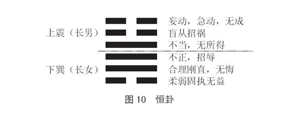

 *第六章 学曾国藩到底学什么*

曾国藩为什么尤其值得我们现代人研究、学习与效仿？因为他实在是我们理想的楷模。

什么叫“理想”？让别人满意的，就叫理想。但是如果有人挑你的毛病，那有没有关系？没有关系，因为本来任何事都是见仁见智的。一件事情或者一个人，有人觉得好，就会有人觉得不好，有人认为有价值，就会有人认为这不算什么。你要做的就是尽量让更多的人满意，但你心里要清楚这个事实，不能过于看重或纠结于这一点。

什么叫“楷模”？楷模就是典范。关于这一点我们要好好地探讨一下。

西方人为什么崇拜英雄？因为他们有一个共同的主人，那就是上帝；他们有一本共同的规范书，叫作《圣经》。而我们没有，我们知道世界上没有两个完全相同的人，我们也找不到两棵一模一样的树，甚至连树叶也不可能有完全一样的。所以我们认为谁也不要学谁，因为学不像，而且就算学得很像，也会没有尊严，那你就变成他的奴隶，他的复制品了，毫无意义。我们不崇拜英雄，“你那么好，我还崇拜你，那我不成马屁精了吗？我干吗要给你锦上添花？”

我们比较重视的其实是豪杰，而不是英雄。我们也不认输，为什么不认输？因为我们知道人一认输就什么都完了，那就叫“泄气”。气一泄了以后，你想再把它充实起来就会很难。可以说中华民族就是靠不认输才得以持续绵延的。

我们只能靠典范、靠模仿典范来学习和提升。西方人往往会告诉你，你要学他，而且也会告诉你应该学他什么什么，都会讲得很清楚。而中国人却不是，中国人只会告诉你要把他当==典范==，至于你要学他什么，每个人可以不一样。其实这也是受《易经》的影响，《易经》就告诉我们，宇宙的一切一切，四个字就讲完了，那就是“大致如此”。大概就是这样，不可能百分之百完全一样，这也是合乎自然的现象。我们模仿典范也只需要做到==差不多==就好，因为条件不同，环境不同，你不能过于勉强自己完全遵照别人。

有人可能会说，不是要“见贤思齐”吗？见贤思齐的前提是要有同质性，如果没有同质性，最好就不要学。比如一个人很会弹钢琴，你就拼命想跟他看齐，而你根本连五线谱都看不懂，那你就是要累死自己。或者一个人很会打篮球，你就要向他看齐，可是你身高不够，你再跳也跳不了那么高，那你学他就也是要累死自己。如果你打篮球，他也打篮球，他打得比你好，那你向他学习就没问题。所以同质性很重要，异质性太高的，不要勉强自己去学，你就好好做你自己，好好走你自己的路就行了。

# 第一节 学曾国藩一生三不朽

曾国藩一生的成就，主要表现在他是三不朽的典范。什么是“三不朽”？“三不朽”就是指==立德、立功、立言==。

我们为什么把立德摆在最前面？一般人总认为立德最难，其实立德最容易。因为你不必做大官，不必有大事业，也不必写书，只需要立德就够了，就能不得了了。其次比较难的是立功，因为你需要有机会，如果没有机会，那么即便你本事再大，也立不了功。最难的还是立言，因为你写书，即便写了一辈子书，你的书能够存留二十年就不错了，很多书都是没过多久就不知道被丢到哪里去了，没有人再会记起。大家应该知道，台湾现在印的书，其实有80%最后都在切纸厂被切掉了，你不要以为大部分书都很畅销，没有那回事，所以立言也是高度困难的。可是曾国藩却三样都做到了。

## 一、立德：晚节得以保全

曾国藩最了不起的是他能功成身退，这一点是很难做到的。一般人一旦有了权力以后，都想一直做到死，其实这是对自己很不利的事情，可是真正要放弃却很难，刚开始都会说“我做到某个层次就怎么怎么样”，可是真到了那个时候，他就不会信守承诺了，就想一直做下去才好。就算有任期制也没有用，他也还是要继续干预。所以有的是明的“太上皇”，有的是暗的“太上皇”，有的更有意思，是自己认为自己是“太上皇”，你说可笑不可笑。

曾国藩能做到保持晚节，其实晚节不保是很不幸的事情，但是晚节又很容易不保。有一句话叫“老来入花丛”，那就是典型的晚节不保。

台大有位教授，他写了一本书很畅销，然后书店老板就请他吃饭，“你这本书让我赚了不少钱，我请你吃饭，以表我的敬意”。吃完饭书店老板又说：“我们去舞厅吧。”这位教授马上说：“这怎么行？我是教授，怎么可以进舞厅？”书店老板就说：“你就去一次有什么关系，下次不去了，不要说你不去，我也不去了。”教授一听，“就一次？可以，只有一次”。然后过了一个星期，就变成这位教授打电话给那位书店老板：“我请你吃饭，吃完去舞厅。”“你不是说不能去吗？”“一次，就这一次。”然后一次加一次，又一次，再一次，最后把所有的版税都花光了，把房契也拿出来当掉了，这就是晚节不保。

## 二、立功：开创中兴大业

曾国藩是清朝的中兴大臣，对清朝的政治、军事、文化、经济等方面都产生了深远的影响。这是大家都公认的，这些也都可以算是他的功绩。清朝那时候实际上已经快速地在没落了，他带领一帮人才把它振兴起来，成就是很辉煌的，虽然这个振兴也只是暂时的，但是最起码让清朝又能再多撑一段时间。那时候他的势力之大，大家对他的尊敬，以及后来世人的评价，都表示他的确是个非常了不起的人物。

## 三、立言：家书广为流传

说到立言，曾国藩所著书籍中流传最广、声名最著的可以说就是他的家书。但是大家是否想过，有谁写家信会让所有人都知道的呢？所以也不排除他==借家书来向皇帝表明心意==的可能。如果这条推测真的成立，那就不得不说曾国藩这招很是高明。中国人是没有秘密的，曾国藩写信给他弟弟，写信给其他任何人，都会有人传，然后就会有人密报至朝廷。皇帝听了以后就会比较宽心，就会心想他还会讲这样的话，应该不至于会叛乱。另外，他还有一本书，就是我们前面讲过的==《挺经》==，一直流传至今，而且对于我们现代人而言依旧非常适用。除此之外，还有人认为==《冰鉴》==也是出自他之手。

# 第二节 学曾国藩做千古完人

## 一、德才兼备，文武双全

有一位史学家叫郭斌和，他曾对曾国藩作出极高的评价。他对曾国藩的第一句评语是“才德俱备，文武兼资”。这是很难得的，因为一般能文的人多半不能武，能武的人则多半不能文，很少有人二者皆能的，而且文武本身就是很难兼备的。他还很具体地分析了曾国藩的特点，我们一起来好好体会、领略一下。

## 二、有宗教家的信仰

第二句话是“==有宗教家之信仰，而无其迷妄==”。这个“迷妄”是宗教家要特别小心的，一个人一头栽进某一件事物中后，往往就会觉得里面的东西样样都是对的。我们举佛教为例，因为它跟我们的内心最接近。佛教本身最要紧的就是没有分别心，可是台湾所有的宗教，包括佛教在内却都在说“别人的都是邪教，只有我的是正的”。这很明显就是不对的，你怎么可以有分别心呢？

作为一个宗教家，千万要记住，==你可以说你的教义怎么好，但你千万不能去妄批别的宗教不好==。但是现在各个宗教都很难做到这一点，道教说佛教不好，佛教说道教不好，基督教说其他教都不好。我很客观地讲，==排他性最强的是基督教，佛教反而比较宽容==，应该算是比较宽缓的，但是各个门派之间仍旧存在彼此否定的现象。这就叫“迷妄”，迷惑而不切实际。曾国藩就有自己很坚定的信仰，但却没有这种“迷妄”。

## 三、有道德家的笃实

第三句话是“有道德家之笃实，而无其迂腐”。一般人讲道德，多半会流于迂腐。什么叫“迂腐”？迂腐就是守旧，不随着时代而改变，即便不合理的事情，也还要坚持。所以我一直不太赞成用“孝顺”这两个字。中国==有“孝道”，有“孝心”，有“孝敬”==，什么时候冒出一个“孝顺”来？我就不清楚了。如果你爸爸叫你做坏事，你也要顺他吗？你也要听他的吗？有的妈妈还告诉儿子：“隔壁家在盖房子，那里砖头一大堆，我们家刚好缺三块，你去拿，但是你不要一下子就拿三块，那样人家会看到，你一次拿一块回来就好。”还有的妈妈看到公共汽车来了，就把雨伞给儿子：“儿子，你拿伞上去多占个位置，先不要管我，我马上就来。”这些都是很常见的事。那么作为子女，这些话你要不要听呢？听了之后还算孝子吗？而这种孝子又有什么用呢？

顺是很可怕的事情，但是不顺就是叛逆了。所以如果懂《易经》，你就会知道，站在不顺的立场来顺，才会顺得合理。千万不要盲从，盲从是很可怕的。爸爸的话如果是对的，那我就没有理由不听他的；爸爸的话如果是不合理的，我也不能当面顶撞，不做就是了，说不定他是说给别人听的，过去就过去了，或者说不定他是考验我的，他叫我去拿别人的东西，就是要看我到底会不会拿”。所以一定要有这种警觉性，自己要有独立清醒的判断，绝对不能说父母教什么，你就都听，就盲从。

因此为什么道德总是会让大家怀疑而不相信？因为道德家很容易唱高调，只会讲好听的，自己却做不到，而且一味守旧，哪怕不合时宜、不合情理，也要坚持固有的观念或做法，这就叫迂腐。

## 四、有艺术家的文采

第四句话是“有艺术家之文采，而无其浮华”。其实我用“可怜”这两个字来形容艺术家，应该是一点也不过分的。当你把全世界比较有名的艺术馆都看完以后，一定会有一种感觉，艺术家真的是走投无路了。你说你画得很像，人家画得比你更像；你说你画得不像，人家画得比你还不像；你说你什么都不画，可以到纽约去看，一块大白布早已经挂在那里。凡是你能想到的，人家都已经做了，那你还能变出什么花样？所以既然不能画，有人干脆就拿墨来泼，就开始乱来，搞得乌七八糟不像样，还美其名曰“创新”。虽然还真泼出一派来了，但后面的人再要学，就学不像了。再来说音乐，老实讲，真正能靠音乐吃饭的人不多。大家想想看，一个大合唱团、大乐队那么多人，要维持其运转需要多少费用？所以我们真的要特别疼惜艺术家，我很少用“疼惜”这两个字，因为他们确实是有很大的抱负才会走上这条路的，否则的话，如果只是为生活，我想大概很多人不会走这条路。

很多艺术家都挖空心思要推陈出新，其实这种思路和方向是有问题的。一幅画、一首曲子是否能够传世，不是像不像、画得好不好的问题，也不是用什么乐器、加入什么元素的问题，其关键是它有没有灵气。没有灵气的东西是不可能传世的。古董也要看有没有灵气，作品也是看它有没有灵气。一个人活着也是看有没有灵气，没有灵气，那就是一条肠子到底，那就不会有大作为。“浮华”就是豪华而空洞不实，这是艺术家尤其要避免的，很多艺术家往往沉溺于艺术技巧或艺术语言的表达，过于追求华丽外表，哗众取宠，而内里却空洞无物，苍白无力，没有灵气，这种作品肯定难以打动人心，也不会具有持久生命力。

## 五、有哲学家的深思

第五句话是“有哲学家之深思，而无其凿空”。什么叫“凿空”？就是立论无据，流于空谈。每次选举，你去问基督徒也好，问佛教徒也好，你问他们谁会赢，他们都会告诉你：“我们宗教不干预政治。”其实他们不是不讲，而是不敢讲，要是万一说错了怎么办？给一般老百姓算错的问题还不大，一旦涉及政治，凭空乱说的后果就会很严重。而每年去抽签看国运，抽出来的也总会不一样，所以也会让人不知道该信哪个才好。

一般人则更是如此，现代人越来越强调独立自主性，越来越强调独立思考，但是往往喝了一点墨水，就像干瘪的麦穗一般高昂起头来高谈阔论，凭空说大话，殊不知自己所言脱离实际、空洞无物，其人更如井底青蛙般浅陋无知。

## 六、有科学家的条理

第六句话是“有科学家之条理，而无其支离”。科学最要命的就是破碎到无法整合，这也可以说是科学存在的最大、最严重的问题之一。对于一个问题，你很难找到固定的答案，各种学说盛行，各家有各家的说法，各自也有各自的道理，显得支离破碎，没有系统的理论体系，让人莫衷一是，痛苦万分。

## 七、有政治家的手腕

第七句话是“有政治家之手腕，而无其权诈”。你如果把“权谋”变成“诈术”，那后果就会很严重。“权谋”绝不等于“权诈”。你可以变化无穷，可以出其不意，可以尽情使用各种谋略，但绝不能存心耍诈，那就既违反了你立人的根本原则，也违反了道德，而无德者从长远来看，通常都是不可能取得长久成功的。

## 八、有军事家的韬略

第八句话是“有军事家之韬略，而无其残忍”。老实讲，军事家往往到最后都会认为战争就是要杀人，所以慢慢地就会有一点残忍的倾向，会变得很凶狠，很恶毒。这往往不是他生性如此，而是因为长期在那种环境和氛围中受熏陶，已经形成习惯了。所以对于大多数军事家而言，他们自己就需要下很大的功夫去调整，去改变，以回归自己的善良、温和本性。但不管怎样，军事家的战略意识、远见以及胆识，等等，还是很值得我们一般人学习的，只是要坚决抵制其残忍倾向。

# 第三节 学曾国藩百炼终成钢

曾国藩为什么能把他成功的基础打得那么稳、那么牢，一定有他的原因，不可能没有原因。任何事情一定有它成就的因缘。根据我对曾国藩的了解与研究，我认为以下三点非常重要。

## 一、良师益友，遍结同人

在必要的时候，总是会有良师益友及时出现，适时地提醒他。人有时候是需要有人来点醒的。所以我们常常说“点他一下”“请多多指点”这类话，因为当局者往往是很迷糊的。这不是谁聪明不聪明的问题，而是人看自己的事情经常看不清楚，而看别人的事情反而看得很明白。所谓“当局者迷，旁观者清”，所以一生中最好有几个好的老师，好的朋友能及时地给自己一些提醒。

唐鉴当初劝他出山，“眼下洪杨作乱，三湘正遭涂炭。南望家山，不胜悲念……”。郭嵩焘也说：“难得而易失者，时也。顺时而动……”而张亮基、罗泽南更了不起，张亮基自愿交出领导权，罗泽南则大方地把自己手中的一千名团勇，也就是打仗的人，交给曾国藩。自己一手培养出来的人拱手让给别人，一般人是很难做到这一点的。左宗棠更是咄咄逼人，痛骂得他无地自容，这就是在必要的时候给他“下猛药”，否则是叫不醒他的。

除了良师益友的帮助，曾国藩自己还聚集了很多志同道合之士。因为他知道人是群居动物，一个人的能力绝对赶不上集体的力量，所以一定要有人帮忙，才能做大事。比如当时非常有名的胡林翼、左宗棠、李鸿章、曾国荃，都是湘军的主要人物，他们都是由曾国藩大力提拔，后来成为封疆大臣，真正的国之栋梁的。胡林翼甚至还超越了他，比他的职位还要高，可是他也不计较。

曾国藩之所以能够做到这样，就是因为他有足够的雅量。他在这方面对自己提出的要求是，第一，要能听真话，可以容纳不同的意见，不自以为是，不固执己见。这对一般人来讲，可能还相对比较容易，但对一个有权有势的人而言，却是高度困难的。我问大家，我们身体的哪个部位是最早退化的？耳朵，而不是很多人所以为的脚。人一出生，耳朵就开始退化，随着年龄的增长，我们会对别人的话越来越听不进去，所以越老越固执。因为我们会以为自己有了经验，别人才刚开口，自己就会赶紧说：“不用讲了，我都知道，你其实根本不懂。”所以我建议年纪大的人都开放一点，多听听别人的话有什么关系呢？不要太性急，要平和一点，包容一点。

第二，要能与胜过自己的人相处，并向他们学习，严格要求自己，以求不断长进。要做到这点也是很难的。曾国藩是不太懂谋略的人，大家不要以为他自己很会指挥，很会打仗。他打胜仗都是听谁的话？听胡林翼的话。胡林翼很会出点子。但是关键在于他作为一个领导者，他能听进去属下的话，大家都认为这样好，他就说“好，就这样办”。所以其实当领导的人不一定要样样精通，你只要协调能力高，会用人，并能真正用人，充分发挥人才的价值，就可以当好领导。而更为可贵的是，他还能放下身段，虚心向所有具备胜过自己的优势的人请教学习，这就是“不耻下问”。他只求自己获得实实在在的长进，而不在乎一般人所在乎的面子与虚名。

第三，要能扩大舞台，使大家都乐于共事。其实刚开始他也不太推荐人，认为推荐人就要负责任，何必给自己找麻烦，后来还是别人劝他，他才慢慢转变观念。把舞台扩大，用我们现在很流行的话说，就是“把饼做大”。让更多人有机会在这个舞台上和他共同做事情，同时还要让大家很乐意一起共事，这就需要创造一个良好的环境，需要领导人的人格魅力，需要科学合理的制度规范等。但有必要指出的是，这么做不是出于功利考虑，而是从人的价值实现角度出发。也就是说，之所以不断扩大舞台，壮大队伍，不是为了一己私利，而主要是为国家培养人才，只是为大家提供正当方便的晋升途径，帮助他们实现自己的价值，而这本来也是在上者的责任与义务。

## 二、刚柔相济，外圆内方

曾国藩很值得我们学习的一点是，他很出色地做到了刚柔相配合。他告诉我们，为公办事的时候，一定要刚健倔强。曾国藩自幼受家训影响，“做人以懦弱无刚为大耻”。什么叫“刚”？“刚”就是倔强的意思。老实讲，曾国藩本来脾气也是不好的，他也很有个性，可他却能做到坚忍，这就证明他的意志力是很强的，“遇到任何挫折，我都坚忍不拔，我一定要突破它”。

他打仗的时候，皇帝会经常隔空指挥，叫他这样，叫他那样。那他有没有听话？他没有完全听话，这也就是说曾国藩并不是愚忠之人。前面提到他正带兵攻打安庆的时候，太平军把江浙一带全控制住了，咸丰皇帝让他撤出安庆，先把江浙收回，他就据理力争，最后终于使朝廷改变旨令。

这就告诉我们，为公办事，你该强硬的时候就要强硬，你该不听话的时候就是要不听话，你该坚持的无论如何都要坚持。可是为私呢？争名夺利的时候，你就要谦让柔顺。为公要倔强，为私就要让，要柔，要退，要顺，要不与人争，不邀功。“有难先由己当，有功先让人享。”为人尽量谦虚谨慎，礼让低调，才不致处处树敌，才能不仅在官场如鱼得水，更能获时人尊重、世人敬仰。

适当的时候保持刚健，确实是必要的，但是千万记住，不可刚愎自用，刚健与刚愎自用完全是两回事。在京城的时候他刚得过火，因此遭受了很多挫折，才渐渐悟到“过刚易折”，那样自己受的伤害会很大，所以他就慢慢把刚转化成为刚健的意志。意志的确要刚，但是方法要柔，这叫“内方外圆”。一个人一定要内方外圆，“里面”方方正正，但是“外面”要做到随机应变，这样你才能够应付所有外来的变数。

58岁的时候，曾国藩当上了武英殿大学士，要知道，那是非常有社会地位的官职。他的儿子曾纪鸿当时考中秀才后，几次考进士都没有考取。我说这些的意思就是说，曾国藩其实完全可以利用他的势力，可以去走后门，可是曾国藩没有。他写信告诫纪鸿：“场前不可与州县来往，不可送条子。进身之始，务知自重。”让纪鸿考试之前不可暴露自己的身份，也不可以送条子请人帮忙。其实当时很多人就是这样做的。但是曾国藩告诉他儿子，“这是你进入社会的开始，你一定要自重，否则的话，别人就会看不起你”。纪鸿没有考中进士，曾国藩就把他接到自己身边，亲自教他，坚持不走后门。

我想这也是我们现代人应该好好反省的。我们现在很多人走后门，总以为神不知鬼不觉，但到最后，总是闹到所有人都知道。我对中国人研究了很久，我可以讲，中国社会是一个完全没有秘密的社会。什么事情最后都会让大家全知道。中国人一开口总是说：“你不要告诉别人。”对方马上会说：“我跟别人讲什么。”然后出去之后立刻告诉别人，这才叫中国人。他心里会想：“你叫我不要告诉别人，我就听你的？我要不要讲是我的事情。”

而且中国人都有一个非说不可的人。我跟你讲一件事情，你说“我绝对不告诉别人”。那你后来是不是故意要违背自己的承诺？不是，而是你回去碰到老婆，就会想：“别人都不应该知道，老婆应不应该知道？如果我连老婆都不说，将来暴露出来，老婆一问我事前是否知道，那我就完了，从此就信用破产了。”所以你就下定决心，任何人都不可以说，但是老婆一定要说。然后告诉老婆不要告诉别人，这是天大的机密。老婆说：“你说这话太过分了，我什么时候泄露过机密？”可是她一安静下来，就又开始想：“什么人都不应该知道，要不要让妈妈知道？”所以每个人都有一个非告诉不可，不告诉他将来会闯祸的人。中国人是全世界对机密的传播最感兴趣的人，你越跟他说不要说，他越蠢蠢欲动，越是不说不行。

我觉得这其实是老天对中国人的好，因为这样就让机密永远无法存在，那就会让人不太敢做坏事了。中国是一个全民制衡的民族，因此我们不要有形式上的制衡。西方是要有形式上的制衡。可我们中国人呢？如果你当官，有人专门制衡你，你高不高兴？“这就表示你根本不相信我，你不相信我，那我干吗还对你守信用？”因此闽南语有句话叫“严官府出厚贼”，你管得越严，他花样越多，你不管他，他反而还没那么多事。所以我们现在的很多思路，很多做法，实际上都并不适合中国人的本性，因为很多思路大多是从外国搬过来的东西。

一般人都会做的事情，曾国藩当然也可以做，他可以说：“没办法，风气就是这样，大家都这样做，我如果不这样做，我儿子就会吃亏。”可是他始终坚持，吃亏就吃亏。所以其实当曾国藩的弟弟、儿子都是很吃亏的，因为他管得非常严，要求也异常严格。

那曾国藩是不是老好人？绝对不是。他认为“谨于小而反忽于大，且有谨其所不必谨者”。一个人如果对小事情就很谨慎的话，对大事情反而容易忽略掉，而且不该谨慎的也谨慎，什么事都谨慎，那最后就会慢慢发展到只求苟安，没有过错就行，而不求振作有为的地步。我们常说“抓大放小”，就是应该这样才对，大事情抓紧了，小事情马虎一点，其实没有关系。你如果样样都计较，那就没有人能够跟你配合了，别人最后就会只求保平安，只想着“多做多错，我何必呢？”了，那将来“一有艰巨，国家必有乏才之患”，就没有人才了。可见曾国藩自始至终都是在替国家着想，而不是替他们家族，更不是替他个人谋取利益或好处。

## 三、脚踏实地，持之以恒

1.准备好了再居高位

曾国藩怎么就能获得这些成就？我们都知道他出身农家，中了进士以后，他的官运也不亨通，在清贵的翰林院待了九年。所谓“清贵”，就是名望很高，但很清贫。大家想想看，假如你中了进士，你是喜欢被派到地方上去，还是喜欢留在宫廷？留在中央还是去地方？其实各有利弊。你到地方，虽然没有留在中央那么光鲜，但是天高皇帝远，就更容易有所作为；你在中央，表面看似很风光，可是你顶多能做做参谋，出出意见，根本没有实际的工作可以做。

曾国藩在翰林院一待就是九年，这是相当长的一段时间，他在那里只有升迁，但是没有实权。一般人往往耐不住，或者觉得怀才不遇，或者跃跃欲试，浮躁不安。曾国藩却没有，他始终保持头脑清醒，他知道如果一个人还没有准备好，就得到机会居高位其实是非常不幸的，因为这样最后会害己害人。因此他利用这段时间不断反省自己，踏踏实实地学习提高，在品性陶冶、意志锻炼和学问精进上，都为以后的发展奠定了很好的根基。

2.写有恒箴要求自己

28岁中进士的时候，曾国藩就写了一个有恒箴：“曩者所忻，阅时而鄙；故者既抛，新者旋徙。”以前我所喜欢的事情，过一段时间才知道全错了；把故有的东西抛弃掉，新的就马上来了。这听起来好像是求新求变，其实不是求新求变。现在大家都不断地在讲创新，讲求新求变，我认为这是非常严重的问题，因为这会让下一代感觉新的就是好的，旧的就是不好的，就会让他们进一步产生喜新厌旧的习惯，一味地鼓吹求新求变会害死我们的子孙。因此我认为“创新”应该改成“创意”，改成“创善”。“创新”这个词是外来词，但其实它的原意本来就不是创新，而是说我们要做得比以前更好，这跟新旧没有关系。

他改名国藩，决心以恒的功夫来自我要求，“凡做一事，便须全副精神注在此一事，首尾不懈。不可见异思迁，做这样想那样，坐这山望那山，人而无恒，终身一无所成”。这就是他自己下定的决心，然后遵照此走下去，他才得以慢慢地把自己的命运改掉。

我为什么断定说曾国藩读《易经》读得很通，因为他三番两次地提到《易经》。“读易，明白孔子推崇恒卦。”孔子一生提倡道德，他也反复提到过恒卦，“恒，德之固也”“恒，杂而不厌”“恒以一德”。一个人有没有道德是一回事，能不能持久又是另外一回事，而且后者才是关键，长期坚持“恒”，才能使道德稳固。你说你不害人，但是你能够维持几天呢？你不知道，因为说不定你明天就害人了。所以你能够持久，才是真正有那种修养。“我不贪财，是因为钱太少了，钱多我就贪了。”现在有太多人是这样，别人说“我给你一百”，他就会说“一百算什么，谁稀罕？不要”。更有甚者，“你给我一百，好，我收下，我拿去交给警察，这样我可以被人家表扬”，这就叫你丢我捡，双方合作演一出戏，然后得到表扬。这是非常没意思的事，假仁假义，迟早是会被戳穿的。

“夫妇、父子、君臣、兄弟、朋友之间，彼此相感互通，当然很好，但若不能恒久不变，社会怎能安定，家庭怎能和谐？”我们现在也是一样的。社会安不安定，能不能进步，最要紧的是什么？是婚姻，是夫妇这一伦是否错乱。结婚千万不要当儿戏。

我结婚那天，最后弄到没有吃饭，要知道我这个人是从小就要按时吃饭的，不吃饭就会很难过，所以当时我脸色就不大好看。我爸爸一看到我这样就问：“怎么了？今天怎么不高兴呢？是你结婚啊。”我说：“我肚子饿。”他说：“我告诉你，那是我故意的。”我说：“为什么？”他说：“我就是要告诉你，结婚不是那么容易的，结一次就够了。”一听这话，我肯定就再也不想结婚了。

可是现在结婚，新郎要出来讲话，新娘也要出来讲话，玩这玩那，五花八门，闹成一团，非常有意思，所以有人就还想再来一次。我们现在真的是不了解古人的用心良苦。为什么以前中国人结婚都是父母的事，而不是当事人的事？因为父母就是要利用结婚这个机会把下一代推荐给亲戚朋友，给大家留下好的印象，这对孩子将来是会有帮助的。

家庭破裂是我们现在社会最大的乱源，可是大家有没有发现，我们历代的伟人，大部分都是单亲家庭产生的，他们就做得很好。单亲家庭的家长如果心想“我要对孩子负起更大的责任”，这样就对了；如果灰心丧气地觉得做什么都没用，没有办法，那就真的完了。无论如何都不能说不行，说不行是没用的。那应该怎么办呢？首先，已经离婚了，就不要再提从前的事情。其次，应该告诉孩子，“你爸爸因为有事情到国外去了，他在忙，我们等以后再跟他见面”。你如果恶狠狠地说“你爸爸是死鬼”，那小孩肯定就会受到创伤，你不停地抱怨，就会导致孩子的爱情观不正确，将来他会对爱情感到恐惧。所以你这其实是在伤害他，那他还怎么能成为正常的人？

既然发生了，你就要正面地应对它，你要付出更多来弥补孩子所受的创伤。你要告诉他“这件事情是偶然发生的，不是必然的，天下好男人好女人多得很”，你要健全孩子的心态。千万不要拿单亲家庭作借口，对孩子也采取“破罐子破摔”的态度，父母无论如何都要尽到自己的责任。关于家庭教育问题，其实有一个观念最重要，那就是，夫妇是什么？在卧室里面才是夫妇，出了卧室就不是夫妇了，就要么是别人的父母，要么是别人的子弟。

所以我们看了曾国藩说的这些话，应该有个正确认识，道理永远是对的，它不会因为时代的变迁而改变，但是你的方式、方法是可以调整的，你仍旧要贯彻自己应该走的路。

那么，怎样才能做到恒呢？“刚上柔下，各得其位。上下一致，完成任务”，这才是致恒之道。

这是恒卦（见图10），下面是风，上面是雷，叫作雷风恒。上面是长男，下面是长女，这就可以看出，《易经》其实已经很明确地说了，一定要男人追女人才行，如果一个男人在追求你的时候连一顿饭都要“你出一半钱，我出一半钱”，那你就不要跟这个人一起吃饭了。这个卦的前面一卦是女的在上，男的在下，但是结了婚以后，就变为现在的男的在上，女的在下，这个秩序都摆得很清楚。记住，看卦一定要从下往上看。

你如果很柔弱，那你固执是没有用的。你合理地刚直，才不会让自己后悔。可是当你不正直的时候，就一定会遭受耻辱。《易经》讲这些都讲得非常清楚，到底你该怎么办，你要自己去琢磨。上面是“不当，无所得，盲从招祸，妄动，急动，无成”。《易经》往往用非常简单的几句话提示你，可是这些话分析起来却是变化无穷的。其实我们要想一次把它讲通是很难的，比如上图中的三爻和上爻，二爻和五爻，初爻和四爻，都是一刚一柔，都是相应的，单单这个相应的变化就值得我们好好去体会。

3.没有什么不可改变

“余三十岁前最好吃烟，片刻不离。后来立志戒烟，至今不再吃。四十六岁以前，作事无恒，近五年深以为戒，现在大小事均尚有恒。即此二端，可见无事不可变也。”

曾国藩30岁以前最喜欢抽烟，可以说手不离烟，甚至可以说片刻不离，后来立志要戒烟，到现在也再没抽过。这就说明习惯是可以改的。

46岁以前他做事没有恒心。他很早就知道“恒”的重要性，但是经过很多年，他才慢慢做到。“现在大小事均尚有恒”，这句话如果从字面上解释说，“我从现在开始觉得我有恒心了”，这样理解是不对的，因为恒心是无止境的，你一放松，老毛病就又出来了；你时时警惕，告诉自己不能错，不能再犯，老实讲即便这样都还不一定有成果。人要拉紧自己很困难，但要放松自己就很容易。稍微一放松，就全松懈了，要再改回来就非常困难了。所以这句话实际上是说我一直到现在还深深觉得自己没有恒心，我不能再没有恒心，因此我才有恒心。

就这两件事情，一个是抽烟，这个习惯戒掉了，一个是没有恒心，现在慢慢的有恒心了，这就证明“无事不可变也”，任何事情都是可以改变的，但是这里面还包含一句话，人性是不会改变的。为什么中国人说话总是这样翻来覆去，就是因为他想要两点都兼顾到，而不会只偏某一边，所以怎么讲都对。因此中国人会发明这样的语言文字，是有高度智慧的。很多人说西方的文化结构很好，因为它很固定，说白就是白，说黑就是黑，可以很明确地说出对错，但是它要变就不容易，而中国人的话反过来想就马上意思变了。正因为如此，与中国人相处，真的要保持高度的警觉性，脑筋要很灵光，反应要很快。我觉得这就是它的好处，任何事情有坏处就一定有好处，有好处也一定有坏处，不可能只有好处或者只有坏处。同样的道理，当我们说可以的时候，要想到不可以。当我们说要的时候，要想到不要，因为它们都是同时存在的，这是我们跟西方人最大的不同之处。天下事没有什么是不能改变的，这句话同时就含有“基本人性不能改变”的意思，这就叫“有所变有所不变”。

4.方向对了再去坚持

“凡是做一件事，无论艰险或平易，必须埋头去做。掘井只要不停地去挖，终究有一天是会出水的。”这是曾国藩说的话，但是掘井一定会出水吗？不一定。我并不是在批评曾国藩，我只是提醒大家读书应该怎样去读。

他告诉你，挖井要不停地挖，就总会挖出水的。可是如果你这里挖挖、那里挖挖，当然迟早也会挖出来，但是你可能半辈子时间就没有了。所以他这句话包含的意思是，先决条件是你要经过测试勘验确定这里有水之后，才可以一直挖，否则你就可能挖到最后什么都挖不出来，或者走很多弯路，浪费很多时间和精力。你去挖井，当然不能说挖两公尺没有水就放弃，也不能说挖四公尺没有水就放弃，如果确实有水，你就要继续挖，直到挖出水为止。可是如果前面的勘验工作没有做好，随便找一个地方挖，那就不能保证一定会出水了。

“如果观望犹豫、半途而废，不仅对于用兵会一无所成，就是做别的事也会因自己停止而完成不了。”这就是说做人做事都要有毅力，要经得起各种挫折，要能面对不同的变数，要坚持到底。可是坚持到底的先决条件是方向要正确。方向不正确就要坚持到底，结果很可能会不堪设想。

为什么孔子说“三十而立”，三十岁再立定方向和目标，而不要太早确定。现在有些小孩子读五年级的时候就开口闭口讲“这是我的原则”，这很可怕。那么小的人，能有什么原则呢？他懂什么叫原则？可是做父母的经常不忍心去纠正他，也害怕自己去纠正他，怕他以后什么话都不跟自己说了，但这其实是害他。

那么，我是怎么做的呢？大家可以作参考。我就说：“你真了不起，你才上五年级就有原则了，我到大三还没有原则呢。”他就愣在那里。我又说：“太早有原则，这个原则不一定对。”但是我马上又说：“不过你很聪明，你大概是对的，所以你最好回去问问你爸爸，看你这个原则对不对，因为你爸爸毕竟比你经验丰富。”结果他很认真地点头说：“好。”教训人家是最不好的，但是不忍心去告诉别人真正的道理，那你又是没尽到责任的，这才叫“一阴一阳之谓道”。所以怎样做到“同样一句话，讲得漂亮一点”就尤为重要。我们现在就是不懂得什么叫作“漂亮”。“漂亮”就是圆满的意思，你必须要照顾到方方面面。你得罪任何人，都是不成功的。

## 四、人生就是阶段性调整

我想阶段性调整是我们每个人都必须要做的事情。我最常写的一句话，就是“人生是阶段性的调整”。你只要调整不过去，就会下来，那就永远再难上去。在人生道路上，我们每走一段就会遇到瓶颈，那个瓶颈就是转折点，或者叫拐点。你如果拐不过去，就会栽跟头。人生经常会遇到转折，那时候你就要好好考虑怎么转得好、转得顺、转得有效，这就叫调整。

1.少年时期

他年少时勤读经典，后来考中进士，这是一个人的一生中非常重要的一个关卡。我们到现在还是一试定终身，很多人对此或抱怨或抨击，大家都以为只有我们中国人这么重视考试，觉得这好像是中国特色，其实全世界都一样。你到日本去看，只要你考取东京大学，这辈子的所有问题就都解决了，自然有人会来为你说亲说媒，自然有人要把他的事业交给你，自然有很多人留了好职位等着你去。在美国也是一样，你以为要进哈佛大学很容易吗？也是从小就要准备的，你只要一进去，很多问题大概也就都解决了。同样，在英国你只要进了剑桥或者牛津，也没有什么好发愁的了。

考试是所有人类都在做的事情，而不是单单是我们中国这样。你考上好学校，别人就会对你另眼看待，这是很普遍的现象。这能怪谁呢？因为别人没有办法判断，只有靠文凭来判断，其实这是很不恰当的，但是没有办法，我们暂时没有找到其他更好的办法。所以曾国藩考中进士，就等于把他的家庭推向了更高一层，否则的话，他永远就只是一个农家子弟，也不可能有那么好的机会跟那些名流认识，跟他们交流互动，更不会有权力办团练、打太平天国，这些都轮不到他。

2.青年时期

青年时期，他志气坚定，甚至自己改名叫国藩，就是要“为国藩篱”。其实他这个名字，我们很客观地说，不是改得好，而是改得很不好。从正面看，这显示他很有志气，但是从负面看，他却是在找自己的麻烦，而且甚至可以说给他增加了很大的负担。你叫本名就好了，有真才实力才最要紧。改名干什么呢？可是他改了，改了之后就只能他自己去受罪了。

所以不要说名字叫得好才好，名字必须要跟人配合起来才有用。很多人名字就是叫不起来，别人一看到他就叫他的绰号，这有什么办法？名字应该是合适不合适比较重要，而不是好不好的问题。他“决心为国藩篱，澄清天下而奋斗不已”，这是好事情，但这会很辛苦。任何事情其实都没有好坏，每个人做任何事情都是自作自受，最后都要自己承担。这些才是我们现代人应该好好吸取的宝贵经验。

3.壮年时期

曾国藩壮年的时候历经苦难，尤其是我们前面讲的那十年，既艰困又阻塞，寸步难行，稍不留意就会招来祸患，战战兢兢，如履薄冰，好几次实在没有办法之际，甚至欲求一死，可是待他醒悟之后，又开始坚持恒卦，只思进德修业，坚忍不移，最后硬是化险为夷，化蹇为恒。要知道这个“忍”的功夫是很难养成的。

4.老年时期

待到老年，曾国藩又能审时度势，因为他把当时的情势都看得很明白，所以就能抓准时机，当机立断，裁军而不辞官，最后才得以全身而退。否则当时太平军已平，以他当时的危险处境，只要他做错一事，走错一步，不说晚节不保，甚至还会死无葬身之地，而他一生的艰辛努力也就都付诸流水，一场空了。

## 五、左手《易经》，右手《三国》

1. 遵循易道而行

曾国藩是熟读《易经》的，而且更重要的是，他能遵循易道而行，这是我们应该学习曾国藩的第一点。《易经》告诉我们“时”非常重要，它可以决定很多事情。“时”没有到，能拖就拖；“时”一到，当机立断。所以要坚持待时而动，顺势而为。不管是顺境、逆境，都要审时度势。当然逆时要有逆时的做法，顺时要有顺时的做法，只要稍不合理，就会徒劳无功。

“盛时常作衰时想，上场当念下场时。”我们常常讲“上台靠机会，下台靠智慧”，上台是很容易，一有机会，别人一招手，你就上去了，可是下台却往往是很难的，若不运用智慧，很可能会还没有走到回家的路上，就被别人腰斩三段。所以曾国藩坚持裁军而不辞官，因为这样才能够“持盈保泰”，“持盈保泰”就是《易经》教给他的智慧。身处顺境乃至极盛之时，就该时刻小心谨慎，保持安定，才能保住已有的事业。

2. 熟读《三国演义》

我反复强调，《三国演义》里面都是最精华的东西。一个人如果不读《三国演义》就实在太可惜了，而且中国人一定要年轻的时候就读《三国演义》，不要等到老了才读。因为一般而言，人到老年，往往已经够世故，够有谋略了，而年轻人尚不懂世事，从《三国演义》中学习这些东西对他们是会非常有帮助的。

曾国藩是怎么演绎《三国演义》的呢？他一方面“谨慎如孔明，处处留余地”，一方面又不守旧迂腐，而是灵活应变，圆通自如。太平军年轻一辈的将领中最会打仗的是李秀成。李秀成带领太平军在南京与湘军交锋，最后战败逃亡，结果被老百姓抓获，送到曾国荃那里。曾国荃最恨的就是李秀成，所以就拿了一把钻孔的铁锥往他身上猛刺以泄愤。而当时抓获李秀成是大功劳，所以大家都争着抢功，都说李秀成是自己抓的，甚至反倒还怀疑那些送他来的农民，说他们把李秀成身上的宝贝都抢光了，要拷打他们，总之是乱作一团。

如果你是曾国藩，碰到这种情况你会怎么办？曾国藩的处理办法就正好证明他不是一个老好人，不是一个迂腐的人。按理说，像李秀成这样的人，曾国藩是没有权力处置的，必须送由朝廷发落。《三国演义》里面的魏国大将邓艾，冒那么大的险把蜀国的成都打下来了，可就因为他处置不当，朝廷就立马把他给杀了。同样，曾国藩要是敢去处理李秀成的事情，别人就会认为他有造反之心，认为他心目中完全没有皇上。当时连外国人都跟他说：“像这种人，你赶快送到朝廷去，让朝廷发落。”

可是曾国藩心想：“我如果把他送到朝廷，就会承担非常大的风险，我的处境会很危险。”首先，李秀成也会编造，他会说湘军很残忍，“你看我身上都是洞，他们连对我都这样，对其他人肯定更厉害。我们本来很早就要归顺的，就是因为他们太残忍，才会顽强抵抗”，甚至其他更厉害的诬陷。其次，他会透露湘军内部的很多信息。老实讲，要军队里的所有人完全守纪律是很难的。湘军当时就有一个人打胜仗之后太高兴了，见到女人就扑上去，最后甚至闹出人命。因为处在一个非常时期，大家不要用看待常人的眼光去看。那不能送朝廷，该怎么办呢？斩。可是他敢斩李秀成吗？他如果敢斩，皇帝正好能以此为借口就把他给斩了。

最后他就写了一个奏疏，说：“我现在抓到李秀成（他说得很含糊，不敢说是怎么抓的），我是不是要送到京城去？还是我就地处决？请裁决。”那边奏疏刚送出去，这边他就让李秀成吃得饱饱的，然后给斩了。朝廷自然就会来质问：“你怎么可以自行处决他呢？你应该让朝廷来决定才对。”曾国藩就解释说：“我也想这样，只不过我请示的奏疏上去之后，隔了很久也没有下来，可能是驿站误递，耽误了，而这边呢，他硬要造反，所以我等不及，只好先斩了。”这明明是撒谎，但是他不撒谎就没命了。

中国人撒谎常常是尊重别人，爱护自己的结果，这样才叫不迂腐。因为他如果真的请示上面了，上面的答复一定是要解送朝廷，绝对不会授权给他去处置的。那后面的问题就会多得很，他肯定会吃不了兜着走。因此杀人灭口是非做不可的事情，可是他也一定要能自圆其说。后来这件事情在朝廷闹了很久，慈禧最后就说了一句话：“人都死了还吵什么，算了算了。”大家说慈禧不好，但是她也有可爱的地方，她很会处理这类事情。曾国藩就这样将事情掩饰过去，也把后患降到了最低，这叫什么？这叫圆通，而不叫圆滑，叫艺术，而不叫奸诈。大家好好去体会这其中的差别。

# 第四节 谨记曾国藩谆谆告诫

曾国藩作为“中华千古第一完人”，他不仅造福自家子孙，家族后代遵从其遗训未出一个“败家子”，与此同时，他也为后世所有华夏子孙留下了无尽财富，他的人生智慧与箴言犹如一股永不枯竭的清流滋润着无数人。对于我们现代人而言，他留给我们的启示至少有以下三点。

## 一、继旧开新，而非求新求变

第一点就是继旧开新，但是绝对不可以求新求变。我们现在整个社会，海峡两岸都在倡导“求新求变”，这样下去，将来我们的子孙是会非常凄惨的。生活方式、工作方法是可以变的，但是基本法则、伦理道德不能变。《易经》告诉你有不易的部分，但并不是完全变异（易）。

所以我们经常说：“一切一切都在变，只有变才是实在的”，这句话其实不对。因为没有不变，就谈不上变，不变和变是同时存在的，所以一定要有所变，有所不变，以不变应万变。但是这句话现在看不懂的人太多，几乎所有人都对“以不变应万变”持鄙视态度，而且还一直鼓励人们要创新，要勇于怎么样，敢于怎么样，这些其实都是害人。只有“以不变应万变”才是最高的智慧。

## 二、治学有方，而非开卷有益

以前说“开卷有益”，没有错，因为过去的人写书是很谨慎的，他是要负责任的。可现在不是，现在很多人一下子出了一大堆书，这其中好书固然有，但是那种乱七八糟的书更多，有好书也往往被淹没了。如此身处知识爆炸、资讯泛滥的时代，我们就更加要慎选，要明辨，以免不明是非。

开卷并不一定就有益，记住：凡经过的必留下痕迹，你所听到的话都会有痕迹，不好的话，一定会害你。因此千万不要说“姑且听，没坏处”，也不要说“我去听课，只要听到一句对我有用的就好了”。一定要是听圣贤的话，否则宁可不听不看。不听不看，你还不会受害，听了看了就麻烦了，因为听了看了之后再想要清除它是很难的。不管怎样，合理的才可以听，合理的才能拿来用。

## 三、深思熟虑，而非立即反应

做人要深思熟虑，而不是立即反应。偏偏我们现在都是鼓励大家立即反应，“马上说”“马上做”“马上表明态度”“你怎么这么慢”。其实反复思虑并不是优柔寡断，要求别人尽快说清楚、讲明白才是存心害人的不良企图。深思熟虑，考虑周全，往往才能对一件事情作出最好的应对，也才能取得最好的效果，否则就会后患无穷，你自己也会因为轻率鲁莽而自食苦果，后悔不迭。

我们讲曾国藩，到这里就可以告一段落了。有一点大家必须清楚，曾国藩是曾国藩，我们是我们，我们学他也学不像，就算学得很像也没有用。我们还是要走自己的路，讲自己的话。每个人最要紧的是要好好想一想，你这辈子来到这世上到底是要干什么的，这才是最关键的。“死在生前方为道”，你在没死以前，就知道自己这辈子要干什么，以及自己死了以后会是什么样子，那么，真正到死的那一刻，你就不会有什么忧虑，也不会有什么恐惧。

