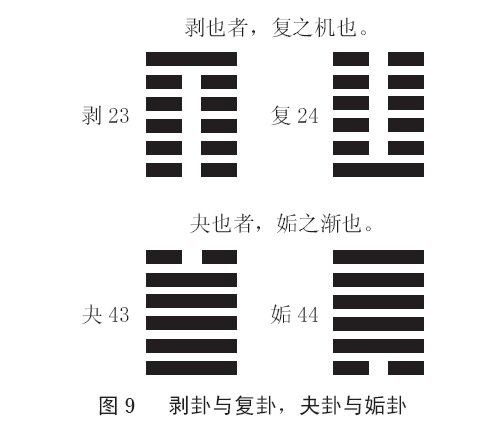

 *第二章 处世智慧尽在《挺经》*

# 第一节 了解自己，了解他人

《挺经》可以说是曾国藩总结自身人生经验与成功心得的一部传世奇书，也是他修身处世、居官治民的最高法则。这本书很薄，只有两千多字而已，但却很值得我们一读。我们每个人都可以把它当作一面镜子，要经常问自己“挺不挺得住？”做人无论如何一定要挺得住。

“自知以修身。”每个人都要不断深入了解自己，不是了解自己的优点，很多人热衷于到处宣扬自己的优点，其实完全没有必要。最要紧的是要了解自己的缺失，了解自己的不足，然后好好地去弥补、改正它。我们总是花太多时间在别人身上，其实我们真的应该好好爱惜自己，好好对待自己，每天最起码要留出一个小时给自己，用二十分钟来养身，二十分钟来调心，再用二十分钟来为自己找出一条出路。

“识人以用事。”一个人如果不了解自己，那就没办法了解别人。其实了解别人相对来说还比较容易，了解自己才尤其难。我们大部分人就是一辈子不了解自己，因此会感觉很痛心。而亲友若不了解自己，就会更加痛心，因为我们对他们最好，也希望他们能了解我们，可是往往事与愿违。每个人都有盲点，这些盲点就是我们自己看不清楚的点，我们什么时候把它们看清楚了，就能很快地调整过来了。我们这辈子来到这世上就是要调整自己身上的盲点的，这就叫“功课”。

# 第二节 宦海沉浮十八心法

《挺经》总共分为十八卷，是曾国藩在宦海沉浮中总结出的独门心法，也是他从自身的成败得失中建立的一套为人为官的基本原则与理论，具有很强的实用性、启迪性和借鉴性。

## 一、内圣：做最好的自己

第一卷，内圣。内圣就是把自己修炼好，不断地充实自己，提高自己的品德。我们再重复一遍这句话，因为它是曾国藩一生中非常重要的觉悟，“功名由天定，修德在自己”。我们所能做的事情很有限，求功名不一定能得到，想做什么并不一定就能做到，但是我们如果想要修己，想要使自己品德高尚，那我们马上就可以做到。人生只有这件事情是我们可以全面掌握的，其他的都不可能。

“慎独则心泰。”“慎独者，遏欲不忽隐微，循理不间须臾，内省不疚，故心泰。”什么叫“慎独”？我们一般把“慎独”理解为单独一个人的时候要小心，要时刻注意自己的言行，其实不是这个意思。“慎独”就是好好做自己，走你自己的路，不要非要求自己和别人一样。你干吗要跟别人一样呢？这个“独”是你特有的、独特的，是你跟别人不一样的地方，也是你这辈子最需要发挥的部分。我们这辈子来到这个世界上就是要做跟别人不一样的人。所以你用不着害怕。如果你的特色能做到让大家普遍欢迎，那就表示你是成功的。相反，如果你的特色老是和大家格格不入，那你自己就要好好去调整。

“主敬则身强。”“主敬者，外而整齐严肃，内而专静纯一，斋庄不懈，故身强。”时常问问自己，“我对任何事情到底有没有用心？”“敬”就是看重、看得起。时刻告诉自己，眼前这个人是最重要的，手上这件事情是最重要的，现在要说的话是最要紧的。不要一会儿这样，一会儿那样，那就表示你不经心，不经心就是不看重，不看重就是看不起别人。其实你看不起别人也就是看不起自己。“敬人者，人恒敬之”，你看得起别人，别人才会看得起你。用闽南话来讲，就叫“你看我普普，我看你雾雾”，中国人就是这种个性，“你看不起我，我干吗要看得起你？你对我不好，我为什么要对你好？”所以别人看不起你，最主要的原因就是你让他感觉到你看不起他。因此不要片面地去要求别人，或者抱怨别人没对你怎么样，你想要别人怎么对待你，就要怎么对待别人。

“求仁则人悦。”“求仁者，体则存心养性，用则民胞物与，大公无我，故人悦。”仁者不但自己注重修养心性、品德，对他人也心怀仁德与关爱，对人对事大公无私，所以自然受人喜爱。中国人主要讲仁，不太讲爱，同样，中国人讲情，也不太讲爱，西方人则讲爱讲得比较多。爱是很肤浅的，情则是很内敛的。到底是情比较长久还是爱比较长久呢？爱往往一刹那就没有了，因为爱就像火花一样，往往“啪”的一下就没有了。情才会长久，情就是关心别人、看得起别人，并且对对方有期待，爱则更多的是从自我出发，“我感觉很好”，而不管对方感觉好还是不好，高兴还是不高兴。

“思诚则神钦。”“思诚者，心则忠贞不贰，言则笃实不欺，至诚相感，故神钦。”你的心思想法很忠实诚恳，言语也实在可信，那么连神明都会觉得你这个人很可敬。老实说人是离不开神明的，我讲的神明跟一般人所解释的不太一样。你如果自己看到或感觉到神明，心中忍不住惊叹“啊，神明”，神明就来了。真正的神明是你看它很神奇，它看你却很明白。我们看天，会觉得它很奇怪，因为它总是变来变去，而且往往只是一瞬间的工夫，变幻莫测，我们看不懂也看不明白，但是老天看我们却是清清楚楚的，我们无论做什么都骗不过老天。

“修身功夫果至，效验自臻。”一个人的品德如果修炼得好，就一定会有好报。如果暂时还没有好报，那只能说明你还不够好，你还需要反求诸己，然后不断地精进。其实所有宗教归根结底都是在强调一句话：“我们是可以超脱的。”因为原本事实就是如此。人首先要不断超越自己，然后才可能最终得以超脱。

## 二、励志：要有大器量大格局

第二卷，励志。“君子的立志，有为民众请命的器量，有内修圣人的德行，外建王者称霸天下的雄功，然后才不负父母生育自己，不愧为天地间一个完全的人。”今人往往很少有这样的度量与志气。如果有人问年轻人打算做什么，他们大部分可能会说“我打算赚很多钱”，或者说“我打算当很大的官”，总体透出来的气魄、格局都很小。为什么会这样？大家可以好好反思一下。不可否认肯定有年轻一辈自己的原因，但问题更多的是出在这个时代、社会，以及作为长辈的我们身上，时代的新形势、新问题，社会的新风气、新观念，家长的教育引导对年轻人的塑造与限制，其力量都是不可小觑的。

“以顽民难感化为忧，小人当道为忧，平民未受到照顾为忧。”曾国藩从来没有忧过自己，这是不是说他的日子很好过？不见得。但他就是从来没有想过“我自己要怎么样”，从来没有。而现在的人却差不多都缩小到只有自己存在，只有自己的事情最重要的格局了。“至于自己如意、困顿，世俗的荣辱得失，固不及忧及此也。”根本来不及管这些，曾国藩说他忧国忧民都来不及，哪有工夫管自己是否如意是否艰难困苦，更别说别人对他的看法、批评，他根本不在乎，也顾不上这些。

## 三、家范：学校没法代替家庭

第三卷，家范。家范就是家风、家教。现在的孩子一出现各种问题，通常都会把所有责任推给学校，这其实是不公平的。学校教育原本就没办法代替家庭教育，孩子的很多问题其实恰恰出在家庭教育的缺失上，尤其是孩子的性格、品德的塑造与培养方面。父母不可以说自己太忙了，所以没时间教孩子。现在社会上发生很多青少年犯罪，父母都将其归咎于孩子从小成长于单亲家庭，实际上这并不是理由，至少不应该作为主要理由。

“当初要变成单亲家庭的时候，你为什么不想长远一点呢？”我们总是喜欢事后找借口。凡事都应该事先防范，不要等孩子出了事情，再来后悔，再来骂人，再来求别人原谅，这是不可以的，而且也来不及了。

家范，这个“范”也是跟《易经》的家人卦有关系的。家人卦的卦辞是“利女贞”。“家人之利在妇女之志行正。”“男女正，天下之大义也。家人有严君焉，父母之谓也。父父，子子，兄兄，弟弟，夫夫，妇妇，而家道正。正家，而天下定矣。”所谓“国有国法，家有家规”，每个家庭都要有一定的规矩或者准则，以规范每个成员的言行举止，至少应该有不能逾越之底线。在此基础上每个人扮演好自己的角色，承担起自己该承担的责任，这样家庭才会和谐兴旺。

1.家训

曾家的家训就是八个字：考、宝、早、扫、书、蔬、鱼、猪。关于这八个字，我们后面会具体讲述。（详见第四章第二节）

2.三不信

一不信地仙。什么叫地仙？就是那些怪力乱神，也就是整天只知胡说八道的人。社会上这种人有很多，我们一定要少招惹，只要一招惹，他们就都找上门来了。家里地仙一多，就会被搅得乌烟瘴气，这样的话，家还怎么兴旺得起来呢？最后肯定会苦不堪言，甚至家破人亡。

二不信医药。大家觉得现在的医药能信吗？我告诉大家，现代人遭受着三大迫害：第一，冷饮。发明很多冷饮，各式各样的都有，而且现在的人好像非得一杯冷饮在手，吃饭才有现代化的感觉，其实这样肠胃很容易坏。肠胃是靠自己后天保养的，所以说肠胃是后天之本。而喝冷饮就把这个“本”给破坏了。我孙子吃饭的时候我就会告诉他，所有冷饮统统拿开，不许喝，为什么？因为他必须要固本。一会儿吃热的，一会儿吃冷的，这样肠胃肯定会坏。肠胃一坏，就又达到一个目的，那就是让你生病。所以很多病其实都是现代社会的一些生活方式或习惯造成的。

第二，药物。现在经常会遇到这种情况：一个人生了病，医生就会告诉他，这是没有办法根治的，只能防堵，只能控制。这其实也就是在告诉他，他要吃药吃一辈子。我们这代人小的时候哪有医生跟自己说吃药要吃一辈子的？可是现在动不动就是要吃药吃一辈子。然后一年以后他就告诉你，已经变成慢性病了，你一年必须要来四次复诊、拿药，一直坚持吃药，后面有句话他没说，“吃到死为止”。大家想想可怕不可怕？

第三，治疗。让患了绝症的人都在医院里接受治疗，最后的结果往往是他们连自己是怎么死的都不知道。我这样说有没有过分？没有。但是现在很多人却都没有这种感觉，好像大家都没有意识到这个问题，这是很糟糕的。当医生告诉你，如果怎样怎样，你就可以多活六个月的时候，他后面有一句话没有说，那就是其中有五个半月你都会在医院里，那你愿不愿意？你自己选择。但是真正到那个地步，谁都想活命，那就只能信医生，他怎么说你就得怎么做。这是当前我们现代人没有办法摆脱的一个困境。

三不信僧巫。我不是说宗教不好，我只是说很多人假借宗教的名义做坏事，那不是宗教的问题，与宗教无关，但是这种事实在太多了，尤其是在如今的商业化形势之下。大家看看现在寺庙里的情况就大概清楚了。当你开始相信它的时候，它就开始作怪，开始对你产生作用了，你就会慢慢陷入它编织的陷阱泥潭中难以自拔，所以千万不要信，不要给它任何机会。

3.败家之兆

怎样会败家？“礼仪全废者败，兄弟欺诈者败，妇女淫乱者败，子弟傲慢者败。”礼仪绝对不能丧失，但是过分讲究礼仪也一样会败。而且礼仪是不能训练的，现在很多地方专门请人做礼仪训练，这样训练出来的礼仪都不是真的，就变质了。最明显的一个表现就是训练出来的微笑都是假的。一家公司好不好，就看员工的笑容是很自然的，还是装出来的，你一看就知道了。看一个家庭也是一样，你就看这家的小孩看到客人是自然的喜悦还是假装出来的笑，那种笑就像哭一样，很容易就能辨别出来。礼仪一定要是发自内心的。另外，兄弟、亲人间相互欺诈，妇女，当然也包括男性，淫乱堕落，儿孙傲慢骄矜、目中无人，也都会导致家庭的衰败与没落。

曾国藩还归纳出一句话：“士大夫之家往往比耕读农家败得更快。”这句话非常重要。我觉得我们每个人真的都应该把《挺经》拿来当一面镜子，然后反观自己是否有问题，一旦发现有问题，就要赶快调整。这才是《挺经》对我们最大的价值，也是《挺经》最大的功劳。

## 四、明强：要有倔强刚强之气

第四卷，明强。智、仁、勇这“三达德”，想必大家都很熟悉。那么智仁勇是以什么为中心呢？以仁为中心。三个汉字排在一起时，往往中间那个字最重要，而西方则通常是按排列顺序来判断重要程度。“智”要用来行“仁”，否则它就一点用处也没有，甚至还可能反过来害人。“勇”也只能用于行“仁”，否则就是暴力了。所以为什么说“当仁不让”，当仁才可以不让，如果不当仁，那就一定要让。“智”是什么？“智”就是“明”，但高明是天分，那么天分不高该怎么办呢？后天就必须要勤学。所以一个人多读书，并能读懂其中的道理，增长自己的智慧，这对自己一定是有帮助的。担当大事的人一定要明强，脑筋要清楚，要精明强干才行。

“凡事非气不举，非刚不济，即修养品德，养家教子也要以明强为本。”换句话说，如果气不足，就要补气，而气又是看不见的。所以我们要时时提醒自己，看得见的其实往往不是很重要，关键通常都在看不见的部分，可是我们对看不见的部分经常会忽略。而当一件事情很清楚、很明白、很显而易见的时候，往往就意味着它已经定了、改不了了，也就没有太多改变和回旋的余地了。所以，父母看到孩子有不好的倾向的时候，就必须马上开始调整他，而不是等到他已经养成习惯再来苦口婆心地劝，或者诉诸暴力强逼他改正，那时候再要改就会非常困难了。因此为什么我们常常说“教小孩要打起十二分精神”，你必须时刻注意、时刻留心？因为你稍不留意，等他养成坏习惯，等他定型了以后，再要改变他，就会变得很难，你再想纠正，就怎么纠都纠不过来了。

“男儿自立，要有倔强之气，懦弱无刚是大耻。”这句话在曾国藩的言论中曾多次出现过。人绝对不可以刚愎自用，但是一定要倔强，其意是指该坚持的一定要坚持，能退让的一定要退让，大事情不可以轻易退让，小事情又不可以过分坚持，这样才妥当。

## 五、坚忍：善于忍耐，静待时机

第五卷，坚忍。什么叫作“忍”？“忍”就是心上一把刀。如果你想体会什么叫“忍”，你就想象自己心上放着一把刀的时候会是什么感觉。你如果觉得不至于或者没那么严重，那就表示你还没到那个地步，你所做的还算不上“忍”。我们总以为自己非常能忍耐，其实往往离真正的忍耐还差得很远。“人生就是坚忍与等待”，一定要经得起等待，有句古话叫“戏棚下站久的人”，你等得久了，等到前面的人都走光了，你自然就会得到机会了。

“忍受当前的痛苦与压抑，等待时机到来就会有所改变。”但是坚忍并非一味的忍耐，而是“善忍、会忍，当忍才忍”，我觉得这才是关键。当中国人告诉你要忍耐的时候，也就同时告诉你，不应该忍耐的时候，绝对不可以忍耐；当中国人告诉你要礼让的时候，一定也就告诉你，不应该礼让的时候，你就不可以礼让。每一句话都有它的配套，有正的一面就会有反的一面，这些都需要我们好好去体会、去领悟，才能真正地理解那些道理。

## 六、刚柔：该刚时刚，该柔时柔

第六卷，刚柔。“自立自强为刚，谦让为柔，二者互用，刚柔并济，才是大智慧”，否则如果只坚持一方面，最后结果就会不尽如人意。当然“刚”与“倔强”并非“刚愎自用”，但绝不可没有。“不惯早起，强之未明即起。不惯庄敬，强之祭祀斋戒。不惯劳苦，强之与士卒同甘苦，强之勤劳不倦。不惯有恒，强之贞恒。”就是刚毅之气，一定不能缺少。

但有时候我们也必须用“柔”的方法，以便适应当时的情况。所以什么叫作“儒家”？我们先来看看“儒”字是怎么写的，“儒”是人字旁，右边是一个需要的“需”字。“儒”可以这样来理解：人要想在社会上生存，就需要有一些柔术。“儒”可以理解为“柔”。一个人能屈就一定要能伸，能伸也一定要能屈，不能说“我只会伸”，也不能说“我只会屈”，这样都不行。很多人要么得意就忘形，要么委屈到最后，自己变得很自卑，这都是不能做到“能屈能伸”的表现。“我现在很委屈，但我知道我虽然现在委屈，但有一天我还是要伸张、要扬眉吐气的”，“我现在很得势、很顺风顺水，但我知道要适可而止，不能太过分”，这样想才对。

很多事情都是因为太过分造成的。别人给你机会，你如果懂得适可而止，下次他就会还给你机会；别人给你机会，你如果抓住机会拼命扩张自己的势力，那他会不会怕？他当然会怕，所以他很快就会把机会收回去，而且下次再有机会，肯定不会再给你了。所以做人做事都千万不要得寸进尺，不要软土深掘、欺人太甚，差不多就好了。而且在任何时代，保持谦虚、礼让、勤劳、节俭，绝对没有错，这些无论如何一定要坚持，也只有这样，你才能真正做到自立自强。

## 七、英才：每个时期都有诸葛亮

第七卷，英才。“世不患无才，患用才者不能器使而适用也。”这句话非常重要。每一个时期都有诸葛亮，只是找不到刘备；每一个时期也都有千里马，只是找不到伯乐。因此我们要知道，随时随地都有才可用，只是我们没有识出他们，没有请教他们，不会善用他们，所以才造成他们好像不存在一样。

“天下大局，万难挽回”，我们现在其实也有这种感觉，也面临这种状况，那么，情况已经这么糟了，我们该怎么办呢？我们不能放手不管，放手不管就会越来越糟糕。孙中山先生领导的辛亥革命，虽然最后也没有成功，但最起码跨进了一大步，后面才会有发展的余地，所以不管在什么情况下，不管外界情形如何恶劣不堪，我们都不能放弃为改变而奋斗的努力与勇气。

“力所能勉者，引用一班正人，培养几个好官，以为种子。”“天下没有现成的人才，也没有生来就具有远见卓识的人，必须坚强磨炼，尽其所长。”所以曾国藩很“乐于网罗人才，礼遇人才，并且大胆使用”，后面这半句话最重要，“无非为公”，他是为公，而绝不是为私。用人才为公，办大事也为公，完全没有考虑自己的利益，这才是他难得的地方。现在有一些人自己找一班人，然后加以培养，以便将来做自己的班底，从而扩大自己集团的势力，这样算什么呢？所以跟曾国藩一比，大家会觉得我们现代人真的应该好好提升自己，否则的话，我们真的是愧对祖先。大家有没有想过，有的人死了以后为什么要拿一块布盖起来？就是因为他们往往因为生前所做之事感觉自己没有颜面见祖先。我们什么时候可以很开放、很自然地去见祖先，什么时候就心安理得了。但不要等到快死的时候才开始想这件事，这就是为什么很多临终者都愁眉苦脸的原因。一定要事先做好准备，因为我们每个人迟早都是要见祖先的。

## 八、廉矩：廉洁之风使国家兴盛

第八卷，廉矩。“廉洁之风使国家兴盛，腐败风气，使国家衰亡。”一直到现在依然还是这样。贪污腐败是很可怕的，为什么？因为它会使很多人走歪路，而不走正道；它会使很多人不努力，而总想投机取巧，总是想尽办法送礼走后门，这样整个社会肯定就乱了。“贤者恒无以自存，不贤者志满气得。”大家想想我们现在的社会是不是经常会看到这种情形？这其实就是“反常”。

“舍礼无所谓道德，舍礼无所谓政事。”什么叫作“礼”？“礼”在这里相当于“道理”的“理”。社会如果没有道理，教育就不会有功效。这里顺便说一下，教育、教养、教化是不一样的。第一层是教养，首先要让他能活下来，要养育他；教育是第二层，要培养他的兴趣，让他明确自己的方向；最难的是第三层教化，因为教化涉及社会风气的改变了，必须是很高层次的人才有可能做得到。我们现在谈来谈去都只谈到教育，教化的工作却没有人做了，这是很可怕的事情。大家看看现在整个社会的风气，人们上电视什么都可以谈。在电视下成长起来的一代，总体道德缺失，导致今天的社会涌现出很多新的问题。为什么一定要到这个地步才开始谈这个问题呢？从一开始我们就应该注意。西方人可以实行分级制，有些东西不让孩子看到，可我们没有分级，大家不知道哪些东西不能看。

“崇俭约以养廉”，“养廉”是非常困难的。“欲学廉介，必先知足。人人守约，事事知足。毋贪保举，毋好虚誉。”这些话都是说起来容易做起来难。很多人当别人推荐自己的时候，即使半夜三更也要凑上去，别人只要提拔自己，就感谢得不得了，又怎么可能做到不贪保举、不好虚誉呢？我没有说中华民族不好，大家记住，民族性没有好坏，只有人才有好坏。民族性如果被运用得好，就会很好，运用得不好，就会很糟糕。而且为什么老天要让各个民族有不一样的民族性？就是为了让我们能够互动，可以风水轮流转。如果通通都一样，那么人类很可能早就灭绝了。

## 九、勤敬：站在百姓立场看问题

第九卷，勤敬。“勤”是勤劳，“敬”是看重。“为治首务爱民”，“爱民”不是顺应民意，我们现在两岸都在谈要顺应民意，西方人也说老百姓最喜欢什么，他自己最知道，真的是这样吗？我不相信，老百姓实际上大多都是糊里糊涂的，他怎么知道他要什么？不要假借这个名义行事。“爱民”应该是说“我站在你的立场，我替你考虑，我来照顾你，如果有你不懂的，我还要教训你，直到你懂为止”，这样才叫“爱民”。

“爱民必先察吏”，爱民的第一步就是看自己用的人对不对，看他有没有乱来。“察吏要在知人”，你怎么能判断用他到底对不对呢？这就需要你自己首先要会看人，也能懂人、理解人。比方说，你邻居家有老人去世了，你二话不说，马上为老人捐棺材、办后事，这样对不对？如果他的子女有能力做这些事，那你为什么要剥夺他们行孝的机会呢？他们需要你帮忙，你当然可以帮，但是如果他们能做，你就得让他们自己做，你剥夺他们行孝的权力干什么呢？现在社会上有很多人做公益也需要注意，别人来捐钱，首先要看看人家这个钱是怎么赚的。别人辛苦得要命赚来的钱，你也好意思收吗？那你的良心在哪里呢？你就得告诉他：“你养家最重要，你有这个心意就好了，我不会收你的钱的。”如果不考虑这些情况，整天只知道喊“大家都来捐，都来做好事，积功德”，这样就与你的初衷相背离了。

“知人必慎于听言”，要会听话。听一个人说几句话，我们就能知道他大概是个什么样的人。因为言为心生，他嘴里说的话，很多时候会把他心里的想法透露出来，而我们知道他的心，也就能知道他的命，就能知道他的一切。当然这个功夫也是需要我们自己慢慢去培养、去修炼的。现在我们总爱让别人说清楚，可是他如果都说清楚了，你的功力就用不上了，而且他也不可能讲清楚，因为他往往会有很多顾虑或者别的原因。

假设你问一个人他昨天下午三点钟在做什么，他如果立刻就告诉你他那时候在做什么，那接下来他就惨了，为什么？因为你马上会说：“你明明还去干什么干什么了，你这一点没有说，是什么道理？你想隐瞒什么？”那他不就完了吗？如果换成是我，我就不会像他那么老实、听话。你如果问我昨天下午三点钟在做什么，我就会表现得很轻松，因为我懂《易经》，这时候我的功夫就显出来了，“昨天下午三点钟我在干什么？我怎么一点印象都没有”。当然，这可能会让你很生气，但是你本来就没有权力问我，可我也不能直接说“这是我的隐私，我不能讲”。这才是中国功夫。现在很多年轻人就不懂，只知道说“你不要问，这是我的个人隐私”，别人听了肯定就会想，“你一定做了坏事，不然干吗强调什么隐私权？”

一个人如果会听话，就会知人；会知人，就会用人；用对人，事情就解决一大半了。“喜爱的人要能知其短处，厌恶的人要能知其长处。”我们现在完全不是这样。坏人就是什么都坏，好人就是什么都好，这怎么可能呢？每个人都会有自己的优点，也都会有自己的缺点，也会有很多面，而不可能只是“单面”的。

“首先提高自己的观察能力，然后再去访察别人的言论。”这两点都要做到，否则就还是会很容易上当。容易上当的人，用闽南话讲，就叫“耳朵轻”。凡是听到什么话就相信的人，别人很难与他相处。怎么与他相处呢？他自己什么都不知道，所以才会一层层被蒙骗，那他最后的结局肯定会很惨。“古人修身治人之道，不外乎勤、大、谦。勤所以儆惰，谦所以儆傲，大即兼备。”勤劳才不会懒惰，谦虚就不会骄傲，而“大”就是“勤”“谦”二者兼具，这三点合起来，就是古人修身治人的最大法门。

## 十、诡道：可多变，但不可耍诈

第十卷，诡道。《孙子兵法》里有句名言：兵者，诡道也。这里的“诡”不是诡诈，不是奸诈，也不是阴谋耍诈，而是多变的意思。行军作战只能多变化，而不能耍诈。一般人认为“诡”就是诈，其实不是，所以“兵不厌诈”这句话也是有问题的，应该是“兵不厌诡”才对。诡道是变化多端的，所以“出其不意，攻其不备”，让对方想象不到，让对方掌控不了，这都可以，但是耍阴谋就不可以。以前打仗就是用什么方法出其不意都行，但就是不能偷袭对方，不能放冷箭，这些绝对不允许。

带兵时千万要记住，“恩情不如仁义，威严不如礼遇”。人是不能讨好的，施恩不如施之以仁义，这样别人会更记在心上。“对待士兵如自家子弟，不能怠惰侮辱”，为什么要动不动就摆架子呢？爱摆架子的人是不可能得到别人的敬重的，也自然就难以服众。一个人，尤其是中国人，一定要学会用脸色暗示别人，但不可以用脸色威胁别人。摆架子是所有人都讨厌的，但是你要会用脸色暗示别人：“我是尊重你的。我不方便说，我说了你会受不了，所以我只是脸色不好看而已，你要自己反省。”这是管人的一个非常好的方法。“无形中显出不可冒犯的气势，别人自然尊重”，也就自然而然能管好人。

“军中不宜有欢欣之象，无论为悦或骄盈，终归于败。”以前如果要一个人当兵，都会告诉他，他当兵是移孝作忠，是为国家，他如果为国捐躯，那就是他的荣耀。可是美国人是怎么征兵的呢？他们的征兵广告是画一个美女，几乎没穿衣服，年轻人一看自然就会想：“喔，当兵原来这么好呢。”于是很开心地就去了。可是大家想一下，这样的士兵组成的军队能打仗吗？我不相信，我也是当过兵的人。训练军人最好的办法就是叫他把石头搬到那边去，搬完再叫他搬回来，然后再搬过去，他如果问你“为什么？”你就告诉他“我怎么知道！”这看上去很没道理，但这才是真正的军队里的情形。就是要让军人天天忙，忙到没有思想，就是要让他们养成习惯，遵守纪律，服从命令。军人的天职就是绝对服从。而且“用兵打仗，要有凄惨心理准备，不应有欢喜的妄想”，因为打仗不是儿戏，而是会死很多人的，是非常残酷、惨烈的。

## 十一、久战：胜负关键在于士气

第十一卷，久战。其实战争往往要持久一点才能知道最终胜负，一开始赢的一方，最后却经常是输的一方。不知大家是否想过曾国藩为什么每次带兵出战都会输，而且《三国演义》中曹操带兵出战，也是输；孙权带兵出战，快没命了；刘备带兵出战，同样是惨败。为什么？老天是不会让这些人带兵出战胜利的。大家想想看，如果皇帝或者大将带兵打仗都胜，那以后下面的大将或者普通将领就都惨了，肯定一输就得斩，因为上面会说“我出去打仗都赢，你怎么输？”因此老天就让这些皇帝、大将带兵出去打仗都输得很惨，这样他们才会想“不是只有你会输，我也输过”，他也就会刀下留情了，所以这其实是上天的美德。曾国藩自己带兵出去打输了，他才会爱护下面的将领，才会安抚广大士兵，他如果自己总打胜仗，那他下面的人就会很凄惨，“你们非赢不可”，可是天下哪有“只赢不输”的呢？

“久战之道，最忌势穷力竭。”“力”指将士，“势”指大局。当大局混乱到不知道为何而战的时候，后果就会不堪设想。当兵必须要知道为何而战，这样“气”才不会竭。“宁可数月不开一战，不可开战而毫无安排算计。夫战，勇气也，再而衰，三而竭。”所以士气是比武器还重要的，但现代人都认为武器最重要。装备好了就一定会打胜仗吗？其实不一定。胜负关键还是在于士气，“用兵无他巧妙，常存有余不尽之气而已”。

## 十二、廪实：奢侈只会败家亡国

第十二卷，廪实。“廪”就是仓库的意思，“廪实”就是仓库里的粮食要充实，要让老百姓有饭吃，民生才是根本。“由俭入奢易，由奢返简难。”我们现在要过好生活是很容易的，由吃得不好到吃得好的转变也很容易。我们这一代人是最有资格说这些话的，因为我们小时候没有一家是富有的。我们都买不起皮鞋，有木屐穿，自己就要偷笑了。我自己上山砍过柴，在家里每天早上也都是我生火，就趴在地上“呼、呼、呼”，一个劲儿地吹，可经常会遇到火就是烧不起来的情况。我那时候只会做一道菜，叫作高丽菜，因为高丽菜便宜，洗菜、切菜、炒菜，这些我全都做过。我还要自己到井里去提水，像这些事我都做过。我们那时候住的都是那种日本式的房子，脚稍微踩重一点，就会陷下去，因为下面就是一个洞。后来生活才慢慢好起来。

但是大家仔细想想，我们的生活到底有没有变得更好？没有。我们曾经以为当我们的教育很普及，孩子们都能上大学了的时候，这个社会就会进步，现在才知道不对；我们曾经以为当我们都有钱了，都不再为穷苦所困的时候，我们的社会就会很安宁，但是现在的情形似乎也没有好转。其实我很喜欢台湾南部，我常常发自内心地觉得，不容易赚到钱有时候反倒是好事，因为这样大家会比较平和，反正急也没有用，慢下来就好了，慢其实没什么不好。而当社会经济起飞，到“钱淹脚目”的时候，人们反倒没以前那么有礼貌了。

我就曾经受过出租车司机的气。我那时候在“交大”工作（指台湾“交通大学”），住在台北。有一次从“交大”回台北的时候，正好赶上大风雨，好不容易拦到一辆出租车，刚一上去，他就把车停到路边，回过头来对我说：“我今天要好好敲你一次，一千块，行就行？不行下去。”我说：“你这么？”“最狠就这次”，他很坦白地告诉我。我能怎么样？当时那种情况下是坐还是不坐？大家再看看现在，现在经济不景气了，出租车司机反倒比谁都有礼貌。以前谁叫他往前走，他就很生气：“往哪里走？”现在说往前走，他就会说“是是是，往前走”，反正开车就有钱给。心态明显完全不一样了。

经济不景气的时候，所有人都有礼貌；经济一景气，反倒到处都受气。这非常有意思，大家要培养这种比较敏锐的感受力，然后去归纳出这些现象中蕴含的道理。其实我最喜欢的一句话就是“适可而止”，我们一定要学会适可而止。比如现在有很多原本搞高科技的人，毅然放弃别人羡慕的高薪工作，自己跑到乡下经营一个小厂，但是他们很开心，这样有什么不好呢？

每个人都要在心里面衡量，把握好所有事情的度，找到最适合自己的状态。任何事也都是有一利必有一弊，有一好必有一坏，自己要去找好那个平衡点。“由奢返俭难”，因为那个过程往往会痛苦不堪。“不可贪爱奢华，不可惯习懒惰。骄奢倦怠，未有不败”，一懒惰肯定就会失败，进而一事无成。孔子要我们坐好，不是为摆着好看的，它关乎你一生的幸福。大家有时间可以看看周围人的坐姿，你就能大概知道哪个人的什么地方不好。凡是跷二郎腿的时候习惯右腿在上的人，心肺通常都不好；而凡是习惯左腿在上的，肠胃往往都不好。你如果想要身体好，就规规矩矩地坐，后面一挺，气也就通了，坐得不正，麻烦就都来了。一切都完全看你自己，不要求别人。

“勤则兴旺发达，奢则败家亡国。”曾国藩讲的这些其实跟我们每个人都息息相关，为什么说“富不过三代”？“富不过三代”的真正用意其实是要告诉你，谁叫你一下子冲那么高呢？你达到小康状态就好，那样你们家就不会那么容易到第三代就衰败了。所以有钱要像没钱一样过日子，有势也不要仗势，这也就是为什么孔子总叫我们做老二，而不要做老大的原因之一。可是如果你生下来就是老大怎么办？像我生下来就是老大，我有五个兄弟姐妹，那我是怎么做的呢？我就让二弟做老大，我跟他说：“你和弟弟妹妹年龄比较近，你带他们去玩。”这样我就会很轻松，当老大往往是很辛苦的，为什么非要争着当老大呢？像这些事都需要我们好好去体会、去琢磨，圣人的话都是没有错的，是我们看错了，悟不透，才导致自己最后做错，这是我近四十年最宝贵的经验。

## 十三、峻法：不以人情违背法令

第十三卷，峻法。曾国藩曾经有一个外号叫“曾剃头”，可谓恶名昭彰，这说明别人认为他这个人很凶狠。他自己则表示很冤枉：“我是个读书人，我哪里愿意这样呢？可是没有办法，非要严刑峻法不可。”“社会风气败坏，人人不安分，必须要严刑峻法。立法不难，行法为难。”

“凡立一法，总须确实行之。”可是做不做得到呢？那就要看所立之法如何了。老实讲，法永远赶不上时代的变化，其实最大的问题就在这里。法修订得过于频繁，而且又没有公信力，这是我们现在很难解决的问题，所以中国人更重合理，并不是很重视合法。合理，还可以随时变，合法就没那么随意能变了，相对而言就比较容易僵化。

“以精微之意，行威严之事，期于死者无怨，生者知警。”峻法是要加以实施的，其目的在于警示众人，同时也期望受惩之人乃至死者不要有怨恨。“对待部属，用钱不能斤斤计较，有功不能争夺；话不说太多，感情不过密切，犯有过失，要严加惩治。”这就是曾国藩带兵为官所坚持的原则，不以人情违背规矩法令，不论是谁，有过失决不姑息，必定严加惩处。

## 十四、外王：自立自强令人敬畏

第十四卷，外王。“外王”的意思是你只修自己是没有用的，独善其身有什么用呢？你一定要让跟你在一起的人都能感觉到，他跟你在一起能受益，对他有好处，他很欢迎你，这才叫“外王”。

“令人敬畏，全在自立自强，不在装模作样。”“敬畏”不是恐惧害怕，而是尊敬。千万不要装模作样，因为没必要，也没有用，一定要让别人发自内心地敬重自己。“临难有不屈挠之节，临财有不沾染之廉，此威信也。”曾国藩谈的都是一些最根本的问题。如果看到财就心动，那就很危险。其实我年轻的时候也是毛毛躁躁的，脾气很坏，修养很差。我不敢说姓曾的大概都是这样，但是我所知道的姓曾的脾气都不太好，这倒是真的。可是我们有个长处是什么呢？我们会不断地反省自己，因为曾子给我们的教导就是“吾日三省吾身”，时常想“我怎么会弄成现在这样，我要怎么去改善？”这倒是会让我们感到比较安慰的地方。我不断改、不断改，最后改到很多老同学再看到我之后都觉得很奇怪：“你怎么会变成这样？”所以还是那句话，一个人最要紧的就是要花时间用心来改变自己，这才是你一生要做的不间断的功课。

我们要尽量多给他人参考，但是不能强制别人。现在很多人动不动就谈说服力，我是一点都不赞成的。你干吗要去说服别人？你凭什么去说服别人？又有谁愿意被你说服？“说服”这两个字要从我们的脑海里彻底清除掉，我们没有资格去说服任何人，也很少有人真正愿意接受我们的说服，因为说服里面包含有强制性的东西，那它就一定是会反弹的。所以我不用“说服力”，也不主张用“影响力”，我喜欢用“参考力”。我做了，你稍微参考一下，你觉得好，那是你的事，你觉得不好，也是你的事，都跟我无关。

人不要去改变别人，那太霸道了，也不要强力去主张什么，你没有那个资格。你该做的，你做了，别人有眼睛，他自己会看。他如果觉得“啊，这不错”，他再当作参考，然后做出他自己的一套，这样就够了，这才叫教化，就是教到对方都没有感觉到你在教他，你影响了他，他都完全没有感觉到。反之，他成了你的跟班，那反倒不好。所以当有人说“多谢你教我”，你一定要说：“哪里，是你自己悟到的，你不要把功劳加在我身上。”那他就会很轻松，也会更加感激你、尊敬你。如果你马上说“对啊，假如当时没有我告诉你，你能有今天吗？”那算什么呢？不要求功劳，不要求回报，只做好你应该做的事，这样才合乎《易经》。

曾国藩说西方的轮船速度快，洋炮能射很远，英国、法国认为这是他们独有的，而我们也的确都为之震撼，觉得这是很罕见的，那么我们应该怎么做才好呢？首先我们不能排斥，因为排斥没有用，对我们不会有好处。但我们也不必羡慕，羡慕也没有用，局面也不会有任何改观。“若能陆续购买，据为己物，即为中外通用之物，可剿叛逆，可勤远略。”先买来，然后把它变成自己的，所以为什么中国人很会模仿，这是有传统的。曾国藩非常了解我们的民族性。我们向外国人买机器往往只买一部，外国人会说：

“买一部就够了？”我们心里想的却是：回来就变成三部了。永远依赖别人算什么呢？我们必须独立发展出属于我们自己的东西。

我深感如今我们最重要的事就是要把科学中文化，否则我们永远不会深耕，永远只会依赖别人。老实讲我其实非常担心，现在一切都是西方主导，我们永远跟在后面被人家甩来甩去，永远看人家脸色行事，这是非常糟糕的。但如果我们一下子就跟他们翻脸，也会对我们不利。我们还是要向他们学习，可是学了以后一定要想办法变成我们自己的，也就是要在此基础上超越他们，结合我们的特点、优势，发展出我们自己的一套东西来，但是这件事我们始终还没有做或者远没有做成。

## 十五、忠疑：只需做好该做的事

第十五卷，忠疑。“忠”就是一心一意，“疑”就是疑神疑鬼。这两点都是你要拷问自己的，“你对人是忠还是疑？”“仰不愧于天，俯不怍于人，即君子之道。”我应该做的，我会破除万难，无论如何都一定要做。所以卜卦结果不论好坏，都只是用来作为参考的。很多人就不明白这一点。你想要投资，自己先去卜了个卦，卦象显示投资不好，你就不投了，这就叫投机取巧。你要投资，去卜卦只是为了知道困难在哪里，它告诉你会打官司，你就回去反思，有哪些可能会打官司的事情，你事先去防备，但投资这件事你依然还是会做，这样才是正确的态度与做法，你不能完全凭占卜的结果决定自己的选择，这也才是真正懂《易经》的表现。

“应当尽力的，百倍努力以求其成，对于听天由命的事，以淡泊为原则，就差不多接近大道了。”其实也就是我们常说的那句话：“尽人事，听天命。”你该做的，不顾一切去做，至于结果怎么样，碰到好人还是坏人，那都不是你的事。这才是真正对自己忠诚的人该持有的态度。

“喜欢别人，教化别人，礼遇别人，是性。别人的反应并不很好，叫命。”我对你好，是我的本性；你对我好不好，那是我的命。我碰到这种人，我也认了，不管怎样我们一定还是有很多缘，不然不会让我们碰到一起，这样想就对了。我该做的我去做，这是尽我的性，结果怎么样，那是我的命，但是也要知道“尽性容易，知命实在很难”，自己心里要非常清楚这一点，要有足够的心理准备。

## 十六、荷道：少作误人害己之文

第十六卷，荷道。“荷”就是负荷。“文章之道，以气象光明俊伟为最难而可贵。”这句话很重要，尤其是对于我们当今社会。现在的电视台为了收视率搞得一塌糊涂，盲目竞争，甚至不惜采用低俗手段。其实我有很多朋友从国外回来都跟我说：“中国台湾是世界上最开放的地方，在美国都不能这样胡说八道，它会有个分寸，有个基本尺度，中国台湾真是进步。”我听了之后哀不出声，这种“进步”有什么用呢？我们真的要小心，现在不该上电视的让他上电视，不该播的天天播，这就叫洗脑，这对年轻人而言尤其可怕，他们受的毒害往往也最深。那么，这是谁的罪过？这是电视媒体应该负的责任，媒体当然也知道这样不对，但它能博取收视率，所以就不管不顾了。比方说一个人很会打球，作为媒体，你就说他会打球就好了，你干吗要说他现在有4亿资产？而且今天他有4亿资产，明天他有10亿资产，这样没完没了地报，何时才能是尽头？人如果没有人格只有位格，那就只剩“我值多少钱”的问题了，那人还算什么呢？这是现代人的一个非常奇怪的价值观。但是没有办法，只要收视率存在一天，我们的电视就不可能真正提高水准。

“怪力乱神，无病呻吟。误人害己的文章，浪费资源而已。”这些问题，曾国藩早就都讲得很清楚了。我们现在的书，百分之八十的内容最后都删掉了，最后自己想送人都会不好意思送。之所以会这样，原因有很多，有外在的一些客观原因，但最重要的一个原因还是很多人所写的书本身价值意义就不大。“掌握大道特多的人，文章醇厚深沉；掌握大道较多的人，文章内容浅白易懂；掌握大道少的人，文章杂乱浮泛；掌握大道最少的，文章更加杂乱虚浮。次第等差。”这些不同的水准，曾国藩都已经一层一层地分得很清楚了。所以父母也一定要替孩子把好关，他们现在玩的都是“杀、杀、杀”这类的游戏，在游戏里面见一个杀一个，然后将来容易养成暴力倾向，那到时候你能怪谁呢？都是你从小没有教育好的原因。我们家就没有人玩电动游戏，我向大家保证，我们做到了。我的孙子在美国长大，在美国读书，可是我们对他也是一样的要求。“不可以这样就是不可以这样，不管你是谁”，这才叫家长。很多人会说“不行不行，现在时势不一样了”，什么时势不一样？我不相信。父母要千万记住，有所为，有所不为，才是真正的爱孩子。

## 十七、藏锋：锋芒太露最易树敌

第十七卷，藏锋。现在年轻人完全不懂什么叫“藏锋”。“藏锋”就是说你有能力，也要隐藏起来，你很锐利，你也要隐藏起来，你不要和别人针锋相对，不要锋芒太露。“年轻好露锋芒，难免树敌而不自知。”这完全是曾国藩自己的亲身经验，他年轻的时候就是锋芒毕露，因而得罪了很多人。“做人应韬光养晦，不过分显露才华，古来有道之士，其淡雅和润，无不达于面貌，诚中形外。”“诚于中，形于外”，表里一致，温文尔雅，这才是做人的道理。总是喜欢张扬自己，总是一副“我最厉害”的样子，说话毫不保留，这些都是不好的现象。

“君子寂静藏锋，应该装糊涂就装糊涂，不自作聪明，才不易招人陷害。暂时成功，慎防掘了坟墓。”老天给你小小的成功，也往往就是同时在暗示你后面会有一个大窟窿等着你掉进去，你一定要特别小心。人必须要有预先防范的能力，不要总是等到事情发生之后才“哀爸叫母”，最后凄凄惨惨，没有人会同情你。

## 十八、盈虚：水满则溢，人满则败

第十八卷，盈虚。“月满则亏，水满则溢，人满则败。”一般到了一个月的十五，你就知道月亮从这个月的十六开始就会是缺的了。当水满了的时候，就自然会溢出来。同样，当一个人开始自满，就必然会走向失败。因为“满招损”是必然的，谁也摆脱不了。“学观易之道，察盈虚消息之理，而知人不可无缺陷也。”每个人都有缺陷，世上本来就没有完美的人，也没有完美的事。所以曾国藩有一句话说得非常好，叫作“花未全开月未圆，最美”。花还没有全开的时候是最美的，花一盛开就马上要凋谢；月亮没有完全圆的时候是最好的，这时候你才会有期待，“明天还会更圆”，月亮一旦全圆，第二天就会开始缺了。所以人偶尔留下一些遗憾，其实也同样应该是值得庆幸的事情。人有缺陷，事有遗憾，才是最好的状态。

《易经》里面有剥卦和复卦（见图9）。我这里顺便说一句，有了《易经》以后，人类是不会毁灭的，所以我们办的是人类自救协会（作者为人类自救协会理事长），而不是人类毁灭协会，人类如果轻易会毁灭，那就用不着做这些事情了，只需要乖乖等死就好了。“剥极必反”，阴爻一直不断往上走，而阳爻最后就会转到最底下，由“一阳在上”变为“一阳在下”，这叫“一阳来复”，夬卦到姤卦则是由“一阴在上”变为“一阴在下”，所以说“剥也者，复之机也”“夬也者，姤之渐也”。正所谓“剥极而复”“阳极必衰，阴极必反”，世事皆如此，这是不可抗拒的必然规律。因此只要种子在，就不必担心没有未来。那么为什么会从最上面跑到最底下呢？剥卦到复卦、夬卦到姤卦都是这样。因为种子有一个天生的习惯，那就是看到泥土就会往出钻，这应该说是种子的天性。我们现在最大的问题是连种子都吃掉、毁掉，那就等于使所有希望都破灭，那当然就会非常危险。因此我们一定要非常珍惜种子，好好留下一些好的种子，这样才会有希望，也才会迎来新的辉煌。

