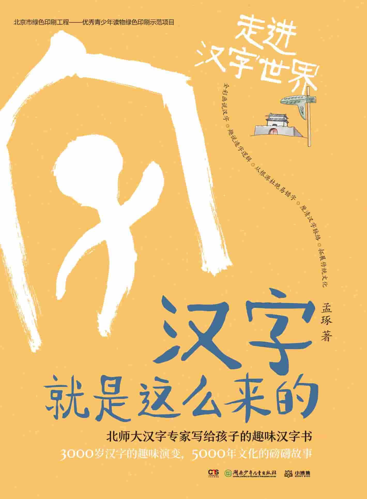

 版权信息

书名：汉字就是这么来的·走进汉字世界

作者：孟琢

出版社：湖南少年儿童出版社

出版时间：2020-08-01

ISBN：9787556251919

本书由天津博集新媒科技有限公司授权亚马逊发行

版权所有 侵权必究

 目录  
CONTENTS

**汉字的起源 **

**甲骨文：传奇的开始 **

**金文：金灿灿的文字 **

**小篆：一统天下 **

**隶书：大刀阔斧的简化 **

**许慎与《说文解字》 **

**楷书：汉字的“楷模” **

**象形字：用图画来造字 **

**指事字：给象形字加上标签 **

**会意字：“拼积木”造字法 **

**形声字：超厉害的造字法 **

**因形求义：解密汉字的方法 **

**汉字与古代经典 **

**后记 **

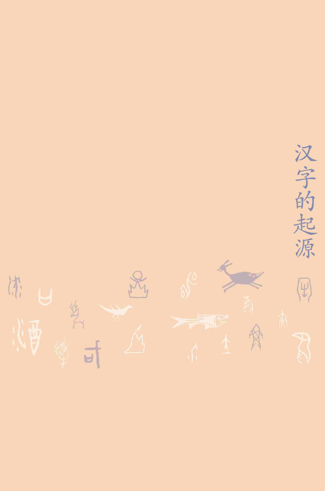

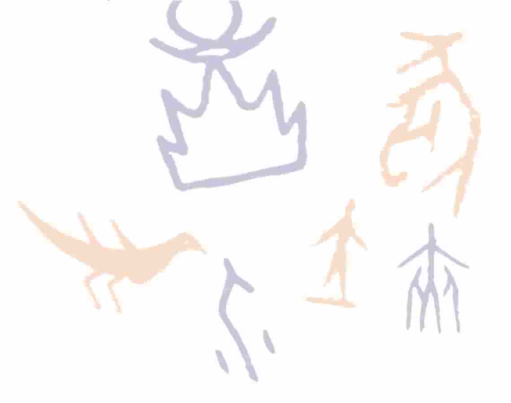

汉字是中国文化的根源，蕴含着中华文明悠久古老的基因。当我们走进汉字世界的时候，先要思考一个重要的问题：汉字的源头是什么？

对这个问题的回答，真是众说纷纭。在历史上，有三种比较重要的说法：八卦造字、结绳造字和仓颉造字。

## ●汉字与八卦

八卦，听起来蛮神奇的！中华民族的始祖伏羲氏[1]创造了八卦。他在大自然中看到了天空、大地、沼泽、大湖，还有清澈的水流、熊熊的烈火和浩浩荡荡的长风，听到了响彻苍穹的雷鸣。在伏羲看来，万事万物都分为阴阳，他用一个长横（）表示阳爻，用两个短横（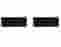）表示阴爻，再用阴阳进行组合，就拼出了八卦，分别代表天、地、山、泽、水、火、风、雷。

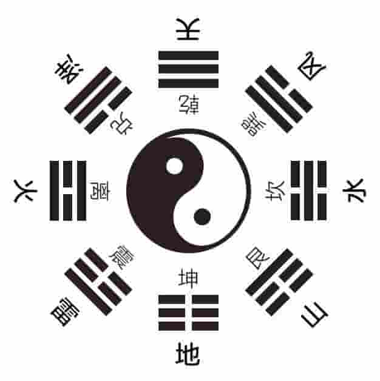

在中国文化中，八卦相当重要。有一部听起来有些神秘的古老经典——《周易》，就是以八卦的道理为根本的。于是，有人认为汉字也起源于八卦。他们举了一个很有意思的例子：在八卦中，有一个坎卦，表示水的意思。你看，坎卦是这个样子的：。主张汉字起源于八卦的人们说，把坎卦旋转九十度竖起来，和古文字中的（水）非常像。

你别说，对比一下还真像！那汉字真的起源于八卦吗？不是的，八卦中的另外七个卦和汉字一点儿关系也没有，样子也不相似。坎卦和水的相似，应该只是一种偶然。

## ●结绳造字

还有一种说法，认为汉字起源于结绳。

什么叫作结绳呢？这是古人提醒自己别忘事的一种办法。他们随身携带一根绳子，有大事，就系一个大疙瘩，有小事，就系一个小疙瘩。这种风俗见于世界各地，有些比较原始的部落，现在还在使用结绳记事。

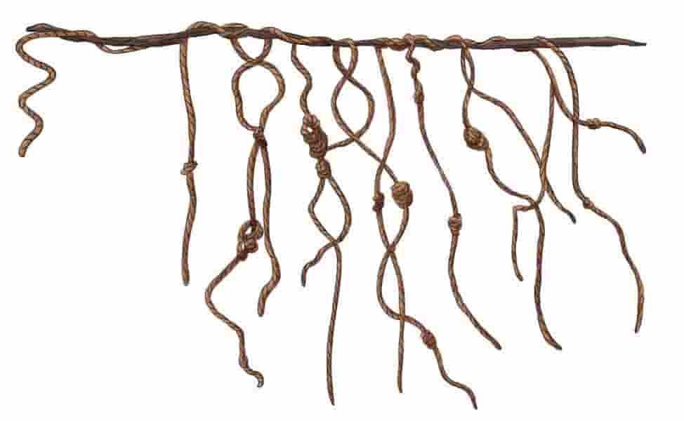

结绳能够帮助我们记事，汉字有同样的功能，于是有人认为，汉字起源于结绳。我们仔细想一想，就会发现这种说法并不靠谱——绳子上的疙瘩能提醒我们有一件重要的事，但它无法告诉我们，到底是什么事。你是要去上学呢？还是要去吃火锅呢？还是去游乐场玩耍呢？但汉字就不一样了，汉字能够传达准确而具体的信息。

## ●仓颉：汉字的始祖

在造字的传说中，仓颉造字的说法流传最广。

仓颉是谁？相传他生活在公元前2500多年，距今有4500多年。仓颉是黄帝时期的史官，掌管着历史、文化与文献，这个身份和汉字的关系最为密切，古人认为是他发明了汉字。这个时间和我们今天发现的早期文字符号的时期，也是相当接近的。

根据一些古书中的记载，仓颉的样子很奇怪，“龙颜侈侈，四目灵光，实有睿德，生而能书”。这句话说的是，仓颉的额头很大，像龙一样，他有四个眼睛，绽放出闪闪的灵光，这个人非常聪明，生下来就能写字——哇，仓颉好厉害！

仓颉真长这个样子吗？不见得。古人习惯于将一些厉害的人物神化，来凸显他们的与众不同。他们往往出生时伴有奇怪的天象，长相也异于常人。伏羲是人的脑袋蛇的身子；蚩尤和兄弟们都是铜头铁额，真是够酷。没这么夸张，稍微低调一点儿的也有。三国时期的刘备双耳垂肩，双手过膝，耳垂和手的长度远非常人能比；明朝开国皇帝朱元璋脚上有七颗痣，有个厉害的说法叫作“脚踏七星”。所以，仓颉的长相也是经过了艺术的夸张。

仓颉是如何造字的呢？古代有一位大思想家叫韩非子，他记载了仓颉造字的一个思路，他说：“仓颉之作书也，自环者谓之私，背私者谓之公。”仓颉要给公开的“公”和自私的“私”造字。

先造“私”字，这个字的意思有点儿抽象，用什么样的字形来表达呢？想来想去，他找到了一个造字的好办法：画一个封闭的圆圈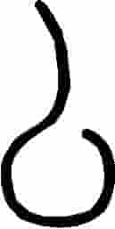，圈里的东西都是我的，也就是“厶”。这个字是今天“私”字的右半边。在古人心中，什么东西最能表示私有呢？莫过于粮食！于是，聪明的古人在“厶”旁边再添加一个“禾”，创造出“私”，强调这是我私有的财物。

“私”造出来了，“公”又该如何造字呢？这个问题难不住聪明的仓颉！他说，“公”和“私”的意思是相反的，把私有的财物分给大家，不就是“公”嘛。因此，他在“厶”的上面加上了一个“八”字。在数字中，一分为二，二分为四，四分为八，都是一个不断分离的过程。因此“八”表示分的意思，把“私”用“八”不断分开，这就是“公”！

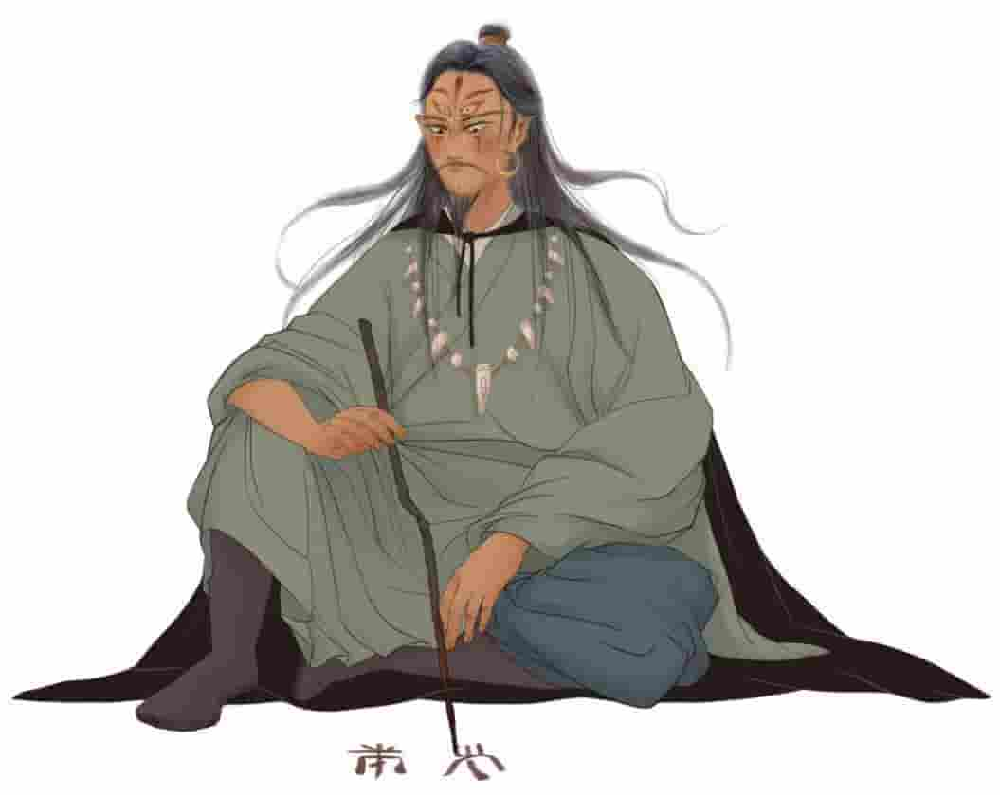

仓颉造字，体现出高超的智慧！事实上，汉字不可能是某一个人造出来的，中华民族宝贵的文化遗产，是人民大众的智慧结晶。战国的大思想家荀子点明了仓颉造字的实质。《荀子》中说：“好书者众矣，而仓颉独传者，壹也。”喜欢写字、善于造字的人很多，但只有仓颉造字的名声千古流传，这是为什么呢？因为仓颉“专壹”！

请注意，大写的“壹”字，既表示专一，仓颉一心一意地创造汉字；也表示规范、整理与统一的意思。仓颉是汉字的整理者、规范者与统一者，他是古人发明汉字的伟大的历史运动中的代表。

正因如此，仓颉被后人尊称为“字圣”——发明汉字的圣人。

随着汉字的发明，我们的历史文化大大地向前迈了一步。相传汉字发明之后，“天雨粟，鬼夜哭”——天上落下粮食雨，晚上有鬼在哭泣，听上去是不是有点儿恐怖呢？事实上，“天雨粟，鬼夜哭”是个吉兆呢！上天降下粮食雨，奖励人们发明了汉字；鬼也不是可怕的妖怪，所谓“鬼者，归也”，他们是“回归”故乡的祖先灵魂。那些去世的祖先觉得，有了汉字，他们的生平事迹就会被记录在文字里，再也不会被后人遗忘了，因此纷纷喜极而泣。

## ●汉字源自图画

传说听起来很热闹，但如果根据考古来看，汉字应当起源于早期的原始图画。大家跟我看大汶口文化的图画型陶符，以及半坡文化中的彩陶符号。在这些刻画在陶器上的符号中，有圆圆的太阳，有巍峨的高山，有抽象的小草……和汉字中的象形文字，真是如出一辙。

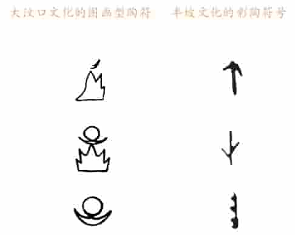

在原始图画和汉字的对比中，这样的例子还有很多。你看，自由自在的鱼儿、展翅欲飞的小鸟、姿态优雅的小鹿，这些原始绘画摇身一变，就成了最早的汉字。

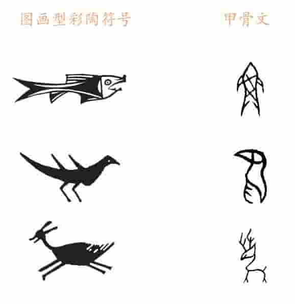

图画是形象的，最早的汉字也是如此。古人造字的基本思路是“近取诸身，远取诸物”，从自己熟悉的身体和丰富多彩的大自然中选取形象，造出汉字。取象，是汉字造字的基本思路，也是我们给大家讲解汉字的基本视角。

* * *

[1] 在神话传说中，伏羲和女娲是兄妹，是上古时代人类的始祖。在《伏羲女娲图》中能看到他们俩蛇身人首的样子，充满神话特有的浪漫和想象色彩。传说他发明了八卦，教会人们结网捕鱼，还发明了乐器——琴瑟。

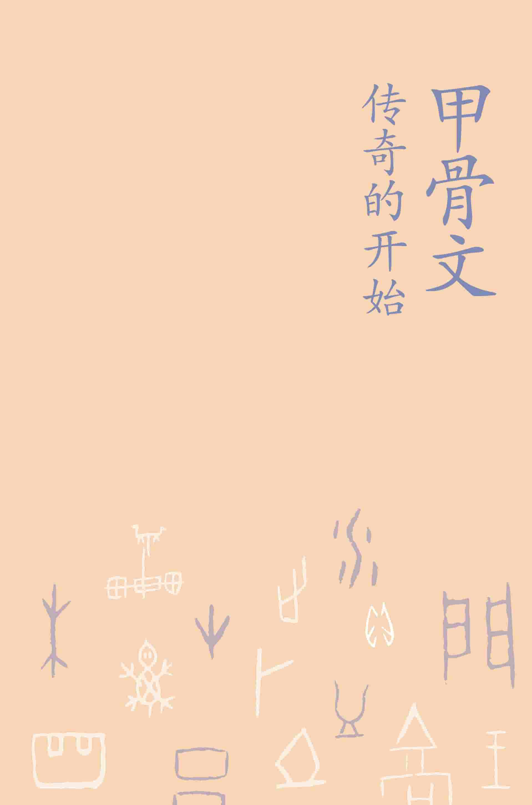

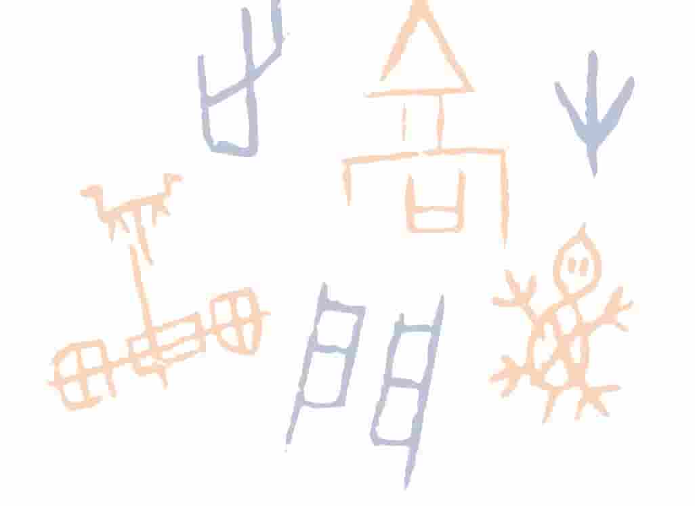

甲骨文，是我们今天能见到的最早的汉字。

甲骨文是汉字历史上的一个传奇，它是如何被发现的呢？它是什么时代的文字？甲骨文都写了些什么？又有怎样的特点呢？让我们带着疑问，一起走进甲骨文的世界吧。

## ●神奇的发现

甲骨文，为什么叫这个名字？

我们一起来看两幅图。上面这幅是乌龟的腹甲，也就是肚子上的甲壳，下面这幅是牛的肩胛骨，两个骨片上都刻着密密麻麻的文字。那我们就清楚了，甲骨文的命名来源于它的载体，这是一种刻在龟甲和兽骨上的文字。

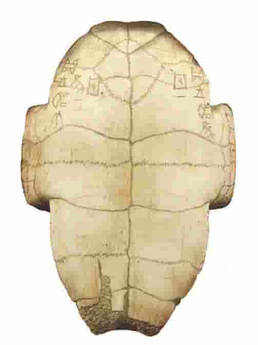 
VCG21gic3609468-©View Stock/VSI美好景象（Creative）/视觉中国

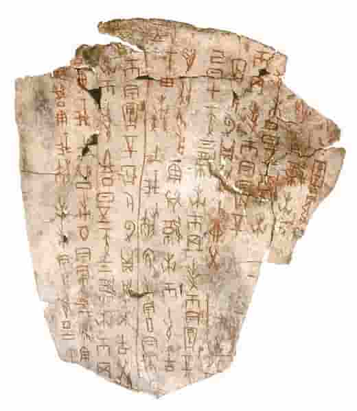 
VCG21gic2728673-©UGI/UGI优谷/视觉中国

甲骨文的发现很传奇，发现甲骨文的人叫王懿（yì）荣，他是清朝的大臣，也是一位金石学[1]家，也就是研究古文字的人。大概是1899年的时候，王懿荣生病了，要吃中药。他一时兴起，想看看这次中药的成色如何，就拿了一包药打开翻检。没承想，在一味叫作“龙骨”的药材上，他看到了类似文字的刻痕。

什么是龙骨？相传是龙的遗骨，吃下去能够补肾，听上去是不是有点儿高大上？其实，龙骨就是古代动物的骨骼化石。我们说过，王懿荣熟悉古文字，一般人看到龙骨上的刻痕，也许不会注意，但王懿荣一眼扫过去，却是大惊失色！

“啊！这龙骨上面刻的东西，好像是文字！来人，快去把药店里的龙骨都买回来，我要好好研究一下。”

这一研究不要紧，王懿荣就此发现了甲骨文。这对中国的文字学和历史学来说，都是一件开天辟地的大事。甲骨文让我们见到了最早的文字，也让我们看到了尘封已久的殷商王朝的历史。

## ●占卜的秘密

甲骨文所处的时代，是历史上的殷商时期。如果你看过《封神演义》的话，会知道有个残暴的商纣王[2]，他的名字也曾出现在甲骨文中。甲骨文里都写了些什么呢？它主要记录了古代占卜的相关内容，因此，甲骨文也叫作卜辞文字。

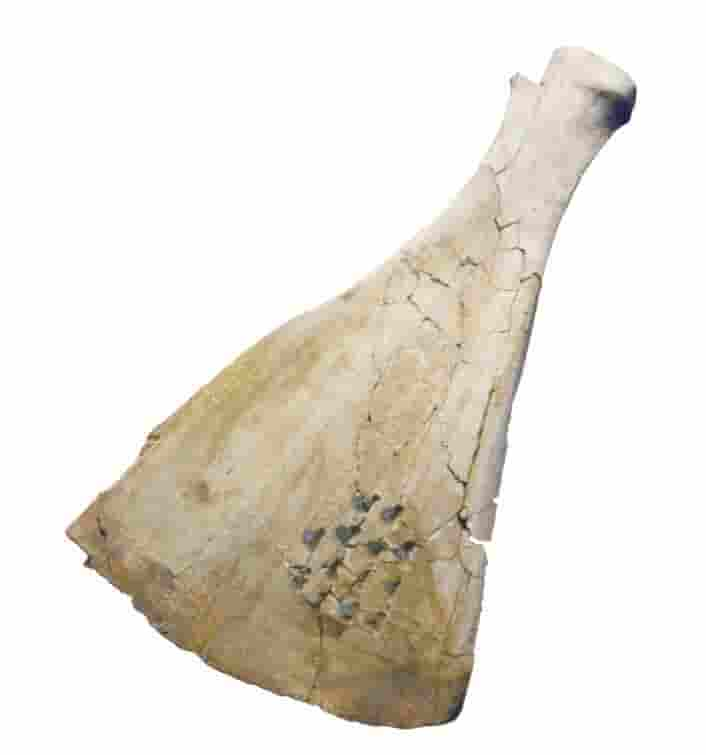

什么是占卜？这个事说来话长。殷商是一个非常迷信的时代，那个时候大大小小的事情，都要通过占卜来进行预测。用什么来占卜呢？选来选去，古人盯上了乌龟的壳。也许，他们觉得乌龟长寿，见多识广，因此能够预测未来吧。

占卜的流程很复杂，古人先要把乌龟的腹甲，或者牛的肩胛骨锯下来，然后磨平。磨平之后，再用铜钻在上面钻出又深又圆的孔，再在圆孔旁边凿出枣核形的槽。又钻又凿，折腾了一大通，甲骨的表面就不再平整了。接下来，古人会用火去烧这个甲骨。不平整的东西受热不均匀，就容易爆裂。在爆裂的时候，发出“bu bu”的声音，这就是“卜”字的声音来源。爆裂之后，甲骨上会出现裂纹，这些裂纹的样子，就是“卜”字的形体来源。

翻看前文牛的肩胛骨的图片，它上面的裂纹与甲骨文中的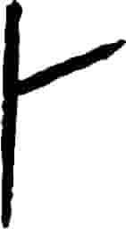（卜）字，是不是很像呢？

在我们看来，这些裂纹是随机的、偶然的，但在古人眼中，它们却有一种神奇的力量，能够揭示未来的吉凶祸福！古代有专门负责占卜的巫师家族，那些大巫头上插着炫目的羽毛，穿着与众不同的衣裳，神情肃穆地看着甲骨上的裂纹，为商王判断吉凶。有时候，尊贵的商王甚至会亲自进行占卜。

这段历史也烙印在汉字里。在古文字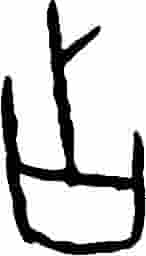中，“占”字上面是一个“卜”，下面是一个“口”。对“卜”（裂纹）的解释与预测，就是占卜。占卜之后，古人会把这次占卜的前因后果记录在甲骨上，记录使用的文字就是甲骨文！在殷商时期，无论是天时、祭祀、战争、农业、生活，各种各样的事情都要占卜，因此，甲骨文中也就记载了那个时代的方方面面。

想学占卜吗？在考试之前预测吉凶，看看自己的分数如何？

还是算了吧。第一，小乌龟蛮可怜的，不忍心！第二，占卜的方法早就失传了，学不到！

## ●最早的记叙文

古人占卜完后，在甲骨上用古老的文字记录占卜的相关信息。记录的体例和格式是什么样子的呢？

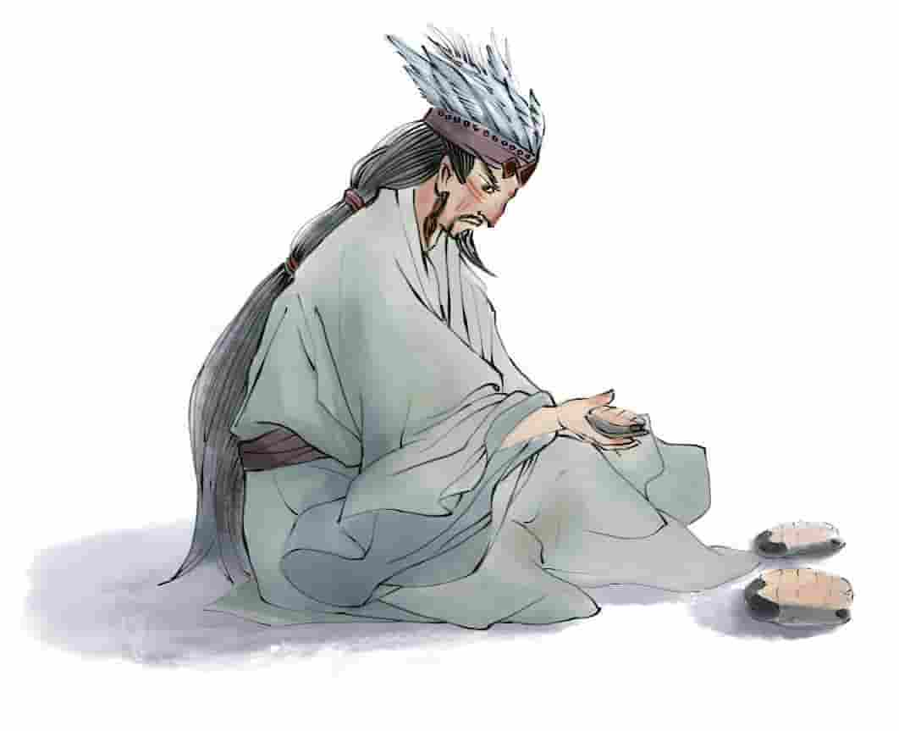

在回答这个问题之前，我要先问你一个问题：你会写作文吗？

这有什么难的！一篇记叙文，把时间、地点、人物、事件，清清楚楚地写下来就是了。嗯，这个回答很不错。但你知道吗，记叙文的规则与体裁，在甲骨文中就已经基本定型了。

这么早啊！

甲骨文有固定的记事模式，分为前辞、命辞、占辞、验辞四种。听起来，会不会觉得这些名字有点儿“玄”？其实，它们的内容和格式，与我们平时所写的记叙文非常像。

“前辞”说了些什么？它告诉我们，古人在哪一天占卜，由谁来负责占卜，这其实就是时间和人物。一般来说，负责占卜的是专职的大巫师，他们被称为“贞人”——在古代汉语中，“贞”也有占卜的意思。占卜意味着与神灵沟通的能力，这是一种特殊而重要的文化权力，因此“贞人”往往是世袭的，形成了代代相传的“贞人集团”。

“命辞”介绍了为什么事情而占卜，在甲骨文的“命辞”中，我们能看到殷商古人最关心的事情。比如有的甲骨文里说：“帝及四月令雨？帝弗其及今四月令雨？”你能看懂这句话吗？在这里，“帝”是天帝，“雨”是下雨，古人问的问题是：今年四月份，上天会不会下雨？

“占辞”是巫师或者商王对占卜结果的判断。“验辞”是对占卜结果的验证，无论准确与否，都如实记录下来。有意思的是，甲骨文中有相当多的占卜“不灵”的记载，古人尽管有些迷信，但还是很“实在”的，把握住了实事求是的记录标准。

你看，甲骨文是不是很像一篇记叙文，时间、人物、事件、结果，都非常清楚。

## ●千姿百态的甲骨文

介绍了甲骨文的发现、制作、内容与格式，最后，我们看一看这种文字的特点。

甲骨文的第一个特点，是象形性强。什么叫象形性呢？就是文字和它所记录的事物特别像，惟妙惟肖。汉字来源于图画，早期汉字就像一幅幅生动的图案。不信你看上面的这张图片。

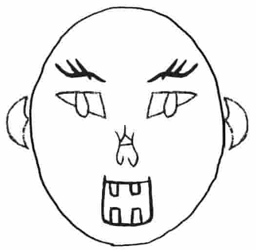

这是甲骨文组成的一张面孔。圆圆的是脸的轮廓，中间是眼睛、鼻子、嘴巴，还有两旁的耳朵。其实，这些都是甲骨文。

眼睛的象形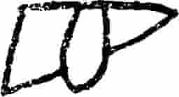，是“目”字，你把这个字掉转九十度看，和今天的“目”还颇为相似。鼻子的象形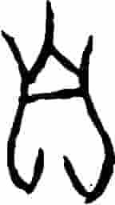，是“自”字。古人为什么用鼻子来表示“自己”呢？很简单，自我介绍的时候，我们指着自己的鼻子说：“这是我！”你肯定不会指着自己的屁股，告诉别人说“这是我”，对不对？“自”下面的这个字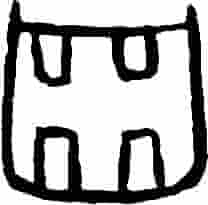，看起来很好笑。一张嘴，里面缺了好多颗牙，这是甲骨文中的“齿”字——古人没有牙刷牙膏，茹毛饮血对牙齿的磨损又很严重，在很年轻的时候，牙齿往往就损毁得十分严重了，这种健康状况，也大大地拉低了古人的平均寿命。在脸的两旁，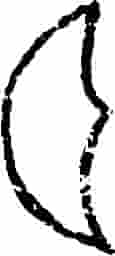是甲骨文中的“耳”字，你看，这个耳朵还不小呢！

眼耳口鼻，这些字形取象于我们的面孔，非常形象。把它们拼到一起，就形成了一个殷商时期美男子的模样。

天啊！这个样子能叫美男子吗？

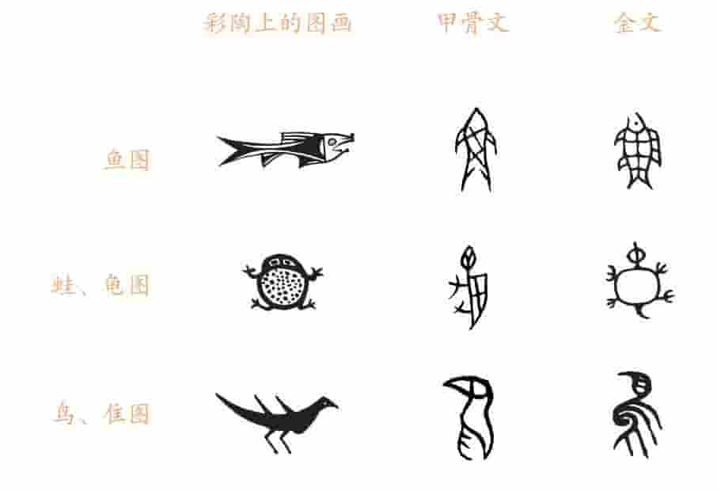

甲骨文的第二个特点，是文字瘦硬坚实、挺拔爽利，很有一种“骨感”之美。特别是把甲骨文和金文对比，前者骨感，后者肉感，堪称“环肥燕瘦”。在下一章关于“金文”的讲解中，你会看到非常鲜明的对比。

这种骨感之美，形成了甲骨文独特的审美风貌。要知道，甲骨文多是用刀刻在龟甲、兽骨上的，刀和笔不同，很难做到圆转如意。因此，甲骨文中有很多直来直去的笔画，也就形成了硬朗、骨感的书写风格。

甲骨文的第三个特点，是字形结构多变，同一个汉字往往有不同的写法。在汉字学中，这个现象叫作异体字。我们看甲骨文中的“龟”字：

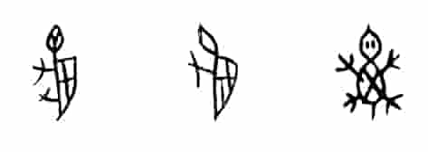

第一个字是侧面的小乌龟，头尾四肢都很完整；第二个字也是侧面的小乌龟，但似乎受了伤，缺胳膊断腿的，看上去很可怜；第三个字是从上往下俯视的乌龟。同一个龟字，有不同的写法，甲骨文中的异体字非常多，这也体现出它是一种不完全成形、不够规范的文字。

* * *

[1] 研究古代钟鼎彝器碑碣石刻﹑考辨今古文字的一种专门学问。

[2] 商朝的最后一任国君。我们在名著《封神演义》里也会见到他。

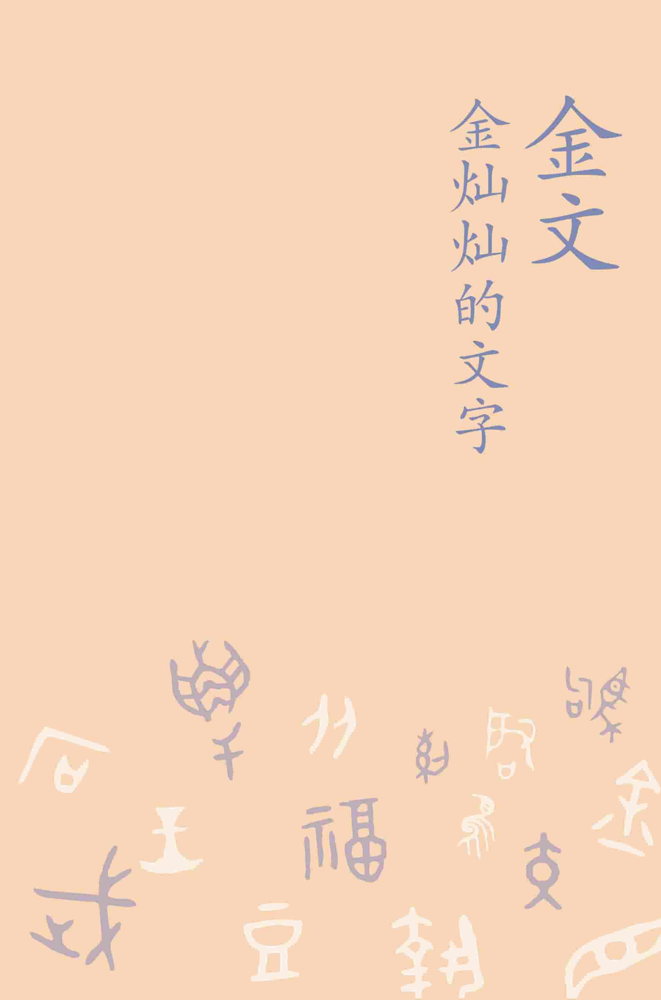

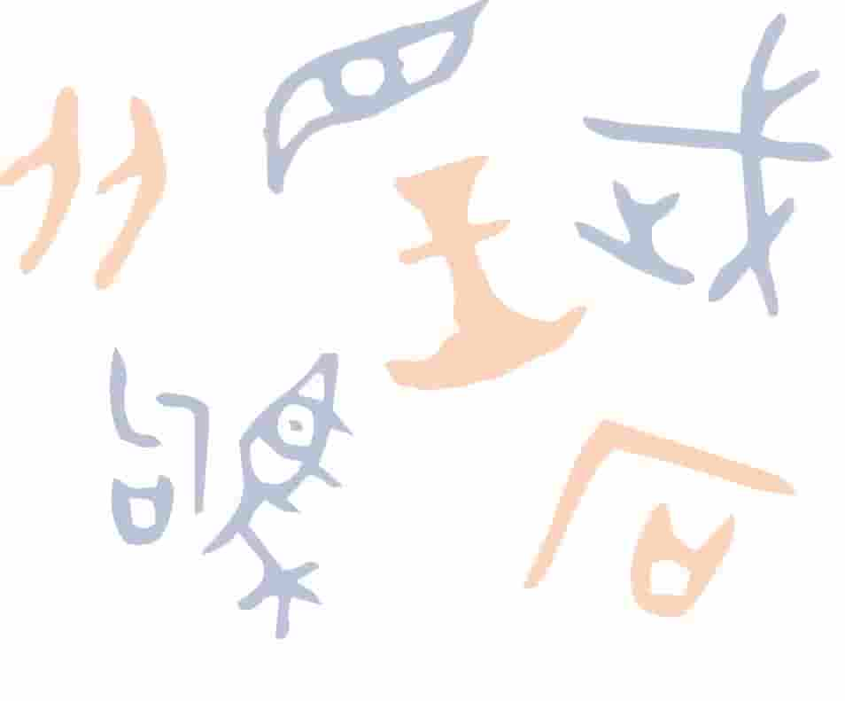

走过殷商，迈入周朝，在经过了像画一样的甲骨文之后，我们步入了金文的鼎盛时代。需要注意的是，甲骨文、金文，以及我后面要讲的小篆（zhuàn）、隶书等，它们有大致的先后顺序，但没有特别清晰的时间界限。金文诞生于商朝中期，兴盛于西周，基本消亡于秦灭六国。

什么是金文呢？

和甲骨文一样，金文名字的由来也和它的载体有关。

你见过博物馆里的青铜器吗？那些斑驳陆离的古老器物，是历史无言的见证者。由于氧化作用，我们见到的青铜器大多数是青黑色的，但它刚刚铸造出来的时候，则是耀眼夺目的金黄色。[1]要知道，周天子也喜欢“土豪金”的颜色呢。

金文，就是铸造在金色的青铜器上的文字。在古代，有两种青铜器最为常用：一种是鼎，用作礼器；一种是钟，用作乐器。所以，金文也叫作“钟鼎文”。

## ●问鼎中原

古人为什么要把金文刻在鼎和钟这样的青铜器上呢？因为，以钟鼎为代表的青铜器在历史上的地位非常崇高。它们被称为“国之重器”，是国家政权的象征。在周代，不是谁都有资格铸造青铜器的。你说我家里特别有钱，铸个鼎玩玩，怎么样？那可是绝对不允许的。必须要由天子赏赐给诸侯大夫“金”，也就是青铜，然后诸侯大夫才有资格铸造钟鼎。

钟和鼎如此重要，它们到底是干什么用的呢？

让我们先从“鼎”说起，说出来你可能不信，地位这么尊崇的鼎，最初是一口接地气的大锅。中国第一部系统分析汉字字形和考究字源的字典《说文解字》[2]说：“鼎，三足两耳，和五味之宝器也。”“五味”是酸、咸、苦、甘、辛五种味道，泛指美味的食物，鼎最早是一种用于烹饪的器具。

“鼎”长什么样呢？所谓“三足两耳”，我们看一看它的样子就知道了。鼎有三足，稳稳放在地上；上面又有两耳，可以把木棍穿进去，用来扛鼎。这个造型还真的蛮适合做锅的，下面的“三足”之间很适合放柴火，上面的“两耳”很适合把锅抬起来。

作为一口接地气的大锅，鼎为什么备受推崇，地位倍增呢？

因为一个我们熟悉的人——大禹。

大禹治理了水灾，安定九州，广大人民都很爱戴他。舜便禅让了自己的位置，让大禹当王。大禹建立了夏朝，成为夏朝的开国天子。他掌管天下后，做了一件特别有权力象征意义的事情——收来了九州的金（青铜）铸造了九个大鼎，以此象征当时的九州[3]大地。正因如此，鼎在古代也象征着国家政权，是大国国力的体现。人们铸鼎，将它作为重要的礼器，用于祭祀等重大事宜。

鼎作为礼器，是一个国家政权的象征，所以古代有“问鼎中原”这个成语。故事的主角是春秋时期的楚庄王，这是一个英明勇敢、野心勃勃的国君。有一次，他问周天子的使臣王孙满：“听说天子有九鼎，不知道这鼎有多沉啊？”你要知道，楚庄王并不是真想知道鼎有多沉，而是因为鼎象征国家政权，他想借此掂量一下周天子的分量！

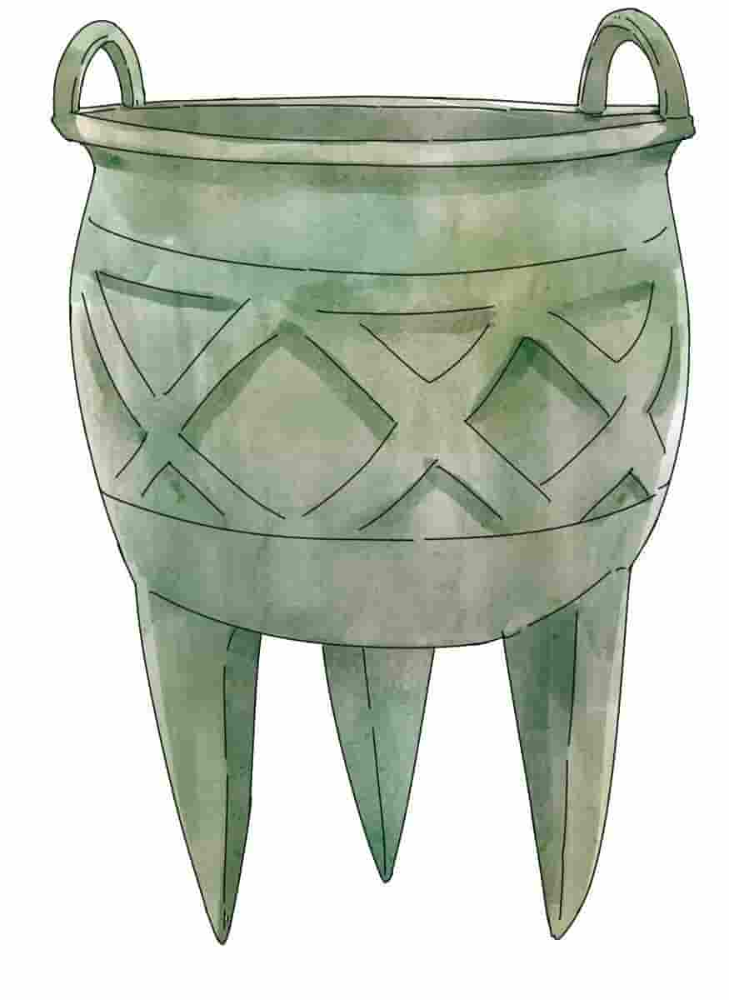

春秋时期周室衰微，诸侯蠢蠢欲动，天子已经没什么分量了，谁都敢欺负一下。但能言善辩的王孙满非同小可，他一句话就把楚庄王顶了回去——“在德不在鼎”！天子统治万国，在于德行，而不在于是否拥有九鼎。言下之意是，你楚庄王只关心鼎的轻重，不过是个有勇无德的莽夫罢了。

楚庄王反驳道：“我们楚国长戟（jǐ）[4]上的钩尖儿加起来，就能够铸成九鼎。”这句话说的是铸鼎，其实暗含的意思是，我们楚国兵强马壮，靠军队就能推翻周王室，一统天下。

王孙满丝毫不惧：“当初夏强盛的时候，即使是远方的诸侯也会赶来朝见大禹。九州的长官们贡献金，铸成九鼎，九鼎上刻着九州各地的出产以及奇特的东西。天地之间的事物都被容纳在九鼎之中，人们从鼎上能识别一切神圣与邪恶的东西。后来，夏桀[5]道德败坏，夏朝被殷商取代，九鼎也随之迁到了殷都[6]。殷商的国运有六百年，可惜纣王暴虐，于是殷商被周取代，九鼎便也归了周。可见，如果一个君王有德行，国家治理得美好清明，那么鼎即便很小，也重得难以移动。如果一个君王无德昏聩（kuì），那么鼎即便很大也会轻易失去。当初周天子把九鼎安放在都城时，占卜得知周会传国三十代，国运会持续七百年，这是天命。现在周虽然在衰败，但天命还没有改变。”

楚庄王碰了软钉子，这才收敛了自己的傲气。

在历史上，觊觎九鼎的霸主不止楚庄王一个。秦国的秦武王热衷举鼎，楚霸王项羽力能扛鼎。他们举起沉重的鼎，不仅是展现自己力气过人，也是要通过举鼎的行为，寄托征服天下的决心。

## ●价值连城的编钟

除了鼎，钟上也经常刻着金文。钟和鼎一样，都是价值连城的宝贝。

钟是做什么用的呢？它是古代典礼上常备的乐器，一般都是一套，称为“编钟”。大大小小不同的钟，敲击起来音色不同，演奏出复杂的旋律。殷商的编钟多为3枚一组，春秋战国时期多为9枚一组。现存最华丽的编钟，是在湖北省博物馆里藏着的一套曾侯乙编钟。这套编钟共64枚，分三层悬挂，全部重量在2500公斤以上，美轮美奂，真可谓先秦青铜器中的珍品，你们有机会一定要去参观一下。

在中国古代，人们把那些尊贵的家族称作“钟鸣鼎食之家”。什么是富贵的标志？不是黄金美酒、宝马香车，而是用钟奏乐、用鼎吃饭的人家——这幅古香古色的生活画面，不仅是古人心中财富的象征，也是社会地位的标志。

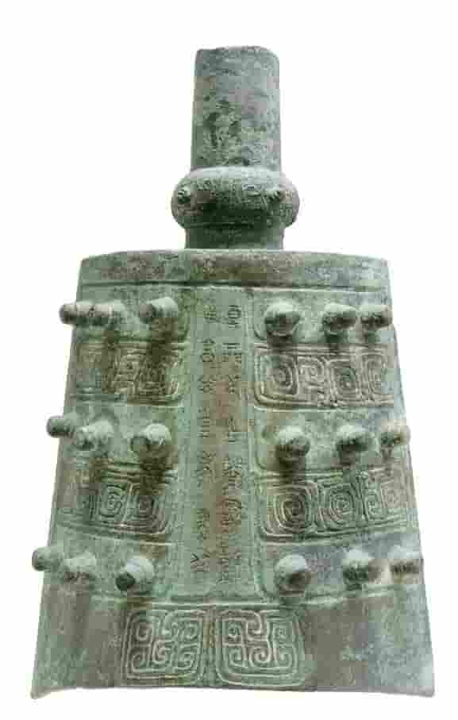 
VCG211262913655-©王萌/视觉中国

## ●国家大事与家族荣耀

青铜器地位崇高，铸刻在上面的文字也不是一般内容，或是国家的军国大事，或是一个家族代代相传的荣耀和辉煌。

在金文中，我们能看到一些历史上的“重大新闻”。你看下面这个青铜器，古朴大方，它的名字叫利簋（guǐ）。簋和鼎一样，也是古代的一种食器，主要用于盛饭，也是一种礼器。北京有个饮食一条街，以麻辣小龙虾著称，就叫作“簋街”。“利”是这个簋的主人。大家跟我一起看右上角的利簋铭文：

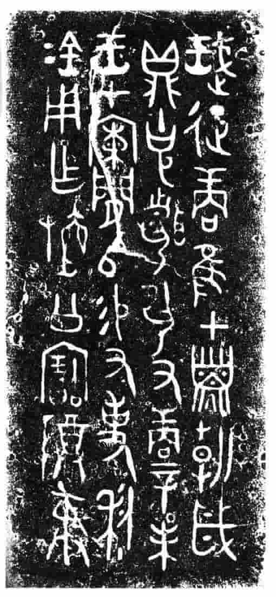

第一个字右边是戈，下面是止，所谓“止戈为武”，这是一个“武”字。旁边加上一个“王”，这是周武王的专用字。哇！鼎鼎大名的周武王，大人物出现了！武王下面的一个字不难认，这是征伐的“征”。第三个字，是商纣王的“商”。“珷（武）征商”——看到这几个字，有没有一点儿心潮澎湃的感觉。在古老的青铜器上，记录了中国历史上翻天覆地的一场大战。在利簋接下来的文字中，记录了武王伐纣的时间，“唯甲子朝”——在甲子那一天的清晨。这个时间和司马迁在《史记》中的记载是完全吻合的——“二月甲子昧爽，武王朝至于商郊牧野”。

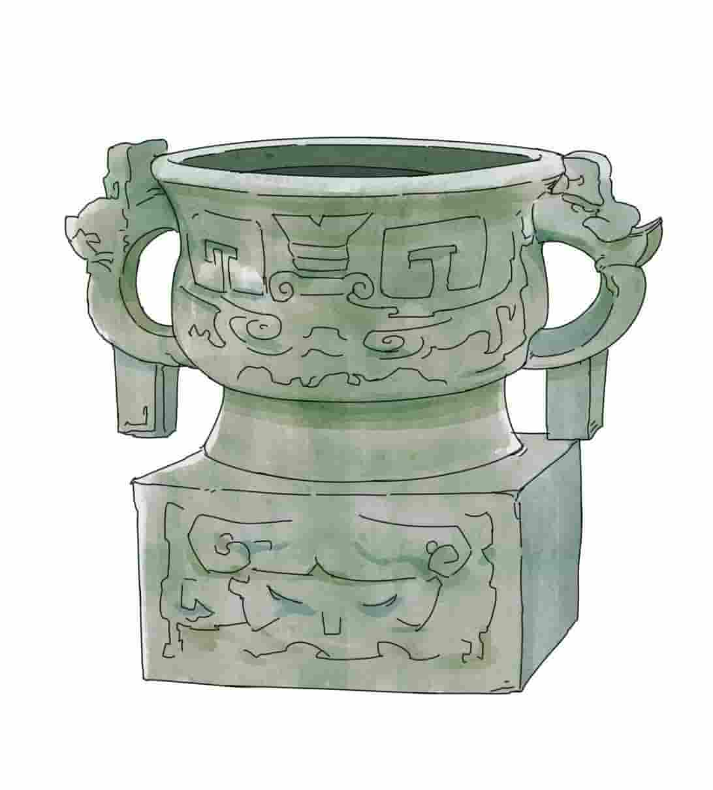

在利簋上，铭刻着“利”带领家族参与武王伐纣的光荣历史。这类青铜器是不折不扣的传家宝！因此，很多金文中有这样的句子：“子子孙孙永保用”，“用作宝尊彝（yí）”——周代的贵族们，希望这些尊贵典雅的青铜器，成为子孙代代相传的宝贝。当然，那些古老的权贵家族，在历史的长河中早已湮（yān）没无闻，时至今日，金文已不再是某个家族的荣耀，而是中华民族共同的瑰宝。

## ●古朴雄浑的金文

说完金文的载体和内容，再来看看金文字形本身的美。

金文是一种古朴雄浑的文字。说它古朴，是因为金文保存了一些非常古老的字形。就拿我们熟悉的“王”字来说，“王”是国家的统治者，这个字最开始是什么样子的呢？在甲骨文中，“王”写成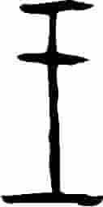、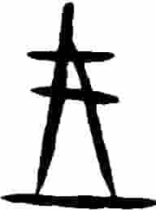、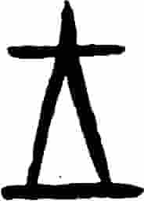等样子，有人说，这是祭祀上天的架子，用来焚烧祭品，王者拥有祭祀上天的神圣权力！也有人不同意，哼！画个烤肉架，就能代表高高在上的王吗？

争来争去，直到看到了金文中的一个字形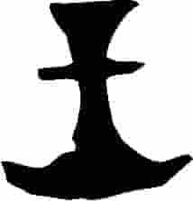。

你看这个字像什么？没错，斧头！它是斧头的象形。那帝王和斧头之间，又有什么关联呢？

在古代，有一种威猛夸张的大斧头，名字叫“钺”，它标志着征战、杀伐的权力，是王权的象征。前面说过，青铜刚刚铸造出来时是金黄色的，在古书中，这种青铜大斧有个专门的名字——黄钺！

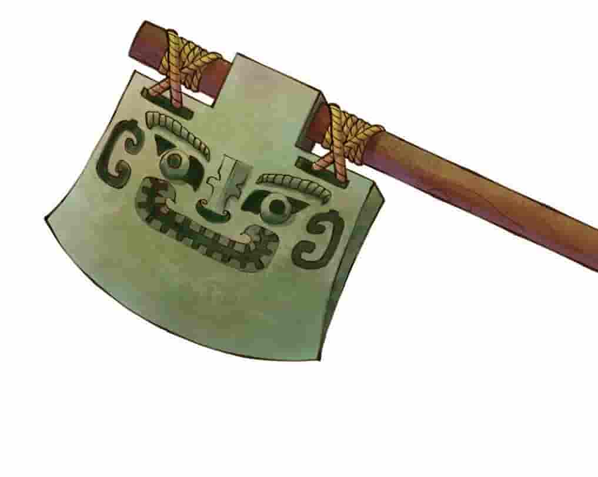

《尚书》中记载，武王伐纣的时候，“左杖黄钺，右秉白旄（máo）以麾（huī）”——左手拿着青铜大斧，右手挥舞雪白的旗帜，来指挥部队。除了史书，考古发现也印证了黄钺的存在。在殷商时期，商王武丁有一位英勇善战的妻子，她是中国历史上第一个女英雄，名字叫妇好。在河南安阳发现的妇好墓中，出土了非常霸气的青铜钺。而且，不止一把，而是两把！这说明妇好拥有领兵出征的权力。根据甲骨文记载，这位女英雄最多指挥过13000人，真是赫赫威风！不过，妇好出征，手拿两把大斧，听起来怎么有点儿像李逵……

从妇好墓出土的黄钺，结合史料和金文，我们可以得出一个结论：什么是“王”？王者拥有钺所代表的征伐大权，这是一种至高无上的政治地位！

至于雄浑，金文地位崇高，在当时都是由最好的书法家来写的。而且，金文不是用刀契刻，而是铸造而成，相比甲骨文而言，有着更多的书法展示空间。若你去博物馆游览或者看字帖，会发现金文的书法性非常高，有一种雄浑丰满、古朴天然的美感。吴昌硕、齐白石等大书法家都喜欢用这种字体进行创作。

* * *

[1] 汉代以前所说的“金”往往指的是青铜，这是一种铜和锡、铅等的合金，刚制成时是耀眼的金色。博物馆里的青铜器，大都在地下经过了千年的水浸土埋，金属被腐蚀，颜色变为庄重古朴的青黑色，内敛了许多。

[2] 《说文解字》是中国历史上第一部系统分析汉字字形、讲解汉字字理的字典，简称《说文》，作者是东汉的许慎。在体例上，它开创了部首编排法；在内容上，它用六书系统地解说汉字，并保存了部分早期古文字的写法，为我们研究甲骨文、金文等提供了依据。六书是六种汉字造字法，包括象形、会意、指事、形声、转注和假借。

[3] 上古时代，天下被划分为九州，即九个地理区域。后来，人们用九州泛指天下。

[4] 戟是一种兵器，主要由青铜制成。

[5] 夏朝的最后一任国君。

[6] 殷商的国都，在今天的河南安阳。

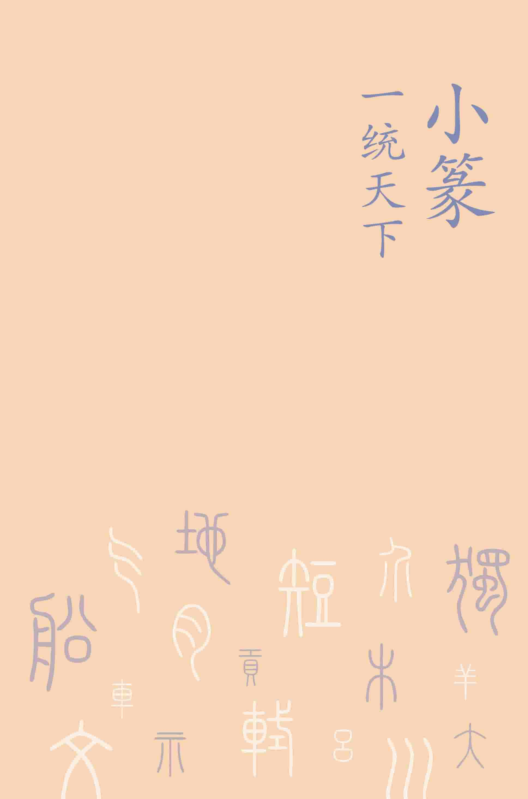

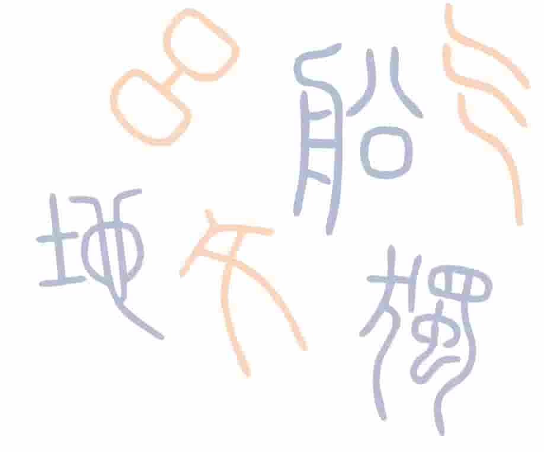

金文，是周代的主要文字，小篆，是秦国的文字。从周到秦，在这两个伟大的王朝之间，经历了春秋战国数百年的风云变幻。在这波澜壮阔的历史进程中，我们的汉字又经历了怎样的命运呢？

## ●战国文字：我的地盘我做主

典雅肃穆、古朴雄浑的金文是周代的官方文字。但随着周幽王[1]烽火戏诸侯的闹剧，还有周平王无奈而仓促的东迁[2]，从西周到东周，天子的权威与礼乐一落千丈！在诸侯并起的春秋战国时代，金文这种整齐规矩的文字，也受到了极大的冲击——周天子都可以不放在眼里，何况区区文字呢？

从周代到战国，汉字的面貌发生了巨大变化。我们还是先浏览一下战国的文字吧，你看，这页下面是秦国文字、三晋[3]文字、楚国文字和齐国文字。每个国家的文字各不相同，差异极大，战国文字最基本的特点就是复杂纷乱、各国不同。

为什么会这样呢？

这和当时的政治形势密不可分。当时天下分裂，战国七雄——秦、楚、燕、齐、赵、魏、韩，谁都想统一天下，成为天下共主，谁都要谋求自己的霸业和野心。在这样的心态下，各国的政治、文化、军事、社会不断走向差异——我的地盘我做主，就要和你不一样！

天下分裂，各国制度不同，汉字也是如此。许慎在《说文解字叙》中说：“诸侯力政，不统于王，恶礼乐之害己，而皆去其典籍，分为七国，田畴异亩，车途异轨，律令异法，衣冠异制，言语异声，文字异形。”

诸侯用暴力争夺天下，打来打去，要不怎么叫“战国”呢？在一个你咬我、我咬你的时代里，天子的礼乐就像耳边整天的唠叨一样，真烦人！赶紧扔掉。各国纷纷推出自己的货币政策、土地政策、交通法规、法令政策、衣冠风俗，连语言文字也不例外——嘴里说的是方言土语，写出的文字也各不相同。

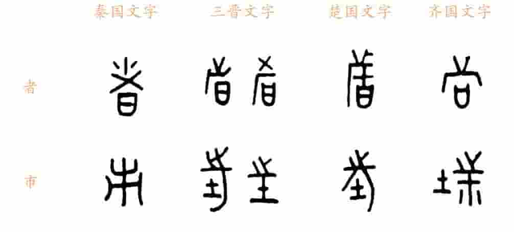

 
VCG21gic5474401-©View Stock/VSI美好景象（Creative）/视觉中国

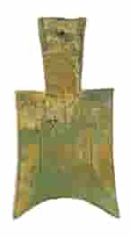 
VCG21gic5474144-©View Stock/VSI美好景象（Creative）/视觉中国

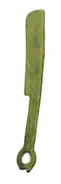 
VCG21gic5474421-©View Stock/VSI美好景象（Creative）/视觉中国

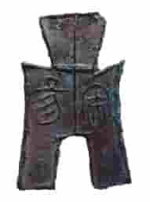 
VCG2124a9e3381-©View Stock/VSI美好景象（Creative）/视觉中国

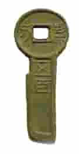 
VCG21gic5474248-©View Stock/VSI美好景象（Creative）/视觉中国

战国时期的不同货币

## ●秦始皇与文字统一

天下大势，分久必合，合久必分，经过了近300年的春秋时期和200多年的战国纷争，中国历史终于又从分裂走向了统一。兼并六国，结束战国纷争的丰功伟业，是由秦始皇完成的。

秦始皇雄才大略，他十三岁即位，二十二岁亲政，在三十九岁时就已经统一了中国，结束了春秋战国数百年的纷争。大诗人李白写道：“秦王扫六合，虎视何雄哉！”如果你读过《史记》中的《秦始皇本纪》，再去陕西的兵马俑实地感受一下，一定会为他的赫赫功业震撼不已。当然，在统一中国的过程中，秦国多次打败东方六国的大军，杀伤无数，也让秦始皇在历史上背负了残忍、暴虐的骂名。要知道，这样一个重要的历史人物，对他的评价始终都是相当复杂的。

统一天下之后，秦始皇需要治理天下，这个时候，他发现自己遇到了一个大麻烦——各国的制度、风俗、语言、文字都不一样，想要推行秦朝的政令，下一道诏书，六国的人看不懂，怎么办？汉字不同，也影响大家之间的文化交流，想看其他六国的书，相当于要重新掌握好几门语言文字，简直太麻烦了。

秦始皇正在头疼，他的丞相李斯来了。“陛下别急，六国的文字乱七八糟的，干脆用咱们大秦的文字，把它们统一起来！”秦始皇一听，“好办法！丞相所言，甚合朕心。这个任务就交给你了！”

于是，李斯带领着那个指鹿为马的太监赵高（这个人品质很坏，但能耐不小，也懂得文字学呢），还有太史令胡毋敬，一起写出了《仓颉篇》《爰历篇》和《博学篇》。在这三篇字书中，包括了3300个字，他们根据传统的秦国文字，进一步加以简化、调整，同时废除了那些形状各异的六国文字，最后推出了小篆！

这段历史，就是《说文解字叙》中所记载的：“秦始皇帝初兼天下，丞相李斯乃奏同之，罢其不与秦文合者。斯作《仓颉篇》，中车府令赵高作《爰历篇》，太史令胡毋敬作《博学篇》。皆取史籀（zhòu）[4]大篆，或颇省改，所谓小篆者也。”所谓“史籀大篆”，指的是多取自周代大篆的秦国文字，“省改”则是省简与改易的意思。

你可能会问，“篆”这个字好陌生，是什么意思？

“篆”虽然难认，但意思很清楚。“篆”是个形声字，下面的“彖”是用来表示“篆”的读音的，而上面的竹字头说明这个字和竹子有关。“篆”的本义就是用笔写在竹简上的意思。《说文解字》中说：“篆，引书也。”这是一种笔画拖长、线条流畅的文字，就好像用笔“牵引”着书写出来的一样。

小篆作为秦始皇统一天下之后面向全国推行的标准字体，被大秦帝国不断地推广、普及。对秦始皇来说，统一文字是维护国家统一的重要政策。对中华民族来说，统一的汉字使得我们能够更加团结、凝聚，不要小看一个个小小的汉字，是它们铸成了我们几千年来未曾动摇的文化根基。

## ●李斯的马屁

小篆一统天下，听上去就很酷！

小篆长什么样子呢？作为秦始皇推广至全国的规范文字，小篆字形整齐，结构规范，不像甲骨文那样，同一个字有各种各样的写法；小篆充分保留了造字的文化内涵，在它的字形中，蕴含着汉语和中华文化的奥秘。这一点，我们后面在具体讲解造字法时会讲到很多案例。此外，从字形来讲，小篆也是一种比甲骨文、战国文字更为漂亮的汉字，它线条细腻，工整大方，十分优美。

遗憾的是，无论是《仓颉篇》《爰历篇》还是《博学篇》，李斯的标准小篆样板都已经失传了，我们今天只能在秦始皇的一些碑刻上，看到李斯小篆的残迹。

秦始皇是一个精力旺盛的人，他不甘心“宅”在咸阳的宫殿里，而是要巡游天下，亲眼看一看自己统治的山河大地。哪里有造反闹事的，顺手再给平定了。他东到琅玡（láng yá），南到会稽（jī），登泰山，登峄（yì）山，顺道让大臣们歌颂自己的功德，然后刻在石碑上，秀给千秋万代。

这就是历史上著名的秦刻石！

这些碑刻，是大秦书法第一人——李斯所写，你看，这是《泰山刻石》上的残字，斑斑点点，充满了沧桑之感。古人读书写字，都是从右往左、自上向下的顺序，大家跟我一起看：

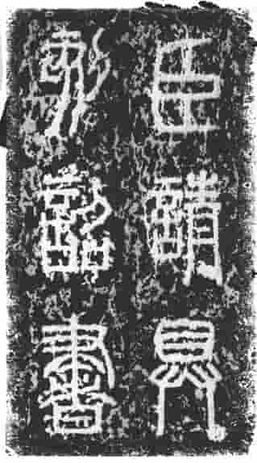

第一个字是臣子的“臣”，第二个字是请求的“请”，第三个字是“具”，表示详尽，第四个字是“刻”，最后两个字是“诏书”。“臣请具刻诏书”，我请求把您的诏书详尽地刻下来。这六个字，应当是李斯的传世真迹，古朴苍劲、端庄大方，是中国书法史上难得的精品！

李斯书法很好，但作为臣子，在内容上难免要拍一拍秦始皇的马屁。我们再一起看下面的《峄山碑》。

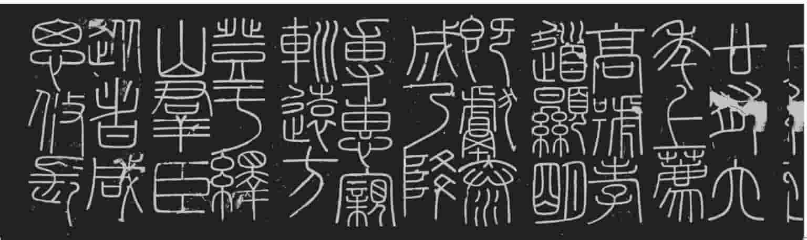

这块碑是宋代人的仿刻，现在还保存在西安碑林中。它的内容很完整，我们看前四个字，“皇帝立国”，从秦始皇统一天下说起。在《峄山碑》里，有不少盛赞秦始皇的话，什么“威动四极，武义直方”啊，什么“孝道显明”“乃降专惠”啊，秦始皇太厉害了，他征讨逆贼，威震四方，都是正义的战争。他尊崇孝道，一直践行先祖统一天下的愿望，又是那么仁爱，把自己的恩泽惠及天下所有的人啊，听上去都有点儿小肉麻。

最讽刺的是，《峄山碑》里面说秦始皇“灭六暴强”——六国是暴君，是强权，是我们伟大的皇帝把他们灭掉了。可在六国人眼中，发动战争的是“暴秦”啊，你是“暴强”，你全家都是“暴强”呢！

看来，书写历史的权力，往往掌握在胜利者手中。

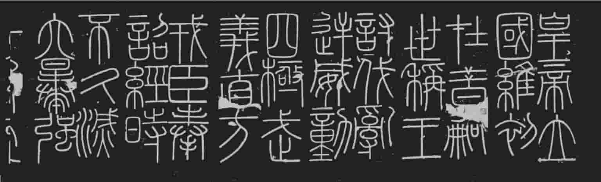

* * *

[1] 西周末代国君，也是历史上有名的昏君。古代帝王诸侯贵族或高级官员死后，朝廷会根据其生平事迹，给他一个具有褒贬意义的称号，这种称号叫作谥号。周幽王谥号里的“幽”字，和商纣王的“纣”字一样，都不是好的谥号，能看出人们对这两位昏君的负面评价。

[2] 周平王继位时，周王室已然衰微，国都丰镐\(今陕西长安西北）被犬戎洗劫一空。为了避免再被犬戎侵袭，平王将国都东迁到洛邑（今河南洛阳），史称“平王东迁”。东周王朝由此开始。

[3] 战国时代，赵国、魏国、韩国的合称。由于三个诸侯国都出自原晋国，所以统称“三晋”。

[4] 相传史籀是西周的大书法家，他书写的字体叫做“大篆”。

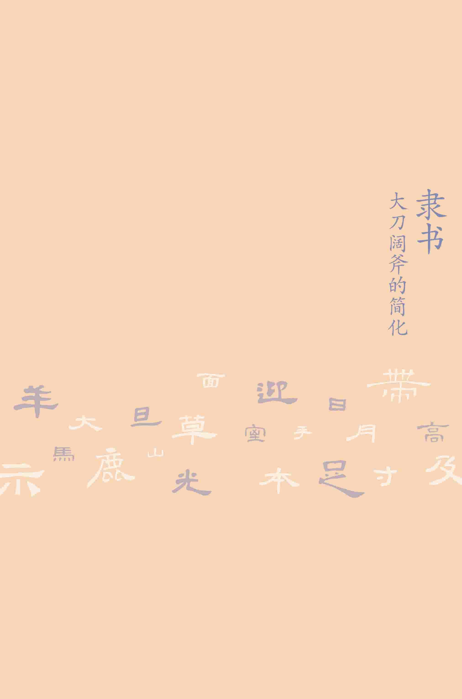

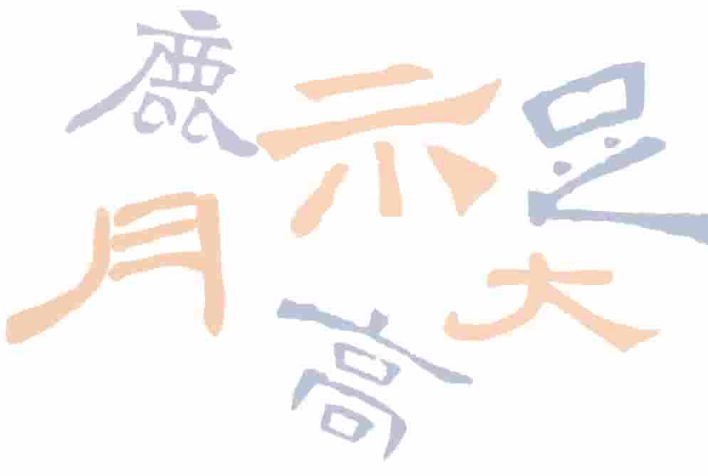

小篆有种种优点，但为什么我们今天不用小篆来写字呢？这种字体，有没有致命的缺点呢？

解答这个问题之前，建议你先写一写小篆，动动手你就明白了。

## ●写到手断的小篆

写什么呢？给你一个小篆样本好了——“一只忧郁的台湾乌龟”。

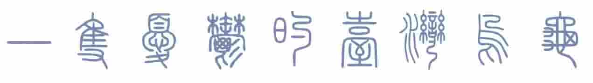

有没有觉得字形好复杂？写呀写，有一种要崩溃的感觉！

小篆字形规整、内涵丰富、端庄大方，很棒！但它有一个致命的问题，那就是不好写——写这种文字，需要耐心细致、凝神定气，手中的毛笔又慢又稳，很有修身养性的感觉，但就是效率特低！写上个千八百字，恨不得手都要累断了。

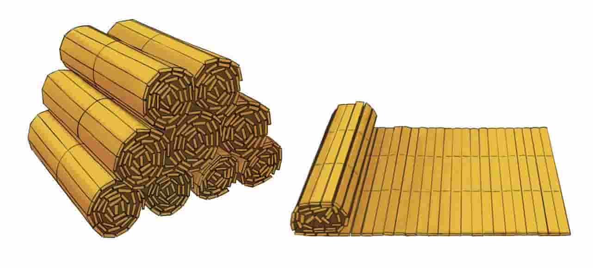

历史上，秦始皇是一个暴君，但不可否认的是，他也是一个非常勤政的国君。相传他每天要看的奏折，有一百多斤重！秦始皇看奏折累，那些用小篆写奏折的人呢？累不累？秦国以法治国，政令繁多，很多事情都要写成公文去交流。如果用小篆来写的话，效率太低下了，大小官吏们实在辛苦。

于是，在小篆作为规范文字向全国推广的同时，秦国的官吏们率先放弃了小篆，他们自觉地简化汉字，用一种简便的字体书写了大量的公文。这种字体，就是隶书。“隶”就是小吏的意思。

## ●隶书与简化

秦朝的官吏们都做了哪些简化呢？

把隶书和小篆进行对比，你会发现，隶书的特点十分鲜明。比如“者”字，除去“日”，如果用小篆写，要六七笔，而且有很多弧形的笔画，写起来弯弯绕绕的。但在隶书中，复杂的笔画被连起来了，弯曲的笔画被拉直了，直来直去，唰唰唰唰，四笔就能写完！快得多！

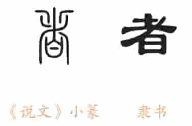

再看裤腰带的“带”。在小篆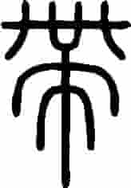中，“带”上边的一横是腰带的象征。古代的“带”不仅是用来提裤子的腰带，还要挂上各种各样的饰物，“象系佩之形”，横下面的笔画就表示古人腰带上佩戴的一大串玉佩、香囊。小篆中的“带”弯弯曲曲，很好看，但也很复杂。到了隶书中，笔画被拉直简化，上半部分一横三竖，就写完了。

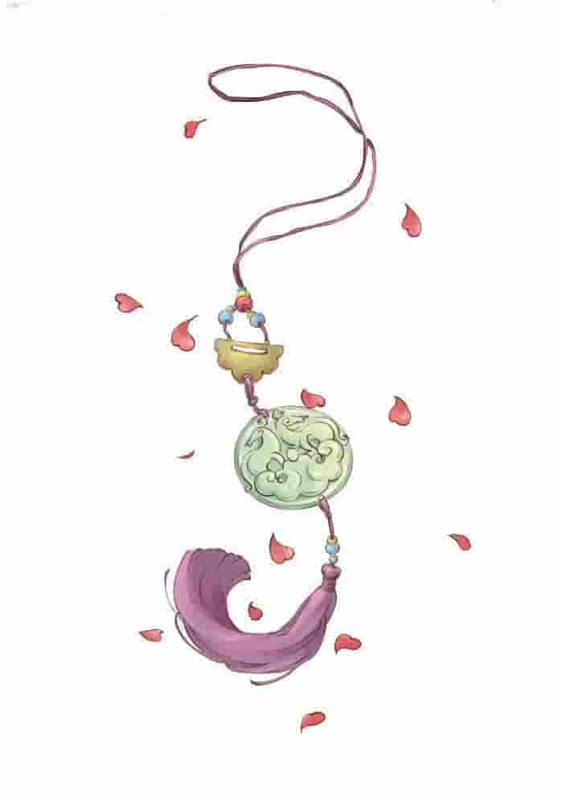 
VCG21gic20065841-©许嘉星/视觉中国

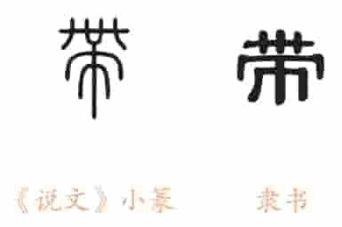

从小篆到隶书，汉字的这个变化过程叫作“隶变”。在隶变中，汉字的笔画变得横平竖直，基本结构越发趋向现代汉字。经过大刀阔斧的简化过程，汉字书写的效率大大提高。但另一方面，汉字中的意义信息也丢失了不少。比如，“鸟”的小篆字体是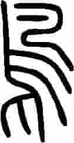，还能看出是一只小鸟朝上张嘴啼鸣，右下方是扇动的翅膀，左下方是小鸟的爪子，但到了隶书，已经是我们熟悉的繁体字“鳥”了，看不出小鸟的模样。

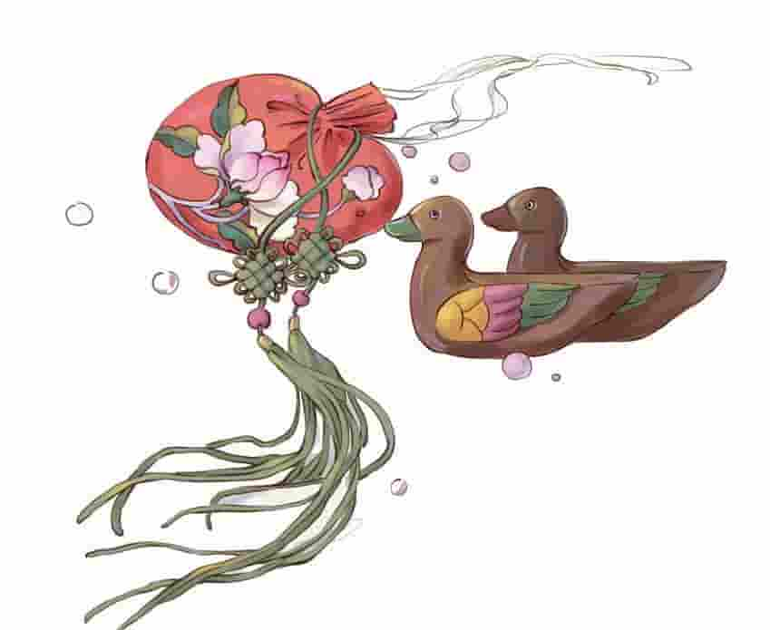 
VCG21gic20065840-©许嘉星/视觉中国

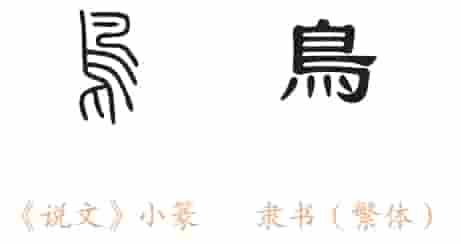

在汉字的发展中，有一组重要的矛盾——字义丰富和书写效率。想要在一个字里体现更多的字义，就要用更多的笔画来表示。但如果笔画太多了，这个字又很难写，不利于传播，就要加以简化。

举个有趣的例子，陕西有种面条叫“biang biang面”，这个“biang”写成这样：

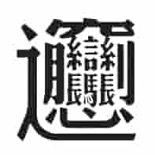

一个字，包含了好多好多内容。为了记住这个极度复杂的字，陕西有个歌谣：“一点撩上天，黄河两道湾，八字大张口，言字往里走。你一扭，我一扭；你一长，我一长；当中夹个马大王。心字底，月字旁，一个小钩挂麻糖，坐个车子回咸阳。”说的就是这个字。

哇，好厉害的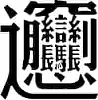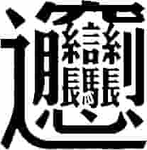面！一碗面条，写出了这么多的讲究。但你不觉得这个字特别难写吗？让你写一百个面，我估计你这辈子都不想再碰它。

因此，汉字势必要进行简化。为什么呢？因为我们懒啊，谁也不想写笔画多的字。从甲骨文、金文、小篆再到隶书，这是一个发展了几千年的简化过程。哪怕会丧失一些字义信息，但人们还是坚定不移地选择了简化。

简化，是汉字发展的整体规律。

## ●两汉名碑

隶书在秦代萌芽后，在社会上越来越流行，在汉代大为兴盛。从西汉到东汉，出现了一批经典的隶书名碑，让我们得以窥见当时的隶书之美。

在西安碑林，你能看到秀美端庄的《曹全碑》；在曲阜孔庙，你能看到大方古朴的《乙瑛碑》；在泰安岱庙，你能看到雄强大气的《张迁碑》；在陕西汉中，你能看到气势磅礴的《石门颂》……

这些碑刻上的隶书精彩极了，在斑驳的石刻上，我们看到了汉字古朴浑厚的文化气质！尽管我们已经不知道那些写字者的具体姓名，但他们气象万千的隶书书法，早已成为中国书法史上光彩照人的篇章。

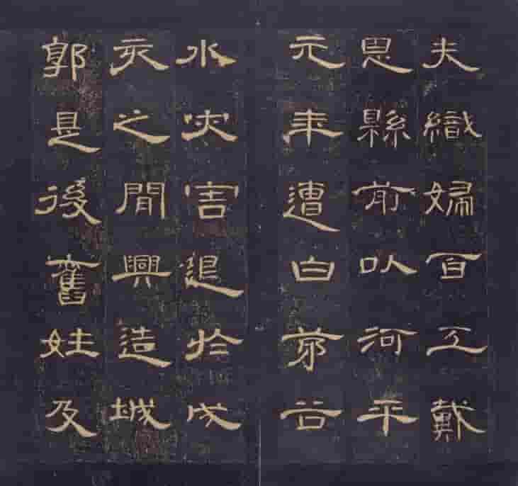 
《曹全碑》

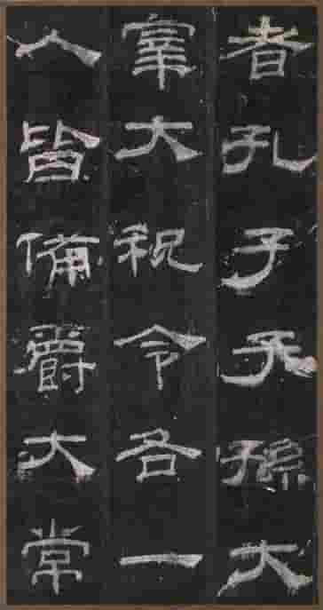 
《乙瑛碑》

从汉碑，我们能看出隶书的基本特点。第一，隶书字形在整体上是扁方形的。第二，隶书讲究“蚕头燕尾”。在起笔的时候顿笔，就像蚕宝宝的脑袋一样；在收笔的时候要翘起来，就像天上飞的小燕子的尾巴一样。

这是隶书独特的审美风味。

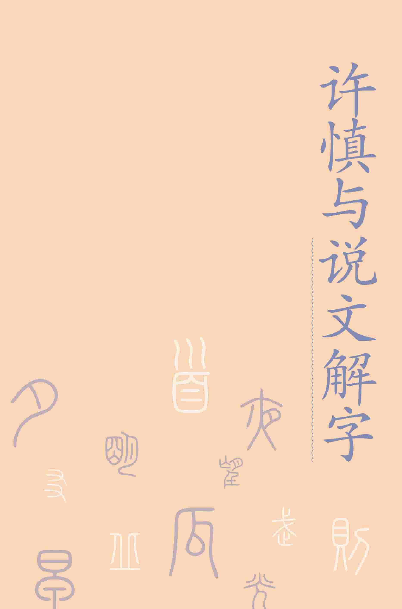

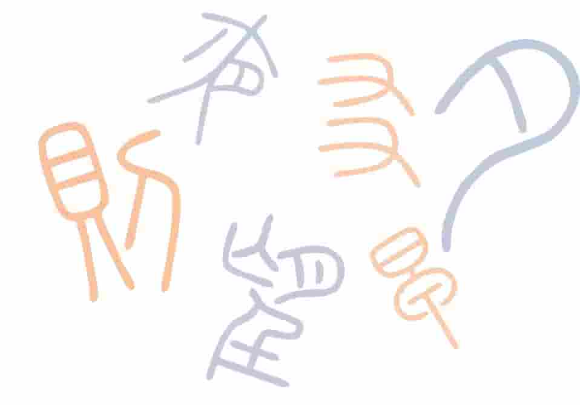

隶书是古今汉字的分水岭，之前的甲骨文、金文和小篆都是古文字，从隶书开始就是书写规范的今文字了。从古文字到今文字的演化过程中，汉字遭遇过一场史无前例的危机——秦始皇“焚书坑儒”。在漫天的大火里，中华古籍遭到了毁灭性的破坏，古文几乎废绝。在这样的年代里，人们离古文字渐行渐远，很多人不明白汉字发展的过程，便开始根据当时通行的隶书来随意讲解汉字。比如说，什么是“长”呢？当时的“长”写作繁体字“長”，“長”和“馬”（马）的上半部分很像，于是有人就说“马头人为长”——长像马，马脸长，人脸要是像马脸一样，自然就是“长”啦。

听起来是不是有点儿荒唐？当时有一个叫许慎的人看不下去了！

## ●找一把解开古文字的钥匙

许慎是谁呢？许慎，字叔重，他熟读经典，是个大儒，被人们称赞为“五经无双”，意思是说许慎熟读五经，对古籍的理解天下无双。

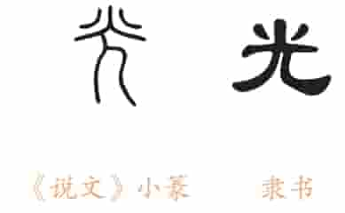

具有研究精神、严肃认真的许慎心想，怎样才能准确地讲解汉字呢？隶书已经经过简化和笔画的调整，不能准确地传达出汉字本身的造字含义，应该找一种更古老的字体，作为说文解字的基础。在许慎生活的年代，甲骨文尚未发现，金文数量极少且过于久远，于是，他将目光转向了古书中的小篆。比如说，如果看隶书中的“光”字，根本看不出它的造字思路，但如果看向“光”的小篆字体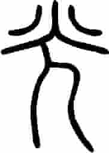，便能看出上面是个“火”——“光”与“火”相关，简直再清晰明白不过了！

就是它了！小篆承前启后，连接甲骨文、金文等古文字，保存了古文字中丰富的意义和文化，是打开古文字宝库的钥匙。凭着这把钥匙，许慎写出了汉字史上最重要的一部书——《说文解字》。

许慎把小篆作为《说文解字》的基础，在古籍中遍寻汉字的小篆字形，广泛搜集。有的字找不到小篆字形，他便按小篆的书写规则加以复原。最终成书一共收录了9353个汉字（不包括异体字，也不包括后继学者为《说文解字》增加的新附字）。

在字头下面，许慎会详细讲解汉字：这个字是怎么造出来的，它的形体有何特点，这个字的字义是什么，读音又是什么，这个字的背后有怎样的文化内涵。比如“示”字：

示，天垂象，见吉凶，所以示人也。从二（二，古文上字）。三垂，日月星也。观乎天文，以察时变。示，神事也。凡示之属皆从示。

这是《说文解字》对“示”的解释，我们知道，“示”有“展示”的意思，古人的理解则要更为复杂一些，具有鲜明的历史特点。在他们看来，什么东西能给人“展示”“揭示”出最根本的道理呢？那就是我们头上的苍天。“天垂象，见吉凶，所以示人也”是解释“示”的字义：上天有各种各样的“天象”，日月风云、星辰月相，都提示着人间的吉凶祸福。所以，人要善于观察天象，及时把握天意，得到启示。“从二。（二，古文上字。）三垂，日月星也”是拆分说解字形，你看小篆中的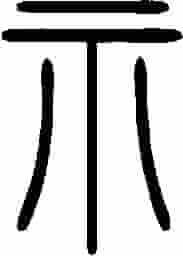（示），上面是“二”，许慎先生告诉我们，这个“二”在古文字中是“上”，它在古汉语中有上天的意思，天象给人们带来启示。说起来，甲骨文的（上）就写作一长一短两横。下面一横长，表示大地；上面一横短，标注着大地上方，表示地平线以上的位置，也就是“上”的意思。这是一个标准的指事字，后面我们还会讲到。

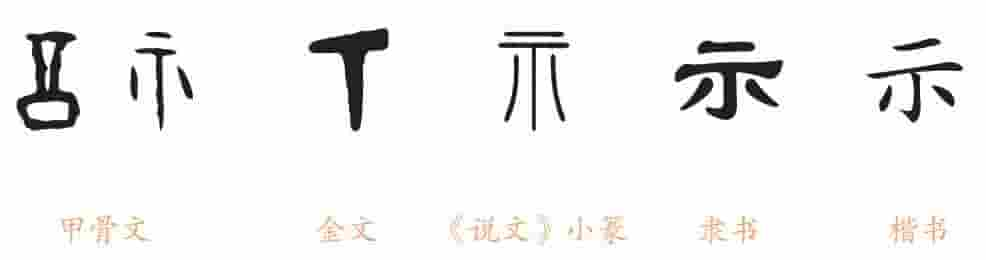

下面的“三垂”呢？也不是随便的三笔，而是象征着天上的日月星辰，也就是所谓的“三光”。无论是中国文化中的星宿，还是西方文化中的星座，在古人眼中，日月星辰都与人类世界密不可分，具有“示”的功能。“观乎天文，以察时变”，这是来自《周易·贲·彖辞》中的话，意思是古代圣人观察天文、获取启示，从而来把握现实中的种种变化。

## ●发现部首的奥秘

除了用小篆厘清汉字含义，《说文解字》的另一个重要意义和价值是：许慎发现了汉字部首的奥秘。

在《说文解字》中，上万个汉字是由540个部首统摄起来的，掌握了部首，也就掌握了汉字的秘诀。比如，“示”就是一个重要的部首，这也就是现在楷书中的“礻”。所谓“凡示之属皆从示”，“礼、祭、祀、神、福、祸”，这些和神灵祭祀、祸福祈祷有关的字，都是从“示”的。

许慎用部首把具有相同偏旁的字归纳起来，让汉字不再零散，呈现出汉字字义的基本规律，这是汉字历史上特别重要的一个发现。我们今天的《新华字典》里还有“部首检字法”，通过部首来查找汉字，这个重要的发明，是许慎先生的功劳！

《说文解字》凝聚着许慎一生的心血，它是中国历史上第一部字典，也是中国历史上第一部汉字文化巨著，书中蕴藏着汉字的全部奥秘。因此，许慎也被尊称为仓颉之后的第二位“字圣”。

我为大家讲解汉字，正是以《说文解字》为基础的。

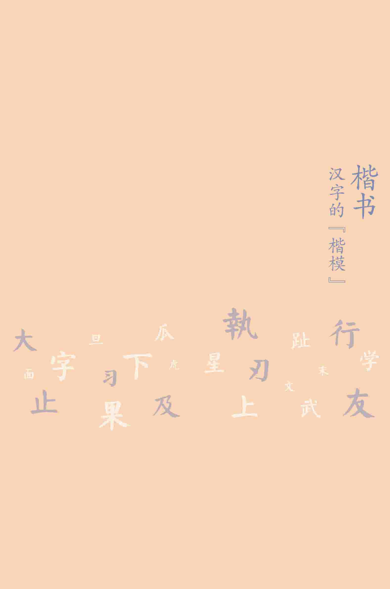

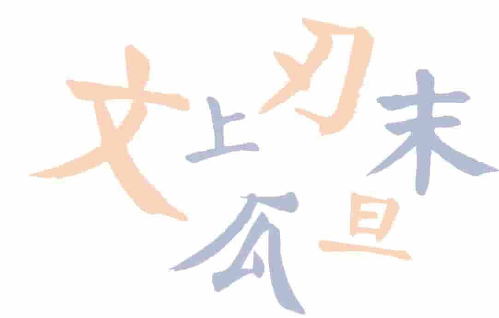

在隶书之后，还有草书、行书等不同字体，但影响最为深远的，还是楷书。

楷书诞生的时间并不晚，1800多年前的汉魏之际就已经形成了，之后又过了200多年，到南北朝时期渐渐成为主流字体，进而一举成为汉字的标准字体。我们今天学写字，都是从楷书开始。

从甲骨文到楷书，汉字经历了几千年的岁月，从历史走到今天，跌宕起伏，实在不易。

## ●什么叫楷书？

“楷”有楷模、标准的意思，也就是正体书法。这种字体端正大方，能够成为汉字的标准，因此有了“楷书”这样的好名字。楷书也叫作“真书”“正书”——一种“真真正正”的字体，带有标准的内涵。

一般来说，和行书、草书一样，楷书也是由隶书发展而来的字体。和隶书相比，楷书发生了几个明显的变化。对比隶书和楷书，你能看出有哪些不同吗？

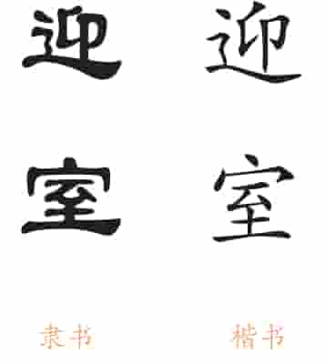

很明显！楷书的字形结构由扁平变成了正方，所谓“方块汉字”，指的就是楷书。此外，楷书中的笔画没有明显的蚕头燕尾了，比隶书更为平直，写起来也就更加便捷。最后，楷书的字形比隶书更加简化了。

## ●楷书四大家

在汉字的历史上，曾出现过一大批善写楷书的大书法家。其中，最有名的是楷书四大家。

他们是谁呢？

他们是唐代的欧阳询、颜真卿、柳公权，还有元代的赵孟頫（fǔ），分别为欧体、颜体、柳体、赵体的创始者。在四大家中，有三个都是唐朝人，足见唐朝是楷书发展的高峰。四大家的书法各有特色，欧体端庄刚劲，颜体雄浑厚重，柳体瘦硬遒劲，赵体圆润俊逸，真是各有千秋、自得风流。

在楷书四大家中，我最喜欢颜体，那种雄浑苍劲、大气非凡的感觉，看起来仿佛千军万马、长枪大戟一般。

为什么颜体这么有力量呢？

传说，颜真卿曾经告诉别人：“写千斤之字必先有千斤之力！”人家不解，“敢问，什么叫千斤之力呢？”

颜真卿哈哈大笑：“你看着啊！”他弯下腰，握住椅子腿，将一把太师椅举过头顶，一、二、三……一口气举了几百下，再轻悄悄放回原处，大气不喘，面不改色。“看好了，这就是千斤之力！”

好家伙，颜体是这样练出来的啊！

这只是一段趣谈，其实颜体可谓字如其人，我给你讲讲颜真卿的故事吧。

读《新唐书》中的颜真卿传记，会让我们对颜体字的理解又深了一层。颜真卿一门忠烈，他堂兄叫颜杲（gǎo）卿，是安禄山亲手提拔的常山太守。安史之乱时，颜杲卿举兵讨贼，把安禄山弄得狼狈不堪。后来城破被俘，安禄山恨透了他，把他捆在天津桥的柱子上，凌迟处死！

哥哥壮烈殉国，这件事对颜真卿影响很大。到了颜真卿的晚年，李希烈在汝州造反，朝中奸臣陷害颜真卿，让他前往招抚。这是要把他送到狼嘴里去啊，不少人劝他别去，颜真卿却毫不犹豫地出发了。

到了汝州，有上千名士兵拔刀冲上来，李希烈的将领们纷纷谩骂，“将食之”——“把这老东西吃了”！颜真卿面不改色，坦然宣读朝廷旨意。

到后来，李希烈派人劝降，颜真卿正色说道：“你没听说过常山颜杲卿吗？那是我的兄长啊！我一个年近八十的老头子，眼看要死的人了，还会改变自己的操守吗？”

李希烈没办法，便把颜真卿关了起来，挖了个坑要活埋他。颜真卿淡然一笑，说道：“生死有命，你以为挖个坑就能吓到我吗？”最后，颜真卿被李希烈派人绞死，临死前骂贼不止，和兄长一样壮烈殉国。

颜真卿去世时是七十六岁，已是风烛残年，却爆发出刚强的气概。我们今天讲他的故事，仿佛还能感受到那股堂堂正气。北宋大文学家欧阳修评价颜体书法说：“斯人忠义出于天性，故其字画刚劲独立，不袭前迹，挺然奇伟，有似其为人。”意思是说，颜真卿天性忠义，他的字画就像他的为人一样，遒劲有力，不承袭前人的印记，挺拔奇伟。这也正是我最喜欢颜体的原因，读颜真卿的传记，再看他雄浑刚劲的书法，心中不禁会生出一种由衷的敬意。

## ●繁体字与简体字

楷书诞生后也不是一成不变的。

从历史到今天，楷书经过了一个不断简化的过程。最大的变化，便是繁体转变为我们熟悉的简体。

在楷书中，有繁体字和简体字的区别。你看右页，“凤、兴、爱、论”的繁体与简体，是不是差别蛮大？

汉字从古至今，不断简化，新中国成立以来，国家更大力推行简化字。因此，我们如果读古书的话，会看到很多繁体字，但在今天的图书中，则是以简体字为主。

也许你要问，繁体字和简体字，哪个更好？

哎呀，回答这个问题真麻烦！我先问你一个问题吧，世界上有没有绝对的“好”，和绝对的“不好”呢？

战国时代有一位哲学家，叫庄子。他说：“彼亦一是非，此亦一是非。”什么意思呢？是非对错，从来不是绝对的，要看在什么样的角度上理解。

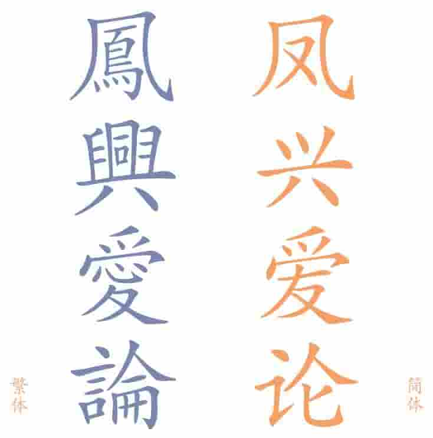

就书写方便来说，当然是简体字好！不承认的话，罚你抄一百遍“壹隻憂鬱的臺灣烏龜”（繁体字版“一只忧郁的台湾乌龟”）！

为什么要追求书写效率呢？

文字，是为社会应用服务的，一种好写、好认的汉字，当然更受欢迎。

简化，是贯穿汉字发展的整体规律。从甲骨文开始，汉字就在不断简化了。在新中国简化汉字的过程中，汉字专家们在简化字时尽量做到有所依据。很多人都不知道，在今天的简体字里，只有0.26%是新中国成立之后完全新造的，其他简化字都有历史来源。比如说繁体字中的“爲”在简体字中写作“为”，但实际上，“为”的写法在王羲之的书法中就已经出现了。

中国古人在写字的时候，会进行自发的简化。因此，我们千万不要以为，简体字是今人随随便便造出来的，它们其实是历代古人追求书写便利的智慧结晶。

新中国推行简化字后，汉字好学好认，其一大好处便是扫盲。

你听说过扫盲这个词吗？

扫盲，就是扫除文盲。在古代，知识是奢侈的，只有少数的读书人才会写字，大多数老百姓根本没机会接受教育，更不认字，这样的人被叫作“文盲”。你能想象新中国刚成立的时候，中国大约80%的人都是文盲吗？你能想象文盲的生活吗？我有一次出国旅游，就体会了文盲的痛苦。吃饭点菜，菜单上都是不认识的洋文，随手叫了几个菜，那叫一个难吃……

点菜还是小事，不认识字，老百姓就会被人欺负，被人骗，整个社会更毫无平等可言。中华人民共和国成立后，国家下了很大的力气扫盲，教那些不认字的老爷爷、老奶奶识字。扫盲，用的就是简体字，因为它好学啊！

有的汉字简化得非常精妙，比如我们讲过的“龟”字。它在甲骨文中的写法就相当烦琐，繁体字写作“龜”，来自小乌龟的侧面象形，也很难写，一不小心就会写错。但简化成“龟”之后，笔画清晰，一目了然，而且和小乌龟的样子还是很像！

介绍了简体字的好处，那繁体字呢？

如果你想要了解汉字的历史、汉字的文化，就需要掌握繁体字的知识。在繁体字中，我们能够更清晰地看到汉字的历史脉络。讲《汉字就是这么来的》，也会给大家介绍繁体字的相关知识。要知道，简化字也是有副作用的，那就是会导致汉字字义丢失、汉字的历史源流断绝。在很长一段时间里，我们教学生掌握汉字的道理，都忽视了汉字源流的讲解，对汉字背后的文化内涵也不怎么清楚，导致我们只能机械地记忆汉字。今天，我们越来越重视汉字的历史，还有它背后的道理了，在学汉字的时候，也会注重汉字历史和汉字字理的讲解，这也是我写这套书，想和你聊聊汉字的原因。

总之，简体字方便使用，繁体字保存历史，二者各有所长。对我们来说，踏踏实实地用简体字，再了解一下繁体字的知识，加深对汉字的理解，这就足够了。

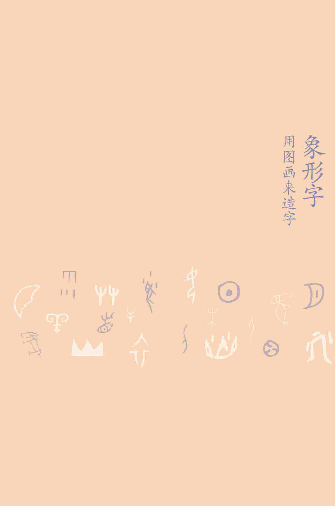

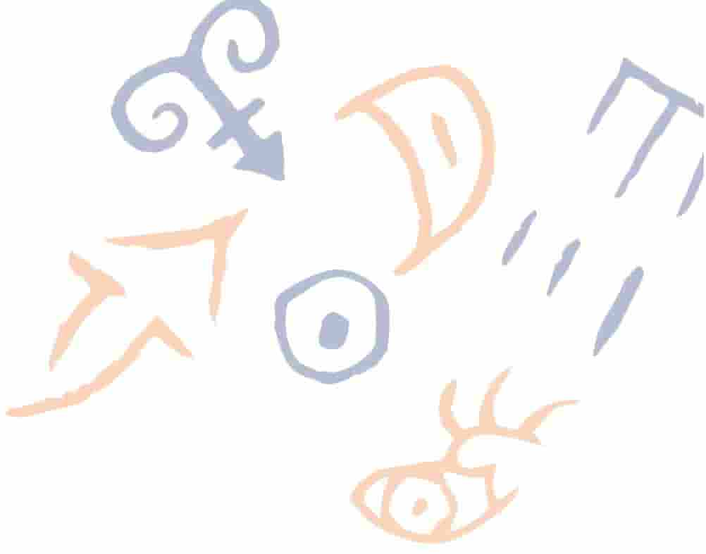

汉字，从遥远的古代走到今天，从古老神秘的甲骨文，走到我们笔下整齐端正的楷书。汉字的岁月，是中国文化的生命历程；汉字的未来，也与中国文化相伴始终。

懂得了汉字的历史，接下来，我们需要了解造字的方法，这是我们走进汉字世界的重要角度。汉字是怎么创造出来的？在造字中，凝聚了古人怎样的智慧与灵感？古人造字遵循了哪几种造字逻辑和规律呢？

这些问题，都等待着我们探寻！

## ●什么是“六书”？

中国古人在很早以前，就开始思考造字的规律了。他们把这些规律总结为“六书”——“书”是书写，写的是文字，六书就是六种造字、构字的规律。这是我们了解汉字的基本知识。

在周代，古人就已经提到六书了，但历史上最重要的六书专家，把六书讲解得明明白白的，还是《说文解字》的作者许慎。在《说文解字》中，许慎先生给六书下了清楚的定义，用具体的例子说解六书，还用六书分析了全部的汉字。可以说，有了《说文解字》，六书才成为一门重要的学问。

说来说去，“六书”是什么呢？

它们包括象形、指事、会意、形声、转注、假借。一般来说，六书的重点在于前四书，也就是象形、指事、会意、形声。

这些名称都是啥意思啊？听上去好难！别急，这正是我们接下来要重点讲解的内容。

## ●象形：汉字是画出来的

象形，是用画画的方式造字。

象形字，和事物的“形”体一定要“像”。在《说文解字》中，许慎先生是这样讲解“象形”的——“象形者，画成其物，随体诘诎，日月是也”。

什么意思呢？“画成其物”，象形是用绘画的手段来造字，“物”是汉字所要表达的事物。“随体诘诎”，象形字要惟妙惟肖地画出事物的形体，“体”是事物的形体，“诘诎”是弯弯曲曲的笔画，用来描绘事物的轮廓。最后，许慎先生举了两个例子：日和月。

试想一下，如果你是一个小原始人的话，怎么给太阳和月亮造字呢？

太阳圆圆的，非常明亮，仿佛有无尽的光明洒向大地。因此，古人造日的时候，画一个圆圈，来描绘太阳的形体；中间加上一点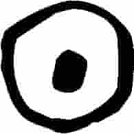，表示太阳的光芒。《说文解字》说：“日，实也”，太阳的光芒是充实饱满的。

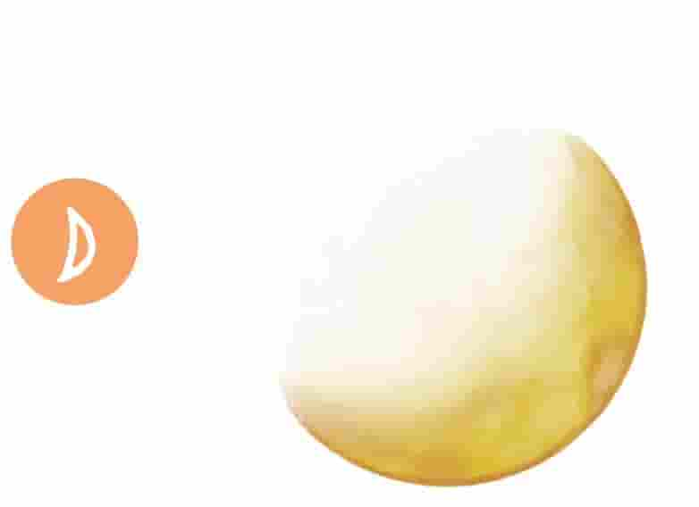

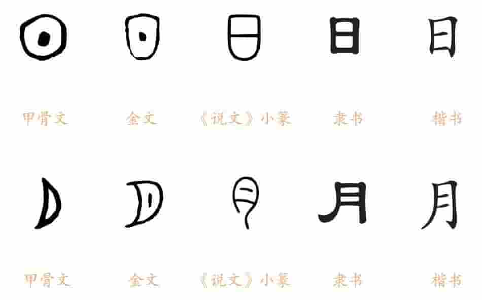

月亮呢？十五的满月是圆的，但也有弯弯的月牙，像女子的眉毛一样。月有阴晴圆缺，和太阳相比，“缺”的状态是月亮独有的特点。因此，古人造月的时候，画一个弯弯的月牙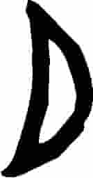，来描绘月亮的形体。

你看，这就是古文字中的日与月，它们是最典型的象形字。

## ●画出自己，画出世界

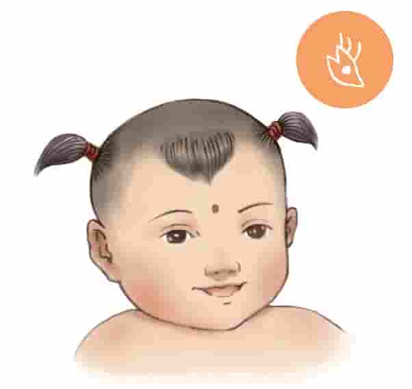

参考日月的形象，造出、的过程，叫作“取象”。取象有两个最重要的来源，“近取诸身，远取诸物”——低下头，看看自己，从我们的身体中选取图像来造字；抬起头，眺望世界，从广阔无垠的大自然中选取图像来造字。简单来说，就是画出自己，画出世界。

在象形字中，我们能看到从头到脚的人体形象。还记得在讲甲骨文的时候，我们拼出的古代人脸吗？那个让你难忘的美男子，就是由象形字组成的。再给你举几个例子吧，你看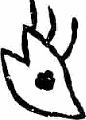，这个字是什么？

我们不难看出，这是一个脑袋的象形。无论是头发、面孔，还是眼睛，都清晰可辨。这个字是甲骨文中的“首”，也就是脑袋的意思。不过，这个脑袋看起来好丑……

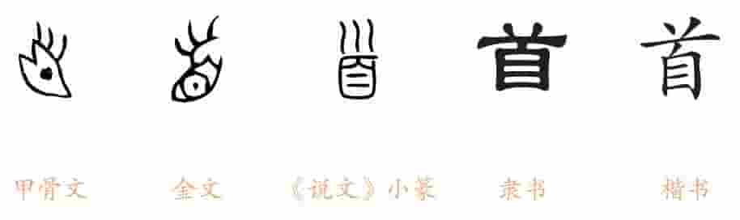

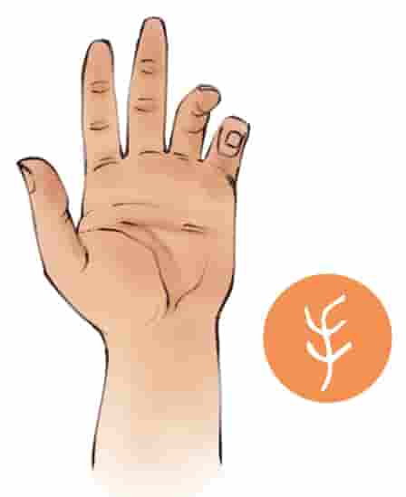

再看下一个字!，这是周代金文中的形体，猜猜看，这是什么字？

猜对了！有手臂，有张开的五指，这个字是“手”的象形。

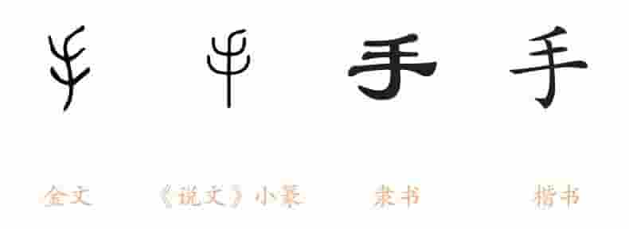

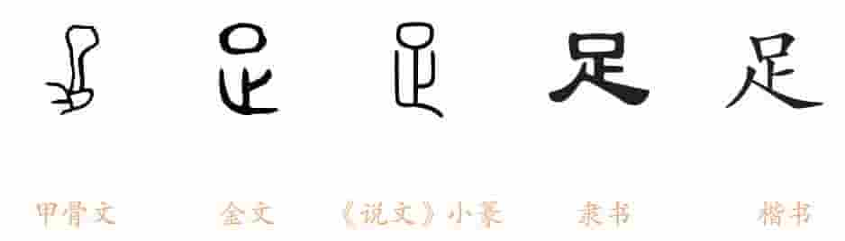

有了手，也一定有脚。我们再来看第三个字：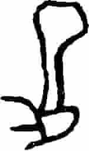。

上面是小腿，下面是脚，脚趾还向外张开着，这个字又是什么呢？

它是甲骨文中的“足”。

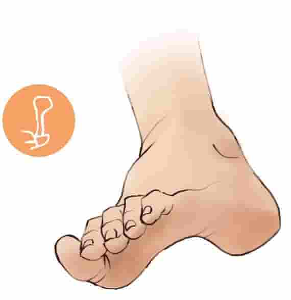

在象形字中，古人非常细致地观察了自己的身体，从头到脚，选取了各种各样的形体，造出大量和人体有关的汉字。对于这些字，我在《字里字外的人体世界》还会给大家详细讲解。

在近取诸身以外，古人还远取诸物。

他们仰观天文，俯察地理，把自己好奇的目光，投向了丰富多彩的大自然。在象形字中，有天文地理，有花草树木，有日用器皿，有饮食服饰，还有各种活泼可爱的小动物。

你看，这里有几个汉字：

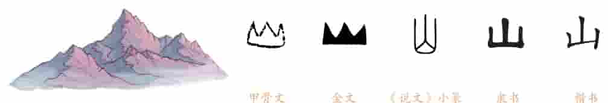

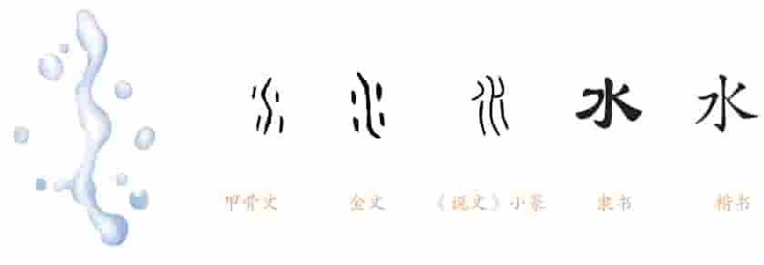

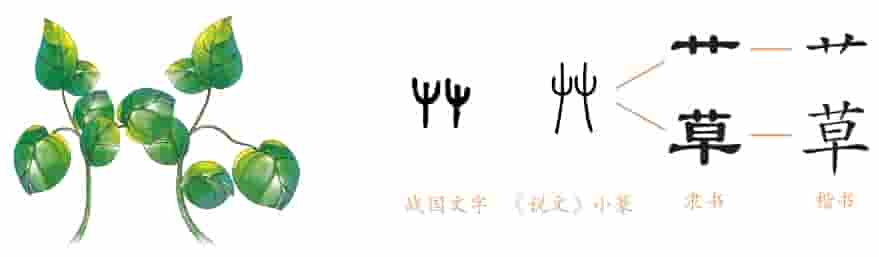

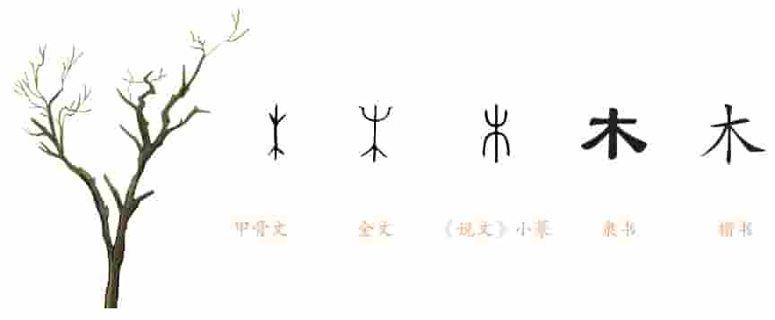

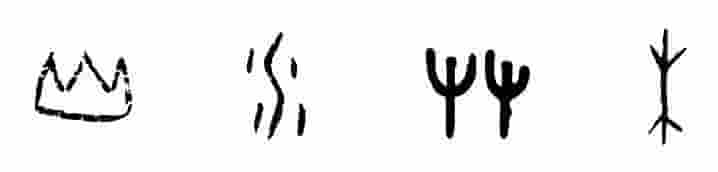

第一个字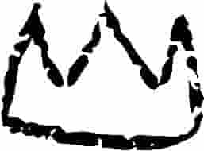，是甲骨文中的“山”，画出了高耸入云的山峰。

第二个字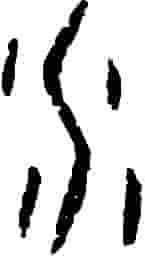，是甲骨文中的“水”，画出了蜿蜒曲折的流水，汉字中的小点，就像流水中飞溅起的水花一样。

第三个字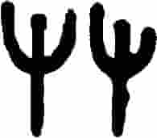，是战国文字中的“艸”。“艸”是小草的意思，也是草字头的来源，春风吹拂大地，小草生出了嫩芽。

第四个字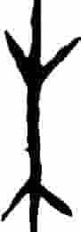，是甲骨文中的“木”，树根牢牢地扎在地里，树枝在微风中轻轻摇曳。

这四个字放在一起，展现出大自然中的动人风光。

我们再看下面的几个字：

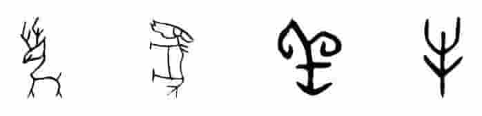

第一个字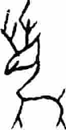，画出了长长的腿，轻盈的四蹄，还有长长的角。这是什么动物呢？也许你一眼就能看出，这是甲骨文中的“鹿”字。

第二个字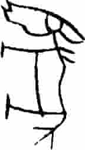要侧过来看，也是一种动物，脸长长的，后背上还长着鬃毛，似乎在随风飘荡。它是什么呢？这是甲骨文中的“马”。

第三个字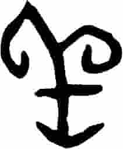是动物的局部，凸显出下弯的双角，这是甲骨文中的“羊”。

第四个字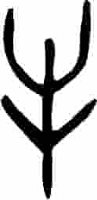最好认了，太象形了，这是“牛”。

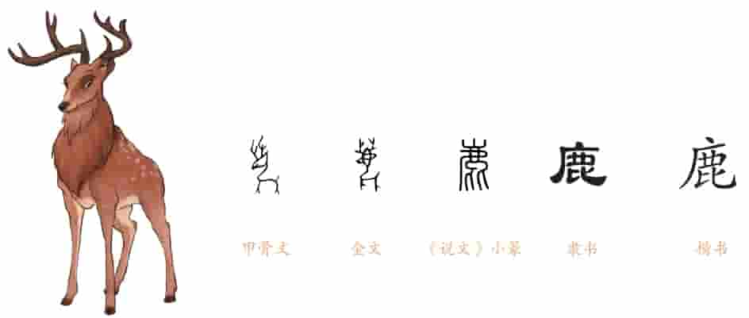

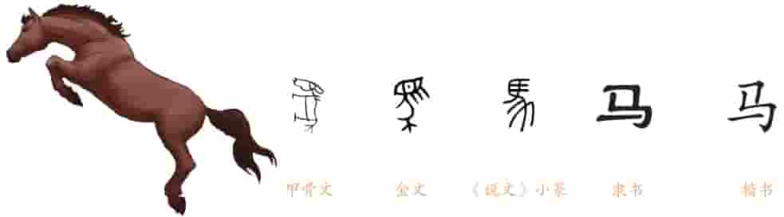

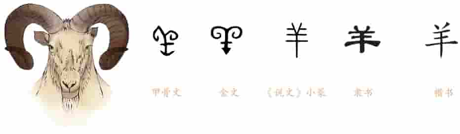

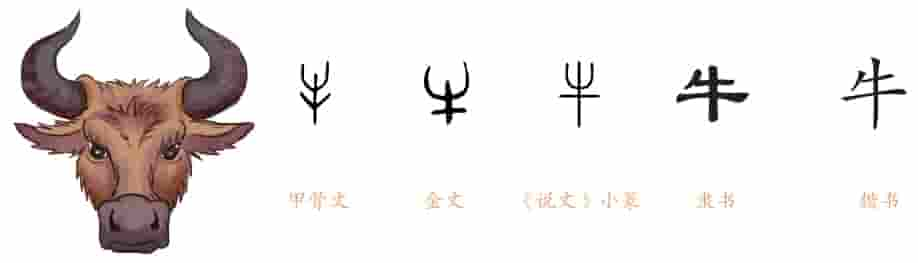

这样的汉字还有好多，足够组成一个动物园了。

认识了这些象形字，我要问你一个问题了。在你看来，象形字最主要的特点是什么？

“像！太像了！”

没错！象形字就是要把事物形体惟妙惟肖、淋漓尽致地描绘出来。可以说，象形字用图画的方法，记录了丰富而美丽的世界。需要注意的是，甲骨文在描绘物象的时候，非常注重展现它们的特点，从而进行有效地区别，比如说，牛角向上，羊角向下，就是凸显了牛羊的特点。

## ●图画与背景

不是所有的事物画成字时都容易识别。有些东西，即使你画出了它的样子，别人也不认识。

什么？你说你不信？好吧，我画一个给你看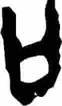。

这个方块，你说它是什么？有人说，这是一块面包。有人说，这是一扇窗户。还有人说，这是一个手机。到底是什么，得不出一个明确的答案。

因此，光描绘事物本身不行，有时还需要把它的背景画出来。比如这个方块，它的背景其实是一个房子——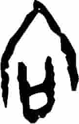。

墙上面方方正正的一个框，一定是窗户。这个字，其实是甲骨文中的“向”。《说文解字》说：“向，北出牖（yǒu）也。”“牖”是窗户的意思，“向”最初的意思是朝北开的窗户，由此引申出“方向、朝向”的意思。

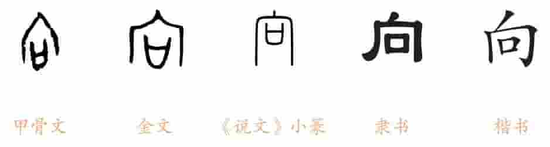

画完了一个方块，再画一个椭圆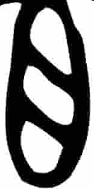。猜猜看，这是什么字？

有人说，这是一个鸡蛋。有人说，这是一块圆面包。还有人说，这是我们的圆滚滚的脑袋！

都不是，这是一个瓜！

凭什么说它一定是个瓜？我才不信呢！

所以，在造字的时候，要把和瓜有关的背景凸显出来——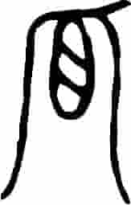。

瓜长在藤上，甲骨文中画出了蔓延下垂的藤条，藤条下面圆滚滚的东西，自然是甜甜的西瓜啦。你看这个字，和今天的“瓜”字很像。

刚学写字的时候，我们经常分不清“瓜”和“爪”。记住了，“瓜”字多出一点，这一点，正是瓜的象形。而“爪”的甲骨文是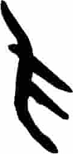，看着很像爪子，或是人手垂下来的样子。

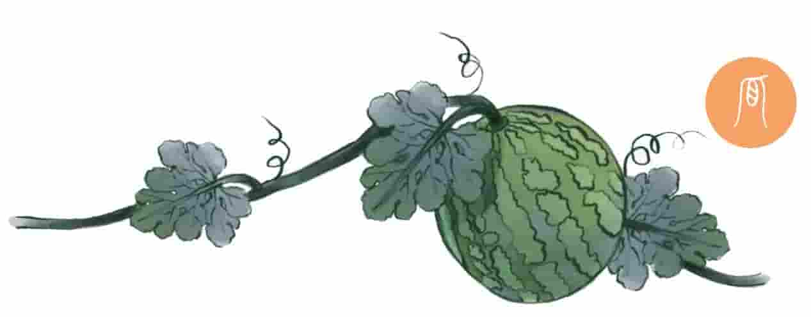

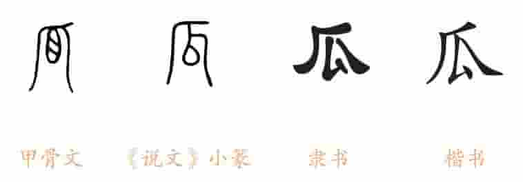

再画一个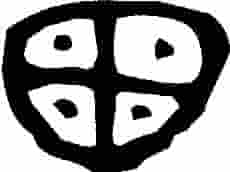：一个圆圈，里面是一个十字，十字里面有小点。有人说，这是一个鬼脸。有人说，这是一块田地。还有人说，这是一个熊掌。

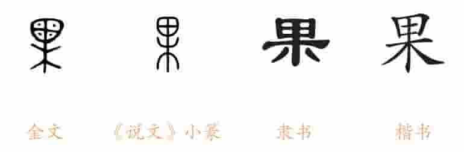

其实，这是一个果实的象形。果实里面长满了果肉，结满了籽。但如果有人觉得不像，怎么办呢？在造字的时候，古人在果实下面添加了一个“木”，变为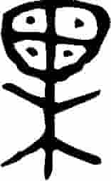——长在树上，肯定不是熊掌，不是田地，不是鬼脸，而是味美可口的水果。古文字中的“果”和今天的“果”还很像，记住，果上面不是“田”地，而是果实的象形。

这些象形字有一个共同的特点，单独画出它们的形体，认不出来，必须把这个字的背景也画出来，才能确定是什么字。图画加背景，构成了另一种象形字。

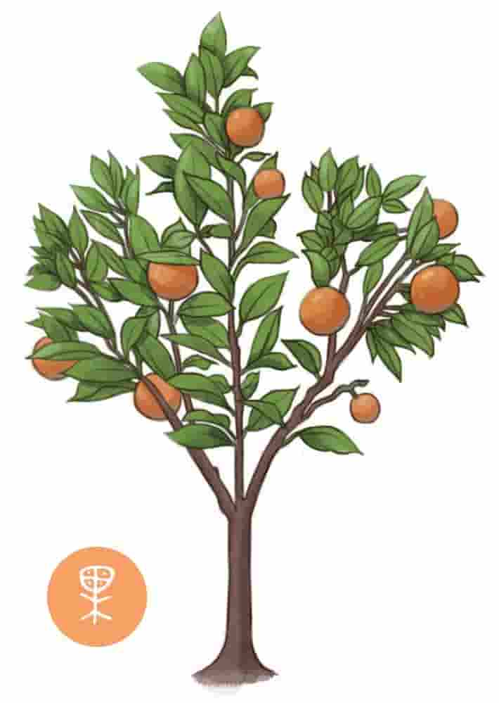

总结一下，“山、水、草、木、鹿、马、羊、牛”，这些只需要描绘事物的象形字，叫作“独体象形”；“向、瓜、果”，这些既需要描绘事物，也需要画出背景的象形字，叫作“合体象形”。

## ●特殊的象形字

无论刚才讲到的独体象形字的例子，还是合体象形字的例子，它们都是描绘具体的事物，都是名词。有没有一种表示抽象的字义、表示形容词的象形字呢？

有，但比较少，这是一种特殊的象形字。

你看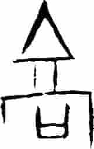这个字，像什么？下面是房屋的地基，上面是一间高高的房子，还有一个尖顶。它是房屋的象形，但却不是“房”字，而是甲骨文中的“高”。

为什么高大、高矮的“高”，要用房子来表示呢？

说来话长，高和低、矮相对，意思上比较抽象，不易造字。所以，古人就用生活中最常见的、高高的事物来造字。

在远古时代，古人是穴居的，或者在山侧挖一个窑洞，或者在地上挖个坑，上面再搭一个棚子——“穴”是洞穴的意思，穴居就是住在洞穴里。在今天陕西半坡遗址中，还能看到先民穴居的遗迹。

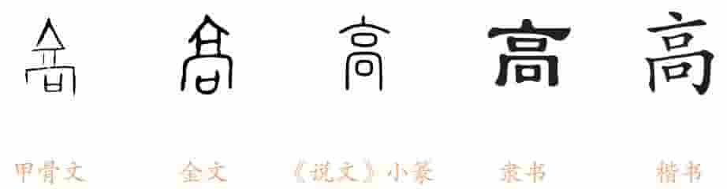

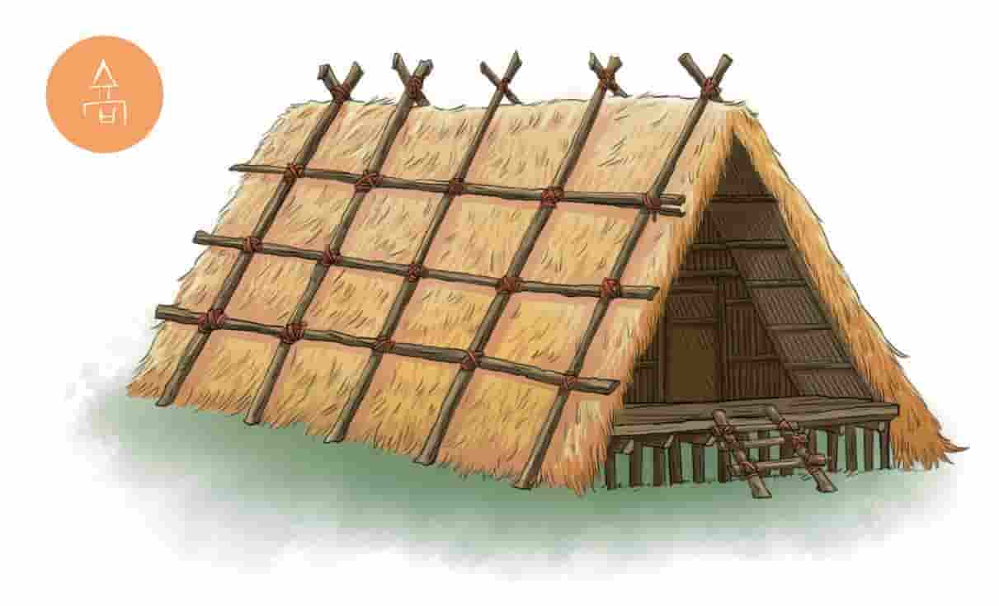

穴居生活相当辛苦，潮湿阴冷不说，还总受野兽和毒虫的侵扰。随着社会生产的发展，古人开始搭建一种二层的木制小楼——下面一层防潮，顺便还能养猪；上面一层干燥舒适，用来住人。这种建筑比以前的穴居屋舍，高出来很多，所以古人就用房屋的形状来表示抽象的“高”的概念。

讲完了“高”，它还有一个近义词—“大”。

怎么给“大”造字呢？画一头大象？画一座大山？画出无边无垠的天空？都不是好办法！大象、大山容易和“象”“山”混淆，无边的天空则很难描画。想来想去，聪明的古人想出一个好办法：在我们的人体中取象！

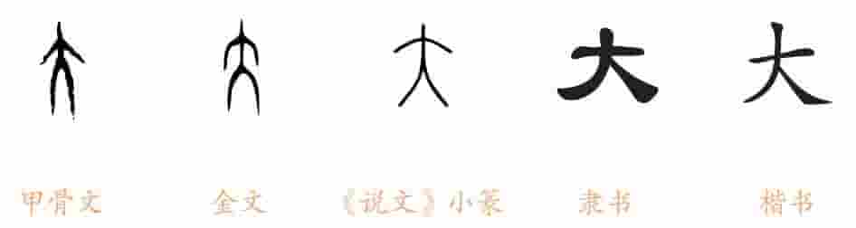

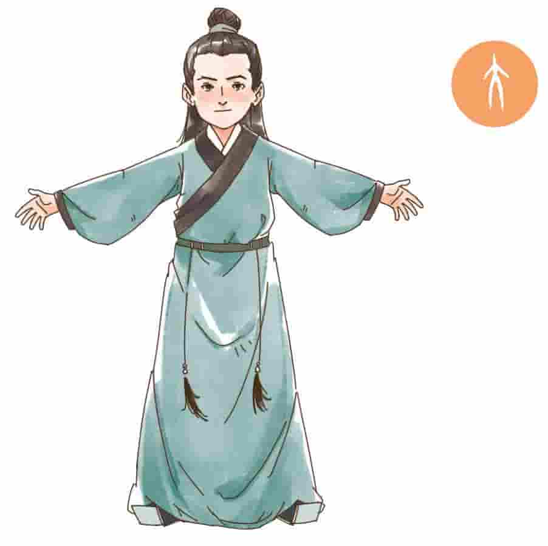

人的身体在什么时候最“大”呢？当然是正面站立、四肢伸展的时候，很有一种顶天立地的大丈夫感。就这么办！古人画出了一个正面站立的人形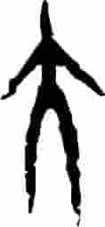，表示“大”，在今天的楷书中，我们还能看出，“大”是一个人伸展四肢的样子。

不过，这种表示抽象概念的象形字，数量很少。

讲完了象形字，我们一起思考一个问题。在你看来，这种造字方法有什么优点呢？形象，逼真，可爱，惟妙惟肖，一看就懂，趣味盎然……

说得都不错！

那么，象形字又有哪些不足呢？

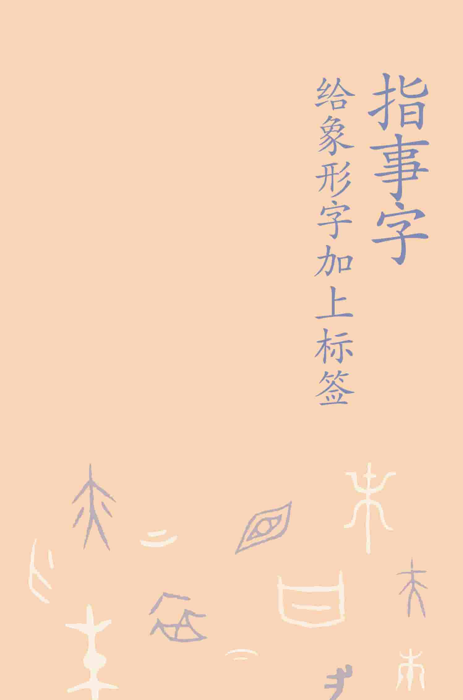

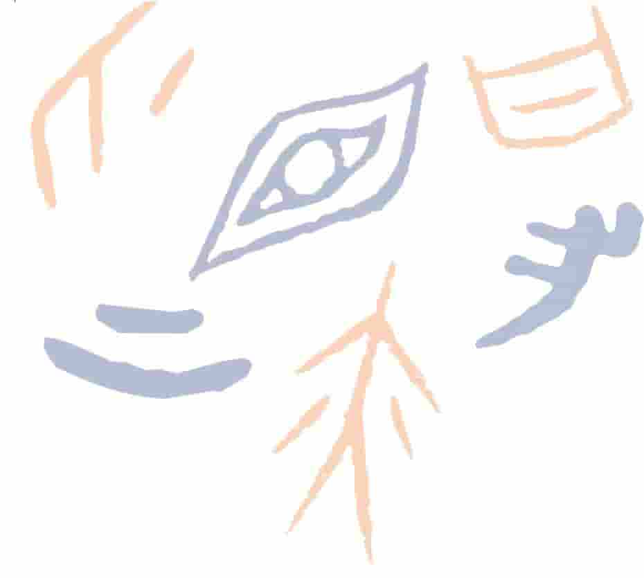

象形字是一种经典的造字方法，古人细致地观察世界，选取各种精彩的画面，纳入汉字之中。象形字里充满了古人的智慧、灵感与用心。

但是象形字也有它的不足。世界丰富多彩，并不是所有的事情都可以用图画来表达，一旦事情复杂了，象形字也难免笔画繁多，写起来太麻烦。而且象形字适合表达名词，特别是那些基础、常见的事物。但语言中的抽象内容，该怎么造字呢？

这些不足，都给古人提出了新的挑战——要有更多的造字方法！

## ●什么是指事字？

先问个小问题吧。你在家给爸爸妈妈帮厨吗？会切菜吗？我的问题是，如何造一个字，来表示菜刀的锋利呢？

这个字真难造！我可以画出一把刀，但怎么能画出“锋利”呢？画一把快刀，旁边是斩断的树木，甚至连大山、大河都能砍断，这样行吗？意思是有了，但写起来太麻烦——别忘了，我们是很懒的哦。

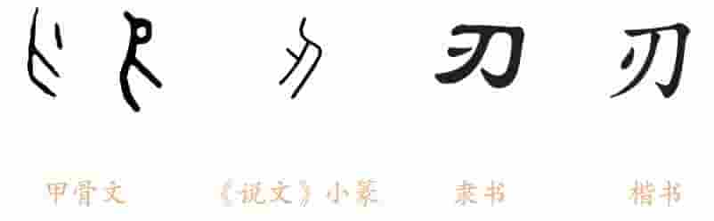

对此，聪明的古人想出来一个简单又好用的造字新方法。先画出一把刀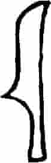，然后为了偷懒只保留了刀的一些线条。再在刀刃上添加一点，标示出刀刃的地方，创造出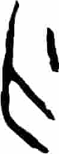、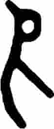等不同的写法——这就是甲骨文中的“刃”，表示刀的锋利之处，又好写，又好认！

这种造字的新方法，人们叫作指事。“事”是想要表达的字义，“指”是表达字义的方法——在象形字上添加一个小标签，“指”明所要表达的“事”物。

在《说文解字》中，许慎先生给出了指事字的辨别方法。“视而可识，察而见意，上下是也。”

“视而可识”是针对象形字说的，“视”是看，“识”是认识，指事字我们往往觉得很熟悉，因为它是在象形字的基础上造出来的，一看就认识。“察而见意”说的是象形字上的小标签，用汉字学的科学术语来说，它叫作“指事符号”。“察”是仔细看，用心观察，“意”是字义——仔细看看指事字，认真研究象形字上面多出的小标签，你就能明了这个指事字的字义。

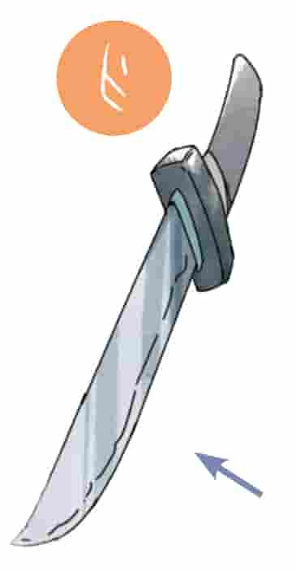

总结一下，指事字是在象形的基础上，添加一个标示性的指事符号，来表达新的字义。

许慎给指事举了两个例子，“上”与“下”。“上”和“下”太抽象了，怎么给它们造字呢？

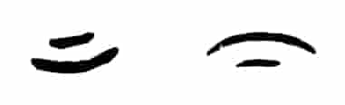

这两个就是“上”“下”的甲骨文，乍一看很像“二”。这两个甲骨文里，都有一个长横。在汉字中，长横经常用于表示大地，因为远眺地平线时，大地就是一道直线。在大地之上，加一个表示位置的小标签，就是甲骨文中的“上”；在大地之下，加上标签，就是甲骨文中的“下”。

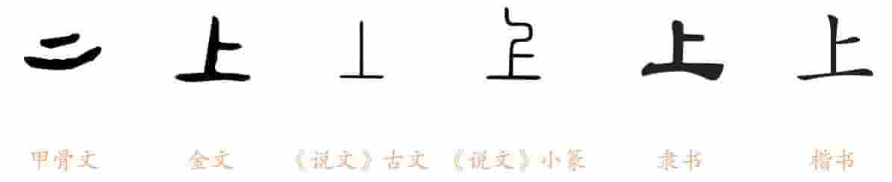

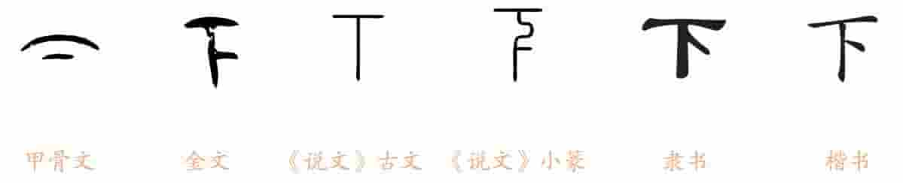

## ●指事字不常见

指事字是对象形造字的重要补充，但在汉字中，指事字的数量是很少的。

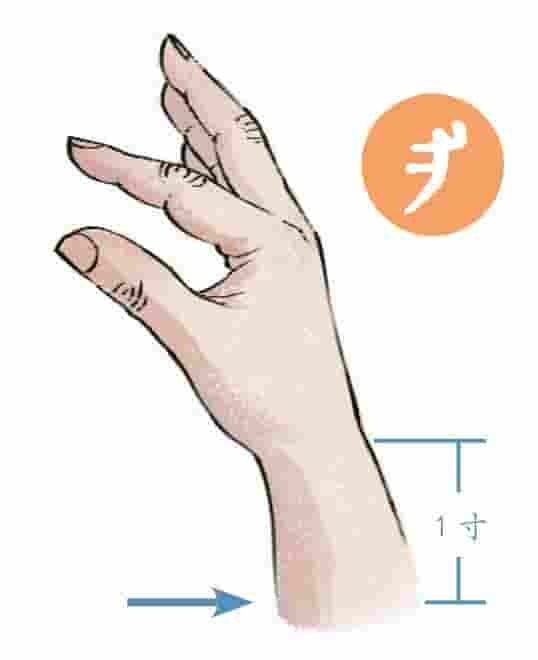

少到什么程度呢？常见的指事字，也许不超过二十个。正因如此，指事字在汉字中格外宝贵，物以稀为贵嘛！就这么点儿指事字，要不要好好了解一下呢？我现在就给你介绍几个有趣的指事字吧。

先看这个字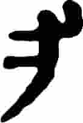，它的基础是一个“又”字——。在古文字中，“又”是右手的象形，伸出你的右手，自然放松，大拇指和食指分开，中指、无名指、小指轻轻地合拢在一起，从侧面看，和甲骨文中的“又”像不像？在汉字中，“又”经常表示手的意思，我们在后面还会讲到。

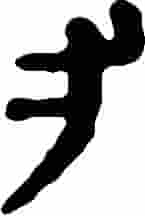是在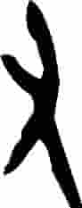（又）的下面多了一点，作为指事符号。在手腕的部位，加上一个小标签，猜猜看，这是什么字呢？

猜不出来吧，嘿嘿，我来告诉你，这是古文字中的“寸”。

咦，“寸”是个长度单位啊，它和我们的手腕有什么关系？

要知道，古代最早的丈量单位，很多都来自人体。人是万物的尺度，在尺子还未诞生的时代，我们用自己的身体丈量世界。我们的手腕上有一条横纹，在中医里叫作腕横纹。在你的腕横纹下面，用三个手指头一比，就是一寸，也就是中医所谓的“同身寸”——你的一寸，只有用自己的手指头才能量准。因此古人用一个小点标识出一寸的位置，造出了“寸”字。

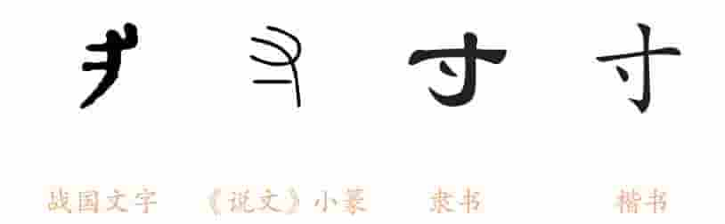

这个位置，有一个穴道，叫作内关穴。在腕横纹下面一寸，再找到两根筋，中间的位置就是内关穴。用力摁一摁，酸酸疼疼的，这是身体上非常重要的一个穴位。找找看，能不能按准自己的内关穴？

你看，汉字包罗万象，它和古老的中医文化也是相通的。

说完“寸”，再看这个字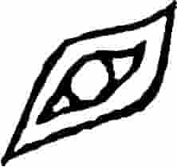。

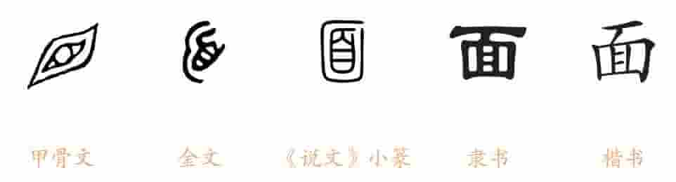

里面是一只眼睛，也就是“目”，外面一个框，包围着目字。这是什么字呢？是眼眶的“眶”吗？眼睛的外围又是什么呢？

其实，这个字是脸面、要面子的“面”，包围着“目”的框，是一种特殊的指事方式。在楷书中，“面”这个字里面也有个“目”，这是古文字的存留。明眸善睐的眼睛，给人留下的印象太深了，它不仅是心灵的窗口，也是颜面的象征。

## ●一个“木”变出三个字

再看这三个字，它们分别是什么呢？

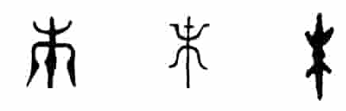

这三个字，有一个共同的基础，那就是中间有个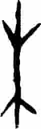（木）。是一个典型的象形字，惟妙惟肖地画出了一棵小树的样子。

在木的下面，树根的地方，加一个小横作为标签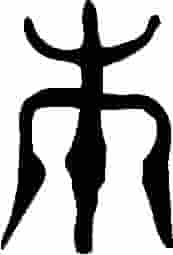，这就是“本”。“本”最开始是树根的意思，后来引申出“根本、基础”的意思。根扎牢了，树木才能茁壮成长，成为参天大树。做人之道也是如此，《论语》中说：“君子务本，本立而道生。”把握住人生的根本，才能不断地生发出君子之道。

在木的上面，树梢的地方，加一个小横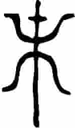，这个字是什么呢？这个字和“本”相对，是“末”，表示树枝的末梢，因此引申出最后的意思。所谓“末日”，就是最后一天。

在木的中间，树干的地方，加上一个小横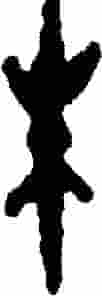，这个字又是什么呢？不好猜吧。这个字是“朱”。朱是红色的意思，它和树干有什么关系？我们看一看《说文解字》的解释，许慎先生说：“朱，赤心木也。”在大森林中，有一种特殊的树，它的中间是红色的。所以，在树干上加一个小标签，表示这是一种红心的木头，也就是“朱”。

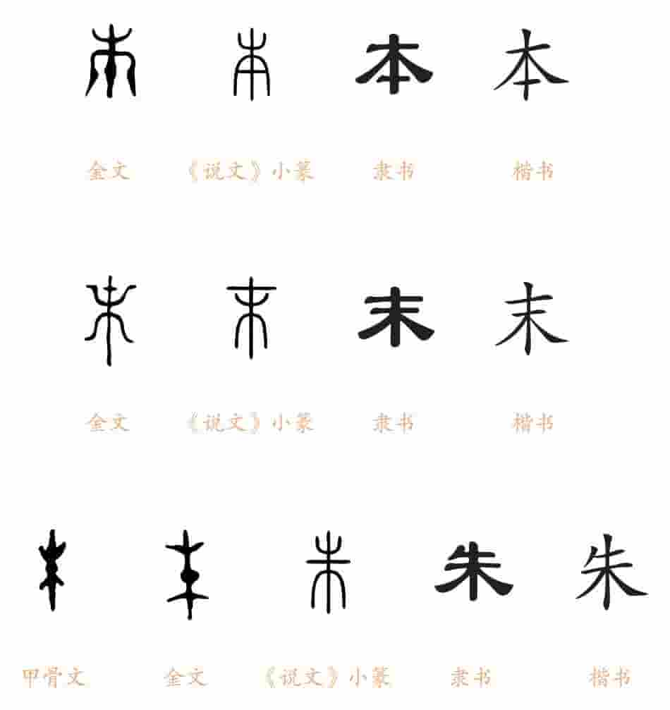

我为你介绍了一些最常见的指事字，在汉字中，还有哪些指事字呢？

想想许慎先生说的“视而可识，察而见意”，快去找找看吧！

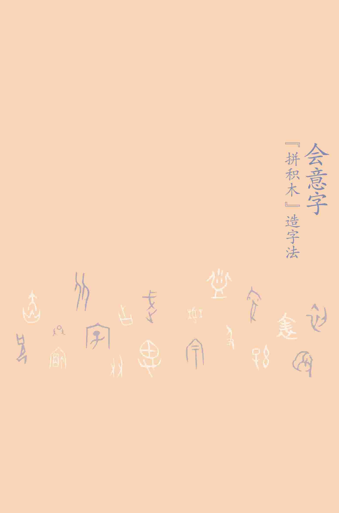

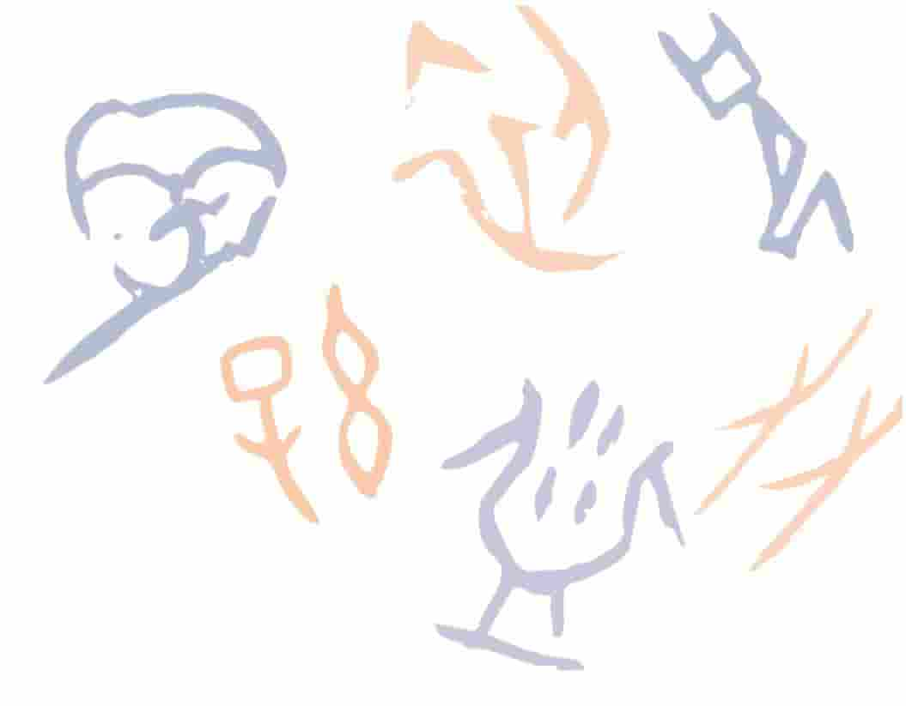

在发明指事字的时候，古人明白了一个道理——光用象形造字是不够的，必须要有更多的造字方法。他们的脑子里很快又蹦出一个新的想法，如果把不同的象形字拼起来呢？下面我要介绍的这种造字法，就是一种像拼积木一样的造字法——会意。

## ●“文”与“字”可不一样

在讲解会意字之前，我们需要先分清楚“文”和“字”。

什么？“文字”不是一个词吗？“文”和“字”不是一个意思吗？

当然不是，听我慢慢讲来。

象形字和指事字有一个共同的特点：拆不开。

回想一下，象形字是一个独立的字，拆开了，就不成字了，指事字可以拆分成一个字和一个标签，但标签——指事符号也不是字，因此指事字里也只有一个字。这样的汉字，我们叫作“独体字”，它们由图画演变而来，是一个整体，切分不开，都是些独来独往，单独成字的“独行侠”。

和独体字相对的，是“合体字”，它们喜欢热闹，喜欢抱团，是由两个或更多的独体字组成的新字，就像动画片里的合体变身一样酷炫。

合体字有两种，一种是这一讲要介绍的会意字，还有一种，是下一章要讲的形声字。

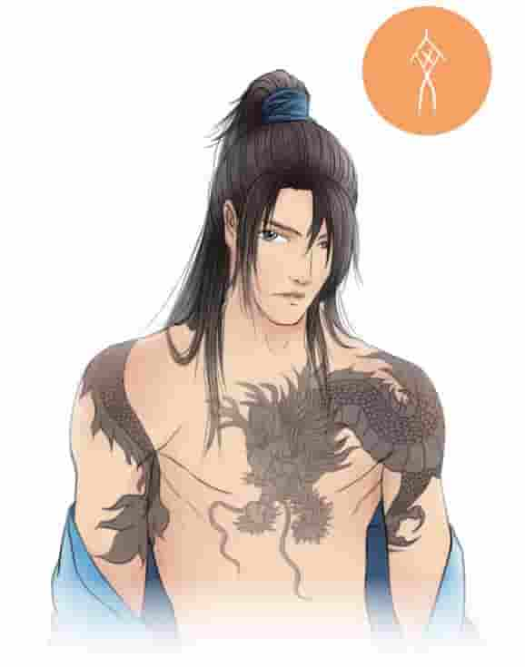

关于独体字与合体字，古人有专门的称谓——“文”与“字”。“文字”在今天是一个词，但在古人眼中，它们的意思是不一样的。

什么是“文”呢？

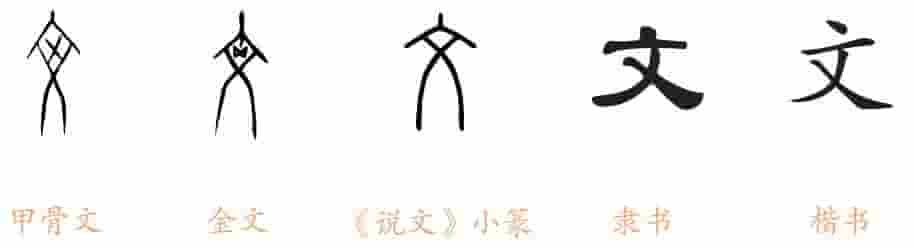

在古文字中，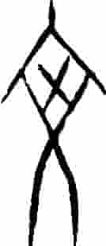（文）是一个正面站立的人形，身上画着五彩斑斓的纹样，它的本义是文身。漂亮的甲骨文和指事字，都像是美丽的图画，仿佛精美的文身一样，因此，古人用“文”来指那些用图画的办法造出来的独体字。

什么是“字”呢？

你看金文中，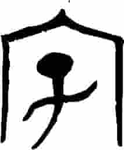（字）上面是一个“宀”，这是房屋的象形，下面是“子”，就像一个挥舞着两只手的小宝宝一样——在房屋中养育小孩子，所以，“字”有养育的意思，引申为不断生长。因此，“字”指那些在独体字的基础上，通过合体变身，不断滋生出来的合体字。

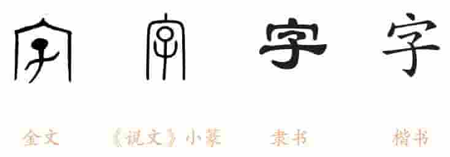

“独体为文，合体为字”，这是汉字最基本的分类。

由“文”到“字”，由独体到合体，汉字经历了一个不断生长的过程。在这个过程中，独体的“文”不断地合体、变化，造出各种各样的新字，像生命一样繁衍生息、昂扬生长，帮助古人更加准确地记录丰富多彩的世界。

## ●什么是会意字？

讲完了合体字，现在我为你介绍合体字中的第一类——会意字。

什么是会意字呢？

我们知道，一个字是有它的字义的，这就是“意”。“会”呢，有集合的意思，开班会就是一群学生聚集在一块儿。因此，会意字是把不同的文字像拼积木一样拼合在一起，“会”聚不同汉字的字“意”，从而造出新字，表达新义。

在《说文解字》中，许慎先生这样讲解会意字：“会意者，比类合谊，以见指㧑（huī）。”这句话看上去好难懂啊！简而言之，许慎的意思是，会意字是把两个或者多个形体的意义结合起来，来表达新的字义。

许慎先生给会意字举了个例子——武。

你喜欢看武侠电影吗？在荧屏上，侠客们飞来飞去、行侠仗义，是不是很潇洒？但你有没有想过，汉字“武”是怎么造出来的呢？它又具有怎样的文化内涵呢？

你看，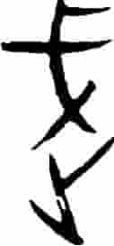是甲骨文中的“武”。下面是一个停止的“止”，上半边是一个“戈”。在先秦时期，戈是最常用的一种武器，我们在博物馆里，还能见到各式各样的青铜戈。“止”加上“戈”，两个字拼在一起，创造出一个新的字义“止戈为武”——停止干戈、阻止战争，这就是“武”的意蕴所在。

原来，我们一直理解错了“武”字，它不是武力，不是暴虐，不是厮杀和血腥，在它诞生之初，它其实寄托着一个美丽而远大的理想——缔造和平。

古人对“武”的解释真是极具丰富哲理！而且，这个解释不是许慎的独创，它的创造者是那位“问鼎中原”的楚庄王。

楚庄王是一位传奇的国君。根据《韩非子》记载，他继位的时候，年岁很小，朝廷中由权臣把握朝政。这位年轻的楚庄王怎么办呢？继位三年，他从来不发号施令，一天到晚游山玩水、饮酒作乐，潇洒极了。

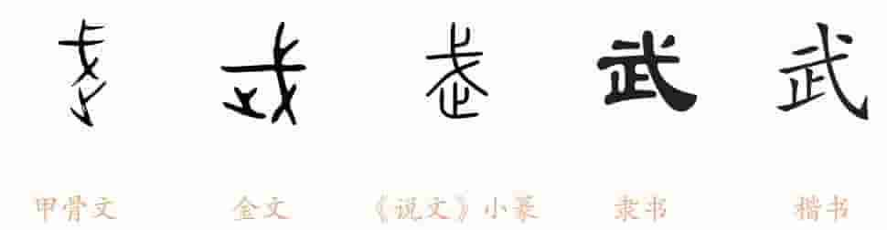

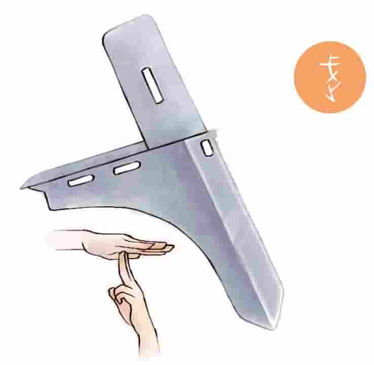

国君很颓废，一些忠心耿耿的大臣看不下去了。有位大臣想向他进谏，但楚庄王说过：“寡人烦着呢！谁也别给我提意见！”这可怎么办呢？

这位大臣想来想去，突然灵机一动，有主意了！他找到楚庄王，一脸神秘地说：“启禀大王！咱们楚国出了一件怪事！”

“什么怪事？”楚庄王正在喝酒，一下子来了精神。

“楚国郊区来了一只奇怪的大鸟，三年了，它一声也不叫，也没有飞，不知道是怎么回事？”

大鸟？三年？这明摆着是讽谏楚庄王无所作为。楚庄王又不傻，他放下酒杯，眯着眼睛看着大臣，缓缓地说：“爱卿，你是不懂这只大鸟的心啊！它不飞，是要让羽翼丰满；不鸣，是要观察人心。你看着吧，这只鸟三年不飞，一飞冲天，三年不鸣，一鸣惊人！”

于是，楚庄王开始飞翔了。他励精图治，提拔贤才，惩处昏庸无能的大臣，让楚国迅速强大起来。

楚国强大了，就要北上争霸中原。在春秋时期，北方强大的晋国和南方兴盛的楚国，在中原地带多次争霸。在楚庄王的带领下，楚国和晋国之间发生了一场大战！

根据《左传》记载，当时晋国派出了一支敢死队，跑到楚国大营前耀武扬威，进行挑战。按照常规，敌人来挑战，派出一支小分队迎击就好了。但是这位英武勇敢的楚庄王竟然亲自出马，带领队伍追杀过去。

楚庄王冲杀在队伍的最前方，王的军旗在风中猎猎飞扬。楚国大臣一看，“坏了！小心大王有危险！”怎么办？全军出阵！跟着大王往前冲杀！

当时，楚国军队“车驰卒奔”——战车奔驰，士兵喊叫着拼命冲杀，一时间烟尘四起，杀气冲天。晋国大将哪儿见过这阵势，好家伙，楚庄王这是要拼命啊！慌乱之中，他犯下了一个致命的错误：“先济者有赏！”

“济”是过河的意思，当时黄河在晋国军队的后方。“谁先跑过黄河，我就赏赐谁！”这个命令，等于鼓励临阵脱逃。于是，晋国军心大乱，纷纷溃逃，被楚国杀得落花流水。

大胜之后，有人向楚庄王建议：“把敌人的尸体都堆积起来，展示我们的军威！”没想到，勇猛善战的楚庄王拒绝了这个建议。他说：“止戈为武！”真正的“武”，是要能够停止干戈，战争的终极目的是奠定和平。我们现在做不到，但至少不要炫耀杀了多少人吧。

这个说法真精彩！

楚庄王对“武”的解释，反映出中国古人向往和平、期待和平的愿望。

一个“止”，一个“戈”，把两个字合起来造出新字，表达全新的意思，这就是会意字！

## ●人丁兴旺的会意字

在汉字中，会意字的数量比象形字、指事字加在一起还要多，真是人丁兴旺。

先看几个和“手”有关的会意字吧。在讲指事字的时候，我们介绍过“又”字，这是古文字中手的象形。接下来的几个字，都和“又”有关。

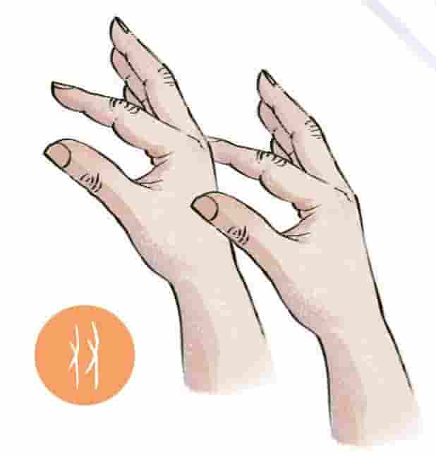

你看，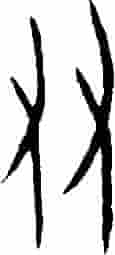是什么字？

从甲骨文到小篆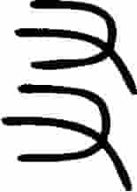，这个字的形体一脉相承，上面一个“又”，下面一个“又”，两只手，表达怎样的含义呢？

握手？拉手？掰手腕？

其实，这个字是古文字中的“友”。

你看，今天“友”上面的一横一撇，不就是（又）拉直之后的样子吗？

《说文解字》说：“同志为友。”什么是真正的朋友呢？

一方面，两个人要有共同的理想志向，有着共同的人生方向；另一方面，他们就像紧紧拉在一起的两只手一样，互相帮助、互相关怀、互相扶持。

两只紧紧握在一起的手，把“友”的内涵淋漓尽致地展现出来了。

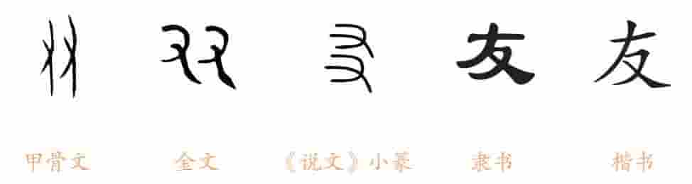

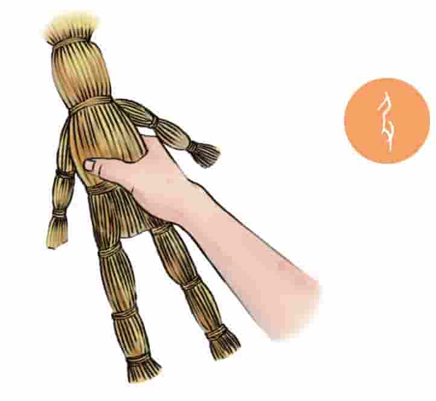

再看这个字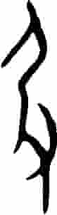，下面是一只手，上面是一个人，手牢牢地把人抓住，这是什么字呢？

这个字是古文字中的“及”。

什么是“及”呢？

《说文解字》说：“及，逮也，从又从人。”逮是逮捕的意思，也就是赶上，“及”的本义就是赶上、追上前面的人。在《宋史》中，有一家人在逃亡的过程中，“为金人所及”，就是被金兵追上，被抓住了。

了解了“及”的字义，我们也就明白了“及格”的意思。在这个词里，“格”是标准的意思，“及格”就是刚刚赶上某种标准。考试的标准是60分，及格就是考试成绩达到了这个标准。

还有《水浒传》中的好汉宋江，外号叫“及时雨”——赶在大旱时节，下了一场恰到好处的大雨，这就是“及时”的内涵。

“友”和“及”是简单的会意字，我们再看一个形体复杂的会意字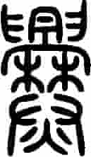。这个字笔画好多！看上去蛮有趣的，它是什么字呢？

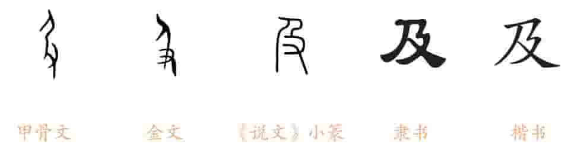

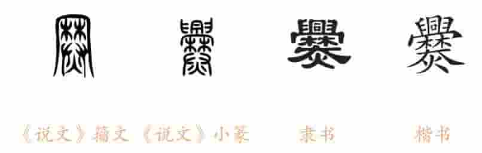

这个字是小篆中的“爨”，读作cuàn，是烧火做饭的意思。在《说文解字》中，许慎先生详细地分析了它的形体：“臼象持甑（zèng），冂为灶口，廾推林内火。”上面是两只手，拿着一个蒸锅，放到灶口之上。做什么呢？当然是要烧饭了。光有锅不行，还要点火。古人没有燃气灶、微波炉，做饭时要烧柴火，这个字的下面是灶口，里面点燃了熊熊炉火，还有两只手，不断地把木柴添进去……

“爨”是一个内涵丰富的会意字，把古人烧火做饭的画面，活灵活现地展现在我们面前。

总之，会意字把不同的汉字拼在一起，造一个新字，这种造字方式适合表达复杂的字义和丰富的文化内涵。

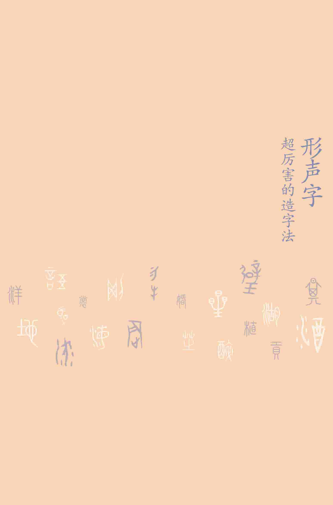

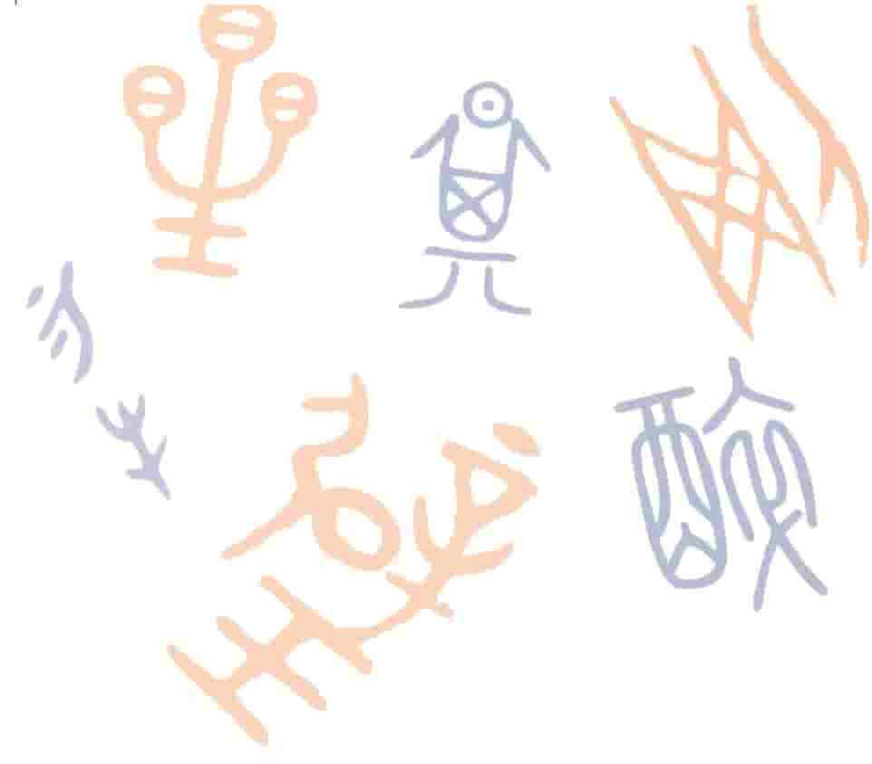

介绍完栩栩如生的象形字、数量稀少的指事字、姿态万千的会意字，这一章，我来介绍合体字中的第二类字——形声字。

这是一种超厉害的造字法。

## ●好用的形声字

形声字厉害在哪里呢？

好用！特别好用！

在汉字中，形声字是最常用的造字方法。根据统计，汉字中有将近90％的形声字——十个字里面，有八九个是形声字，你说它重要不重要？

什么是形声字？

许慎先生说：“形声者，以事为名，取譬（pì）相成。”形声字可以一分为二，一半是形符，一半是声符，形符表达汉字的意义，声符提示汉字的读音。

什么是形符呢？请看“溪、江、河、湖、海、洋”这几个字，它们表示大大小小不同的水系，都和水有关，因此都用“水”作为形符。“以事为名”，“事”是事物，也就是形符所表示的内容，“名”指汉字，“以事为名”指形声字以形符为基础来造字。

知道了形符的含义，声符也就不难理解了。顾名思义，声符表示汉字的读音。我们看“取譬相成”这四个字：什么是“譬”呢？就是打比方。形声字的声符和这个字的读音很像，但不是完全相同，就像给读音打个比方一样。还以“溪、江、河、湖、海、洋”这几个字为例，“溪、湖、洋”的声符是什么？分别是“奚、胡、羊”，声符和形声字的读音一样；“江、河、海”的声符是什么？分别是“工、可、每”，声符的读音和形声字不太一样。

为什么会有声符和形声字读音不同的现象呢？原因很复杂！有的是因为声符和形声字在古代读音一致，随着汉语的发展，今天的读音已经不同了，比如“工”和“江”；还有的是在造字之初，古人就选择了读音相近的字作为声符，比如“可”和“河”。无论如何，声符都能起到提示字音的作用。

注意！声符提示字音，而不是完全等于字音。在我们识字的时候，有一个很容易犯的毛病，那就是根据声符的读音来念形声字。所谓“秀才识字念半边”，不假思索地把声符当作形声字来读，是要犯错误的。

## ●形声字从哪儿来？

形声字是一种很好用的造字方法，它的来源是什么呢？

一开始，古人发明形声字，是为了强化字义。什么是强化呢？我们看这个字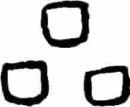，三个小方块，这是什么字呢？

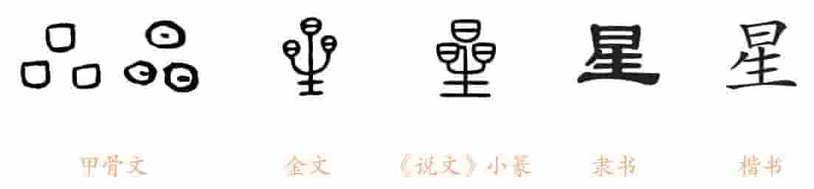

这个字不是品德的“品”，而是甲骨文中的“星”。古人仰观天象，看见天空中密布的小星星，于是画了三个小方块，代表众多星辰。可问题在于，有人非要说这是三块石头，怎么办呢？

这难不住聪明的古人，他们想了一个好办法。在几颗小星星下边加上一个“生”，“生”和“星”的读音非常像，古人想通过一个相似的读音，来强化“星”字的所指——别胡思乱想了，这不是小石头，也不是小点心，而是星星的“星”！

除了强化字义，形声字也能够分化一个汉字的不同意义。什么是分化呢？我再给大家举个例子：

甲骨文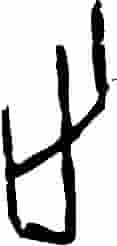是“止”，它是小脚丫的象形。下面是脚掌，上面是脚趾。你低头看看，像不像？

也许你会说：“咦！我明明有五个脚指头，怎么到了甲骨文中，就剩下三个了？”要知道，“三”在古代表示众多的意思，我们前面讲过的“又”“星”都是如此——三根手指，表示众多手指；三颗星星，代表星罗棋布。三根脚指头，足够代表你所有的脚指头了。

人的双脚站立在大地上，它们是人体的根基之处，因此，“止”引申出基址、地址的意思。可“止”又表示“脚趾”，又表示“地址”，还能表示“停止”的意思……这么多意思，会不会发生混淆呢？聪明的古人想了个好办法，给“止”加上不同的形符，表示不同的意义。

如果要表示脚指头，那就和“足”有关，于是古人添加“足”字作为形符，创造出脚趾的“趾”；如果要表示地址，建筑物和土地有关，于是古人添加“土”字作为形符，创造出地址的“址”；至于“停止”“静止”的意思，就写作“止”。

通过添加不同的形符，古人把“止”的字义清晰地区分开来，这就是形声字的分化功能。通过分化，汉字表达的字义更加清晰、准确。

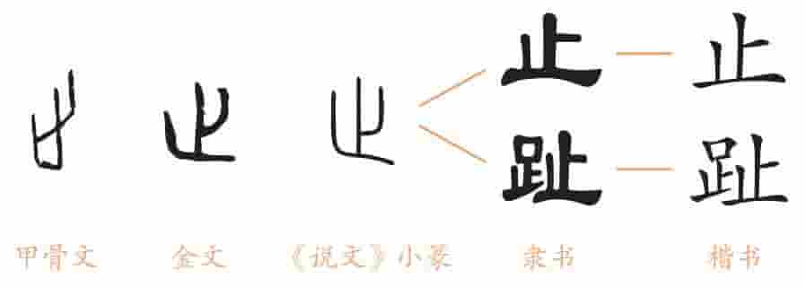

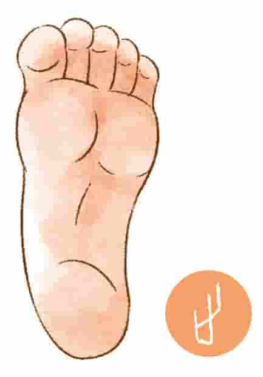

在强化和分化之外，还有很多形声字来自类化。什么是类化呢？有些相关的字，没有形符，古人为了汉字的规整，便给这一类字统一添加了形符。

类化产生的形声字往往是批量的。比如说，和金属有关的字，一般都加上了金字旁，于是有了“铜、钢、锡、铠”等形声字。和人有关的字，一般都加上了“单人旁”，于是有了“傍、他、佛、伯”等形声字。和小草有关的字，一般都加上了“草字头”，于是有了“芽、花、芙、莉”等形声字。和树木有关的字，一般都加上了“木字旁”，于是有了“枝、橘、棉、棚”等形声字。

这种一批一批出现的形声字，就是类化。

无论是强化、分化，还是类化，古人在不断地使用自己的聪明智慧，让汉字表意更清晰、分类更明确、汉字系统更完整。在这种追求中，形声字成了最常用、最好用的造字方法！

## ●形声字≠会意字

在学习六书的时候，要特别注意，不要把形声字和会意字弄混了。特别是有些形声字的声符是古代的读音，今天读起来已经不像了，很容易被误解为会意字。据说，赫赫有名的王安石也犯过这样的错误。

宋代的大政治家、文学家王安石，也是一位说文解字的爱好者。王安石研究汉字，写了一本书叫《字说》。有一次，大文豪苏东坡向他请教：“听说您研究汉字很有成果，给我讲讲‘波’这个字是什么意思吧？”

王安石一听，可高兴了。想不到才高八斗的东坡先生，也有向我请教的时候，我来告诉你吧：“波者，水之皮也！”

“波”应该怎么讲？它实际上是个形声字，从水皮声，“皮”的古音和“波”是一样的。但王安石不懂，他把“波”讲成会意字了，所谓波浪，就是水面上一层光滑的皮肤。听上去也蛮有道理的，对不对？

但聪明的苏东坡不以为然，他脑筋一转，反问王安石：“照您这么说，那‘滑’字，难道还是水的骨头吗？”王安石一听，默然无语，无法回答。

王安石的错误，是把形声字讲成了会意字。汉字是有系统的，我们可以像苏东坡一样举一反三——如果“波”是“水之皮”，那“滑”能是“水之骨”吗？“江”能是“水之工”吗？“河”能是“水之可”吗？完全说不通！

在学习汉字时，我们一定要避免这样的问题，要有一种汉字系统的观念，触类旁通、举一反三地去学习汉字。

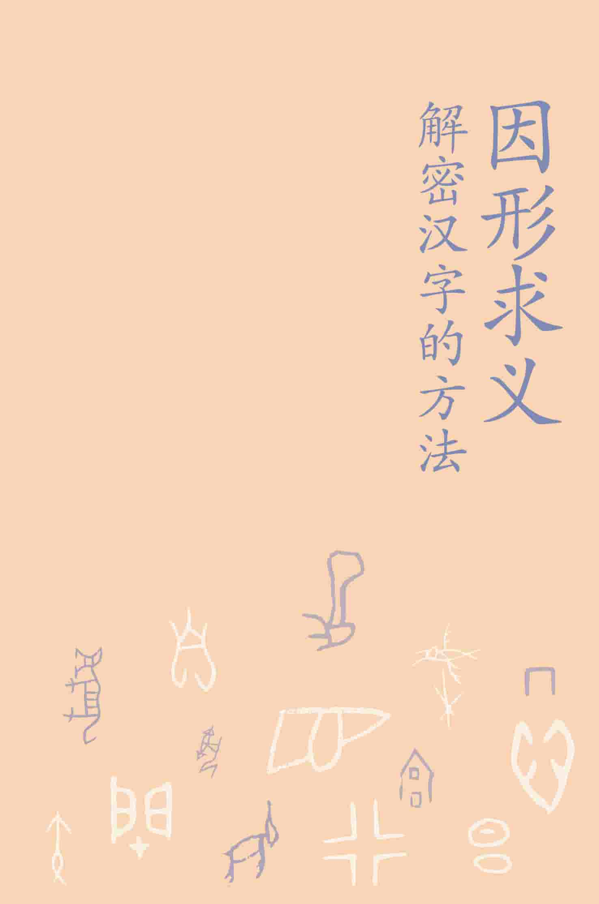

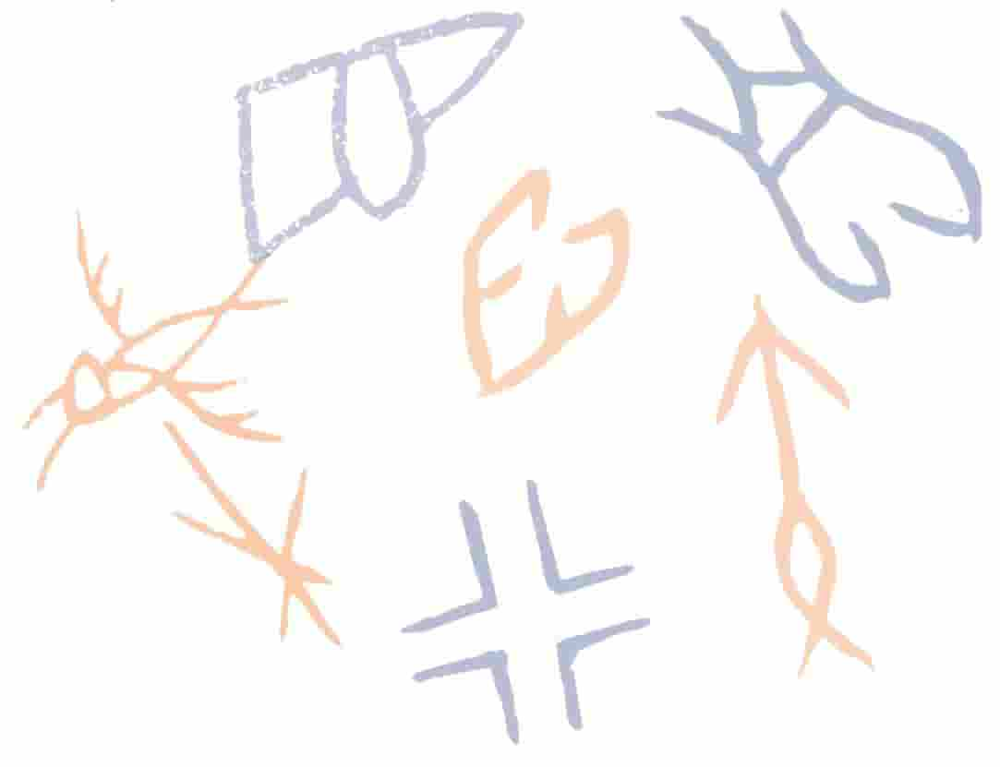

在前面的内容中，我给大家介绍了汉字的历史和造字的方法。这些知识，是解读汉字的基础。

可了解了这些知识，你可能还不太会运用。在这一章，我就给你介绍分析汉字，熟练运用六书解读汉字的实操方法——因形求义。顾名思义，因形求义就是利用汉字的字形来解读汉字的字义。自古以来，这都是一种重要的解释汉字的方法，有些因形求义的过程，就像福尔摩斯探案一样有趣呢。

## ●方法1：找到源头，看图识字

使用因形求义法，第一步要注意找寻汉字的源头。汉字是不断发展演变的，在时间的长河中，字形会发生变化，古人造字的用意也会不断丢失。因此，因形求义必须要找到比较古老的字形，追溯古人造字的真意。

比如，我们都知道的一位古代圣贤——周公。他的名字叫姬旦，姬旦，听上去有点儿像“鸡蛋”！他怎么起了这么一个名字？“旦”又有什么含义呢？

周公，是中国历史上的大政治家，他是周文王的儿子，周武王的弟弟。周武王打败商朝之后，很快就去世了，他的儿子周成王年纪还小，商朝的残余势力趁机作乱，周朝形势一下子岌岌可危。这个时候，周公挺身而出，摄持朝政，讨伐叛徒，建立起周礼的文化体系，奠定了周朝数百年的天下。在孔子看来，周公是古代制作礼乐的大圣人，他在学习礼乐的时候，还经常会梦到周公呢。

周公这么了不起，他的名字应该不会搞笑。就让我们化身福尔摩斯，运用因形求义法，去找到周公名字的真相吧！

简体的“旦”字看起来很抽象，让我们先追本溯源，看看“旦”在古文字中的写法。在甲骨文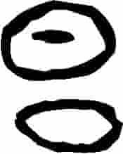和金文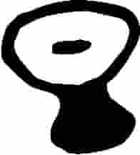中，“旦”上边的部分是“日”，下面像是土疙瘩，是大地的象形。在小篆中，“旦”的下面是一横，表示大地。之前我们讲“上”“下”时，它们都是用一横来表示大地的。由此可见，“旦”这个字，就是一轮朝阳从大地之上冉冉升起的样子，它有“朝阳”的意思。周文王给儿子起名字叫姬旦，寄托着一个非常好的寓意——这个孩子，将来是我周王朝的一轮朝阳，是希望的所在！

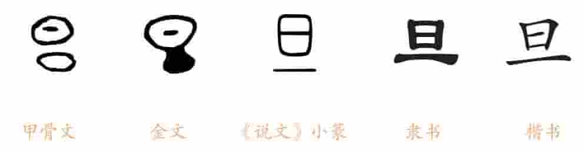

通过“旦”的古文字字形，我们猜出并理解了“旦”的内涵。这个过程是不是很像“看图猜字”游戏呢？汉字是表意文字，在造字的时候，古人根据字义来设计字形，字形和字义高度统一。因此，我们可以通过分析汉字的字形，来理解汉语的词义，这就是“因形求义”的方法。

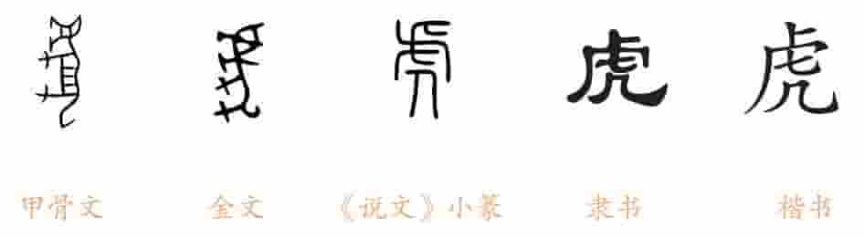

再举个例子，比如老虎的“虎”字，在楷书、隶书中，都看不出这个字的造字逻辑，小篆也不行，那就要一直上溯，找到金文和甲骨文。

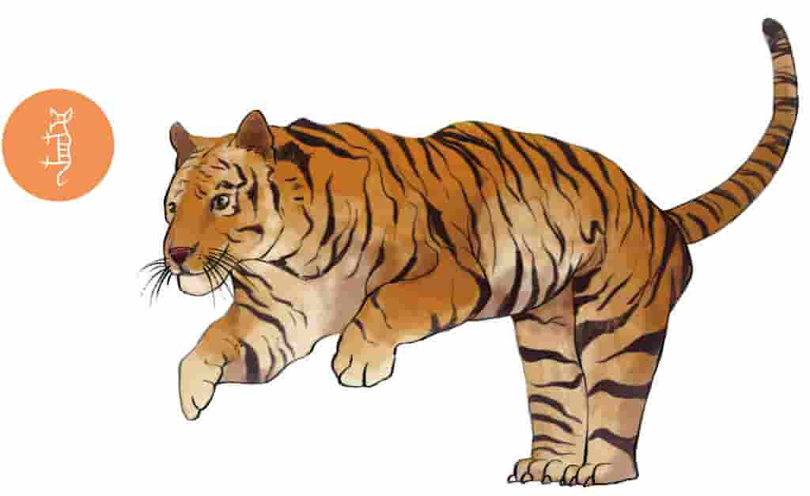

在甲骨文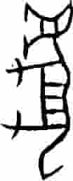中，“虎”是一个典型的象形字，惟妙惟肖地画出了老虎的獠牙、利爪，还有身上一道一道的斑纹。在甲骨文中因形求义，我们才能看到古人心目中，作为百兽之王的老虎，既凶猛，又威风！

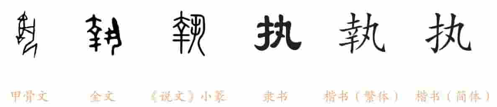

再举一个难点儿的例子——“执”。这个字有“抓住、拿着”的意思，手执红旗，迎风招展。在汉字中，“执”应该如何解释呢？它的造字逻辑是什么呢？

如果根据简化字，左边一个“手”，右边一个“丸”，手里面拿着一个热腾腾的大丸子，这就是“执”吗？不像话！接着上溯，我们看繁体字“執”——“执”成了一个“幸”福的小“丸”子，也不像话呀！

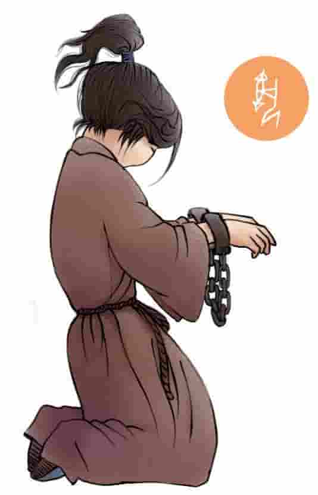

直到我们看到了甲骨文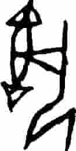，才能弄清“执”的含义。在甲骨文中，“执”的左边是一只手铐的样子，右边是一个跪着的人，两只手伸出去，被刑具锁得死死的。《说文解字》说：“执，捕罪人也。”“执”最初的意思是抓住坏蛋，把他们牢牢地锁起来。

中国古代有一部著名的史书——《左传》，里面记载说“执邾（zhū）悼公，以其伐我故”，这里的“我”指的是鲁国，也就是孔子的故乡。邾悼公是鲁国附近小国的君主，他去攻打鲁国，结果反倒被人家抓起来了，这就是“执邾悼公”。由此，我们梳理清楚了“执”的发展脉络，它的本义是牢牢地抓住，后来引申出“掌握、掌控”的意思，今天我们说“执行”“执掌”“执政”，都是从抓坏蛋的意思引申而来。

你看，找到古老的形体，就开启了分析汉字秘密的大门。

## ●方法2：使用“六书”，举一反三

使用因形求义法，除了找源头，还要注意的是，千万别把六书的知识忘掉了。一个字是象形字、指事字、会意字，还是形声字，对于准确理解它的意义至关重要。比如“执”字，一个罪人，手穿到刑具中去，这是典型的会意字。如果从形声字的角度去理解，就完全说不通了。

再比如说，“鹅”这个字怎么解释呢？

在分析六书的时候，我们说过，一定不要把会意字和形声字弄混了。犯这种错误的人还真不少，有人说，鹅和人的关系很亲密，左边是一个“我”，右边是一个“鸟”，鹅就是“我的鸟”，指和我们关系最亲密的一种鸟。这么讲似乎有点儿道理，但问题在于，其他家禽呢？如果我们以此类推，举一反三，就会发现按照这个逻辑，会闹出一连串的笑话：“鸡”是“又一只鸟”吗？“鸭”是“甲的鸟”吗？“鸿”是“江上的鸟”吗？这样讲解汉字，你说好笑不好笑？

会意字解释不通，我们可以试试形声字的思路。如果“鹅”是个形声字，那么“鸟”就是它的形符，而“我”可能是个读音不那么准确的声符。再举一反三一下，“鸭”的声符是“甲”，读音很像。至于“鸡”，它的繁体字是“鷄”，“奚”读作“xī”，和“鸡”的读音很像，作为声符也解释得通。这么看来，它们应该都是形声字。

## ●方法3：核对文献，找准“物证”

找到了汉字的源头，准确地分析六书，在因形求义法中，最后一个重要的步骤，是要核对古代的典籍文献，确定汉字的本义。解谜汉字，就像侦探一样，要找到语言使用的蛛丝马迹，相互印证。这些古籍，就像解开汉字谜团的“物证”一样。

举一个例子，你看“行”字。

现在的字形中，我们已经看不出“行”字为什么这么造字了，它怎么看都和双人旁、和“亍”没什么关系。让我们先上溯到汉字的源头，看看在甲骨文中，“行”是什么样子，又是什么意思吧。猜猜看！

甲骨文的“行”写作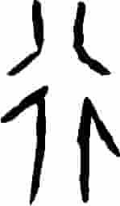，从六书来分析，这是一个很典型的象形字，古人画出一个十字路口，指的是大路大道，又引申出行列的意思。

现在，让我们去古文里找到物证，印证一下。

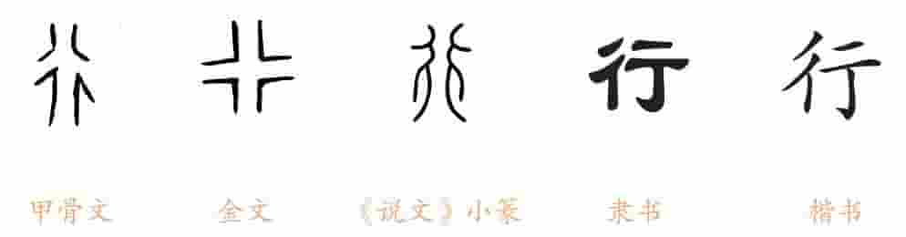  

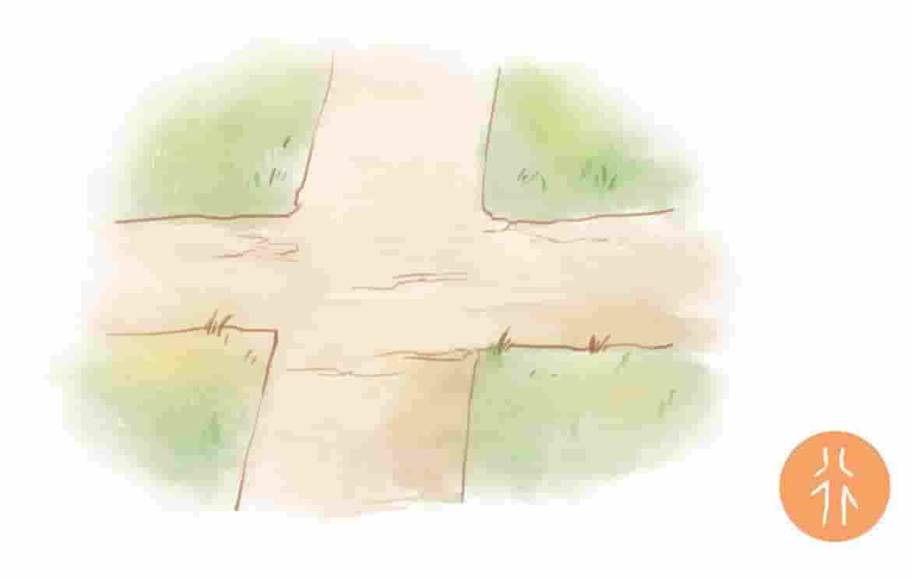

大诗人杜甫有句很有名的诗：“两个黄鹂鸣翠柳，一行白鹭上青天”，用的就是“行列”的意思。在《诗经·小雅·鹿鸣》篇中，有一句“人之好我，示我周行”，这里的“行”是“道”的意思。诗人说的是，怎么叫作对我好呢？不是给我零花钱，也不是给我糖吃，而是要给我一个“周行”——周全的、完整无缺的大道。

经过验证，“行”确实表示道路。它现在的样子，是汉字发展演化中，字形发生变化的结果。

现在让我们反观“银行”一词，什么是银行呢？“银”是古人用的货币，“行”是大路，银行其实就是金银财富往来之所，是货币流通的地方，是财富来来往往的大道。这么解释，是不是非常清晰呢？

最后总结一下，因形求义三部曲——找古字、辨六书、查古书，一个都不能少。

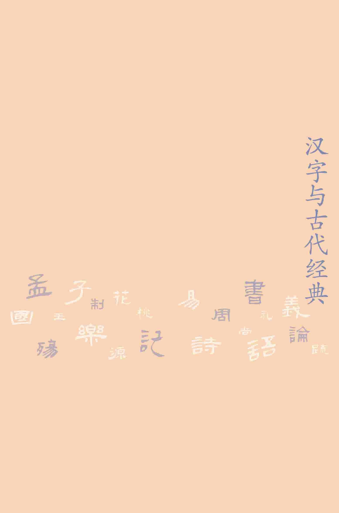

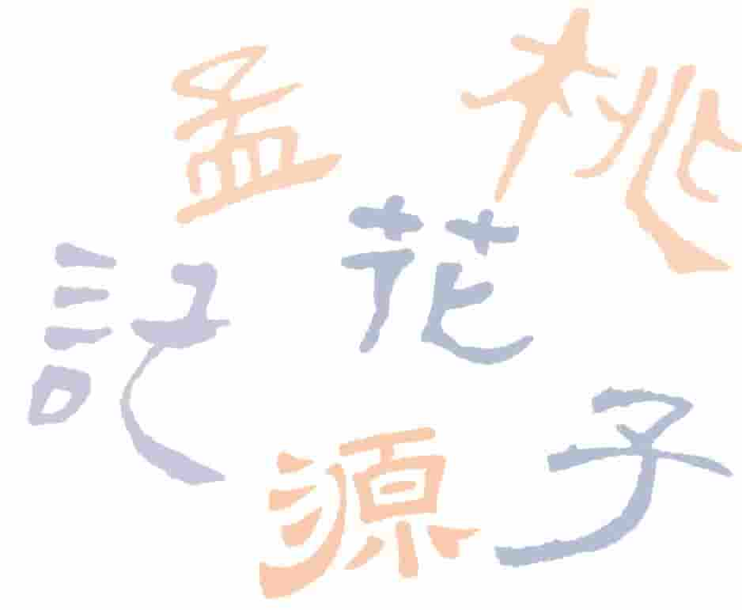

通过前面的讲解，我们基本掌握了汉字的知识和应用。而掌握汉字的目的，是为了更好地理解祖先留给我们的精神财富——古代典籍。在阅读古代经典的时候，如果从古老的汉字出发，来解读那些历史悠久的文本，往往能有很多意想不到的收获。

汉字是一把奇特的钥匙，能够为我们开启古书中的奥秘。让我们以最熟悉的一句经典为例，那就是《论语》中的第一句话：

“学而时习之，不亦说（yuè）乎？”

“说”是“悦”的假借字，这句话是说，学到知识后时常温习，不是一件令人心生喜悦的事吗？这句话我们太熟悉了！从上小学的时候，老师就会教这句话。问题是，虽然熟悉，但未必能解读透彻。理解这句话，需要思考一个非常真实的问题：学习是快乐的吗？

回味一下我们的人生经历，从幼儿园到小学，从小学到中学，将来还要参加高考、进入大学，你是否能拍着胸脯说，我的学习是快乐的！还真不一定。那么，孔子为什么要说他的学习很快乐，他又“乐”在何处呢？想要理解这些问题，关键要读懂四个汉字——学、习、时、说。

## ●孔子的课程表

在讲解“学、时、习、说”之前，我们先要了解一下孔子的课程表。孔子当时要学习“六艺”，这是先秦时期重要的教学内容。什么是“六艺”呢？根据《周礼》（一部讲解古代礼乐、政治的经典）中的说法，“六艺”是礼、乐、射、御、书、数。它们体现为三个层次的教育内容：

第一个层次是礼乐教育，主要用于涵养一个人的道德品质。“礼”是周代以来的文化传统，它是一整套待人接物、处世为人的法则。对礼的学习，就是在一个人的行为规范中，让他掌握做人的道理。古代礼乐相配，行礼的场合往往需要奏乐。如果说，“礼”主要是培养一个人的行为规范的话，“乐”则是对一个人的心灵、性情的陶冶。在古人看来，一个沉浸在雅乐中的人，自然会呈现出一种温和文雅的品质。

第二个层次是“射”和“御”的教育。“射”是射箭，“御”是驾车，这是古人投身沙场、保家卫国的必备本领。先秦时期，战争以车战为主，大诗人屈原在《国殇》中写道：“霾（mái）两轮兮絷（zhí）四马。”[1]一车四马，战士在飞奔的马车上弯弓搭箭，射杀敌人。“射”和“御”之间需要整体配合，这是古代君子的能力素养，也是他们保家卫国的社会责任。

第三个层次是“书”和“数”的教育。“书”是识字，“数”是计算，这是一个人要掌握的文化知识。

“礼乐”教育是涵养品德，“射御”教育是掌握本领，“书数”教育是获取知识。我们看到，古代教育有三个层次——学品德、学本领、学知识，它们指向一套完整的人才培养体系。这种教育是“动手动脚”的，特别注重实践。要知道，我们的古人可不是端坐在课堂上，老老实实地听讲，“礼”和“乐”需要演练，“射”和“御”需要实操，这是一种全方位的、使人活动起来的学习。和今天的学习内容相比，“六艺”教育丰富多彩，一点儿也不枯燥。

## ●学：开启生命的觉悟

仅仅是学习内容的丰富，就会让人在学习中“不亦说乎”吗？也不尽然。了解了先秦的课程表之后，我们要进一步理解“学”的精神实质。什么是“学”？先秦古人眼中的“学”有着怎样的精神内涵？让我们从古老的汉字说起。

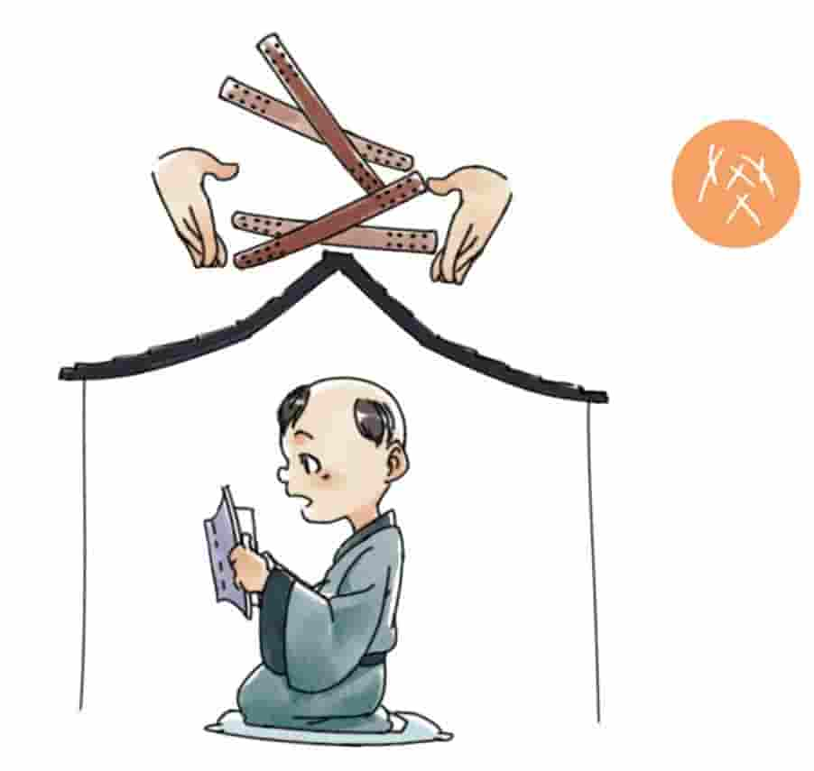

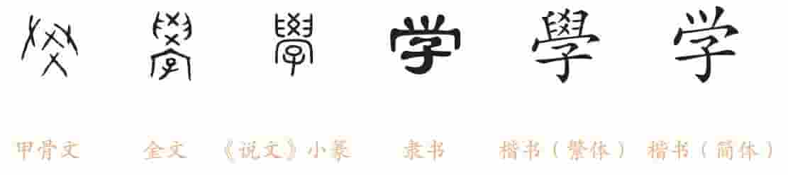

早在甲骨文中，就已经有“学”了。到了金文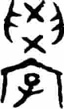和小篆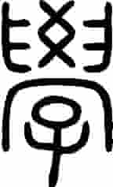，基本已具备了“学”的字形结构。

你看，“学”的上面有两只手，手里拿的是“爻”。有人说，“爻”与算卦有关，指的是《周易》中卦爻的符号；也有人说，“爻”就是算筹，是一种算算数的教学工具。无论如何，它都是古人学习的内容。

在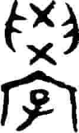的下面是一个“子”，谁来学习？当然是小朋友了！在“子”的上面，还有一个类似房屋建筑的形状，一般认为它代表了古代的教室。

不过，《说文解字》对这个形体有另外一种有趣的解释。许慎先生认为，“子”上面是“冖”（mì）。

什么是“冖”呢？

在介绍金文的时候，我们说过，古代用鼎烹饪。鼎的个头不小，煮的饭经常一顿吃不完。如果食物没有吃完，古人就会用一个布做的盖子罩在鼎上，这个罩子就叫“冖”。

我们可以想象一下，如果一个人被罩住了会怎样？《说文解字》中解释说：“冖，尚矇也。”一个人的心灵被遮蔽起来，就像被罩子罩住了一样，长期处在蒙昧之中，缺乏生命的自觉。而“学”的实质，就是要通过不断地教与学，来打破心灵的蒙昧状态，开启混沌的罩子，给心灵迎来真知的光明。

因此，“学”的本质是一种精神觉悟，这种觉悟不仅是指掌握了多少知识，更是要找到自己的人生方向，找到生命的意义与价值。

## ●习：勤劳不懈的实践

和“学”相配的“习”字，它的含义又是什么呢？我们今天常说“学习”，在古人看来，“学”和“习”还不太一样。它们的区别是什么呢？还是要从汉字说起。

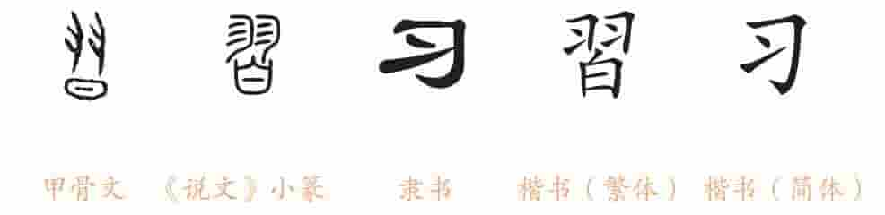

你看，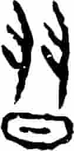是甲骨文中的“习”。这个字上面是“羽”，下面是“日”。到了小篆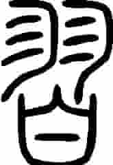，下面变成了“白”，这个字形是繁体字“習”的来源。《说文解字》根据小篆字形解释道：“习，数（shuò）飞也。”所谓“数飞”，就是多次飞行。无论是“白”还是“日”，“習”的字义都清晰明白，是小鸟在白日里学习飞翔。小鸟学飞，总是“扑棱扑棱”呼扇着翅膀，跟着大鸟从一个枝头飞到另一个枝头上，如此反复多次，才能单飞。既然是反复学飞，“习”一定有实践的含义！

通过汉字的讲解，我们看到，“学”是精神觉悟，“习”是行为实践，它们是一个人成长学习过程中，不可或缺的两个方面。在“学而时习之”中，体现出心灵觉悟和行为实践的统一，这也是儒家传统中的“知行合一”。

## ●时：把握自然的节奏

觉悟和实践的统一，建立在“时”的节奏之中。对于“时”，可以有两种理解，第一种是“按时”，“学而时习之”指要按时学习。该上课了，该读书了，你不能还在睡懒觉。第二种是“适时”，要在合适的时间做合适的事。两种理解并不矛盾，按时学习很好懂，那什么是适时学习呢？

在魏晋南北朝时期，有一位学问家叫皇侃（kǎn）[2]，他在《论语义疏》中，对于“时”与“学”的关系，有着非常精彩的说解：

夫学随时气则受业易入，故《王制》云“春夏学《诗》《乐》，秋冬学《书》《礼》”是也。

所谓“时气”，指的是一年四季各有特点。古人认为，学习时要根据四季的特点，安排不同的学习内容。《王制》是周代天子的学习制度，里面说，“春夏学《诗》《乐》，秋冬学《书》《礼》”。

什么意思呢？

春天万物苏生，意气洋洋，每个人都活泼欢快。这个时候要学《诗》。要知道，“诗者，志之所之也”，《诗》是性情的抒发，因此要在春天学习，让我们的心灵与大自然一起生发、一起昂扬。

到了夏天，万物繁盛，因此要学习气象宏大的雅乐，共同振奋。

再到秋天，万物肃杀，这是一个收敛沉潜的季节，应该学《尚书》。在《尚书》中，有古代的历史，也有尧舜禹等上古先王的教导，在一个严肃的季节里，正好可以走进先王的历史传统。

最后是冬天，大地冰封，安静肃穆。因此可以学习礼仪，培养做人的规矩。

在一年四季中，大自然的节律与学习内容形成了完整的统一体。“学而时习之”，就是要根据大自然的节奏展开学习，把内心的精神觉悟落实到行为实践之中，落实到每个人具体的生命过程中。通过这样的学习过程，人不仅收获了知识，更能收获一种生命的充实与拓展。也正是这种成长的收获，给人带来发自内心的喜悦。

## ●说：心开意解的快乐

说到“说”，我们知道，“说”是“悦”的假借字，这究竟是怎样的一种快乐呢？

也许你会说，“悦是喜悦，是属于内心的快乐”。没错，《孟子》中记载，孔子的弟子对孔子是“中心悦而诚服也”，也就是“心悦诚服”。

但我接着问你，这份内心的快乐，又是怎样的快乐呢？

在语言发展的浩瀚长河里，“悦”和“脱”“蜕”来自同一个源头。在古代，它们的读音是相同的，声符都是“兑”，在意义上也相近。“脱”有“解”的意思，“解脱”嘛。而“蜕”则是动物蜕皮，是把外面的一层硬皮“脱”下来。

这几个字的共同特点，是在意义上都有一种“开解”的感觉。由此可知，“悦”不只是简单的快乐，而是一种“心开意解”的欢喜。遇到一道难题，百思而不得其解，突然灵光一现，思路来了，这就是“悦”；有件事死活想不通，心里打了个结，有人一句话点醒了你，这也是“悦”。

我们读过陶渊明的《桃花源记》，里面有一段很著名的描写：“便舍船，从口入。初极狭，才通人，复行数十步，豁然开朗。”可以说，“悦”就是生命中的豁然开朗，这是一种彻底的开解与觉悟。

解读了“悦”字，我们看到，在“学而时习之”和“不亦说乎”之间，存在着极为紧密的搭配关系——在“学”和“习”的互动中，在知行合一的收获中，我们才能收获由衷的“悦”，收获这种心开意解的精神至乐。可以说，“学而时习之”代表着孔子根本的人生方向，那就是一个平凡的生命，如何通过不断地觉悟与实践，不断达到无限的高度与可能。

汉字的根本特点是“形义统一”，在汉字的形体中，蕴含着丰富的汉语词义的信息，也承载着历史悠久的中华文化。通过对“学、习、时、说”四个汉字的讲解，你是不是懂得了更多中华文化，对“学而时习之，不亦说乎”也有了更深刻的理解呢？

经过这十三章的分享，我们对汉字有了新的认识——汉字，是通向中国文化的桥梁。走过这座桥，你会走进一个多姿多彩的世界。我们探寻汉字的奥秘，也是在探索中华文化的美丽画卷。希望这套小书可以给你一些有益的启示，让你看到一个不一样的汉字世界，从而掌握推开中华文化大门的能力。

* * *

[1] 出自屈原《九歌·国殇》，整句为“霾两轮兮絷四马，援玉枹兮击鸣鼓”。

[2] 皇侃（488—545），南朝梁经学家，吴郡（今江苏苏州）人，通《三礼》《论语》《孝经》。著有《论语义疏》《礼记讲疏》《礼记义疏》《孝经义疏》等，仅《论语义疏》存世。

 后记

这套小书，由我在“博雅小学堂”为小朋友们讲授《说文解字》的讲稿整理而成。

带领孩子们走进汉字世界，探寻汉字的前世今生，并非易事。如何把握汉字知识的“度”，哪些适合讲，哪些不适合讲？如何做到知识性与趣味性的结合？如何面对汉字的历史来源与释义发展之间的张力？如何通过汉字更为深入地理解我们的语言？如何从汉字出发走进中国文化的广阔天地？对这些问题，我们进行了积极的思考与尝试，是否得当，还请亲爱的读者们多多批评！

成书之际，我要感谢赵凌女士、任小平女士，她们策划了这门课程；感谢楚怡兄在课程讲授过程中的高水平工作；感谢《青年文摘》的周玲女士，刊发了这套书的部分内容；感谢责任编辑李炜兄和张苗苗女士，对醉心学术而不断拖稿的笔者，给予了充分宽容；“小博集”做书的水平，亦远超我的预期。感谢尹梦、方伟杰、张燕语、王鹤凝、高铭婉、陈子昊、张祎昀等同学的协助整理，特别是张燕语君，帮我搜集了清晰的古文字字形。恍然之间，有的同学已离开了我们，自今视昔，伤逝何如！

当然，最应该感谢的，是那些听我课程的、读我作品的小朋友！希望这套小书，能让你们喜欢上古老而神奇的汉字——它，是中国文化的根壤所在，也是每一个中国人心灵深处的文化基因。

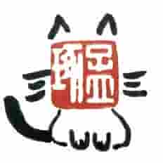

庚子仲夏于北京师范大学晓韵楼

