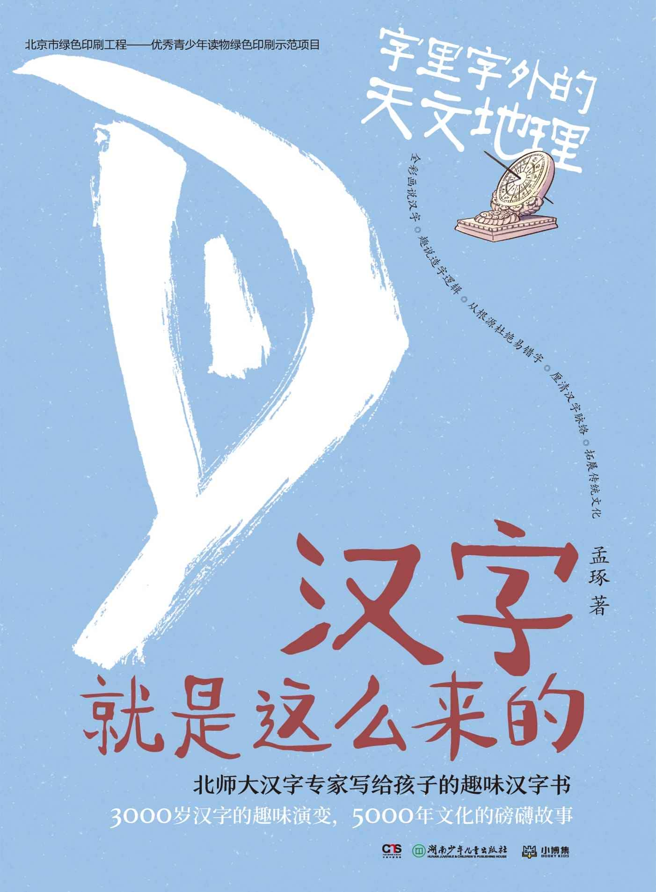

# 版权信息

书名：汉字就是这么来的·字里字外的天文地理

作者：孟琢

出版社：湖南少年儿童出版社

出版时间：2020-08-01

ISBN：9787556251940

本书由天津博集新媒科技有限公司授权亚马逊发行

版权所有 侵权必究

# 目录  
CONTENTS

**日 
日·旦·星 汉字里的太阳 

早·暮·时 太阳与时间 

暴·暑·晕 这些字很“热” 
**

**月 
月·夕·夜 汉字里的月光 

间·明 月色入门窗 

望 举头望明月 

期 与月亮一期一会 
**

**雨 
云·雨 “行云布雨”的汉字 

电·雷·震 电闪雷鸣，震耳欲聋 
**

**水 
水·川·州 一去不回东流水 

溪·河·江 小溪潺潺，江河滚滚 

湖·海·洋 湖光山色，海纳百川 

法·准 以水为平，以法为准 

冰·寒 “冻煞人”的汉字 
**

**土 
土·地 滋生万物的汉字 

金 金光闪闪的金属 

社 土地的神灵 

基 古人如何筑墙？ 
**

**阜 
阜·陟·降 让人误解的偏旁——阝 

陵 帝王的坟墓 

险·阻 克服山的险阻 

阴·阳 阴阳大道里有座山 
**

**屮 
屮·草·卉·芬 草字头的故事 

生·性·端 生命的开端 

芝·萱·兰 灵芝起死，萱草忘忧 

毒 有毒的汉字 

姜·蒜·葱 姜辛蒜辣葱嫩 

春·蠢 小草破土，大地回春 
**

**木 
木·林·森 参天巨木，茂密森林 

本·末·朱 木有本末，断木为朱 

树·植 十年树木，百年树人 
**

**火 
火·炎 熊熊烈火 

然·赤 不像火的火 
**

**更多有趣的汉字 
气 天地有正气 

山 高耸入云的山峰 

丘 头顶凹陷的小丘 

石 悬崖下的山石 
**

# 日

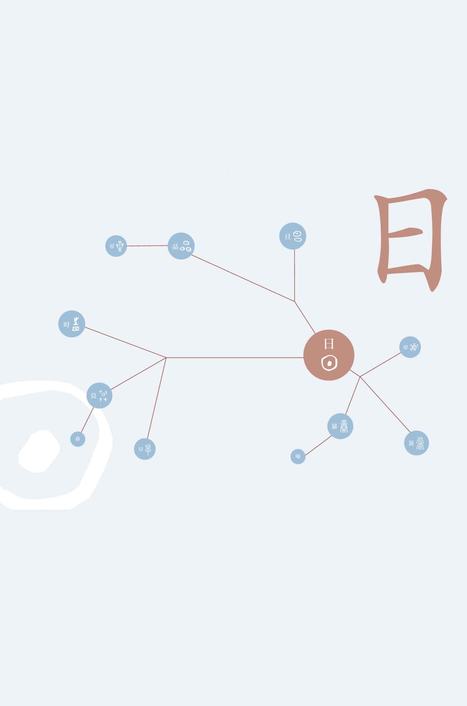

## 日·旦·星  
汉字里的太阳

中国古人在造字的时候，仰望天空，俯瞰大地，将天空和大地纳入笔下。在汉字里，有高高在上的“天”，有坚实厚重的“地”；有时间的“早晚”，有季节的“寒暑”；有“日月星辰”，有“雪雨风霜”；有高耸入云的“山峰”，有奔流万里的“江河”；有山间叮叮咚咚的“溪水”，有一望无垠的“海洋”……汉字世界是一个森罗万象的宇宙。

从这宇宙中的哪个字讲起好呢？不如从头顶那轮照耀古人与你我的太阳——“日”开始吧！

### 日/ “日”是一个象形字 /

“日”字非常简单，是一个标准的象形字。

什么是“象形字”呢？古人在造字的时候，用绘画的方式描绘出事物的样子，由于画得很像，所以这类字就是象形字。

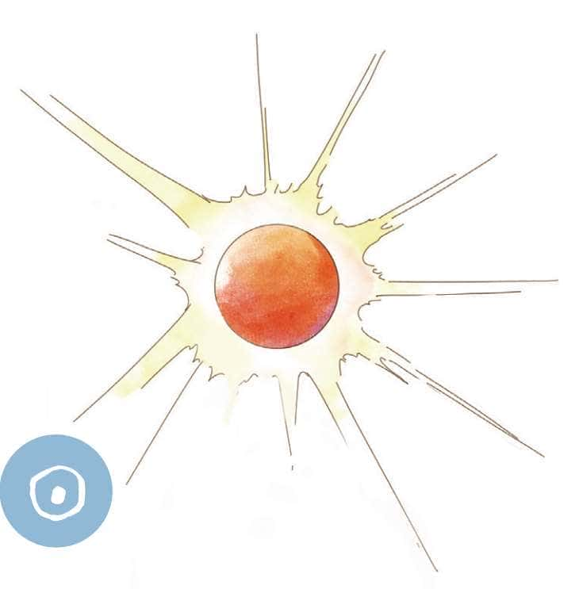

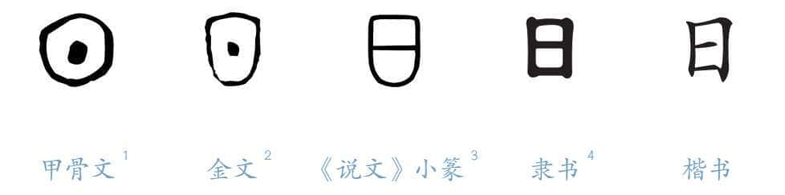

**1.** 甲骨文是目前能看到的最古老的汉字，它是中国商周时期的文字，因为刻写在龟甲兽骨上，所以被叫作“甲骨文”。

**2.** 甲骨文之后的文字叫金文，也叫“钟鼎文”，是商周时期铸刻在青铜器上的文字。我们见到的青铜器大多数是青黑色的，但它刚刚铸造出来的时候，其实是耀眼夺目的金黄色，所以叫“金文”。

**3.** 战国时期，各诸侯国的文字不同，严重影响诸侯国之间的交流。秦灭六国之后，除了统一国土，也统一了度量衡，统一了文字，规定了标准字体——小篆。

**4.** 隶书由篆书简化演变而成。小篆字形规整、端庄大方，但不易书写。秦国以法治国，政令繁多，大小官吏用小篆书写，效率不高，于是他们在办公过程中自觉地简化了汉字，用一种简便的字体书写了大量的公文，这便是隶书。从小篆到隶书发展演变的过程，叫作“隶变”。

在《说文解字》[1]中，作者许慎先生是这样讲解“象形”的：“象形者，画成其物，随体诘诎，日月是也。”什么意思呢？“画成其物”，指象形是用绘画的手段来造字的，“物”是汉字所要表达的事物。“随体诘诎”，指象形字要惟妙惟肖地画出事物的形体，“体”是事物的形体，“诘诎”指古人用弯弯曲曲的笔画，来描绘出事物的轮廓。最后，许慎先生举了两个例子：日和月。

古人先画了一个圆圈表示太阳，为了和普通的圆圈区别开来，就在圆圈中间加了一个点，写成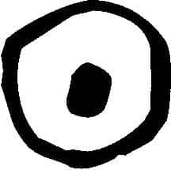，表示这是太阳，它充满光芒。许慎先生说：“日，实也。”太阳的光芒宛如实质，没有空缺，和月亮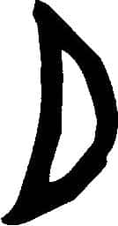形成了鲜明的对比。

### 旦/ 太阳跃出地平线 /

太阳跃出地平线，便是“旦”。

在金文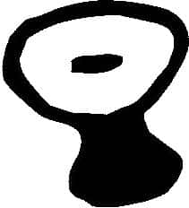中，上面的部分是一个“日”，下面表示大地。到了小篆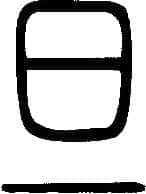，太阳下面的大地简化为了“一”。

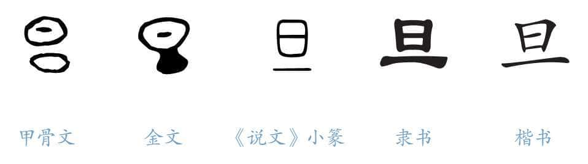

“旦”这个字，就是一轮旭日从大地之上冉冉升起的样子。

### 星/ 星星里藏着三个太阳 /

讲完了太阳，我们再来看与太阳同为天体的夜间繁星。

星星是从哪儿来的呢？

在古人心中，天空中的星星来自大地上了不起的神灵和人物，这就是许慎先生所说的“万物之精，上为列星”——万物中最重要、最精华的存在，死后会飞升天上成为星星。

无论中国还是西方，人们都认为星星和我们的命运紧密相连。因此，中国有星宿（xiù）之说，西方有星座之说。

中国文化中，不同的星星构成了二十八宿。有的星星代表吉，比如福星、寿星、禄星；有的星星代表凶，比如灾星、祸星、扫把星[2]……古人根据星辰的运转来推演节气、制定历法，乃至判断吉凶祸福。北宋时就设有“司天监”这一观察天象、占卜吉凶的国家机构。古人认为，天体按规律运转是天地秩序的象征，天象的变化、星星的运转，都是对人世间福祸吉凶的预示。比如太阳，在古人眼中就是皇帝的象征，日食意味着皇权被大臣影响，是大臣背叛皇帝的亡国之象。紫微星（即小熊座β星），也是皇帝的象征，在古代被称为“帝星”。而在西方文化中，不同的星星组成了一个个星座，人的性格、运势等都和所属星座有关。

总之，无论是在东方文化还是在西方文化中，星星和人的关系都非常密切。

古人是如何创造“星”字的呢？

用肉眼看，太阳要比星星大得多。但如果懂一点儿天文知识，便会知道，星星是因为离我们太遥远，才显得那么小。其实，许多星星比太阳还要巨大。古人在造“星”字的时候，是知道这一点的，他们用三个“日”来表示闪烁的星星——星星本质上和太阳差不多。

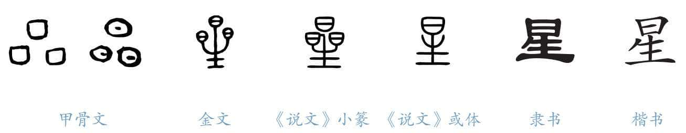

为什么是三个“日”，而不是四个或者五个？

因为古人习惯用三来表示多，比如三个“人”合在一起，表示熙熙攘攘的“众”人；三个“木”合在一起，表示茂密的大“森”林。

“星”在甲骨文中由三个“日”组成，这三个“日”有的加点（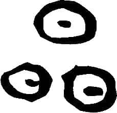），有的不加（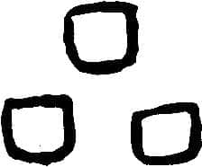）。但是问题在于，用三个“日”来表示星星，就和“晶”重复了。大家看到这个字，可能会产生疑问：这到底是“星星”的“星”，还是“亮晶晶”的“晶”，怎么区分它们呢？

这难不住聪明的古人，他们想出了一个好办法——在“晶”的下面加一个“生”字。为什么呢？因为“生”和“星”的古音非常相近，所以“生”就作为声符，表示“星”的读音。就这样，“星”由象形字变成了形声字[3]，从晶生声，有了小篆字形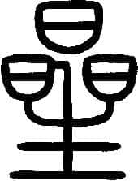。

“晶”和“星”区分开后，古人又面临了一个新问题：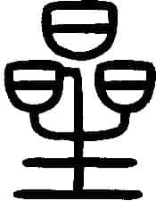笔画繁复，不利于书写。于是，古人将上面的三个日省略为一个日，造出了今天的“星”字。

* * *

[1] 《说文解字》是中国历史上第一部系统分析汉字字形、讲解汉字字理的字典，简称《说文》，作者是东汉的许慎。在体例上，它开创了部首编排法；在内容上，它用六书系统地解说汉字，并保存了部分早期古文字的写法，为我们研究甲骨文、金文等提供了依据。六书是六种汉字造字法，包括象形、会意、指事、形声、转注和假借。

[2] 古人所说的扫把星就是拖着长长尾巴的彗星。古人认为扫把星的出现不正常，认为它会带来战祸、灾难和厄运。

[3] 形声是古人造字的一种方法。形声字大都可以一分为二，一半是形符，一半是声符。形符表达汉字的字义，声符提示汉字的读音。比如“江”“河”“湖”“海”，它们表示大大小的水系，都和水有关，“水”是它们共同的形符。“工”“可”“胡”“每”则是声符，用来表示它们不同的读音。

## 早·暮·时  
太阳与时间

古人最初对于时间的感受，来自太阳的东升西落，因此“日”在汉语中可以表示时间。我们会说“日月”“日期”，也把一天叫作“一日”。古代还有一种说法叫“日新”，取自《大学》中圣人商汤[1]的一句话：“苟日新，日日新，又日新。”所谓“日新”，就是每一天都要进步，每一天都要有新收获，每一天都要呈现出新面貌，这是一种积极向上的好品德。

时间的运转和太阳的起落息息相关，于是“日”衍生出了“早”“暮”“时”三个常见的与时间有关的字。

### 早/ “早”与“十”有什么关系？ /

一天，从太阳升起开始，也从“早”开始。

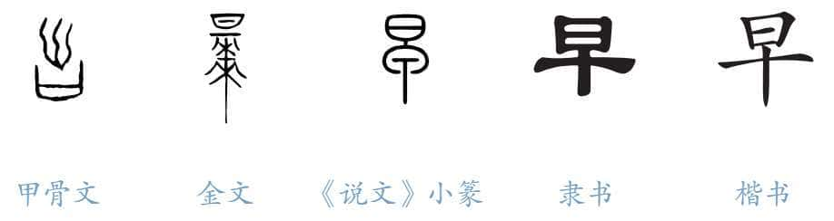

“早”上面是“日”，下面是“十”。这个字可不是十个太阳的意思。在小篆里，“早”写为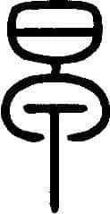，它的下面不是“十”，而是“甲”。在古代用来纪年、纪日、纪时的天干地支中，“甲”是天干的第一个字，干支纪年一个循环的第一年被称为“甲子年”。因此，“甲”暗含着排序第一的意思，古人把第一等级叫作“甲等”，古代科举中也有“名列三甲”的说法。因此，“日”加上“甲”，表示一天的开端，太阳刚刚照到大地上的时候。《说文解字》说：“早，晨也。从日在甲上。”它是一个典型的会意字。

### 暮/ 披着夜色的汉字 /

看完旭日东升，再看夕阳西下、暮晚时分，让我来讲讲“暮”。

“暮”字最早写作“莫”。从甲骨文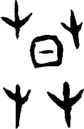和金文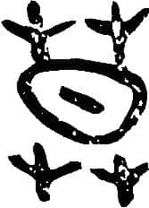的字形来看，“莫”字中间是个太阳，旁边有四株小草，画的是太阳落山，隐没在草丛之间。“莫”最初的含义是傍晚时分、日暮降临。

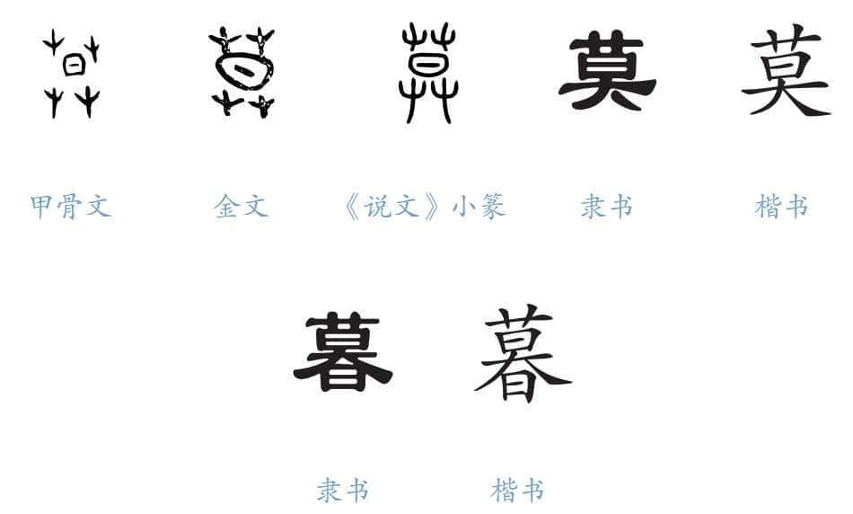

太阳消失不见，便是没有。古人慢慢地就用“莫”表示没有、不的意思，比如“君家有凫舄[2]（fú xì），切莫向云间”，“切莫”便是务必不要，意思是说不要用仙术飞向云间。

在汉字的发展和演变中，“莫”既表示没有，也表示傍晚，两个意义相差很大，容易混淆。于是，古人对“莫”字进行了分化，用“莫”表示没有的意思，再在“莫”下面加上了一个“日”，造出“暮”字，表示傍晚时分之义，用于“暮色”等词。

### 时/ 时间是一寸一寸的吗？ /

早和晚是一天的起止，它们不断往复，意味着时间运转不息。

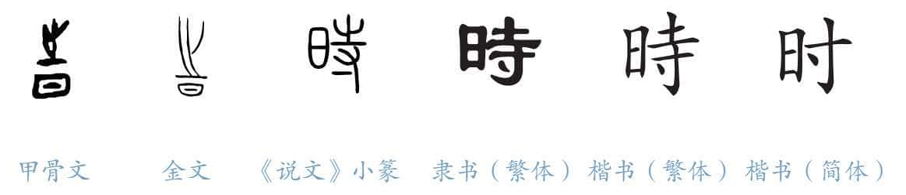

古人在时间无尽的流逝中，感受冬去春来，四时变化，并创造了日晷（guǐ）、铜壶滴漏、圭（guī）表、二十八宿圆盘等计时工具，也创造了“时间”的“时”字。《说文解字》说：“时，四时也。”“四时”是一年的四季，是最基本的时间单位之一，因此古人用它作为时间的通称。

“时”字由“日”和“寸”组成，这是不是说“一寸光阴一寸金”呢？

不是的。人们很容易误把“时”当成会意字。“会意字”是把不同的文字拼合在一起，组合它们的含义，从而造出新字、表达新义。比如“休”字，左边一个“人”，右边一个“木”，两个字的意思合在一起，就是一个人靠着大树休息。因“时”字由“日”和“寸”组成，而把“时”解读为“一寸光阴一寸金”，便是错把它当成了会意字。要知道，“时”字被创造出来时，“一寸光阴一寸金”这句诗还没有诞生呢。

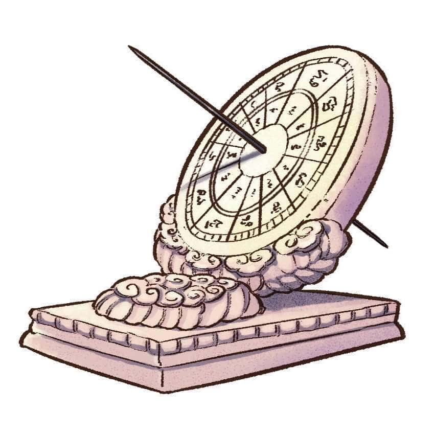 
日晷

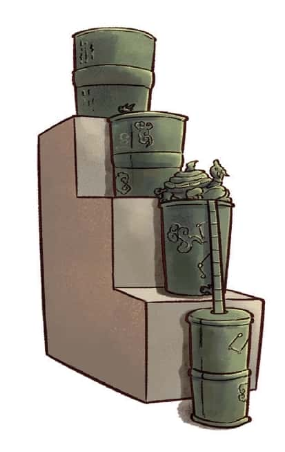 
铜壶滴漏

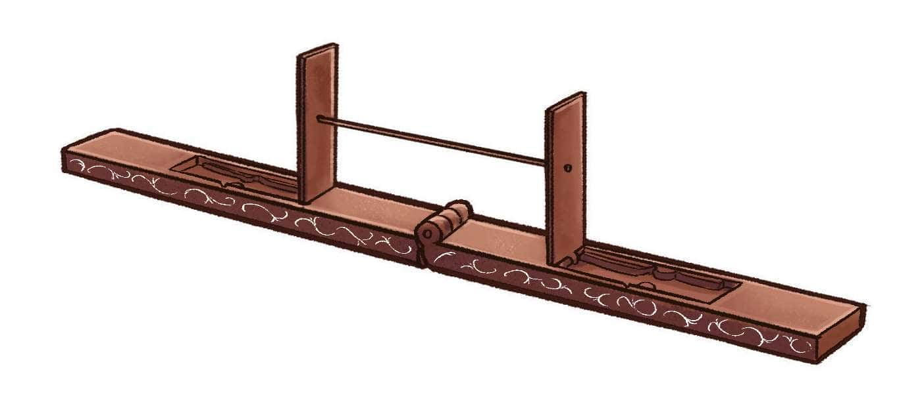 
圭表

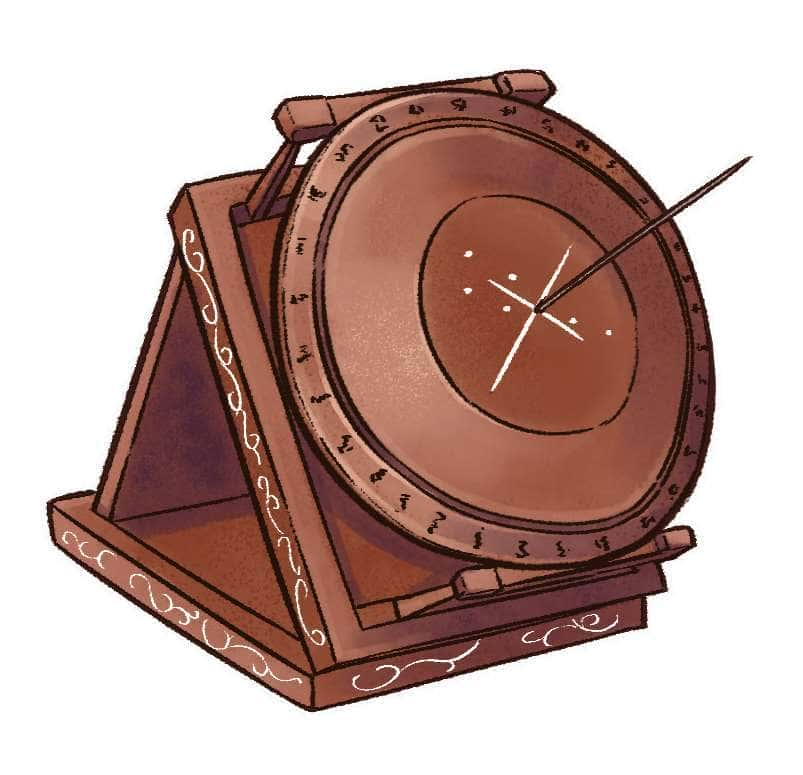 
二十八宿圆盘

那“时”和“寸”究竟是什么关系呢？还是让我们先来看看“时”字的繁体写法吧。“时”的繁体字是“時”，它的左边是“日”，右边是“寺”。它如果是会意字，应该解释为太阳照射寺庙。可阳光不会仅仅照在寺庙里呀！所以，“時”当然不是会意字。

其实，“時”是从日寺声的形声字，“寺”表示读音。后来，随着汉字的简化，“寺”简写成“寸”，“時”便变成了“时”。

其实在古人看来，时间不是一寸一寸的，而是一节一节的。请看“时节”一词。“节”是竹节的意思，竹节把竹子分成一段一段的，时间也是如此：一年被分成四季，一天被分成上午、下午、晚上，也可以被分成十二时辰[3]，抑或是我们熟悉的二十四小时。古人造出的“时节”，被写入了很多诗人的千古佳句。大诗人杜甫有一首著名的诗《春夜喜雨》：

好雨知时节，当春乃发生。

随风潜入夜，润物细无声。

野径云俱黑，江船火独明。

晓看红湿处，花重锦官城。

在这首诗里，雨水仿佛通人性，知道春天是万物生长的时节，及时降临，无声无息地滋润万物。

古人还有一首充满禅意的诗：“春有百花秋有月，夏有凉风冬有雪。若无闲事挂心头，便是人间好时节。”一年四季有各不相同的美好：春天百花盛开，秋天明月高悬，夏天偶有吹来的凉风，冬天有皎洁冰莹的瑞雪。如果心中没有“闲事”、没有烦恼，无论什么时候都是人间的好时节。

古人在诗意中走过春夏秋冬，感悟四季时节运转不息的永恒。儒家学派创始人、至圣先师孔子更曾有“四时行焉”的感慨。

有一天，孔子对子贡说：“我不想再跟你们讲什么道理了。”

子贡问孔子：“您要是不跟我们讲道理，那我们该传述什么呢？”

孔子说：“天何言哉？四时行焉，百物生焉，天何言哉？”这句话的意思是，我不说话，上天不也是不言不语吗？尽管上天从不开口，但四季运转不息，万物成长不止。

孔子观察四季，感悟到四时与天道运转不息，我们每个人的努力和修养也不应停止，不应总依靠别人的教导，这就是“天行健，君子以自强不息”的道理。

* * *

[1] 汤，亦称“武汤”“武王”“天乙”“成汤”，甲骨文中称“大乙”，又称“高祖乙”。他是商朝的建立者，将商朝建都于亳（bó）（今地有河南商丘、山东曹县、河南偃师三说）。汤是商族的首领，经十一次出征，后一举灭夏，建立了商朝。我们熟悉的商纣王，就是他的子孙。

[2] 凫舄，指会飞的仙鞋，喻指仙术。

[3] 我们的祖先把一天分为十二段，叫作十二时辰。一时辰相当于现在的两小时。这十二时辰分别是：子、丑、寅（yín）、卯（mǎo）、辰、巳（sì）、午、未、申、酉（yǒu）、戌（xū）、亥（hài）。

## 暴·暑·晕  
这些字很“热”

春夏秋冬，四时之中夏季最为热烈奔放、充满生机，又酷热难耐、使人焦躁。说到夏天，人们总是立刻想到炎热的太阳。接下来我要为你介绍的三个字——“暴”“暑”“晕”，都和太阳有关，蕴藏着炎热的力量！

### 暴/ “暴力”的太阳 /

“暴”一般念作bào，但它其实是个多音字，也念pù，是暴晒的意思。

这个字的小篆字形非常有意思！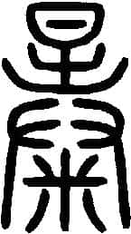由四个部分组成——上面是“日”，中间是“出”，一左一右的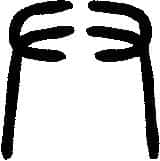是两只手。最下面是什么呢？那可不是“水”，从小篆字形可以看出那是“米”。“暴”是一个十分形象的会意字。米储存在粮仓里，时间久了容易受潮。太阳出来了，人们就用双手把米捧出来，放到广场上晾晒，这就是“暴”的来源，它记录下了古人在太阳下晒米的生活经验，呈现出一幅鲜活的劳动图景。

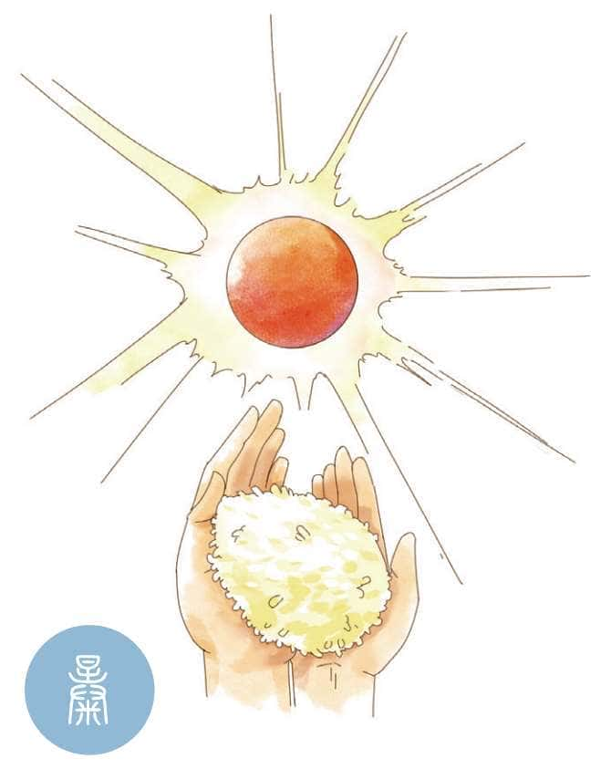

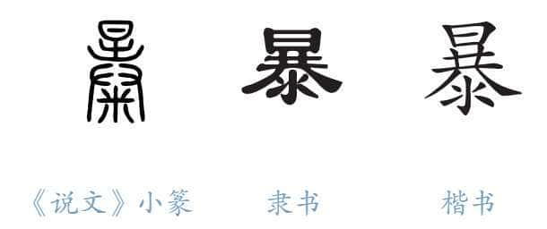

后来，古人给“暴”添加了一个日字旁，变成“曝”，一是指晒，如“一曝（pù）十寒”[1]；二是用于“曝光”，指使用照相底片或感光纸感光，或比喻隐秘的事（多指不光彩的）显露出来，被众人知道。

至于“暴”的用法，则充分展现出古人在词义引申中的想象力。“暴”的本义是晒，晒在大庭广众之中、朗朗乾坤之下，于是就有了显露的意思，用于“暴露”“暴尸街头”等词。此外，“暴”字里酷热的阳光，代表一种强有力的状态。因此“暴”也用于“暴躁、暴力、残暴、暴打、暴揍、暴击、暴政”等。有的人可能会纳闷：晒太阳明明是一件很舒服的事情呀，为什么会和“暴躁”“暴力”等不好的词联系上呢？

理解汉字，需要结合古人的生活体验。在古代，老百姓的日常劳动以农耕为主，他们最怕太阳暴晒。炎热的太阳会让“面朝黄土背朝天”的农民汗流浃背，还可能会导致旱灾，给他们的生活带来毁灭性的打击。因此，在古人心中，灼热的阳光是有伤害性的。《水浒传》中有一首“烈日歌”，描述的就是烈日灼晒的场景：

赤日炎炎似火烧，野田禾稻半枯焦。

农夫心内如汤[2]煮，公子王孙把扇摇。

太阳像火烧一样，将禾苗晒枯晒焦。“农夫心内如汤煮”的“汤”是热水的意思，农夫着急得像心中有热水在煮。而那些不从事劳动的公子王孙呢？他们却逍遥自在，摇着扇子乘凉休息。

现在很多人不曾下地劳作，对太阳暴晒的感受更接近“公子王孙”。但如果回到古代劳动人民的生活环境，你就会知道，被太阳暴晒的滋味实在痛苦。因此，“暴”字可以表示凶狠、猛烈的含义。

### 暑/ 为什么叫“中暑”？ /

被太阳晒久了，就可能会“中暑”。可你知道，这种病为什么叫“中暑”吗？

“暑”是一个形声字，从日者声。“者”是声符，它和“暑”在古代的读音相近。《说文解字》说：“暑，热也。”“暑”的特点就是热。

之所以叫“中暑”呢，是因为“中暑”就跟中枪、中弹一样，意思是人受到了“暑”的伤害。

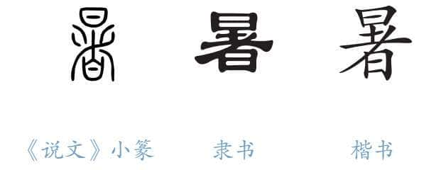

现代人防暑，有风扇、空调、冰激凌，古人怎么防暑降温呢？

其实，古人也有“冰箱”。中国国家博物馆里，珍藏着一件来自数千年前的战国时期的神奇文物——冰鉴。这是一种由青铜制成的酒器，其历史可以追溯到西周。《周礼》记载的西周礼乐中，就有“祭祀共（供）冰鉴”的说法。

冰鉴又是怎么制冷的呢？冰鉴包括外部的方鉴和内部的方尊缶（fǒu）。方尊缶用于盛酒，方鉴和方尊缶之间放置冰块。古人以冰制冷，在炎炎夏日便拥有了沁入心脾的冰镇酒饮。

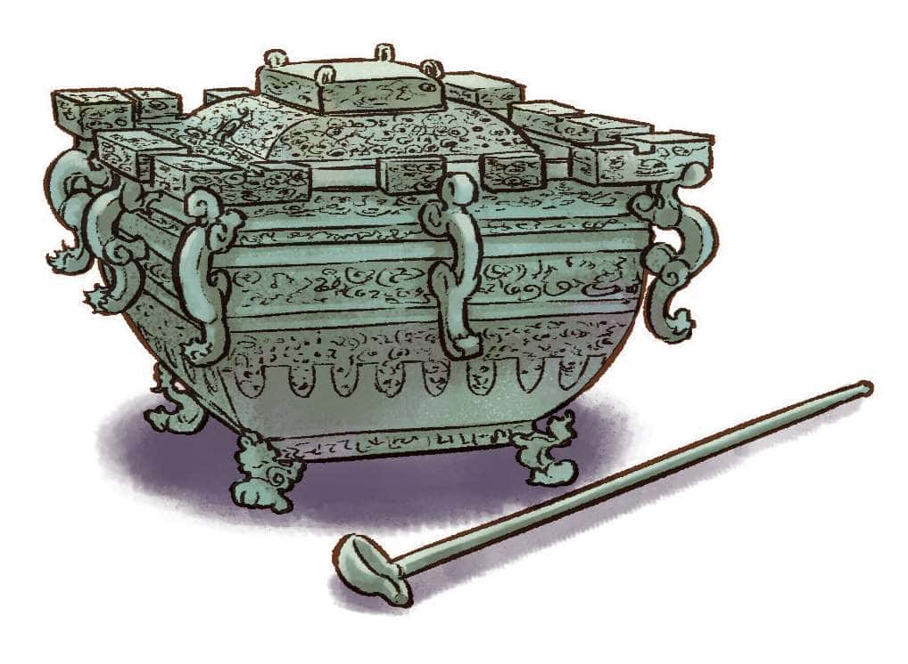 
冰鉴

### 晕/ “晕”和太阳有什么关系？ /

在古代，用得起冰鉴的人实在是少数。将冬天的冰存储在冰窖里待夏天使用，花费不菲，普通人承受不起。老百姓没办法避暑，在太阳下劳动、暴晒，很容易中暑头晕。下面要讲的便是“晕”字。

“晕”是一个形声字，上面是“日”，下面是“军”，从日军声。虽然我们今天常说“头晕”“晕倒”等词，但是，“晕”的本义可不是晕倒。“晕”的本义是什么呢？《说文解字》说：“晕，日月气也。”要注意，这里的“晕”读yùn。

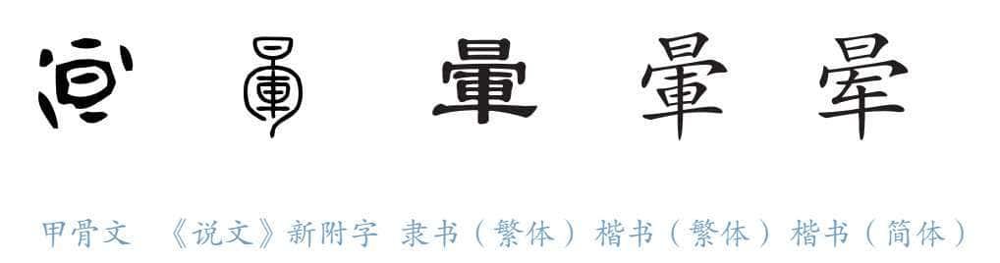

什么是“日月气”？这可不是说太阳月亮生气了，而是指环绕着日月的光圈。甲骨文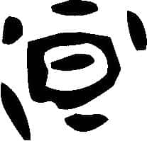形象地画出了太阳（日）被光晕围绕的样子。不仅太阳如此，在有云的夜晚赏月时，仰望天空，你也可能会看到月亮周围仿佛环绕着一团白气，那是月光经云层中冰晶的折射而形成的光圈。这就是“晕”的本义。

日月周围的光晕呈环绕的状态，人晕倒的时候，会觉得天旋地转。因此，“晕”就引申出了头晕、晕乎乎的意思。

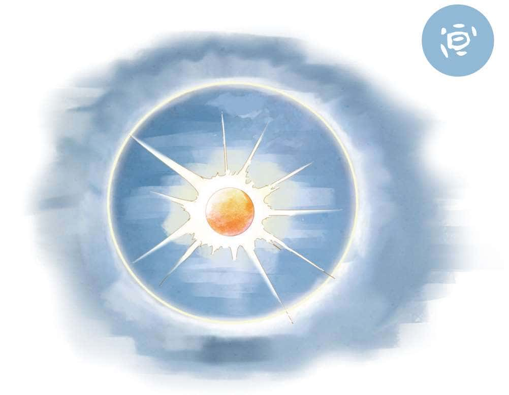

* * *

[1] 一曝十寒：晒一天冻十天，比喻勤奋的时候少，懈怠的时候多，没有恒心。

[2] 现在提起“汤”字，我们主要联想到的是汤羹。其实，“汤”有个很重要的含义——热水。在“赴汤蹈火”“扬汤止沸”里，“汤”都是热水的意思。还有一个成语叫“固若金汤”，它可不是稳固得像金色的汤汁的意思，而是指城池坚固得仿佛是金属造的城，周围环绕着灌满滚水的护城河，形容城池或阵地坚固，不易攻破。《红楼梦》里有一种取暖神器——汤婆子。汤婆子是一种扁扁的圆壶，里面装上热水，可以放置在被窝里取暖。

# 月

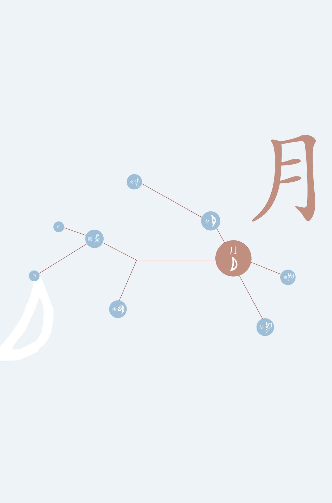

## 月·夕·夜  
汉字里的月光

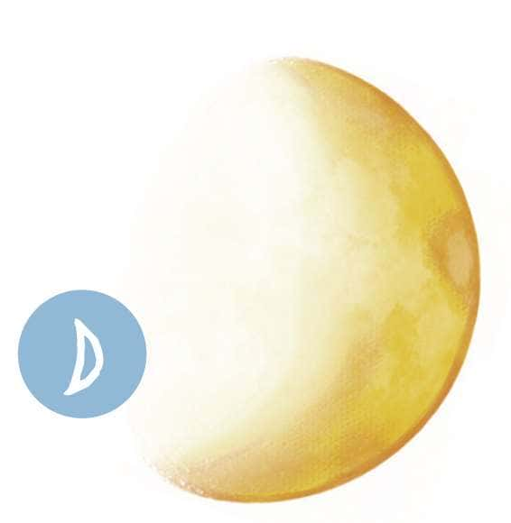

“床前明月光，疑是地上霜。举头望明月，低头思故乡。”李白这首《静夜思》语言朴素，却韵味无穷，是千古流传的佳作！静谧的夜晚，诗人举头望月，思念遥远的家乡，这一情景，让千万游子感动不已。月与古人的生活、情感紧密交织在一起，这种交织体现在《静夜思》这样的诗作中，也体现在一个个汉字里。现在，就让我来说说三个和明月密不可分的字——“月”“夕”“夜”。

### 月/ 弯弯的月牙 /

“月”跟“日”一样，是典型的象形字。太阳是充实圆满的，月亮则是有缺憾的。“人有悲欢离合，月有阴晴圆缺”，“月”的字形就是一个有缺口的月牙。

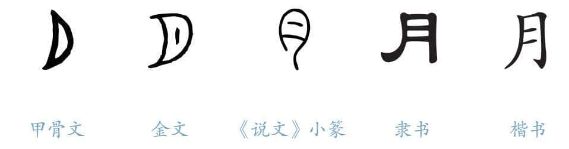

### 夕/ 傍晚的月色 /

“夕”指傍晚。《诗经》[1]里有这样一句：“今夕何夕，见此良人？”这句诗说的是，今晚是一个怎样的夜晚呀，我能够见到自己的新郎。还有个成语叫“危在旦夕”，“旦”是太阳升起，“夕”是夜幕降临，“旦夕”就是一天的时间。一天的时间很短，“危在旦夕”指危险就在眼前。

“夕”与“月”字源相同。让我们先看一眼古文字。咦！“夕”在甲骨文中和“月”是一样的，是写错了吗？

不是的！在汉字中，不同的字有时候会用相同的字形，这种现象叫作“异词同形”。那么，为什么在甲骨文和金文中，“夕”和“月”的写法是差不多的呢？答案很简单，“夕”指的是傍晚，天要黑了，月亮要出来了，所以，古人用月亮的形状来表示傍晚。

到了小篆，“夕”和“月”渐渐有了区别，“夕”的小篆字形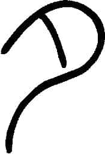比“月”的字形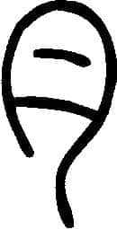少一笔。许慎先生说：“夕，莫（暮）也。从月半见。”“夕”是日暮时分，太阳刚刚落下，月亮还没有完全出现，所以是“从月半见”，“夕”要比“月”少一笔。

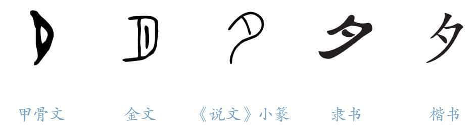

### 夜/ “夜”有个腋窝 /

过了日暮时分，待月亮出来，“夜”便降临了。

《说文解字》说：“夜，舍也。天下休舍也。”这里的“舍”是休息的意思。“天下休舍也”，就是整个世界都要休息了。在古人看来，“日出而作，日落而息”，夜晚就是休息的时间。

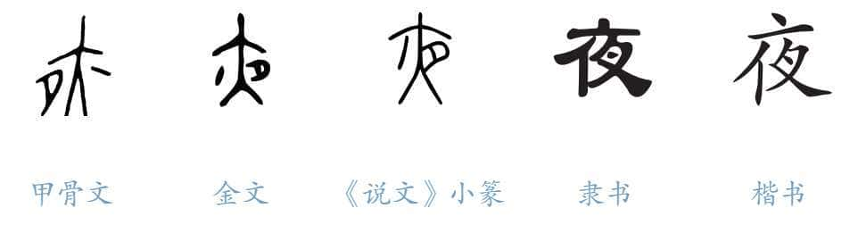

“夜”的甲骨文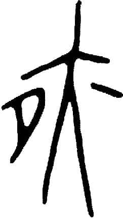由两部分组成，一个是“夕”，一个是“亦”。“夕”取自月亮，表示晚上。“亦”是一个典型的指事字[2]，它的甲骨文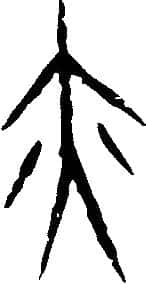，中间是个“大”字，画的是一个伸展着胳膊和双腿的人，“大”两边的点是标示性符号，指向人腋窝的位置，古人用这种方式来表示腋下。不过，“夜”字和腋下可没什么关系，“亦”在“夜”字里只用来表示读音。“夜”是一个形声字，从夕亦声。“夕”是形符，那一轮皎洁的明月，正是夜晚的象征。

* * *

[1] 《诗经》是我国最早的诗歌总集，编成于春秋时代，共305篇，分为“风”“雅”“颂”三大类。原只称《诗》，后世也称为《诗经》或《诗三百》。

[2] 指事是古代六种创造汉字的方法之一。指事是在象形的基础上，添加一个标示性的指事符号，来表达新的字义。

## 间·明  
月色入门窗

“间”和“明”这两个字也与月有关，它们都是月光对我们的探寻。

你可能会问，“间”字里哪有宁静的月光，明明只有耀眼灼热的“日”呀！“明”字里也不是只有月光，而是太阳和月亮交相辉映！

别急，请跟我回到古代，你会发现，在古代的“间”和“明”字里，有一抹温柔的月色正透过门窗照进来。

### 间/ 门缝间的一缕月光 /

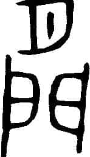是金文的“间”，下方两扇门合了起来，上方一轮明月高悬，仿佛有月光从门缝中照了进来。所以，“间”的古文字“閒”里有月亮。

《说文解字》说：“閒，隙也。”“閒”最初表示间隙、缝隙的意思。门虽然关上了，但月光却能够从缝隙里照进来。缝隙是一种空间，因此，“閒（间）”也有空间的意思。

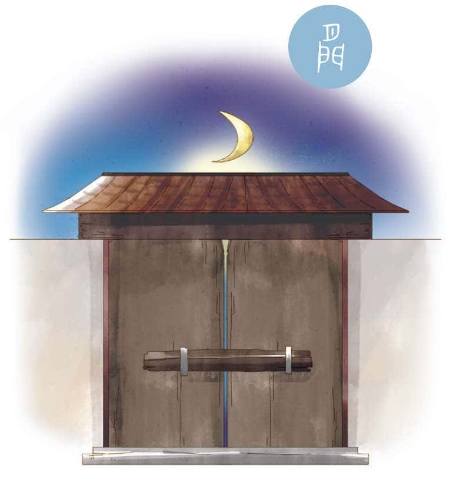

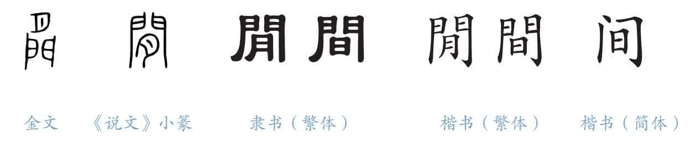

缝隙介于两扇门之间，因此“閒（间）”又有间隔的含义，读作jiàn。有一类电影叫谍战片，主人公多是聪明的间谍。“间谍”就是安插在敌人内部刺探情报的人。他肯定不能光明正大，而要藏在暗处、见缝插针，所以才叫“间谍”。

“閒”还可以读xián，表示空闲、悠闲的意思，不过这个字形如今已经不再使用，我们现在用“闲”来代替。要知道，“休闲”的“闲”本字是从月的，而从木的“閑”，在古代用来表示养牛马的圈（juàn）。

如果你的生活没有被烦恼、琐事填满，心间还保有一缕明亮而美好的月光，这就是悠闲！

### 明/ 月光映窗明 /

说完了“间”，我们再看“明”字。

简体的“明”由“日”和“月”组成。人们总说太阳和月亮都是明亮的，所以“日”加“月”就是“明”。但其实，“明”字里最初没有日光，它的含义主要来自月亮。为什么这么说呢？我们先一起看看“明”的古文字吧：

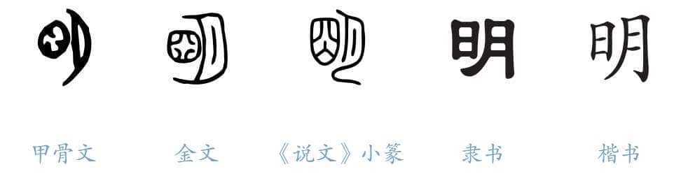

甲骨文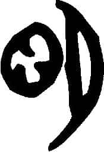、金文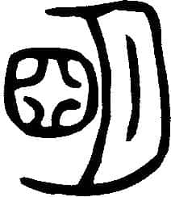和小篆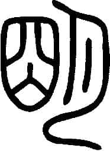的形体一脉相承。不知你注意到没有，“明”的左侧最初并不是“日”，你有没有觉得它有点儿眼熟呢？

你可能会说，左边这部分不是“囧”嘛，就是网络语言里用来表示尴尬、无奈的“囧”。没错，就是这个字！但“囧”最初可不是这个意思，它是一个象形字，表示窗户。

《说文解字》说：“明，照也。从月，从囧。”“囧”是窗户，“明”的意思就是在漆黑的夜色中，皎洁的月光照亮了我们的窗子。

在汉语里，“明”和“白”是两个颇为相关的字。古人把皎洁的月亮称作“明月”，用“白日”来表示光芒四射的太阳。曹植的《箜篌（kōn hóu）引》中有：“惊风飘白日，光景驰西流。”王之涣的《登鹳雀楼》中有：“白日依山尽，黄河入海流。”两首诗中的“白日”都指耀眼的太阳。“明”和“白”合为“明白”，指心中对一件事情清清楚楚，像日月一样亮堂。

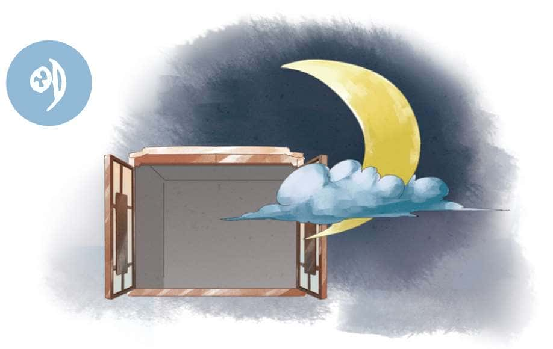

## 望  
举头望明月

月光探寻我们，我们亦探寻月光。说完了“间”和“明”，我们再看看“举头望明月”的“望”字。

“望”的上面是“亡”和“月”，底下是一个“王”。这个字也和月亮有关系。

你看，这是“望”的甲骨文——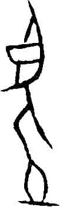。不过，它的底下不是“王”，而是一个人踮着脚的样子，上面是一只大大的眼睛，表示向远看。这个人在看什么呢？到了金文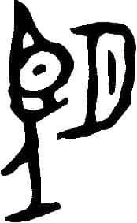字中，谜底揭晓了——古人在眼睛旁边又加了一个“月”，他眺望的是天空中的那轮明月呀。在甲骨文、金文中，“望”是一个会意字，到了小篆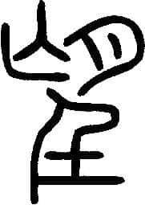，左上角又加了一个“亡”，作为“望”的声符，“望”也由此变为了形声字。

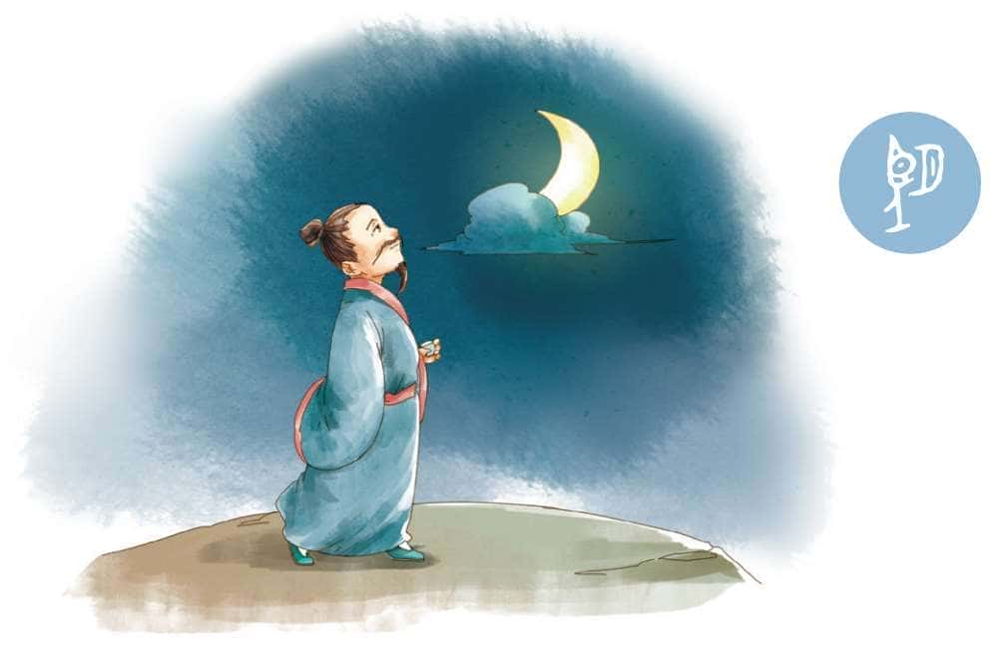

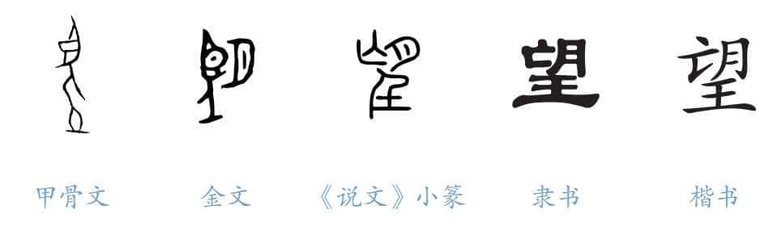

“望”表示向远处看，这个意思在古诗词中十分常见。唐代大诗人杜甫望的是东岳泰山（《望岳》）：

岱（dài）宗夫如何？齐鲁青未了。

造化钟神秀，阴阳割昏晓。

荡胸生曾云，决眦（zì）入归鸟。

会当凌绝顶，一览众山小。

这首诗处处体现出远望的状态。“齐鲁青未了”是站在泰山上远望齐鲁大地，“决眦入归鸟”是远眺归来的飞鸟。诗人夸张地说，为了看清归鸟，把眼眶都瞪裂了。

唐代诗人刘禹锡望的是洞庭湖（《望洞庭》）：

湖光秋月两相和，潭面无风镜未磨。

遥望洞庭山水翠，白银盘里一青螺。

在诗人的眼中，洞庭湖像一面镜子。湖里有一座小岛，名叫君山，远远望去，就像白银盘里的一枚青螺黛。

眺望者的眼中尽是祖国壮丽的山川河岳。正因如此，在我们期待一些遥远而美好的事物时，这种心态也可以叫“望”——“期望”“希望”“盼望”“愿望”，这些词里寄托着对未来的憧憬与渴盼。

## 期  
与月亮一期一会

我们常说“星期”“时期”，和时间有关的“期”字里，为什么也有“月”呢？

“期”是一个典型的形声字，从月其声，“月”是形符，“其”是声符，表示“期”与皎洁的月亮有关。

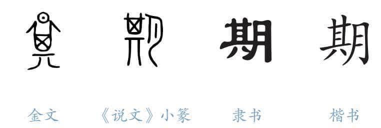

许慎先生说：“期，会也。”“会”有相会、约会的意思。“期”就是人与月亮的相会。

月亮的运行是有规律的，在一次次日夜更替之间，月亮从小小的月牙变成满月，再从满月变回月牙。一个变化的轮回，便意味着一个月时间的流逝。因此，古人用“月”来表示月亮完成一次变化的时间——三十天左右，这就是“月份”。人们与满月一月一会，因此，“期”便用来表示某种固定的时间，有时期、日期的含义。人们盼望与月亮相会，于是，“期”又有了期待、期许、期望的意思。这种与月相约、一期一会的感觉，是不是格外美妙呢？

月亮的阴晴圆缺，以及由此而感受到的时光流逝，格外容易诱发古人的诗意。大诗人李白写道：

今人不见古时月，今月曾经照古人。

古人今人若流水，共看明月皆如此。

月亮永恒，人却不断老去。人来来去去，犹如逝去的流水，但每一代人都在和永恒的月亮相期相会。读到这里，你有没有感到一种淡淡的哀愁呢？人是渺小的，时间是永恒的，我们在时间的长河面前，总有一份难以言表的感慨。

还有一首与月有关的唐代名诗《春江花月夜》，其中写道：

人生代代无穷已，江月年年望相似。

不知江月待何人，但见长江送流水。

一代代人来来去去，无穷无尽，江面上的月亮却年年相似。不知这永恒的月亮，在等待着谁来相会，只见滚滚江水向前奔流，仿佛流向无尽的前方。月亮恒久，人世变迁，天上的一轮明月仿佛等着一代又一代的“你我”来一期一会。

# 雨

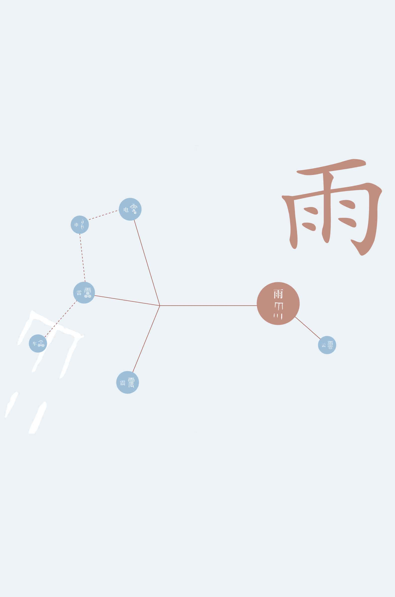

## 云·雨  
“行云布雨”的汉字

大诗人陆游有一联很美的诗：“小楼一夜听春雨，深巷明朝卖杏花。”想想看，在春雨降临的时候，诗人坐在小楼上，听淅淅沥沥的雨下了一夜。雨润花开，雨打花落。第二天一早，幽深的巷子里传来叫卖杏花的声音，这是多么诗意的生活啊！这一讲，我就来说一说“雨”，以及下雨的“云”。

### 云/ “云”字里有小雨 /

下雨需要雨云，讲“雨”之前，我们先看看“云”字。

“云”有两重含义。一重比较抽象，表示说话。古文里有很多“诗云”“古人云”，便是“有诗是这么说的……”“古人说……”的意思。成语“人云亦云”，指人家说什么你也跟着说什么，形容没有主见。“云”的另一重含义，就是我们熟悉的云彩。

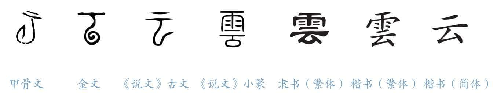

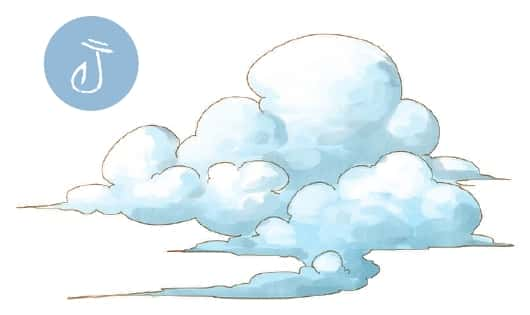

“云”的甲骨文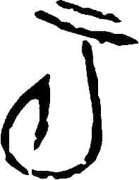和《说文解字》中“云”的古文形体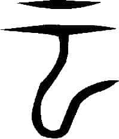很像，许慎先生说“象云回转形”，这是一团云气旋转的样子。旋转飘忽的云来自何处呢？《说文解字》说：“云，山川气也。”云是山川中的水汽，飘到天空中，凝结回转，成为云彩。

“云”和“雨”密不可分，所谓“行云布雨”，有了云彩就容易下雨。因此，小篆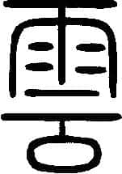字里，古人在“云”的上方加上“雨”，创造出繁体字“雲”，专门用来表示云彩的含义，和表示说话的“云”分化开来。后来汉字简化，“雲”被重新简化成了我们熟悉的“云”。

云有两个基本特点。第一个特点是高，水汽只有升到高远的天空中，才能成云。春秋时期有一种作战器具叫“云梯”，是古人攻城时攀爬城墙用的梯子。因其高耸入云，所以叫“云梯”。

云的第二个特点是密。天上的云有时就像大块的棉花糖，布满蓝蓝的天空，因此，云有密集的意思。有一个词叫“云集”，就是指很多人聚集在一起，像云一样密集。

关于云，古人也有许多精彩的诗句。王维诗中的云，是“行到水穷处，坐看云起时”。他看到的云，是山间若有若无、向上飘荡的云气。李白诗中的云，是“明月出天山，苍茫云海间”。他看到的云，浩瀚广袤，如同一望无际的大海，其间，天山上一轮月亮若隐若现。贾岛诗中的云，是“松下问童子，言师采药去。只在此山中，云深不知处”。他看到的云，是浓云深密，寻之不见。

### 雨/ “雨”字里藏着云 /

有了云，接着便是滴水成雨。

从甲骨文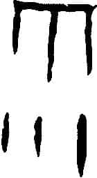到小篆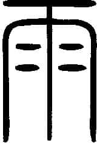，你一看就能发现，它是一个象形字。《说文解字》说：“雨，水从云下也。一象天，冂（jiōng）象云，水霝（líng）其间也。”许慎先生对雨的理解非常透彻。“水从云下也”，雨是水，从厚厚的云层落下，这与今天对雨的科学解释差不多。“一象天”，“雨”上面的那一横表示天空。“冂象云”，字中的“冂”表示云彩。“水霝其间也”，“霝”是降雨的意思。“雨”字中的小点，是滴滴答答的雨。

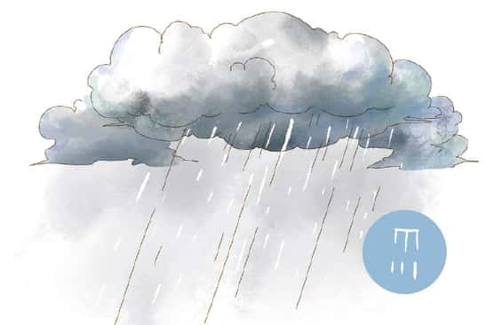

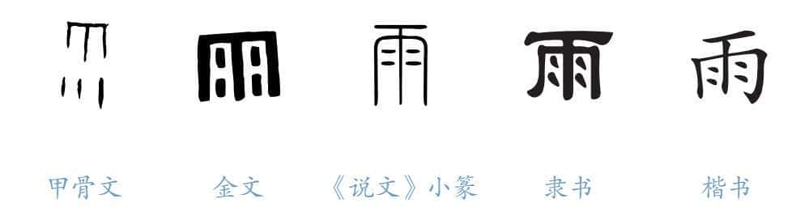

中国古代以农耕为主，春天耕种时，庄稼特别渴盼雨水滋润大地。因此，及时的雨水最为宝贵，遂有“春雨贵如油”的说法。很多古诗中都有由衷赞颂春雨的佳句，比如我们熟悉的“好雨知时节，当春乃发生”，春天及时降下的好雨，伴随春风滋养万物。

“雨”除了做名词表示雨水（读yǔ），还有动词用法（读yù），表示降雨的意思。《淮南子》中讲到仓颉造字后“天雨粟”，其中的“雨”就是动词下雨的意思。看到人类创造了汉字，上天像下雨一样降下粮食，或许是在表示震惊，又或许是在表达对人类的赞赏。

## 电·雷·震  
电闪雷鸣，震耳欲聋

下雨时，往往伴随着闪电、打雷等自然现象。接下来，就让我们一起重新认识一下电闪雷鸣间的“电”“雷”和“震”。这几个字也都离不开“雨”。

### 电/ 阴阳激耀的电光 /

古人对于“电”的解释，与现在的科学理解颇有相通之处。许慎先生将电解释为“阴阳激耀”。“激”是激荡，是剧烈的摩擦；“耀”是闪耀，发出夺目的光彩——电就是阴阳相激发出的巨大火花。

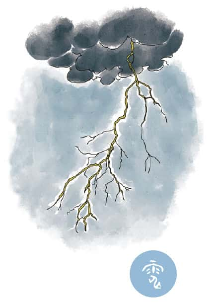

“电”的字形演变，经历了从简到繁、由繁再入简的过程。我在开篇讲过，“电”中有“雨”，你可能会问：“可‘电’字里怎么看不到雨呢？”

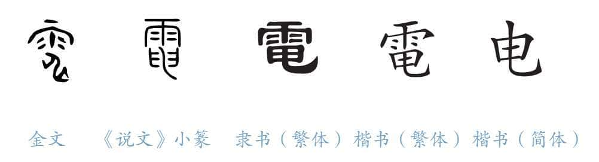

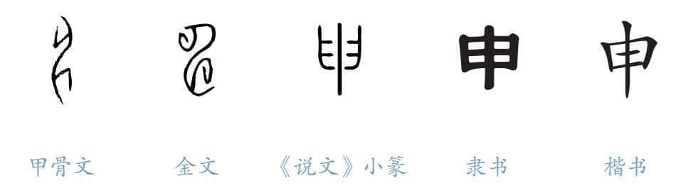

这还要先从比“电”少了一个小尾巴的“申”字说起。

在古文字中，“申”就是闪电的象形。你看，甲骨文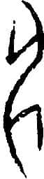仿佛一道明亮的闪电，在天地中尽情伸展。后来，为了更加形象地表示雷雨闪电，人们为“申”加上雨字头，于是有了金文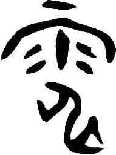、小篆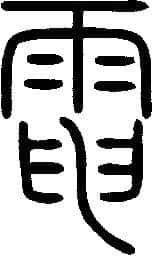。《说文解字》中说：“电……从雨，从申。”“雨”加“申”就是撕裂天穹的闪电。只是后来，小篆中“申”的一竖越写越弯，慢慢变成了一条弯曲的小尾巴，就有了繁体字“電”。现代人觉得“電”复杂难写，又在汉字简化过程中将它变为了如今的“电”字。

至于“申”，自从有了专门表示闪电的金文、小篆，它便“英雄无用武之地”了。闪电在空中舒展，因此，“申”用来表示思想观点的伸展，所谓“申诉”“申请”“申论”，都是要把自己的观点、想法充分地“伸展”、表达出来。后来，人们又给“申”加了个单人旁，变为“伸”字，专门表示伸展之义。

### 雷/ “雷”字里有块田吗？ /

闪电总是伴随着隆隆雷声，古人是怎么认识雷的呢？

在遥远的古代，科学落后，人们对天象的理解往往伴随着丰富的想象和神话的色彩。在古人的脑海中，自然界的一切都由神灵掌管，掌管雨的是龙王，掌管雷的是雷神。据古书记载，雷神名叫“丰隆”。所谓“丰隆”，其实就是打雷时的轰隆声。那么，雷神是如何制造出雷声的呢？

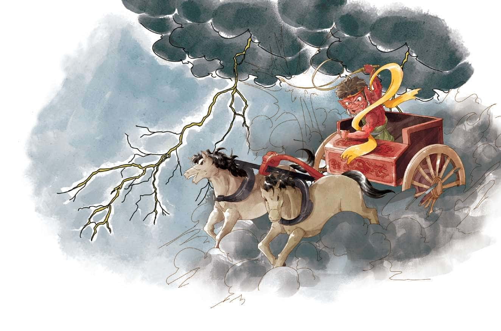

对于这个问题，有很多不同的传说。有的认为，雷公手持鼓槌，敲击巨鼓，发出雷声。还有的认为，雷神驾着一辆巨大的马车，从天空中奔驰而过，闪电是他手中扬起的马鞭，轰隆隆的雷声是车轮碾过天空的声响。

雷声到底来自巨鼓，还是雷车？想要知道哪个传说更符合古人造字时对于雷的想象，还是要在汉字中寻找答案。

从古至今，“雷”的字形变化很大，但仍有线索可寻。甲骨文中的“雷”有几种不同的写法。甲骨文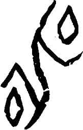中间是“申”——闪电的象形，上下各有一个圆圆的符号。甲骨文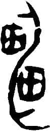中，上下各有一个像“田”的符号。到了金文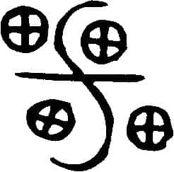和小篆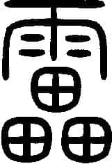，这个符号就更像“田”了。

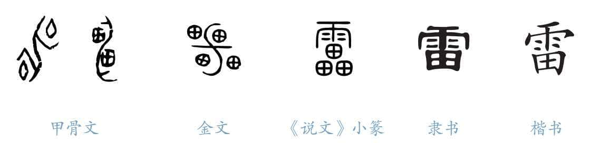

这个像“田”的东西是什么呢？别急着回答，我们先来看看甲骨文中的“车”字：

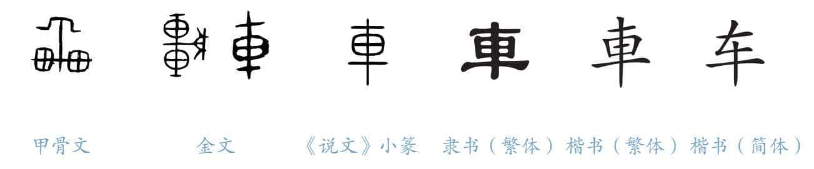

甲骨文的“车”是一个典型的象形字，把古代战车的形状描画得惟妙惟肖。请你猜猜看，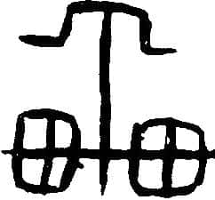两旁像“田”字的东西是什么呢？

没错，是圆圆的车轮！

说到这儿，我们也就知道雷声来源问题的答案了。将古文字中的“雷”和“车”加以对比，不难发现，“雷”字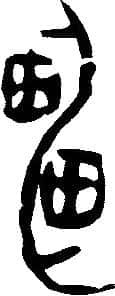里有车轮在转动。后来，随着汉字简化，小篆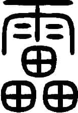逐渐变为今天的“雷”字。

雷神的马车碾过天际厚重的云，发出轰隆隆的巨响——雷声。由此，“雷”的很多用法都和声音巨大有关。

在生活中，很多能发出巨大声响的事物都叫“雷”，比如打仗时使用的地雷、手雷；过年时放的威力巨大的鞭炮叫“雷王”“震天雷”。很响的东西总会吓到人，在口语里，表示被吓到、被震惊到时，有一个说法叫“被雷到了”。但要注意，“被雷到了”是网络用语，写文章时不能乱用。

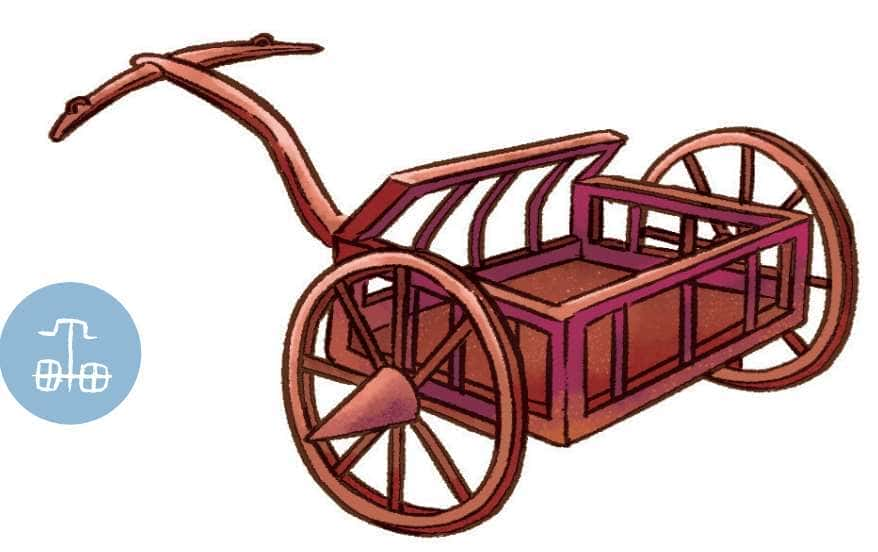

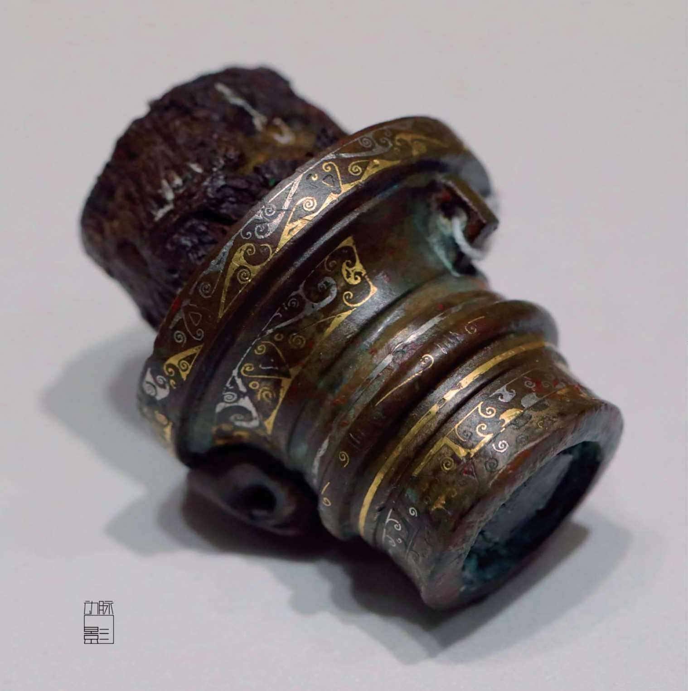 
西汉/错金银铜车軎/济南市长清区博物馆藏

### 震/ 被雷劈的君主 /

表示惊吓状态的，除了“被雷到了”，还有“震惊”的“震”。

“震”是一个形声字，从雨辰声。许慎先生解释说：“震，劈历振物者。”“劈历”就是霹雳，闪电惊雷；“振”是振动、抖动——“震”是响声巨大的雷电，能使万物随之震颤发抖。

在古代，“震”还有遭受雷击的意思。司马迁在《史记》中记载了一则“武乙震死”的故事。

殷商时期，有一个残暴无道的国君叫武乙。他苛待百姓，还有各种蔑视上天的行为。他做了一个人偶，称之为“天神”，然后让别人替它投“骰子”，和自己赌输赢。如果武乙赢了，他就会在“天神”面前得意扬扬。还有一次，武乙做了一个皮革袋，在里面盛满血，高高挂起来。然后，他对准皮革袋，拉弓射箭，说这是“射天”。血洒了一地，就是上天受伤流血了。

终于有一天，没有敬畏之心的武乙遭到了报应。他外出打猎时，暴雷从天而降，“武乙震死”。“震死”即遭受雷击而死，也就是所谓的“天打雷劈”。

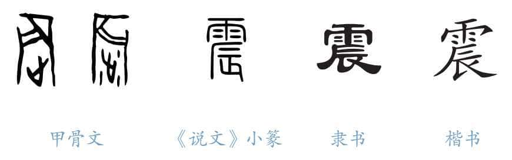

在今天，“震”已经很少表示遭受雷击的意思了，它大多用来表示受到惊吓，比如“震惊”“震撼”；也可以表示抖动、颤动，比如“震动”“地震”。

“震”还有许多相关的成语。巨大的声音将耳朵震得嗡嗡作响，几乎要听不见了，叫作“震耳欲聋”；一位江湖闻名的武林高手，全天下都知道他的名字，叫作“名震天下”；如果谁取得了闻所未闻的成就，为人类做出了大贡献，我们可以说他的功绩“震古烁今”；如果一个大臣的功绩盖过了皇帝，那叫“功高震主”……

你还能举出其他带有“震”字的成语吗？

# 水

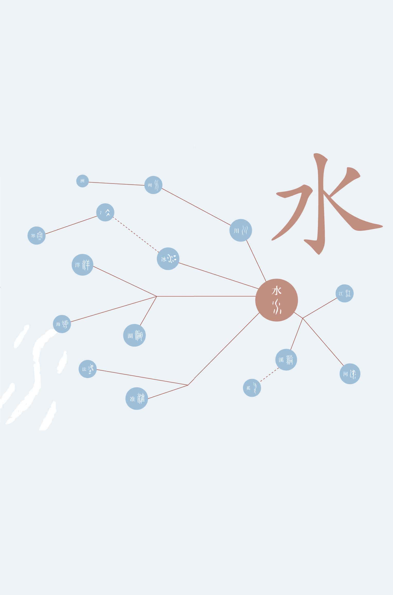

## 水·川·州  
一去不回东流水

水是生命之源，世界离不开水的滋润。在文人墨客的笔下，江河湖海之水更有着丰富多彩的文化内涵。现在，就让我先从“水”字说起，再来介绍“川流不息”的“川”和与之相似的“州”，看看它们的字义与文化内涵。

### 水/ 水流的形状 /

从甲骨文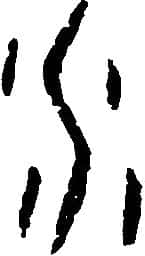到小篆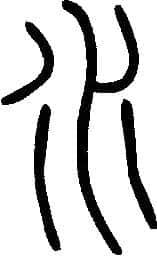，“水”的形体一脉相承，古人用弯弯曲曲的笔画，表示水流的形状。中间是一条大大的水流，两边是四条小小的水流，这是一个标准的象形字。

《说文解字》说“水”字“象众水并流”，“水”字画出很多水流在一起流淌。到了隶书，“水”已经基本发展成了今天的样子，两边的水流变成了横撇与撇捺，中间则变成一个竖钩（亅）。

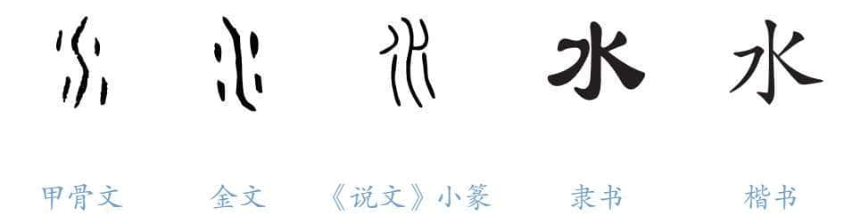

许慎先生对“水”有一个很有趣的解释：“水，准也。”“准”是标准的意思。为什么要用“标准”来解释“水”呢？

这个解释的背后，蕴含着中国古代的水文化。古人盖房子的时候，先要把地铲平。怎么找平呢？古人用一个盒子装上水，根据水的平面来平地，高处铲平，低处补足。因而“水”被认为是平的，具有标准的内涵。我们说的“水平”“水准”，都隐含着“判断标准”的意思。

除了水平不斜，古人更从水中感悟出处世的智慧。孔子说：“知者乐水，仁者乐山。”仁爱的人喜欢大山，有智慧的人喜欢流水。为什么呢？因为大山沉稳厚重，生长万物，符合仁者气象；流水则清澈透明，灵动变化，是智慧的象征。正所谓“上善若水，水善利万物而不争”，水滋养万物，同时柔弱谦卑，和谁都不竞争，充分体现出有道之人的境界。

### 川/ 奔流不息的大河 /

说完了“水”，再看“川”字。

“川”在甲骨文中就已经出现了。你看它的样子，从甲骨文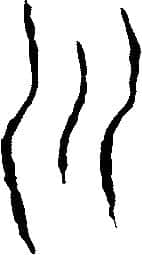到小篆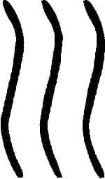，像不像弯弯曲曲的水流？隶变之后，古人把弯曲的笔画拉直了，“川”才变成了今天的模样。

“川”与“水”有何不同呢？许慎先生在《说文解字》中说：“川，贯穿通流水也。”在古代，“川”不是小溪、小河，而专指贯穿大地、流向远方的大河。

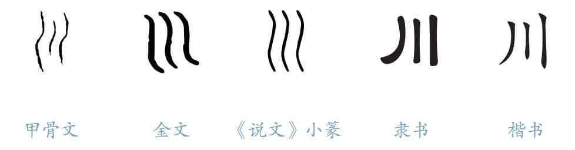

大河奔流不息，让人多生感慨。孔子发出的感叹是“逝者如斯夫，不舍昼夜”。在他看来，长江大河滚滚向前，从不停息，做人也是一样。我们要向江河学习，保持进步，不断充实和丰富自己，千万不要故步自封，停留在小收获、小境界里。如果有了一点儿成绩就骄傲自满，和大川大河相比，是不是显得有些可笑呢？

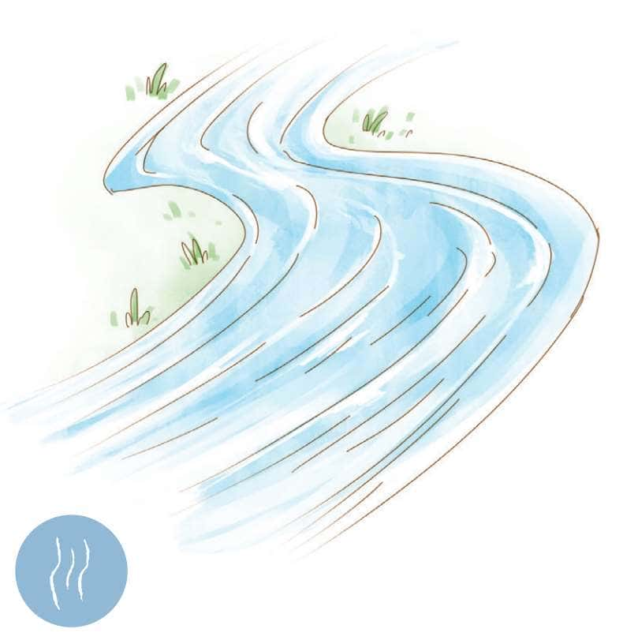

### 州/ 水中的小块陆地 /

在古文字中，“州”和“川”样子很像——“川”字甲骨文中间的水是直接流下来的，“州”字甲骨文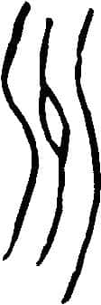中间则有一个小圆圈。这是什么意思呢？看一看《说文解字》就明白了。

《说文解字》说：“水中可居曰州。”水中住人的地方叫作“州”。川中的小圆圈，原来画的是水中可以住人的岛屿。所以，“州”最初是小岛的意思。

除了小岛，“州”也可以指大片土地。汉语中有一个词叫“九州”。《说文解字》说：“昔尧遭洪水，民居水中高土，或曰九州。”这是什么意思呢？世界各地的传说中，都有发大洪水的故事。在西方故事里，挪亚方舟拯救了万物。而在东方故事里，上古尧帝时，老百姓为了躲避大洪水，躲到了水中的高地上。这样的高地一共有九块，被称作“九州”。

后来，九州被用来泛指中华大地。南宋大诗人陆游的《示儿》中便有此用法。这首名诗是他临死前写下的：

死去元知万事空，但悲不见九州同。

王师北定中原日，家祭无忘告乃翁。

陆游英雄半生，临死之际忽觉万事皆空，了无牵挂。他唯一放不下的事情，是看不到祖国统一。他在诗中叮嘱后人，如果有一天，国家的军队北上收复了中原，你们祭祀的时候，一定不要忘了告诉我啊！在这里，“九州”泛指中华大地，是一片很广阔的土地，而不再是水鸟栖息的小岛。

除了泛指中华大地，“州”在古代也是具体行政区划中的一级，所辖地区的大小历代不同。比如，在《三国演义》里，袁绍就曾担任过冀州牧一职。冀州大概位于今天的河北省一带，冀州牧就是管辖冀州的官员。

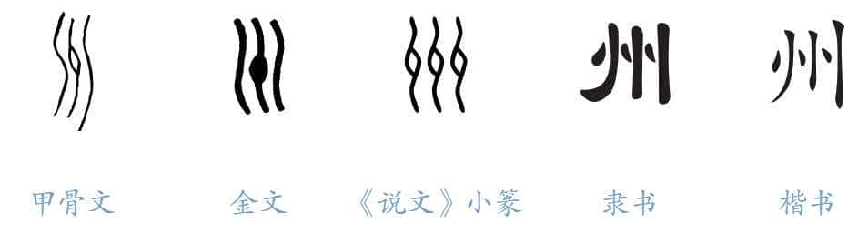

后来，为了分清楚“州”的不同含义，古人为“州”加上三点水，写作“洲”，专门表示水中陆地的意思。《诗经》中说：“关关雎（jū）鸠，在河之洲。”两只雎鸠，关关、关关地叫着，在水中的小岛上，互相倾慕，彼此喜欢。

到了今天，我们已经不再用“州”作为行政区划了，而是用“省”。不过美国的行政区划被译为“州”，比如“盛产牛肉面”的加利福尼亚州。一州的负责人叫作州长，权力很大。

## 溪·河·江  
小溪潺潺，江河滚滚

水，组成了大大小小的河流，河流是大地的动脉，哺育着生长在这片大地上的人。水也成了重要的部首“三点水（氵）”。现在就让我来为大家介绍三个与河流有关、以“三点水”为部首的汉字——“溪”“河”“江”，它们或小或大，或浅或深。

### 溪/ 山间的潺潺小溪 /

溪、河、江，三种水流由小到大，我们先看潺潺“溪”水。

“溪”是小溪，小篆字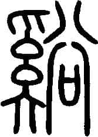从谷奚声，左边是声符，右边是形符，是一个典型的形声字。小溪多在山谷之中，故从谷，《说文解字》的解释为：“山渎（dú）无所通者。”“渎”是小水沟，山间的小溪水流着流着，就好像消失不见了，这就是“无所通者”。后来，这个字才改为从水，变成了“溪”。

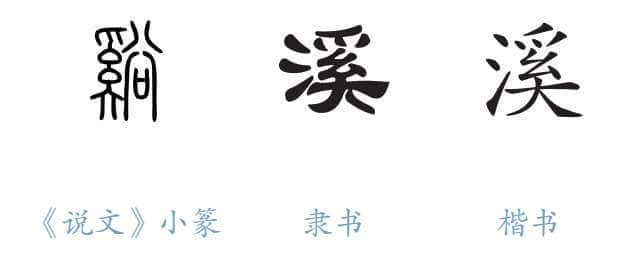

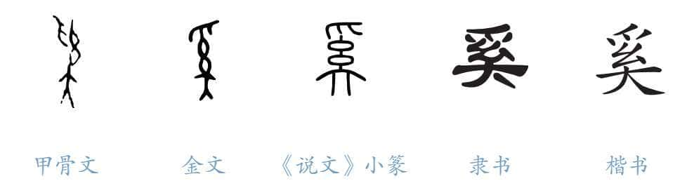

这个特点，和“川”形成了鲜明的对比。川是“贯穿通流水”，是奔流不息的大江大河。溪水呢，在不经意间消失不见，是涓涓细流、潺潺小溪。

“奚”虽然只表示读音，但古人选它做声符，选得非常贴切，因为在汉字中，和“奚”有关的字，往往都有“小”的特点。

“奚”的甲骨文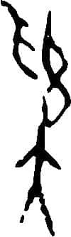中，左上方画的是手，下方画的是人，它是奴隶的象形。奴隶地位卑微，因此，“奚”有小的意思。同样以“奚”为声符的“蹊”字，也有小的特点。它和“溪”同源，从足奚声，也是一个形声字，表示窄小的道路。大诗人杜甫有这样一首诗：

黄四娘家花满蹊，千朵万朵压枝低。

留连戏蝶时时舞，自在娇莺恰恰啼。

这首小诗，作于杜甫定居成都草堂之时。诗人沿着江畔散步，看到黄四娘家的小路上开满了鲜花，繁盛的花朵压弯了枝条，甚至把小路都挤满了。蝴蝶在花间嬉戏飞舞，黄莺自在地婉转啼鸣。寥寥数笔，描绘出了春天的勃勃生机。

“蹊”是小路，“溪”是小流，“小”的意思是相通的。

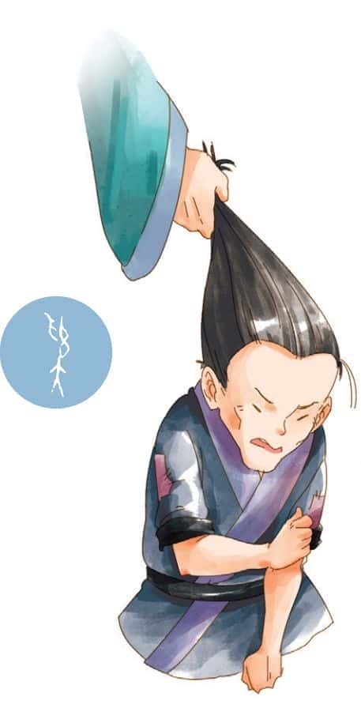

### 河/ “河”是黄河的名字 /

“河”也是一个典型的形声字，从水可声。在现代汉语中，“河”可以指小河，但更多指的是大河。在古代，“河”是一个专有名词，特指我们中华民族的母亲河——黄河。

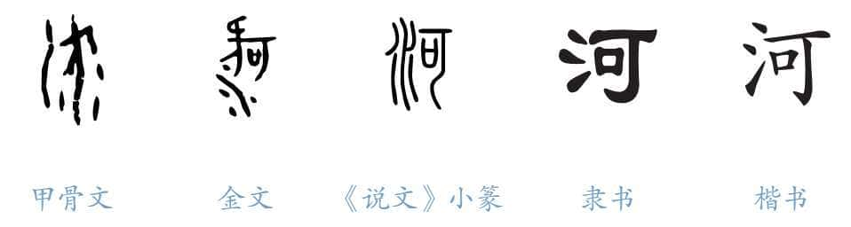

奔流不息的黄河从何而来呢？诗仙李白在《将进酒》中说：“君不见黄河之水天上来，奔流到海不复回。”诗情豪迈的李白说，黄河从天上奔涌而来，这显然是一种浪漫的想象。对古人而言，许慎先生的说法代表了当时人们的普遍认知：“河，水。出焞（敦）煌塞外昆仑山，发原注海。”在古人看来，黄河发源自塞外遥远的昆仑山，点滴积蓄，滚滚东流，九曲十八弯，最后注入大海。

黄河真的发源于充满神话色彩、居住着西王母[1]的昆仑仙山吗？

当然不是！经过科学家的考察，人们现已知晓，我们的母亲河发源于青藏高原的三江源地区，那里也是长江、澜沧江的发源地。

黄河，滋养着中华民族繁衍生息，古人的生活与历史都与黄河密切相关。黄河落在了俗语里——“不到黄河心不死”“跳进黄河也洗不清”，也流入了诗词里—“白日依山尽，黄河入海流”“九曲黄河万里沙，浪淘风簸（bǒ）自天涯”。

除此之外，黄河更成为古人誓言的神圣见证。距今2600多年的晋文公重耳就发过这样的誓言。重耳因国家内乱，曾经流亡在外，他的舅舅子犯一路追随，给他出了很多主意，也提了不少意见。后来重耳复国，回国路上走到黄河边，子犯却不敢前行，心里充满了忧虑之情：“一路上，我给重耳提了好多意见，忠言逆耳，万一他回国之后，跟我算账怎么办？”

于是，他对重耳说道：“臣随您巡游天下，自知多有罪过，请允许臣离开吧。”重耳心想，我感激舅舅还来不及呢，怎会秋后算账！于是，他把一块玉璧扔进黄河，献给河神，请他见证自己的誓言：“亲爱的舅舅啊，若我不与你同心同德，将受到惩罚，请滚滚东流的黄河水为我见证！”

由此可见，黄河对古人来说，是神灵般的存在。

### 江/ “江”与“河”一样吗？ /

在汉字中，“江”“河”常常连用，其中，“河”最初专指黄河，那“江”呢？

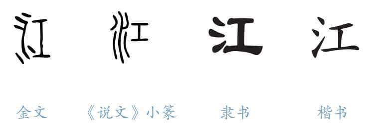

“江”是一个从水工声的形声字，“工”在今天的广州话里，还和“江”有非常相似的读音。在古代，“江”和“河”一样，也有专指，指的是长江。长江以南的地方，也就有了“江南”这个专名。“上有天堂，下有苏杭”，江南鱼米之乡，水流富足，稻米丰盛，加之气候暖和，一到春天，百花盛开，是人间最美好的风景。白居易有一首有名的词就叫《忆江南》：

江南好，风景旧曾谙（ān）[2]。日出江花红胜火，春来江水绿如蓝。能不忆江南？

《忆江南》是唐朝教坊的曲名[3]。弹起江南小调，吟唱这首小词：江南美好，那里的风光我曾经如此熟悉。太阳跃出江面，把江花照得比火还要红艳；春光明媚，江水比蓝草还要翠绿。江南，怎能叫人不怀念？

除了“江南”的诗意与柔情，“江”字里也有刀光剑影的豪迈。比如“江湖”一词，它经常出现在武侠小说里，代表着一种“仗剑走天涯”的生活，一个快意恩仇、自在逍遥的世界。那你有没有想过，什么是“江湖”呢？

人们说，有人的地方就有江湖。其实，这个词诞生之初，是“有水的地方才是江湖”。“江湖”一词里本无人事纷争，它最初指的是庞大的、一望无垠的水域。《庄子》中就有一个和江湖有关的故事：

庄子有一个好朋友叫惠子，惠子是战国名家[4]的重要学者，也是一个善于辩论的人。有一次，惠子跟庄子发牢骚：“庄周啊，魏王给了我大葫芦的种子，我种出了大大的葫芦。但这些葫芦皮薄壳脆，装太多水就撑不住。把葫芦劈开，做成水瓢，却连水桶都塞不进去。你说，这么大的葫芦有什么用呢？”

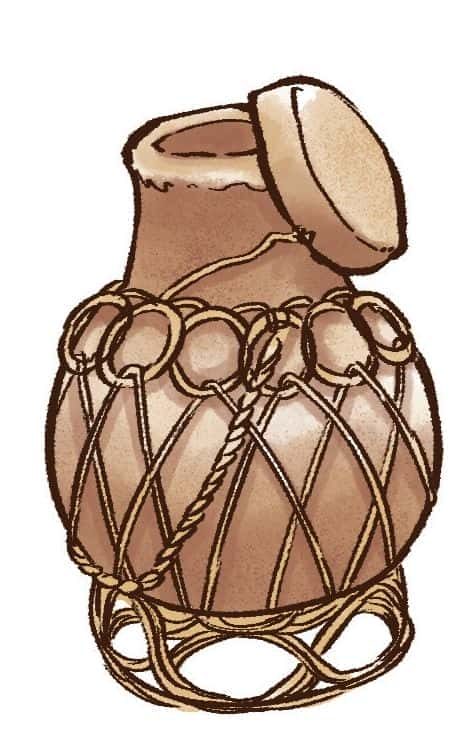 
腰舟

聪明的庄子反问道：“这个大葫芦既不能装水，也不能做瓢，那你为什么不把它缠在腰上，作为浮力来源，让它载着你浮游于江湖之上呢？”

在这里，庄子先生提出的“游泳圈”的概念，还有一个好听的名字叫“腰舟”。

这个小故事富于寓意，它告诉我们，人不要过于功利，要回到一种自然与自由的心态，找到无用中的大用，才能找到每个人生命中的“江湖”。

* * *

[1] 西王母是中国神话中的古老女神，居住在玉山（昆仑山）上，掌管着不死神药。西王母在不同的故事或传说中都有出镜，在后羿射日的传说中，后羿曾向西王母求取过不死神药。《穆天子传》则记载了周穆王西行游会西王母的故事。

[2] “谙”是熟悉的意思。白居易年轻时曾到过江南。

[3] 教坊是唐朝管理和教习音乐的官方机构，《忆江南》是教坊里的曲子名。白居易这首词，可以配着这首《忆江南》的曲调唱出来。宋词里的词牌名，也是曲子的名字，比如《虞美人》《定风波》《菩萨蛮》等。

[4] 名家，又称作“辩者”“刑名家”，是战国时期的学派。

## 湖·海·洋  
湖光山色，海纳百川

和“水”有关的汉字，除江、河、溪等水流之名外，还有各种各样的水域名称。它们是水的积聚状态，是烟波浩渺、广阔无垠的水的世界。在这一讲，我给大家介绍三个字——“湖”“海”“洋”。

### 湖/ 湖光山色 /

“湖”字是一个标准的形声字，从水胡声，“水”是形符，表示它和水有关，“胡”是声符。唐代学者孔颖达对“湖”有一个很准确的解释：“大泽畜（xù）水，南方名之曰湖。”意思是说，湖比池塘大很多，它积蓄了很多很多的水，多出在中国的南方一带。

中国有很多特别重要的大湖，如太湖、鄱阳湖、洞庭湖等。湖水广阔，两岸高山矗立，偶尔掠过的飞鸟在粼粼的波浪中投下细碎的身影。湖的优美动人，浓缩为了成语“湖光山色”。

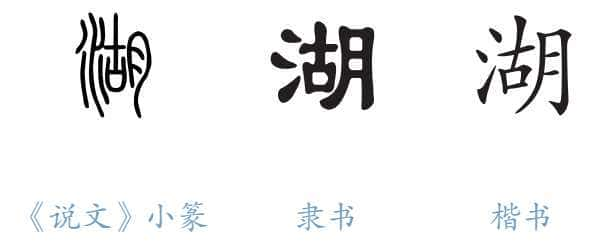

湖的美，也印刻在各种各样的动人篇章里，比如范仲淹的《岳阳楼记》。在这篇千古名文中，作者用了很多笔墨来描写洞庭湖：“衔远山，吞长江，浩浩汤（shāng）汤，横无际涯，朝晖夕阴，气象万千……”湖面仿佛含着远山，吞吐着长江，浩浩荡荡，广阔无涯。无论朝阳，还是落日，都让洞庭湖的景致气象万千。

### 海/ 海纳百川，有容乃大 /

湖有万种风情，千般美好，但却不是最大的水域。比湖更广阔的，是大海。

“海”字也是一个形声字。在古音中，“每”和“海”的读音非常相近。《说文解字》对“海”的解释是“天池也，以纳百川者”。海像天空一样广阔，可以容纳百川！在汉语中，“海”的特点，也体现在它的组词中。

海的第一个特点是广大无边。“海”字本身有大的含义，在生活中，我们把特别大的碗叫作“海碗”，把特别能喝酒叫“海量”，把特别宽广的胸怀称作“海纳百川，有容乃大”。海的第二个特点是数量众多。所以，人多叫“人海”，云多叫“云海”，树多叫“林海”，要是作业多呢，则叫“题海”。

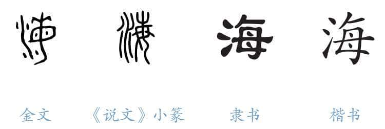

### 洋/ 为什么叫“洋娃娃”？ /

最后再来看“洋”字。“洋”从水羊声，它也是形声字。我们通常把“海洋”连起来说，那“海”和“洋”有没有什么不同呢？

严格来说，“海”指的是紧挨着大陆的近海，比如东海、黄海、渤海。而“洋”指的是比海更遥远、更广大的水域。

世界上有四大洋——太平洋、大西洋、印度洋、北冰洋，最大的是太平洋。四大洋覆盖了地球表面积的十分之七，这么一说，你就知道“洋”有多大了吧。

海洋把陆地分隔开来，大洋的另一边是其他国家。因此，中国人把大洋之外的外国的东西，称作“洋”。“洋人”指的是外国人，“洋娃娃”是仿照外国小朋友的样子做出的玩具娃娃，“洋节”呢，就是外国人过的节日。

在近代中国，许多东西依赖外国进口，就有了不少类似“洋灯”“洋油”“洋车”“洋装”“西洋钟”的说法，甚至连火柴也叫“洋火”。到了新中国，这些产品我们都可以自己造出来了，有些带着“洋”字的称呼，就慢慢地消逝在历史中了。

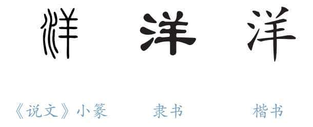

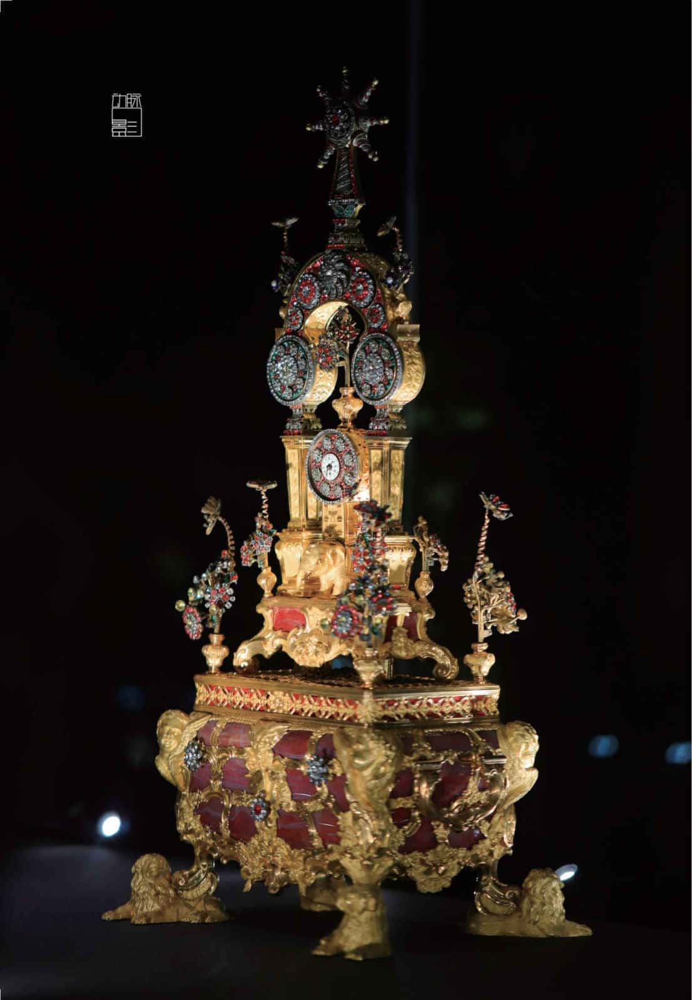 
18世纪/铜镀金镶玛瑙乐箱牌楼式象驮转花钟/故宫博物院藏

## 法·准  
以水为平，以法为准

“法”和“准”常用于“法律”“法规”“准则”等词，这两个庄严肃穆的汉字里，为什么会有“水”呢？它们的字义看上去和江河湖海一点儿关系也没有，可古人为何要这样造字呢？

让我们带着这些问题，一起探索“法”“准”中的奥秘。

### 法/ 公平如水 /

“法”字左边是“水”，右边是“去”。它和“水”“去”有什么关系呢？想要解决这个问题，我们还是先来听听许慎先生的说法。

在《说文解字》中，“法”有两种写法，一种比较繁复，写作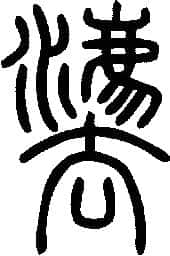（灋），另一种比较简单，写作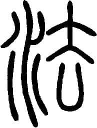，和我们今天的“法”字很像。

“灋”由“水”“廌”（zhì）和“去”三个部分组成。许慎先生说：“法，刑也。平之如水，从水；廌，所以触不直者；去之，从去。”这句话是什么意思呢？

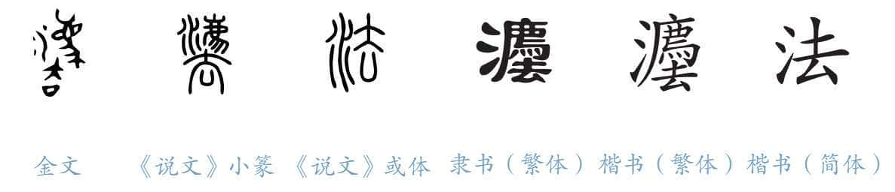

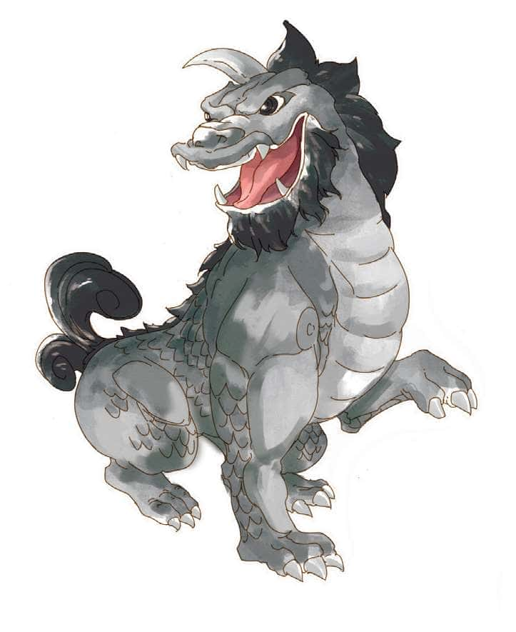

“刑”指的是刑罚，“法，刑也”，“法”就是对坏人的刑罚。

“平之如水”解释了“法”和“水”的关系。在古人看来，水的一个重要特点是平。无论怎样放置、怎样晃动，当水静止的时候，它一定是平的。法律要公正，一碗水端平，像水一样公正公平，所以“法”是水字旁。

至于“廌”，它是一种神奇的动物，又叫作“獬豸（xiè zhì）”。它长得像牛，但只有一只角。“廌”有明辨是非的能力，谁要是坏人，廌就会用角来顶他。中国古代建筑的檐角屋脊上，也立着獬豸这只神兽。

“去之”，说的则是“法”和“去”的关系，就是把坏人赶走、去除！

总之，“灋”字的意义非常丰富。首先，法律要公平，像水一样清澈平正。其次，法律要明辨是非，古人寄希望于神兽“廌”来帮忙。最后，法律要做出判罚，赶走坏人。

“灋”字内涵丰富，但是它也有两个缺点。首先，这个字太复杂了，写起来一定让你头疼！其次，公平正义要靠人来实现，期待神兽来判断是非，无疑是痴人说梦。为了解决这两个问题，古人造出了简体写法的“法”字，省略复杂的“廌”，留下“水”和“去”，“水”表示公平公正，“去”表示赶走坏人。

说到这儿，你清楚“法”字的内涵了吧。

### 准/ 以水为准 /

讲完了“法”，再来看“准”字。

什么是“准”呢？《说文解字》说：“准，平也。”

《说文解字》中说，“准”字是一个从水隼（sǔn）声的形声字，它的小篆字形和繁体写法都以“水”为偏旁。后来，这个字丢了一点，就变成了两点水。

“准”和水的关系，也在于水的平正。正因为公平，才能成为效法的对象，才可以成为标准与准则。根据公平的规范做事，才能够“准确”。

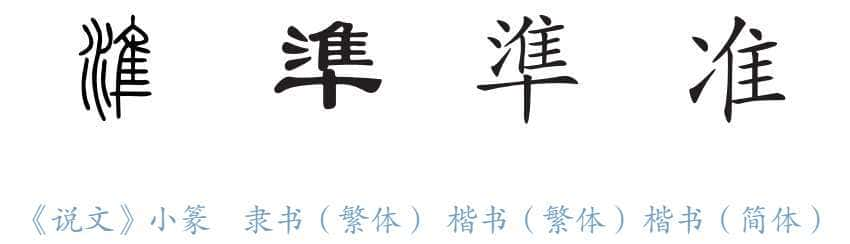

## 冰·寒  
“冻煞人”的汉字

在汉字中，“两点水”和“三点水”都是我们熟悉的偏旁，它们长相相似，名字相似，一不小心就会被认错。那么，“冫”和“氵”究竟有什么区别呢？

这一讲我们就来重新认识一下“冫”，以及以它为部首的“冰”与“寒”。

### 冰/ 晶莹的冰凌 /

“三点水（氵）”是水，“两点水（冫）”是冰。

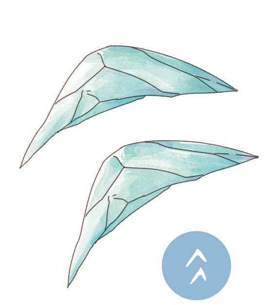

不过，如果看到古文字中的“冰”，你未必能认出它来。甲骨文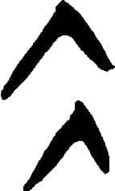与小篆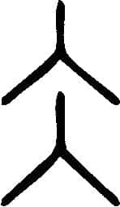，和今天的“冰”字是不是一点儿也不像呢？

其实，就是寒冷冬天里的晶莹冰凌，也是偏旁“冫”的来源。偏旁“冫”往往和冰冻、凝结有关。和它有关的汉字，比如“冷”“冻”“凝”等，都传达出冰冷刺骨的感觉。

到了后来，因为“冰”由水冻结而成，古人在冰凌旁加上一个“水”，创造出了今天的“冰”字。从甲骨文到楷书，“冰”也从象形字变成了会意字。

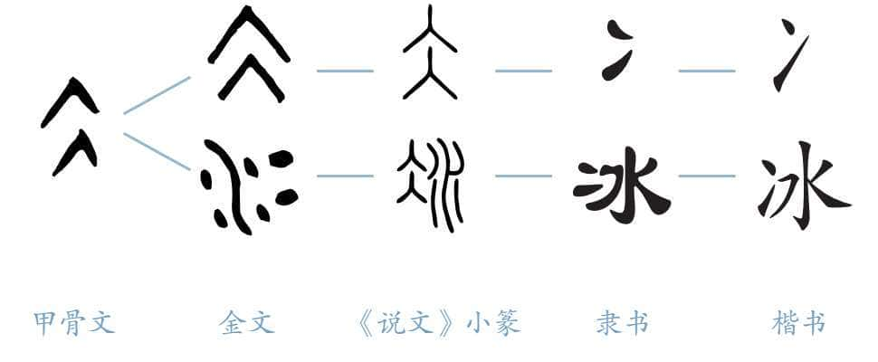

冰与雪都由水凝结而成，因此，它们可以同义连用，组成“冰天雪地”“冰封雪飘”“冰寒雪冷”“冰消雪融”等词语。

冰是纯净的，也可以用来形容人的纯洁心灵。说一个女孩“冰清玉洁”，就是夸她像玉一样洁白，像冰一样清透。冰是晶莹剔透的，如果一个人非常聪明，一点就通，也可以说她“冰雪聪明”，心思像冰雪一样玲珑透彻。

人们喜欢用冰来比喻心灵，比如唐代诗人王昌龄的《芙蓉楼送辛渐》中就写道：“洛阳亲友如相问，一片冰心在玉壶。”在这里，“冰心”指的就是晶莹剔透、纯洁无瑕的心灵。千百年后，一位女作家就以“冰心”为笔名，创作了很多深受小读者喜爱的文章。

### 寒/ 人在草堆中取暖 /

“寒”和“冰”一样，透着冷意。“寒”就是冷的意思。但是，“寒”和“冫”有什么关系呢？“寒”复杂的字形中又藏着怎样的故事呢？

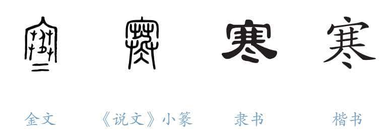

《说文解字》说：“寒，冻也。”在小篆中，“寒”是一个典型的会意字，上面的“宀”（mián）是房屋的象形，“宀”下正中间有一个“人”，“人”下面的是“冫”，两边有四个“屮”，就是四个小草。这个字形描绘出一个让人瑟瑟发抖的情景：寒冬之际，屋子里的穷苦人盖不起棉被，只能哆哆嗦嗦地钻入草堆取暖，身下还有寒冷刺骨的冰碴，冻得他苦不堪言。

在中国文化中，“寒”和“贫”密不可分，可以组成“贫寒”一词。寒冬来临之际，贫穷的人更易遭受风雪的摧残，贫穷人家也因此被称为“寒门”，贫寒的读书人叫作“寒士”。

大诗人杜甫为“寒士”们写过一首《茅屋为秋风所破歌》，其中感慨道：“安得广厦千万间，大庇天下寒士俱欢颜！风雨不动安如山。”写这首诗时，杜甫住的茅屋被秋风吹坏了。在寒风冷雨中，他没有担忧自己，而是想到天下寒士，不禁呼唤道：“从哪儿能找来千万间宽广的好房子，像大山一样风雨不动、安稳自如。这些房子，可以庇护天下贫寒的读书人，让大家都能欢声笑语。”

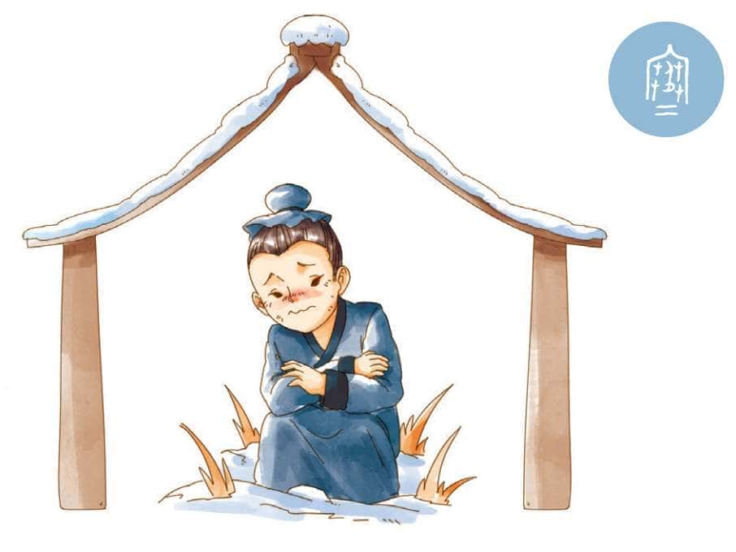

这就是大诗人杜甫思及天下的广阔胸怀，是他推己及人的仁者风范。

# 土

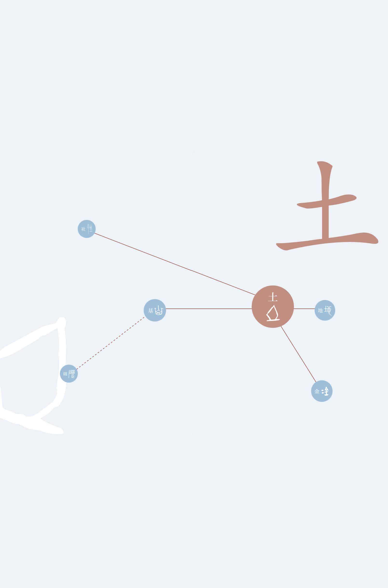

## 土·地  
滋生万物的汉字

对人类来说，大地的重要性不言而喻。如果离开土地，人类便会无以食、无以立。说土地是万物之源，一点儿也不夸张。

在这一讲，我们一起来认识“土”“地”。在古人心中，我们赖以生存的土地，寄寓了怎样的文化内涵呢？

### 土/ 土生万物 /

“土”是一个典型的象形字，“土”的甲骨文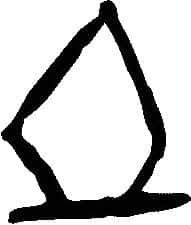是一整块泥土，这块土黏性高，紧紧地团成一团。到了西周金文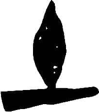，它变成了黑黝黝的一块，虽然形象，但写起来有些麻烦，也不美观。因此，“土”开始慢慢地线条化，到了战国文字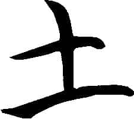，它已经变成了两横一竖，直到今天都是如此。

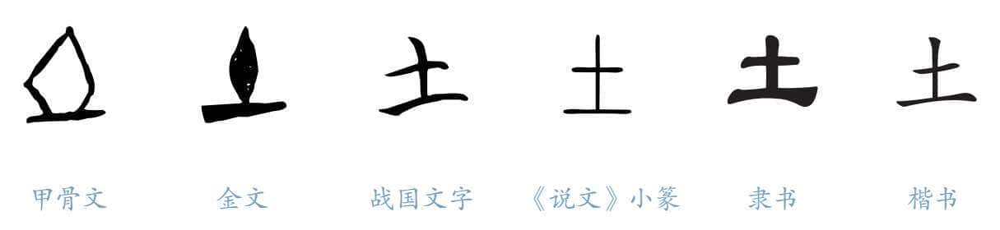

《说文解字》是怎么解释“土”的呢？许慎先生说：“土，地之吐生物者也。二象地之下、地之中物出形也。”在他看来，“土”的两横代表着地下植物生长的空间。中间的一竖，代表花草树木从土中发芽而出。

土是大自然的生命源泉，是万事万物滋生长养的根本，在古人心目中尤为重要。因此，它也代表着国家社稷。

春秋时期，晋国公子重耳流亡在外，一次途中饥饿难忍，便向当地的农夫乞讨：“这位老乡，我是晋国公子，给我点儿粮食可以吗？”

“公子？我不认识什么鬼公子！粮食没有，你吃土吧！”农夫拿了一块土，顺手放到重耳碗里。

重耳大怒，他虽然流亡在外，可也是高高在上的公子啊，一个小小的农夫，怎敢如此欺人？他气得七窍生烟，拿起鞭子，要惩罚这个可恶的农夫。

他的舅舅子犯连忙阻止了他：“别生气，这可是上天的吉兆啊！你不是想结束流亡，重归故土吗？人家把土给你，代表你最终会得偿所愿，回归故土。”

重耳顿时消气了，他恭恭敬敬地向农夫表示感谢，带着好兆头继续流亡。

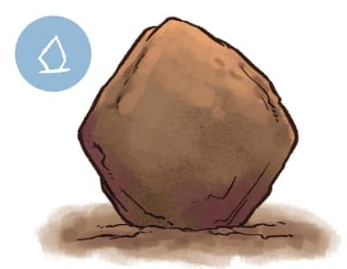

### 地/ “地理”是大地的纹理 /

与土紧密相关的“地”字，是一个形声字，从土也声。虽然现在“也”的读音和“地”差别很大，但在古音中，它们的发音很相似。

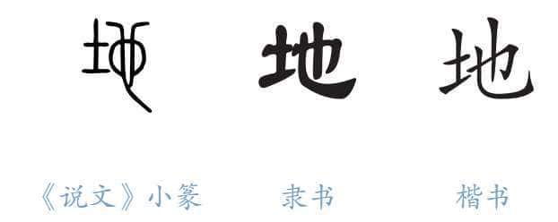

古人对大地的认识充满了神话色彩。许慎先生在《说文解字》中这样描述天地：“元气初分，轻清阳为天，重浊阴为地。”盘古开天辟地，一斧子劈开混沌的世界，代表阳气的、轻飘飘的物质向上飘浮，形成天空；代表阴气的、沉甸甸的物质向下降落，形成大地。这是中国古人对天地的认识。

说到“地”，绕不开我们十分熟悉的一个词——地理。什么是“地理”呢？是地上的道理吗？不是。“理”指事物的自然纹理，顾名思义，地理就是大地上的自然纹理，是鬼斧神工的大自然塑造出的不同风貌。七大洲也好，四大洋也好，都是地壳自然运动的结果。这些自然形成的区分，就是大地的纹理——地理。

## 金  
金光闪闪的金属

黄金，代表着宝贵的财富。可你知道吗？“金属”的“金”字里其实藏着一个“土”字。

从金文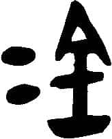到小篆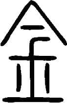，字形虽然有小小的变化，但整体的结构大致相同。“金”字中的两点，是金属块的象形。这两点一开始在字的左边，后来移动到了现在的位置。“金”字古字形的上面是声符“今”，下面是“土”字，因为金属一般埋藏在地下，需要挖掘开采。

许慎先生是如何解释“金”字的呢？他说：“金，五色金也，黄为之长。久薶（mái）不生衣，百炼不轻。”

什么是“五色金”呢？金子不是黄色的吗？要知道，这里的“金”是广义的金属。一般金属有五种颜色，在古代，白金指银子，青金指铅，赤金是铜，黑金是铁，当然了，还有黄色的黄金。

“金”泛指金属，很多表示金属名称的汉字，比如“银”“铜”“铁”“锡”等都是金字旁。我们把青铜器上的文字称为“金文”，古代打仗时要“鸣金收兵”，这里的“金”都是广义的金属，不是黄金。

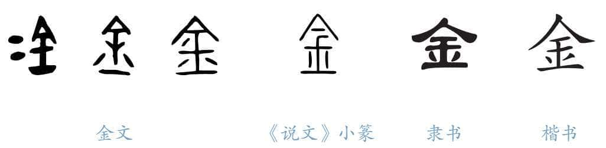

“黄为之长”，在各种各样的金属中，黄金是最好的。它有两个特点，一是“久薶不生衣”，“薶”是“埋”的假借字，把黄金埋在土里，哪怕过了很久，它也会光亮如新，不会生锈。它的第二个特点是“百炼不轻”，无论怎样锤炼，黄金也不会变轻，反而质地会更加坚韧。

正因为黄金的稳定和稀有，所以在很早以前，古人就用黄金、白银等贵金属作为流通的货币。因此，古人把金属做的货币统称为“金钱”。

黄金贵重，也可以用来比喻尊贵的状态。古人形容皇上说的话，叫作“金口玉言”，既体现出帝王的尊贵，又包含了一种威严的、不容置疑的含义。古人形容美好的姻缘，叫作“金玉良缘”。什么意思呢？感情像黄金一样牢固，像玉石一样美好。

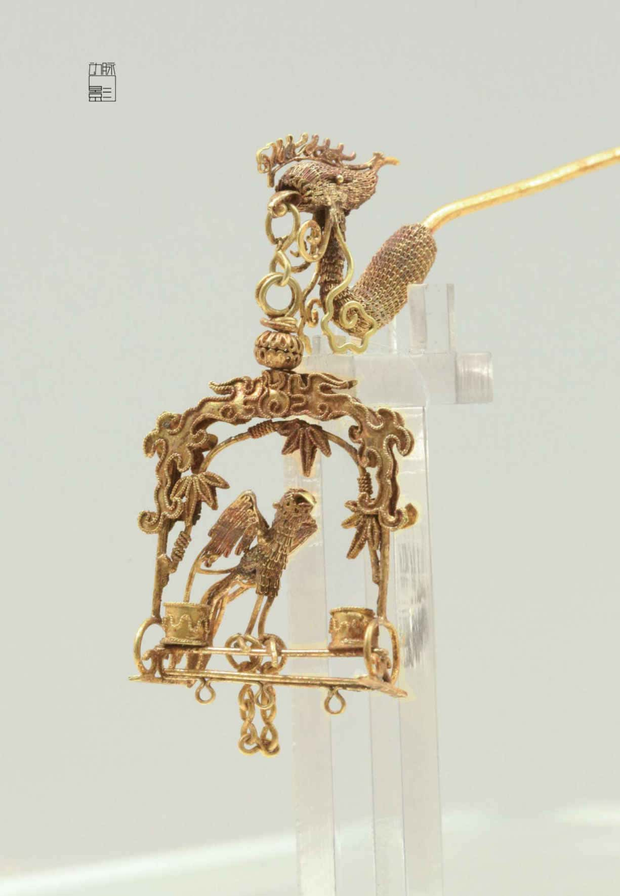 
清/凤鸟金簪/首都博物馆藏

## 社  
土地的神灵

“社”组成了“社会”“社稷”等宏大而复杂的概念，这些概念和“社”字的关系是什么？“社”字里又为什么有个“土”呢？它和土地之间，又有什么关系呢？

答案，还要从汉字本身说起。

“社”的右边是一个“土”，左边是一个“示”。这里的“示”就是我们通常说的“示补旁（礻）”。“示”是一个象形字，其甲骨文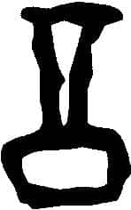画的是古人祭祀祖先、神灵时用的牌位。所以，以“示”为部首的字，多与神灵有关，比如“祖”“祀”“神”“祈”等。

“社”是一个会意字，指和土地有关的神灵。在《说文解字》中，许慎先生把“社”解释为“地主”。

咦，土地神怎么成了地主呢？别误会，这里的地主不是指拥有很多田产、欺负农民的土豪，而是大地的主人，也就是土地神的意思。

说到“社”，我们会想到“社会”“社稷”。

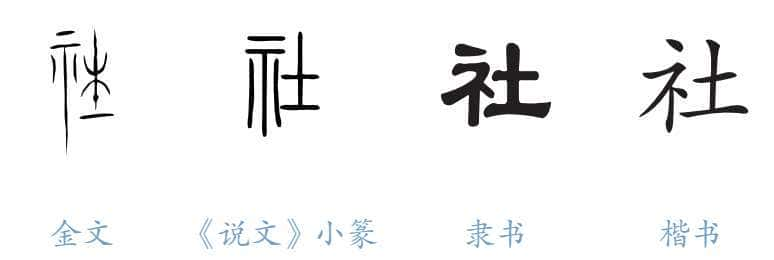

什么是“社会”？在古代，祭祀土地的地方也被称为“社”，祭祀时人们在“社”里聚会，这就是最早的“社会”。聚会时产生了人群，慢慢地，“社会”这个词有了表示人类群体的内涵。因此，当我们说起“社会”这个词的时候，你要知道，它和我们赖以生存的土地，和古人敬重祭祀的土地神，都是密不可分的。

至于“社稷”“稷”是禾木旁，表示这个字和农作物有关。“稷”右边的“畟”（jì）是声符，表示读音。《说文解字》说“稷”是“五谷之长”，“五谷”就是我们常说的五谷杂粮。“社”是土地神，“稷”是谷物神，农业是古代国家的根基，皇帝祭祀土地神与谷物神，祈求国泰民安、五谷丰登，“社稷”也就慢慢变成了国家的象征。

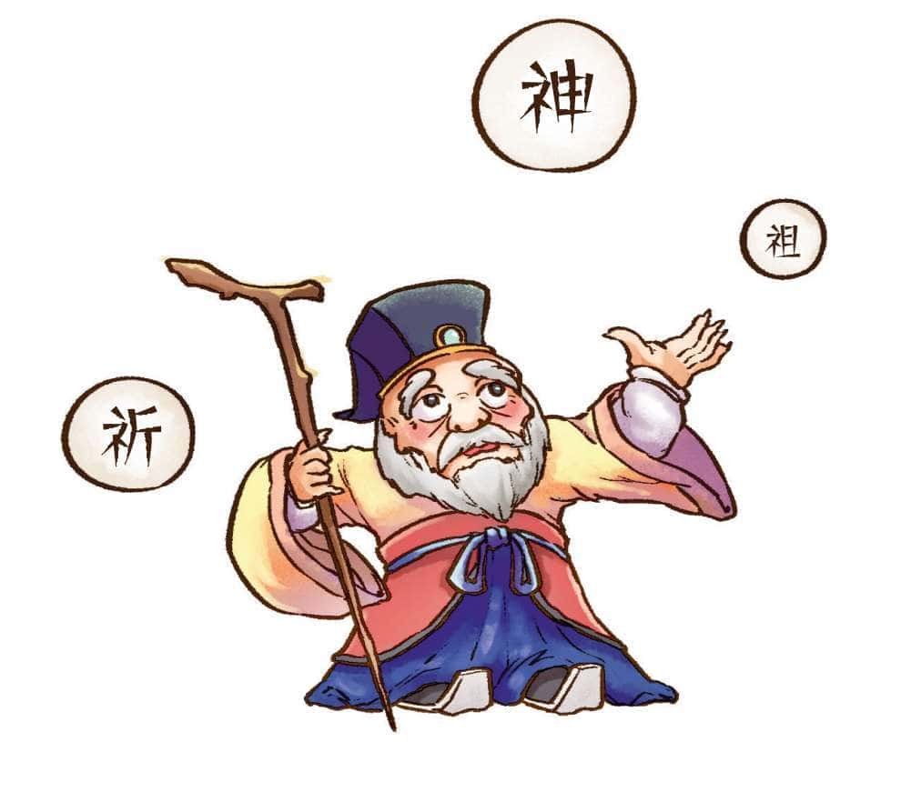

## 基  
古人如何筑墙？

土，是自然万象生命力的源泉，也是古代建筑的重要材料。在汉字中，和“土”有关的字，也往往与房屋有关。

在这一讲，我将为你介绍一个和“土”与房屋密不可分的汉字，它就是“基”。

“基”的甲骨文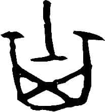，上面是“土”，下面是“其”。到了金文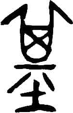，上下颠倒了过来，上面是“其”，下面是“土”，然后就这样一直沿用至今。“基”是一个从土其声的形声字。那么，“基”和“土”的关系是什么呢？

这个问题的答案，许慎先生在《说文解字》中已经告诉我们了，他说：“基，墙始也。”“基”指的是筑墙的开始。

古代筑墙与今日不同。在今天的工地上，工人筑墙靠的是砖和钢筋混凝土，但在古代，特别是比较原始的时期，造墙不是用砖，而是用土。

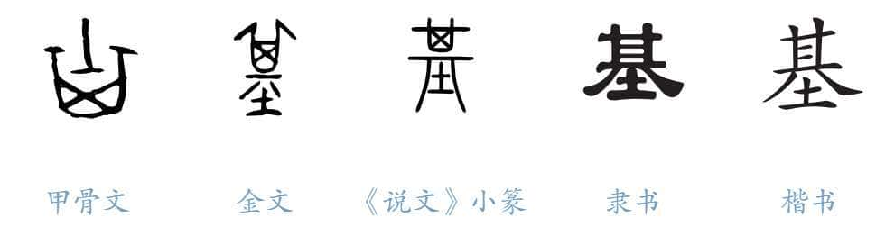

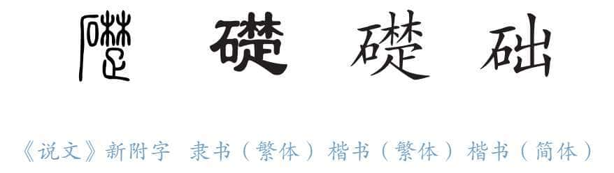

怎样用土筑墙呢？聪明的古人有一整套办法。他们先用两个粗大的木柱，立在墙的左右两边，这是保证墙体端正的根本。之后，夹着两个柱子，竖两块平行的、长长的木板，叫作“版”。最后再往两版中填土，并用杵把土凿实，筑成土墙。在筑墙的过程中，在最下层垒土是筑墙的起始，也是墙的根本。墙能不能筑好，关键在于一开始是否把土夯实了。

明白了筑墙的过程，也就能理解“墙始也”的内涵了。“基”是筑墙的根本，也由此引申出根本、基础的意思，可以组成“基石”“奠基”等词。

“基”常用于“基础”，我们已经知道“基”是筑墙的开始，那么“础”又是什么呢？在“础”的繁体字——“礎”中，左边是“石”，右边是“楚”，这是一个从石楚声的形声字。后来汉字简化，人们给它替换了一个字形简单的声符“出”，将其简化为“础”。

《广韵》[1]中说：“础，柱下石也。”“础”是柱子下面垫着的那块大石头。因此，我们也就可以理解“基础”为什么会连用了——“基”是墙的起点，“础”是柱子的起点，它们都有“起点”与“根本”的意思。

* * *

[1] 《广韵》是宋时官修的一部韵书。韵书是将同韵字编排在一起的字典，古人写作韵文时可以用来查检。

# 阜

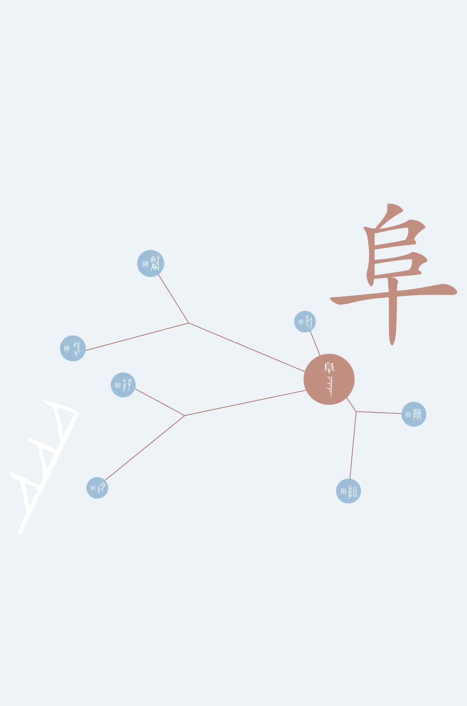

## 阜·陟·降  
让人误解的偏旁——阝

仁者乐山，巍峨的高山稳重泰然，寄寓着仁者的品格。在汉字中，由“山”组成的字往往与山峰有关，比如我们熟悉的“巅”“峰”“岩”“峦”等。但也有一些字虽不含“山”，却与山有关。比如这样一组字：陟（zhì）、降、陵、险、阻……这些字有什么共同之处呢？

没错，它们的偏旁都是“阝”——“耳刀旁”。需要注意的是，耳刀旁和耳朵可没有什么关系，这是一个和“肉月旁”一样，名字让人产生误解的部首。

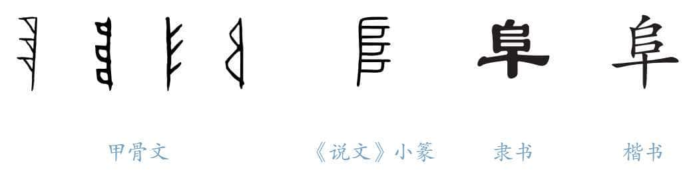

“阝”来自“阜”（fù）。在现代汉语中，我们很少用到“阜”这个字，对它可能比较陌生。“阜”在甲骨文中有许多写法，它们是什么意思呢？

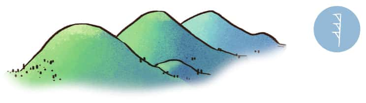

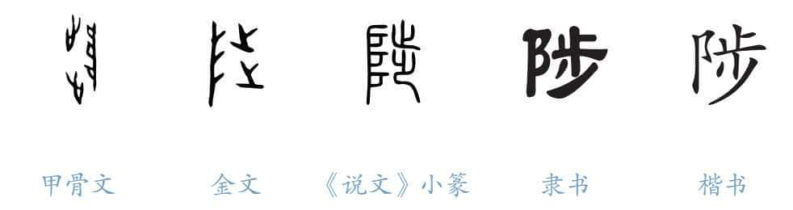

想要找到答案，要先看看古文字中的“陟”和“降”。

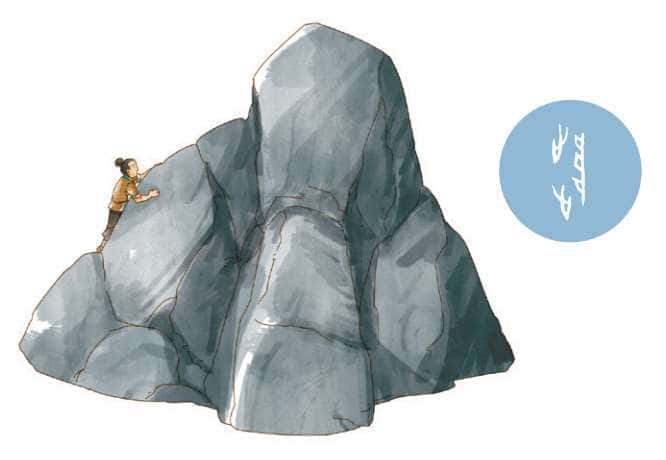

“陟”和“降”在甲骨文中，左边都是两个脚丫，一个脚趾向上，一个脚趾向下，一个向上走，一个向下走。它们右边的字形，和“阜”一样。“陟”表示登山，“降”表示下山。字形左边的耳刀旁“阝”，画的是山坡层层堆叠的样子。

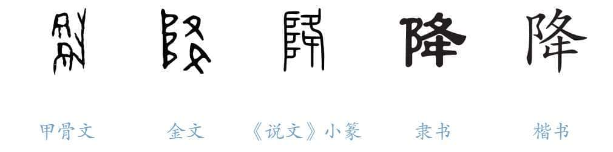

《说文解字》是如何解释“阜”字的呢？许慎先生说：“阜，大陆，山无石者。”“大陆”在古代指的不是陆地，而是高大的山坡。“山无石”是没有石头的土山。“阜”最开始的意思，是巍峨高大、层层堆叠的土山。正因如此，以“阝”为偏旁的汉字往往与山有关。

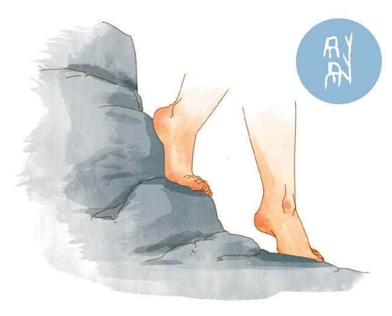

## 陵  
帝王的坟墓

“陵”与“阜”之间，是大与小的区别。《说文解字》说：“陵，大阜也。”与“阜”相比，“陵”是更加高大的土山。

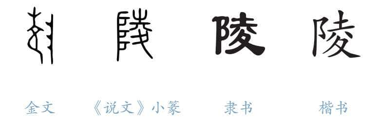

《诗经》中有一首《十月之交》，里面有一句描述世界变化的诗：“高岸为谷，深谷为陵。”高山变成了低谷，低谷变成了山陵。这句诗和“沧海桑田”一样，描述了时间的流逝，自然的巨变。这种巨变真切地发生在历史中，通过考古发掘，我们在高原、山区发现了各种海洋生物的化石，这就是“深谷为陵”的见证。

在古代，“陵”还可以指帝王的坟墓。为什么他们的坟墓被称为“陵墓”呢？因为帝王的坟墓“依山为陵”或“堆土成陵”，皇帝的尸身和丰厚的陪葬品埋葬在高高的土山之下，所以叫“皇陵”。

十三陵是明朝十三位皇帝陵墓的简称，位于北京昌平区天寿山下。明成祖朱棣之所以把皇家陵墓选址在首都北京附近，是因为对封建帝王而言，祖先的皇陵是神圣不可侵犯的，把墓地选在北京，就是要自己的后代子孙，在面对外族入侵时，死守皇陵。守住皇陵就守住了北京，也就守住了国土。

在十三陵中，规模最大的是明成祖朱棣的长陵，最有名的则是明神宗朱翊钧的陵墓——定陵。明神宗是个既贪婪又昏庸的皇帝，他十岁登基，贪图享乐，才二十三岁就开始为自己的身后事做准备，花了六年时间、八百万两白银修建了定陵。定陵出土了一批著名的国宝级文物，比如精美的皇后凤冠。

除了十三陵，有机会的话，你一定要去看一看其他皇陵。比如陕西咸阳的乾陵，那是武则天和唐高宗李治合葬的陵墓；江苏南京的孝陵，是明太祖朱元璋的陵墓；陕西西安的秦始皇陵，那真的是一座很大很大的土山！

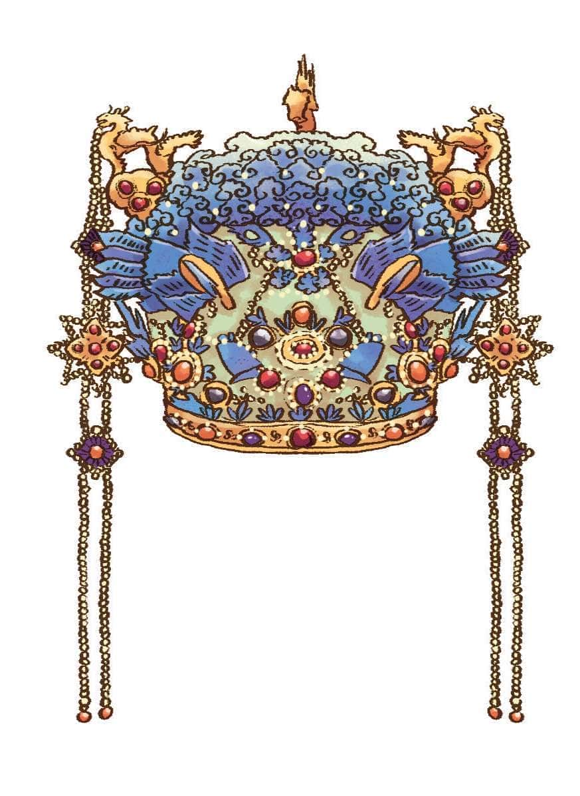

## 险·阻  
克服山的险阻

“险”“阻”也都从阜，表示艰难困苦。

《说文解字》说：“险，阻难也。”高山横亘，阻碍前行；高山陡峭，攀爬时一不小心就会摔落山崖，丢掉性命。危险与阻隔，是“阜”的两个重要特点，也体现在“险”“阻”二字，以及与它们相关的词语中。

先看“险”字。我们把陡峭的地势形容为“险峻”，将战争中的要紧地点称为“险要之地”，把“一夫当关，万夫莫开”的关卡叫作“险关”。还有“天险”，那是大自然形成的险峻地势。在战争中，“天险”往往是兵家必争之地。在赤壁之战中，孙权和刘备联合打败强大的曹操，很大程度上靠的是长江天险。

至于“阻”字，“阻断、阻隔、阻拦、阻碍”，都有遮挡、障碍的意思，让人很不痛快。

在生活中，我们难免遇到各种麻烦，遭遇各种“险阻”。与其退缩，不如直面险阻，昂首向前！法国大文豪巴尔扎克在生活陷入困境之时，买了一根镶嵌着玛瑙石的粗大手杖，在上面刻了一行字：“我将粉碎一切障碍！”这种气魄，真令人神往，我也把这句话送给你。

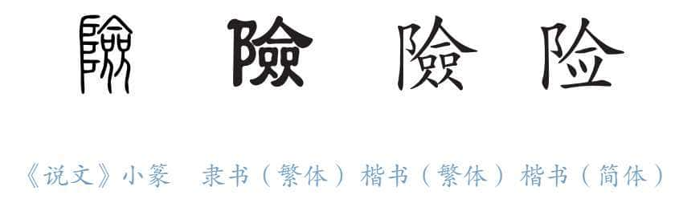

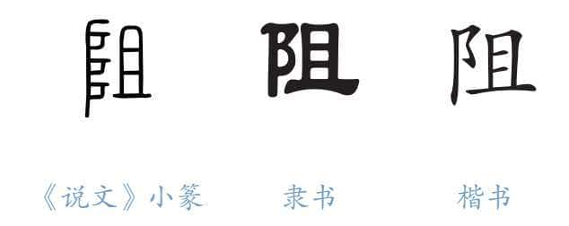

## 阴·阳  
阴阳大道里有座山

在中国文化中，“阴阳”是特别重要的概念。你看到过充满神秘感的太极图吗？阴阳鱼盘旋游动，相依相靠，体现出了丰富的文化内涵。

在汉字中，“阴”“阳”的部首都是“阜”字。如果说，阴阳和日月的关系显而易见，那么，它们和山又有什么关系呢？

“阴”“阳”二字，最开始是形声字，一个从阜侌（yīn）声，一个从阜昜（yáng）声。我们先来看看它们的含义。

《说文解字》中说：“阴，暗也。”深夜之中，那种黑漆漆、没有光、不明朗的状态就是暗，也就是“阴”。对于“阳”，许慎先生解释为“高明也”。太阳高高挂在天上，越高的地方，离太阳越近，也更为明亮。

明暗状态和大山的关系是什么呢？许慎先生说，“阴”是“水之南，山之北也”。在中国，山是分阴阳的，“阴”指山的北面，“阳”指山的南面。听起来抽象，其实这与中国的地理位置密不可分。中国位于北半球，山的南面更易被阳光照射，阳光充足，明亮温暖，所以属“阳”。山的北面背光，冬天积雪不易融化，更为阴冷，所以属“阴”。

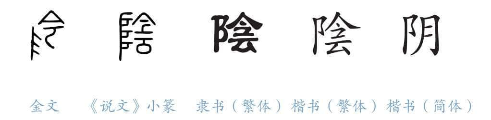

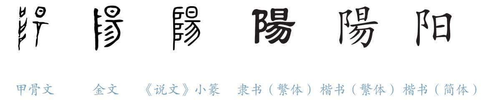

由此可见，古人对阴阳的理解，与大山密不可分。在造字时，就选用了表示山的“阜”来作为部首。后来，“陰”“陽”经过简化，变为今天的“阴”和“阳”，也变为了会意字，字义也更为直观——“阴”从月，“阳”从日——月亮出现在阴暗的夜晚，代表了阴；太阳出现在亮堂的白天，代表了阳。

后来，阴阳的概念继续衍生发展，它不仅表示山的阴面与阳面，更形成了中国文化中一对很重要的概念。在古人看来，宇宙万物都分阴阳：天为阳，地为阴；男为阳，女为阴；上为阳，下为阴；日为阳，月为阴……

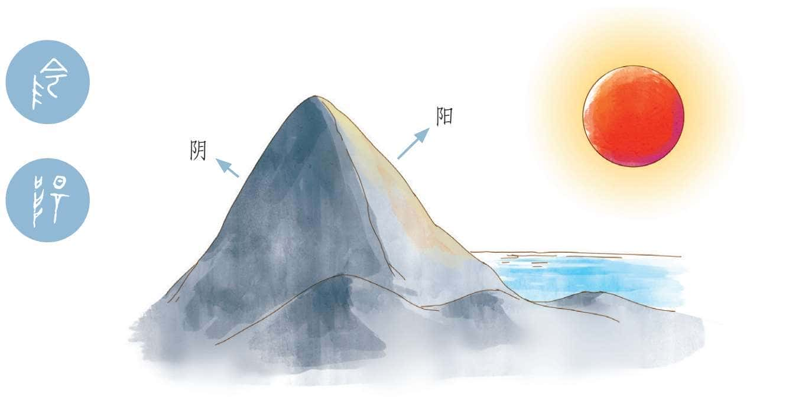

万物分阴阳，人的性格也有阴阳。一个人性格“阴暗”，说的是他总有坏想法，“蔫（niān）儿坏”。相反，有的人性格开朗爽快，我们就说他特别“阳光”。

古人认为“一阴一阳谓之道”。这句话是什么意思呢？万事万物都有阴阳，把握住阴阳的规律，也就把握住了大道的根本。那么，阴阳的规律又是什么呢？

太极图中就蕴含着阴阳的基本规律。图中黑白分明的形状，恰似两条小鱼，古人将它们称作阴阳鱼——黑色的是阴鱼，白色的是阳鱼。有意思的是，黑鱼的眼睛是代表“阳”的白色，白鱼的眼睛是代表“阴”的黑色。这代表着阳中有阴，阴中又有阳。

太极图向我们揭示出了阴阳的关系：阴阳是对立的，有时“水火不容”，但有时又能相互转化。比如季节，冬天为寒为阴，夏天为暑为阳，二者对立，无法共处。但是寒来暑往，四季轮转。夏天阳气最重的一天是夏至。在这一天，太阳位于北回归线附近，这是太阳可以到达的最北端。过了这一天，太阳就要向南移动，等到它移动到南回归线附近时，就到了冬至，这一天阴气最重。阳气最重的时候，阴气也在悄悄苏生，夏至过后的每一天，都是向冬天迈开脚步。而阴气最重的时候，阳气也在悄然萌动，过了冬至，太阳又要往北移动了，我们离夏天也就越来越近。

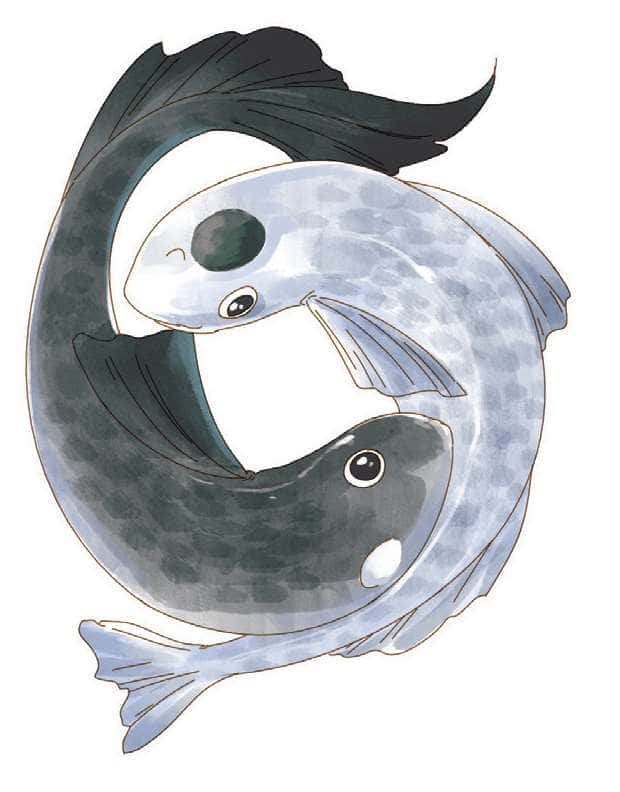

从春到夏，从夏到秋，从秋到冬，再回到春天，一年四季恰恰是一个从阴到阳、从阳到阴的过程，其中体现出阴中有阳、阳中有阴，阴阳之间互相对立，也互相转化的辩证关系。

其实，万事万物均是如此，不是非黑即白，不是矛盾冲突，而是求同存异、互相补充、互相转化。正因如此，世界才丰富多彩、运转如常。

# 屮

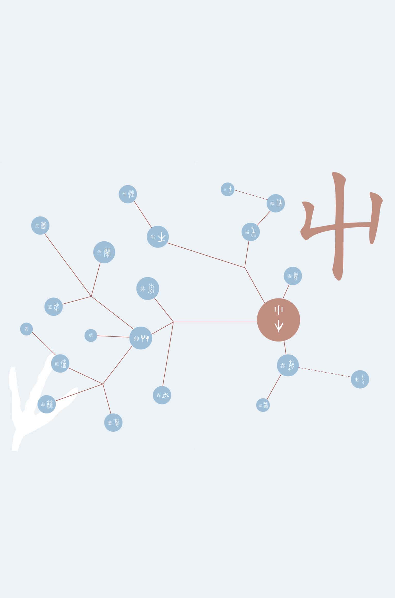

## 屮·草·卉·芬  
草字头的故事

在汉字里，“草字头”是个很常见的部首，很多与花草有关的字都有草字头，比如“草”“芬”等，都意味着大自然的蓬勃生机。

讲草字头，还要从一株古代的小草说起。

### 屮/ 一棵柔嫩的小草 /

在汉字里，表示一株小草的字，写作“屮”（chè）。

这个字出现得很早，在甲骨文中就已经出现了，它画的是一株小草向上生长的样子。从甲骨文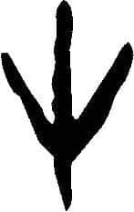到楷书的“屮”，这个字的形体一脉相承。尽管它并不常用，但在古代它确实是一个独立的字。

《说文解字》是怎么解释“屮”的呢？许慎先生说：“屮，草木初生也。象丨出形，有枝茎也。”

“屮”是草木刚刚长出来的样子。中间一竖念gǔn，是初生的小草，它向上生长，伸出了三个小小的嫩芽。这是一个典型的象形字。在汉字中，“屮”单独使用的情况不多，但它是一个很常用的构件，参与创造了许多其他汉字。在古文字中，“芬”“草”等字里都有“屮”。

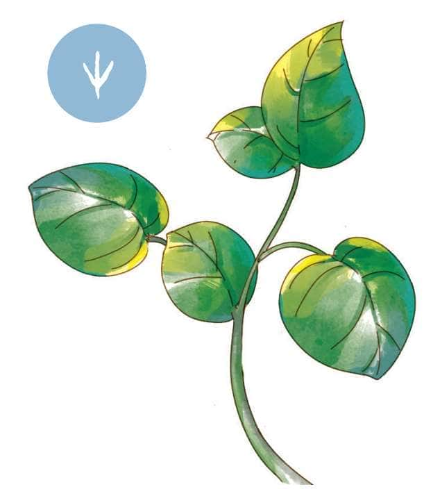

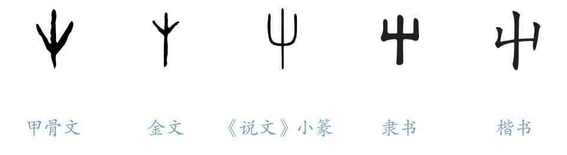

### 草/ 两株小草 /

一株小草是“屮”，两株小草是“艸”（cǎo）。

和“屮”一样，“艸”也是一个非常典型的象形字。春天来了，大地从冰封中苏醒，两株小草嫩芽突破冻土，一左一右，在春风中生长，展现出蓬勃的生命力，这就是“艸”字。

《说文解字》说：“艸，百卉也。”“卉”是草的总名，“百卉”就是各种各样的草。“艸”作为汉字的偏旁，写起来笔画多，也不好看。因此，人们把“艸”不断简化，将弯弯的笔画拉直，最终变成了今天的草字头——“艹”。后来，人们还在草字头下面添加了一个声符“早”，将“艸”从象形字变成了形声字“草”。

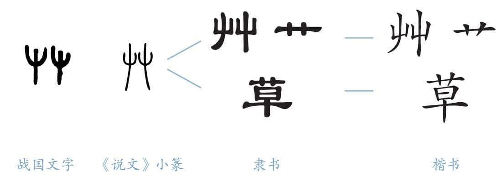

在汉字中，由“艸”组成的字非常多，《艸部》是《说文解字》中的第二大部，一共收了四百多个字，仅次于《水部》。在茹毛饮血的年代，人们生活在森林之中、草原之上，草和他们的生活密不可分。相传神农尝百草，辨明了哪些草适合食用，哪些草适合耕种，哪些草具有药性。古人认识百草的过程，也是创造与草有关的汉字的过程。

在古人的世界中，“草”不是经过修理的平整舒服的草，而是茂密芜杂的野草。在农耕文明中，草并不太受欢迎，它们生命力格外旺盛，密密麻麻，枝蔓相连，如不及时除掉，便会影响农作物的生长。因此，古人对“草”可没什么好印象，还赋予了它杂乱无章的含义。所谓“草草收场”“草草处理”，“草草”就是像野草一样的杂乱无章、简单随意。还有写字“潦草”，“潦”最初指雨水充沛，积水横流，在这里，写字不规矩，冲出了格子，就是“潦”。“潦草”就是写字像杂草一样，乱七八糟，毫无章法。

### 卉/ 百草的世界 /

讲完了“草”，我们再看“卉”字。

“卉”字看着很抽象，但如果看小篆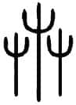，你就会发现它是由三株小草组成的。现在的“卉”，是将三株小草笔画拉直后的结果。

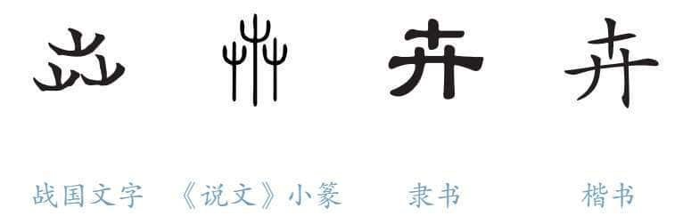

“卉”是什么意思呢？

许慎先生说：“卉，草之总名也。”它泛指各种各样的草。有一个词叫“花卉”，其实就相当于花草。

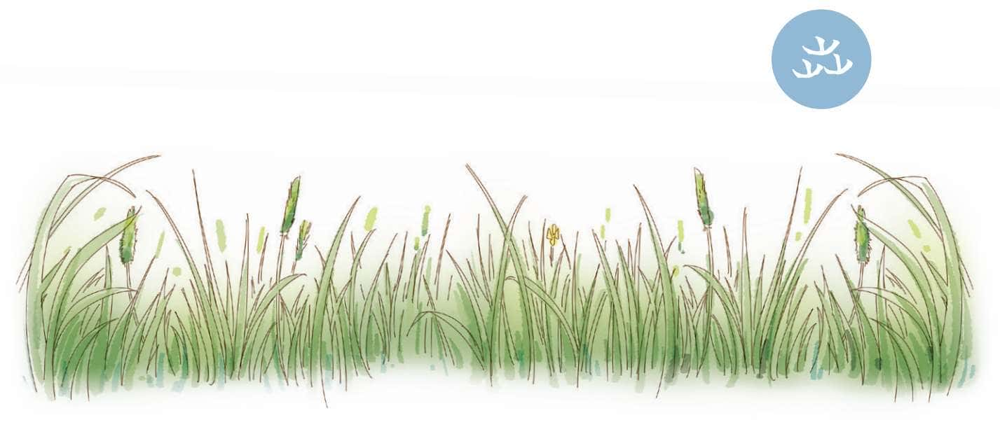

### 芬/ 青草四散的芬芳 /

“芬”字的意思是芳香，芳香和草有什么关系呢？

许慎先生说：“芬，草初生，其香分布。从屮从分。”“芬”字在古文字中，有的上面有一株草，比如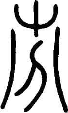，有的上面有两株草，比如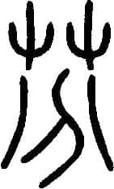。小草刚刚破土而出的时候，有一种自然的香味，这种香气向上升腾，散播各处，便是“芬”。

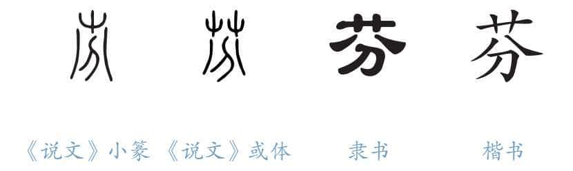

在汉语里，“芬芳”这个词表示香气，也用来比喻美好的德行或名声。

汉代崔瑗[1]的《座右铭》说：“行之苟有恒，久久自芬芳。”他在提醒自己，只要坚持高尚的情操，君子的名声一定会像香气一样长久散布。

* * *

[1] 崔瑗，东汉文学家、书法家。善章草，也擅长小篆。

## 生·性·端  
生命的开端

如果你见过一棵柔嫩的小芽第一次从土里冒出头的样子，你一定会激动不已。这种激动与喜悦，是从生长中获得的感动。

在这一讲，我们就通过“生”“性”“端”三字，一起见证生命的萌发与开端。

### 生/ 生生不息的小草 /

“生”在古文字中的形体是怎样的呢？

你看，从甲骨文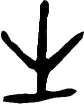到金文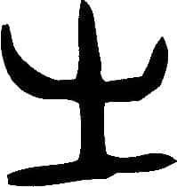、小篆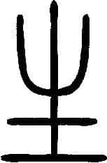，“生”的字形一脉相承——上面是“屮”，是向上生长的小草芽，下面是“土”。《说文解字》是怎么解释“生”的呢？许慎先生说：“生，进也。象草木生出土上。”生长，是一种前进的力量，是草木破土而生的样子。一株柔弱的小苗，以幼小的身躯破土而出，这不正是对生命力最好的诠释吗？这样的字形，淋漓尽致地表现出“生”的内涵。后来，到了隶书和楷书中，的笔画被拉直，变成了现在的字形“生”。

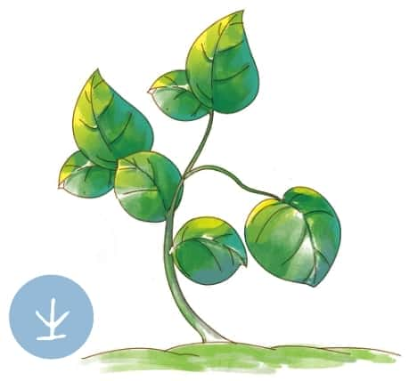

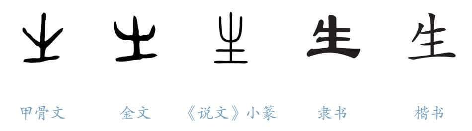

古人重视生生不息的力量，《周易》中称“天地之大德曰生”，生生不息的气象是天地之中的伟大力量，是大自然的根本属性。

### 性/ 人性的开端是善是恶？ /

“生”字加个“忄”就是“性”字。“性”一般用于“本性”“性别”等词，可这个字的字义和“生”有什么关系呢？

“生”代表生命的开始，人生命开始时的本性，便是“性”的本义。古人认为本性与心有关，所以为这个字配上表示心灵的部首——“竖心旁（忄）”。

对于人的本性，古人有两种针锋相对的看法——“人性本恶”和“人性本善”。同属儒家学派的荀子和孟子，他们的意见却大相径庭：荀子比较悲观，他认为人性本恶，人的天性像动物一样好利、疾恶、好声色，而道德意识是后天通过社会环境和教育影响习得的。孟子则比较乐观，他认为恻隐之心是人性的开端。所谓“开端”，不是说生下来就能做到至善，而是有一颗小小的善的种子，在你诞生之初，便住在了你的心里面。

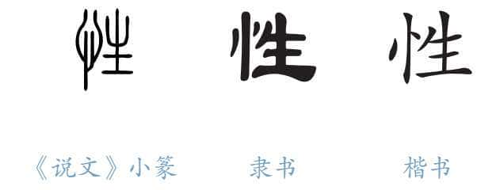

这颗善的种子叫恻隐之心。当你看到遭遇不幸的人，甚至是可怜兮兮的小动物时，内心一动，生出一种本能的怜悯，这就是恻隐！为了让我们明白恻隐之心真实不虚，孟子举过一个有趣的例子：有一个小婴儿，在地上爬呀爬，眼看就要掉进一口井里，你会怎么办呢？

“危险！救他！”

没错，不管是谁，看到这个小婴儿，都会把他抱离井边。孟子分析道，人们救婴儿，“非所以内交于孺子之父母也，非所以要誉于乡党朋友也”，并不是为了和婴孩的父母结交，让他们欠自己个人情，也不是为了在乡邻中获得一个好名声。救这个婴孩完全出于人的本性，出自每个人都具备的恻隐之心。一个人的成长，要爱惜、养护心中那缕人性之初的善念，让人性光辉的种子生根发芽、茁壮成长。

### 端/ 小草初生 /

恻隐之心是人性的开端。

“端”有起点和开端的含义，这个字看着比较抽象，它的字形从何而来呢？为什么这个字被放在了“屮”这一章呢？

其实，“端”字诞生的时候，字形里没有“立”，只有“耑”。“耑”和“生”一样，也是小草破土的样子。许慎先生说：“耑，物初生之题也。上象生形，下象其根也。”“耑”的小篆字形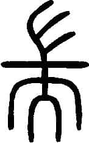，上半部分像小草生长的嫩芽，下半部分像小草的根，中间一横象征大地。标题是一篇文字的开端，“物初生之题”，就是指植物的萌芽与开端。

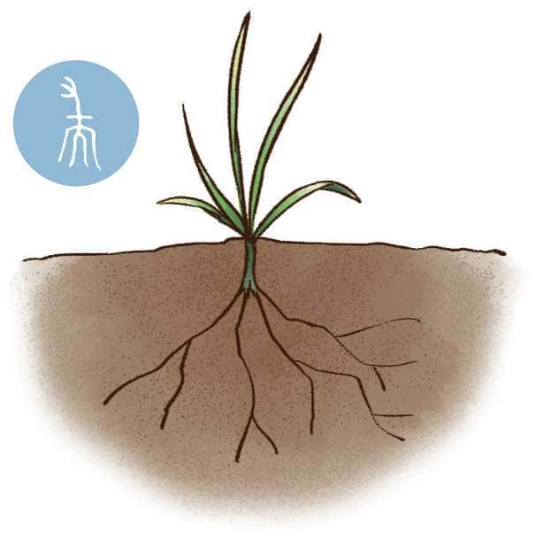

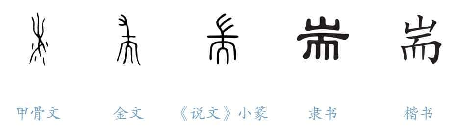

后来，古人为“耑”增加了部首“立”，于是就有了“端”字。

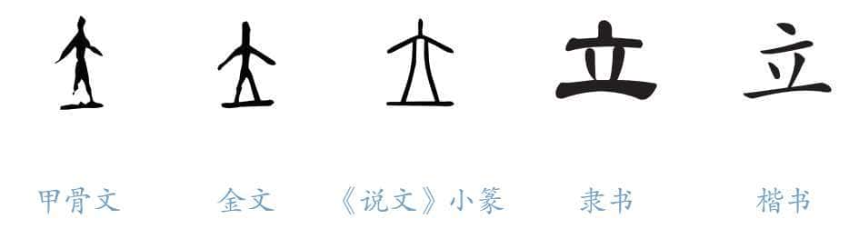

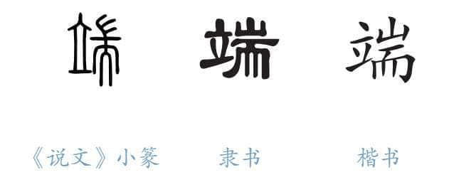

加“立”，是因为古人认为人很重要，是“天地之心”“五行之端”。“立”字在造字之初，就是一个人昂首挺胸，站在大地上的样子。因此，“端”里有个“立”字，表示“端正”站立之义。

## 芝·萱·兰  
灵芝起死，萱草忘忧

根据古代传说，神仙居住的仙山上，种植着各种各样的仙草，它们有着起死回生的妙效。仙草寄托着古人对于健康长寿的追求。在这一讲，我给大家介绍三种古人心中的神草——芝、萱、兰，看看它们都有哪些奇异之处。

### 芝/ “起死回生”的灵芝 /

在古文字中，“芝”上面是我们熟悉的草字头“艹”，下面是声符“之”，从艸之声，是一个形声字。

“芝”最初指灵芝，今天我们都知道灵芝是一种真菌，但在古人心目中，灵芝可是最宝贵的神草。《说文解字》说：“芝，神草也。”晋代学者郭璞[1]也说：“芝，一岁三华，瑞草。”相传灵芝一年可以开三次花，是祥瑞的象征。不仅如此，它还包治百病。

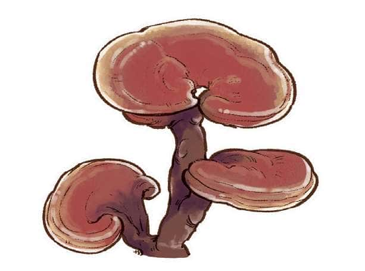

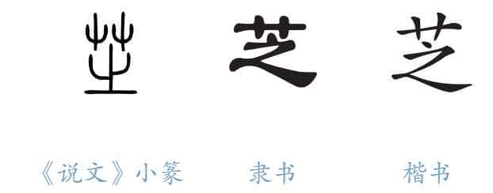

正因如此，灵芝在中国文化中被赋予了神奇的色彩。《山海经》中炎帝的女儿瑶姬去世之后，就变成了瑶草，后世演义为灵芝。《白蛇传》中，为了救昏死过去的夫君许仙，千年蛇精白娘子和丫鬟小青冒着生命危险，去南极仙翁那里偷取仙草——千年灵芝。除了故事、传说，灵芝也出现在各种吉祥的图画里，经常和松柏、龟、鹤、竹、祥云等搭配构图。

### 萱/ 忘忧草与黄花菜 /

讲完了灵芝，我们再看另外一种神奇的草——萱，不少人的名字中都有这个“萱”字。

在《说文解字》中，“萱”字有另一种复杂的写法——“藼”，这是一个从艸宪声的形声字。许慎先生对“萱”的解释是“令人忘忧草”，它就是忘忧草。吃下一棵仙草，就能把所有不开心的事情忘掉。

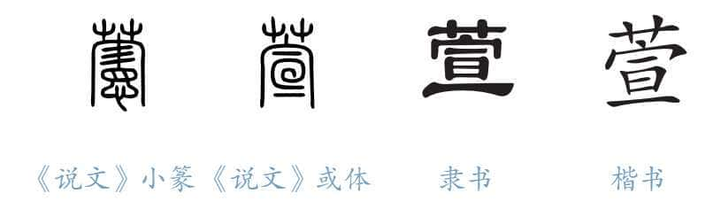

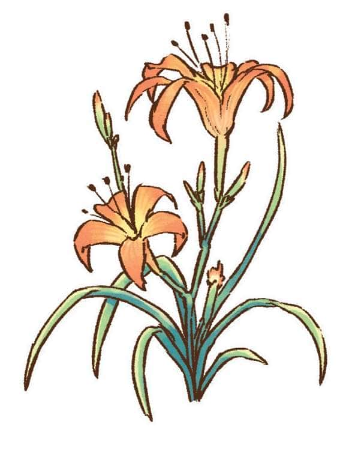

但神奇的仙草可遇而不可求，《诗经》中就有一句感慨“安得萱草”——究竟到哪里才能找到神奇的忘忧草呢？

先别急着找，忘忧草真的可以忘忧吗？

当然不能！其实，这只是古人美好的愿望，在现实生活中，萱草可没有想象中的那样神奇，它其实就是我们平时常见的黄花菜。

咦，古人为什么把黄花菜当作消除烦恼的仙草呢？

从中医的角度来讲，忘忧草这个名字也有一定道理。要知道，黄花菜有疏肝解郁的功能，当你心情不愉快、肝气郁结的时候，用一点儿黄花菜煮水喝，可以帮助调节情绪。

### 兰/ 什么是“义结金兰”？ /

讲完了两种神奇的草，再来看中国文化中最著名的香草——兰！

在繁体字中，“兰”写作“蘭”，是一个从艸阑声的形声字。《说文解字》说：“兰，香草也。”兰花弥漫着醉人的幽香。

“兰”在中国文化中一直是馨香美好的象征，我们说一个女孩子“兰心蕙（huì）质”，就是说她心灵美好，犹如兰花。

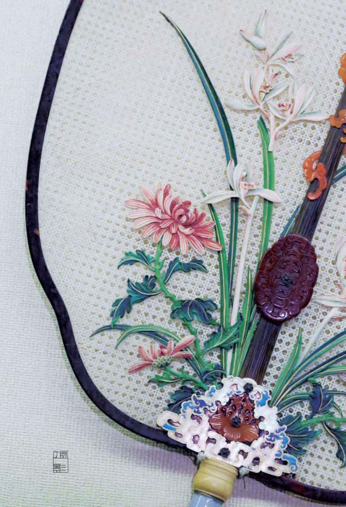 
清/象牙编织嵌象牙染雕兰菊纹团扇/故宫博物院藏

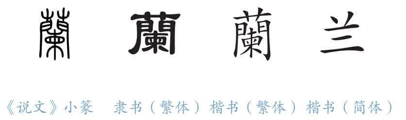

除此之外，“兰”品格高洁，它与梅、竹、菊并称为“四君子”[2]。诗人爱兰，将其入诗。在屈原的《离骚》中，有“纫（rèn）秋兰以为佩”的佳句。想想看，一个瘦瘦的男子，戴着高高的帽子，佩着长剑，身上再挂着兰花，是不是有点儿奇怪？其实，这是一种浪漫的象征写法，屈原佩戴兰花不是爱美，而是昭显自己的品德——志向高洁，犹如幽兰。

兰花的芳香，还能象征人与人之间的情谊。《周易》中有这样一句话：“同心之言，其臭（xiù）如兰。”人与人之间团结友爱，互相信任，这种情谊就像兰草一样芬芳动人。这样的人结为兄弟，就是“义结金兰”——兄弟之间的情谊，像黄金一样坚固，像兰花一样美好。我们熟悉的“桃园三结义”的故事，刘、关、张三人，正是“义结金兰”。

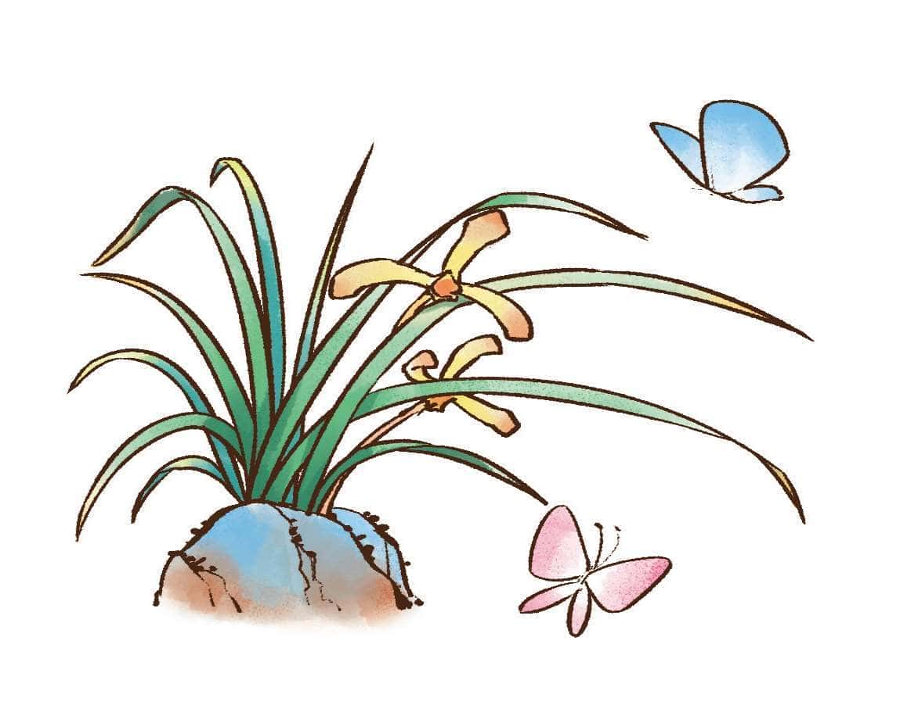

* * *

[1] 郭璞是中国两晋之际的文学家，训诂学家。他学识渊博，通晓古今奇字，擅长天文、历算、占卜。注释过《周易》《山海经》《尔雅》《楚辞》《穆天子传》等古籍。

[2] 明万历年间黄凤池编《梅兰竹菊四谱》，陈继儒题称“四君”，以梅、兰、竹、菊隐喻君子的清高品德。从此，人们称这四种植物为“四君子”。

## 毒  
有毒的汉字

有仙草就有毒草，下面要介绍的是“毒”字。

“毒药”“毒害”“毒蛇”“毒虫”，这个字看起来蛮可怕的。在《说文解字》中，“毒”的上面也是“屮”。你可能会好奇，“毒”里怎么有“屮”呢？毒药和草有什么关系呢？这就要看许慎先生的解说了。

许慎先生说：“毒，厚也，害人之草，往往而生。”这个解释有着丰富的古代文化背景。古人心目中的“毒”，和今天科学意义上的毒素并不相同。今天看来，“毒”是一种毒素，会伤害人的身体。但在古人看来，“毒”和中医讲究的阴阳平衡有关。

在中医文化中，每种药物都有它的属性——或阴，或阳，这是古人对物质的基本分类。人的身体也有阴阳，气是阳，血是阴。健康的人阴阳和谐，而一旦阴阳平衡被打破，人就会生病。中医的治疗理念，就是通过药性的阴阳来调节人体的阴阳。你的阴太盛，阳太弱，就要吃偏阳性的药物，这叫扶阳；你的阳太盛，阴太虚，就要吃偏阴性的药物，这叫滋阴。

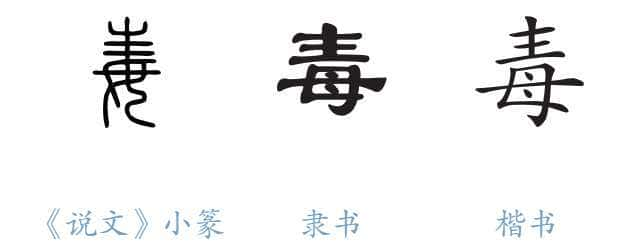

在中医看来，一种药物的阳性或阴性特别强，就有迅速打破人体阴阳平衡的危险，这就是“毒”，它的实质是一种“猛烈的偏性”，也就是“厚”。这样的植物生命力往往格外旺盛，所以叫“害人之草，往往而生”。

比如说，中医里有一味药叫附子，主要出产在四川，阳性特别强。如果不小心吃多了附子，就会导致身体阳盛阴衰、上火头晕，甚至有生命危险。这就是阳性过厚，也就是有毒！

不过，在阴阳运动的观念中，中国人不认为有绝对的“毒”存在。就像我们看到的阴阳鱼一样，阴阳关系是辩证的，它们可以互相转化。附子虽然阳气很重，但对那些阳气极虚的人来说，又往往有起死回生的奇效。在四川，有一个中医流派叫火神派，他们最擅长的就是用附子来治病。

在中国文化中，没有绝对的“毒”，只有不恰当的“毒”。把不好的东西放进一个合适的场域，也能够化腐朽为神奇。这就是中国古代文化中的辩证思想，体现出了古人高度的智慧。

## 姜·蒜·葱  
姜辛蒜辣葱嫩

汉字中有各种各样由草字头组成的汉字，有“香草”“毒草”，也有美味的香料。在这一讲里，我再给大家介绍几种能吃的“草”——姜、蒜、葱。让我们一起来看看它们造字的秘密吧。

### 姜/ 强有力的姜 /

在繁体字里，“姜”和“薑”是两个字。“姜”在古代只用于姓氏，比如我们熟悉的姜太公——姜子牙，而“薑”才是“生姜”的“姜”的本字，它是一个从艸彊声的形声字。后来汉字简化，人们才把两个字合并起来，都写成“姜”。

生姜也是一味药材，《说文解字》说它是“御湿之菜”。在中医看来，姜能够驱散体内的寒气和湿气。“薑”的小篆字形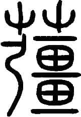，上面是草字头，下面是“彊”，它和“强大”的“强”同源，音相近，意义相通，这表示姜是一种“强有力”的蔬菜！如果感冒了，喝一碗热热的红糖姜水，能发汗散寒，有助身体痊愈。

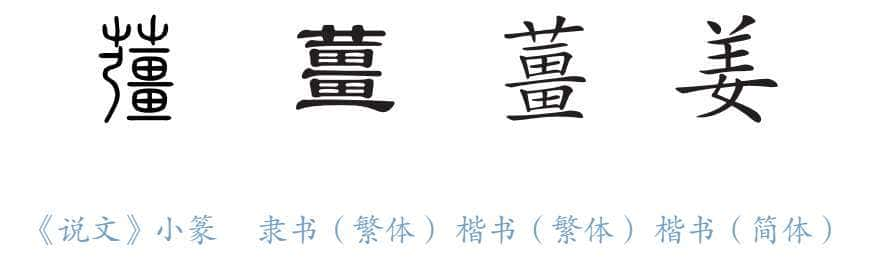

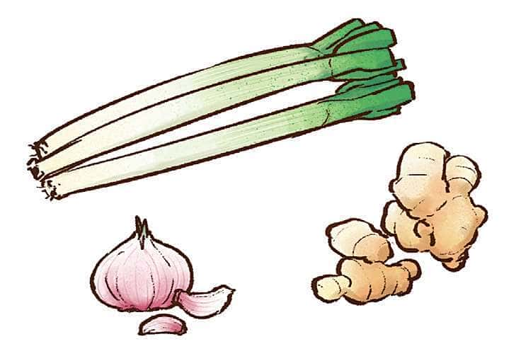

孔老夫子也很爱姜的力量。《论语》记载，孔子吃饭的时候“不撤姜食”，我们的夫子也许胃不太好，每顿饭都要用姜来暖胃佐餐。

### 蒜/ 大蒜和计算 /

《说文解字》中说：“蒜，荤菜。”我们一般认为荤菜是有肉的菜，但在古人看来，气味强烈的菜才叫作荤菜。出家人说的“戒荤腥”里，“腥”指肉，“荤”指葱、韭、芥、蒜等气味熏人的食物。

“蒜”字的下面是“祘”，这并不是两个“示”字，而是一个字，读作suàn。“蒜”是一个从艸祘声的形声字。你知道古人为什么用“祘”作为声符吗？《说文解字》说：“祘，明视以算之。”“示”有展示的意思，明明白白地展示出来，才方便人们计算。“祘”和“计算”的“算”是同源的。古人算数时，会用算筹。算筹是一根一根的小木棍，大蒜剥开后是一瓣一瓣的，和算筹一样，都有一种明明白白数清楚的感觉。因此，古人在创造“蒜”字时，选择了“祘”作为声符。

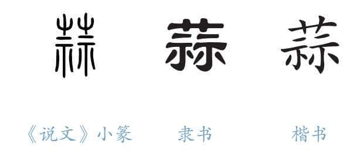

### 葱/ “聪明”的大葱 /

《玉篇》[1]中说：“葱，荤菜也。”葱为什么叫“葱”呢？

“葱”的繁体字写作“蔥”，它与“囱”“聪”都是同源的，含义相近，读音相同。“蔥”中间就是“烟囱”的“囱”字。如果把“艹”去掉，再加上“耳”，“蔥”就变成了“聪明”的“聰（聪）”。

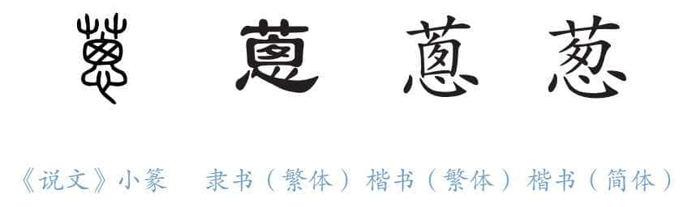

“囱”和“葱”有什么共同点呢？烟囱和大葱的中间都是贯通畅达的。至于“葱”和“聪”的关系，聪明的人思维敏捷，心灵通达，面对难题，心思一动就能找到答案，仿佛没有任何阻碍。

你看，烟囱是建筑物的“中通”，聪明是心灵的“中通”，大葱则是植物的“中通”，它们有着共同的特点：中间通达，没有阻碍。

除中通外，“葱”也用来表示绿色的生机。有一个词叫“郁郁葱葱”，形容植物茂密。“葱葱”指的是嫩绿的颜色，它仿佛蕴含着大自然的无限生机，让我们品味到成长与生命的气息。因此，我们把年轻的时光叫作“青葱岁月”，这可不是说年轻时长得像小葱，而是说青春无限美好，仿佛嫩绿色的春光一样。

* * *

[1] 《玉篇》是由南朝文字训诂学家顾野王编写的字书。

## 春·蠢  
小草破土，大地回春

“一年之计在于春”，春天是一年的开始，也是草木生长的开始。春节，更是中国人最重要的节日。那你有没有想过，“春”这个字是什么意思呢？这一讲，我就来讲一讲“春”字，以及与它有关的“蠢”字。

### 春/ 小草破土就是春 /

“春”字起源很早，甲骨文中就有它了。你看这个字，有“草”或“木”，有表示太阳的“日”，右边还有一个带着小圈圈的奇怪形体，那是甲骨文中的“屯”字。到了小篆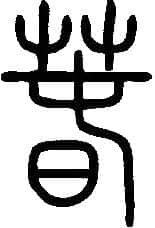，“春”字基本定型，写法十分秀美。

讲“春”之前，我们先来看看“屯”是什么意思。

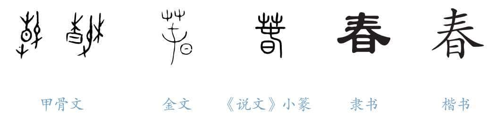

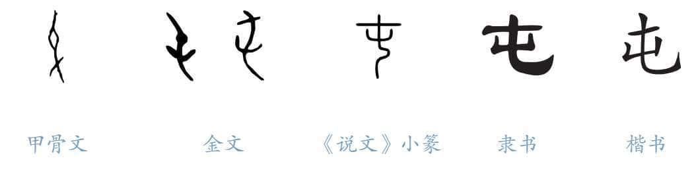

甲骨文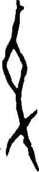是小草破土而生的样子。在小篆中，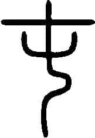的上部是“一”，代表大地。下部是“屮”，就是一株小草的象形。从冬到春，大地冰封，十分坚硬，在这沉重的压力下，小草的根都弯曲起来。不过，坚强的小草依旧努力生长，破土而出！

正因如此，“屯”有在艰难中积极向上生长的内涵。《周易》中有一卦叫“屯（zhūn）卦”，讲的也是在压力中艰难突破的道理。

“春”由“草（或木）”“日”“屯”三个字组成，它是一个会意字，形象地展现出春天万物复苏的样子。

解读了“春”字，便可以更好地理解“春节”。春节是辞旧迎新的日子，是庆祝万物复苏生长的节日。在春节期间，我们不仅可以放鞭炮、过大年，还可以感受天地万物的蓬勃生机，感受那种浓郁、强盛的生命力，这正是春天生生不息的精神气象。

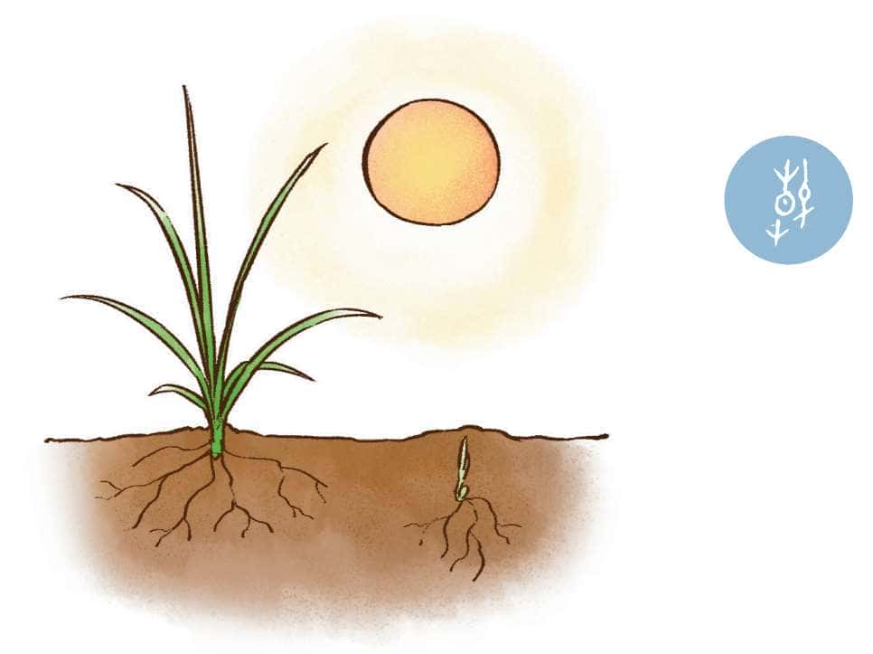

### 蠢/ 春天有点儿“蠢”？ /

在“春”字下加上两只小“虫”，就是“蠢”。问题在于，“蠢笨”的“蠢”，和“春”，还有“虫”有什么关系呢？

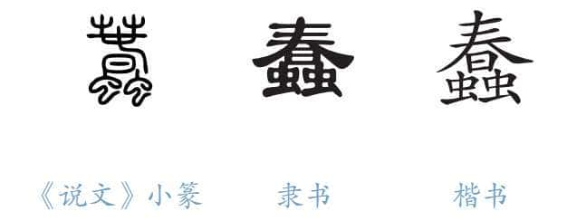

《礼记》[1]中有个很有趣的说法：“春之为言蠢也。”咦，春天很蠢吗？当然不是。《说文解字》将“蠢”解释为：“虫动也，从（kūn）春声。”“䖵”是形符，是昆虫的意思，“春”是声符，表示读音。所以，这个字表示的是春天到了，万物萌生，小虫子都开始出来活动了——“蠢”的本义，是万物蠢蠢欲动。

“蠢”为什么有笨的意思呢？春天里萌动的新生命，生机勃勃，但由于刚刚出生，还有一种天真的、傻傻的样子，这也是“蠢”会引申出蠢笨之义的原因。说起来，“萌”的意思也是如此。我们说一只小猫很“萌”，自然有可爱的意思，但它也一定有憨憨的、蠢蠢的一面。正所谓“凡萌必傻，不傻不萌”，你可以仔细想一想，看是不是这个道理。

* * *

[1] 《礼记》是儒家的重要经典，是对周代礼仪制度的深入阐发，其中《大学》《中庸》《学记》《乐记》等篇目，都是非常重要的文化经典。

# 木

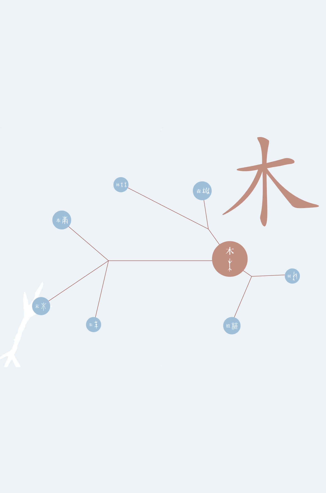

## 木·林·森  
参天巨木，茂密森林

说完了植物世界中的青青绿草，我再来为你介绍汉字中参天的树木与森林。在和草有关的汉字中，有一种有趣的现象：一棵小草是“屮”，两棵小草是“艸”，三棵小草是“卉”。同一个汉字的叠加能造出不同的字。在和木有关的汉字中，也有类似的现象——“木”“林”和“森”。

### 木/ “木讷”原本是个褒义词 /

“木”是一个典型的象形字。甲骨文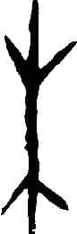是一棵小树，无论树根、树枝还是树干，全都活灵活现。从甲骨文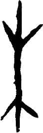到小篆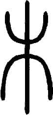，字形一脉相承。随着汉字的发展，到了隶书，“木”的枝杈变得平直起来，便有了今天的写法。

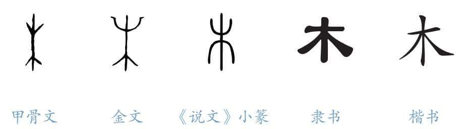

如果让你来解释“木”字，你也许会说：“这有什么难的？木就是树木嘛。”但许慎先生的答案却很特别，他在《说文解字》中说：“木，冒也，冒地而生。东方之行。”许慎先生的解释，应该如何理解呢？

“冒”是向上突破地面的意思，“冒地而生”强调树木生长的特点——破土而出，笔直向上。

那什么又是“东方之行”呢？“行”指五行——金、木、水、火、土，这是古人眼中组成世界的五大基本元素，和东、西、南、北、中五个方向分别对应。“东方”指太阳升起的地方，有着生长的内涵，和树木不断生长的特点相契合。“东方之行”，说的是树木在五行方位中属于东方，具有生生不息的力量。

讲完“木”的来源和含义，再看“木”的用法。“木”经常指木制品，用于“木桌”“木椅”。木头做的东西，当然没有太多的生机和灵气，这种不灵光的状态由物品转移到人，就引申出木讷的意思。

“木讷”一词，在大多数人眼里并不是一个好词，但在孔子看来，却并非如此。《论语》中说：“刚、毅、木、讷近仁。”孔老夫子认为，一个人虽然不善言辞，看起来有些迟钝，但他内心刚强坚毅，做事勤恳踏实，就更为接近仁爱的品质。苏轼的弟弟，同为“唐宋八大家”的苏辙在阅读《论语》时，对这句话也多有赞赏，便在《论语拾遗》中写道：“巧言令色，世之所说（悦）也；刚毅木讷，世之所恶也。”他在感慨，这个世界上，很多人都喜欢巧言令色的虚伪之人，却讨厌那些不善言辞，但踏实勤劳、内心刚毅的仁爱之人。

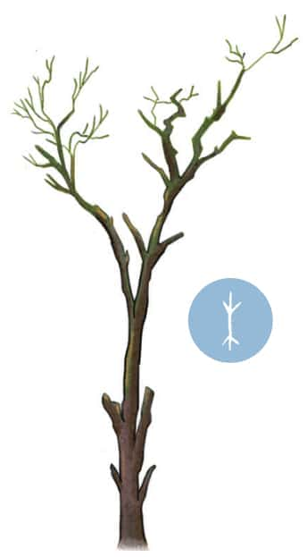

不过，虽然哲人智者们都在赞扬“木讷”，但人们还是不太喜欢木木的性格，这种情绪也反映在一个成语里——“呆若木鸡”。跟“木讷”一样，这个成语最初的感情色彩也是褒义的。

这个故事出自《庄子》。相传周宣王爱好斗鸡，于是让斗鸡大专家纪渻（shěng）子为他培养斗鸡。一般人培养斗鸡，都会变着法地让鸡凶猛起来。但纪渻子不同，在他看来，一只好的斗鸡首先要淡定！

纪渻子驯鸡十天后，周宣王问他：“这鸡可以斗了吗？”

纪渻子答道：“不行，现在斗鸡正心浮气躁、骄傲自满、自恃意气呢。”

又过了十天，周宣王又问：“这鸡可以斗了吗？”

纪渻子答道：“不行，现在斗鸡若是见到其他鸡的影子，听到其他鸡的叫声，还是有反应。”

又过了十天，周宣王忍不住又问：“这鸡可以斗了吗？”

纪渻子答道：“不行，现在它的目光太过锐利，心气还是有些旺盛呢。”

又过了十天，周宣王受不了了，又问：“这鸡可以斗了吗？”

纪渻子答道：“差不多了。其他鸡鸣叫挑衅时，它不会沉不住气了，看上去‘呆若木鸡’，就像用木头雕成的一样。这只斗鸡不为外界所动，聚神凝气，意定神闲，别的鸡再也不敢挑战它了。”

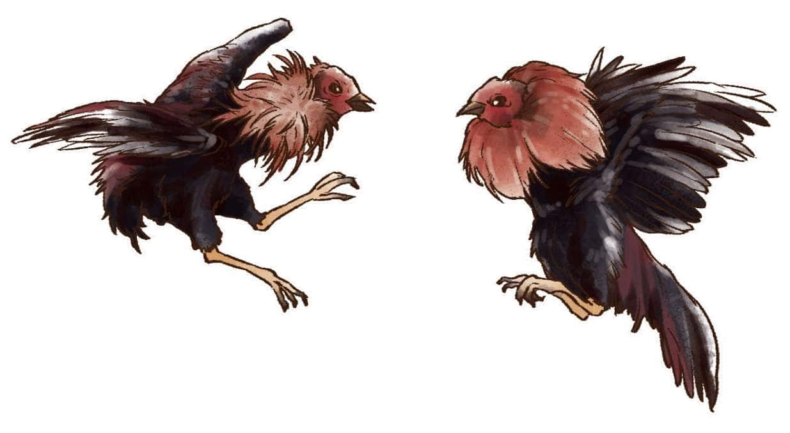

“呆若木鸡”诞生之初，本来指“泰山崩于前而色不变”的淡定从容，是个褒义词。但是，由于人们不喜欢木讷，再加上里面还有个“呆”字，这个成语离原义越来越远，逐渐发展成今天的意思，形容一个人发愣或被吓傻了的样子。

### 林/ 独木不成林 /

讲完了“木”，再来看“林”字。双木为林，古人用两个“木”来表示树林、丛林。

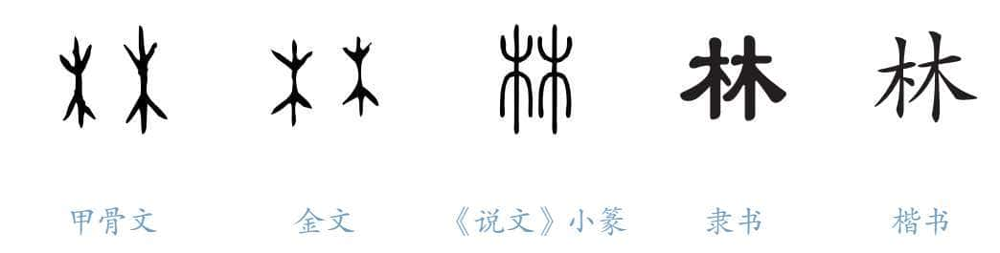

“林”中树木众多，因此，“林”也能形容一种密集的状态。竹子丛生叫“竹林”，树林像海一样广大叫“林海”，城市里楼群耸立是“高楼林立”，战场上交火激烈是“枪林弹雨”。

“林”不仅能形容事物，也可以形容人群。比如说，艺术家、文学家的群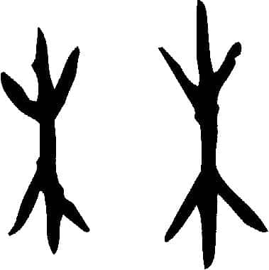体，被称作“艺林”；古代把读书人叫作“儒”，他们的群体也叫“儒林”。清代有一本著名的小说叫《儒林外史》，说的就是读书人之间的酸故事。

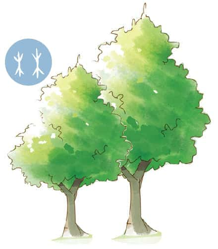

### 森/ 幽深茂密的大森林 /

双木为林，三木为森，“森”比“林”又多了一个木。

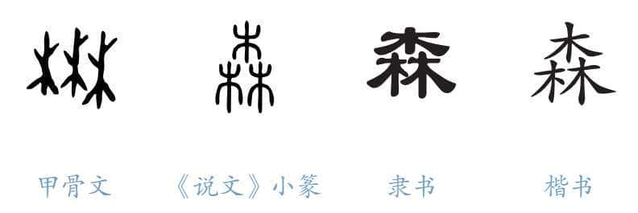

《说文解字》说：“森，木多貌。”“森”指树木繁多的样子。我们常说“小树林”“大森林”，几十棵树就能形成一片树林，但只有广阔的林海才叫森林。因此，与“林”相比，“森”字的众多之义更为明显。比如说“森罗万象”，就仿佛囊括了宇宙中的一切事物。

森林茂密，遮天蔽日，有时会带来阴暗、恐怖的感觉。所以，我们也用“阴森”来形容阴冷可怕的环境。

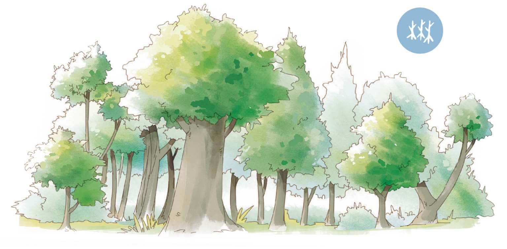

## 本·末·朱  
木有本末，断木为朱

“木”是一个很有生命力的汉字，就像春天茁壮成长的小树一样，它能够生发出不同的字。“林”“森”都是在“木”的基础上，基于数量变化生成的新字，而这一讲我要给大家讲的三个字，是基于符号位置的变化造出的新字。在“木”的不同位置加上笔画，能造出三个不同的字——“本”“末”“朱”。

### 本/ 木之本，树之根 /

“本”是古人在“木”下方加了一笔造出的字。

“本”的金文字形是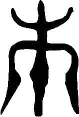，在“木”的金文字形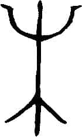下面加了一点。这一点后来在小篆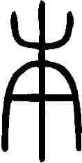中变成了短横。许慎先生解释说：“木下曰本。从木，一在其下。”“本”是在“木”下方画了一横，标注出树根的位置，这是一个标准的指事字。

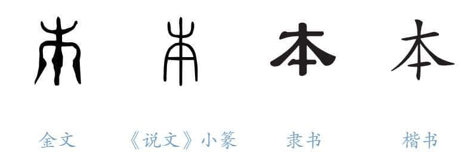

根是树木赖以生存的基础，在汉语中，“本”用来指人与事物的根基。比如说，“根本”是事物的根源，“本色”是一个人最真实的样子。做人呢，不要“忘本”，更不能丢失自己的“本性”。

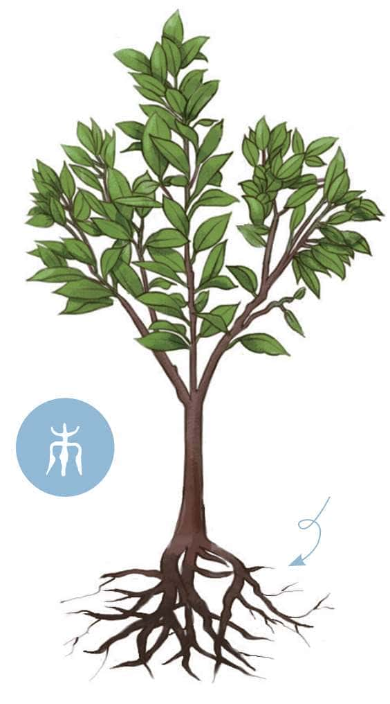

在儒家看来，把握根本是君子的重要修养。《论语》中有这样一句话：“君子务本，本立而道生。”君子做事，要把握最根本的地方，只有树立起最根本的做人基础，才能不断地生发大道。

什么是君子的根本呢？“孝弟（悌）也者，其为仁之本与！”孝顺父母，尊重兄长，这就是仁爱之道的根本。

### 末/ 木之末，树之梢 /

讲完了“本”，再来看“末”字。

《大学》中说：“物有本末，事有始终。”在这句话里，“始”和“终”是反义词，“本”和“末”也是一对反义词。“本”是树木的根系，那“末”又是什么意思呢？

还是先从汉字看起吧。“末”与“本”的造字思路正相反，它是古人在“木”上方加了一笔造出的字。许慎先生说：“木上曰末。从木，一在其上。”“木上”就是树梢。在金文里，“末”通过一个小点标注出了树梢末端的位置，这也是一个指事字。随着汉字的发展，“末”字上边的小横越写越长，盖过了下面的横，变成了如今的写法——“末”。

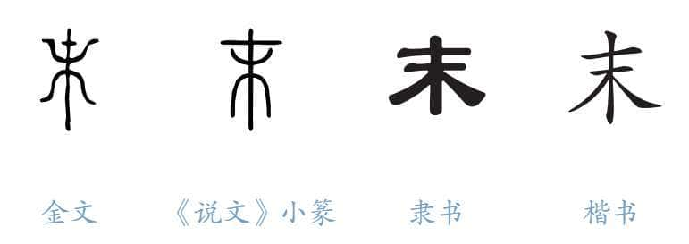

“本”是开始，“末”是结束。树枝伸展到的最前端是“末梢”，世界毁灭前的最后一天是“末日”，公交路线上每天最后一班车叫“末班车”，中国历史上最后一个皇帝溥仪，也被称为“末代皇帝”。

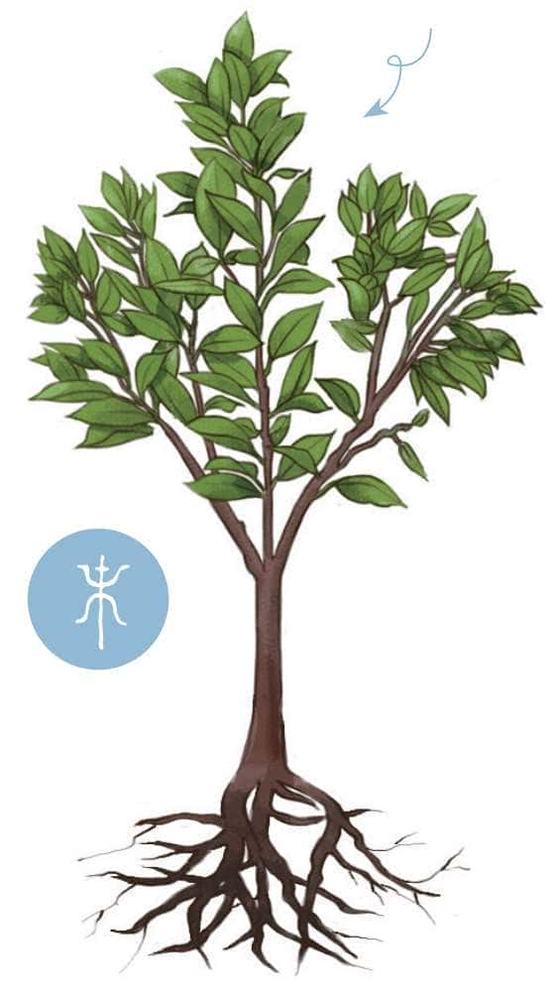

“本”是根基，它比“末”重要得多！折断树梢，树木不会死去，但如果树根被破坏了，大树就会渐渐枯萎。因此，我们把那些不重要的事，叫作“细枝末节”；把弄反了事物的主次轻重，叫“本末倒置”；把舍弃根本，追求细节，叫“舍本逐末”！

### 朱/ 木之中，树之心 /

木下一横是“本”，木上一横是“末”。那在“木”的中间加上一横，又是什么字呢？

“木”的古字形中间加了一点，就变为了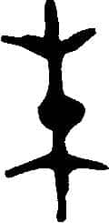。后来，中间的一点越拉越长，变为小篆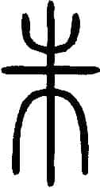，最终变为了“朱红色”的“朱”。

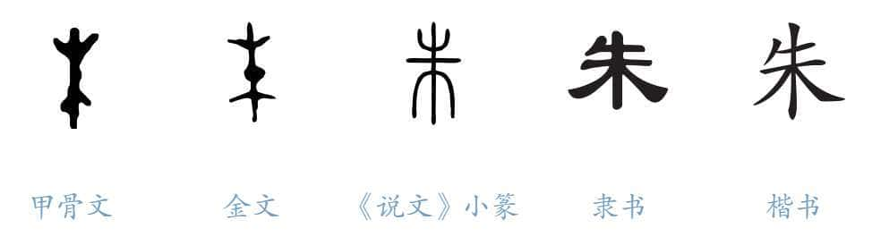

古人为什么用“木”中一横来表示“朱”呢？

对于这个问题，有两种不同的说法。

第一种说法来自《说文解字》，许慎先生说：“朱，赤心木。”“赤”是红色，“赤心木”指中心是红色的木头，红色的部分在木头里，所以古人在“木”中间画一个小横来标示它。“朱”表示红色的意思，也由此而来。

第二种说法认为，“朱”就是“诛”的本字。说到“诛”，我们会想到“诛灭”“诛杀”，把树木拦腰砍断，也就是“杀掉”了这棵树。因此，“朱”字的指事符号，放在了“木”的中间。

到底哪种说法更好，至今尚无定论。

“朱”除了表示红色，还是一个重要的姓氏。“朱”是大明王朝的国姓，明朝的皇帝都姓朱。在《百家姓》中，“朱”排第十七位，著名的大儒朱熹是朱姓的骄傲，被后人尊称为“朱子”。

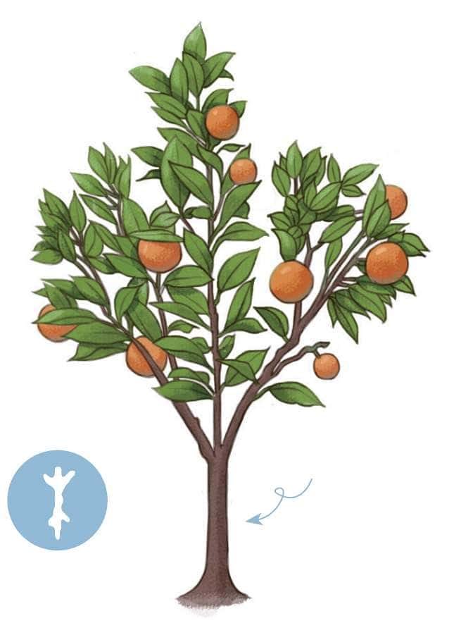

## 树·植  
十年树木，百年树人

讲完了“木”“林”“森”，这一讲要给大家说一说和木有关的两个动词：“树”和“植”。

你一定会问，“树”不是个名词吗？别急，让我一一道来。

### 树/ 种下一棵大树 /

“树”指挺拔的树木，通常用作名词，但从造字的角度看，“树”本来是个动词。对于这一点，还是要从“树”的字形说起。

甲骨文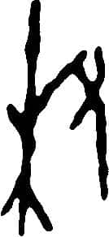的左边是木，右边是手，手拿着木栽种，这是一个会意字。到了战国文字，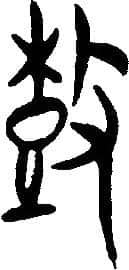的左下角比甲骨文多了一个“豆”。这是什么意思呢？到底是种树，还是种豆子呢？

都不是！“豆”和“树”在古代读音相近，它是“树”的声符，曾经的会意字就变成了形声字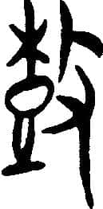。

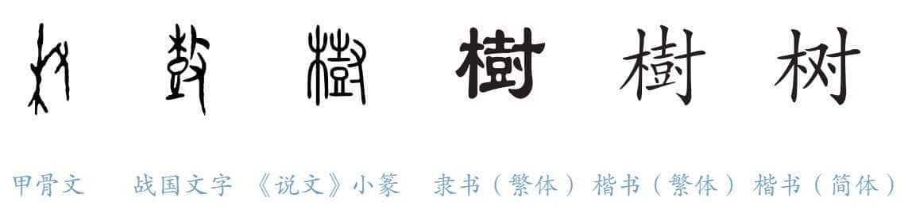

后来，古人又在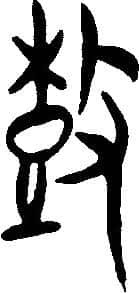的左边加了一个“木”，强调它和木的关联，创造出了小篆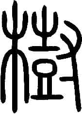。经过隶变，又变成了繁体的“樹”，这是一个从木尌（shù）声的形声字。这个字有点儿复杂，通过简化，最终变成了今天的“树”字。

“树”有名词和动词两种含义。

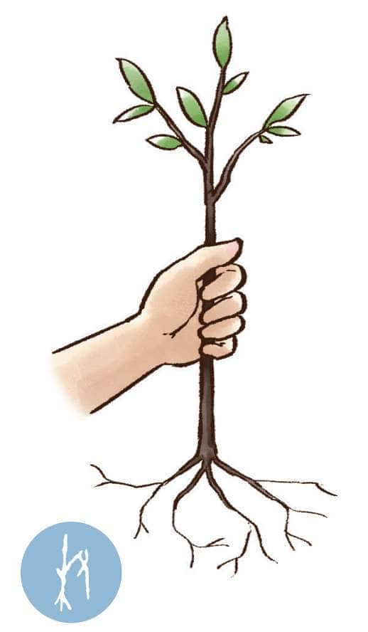

在《说文解字》中，许慎先生把“树”解释为“生植之总名”，这是它的名词含义，“树”是木本植物的通称。树枝、树干、树根、树叶、大树、小树、树苗，都由“树”组成。

“树”也可以用作动词，表示种树。有一个成语叫“十年树木，百年树人”。什么意思呢？“树木”是种树，“树人”就是像培植一棵小树一样，以知识为营养，用正确的方法和充分的耐心，帮助一个人茁壮成长。一棵树的成长，需要十年，但是对一个民族而言，人的树立与成长，却至少需要一百年！

我们熟悉的大作家鲁迅先生，他的原名“周树人”，就出自这句话，可见他的父亲对他寄寓的期待，而鲁迅先生的很多文章也的确是“百年树人”的佳作。

### 植/ 植物要树立 /

讲完了“树”，再来看“植”字。

“树”是直直竖立，“植”也有同样的特点。“植”是一个从木直声的形声字。《玉篇》说：“植，树也。”《集韵》说：“植，立也。”“植”就是把一棵棵小树竖直地种起来！

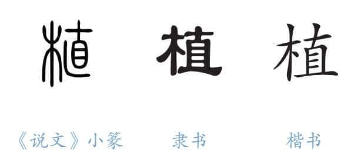

植树蕴含着十分深刻的智慧。唐代大文学家柳宗元有一篇《种树郭橐（tuó）驼传》，说的是一个植树高手的故事。他种树的时候，树根要舒展，培土要均匀，要保留原来培苗的土，而且要夯实。然后呢，任这棵小树自由生长——“顺木之天，以致其性焉尔”。说起来，人的成长和树木的生长很相似，既要接受良好的教育，打好生命的根底，也要有自由的空间，充分发扬每个人的天性。

# 火

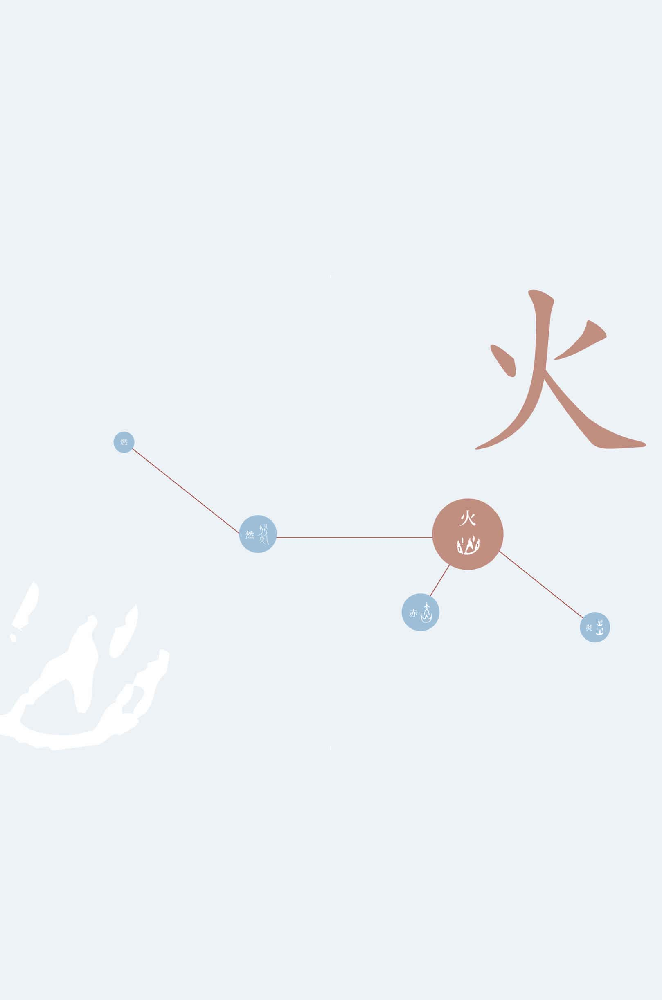

## 火·炎  
熊熊烈火

在人类的文明进程中，熊熊燃烧的“火”非常重要。远古时期，火不容易获得，古人从大自然的山火中获取火种，或者采用钻木取火的办法。有了火，人们能够烧饭、照明，还能够赶走凶猛的野兽。

这一讲，我要给大家介绍和火有关的字——“火”和“炎”。

### 火/ 远古之火 /

“火”字的历史特别悠久。甲骨文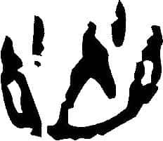是一个典型的象形字，画的是火焰的形状，透过这个字，我们仿佛还能看到火焰熊熊燃烧的样子。从甲骨文到小篆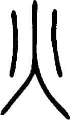，“火”的字形变得更为抽象，之后逐渐演变成今天的样子。

《说文解字》说：“火，燬（huǐ）也。南方之行，炎而上，象形。”“燬”是剧烈燃烧的意思。“南方之行”指的是火在五行中对应的是炎热的南方。

火焰是红色的，所以“火”可以表示红色。有一种棕红色的狐狸，叫“火狐”；我们常吃的腌制的动物腿是红色的，所以叫“火腿”。

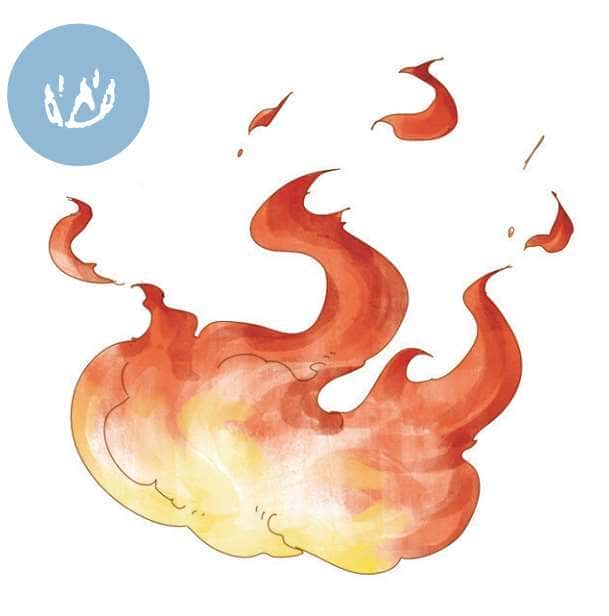

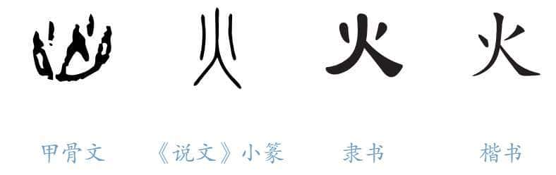

火一旦燃烧起来，会迅速蔓延，人发脾气也是一瞬间的冲动，心里就像着火一样。所以，我们管发脾气叫“发火”，用“怒火冲天”来形容巨大的愤怒。人着急的时候，动作很快，因此，“火速”可以表示快速。还有“火急火燎”，指的是内心焦急的状态。

除此之外，火燃烧得很旺盛，还引申出兴旺、红火的意思。生意做得好，生活过得丰富多彩、热热闹闹，都是“红红火火”的好日子。

### 炎/ 向上蹿的大火 /

两个“火”组成了“炎”字，“炎”的历史和“火”一样悠久。

“炎”的甲骨文写作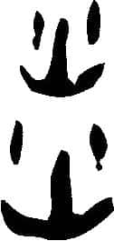，由两个“火”叠加而成。《说文解字》说：“炎，火光上也。”《尚书》说：“火曰炎上。”火的特点是向上熊熊燃烧，火光冲天，称之为“炎”。“炎”和“林”的造字形成了很有趣的对比，“炎”的两个“火”是一个叠着一个，上面的“火”是向上蹿的火苗。而同样叠加的“林”，是一棵树挨着一棵树，左右并列。这么看，古人造字是不是很有道理呢？

我们常常用“炎黄子孙”来称呼自己，可你知道炎帝为何叫“炎”帝吗？相传炎帝是掌握火的上古帝王，也被叫作“烈山氏”。他的功绩与火密不可分，是他带着人们从刀耕火种[1]走向文明的。

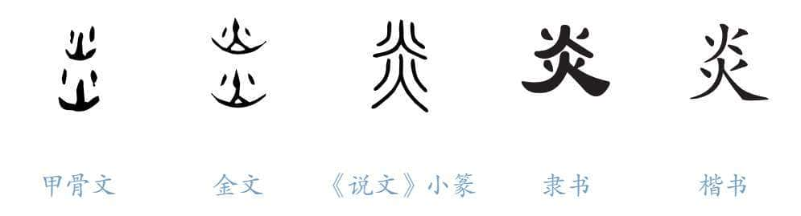

“炎”是大火，也用来形容一种生病的状态。中医认为，人的很多病症都是上火引起的，嗓子疼、嘴上起泡是上火的表现。肝炎、胃炎、伤口发炎，都是红、肿、热、疼的状态，就像人的身体里有一股大火往上冒。所以，我们也把这些病症叫作“炎症”。

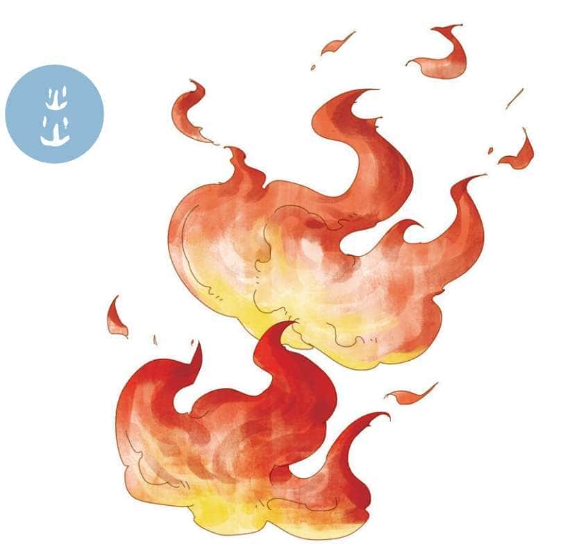

* * *

[1] 刀耕火种是新石器时代的一种农耕方式。先砍去树木，放火烧掉野草，烧剩下的草灰就成了贫瘠土地上的肥料。然后人们开始播种、劳作。一年后，作物收获，土地又回归贫瘠，人们便换个地方，继续刀耕火种。

## 然·赤  
不像火的火

在汉字中，“火”也是非常重要的部首，除了我们讲过的“炎”字，“煤”“炭”“烘”“烟”“炮”这些字里，都燃着一个小火苗。这一讲，我会讲一些有意思的汉字，它们的“火”一点儿也不像火。

### 然/ “四点水”不是水 /

“然”字可用于“然而”，这是一个虚词。“然”这个字怎么看都和火没有关系，但是，“然”字里其实烧着一团火。

《说文解字》将“然”解释为形声字：“然，烧也。从火，肰（rán）声。”“然”是燃烧的意思。“然”的古字形中，还可以辨别出“肰”和“火”。到了后来，“肰”左边的“月”越写越向左歪，“火”则越写越宽，越拉越长，变成了“灬”。我们习惯把“灬”叫作“四点水”，但这个名字和肉月旁一样不靠谱——那不是水，明明是烈火上的点点火星。讲到这里我们也就能明白，为什么“蒸”“煮”“焦”等和烧火做饭有关的字，下面都是四点水了。

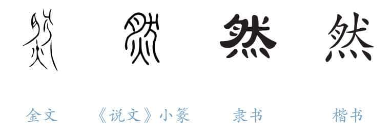

除燃烧外，“然”在古代还有其他用法，可做连词、助词、代词等。古人为了区分“然”截然不同的用法，为“然”加上了“火”，创造了“燃”字。

### 赤/ 大大的火 /

看到“赤”这个字，你大概会好奇，这个字和“火”有什么关系？

在今天的汉字中，已经看不出“赤”和“火”在字形上的关联了。不过在古文字中，它们的渊源一目了然。

从甲骨文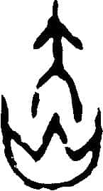到小篆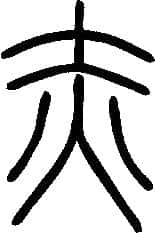，“赤”上面是“大”，下面是“火”，是一个从大从火的会意字。随着汉字的发展，到了隶书，“赤”上面“大”的一撇一捺拉直了，变成了“土”，下面的“火”也发生了变化，逐渐变成了今天的字形。

知道了“赤”的字形演变，我们也就能理解“大火为赤”的内涵了。“赤”表示像火一样的大红色。《释名》[1]将“赤”解释为“太阳之色”，太阳不正是一团燃烧的大火球吗？

“赤”是火热的激情，是忠诚的意志。我们说一个人“赤诚”“赤胆忠心”，都是形容他忠诚、真实与坦率。这种心灵的坦荡，又引申出赤裸的意思。为什么呢？坦率、坦诚，是把自己的想法真实地袒露给别人看，“赤裸”则是身体的坦诚。所以，光脚走路叫“赤脚”，光着上身叫“赤膊”，不拿武器叫“赤手空拳”，这是“赤”非常有意思的一个引申义。

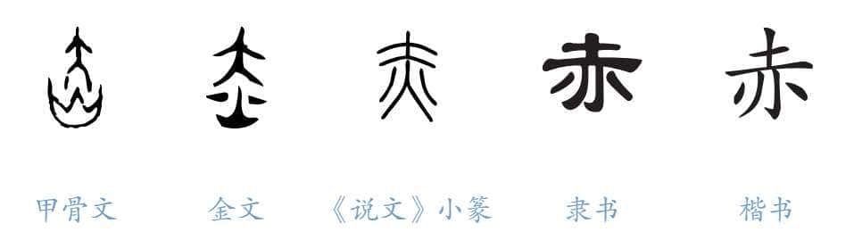

* * *

[1] 《释名》是一部解释万物名字由来的书，作者是东汉学者刘熙。

# 更多有趣的汉字

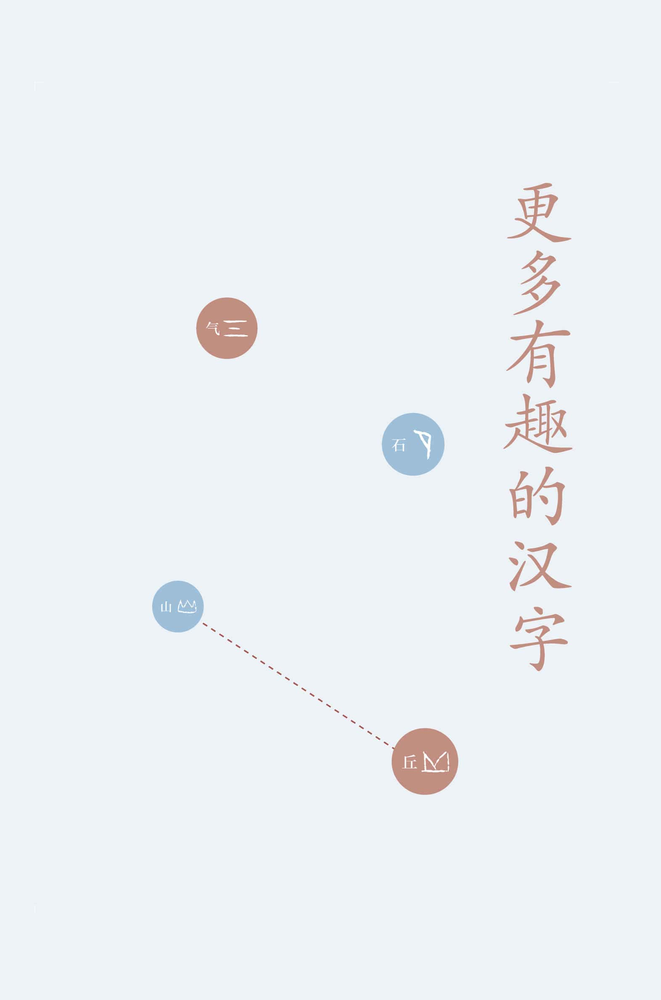

## 气  
天地有正气

“气”的甲骨文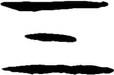和“三”很像，但如果仔细辨识，你会发现，古文字中的“三”（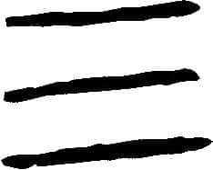），三横是一样长的。而“气”呢？中间一横短，上下两横长。

《说文解字》中说：“一，惟初太始，道立于一，造分天地，化成万物。”在许慎先生心中，“一”代表混沌，是天地还没有分开时的世界，也是大道的根本。“惟初太始”是说宇宙的开端，“道立于一”是说大道体现在混沌，即“一”中。从“一”开始，“造分天地，化成万物”。盘古最初将混沌一分为二，轻清者上浮为天，重浊者下沉为地，这便是“一生二，二生三，三生万物”。

所以，字上下两横，是一分为二后生成的天和地，天地之间的小短横，表示的则是天地中的气。

“气”的寓意很好，但太容易和“三”混淆。怎么办呢？古人把第一笔翘起来，最后一笔落下去，就写成了金文、小篆中的“气”字——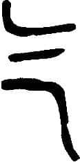和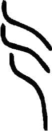。这两个字形和今天“气”字的写法基本相同，在汉字发展的过程中，将形体相近的字区别开来，是汉字演变的重要推动力。

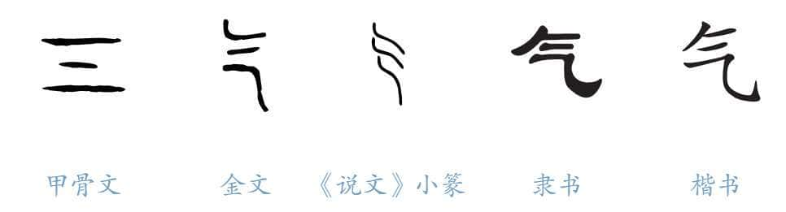

大自然有气，人也有气（呼吸）。人发脾气的时候，呼吸会变得粗重起来，大喊大叫的时候，气息格外洪大。因此，发脾气叫作“生气”，仿佛人体之气随着愤怒而生发出来一样。

不过，古人反对生气，讲究养气。《孟子·公孙丑》中说的“我善养吾浩然之气”，就是指用自己的道德修养形成浩然之气。

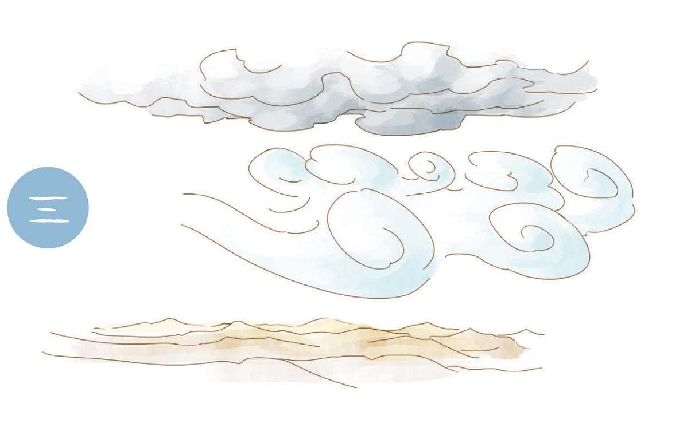

## 山  
高耸入云的山峰

古人是怎么给“山”造字的呢？

说到山，我们的脑海中一定会浮现出高耸入云的山峰。古人造字时的想法和我们差不多，“山”的甲骨文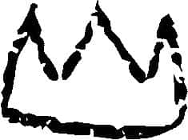和金文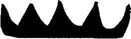，其实就是山峰的样子。你看，有的字是三个山峰，有的字是五个山峰，是不是惟妙惟肖？

“山”是一个典型的象形字。《说文解字》这样解释“山”：“山，有石而高。象形。”“山”是指高耸的石峰。在汉字中，从山的字往往都和山峰有关，比如“巅”“峰”等。

古人喜欢山，他们认为君子要像高山一样，有高大伟岸的人格，做人做事，稳重大方；君子要像山一样善于包容，这也是儒家的仁恕之道；最后，君子要像滋养万物的大山一样，帮助他人，为别人提供温暖。《论语》中有一句话叫“仁者乐山”，仁爱的人是喜欢大山的，仁者的品质正与山的气质相通。

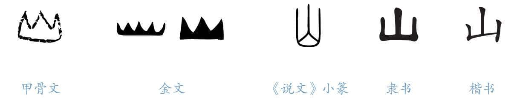

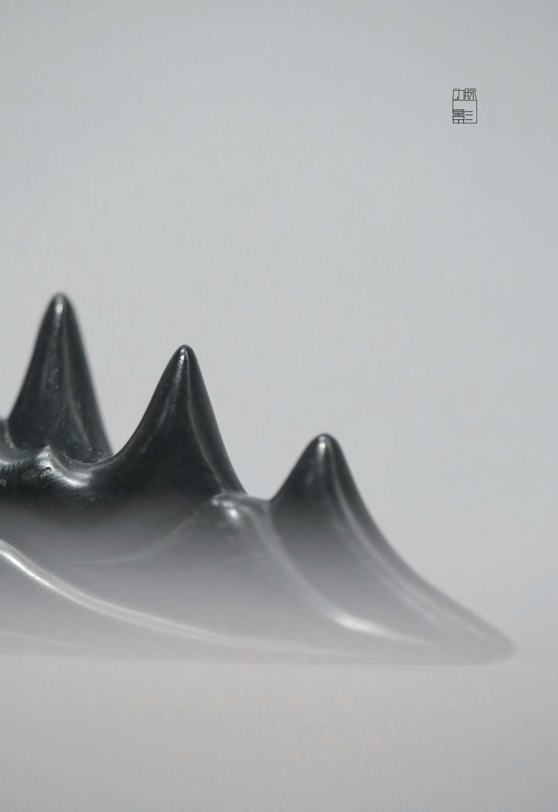 
南宋/石雕笔架/诸暨市博物馆藏

## 丘  
头顶凹陷的小丘

“山”和“丘”似乎都指山，它们之间有什么不同呢？

和“山”相比，“丘”有两个鲜明的特点。首先，“丘”的顶部是凹陷的，这在“丘”的古字形中体现得非常明显。“丘”从甲骨文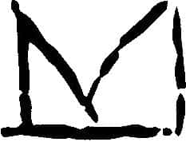到小篆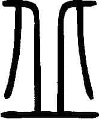，字形一脉相承，都是中间低、四周高。许慎先生说：“四方高中央下为丘。”“丘”就像长白山天池那样，山顶四边高，中间下洼。

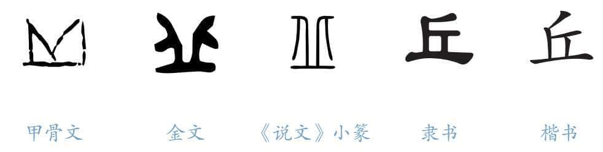

“丘”的另一个特点是低矮。在汉语中，坡度低缓、连绵起伏的小山丘，叫作“丘陵”；堆成小土包样子的坟墓，被称为“丘墓”；乡村田地里隆起的田垄叫“丘垄”。这些词都体现出低矮的特点。

我们都知道大圣人孔子，他的名字叫“孔丘”。

你也许会问，孔子的爸爸为什么给他起名叫“孔丘”呢？让我们一起搭乘时光机，去看看孔丘名字的来历！

这要从孔子出生前说起，孔子的爸爸叫叔梁纥（hé），是鲁国人，也是天下闻名的大力士。作为盖世英雄，叔梁纥有一个重要的人生理想，那就是生个儿子，来继承自己的武勇（当然，重男轻女的思想是不对的），还去尼丘祷告求子。在连续生了许多女儿后，叔梁纥终于得偿夙愿，在晚年有了一个儿子。

老来得子，叔梁纥欣喜若狂，开始认真考虑给儿子取名的大事。左思右想，该给孩子起个什么好名字呢？他抱着这个小小的婴儿，边走边想，不知不觉走到了家门口，一抬眼，看见了尼丘——鲁国国都郊外的一座小山。

刚出生的小孔子，囟门还没有完全闭合，脑袋顶上软软的，有些下陷，和尼丘一样。叔梁纥抬头看看山，低头看看儿子，灵光一闪：“我儿子的脑袋，和尼丘简直一模一样！干脆，就叫孔丘吧！”

孔子姓孔名丘，字仲尼——“仲”[1]代表他在家中排行老二，而“尼”正来源于尼丘，仿佛山顶凹陷的样子。

* * *

[1] 古人用“伯、仲、叔、季”来表示长幼次序，老大是伯，老二是仲，老三是叔，老小是季。

## 石  
悬崖下的山石

和“丘”一样，“石”也是个象形字。“石”的金文是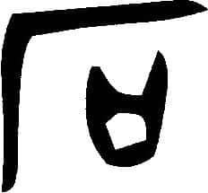，上面看起来就像“工厂”的“厂”，它读作hǎn，是山崖的意思。你看它的样子，就像一座陡峭的悬崖。的下面有个方块，今天写作“口”，这是石头的象形。巍峨的大山之中，石头随处可见，所以许慎先生说：“石，山石也。”

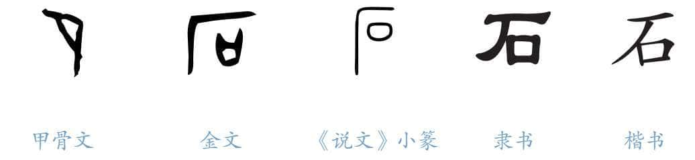

金和石都特别坚固，因此，它们经常并列使用，表示坚固的状态。有一个词叫“金石之交”，形容坚固的友情像黄金和石头一样，牢不可破。

尽管金石坚固，但只要付出足够的诚意与努力，就可以打破金石般坚不可摧的困难。所以，在汉语中，有“精诚所至，金石为开”的说法。《荀子》中也有类似的用法，比如“锲（qiè）而不舍，金石可镂（lòu）。”“锲”是雕刻的意思，这句话的意思是说，只要做事情有韧性、有耐心，坚持不懈，不轻言放弃，即使是结实的金石，也能雕刻出美丽的纹样。

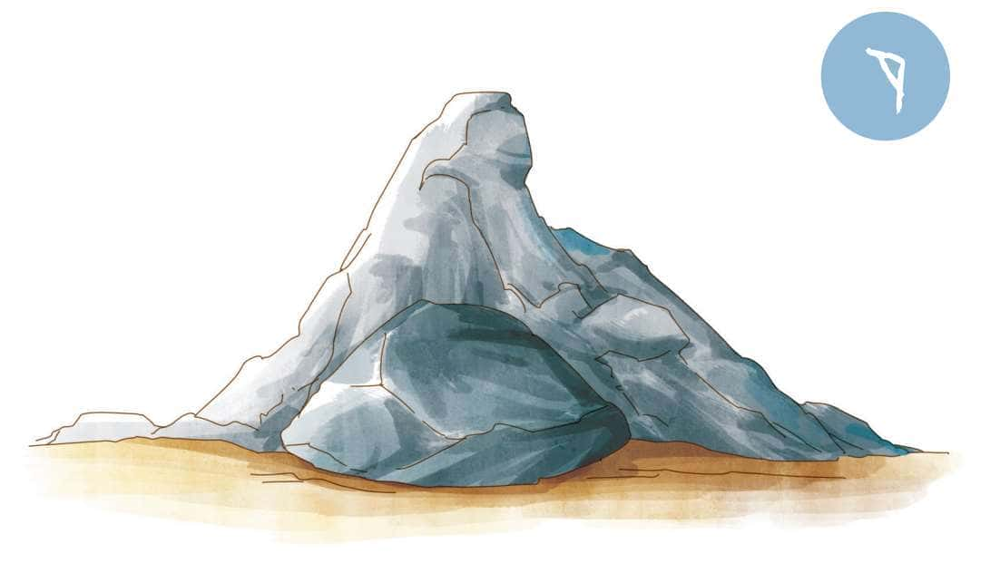

