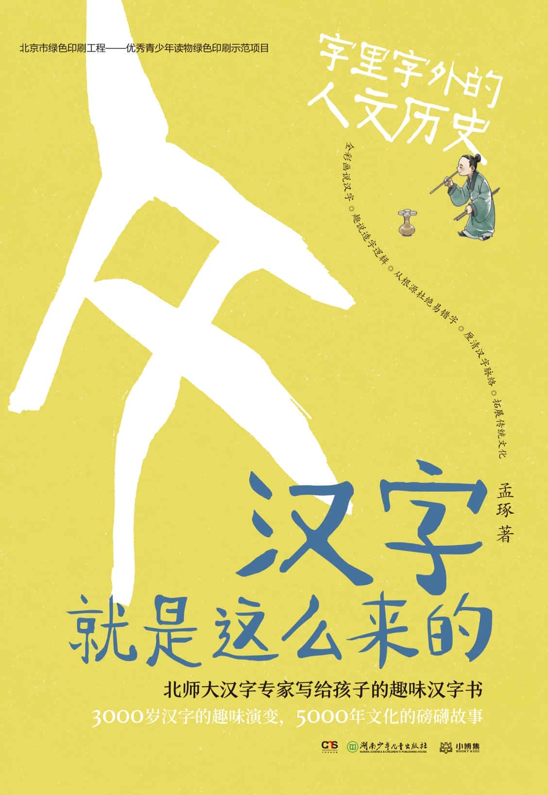

# 版权信息

书名：汉字就是这么来的·字里字外的人文历史

作者：孟琢

出版社：湖南少年儿童出版社

出版时间：2020-08-01

ISBN：9787556251957

本书由天津博集新媒科技有限公司授权亚马逊发行

版权所有 侵权必究

# 目录  
CONTENTS

**女 
女·母 端庄的古代女子 

姓·如 女子的尊卑 

婚·娶·妻 结婚为何在黄昏？ 
**

**子 
子·孙 血脉的延续 

孕 怀“孕”的样子 

保·学 对血脉的呵护 

孝 没有血脉就是不孝？ 

弃 古人的弃子风俗 
**

**又 
父·爸·爷 拿着棍子的爸爸 

尹·君 手拿棍棒的统治者 
**

**王 
王 什么是王道？ 

皇 王的火炬 

闰 王者颁布历法 
**

**示 
示·神 来自神灵的启示 

礼·祝 无所不在的生活礼仪 

福·祸 神灵与福祸 

祖·宗 祖先从未远离 
**

**玉 
玉 玉的五种品德 

理·琢 雕琢玉石的道理 

璧·瑕 玉璧为什么是圆形的？ 

环·瑗·玦 和好还是绝交？ 
**

**刀 
刀·刃·刚 锋芒毕露的宝刀 

分·判·班 班级最初的意思是什么？ 

则·制 遵守制度，以身作则 

刑·罚 古代刑罚真可怕 
**

**弓 
弓·弦 弓如霹雳弦惊 

矢·短 流星般的“箭矢” 
**

**戈 
戈·戟 战士手中的武器 

国·域 保家卫国的汉字 
**

**更多有趣的汉字 
册·典 古代的图书特别沉 

矛·盾 以子之矛，攻子之盾 
**

# 女

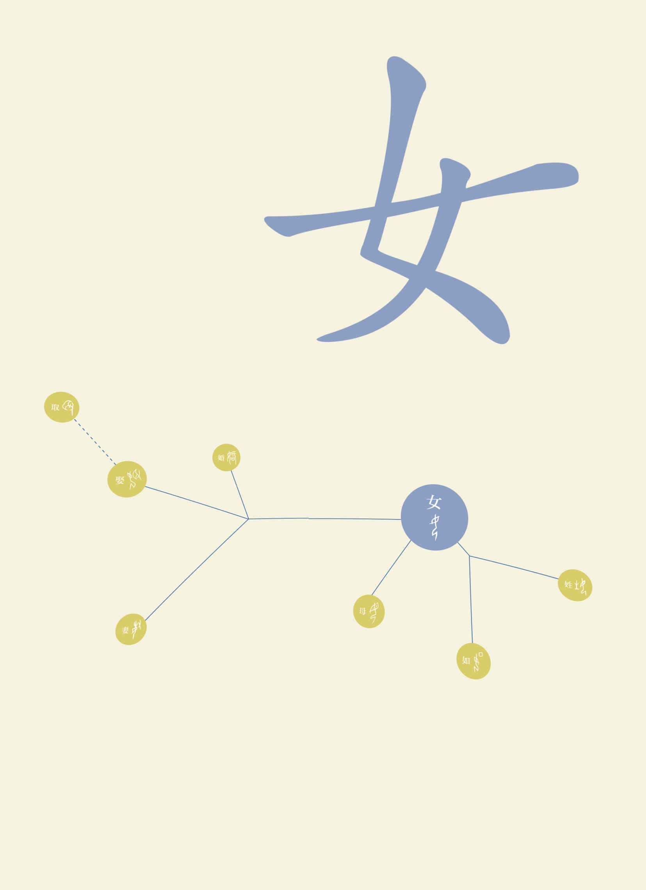

## 女·母  
*端庄的古代女子*

文字在文明的发展进程中诞生，必然会留下文明不同阶段的印记。一个个汉字，是一个个探寻文化的窗口，记录并保留了中华民族的历史记忆、生活习俗与文化观念。

在这本书里，我们会聚焦汉字里的人文历史，通过汉字这扇小窗，带你一窥中华文明的进程，一览古人难以忘怀的历史记忆。其中，有古代女性的身份角色、婚姻制度，有家庭中的“父母兄弟”；有肃穆庄严的“祭祀”，有青烟缭绕的“占卜”；有莘莘学子手中的“书籍典册”，有勇武战士手中的“刀枪剑戟”……

汉字的诞生，伴随着深沉的历史脚步。我们的汉字故事，则要从古代的女子开始讲起。

### 女/跪坐的女子/

《说文解字》[1]中共收录了两百多个以女为偏旁的字，现在，就让我们一起从汉字中探索古代女子的身份地位和古代婚姻制度吧。

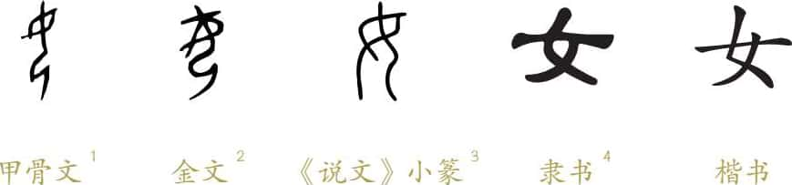

>
> **1.** 甲骨文是目前能看到的最古老的汉字，它是中国商周时期的文字，因为刻写在龟甲兽骨上，所以被叫作 *“甲骨文”*。
> 
> **2.** 甲骨文之后的文字叫金文，也叫“钟鼎文”，是商周时期铸刻在青铜器上的文字。我们见到的青铜器大多数是青黑色的，但它刚刚铸造出来的时候，其实是耀眼夺目的金黄色，所以叫 *“金文”*。
> 
> **3.** 战国时期，各诸侯国的文字不同，严重影响诸侯国之间的交流。秦灭六国之后，除了统一国土，也统一了度量衡，统一了文字，规定了标准字体——*小篆*。
> 
> **4.** 隶书由篆书简化演变而成。小篆字形规整、端庄大方，但不易书写。秦国以法治国，政令繁多，大小官吏用小篆书写，效率不高，于是他们在办公过程中自觉地简化了汉字，用一种简便的字体书写了大量的公文，这便是隶书。从小篆到隶书发展演变的过程，叫作 *“隶变”*。
>

“女”字的起源非常早，“女”的甲骨文是一个标准的象形字。什么是“象形字”呢？古人在造字的时候，用绘画的方式描绘事物的形状，由于画得很像，所以这类字叫象形字。那“女”字画的是什么呢？

可能你已经看出来了，“女”是一个侧身跪坐的女子，她双腿弯曲，屁股放在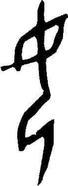脚后跟上，这是古代的标准坐姿。女子的两只手规规矩矩交叠着放于胸前，显得十分恭敬。

“女”是端庄跪坐的古代女性形象。商代的妇好墓出土过一个非常漂亮的跪坐玉人，“女”字的形体和它十分相像。

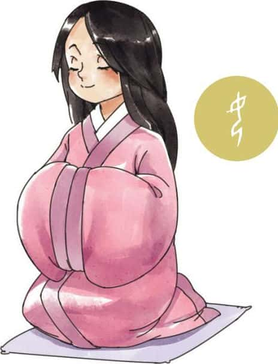

### 母/女子的蜕变/

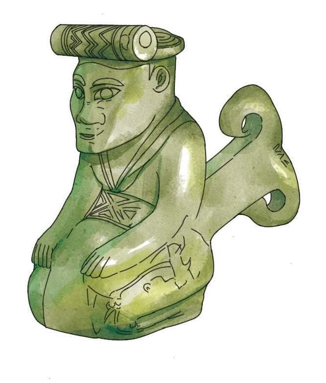

在古代，一个女子最重要的蜕变，是成为一位母亲。

对于母亲这个概念，你会怎么造字呢？你可能会说，妈妈是最爱我的人，我要画一颗爱心来表示“母”字。但这样一来，它和“心”字就重复了。怎么办呢？智慧的古人选取了母亲最重要的特点来造字。

在甲骨文和金文中，“母”和“女”非常像。和“女”相比，“母”最大的特点是多了两点，这两点也一直保留到现在。这两点是什么呢？许慎先生在《说文解字》中解释说：“象乳子也。”哺乳是妈妈最鲜明的特点，因此，古人给“女”字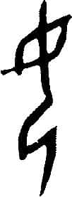加上两点，代表妈妈喂养婴儿的乳房，造出了“母”字——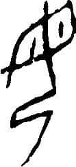。

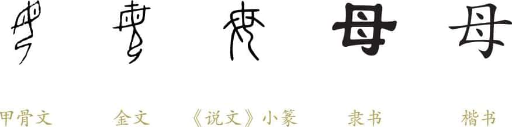

《说文解字》中说：“母，牧也。”“牧”有养育教导的意思。母亲不仅养育我们，还教导我们长大成人。古人心里对妈妈的爱更为深挚，留下了“父母皆艰辛，尤以母为笃”的诗句，以及很多歌颂母亲的诗歌。比如我们熟悉的《游子吟》：

> 
> 慈母手中线，游子身上衣。
> 
> 临行密密缝，意恐迟迟归。
> 
> 谁言寸草心，报得三春晖。
> 

诗中，一个孩子要出门远行了，母亲心里依依不舍，只好在孩子临行之际帮他缝补衣服。“临行密密缝，意恐迟迟归。”母亲一针一线，把衣服缝得十分结实，是因为她担心孩子要过很久才能回家。孟郊最后感慨说：“谁言寸草心，报得三春晖。”母亲对待我们，就像春天养育小草一样。我们这小草一般的孝心，怎么报答得了母亲那春天般的恩情呢？

《诗经》[2]中还有一篇非常有名的《蓼莪（lù é）》：“父兮生我，母兮鞠（jū）我。拊（fǔ）我畜（xù）我，长我育我，顾我复我，出入腹我。欲报之德，昊天罔（wāng ）极！”父母生出了我们，抚养疼爱我们，让我们茁壮成长。他们无微不至地关心我们，我们想回报父母的恩情，可怎么报答得完呢？

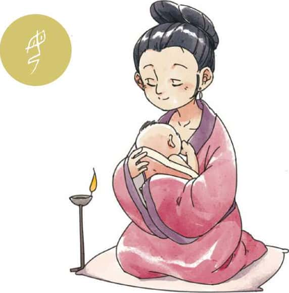

> 
> [1] 《说文解字》是中国历史上第一部系统分析汉字字形、讲解汉字字理的字典，简称《说文》，作者是东汉的许慎。在体例上，它开创了部首编排法；在内容上，它用六书系统地解说汉字，并保存了部分早期古文字的写法，为我们研究甲骨文、金文等提供了依据。六书是六种汉字造字法，包括象形、会意、指事、形声、转注和假借。
> 
> [2] 《诗经》是我国最早的诗歌总集，编成于春秋时代，共305篇，分为“风”“雅”“颂”三大类。原只称《诗》，后世也称为《诗经》或《诗三百》。
> 

## 姓·如  
*女子的尊卑*

上一讲的“女”和“母”反映了女子做母亲后的形象变化，这一讲的“姓”和“如”，则反映出古代女子社会地位的尊卑变化。

### 姓/知其母而不知其父/

原始人结群而居，经历了母系氏族社会到父系氏族社会的转变[1]。母系氏族社会以女性的血缘关系为纽带，女子拥有极高的地位，那时的人们“知其母而不知其父”，随母而居，随母而姓。这一历史记忆，也反映在“姓”字里。

“姓”和“生”在古代含义相通，都有为人所生的意思。

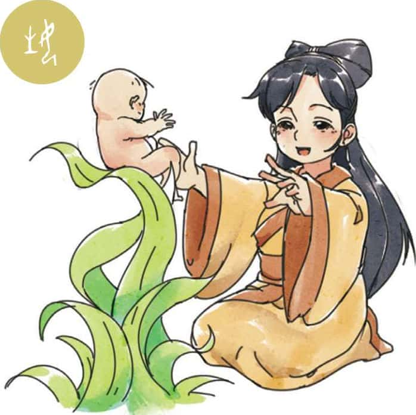

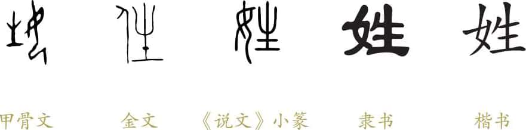

许慎先生在《说文解字》中这样解释“姓”：“姓，人所生也。*古之神圣母，感天而生子，故称天子*。”许多上古的帝王圣贤，都是母亲受到上天的感应而生下的。比如炎帝是母亲游华阳时，遇到了一条神龙，有所感应而生。再比如五帝之一的颛顼（zhuān xū）是母亲见到了摇光之星贯月如虹，有所感应而生。这些神奇的传说，反映了母系氏族社会中“知其母而不知其父”的状态。

因此，*古人根据血缘，以姓来区分不同族群时，姓往往是母亲一脉的*。最古老的一批姓氏，比如“姜”“姬”“嬴”等，这些字里面都有“女”字。

### 如/听话的女子/

随着母系氏族社会转变为父系氏族社会，男性渐渐在政治、军事、经济等社会活动中占据了主导地位，女性逐渐被限定在家庭中，从小就被灌输“男尊女卑”“柔顺为美”的观念，整个社会迎来了男尊女卑的时代。这种变化也体现在汉字里，比如古人对“女”字的解释，还比如接下来要讲到的“如”字。

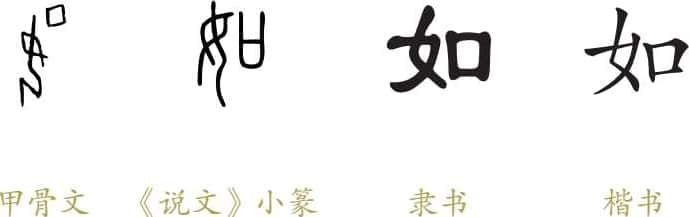

《释名》[2]中说：“女，如也。”什么是“如”呢？

许慎先生在《说文解字》里说：“*如，从随也。*”“从随”也就是服从、听话的意思。

女子要听从谁口中的话呢？在男尊女卑的古代社会里，男人与女人的身份地位并不平等，社会规则当然是听男人的！古人对此还列出了具体要求——女人要遵守“三从四德”。

什么是“三从”呢？就是“*少如父教，嫁如夫命，老如子言*”。还有一种说法是《仪礼·丧服》[3]中的“*未嫁从父，既嫁从夫，夫死从子*”。两句话意思都一样：一个女孩子，小时候要听父亲的，出嫁了要听丈夫的，年纪大了丈夫去世了，那就要听儿子的。

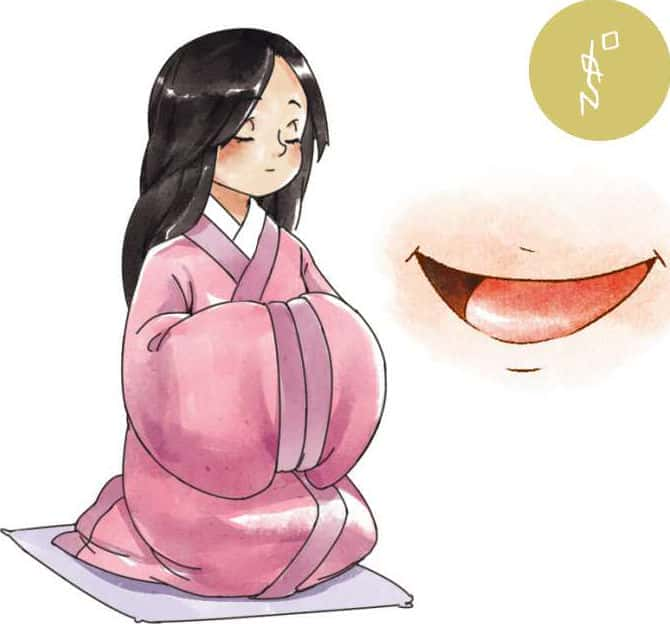

什么是“四德”呢？“四德”指“妇德、妇言、妇容、妇功”四种品德。*“妇德”要求女子严守“三从”的教条，安分守己；“妇言”要求女子说话要温顺柔婉；“妇容”要求女子的穿衣打扮、仪态举止要符合礼仪规范；“妇功”要求女子要掌握好操持家务和生儿育女的知识。*

“三从四德”是不是非常不合理？

是的，“三从四德”是封建社会的糟粕，把女子变成了男子的附属物，让女子丧失了独立的人格。在中国古代传统文化里，有好的、值得发扬的观念，也有坏的、需要丢弃的思想，我们需要*辩证地看待，加以冷静的反思*。

> 
> [1] 关于母系社会，有的学者已经提出了重要质疑，但我们还是采取通常的说法。如果你对这个问题感兴趣的话，可以参考北京大学吴飞老师的相关著作，只不过对你们来说，这个问题可能还有点儿难。
> 
> [2] 《释名》是一部解释万物名字由来的书，作者是东汉学者刘熙。
> 
> [3] 《仪礼》是儒家经典之一，是春秋、战国时期婚、丧、祭、饮、射、朝、聘等各种典礼节仪的汇编。
> 
> 

## 婚·娶·妻  
结婚为何在黄昏？

我在《字里字外的人体世界》里曾讲过，古代男子长到==十二到二十岁==时会举行成年礼“冠礼”，这标志着他们长大成人。古代女子==十五岁==时也会举行成人礼——==及笄（jī）礼==，成年的女子便可以婚嫁了。婚姻是组建家庭的基础，这一讲，我会通过“婚”“娶”“妻”三字，带你了解古代的婚姻制度。

### 婚/在黄昏时结婚/

“婚”字，左边一个“女”，右边一个“昏”。为什么“婚”字要这么造呢？有人说，这是因为男人一结婚就容易昏头，什么事都听妻子的。这种解释有道理吗？当然没有！

“婚”是一个形声字。什么是“==形声字==”呢？和象形、会意一样，形声也是古人造字的一种方法。形声字可以一分为二，一半是形符，一半是声符。形符表达汉字的字义，声符提示汉字的读音。所以，“婚”字里的“女”是形符，表示“婚”与女性有关；右边的“昏”是声符，用来表示“婚”的读音。“昏”与“婚”的读音是完全一样的，但也有些形声字与自己的声符读上去没那么像，比如“剪”和它的声符“前”，它们读音相近，但不完全相同。形声字里也有读音和声符完全不同的，比如“凉”和声符“京”，这是因为它的现代读音和古代的不同。

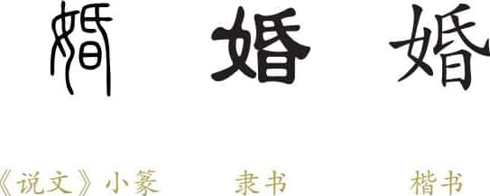

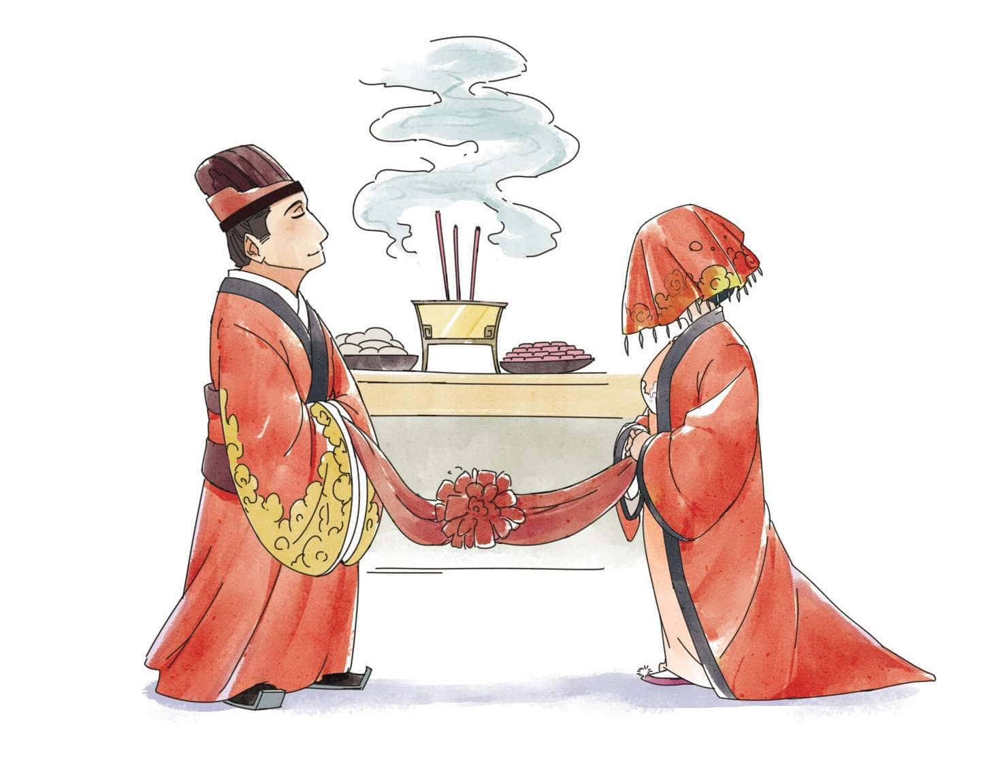

虽然“昏”用来表示读音，但古人之所以选择“昏”，而不是选择“荤”，其实还有其他考虑。许慎先生说：“礼，娶妇以昏时，妇人阴也，故曰婚。”==古人的婚礼多在黄昏时分举行。所以，古人选择黄昏的“昏”作为“婚”的声符。==

结婚仪式在黄昏时进行，因此称为“婚礼”。那么问题来了——古人为什么要在黄昏时结婚呢？我们把这个问题留着，先来看“娶”字。说完了“娶”，你就会明白古人在黄昏娶妻的原因了。

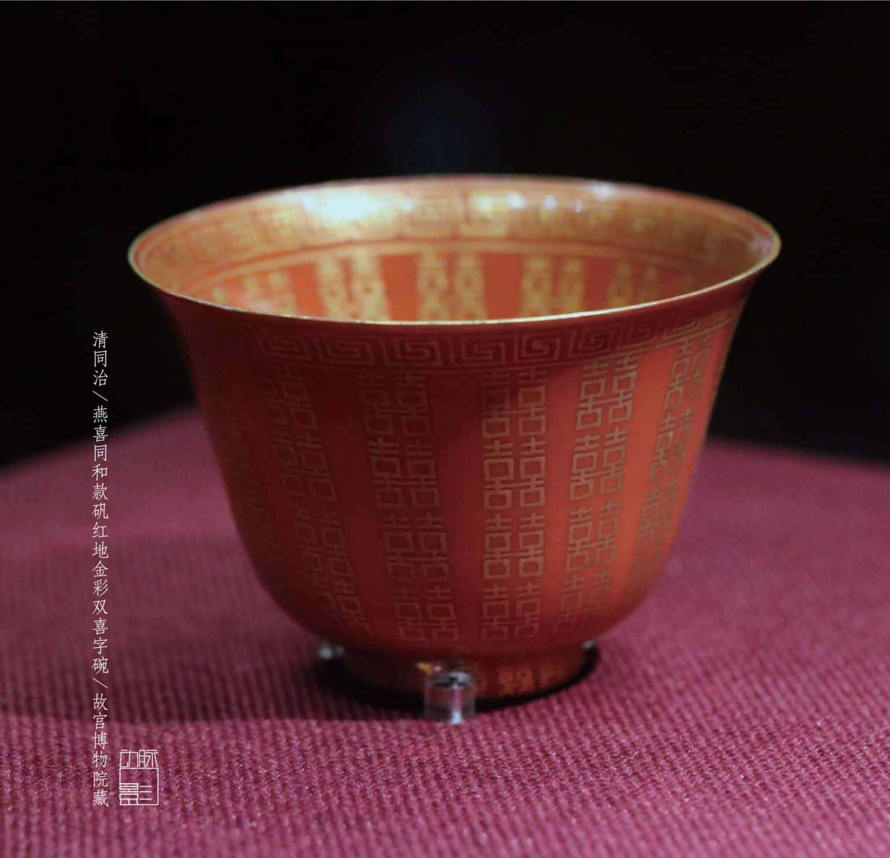

### 娶/古人如何娶媳妇/

“娶”这个字，最开始没有下面的“女”。《周易》中的“勿用取女”，《诗经·齐风·南山》里的“取妻如之何”，用的都是==“取”——“取”是“娶”的本字==。

我在《字里字外的人体世界》里讲过，“取”是一个会意字。什么是“会意字”呢？会意字就像拼积木一样，把不同的字拼合在一起，组合这些字的含义，从而造出新字、表达新义。==“取”的左边是一只耳朵，右边的“又”在古代是手的意思，合起来便是“猎取耳朵”的意思。==要知道，古代打仗根据杀敌数量来计战功，杀敌越多，功劳越大。那么，如何来证明杀敌数量呢？砍头太不方便，所以古人用割下的耳朵为证。古书中有“获馘（ guó）”的说法，就是用割下的耳朵来表示杀了多少敌人。这是一种非常残忍的制度，“取”这个字也带着血的味道。

古人为什么用一个“残忍”的字来表示娶妻呢？

==原来，“娶”字反映的是一种早期的婚姻制度——抢亲制。==在原始社会中，不同部族之间不通婚，谁都不愿意把自己族里的姑娘嫁给外族的小伙子。怎么办呢？只好抢了！部族里精壮能干的小伙子组织起来，一起去另一个部族抢媳妇。==这种抢亲制在今天南方一些少数民族地区还有遗存——出嫁本来是一件高兴的事情，但女孩子要装出难过的样子，哭着不走。男孩子呢，则要摆出一副粗鲁的样子，把新娘子抢走，“塞”进花轿。这是民俗中留存的古老记忆。==

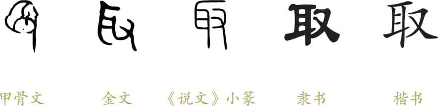

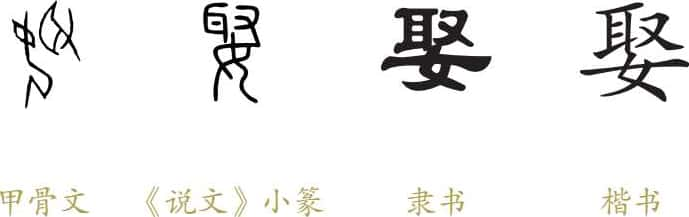

==“取”既表示取东西，又表示娶妻，意思太多，不好区分。于是，人们给“取”加上了“女”，创造出“娶”字，专门用来表示娶媳妇。==

讲完了“娶”，再来揭晓古人为什么要在黄昏时结婚。既然娶妻要抢亲，就要挑一个合适的时间。白天当然不错，天光明亮，看得清楚，可以挑一个中意的姑娘。但==光天化日去抢人，很容易被对方发现，被打得头破血流。那么晚上呢？月黑风高，隐蔽性强，不容易被人发现，但也很难找到合适的姑娘。==想来想去，古人发现*黄昏是最适合抢亲*的时间！这个时间好在哪儿呢？你出发的时候，天色还没彻底变暗，能挑中心仪的姑娘；抢到手了往回跑时，又有夜色作为掩护，不容易被对方追上。

这样一来，我们就能明白为什么“婚”字里有个“昏”了——黄昏结婚，源自古人抢亲的习俗啊！

### 妻/这个字并不温柔/

在上古时期，通过抢亲娶回来的女子，就成了妻子。

你看，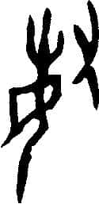是甲骨文中的“妻”，左边是一个头发很长的女性，右边是一只手，一把揪住她的头发，想把她抢回去做媳妇！到了金文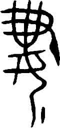，“妻”字中的手深深地插进头发里，更加充分地体现出抢亲的特点。到了小篆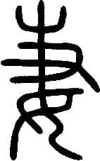，“妻”和今天的写法已经很相似了。

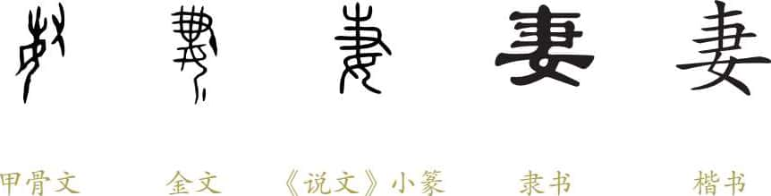

“妻”是一个被揪住头发的女性形象，它告诉我们，原始社会中的妻子不是迎娶来的，而是抢来的。

抢亲制太野蛮了，逐渐被历史淘汰，但是在黄昏结婚的习俗却保留了下来，抢亲的风俗也保留在了“婚”“娶”“妻”等字中。

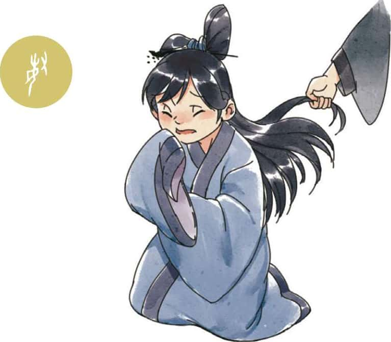

# 子

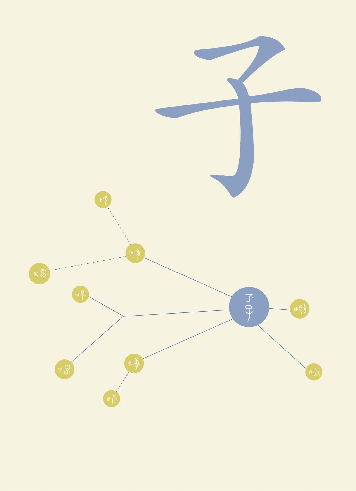

## 子·孙  
血脉的延续

男女结为夫妻，组建家庭，生育孩子，我们的生命才能传承不息，民族的历史才能随之延续。所以，原始社会中的人们有强烈的生殖崇拜，封建社会中还有“不孝有三，无后为大”的训诫。在这一讲，我要介绍两个和血脉延续密切相关的字—“子”和“孙”。

### 子/大头儿子/

“子”字的历史非常悠久。“子”的甲骨文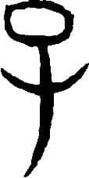和金文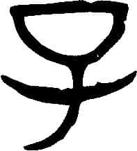都是典型的象形字，画的是一个婴儿，这个孩子尚未长大，胳膊和腿都相对较细，但脑袋大大的——小孩子的身材比例和成年人不一样，脑袋往往会更大一些。“子”是一个惟妙惟肖的大头娃娃！

“子”在古代指婴儿，也就是刚出生的小宝宝。古人认为“子生三月则父名之”，孩子出生三个月之后，爸爸要给他起名字。在这句话中，“子”就是婴儿之义。

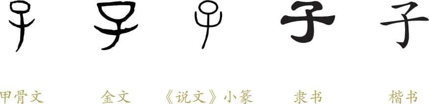

除此之外，“子”还引申出孩子、儿子的意思，后来又慢慢引申为对男子的尊称——我们熟知的孔子、孟子、老子、庄子、孙子，这些历史上的大思想家，都被尊称为“子”。

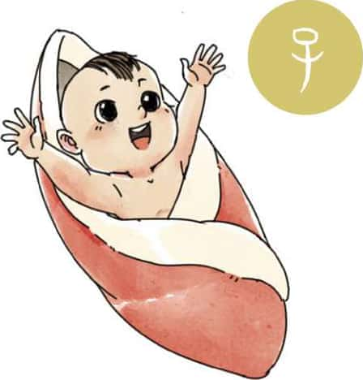

### 孙/家族血脉，延续无穷/

我们常说“子孙后代”，“孙”是儿子的儿子。在简体字中，“孙”左边是“子”，右面是“小”，可以被理解为会意字，比儿子还要小，那就是孙子了。

“孙”的繁体字写作“孫”，左边是“子”，右边是“系”。“系”有绳子的意思，有些人就认为，儿子忙着养孙子，就像被绳子拴住，不自由了。所以，能把儿子束缚住的就是“孫”。

这种说法显然是错误的，在古人看来，生孩子是大喜事，怎么能是一种令人无奈的束缚呢？那么，“孙”为什么“从子从系”呢？解答这个问题的关键，在于弄清“系”的内涵。

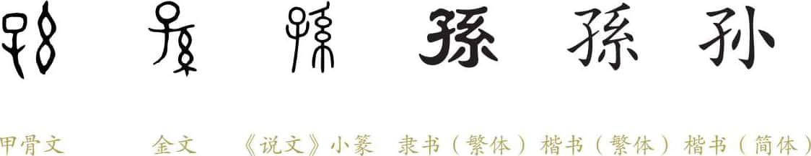

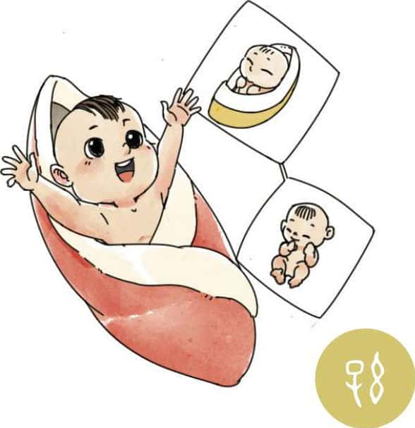

大家看甲骨文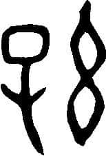，左边是“子”，右边的“系”就像一团丝线。金文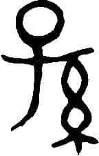和小篆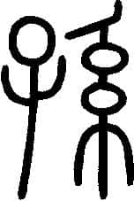也都是这样的形体。《说文解字》中说：“孙，子之子曰孙。从子，从系。系，续也。”“孙”是由“子”和“系”组成的会意字。“系”是一团丝线，它有延续相传的特点。一个大家族，从父亲到儿子，从儿子到孙子，孙子之下又有曾孙、重孙，绵延不息，代代相传。“孙”从子从系，反映了家族传承的特点。这个特点，也体现在古代的传说里。

我们知道“愚公移山”的故事。愚公家门口有太行、王屋两座大山，出行很不方便。他便下定决心，挖走这两座大山。有个聪明的老头叫智叟，跑过来嘲笑愚公：“你太傻了！就凭你老弱的身躯，怎么可能挖走两座大山呢？你连山上的草木都铲不动！”

愚公回答说：“你才傻呢！即使我死了，还有儿子继续挖。儿子能生孙子，孙子又生儿子，儿子又有儿子，儿子又有孙子……我的家族代代传承，子孙无穷无尽，但山却不会再变高变大，总有一天能挖走！”愚公的精神感动了天帝，于是天帝派出两位大力神，搬走了两座大山。

我们讲这个故事时，多强调持之以恒的精神与毅力，其实它还暗含着一个重要的思想观念，那就是在中国人眼中，家族的延续是力量的源泉。一个人是渺小的，但一个家族、一种传承是沛然而不可抵挡的。中国人注重家风、注重家世，都与这种传统观念密不可分。

## 孕  
怀“孕”的样子

想要多子多孙，就要女性怀孕生子。这一讲，我们就来认识一下“孕”字。

“孕”指怀孕。这个字下面是“子”，上面是“乃”，今天我们看不出它和怀孕的关系，但在古文字形体中，它们的关系可是展示得非常清楚！

“孕”的甲骨文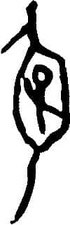是一个侧立的人形，中间包了一个“子”，这其实就是女性怀孕的样子。这个字不太好写，所以后来“人”字就慢慢敞开，最后和“子”分开了。小篆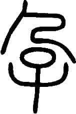上面是“人”，下面是“子”，“人”没有把“子”彻底包住。随着汉字的隶变，小篆中的“人”逐渐变成了“乃”，便有了今天的写法。

在古代，怀孕也叫作“有身”。为什么叫“有身”呢？答案还要从汉字“身”里去探寻。

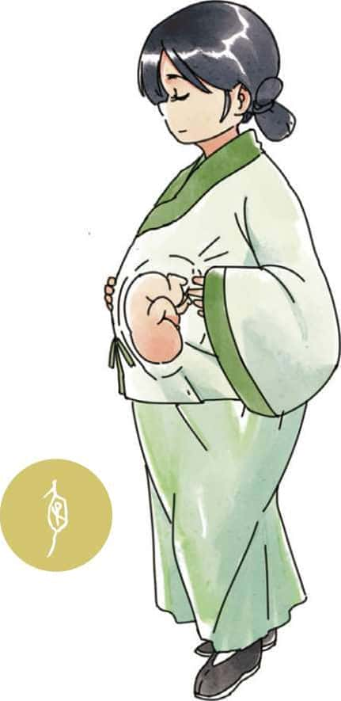

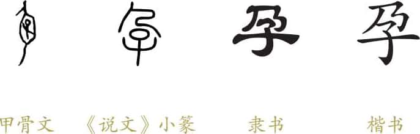

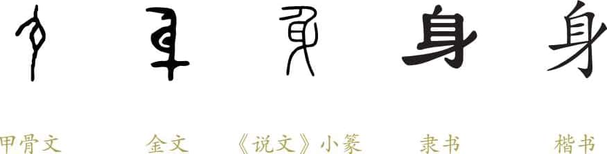

“身”在今天主要指身体，但它的古文字形却和怀孕有关。你看，殷商甲骨文中的“身”（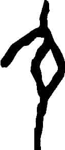）是我们熟悉的侧立人形，它有一个明显的特点——有一个大大的肚子。在金文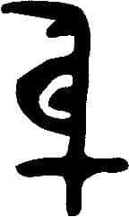中，同样的大肚子里多了一个小点，表示妈妈肚子里的小宝宝。到了小篆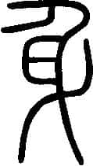，字形略有变化，已经很接近今天的写法，但仍能看出女子怀孕的样子。到了隶书和楷书，我们已经看不出这个字里怀孕的意思了，但学了《说文解字》你就会明白，“身”中的两横原来是小宝宝的象形。

古代有一部叫《正字通》[1]的书，里面说：“女怀妊曰身。”女性怀孕，被称为“身”。《诗经》中有一篇《大明》，说：“大（tài）任有身，生此文王。”大任是周文王的母亲，这里的“身”也是怀孕的意思，“身”中的那个小点，可是历史上鼎鼎大名的周文王呢！到了后来，“身”才逐渐泛指我们的身体。

除了“孕”和“身”，古代还有一个字与怀孕有关——“包”。

看到“包”字，你一定很震惊：“包”不是“包子”“书包”的“包”吗？

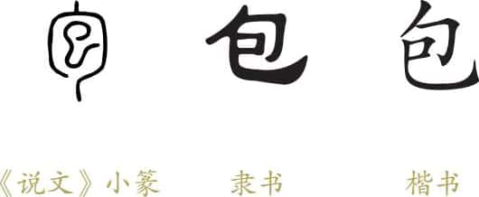

你看，这是小篆的“包”—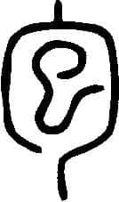，和“身”“孕”很像，也是一个小孩子被包住的样子。不同的是，“包”的中间是一个“巳”字。“巳”是什么意思呢？许慎先生解释说“象子未成形也”。它是一个孩子尚未成形时的样子。

“包”最初指怀孕，身体里“包”着小孩子，后来泛指各种各样里面包着东西的事物，比如“书包”里包着书，“钱包”里包着钱，“包子”里包着馅儿。

尽管相似，但怀孕毕竟是一种特殊状态，和书包、钱包、肉包子明显不同。那怎么才能把表示怀孕的“包”区分出来呢？古人想了一个好办法，在“包”的旁边加了一个“肉”——今天的肉月旁，组成了“胞”字，用于“双胞胎”“一母同胞”“同胞”等词。

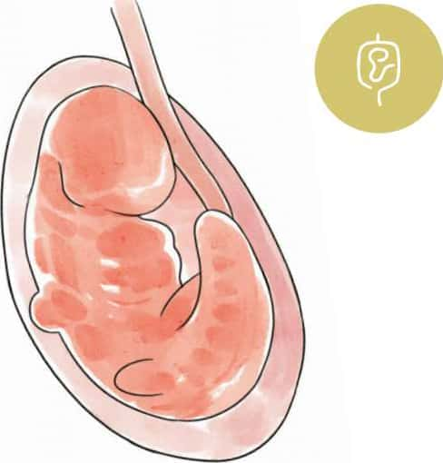

* * *

[1] 《正字通》是一部按汉字形体分部编排的字书，作者是明朝的张自烈。

## 孝  
没有血脉就是不孝？

和“保”“学”一样，“孝”字也很能体现古人对血脉的重视。

你看，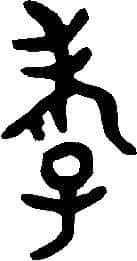是金文中的“孝”。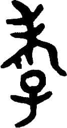的下面很清晰，是“子”字，画出了伸着双手、脑袋大大的小孩子。那字形上面的部分是什么呢？

是“老”。

让我们来看一下“老”的古文字。甲骨文、金文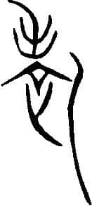中画的是一个面向右侧站立的老人，他手里拄着拐杖，头发很长。随着汉字的演变，今天的“老”字下面变成了“匕首”的“匕”字。但我们要知道，老年人手里拿的可不是锋利的匕首，而是长长的拐杖。

“老”最开始指老年人。对于步入老年的标准，古人有不同的说法，有的说“七十曰老”，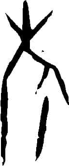有的说“过五十六为老”。在今天，随着医疗条件的改善，标志着成为老人的年龄线越来越靠后，五六十岁的人恐怕还正当年呢。

现代汉语中，“老”是一个常用的形容词和名词，与“少”“幼”相对，表示年纪大的意思。“老人”“老大爷”“敬老院”中的“老”，都是如此。“老”还可以作为尊称，称呼那些德高望重的老年人，比如“张老”“王老”。一个人岁数大，做事情往往更有经验，所以我们说一个人是“老手”，表示他经常做某件事，富有经验。有时候岁数大的人容易保守，所以我们说一个人是“老脑筋”“老顽固”，就表示他思想守旧，缺乏接纳新事物的能力。

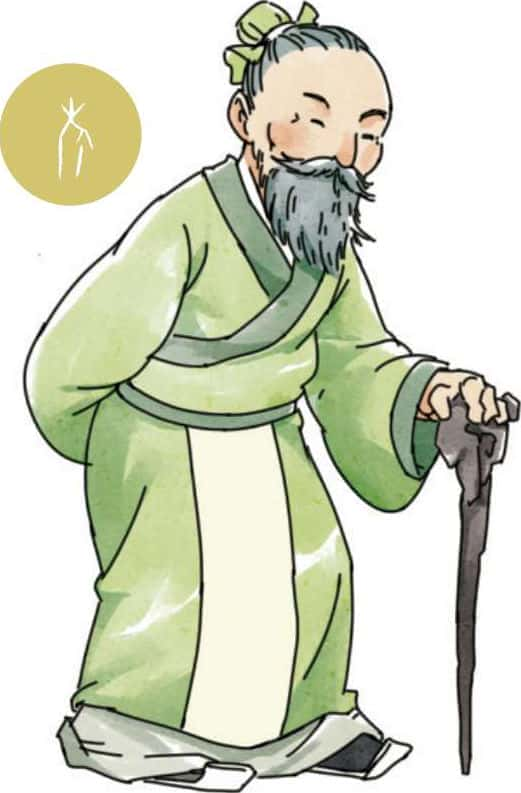

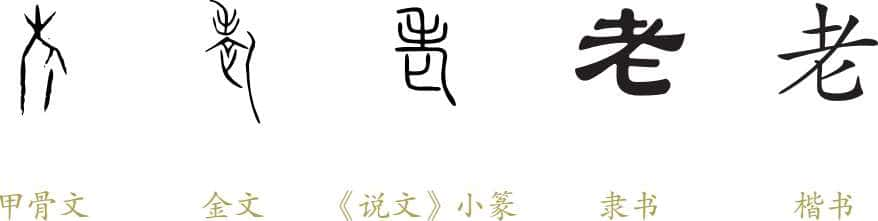

讲完了“老”，让我们回头再来看“孝”字。

“孝”上面是“老年人”的“老”，下面的“子”就好像在背着“老”一样。因此，许慎先生说：“孝，善事父母者……子承老也。”

这个解释很精彩！一句话就把古人的孝道讲清楚了。古人心目中的“孝”有两个基本含义。首先是“善事父母”，子女要好好照顾父母，为其养老送终。其次，“子承老”是指在养老之外，子女还要延续家族的血脉。古人特别注重家族的人丁繁衍、血脉传承。在死亡率高的古代，每个家族都要多生、猛生、尽量生，只有人口多了，家族才能强盛发达，血脉才能传承下去。

由于孝道的基础是血脉相传，《孟子》中才有了一句很有意思的话：“不孝有三，无后为大。”这说的是五帝之一——舜的故事。

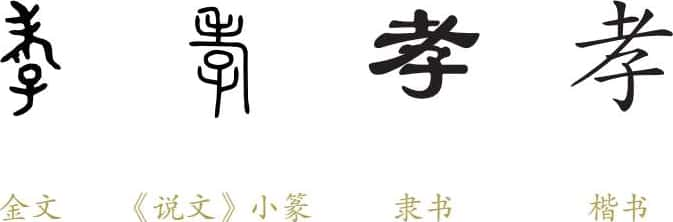

舜有一个糊涂的爸爸，一个狠毒的后妈，还有一个贪心的弟弟。后妈和弟弟想要抢夺舜的家业，没少陷害他。舜是个十分优秀的小伙子，上古帝王尧[1]看中了他的品格，一心想把他培养成自己的继承人，于是，就把自己的女儿嫁给了舜，让他做女婿。

这是天降喜事啊！但舜却为难了：爸爸妈妈都不喜欢自己，肯定不会答应这门亲事，但尧的好意又不能推却，怎么办呢？

在孟子看来，这有什么难办的呢？答案就是——娶！

为什么？古代的“不孝”有三种：第一，自己做坏事，连累父母；第二，自己没工作，没法赡养父母；第三，自己没有结婚生子，不能传宗接代。其中“无后为大”，是最严重的“不孝”。所以，舜娶媳妇虽然没有请示父母，但他是为了繁衍后代，这可是最大的孝顺！

你看，古人的孝道也挺有意思的，对不对？

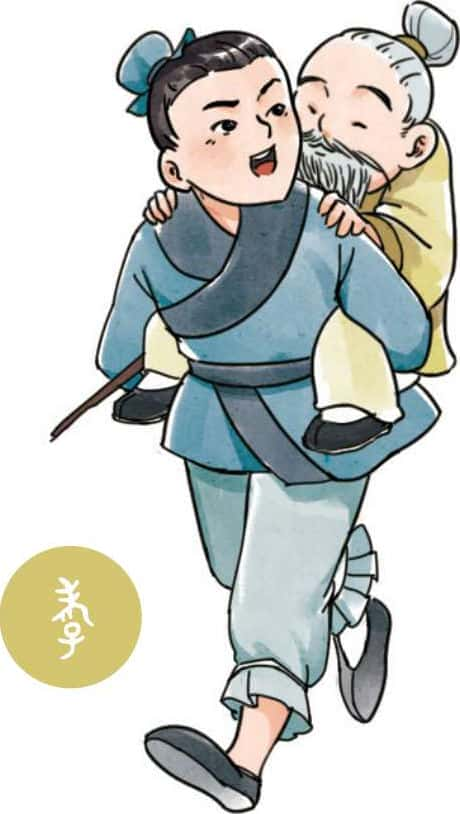

* * *

[1] 儒家推崇的圣明君主有尧舜禹。尧将帝位禅让给了品格高尚的舜，舜后来又将帝位禅让给了治水有功的大禹。

## 保·学  
对血脉的呵护

经历十月怀胎，母亲诞下孩子，重视血脉延续的古人，便开启操心模式，关注孩子的健康成长和学业进展，期待他们一朝金榜题名、出将入相、光耀门楣。

这一讲要讲的，便是对孩子身体的呵护——“保”，以及与他们学业有关的“学”。

### 保/古代的保姆/

“保”字是一个很有爱的字，我们透过它能看出古人对血脉的保护和爱意。

甲骨文中的“保”非常形象，左边是一个人，他的手向后背过去，身上背着一个“子”，即孩子。所以，“保”早期有保姆的意思，也就是背起孩子、照顾孩子的人。到了金文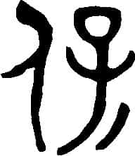和小篆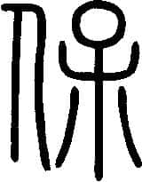，“子”的旁边加了一两个点，作为装饰。这个写法慢慢固定下来，于是甲骨文的“子”（）就变成了“呆”。讲到这里，你应该明白了吧，我们保护的是小孩子，可不是小呆子啊！

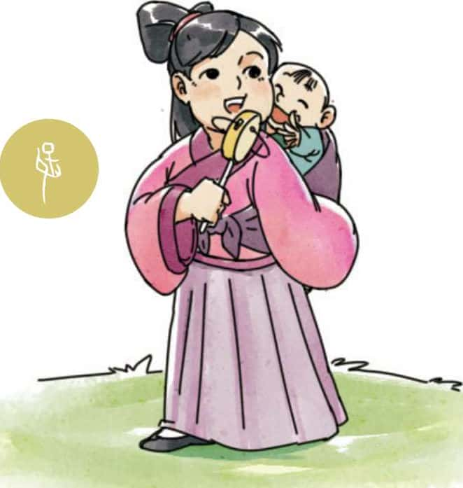

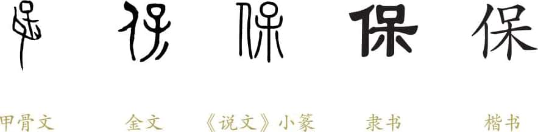

“保”是保护孩子的人，也就是保姆。在古代，并非所有的孩子都有保姆，只有贵族才有。其中，天子的“保姆”最为高级，这个“保姆”当然不是普通人，要由朝廷重臣担任才行。

中国古代的皇帝，为了教育、辅导、保护太子，专门为东宫太子配备了三位“保姆”——太师、太傅、太保。三位老师各司其职：太师教导太子圣明君主如何行事，太傅教导太子父子君臣之道，太保负责保护太子周全——这是古代理想的政治制度。作为太子的老师和“保姆”，太师、太傅、太保地位尊崇，任职要求也高，既要德行高尚、知识渊博、声名显赫，又要是朝廷宰辅或社稷重臣。历史上享有盛名的太子老师，就有谢安、房玄龄、张居正等。

### 学/学而时习之，不亦说乎？/

讲完“保”，再来看“学”字。

古人和我们一样重视孩子的教育。《论语》开篇第一句就是：“学而时习之，不亦说乎？”

在汉字世界中，“学”的历史十分悠久，可以说，从人类文明诞生的那天起，学习这一行为就相伴而生了。

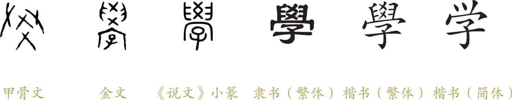

金文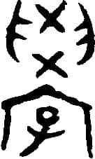是一个典型的会意字。它的上半部分与甲骨文相同，都是左右两只手拿着两个“×”。这两个“×”代表什么呢？有人说，它们是“爻”，是算卦时的用具。也有人说，它们代表算数时用的小棍子——算筹。无论是学算卦还是学数学，它们都是古人的教学用具。的下半部分画了一间屋子，里面有一个“子”。一个小朋友在屋子里拿着教具学习，这就是金文的“学”字。

随着字形演变，金文“学”字中代表房子的部分，逐渐变成了小篆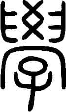中的秃宝盖——“冖”（mì）。“冖”是古人用细纱布做成的罩子，盖在盛食物的鼎上，隔绝灰尘脏污。食物与外界隔绝，可以保持干净，但人如果被蒙在“冖”中，就会辨不清方向，看不清事物。就像《说文解字》中说的那样：“冖，尚矇也。”我们处在蒙昧无知的状态中，就仿佛被罩子蒙住了一样，这是心灵的遮蔽状态。

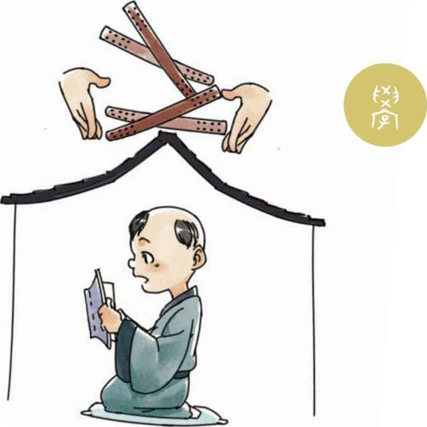

《说文解字》说：“学，觉悟也。”“学”的实质，是通过知识的获取和心灵的思考，来获得生命的觉悟，跳出“冖”所代表的蒙昧状态。在古人看来，“学”并不只是简单地学习知识，不只是认得一个字，背会一首诗，算出一道数学题，更重要的是，我们要在“学”的过程中，明白自己的人生价值与前进方向，看清生命的意义，这才是真正的“觉悟”！

## 弃  
古人的弃子风俗

古人对血脉的重视有好的一面，也有坏的一面。好的一面体现在温情的“保”“孝”等字里，坏的一面，则在这一讲要介绍的“弃”字里。“弃”是个让人揪心的字，它和抛弃孩子有关。

“弃”是简体字，它的繁体字写作“棄”。无论是简体还是繁体的写法，在古文字中都能找到渊源。

先看简体的“弃”字，它对应着《说文解字》中的古文字形，我们能清楚地看到它们的字形关联。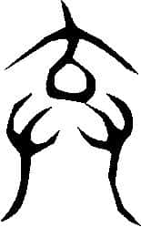上面是一个倒过来的“子”，下面是两只手。这个字是什么意思呢？就是用两只手把一个孩子扔出去。

再看繁体的“棄”，和与之对应的小篆字形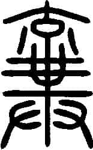，在双手和孩子中间多了一个部分，这是簸箕的形状。“弃”在甲骨文中写作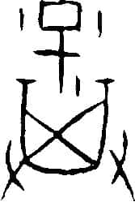，上面是一个“子”，这个孩子刚刚出生，他旁边的几个小点代表着血和羊水，中间是一个簸箕，下面是两只手——这个字描绘的是把孩子放到簸箕里扔掉。无论简体还是繁体，“弃”都是一个鲜活的会意字，展现出古人抛弃孩子的场景。

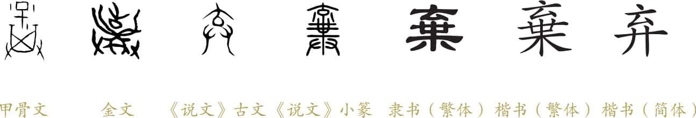

你也许会觉得奇怪，怀孕生子非常辛苦，刚出生的小婴儿又是那么可爱，古人为什么要把婴儿扔掉呢？

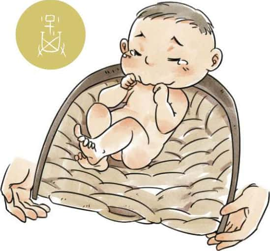

其实，这和古代一种很残忍的风俗——杀首子有关。“首”是第一个的意思，“杀首子”就是把第一个孩子杀掉。古人为什么要杀死第一个孩子呢？因为，在父系社会里，父亲的权力和财产必须要传给自己亲生的孩子。但在抢亲的时代，古人没办法确定抢来的女性是不是别人的妻子，是否已经怀孕。因此，第一个孩子很有可能不是自己亲生的。

在今天，人们可以去医院检验DNA，但古人可没有这项技术。于是，他们想出了一个很残忍的办法——扔掉第一个孩子！这种办法当然可能误伤，但哪怕误伤，也要保证家族血统的纯正，“宁可错杀一千，不可放过一个”，就是这样可怕的逻辑。

“弃子”这种残暴粗野的原始风俗，封存在了“弃”字里，也封存在历史传说中。相传周人的始祖名叫“弃”，他的名字告诉我们，这是一个可怜的、差点儿被扔掉的孩子。

根据《史记·周本纪》记载，“弃”的母亲叫姜嫄（yuán）。有一天，姜嫄在郊游的时候，看到一个大脚印。踩下去的一瞬间，一股神秘的力量涌入她的体内——她怀孕了！生下孩子之后，姜嫄心里很别扭，觉得这孩子来得不明不白，想把他扔掉。

姜嫄一共扔了三次。第一次，她把他扔在马牛经常走过的小胡同里，马牛经过时，竟然全都避让这个可怜的孩子，没有一个用坚硬的蹄子踩伤这个小小的生命。第二次，姜嫄打算把他扔到深山老林里。可她刚一进山，就遇到许多猎人、樵夫。姜嫄担心抛弃孩子的行为被人发现，只好放弃。第三次，姜嫄决定把孩子扔在冰封的河面上。时值严冬，寒冰刺骨，她刚把孩子放在冰面上，空中突然飞来一只大鸟，温柔地将一只翅膀垫在孩子身下，把他和冰块隔开，免得他冻坏，又把另一只翅膀盖在孩子身上，为他保暖。

姜嫄震惊了，这太不可思议了！三次抛弃都失败了，这个孩子肯定不一般！既然他受到了上天的庇佑，自己就不能再逆天而行。于是，她把孩子抱回家，抚养长大。由于曾经想遗弃他，姜嫄就给他取名叫“弃”。

这个孩子从小就有高远的志向，他善于耕种，让老百姓免于饥饿，后来成为周人的始祖，被尊称为“后稷”。

“弃”字背后，是古人的一段特殊的文化记忆。他们为了保证血统纯正，把权力和财富传给亲生孩子，推行过非常残酷的“杀首子”风俗。随着社会发展，这种风俗早已废止，只在古老的汉字中，依稀存留着野蛮残酷的历史痕迹。

# 又

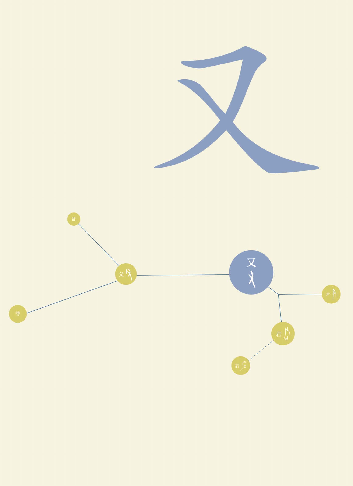

## 父·爸·爷  
拿着棍子的爸爸

《字里字外的人体世界》中讲到了汉字中的三种手，分别是“手（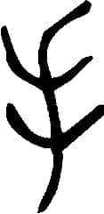）”“又（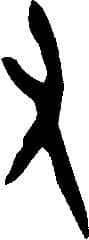）”和“爪（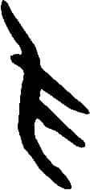）”，它们存在于“指”“取”“友”“受”等字里。在本书中，我会继续讲和“又”有关的字——“父”“爸”“爷”，以及“尹”和“君”。这两组字有着一股权力的味道，分别体现着古代的父权思想和君权思想。

先来讲一讲体现父权思想的“父”字，以及由此衍生出的“爸”“爷”二字。

### 父/威严的父亲/

“父”字看着很抽象，但其实非常形象，充分体现出父亲的威严。这个字出现得很早，在殷商甲骨文中，就能看到它的身影。你看，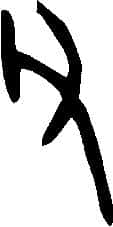是甲骨文的“父”，右边是一只手，也就是“又”字。手里拿的是什么呢？一根小棍子！金文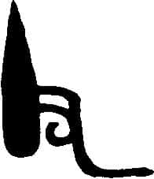和小篆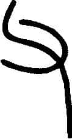的形体，同样是一只手拿着一根棍子，金文中的棍子格外粗大，看着都让人有些害怕。经过隶变之后，这个字更为规整，成了今天的“父”字。

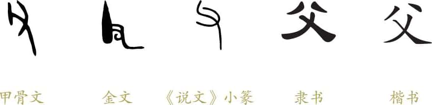

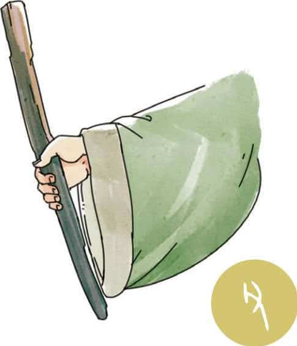

父亲手里拿着棍子，这个场景是不是让你心里哆嗦了一下？拿着棍子的爸爸，曾经是不少人悲惨的童年记忆。

《说文解字》对“父”的解释是：“父，矩也。”“矩”就是规矩，“父”字强调了父亲严厉教导的形象，以及父亲作为家规制定者和执行者的角色。因此，许慎先生接着说：“家长率教者。”所谓“率教”，就是教导孩子。手里拿着一根棍子，在家中拥有至高权威，制定规矩，严厉地教导孩子，这就是古人心目中的“父”。

在古代，礼法制度强调父亲在家庭中的绝对权威。齐景公曾问政于孔子，孔子说：“君君，臣臣，父父，子子。”意思是说，做君主的要有君主的样子，做臣子的要有臣子的样子，向君主尽忠；做父亲的要有父亲的样子，做儿子的要有儿子的样子，对父亲尽孝。只要大家都谨守本分，各安其道，那整个社会就会稳定运转，国家也会长治久安。具体到家庭生活中，古代的父亲处于绝对的支配地位，孩子要听从父亲在生活、学业、婚姻上的安排，基本上没有什么自由可言。在古代，我们见不到可以和孩子打成一片、勾肩搭背、可爱可亲的老爸，而是一个个严肃、威严、给人巨大压力的父亲，让人敬畏，难以亲近。

除了指一家之长，“父”也可以指原始社会里部落的领导者。他手里拿的不仅仅是管教孩子的木棍，还是统领部落、指挥大家共同劳动的权杖，这是部族权力的象征。

《山海经》中有一个著名的传说“夸父逐日”。夸父是古代的一位大酋长，也是一位大英雄。我们今天常说“夸张”“夸大”，在古代“夸”有大的意思，“夸父”就是“大爸爸”，是部落里的大酋长。

夸父“与日逐走”，追赶太阳。人怎么追得上太阳呢？但他奔跑不息，跑累了，口渴得不行，就把黄河、渭河喝干了。即使这样，他依然觉得不解渴，就想“北饮大泽”，到北方的大湖去饮水。有人说，这个“大泽”就是俄罗斯的贝加尔湖。

然而，夸父还没有跑到北方的大泽，就渴死了。他死了之后，“弃其杖”。夸父的手杖可不是普通的木棍，而是带有神奇力量的权杖。手杖一扔，“唰”的一下变成了一片树林，继续造福后人。虽然他失败了，但他追赶太阳的行为，代表着人类征服自然的意志和决心，这份豪情壮志值得我们尊敬。

总之，“父”是一个很有内涵的字，从它身上，我们能看到中国历史中父系社会和父权家长制的特点。如果把“父”和“母”进行对比，就更能看出两性之间的显著差异——“父”手里拿着权杖，“母”则是在给孩子喂奶，“父”与“母”在古代家庭中的职能，由字形便可见一斑。

### 爸** **爷/由“父”衍生出的汉字/

“父亲”是个很正式的称谓，在日常生活中，我们一般管父亲叫“爸爸”。

“爸”是个形声字，上面是“父”，这是它的形符；下面是“巴”，这是它的声符。所以，“爸”是在“父”的基础上造出的形声字。

爸爸的爸爸叫“爷爷”，“爷”的繁体字是“爺”，上面是“父”，下面是“耶”，这是一个从父耶声的形声字。但“耶”写起来太麻烦了，汉字简化后，下面的“耶”就变成了“卩”（jié）。“爷”和“爸”一样，都是在“父”的基础上造出的形声字。

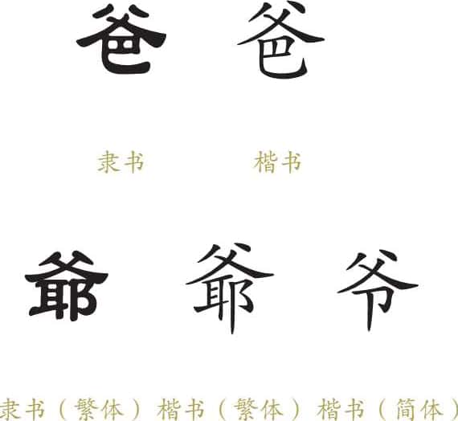

## 尹·君  
手拿棍棒的统治者

上一讲我讲到了手拿棍棒的一家之主——“父”，以及“父”字里的父权思想。在这一讲要介绍的“尹”和“君”里，有威力更大的棍棒，它体现的是至高无上的君权。

### 尹/威严的官员/

“尹”在生活中并不常用，但它的历史非常悠久。你看，这是甲骨文的“尹”——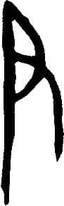，和“父”字有异曲同工之妙，都是一只手（“又”字）拿着一根棍子。到了金文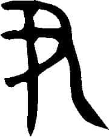，手牢牢地攥住了棍子，其字形和今天的写法已经十分接近。从甲骨文开始，“尹”字一脉相承，它的造字思路从来没有改变。

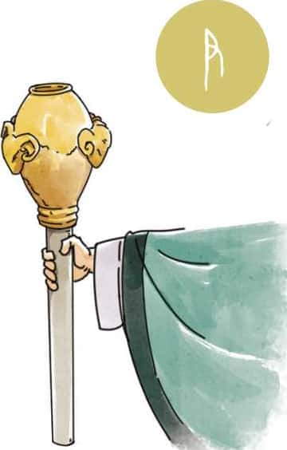

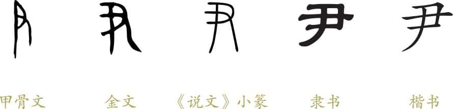

“尹”的字义和“父”也非常像。“父”是手里拿着一根棍子，既表示对孩子的管教，也象征古代部落酋长的权力，在后一种语境中，这根棍子很可能象征着地位尊崇的权杖。“尹”也是如此，字形中的棍子是国家权力的象征。《说文解字》中说：“尹，治也……握事者也。”“尹”有治理、管理的意思，“握事”就是管理各种事务。

在古代汉语中，“尹”常指高级官员。在春秋战国时期，南方有一个强大的国家叫楚国，经常北上与其他国家逐鹿中原。楚国官员的名称和中原的不同，他们把国家的执政大臣叫作“令尹”。到了汉代，还有一个官名叫“京兆尹”——“京”指首都，“兆”指首都的边界，“尹”指管理者，“京兆尹”类似今天的北京市市长。

在现代汉语中，“尹”褪去了权力的色彩，主要用作姓氏。这一姓氏的人可能祖上做过大官。你如果遇到姓“尹”的朋友，不妨给他讲一讲这个字，或许可以启发他去考证一下家族历史呢。

### 君/拿着棍棒，发号施令/

说完了“尹”，再来看更有威严感的“君”字。

“君”在殷商甲骨文中就已出现，上面是一个“尹”，下面是一个“口”，一直到金文、小篆，乃至隶书、楷书，“君”的形体一脉相承，都没有改变。

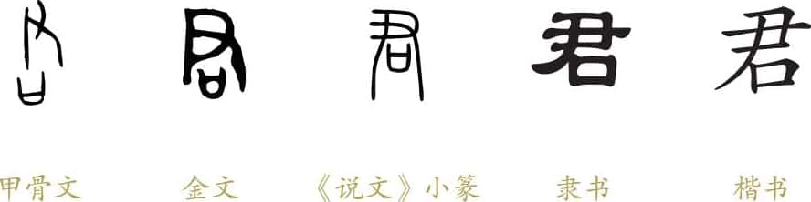

《说文解字》说：“君，尊也。从尹；发号，故从口。”君主地位尊贵，身处万人之上，是国家的最高统治者。为了强化君主的地位，古人声称“君权神授”，认为帝王的权力来自上天，所以皇帝也称为“天子”，是上天的儿子。一国之君要领导大众、发号施令，因此从口。在这个字里，“口”是话语权的象征。

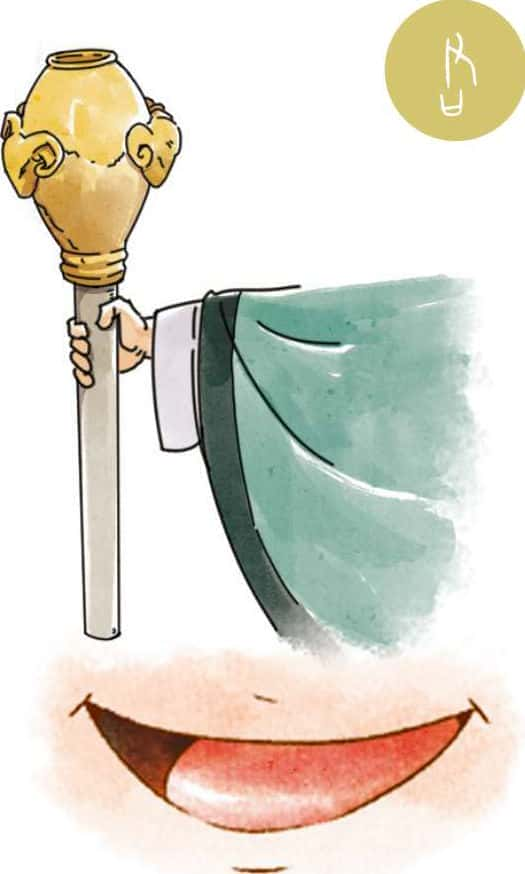

同样的造字思路也体现在“后”字里，“后”也与“口”密切相关。

许慎先生在《说文解字》中说，“后”指的是国君，它的字形上方像一个人（代表国君），下方是“口”，国君要“施令以告四方”，发布命令、告知四方。所以，“口”象征着话语权，君主金口玉言，一言九鼎。

“后”最开始和“君”一样，都指国君，后来才慢慢分化，指称皇后——帝王的配偶，后宫中的领袖，而“君”则主要用来指国君。

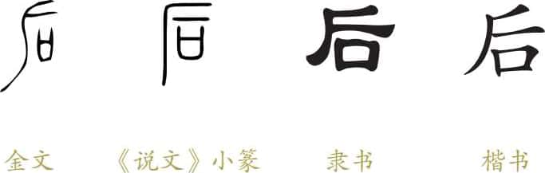

需要注意的是，“君”一开始的地位没有国君这么高。在周代，“君”的地位低于“王”，指那些分封出去的各国诸侯，也就是所谓的“封君”。随着字义演变，它的地位才慢慢提高，成为国君的代称。由于“君”的地位高，它也可以用作对别人的尊称。古人尊称他人，会说“张君”“李君”，对一众人的尊称则叫“诸君”。

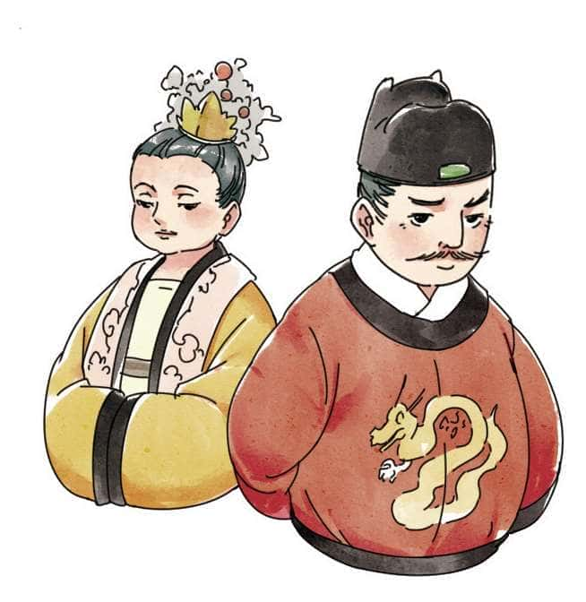

# 王

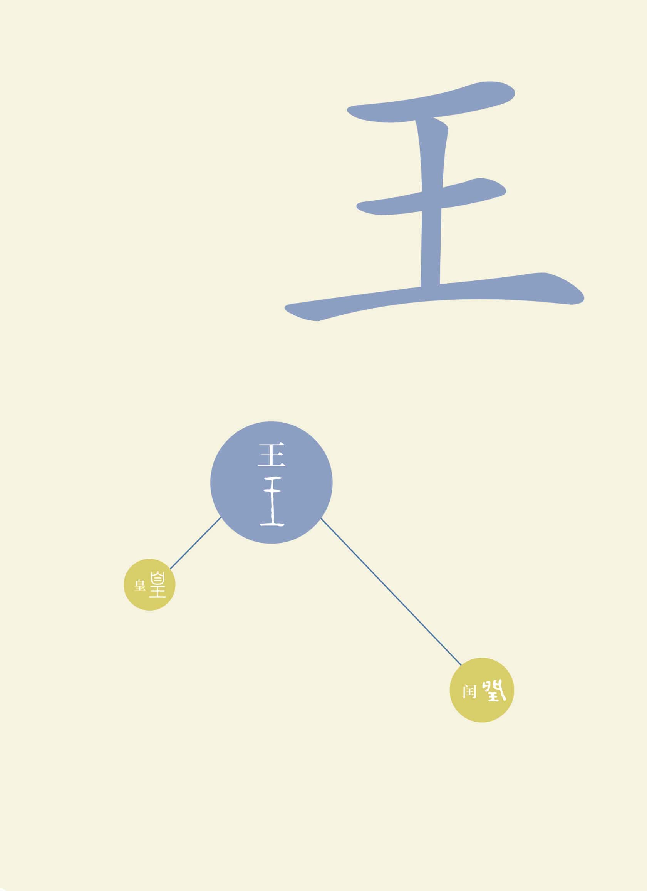

## 王  
什么是王道？

上一章，我们看到了暗藏在汉字里的父权和君权。这一章，我将为你介绍古代地位崇高的统治者——“王”和“皇”，以及相关的“闰”字。我们的皇权之旅，将从“王”字开始。

“王”有着非常悠久的历史，我们可以一直追溯到甲骨文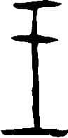。在《说文解字》中，许慎先生引用西汉大儒董仲舒的观点，对“王”进行了充满文化意蕴的解说：

王，天下所归往也。董仲舒曰：“古之造文者，三画而连其中谓之王。三者，天、地、人也；而参通之者，王也。”

“王”有三横，上面一横代表天，下面一横代表地——在汉字中，“一”经常用来表示天地，如“雨”字的一横在上，表示天；“立”字的一横在下，表示地。在“王”字中，上下两横代表天地，中间一横代表人，正中一竖贯通上下，指王者能够贯通天地人之道。

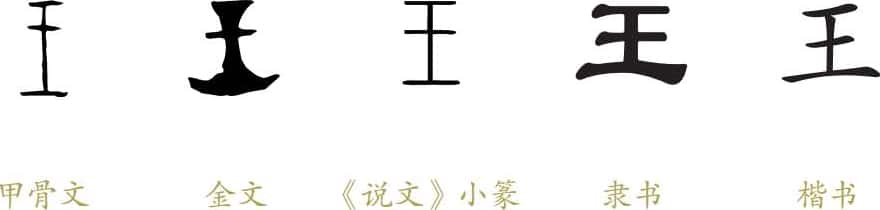

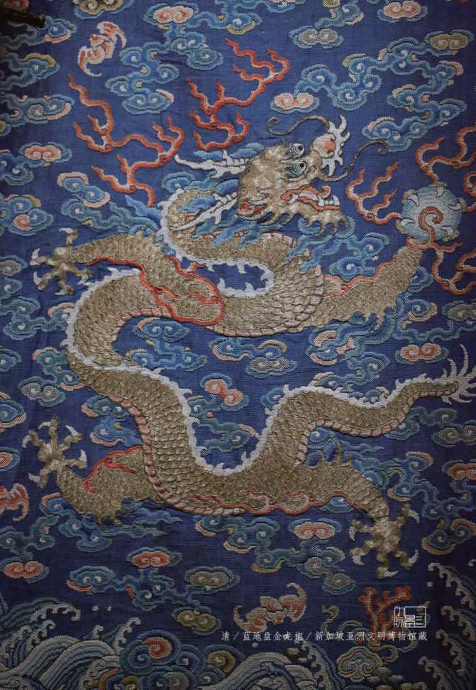

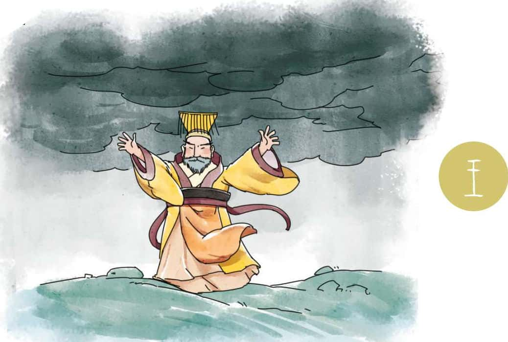

在董仲舒这样的大儒看来，一个真正的王者，需要明天时，知地利，处理好自己和万民之间的关系，这就是“贯通天地人”的内涵。做到这一点，王者就可以通过道德感化别人，达到“天下所归往也”的境界，百姓都去投奔他，希望成为他的子民，这就是“王道”。

与“王道”相对的是“霸道”，是通过武力来降伏别人。两者相比，“王道”有浓厚的道德气息，强调通过道德感化使百姓自然归附。这种境界的代表，就是尧舜禹的“先王之道”。可以说，“王道”与“霸道”的境界截然不同，高下立见。

《说文解字》对“王”的解释带有浓郁的儒家思想，实际上，在早期古文字中，“王”的字义并没有这样“文质彬彬”。你看，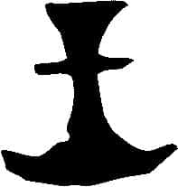是金文的“王”，像是一把大斧头！在古代，王者手中的斧头称为“钺”（yuè），是杀伐、权力的象征。钺一般由青铜做成，刚刚铸造出来时，色泽金黄，故又称为“黄钺”。古代王者手持黄钺，征战杀伐，所以，“王道”一开始和“霸道”没有太大区别，至于“以德服人”，则是后世儒家不断赋予“王道”的道德内涵。通过对“王道”的阐释，来建立一种高度的政治文明，这也是儒家的一贯追求。

## 皇  
王的火炬

“皇”字很好玩儿，最初造字时，“皇”字里并没有“王”。甲骨文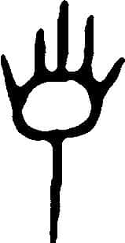像一把火炬，光芒四射。有人认为，熊熊燃烧的火焰给人光明、浩大的感觉，这和王者的品德内在相通，因此，古人便用火炬的形象造出了“皇”字最初的模样。随着汉字的发展，到了金文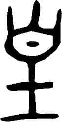，火焰下面变成了一个“土”。

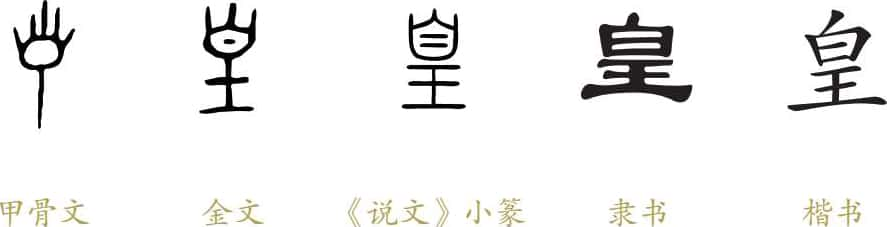

到了小篆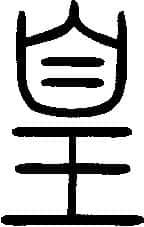，“皇”字上面由火焰变成了“自”，下面的“土”加了一笔，变成了“王”，写法和今天的“皇”字非常相似。“自”的甲骨文是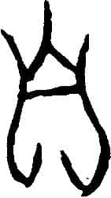，指鼻子。我们向别人介绍自己的时候，总会指着自己的鼻子说“我叫某某某”，所以鼻子（自）可以表示自己。鼻子是人体的最前端，因此“自”也有开端的意思，加上表示王者的“王”字，组成会意字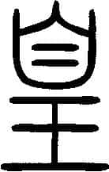，表示人类历史上最早的君王。后来，随着汉字的发展，“自”慢慢演变成“白”，也就有了我们今天的写法——“皇”。

“皇”和“王”有什么区别呢？

它们所指不同。“皇”最初专指中国历史上最早的君王“三皇五帝”中的“三皇”。什么是“三皇”呢？有人说是伏羲、神农和黄帝，也有人说是伏羲、神农和女娲，还有人说是天皇、地皇和人皇。虽无定论，但可以肯定的是，他们的历史都非常久远。而“王”则要年轻一点儿，主要用来称呼周文王、周武王等后来的国君，或者在古代用作动词，如“王（wàng ）天下”，即称王于天下的意思。

至于我们熟悉的“皇帝”，这一称呼是秦始皇嬴政的首创。秦王嬴政于公元前221年统一中国，建立了秦朝——中国历史上第一个统一的中央集权制的封建国家。嬴政觉得自己“德兼三皇，功高五帝”，自己的德行和功绩可以媲美三皇五帝，于是不再用“王”来称呼自己，而是将“皇”和“帝”合并为“皇帝”一词，用作自己的尊称。

自此以后，“皇帝”便成了历代封建君王的称号。

## 闰  
王者颁布历法

最后我们再讲一个“闰”字。“闰”字里面有一个“王”，它和君王之间有什么关系呢？

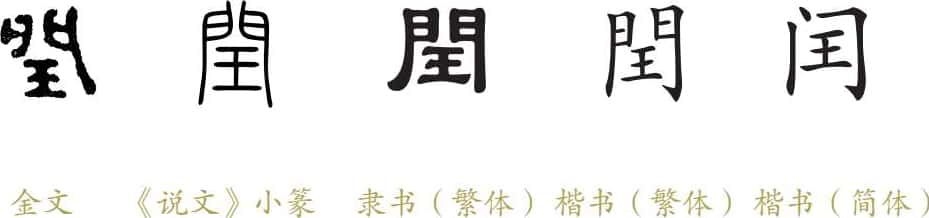

“闰”其实是古代的一个历法术语。历法指用年、月、日计算时间的方法。我们知道，中国古代使用农历。根据我们今天使用的公历，一年一般是三百六十五天，但农历的一年不够三百六十五天，久而久之，“欠”的日子就越来越多。怎么办呢？这个时候就要用到“闰月”，每隔几年在历法中添一个月，把不够的时间补齐。

古代的历法掌握在天子手中，时间的节奏要由王者规定。你看“闰”的字形，就是门里站着一个王。《说文解字》说：“天子居宗庙，闰月居门中。”天子向天下颁布闰月的时候，他要站在宗庙的大门中，大声宣布。因此，“闰”的字形有王者发号施令的意味。它用非常形象的字形，表达出相当抽象的历法概念。

# 示

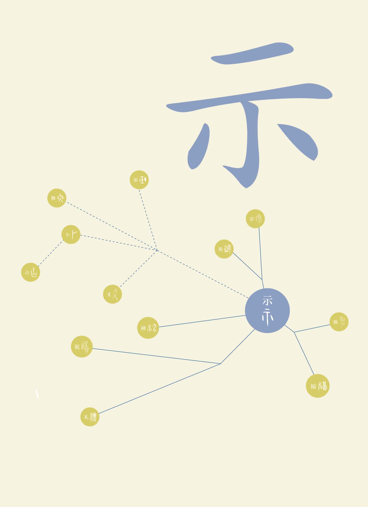

## 示·神  
来自神灵的启示

在神话的世界里，有各种各样的神灵：玉皇大帝、王母娘娘、太白金星、文曲星、土地公公、灶王爷……古人可真是迷信啊，他们想象出的神灵构成了古代社会生活的重要部分。在这一讲，我将介绍两个和神灵相关的字——“示”和“神”。

### 示/上天预示吉凶/

“示”在汉字中很常见，它就是我们通常说的“示字旁（礻）”。在甲骨文中，“示”有繁体、简体两种写法——繁体的写法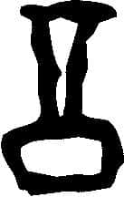更为形象，它是一个象形字，画出了古人祭祀祖先、神灵时的牌位；简体的写法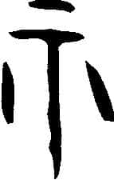和今天的非常相似，两横一竖，旁边有两个小点。

什么是“示”呢？《说文解字》的解释是：“示，天垂象，见吉凶，所以示人也。从二；三垂，日、月、星也。观乎天文以察时变，示，神事也。”许慎先生认为，“示”有揭示、展示的意思，上面两横象征上天，下面三垂象征着日、月、星辰——上天用各种各样的天象，把吉凶祸福呈现给人们，让他们预测未来、趋吉避凶。比如，古人若见到日食、月食、荧惑守心等天象，就会认为要遭遇凶险。

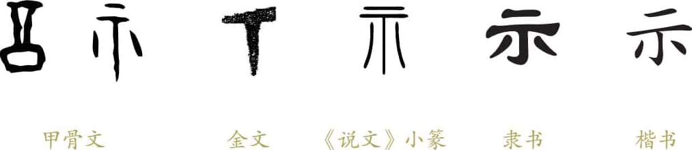

正因如此，现代汉语中的“示”多有展示、告知的内涵。有公开“展示”，也有悄悄“暗示”；有用口“告示”，也有用手“指示”；想要告诉别人自己很厉害，是“示威”；想要一件事让所有人都看到，则是“示众”……这些词义，都和“示”预示吉凶的本义密不可分。

上天将吉凶祸福以天象示于众人，古人也在试图解读神灵的旨意。在古代，担任上天与人之间交流媒介的，是巫。上古时期，巫作为神灵的人间代言人，掌握着宗教、文化的权力。

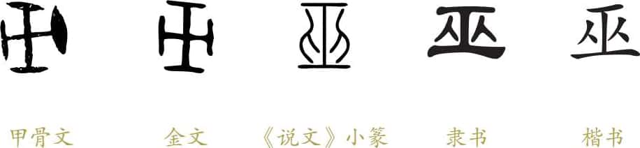

那“巫”这个名称从何而来呢？

从汉字的角度来看，甲骨文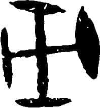像巫师作法的法器，小篆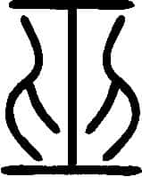像一个站立的人，旁边垂下两只长长的袖子。古人常说“长袖善舞”，在许慎先生看来，“巫”最初正是翩翩舞者。这位舞者和如今的舞蹈家不同，跳舞的目的不是艺术表演，而是要通过动人的舞蹈来感召神灵。《说文解字》中说：“巫，祝也。女能事无形，以舞降神者也。象人两袖舞形。”能侍奉无形的神灵，用动人的舞蹈来感召神灵的女子，就是最早的“巫”。那她们跳的是什么舞呢？

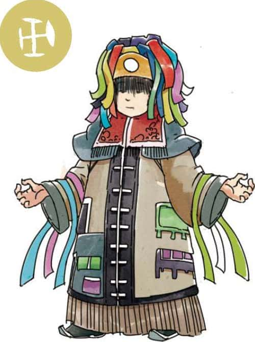

让我们从“舞”字中找寻答案吧。

“舞”的字形经过了复杂的发展过程，从象形字慢慢发展成了形声字。甲骨文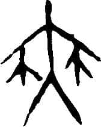是个象形字，像手拎竹枝舞蹈的人。到了金文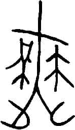，“舞”下面多了一个“舛”（chuǎn）字。“舛”是两脚相逆，生动地描绘出了跳舞时撇开的双脚。你看金文中的“舞”，是不是还有些可爱呢？到了小篆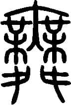，“舞”发展成了形声字。在《说文解字》中，许慎先生说：“舞，乐也。用足相背。从舛，无声。”这一解释把“舞”分为了上下两个部分，下半部分是跳舞的双足，为形符；上半部分是“无”的繁体字——“無”，为声符。此时的舞，已不是巫师之舞了。

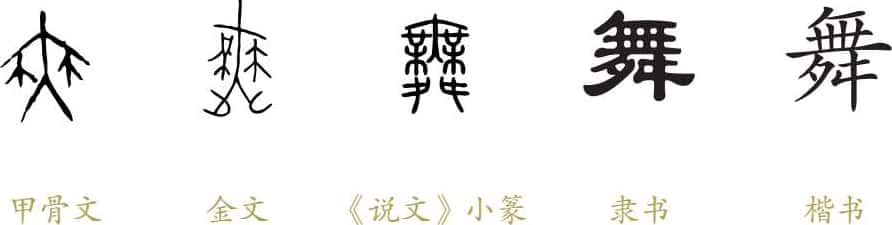

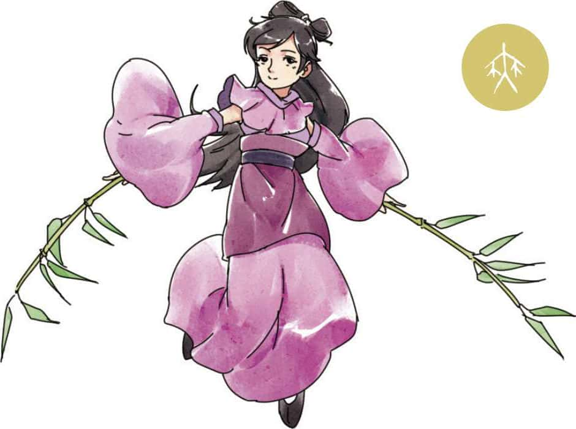

巫师除了能跳舞感召神灵，也可以通过占卜来预测吉凶。古代的王者十分迷信，根据历史记载，他们经常占卜、算卦。无论战争还是耕种，无论风调雨顺还是天灾人祸，无论是政治上的方方面面，还是生活中的点点滴滴，王者都要向上天祷告，以获得神灵的启迪。王者的迷信，都体现在“占”“卜”二字中。

我们知道，甲骨文是记录商周时期占卜的文字，“卜”这个字出现得特别早，从甲骨文到金文、小篆，再到隶书、楷书，它的写法基本上没变过。

古人是如何占卜的呢？根据学者研究，他们往往选用乌龟腹甲，先将它磨平，然后在上面钻凿出一些小孔，再用火烧。因为龟甲表面不平，受热之后就会爆裂，发出“bu、bu”的声音——这就是“卜”字读音的来源。而“卜”字的形体，就像乌龟壳上烧出来的裂纹，这是一个标准的象形字。《说文解字》中说它“象灸龟之形”，是十分准确的。

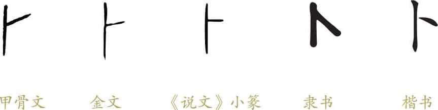

在古文字中，与“卜”意思相近的还有“兆”字。《说文解字》中说：“兆，灼龟坼（chè）也。”“灼”是烧的意思，“龟”是龟甲，“坼”是裂纹——“兆”和“卜”一样，都是烧灼龟甲而产生的裂纹，也就是神灵带给我们的征兆。

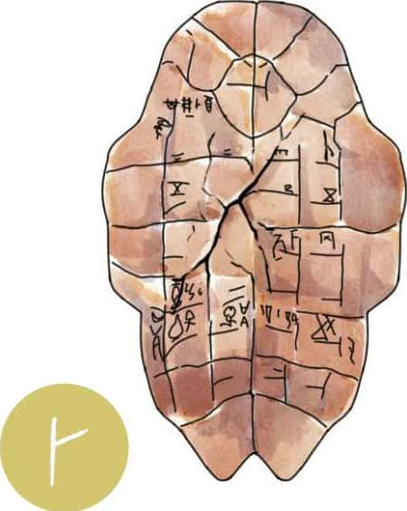

“卜”完之后，下一步是“占”。

“占”在甲骨文中也已出现，从甲骨文到今天的楷书，它的字形一脉相承：上面一个“卜”，下面一个“口”。

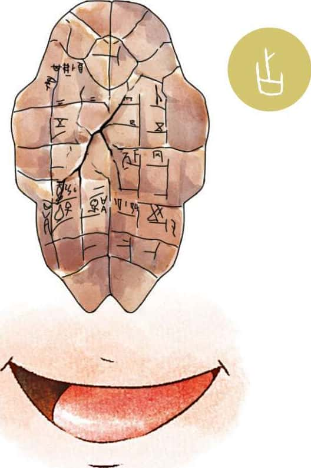

“占”是一个会意字：“卜”是烧出来的裂痕，“口”则是用语言来解释这些裂痕的含义。在殷商人心中，龟甲上的裂纹是神灵的启示，只有上达天意的巫师才能理解。某种意义上，解释天意的“口”，也象征着特殊的话语权。不过，占卜这种殷商时期常见的预测方式已经失传了，传承下来的是另外一种预测方式——算卦。

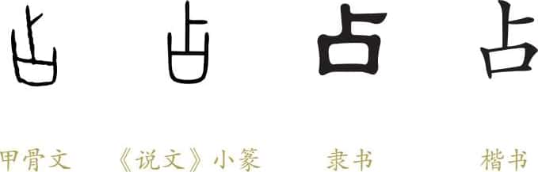

所谓算卦，就是利用《周易》的六十四卦来测算未来。六十四卦由八卦组合而成，每卦则由三个“爻”（yáo）组成。

“爻”的含义是什么呢？这要从古人算卦的方式说起。古人算卦主要使用一种长长的草——蓍（shī）草。在算卦的时候，蓍草会交叉重叠，这就是“爻”的形状。《说文解字》说：“爻，交也。”“爻”就取象于蓍草交叉的状态。

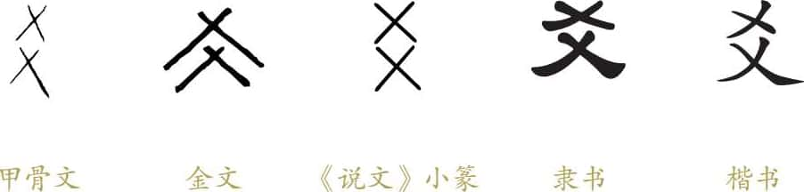

“爻”是组成八卦的长短横道，分为阴爻和阳爻——在古人看来，万事万物都可分为阴阳两种属性。“阳爻”在八卦中是一长横，三个阳爻就组成了“乾卦”（），指的是天，或是太阳，也可以指男性，这是阳性最强的一卦。“阴爻”在八卦中是两个短横，三个阴爻，也就是六个短横组成了“坤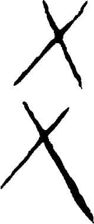卦”（），指的是大地，或是月亮，也可以指女性，这是阴性最强的一卦。

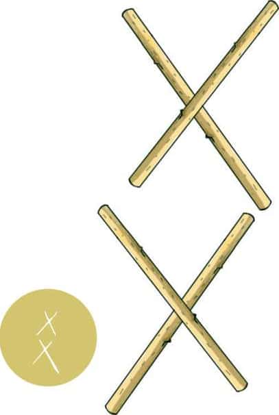

通过“示”字，我们知道了古人一直在解读上天和神灵的旨意。那古人崇拜和敬畏的神灵是什么呢？让我们从“神”字中一探究竟。

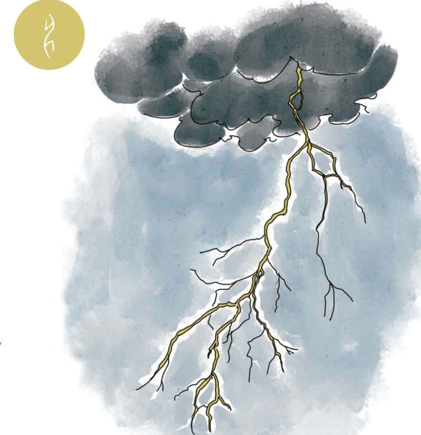

“神”来源于“申”。我在《字里字外的天文地理》中曾经讲过，“申”的甲骨文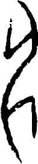就像劈开黑夜的闪电。在古人眼中，黑夜十分可怕，带给人死亡一般的恐惧。在茫茫暗夜之中，突然一道亮光划破了沉沉夜色，随之而来的是巨大的轰鸣。自然伟大的力量给古人带来了莫大的震撼，他们以为这就是神迹，不由得发出一声赞叹：“我的神啊！”

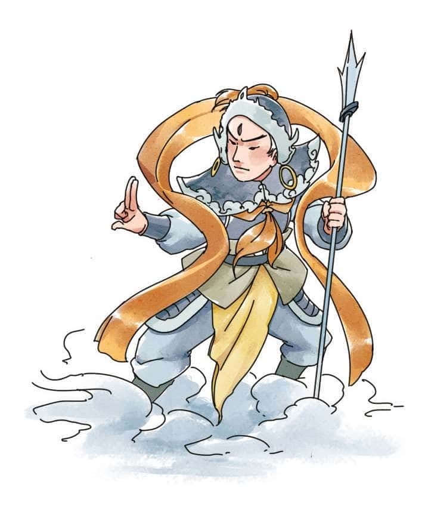

在东西方神话中，闪电是神灵特有的力量。希腊神话中，众神之王宙斯持有的武器便是雷电霹雳；东方神话亦是如此，电闪雷鸣是神灵威力的展现。“申，神也”，“神”最开始写作“申”，表示闪电，后来古人为它添加示字旁，造出了“神”字，强调闪电和神灵祭祀、预测未来息息相关。

“神”字是蒙昧时代原始信仰的体现，古人敬畏自然，认为自然万物均由神灵掌管。如果你看过《西游记》《封神演义》或是一些神话故事，就会发现，我们的祖先创造出了那么多神灵！玉皇大帝、太上老君、元始天尊、太白金星、王母娘娘、二十八星宿、巨灵神、二郎神、托塔李天王、土地神、千里眼、顺风耳、灶王爷、风神、雨神、水神、火神、山神……山川河泽、日月星辰皆有神灵，这反映出了中国的宗教文化是“多神论”，这和西方基督文化的“一神论[1]”形成了鲜明对比。

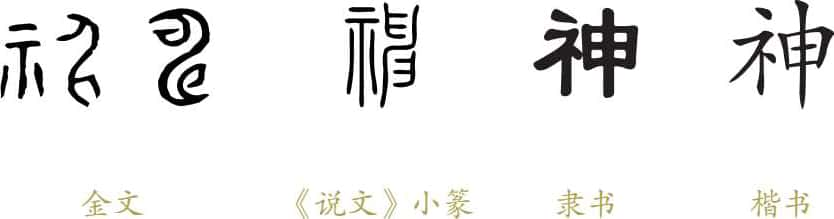

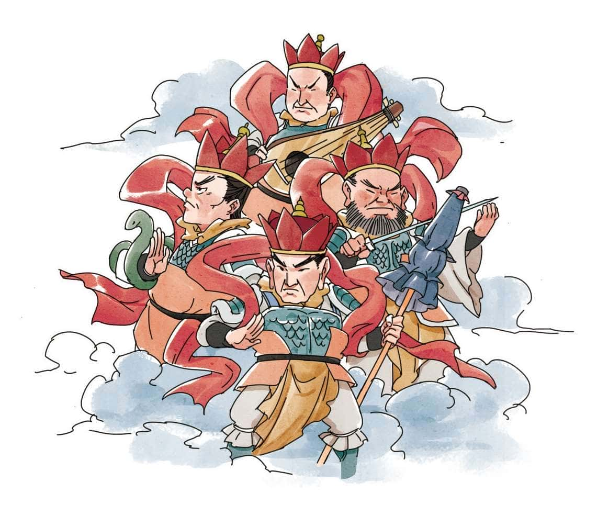

* * *

[1] “一神论”相信宇宙间只存在一个神，神主宰着世界上的万事万物。

## 礼·祝  
无所不在的生活礼仪

古人认为，天地山川皆由神灵掌管，除了通过占卜来聆听神意，古人也常常通过各种祭祀来表达对神灵的敬畏。这一讲要讲的便是与祭祀有关的“礼”和“祝”。

### 礼/源自古代祭祀的“礼”/

“礼”是一个形声字，从示，豊（lǐ）声。由甲骨文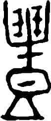可知，“豊”是“礼”的本字。我们仔细看它的形体，上面有两串“玉”，下面有一面鼓。有人认为，这个字显示出古人祭祀时要以玉为祭品，还要敲出阵阵鼓声，孔子就曾说：“礼云礼云，玉帛云乎哉？乐云乐云，钟鼓云乎哉？”这句话告诉我们，古代祭祀行礼时离不开玉石和钟鼓。后来，随着汉字的发展，古人为“豊”添加了示字旁，造出“禮”字，表明礼和神灵祭祀有关。“禮”最后又简化为“礼”。

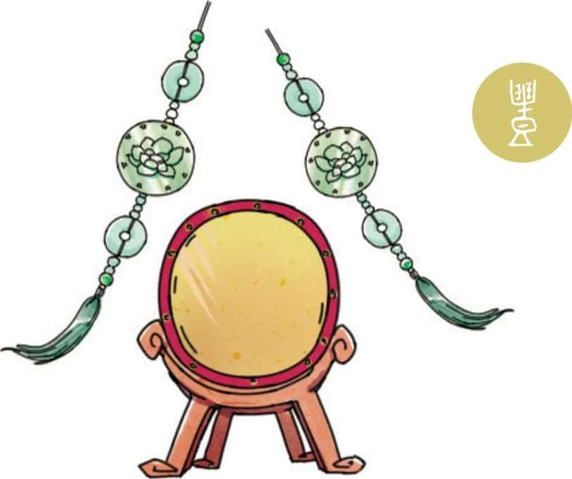

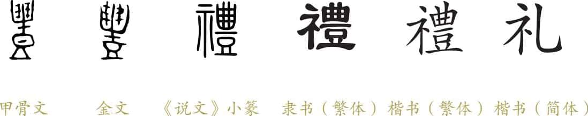

许慎先生在《说文解字》中说：“礼，履也。所以事神致福也。”“履”是古人穿的鞋子，引申出脚踏实地地实践之义。“事神”是侍奉神灵，“致福”是获得人间的福报。在古人看来，“礼”源自古代祭祀，祭祀神灵时，不仅要心中存有敬意，更要将这份敬意体现在言谈举止之中。人们虔诚地祭拜神灵，希望以此获得神灵的庇佑，得到人间的福报。

从祭祀出发，古人将礼节规范不断向生活拓展，逐渐建立起一整套礼仪标准和行为规范。“礼”成为丰富又庞大的文化系统，对一个人从生到死、衣食住行的方方面面，都加以约束和规范，打造出了一个严密的礼仪世界。

有时候，古人还蛮辛苦的，举手投足、行住坐卧，都有特别的规定、烦琐的讲究。比如，走路时要注意风度仪态，慢慢前行，因为他们身上坠有玉佩，慢慢走时，玉佩轻轻撞击，发出动听的叮当之声、环佩之音。如果不重仪态，大步流星、疾走如飞，玉佩便会乱作一团，声音嘈杂不堪。

古人吃饭喝酒也讲究颇多。根据礼制，在正式场合中，主人敬一杯，客人回敬一杯，主人再敬一杯，如此三杯，称为一献。在一献之礼中，主人要磕头十一次，客人十次。也许你觉得这还不算多，但要知道，庙堂之上最隆重的大型宴会一共要走九次流程，行九献之礼！算下来，古人参加一顿正式的宴席，要磕九十多个头，想一想都觉得累得慌。

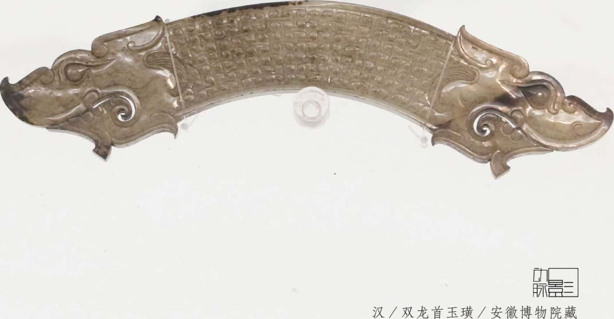

在古代，无论是天子、诸侯、大夫还是普通士人，都要受到礼的约束，大到国家制度，小到天子摇头的幅度，都要符合礼制。天子摇头时，动作需要缓慢有度，因为天子的帽子上面有“旒”（liú），也就是垂下的珠帘。它们不仅遮挡视线，还限制了戴帽人头部的活动范围。天子不能随意摇头晃脑，每个动作都要雍容和缓，要知道，一旦摇头太猛，珠帘就会噼里啪啦地乱甩，甚至绞在一起，实在不太雅观。

关于礼，可以讲解的地方真的很多。这些细致入微的礼仪规范，都被整理记载在《周礼》《仪礼》《礼记》[1]等古籍里，等着你去发现。

### 祝/祭礼中的祝祷者/

讲完了“礼”，我们再来看一看“祝”字。“祝”常用于“祝福”“祝愿”，但它其实最早也来自祭祀。

“祝”是一个会意字，左边是“示”，右边是“兄”，但它可不是兄弟的意思。在甲骨文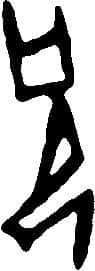中，“祝”还没有加上示字旁，它的上面是一个“口”，下面是一个跪坐的人形。“祝”和“兄”的甲骨文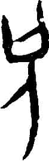写法很像，区别在于，“祝”下面的人形是跪着的，表示人祭祀时虔诚地跪在地上，向神灵祷告；而“兄”下面的人形则是站立的，古代强调“长兄如父”，兄长就像父亲一样威严，站立的人形上面是“口”，塑造出了一个威严的兄长，他在家族中享有仅次于父亲的话语权。

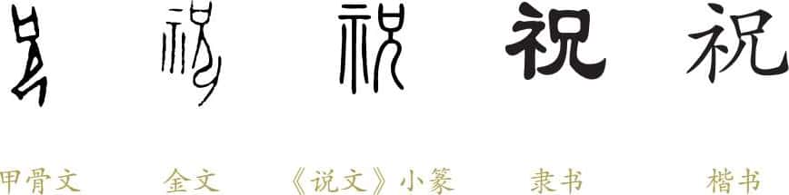

相比“兄”，“祝”的姿态就像字形一样谦卑，《说文解字》中说：“祝，祭主赞词者。”“祝”指早期的神职人员，他们在祭祀时恭敬地跪在地上，虔诚地向神灵祷告，希望获得上天庇佑。后来，古人为它添加了“示”，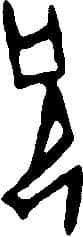变成了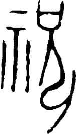，和“事神致福”的“礼”一样，强调它和祭祀神灵有关。

在祭祀中，“祝”是一种祈求福祉的言语行为，因此衍生出美好言辞的含义，用于“祝福”“祝寿”“祝你生日快乐”等。

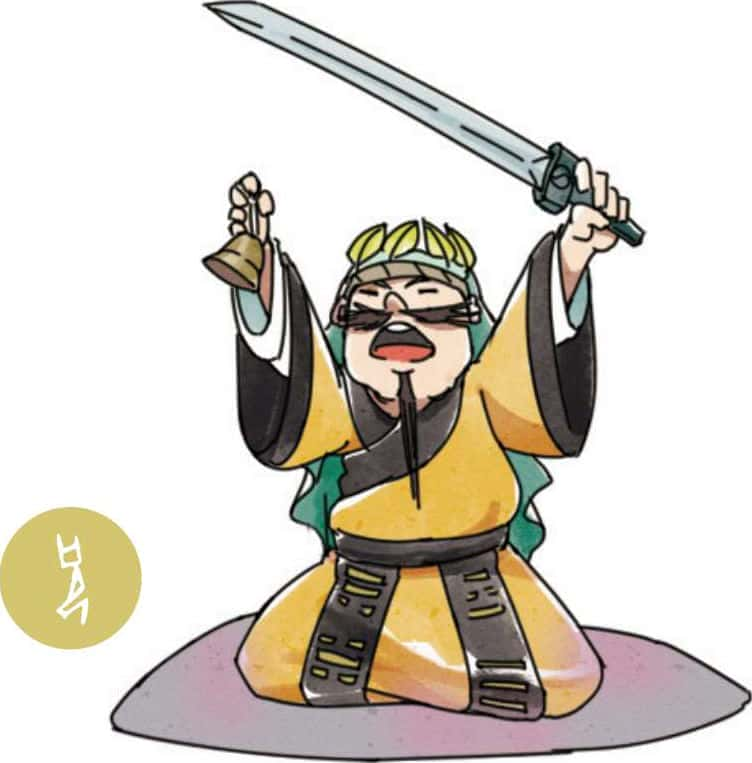

* * *

[1] 《礼记》是儒家的重要经典，是对周代礼仪制度的深入阐发，其中《大学》《中庸》《学记》《乐记》等篇目，都是非常重要的文化经典。

## 福·祸  
神灵与福祸

上一讲讲到古人会举行隆重的祭祀仪式，祈求上天的庇佑和福祉。那古人最想得到的是什么福呢？和“福”相对的“祸”又是什么祸呢？

### 福/有粮就是“福”/

在古人看来，是得到好福气，还是坏运气，都和神灵的态度密切相关。

“福”是一个形声字，从示畐（fú）声。你看，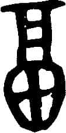是金文中的“福”，就像一个粮仓——在古人看来，家里粮食充足就是最大的福气。

粮食要丰收，既要努力耕耘，也要风调雨顺。前者靠勤劳的双手，后者则要靠神灵的庇佑。因此，《说文解字》说：“福，祐也。”福气来自上天，来自神灵的赐福保佑。

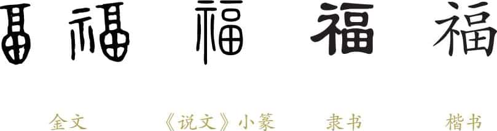

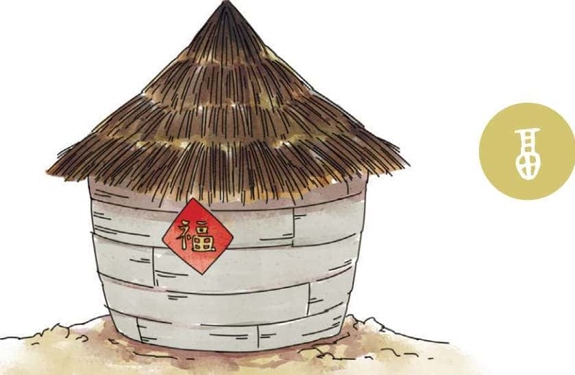

随着人类的进步，我们除了接受上天的恩赐，更要自己创造幸福。因此，就有了“造福”一词——造福社会、造福人类，都是要靠自己亲手创造未来。要知道，真正的福气不是上天赐给我们的幻想仙境，而是我们自己创造出来的美好人间。在汉语词汇的演变中，我们也能看到人类的进步、发展与自信。

### 祸/福祸相依/

福祸相依，讲完了“福”，我们再看“祸”字。

“祸”也是一个形声字，从示呙声，许慎先生在《说文解字》中解释说：“祸，害也。神不福也。”这是说，灾祸的实质就是神灵不再保佑。你看，古人观念中的福祸，都源自神灵的不同态度。

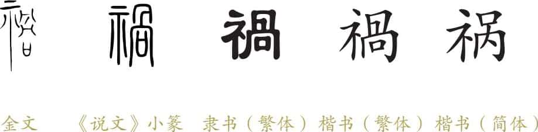

在现代汉语中，作为名词，“祸”与“福”相对，指坏运气、倒霉事。“灾祸”“祸事”“车祸”“闯祸”，都不是什么好事情。“祸”也可以用作动词，指损害。有个词叫“祸国殃民”，指的是使国家受害、人民遭殃。在东北方言中，还有个词叫“祸祸”，也是动词。比如你要是任性挑食，不好好吃饭，东北的爸爸妈妈会说：“别祸祸粮食！”就是告诉你不要糟蹋粮食。

## 祖·宗  
祖先从未远离

和“示”有关的汉字，不仅体现出古人的神灵信仰，还体现出中国文化中的祖先崇拜。在中国人心中，“祖先”是一个庄重的词语。我们注重“认祖归宗”，要找到自己的血脉渊源，找到生命的归宿。这一讲介绍的便是“祖”和“宗”这两个字。

### 祖/祖宗与祭祀/

我们先从“祖”字说起。在造字之初，“祖”写作“且”。你看，是甲骨文中的“且”。它的字形含义众说纷纭。有人说，它和“示”一样，是祭祀祖先用的牌位。也有人认为，“且”的中间是一个架子，上面放的是祭祀祖先的肉。

到了后来，“且”假借为虚词，用来表达而且、尚且等意思。什么是“假借”？这是一种特殊的汉字造字法，汉语中的实词容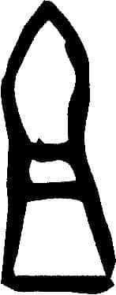易造字，如果要给虚词造字可就难了。怎么办呢？借一个声音相近的字就好了。于是，古人借了“且”字来表示虚词“而且”。“且”有了“祭祀”和“而且”的字义，在使用时容易弄混。古人便再给“且”添加了一个“示”，表示它和祖先、神灵有关，这就是“祖”字的来源。

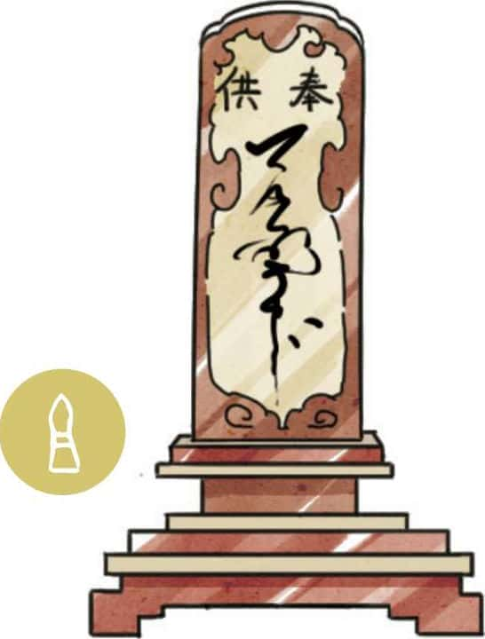

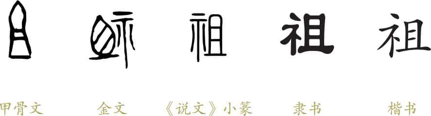

《说文解字》说：“祖，始庙也。”“祖”是祭祀祖先的地方。对一个家族来说，“祖”是血缘的起始；对一个国家来说，“祖”则是开国的先王。在中国历史上，开国之君被称为“祖”，比如“汉高祖”刘邦、“明太祖”朱元璋，都是开疆拓土打天下的开国帝王。

由于“祖”有起始的内涵，一个宗派、一项事业的创始者便也叫作“祖”，就是所谓的“祖师”。在人的身体中，鼻子最为靠前，因此它参与组成了“鼻祖”一词。比如说，屠呦呦先生[1]是青蒿素研究领域的“鼻祖”，也就是青蒿素的发明者。

### 宗/神圣的宗庙/

“宗”字的意思和“祖”相近，也和祖先祭祀有关。“宗”是一个会意字，由“宀”和“示”两个部分组成：“宀”是房屋的象形，“示”是祖先牌位，表示在房屋中供奉祖先。

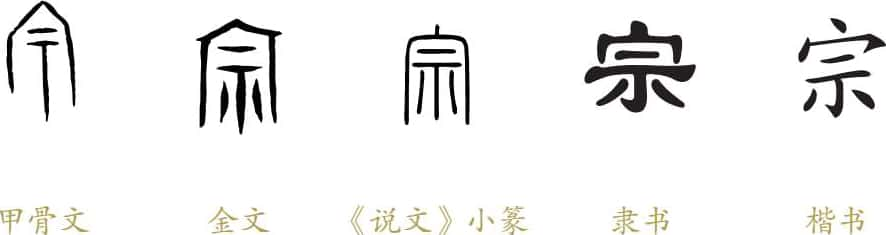

《说文解字》说：“宗，尊祖庙也。”这句话准确地解释了“宗”的字义——祖先地位崇高，受到后代子孙的尊敬。

宗庙是古代帝王、诸侯、大夫、士祭祀祖先的地方，是宗族和血脉的象征。一个家族的亲人可以称为“同宗”，也就是有同一个祖宗的意思。一个宗族的人祭祀祖先时，都会到宗庙这一神圣场所，按照礼制规定，举办隆重的祭祀仪式。古人的仪式繁复而庄严，祭祀先祖的时间、仪式流程，甚至祭品的种类，都有详细的规定。根据朱子《家礼》，祭祖需要的祭品有：“毛血为一盘，首心为一盘，肝肺为一盘，脂蒿为一盘，切肝两小盘，切肉四小盘。”

除了祖宗、宗庙，“宗”在汉语中也延伸出“正宗”“效宗”等用法，都有被人尊敬、效法的内涵。

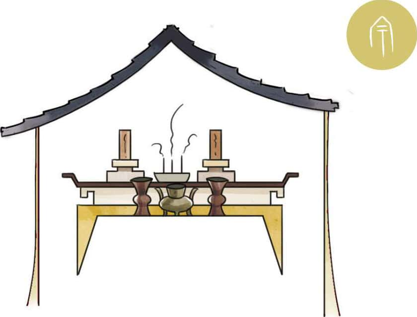

* * *

[1] 屠呦呦先生是女士。现在，“先生”是对男性的尊称；在中国古代，“先生”是对年长、有学问人士的尊称，不分性别。

# 玉

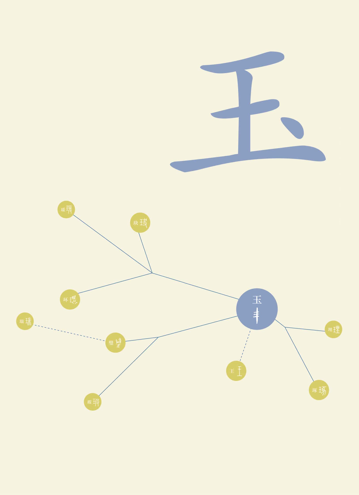

## 玉  
玉的五种品德

上一章，我们认识了很多和祭祀有关的字。古人祭祀时会用到礼器。青铜器是礼器，玉器也是礼器。古人为何要用玉做礼器呢？他们为什么那么喜欢玉石呢？

要知道，在古人看来，玉石温润无瑕，纯洁美好，是君子的象征。从古至今，玉一直被寄寓着美好的内涵。古人对“玉”字的讲解，也都含有一股哲学的气息。

在甲骨文中，“玉”有两种写法——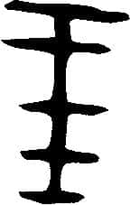和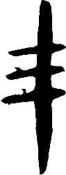，一种繁复一种简单，样子都有点儿像香喷喷的烤串。当然，“玉”不是肉串，古人这样造字，参考的是玉佩的样子——不同的玉石用绳子穿起来，佩戴在身上。所以，甲骨文的“玉”是一串玉石。从金文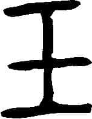直至小篆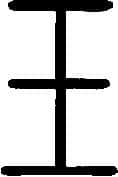，“玉”字中的一竖不再出头，才变成与“王”相似的形体。

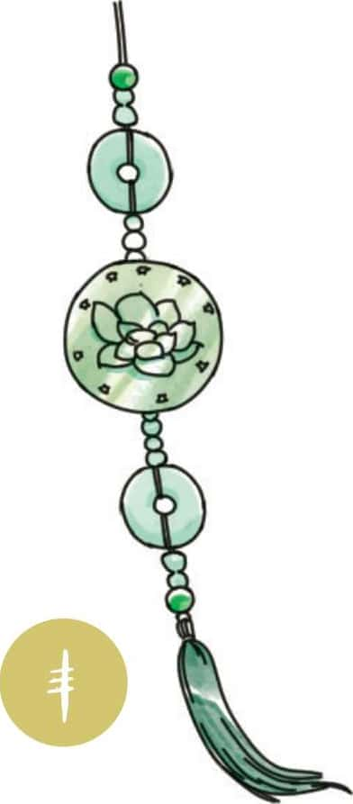

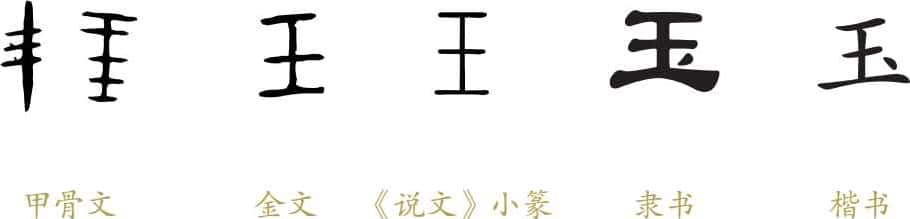

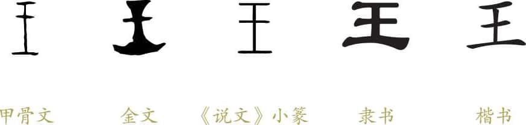

在古文字中，“玉”和“王”形体相近，二者之间应当如何区分呢？在小篆中，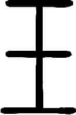（玉）的三横均匀分布，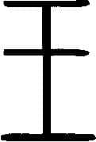（王）的三横则分布不均，上面两横明显更近一些。尽管有所区别，但在书写时两字极易混淆。为了区分，后人保留了“王”字，而为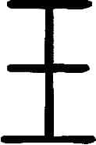（玉）添加了一点，得到了我们今天的写法——“玉”。

玉石洁白美丽，常被用来形容美好的事物。《诗经·召南·野有死麕（jūn）》中写道：“白茅纯束，有女如玉。”早在先秦时期，古人就已经用美玉来形容动人的女子了。玉树临风、亭亭玉立、冰清玉洁、朱唇玉面……古人也用玉来形容人的美好风姿。

古人爱玉，为玉赋予了高尚的品质。《说文解字》中说：“玉，石之美，有五德。”许慎先生认为，玉是最美的石头，它具有五种重要的品德：

润泽以温，仁之方也；䚡（sāi）理自外，可以知中，义之方也；其声舒扬，尃（fū）以远闻，智之方也；不桡（ráo）而折，勇之方也；锐廉而不忮（zhì），絜（jié）之方也。

意思是说，玉有“仁”德。石头和金属又冷又硬，玉则不然，它色泽温润，有一种温暖的手感。谦谦君子，温润如玉，说的就是这种质感。仁爱也会给人一种温暖和煦的感觉，因此，玉有仁德。

玉有“义”德。尚未开采的藏着玉的石头叫“璞”。璞玉虽然外表粗糙，但行家通过它外在的纹理，就能判断其中是否藏有美玉。一个有道义的人就像璞玉一样，我们能通过他外在的言行，了解他真实的内心世界。玉和他们都有内外一致的品格，因此，玉有义德。

玉有“智”德。玉能制成玉磬（qìn ），敲击起来，声音清脆舒朗。有智慧的人产生的影响，就像玉磬的声音一样悠远绵长，因此说玉有智德。

玉有“勇”德。玉质地坚硬，即便将其掰断，也不能使之弯曲。“宁为玉碎，不为瓦全”，真正的勇士像玉一样，在威压之下决不屈服。因此，古人常用玉来形容那些勇猛忠贞之士。

玉有“絜”德。“絜”即为“洁”。玉石虽有棱角，却不会像刀剑一样刺伤别人，就像那些高洁之士一样，虽然坚持自己的原则，但也不会伤害他人。

许慎先生把玉的高洁品质综合成“五德”，这五德寄托了古人对理想人格的追求，玉也成了君子的象征。正因如此，古人对玉格外青睐，把它作为礼器，用于祭祀。

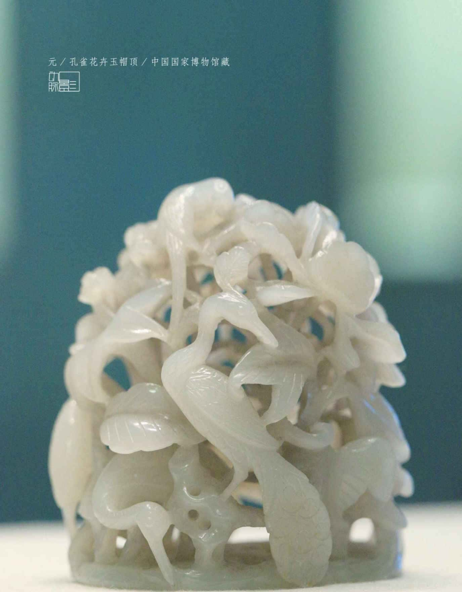

## 理·琢  
雕琢玉石的道理

想要把粗糙的璞玉加工成精美的礼器，需要按照玉石的自然纹理精雕细琢，这就要讲到“理”和“琢”。

### 理/遵循美玉的自然之理/

“理”常用于“讲理”“道理”“按理”等词，通过这些常用词不难看出，“理”有规律、原则的含义。

“理”是规律、原则，它和“玉”有什么关系呢？还记得我之前讲过“玉”的古文字形与“王”十分相似吗？“理”的部首其实不是王字旁，正确的叫法应该是“斜玉旁”。在汉字中，“理”“琢”“瑕”“环”等以斜玉旁“”为偏旁的字，大都与玉有关。“理”是一个从玉里声的形声字，《说文解字》中说：“理，治玉也。”“理”的含义与玉石雕刻密不可分。

古人加工玉石有一个基本原则，那就是要顺着玉石的自然纹理进行雕琢。你见过玉雕白菜吗？玉石有时难免有瑕疵，面对玉石上的这些斑点，难道要把它们都磨掉、削去吗？心灵手巧的工匠们可没有这么“粗暴”，他们往往会利用这些自然的瑕疵，匠心独运——如果是红色的斑点，那就雕成白菜上的红色瓢虫；如果是黄色的斑点，就雕出一只俯卧的小蛤蟆；如果是绿色的斑点呢，就做成一只闹腾的小蚂蚱。

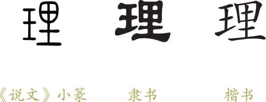

把握玉石的自然纹理，进行细致而巧妙的加工，这就是“理”的本义。在此基础上，古人引申出相关词语，比如，用“纹理”描述木头、石块上的纹路，用“肌理”称呼皮肤的纹理，用“道理”“义理”来指应当遵循的原则，将研究物质运动最一般规律和物质基本结构的学科称为“物理”。万事万物都有特定的运行方式，“理”中所蕴含的，正是这样一种自然而本原的规律。

懂得了“理”字的内涵，我们也就能明白《木兰诗》“脱我战时袍，著（zhuó）我旧时裳。当窗理云鬓（bìn），对镜帖花黄[1]”中“理”字的精妙。

北朝民歌《木兰诗》歌唱的是巾帼英雄花木兰的故事。“脱我战时袍，著我旧时裳。当窗理云鬓，对镜帖花黄”讲的是木兰结束从军生活，走进旧日闺阁，开始梳妆打扮。在这几句诗中，“理”字是诗眼所在，大可琢磨。这里的“理”是一种细致、耐心的梳理，就像雕刻玉石一样细致认真。“云鬓”指像云一样的鬓发。木兰已经很多年没有梳过女子的发型了，她一边回忆，一边慢慢地梳理青丝。我们仔细品读一下木兰“由男变女”性别回归时的特定心态，可以说，木兰不仅是在梳头，也是梳理十年来的复杂心绪。正是在缓缓地“理”的过程中，她完成了由男性身份向女性身份的转换。

与此同时，她的家人在准备为她接风，战友在等她相聚，四周一派热闹喧嚣，而木兰只是静静地梳理青丝、贴上花黄。这一动一静、一急一缓的对比，体现出木兰人物形象的前后变化——她不再是那个活泼紧张、不乏忐忑的新战士了，而是一个经历了十年血与火洗礼的女英雄，战火和岁月让她变得更为坚强从容。因此，当木兰以红装重见伙伴，伙伴惊慌失措、忙乱不安之际，她只是淡淡地开了个小玩笑：“雄兔脚扑朔，雌兔眼迷离；双兔傍地走，安能辨我是雄雌？”征战后的木兰和出征前的木兰形成了鲜明对比，凸显出岁月沧桑之感：十年的岁月足以改变一个人，更何况是十年的战火呢。

### 琢/玉不琢，不成器/

说完了“理”，再来看“琢”。

《说文解字》中说：“琢，治玉也。从玉，豖（chù）声。”“琢”也是一个表示加工玉石的形声字，指对玉石进行细致雕琢。因此，我们常用“琢磨”一词来表示仔细思考、慎重斟酌的状态。

古代有四种加工物品的手法，东汉的王充在《论衡·量知篇》中是这样说的：

骨曰切，象曰磋，玉曰琢，石曰磨，切琢磨，乃成宝器。人之学问知能成就，犹骨象玉石切磋琢磨也。

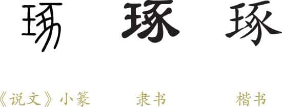

“切”“磋”“琢”“磨”都有加工打磨的意思，但它们的对象各有不同。“切”和“磋”是加工骨头和象牙，“琢”和“磨”则是加工玉石。只有经过切磋琢磨，才能打造出精美的器物。我们为人处世、读书学习也是如此。古人在《诗经·卫风·淇奥》中说“有匪君子，如切如磋，如琢如磨”，在《礼记》中说“玉不琢，不成器；人不学，不知道”。在他们看来，每个人都是一块未经加工、纯然天真的璞玉，我们要学会顺应自然规律，不断从中总结经验，打磨自己的品行，最终成为像玉石一样德行高洁的君子！

* * *

[1] 古代妇女的一种面部装饰物。

## 璧·瑕  
玉璧为什么是圆形的？

古人将玉雕琢成礼器，祭祀天地四方。我国考古出土了大量用于祭祀的玉器，古书中记载了它们的用途：“以玉作六器，以礼天地四方：以苍璧礼天，以黄琮（cóng ）礼地，以青圭（ guī）礼东方，以赤璋（zhāng ）礼南方，以白琥礼西方，以玄璜（huáng ）礼北方。”六器中，我们最熟悉玉璧。这一讲就来介绍“璧”字，和“白璧微瑕”的“瑕”字。

### 璧/礼敬苍天的玉璧/

“璧”是一个标准的形声字，从玉，辟声。从金文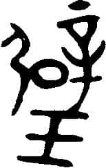到楷书，它的字形基本上一脉相承。

“璧”的形制是什么样的呢？许慎先生在《说文解字》中说：“璧，瑞玉，圜（yuán）也。”

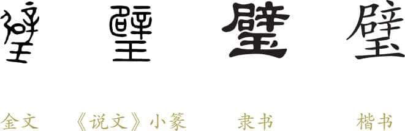

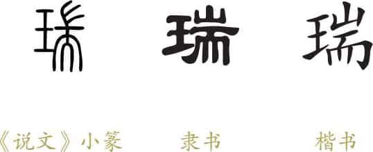

“瑞”在《说文解字》中的解释是：“以玉为信也。”它是一个典型的形声字，从玉耑声，指玉做的信物。古代天子诸侯发号施令，派遣臣子出使，都要以玉质的印玺、符节[1]作为信物。这种玉石代表着天子与国家的信誉，也由此有了“祥瑞”的内涵。

在“璧”的解释中，“瑞玉”说明玉璧吉祥高贵，“圜”指的是形状，说明玉璧是圆环状的——玉璧是一种圆形的玉器，形状扁平，中间有孔，是祥瑞的象征。古人“以苍璧礼天”，在他们看来，天是圆的，像罩子一样笼罩着平坦的大地，天又是美丽的天青色。正因如此，用青玉制成的圆形玉璧，是天的象征，可以用来礼敬上苍。

古人喜欢玉璧，选材时往往用质地最好的玉。玉璧既漂亮又珍贵，因此，人们也用“玉人”“璧人”来形容那些仪容美好的人。

### 瑕/白璧微瑕/

有一个成语叫“白璧微瑕”，什么是“瑕”呢？

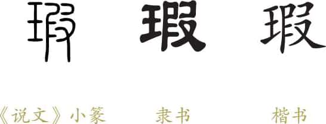

从小篆到楷书，“瑕”的字形一脉相承，它是一个从玉叚（jiǎ）声的形声字。《说文解字》解释说：“瑕，玉小赤也。”白色玉璧上有小小的红色斑点，就是“白璧微瑕”，比喻美好的人或事物有不足之处。瑕疵难以掩盖玉石的大美，则叫“瑕不掩瑜”，用来形容一个人的小毛病无法掩盖他的优秀品质。

在我们的生活中，“完美”是一个难以达到的理想目标，所谓“金无足赤，人无完人”，我们既要追求理想，也要学会接受现实中的小小瑕疵，用“瑕不掩瑜”的目光，发现万事万物中的美。

* * *

[1] 符节，古代朝廷中作为凭证的物品。一般用金属、玉、铜、竹、木等材质制成，人们会在上面刻上文字，剖成两半，双方各执一半。两半合在一起，便能验证真假。

## 环·瑗·玦  
和好还是绝交？

除我们熟悉的玉璧之外，古人也以精巧的技艺，将玉石加工成各式各样的精美器具，如“环”“瑗”（yu àn）与“玦”（jué）。这一讲，我就从这三个字说起，为你介绍古代有趣的玉器形制，以及璧、环、瑗、玦之间的区别。

“环”“瑗”“玦”都有斜玉旁，与玉石有关。

《说文解字》将“环”解释为“璧”，将“瑗”解释为“大孔璧”。可见，环、瑗和璧一样，都是圆形的玉器。那它们有什么区别呢？

《尔雅》说：“肉倍好谓之璧，好倍肉谓之瑗，肉好若一谓之环。”这句话中，“肉”指实质的玉，“好”是玉中间的圆孔。“肉倍好谓之璧”，玉多孔小的是玉璧；“好倍肉谓之瑗”，孔大玉少的是玉瑗；“肉好若一谓之环”，孔径和玉的边宽差不多的就是玉环。至于“玦”，《说文解字》将它解释为“玉佩”，它是由环改造而来的环形玉佩，与玉环不同的是，它有一个缺口。

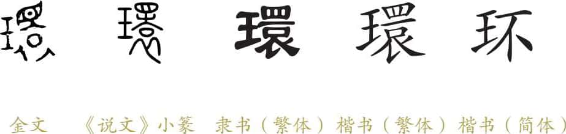

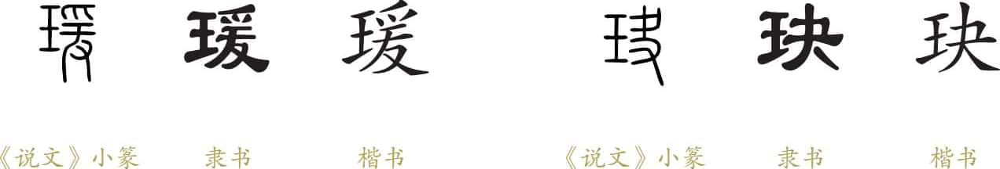

环、瑗、玦这三种玉器有什么作用呢？

在古代，瑗的作用是“人君上除陛以相引”。“人君”指人世间的天子、皇帝，瑗是专门给皇帝用的。什么时候用呢？古代国君上朝，进入大殿的途中有许多台阶。有些身体不好的或年纪太小的国君，上台阶时需要有人搀扶。但天子的手是“御手”，尊贵得很，一般人可碰不得。于是古人想出了一个好办法——咱们用玉给国君做一个拉环吧！就这样，中间孔洞很大的瑗诞生了。上朝时，如果国君需要搀扶，臣子就把玉瑗拿出来，臣子攥一边，国君攥一边。今天，我们可以在博物馆中见到古代的瑗。为了拉国君一把，专门造出一种玉器来，古人真可谓煞费苦心！

至于环和玦，则有以物传情的作用。环和玦能够传达哪些情意呢？

根据古代礼制，流放的罪臣在流放期满后，国君会派人给他送去一个小盒子。如果盒子里是玉环（“环”与“还”同音），臣子便可以返还朝堂；如果是玉玦（“玦”与“绝”同音，且玦有缺口，可类比人与人之间关系断裂。因此，玦是绝交的象征），就表示君臣恩断义绝！

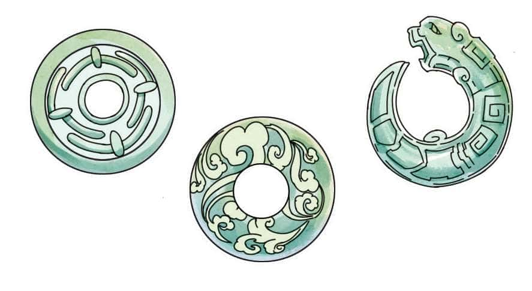

除此之外，玦也可以用来表示决断。在著名的鸿门宴中，范增就以玦向项羽暗传“决断”之意。

项羽与刘邦的楚汉之争，是中国历史上浓墨重彩的一笔，名传千古的“鸿门宴”，更是一场波诡云谲（jué）的暗中较量。司马迁在《史记》中，对鸿门宴进行了极其生动的描述。

项羽与刘邦起义反抗暴秦，约定谁先攻入咸阳谁便是天下王。刘邦趁项羽牵制秦国的主力部队，抓住时机，率先攻入咸阳。项羽大怒，屯兵鸿门，兵力远胜于刘邦。

项羽的谋臣范增劝言道：“刘邦攻入咸阳后，不掠夺财物，不贪恋女色，他的志向在于称王。我们必须赶快攻下他，不能错失机会呀。”

刘邦怕与项羽作战，便主动示弱，特去向项羽致歉，还带去玉璧一对，寓意和好如初。

鸿门宴上，范增多次向项羽举起玉玦示意，让项羽下定决心，趁机斩杀刘邦，以绝后患。但项羽是个优柔寡断的人，最终放走了刘邦，以致错失了整个天下。

同一场宴会，同样以玉暗示，传递的信息却截然不同。古人的表达方式既含蓄，又带有一种特殊的戏剧色彩，是不是很有意思呢？

# 刀

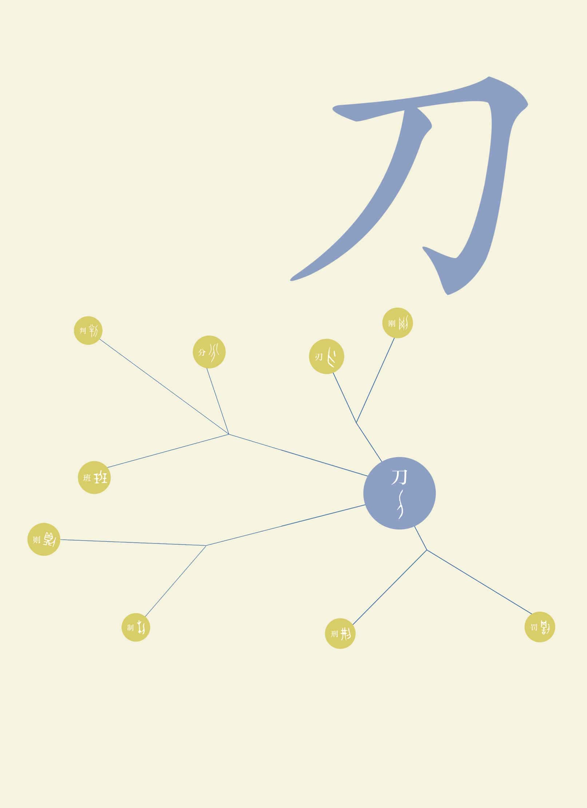

## 刀·刃·刚  
锋芒毕露的宝刀

这一章要讲解与古代制度有关的字。有意思的是，这些字往往都和“刀”有关。制度嘛，要划分得清清楚楚，像刀一样严格。这一讲，我们先来看三个和刀有关的字——“刀”“刃”“刚”。

### 刀/关羽用的不是青龙偃月刀？/

“刀”是一个典型的象形字。你看，甲骨文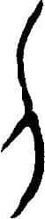和金文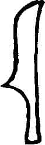是不是栩栩如生呢？随着汉字的发展，它不断变得抽象，到了小篆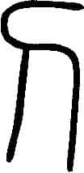时，和今天的写法已经十分相像。

《说文解字》解释：“刀，兵也。”“刀”就是兵器。要知道，汉代军队最常用的兵器正是“环首刀”。这种刀在当时十分常见，它的把儿上有一个铁环，因此叫“环首”。

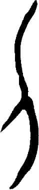说到刀，最有名的莫过于《三国演义》中关云长的“青龙偃月刀”了。青龙偃月刀的刀口处雕刻有龙头，龙嘴张开，吐出一把大刀；刀身弯弯，好似月牙，因此叫“青龙偃月刀”。《三国演义》中，青龙偃月刀重八十二斤。能挥舞起这么沉的大刀，关羽可真是天生神力。

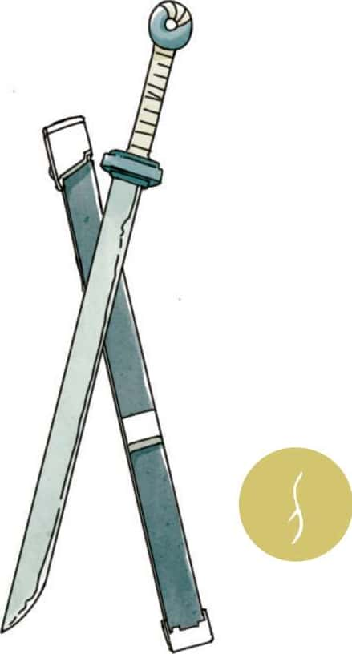

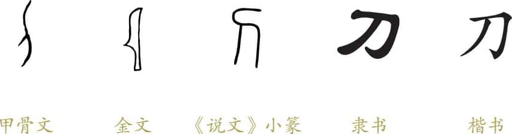

不过，青龙偃月刀其实是在宋代以后才出现的。《三国演义》是明代章回体小说，关羽使用青龙偃月刀，是作者虚构的情节。小说中关羽用青龙偃月刀斩颜良、诛文丑，而根据史书《三国志》记载，关羽是在万军阵中，将颜良“刺”于马下的。由此可见，他使用的很可能是矛、戟一类的武器，而不是大刀。

### 刃/好钢用在刀刃上/

刀刃锋利，给“刀”造字容易，给“刃”造字可就难了！

如何给抽象的“刃”来造字呢？这难不倒聪明的古人。他们选取了指事1的造字方法。你看，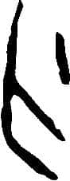是“刃”的古文字，是在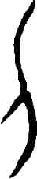（刀）锋利的一面加上了一点，标记出刀刃所在。《说文解字》说：“刃，刀坚也。象刀有刃之形。”“刃”是刀上最为坚固锋利的地方。

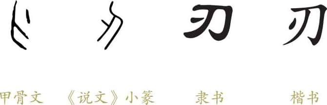

在抗日战争中，子弹打光了，战士们便用刺刀近距离搏斗，短兵相接，称作“白刃战”。你看，明明是用刀来拼杀，却叫“白刃战”，不叫“白刀战”，足见“刃”对于“刀”的重要性了。

还有个俗语叫“好钢用在刀刃上”，指好的材料要用在最关键的地方。对我们来说，就是把宝贵的时间用于读书学习、充实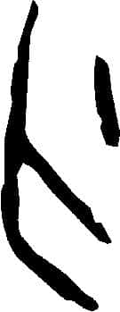自己，莫负光阴。

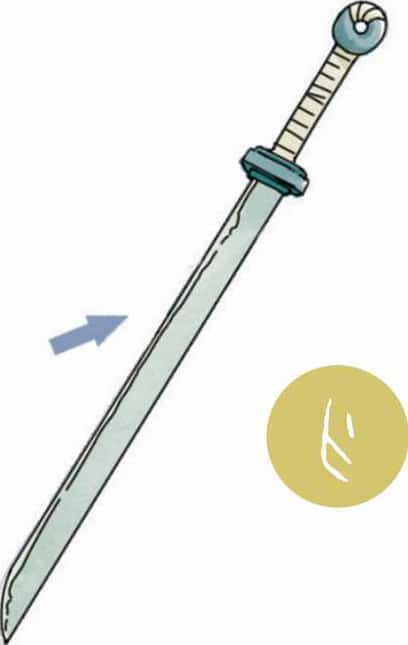

### 刚/壁立千仞，无欲则刚/

讲完了“刀”和“刃”，我们再来看一个从刀的汉字——“刚”。

“刚”字的甲骨文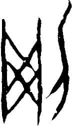，左边一个“网”，右边一个“刀”（后发展为立刀旁“刂”）。到了金文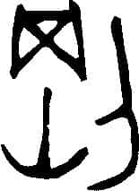，左边变成了“岡”（ gāng ）。“岡”是声符，“刀”是形符，“刚”是一个标准的形声字。后来“岡”简化成“冈”，就有了今天的形体——“刚”。

《说文解字》说：“刚，强，断也。”“强”指有力，“断”是能砍断东西。“刚”是一种既锋利又坚固的状态。在汉语中，和“刚”有关的词充分体现出锋利坚固的特性。无论是“刚强”“刚健”，还是“刚直”“刚正”，都能反映出一个人精神力量的强大。

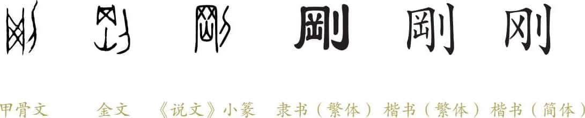

在古人心中，“刚”意味着一个人有自己的原则，至大至刚、光明正大，不会轻易向恶势力低头。那么，如何才能达到“刚”的境界呢？这倒不一定要人多么勇猛，“壁立千仞，无欲则刚”，一个人没有过多的欲望，就不会轻易被人左右，这才是真正的“刚”，是一种内在的大丈夫精神。

当然，过度的“刚”也有不好的一面，比如“刚愎自用”，这样的人十分自负，只相信自己，听不进别人半点儿意见。我们固然要做大丈夫，但也要涵养柔和而坚韧的心灵，不要成为刚愎自用的人。

* * *

[1] 指事是古代六种创造汉字的方法之一。指事是在象形的基础上，添加一个标示性的指事符号，来表达新的字义。

## 分·判·班  
班级最初的意思是什么？

刀是我们生活中常用的切割工具，从刀的字往往带有切开、区分的含义。在这一讲，我将为你介绍三个从刀的汉字——“分”“判”和“班”。

### 分/一“分”为二/

从甲骨文到今天，“分”字一脉相承，是一个标准的会意字。甲骨文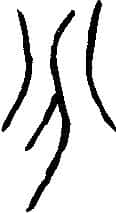上面是一个“八”，下面是一把刀。一分为二，二分为四，四分为八——“八”是不断切分后的产物，因此具有“分开”的内涵。

还记得《走进汉字世界》里的“公”字吗？“公”字从八，所谓“背私为公”，把属于自己的东西“分”给别人，就是“大公无私”。至于“刀”，它可以用来切东西，当然也有“分”的含义。

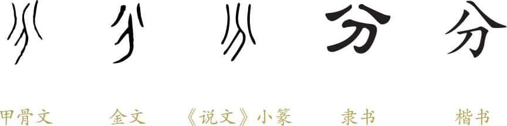

《说文解字》说：“分，别也。从八，从刀，刀以分别物也。”“别”就是区别、分开，“刀”是分开事物的工具。

在现代汉语中，由“分”组成的词，含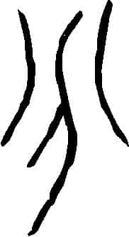义相当丰富。

首先，“分”是人、事物之间分离的状态。“分化”“分割”，这是事物的划分；“分手”“分居”，则是人与人之间的分离。

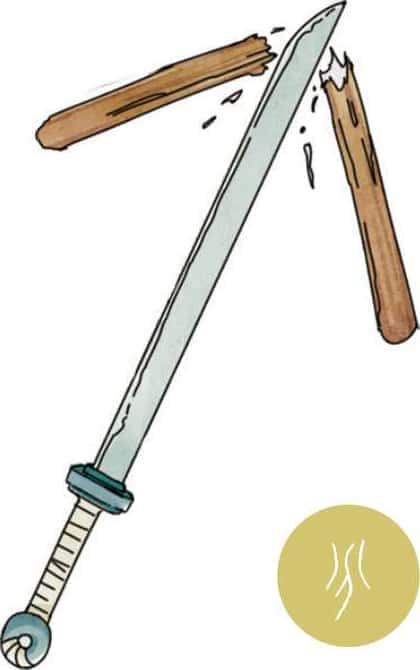

其次，事物越分越小，我们的认识也随之趋于精微。所谓“分析”，是深入地理解与辨识；所谓“分辨”，是在分析的基础上，辨别善恶是非，做出正确的抉择。

除此之外，“分”还是一种货币单位。一元钱等于十角钱，一角钱等于十分钱，充分体现出越分越小的特点。在今天，我们使用的钱币面额越来越大，一分钱已经很少用了，作为最小的货币单位，“分”可能会渐渐地成为历史。

### 判/判断是非/

讲完了“分”，再来看“判”。

“判”是一个形声字，从刀半声。“刀”是划分的工具，“半”是一分两半后的结果，“判”的本义也是一种划分的行为，正如《说文解字》所说：“判，分也。”

“分”和“判”都有区分的含义，它们之间有什么不同吗？

“分”是分开、区分，属于事实判断；“判”则要区分出是非对错，进入价值判断。考试中有“判断题”，你需要区分对错，答案非此即彼。体育比赛中有“裁判”，他们裁决运动员是否得分、是否犯规，规则严谨，不能模棱两可。古代的“判官”类似于今天的法官，明断是非，铁面无私。你看，和“判”有关的词大多表示是非善恶的明确区分。

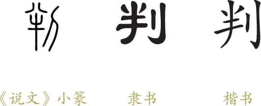

既然是明确区分，“判”也有了“明显”的内涵——差别不鲜明，怎么能区分开呢？有个成语叫“判若两人”，指的是一个人前后变化特别大。还有个更高级的近义成语是“判若云泥”，指差别大得好像天上的云彩和地下的泥土，距离那么远，形容差别极大。

### 班/从班级到上班/

对我们来说，“班”肯定不是一个陌生的字，它通常用于“班级”“班长”等词。可“班”字与班级有什么关系呢？“班”字里为什么有斜玉旁呢？它和玉石又有什么关系呢？这些疑问，要从“班”的古字形中寻找答案。

“班”在金文中就已经出现了。它由两部分组成：左右两旁都是玉，中间是一把刀。两“玉”合起来是“珏”（jué）字，表示合在一起的两块玉。“班”的字义是用刀把合在一起的两块玉分开。《说文解字》解释说：“班，分瑞玉。”古代分封诸侯时，天子会把一对宝玉分开，自己留一半，诸侯分一半，作为分封的信物——信物分开，各执一半，这就是“班”。

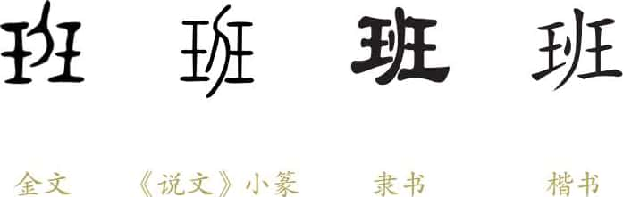

“班”既指客观事物的分开，也指人与人、动物与动物之间的分开。李白有两句诗：“挥手自兹去，萧萧班马鸣。”在这里，“班马”可不是非洲草原上的斑马，而是要分道扬镳（biāo）的两匹马。当然，“斑马”和“班马”也有相通之处，“斑”和“班”同源，斑马身上一条条的黑白花纹，不也分得清清楚楚吗？

在我们的生活中，“班”最常用的意思是学校里的班级。在这里，“班”是划分人的单位，把不同的学生编进不同班，也就意味着把他们进行区分。一个社会的有效运行，建立在分组、分工的基础上，没有组织，一切便会混乱不堪。因此，我们会不断地进入不同的社会组织：在学校进入不同的班级，在校外参加不同的兴趣班，毕业后开始上班和下班……

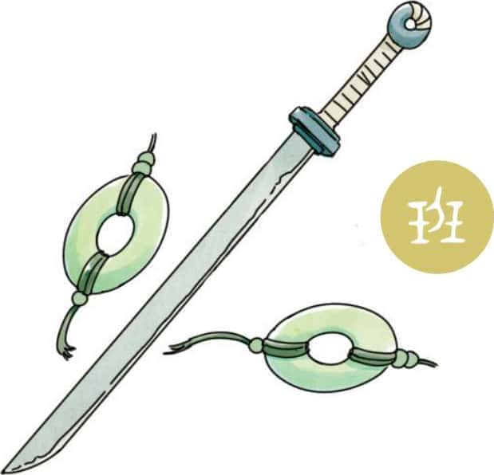

我们在人生的不同阶段，不断地由这个“班”进入那个“班”，真可以称得上是“班的人生”！

## 则·制  
遵守制度，以身作则

国家的运转，既需要温和有序的礼乐文化，也需要严肃清晰的规则制度。规则与制度划分出对与错、是与非、好与坏，清清楚楚，明明白白。与规则制度有关的字，往往也是从刀的，其中最有代表性的，就是“则”和“制”这两个字。

### 则/刻在鼎上的法则/

“则”字在甲骨文中便已存在，字形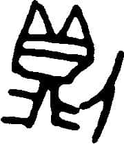的右半部分是“刀”，左半部分看起来像一只小猫，其实是古文字中的“鼎”。“则”的造字意图是“在鼎上刻字”。鼎是庙堂上的礼器，非常尊贵。先秦时期人们会在鼎上刻上法律条文，将其称作“刑鼎”。正因如此，古人用“在鼎上刻字”的字形——，来表示法则、规则之义。

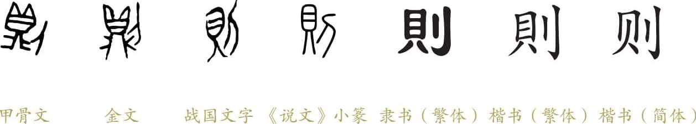

随着汉字的发展，到了春秋战国，“则”的左半边发生了变化——“鼎”变成了“贝”。《说文解字》中说：“贝，古之物货也。”“贝”是贝壳，在没有金属货币的时代，古人以贝壳为货币。我们今天使用的人民币，上面印有五十元、一百元等数额，数额大小有严格的规定。作为货币的贝壳也是如此，人们会刻出贝币的面值，统一规范。无论“则”是在鼎上刻字，还是在贝壳上刻画，其共同的特点都是要符合规则。因此，“则”的基本含义就是规则和标准。《诗经》中说“伐柯伐柯，其则不远”，“柯”是斧子的把手，“伐柯伐柯”就是拿着斧子砍树，想再做一个新的斧子把儿。由于标准就在眼前，照着样子再弄个新的当然不难，所以“其则不远”。这里的“则”，就是标准法则的意思。

“则”有很多用法：做人做事要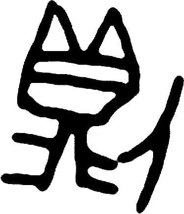有“准则”，当一名班干部要“以身作则”，每一个同学都要遵守“学生守则”；法律条文被称为“法则”，其中整体的规范叫“总则”，具体的规则是“细则”……可以说，社会的良性运行，靠的就是大大小小不同的“则”。

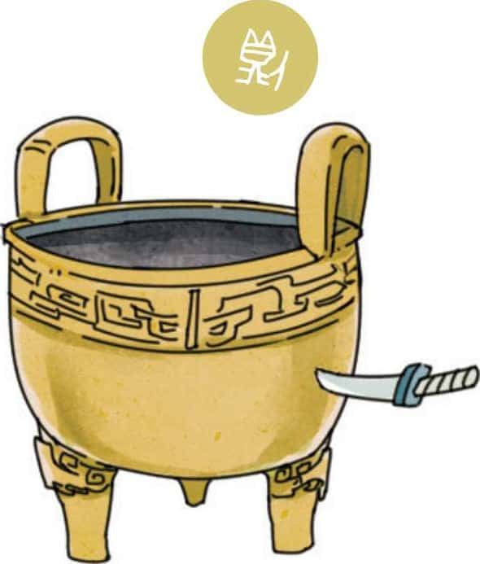

### 制/砍树与规范/

说完了“则”，我们再来看“制”。

“制”的甲骨文，字形十分清晰，左边是“木”，右边是“刀”。这是一个会意字，表示用刀砍树。砍树是为了干什么呢？当然不是闲来无事的爱好，古人是要用木材制造各种各样的器具。因此，“制”的含义是制造。

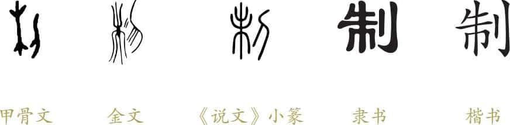

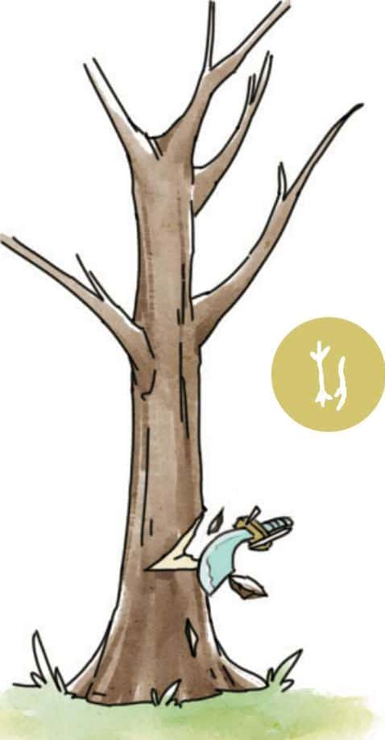

到了小篆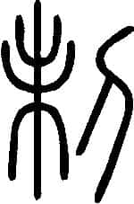，左边的“木”更加茂盛，变成了“未”。什么是“未”呢？我们要看许慎先生的说法：“制，裁也。从刀，从未。未，物成，有滋味，可裁断。”在他看来，“未”就是滋味的“味”，各种各样的植物有不同的味道。味道和制度之间有什么关系呢？想一想“神农尝百草”的传说，你就能理解了。古人面对不同的植物，哪个能吃，哪个不能吃，要通过亲自品尝，才能得出答案，这正是一个鉴别和裁断的过程，也就是“物成，有滋味，可裁断”的意思。“制”从刀从未，它的字义就是判断植物的滋味，从而建立饮食的规则。

“制”不仅是饮食的规则，也可以是各式各样的规范。各种规则综合起来，更有了“制度”——国有国法，家有家规，各种组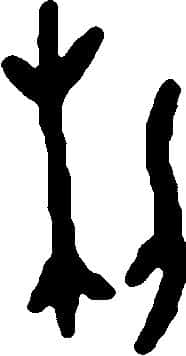织都有自己的制度。制度由人制定而成，反过来又规范、塑造着每一个人。人类社会就是在遵守制度和改造制度的过程中，不断发展向前。

## 刑·罚  
古代刑罚真可怕

在各种各样的规则与制度之外，古代还设置了严厉的刑罚。在这一讲，我将为你介绍两个“可怕”的汉字——“刑”和“罚”。

### 刑/严厉的“五刑”/

“刑”最早出现在金文中，写作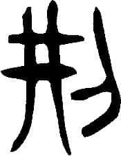，它和今天的写法不太一样，左边不是“开”，而是“井”。那么，“刑”和“井”之间有什么关系呢？

古人认为，“刑”与“井田制”有关。井田制是周代的土地制度，之所以叫“井田”，是因为要把一块土地平均分成九份，就像在正方形里画了一个“井”字一样。最中间的那块土地是公田，出产的粮食归国库所有；其余八块地是私田，是属于农户自己的土地。老百姓要先耕种公田，然后再去耕种私田。井田的中央一般会有一口水井，大家共同使用。

“刑”字是从井从刀的会意字，它的字义是用刀来捍卫井田制，保护大家共同的利益，谁要是破坏了规矩，就要受到惩罚！

后来，“刑”的字义越来越宽泛，《说文解字》中说“刑，罚罪也”，就是惩罚那些有罪的人。古代的刑罚相当残酷，先秦时期有著名的“五刑”。

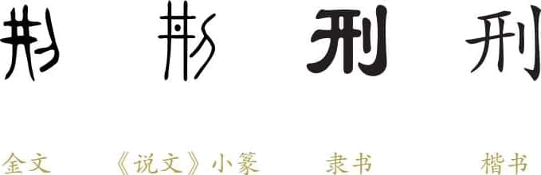

第一种叫墨刑，也叫作黥刑，是在脸上刺字之后再涂黑，以达到侮辱人格的效果。据说春秋战国时期的大思想家墨子就受过这种墨刑，因此叫墨子。《水浒传》中的林冲也受过此刑，书中写的“刺配沧州”，意为在他脸上刺上字，标明他罪犯的身份，然后将他发配到沧州去。

第二种叫劓（yì）刑。“劓”这个字很残忍，鼻子旁边一把刀——用刀把鼻子割下来。刚正严苛的商鞅在秦国推行变法时，太子的老师公子虔（qián）犯了法，就被处以劓刑。

第三种刑罚是宫刑，也称为腐刑。著名的历史学家司马迁就受了这种酷刑。这种刑罚是对人格和尊严的极大侮辱，对士大夫而言，它带来的耻辱远比死刑更重。司马迁受了宫刑后，在《报任安书》中向自己的朋友倾诉：“行莫丑于辱先﹐而诟莫大于宫刑。”意思是说，没有什么行为比使祖先受辱更为丑恶，也没有什么耻辱比遭受宫刑更为严重了。

第四种叫刖（yuè）刑，也就是砍脚。受了刖刑的人常被派去看大门，因为没有脚，不能到处乱跑，只能老老实实看门。历史上曾经有一个叫卞和的平头百姓。他发现了一块玉石，将其献给楚厉王。楚厉王不识货，觉得这就是一块普通的石头，盛怒之下便判了卞和刖刑。卞和冤枉极了，要知道，他手中的玉石其实就是成语“完璧归赵”中的和氏璧啊！

最后，是杀，即死刑。

在汉代之前，这些刑罚统称“肉刑”——犯罪的人要挨刀子，饱受皮肉之苦。如此残酷的刑罚，直到汉文帝时才有所改变。当时主管粮仓的太仓令淳于意犯了罪，要被判处肉刑。他的女儿缇（tí）萦给汉文帝上书说，人犯了错，都希望能够改过，可一旦被判了死刑人就无法复活，肢体一旦被斩断就不能重新接上，到时犯人还拿什么改过自新呢？

听了这番话，汉文帝恻隐之心大动，当即决定：“废除肉刑！改成打板子！”可他到底是皇帝，自己没挨过打，不懂打板子的分寸，要割鼻子的改成打三百大板，要砍脚的改成打五百大板。本来割鼻子、砍脚之后，人还能活着，三五百板子打完，人就直接给打死了……这件事虽有些荒唐，但毕竟拉开了减轻刑罚的历史序幕。到汉景帝时，改革已经颇有成效，人犯了错误，不至于轻易地受刑死掉。

汉代以后的“五刑”仁慈了很多，逐渐改成了“笞、杖、徒、流、死”。最轻的是拿鞭子抽，然后是拿棍子打，再严重的进监狱，更严重的是流放，最后才是死刑。到了现代，法律制度更加人性化，刑罚主要是罚钱、进监狱和死刑。除了死刑，犯人都有改过自新的机会，不会因为受刑就被剥夺了人生的全部希望。

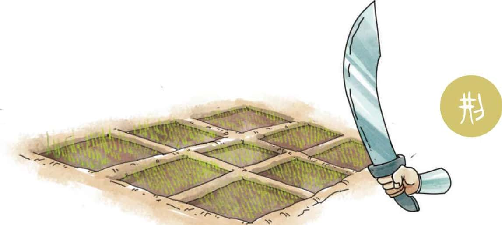

### 罚/犯了错误要挨骂/

说完了“刑”，再来看“罚”字。这二者的字义相近，却又区别显著。

西周金文中就已经出现了“罚”字。这个字的左边是一个“詈”（lì）字，表示骂人的意思，右边是“刀”。“罚”是一个从刀从詈的会意字。

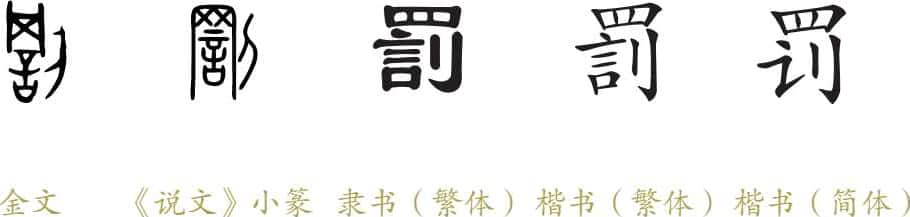

在《说文解字》中，许慎先生有一个很形象的解释：“罚，罪之小者。从刀，从詈，未以刀有所贼，但持刀骂詈则应罚。”“罚”是小罪，它的字形展示出一种“持刀骂詈”的状态，也就是拎着刀骂街。

提刀骂人和拿刀砍人有着本质区别，前者是“罪之小者”，虽然扰乱了社会秩序，但毕竟还没有犯罪，因此受罚而不受刑。在汉语中，“罚”比“刑”要轻得多。“罚”针对的是小错误，“刑”针对的是大罪过。你考试不认真，写错了字，老师可能会“罚”你抄十遍，但不会说“刑”你抄十遍；你上课捣乱被“罚站”，也不好说自己受了“刑”。还有句俗语叫“敬酒不吃吃罚酒”——我敬你一杯你不喝，那好，只能罚你喝了，不喝也得喝！这句话听起来，不免让人有点儿心惊肉跳，但罚酒毕竟不是用刑。

因为程度轻，“罚”的适用范围也比“刑”更广。“刑”只适用于罪犯，要经过法律判处，才能判刑。“罚”却适用于各种各样的情境。比如聚会吃饭迟到了，我们可以“罚”你唱个歌，“罚”你表演个节目。

这就是“刑”与“罚”的区别。

# 弓

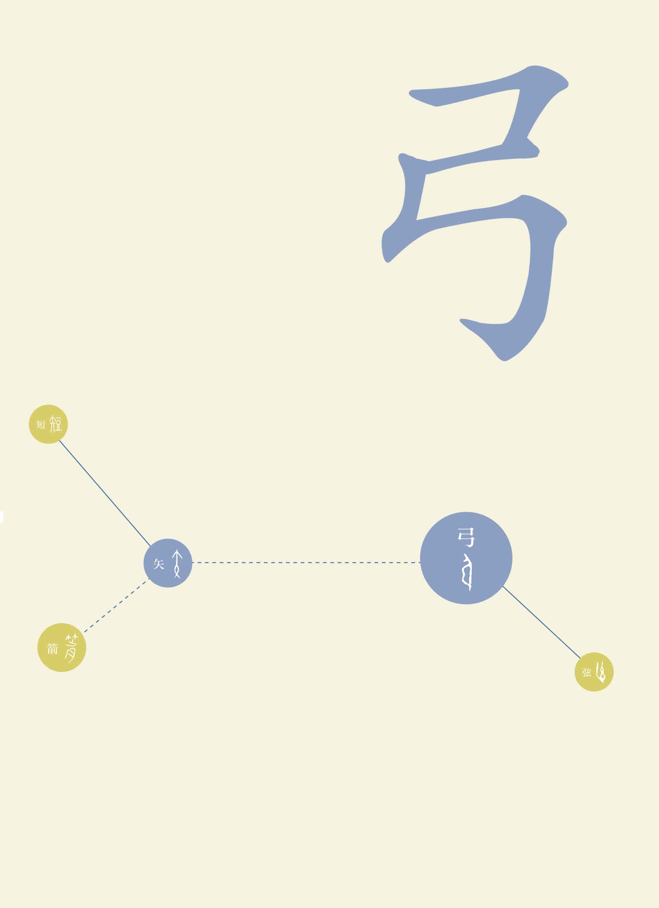

## 弓·弦  
弓如霹雳弦惊

国家机器的运转，不仅要有制度和刑罚，还需要军队和兵器。古代最常见的兵器，除了刀、剑等近距离兵器之外，还有弓、箭等远程兵器。轻便有力的弓箭在武器界中有着举足轻重的地位，在这一讲，我会介绍两个和弓箭密不可分的字：“弓”和“弦”。

### 弓/弯弯的长弓/

弓箭的发明非常早！甲骨文中就已经有“弓”字了。汉字世界里的“弓”是一把弯弓，有的字形有弓弦，比较复杂；有的字形去掉了弓弦，比较简约。无论繁简，“弓”都是一个标准的象形字。《说文解字》是怎么解释“弓”的呢？许慎先生说：“弓，以近穷远。象形。”所谓“以近穷远”，就是一箭可以射到很远的地方！由于弓形体弯曲，于是引申出了弯的意思，用于“弓腰”等词。

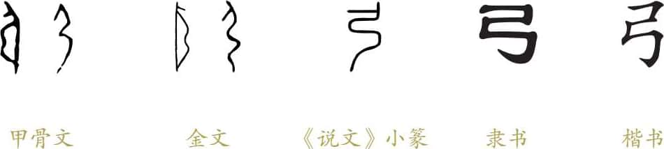

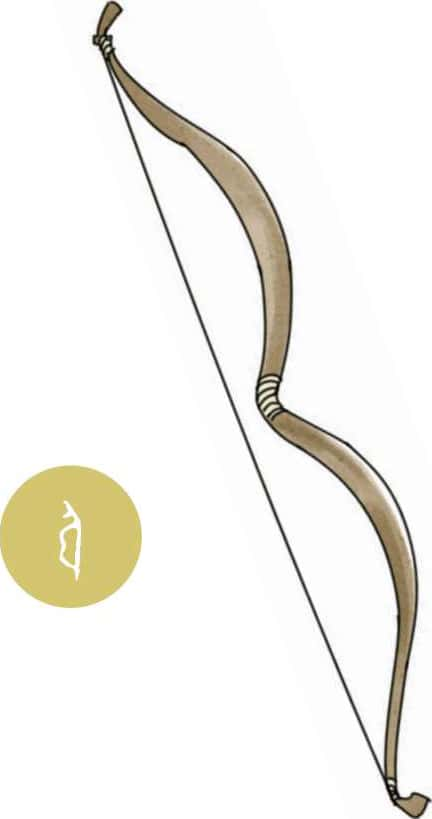

中国的历史传说中有很多善射的英雄人物。传说中的神箭手莫过于后羿，他射日的故事我们耳熟能详。历史中最有名的一位神箭手，则是楚国的好汉养由基。有个成语大家一定听过，叫作“百步穿杨”，形容的就是养由基的神技。他在一百步开外，弯弓射箭，能射中用墨汁标记的柳叶，箭不虚发，百发百中！

尽管箭法超群，但这位神箭手却得不到楚王的信赖。养由基曾经一箭射穿了七重铠甲，将士们向楚王道：“我国有这样的神箭手，何愁晋兵百万？”却不料楚王大怒：“将军靠谋略取胜，怎么可以靠箭法侥幸获胜！从今天开始，不许养由基再射箭了！”

结果，在之后的楚晋大战中，楚王尝到了自毁长城的滋味，他被晋国大将吕锜（qí）一箭射瞎了一只眼睛。楚王这才知道后悔，寡人真是傻啊，放着好好的神箭手不用！于是他赶紧把养由基叫来，只给了他两支箭。“今天寡人准你射箭，你要为我复仇！你技艺绝佳，想必不需要几支箭。”

这一番话真是冷酷绝情，让养由基给他复仇，却只给两支箭的机会。但养由基没有让人失望，他拿着两支箭大踏步走上战场，一箭就射死了吕锜，拿着另一支箭回来，向楚王复命。这就是养由基在“百步穿杨”之外的另一段热血故事。

### 弦/弓如霹雳弦惊/

想要拉弓射箭，还有一样东西必不可少，那就是“弦”。

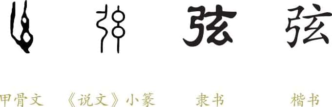

“弦”在甲骨文中写作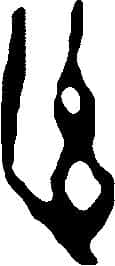，古人画出一张弓，弓上有两个圆圈，像两团丝线，这就是古文字中的“玄”，丝线是制作弓弦的重要材料。

弓弦在发射之时，会爆发出声音。宋代大词人辛弃疾有一首《破阵子》，其中有“弓如霹雳弦惊”的名句。射箭的声音犹如霹雳，让人胆战心惊，这就是弦的力量。弓弦有声，乐器上能够发声的线也叫弦。古人说：“目送归鸿，手挥五弦。”这里的“弦”就是琴弦。目送着要回乡的飞鸿，手上潇洒地拨弄琴弦，真是富有诗意的画面！

## 矢·短  
流星般的“箭矢”

说了“弓”，自然要说“箭”。但在古代，古人最开始用的不是“箭”字，而是我们有些陌生的“矢”。

### 矢/流星般的箭/

“矢”的历史比“箭”要悠久得多，甲骨文中就有这个字了。它画出了一支标准的羽箭形状——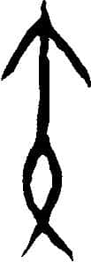，有箭头，有箭末扣弦处，还有用羽毛做的箭尾。到小篆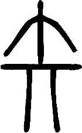时，还能依稀看出箭的样子。随着汉字的隶变，在今天的写法中，象形的意味已然消失。

什么是“矢”呢？《说文解字》说：“矢，弓弩矢也。从入，象镝（dí）栝（ guā）羽之形。”“矢”是古代弓弩用的箭，字形里有镝（箭头）、栝（箭末扣弦处），还有用来保持平衡的箭羽。

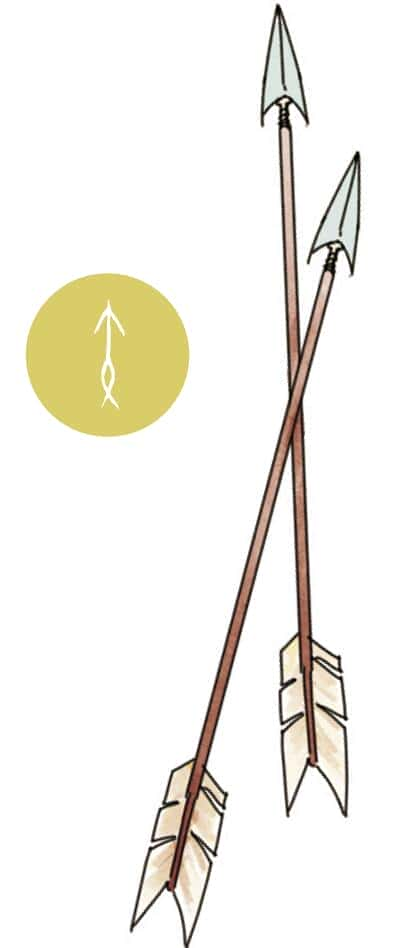

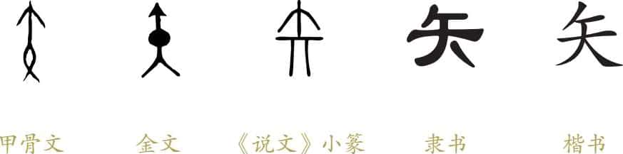

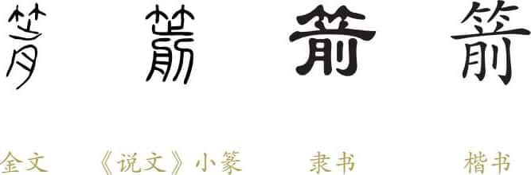

至于“箭”字，它是一个从竹前声的形声字。这个字大概在战国时期才出现，最初指一种竹子，也就是“箭竹”。《梦溪笔谈》中说：“东南之美，有会稽之竹箭……今采箭以为矢而通谓矢为箭者，因其箭名之也。”箭竹是绍兴地区的特产，质地比木头更为坚韧，特别适合做箭杆。到了后来，人们便把这种竹子用作箭矢的专名。

有意思的是，在古代“矢”字出现得早，使用得多，但到了今天，我们却几乎不用“矢”字，只用“箭”字。这两个字的命运，真是发生了巨大的翻转。

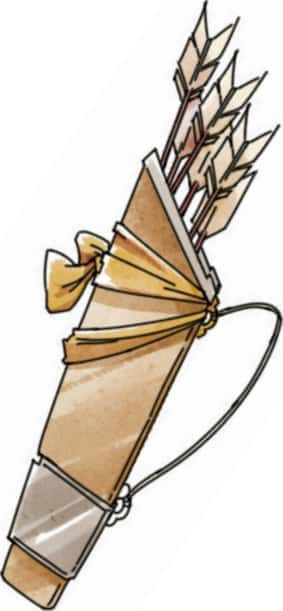

弓箭除了用于战争，还有一个重要的礼仪作用——射礼。古代教育注重素质教育，学生要学习的科目有“五经六艺”。“五经”是《诗》《书》《礼》《易》《春秋》，都是经典文献；“六艺”指礼、乐、射、御、书、数，即礼仪、音乐、射箭、驾车、识字、计算。“六艺”不仅是六种本领，更是六种道德规范。“射”不仅是古人的作战技能，也是先秦君子的礼仪。“射”字从寸，“寸”是古代的长度单位，意味着规范与标准，延伸出礼法的内涵。因此，从寸的“射”字，也有礼法的含义。古人举办射礼时，有严格的礼仪流程，目的是要达到《礼记·射义》中所说的“射者，仁之道也。射求正诸己，己正而后发，发而不中，则不怨胜己者，反求诸己而已矣”的境界。在古人眼中，射箭也讲究“仁道”。他们要通过射箭来观察自身的得失，塑造自身的品德，涵养君子之道。如果射箭输了，不能埋怨对手，而是要反观自身，追求自身品德的提升。因此，射礼不仅是考察射箭本领的竞赛，更是古代礼乐制度的重要组成部分。

### 短/有所长短，以矢为正/

“短”字里有个“矢”。你会不会很困惑，它和箭矢之间有什么关系呢？让我们先来看看《说文解字》的说法。

许慎先生说：“短，有所长短，以矢为正。从矢，豆声。”“短”是一个形声字，“矢”用来表义，“豆”用来表音。

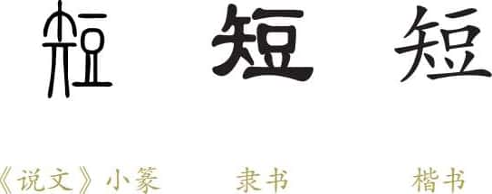

所谓“以矢为正”，是用箭作为长短的衡量标准。为什么用箭呢？因为箭的长短是固定的，古人经常用它作为衡量长度的工具。

比如，古代有一种游戏叫“投壶”，大家把箭投到壶里，看谁扔得准。在投壶之前，先要确定壶与人之间的距离。如果把壶放得太远，就难以命中；如果放得太近，又缺乏挑战。那么，多远合适呢？古人说“间以二矢半”，即两箭半的长度。此外，古代还有“一箭之地”的说法，即用尽全力射出一箭的距离，指距离不远的地方。

所以，“矢”作为测量工具，成为“短”字的部首，也就不足为奇了。

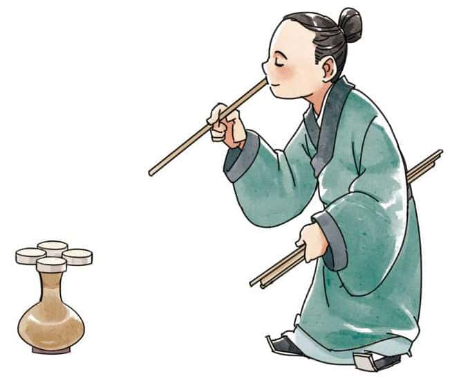

# 戈

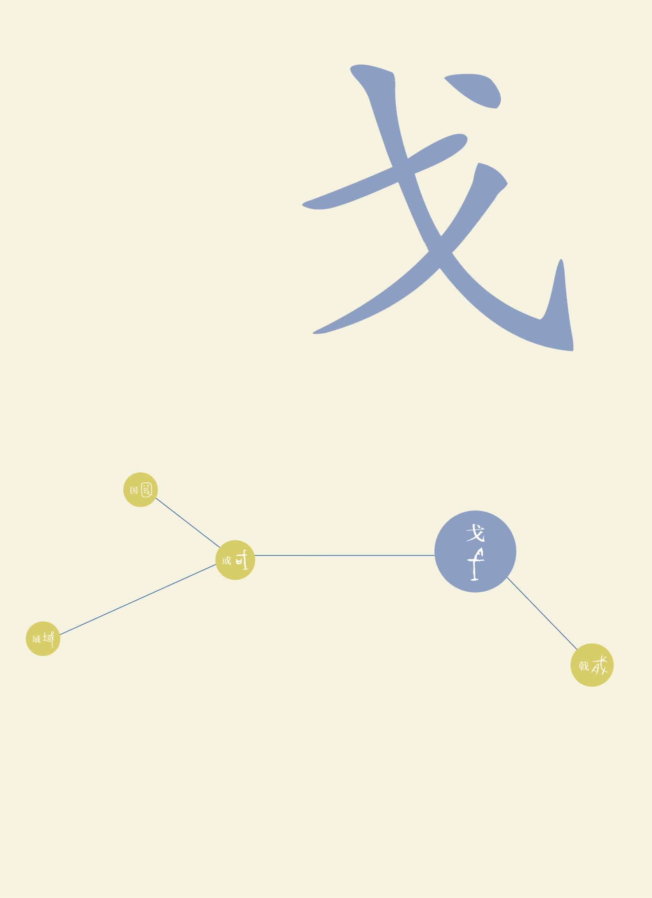

## 戈·戟  
战士手中的武器

宝刀与弓箭都是古代的常用兵器。这一讲，我再来为你介绍两个比较陌生的兵器：“戈”，以及它的升级版——“戟”。它们都是先秦两汉时期的沙场利器。

### 戈/平头的“戟”/

“戈”字在甲骨文中就已经出现了，足见这种武器历史久远。它是一个标准的象形字，甲骨文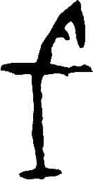画出了它锋利的兵刃和长长的杆。金文之后，“戈”开始简化，慢慢形成了今天的写法。

在出土文物中，发现了数量众多的戈，这是一种常用的兵器。它们和今天的镰刀有点儿像。戈怎么用呢？你看，它有一个弯曲的尖刃，就像鸟嘴一样，可以啄击敌人。此外，戈和镰刀一样单边开刃，可以割伤敌人。若回到春秋时期的古战场，你会看到成排的战士举起长长的戈，向敌人用力砍下，然后像使镰刀一样往回一钩，把敌人钩杀。若敌人乘坐战车，戈这种长距离的攻击武器，特别适合将敌人从战车上钩杀下来。

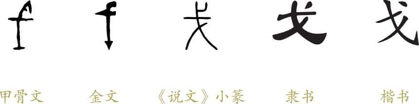

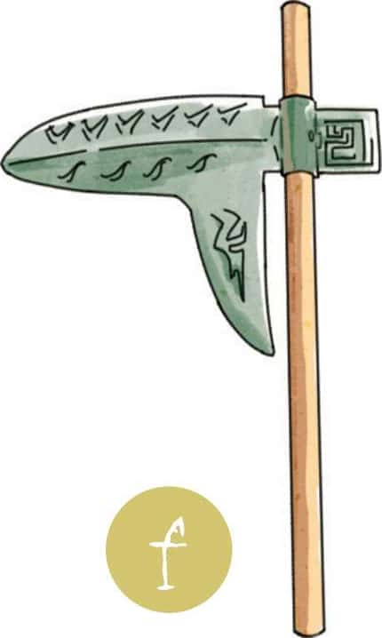

根据古书记载，吴国（今天江苏一带）的戈质量最好，被称作“吴戈”。大诗人屈原在《国殇（shāng）》中描绘过战士执戈的画面：“操吴戈兮被（pī）犀甲，车错毂（gǔ）兮短兵接。”战士们拿着锋利的吴戈，穿着犀牛皮铠甲。战车交错，短兵相接。

从商朝到战国，戈都是主流的兵器。后来，随着战车的衰落，骑兵和步兵开始崛起，戈才渐渐退出历史舞台，被刀剑弓弩取代。不过，“戈”在汉语中却依旧鲜活，用于“化干戈为玉帛”“临阵倒戈”等成语。“干”表示盾，“戈”表示武器，包含了盾牌和武器的“干戈”，是战争的代名词。“化干戈为玉帛”，就是战争转变为和平，比喻双方重修于好。至于“临阵倒戈”，则是说临到阵前却投降敌人，将戈调转过来，对准自己人。

除此之外，“戈”也成了古人造字的重要部首。你看，“武器”的“武”和“战争”的“战”都有共同的形符——“戈”。

### 戟/戈和矛的结合体/

说完了“戈”，再来看“戟”。

戟是戈的加强版，是在戈的上方增加了类似矛的枪尖。戈没有枪尖，所以也叫“平头戟”。《说文解字》是怎么解释“戟”的呢？许慎先生说：“戟，有枝兵也。”“戟”这种兵器的形状就像伸出的树枝。

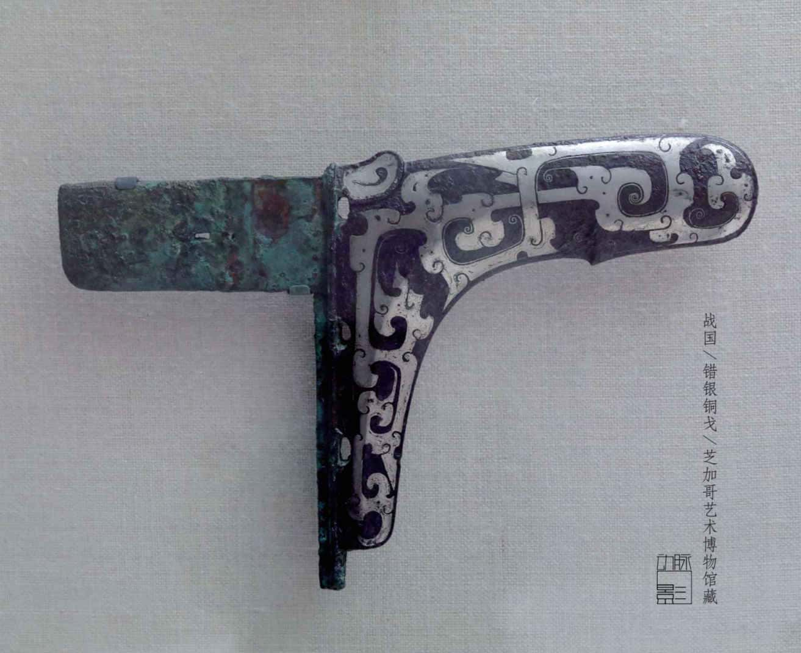

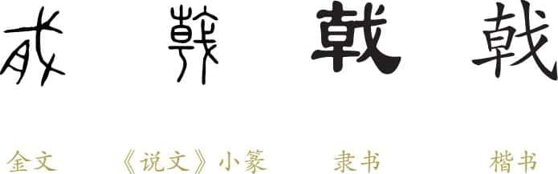

戟的发明，源自对戈缺陷的发现。在古代战争中，敌人举起戈啄击之时，有一个“空门大开”的瞬间，既不能进攻，也无法防守。聪明的古人发现了这个破绽，便在戈前面装上一个尖尖的矛头，创造出了戟。在敌人举起的戈还没落下的时候，拿着戟向前一刺，便可杀死敌人！

不要小瞧这处改良，就因为它，面对用戈的敌人，拿戟的战士就能克敌制胜！因此，戟发明出来后大受欢迎，在战争中越来越常用，后来还出过一个高阶改良版——《三国演义》中第一猛将吕布所用的“方天画戟”。正因为古代军队对于戟的喜爱，《孟子》中把战士也称作“执戟之士”。

除了用作武器，戟在古代还对应着一种不太礼貌的手势——“戟指”。戟指就是用手比出戟的样子，看上去很像打枪的手势。我们今天做这个手势表示开枪打你，但在古代，“戟指”有侮辱人的意味，古人大怒的时候会“戟指怒骂”，这可不是一个好手势。

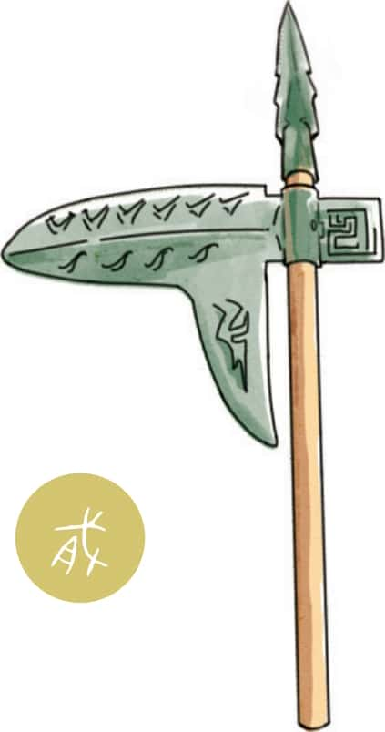

## 国·域  
保家卫国的汉字

上一讲，我们介绍了“戈”这种武器。在汉字的世界中，国家和疆域的概念都和武器“戈”有关。

真的假的？为什么看不出来呢？别急，让我们走进古老的汉字世界一探究竟。

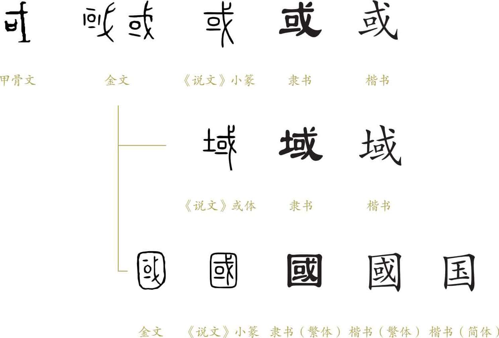

### 国/“国”的本字——“或”/

看到“国”的甲骨文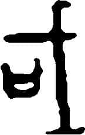、金文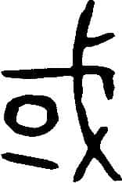，也许你会有些疑惑：咦，它怎么那么像“或者”的“或”呢？没错，这就是“或”！在今天它表示或者、或许的意思，但在古文字中，它是“国”的本字。

“国”和“或”之间的关系是什么呢？想要知道答案，还是先要讲一讲“或”字。

金文中的“或”写作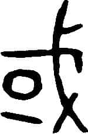，它的左边有一个很像“口”的字——“囗”，读作wéi，方方正正，画的是一座城池；右边是一个“戈”。《说文解字》中说：“或，邦也。从囗从戈，以守一。”“邦”是国家，用于“邦交”“邻邦”等词。“或”就是“邦”，它的本义是国家。至于下面的“一”，许慎先生说：“一，地也。”“以守一”，就是用戈来守卫国家、守卫疆土。

“或”是“国”的本字，那为什么今天的“或”表示或者呢？我们熟悉的“国”又是如何从“或”字发展演变而来的呢？这就要提到汉字假借的规律了。

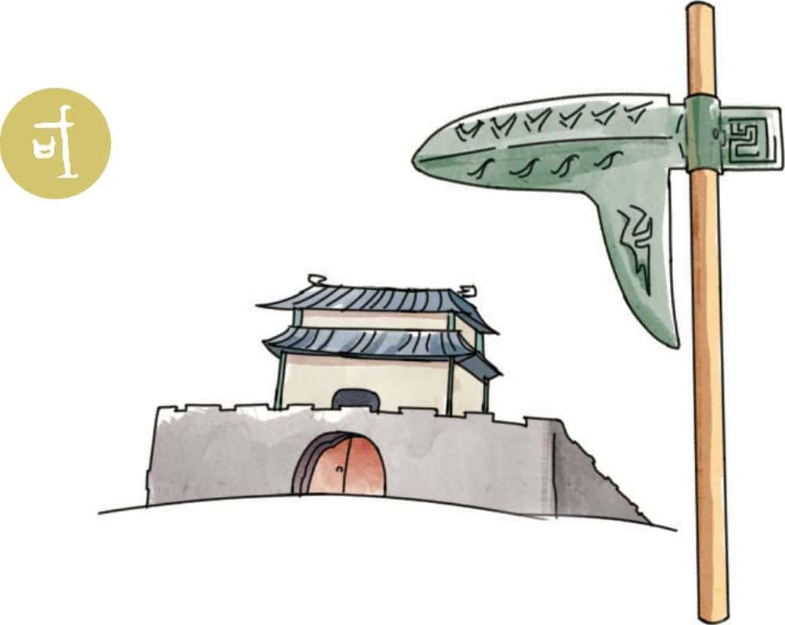

我在前面讲过，给实词造字容易，给虚词造字很难。为了给“或者”造字，古人借用了读音相近、表示国家的“或”字。这一借不要紧，“刘备借荆州”，再也不还了！没办法，古人不得不为国家另造一个字——在“或”的基础上添加形符“囗”，造出“國”字。可“國”字笔画太多，不便书写，人们便将其简化成“国”字。

我们的国家叫“中国”。“中国”一词最早可以追溯到什么时候呢？根据目前出土的史料，这个称呼能追溯到西周时期。“中国”第一次出现，是在陕西宝鸡出土的何尊上。

宝鸡是中国的青铜器之乡。西周末年，戎狄作乱，当时的国君周平王说：“咱们还是往东撤吧，离战乱远远的！”这就是历史上著名的“平王东迁”。当时的贵族们都以为只是暂时出去躲几年，于是纷纷挖深坑，把家里的青铜器窖藏起来，准备过些年回来后再挖出来。可是谁也没有想到，周王朝居然一去不返，东周再也没有回到西周的故土。于是，这批珍贵的青铜器一埋就是几千年，直到新中国成立后才陆续出土，完好地保存在宝鸡青铜器博物院里。其中，便有何尊。

何尊的铭文中有四个字“宅兹中或”，意思就是我们安居在中国这片土地上。其中的“中或”就是“中国”！在古人看来，我们居住在天地的正中——天地广大，我居其中，这就是“中国”的来源。

### 域/表示疆域的“域”/

“域”也是从“或”分化而来的汉字，是在“或”的基础上，添加了一个提土旁。

“域”是什么意思呢？它表示有一定疆界、范围的地方。一个地区的范围，称为“区域”；如果是异国他乡，则叫作“异域”。汉代张骞通西域，“西域”指的就是汉王朝西部的疆域。

在汉字中，“国”和“域”都由“或”分化而来，这些表示国家、疆域的汉字，在最初的写法中，都有一个“戈”字。这个“戈”并非侵略的武器，而是要用来保家卫国。汉字中凝聚着古人独特的国家观念：中国文化不强调侵略，不赞成掠夺，手持武器“戈”是为了守护国家，祖国就是需要我们共同坚定守卫的家园。

# 更多有趣的汉字

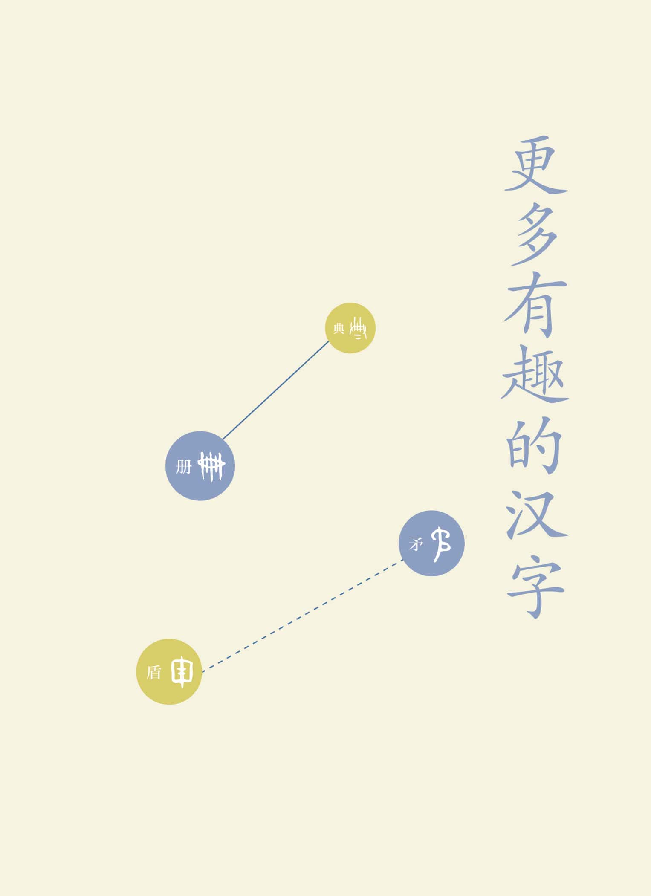

## 册·典  
古代的图书特别沉

“读书破万卷，下笔如有神”，我们的学习总是离不开书本。今天的图书多是纸质的，那古人用的书本是什么样子的呢？在这一讲，我将为你介绍与古代书籍有关的汉字——“一册”“两册”的“册”和“字典”的“典”。

### 册/一卷竹简/

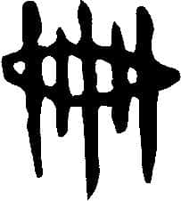是甲骨文中的“册”，它是一个典型的象形字，长长短短的竹简被编连成册。尽管我们早已不用竹简写字了，但古代图书的形制特点，依然保存在“册”字之中。

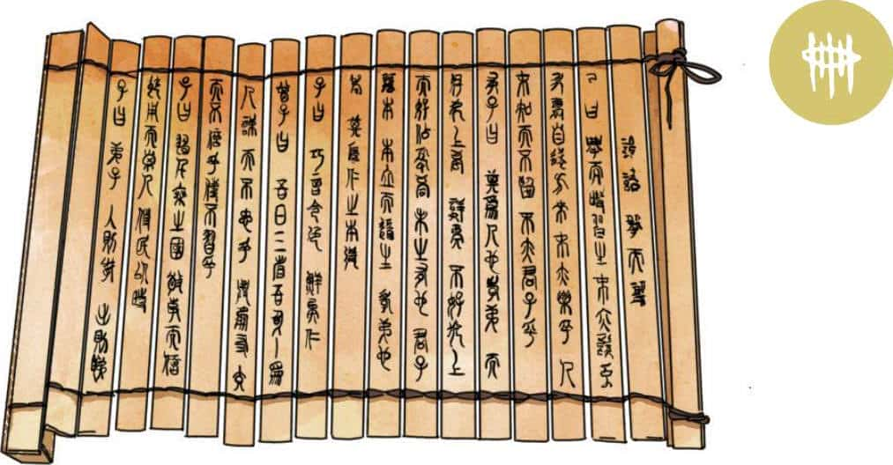

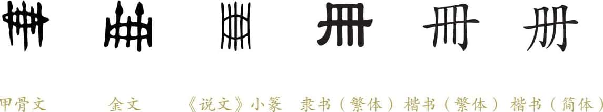

在东汉的蔡伦发明造纸术之前，竹简是战国至魏晋时期最为常用的文字载体。古人把竹子削成一根根的竹片，在上面写字，再用牛皮绳子编缀在一起，做成竹简。

“册”很重要，《说文解字》说：“册，符命也。”“符”是天子与诸侯之间的信物，“命”是天子分封诸侯时的证明文书。“册”相当于今天的国家官员任命书。因此，古代重要的分封称为“册封”，如果是立太子或者后妃，则称为“册立”。

除此之外，“册”也是图书的泛称。我们可以把书籍称为“书册”，把图画集叫作“图册”。古代的书经常要卷成一卷，因此又被称为“书卷”。一个爱读书的人文质彬彬，气质很好，便是有“书卷气”。

与竹简有关的词还有很多。比如“刀笔吏”，古人在竹简上写字时，如果写错，就会用小刀削掉错字。这把小刀就是他们的“橡皮”。古代文职官员总是随身带着刀和笔，因此也就被称作“刀笔吏”。再比如“学富五车”，这个词形容人很有学识，看过的书能载满五辆车。五辆车的书有多少呢？其实没多少，因为那时的书都是沉重的竹简，一辆车拉不了多少。不过，古代的人们大多不认字，在没有印刷术的年代，书籍更是异常宝贵，所以“学富五车”已经是非常厉害了。

### 典/重要的文献书籍/

说完了“册”，再看“典”字。

“典”的甲骨文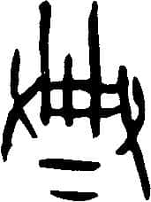，上面是“册”，“册”旁有手，下面是一个台子。这是一个会意字，展现的是一幅双手捧册、置于高台的画面。

为什么要把“册”恭恭敬敬地捧起来呢？《说文解字》中说：“典，五帝之书也。”原来，被放在高台上的“册”可不是一般的书，它们是由三皇五帝留传下来的至关重要的典籍。因为重要，后人要“尊阁之”，将其恭敬地放在高台之上，妥善保存。

在“典”的字形中，我们看到了古人对典籍的尊重，这份尊重也影响了“典”字今天的用法。在现代汉语中，“典”有规范、标准的意思——用来规范字音、词义的工具书叫“字典”“词典”“辞典”，具有模范作用的人被称为“典范”，引用经典著作中的话叫作“引经据典”。

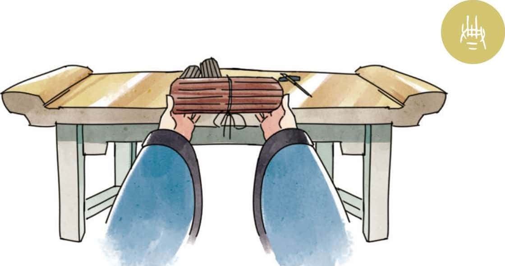

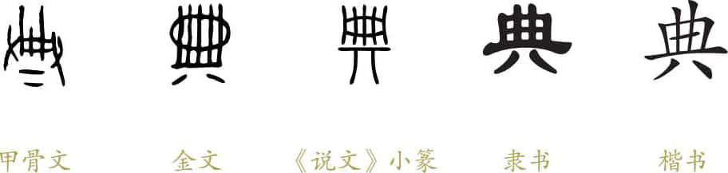

此外，“典”还用来指称隆重的场面，开学时要举行“典礼”，建国时有“开国大典”，那些特别盛大的典礼也被叫作“盛典”……

说到这里，你应该清楚“册”与“典”的区别了吧。

## 矛·盾  
以子之矛，攻子之盾

“矛”和“盾”是古人常用的兵器，矛用来刺，盾用来防卫。

### 矛/锋锐的长矛/

锋利的长矛是古人的常用兵器，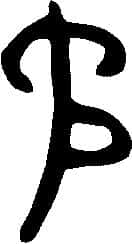是西周金文中的“矛”，它是象形字，有杆有矛尖。

《说文解字》中说：“矛，酋矛也。建于兵车，长二丈。象形。”“酋矛”是古代矛中的一类，属于长矛，最初用于车战，有二丈那么长。车战中，作战双方的距离比较远，只有使用矛这样的长距离作战武器，才可以在较远的地方把敌人刺倒。

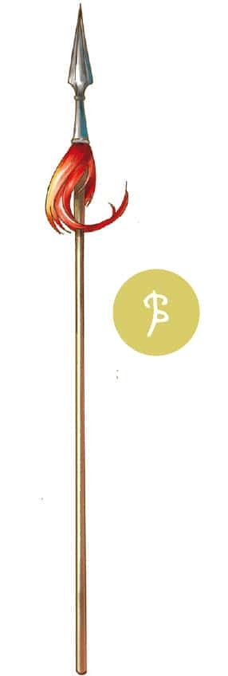

很多著名的武将都用过矛。最有名的是《三国演义》中的张飞，还有《水浒传》中的林冲。这两位盖世无双的英雄好汉使用的都是“丈八蛇矛”。这种矛长一丈八，前端尖部做成弯弯曲曲的蛇形，有一种特殊的杀伤力！

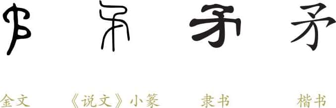

### 盾/坚固的盾牌/

说完了“矛”，我们再看“盾”字。

“盾”字最初也是一个象形字。甲骨文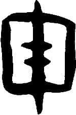就是一个方方正正的盾牌。到了金文，则出现了另外一种写法——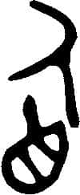，这是在象形字的基础上，加上了一个“人”。这个人形逐渐演变，最终变成今天“盾”字上方的两撇与一横。至于“盾”字中的“目”和上面的一竖，则由盾牌的象形演变而来。

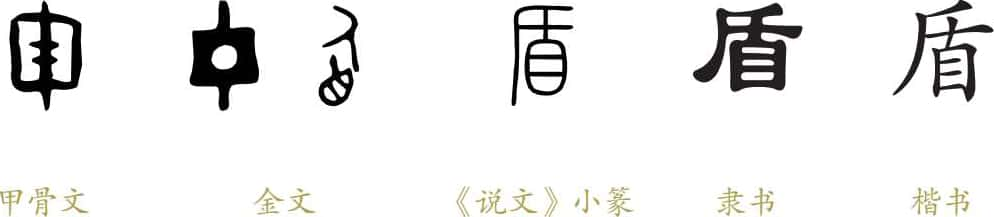

《说文解字》中说“盾”可以用来“扞（hàn）身蔽目”，“扞”是遮蔽的意思，盾牌可以遮蔽身体，甚至可以把整个人挡住。在古代战场上，使用长矛的士兵站成一排，向前突刺；使用盾牌的士兵，左手拿盾，右手拿刀，刀用来近战劈砍，盾用来防护身体。这就是中国古代最为常见的兵种——长枪兵和刀盾兵。

除了指盾牌，“盾”还指盾牌形状的东西。古代用黄金、白银铸成的方块货币也叫作“盾”。因此，“盾”也可以作为货币单位，荷兰、越南的货币，就叫作“荷兰盾”和“越南盾”。

“矛”“盾”作为武器和防具，合在一起，组成“矛盾”，用于成语“自相矛盾”。

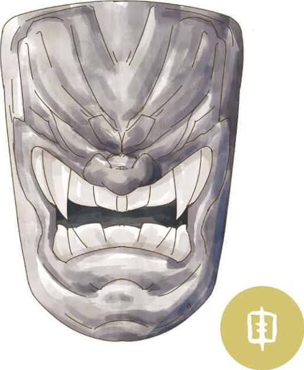

很多人知道“自相矛盾”的故事，却不知道它出自法家的代表作《韩非子》。它探讨的远不只一个生意人卖矛和盾的事情，更是通过反驳儒家的圣王之道，来传播以法治理国家的法家理念。韩非子讲述的完整故事是这样的：

有个地方的农民整日相互侵占田地。后来，舜到那里种田。一年后，在舜品德的感化下，农民们各安本分，再不相争。

黄河边的渔夫相互争夺钓鱼的好位置，舜也到那里打鱼，一年后，在舜品德的感化下，大家都变得彬彬有礼，礼让他人。

东夷的陶工偷工减料，制出的陶器质量低下，舜到那里制陶，一年后，在舜品德的感化下，大家精益求精，制出精致的陶器。

孔子赞叹舜的品德：“舜真是仁厚呀！种田、打鱼和制陶，都不是舜的职责，但他却用德行感化败坏的风气。他是位圣人，他的品德能感化人间呀。”

有人不同意孔子的观点，便去问一名儒者：“舜去感化百姓的时候，儒家推崇的尧在哪里呢？”儒者答道：“尧当时正在做天子呢。”反对者问道：“孔子也说尧是圣人，既然圣人做皇帝，就该明察一切、治理有方，让天下没有歪风邪气，种田的不会争吵，打鱼的没有争执，陶器也不会粗劣，那怎么会用得着舜去感化他们呢？如果社会糟糕、风纪败坏，需要舜去感化他们，那就证明尧作为君主是有过失的，又何谈圣明？如果认为舜感化有功，那就势必得否定尧的圣明。如果认定尧是圣人，就得否定舜的德化教育。”

接下来，反对者讲述了“自相矛盾”的故事，并继续说道：“不能被刺穿的盾和能刺穿一切的矛，是不可能同时存在的。同理，在孔子的故事里，尧和舜不能同时都是圣人。

“再说，舜纠正歪风邪气，一年纠正一个过错，三年纠正三个。像他一样的人数量有限，寿命有限，而天下的过错却没有休止和尽头。以有限的寿命去对抗无尽的错误，真正能纠正的又有多少呢？

“我觉得还是要用赏罚的方式来纠正过错，符合法令的赏，不符合法令的罚。把法令推行至天下，早上下达法令，傍晚就把过错纠正了。傍晚下达法令，第二天早上就把过错纠正了。过个十天八天，全国各种各样的过错都能纠正完毕，根本不用像舜一样感化个一年半载！

“况且，以自身受苦来感化民众的做法，即便是尧舜也难以长久地做到。用自上而下的法令去纠正百姓的做法，即便是庸君也容易达成。要想治理好天下，放弃庸君都容易成功的方法，却去遵行尧舜都难以实行的办法，真是不懂治国之道呀。”

听完完整的故事，你是不是对“自相矛盾”有了新的认识呢？

