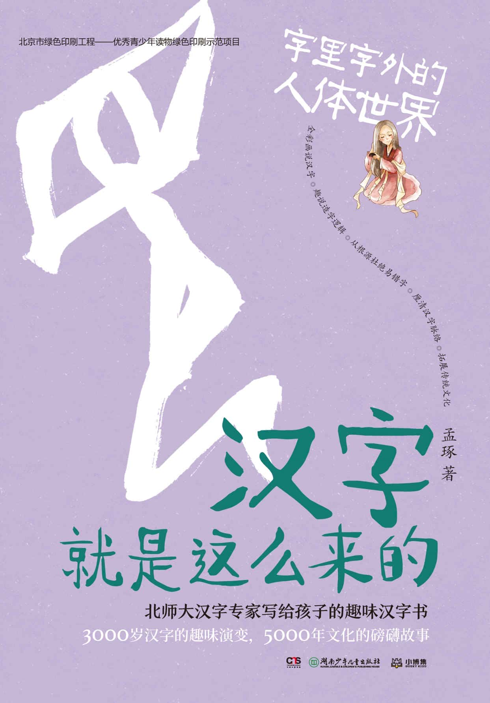

# 版权信息

书名：汉字就是这么来的·字里字外的人体世界

作者：孟琢

出版社：湖南少年儿童出版社

出版时间：2020-08-01

ISBN：9787556251926

本书由天津博集新媒科技有限公司授权亚马逊发行

版权所有 侵权必究

# 目录  
CONTENTS

**人 
人·从·比·众 天地之间人为贵 

企 企鹅和企业为何都有“企”？ 

介 直立行走的战士 

大·夫·立·天 大人与苍天 

文 古人文身的秘密 

夹·侠·亦 汉字中的侠客梦 

交·要 叉腰站立的风姿 
**

**心 
心·思 汉字中的心灵世界 

忠·恕 汉字中的仁者情怀 

愚·忘·惑 笨笨的心灵 
**

**肉 
肉·骨·筋 生命的物质基础 

背·脊 与后背有关的汉字 

胖·肥 让人难堪的小肉肉 

脩·脯 孔子的学费 

肖·胤 延续不息的血脉传承 
**

**目 
目·见·现 眼睛的光彩 

眉 眉是美丽的标志 
**

**口 
口·曰·舌 与嘴巴有关的汉字 

齿 “齿”和“牙”是一个意思吗？ 

甘·旨·香 三种“美味” 

言 直抒心声 

论·语 孔子之道，一以贯之 

音·韵 声音和韵律 
**

**手 
手·掌·指 我们的手 

又·友·及·取 不像手的手 

爪·受·争 “充满竞争”的手 
**

**止 
止·步·走·奔 由慢到快的脚步 

出·客 脚步与住处 

正·征·是 走向正确的方向 

足·踊 蹦蹦跳跳的汉字 
**

**更多有趣的汉字 
元·首·领 高昂的头颅 

耳·闻·圣 聆听中的智慧 

自·鼻·臭 鼻子与“我” 
**

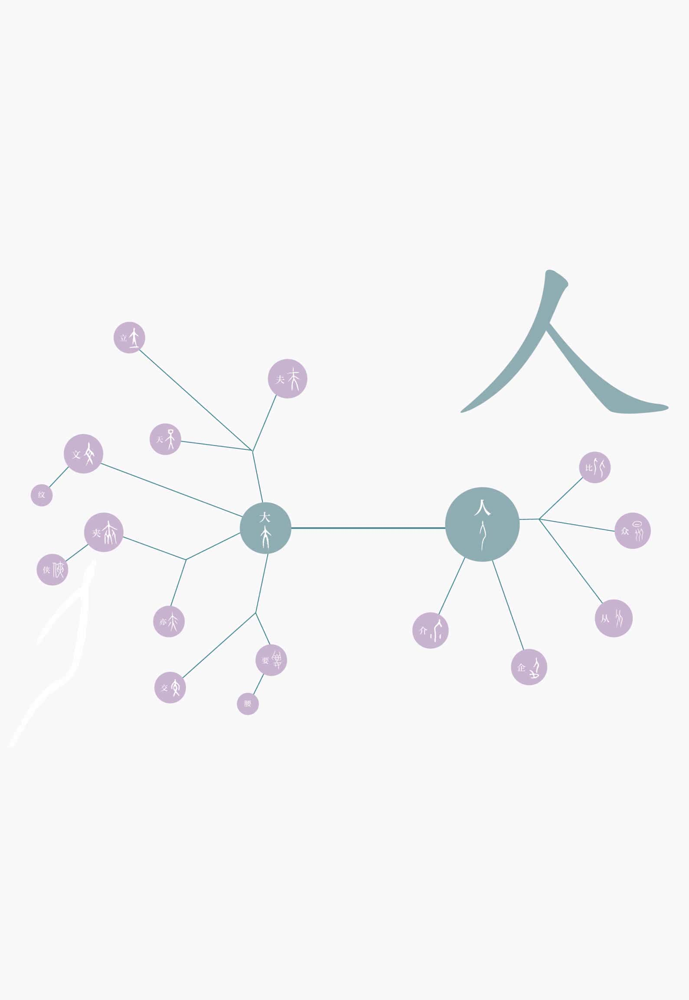

## 人·从·比·众  
天地之间人为贵

古人造字，是一个认识世界，也是认识自己的过程。他们将好奇的目光投向丰富多彩的世界，也投向自己。无论是多姿多彩的大自然，还是我们的身体，都是汉字的来源。

从一眨一眨的大眼睛，到灵巧能干的双手；从与人交流的口舌，到奔向远方的双足；从聪明机智的头脑，到健康强壮的骨骼肌肉——人体的各个部位，都在汉字中得到了充分彰显。

解读汉字，就是解读我们自身。而对我们自身的解读，要从“人”开始。

### 人 / 侧面站立的人 /

在汉字中，“人”是一个特别重要的字。在遥远的古代，聪明的古人是怎么给“人”造字的呢？

你看古文字中的“人”，从甲骨文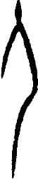、金文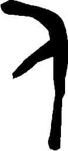再到小篆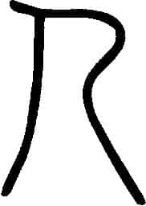，这个字一脉相承，画出了一个侧身站立的人形，他姿态优雅，手自然下垂。这是个典型的象形字。什么是“象形字”呢？古人在造字的时候，用绘画的方式描绘事物的形状，由于画得很像，所以这类字叫象形字。

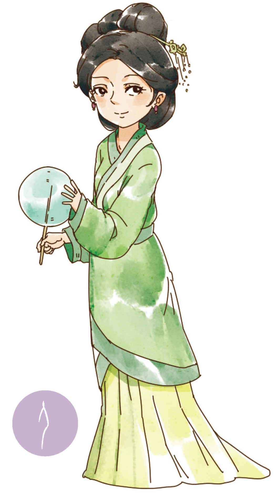

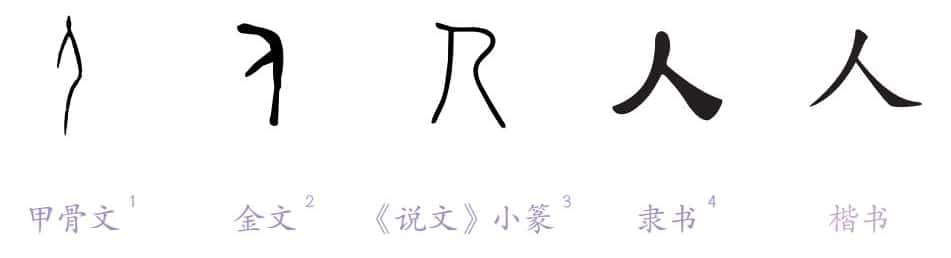

**1.** 甲骨文是目前能看到的最古老的汉字，它是中国商周时期的文字，因为刻写在龟甲兽骨上，所以被叫作“甲骨文”。

**2.** 甲骨文之后的文字叫金文，也叫“钟鼎文”，是商周时期铸刻在青铜器上的文字。我们见到的青铜器大多数是青黑色的，但它刚刚铸造出来的时候，其实是耀眼夺目的金黄色，所以叫金文。

**3.** 战国时期，各诸侯国的文字不同，严重影响诸侯国之间的交流。秦灭六国之后，除了统一国土，也统一了度量衡，统一了文字，规定了标准字体——小篆。

**4.** 隶书由篆书简化演变而成。小篆字形规整、端庄大方，但不易书写。秦国以法治国，政令繁多，大小官吏用小篆书写，效率不高，于是他们在办公过程中自觉地简化了汉字，用一种简便的字体书写了大量的公文，这便是隶书。从小篆到隶书发展演变的过程，叫作“隶变”。

《说文解字》[1]说：“人，天地之性最贵者也。”在古人看来，人是天地万物之中最重要的存在。在中国传统文化中，人与天地并称为“三才”，它们之间的关系很有意思。《礼记·中庸》[2]中有“赞天地之化育”的说法，讲解了天地人之间的关系：

天的作用在于“化”。“化”就是运行变化，为万物的存在提供条件。上天运转不息，从春到夏，从秋到冬，从未停止。清爽的微风、润泽的雨露、清冷的秋霜……这些都是万物生长的动力。

地的作用在于“育”。“育”就是养育，为万物的生存提供物质基础。肥沃的土壤、清澈的溪流、茂密的青草……这些都是养育万物的环境。

天地是万物生存的自然条件。如果没有天地，没有空气、雨露、土壤、河流，人类和动物都将无法生存。

天地很重要，那人在其中的作用又是什么呢？

人的作用是“赞”。请注意，这个“赞”可不是在微信朋友圈里点赞，而是辅助、帮助、赞助的意思。人处于天地之间，不是索取者，更不是破坏者，而是承担责任者。这个责任就是尊重天地之间的规律，促成天地的“化”和“育”，辅助天地生养万物。在中国人心目中，天地人之间是互补关系，只有天地人三者和谐，才能形成完整而美好的大自然。人立足于天地之中，具有根本性的价值。天地之间若没有了人，也就没有了天地万物的和谐关系。智慧的老子[3]提出“道大，天大，地大，人亦大”，讲的就是天地之间“人为贵”的道理。

### 从 / 一前一后去跟从 /

在汉字中，“人”可以组成不同字。一个人是“人”，那两个人是什么呢？

两个人的方向不同，组成的字也不同。当两个人都朝向左边时，组成的字是“从”，是个会意字。

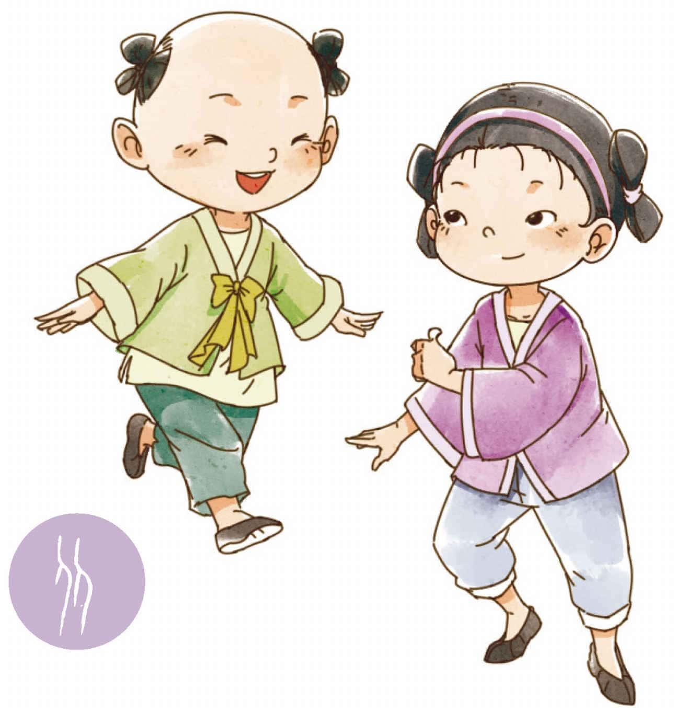

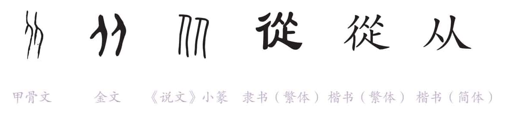

什么是“会意字”呢？会意字就像拼积木一样，把不同的字拼合在一起，组合这些字的含义，从而造出新字、表达新义。就比如“从”字，前面走着一个人，后面跟着一个人，两个“人”字合起来就有了新的含义——跟从。

许慎先生说：“从，相听也。”“从”是互相听从的意思。在《论语》中，孔子感慨世道纷乱，说道：“道不行，乘桴（fú）浮于海，从我者其由与？”我的主张没办法推行，我想乘上竹筏出海漂流，跟从我的人，大概是子路（字仲由）吧。在这里，“从”用的就是“跟从”之义。

### 比 / 两个人紧紧挨着 /

两人向左为“从”，如果把方向反转，两人都向右，则变成了“比”字。“比”的字义和“从”不同——“从”是前后跟从，“比”则是两个人紧紧挨着。《说文解字》中说：“比，密也。”“比”指两个人之间亲密的关系。

需要注意的是，“比”表示关系亲密时，可不仅仅是褒义的，它还可以是贬义词，有勾结起来做坏事的意思。孔子曾说过这样一句话：“君子周而不比，小人比而不周。”“周”是紧密团结，“比”是狼狈为奸，一褒一贬，区别明显。这句话的意思是，君子和周围的朋友紧密团结，那是因为他们有着共同的理想；小人呢，每天在一起称兄道弟、喝酒吃肉，看似关系亲密，却没有心灵上的内在认同，不过是短暂的利益勾结而已。

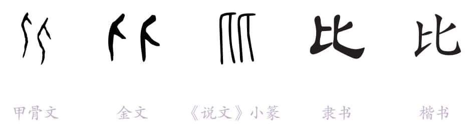

“比”虽然有鲜明的贬义色彩，但也可以指一般意义上亲密、紧密的关系。唐代大诗人王勃有两句很有名的诗：“海内存知己，天涯若比邻。”尽管我们告别了，但友情不会随着距离的遥远而消逝，人在天涯，依旧如同邻居一般亲密。所谓“比邻”，就是近邻。虽然距离遥远，但心灵上的相知可以把关系拉近。

“比”表示人与人之间紧密挨着，引申用法有“排比句”，就是把句式相同的句子，紧挨着排列在一起。此外，人与人离得近了，难免就会比一比，因此，“比”也引申出了比较、攀比的意思。

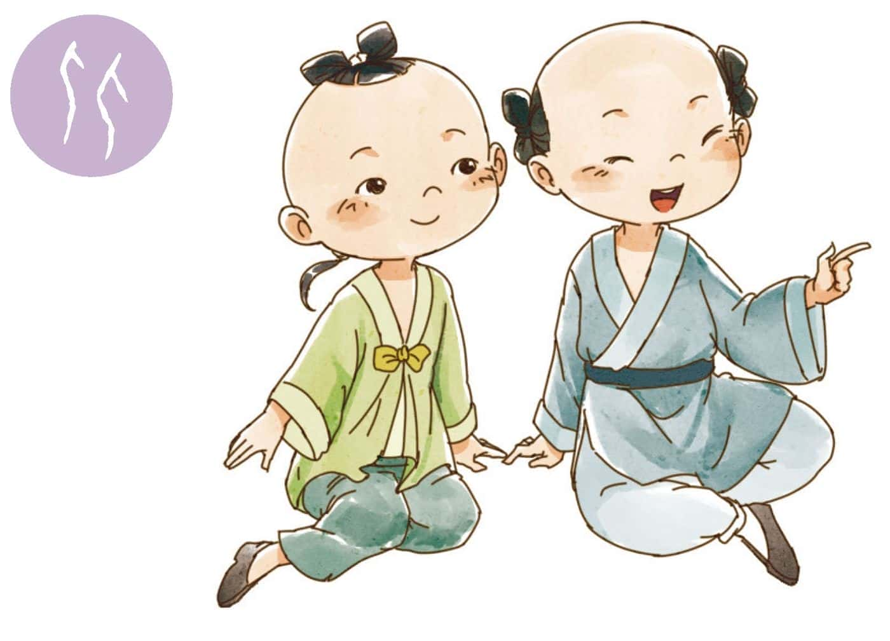

### 众 / 三人为众 /

看完了两个“人”的组合，接下来还有三个“人”的。不过这不是寂寞的“对影成三人”，而是热热闹闹的“三人为众”。在古代，“三”往往用来表示多。三个人，就是很多人，也就是“众”。

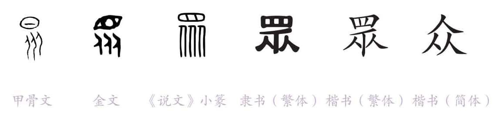

“众”现在的字形既简约又明晰，但其实它最初被造出来时，还有更复杂的字形。在甲骨文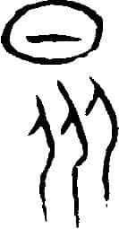中，三个“人”上面还有一个“日”字。不过，到了金文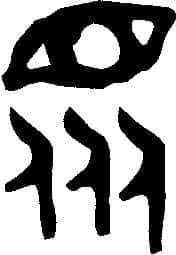，上面却变成了“目”字。有的学者认为，甲骨文是一群人在太阳下劳作，而金文上的“目”是“日”的讹误。也有学者认为，金文上的“目”是有道理的，金文是指大家一起在众目睽睽之下劳作。各家说法不一，至今也未有定论。

随着汉字发展演变，金文又经历了小篆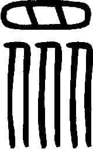、隶书、楷书，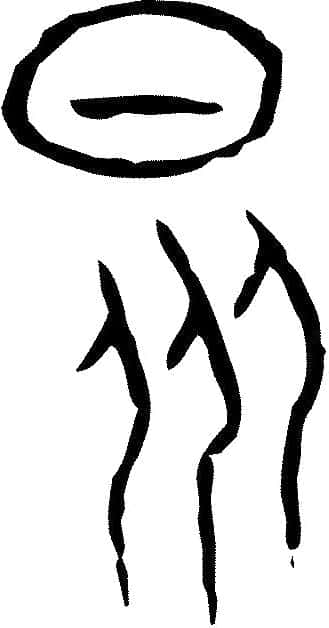最终从繁体字的“眾”演变为简体字的“众”，不再有灼灼日光，也不再有众目睽睽，只是简简单单的“三人为众”，表示大众、众多之义。不得不说，现在的“众”更加简约而美观了。

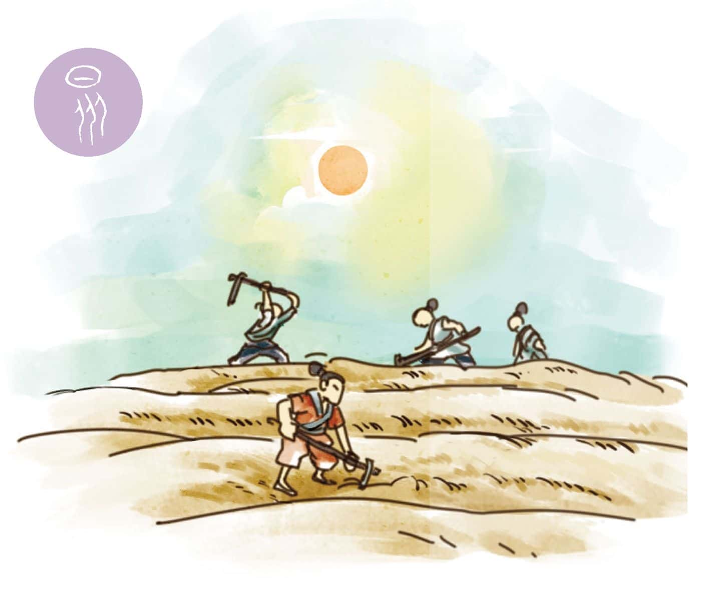

* * *

[1]《说文解字》是中国历史上第一部系统分析汉字字形、讲解汉字字理的字典，简称《说文》，作者是东汉的许慎。在体例上，它开创了部首编排法；在内容上，它用六书系统地解说汉字，并保存了部分早期古文字的写法，为我们研究甲骨文、金文等提供了依据。六书是六种汉字造字法，包括象形、会意、指事、形声、转注和假借。

[2]《礼记》是儒家的重要经典，是对周代礼仪制度的深入阐发，其中《大学》《中庸》《学记》《乐记》等篇目，都是非常重要的文化经典。

[3]老子，姓李名耳，是道家学派的创始人，春秋末期的哲学家。

## 企  
企鹅和企业为何都有“企”？

你见过企鹅吗？在南极洲的冰面上，企鹅摇摇晃晃，憨态可掬，惹人喜爱。你有没有想过，企鹅为什么叫“企”鹅呢？在汉语中，还有一个用“企”组成的词——“企业”。企业为什么叫“企”业呢？“企业”和“企鹅”都用到了“企”字，它们之间有什么关系吗？那“企”和“人”又有什么关系呢？

想要找到答案，我们还是要回到古老的汉字中去。

古老的甲骨文中就已经有“企”字了。从甲骨文一直到《说文》小篆，“企”字都没有太大变化：上面是一个侧面站立的人，下面是表示脚的“止”。请注意，“止”是稍微跷起来的样子，所以“企”是一个人踮脚站立的形象。《说文解字》中说：“企，举踵也。”“踵”是脚后跟。“企”就是把脚后跟跷起来，也就是踮脚站立。

踮起脚跟的“企”描绘出了一个举目远眺、翘首企盼的人物形象。在《汉书》中就有这样一群企盼着眺望着的人：“吏卒皆山东之人，日夜企而望归。”《汉书》记载汉代历史，这句话出自汉高祖刘邦的传记。在秦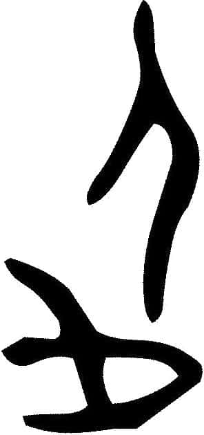代末期，楚霸王项羽和后来的汉高祖刘邦都是当时的大英雄！他们率领起义军，向西打进函谷关，攻占了秦国的首都咸阳。大功告成后，刘邦被项羽封到了巴蜀、汉中一带，来自“山东”（崤山以东）的士兵们“日夜企而望归”，日日夜夜踮起脚尖，望向故乡，企盼归家。对此，唐代学者颜师古有一个精彩形象的解释：“企谓举足而竦（sǒng）身。”举足，把脚后跟跷起来；竦身，身体尽量伸直。这种跷足渴盼的状态，就是“企”！

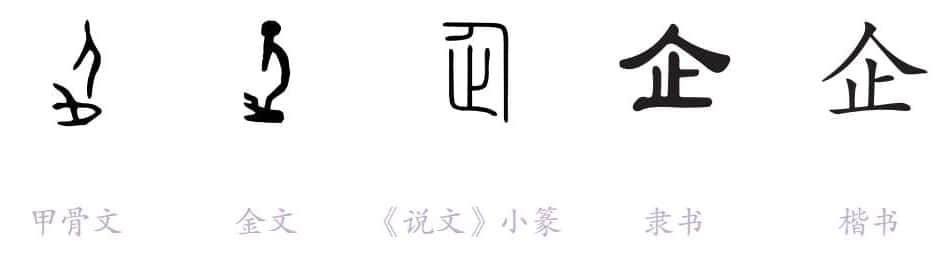

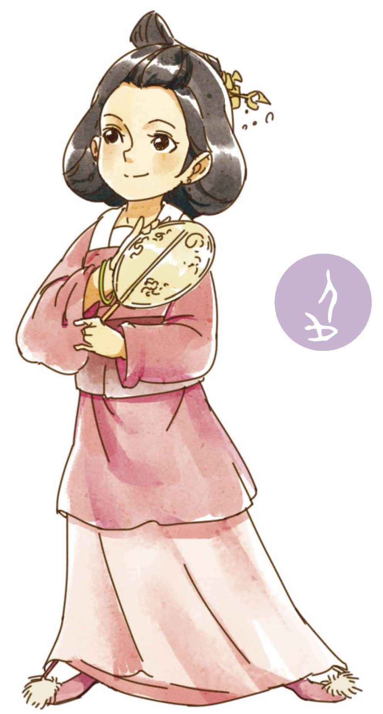

说到这儿，我们大概也就能理解企鹅的命名由来了。因为企鹅的样子和“企”字很像，就是踮脚、身直，再加上左右摇摆！

说完了企鹅，再说企业。“企”有一种高高站立的姿态。企业和校园门口的小卖部是不一样的，必须要有高远的追求、宏阔的规模，这才是“企”业。

现在，你该明白“企鹅”和“企业”之间的联系了吧。

## 介  
直立行走的战士

“介”可以组成“耿介”“介意”等词，它也和站立的人有关。

什么是“介”呢？从甲骨文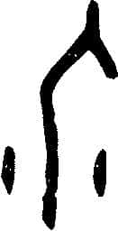到金文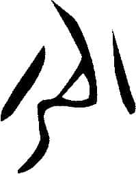、小篆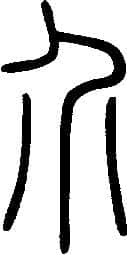，“介”的字形一脉相承——一个侧面站立的人形，前后各有一竖，表示人佩戴的铠甲。“介”的本义就是铠甲，早期的铠甲没有锁子甲、连环甲那么炫，不过是胸前一片甲，背后一片甲。

在“介”字中，人处于两片铠甲中间，因此，古人把处于两者中间的状态叫作“介乎”“介于”，比如“介乎两山之间”“介于两地之间”，说的都是处在两个事物中间的意思。我们今天常用的“介意”一词，也和这种状态有关。什么是“介意”呢？你格外在意一件事情，这种纠结惦念就像一根钉子一样，插入你的心里，这就是“介意”。

“介”字里有铠甲，由此也引申出了坚固的含义。在中国近现代史上有一位很重要的人物——蒋介石，他的名字出自《周易》“介于石”一语，他希望自己的意志像石头一样坚定！你看，人家多会起名字！要是叫“蒋石头”，可就意蕴全无了。

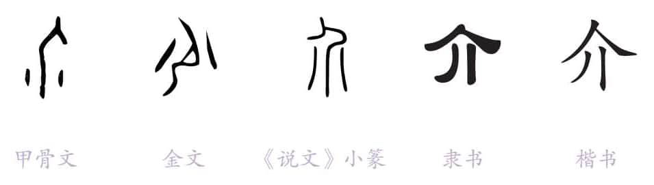

“介”有坚固的意思，由此又引申出耿介之义。“耿介”是书面语，指的是一个人品性正直，不同于流俗。在中国历史上，有很多铁骨铮铮的耿介之士。比如唐太宗的大臣魏征，他总是犯颜直谏。唐太宗喜欢打猎，有一次，有人进贡了一只鹞（yào）鹰，神俊非常，唐太宗喜欢极了。正赏玩着，魏征来了，太宗怕他批评自己玩物丧志，又要讲一番大道理，就顺手把鹞鹰藏在了袖子里——古人的袖子真够宽大的！

魏征远远看见，也不说破，只是跟太宗啰啰唆唆地讨论国事，跟往常一样，一谈便是许久。这可把唐太宗急坏了！好不容易等魏征告退，拿出鹞鹰一看，鹞鹰早已憋死了……

魏征总是触碰唐太宗的逆鳞，一来二去，唐太宗也有火大的时候。一次罢朝回宫，太宗大发雷霆。长孙皇后问道：“谁惹陛下生气了？”

“还不是魏征那个老东西，当着满朝文武的面，又说了我半天，回头非找个借口斩了他不可！”唐太宗骂完，一回头，皇后不见了。过了一会儿，只见长孙皇后换上朝服，扑通一声跪在太宗面前，开口道：“陛下，恭喜您！只有圣贤之君，才有这样敢说实话的臣子。”此语一出，唐太宗也反应过来了，顿时龙颜大悦。

魏征这样耿介的大臣，和唐太宗这样开明的君主遇到一起，最终开创了大唐的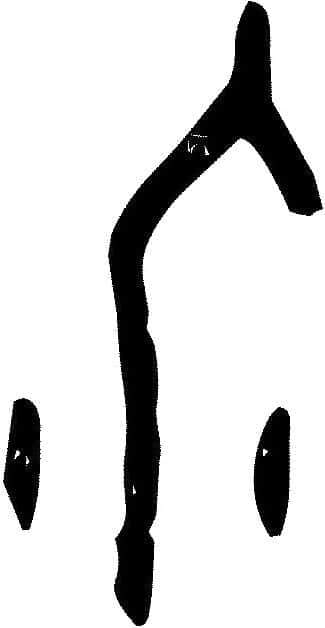贞观盛世。

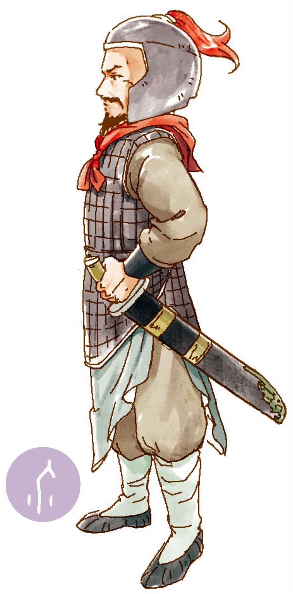

## 大·夫·立·天  
大人与苍天

每个人都会长大，从对未知世界充满好奇的稚子幼童，到成熟稳重的大人。在中国古代文化中，什么是成为“大人”的标准呢？让我们从古汉字谈起，说一说“大”字，以及与它相关的“夫”“立”“天”。

### 大 / 大人之道 /

先问你一个问题，如果你是造字的仓颉[1]，你会如何造“大”字呢？画一座巍峨的山峰？画一头高大的大象？它们虽然体形庞大，但并不能代表真正的“大”。那什么是真正的大呢？许慎先生的答案是：“天大，地大，人亦大。”在古人心目中，和天地一样大的，是人！所以，古人决定用人来造“大”字。

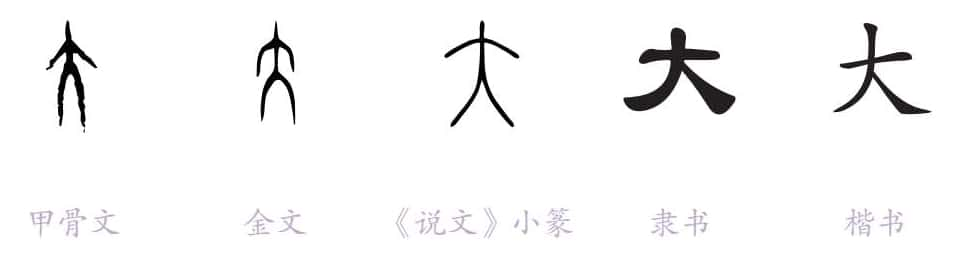

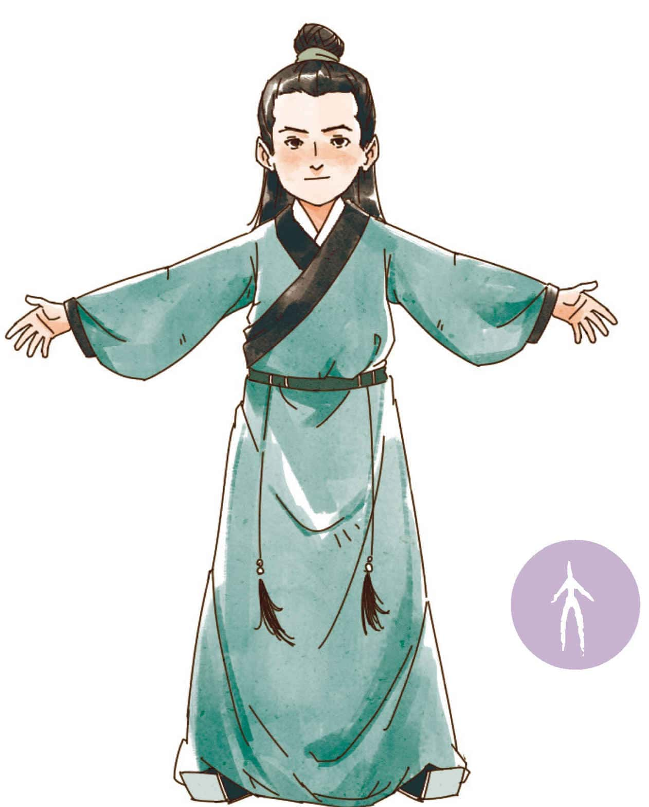

古人画下一个正面的人——，他的手和脚用力张开，看上去很有气势。随着时间的流逝，这个字慢慢发展演化，从金文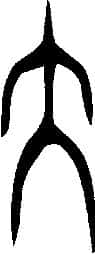发展到小篆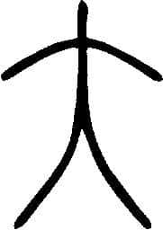，再到隶书，人的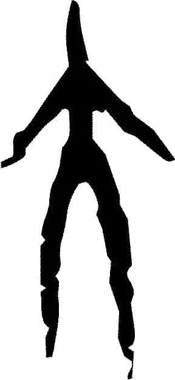两只胳膊越抬越高，手臂越伸越直，双腿迈开得越来越阔，终于变成了挺拔大气的“大”字。

我们常说“大人”，到底什么是大人呢？大人仅仅是个头儿大吗？当然不是。中国古人讲究“大人之道”，大人并不仅仅是身体高大，更指品德高尚与伟大。在儒家的代表人物孟子看来，真正的大人反而应该像孩子一样。他说：“大人者，不失其赤子之心者也。”意思是说，一个伟大的、人格高尚的人，要保持自己的赤子之心，保持心中的那份善良与童真。这份赤子之心，这份天真自然，是“大人”的根本，是非常宝贵的品质。

话说回来，古人怎么准确界定孩童到大人的蜕变呢？什么时候孩童才能算长大成人了呢？这个答案藏在“夫”字里。

### 夫 / 古代的冠礼 /

“夫”是在“大”的基础上造出的汉字，在“大”上面加一横，就是“夫”。在古代，“夫”是成年男子的意思，只有成年了才能成为“大丈夫”。那么，“夫”上面的这一横是什么意思呢？

这个字涉及了一种造字法——指事。指事听起来有点儿抽象，其实它是一种极为智慧的造字方法。古人要造一个表达“成年男子”意思的字该怎么办呢？画个人，然后再画上胡子？还是画上成人的衣服？那样太麻烦了。聪明的古人选择了最能代表长大成人的关键仪式——冠礼，来创造“夫”字。

冠礼是古人的成人礼，意味着一个男孩变为了大人。这个礼仪中男孩最显著的变化，是发型的改变。古代的小朋友有一种专门的发型——把头发梳成两个朝天的小髻，有点儿像动物的角，叫作“总角”。在这里，“总”是汇聚的意思，一个人幼年时代的交情和友谊，就叫“总角之交”。

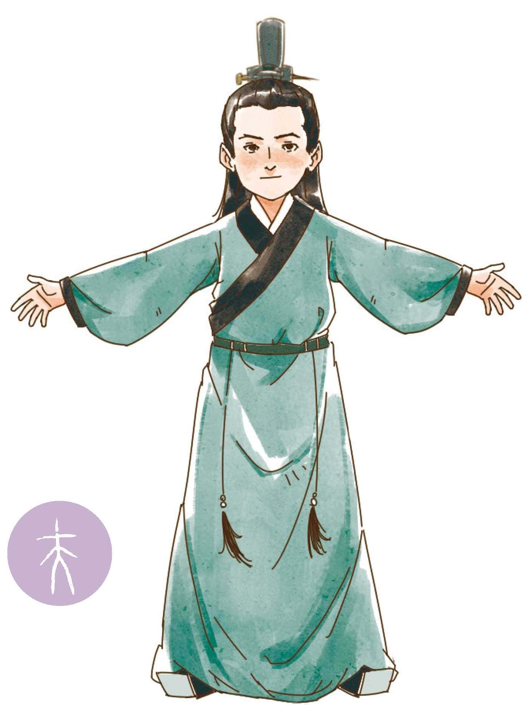

男孩到了二十岁左右，就可以举行冠礼，也就是成人礼了。天子和诸侯的冠礼则更早，十二岁即可。在成人礼上，男孩会正式换个发型，把头上的两个总角打散，拢在一起，向上扎成一个发髻，再用黑布把头发包起来，然后加冠。一个少年加冠，便意味着他已经成年。

那什么是“冠”呢？冠是古代成年男子才可以佩戴的一种礼帽。发冠两侧有两个对称的帽环，帽环中间会穿一根簪（zān）子固定头发。簪子两边有带子，在下巴上系牢，即可固定发冠。

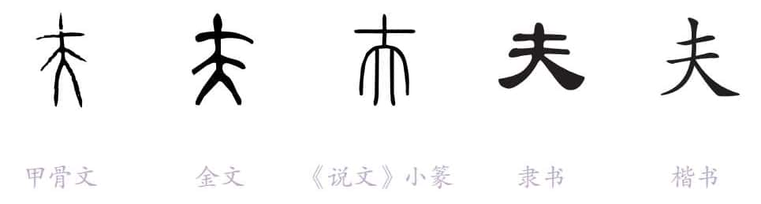

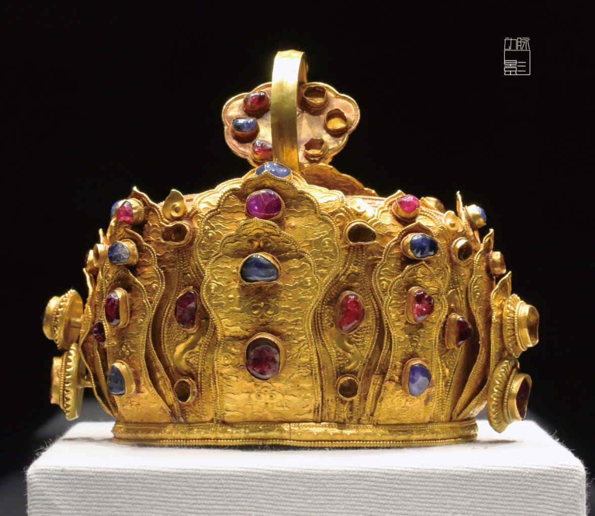 
明/金镶红蓝宝石冠/云南省博物馆藏

“夫”这个字，画的就是少年加冠的样子，在“大”字上加的这一横，象征的就是簪子。这种造字法，就是指事。“事”是想要表达的字义，“指”是表达字义的方法——在象形字上添加一个小标记，“指”明所要表达的“事”物，这就是指事，还真是一种讨巧聪明的造字法！

在古代，冠礼是非常重要的仪式。举行冠礼的时候，除了有规范郑重的仪式，长辈还会对即将成年的少年表达衷心祝福。《仪礼·士冠礼》[2]里记载了周代长辈们的教诲和祝福：“令月吉日，始加元服。弃尔幼志，顺尔成德。寿考惟祺，介尔景福。”这句话意思是：在一个吉月吉日为你戴上礼冠，加冠之后，你就是成年人了。不要再有那些简单幼稚的想法，要努力读书，修身养德，做一个对社会有用的人才。最后，祝你长命百岁，上天也将赐福于你。

你看，古人对冠礼就是这样重视，在“夫”字和冠礼中，寄托了人们对一个个少年的美好祝福，也见证着一个个精彩人生的开始。

### 立 / 站立在大地之上 /

除了“夫”，在“大”字的基础上还可以造出别的汉字，比如“立”和“天”。

先来讲一讲“立”字。现在我们已经看不出来“立”和“大”的关系了，但看了甲骨文就会一目了然。

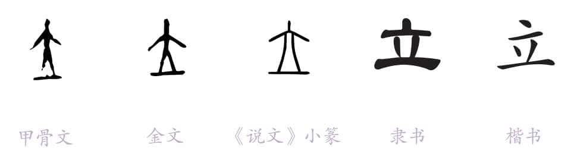

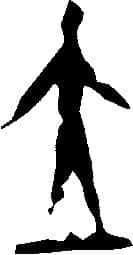是“立”的甲骨文，它的上面是“大”，下面的一横象征着我们脚下的大地。一个人昂首挺胸地站在大地之上，就是“立”。

一个“立”字包含两层含义，身体的直立和人格的独立。

身体直立很重要。对人类而言，直立行走是进化的重要象征，是智慧的开始。根据达尔文的进化论，我们的祖先是来自树上的古猿，他们从四脚爬行慢慢学会直立行走，这一革命性的进化，让人类的双手得以彻底解放，可以打手势、制造工具，创造出人类的璀璨文明。

人格的独立，是一个人堂堂正正地屹立于社会之中、天地之间，是一种精神境界的挺拔。对古人而言，一个人如何保持人格独立并有所树立呢？《论语》给出的答案是“立于礼”——做一个友善待人、温润如玉、彬彬有礼的君子。更为重要的是“己欲立而立人”，不但自己追求人格独立、有所树立，还要去帮助和成就其他人，让大家都能有所树立，这正是孔子的仁爱思想。

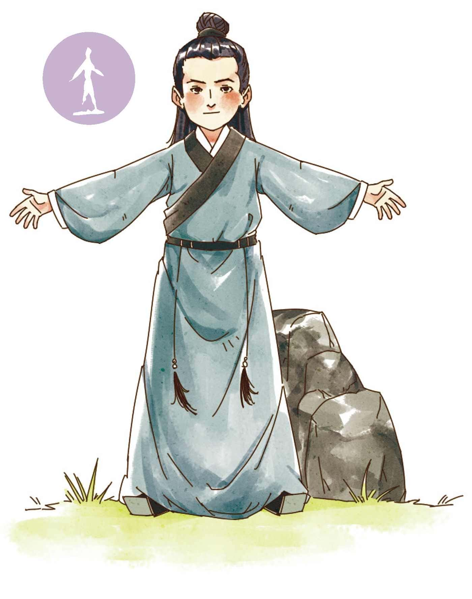

### 天 / 画个大脑袋 /

“天”在我们的生活中是个常用字。“天似穹庐，笼盖四野”，在不同的时空中，我们和祖先抬头仰望的，都是同一片蔚蓝高远的天空。可是，辽阔的“天”和“大”有什么关系呢？

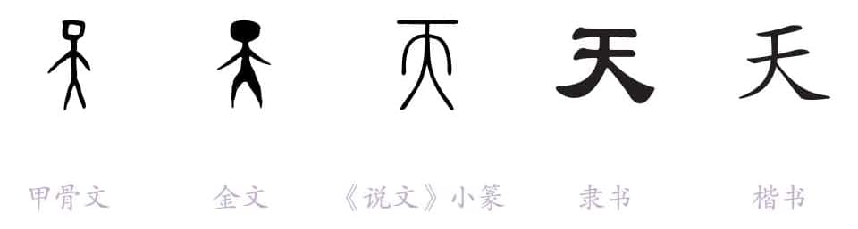

先来看看“天”在甲骨文、金文中的写法。

甲骨文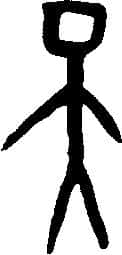和金文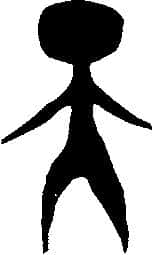画的都是什么呢？它们都画了一个人，和“大”字的古字形很像。之前讲过，“大”是一个伸着两条胳膊、叉着两条腿的人，古人用人的形象来表示大的概念。

那“天”和“大”有没有区别呢？聪明的你一定发现了，甲骨文的“脑袋”特别大——“天”是正面站立的人形，上面着重画了一个大大的脑袋。“天”的本义就是脑袋。

古人为什么用脑袋来表示天呢？

要知道，给高高在上的天空造字太难了。天太大了，如果用象形的办法造字，就要画一个大大的天空，上面还要有太阳、云彩……尽管别人能看出这是天，但这个字形得多复杂！

虽然不好造字，但这却难不倒聪明的古人，他们想出了一个好办法——天是世界上最高的地方，脑袋是人体中最高的部位。那就进行类比，用脑袋来表示天吧。于是，古人画下了来表示“天”。到了后来，随着字形逐渐规范与演变，为了便于书写，的大脑袋简化为一横，下面的“人”也渐渐变成了“大”字。

你可能会问，在我们的语言中，似乎没有用“天”表示脑袋的用法吧？放心，当然有！古代有一本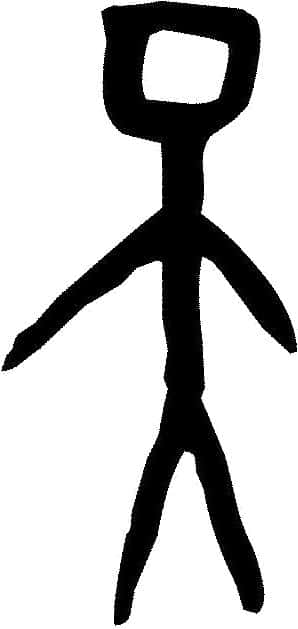书叫《山海经》，记录了很多神话传说，里面有一个关于刑天的故事。

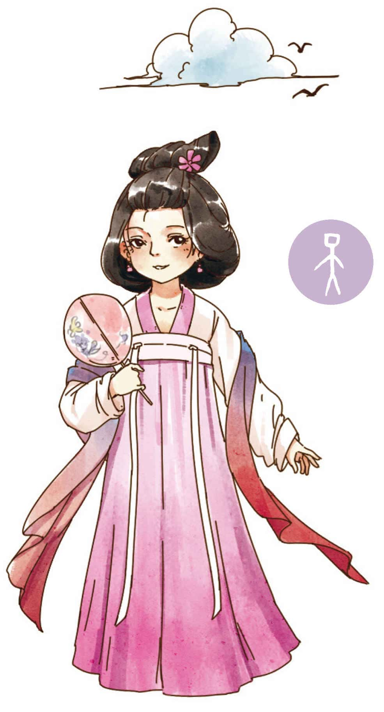

远古时期，有一位很厉害的大将军，叫刑天。他曾和黄帝争夺天下。最终黄帝获胜，并砍下刑天的脑袋。但刑天依旧不服输，没了脑袋，便用两个乳头当眼睛，用肚脐当嘴巴，一手拿着盾牌，一手拿着斧头，继续向黄帝挑战。大诗人陶渊明在《读〈山海经〉》中忍不住赞赏他的斗志：“刑天舞干戚，猛志固常在。”意思是说，刑天挥舞着盾牌和战斧，始终保持着勇猛的斗志。在陶渊明笔下，刑天是位勇猛的战士，是坚毅意志的体现。

但是很少有人琢磨，刑天为什么叫“刑天”？“刑”表示刑罚，有砍杀的意思；“天”最初表示脑袋——“刑天”的意思就是砍头。

不过，用“天”来表示脑袋的用法，现在已经很少使用了。在现代汉语中，“天”主要表示辽阔的天空。天空中，日月星辰起起落落，从不停息。古人观察日月，根据它们的运转规律来把握时间。因此，“天”也可以表示时间，比如“一天”。

除此之外，“天”还可以表示自然。“天然”是自然存在、自然产生的，“天敌”是天生的敌人，“天性”是自然的本性，“天道”是大自然的规律，“天道”又衍生出“天人合一”的哲学思想。什么是“天人合一”呢？天人合一的本质就是人与自然的统一，这是中国文化中一个深刻的思想要义。

* * *

[1]仓颉是黄帝的史官，传说他长着四只眼睛。古人认为是他创造了汉字。

[2]《仪礼》是儒家经典之一，是春秋、战国时期婚、丧、祭、饮、射、朝、聘等各种典礼节仪的汇编。

## 文  
古人文身的秘密

“文”是一个相当美好的字！无论是文人笔下动人的“文章”，还是悠久传承的“文化”，抑或是光辉灿烂的“文明”，都带给我们优美雅致的感觉。在你绞尽脑汁想打磨出华彩文章的时候，恐怕不会想到，“文”的源头居然在我们的身体上。

在古老的汉字中，“文”是一个象形字。你看，甲骨文、金文中的“文”都是一个正面站立的人，胸前画着各式各样的花纹：有的是一撇，有的是一个小叉，还有的是心形。“文”最开始的意思是纹饰、文身。许慎先生在《说文解字》中说：“文，错画也。”“文”是线条交错的图画，也就是纹饰的意思。

古人文身，不仅是为了好看，这也是他们的生活习俗。

战国时期的思想家庄子在《庄子·逍遥游》中讲过一个关于文身的小故事。有个傻乎乎的宋国人到越国去贩卖礼帽。在他看来，君子都要戴冠，若是在越国做这个生意，一定能大赚一笔！可他万万没想到，越国的老百姓都“断发文身”——把头发剪短，在身上绘了文身，压根不需要戴冠。

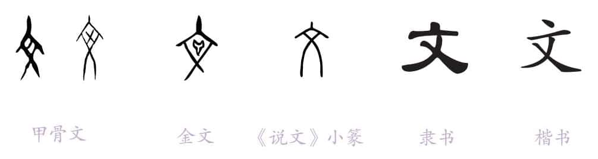

咦，越人为什么要断发文身呢？因为他们在长江江畔谋生，经常下水捕鱼捉蟹。为了更好地适应水下环境，他们便把头发剪短，避免长长的头发缠住水草导致溺亡。除此之外，他们还会在身上画满花纹，用来吓跑凶猛的动物。

渐渐地，“文”由五彩斑斓的文身，引申出了外在的纹饰、装饰之义。后来，“文”加上表示织物的“纟”，便有了“纹”字。这个字最初表示织物上的花纹，后来又引申出纹理、纹路等意思。

花纹是外在的装饰，礼乐是人的外在修养，它们都具有“外在装饰”的特点。因此，“文”在古代也可以指礼乐制度。《论语》中就记载了一个关于这个“文”的有趣的小故事：

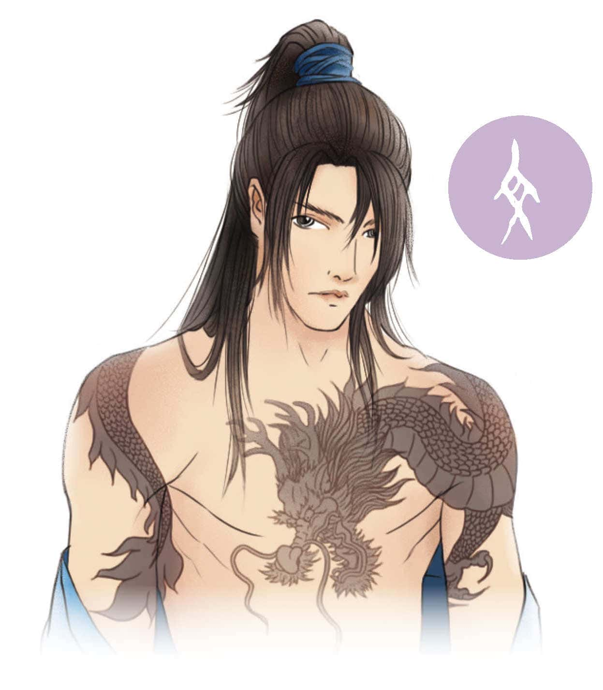

孔子周游列国时，曾经路过一个叫作“匡”的地方。这个地方的老百姓曾被鲁国的权臣阳虎狠狠地欺负过，所以大家都对他恨之入骨！孔子长得特别像阳虎，匡人一看到孔子，又恨又气。“大坏蛋阳虎又来了！不要放过他！”他们拿着刀枪，把孔子和弟子们层层围困起来，无论怎么解释都不听：“别废话！什么孔子？你就是恶人阳虎！”

在困厄之中，孔子没有丝毫沮丧。他说：“文王既没，文不在兹乎？天之将丧斯文也，后死者不得与于斯文也；天之未丧斯文也，匡人其如予何？”这是什么意思呢？孔子说，周文王去世之后，从武王、周公代代相传的“文”（礼乐传统）难道不是在我这儿吗？如果上天要断绝“斯文”[1]，那么我将困死于此，礼乐也要随之断绝；如果上天不想让礼乐断绝，匡人又能把我怎么样呢？”

这个故事体现出孔子对礼乐的传承与担当，体现出他坚定的文化自信。这里的“斯文”指礼乐制度，而我们现在常用“斯文”形容人文雅，用“有辱斯文”形容文化不受尊重，或文人自甘堕落。知道了孔子的故事，再看“斯文”一词，你是否有了更深刻的体悟呢？这个词并非单指行为的文雅，更暗含着厚重的礼乐传统。

孔子重“文”（礼乐制度）。他认为无论是朝廷政事，还是国家邦交，无论是个人的言谈举止，还是国家的规章制度，都要遵守礼乐制度。孔子曾说：“弟子入则孝，出则悌，谨而信，泛爱众，而亲仁。行有余力，则以学文。”弟子，就是少年的意思。一个少年先要学会做人——孝顺父母，尊敬兄长，认真守信，关爱大众，去向那些有仁德的人学习。做到了这些，如果还有余力的话，再去学习礼乐，提高自己“文”的素养。

如今，“文”字表示礼乐的用法已经不常见了。今天的“文”更多指文字、文章、文学。这些含义也是从纹饰、文身之义引申而来的——好文章字句优美、赏心悦目，和纹饰一样，都带有装饰的特点。从文身到礼乐文明，再到优美动人的辞章，“文”的发展演变真是一个有意思的过程。

* * *

[1]在古代，“斯”有代词的用法，相当于“此”“这”。所以，“斯文”的意思是这种礼乐制度。

## 夹·侠·亦  
汉字中的侠客梦

你喜欢看武侠电影吗？侠客们飞檐走壁，在江湖上行侠仗义、打抱不平，真的很帅！有一首歌唱道“曾梦想仗剑走天涯”，你有没有这样的梦想呢？沉浸在侠客梦中的你，有没有想过“侠”这个字的内涵呢？

这一讲，我将为你介绍“侠”字，以及与它相关的“夹”和“亦”。

### 夹 / 把人“夹”在腋下 /

讲“侠”字要先从“夹”字讲起。

在古文字中，“夹”从大，是一个正面站立的人形，两臂张开，一左一右夹着两个人。

这个字看起来很“威猛”。《说文解字》说：“夹，持也。”“夹”是把人牢牢地夹在腋下，一动也不能动，有控制、挟持的意思。《三国演义》中说，东吴之主孙策非常英勇，他有一个如雷贯耳的外号——“小霸王”！有一次孙策提枪上阵，把敌将一把抓过来，夹在腋下回归本阵。这种威风凛凛的英雄气概，正是“夹”的鲜活写照。

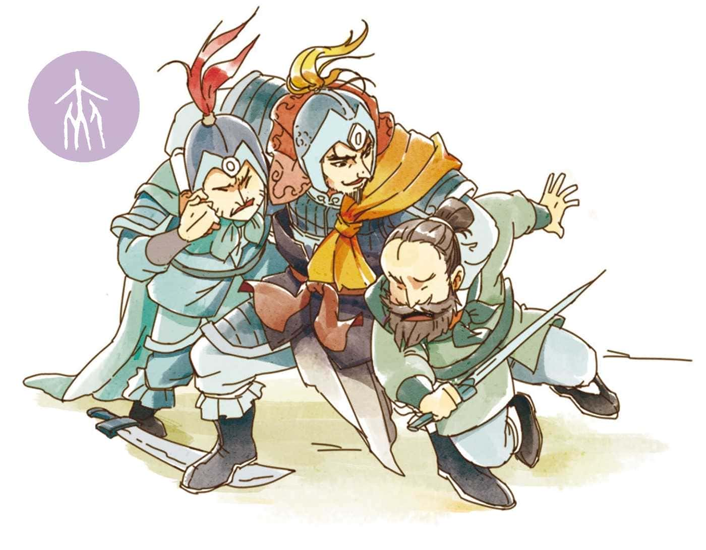

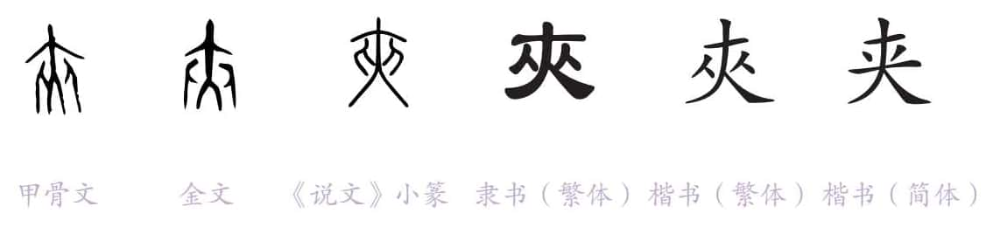

除了牢牢夹住，“夹”还有一个含义。你想要夹住一个东西，必须要在它两边同时用力，因此“夹”也引申出从旁辅佐之义。周朝的开国者周武王去世得很早，他的儿子周成王当时还是个小孩子。危局之际，周公姬旦和太公姜子牙挺身而出，“夹辅成王”，各在一旁辅佐周成王。

### 侠 / 侠客，一定要能罩得住 /

“侠客”的“侠”是个形声字，从人夹声。左边的“人”是形符，右边的“夹”是声符。什么是形声字？形符和声符是什么意思呢？

和象形、会意一样，形声也是古人造字的一种方法。形声字大都可以一分为二，一半是形符，一半是声符。形符表达汉字的字义，声符提示汉字的读音。

比如“侠”字，形符“人”说明这个字和人有关，声符“夹”表示这个字的读音，“夹”是不是和“侠”读起来很像呢？有时候你也会遇到读起来不那么像的字，比如“啸”的声符是“肃”，这是因为“肃”字的发音在时代变迁中发生了变化，不再和“啸”相近了。

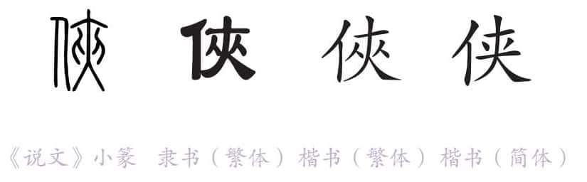

虽然声符只是用来表音，但古人在造“侠”字时，对声符的选择却很巧妙。他们没有选择“甲”“下”“夏”等读音近似的字，而是选择了与侠客的含义更为密切的“夹”字。

什么是“侠”呢？司马迁在《史记》中专门写下《刺客列传》《游侠列传》，记录了一批震撼人心的侠客形象。豫让是“士为知己者死”，为了替智伯报仇，吞炭毁声，用漆毁容；朱家扶弱济贫，不求回报，哪怕自己家无余财，衣服破旧；荆轲则是所谓的“侠之大者，为国为民”，唱着悲壮的“风萧萧兮易水寒，壮士一去兮不复还”，刺杀秦王，身死他乡……侠客便是这么一群侠肝义胆、路见不平、经常“从旁辅佐”别人的壮士与义士，也是能够掌控大局、“罩得住”他人的英雄好汉。这两层含义都与将人罩在自己臂膀下的“夹”字很是贴切——“侠”字以“夹”为声符，实在是一个准确而巧妙的选择。

### 亦 / 本来是腋窝 /

“夹”和人们的腋窝有关，在汉字中，还有一个和腋下关系密切的字，那就是“亦”。

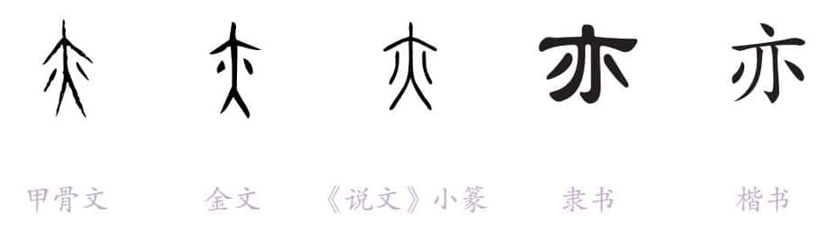

看到这里，你一定会很惊讶：“亦”这个字不是个副词，表示也，用于“人云亦云”和“亦然”的吗？怎么会和人的腋窝有关？别急，我们还是先一起来看看“亦”的古文字吧。

甲骨文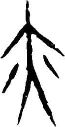是一个正面站立、两臂张开的人，胳膊下面分别有两个小点——这是个指事字，古人用两点标示出腋窝的部位。《说文解字》说：“亦，人之臂亦也。从大，象两亦之形。”这里的“亦”，指的就是腋下。

给腋窝造字是一件很难的事。如果用象形的办法，先画一个胳膊，画出人体躯干，再在腋窝的位置添上几根腋毛……简直太诡异了！象形的思路走不通，指事倒是个好办法。画出人体，再用两个指事符号标出腋窝的位置，又好造，又好写，清晰易懂。可以说，这个字凝聚着古人的造字智慧！

紧接着，另一个问题来了。“亦”表示腋窝的话，现在为什么又有了“也”的含义呢？这就要提到“假借”这种造字法了。假借是借用其他字形，来表示那些不好造的字。古代汉语中，“假”有借的意思，有一个词叫“假手于人”，就是指借用别人的手，来达到自己的目的。

在汉字的发展过程中，古人不仅要给实词造字，也要给虚词造字。虚词就是那些没有具体意义，但在造句时又起到重要语法功能的词，比如连词、介词、副词、量词等等。举个例子：“你吃饭了吗？”“我吃了！”“我也是！”在这个再简单不过的对话中，出现了“了”“吗”“也”三个虚词。

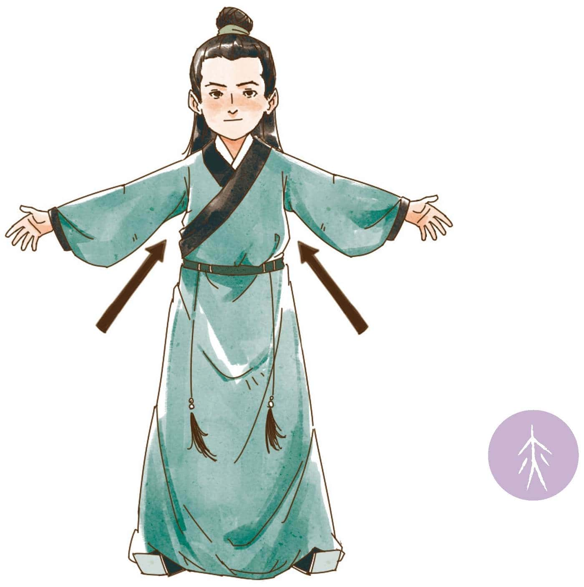

给这样的虚词造字，简直是难上加难！为什么呢？因为我们实在找不到一个形象或实物来表示它们。不信你试试，什么样的字形可以来表示“也”呢？

这个难题可难不倒我们聪明的祖先。他们想出了一个好办法，就是假借，借用一个读音相近的字，来表示不好造字的虚词。汉语中有个副词，读yì，表示也的含义，不好造字。而表示腋下的“亦”字，读音和它很近。干脆，把这个“亦”借过来，表示作为虚词的“yì”！

许慎先生对假借的定义是“本无其字，依声托事”。这句话意思是说，有些词（比如虚词）没有本字，于是就找个声音相近的字，借过来一用！

这种办法解决了虚词造字的难题，却又带来了新的麻烦——同一个字形，既表示腋窝，又表示也，难免会发生混淆。比如说，你大声嚷嚷着“我亦疼”，到底说的是你腋窝疼，还是你也疼呢？

为了避免混淆，古人决定把表示腋窝的本义和表示也的假借义进行分化。给容易造字的意义重新造个字，把不容易造字的意义留下来。这样做是不是有点儿欺负老实人的感觉？没办法，好不容易给虚词找到了一个字，总不能再把它赶出去！于是，随着汉字的分化，“亦”和腋窝没了关系，只用作副词，表示“也”。

至于腋窝，古人为它重新造了一个字——“腋”，左边是肉月旁，作为形符，表示这个字和人体有关；右边是“夜”，用作声符。

## 交·要  
叉腰站立的风姿

“大”张手伸脚，很有气魄。人站着的时候，要随时换换姿势，汉字也是一样，有各种风姿绰约的“站法”。这一讲要讲的“交”和“要”便与站姿有关。

### 交 / 两腿交叉 /

“交”的样子很婀娜。你看它的甲骨文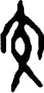，虽然也是正面站立的人形，但两条腿舒舒服服地交叉起来，有一种柔美的感觉。《说文解字》中说：“交，交胫也。从大，象交形。”“胫”是小腿。在“大”的基础上把两腿交叉，就表示“交”的意思。

腿的交叉是“交”，人和人之间的交集也是“交”。“交”也用于“结交”“交往”“交朋友”等词。与朋友交往过程中，最宝贵的品质是什么呢？是守信！

在《论语》中，孔子曾说自己的人生理想之一是“朋友信之”。朋友之间坦荡相对，坚守诚信。孔子的学生子夏也曾说：“与朋友交，言而有信。”另一位学生曾子还留下了一句脍炙人口的名言：“吾日三省吾身：为人谋而不忠乎？与朋友交而不信乎？传不习乎？”“三省”是多次反省。曾子说：“我每天都要反复地问自己：作为臣子，为国君出主意时是不是尽职尽责？作为朋友，和别人打交道时是否诚实守信？作为学生，能不能按时复习老师教给我的知识？”

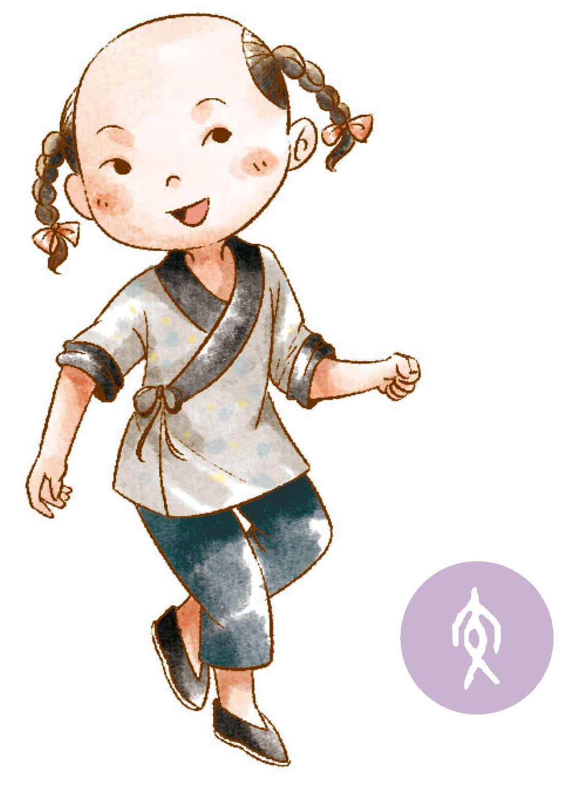

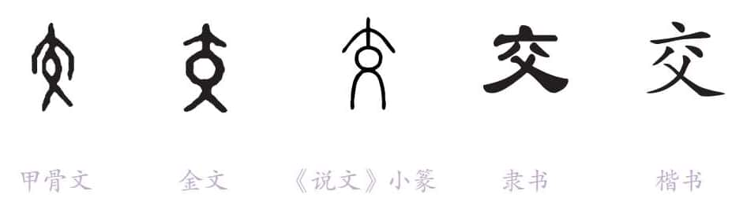

由此可见，在古人看来，朋友交往的关键就是守信！

### 要 / 叉腰站立 /

“要”也是个正面站立的人。你看金文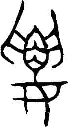、小篆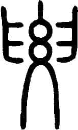，中间都是一个人。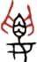、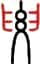两个字形中，红色标记的部分是叉腰的双手，惟妙惟肖地表示出了腰的部位。

《说文解字》说：“要，身中也，象人要自臼之形。”“身中”指身体中部，也就是腰部，“自臼”是两手叉腰——我们将两只小手自然而然地一叉，就能表示腰！

在古书中，“要”常表示腰部，那时候的腰还没有加上肉月旁。比如《墨子》一书中记载“楚灵王好士细要”，其中的“细要”便是“细腰”。春秋时期的楚灵王特别喜欢腰肢纤细的臣子，朝中官员们纷纷迎合，开始减肥。有的人每天只吃一顿饭，导致营养不良，面黄肌瘦。这就是著名的“楚王好细腰，宫中多饿死”的故事。

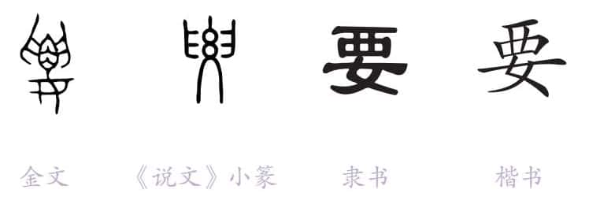

腰在我们的身体中太重要了！转个身，俯下身，都要以腰为枢纽。古代有两种残忍的刑罚——腰斩和砍头。前者是将人拦腰斩断，后者是砍断脖子。古代脖子也被称为“领”，“要”和“领”都是人体最重要的部位，一个都不能少。它们合在一起，就变成了“要领”一词，用来表示要点，事物运转的关键。还有“要害”一词，指险要、关键之处，而把握住别人的要害，并以此胁迫，就是“要挟”。

除此以外，“要”渐渐从名词用为动词，有了把握、掌控之义，并引申出获取的意思。这就是我们今天常用的、读作四声的“要”。随着“要”字表达的含义越来越丰富，使用起来就难免混淆。比如“要缠万贯”这个词，是腰间缠着万贯钱财，还是想要发大财呢？想要避免混淆，怎么办呢？汉字必须分化！

渐渐地，“要”主要用来表示想要的意思。至于腰部的含义，古人就在“要”的旁边添加一个肉月旁，造出了“腰”字。

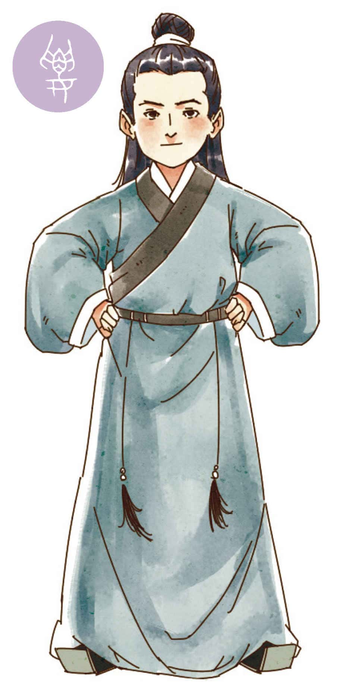

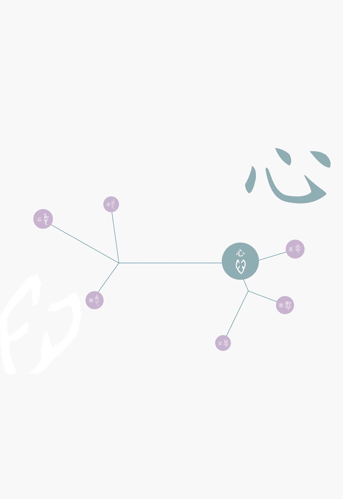

## 心·思  
汉字中的心灵世界

在汉字中，“心”是一个重要的偏旁部首，它或者写成竖心旁，或者写成心字底。以“心”为部首的字，和我们的思想、情感密不可分。不信你看——德、忠、恕、慧，是不同的道德品质；虑、想、念、感，是不同的心理活动；惑、怖、慌，是不同的情绪。

在汉字的世界中，心灵和大脑都是思想的来源。这种看法直接体现在“心”和“思”两个字中。

### 心 / 思想与心灵的源头 /

心在人的胸部，所以有“心胸”一说，古人也会用“心”来指称胸部。在“西施捧心，东施效颦”的典故里，美丽的西施捧的其实不是心，而是心脏所在的胸部。

古人很早便知道心在何处，也知道心为何物。甲骨文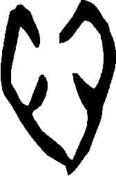是一个标准的象形字，寥寥几笔，把心脏的左右心房、左右心室都区分开来了，真是惟妙惟肖。

《说文解字》中说：“心，人心。……象形。博士说以为火藏。”什么是“火藏”呢？我们的“心”和“火”有什么关系呢？

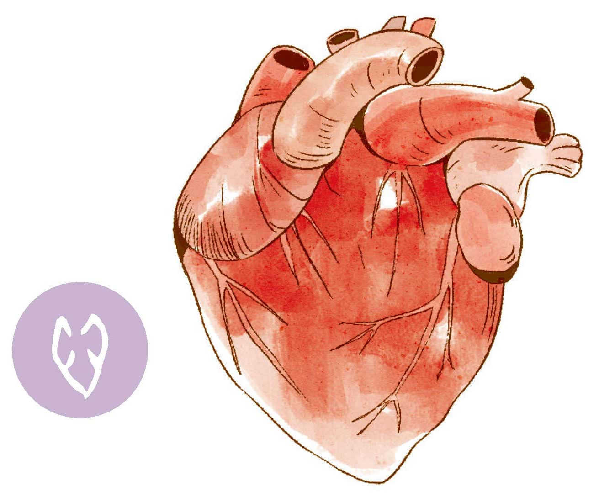

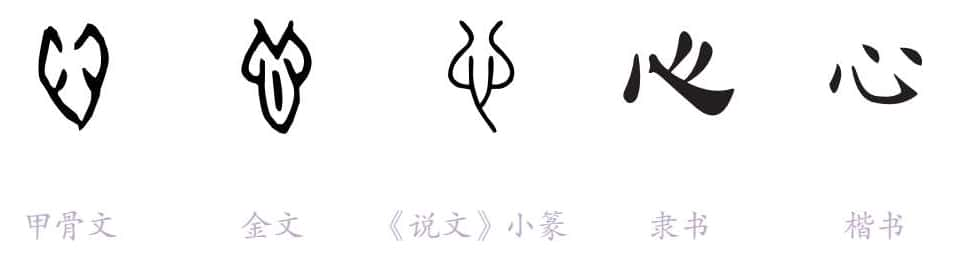

“火藏”的说法很有意思，它与古代的中医文化有关。这里的“藏”就是内脏的“脏”。古人认为，世界由金、木、水、火、土五种元素组成，所有事物均可和五大元素相对应。五脏中，脾脏与土相配，是土藏；肝脏与木相配，是木藏；肺脏与金相配，是金藏；肾脏与水相配，是水藏。至于心脏，与火相配，是火藏。心主于火，中医常说“心火旺盛”——心里面的火烧得太旺，就会舌尖发红，烦躁上火，脾气暴躁。这时候，医生就会推荐你喝清凉的绿豆汤，或是用莲子心煮水喝，降降心火。

在古人眼中，“心”是思想的源头。儒家学派代表人物孟子说：“心之官则思。”心的功能是思考。另一位大儒荀子也认为“心者，形之君也，而神明之主也”，心是身体的主宰，也是思想的主人。这种看法，也体现在我们的语言文字中。所谓“有心人”“善于用心”“心思缜密”，都是善于思考的意思。

### 思 / 思想与头脑 /

在汉语中，“心思”本就是一个词语，二者关系密切。“思”的下面是一个“心”，上面是一个“田”。咦，“思”和田地有什么关系呢？难不成是每天都在思考要买很多田地吗？

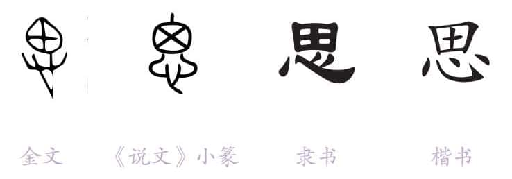

当然不是！在古文字中，“思”的上面其实不是“田”字。金文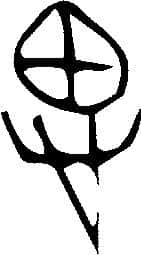和小篆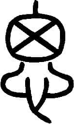的上面是“囟”（xìn）字。《说文解字》说：“囟，头会脑盖也。”“囟”是脑壳的顶端，也就是中医说的“囟会”。婴儿刚刚出生的时候，这个地方骨头没有闭合，还是软软的，会随着脉搏轻轻起伏，就像一扇能够打开的门，因此也叫“囟门”。

“思”从囟从心，是一个典型的会意字。“囟”是脑袋，“心”是心灵，表示我们的思想既与心灵有关，也与头脑有关，这是一种相当全面的观察。

中国古人重视思想，强调一个人要有独立思考的能力。孔子说：“学而不思则罔，思而不学则殆。”无论是跟随老师求学，还是自己独立思考，都不能有所偏废。一个人读书万卷，但仅仅是被动吸收，没有充分反思，就会迷茫疑惑，没有真实的收获；相反，一个人闭门造车、苦思冥想，却不去吸收前人的智慧和成果，便容易跑偏。在孔子看来，只有学习与思考并重，在继承与吸收中不断反思、不断创造，才能温故而知新，成为一个博学智慧的君子。

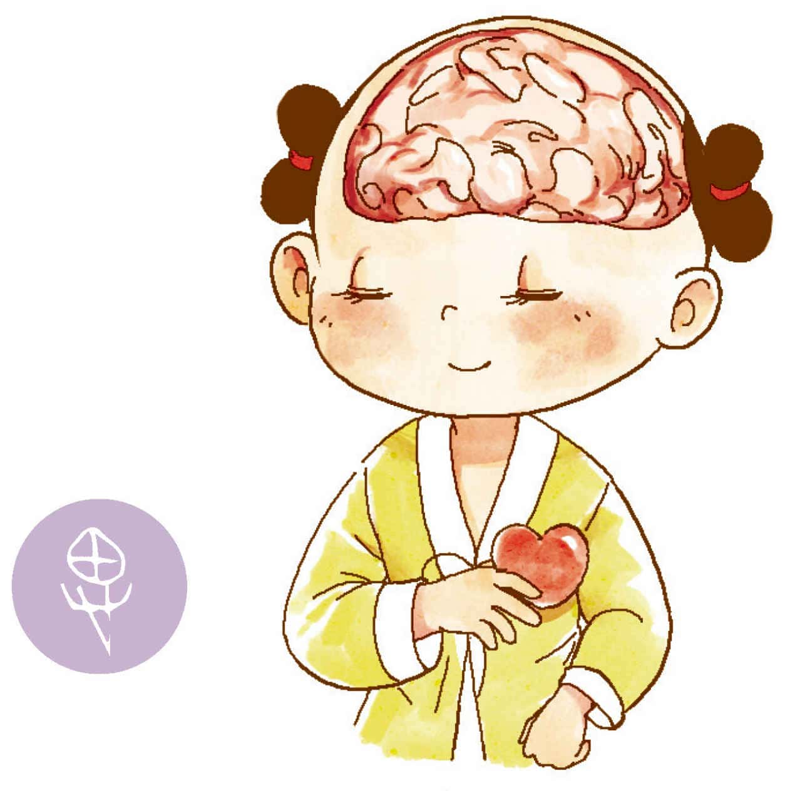

## 忠·恕  
汉字中的仁者情怀

说到孔子，我们心中会油然生出一种敬仰之情。他是中国历史上最伟大的思想家，对中华文化影响深远。他的思想博大精深，其核心要义是什么呢？这个问题的答案，我们可以从孔子和曾子的一场对话中窥见一斑。

有一天，孔子和弟子们围坐在一起谈心。孔子突然感叹道：“吾道一以贯之。”孔子说，我的大道有一个关键的思想贯穿其中。这话不简单，是孔子对自己人生的总结。弟子们都恭恭敬敬地坐着，打算聆听老师的教诲。

这时，曾子郑重地说了一个字：“唯。”这是什么意思呢？在古代，“唯”表示答应，而且是那种特别恳切的答应。曾子说完，孔子含笑点头，师生二人都不再说话，沉浸在静穆的默契之中。

师生二人莫逆于心，其他弟子却一头雾水，可是看孔子不再说话，却也不好意思多问。待孔子起身出门，大家纷纷凑过来问曾子：“老师说的是什么意思呀？”曾子说道：“夫子之道，忠恕而已矣！”

孔子的思想集中于“忠”“恕”二字。这两个字是什么意思呢？我们还是要从汉字入手。

### 忠 / 尽心尽意奉献 /

“忠”是一个形声字，从心中声。也有人把它解释为会意字，认为“中心为忠”，这是来自心中的真实情感。《说文解字》说：“忠，敬也。”所谓“尽心曰忠”，一个人尽到自己的本分，竭尽心力地替别人考虑，尽其所能地奉献自我，这就是“忠”。

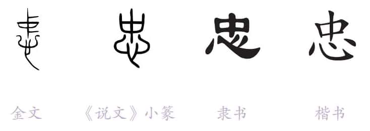

对于“忠”，孔子也有自己的解释。《论语》中，孔子有一句十分经典的话：“己欲立而立人，己欲达而达人。”“忠”不仅是忠诚，更是尽心待人，在充分实现自己生命价值的同时，帮助大家一起做顶天立地的大丈夫，一起进入通达无碍、与天地万物融洽相处的状态，这就是儒家的“忠”。

### 恕 / 设身处地理解 /

说完了“忠”，再看“恕”字。

“恕”也是一个形声字，上面一个“如”，下面一个“心”，从心如声。也有人把“恕”解释为会意字，“如心为恕”——将心比心，这就是“恕”。

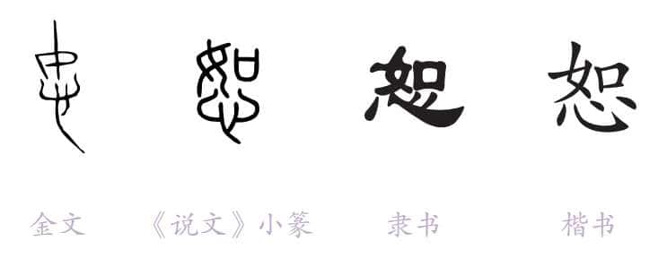

《说文解字》说：“恕，仁也。”“恕”是仁爱的一种表现。

《论语》中讲到，聪明的子贡曾问孔子：“老师，有没有一种可以终身践行的道德品质呢？”孔子想了想，说：“是恕道吧，己所不欲，勿施于人。”什么是“恕”呢？自己讨厌的东西，不要轻易施加给别人。这是一种设身处地的谅解，一种将心比心的尊重。

“忠”和“恕”两个字合起来，就是孔子的仁爱之道——我们要真诚地关心别人，热心地帮助别人，这是忠；我们要将心比心地理解别人、尊重别人，这是恕。努力地追求忠恕，你的心灵与人格一定会不断地丰盈起来。

## 愚·忘·惑  
笨笨的心灵

心灵寄托着我们的思考与情感，但不是所有的“心”都是聪明和智慧的。我们会遗忘，会迷惑，也会傻傻的，很愚蠢……这一讲要分享三个傻傻的字：“愚”“忘”“惑”。

### 愚 / 傻傻的像猴 /

“愚”有傻的意思。“愚”字下面是“心”，一个人笨，一定是心里不清楚。上面的“禺”（yú）对很多人来说是个陌生的字。禺是马猴。你看，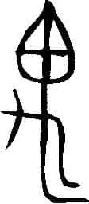是金文中的“禺”，上面像一个猴头，下面伸着一只瘦瘦的爪子，仿佛要抓住什么东西一样。

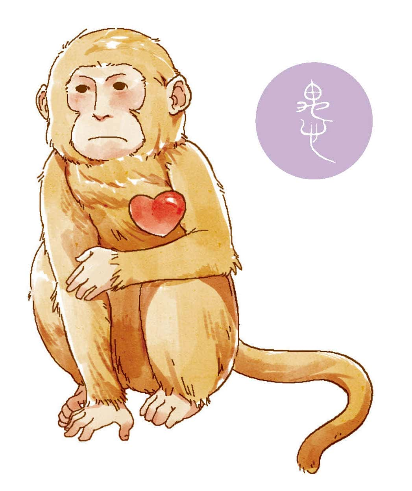

猴子不是很聪明吗？怎么会和“愚蠢”的“愚”有关系呢？在许慎先生看来，“禺，猴属，兽之愚者”。相较聪明的人类，猴子是一种愚笨的动物。所以，一个“禺（猴）”，一个“心”，组合在一起，表示愚笨。

在中国文化中，有很多关于傻猴的故事，比如《庄子》中的“朝三暮四”。

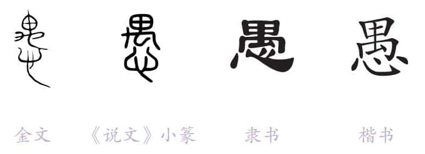

有一个人养了一群小猴子，他跟猴子们说：“以后喂你们的橡子，早上三个，晚上四个，怎么样？”猴子们一听，很生气，纷纷叫嚷道：“太少了！不够吃！不干不干！”

养猴人眼睛一转，又说：“没关系，那咱们改一下：早上四个，晚上三个，怎么样？”猴子们感觉多了一些，都高兴极了……

后来，“朝三暮四”变成了成语，比喻聪明人善于使用手段，愚笨的人不善于辨别事情。再后来，则用来形容反复无常。

“愚”的那种傻不是简单的智商低下，而是有种憨憨厚厚的感觉。比如那位移山的“愚公”，从古至今，人们都赞扬他的坚持和傻劲儿，所以，他名字中的“愚”铁定不是嘲笑智商低的字眼。

要知道，愚笨也不见得总是坏事。说起来，我们提到过的曾子也是一个傻傻的人。孔子对曾子有个很有趣的评价——“鲁”。所谓的“鲁”，就是笨笨的意思。曾子并不灵敏机智，但他肯于实干，把孔子的教导落在实处，最终成为名垂青史的道德君子。

### 忘 / 记忆逃跑了 /

“忘”上面是一个“亡”，下面是一个“心”。“亡”既表示声音，也表示意义。除了“死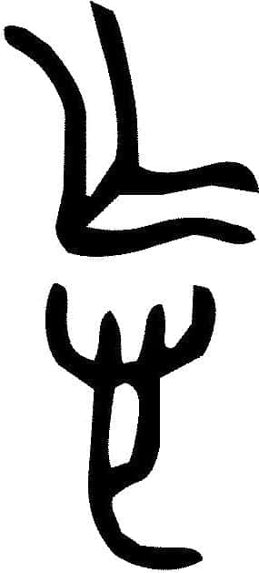亡”，“亡”也有逃跑、逃亡的意思，比如“亡命天涯”“流亡”，还有“亡羊补牢”里的“亡”，都是跑远、跑丢的意思。“忘”也是一样，一段记忆从我们心中溜走了，也就意味着我们忘记了它。

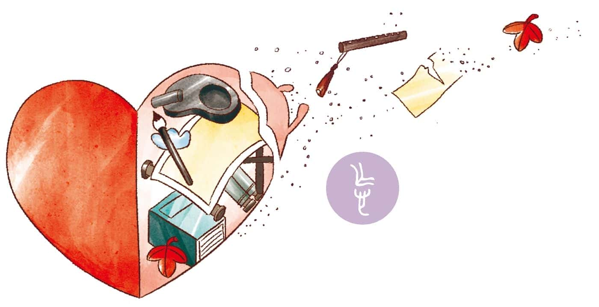

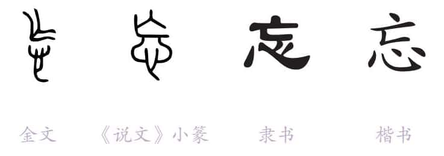

在汉语中，“忘记”的“忘”、“茫然”的“茫”，还有“只是当时已惘然”的“惘”，都是同源的。这几个字有共同的特点，都带有一种心中空荡荡的感觉，仿佛《红楼梦》中说的那样，“落了片白茫茫大地真干净”——什么都忘了，心里可不是干干净净的嘛。

### 惑 / 迷惑与解惑 /

“惑”有迷惑、困惑的意思。这是一个形声字，下面是“心”，意为这是内心的一种状态。上面是“或”，表示“惑”的读音。

古人选择的声符“或”非常巧妙，因为“或”也暗含着“惑”的意味。“或”是或者，一道题或者选A，或者选B；中午或者吃包子，或者吃饺子……处于“或者”的状态，不知道如何选择，也就陷入了迷惑之中。

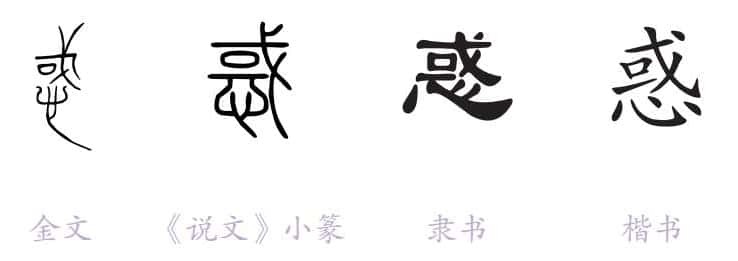

《说文解字》中说：“惑，乱也。”所谓“乱”，就是心乱如麻，不知如何是好。“惑”就是这种难以选择的状态。

想要摆脱困惑，并不是一件容易的事。孔子曾说自己“四十而不惑”，他在四十岁的时候，才能够清晰坚定地做出选择，再也没有什么犹豫和困惑了。

如何做到“不惑”呢？一个重要的方法，就是去向老师学习请教。老师的任务，在于帮学生解开迷惑。唐代大文学家韩愈有一篇著名的《师说》，他说：“师者，所以传道授业解惑也。”老师有三方面的使命，首先是“传道”，把人生中最根本的追求传递给学生；其次是“授业”，把学业与知识教给学生；最后则是“解惑”，帮助学生解开人生中的各种迷惑。

在古人看来，一个人只有通过不断地读书学习、深入思索，养成独立的判断力，才能摆脱困惑。

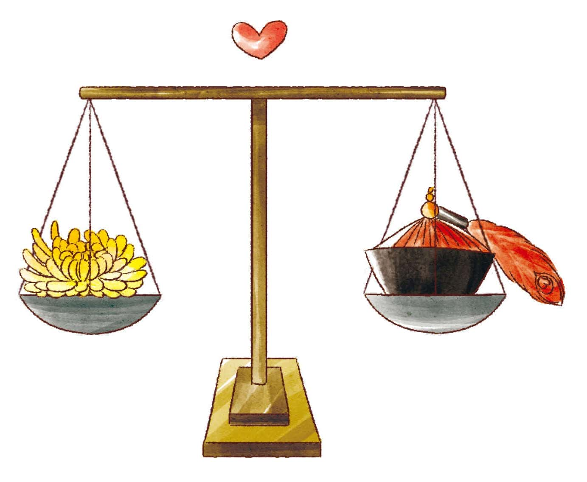

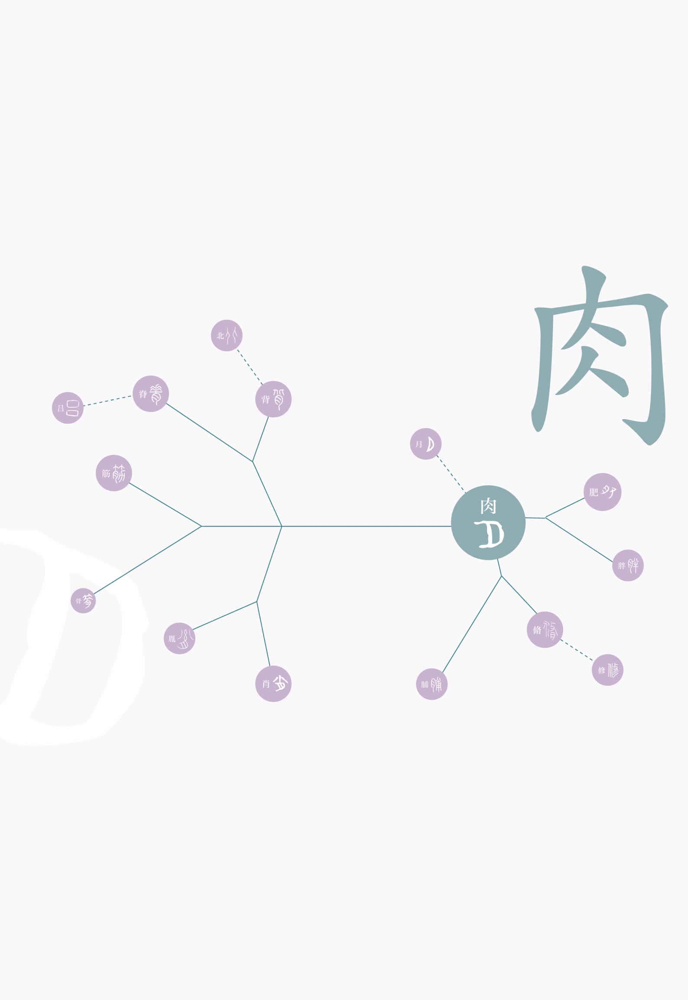

## 肉·骨·筋  
生命的物质基础

在汉字里，“肉”是个很重要的部首。大多数人虽然经常看到它、使用它，却常常认不出它。若将目光移到自己身上，你会发现在“骨、筋、胖、肥、肾、背、肝、脏”等与身体有关的字里，都有“肉”字。这一讲，我会为你讲解“肉”和与之相连的“骨”和“筋”。

### 肉 / 肉月旁不是“月” /

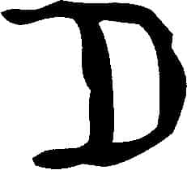是甲骨文中的“肉”，就是肥嘟嘟的一块肉。在《说文》小篆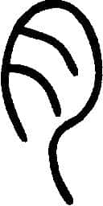中，外面是肉的轮廓，里面还画出了肉的肌理，就像好吃的雪花牛排一样。咦，这样的“肉”，有没有觉得有些面熟？

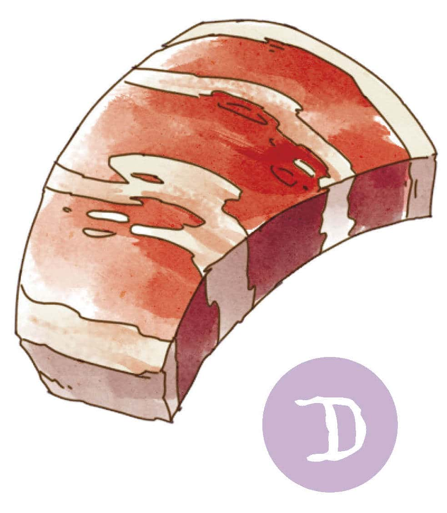

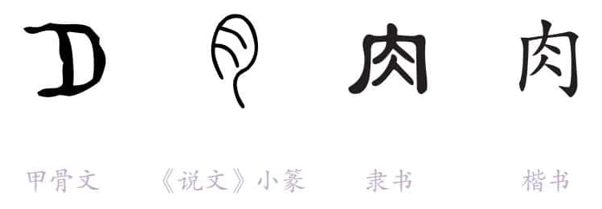

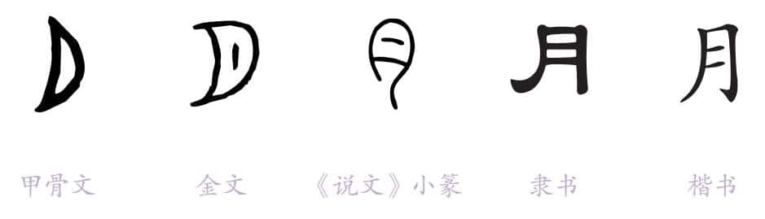

没错，它和“月亮”的“月”的小篆字形看上去很像。作为偏旁部首的“肉”，和“月”越写越像，最终变成了“肝”“脏”等字里的肉月旁。因此，当你看到“腿”“脚”等字时，不要疑惑字里为何有“月”，要知道，这些字里的可都是“肉”呀。就拿常用的“肥”“胖”二字来说吧，它们都表示“肉”多，而不是说你胖得像个月亮。

“肉”有沉甸甸的质感，且味道鲜美。因此，我们把实心的、好吃的东西也称为“肉”，比如水果鲜美可口的“果肉”。另外，古代玉璧中间的窟窿称为“好”（在古代“好”与“孔”音近），窟窿旁边实实在在的玉石，也称为“肉”。

肉虽然好，但如果量特别多，又会带来缓慢蠕动的感觉。因此，“肉”也指那种慢慢吞吞、磨磨蹭蹭的状态。比如“快点儿，别再肉（磨叽）了！”

### 骨 / 身体的主心骨 /

最早的“骨”字出现在战国文字中。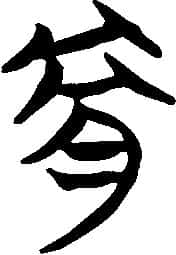上面是骨架的象形，下面是“肉”字——骨肉之间，不可分离。到了小篆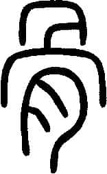，字形的上面被解释为头骨的象形，下面还是“肉”。

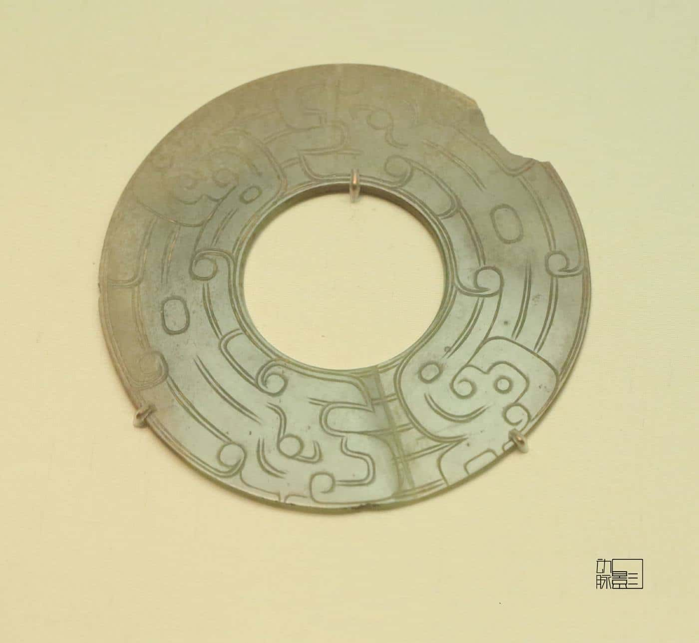 
西周/人龙纹玉璧/中国国家博物馆藏

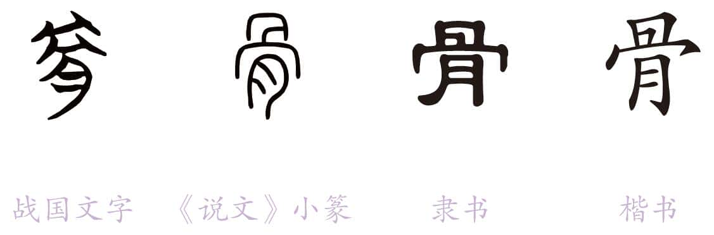

《说文解字》说：“骨，肉之核也。”“核”有果核的意思。什么是骨头呢？骨头就像被肉包裹起来的身体之核，许慎先生的这个解释还真是生动！

古人通过对自身的理解来描述和记录世界。于是，和骨头一样起支撑、主干作用的事物，便被命名为“骨”：建筑中能支撑造型、固定框架的，叫作“龙骨”；扇子上一根根支撑起扇面的，叫作“扇骨”；能支撑起事业的人叫“骨干”；能为大家拿主意的人叫“主心骨”。

至于像骨头一样刚强不屈、有担当的人，便是“有骨气”“有风骨”。用孟子的话来说，真正的大丈夫要“富贵不能淫，贫贱不能移，威武不能屈”。意思是，一个人荣华富贵时，要始终有所节制，不做过分的事情；贫穷卑贱时，不随便改变自己的志向；面对强权时，更要刚直不屈——孟子笔下的大丈夫，正是中华民族“骨气”的写照。

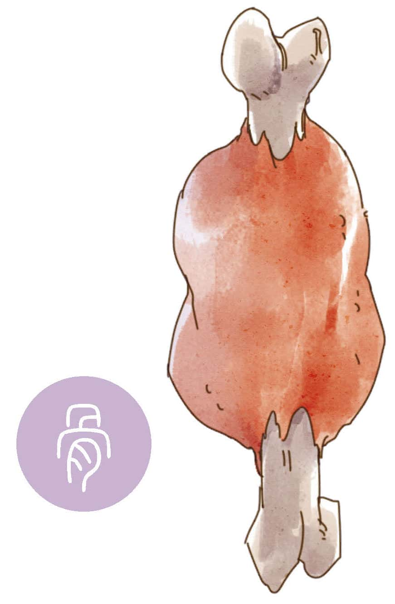

### 筋 / 有力气的筋 /

骨肉之间，还有“筋”。

“筋”这个字由三部分组成——“竹”“肉”“力”。“肉”说明“筋”属于肉类，“竹”和“力”又是什么意思呢？

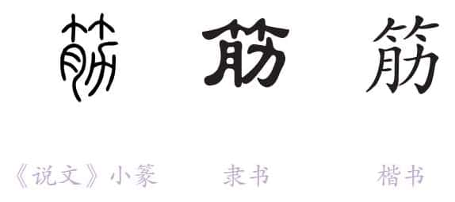

在大自然的各种植物中，竹子纤维丰富，极有韧性。许慎先生说：“竹，物之多筋者。”竹子的韧劲和筋非常相似，因此“筋”字有竹字头。“力”呢？不难理解，说明筋是有弹力的。

《说文解字》说：“筋，肉之力也。”在古人看来，筋是我们身上最有力气的部位。正因为筋富有弹性，古人便用它来制造弓弦。有一部古书叫《淮南子》，编者是发明了豆腐的淮南王刘安，书中写道：“北方之美者，有幽都之筋角焉。”在这里，“筋”就是牛羊马的蹄筋，它们是制作良弓的好材料。

## 背·脊  
与后背有关的汉字

这一讲要分享的“背”“脊”都和后背有关。两个字均为上下结构，上面一个是“北”，一个像“火”多了两点。它们造字的思路是什么呢？

### 背 / “背”来自“北” /

“背”是个常用字，下面的“肉”字说明我们的后背和肌肉有关，但后背和“北”又有什么关系呢？别急，答案还要从“北”字讲起。

“北”的甲骨文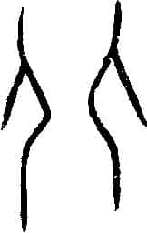，左边是一个人，右边也是一个人，两个人背靠着背。许慎先生说“北”字“从二人相背”，意思是两个人好像闹了别扭，背对背，脸朝向相反的方向。

“北”是后背的本字，有脊背、后背的意思。它在古代有个很特殊的用法“败北”。在战场上厮杀，如果打了败仗，转身逃跑，便会把后背暴露给敌人。因此，古人把战败称为“败北”。看到这里，你大概就明白了，“败北”只与后背有关，无关东西南北。

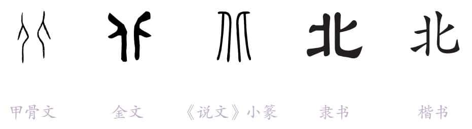

“北”是后背对人，那它为什么又可以指北方呢？

这其实与中国的气候有关。中国位于北半球，南方温暖，北方寒冷，古人的建筑一般都“坐北朝南”，面向南方，背朝北方，故宫里皇帝居住的宫殿更是如此。北方是房屋“后背”朝向的方向，因此，“北”也有北方的含义。

现在，“北”已经了有两种含义：一是表示背，还用于“败北”；二是表示北方。同一个“北”字，含义差别如此之大，为了不混淆，古人决定给“北”增加一个形符——肉月旁，造出了“背”字，专门用于“脊背”“手背”等词。当一个人离开时，后背朝向他人，所以“背”又引申出背叛、背离、背对之义，我们课堂上要“背书”，其实就是背对着书，不看书背诵。

至于“北”，则专门用来指方向了。

### 脊 / 挺立的脊梁 /

《说文解字》中说：“脊，背吕也。”你可能会问，“吕”不是一个姓氏吗？秦国宰相叫吕不韦，“三国第一猛将”叫吕布。“吕”和脊背有什么关系呢？看了古文字你就知道了！

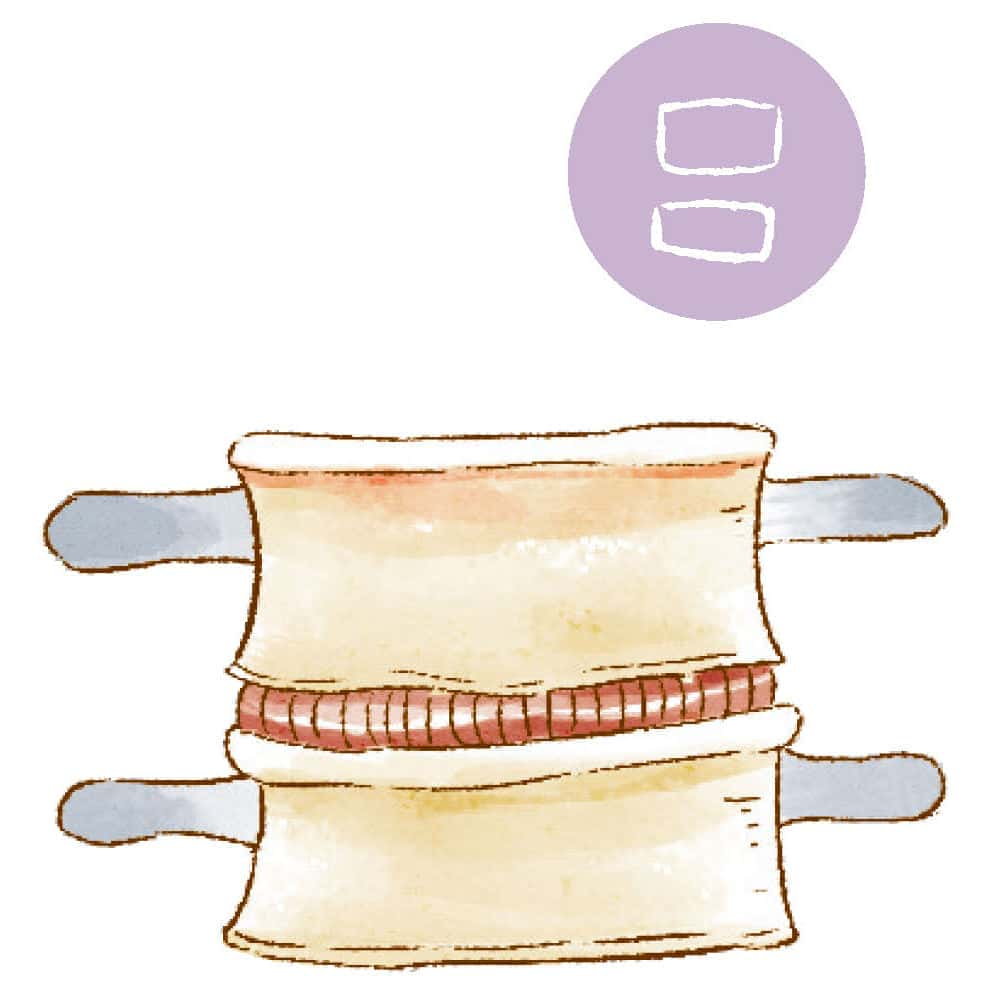

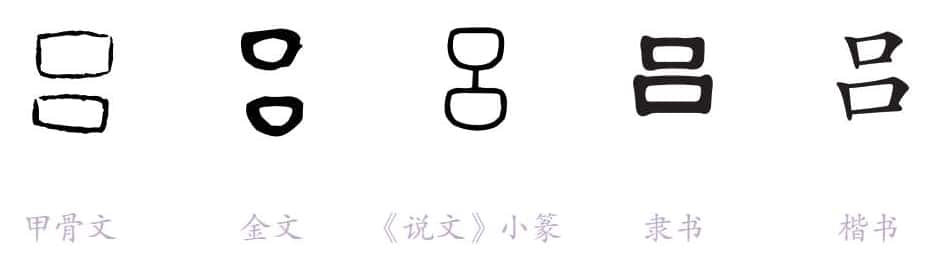

甲骨文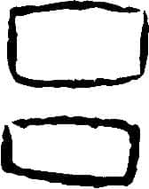和金文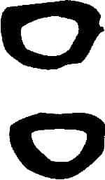是上下两个小方块，和今天的“吕”字没有什么区别。但在小篆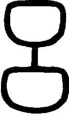中，有了一处小小的不同——两个小方块之间，多了一个小竖。在古代，“吕”指我们连在一起的脊梁骨，“吕”字里的小方块不是“口”，而是脊椎骨。

你吃过糖醋里脊吗？糖醋是这道菜的做法，里脊是肉的部位。里脊其实本叫“吕脊”，指脊柱两边的肉。但因为“里”和“吕”发音相近，所以人们才误读成了“里脊”。不过，现在“吕”只用于姓氏，不再具备脊梁骨的含义。

让我们回到“脊”字。许慎认为“脊”是“背吕”，即人或动物脊梁的骨架。你看金文中的“脊”字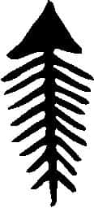像不像一条鱼的骨架？

到了小篆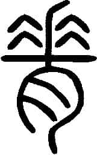，下面的“肉”字表示“脊”和人体相关，上面是个象形字符，中间一竖象征脊柱，旁边四道象征肋骨。摸摸自己的后背，你能找到古人描画的这几笔吗？

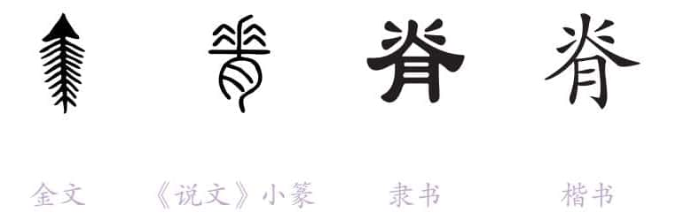

在中国古代武术中，脊柱被称为“大龙”——脊柱就像一条龙一样柔韧有力，支撑起整个身躯。在盖房子的时候，大梁和柱子都是屋子的脊柱，没有了它们，屋子就会塌掉。因此，“脊”可以组成形象的“脊梁”“脊柱”等词。

坚硬的脊梁可以撑起一个人，一个个“骨头硬”的人可以支撑起国家的命运。因此，我们把鲁迅先生这样有骨气的人称为“民族的脊梁”，说他是支撑中华民族的精神力量。

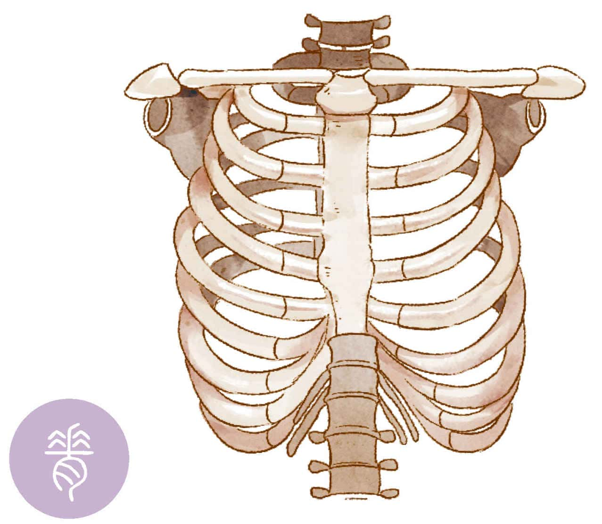

## 胖·肥  
让人难堪的小肉肉

说到肉，除了瘦瘦的里脊，我们还能想到胖乎乎的“肥”和“胖”。这两个字听上去就沉甸甸的。

### 胖 / “胖”字并不胖 /

我们不喜欢胖，可“胖”字最早的含义还真的不是胖。

“胖”左边是“肉”，右边是“半”。它最开始是什么意思呢？许慎先生有个说法：“胖，半体肉也。”所谓的“半体肉”与古代祭祀有关。古代祭祀的时候，要把牛、羊、猪等牺牲[1]从中间剖开，一分两半，其中的一半就叫“半体肉”。这时的“胖”字，读作pán。

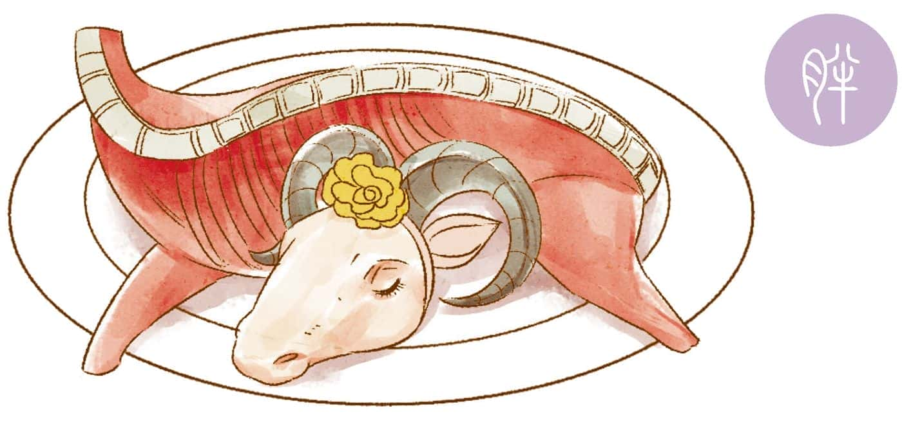

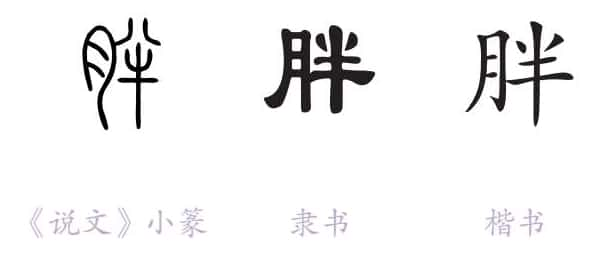

半个猪牛羊的分量可不轻！因此，“胖”慢慢引申出肥胖的意思，读作páng。

人胖了，喜欢悠闲自在地往椅子上一摊，舒展开来。于是，“胖”也有了安泰舒适的意思，这时“胖”读作pán。这个用法可见于成语“心广体胖（pán）”。

“心广体胖”出自《大学》：“富润屋，德润身，心广体胖，故君子必诚其意。”这句话的意思是，有了财富，你能把屋子装扮得金碧辉煌；有了美好的品德，便能提高气质修养；一个人心情舒畅，体貌安详，更能有一种洒脱舒展的状态。因此，“心广体胖”可不是说一个人心胸开阔了就会变成个大胖子，而是说，生命的自在舒适来源于心灵的真诚无伪。

### 肥 / 拿一块肉 /

“肥”“胖”二字的意思乍一看差不多，其实还是有所区别的。

许慎先生告诉我们：“肥，多肉也。”“肥”就是肉很多。你看战国时期的“肥”字，左边是一块肉，右边的“又”是手的意思，这个字表示手里拿着一块肥肉。后来，“又”在发展演化中越写越像“巴”字，于是就有了“肥”字。

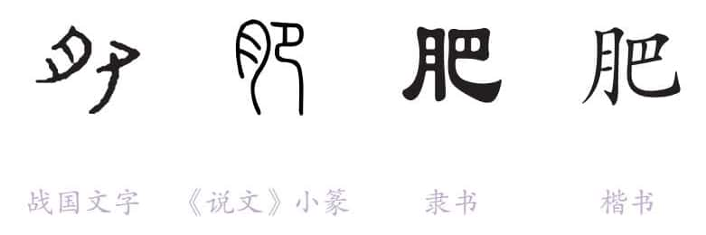

“肥”不仅可以指人，也能形容动物肉质丰满。《论语》中说：“乘肥马，衣轻裘。”“肥马”指强壮的马。张志和的《渔歌子》里“西塞山前白鹭飞，桃花流水鳜（guì）鱼肥”，说的是初春的鳜鱼囤积了很多脂肪，异常肥美可口。

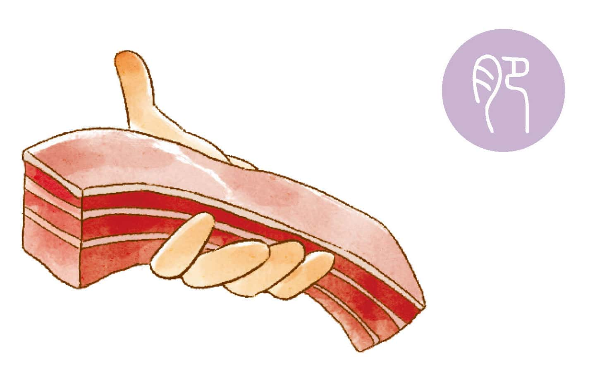

* * *

[1]古代祭祀用的猪牛羊等牲畜，统称为牺牲。

## 脩·脯  
孔子的学费

和“肉”有关的字，除了有表示人体各个部位的，还有表示各种香喷喷的肉制品的。在这一讲，我将为你介绍“脩”（xiū）和“脯”二字，它们指古代的腊肉，都和孔夫子有很深的渊源。咦，孔子为什么会和腊肉有关呢？这还要从他的平民教育讲起。

### 脩 / 孔子的学费 /

现在，随着义务教育的普及，孩子们都可以在亮堂的教室里上学读书。可你知不知道，在以前，知识是多么奢侈的东西。2018年，中国的文盲率为4.9%，而在新中国建立之初，文盲率可是达到了80%，高得吓人。对于孔子时代的孩子们，上学则更是不易！

孔子生活在两千多年前的春秋战国。那时候，教育和知识垄断在贵族手中。天子和诸侯设立“国学”，中小贵族设立“乡学”。但这些都属于官学，只有贵族子弟才享有在官学中接受教育的机会，普通老百姓家的孩子可没资格学习文化，想要学习，要低三下四地讨好贵族才行。

孔子三岁时，他的父亲便去世了。他和妈妈相依为命，日子清苦，求学自然不易。孔子是一个心胸宽广、富有仁爱之心的人。他学成之后，不忍心看到其他读书人的求学之路像自己一样艰难。他一直在想：“我要想个办法，让普通百姓都能读书！”

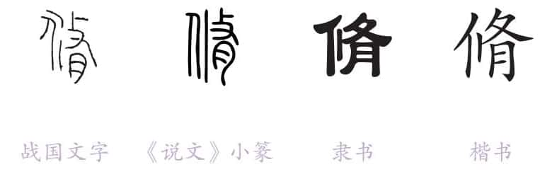

于是，在官学之外，孔子开办私学，进行平民教育。他有一句非常著名的话——“有教无类”，不管一个人出身怎样，我都可以去教育他。不过，做孔子的学生也是有条件的。在《论语》中，孔子这样说明了自己的“学费”：“自行束脩以上，吾未尝无诲焉。”在这里，“诲”是教诲的意思，“束”是一捆，也就是十条。只要有人送我十条腊肉，我就一定会教导他。十条腊肉是极薄的礼物，可见孔子办学不在礼之薄厚，也不分人之贫富贵贱，只要诚心好学，他都会一视同仁，乐意施教。这便是“有教无类”的精神。

自孔子之后，“束脩”专指送给老师的见面礼，成了学费的代称。在《红楼梦》第九回里，就有“白送些束脩礼物与贾代儒（贾府义学的老师）”的说法。

“脩”是一条条腊肉。腊肉细长，因此“脩”又引申出修长的意思。古人形容一个人高挑有型，用的便是从肉的“脩”。战国时，齐国有位大臣叫邹忌。他身材高大，器宇不凡，《战国策》里说他“脩八尺有余”，就好像我们今天说的“堂堂男子汉”一样！

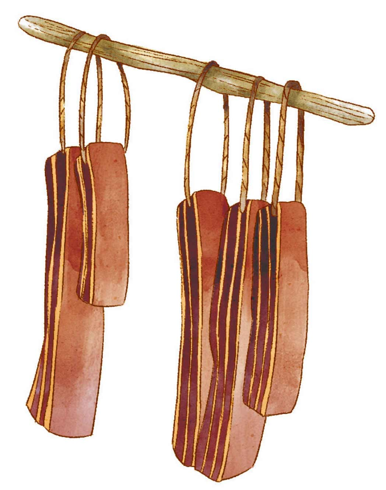

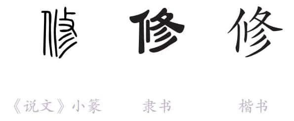

“脩”的简体字是“修”。你可能会疑惑，为什么古书中不写作“修八尺有余”呢？

要知道，在古代“脩”和“修”是两个不同的字。《说文解字》说：“修，饰也。从彡，攸（yōu）声。”“修”是一个典型的形声字，“彡”是形符，表示装饰的花纹。“修”的本义是刷，引申出修饰、修整、修理的含义。“脩”则是一个从肉攸声的形声字，“肉”是形符，说明它与腊肉密不可分。“脩”才是“修长”的“修”的本字。

后来，“脩”不再常用，人们将它修长的含义赋予了“修”，“修”就成了“脩”的简化字。

说到“脩”与“修”，还有一件很好玩的事。

宋代有一位大文学家叫欧阳修，在繁体字里，他的名字是“欧阳修”还是“欧阳脩”呢？猜猜看！

其实，他本叫“欧阳脩”。古人的名和字的意义多有关联，欧阳修字永叔，“永”有长的意思，和“脩”之义相通。此外，欧阳修自己的墨宝中，有“脩再拜”的落款。他的朋友苏东坡抄写的《醉翁亭记》里，写的也是“庐陵欧阳脩”。

所以，这位大文学家的本名是“欧阳脩”，而不是“欧阳修”——是“欧阳腊肉”，而不是“欧阳刷刷”。

### 脯 / 束脩到底有多长？ /

再回到孔子学费的问题，古代的束脩到底有多长呢？

这个问题实在找不到直接的答案。到目前为止，还没有出土过孔子时期的腊肉，古书里也没有直接记载。不过，我们可以从古代肉类加工过程中大胆推测一下。

古人没有冰箱，为了不让肉腐坏，就要把鲜肉加工成肉干，便于保存。首先，切出一块方方正正的肉，在上面抹上盐水、姜水入味。再用一个小锤子反复敲打，把肉砸实。打完再拿去晒干，这样反反复复，一大块肉就不断缩水，变成一小块方正的肉干，这就是“脯”。

许慎先生说：“脯，干肉也。”这是一个从肉甫声的形声字。我们今天吃的猪肉脯，便是一小块方方正正的肉干。同理，把水果制成干，叫果脯。

在脯的基础上进一步加工，将方正的脯切成条状，继续刷盐水和敲打，最后的成品就是“脩”。《说文解字》说：“脩，脯也。”

由此可知，脩的长度一定小于脯。在古书中，我们能知道脯的长度。东汉大儒郑玄给《仪礼》做的注释中说，脯的长度是一尺二寸！

一尺二寸是多少呢？古代的长度单位和今天不同，先秦时的一尺大概有23厘米。一尺二寸便是27厘米左右，这就是脯的长度，脩跟它应该差不多。

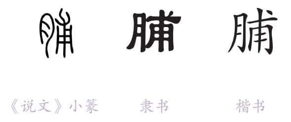

27厘米左右的小肉条，无论在今天还是先秦，都是非常微薄的礼物。孔子收取的束脩，不过是学生向老师表达敬意的象征。学生把束脩捧在手里，恭恭敬敬地递给老师，这个礼节本身的意义已远远超过了十条肉干的价值。

孔子怀揣仁爱之心，真心实意地推行平民教育，引来四面八方的年轻人赶来拜师，这就是《论语》中说的“有朋自远方来”。只要十根干肉条，就可以跟随孔子这样的圣人学习，还有颜回、子贡、子路这样的同窗好友，这样的学费，谁不愿意交呢？

## 肖·胤  
延续不息的血脉传承

在汉字的世界里，“肉”不仅是胸腹腿脚、五脏六腑、盘中美味……它还是生命和血脉的象征。这个含义主要体现在“肖”和“胤”（yìn）两个字中。

### 肖 / 什么是“不肖子孙”？ /

古人重孝。那些品性不端、不能继承先辈事业的后代，常被称为“不肖子孙”。这里的“肖”是什么意思呢？“不肖子孙”是没有肖像的子孙吗？

在古代，“肖”和“孝”可以通用，“不孝”也写作“不肖”。这不仅是因为两个字读音相近。“肖”的字形从古到今一脉相承，上面是“小”，下面是“肉”，合起来就是“一小块肉”。这是什么意思呢？

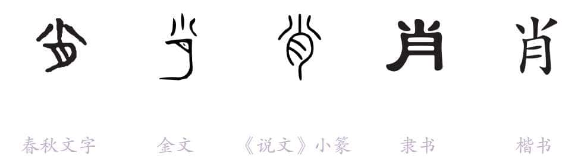

许慎先生说：“肖，骨肉相似也。从肉，小声。不似其先，故曰不肖也。”孩子是父母的血肉，继承了父母的基因，容貌上便和父母有相似之处。因此，“肖”有相似、相像的意思。和自己很像的画像叫“肖像”，模仿得很像叫“惟妙惟肖”。

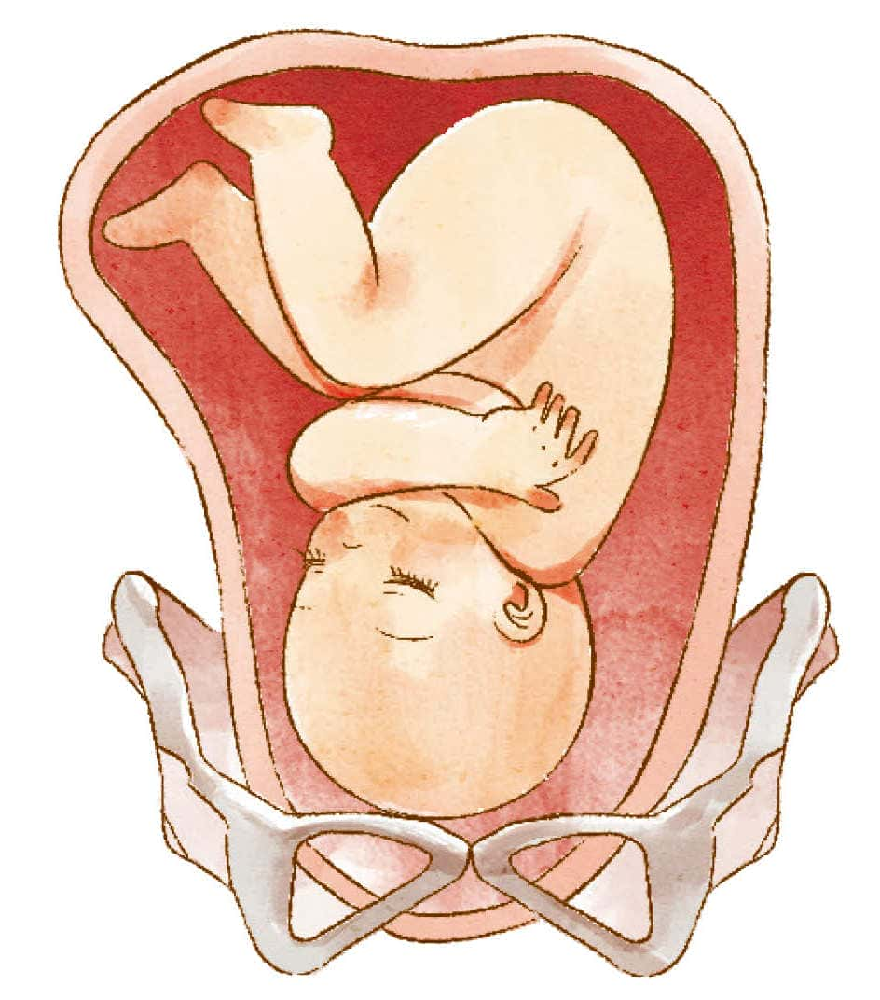

子女继承父母的基因，延续他们的生命，也要继承他们的品德。古人注重家风传承，孔子就说过：“三年无改于父之道，可谓孝矣。”一个孝顺的人，不能违背父母的“道”，即便父母去世，也要保持好家族的优良传统。相反，如果一个人违背了代代相传的家风与品德，那就是“不肖”。

### 胤 / 血脉的绵延 /

在汉字中，和血脉有关的，还有一个“胤”字。这个字不常见，但很有意思。

你看“胤”的金文字形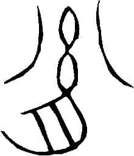，下面是“肉”，上边是“幺”，“幺”在“八”的中间。“八”在古代有分的意思，“分开”的“分”字上也有“八”。“肉”象征着生命、血脉。至于“幺”，则是一团丝线的象形，表示代代相传。许慎先生说：“胤，子孙相承续也。”“胤”象征的是家族血脉的传承不息。所以，子孙也叫“后胤”，指延续血脉的人。

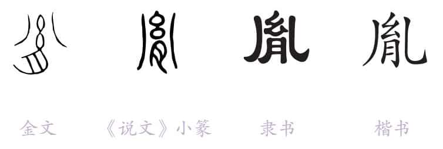

虽然“胤”是个生僻字，我们现在很少使用，但在古代的人名中却时常可见。历史上有位大名鼎鼎的皇帝叫胤禛。你知道他是谁吗？

对，他就是清代的雍正皇帝！他是康熙的儿子，乾隆的爸爸。他和兄弟们的名字里都有一个“胤”字，表示子孙绵延。至于“禛”，则表示做人真诚就能受到上天保佑。

雍正皇帝的名字具有福气绵延不绝、为人真诚、被上天眷顾保佑的内涵。康熙皇帝真是取了个好名字！

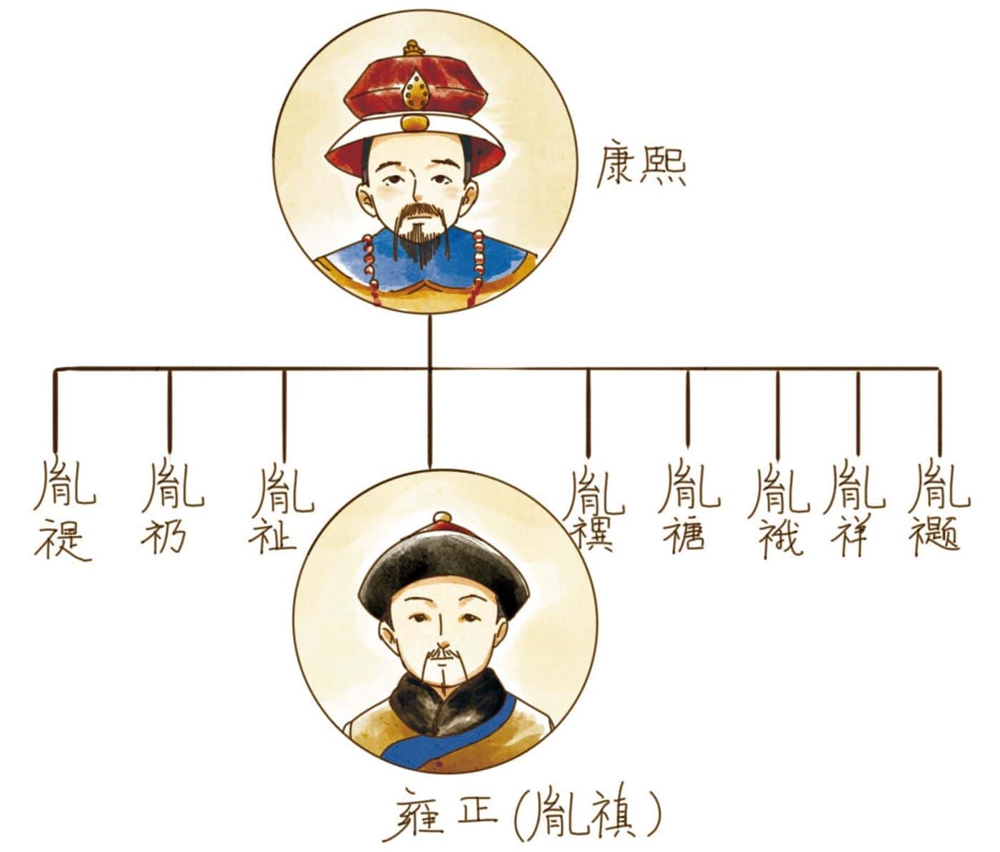

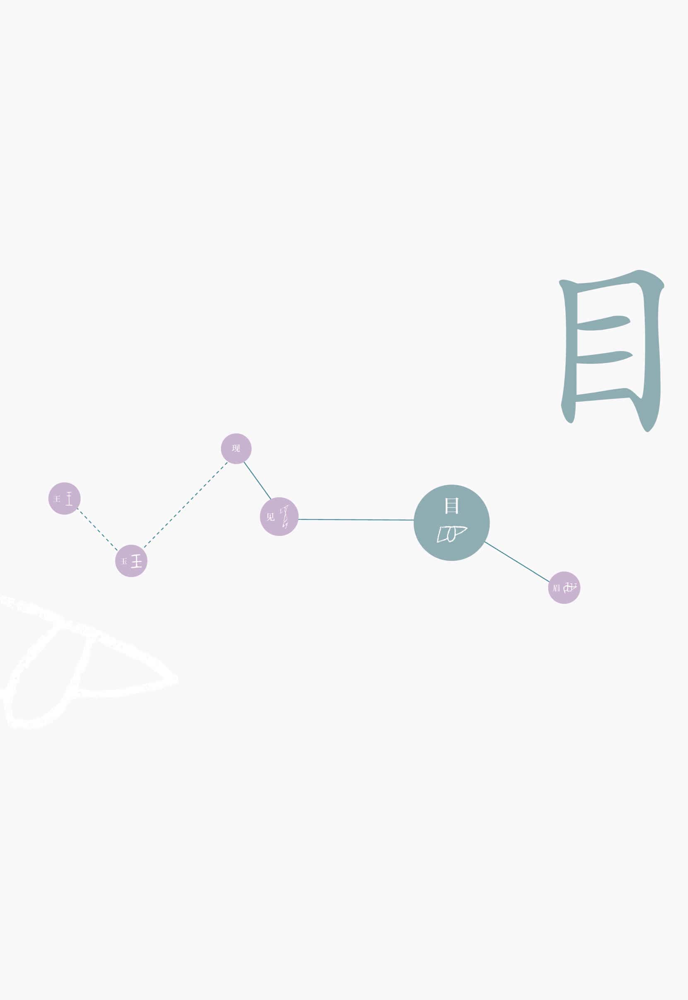

## 目·见·现  
眼睛的光彩

眼睛是心灵的窗户。无论是渴盼的目光，温柔的眼神，还是低沉如水的眼眸，都蕴含着心灵深处的声音。

汉字的世界中，也有一双双动人的大眼睛。它们又展现出了怎样的面貌呢？在这一讲，我将为你介绍三个和眼睛有关的汉字——“目”“见”和“现”。

### 目 / 古人清澈的目光 /

“目”是一个标准的象形字，在甲骨文中就已经出现。你看，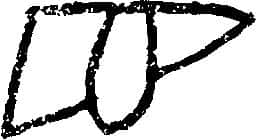是古人用刀在龟甲上刻下的一只大眼睛，眼眶分明，眼珠大大的，仿佛正一动不动地凝视着你。到了金文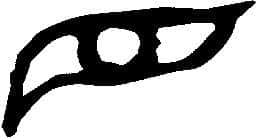，“目”的样子更为柔美，也更加惟妙惟肖。到了小篆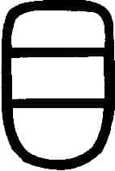，人们为了便于书写，便把大眼睛竖了起来，中间的眼珠变成了规范的短横，慢慢形成了沿用至今的“目”字。

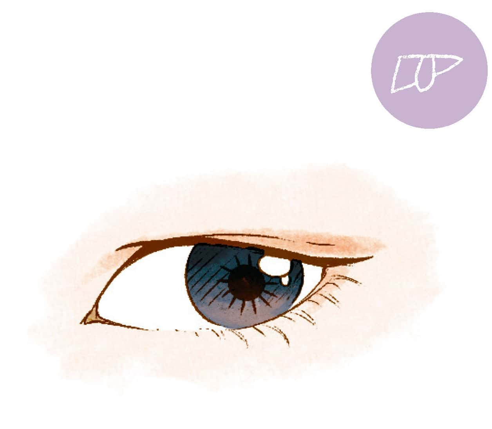

许慎先生在《说文解字》中说：“目，人眼。象形。”这个说法清晰明了，无须解释。在汉字中，很多和眼睛有关的字里都有“目”，除“眼”“睛”之外，你还能想到什么由“目”组成的字吗？

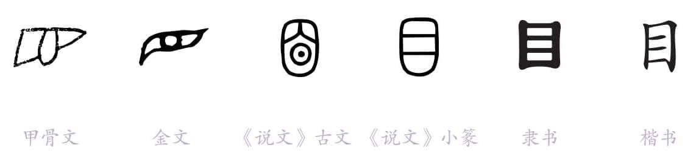

眸、瞻、眩、相、睡、眯、眨、瞽（gǔ）……这些字你都认识吗？“眸”是眼睛的别名，有成语如“明眸善睐”。“瞻”是向远处看，可组词“瞻望”。“眩”是眼花缭乱、“头晕目眩”。“相”是仔细看，所谓“相面”，就是仔细观察人的相貌来推测福祸。“睡”和“眯”时，人都会闭上眼睛。“眨”是眼睛忽闪忽闪的。“瞽”是双目失明。这些字都和眼睛密不可分。

眼睛看到的事物，往往是具体的、鲜活的。因此，“目”也引申出具体条目的意思，用于“纲目”“科目”等词。和“纲”相比，“目”更加细致微观，所以才会有“纲举目张”[1]的说法。除此之外，我们读书的时候，每本书的前面都会有“目录”。“目录”就是把一本书的章节条“目”，清晰地记“录”下来。

在古书中，“目”不仅是名词“眼睛”，还能用作动词，表示“用眼睛看”。在《史记》中的一个惊心动魄的小故事里，“目”就有动词的用法：

陈平惧诛，乃封其金与印，使使归项王，而平身间行杖剑亡。渡河，船人见其美丈夫独行，疑其亡将，要中当有金玉宝器，目之，欲杀平。平恐，乃解衣裸而佐刺船，船人知其无有，乃止。

这是汉初宰相陈平的故事。当时天下大乱，陈平独自逃亡避祸。在坐船渡黄河的时候，不想遇到了麻烦！

史书记载，陈平是个美男子，气度非凡。船夫看到他英姿飒爽，又孤身一人，便怀疑他是逃亡的将领，怀里藏有金玉宝器。于是，船夫动了贪念和杀心，贪婪的目光不断扫向陈平。

陈平见船夫目光不善，心中恐慌。千钧一发之际，他灵机一动，将上衣脱掉，光着膀子，张罗着帮船夫撑船。船夫见他身上一无所有，杀心顿无。

在这个故事里，“目之”的“目”便是动词用法，是“看他”的意思。

### 见 / 一个人的眼睛 /

“见”的简体字很抽象，但它最初的写法其实非常形象。“见”的甲骨文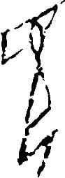，上面是一个“目”，下面是一个跪坐的人，表示一个人看到了某个东西。慢慢地，这个字形发展为了繁体字“見”。后来汉字简化，才有了今天的“见”字。

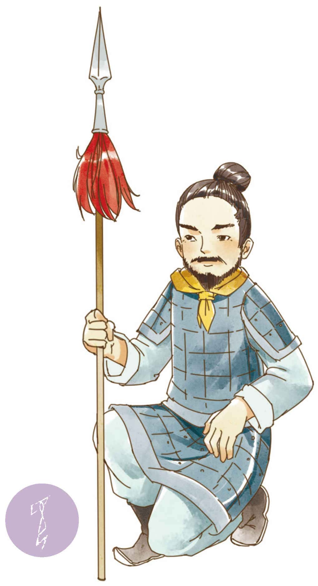

《说文解字》说：“见，视也。”“见”的本义是看见、见到。除此之外，“见”还有引申义，比如会见、接见。《左传》中有一篇很有名的文章，叫《曹刿（guì）论战》，其中写道：“公将战，曹刿请见。”鲁庄公要和齐国打仗，曹刿来出谋划策，请求鲁庄公接见他。其中的“见”，便是接见的意思。

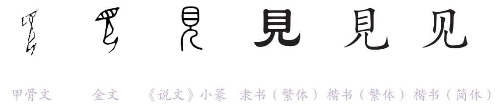

此外，“见”也表示见识、见解、见地。一个人的所见，往往决定了他对世界的理解程度：在智者眼中，世界是流动变化的；在愚者眼中，世界是僵化固定的。在乐观者眼中，世界是幸福美好的；在悲观者眼中，世界是痛苦无望的……

世界不变，人之所见却有高下之别。因此，夸别人看法高明，可以说“高见”！表达自己的看法则要谦虚，要说“这是我的一点儿浅见”。

### 现 / 微微玉光 /

“见”到了某个事物，也就意味着它出“现”在我们眼前。以前，“见”读作xiàn时，表示出现，比如“图穷匕见”。后来，人们给“见”添加了一个玉字旁，造出今天的“现”字，专门表示显现、出现的意思。

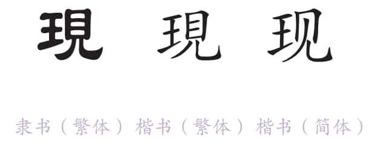

你可能会疑惑，那不是王字旁吗？怎么会是玉字旁呢？和肉月旁一样，这也是汉字演化中一个有趣的“小错误”。

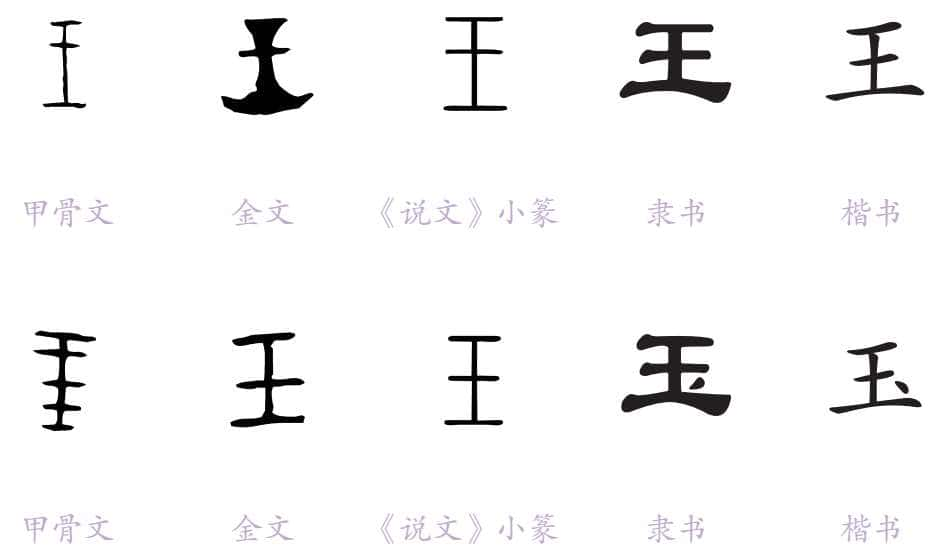

“王”字的甲骨文是三横一竖，许慎先生的解释是三横象征着天、地、人，中间一竖贯穿，意思是能够贯通天地人三者的，就是王。

至于“玉”字，甲骨文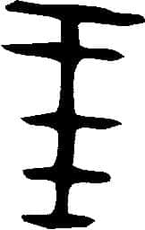就像穿起来的几枚玉片。到了小篆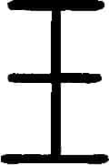，这时的字形和“王”已经非常相像。所以，“玉”变为部首时，很容易被误认为“王”。玉字旁的字多与珍宝有关。“珍珠”“玛瑙”等与宝物有关的字，部首都是玉字旁。至于“现”字，它最初也与珍宝有关，有玉光的意思，不过这个字义现在已经不再使用了。

“见”与“现”，是同一个事情不同视角的表述。当你清澈的目光与世界相遇之时，是你看见了世界，还是世界出现在你的眼前呢？

* * *

[1]纲是网上的大绳子，目是网上的眼。提起大绳子来，一个个网眼就都张开了。比喻做事抓住主要的环节，就能带动次要的环节，也形容文章条理分明。

## 眉  
眉是美丽的标志

面貌之中，眉好似最无用，但却和眼睛一起，成为传递信息的媒介。它可以形容老人长寿，古人认为眉毛长的人寿命也长，所以叫“眉寿”；也可以形容面貌，比如“眉清目秀”；可以用于夸奖一个人，比如“剑眉星目”；也可以用于贬低一个人，比如“贼眉鼠眼”；可以和胡须一起指代男人，比如“须眉”[1]；也可以形容女子“眉目含情”……这一讲，我们就来认识“眉”字。

“眉”字是在“目”的基础上造出的字，这个字里有古人的眉目传情。

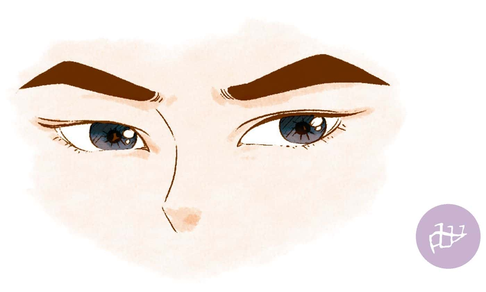

你看，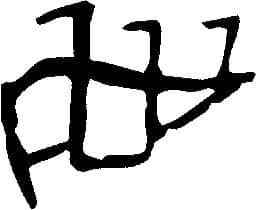是甲骨文中的“眉”，下面是“目”，上面三笔画出了眉毛的形状。到了金文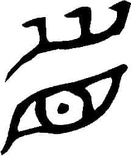，眉毛画得越发清晰，甚至颇有个性。发展到小篆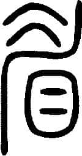，这个字不再形象，下面的眼睛竖了起来，变为简约的“目”，上面表示眉毛的笔画也越来越抽象，最后渐渐演化为今天的形体。

许慎先生说：“眉，目上毛也。从目，象眉之形。”这句话清晰地解释了“眉”的字义与字形。

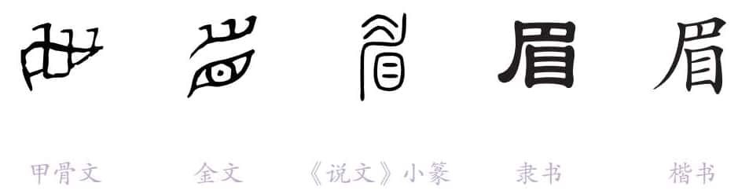

一个好看的女子，眉毛一定很美。中国古人很早就有画眉的记载了。“妆罢低声问夫婿，画眉深浅入时无”，说的是新娘子第一次拜见公婆，有点儿忐忑地问自己的丈夫：“夫君啊，你看我的眉毛画得好看吗？”

现代人画眉用的是眉笔、眉粉，这位忐忑的新娘子画眉用的又是什么呢？

她用的是一种青黑色的颜料——黛。“黛”的历史很久远，两千多年前的《楚辞》里便有“粉白黛黑”一词，指的是以粉傅面、以黛画眉。白居易著名的《长恨歌》中，“粉黛”也指代女子。“回眸一笑百媚生，六宫粉黛无颜色。”这句诗的意思是，杨贵妃只要回眸一笑，便能够展现出千百种风情，后宫里的美女们与她相比，全都黯然失色。

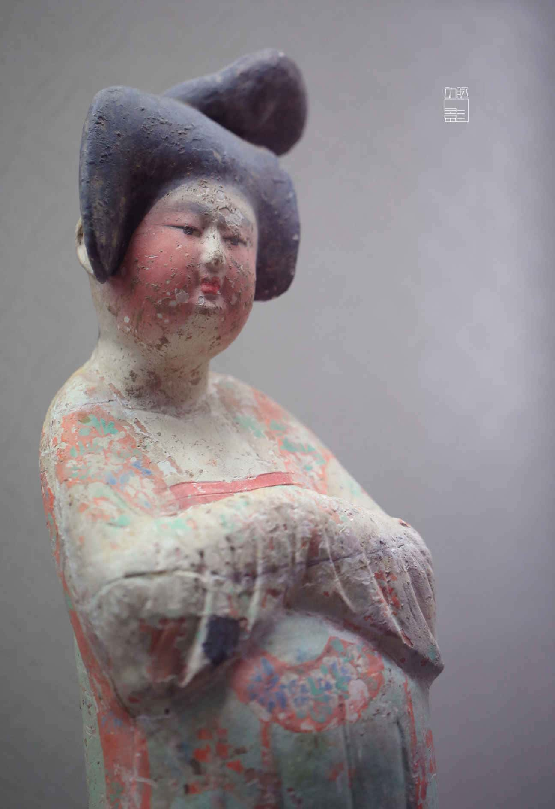 
唐/彩绘拱手仕女俑/西安博物院藏

古代女子爱美，“黛”的种类不少，有石黛、螺子黛、青雀头黛等。同样是画眉，不同时代不同女子，画的眉形、眉色也不同，眉形有蛾眉、长眉、柳眉、月眉、短眉、远山眉等，眉色有黛眉、翠眉、绿眉、青眉等。不同的眉里，凝聚着不同的风情。

这些美丽的眉，让文人墨客忍不住写进诗文里。《诗经·卫风·硕人》[2]里，卫庄公夫人庄姜“螓首蛾眉，巧笑倩兮”，她的眉，犹如蚕蛾轻盈的触角。汉代刘歆《西京杂记》里，才女卓文君“眉色如望远山”，她的眉，仿佛山水画中一抹淡淡的远山。《红楼梦》中，黛玉是“两弯似蹙非蹙罥（juàn）烟眉”，“罥”是缠绕的意思，黛玉的眉，像是两缕轻柔缠绕的青烟……古人写眉，竟有山水之色呢！

美丽的眉毛也成了美丽女子的代称。据说，唐明皇曾让画工做《十眉图》，画出十位不同眉形美女的风姿。这《十眉图》不就是《十美图》吗？眉在古人心中的位置，可见一斑。

* * *

[1]胡须和眉毛，指男子。

[2]《诗经》是我国最早的诗歌总集，编成于春秋时代，共305篇，分为“风”“雅”“颂”三大类。原只称《诗》，后世也称为《诗经》或《诗三百》。

## 口·曰·舌  
与嘴巴有关的汉字

我们的五官在汉字中都有专门的形体——目（眼睛）、耳（耳朵）、自（鼻子），当然，更少不了用来吃饭、说话的口（嘴巴）。

在这一讲，我将为你介绍“口”字和相关的“曰”“舌”二字。

### 口 / 张口吃饭，开口说话 /

从甲骨文到楷书，“口”的字形一脉相承，它是一个非常标准的象形字，就是嘴巴张开的形状。许慎先生说：“口，人所以言食也。”“言”是说话，“食”是吃饭。我们的嘴巴最常用的功能就是说话和吃饭。

这两个功能让“口”衍生出了很多其他的汉字。你看，“叫、喊、嚷、吼、吹、唱、咨、召、喧”，这些从口的字都与说话有关；“咀、嚼、吞、咽、含、吮、吸”，这些从口的字都与吃饭有关。

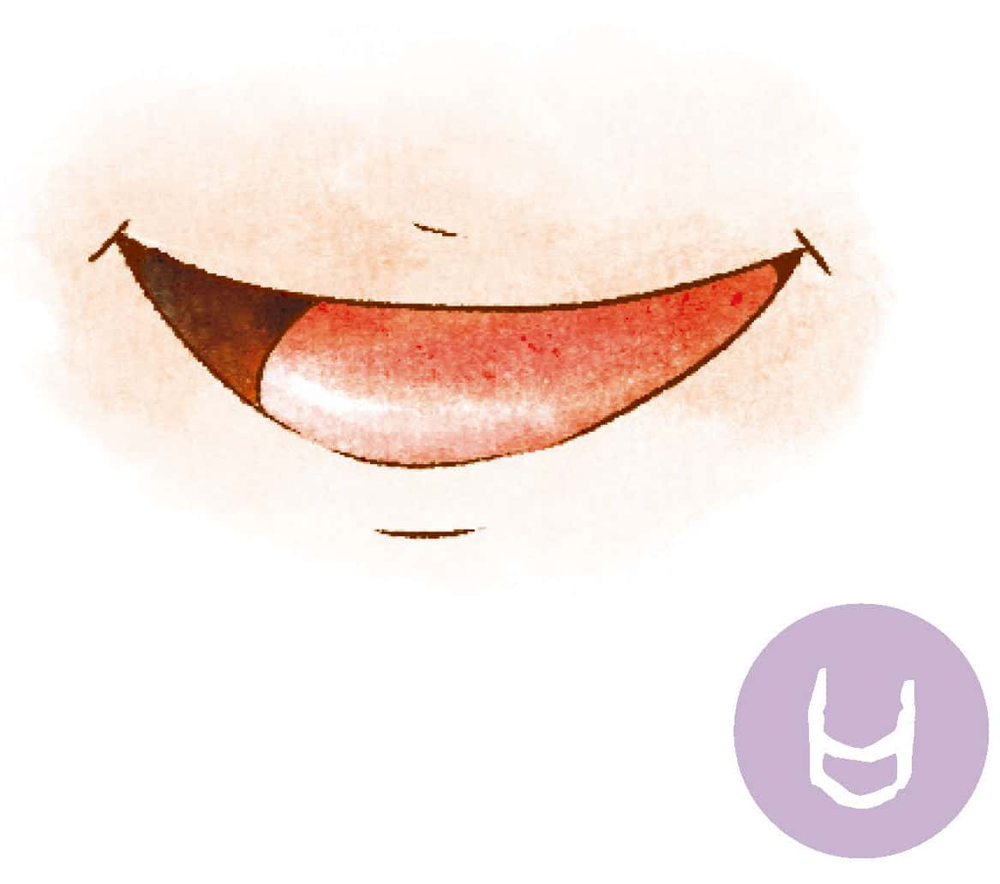

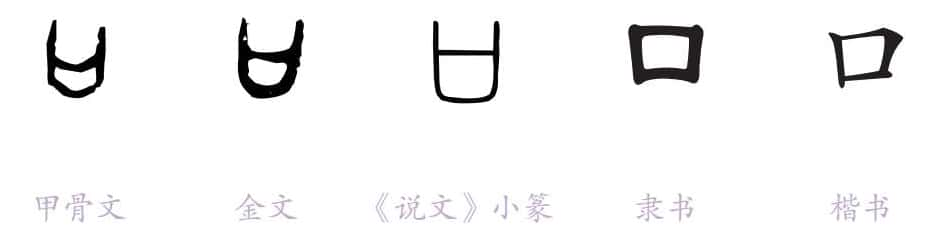

这两个功能也让“口”衍生出很多词语。“口齿”伶俐，“口才”很好，“口若悬河”，都形容良好的表达能力，指人说起话来滔滔不绝！“口舌之争”“君子动口不动手”，则是两个人口头上的争吵。至于饮食，要追求“口味”“口感”，吃到了美食则是有“口福”。对一家人来说，最常做的活动就是一起吃饭，因此家庭的基本单位也是“口”。三口之家，就是三个人、三张嘴。由此衍生出的“人口”一词，指居住在一个地区里的人员数量。

“口”的部位很特殊，它处在开端的位置——发声由口而出，吃饭由口而入，这是连接身体内外的重要通道。因此，“口”也用来指出入、通过的地方。大到“门口、关口、山口、海口、港口”，小到“碗口、袖口、瓶口”，都由此引申而来。

### 曰 / “子曰”是什么意思？ /

你读过《论语》吗？《论语》里很多句子前面，都有“子曰”两个字。“子曰”是什么意思呢？

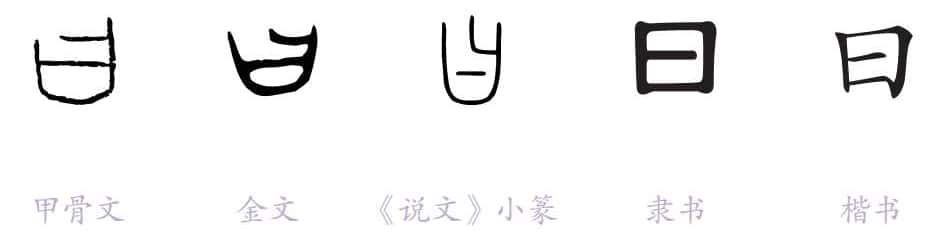

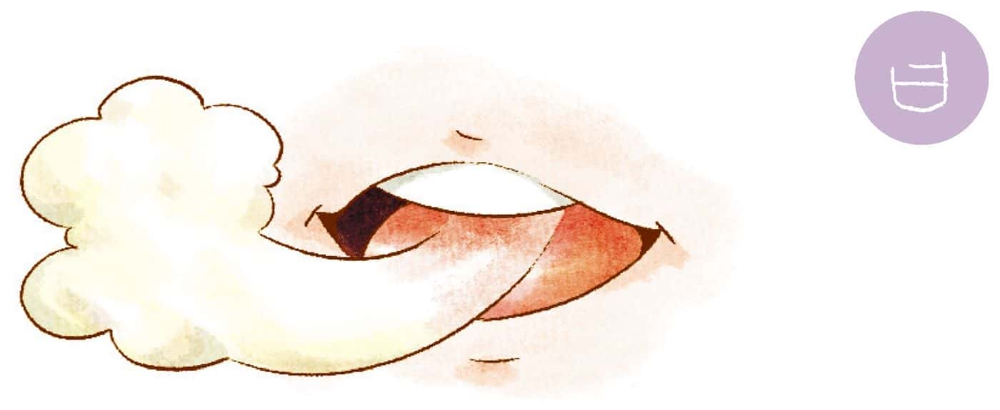

“子”是孔子，“曰”是讲话。“子曰”就是“孔子先生说”的意思。

在汉字中，“曰”和“口”密不可分。“曰”字从口，甲骨文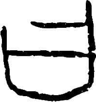是在“口”的上面添了弯弯的一笔，这是什么意思呢？

许慎先生说，“曰”的字形“象口气出也”。我们说话的时候要吐气，添的这一笔是想表示说话时声音向上传递出去。

在现代汉字中，“曰”和“日”很像，但它们其实毫无关系。“日”高高瘦瘦，“曰”矮矮胖胖；“日”是太阳，“曰”是说话。我们读古书的时候，要注意它们的区别，可不能闹了笑话！

### 舌 / 三寸不烂之舌 /

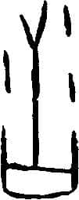是甲骨文中的“舌”，下面是口，上面夸张地画出舌头的样子。在吐出的小舌头旁边，似乎还有好多口水，仿佛一个人正在幸福地舔舐美食。

舌头有什么功用呢？许慎先生说：“舌，在口，所以言也，别味也。”舌头是用来说话的，也是用来品尝味道的。有意思的是，尽管“舌”在造字时强调品尝味道，但后来它的意义主要还是和说话有关。无论是“口舌之争”还是“舌战群儒”，无论是“口干舌燥”还是“唇枪舌剑”，都与口齿之间的争锋密不可分。

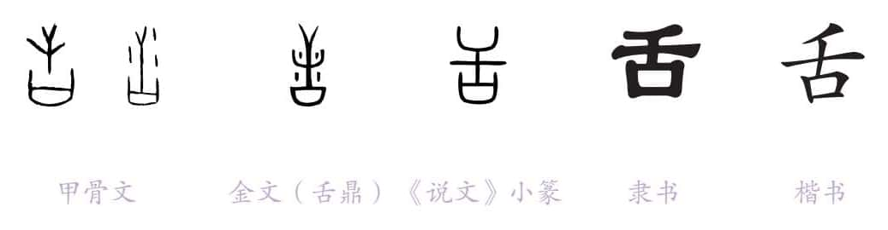

春秋战国时期，有不少周游列国、靠口舌平定天下的人物，他们有个共同的称呼——纵横家。其中有一位名震天下的风云人物，他就是张仪。

当时苏秦联合六国共同伐秦，张仪仅凭借一张利口，就瓦解了诸国联盟，一举扭转了秦国的不利局势。因此，用“一怒而诸侯惧，安居而天下息”来形容他，也不为过。

但在一展宏图之前，张仪也有过落魄不得志的时候。张仪年轻时曾得罪了楚相，被打得半死。重伤之际，他问自己的妻子：“你看看，我的舌头还在吗？”

“当然在！”

“那就不怕，凭我的三寸不烂之舌，无论人生多么艰难，我都无所畏惧！”

张仪的才华与勇气都体现在滔滔雄辩之中，这样的语言有改变天下格局、搅动历史风云的力量。

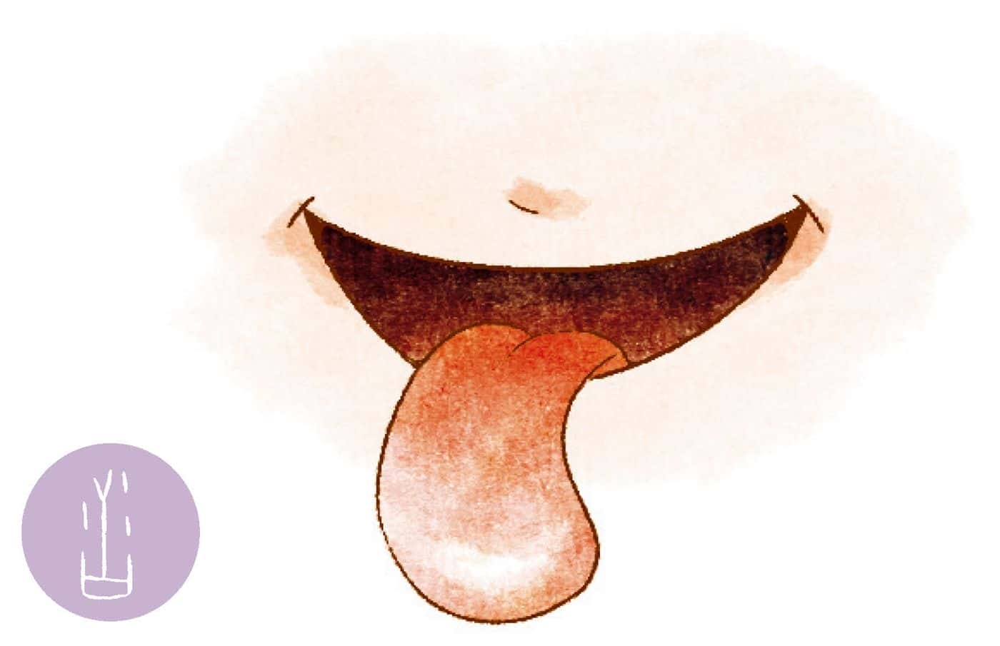

## 齿  
“齿”和“牙”是一个意思吗？

开口微笑，就会露出洁白的牙齿。古老汉字中的牙齿又是什么样子的呢？“牙”和“齿”是同一个意思吗？古人的牙齿健康吗？

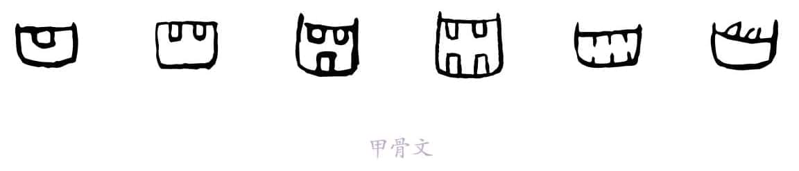

“齿”在古代并不是牙齿的统称，而专指门牙。甲骨文的“齿”有很多不同的写法，但它们都是一个大大张开的“口”里画着门牙。只不过有的是一颗，有的是两颗，最多的也不超过五颗，还有的门牙长在了嘴唇外面，真是惨不忍睹！

古人的“齿”字画成这个样子，还真不是造字时的心血来潮，瞎涂瞎画。要知道，古代没有牙刷、牙膏，更不知到哪里看牙医。在茹毛饮血的时代，古人吃饭生吞活剥，他们牙齿的健康状况和甲骨文里描绘的一样差。通过原始人的头骨可以看到，不到三十岁的人，牙齿差不多都磨平了。原始人的平均寿命很短，这和恶劣的牙齿状况也有很大关系。

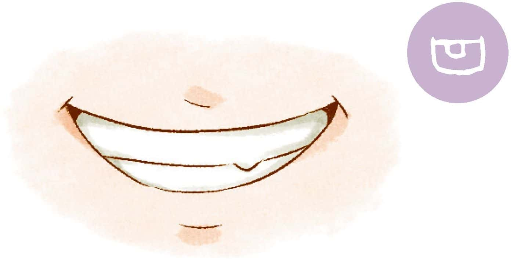

后来，随着文明的发展，人类才逐渐开始保养牙齿。在中国，公元700多年前，人们已经开始用马尾做成小刷子来清洁牙齿。在西方，18世纪的英国人用沾着煤灰和盐的破布在牙齿上摩擦，以此来清洁牙齿。到了1770年，英国人威廉·阿迪斯因煽动骚乱被关押在英国监狱里，他不满意以往的牙齿清洁方式，便在一块骨头上钻了一些小孔，装上一些硬猪鬃，发明了真正意义上的牙刷。从此，牙刷开始逐渐风靡全球，成为我们每天不可或缺的伙伴。

在古代，整齐健康的牙齿是评价一个姑娘美丽的重要标准。《诗经》中有一首《硕人》，描写了当时的美人庄姜，形容她“齿如瓠犀（hù xī）”。什么是瓠犀呢？瓠是一种小香瓜，犀是果仁，瓠犀就是瓠瓜的籽——庄姜的牙齿像瓠犀一样整齐洁白，真是个美丽的女子呀。

如此重要的“齿”，在汉字演变过程中，是如何从甲骨文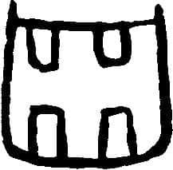演变为现在的字形的呢？从甲骨文中可以看出，“齿”是一个典型的象形字。到了繁体字“齒”，它的下半边还能隐约看出曾经的模样。至于“齿”上面的“止”，则是古人后来添加的声符。

牛马每年都长牙，人们掰开马嘴，数一数有几颗牙齿，就知道它们的岁数了。因此，马的年龄也叫“马齿”。后来，“齿”也慢慢用来指人的年龄了。古人举办宴会的时候，有两种排座次的规矩——“朝廷序爵，乡党序齿”。“序”是排列，“爵”是身份地位，“齿”是年龄。在朝廷宴饮中，按官职大小排列座位；在日常聚会中，按长幼次序排列座位。

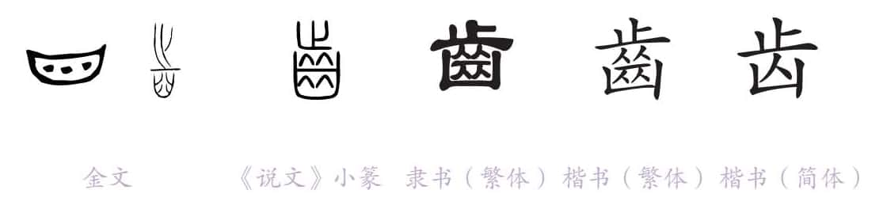

讲完了“齿”字，再来区分一下“牙”字。

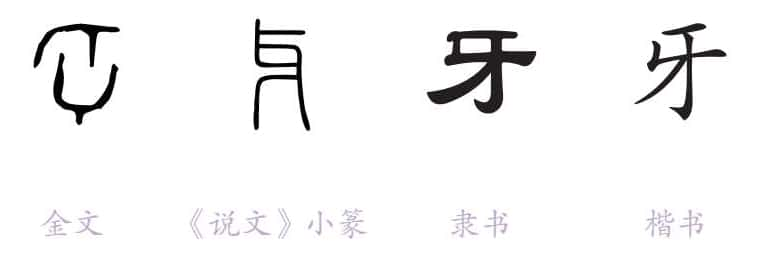

在今天，“牙”和“齿”连用为“牙齿”，但在古代，“牙”和“齿”可不一样：“牙”是嘴巴深处的大牙，“齿”则是嘴巴前面的门牙。

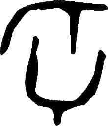是金文中的“牙”，画出一上一下两颗大牙紧紧地咬合在一起的状态。许慎先生说：“牙，牡齿也。象上下相错之形。”“上下相错”，即上下咬合，那“牡齿”又是什么意思呢？

《说文解字》说：“牡，畜父也。”“牡”这个字从牛，本指牛群中的大公牛，也就是种牛。公牛体形庞大、身躯健壮，于是又引申出大的意思。“牡丹”的“丹”是红色，“牡”是大，“牡丹”也就是大红花。同理，“牡齿”就是大牙的意思。古人口中的“牙”，指口腔后面的臼齿，而我们今天多认为“牙”是门牙，“齿”是磨牙，和古代恰恰相反。

关于牙齿，还有一个有趣的成语故事——唇亡齿寒。

春秋时期，晋国的晋献公雄才大略，他想要扩张领土，吞并周边的两个小国——虢（guó）国和虞国。可这两个国家虽小，一旦团结起来，却也不好对付。

于是，大臣荀息出了个主意：“咱们给虞君送上良马和美玉，向他借道，先灭了虢国！”

晋献公一开始有点儿心疼：“这些可都是我的宝贝呀！”

荀息继续谏言道：“如果借道成功，我们先灭虢国，再灭虞国。这些宝物只是暂时放在虞国，其实就像放在外面的仓库里一样。”

于是，晋献公给虞君送上美玉和千里马，请求借道。虞君很高兴地答应了，还想一起出兵虢国。虞君的臣子宫之奇看穿了晋国的诡计，慌忙觐见国君，可虞君不但没有听从他的建议，反而和晋国一起攻打虢国，攻下了虢国的下阳。

后来，晋献公又一次借道虞国，继续攻打虢国。

宫之奇再次谏言道：“大王，虞国和虢国互相依靠，虢国是虞国的屏障。虢国灭，则虞国必亡。两国就像嘴唇和牙齿一样，失去嘴唇，牙齿也会寒冷，怎么可以再次借道给晋国呢？！”

可惜的是，虞君贪图美玉宝马，还是答应了晋国的请求。

后来，晋国攻下虢国，返回途中借宿虞国，趁机发动袭击。恰如宫之奇所言，虞国孤掌难鸣，被晋国消灭，只留下了“唇亡齿寒”的故事。“齿”和“唇”的关系这般密切，也说明了“齿”就是门牙。

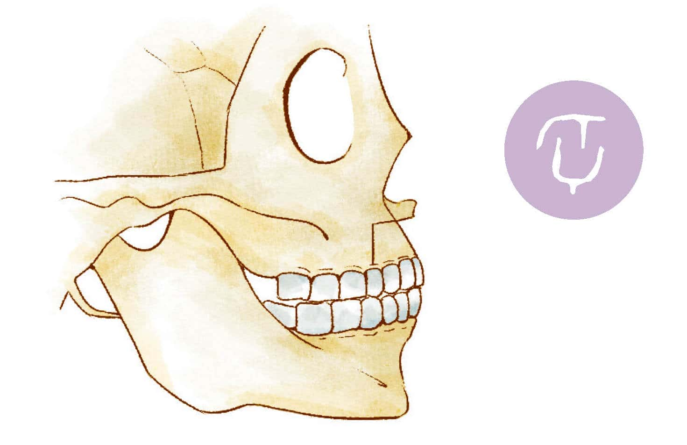

## 甘·旨·香  
三种“美味”

“口”和美食密不可分。与“口”相关的汉字也淋漓尽致地展现出古人对美味的追求。在这一讲，我将为你介绍三个和美味有关的字——“甘”“旨”“香”。

### 甘 / 中和的美味 /

“甘”其实就是甜。甘蔗，就是甘甜的植物。

你看甲骨文中的“甘”——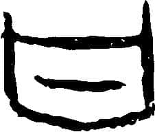，一个口，中间一个小横。这是一个指事字，中间的一横表示嘴里含的东西。猜猜看，什么东西会被一直含在嘴里？当然是好吃的！因此，“甘”有香甜的意思。

在许慎先生看来，“甘”中的这一小横并不简单！他认为：“甘，美也。从口含一。一，道也。”咦，我们的嘴里怎么就含了一个“大道”呢？

要知道，在五味的世界里，酸甜苦辣各有特点，口味不同的人，喜欢吃不同味道的食物。那么，什么东西最美味呢？那就是协调了各种味道之后的淡淡的香甜，也就是粮食的甜味。假如我们细细地咀嚼馒头，便能渐渐品味到甜味，这就是“甘”！这是协调五味的调和之道、中和之道，也就是“甘”之大道。

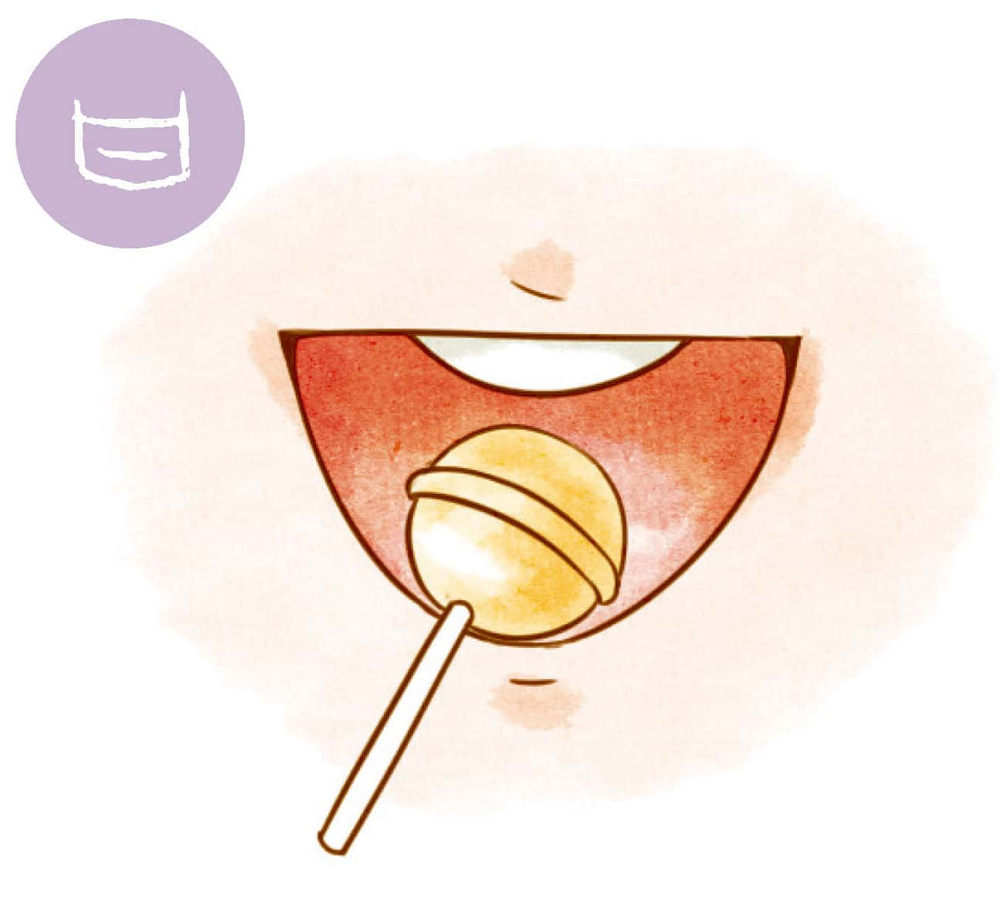

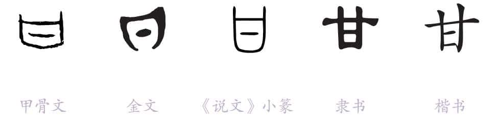

人人都喜欢甘甜的味道，因此，“甘”又泛指各种好东西。“久旱逢甘雨”“天降甘霖”，大旱中的及时雨，就像是给农作物最珍贵的美味佳肴一样。

既然“甘”是甘甜的意思，那“甜”呢？二者有什么区别呢？

“甜”字出现得比较晚，汉代以后才有。它表示“舌”尝到的“甘”味，是一个标准的会意字。在古人心目中，“甘之至为甜”。甜是甘的极致，是一种类似蜜糖的味道。

### 旨 / 圣旨是“甜”的 /

在电视剧里，高高在上的皇帝总会颁发圣旨：“奉天承运，皇帝诏曰……”小小的一道圣旨里，蕴含着无尽的威严。你有没有想过，“圣旨”的“旨”是什么意思呢？它为什么出现在“口”字这一章呢？

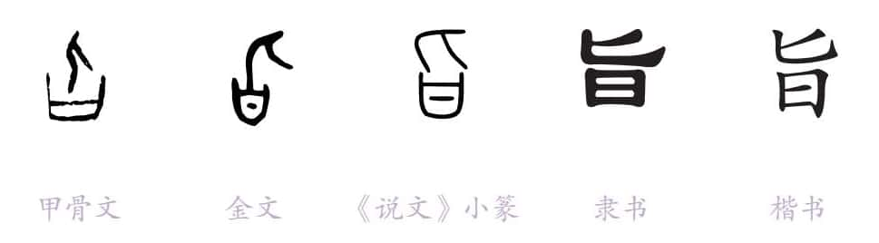

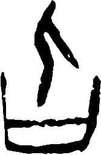是甲骨文的“旨”，下面是“口”，上面是“匕”。“匕”在古代除指匕首之外，也指一种形状像勺子的餐具。二者合在一起，表示用勺子把美食放进嘴里。所以，“旨”的本义是美味。《诗经》中说“旨酒思柔”，“旨酒”就是美酒。到了金文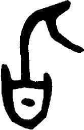，下面从“口”变成了“甘”，由此慢慢发展出了“旨”字。

“旨”是好吃的，那为什么皇帝的诏书叫“圣旨”呢？

要知道，在强调皇权的古代，皇帝的旨意一定是正确的、最好的，哪怕是贬官、杀头的旨意，臣子也要笑着接受。所以，圣旨就是来自圣上的好消息。

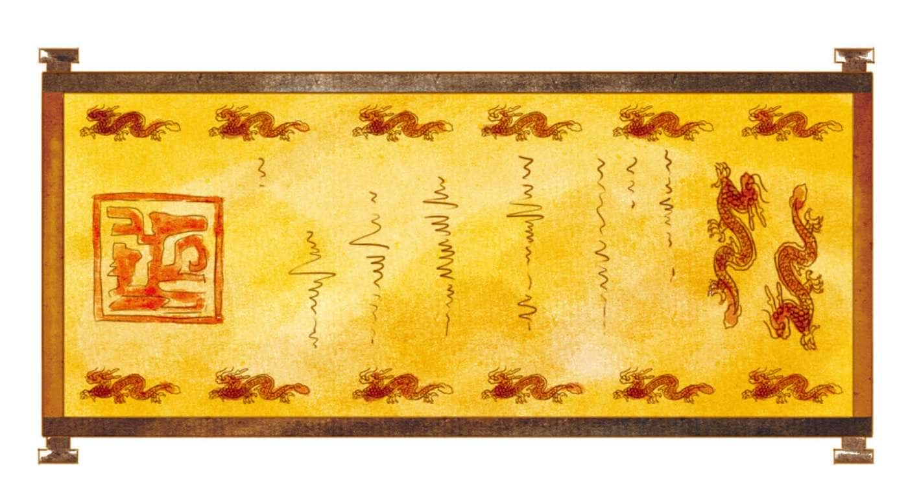

### 香 / 粮食的芳香 /

从甲骨文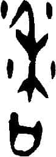可以看出，它上面是一株禾苗，下面则和“旨”一样，也是“口”。到了小篆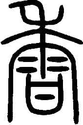，“口”变成了“甘”。《说文解字》说：“香，芳也。”也许对古人而言，最美好的香味便是农作物的甘甜和芳香吧。由此我们也能知道，“香”字诞生的时间不会早于古人种植农作物的时间。

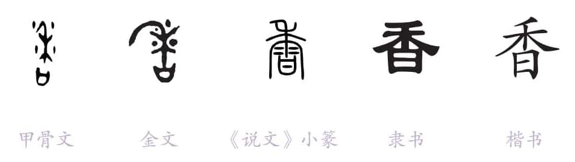

中国的农耕文明源远流长，农作物在中国汉字里的重要性不言而喻，人们习惯于用农作物来表达自己对世界的感知。除了“香”，“秀”最初指谷穗开花；“秒”是禾芒，禾芒微小，于是“秒”就用来表示短暂的时间；“秋”原指庄稼成熟，庄稼在秋季成熟，“秋”便用到了季节上；“租”是田赋，古代需要上交粮食，现代需要上交租金；“稀”是禾苗稀疏，现在则指事物之间空隙大……

在这么多熟悉又陌生的汉字里，竟然都有古代农作物的身影。看到它们，你是否也会和我一样，有一种奇妙的穿越时空的感觉呢？

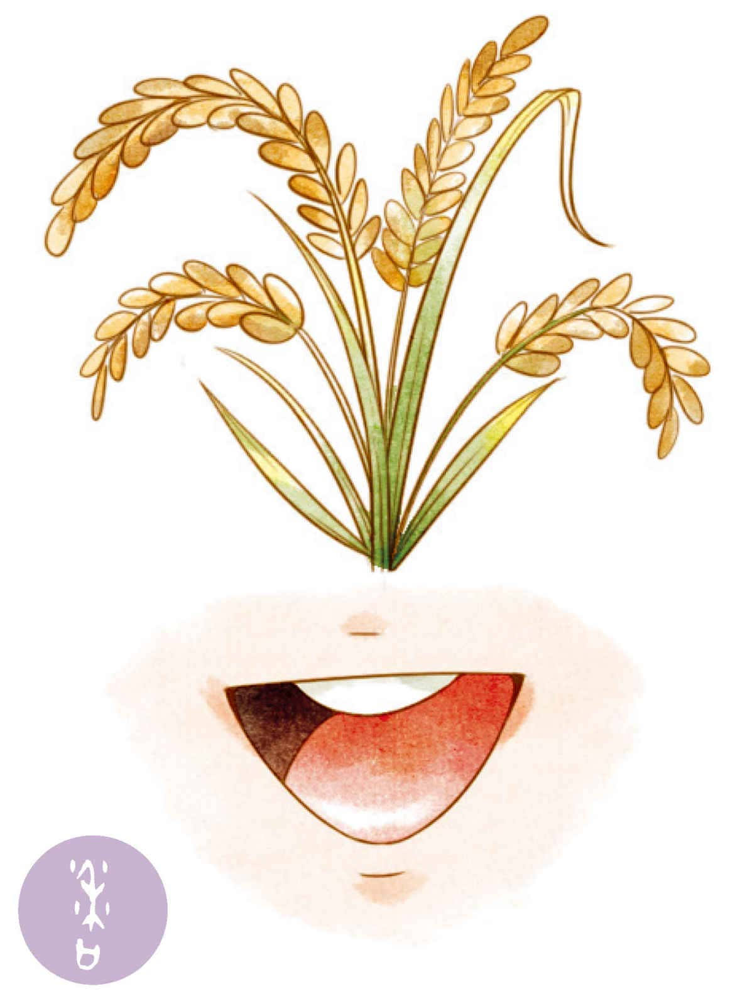

## 言  
直抒心声

人类和动物的区别是什么？最明显的是我们拥有丰富的语言。无论是小鸟清脆的啼叫，还是虎豹愤怒的咆哮，所能表达的意思都很有限。但人类的语言能够传达丰富的信息和情感，可以支持充分深入的交流。可以说，人类的文明建立在语言的基础之上。

那么，智慧的古人又是怎么造“语言”的“言”字的呢？语言出自人类之口，造“言”字离不开“口”。在甲骨文中，“言”有两种写法，学者对它们有不同的解读：

第一种是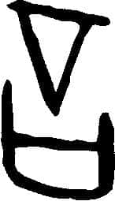，下面是口，上面是一个倒三角，有人认为，这是古代的乐器。“言”是用口吹奏乐器的样子，用来代指说话。

第二种是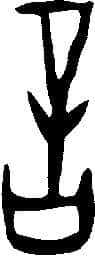，下面是舌头。还记得“舌”的甲骨文吗？它写作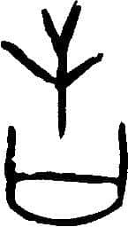。我们口中的语言，离不开三寸不烂之舌。上面的一横，是一个指事符号，表示说出的话语。

甲骨文的“言”字要张口说什么话呢？在殷商时代，人们的言说主要是向神灵的诉求。在留存下来的甲骨文中，很多与“言”字有关的内容都与祭祀有关。

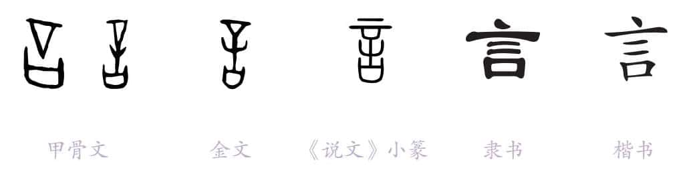

殷商时期尊奉鬼神，那时人们相信神灵主宰世界。国家大事都要用龟甲和兽骨进行占卜。他们把龟甲和兽骨用火烧灼，根据烧出的裂纹，解读上苍的旨意。古人极度信奉鬼神，直到春秋战国，也没有本质改变。所以《左传》中才会有“国之大事，在祀与戎”的说法，意思是一个国家有两件大事——祭祀和军事。因此，“言”的一个很重要的内容，是与神灵的沟通。

随着时代的发展，言说的内容从神逐渐转向了人。许慎先生说：“直言曰言。”人们不再向神寻求答案，而开始直抒胸臆，说自己真正想说的话！西汉大文学家扬雄也有类似的说法：“言，心声也。”

“言”的特点是真诚地表达自己的心声。通过“言谈举止”，能看出一个人的品格与素养。“一言既出，驷马难追”是古人一诺千金的美德，“巧言令色”“言不由衷”“言不及义”“大言不惭”则说明一个人虚伪空谈。

言语，展现的是丰富多变的人心。

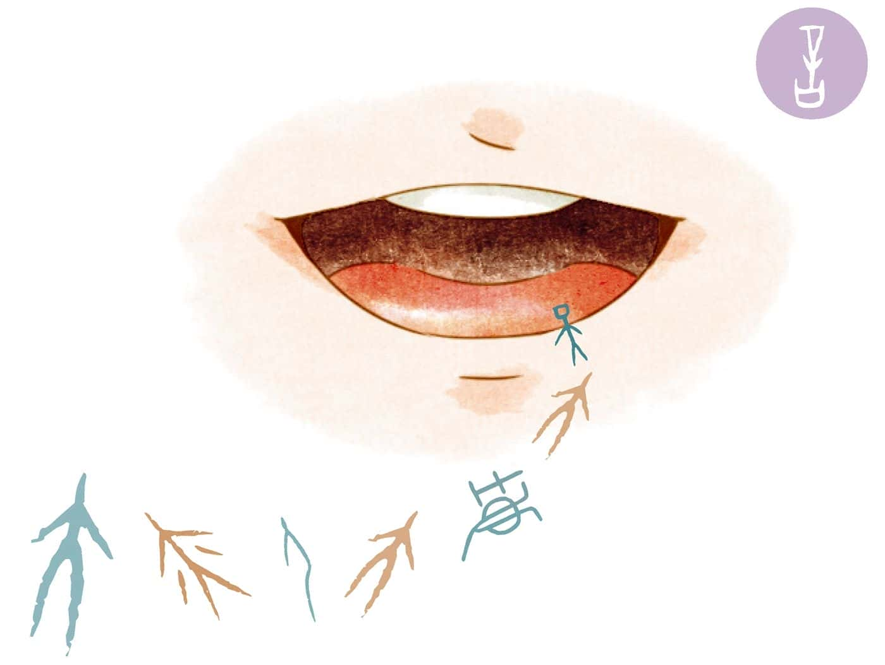

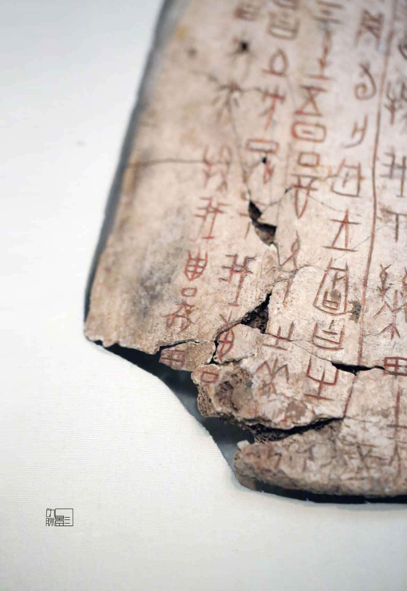 
商/卜骨/中国国家博物馆藏

## 论·语  
孔子之道，一以贯之

你读过《论语》吗？《论语》可以说是中国文化中最重要的一部书，甚至享有“半部论语治天下”的美誉。《论语》记载了孔子对弟子们的言传身教，蕴含着师生之间的真挚情感，体现出孔子伟大的道德生命。

读《论语》，学做人。你有没有想过，什么是“论”，什么又是“语”呢？有人说，“论”是讨论，“语”是说话，《论语》就是孔子和弟子的对话。

这样理解虽也不错，但还是小瞧了古人命名的智慧。想要解读“论”“语”，还是让我们到古老的汉字中寻找答案吧。

### 论 / 条理与秩序 /

“论”的繁体字写作“論”。其中，“侖”（lún）是声符，表示读音，其简体字形为“仑”。左边的“言”就是我们熟悉的言字旁——“讠”。“论”是一个从言仑声的形声字。

古人造字选择声符时，有时也会通过它来表达字义。“论”和“纶”“轮”“沦”“伦”等字的右边都有一个“仑”，在意思上也有共同的特点：

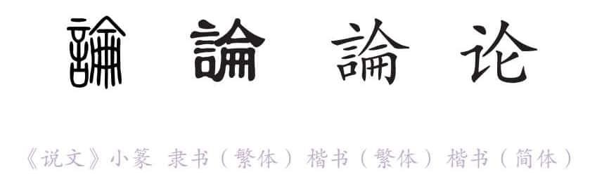

什么是“纶”？“经纶”是织布机上的直线和横线，它们整齐地交错在一起，织出美丽夺目的布帛。

什么是“轮”？马车的轮子中，一根一根的辐条整整齐齐地排列着，很有秩序。

什么是“沦”？就是水中的涟漪。往水中扔下一块石头，激起一圈一圈的水波，层层向外扩散。

什么是“伦”？我们的人伦、伦理就像涟漪一样，以个人为中心，以血缘为纽带，由近及远地向外扩展。

“纶”“轮”“沦”“伦”的共同特点，就是有秩序，有条理，结构清晰。其实，“论”的特点也是如此，它组成的词也多包含有条理、有规律的意味，比如“议论文”就要有论点、有论据，条理清晰，以理服人；再比如“辩论”要讲逻辑，不能胡搅蛮缠。

《论语》本身也是一部有条理的书。孔子说：“吾道一以贯之。”在夫子的大道中，有一个贯穿其中的总原则。所以，《论语》的书名并不是平实寡淡的大白话，它不仅仅指孔子师徒的话，还暗含着孔子一生推行的儒家之道。

### 语 / 对话与交流 /

说完了“论”，再来看“语”。

“语”是个形声字，繁体写作“語”。其中，“吾”表示读音。

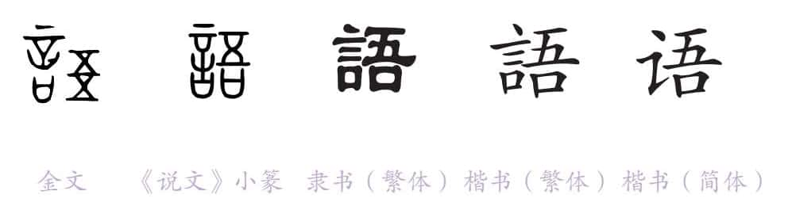

《说文解字》中说：“语，论也。”许慎先生有一个很有意思的解释：“直言曰言，论难曰语。”“直言”就是独白，是一个人直抒己见。“论难”呢？“难”读作nàn，表示质问、辩驳，“论难”是人与人之间相互讨论、辩论。所以，“语”的特点是对话。

因此，《论语》不是孔夫子一个人的独白，而是他的课堂实录，是他和学生之间的对话与交流。既然是对话，针对不同的人、不同的事，孔子就会有不同的观点，甚至还会有“自相矛盾”的地方。

有一次，鲁莽的子路问孔子：“闻斯行诸？”老师，我听闻一件好事，要不要马上去做呢？

看着子路摩拳擦掌的样子，孔子微微皱起眉头：“你家里有长辈，有事可以先问问他们，怎么能听到什么就做什么呢？”

过一会儿，冉有来问了同样的问题：“闻斯行诸？”

“嗯！听到了就赶紧做！”孔子答道。

同样一个问题，孔夫子给出了两个截然相反的答案。在一旁的公西华很迷惑，忍不住问孔子：“老师，您为什么前后说的不一样呢？我有点儿糊涂了……”

孔子微微一笑，说道：“这两个人性格不同，子路勇猛过人，太冲动了，所以我要压一压他。冉有呢，胆子小，怕事，所以我要鼓励他。”

两个看似矛盾的答案，恰恰体现出了孔子“因材施教”的理念——根据学生不同的性格和特质，进行最适合的教导。这也是“语”字的内涵所在。

“论”“语”二字的解读，为我们揭示出了阅读《论语》的方法：理解了“论”，就要把握孔子不同言论中“一以贯之”的大道，理解孔子思想的整体脉络。理解了“语”，就要结合具体的人、当下的事，具体地把握孔子当时的用意所在。将二者统一，我们才能更好地理解孔子思想，这也是《论语》命名中的智慧。

## 音·韵  
声音和韵律

世间有各种各样的声音和韵律：风吹动树叶哗哗作响，溪水叮咚流淌，蜜蜂振动翅膀发出有节奏的嗡嗡声；早晨，私塾小童们用稚嫩的声音吟诵《论语》；三月三上巳节，古代的人们在水边宴饮、欢唱……种种声音，不一而足，古人又是如何给“音”造字的呢？它和“声”“乐”连用为“声音”“音乐”，那“音”和“声”“乐”是一个意思吗？与它相关的“韵”字，又有什么含义吗？让我一一为你讲解。

### 音 / “音”和“声”“乐”意思相同吗？ /

在汉字中，“音”和“言”关系十分密切。你看“音”的小篆，在“言”字下面的“口”中加上一个短横，就是“音”。

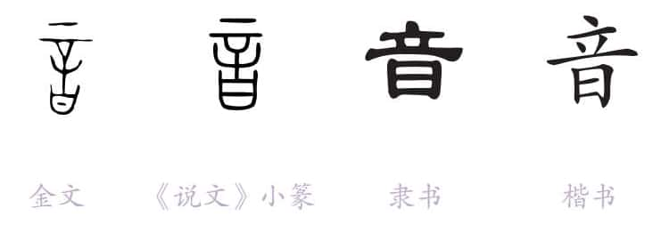

你还记得吗？“甘”也是“口”中加一横，许慎先生把这一横解释为“道”，指五味之间的协调与均衡。音乐之“道”也是如此。《说文解字》中说：“生于心，有节于外谓之音。”所谓“生于心”，指的是我们心中有各种各样的感情，难免会宣之于声——或欢笑，或哭泣，或叫喊，或叹息。这些生命中的自然之声，真实无伪，但它们并不是音乐。想要成为音乐，必须要“有节”。内心的感情经过人为加工，获得音乐的节奏，表现出和谐的音乐，这才是“音”的内涵！

“音”和“声”常合称“声音”。那“音”和“声”在古代是同一个意思吗？

不是的。在古代，“音”指人为的、加以修饰的音乐，而“声”则是自然的、不加修饰的声音。你张开嘴巴，随意地大喊一声：“啊——”这就是“声”。

这个世界上的“声”有很多。《孟子》中有“闻其声不忍食其肉”，这是牛羊被宰杀之前的哀鸣之声；《诗经》中有“鹤鸣于九皋，声闻于天”，这是高亢嘹亮的鸟鸣之声；欧阳修《临江仙》中有“柳外轻雷池上雨，雨声滴碎荷声”，这是雷声、雨声、雨打荷叶声……“声”是自然的释放，特别响亮。因此，在现代汉语中，由“声”组成的词大都有响亮、开放的特点。比如“声张”，指大肆张扬、公开宣布；“声讨”，指公开谴责；“声势”，指声威和气势。

“音”也与“乐”组成“音乐”一词。那“音”和“乐”在古代是同一个意思吗？

也不是的。“乐”的古字形和现在差别很大。有人认为，“乐”取象于古代的鼙（pí）鼓，这是周礼中用于祭祀神灵的鼓，后来成了军队中的乐鼓。也有人认为，“乐”下面像是一棵树，上面像丝线缠绕在木上，也就是古代早期的弹拨乐器。《说文解字》里对“乐”下的定义是“五声八音总名”。“五声”指古代的五个音阶“宫、商、角、徵、羽”，就像我们现在的“do、re、mi、sol、la”一样；“八音”不是八种声音，而是古代的八种乐器。从这个解释看，“乐”的范围比“音”要广泛一些，是各种乐器合奏出的乐曲，有时还包括与乐曲相伴的舞蹈。

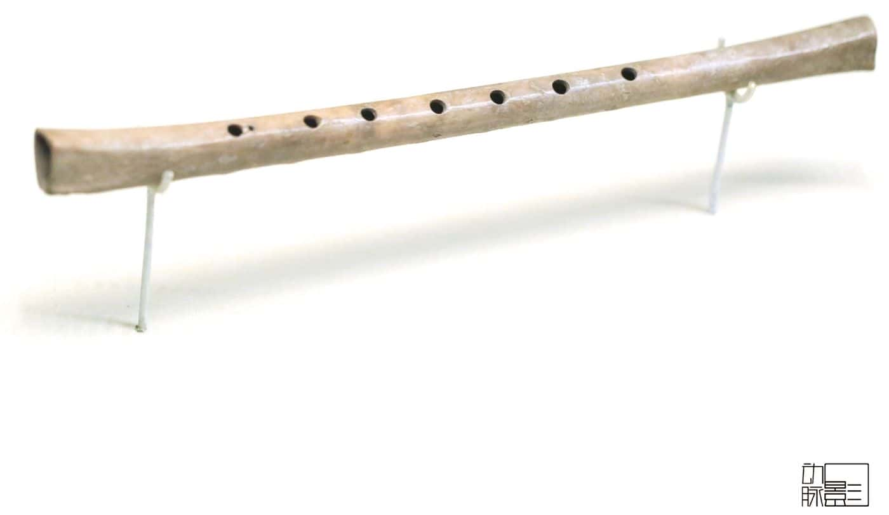 
新石器时代-裴李岗文化／贾湖骨笛/河南博物院藏

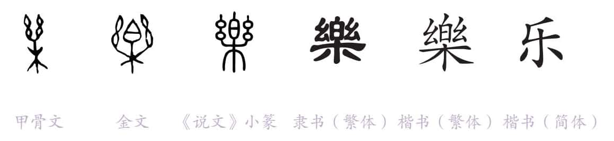

### 韵 / 声音之美 /

有了声音和音乐，便有了韵律。“韵”字诞生得比较晚，在古代，它常常写作“平均”的“均”字。

“均”最开始指做陶器的陶轮。陶轮不停旋转，老师傅用双手和泥，创造出漂亮的陶器。做陶器时，陶轮一定要水平旋转，如果有所倾斜，做出的陶器不免歪歪扭扭，容易破碎。因此，“均”有了平和的意思，也指众多声音协调的状态。后来，到了魏晋时期，人们专门造出了“韻”字，也就是“韵”的繁体字，替代了“均”。

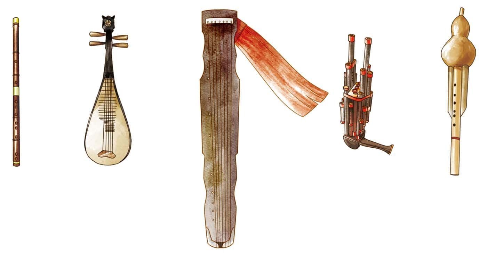

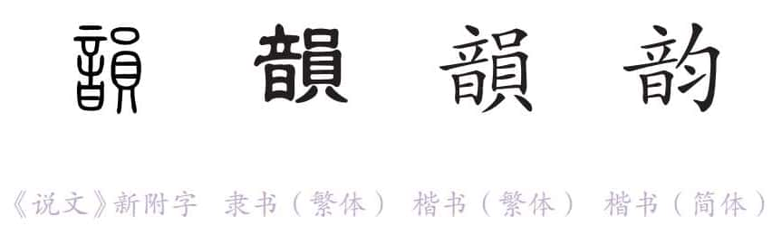

古人喜欢音乐和诗词的韵律感，很多诗词都可以直接歌唱，就像我们现在的歌曲一样。为了让诗词更为动听，作诗时就要讲究押韵。什么是“押韵”呢？就是一首诗中，偶句的最后一个字要有相同的韵脚。比如我们熟悉的《静夜思》：

床前明月光，疑是地上霜。

举头望明月，低头思故乡。

“光”“霜”“乡”的韵尾，是不是都是一样的？古代律诗通过押韵，展现出一种整齐、和谐的美感，也就是诗歌的韵味。

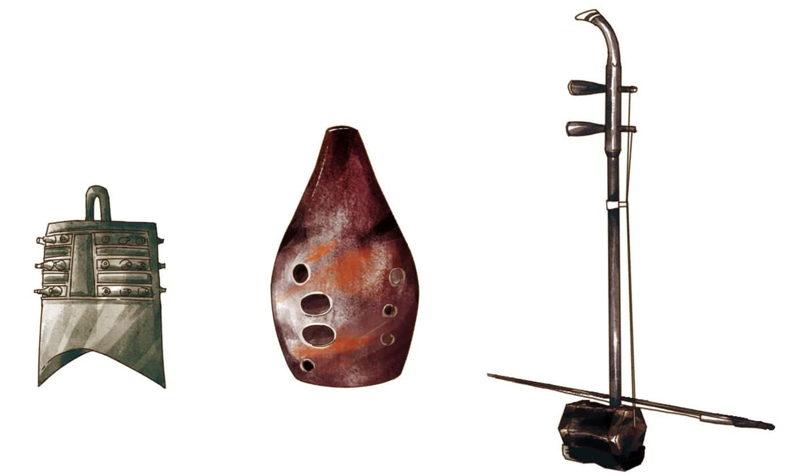

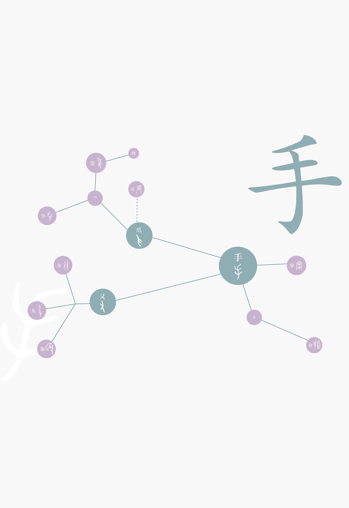

## 手·掌·指  
我们的手

双手，是每个人最亲近的伙伴。在蛮荒时代，人们用手摘果、捕猎，也用手打磨骨针[1]，缝制兽皮，或是雕出一支骨笛[2]，对残酷的世界吹一首曲子……

手如此重要，古人自然也创造出许多和手有关的字。这一讲要分享的是“手”“掌”和“指”。

### 手 / 画出一只手 /

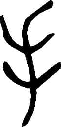和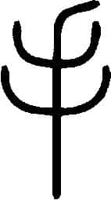分别是金文和小篆中的“手”字，它们都是典型的象形字——一只手，张开了五个手指。把小篆的笔画拉直，就是我们今天的“手”。

《说文解字》中说：“手，拳也。”手和拳姿态不同，手指张开，拳头握拢，这个解释不算特别精准。

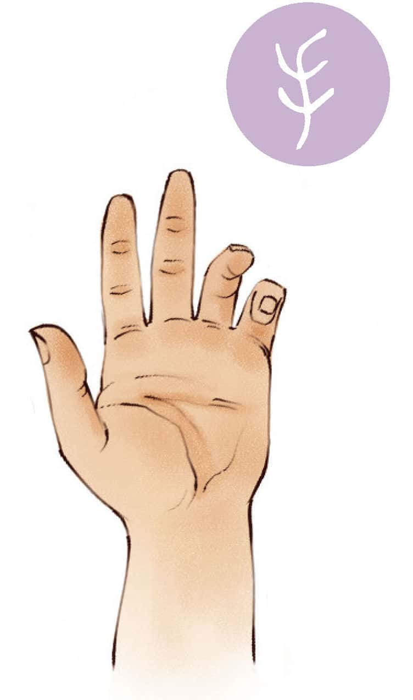

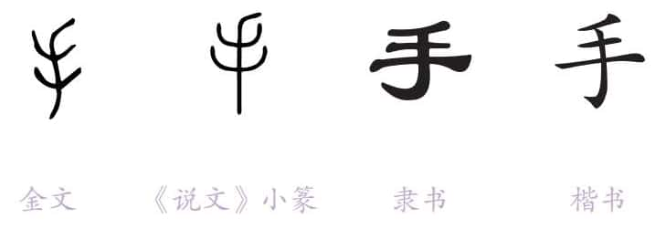

劳动主要靠双手，“手”在组词时往往和做事有关：自己用手去做，叫“亲手”；光用手而不用任何工具，叫“徒手”；活做得精细巧妙，叫“心灵手巧”“手艺好”；做到出类拔萃，便是“高手”；要是比较愚笨，总弄坏东西，就不免成了“笨手笨脚”……

### 掌 / 手的中心就是掌 /

说完了“手”，再来看“掌”。

“掌”是一个形声字，但和一般的形声字不太一样。形声字大多是左右结构，而“掌”是上下结构——下面的“手”是形符，上面的“尚”用作声符。

《说文解字》将“掌”解释为“手中也”，手的中间部位就叫掌。手掌是抓东西的地方，因此“掌”引申出“掌控”“掌握”“掌管”等词，都有把握、控制的意思。

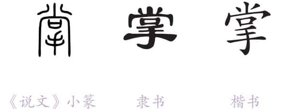

### 指 / 手指脚趾分不清？ /

手掌前端是五根手指。“指”是形声字，左边是“手”，右边是声符“旨”。我们经常使用的提手旁“扌”，其实就来源于“手”。

手的指头叫“指”，脚的指头叫“趾”。在今天，手指和脚趾分得很清楚，但在古代，“指”既可以指手指，也可以指脚趾。有一个很有意思的例子，是《史记》中汉高祖刘邦的故事：

楚汉相争之际，两军僵持，难分胜负。项羽想干掉刘邦，于是提前埋伏下弓箭手。他假意喊刘邦出阵谈话，趁其不备，一箭射中了他！刘邦被射中胸口，疼得趴在马上起不来。他的将士们都很紧张：我们的大王是不是不行了？！

刘邦为稳定军心，急中生智。他趴在马背上，用手摸着脚，说道：“虏中吾指！”文中的“指”，就指脚趾。这句话的意思是，项羽射中了我，但他就那点儿能耐，只能射到我的脚趾！

回到军营后，刘邦忍着疼痛，和张良一起去劳军。一是为了稳定军心，二是为了让项羽知道自己无恙，不要动乘胜攻击的心思。

这个故事不禁让人感慨，刘邦不愧为一代豪杰，受了这么重的伤，却还能从容应对。

* * *

[1]用骨头制成的缝纫工具，从旧石器时代晚期开始出现。距今18000年前的北京周口店山顶洞人遗址中，就出土过的骨针。

[2]在中国出土过新石器时代早期的骨笛。这些骨笛用猛禽的骨头制成，长20厘米左右。

## 又·友·及·取  
不像手的手

汉字里除提手旁“扌”外，还有一些造字部件也来源于手。比如这一讲要讲的“又”，以及下一讲要讲的“爪”。

你可能会困惑，“又”怎么会是手呢？这就要让我们回到古文字的世界，看看“又”古老的样子了。

### 又 / 伸出右手看一看 /

“我又起晚了”“我又吃了一顿大餐”“我又考了第一名”……这里的“又”和手有什么关系呢？确实没关系！现代汉语中的“又”是被借来表达“又一次”的意思的，但它的本义其实是右手。

从甲骨文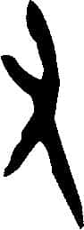到小篆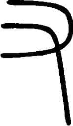，“又”都是象形字，像竖着的右手。但是，这只右手怎么只有三根指头呢？这可不是古人偷懒少画了两根。请把右手伸出来，大拇指、食指叉开，中指、无名指、小指自然地并在一起。你看，和古文字是不是很像？另外，古人常用“三”来表示多，比如“三思而行”不是做事前一定要思考三次，而是指多多思考。因此，画三个指头也可以表示五个，这是一种书写的减省。

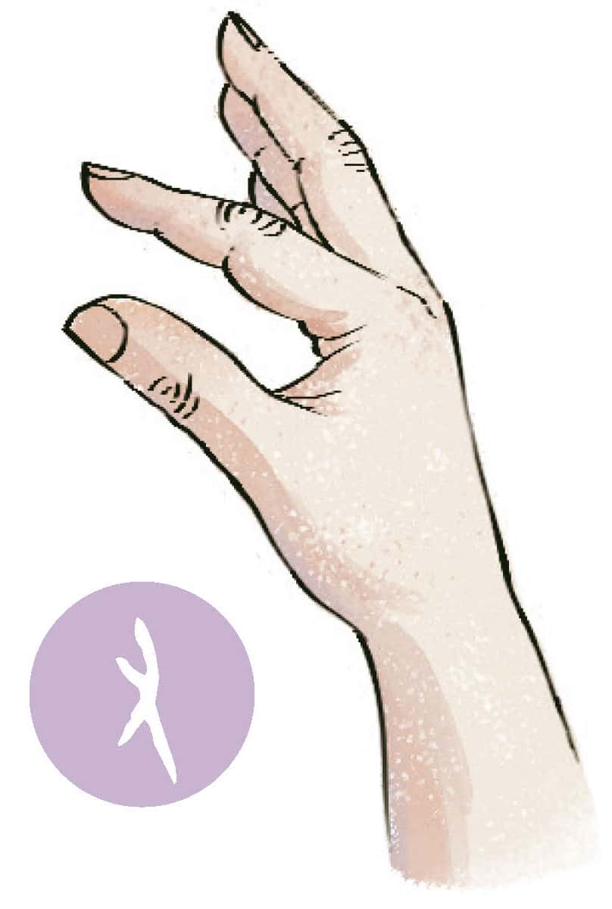

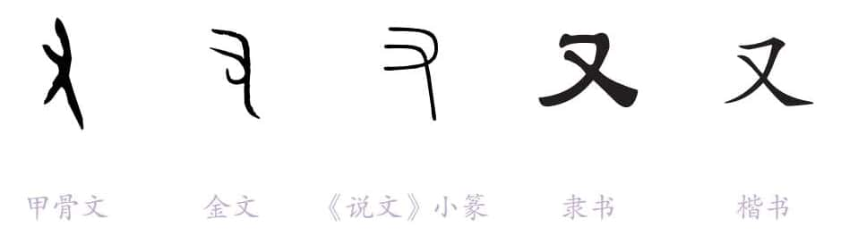

和“扌”一样，“又”也组成了很多字，比如下面要讲到的“友”“及”和“取”。

### 友 / 手拉手，好朋友 /

“友”字大家都认识，它的字形有什么内涵呢？古人创造这个字的时候，是出于怎样的考虑呢？

通过观察甲骨文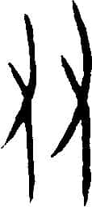、金文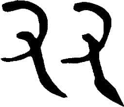和小篆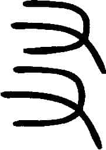，我们发现，它们都由两个“又”组成，一上一下或一左一右两只手。从小篆发展为隶书时，上面“又”字的笔画拉直，慢慢就变成了今天一横一撇的写法。

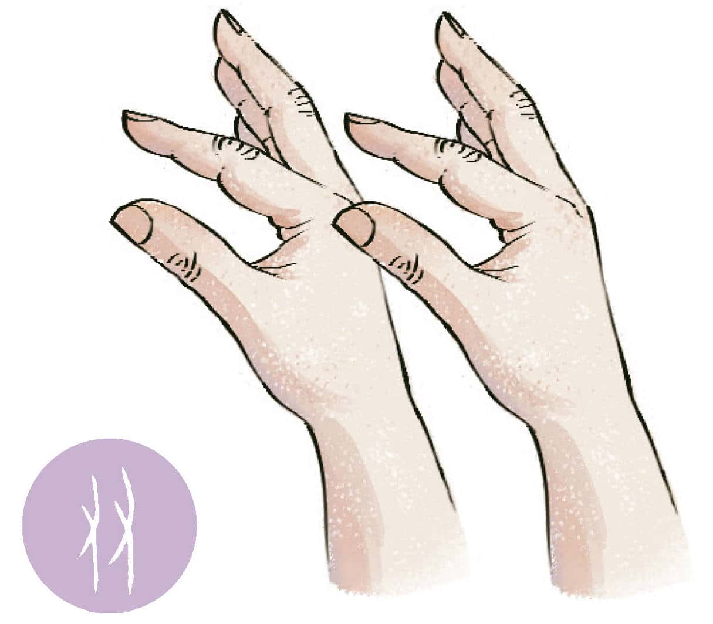

两只手放在一起，彼此相握，携手前进，表达的是朋友之间手拉着手的友情。《说文解字》认为“同志为友”，在古人心目中，好朋友不仅要双手相握、互相扶持，更要志同道合，这才是真正的好朋友。若在一起只是吃喝玩乐，沉浸于声色犬马，便是“狐朋狗友”。

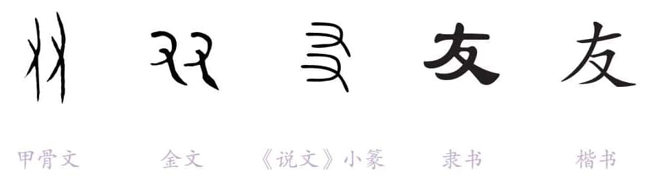

### 及 / 什么是“及格”？ /

手不仅能“交朋友”，也能“做坏事”。比如“及”和“取”，这两个字看似平凡，其实暗藏凶机。

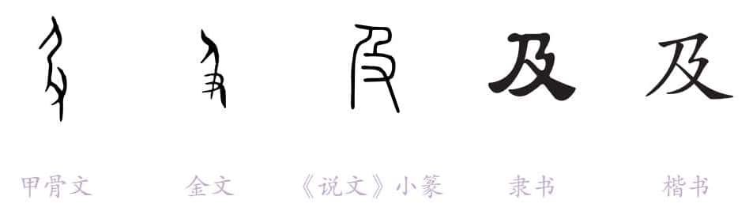

我们先看“及”字。“及”字在甲骨文里是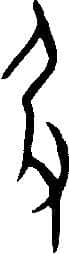，在金文里是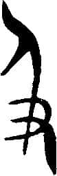，在小篆中是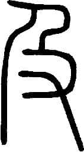。它们的下方是“又”，上面是“人”，合在一起，表示用手抓住了人。

许慎先生说：“及，逮也。”“及”的本义是牢牢地抓住一个人，将他逮捕。在古代，一个人被抓之后便是俘虏。沦为俘虏之后，一般只有两个结果。要么成为身份卑微的奴隶，要么被杀。古书中常说“及于难”“为某人所及”，“及”字的背后，很可能是一段悲惨的故事。

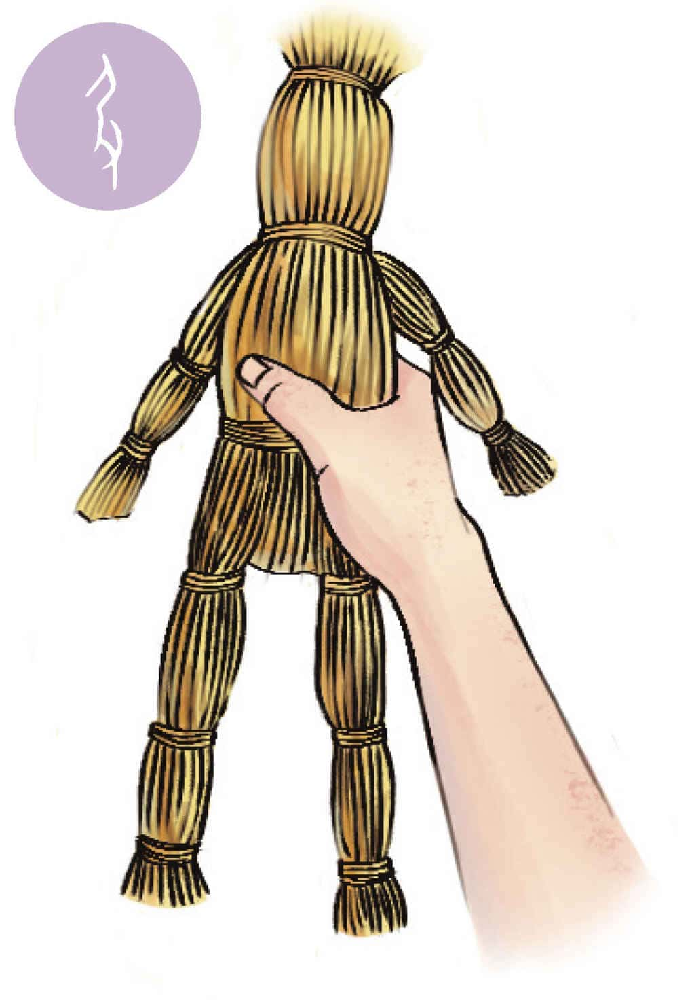

当然，除了抓人，还有很多东西也要牢牢抓在手里，比如抓住宝贵时间的“及时”，抓住考试分数的“及格”。

### 取 / 抓着耳朵做什么？ /

“取”也是个弥漫着血腥味的字。

在古文字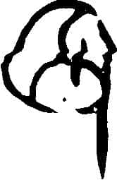中，右边是代表手的“又”字，左边是耳朵的“耳”。真奇怪，取书、取钱、取快递，用手抓什么东西不行，为什么要取耳朵呢？要解答这个问题，还得看《说文解字》。许慎先生说：“取，捕取也。”“取”就是捕获敌人的意思。“取”字的诞生和古代战争密切相关。

古代推行军功授爵制度，将士等级的跃升与军功大小直接挂钩。战国时期，秦国把将士分为“小夫、公士、上造……大良造”等十几个等级，并规定“计首授爵”，即按照在战场上获取敌人的首级数量来计军功，确定奖赏等级。每一级军官升迁，其指挥的军队都对应着准确的首级数量。根据《史记》的记载，秦国大将白起前前后后率兵杀敌八十七万人，即便是他这样的战神，也是历经数年，才从左庶长被封为大良造的。“一将功成万骨枯”，足可见古代战争的残酷了。

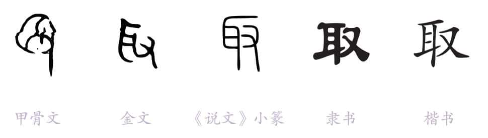

在风云变幻、危机四伏的战场上，还要带着砍下的人头，用来计功授爵，这实在是太麻烦了。于是，古人想出了一个十分“方便”的好办法——割下敌人的耳朵，待战争结束后，根据耳朵数量来计军功，这就是“取”最初的字义。

这个字是古代军功制度的缩影，更体现了古代战争的血腥与残酷。

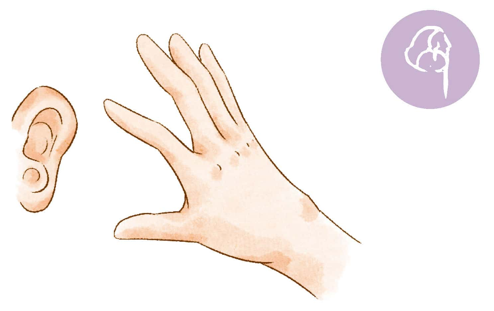

## 爪·受·争  
“充满竞争”的手

除了上一讲的“又”，汉字中还有一种看不太出来的手——“爪”。“爪”和“又”是手的不同姿态。认识了“爪”，便能更好地理解“受”和“争”。

### 爪 / 爪向下抓 /

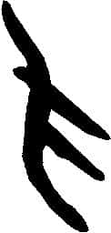是甲骨文的“爪”。《说文解字》说：“覆手曰爪。”“覆”是翻下去的样子。把手心翻向下，五指向下抓取，这就是“爪”。

“爪”有一个易混字——“瓜”。学完《说文解字》你便会发现，它们之间无半点儿关系。“爪”是手，而“瓜”是弯弯曲曲的藤蔓上结出的瓜。

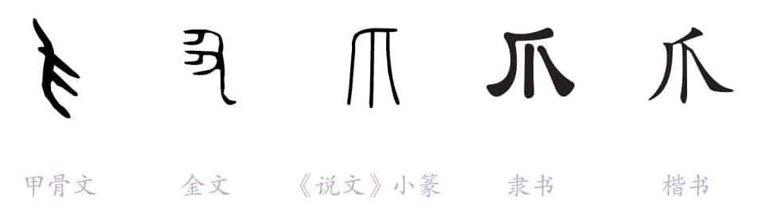

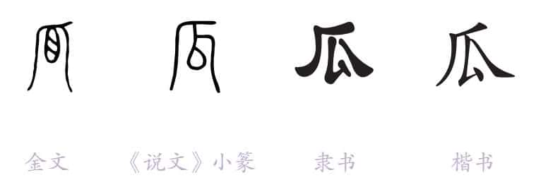

“爪”抓人时从上往下抓，动物发动攻击时也是如此。老虎也好，狮子也罢，它们的利爪和獠牙都是特别厉害的武器，由此引申出一个词叫“爪牙”，用作贬义，专门指帮别人做坏事的人。

### 受 / 接受和给予 /

再来看“受”字。

“受”字里藏着两只手。一只是我们熟悉的“又”，另一只则藏得比较深。

通过甲骨文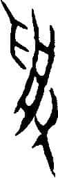和金文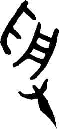，我们就能清楚地看到，“受”上面的“爫”其实是“爪”的变形，“受”下面是“又”，这两只手之间则是甲骨文的“舟”。这个字的意思是，一只手接受了另一只手授予的小船。许慎先生说：“受，相付也。”“付”就是给别人东西。

到了小篆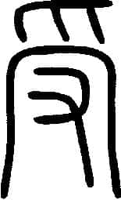，“舟”字简化为了一笔，上面的手也横过来，越来越像“爫”了。

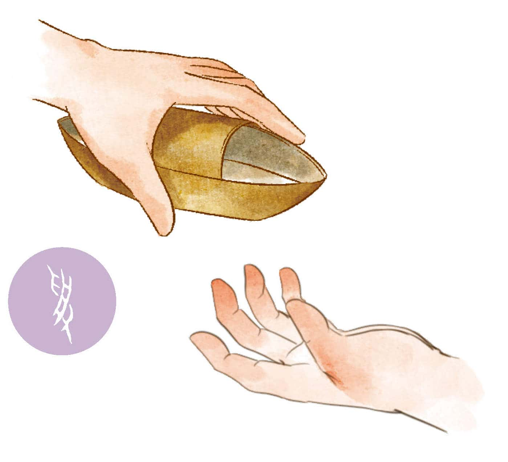

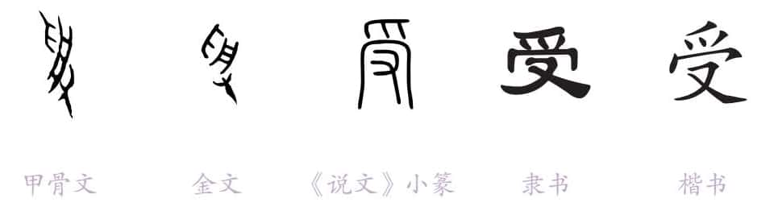

一开始，给予和接受都用“受”来表示。一只手给，一只手接，形象生动！但用着用着，就容易发生混淆。比如说“我受你一个苹果”，是我给你一个苹果，还是从你那儿接受一个苹果呢？

放心，这难不倒聪明的古人，他们将汉字分化——给“受”加一个“扌”，造出了“授”字。分化之后的“受”主要表示接受，“授”主要表示给予，清清楚楚。

但要注意的是，现代汉语中一般说“给”，不说“授”，因为“授”字比较正式，多用于“授权”“授勋”等隆重、严肃的场合。

### 争 / 君子的竞争 /

“争吵”“战争”“竞争”“争夺”……“争”这个字总带着一股子火药味。古文字的“争”，从甲骨文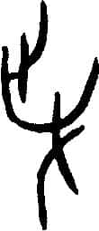到小篆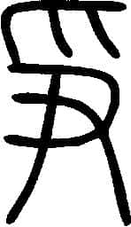，都能看出里面也藏着两只手。“争”的繁体字写作“爭”，上面的那只手和“受”里的“爫”一样，是“爪”的变形。上下两只手拽着中间的一笔，争来争去，就像拔河一样。

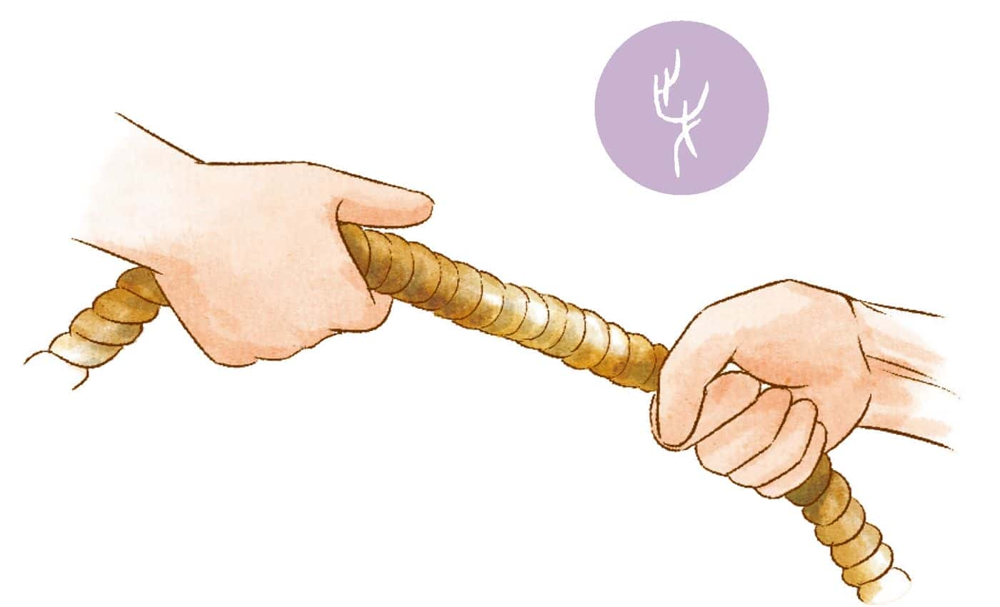

许慎先生说：“争，引也。”“引”就是拽过来。有一句古诗是“将军夜引弓”，“引弓”就是把弓弦拉开。这句诗讲的是“飞将军”李广误以为林中有虎，于是拉弓射箭，没想到箭竟然深深没入石头的故事。“引”字里暗含着李广的天生神力，也能看出它所表达的激烈的争夺感。

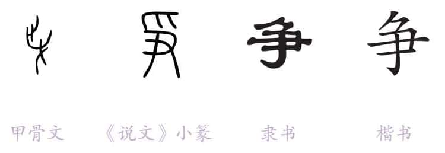

不过，中国古人并不主张争夺，而是强调以和为贵。哪怕是在竞争之中，也要注重“争”的君子风范。《论语》中有这样一句话：“君子无所争，必也射乎！揖让而升，下而饮，其争也君子。”君子没什么好争的，如果一定要比试，那就是射箭仪式——射礼吧。行射礼时，登台献艺，要互相作揖行礼，表示谦让。输了的人只需罚酒，不必要有太多惩罚，这就是君子竞争的风度。

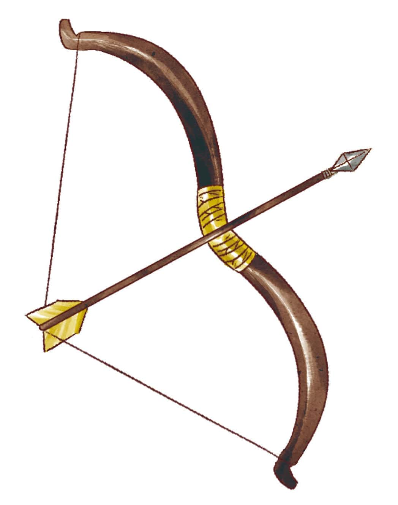

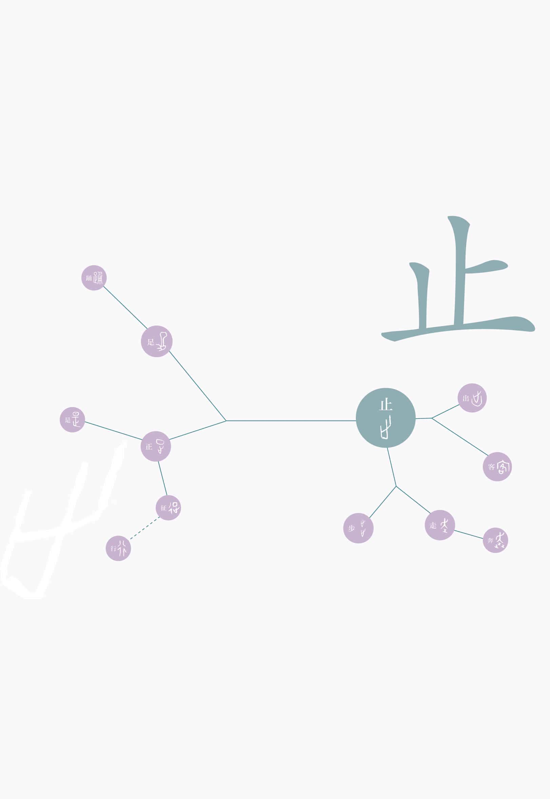

## 止·步·走·奔  
由慢到快的脚步

两只脚是我们站立的根基。古人会用怎样的字形来表示双脚呢？又有哪些与行走、奔跑有关的汉字呢？让我们一起来看一看吧。

### 止 / 脚掌与脚趾 /

古文字中有一个很有趣的字——“止”。咦，“停止”的“止”和我们的两脚有什么关系？看了古文字你就知道了。

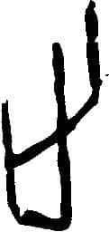是甲骨文中的“止”，它像一个脚掌，上面有三根脚趾。你可能会问，怎么还少画了两个脚趾？要知道，“止”的造字思路和“又”是差不多的，用三根脚趾就能代表全部的脚趾。

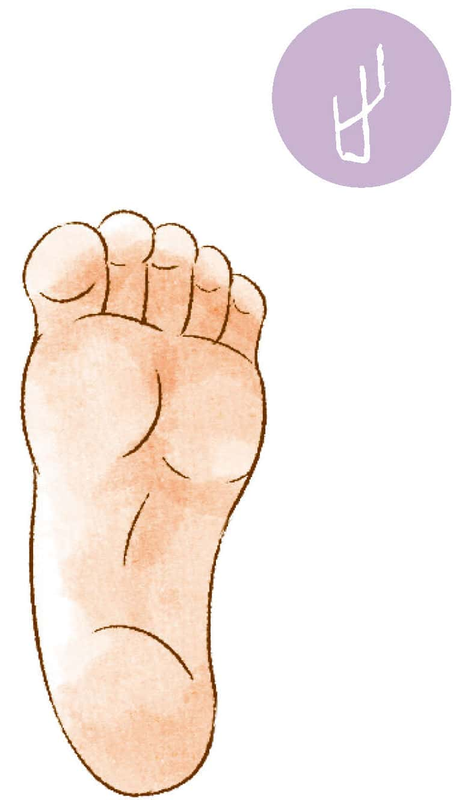

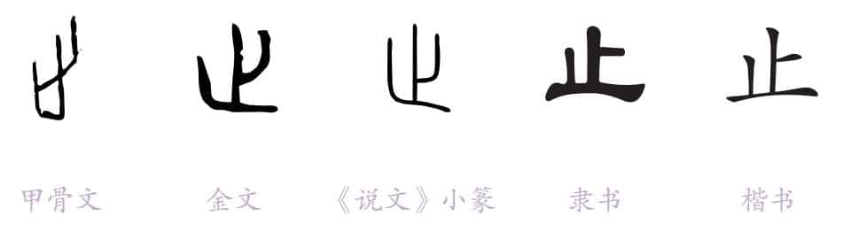

脚可以用来站立，站在一个地方意味着停留于此，因此，“止”引申出了停下的意思。“止步”“止足”“心如止水”，都是这个用法。在儒家经典名篇《大学》中，曾子说一个君子要“止于至善”，不仅要追求善的极致，更要保持在至善的境界之中。

由甲骨文到小篆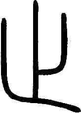，字形不断演变，越来越不像脚了。因此，许慎先生不再把“止”解释为脚，而是根据小篆字形，将它释为“下基”。在他看来，“止”像草木扎在土中的根基，扎根不动，因此有停止的意思。虽然许慎先生的说法未必符合“止”在古文字中的真实含义，但人的脚和树木的根也算相通——脚带着人扎根于尘世，根带着植物扎根于大地。

后来，“止”主要用停止之义，古人便为“止”加上足字旁，创造了“趾”字，来专门表达脚趾的含义。

### 步 / 一步一个脚印 /

和“止”有关的字大都与行走、奔跑有关，比如“步”“走”“奔”。

我们先看“步”字。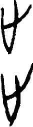是甲骨文的“步”，上面一个“止”，下面一个“止”，一前一后两只脚，表示迈步前行。多么活灵活现啊！“步”有走路的意思，“散步”“漫步”“闲庭信步”，都是从容不迫地悠然前行。

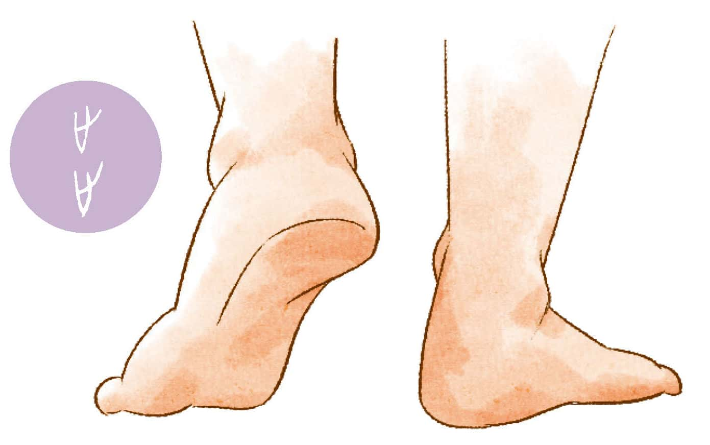

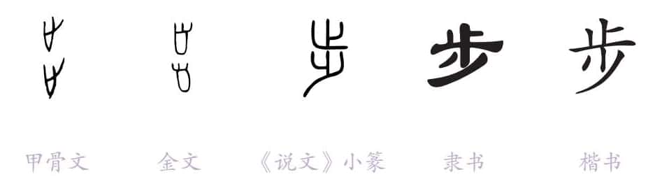

在今天，我们常说“步骤”“逐步”，做事情和走路一样，事要一件一件做，路要一步一步走，既不要急于求成，也不要止步不前。

### 走 / 飞快地跑 /

说完了“步”，再看“走”字。

在古代汉语中，“走”的意思和今天区别很大。今天的“走”是漫步，古代的“走”却是跑的意思。

真的假的？“走”怎么能是跑呢？不要惊讶，你看“走”的金文字体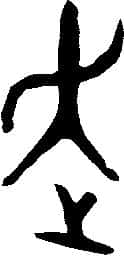，上面是一个摆臂的人，下面是“止”，表示这个字与脚有关。人在什么情况下会用力摆臂前行呢？一定是跑起来的时候。因此“走”最初就是跑的意思。从小篆到隶书，这个人形不断演变，拉直变形，变成了“土”，才有了今天的写法。

在“守株待兔”的故事里，便有“走”字的这个用法。

宋国有一个农夫，他的田地里有一个大树桩。一天，突然蹿出来一只兔子。“兔走触株，折颈而死”，于是便宜了农夫。如果按照现代汉语的解释，一只可爱的小兔子慢悠悠地散步，碰到了树桩子，这肯定撞不死，也撞不晕。兔子都撞死了，“走”一定是快跑的意思。

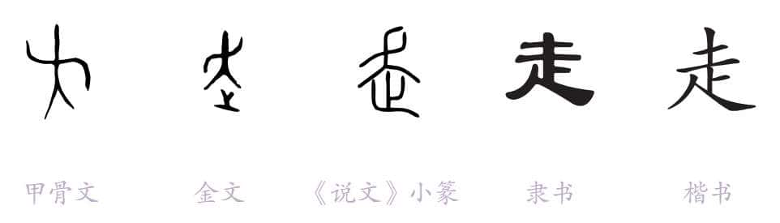

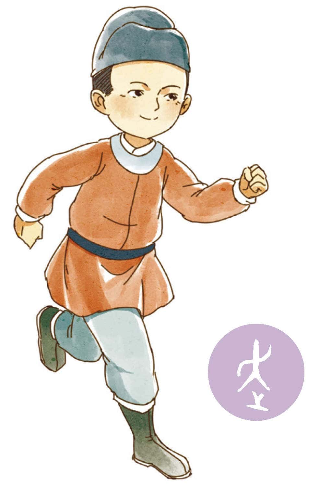

此外，还有成语“走马观花”，说的是策马奔驰。“春风得意马蹄疾，一日看尽长安花”，快马看花是多么酣畅骄傲！

### 奔 / 这个字里有好多只脚 /

最后看“奔”字。

“奔”的速度比“走”还要快，这种速度也体现在汉字里。你看金文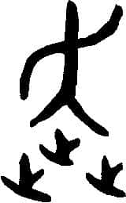，上面也是跑步摆臂的人，下面可不一样了，足足有三个“止”——这个人跑得是有多快，已经看不清下面有几只脚了。

随着汉字的演变，三个“止”慢慢变成三个“屮”，再粘连成“卉”，于是有了今天的写法——“奔”。

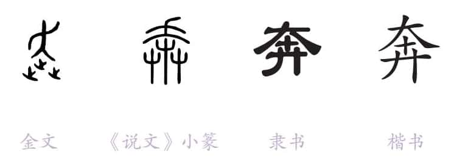

在汉语中，急速飞跑被称为“奔”。“狂奔”“飞奔”“奔流”都有风驰电掣的感觉。在古人眼中，骏马的速度最快，因此就有了“奔驰”“奔马”等词。“奔”往往也和匆忙急促的状态有关。一个人拼命快跑，什么都顾不上了。“奔波”“奔命”“奔亡”“奔逃”，都是在危险中四处逃窜，疯狂逃命。

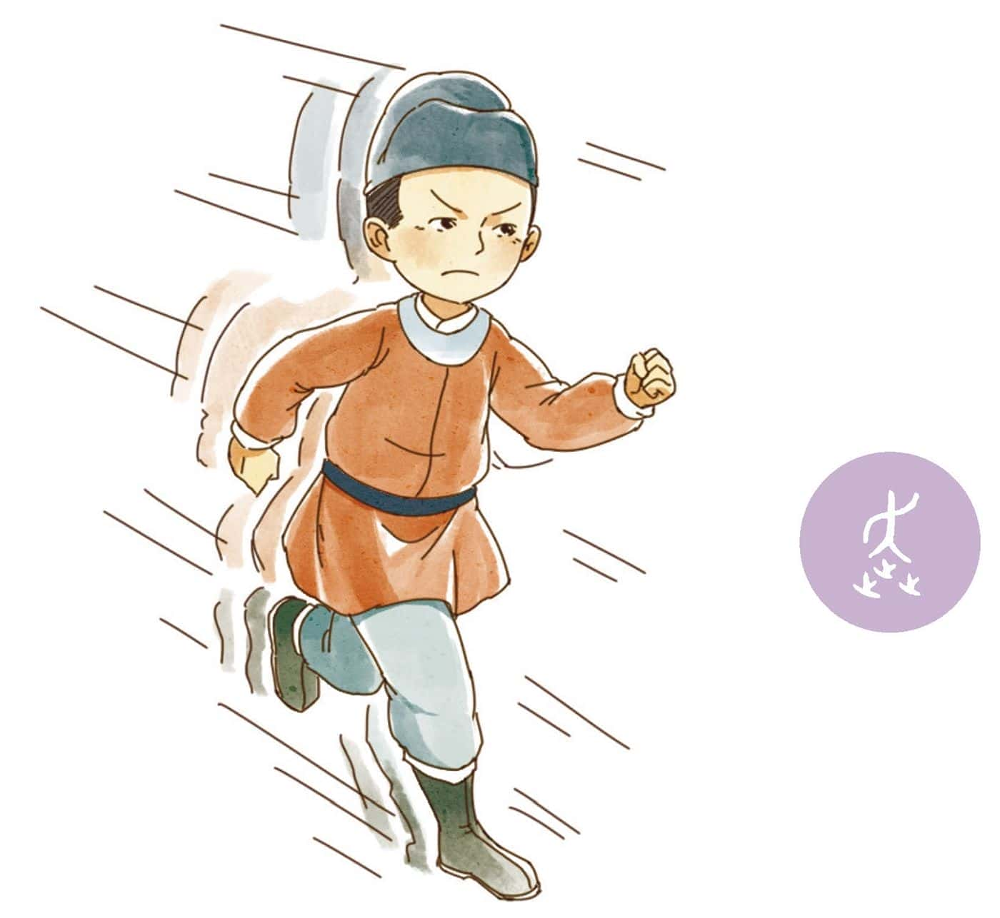

## 出·客  
脚步与住处

“出”“客”两个字很神奇，它们都与运动的“止”密切相关，却又看不出一丁点儿脚丫子的痕迹。这是什么原因呢？我们依旧要从古文字里寻找答案。

### 出 / 走出家门口 /

古人是怎么造“出”字的呢？

你看，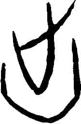是甲骨文的“出”，上面是一个“止”，下面的“凵”（kǎn）是洞穴的象形。“出”是古人迈着“止（脚）”从自己的洞穴中走出去的画面，就像我们从家中出门一样。

从“凵”字可以看出，“出”字诞生得很早，可以追溯到遥远的上古时期。那时的古人还没有体面结实的房子，他们住在洞穴里，这种生活方式被称为穴居。在陕西半坡人的原始遗址中，能看到这种穴居的遗存。

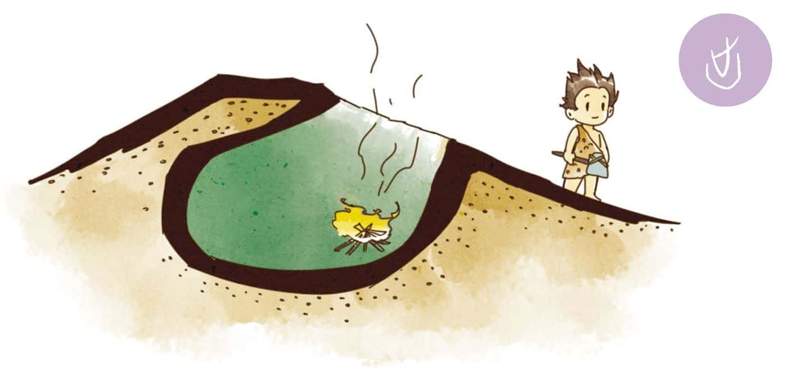

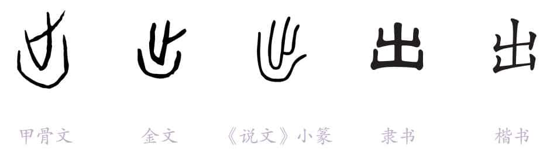

“出”的本义是出门。大诗人李白有两句诗：“仰天大笑出门去，我辈岂是蓬蒿人。”这是对“出”的生动写照。除了出门，从内向外生长出去，也叫“出”。“春色满园关不住，一枝红杏出墙来。”小小的庭园没有开门，主人也不在家，但满园的春色却无法关住。你看，一枝娇艳的杏花就伸出了墙外。

走出家门，我们可以拥抱一个新鲜的世界，世界也迎来新鲜的我们。因此，新事物的产生，也叫“出”——“出产”“出现”“出生”都是如此。新事物总是充满着走向未来的生命力，因此，“出”也表示更好、更高的意思，“出众”“出色”“出彩”“杰出”，都表示崭露头角，格外优秀。

出去是好的，但出得过多，跨过界限，便是过犹不及。因此，“出”也引申出过分的意思，如“出界”“出格”等词。

### 客 / 进屋就是客 /

“客”的上面是“宀”（mián），这是房屋的象形。以“宀”为部首的字多和房子有关，比如“宅”“室”“宫”等。“客”下面是“各”，既提示“客”的读音，又与“客”的含义有关。你看“各”的甲骨文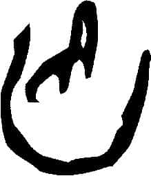，上面是“止”，下面是“凵”，只不过“止”的方向和“出”中的相反——它不是主人离开家门，而是客人来到家里。后来，古人给“各”加上“宀”，更突显出客人到家的意味。

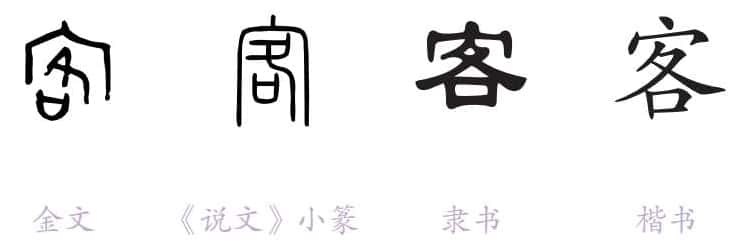

什么是“客人”？许慎先生说：“客，寄也。”“寄”是临时待在一个地方，客人就是临时来到家里的人。

中国人讲究待客之道，战国时期的孟尝君就以待客之道著称。据《史记》所载，孟尝君手下有门客三千余人。对于这些门客，不管他们身份地位高低、名声大小，孟尝君都一律尊重以待。宴请门客时，不论贵贱，他都会放下身段，和门客吃一样的饭菜，以示对每个人的尊重，这便是待客以礼。

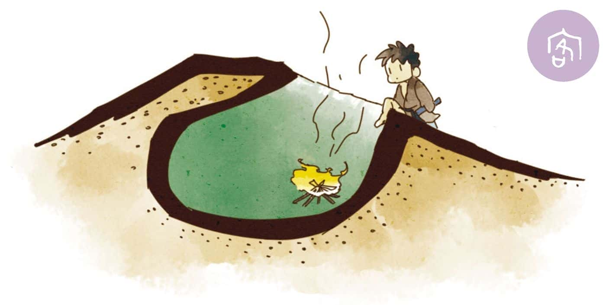

## 正·征·是  
走向正确的方向

“千里之行，始于足下”。“止”是驻足停留之处，又是迈向远方的起点。我们要朝什么方向走呢？当然是正确的方向。

这一讲的“正”“征”和“是”都与向正确的方向走有关。

### 正 / 走向一座城 /

“正”有正确的意思。《说文解字》说：“正，是也。”“是”，就是正确。

古人怎样给“正确”的意思造字呢？请看甲骨文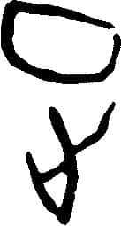，下面是一个“止”，上面是一个方块——这可不是“口”字，而是城池的象形。脚迈向正确的方向，朝着城池直直走去，便是“正”。这字造得真形象，脚对准目的地就是正确的。后来，随着汉字演变，表示城池的方块逐渐简化，变成了“一”，就形成了沿用至今的“正”。

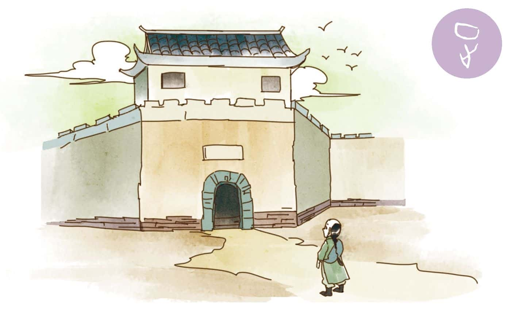

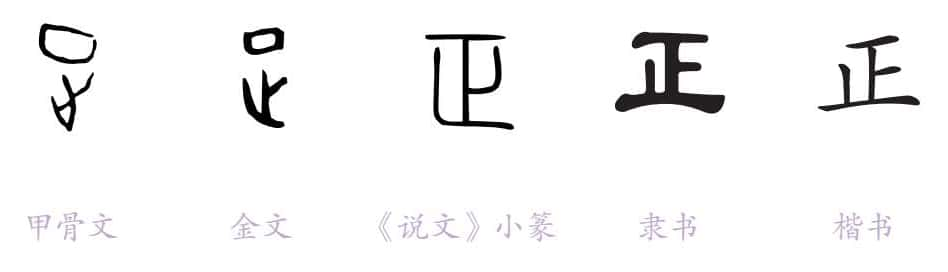

走正确方向的“正”，可以组成“端正”“正直”等词，也可以组成“纠正”“改正”等词，这些都与正确之义密不可分。

古人强调“守正”。孔子在《论语》中说：“君子食无求饱，居无求安，敏于事而慎于言，就有道而正焉，可谓好学也已。”做一名真正的君子，不要过度追求物质享受，不要刻意求取利益，而要安贫乐道。与此同时，做事努力，慎重说话，还要多与仁人志士交往，从而端正自己的行为。一个人若是做到了这些，孔子会由衷地赞叹：“这个小伙子真是个好学的人啊！”

你看，在孔子关于“好学”的标准中，“守正”是最根本的！

### 征 / 正义之师，出征！ /

“征”是从“正”分化出来的字，“正”左边添加一个“彳”，就成了“征”。什么是“彳”呢？我们知道这个部首叫“双人旁”，可是这个名字其实并不准确，“彳”和人一点儿关系也没有。“彳”是“行”的一半。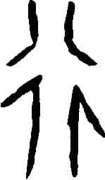是甲骨文的“行”字，它像个十字路口，周围是四通八达的道路。“彳”也因此与道路、行走紧密地联系在一起。“征”——“正”加“彳”，表示要开启正确的征程。

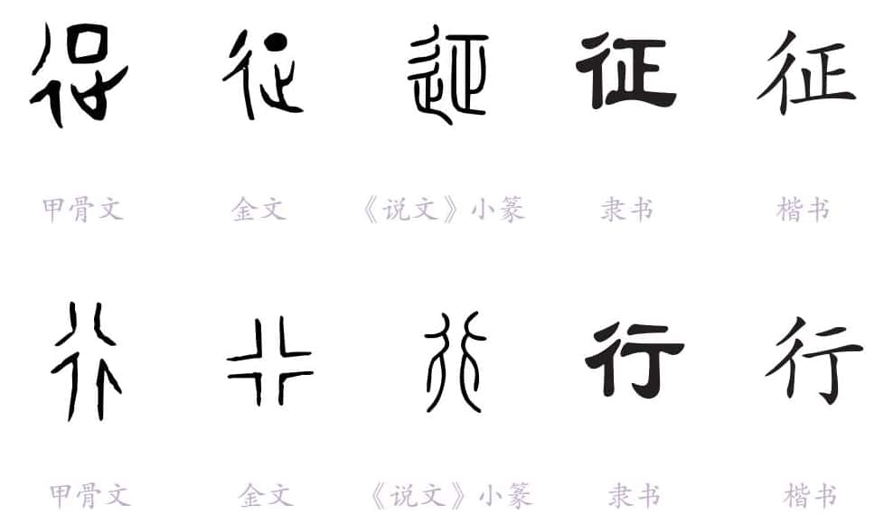

“征”有长途跋涉的意思，“征人”就是远行的人。所谓“征伐”“征讨”，都是捍卫正义的战争。古人说“奉辞伐罪曰征”，接受天子的命令，讨伐罪人，才是正义的征伐。即便不是正义的战争，讲究师出有名的古人，也会去强调自己战争的正义性。

西汉时期，汉景帝施行削藩政策，想削减诸侯王的权力。七王对此不满，发动叛乱时，便打出了“清君侧”的旗号，似乎不是为了一己私利，而是为了国家大义，来清除皇帝身边的奸臣。我们更为熟知的曹操，他挟天子以令诸侯，借天子的名义来号令群雄，征讨四方，维护自己的正义性。

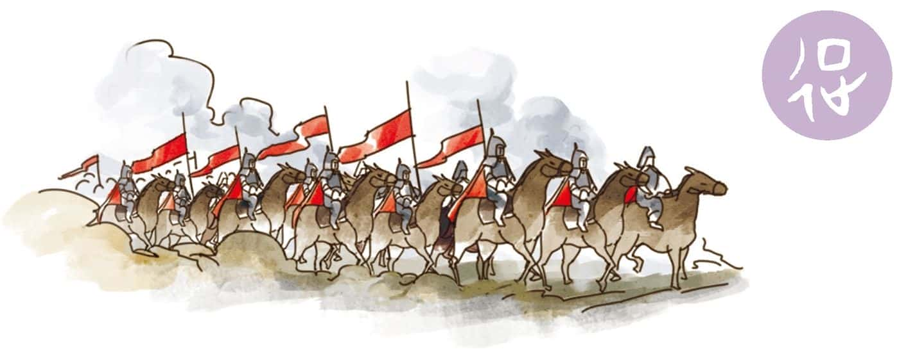

孟子曾经说过“春秋无义战”，没有什么战争是绝对正义的！尽管“征”中有一个“正”字，但它其实总是正道的反面。

### 是 / 朝向太阳就对啦！ /

“是”和“正”密切相关，“正”加上“日”就成了“是”字。“是”有正确的意思，“正确”和“太阳”之间，又有着怎样的关系呢？

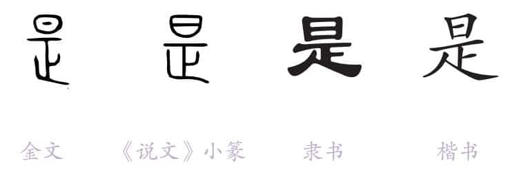

清代大学者段玉裁的解释是：“天下之物莫正于日也。”在这个世界上，没有比太阳更为端正的了。笔直的日光象征大是大非，“正”则代表正确、正义。因此，“是”代表着充分的肯定，“是的”“真是”“绝对是”都是这个意思。

当然，如果一个人过于骄傲，听不进去别人的意见，我们也会说他“自以为是”，明明错了，但偏认为自己正确，怎么劝都不听。一个人总是自以为是，意识不到自己的缺点，就会慢慢变得“一无是处”，一点儿优点也没有了。

## 足·踊  
蹦蹦跳跳的汉字

在汉字世界里，“足”是脚的意思，足字旁是我们熟悉的偏旁部首。在古代，“足”和“止”是一个意思吗？和“足”相关的汉字又有哪些有趣的含义呢？

这一讲，我将给你介绍“足”字以及由它组成的“踊”字。

### 足 / 不止是脚 /

甲骨文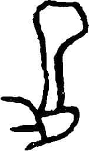是一个非常形象的象形字。它的下面是我们熟悉的“止”，也就是脚，上面画出了腿部的样子。“足”最初指从腿到脚的整体。随着汉字的发展，“足”的上面简化为了“口”，下面的“止”也发生了形体上的变化，字义也专指“脚”。

许慎先生说：“足，人之足也，在下。”足在身体最下方。“千里之行，始于足下”，它虽然位置低，但和人生之路最为亲近，每个人都要一步一个脚印，踏踏实实地走好自己的千里之行。

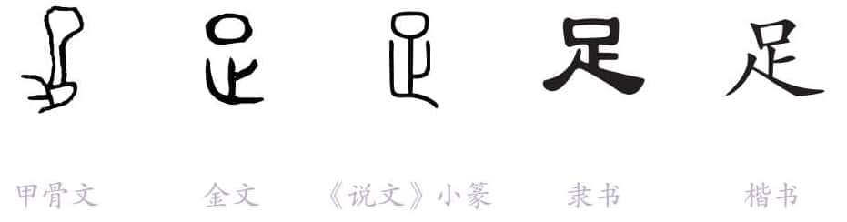

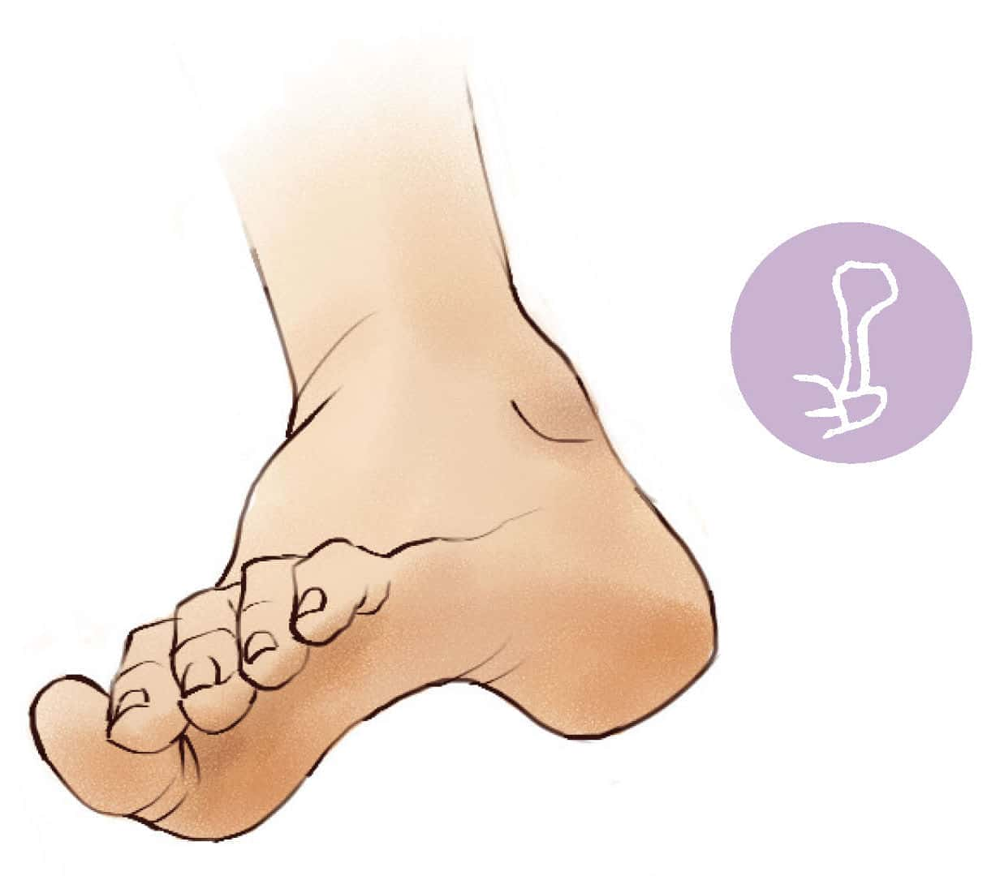

“足”指脚，便也有了停留的意思，进而引申出知足、满足之义——满足了，也就停留不动了。在生活中，我们要学会“知足常乐”，但在探索世界时，却要永不知足，永无止境。

### 踊 / 和“跳”有何不同？ /

“踊”是一个从足甬声的形声字，不太常用，现在一般只用于“踊跃”这个词。什么是“踊跃”呢？“踊”是什么样的动作呢？

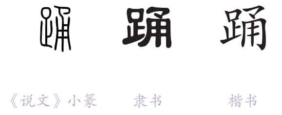

在汉字中，“踊”和“勇敢”的“勇”、“喷涌”的“涌”同源。什么是“勇气”？勇气就是心里有一股强大的力量，腾腾腾地往外冒。至于“涌”，则是泉水涌起，咕嘟咕嘟地向上冒出来。如果你去过济南的话，大概会知道，著名的趵突泉就是咕嘟嘟向上涌的。

因此，“踊”是两只脚同时离地，原地向上跳跃，它和两脚同时向前的“跳”、两脚一前一后向前的“跃”都不完全相同。

在古代，家中有亲人逝世，丧礼上要尽情表达哀伤。古人哀悼之时有三种表达悲伤的方式：第一是哭；第二是捶胸，好像哀伤结成了块儿，堵在气管里，郁结难舒，只有捶碎了才痛快；第三就是踊，原地向上跳，再落回地上，像跺脚一样。有个成语叫“捶胸顿足”，表达懊恼、后悔、痛苦的情感，说的就是后两种表现。

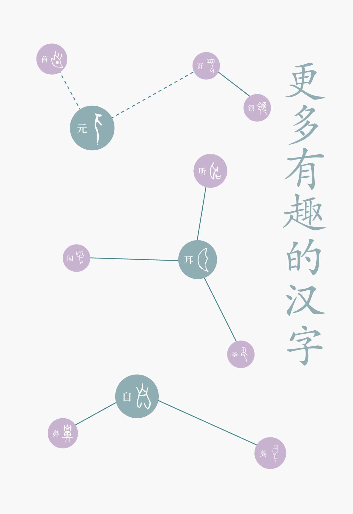

## 元·首·领  
高昂的头颅

你知道“元首”“首领”是什么意思吗？他们是一个国家、一个部落的领袖。古老的汉字告诉我们，“元”“首”“领”都和人的脑袋密不可分。头脑，不正是身体的领导者吗？

### 元 / 什么是“元帅”？ /

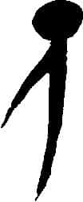是金文的“元”，画出了一个侧身站立的人，上面用一个很大的黑点凸显头部。“元，首也。”“元”是一个象形字，它的本义是脑袋。在有些古文字中，人形上面是一小横，这是为了书写便利而产生的简便写法。

“元”表示脑袋这个用法，在《左传》的一个小故事里出现过。

晋国有位大将军叫先轸，他“免胄入狄师，死焉。狄人归其元，面如生”。他没戴头盔便冲锋陷阵，虽然不幸战死，但狄人敬重他是一位慷慨报国的勇士，便“归其元”——把他的头颅送回晋国。先轸虽死，但“面如生”，脸上依旧是英勇杀敌的神情。

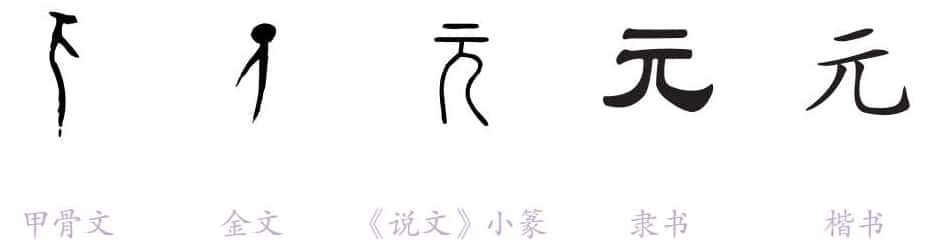

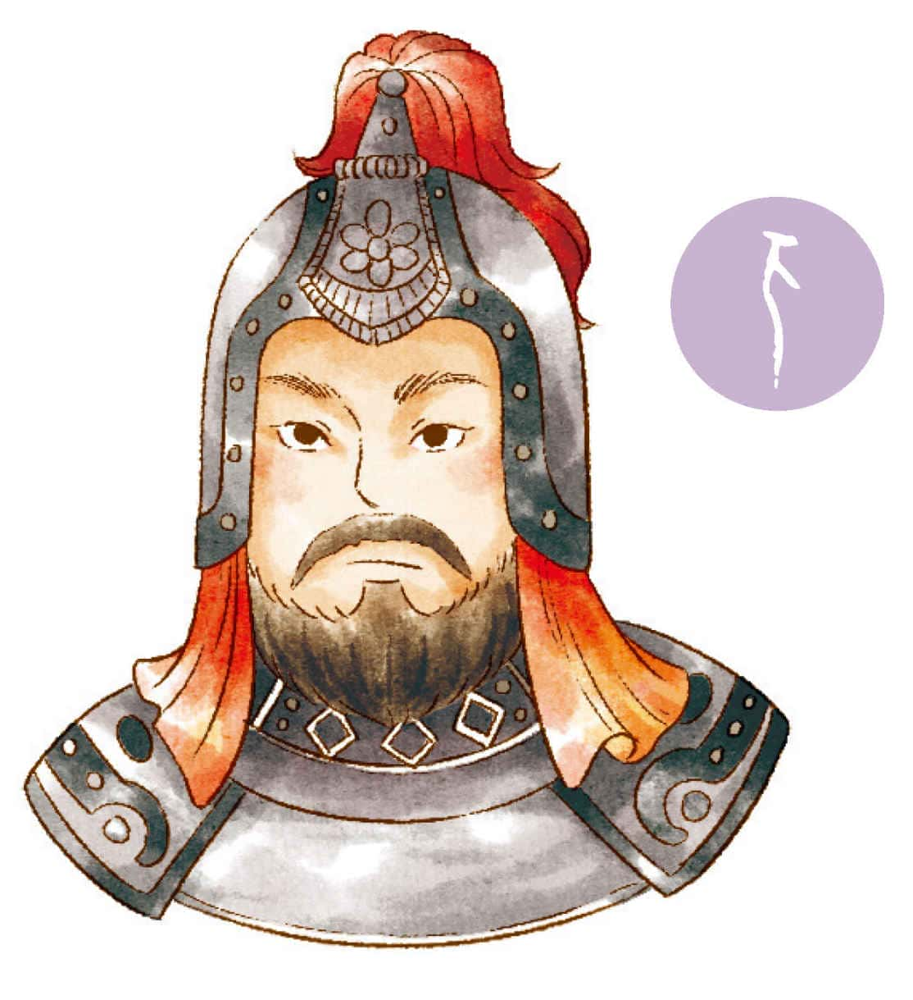

《孟子》中也有这样的用法。“志士不忘在沟壑，勇士不忘丧其元”，这里的“不忘”是常常想到的意思。这句话是说，仁人志士时常想着为国捐躯，勇士更要有不怕砍头的觉悟。

头是身体的领袖，也是身体的顶端、开端，其地位最为重要。含“元”的词组的意思都和这一特点密切相关：三军大将称为“元帅”，国家功臣称为“元勋”，这里的“元”都是重要的意思；“元月”“元旦”分别指每年的第一个月和第一个月的第一天，这里的“元”是开始的意思。

### 首 / 头上长着三根毛 /

在古文字中，“首”也是一个典型的象形字。你看甲骨文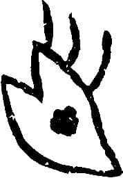，真是丑极了，但我们不得不承认，它确实是一个脑袋的样子——下面是头，头上还长着三根毛。到了金文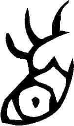，头上的三根毛保留了下来，面部则变成了“目”——一只眼睛来代表整张脸。到了小篆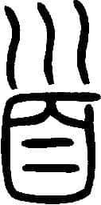，上面依旧是三根毛。随着汉字的不断简化，“三毛”变成了“二毛”，最后慢慢变成今天的“首”字。

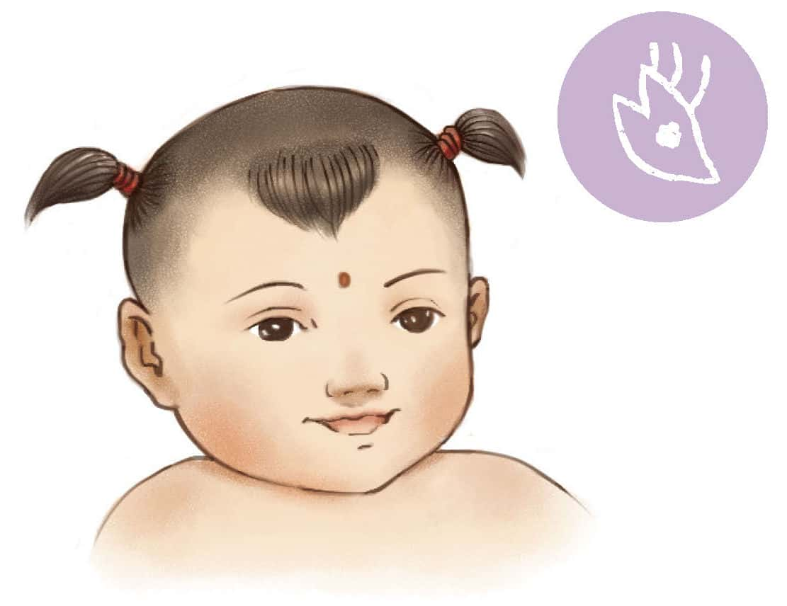

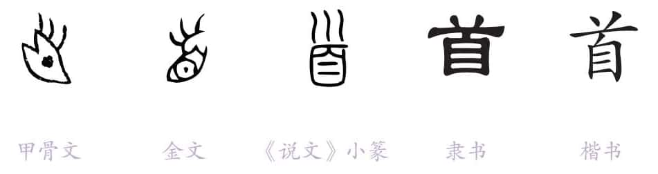

“首”可以组成很多词语：人头叫“首级”；女孩子戴的饰物叫“首饰”，是头部的装饰；军队的高级将领称为“首长”，《水浒传》中的梁山好汉被称为“首领”，都用头来表示领导；一个国家的政治中心叫“首都”，国都就是国家的头脑；一年的第一天被称为“岁首”，这是时光的开端……

“首”和“元”本义相同，词义的引申也特别相似，难怪它们可以合在一起，组成“元首”一词。

### 领 / 首领和领袖 /

除了脑袋，我们还经常用“领”来称呼元首——“领袖”“首领”“领导”。“领”是什么意思呢？

“领”是一个从页令声的形声字，“页”在古代念xié，它的甲骨文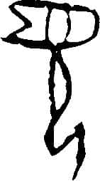是一个跪坐的人，顶着一个大大的脑袋，这最初也是头的象形。在汉字中，由“页”组成的字大多与头部有关。表示脖子的“项”“颈”“领”，表示头顶的“顶”“颠”，表示额头的“题”，表示胡子的“须”，都是如此。

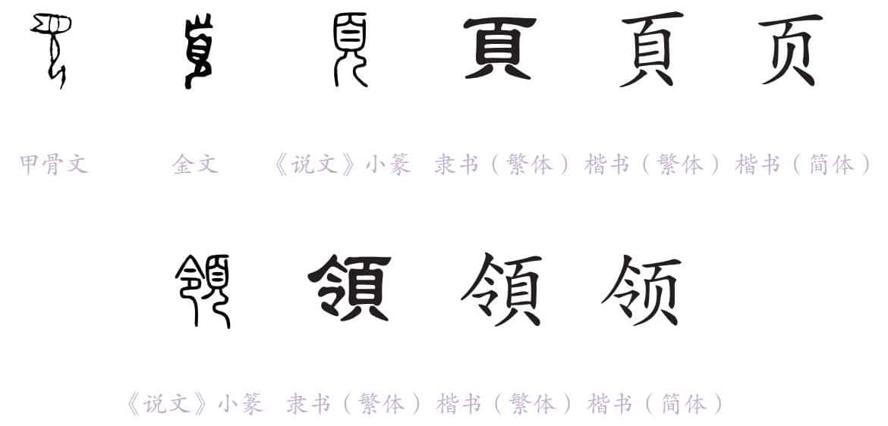

“领”的本义是脖子。在我们的身体中，脖子和脑袋都很重要，砍头其实就是砍脖子。因此，“领袖”“首领”和“元首”一样，都指那些地位最高的人。

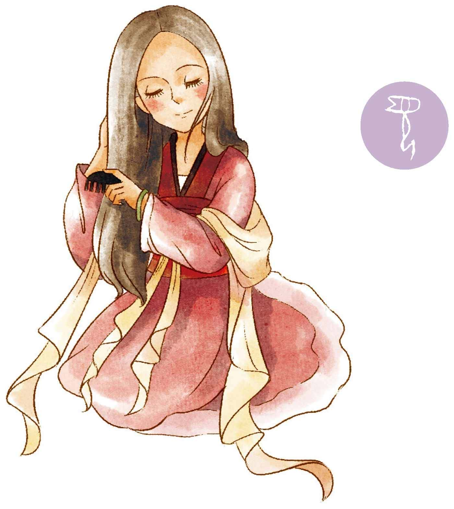

## 耳·闻·圣  
聆听中的智慧

“耳”是很重要的器官，也是一个重要的部首。在古老的汉字中，“耳”是什么样子的呢？在这一讲，我将为你介绍和耳朵有关的字——“耳”“闻”“圣”。

### 耳 / 一只大耳朵 /

甲骨文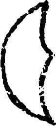、金文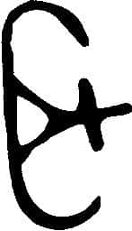是标准的象形字，惟妙惟肖地画出了一个耳朵，似乎还在倾听大自然的声音。到了小篆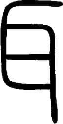以后，“耳”的形体和今天的写法越来越接近。

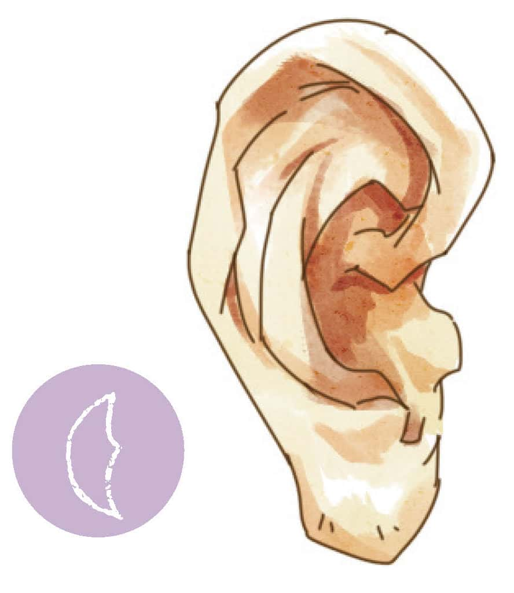

耳朵可以聆听世间各种各样的声音。在繁体字中，“聆”“聽”“聲”等和声音、倾听有关的汉字都有个耳朵旁。特别是甲骨文的“听”——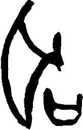，左边是一个大耳朵，右边是口。我说，你听，真形象！

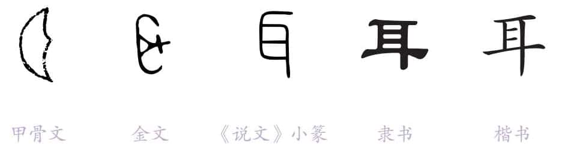

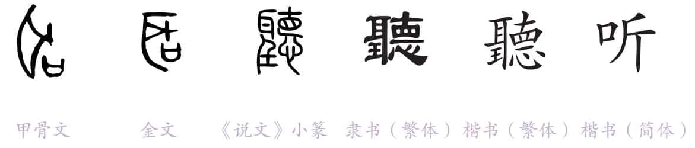

在《论语》中，孔子曾提到过自己的耳朵。他历数自己的人生境界，说道：

吾十有五而志于学，三十而立，四十而不惑，五十而知天命，六十而耳顺，七十而从心所欲，不逾矩。

孔子六十岁的时候达到了“耳顺”的境界！什么是“耳顺”呢？“顺”有通畅、明了的意思，用东汉大儒郑玄的话来说，孔子是“耳闻其言，而知其微旨”。要知道，一个人只活在自己的小世界里，会很难理解别人的心灵，也就做不到生命的感通。“六十而耳顺”指的是孔子听了别人的话，就能深入地走进他人的内心世界，这是一种能深切地理解别人的智慧！

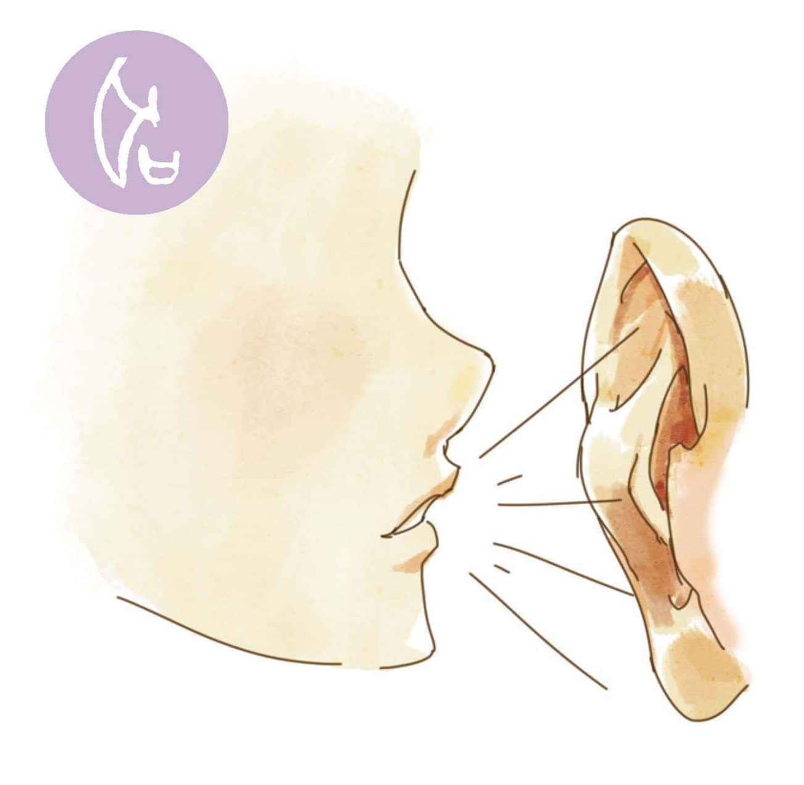

### 闻 / 春眠不觉晓，处处闻啼鸟 /

“春眠不觉晓，处处闻啼鸟。夜来风雨声，花落知多少。”这首诗里有一个“闻”字，它也和耳朵密不可分。“闻”从耳，表示听的意思。在春天的早晨，听着窗外的鸟啼之声，是不是很有韵味呢？

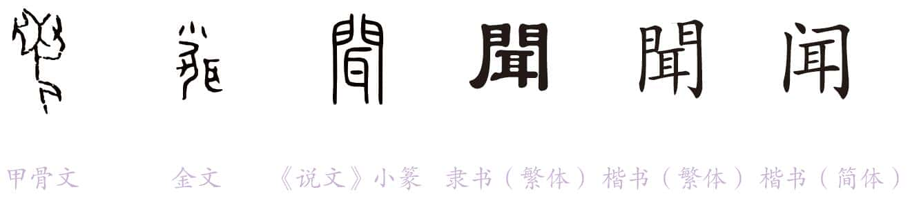

甲骨文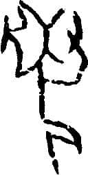是一个跪坐的人，双手捧着自己的大耳朵，表示用心聆听。而小篆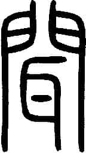则变成了一个从耳门声的形声字。后来，它又从繁体字“聞”演变为简体字“闻”，传承至今。

《论语》中有一句掷地有声的话：“朝闻道，夕死可矣。”在孔子看来，如果有一天，早上能听闻大道，哪怕晚上就死去也是值得的！足见他对大道的渴盼之情。

除表示听觉之外，“闻”还可指嗅觉。咦，气味怎么能用耳朵“闻到”呢？要知道，耳朵和鼻子都能获取信息，因此在语言上也会发生关联——眼见、耳闻、鼻嗅、口尝，我们的五官感受在语言中往往互通有无，这就是所谓的“通感”。

通感在生活中很常见，比如“小姑娘笑得很甜！”在这里，甜是味道，却能用来描写眼睛看到的笑容。“闻”用于嗅觉亦是如此。

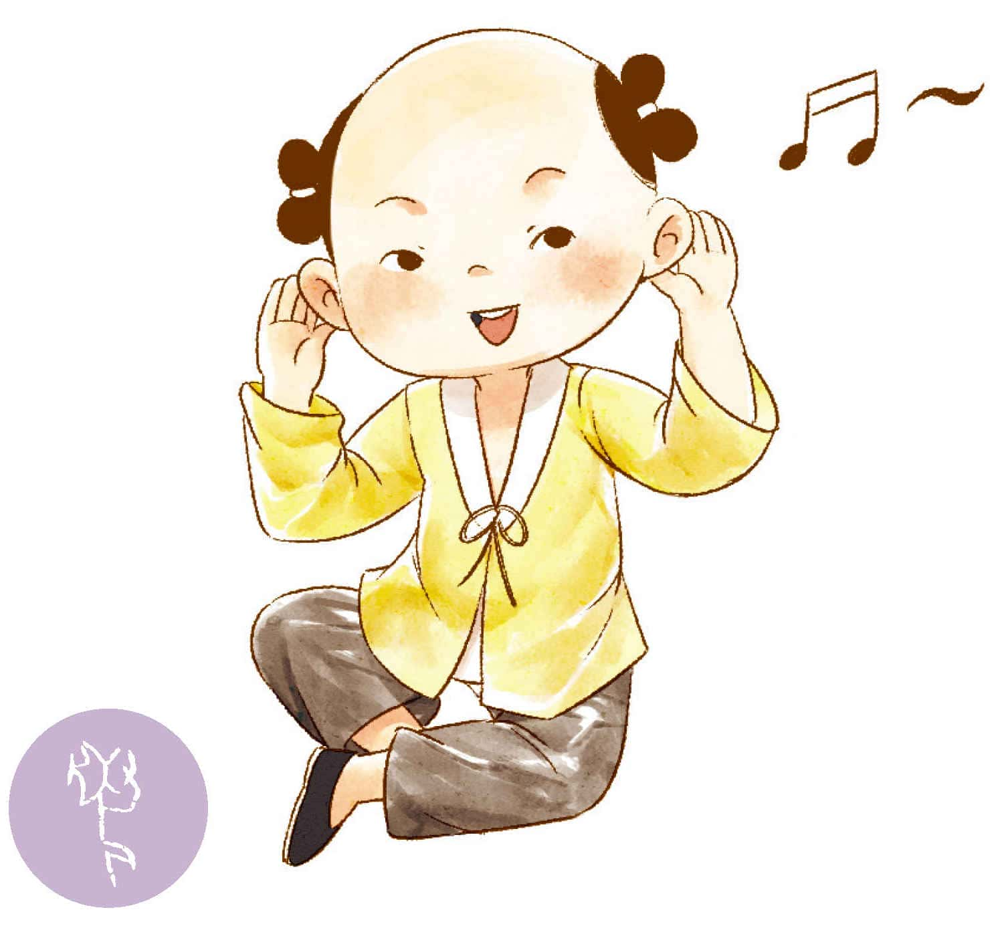

### 圣 / 耳朵与圣人 /

中国人把伟大的人称为“圣人”——尧舜禹汤是圣人，孔子、孟子是圣人，关羽也是圣人。什么是“圣”呢？

现在的“圣”，上面一个“又”，下面一个“土”。这其实是简化后的汉字，圣人和“土”可一点儿关系也没有！

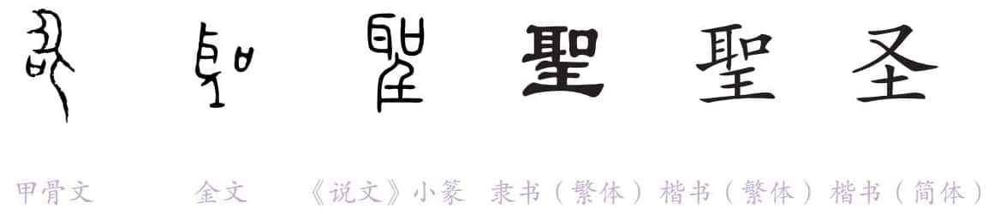

解读“圣”字还是要从繁体的“聖”字入手。“聖”里也有个耳朵！再追溯到甲骨文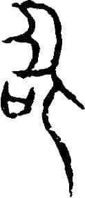，“圣”字下面是一个人，上面则是一只大大的耳朵。圣人和耳朵之间，有什么关系吗？

在古人看来，圣人是那些能够广泛听取知识、接受别人意见、充分理解别人心灵的人！孔子的“耳顺”其实就是圣人的境界。许慎先生说：“圣，通也。”圣人的通达，正来自对万事万物通透的理解。

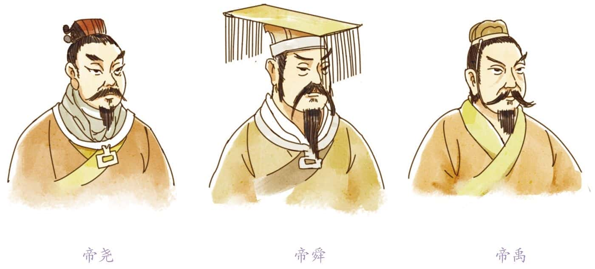

## 自·鼻·臭  
鼻子与“我”

在汉字中，“自”是一个意味深长的字。自我、自己、自立、自信、自由、自觉，都与我们的生命密切相关。“自”的背后，蕴含着古人的自我意识，体现出他们对“我是谁”这个问题的思考。

要知道，对“自我”的反思能力，可是人与动物最关键的区别之一。“自”如此重要，古人又是怎样给它造字的呢？

### 自****鼻 / 指着鼻子说自己 /

“自”在甲骨文中就已经出现了，你看它的字形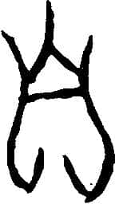，像什么呢？

没错，这是鼻子的象形。鼻子最重要的功能是呼吸，因此，表示喘息的“息”字里就有个“自”。除了呼吸，鼻子还有一个重要的交际功能——自我介绍。两个朋友见面时，要给对方介绍自己，你会怎么办呢？你会指着自己的鼻子说，我叫某某某。自我介绍时，人们总是不自觉地就能找到鼻子，好像鼻子是自己天然的代表一样。正因如此，“自”具有了自己、自我的意思。在汉语中，“自”组成的词很多都和“我”密不可分：

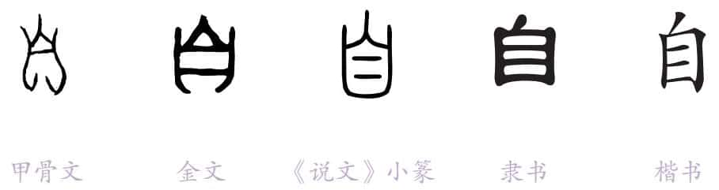

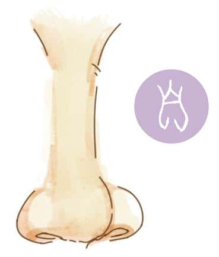

“自然”是要符合一个生命本来的样子；“自由”是按照自己的想法，无拘无束；“自主”是自己能做自己的主人；“自立”是依靠自己获得独立；“自信”是相信自己；“自”膨胀了，就是“自满”；“自”怯懦了，就是“自卑”……这些词语里的“自”，都有“自我”的意思。

“自”指鼻子，这个意思今天已经很少用了，我们一般直接说“鼻”。可你知道“鼻”这个字是怎么造出来的吗？

“鼻”上面是“自”，表示鼻子，下面不是“田”，而是一个“畀”（bì），这是“鼻”的声符。“鼻”是一个从自畀声的形声字。值得注意的是，声符“畀”也携带着意义，表示给予。

许慎先生说：“鼻，引气自畀也。”“引气”是把空气吸进来。什么是“自畀”呢？就是把新鲜的空气给予自己。鼻子是把空气给予自己的器官！除呼吸之外，鼻子还能闻味道。战国大思想家荀子说：“鼻辨芬芳腥臊。”无论香气还是臭气，都要用鼻子来分辨。

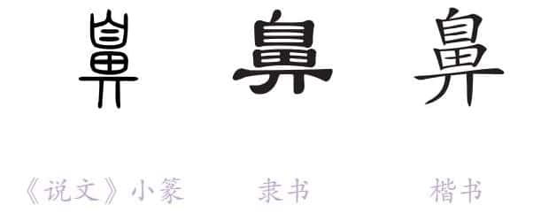

鼻子位于身体的正前方，小猫、小狗、小老鼠都用身体最前端的鼻子来触碰事物。由于鼻子位置靠前，它也有开始、起点的含义。汉语中有个词叫“鼻祖”，就是始祖的意思。比如，工匠的鼻祖是鲁班，研究草药的鼻祖是神农，那研究汉字的鼻祖又是谁呢？

当然是我们亲爱的许慎先生啊！

### 臭 / “臭”字并不臭！ /

在自然界中，谁的鼻子最灵呢？反正肯定不是人类。古人认为，狗鼻子最灵，因此，有一个由狗鼻子组成的汉字——“臭”！

在今天，“臭”主要指难闻的味道，但在古代却并非如此。

你看，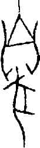是甲骨文的“臭”，上面是表示鼻子的“自”，下面是一个“犬”。狗鼻子最好用，所以古人用这个字来表示闻味道的动作。这时，这个字读作xiù。到了后来，古人给“臭”加了个“口”字，专门用来表示“嗅”。

在古代，“臭”不仅指臭味，也可以指香气。《周易》中说：“同心之言，其臭如兰。”两个人内心相通，他们的话十分中听，就像兰花的气味一样。随着语言的发展，“臭”逐渐专指难闻的气味，读音也变成了chòu。在汉语中，有一个词叫“遗臭万年”，一个人太坏了，他的恶名就像臭味一样，千万年都消散不掉，永远受人唾弃。

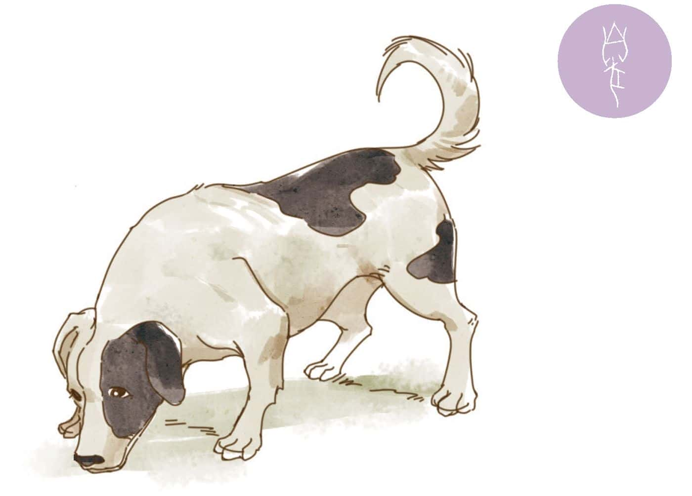

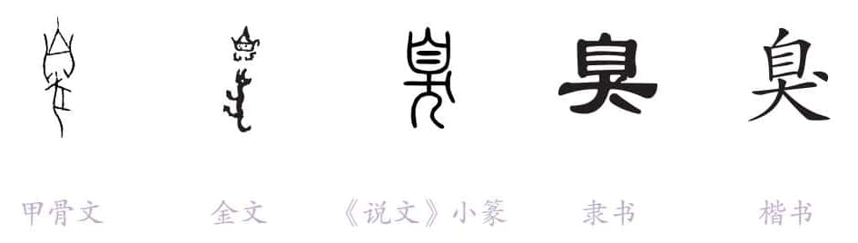

