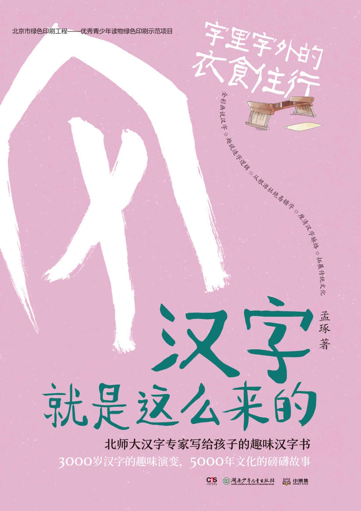

# 版权信息

书名：汉字就是这么来的·字里字外的衣食住行

作者：孟琢

出版社：湖南少年儿童出版社

出版时间：2020-08-01

ISBN：9787556251964

本书由天津博集新媒科技有限公司授权亚马逊发行

版权所有 侵权必究

# 目录  
CONTENTS

**衣 
衣·初·裁 古代的衣服样式 

卒·裳·裘 古人穿什么样的衣服？ 

表·里 衣服的内外 
**

**冖 
帽 帽子的历史 

冠·冕 与礼有关的帽子 
**

**糸 
糸·丝·线·缕 千丝万缕的丝线 

绝·继·续 断线与接线 

经·纬 什么是经典？ 
**

**皿 
皿·益 和器皿有关的汉字 

簋 簋是一个筐，粮食往里装 

血·盟 和器皿有关的仪式 
**

**酉 
酉·酒·醉 人生得意，一醉方休 

尊 盛酒的器皿 

医 酒也是一种灵丹妙药 
**

**宀 
宀·穴 原始人的房子 

家·宅·牢 房子和动物的关系 

向·窗 窗户和烟囱 

室·宫 讲究的房子 

安·宜·宿 安居乐业的家园 

官·守 屋子中的大官 
**

**门 
门·户 安全的保障 

启·闭 开门与关门 
**

**木 
几·桌·凳·椅 古人的家具 

床 床是用来坐的？ 
**

**车 
车 古代的车什么样？ 

军 周王有多少大军？ 

轼·辙 那些和车有关的人名 
**

**更多有趣的汉字 
贝·贡·赏 与钱有关的故事 

舟·船 木质的小舟与大船 
**

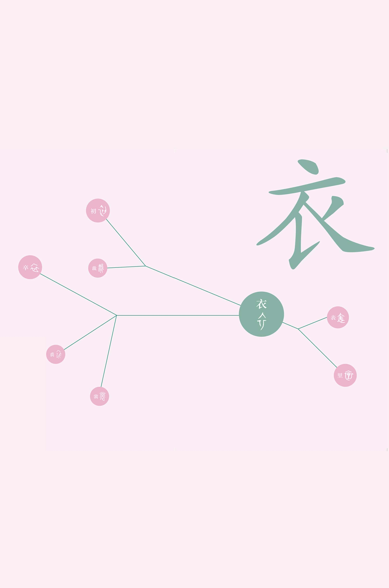

## 衣·初·裁  
古代的衣服样式

在汉字世界里，有很多和衣食住行有关的字。有身上穿的“衣裳”，头上戴的“冠冕”；有古雅肃穆的九“鼎”，有不醉不休的“尊爵”；有遮风避雨的“房屋”，有阻挡危险的“门户”；有行驶在道路上的“车马”，也有游荡在江河中的“舟船”……可以说，汉字，记载了中华民族的生活方式。

说到与衣服有关的字，在《说文解字》[1]衣部字中收录的有100多个，多为形声字。包括衣服种类、成衣部件、衣服纹饰等，反映出古代服饰文化的方方面面、点点滴滴。在遥远的古代，古人的衣服又是什么样子的呢？这里我们就来讲一讲与“衣”有关的汉字——衣服的“衣”、与裁剪有关的“初”和“裁”。

### 衣/ 古人的特色衣领 /

许慎先生说“衣，依也”，衣服是人们生活中的必需品。

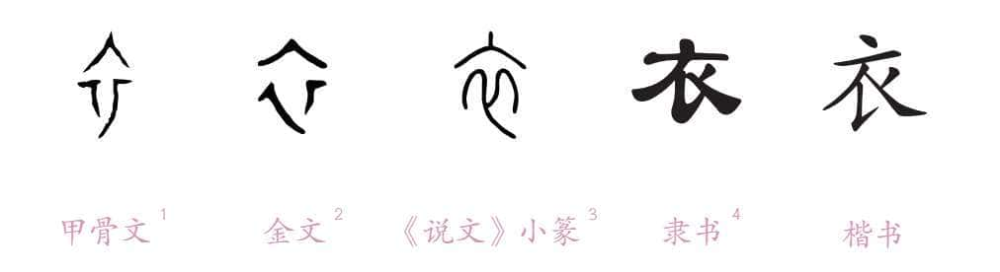

1. 甲骨文是目前能看到的最古老的汉字，它是中国商周时期的文字，因为刻写在龟甲兽骨上，所以被叫作“甲骨文”。

2. 甲骨文之后的文字叫金文，也叫“钟鼎文”，是商周时期铸刻在青铜器上的文字。我们见到的青铜器大多数是青黑色的，但它刚刚铸造出来的时候，其实是耀眼夺目的金黄色。所以，叫“金文”。

3. 战国时期，各诸侯国的文字不同，严重影响诸侯国之间的交流。秦灭六国之后，除了统一国土，也统一了度量衡，统一了文字，规定了标准字体——小篆。

4. 隶书由篆书简化演变而成。小篆字形规整、端庄大方，但不易书写。秦国以法治国，政令繁多，大小官吏用小篆书写，效率不高，于是他们在办公过程中自觉地简化了汉字，用一种简便的字体书写了大量的公文，这便是隶书。从小篆到隶书发展演变的过程，叫作“隶变”。

中国古代衣服的历史，可谓源远流长。我们的祖先最初用树叶遮挡身体，薄薄的树叶既不牢靠，又不保暖，于是他们先是裹上兽皮，后来又发明了布，将兽皮布料缠在腰上，前面垂下一块，用以遮挡关键部位。这就是《说文解字》“上古衣蔽前而已，巿以象之”中所说的“巿”（fú）。由于“巿”只能在前面遮羞，不能保暖，人们又进一步发明了各式各样的衣服。

每个民族的服饰都有自己的标志性特色。比如说，印度服饰的特色在于美丽的纱丽，阿拉伯服饰的特色是缠头巾和长袍，汉服的一大特色则是衣领。

汉服衣领的样式，在很早之前就已经形成了。在3000多年前的甲骨文中，便能看到它们的模样。甲骨文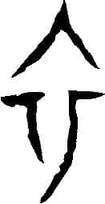中，“衣”是一个典型的象形字。什么是“象形字”呢？古人在造字的时候，用绘画的方式描绘事物的形状，由于画得很像，所以叫象形字。结合的字形，再联想一下古代的服装，不难看出“衣”是一件衣领左右交叠的衣服。由此可见，中国汉服衣领的基本样式，早在商朝便已经形成了。

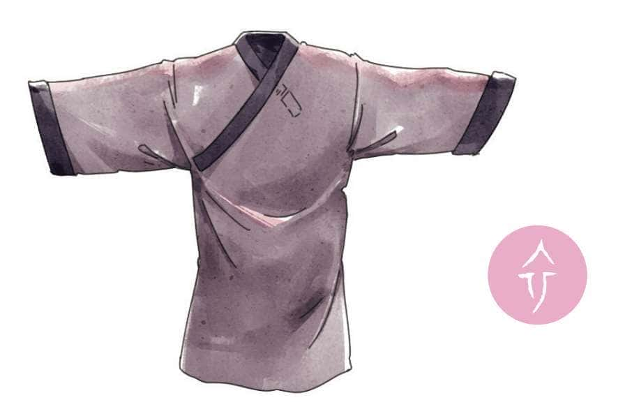

汉服衣领交叠的方式很有讲究。古人的衣服没有扣子，多用系带固定。汉服的领子一长一短，长长的左襟压过短短的右襟，盖过正胸，由系带固定在身体的右下侧。两个领子相互交叠，叫作“交领”；因为系在右侧，叫作“右衽”。

少数民族服装的领子，和汉服正好相反，是右襟压左襟，叫作“左衽”。如果你去过三星堆遗址，见过那个眼睛像外星人一样的青铜立像，就会发现，作为西南夷一支的古蜀国人，他们的衣领就是“左衽”的。

不过，需要注意的是，我们也不能将汉服完全界定为右衽。我们的祖国是个多民族的国家，不同民族与文化在不同时期相互交融，彼此影响，所以，在有的绘画作品里，也能见到左衽的汉服。

### 初裁 裁裁剪剪做衣服

衣服由兽皮和布料裁剪而成，缝制衣服的人被称为“裁缝”。与裁制衣服有关的字，一个是“初”，一个是我们熟悉的“裁”。

“初”不是开始的意思吗？它和衣服有什么关系呢？

《说文解字》将“初”解释为：“始也。从刀从衣。裁衣之始也。”“初”是一个会意字，什么是会意字呢？它就像拼积木一样，把不同的字拼合在一起，会聚不同字的含义，从而造出新字、表达新义。从古文字中可以看出，“初”字左边是一件衣服的“衣”，右边是一把刀。二者合在一起，表示刚刚开始剪裁衣服。因此，“初”有开始、最初的含义。

需要注意的是，“衣”在字形演变的过程中，变成了衣字部——衤。以“衤”为部首的字，比如“裙”“襦”“裤”“袄”等，都与衣服有关。明白了这一点，也就能区分“衤”和“礻”这两个相似部首之间的区别了。在《字里字外的人文历史》中，我给大家讲解过“礻”。它来自“示”，许慎先生指出，“示”上面两横象征上天，下面三垂象征着日、月、星辰——上天借用各种各样的天象，把吉凶祸福呈现给人们，让他们预测未来、趋吉避凶。例如若是扫把星（彗星）扫过天空，便是祸。因此，以“礻”为部首的字，比如“神”“祖”“祀”“福”“祸”等字，都和神灵、祖先祭祀有关。

讲完了“初”，再来看“裁”字。《说文解字》中说“裁”字为“制衣也，从衣（zài）声”，这是一个典型的形声字。

什么是形声字呢？形声也是古人造字的一种方法，绝大多数形声字都可以一分为二，一半是形符，一半是声符——形符表达汉字字义，声符提示汉字读音。在“裁”字里，“衣”是形符，表明“裁”字与衣服有关；“”是声符，用于表示读音。“”的韵母（ài）是不是和“裁”读起来很像呢？当然，有时你也会遇到读起来不那么像的字，比如“媒”的读音与声符“某”就不太像，这是因为“某”的发音在时代变迁中发生了变化。

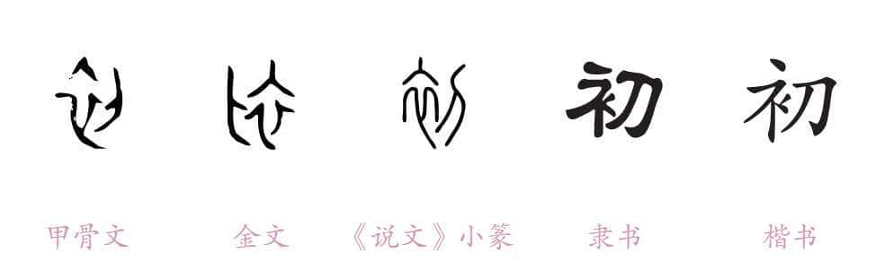

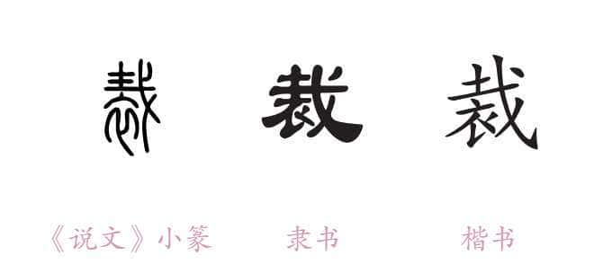

人类在什么时候开始学会裁剪、缝制衣服的呢？北京周口店出土的一枚古朴的骨针告诉我们，18000年前的山顶洞人，就已经学会用针来简单地缝制衣服了。你可别小瞧这个小小的文物，要知道，在那个洪荒的时代里，可没有什么金属器具和高科技，用粗陋的工具进行高超的钻孔工艺，已经是巨大的文明进步了！

“裁”除了表示裁切衣物，还有其他用法。比如说，在裁剪的过程中，布料慢慢减少，因此“裁”又有减少的含义，用于部队“裁军”、公司“裁员”等。“裁”也不是随意削减，而是需要“量体裁衣”，根据客人的身材裁剪出合身的衣服。因此，“裁”也往往有“衡量、判断”之义——在赛场上，由“裁判”来“裁定”运动员是否犯规；在法庭上，由法官来“裁决”一个人是否有罪，这都是“裁”的引申义。

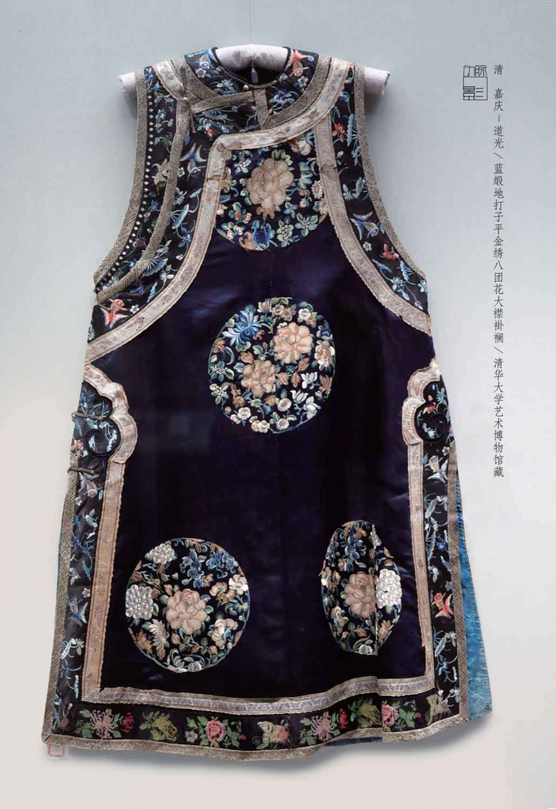

* * *

[1]《说文解字》是中国历史上第一部系统分析汉字字形、讲解汉字字理的字典，简称《说文》，作者是东汉的许慎。在体例上，它开创了部首编排法；在内容上，它用六书系统地解说汉字，并保存了部分早期古文字的写法，为我们研究甲骨文、金文等提供了依据。六书是六种汉字造字法，包括象形、会意、指事、形声、转注和假借。

## 卒·裳·裘  
古人穿什么样的衣服？

我们的衣服有很多种类，有衬衣、长裤、短裤、外衣、夹克等。古代的衣服也有很多种类。在这一讲，我将为你介绍中国古代很有意思的三种衣服——“卒”“裳”“裘”。

### 卒/ 衣服上有字的小卒 /

“卒”常指士兵，也就是军队里的小兵。在象棋中，小卒子一往无前，虽然勇猛，但战斗力可是最差的。问题在于，小“卒”和衣服有什么联系呢？

“卒”与一种特殊的衣服有关——奴隶的衣服。在古文字中，“卒”与“衣”的形体非常相似，“卒”就是在（衣）字上增加了一个标识，变成了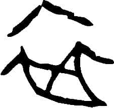或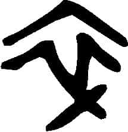，这种造字方法叫作指事。

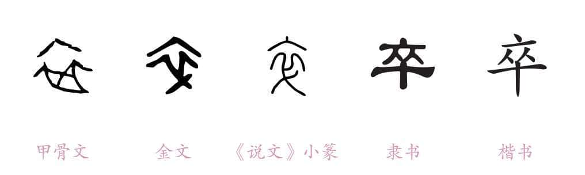

《说文解字》中说：“卒，隶人给事者衣为卒。卒，衣有题识者。”“卒”的本义是穿着特殊衣服的奴隶。奴隶和囚犯一样，身份卑微，和老百姓的衣服相比，囚犯的衣服上会多出个“囚”字，在奴隶的衣服上，也会有奴隶身份的特殊标志。要知道，（卒）比（衣）多出的两笔，就是标明这是一件特殊的衣服，穿这件衣服的人是“卒”。这种在象形字的基础上，利用一个小标签、小标记来表达新的字义的方法，就是指事。

在古代，奴隶要服劳役，士兵要服兵役，他们都属于底层民众。士兵的衣服上也标识着“兵”“勇”等标注身份的字样。因此，“卒”也表示士兵。

除了奴隶、士兵，“卒”还有完结、终结的意思。结束一段学业时，我们会说“卒业”；“生卒”中的“卒”指人结束一生，离开人世。这个含义从何而来呢？有人认为，甲骨文的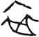（卒）在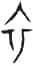（衣）的基础上加了个“×”，表示衣服缝制完成。因此，“卒”有完结的含义。

### 裳/衣和裳有什么不同？/

我们现在总说“衣裳”，在古代，“衣”和“裳”并不相同。

“裳”是一个形声字，从衣尚声。其中，“衣”是形符，说明“裳”与衣服有关，“尚”是声符，用于表示读音。许慎先生在《说文解字》中说：“上曰衣，下曰裳（cháng）。”古人把上衣叫“衣”，把下衣叫作“裳”。

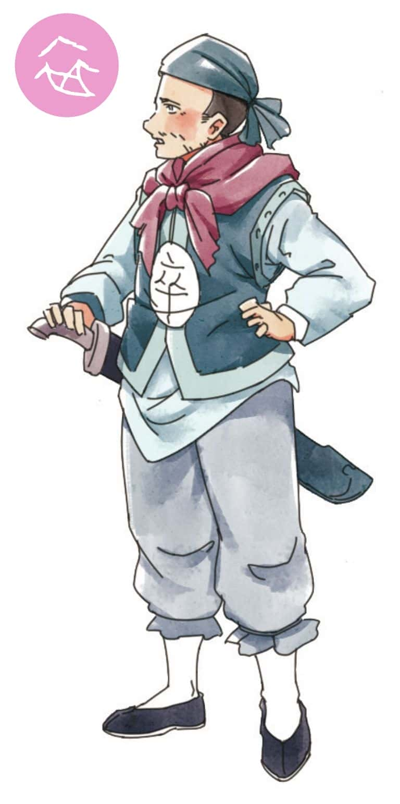

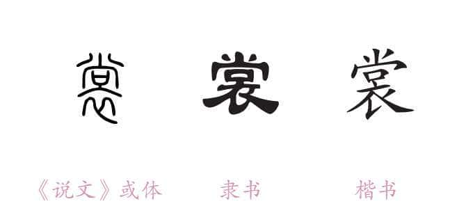

裳和裙子很像，不同的是，裙子是一片布围一圈，而裳则分前后两片，一片遮挡身体的前面，一片遮挡后面，不论男女、尊卑都可以穿。到了汉代，裳的前后两片连在了一起，变成了裙。慢慢地，裙取代了裳，成为女性的主要服装。

至于裳的读音cháng ，则在时间的流逝中变换为shang 。

### 裘/ 皮毛做的衣服 /

“裘”这个字，经历了由象形字到形声字的演变过程。

甲骨文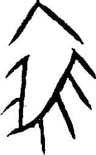（裘），是在（衣）的外部添加了表示兽毛的线条，形象地展示出一件毛茸茸的皮大衣，看上去就很暖和。随着字形的演变，金文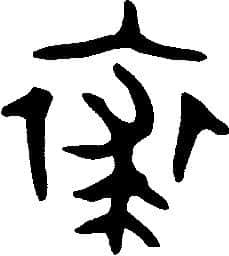（裘）在“衣”中间加入“求”字，将“裘”改造成了“从衣求声”的形声字。到隶书时，“求”字的位置被调整到“衣”字上方，变成了今天的“裘”字。《说文解字》中说：“裘，皮衣也。”寒冷的冬天需要御寒衣物，“裘”就是古代的毛皮大衣。

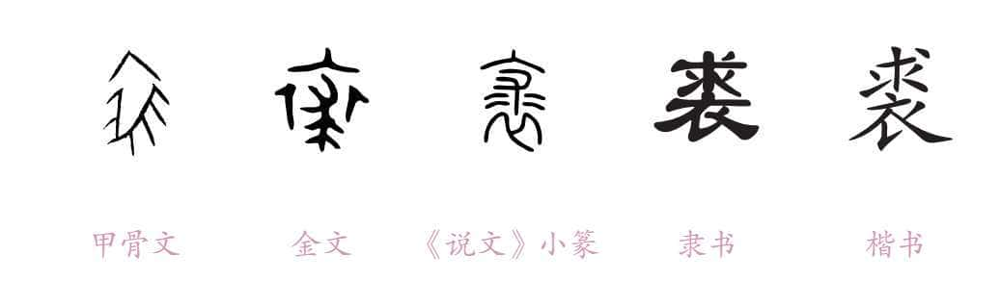

在古代，裘是只有贵族才能穿的奢侈品。大诗人李白在《将进酒》中写道：“五花马，千金裘。”名贵的皮裘价值千金。《史记》中就记载了这么一件珍贵的皮裘：

齐国的孟尝君曾被秦昭王软禁，眼看就有性命之忧。于是，孟尝君派人私下里找到了秦昭王的宠姬帮忙。宠姬说道：“我愿意帮你，但我要你的狐白裘作为谢礼。”这让孟尝君犯了难，要知道，这件“狐白裘”非同小可！它是一件用狐狸腋窝下的白色毛皮做成的裘皮大衣，价值千金，普天之下再难找出第二件。而这唯一的一件，他早已送给秦昭王了。

危难关头，孟尝君有一位“鸡鸣狗盗”的门客挺身而出。“主公莫忧，不是给秦王了吗？我把狐白裘再偷回来不就结了！”

于是，在一个夜黑风高的夜晚，这位门客从一个狗洞里钻进了秦昭王的宫殿，摸到库房，偷出了狐白裘。得到了千金狐白裘后，秦昭王的宠姬践行了自己的诺言，一番美言，让秦昭王放了孟尝君。

为了一件裘皮大衣，宠姬竟愿为秦昭王的敌人说话，可见“裘”的珍贵了。

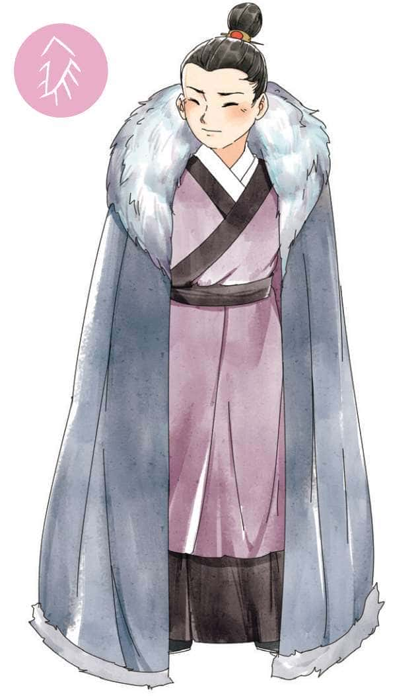

## 表·里  
衣服的内外

在汉字世界中，有很多抽象的字，比如《字里字外的动物王国》里的“只”和“双”，《字里字外的天文地理》里的“本”和“末”，还有这一讲我要为你介绍的“表”“里”。

这些字看似抽象，但其实都与古人的生活息息相关。只要追本溯源，了解这些字的造字过程，你便会有一种恍然大悟的感觉。现在，就让我们重新认识一下“表”“里”二字吧。

### 表/ 毛乎乎的外衣 /

“表”“里”二字都与衣服有关。我们先看“表”字，“表”看似抽象，但其实是一个形象生动的会意字。乍一看，战国文字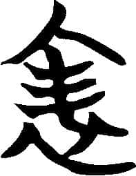和小篆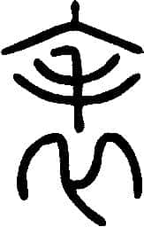中的“表”都有上中下三个部分，其实，这是在（衣）的中间加上了一个“毛”字。后来，随着汉字书写的不断发展，“表”的各部分笔画粘连在一起，渐渐形成了今天的写法。

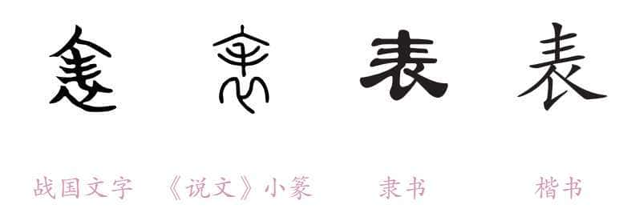

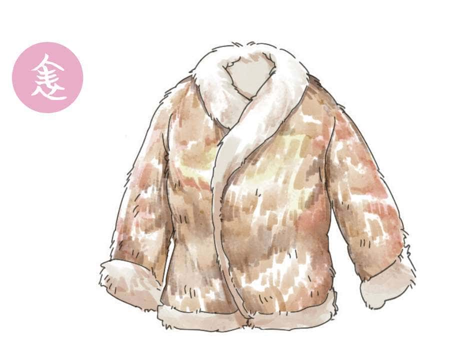

《说文解字》中说：“表，上衣也。从衣从毛。古者衣裘，以毛为表。”这里的“上衣”，指的是我们今天的外衣。古人穿裘皮大衣，要把带毛的一面露在外面，这就是许慎先生讲的“以毛为表”。

“表”是衣服露在外面的部分，也就是“面儿”。正因如此，“表”可以指外在、外露的部分——衣服冲外的一面是“表面”，人的外在长相叫“外表”，由外到里、由浅到深地看待一件事情，叫作“由表及里”。

“表”也可以用来指亲属关系。在中国传统的亲属关系中，爸爸的兄弟一方的亲戚叫“堂亲”，爸爸的姐妹和妈妈一方的亲戚叫“表亲”。伯伯、叔叔的孩子，是你的堂兄弟、堂姐妹；而姑姑、舅舅、姨妈的孩子，则是你的表兄弟和表姐妹。“表”和“堂”相对而言，表示的亲疏关系确有差异：在古代社会中，一个家族是以同姓的亲戚为基础的，这些亲人生活在一堂之内，因此叫“堂亲”。而姑姑和母亲一方的亲戚并不生活在一起，是“在外的”亲属，相对疏远，因此是“表亲”。现代社会倡导男女平等，亲属之间早已没有这样的分别，但传统的称谓仍然保留了下来，让我们看到古代家族关系的残影。

除此之外，你可能还会疑惑，“表”为什么还有“手表”的意思呢？在古代，表达“手表”有个专门的字——“錶”，用于“鐘錶”（钟表）、“手錶”（手表）。和作为会意字的“表”不同，“錶”是一个“从金表声”的形声字。“金”表示这种计时工具由金属制成，“表”用于提示读音。

不过，这个字写起来太复杂了！于是，在汉字简化过程中，人们将“錶”简化为“表”，这才有了我们熟悉的“手表”一词。

### 里/ 衣服的内层 /

说完了“表”，我们再来看“里”。“里”和“表”一样，在古文字中都曾有个“衣”字。你看，“里”的繁体字写作“裏”，将“衣”上下分开后，中间加了个“里”字。

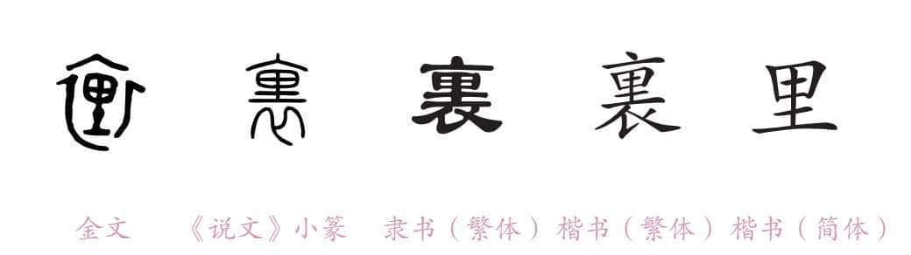

《说文解字》说“裏”字是“衣内也，从衣里声”。“衣”是形符，表示“裏”与衣服有关。至于“里”字，古已有之，是个“从田从土”的会意字，本来用于表示乡村里人们居住的地方，可以组成“故里”“邻里”等词。在“裏”字里，夹在“衣”字当中的“里”是声符，表示“裏”的读音。

“裏”虽然含义明晰，但书写时过于复杂，因此，人们将它简化为“里”。“表”是衣服的外层，“里”则表示衣服的内层，由此引申出“内部”的含义。衣服的内层叫“里子”，“外面”的反义词叫“里面”，有个成语叫“表里如一”，说的是一个人的外在表现和内心所想高度一致，指那些真诚坦荡、言行如一的人。

说起来，“裏”字简化时仅仅保留了声符，多少让人有些遗憾——去掉了“衣”，单单保留了“里”，“里面”的含义，从此便与衣服再无关联了。

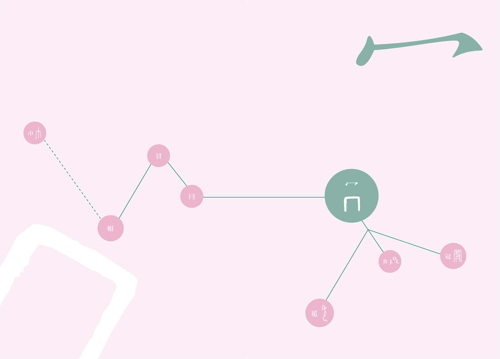

## 帽  
帽子的历史

《孝经》[1]中说：“身体发肤，受之父母，不敢毁伤，孝之始也。”古人为了保护头发，就要戴上帽子，因此他们特别重视帽子。在这一讲，我就来介绍一下“帽”，以及“帽”所从的“巾”字。

“帽”字的形成，经过了一个相当复杂的过程。“帽”字源起于“冖”（mì），也就是我们常说的“秃宝盖”。“冖”这个字历史悠久，从金文到楷书，它的字形一脉相承，就像罩在脑袋上的一顶帽子一样，上边的一横像帽顶，两侧则像帽子下垂的边缘。

“冖”的样子虽然像帽子，但它并不具备帽子的意思。《说文解字》说：“冖，覆也，从一下垂也。”“冖”最开始就是一种简单的覆盖物，是用布或纱做成的罩子，盖在盛食物的器皿上，用来隔绝虫子和灰尘。要知道，“冖”虽然不是人的帽子，但却是器皿的“帽子”。

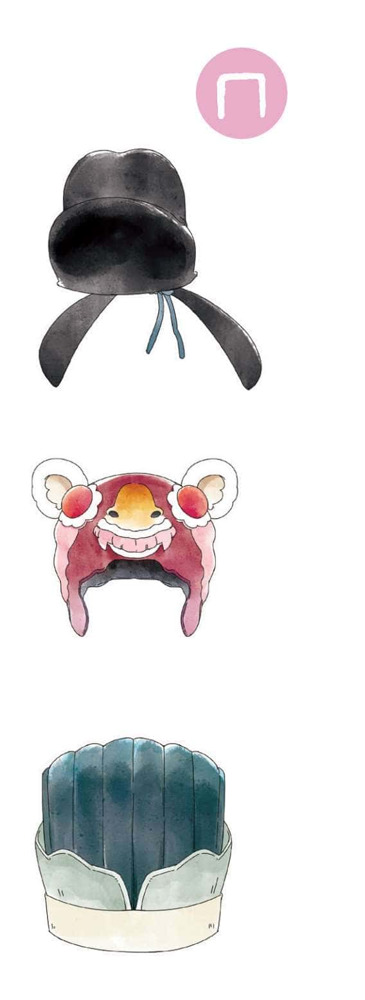

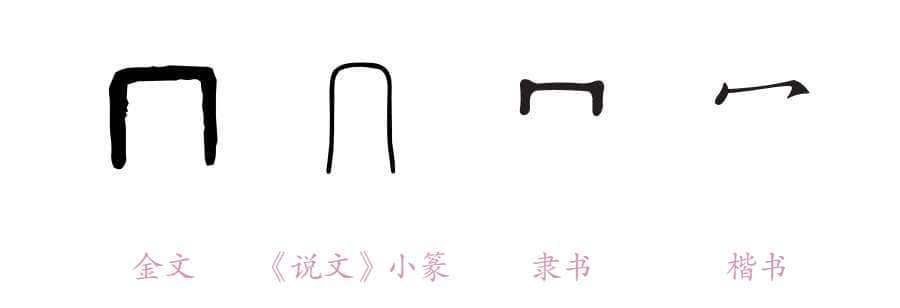

后来，古人在“冖”下添加两横，形成了“冃”（mào）字。“冃”就是“帽”最初的形体。许慎先生说：“冃，小儿、蛮夷头衣也。从冂，二其饰也。”“冃”是小孩和蛮夷“头上的衣服”，也就是帽子。中间的两横，是帽子上的装饰。

“冃”字十分形象，但也不免过于简略。帽子下边就是眼睛，于是，人们又在“冃”下添上了表示眼睛的“目”，造出了“冒”字，用来表示覆盖在眼睛上方的帽子。需要注意的是，“冒”的上部并不是“日”或“曰”字，而是帽子的象形。明白了这一点，便不会写错字了。

再到后来，随着字义的发展变化，“冒”渐渐有了顶着、勇敢、冲动等含义，如“顶风冒雨”“冒险”“冒失”“冒犯”……这时候，我们便需要一个新的字来表示帽子了。于是，古人在“冒”的基础上，添加了表示布料的“巾”，创造了我们熟悉的“帽”字。

说完了“帽”，再来看看它的偏旁“巾”。

“巾”字看似抽象，但其实是一个典型的象形字。它在甲骨文中便已出现了，写作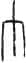，从古至今，一直没有什么太大的变化。《说文解字》中说：“巾，佩巾也。从冂，丨（gǔn）象糸也。”古人出门时，会随身带着一块佩巾，就像今天的手绢一样，用来擦汗、擦手。“巾”字的样子就像下垂的佩巾，中间的一竖是把佩巾系在腰上的带子。

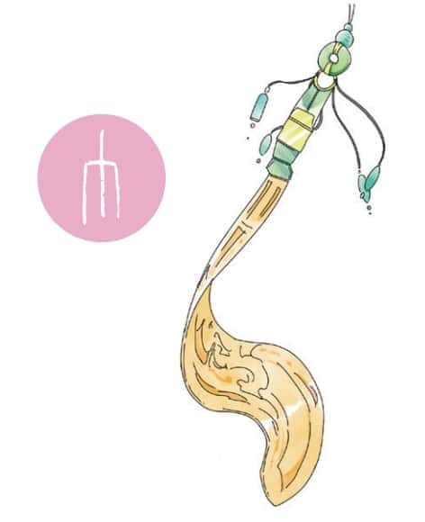

除了佩巾，“巾”也指头巾——裹头发的布帕子。我们常说“巾帼[2]英雄”，用“巾帼”指代女子。什么是巾帼呢？其实就是古代女性的头巾和发饰。在《三国演义》中，有一个很有趣的小细节。蜀魏两军僵持，司马懿（yì）不是诸葛亮的对手，便以逸待劳，躲在营地里，坚守不出，消耗蜀军。诸葛亮打不起持久战，于是使出激将法，派使者给司马懿送去“巾帼”——女人戴的头巾、穿的衣服。意思是：司马懿啊，你要是再不出来决一死战，就是个女人！

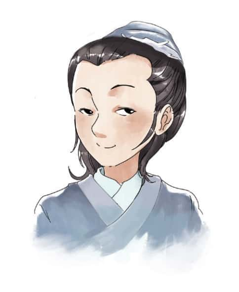 
巾帼

* * *

[1]儒家经典之一，主要论述孝道，宣传宗法思想。

[2]“巾帼”经常与“须眉”对应，用于“巾帼不让须眉”，指女子不比男子差。“须眉”是什么呢？胡须和浓密的眉毛是男子的标志，所以古人用“须眉”指代男子。

## 冠·冕  
与礼有关的帽子

当今社会，戴帽子的用途很单纯，或为遮阳，或为装饰。但在古代，头上不同类型的帽子，有着不同的意义，也暗含着等级差异。一般的“帽”是小儿和蛮夷的头衣，中原的君子不戴这样的帽子，他们戴的是特殊的“礼帽”，比如“冠”和“冕”。在这一讲，我们就来说说这两个字。

### 冠/ 君子死也要戴帽子 /

“冠”字乍看上去，让人不明所以，“冠军”的“冠”和代表帽子的“冖”，还有“元”和“寸”之间有什么关系呢？但从汉字造字来看，“冠”的造字逻辑却是清晰明了。

“冠”是由“冖”“元”“寸”组成的会意字。“冖”指帽子；

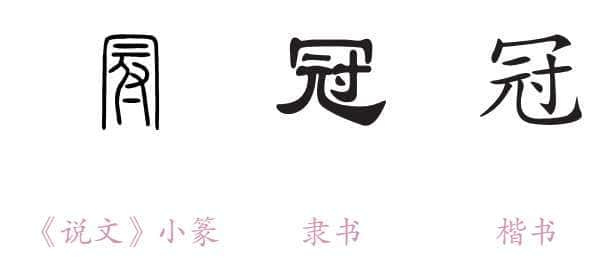

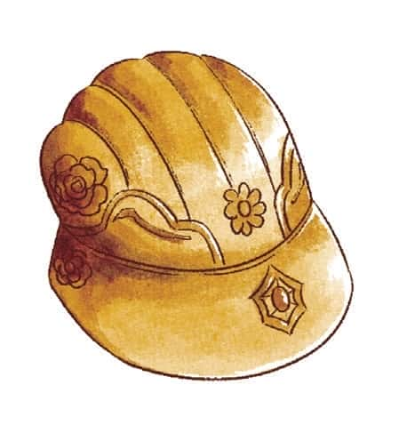

“元，首也”，“元”在古代指的是人的脑袋[1]；“寸”是古代的长度单位，有标准尺度的含义，由此延伸出礼法的内涵。这意味着，“冠”不是普通的帽子，它和古代的法制、礼仪密不可分，是一种十分重要的礼帽。和“冠”有关的礼仪，正是我在《字里字外的人体世界》里讲过的大名鼎鼎的男子成年礼——“冠礼”。

在二十岁左右的年纪，男孩子将头发拢成发髻，然后加冠。这意味着他褪去稚嫩，迈入成年。因为这时候年纪还轻，身体还未结实强壮，这个年龄也叫“弱冠之年”。

冠礼之后，一个男孩儿变成了顶天立地的男人，承担起对家族、国家的责任。因此，古人把冠看得很重，“冠”既是成人的标志，也是责任和尊严的象征，意义非凡，要做到“君子死而冠不免”——哪怕在生命陷于危难之时，也要保护好自己的冠。

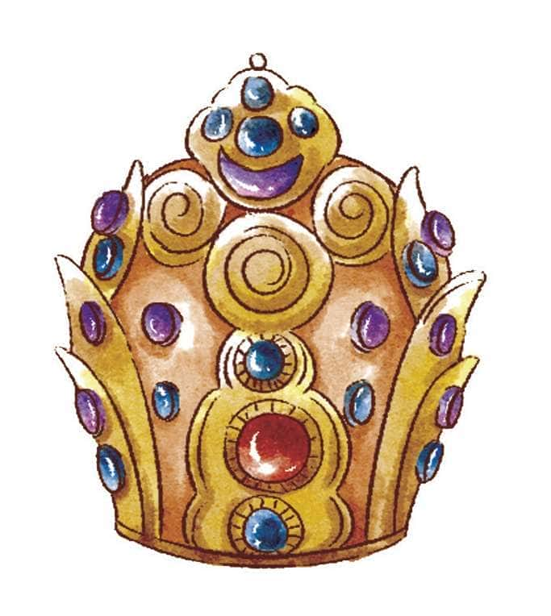

在《史记》中，记载了孔子的弟子子路的一段悲壮故事。子路晚年在卫国做官，是卫国重臣孔悝（kuī）的邑宰。卫国政治十分混乱，流亡在外的太子回国发动政变，将孔悝劫持到高台上，逼他结盟。当时子路正在城外，一听说出事了，上车就往回赶，要把自己效忠的孔悝救出来。

有人劝他不要徒惹灾祸，子路正言道：“不贪图利禄，不逃避灾祸。我接受了俸禄，就一定要救孔悝于灾祸！”

政变的人一看子路来了，吓了一跳。子路穷追不舍，甚至想抱来木柴，放火逼太子放了孔悝。

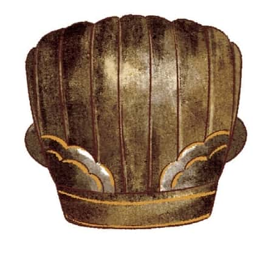

“不行，子路要放火！派人干掉他！”恐慌的卫国太子派出两名武士。子路虽然英勇绝伦，但当时已经是六十三岁的老人了，寡不敌众，被敌人砍断冠缨。冠缨是为了把冠固定在头上，系在下巴上的两根丝线。冠缨一断，也就意味着脖子受了重伤，子路在临死之前，说了一句话：“君子死而冠不免！”——君子临死的时候，帽子也是要戴正的。他咬着牙，把帽缨系好后便断气了。

当时孔子听说卫国发生政变，心里很不安，他忧虑地说道：“子路一定会牺牲的。”你看，孔子是多么了解自己的弟子。果不其然，凶信传来，白发苍苍的孔子站在院子里失声痛哭。那一年他七十二岁，这是他晚年一大悲哀。

子路之死，正是“杀身以成仁”，政变已成，他明知于事无补，却仍然慷慨赴难。临死之前，还从容地把帽缨系上，打理好礼冠，在生命的最后时刻依然守礼以殁（mò）[1]。这种对道义的坚守，让人无限感怀。

可惜的是，在时间的洪流里，“冠”的意义早已湮没无闻。现代汉语中，它只有单纯的帽子的含义，并延伸出冠军的内涵。“冠军”指比赛中获得第一名的人。可是，“冠”和“第一名”是怎么产生联系的呢？其实，“冠军”是“名冠三军”的简称，指自己的名字在各个军队中传扬开来，这是特别勇武的战士才能获得的殊荣。把一个人的名字摆到很高的位置上，加以称颂，是不是和戴在头上的冠很像呢？

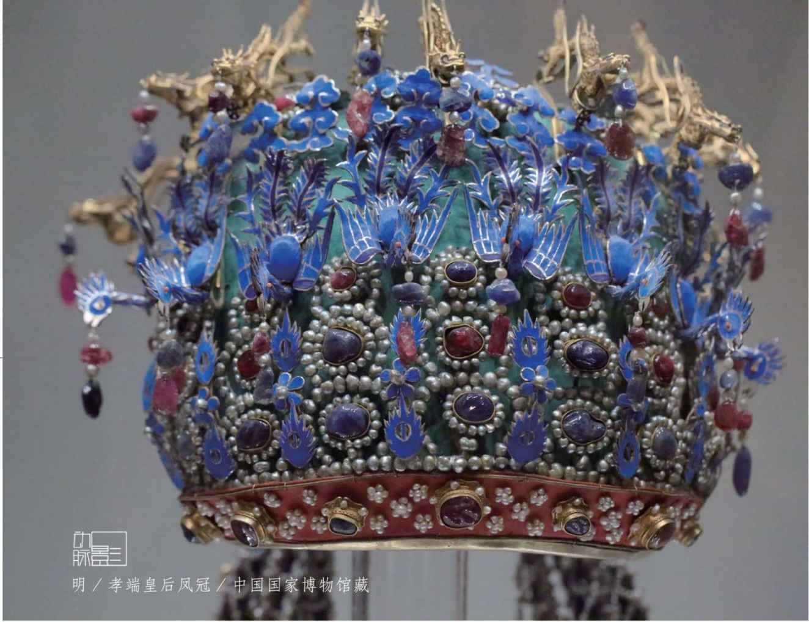

### 冕/ 威严而麻烦的礼帽 /

中国历代王朝典制以“礼”为基础，什么场合穿什么衣服，戴什么帽子都有严格的规定。其中，规格等级最高的帽子，叫作“冕”。

在小篆字形中，“冕”是个形声字，从冃免声。“冃”表示与帽子有关，“免”用于表示读音。什么人可以戴“冕”这款高级的帽子呢？《说文解字》说“大夫以上冠也”——冕是国君、诸侯与卿大夫的帽子。古代皇帝登基时，头上戴冕，身穿衮龙袍，所以被形象地称为“加冕”。

为什么皇帝这么重视帽子呢？其实，无论古今中外，冠冕和权杖都是权力的象征。埃及法老头戴高大的白冠、红冠，或是有眼镜蛇标志的王巾，手持象征至高权力的连枷杖与弯钩权杖。在基督教盛行的中世纪，皇帝的加冕仪式上，教皇要为皇帝戴上高贵而奢华的皇冠。在权力的世界里，帽子从来就不是单纯的帽子，而是身份和权力的象征。

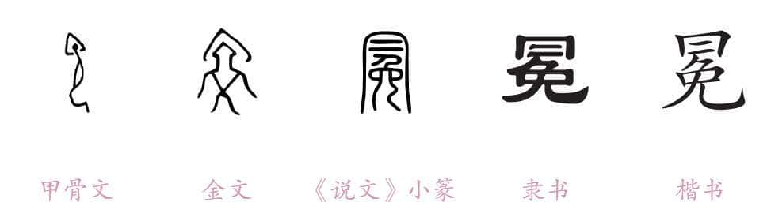

既然如此，在古代中国，代表权力的“冕”又是什么样子的呢？

“冕”的顶部有一个长方形的平板，这个平板的前后垂下一串串玉石珠子——叫作“旒”（liú）。天子的冕，前后要有十二根珠串，每根珠串上有十二颗五彩玉石，既华美又威严。

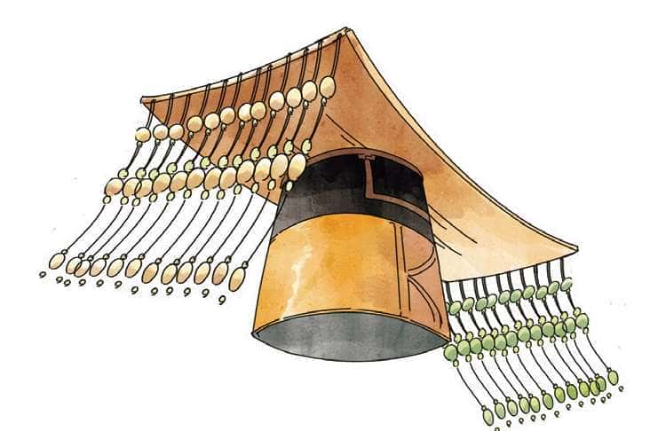

不过，“冕”虽然外观华美，佩戴起来却十分烦琐。古代帝王为什么要戴这么麻烦的帽子呢？原因有两个。首先，天子十分尊贵，他的面容不能随便让人看到，要用“旒”来遮挡。其次，戴上这样一顶帽子，对天子也是约束。复杂的珠串、沉重的礼帽，让天子不能像普通老百姓一样随便摇晃脑袋，动作稍微一快，小珠子就会甩起来缠成一块。因此，戴上这种帽子后，天子无论是点头还是摇头，都要端庄缓慢，这份稳重的姿态，能够彰显出天子的气度和威严。

作为尊贵的礼帽，“冕”渐渐成为荣誉的象征。有个词叫“冠冕堂皇”，还有个词叫作“卫冕”——不仅要保卫礼帽，更要捍卫自己的荣誉。在运动会上荣获一次冠军后，下次又拿到冠军，就叫“卫冕冠军”，也就是保卫了自己的冠军荣誉。

讲完了“冕”，我再为你介绍一款其他功能的礼帽——古代的皇帝和贵族打猎时佩戴的礼帽——“弁”。在“弁”的金文字形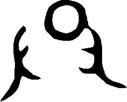

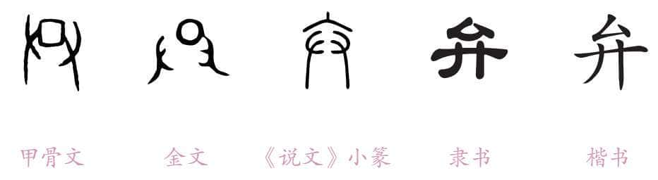

里，中间是个帽子，左右是两只手，表示把帽子戴起来，这是一个会意字。

“弁”一般由鹿皮缝制而成，接缝中还会镶嵌漂亮的五彩玉石，有点儿像瓜皮帽，戴起来特别漂亮帅气。虽然“弁”在今天非常少见，但在古代，它可是贵族的青睐之物！

“冠”“冕”与“弁”虽然都有些“华而不实”，但这些繁复的礼仪章典、麻烦的限制与约束，却也彰显着古人所追求的君子之风——“冠”是成年礼的馈赠，它会时时提醒你身负责任，勇敢担当；“冕”会警醒君上稳健行事，身为表率；“弁”则是田猎中必不可少的配饰，彰显出遵礼重义的君子之风。

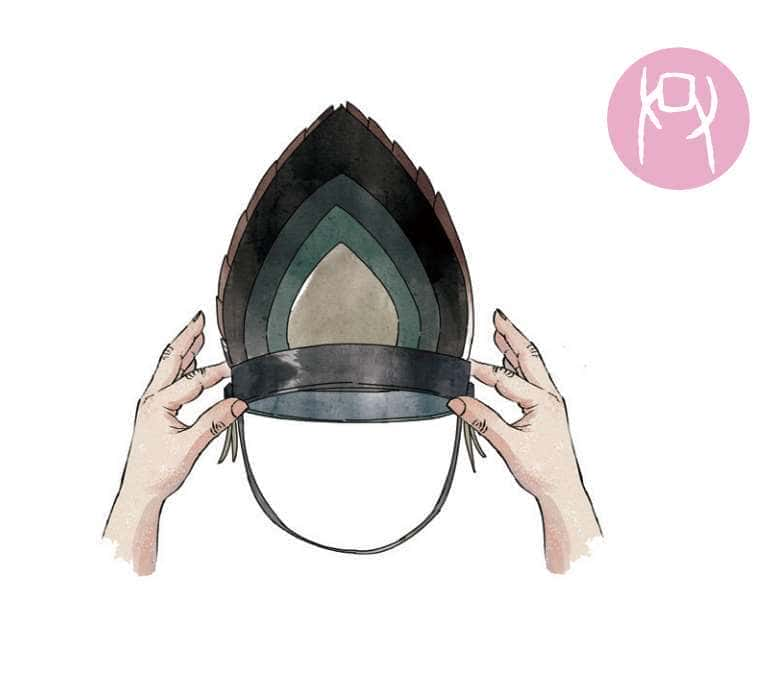

* * *

[1]“元”“首”在古代都指人的脑袋。人的脑袋是进行思考、指挥和领导身体行动的重要器官。所以人们用“元首”来指君主或国家的最高领导人。

[1]“殁”指死亡。

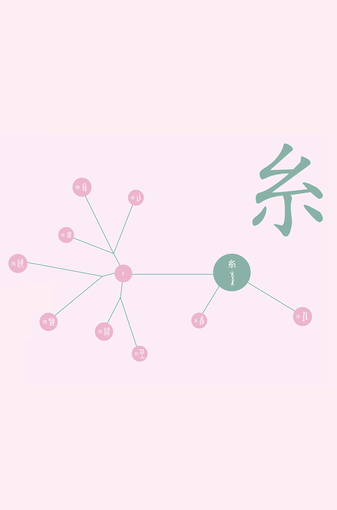

## 糸·丝·线·缕  
千丝万缕的丝线

裁衣制帽需要用到丝线，在汉字中，“丝、线、缕”三个字有着“千丝万缕”的联系——从字形上看，它们都有一个绞丝旁（纟），这个偏旁在古代写作“糸”。在这一讲，我将为你介绍丝线的故事，这个故事要从“糸”字说起。

### 糸/ 一团丝线 /

“糸”读作mì。它的历史非常悠久，在甲骨文中就已出现——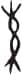。《说文解字》中说：“糸，细丝也。像束丝之形。”这个释义非常清楚，“糸”就是一团丝线。后来，这个字越变越抽象，逐渐变成了“糸”。

如今，“糸”字已不再单独使用，而是转变为常用部首——“纟”。从“纟”的字，大多都和丝线密不可分。

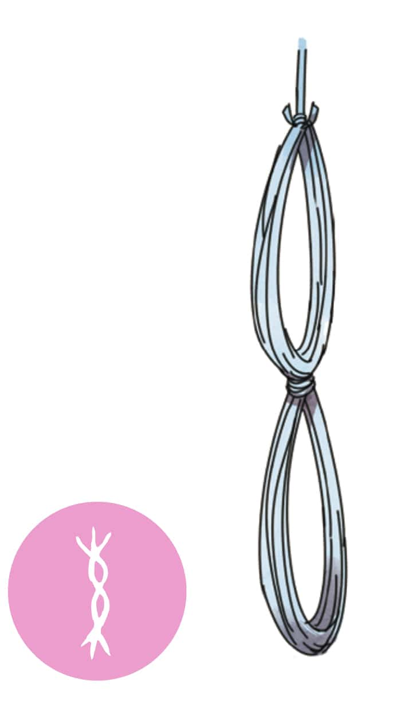

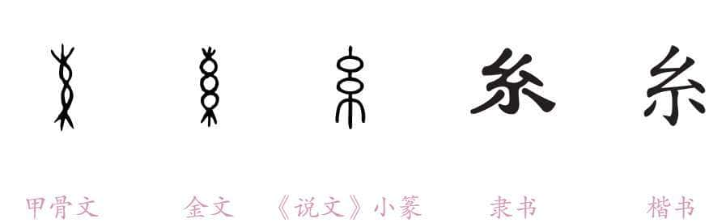

“糸”有一个易混字——“系”。“系”比“糸”只多一笔，这一笔有何含义呢？二者又是什么区别呢？在古文字中，我们可以找到答案。

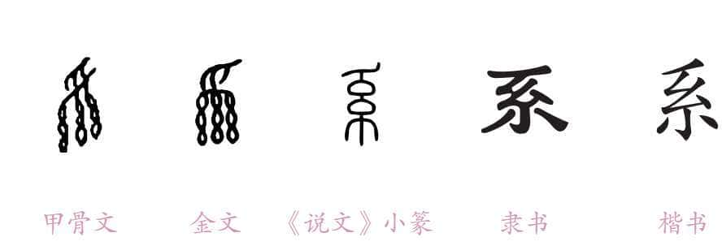

古文字里的“系”，它的笔画可比如今要繁复得多。你看，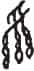是“系”的甲骨文字形，上面是一只手，下面拿着好几团丝线，表示用手把不同的丝线团连接起来。所以，“系”有连接的意思。无论是“关系”“联系”“谱系”还是“心心相系”，都是把不同的事物连接起来，这与古文字中“系”的本义还真是贴切！

现在，你明白“糸”和“系”的区别了吧？

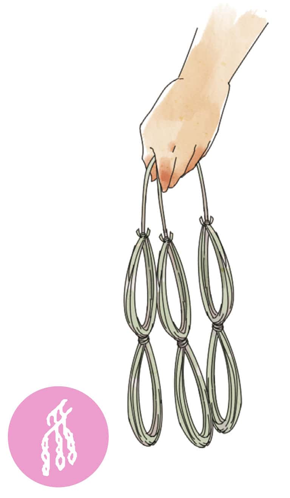

### 丝/桑蚕始祖/

一个丝团是“糸”，两个丝团放在一起，就是“丝”了。

《说文解字》小篆中的“丝”由两个“糸”构成，“糸”下的线头，随着隶变，慢慢变成点，又逐渐简化成一横，最终形成了我们今天常见的“丝”字。

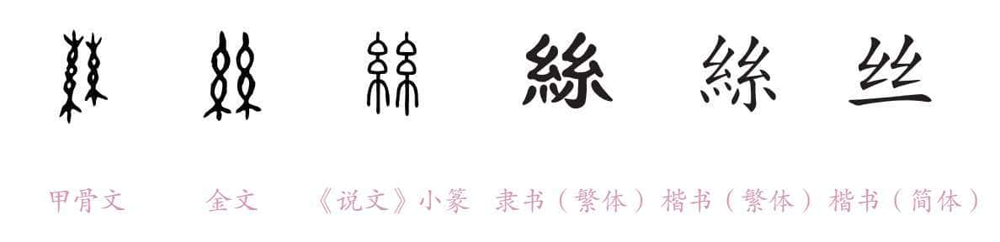

许慎先生说“丝”是“蚕所吐也”，丝是蚕吐出来的。中国人养蚕的历史十分悠久，说出来你可能不信，7000年前的中国古人就已经开始纺纱织布了，4700年前，就有了丝织衣物。除此之外，丝也用来制作琴弦。因此，古琴等弦乐器和竹制的管乐器合称为“丝竹”。

究竟是谁发明了植桑养蚕的技术呢？让我们将时光倒流至黄帝时代。

相传黄帝的妻子嫘（léi）祖意外地发现了一种白白的蚕茧，虽然不能吃，但却能从里面抽出丝线来，善于思考的嫘祖就此发明了植桑养蚕的技术。有了丝质衣服，中国古人的生活品质也由此有了质的飞跃。

为了纪念嫘祖，人们将她尊称为“先蚕”，历代皇室都会开展祭祀“先蚕”的活动。根据古代的礼制，到了孟春之月，皇帝要举行籍田之礼，在田地里亲自耕种。皇后则要举行亲蚕之礼，亲手采桑养蚕，祭祀嫘祖。皇室以此来表示对耕织、农桑的重视，也是对新的一年里国泰民安、丰衣足食的祈福。这一虔诚的仪式，一直保留至清朝，当时举办仪式的地方，就在位于北海公园的先蚕坛里。

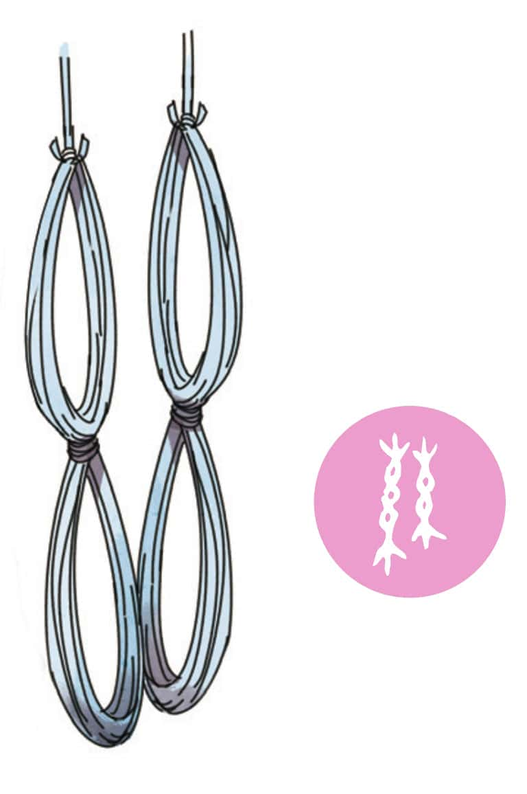

除了嫘祖，养蚕的专家还有蚕丛。大诗人李白的《蜀道难》中有“蚕丛及鱼凫，开国何茫然”一句，句中的“蚕丛”据说就是古蜀国[1]的开国之王。许慎先生在《说文解字》中认为“蜀，葵中蚕也”，“蜀”字中的“虫”就是指蚕。由此可见，蚕丛也是一个养蚕专家，他领导的蜀国是个以农桑缫丝为强项的“蚕国”呀。

### 线****缕/ 细长的线缕 /

有了丝，就可以纺线啦！下面我要讲的便是“线”和与线有关的“缕”。

“线”和“缕”都是形声字，许慎先生说“线，缕也”“缕，线也”，在《说文解字》中，“线”和“缕”互为解释。

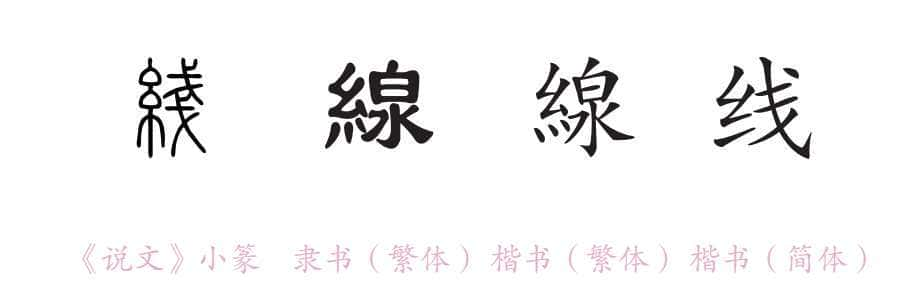

这两个字都指用丝、毛、棉、麻等材料做成的线。古人用词形象生动，有不少词用“线”“缕”类比，比如：

成语“条分缕析”，指一条条、一根根地详详细细地弄清楚。

成语“千丝万缕”，指两个物体之间的关系连着千万条丝线，剪不断，理还乱，形容事物之间难以割断的复杂联系。

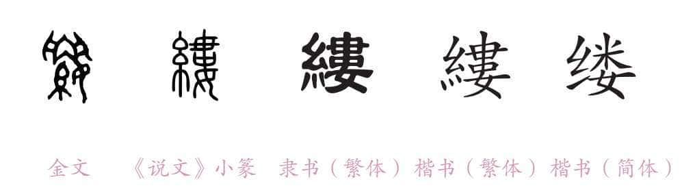

再比如，有个词叫“线索”，在事件的迷雾中，找到千丝万缕的联系，找到解开谜团的线头，便是找到了线索。说到这里，你可能会问，“索”字从“糸”，它和丝线有什么关系？

关于“索”有不同解读，有人认为，“索”是植物茎叶做的绳索；也有人认为，“索”的古字形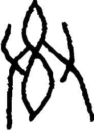是两个手在搓绳子。不管哪个正确，“索”都有绳子的意思，能组成“绳索”“线索”等词。

* * *

[1]四川的三星堆文明其实就是古蜀文明。三星堆最著名的纵目面具刚被挖掘出来的时候，媒体纷纷报道说像外星人面具，推测可能是国王蚕丛的面具。

## 绝·继·续  
断线与接线

上一讲介绍了与“丝”和“线”有关的字，丝线很细，在穿针引线之间，一不小心就断了，线断了又得接起来。正因如此，和断绝、接续有关的汉字，不少都带着绞丝旁（纟）。这里我给大家讲的，就是其中三个最常用的字——“绝”“继”和“续”。

### 绝/ 抽刀断丝 /

“绝”这个字，左边一个“纟”，右边一个“色”。它和“色”有什么关系呢？很多人可能会猜，“绝”是个形声字，“色”是声符。这个想法也对也不对。想要知道正确的答案，还是要追溯到古文字中一探究竟。

“绝”的甲骨文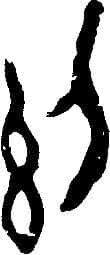、金文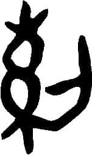字形，就像一把锋利的刀在切割丝线，丝线断了，这就是“绝”。所以，“绝”是一个会意字。后来，到了小篆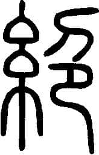，古人在“刀”下面又加了一个字。

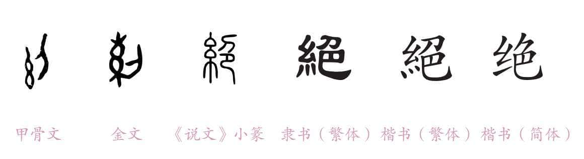

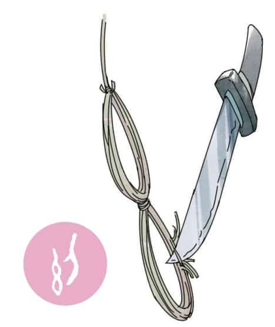

新加的字是什么呢？是声符。许慎先生在《说文解字》里说：“绝，断丝也，从糸，从刀，从卩。”“卩”读作jié，和“绝”音近，加上它，“绝”就变成了一个形声字。

“绝”的本义是斩断丝线，引申为断绝之义——人和人的关系断了，叫“绝交”；距离上的阻隔，叫“隔绝”；希望被彻底斩断，则是走上“绝路”；人的呼吸没了，生命结束了，叫作“气绝”。你看，“绝”有一种特别狠的感觉，不太招人喜欢。不过，在汉语里，狠与厉害又有关系，因此，“绝”又引申出特别好的意思—— 一击毙命的招数叫“绝招”，无比高超的技艺叫“绝艺”，美若天仙的人叫“绝色”，一篇千古传诵的好文章可以赞叹其“绝妙好辞”。

### 继****续/ 与丝线有什么关系？ /

纺织要用完整的丝线，要是线断了，就得把它接起来，“继”和“续”两个字，都与此相关。

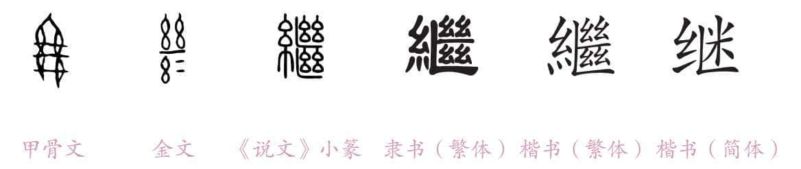

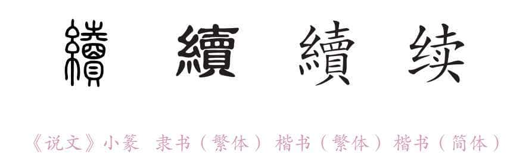

先看“继”字，在甲骨文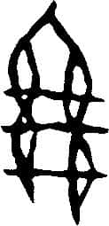、金文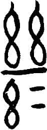里，线团断开了，古人用线把它们再度连接起来，这就是“继”。到了小篆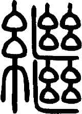中，古人在左边加上“糸”，用一根完整的线，把断掉的线都连起来。许慎先生说：“继，续也。”连接丝线，“继”也就有了连续的意思，用于“继承”，指把前人的宝贵遗产接过来、传下去；用于“前赴后继”，指战士们络绎不绝地冲锋向前，把整个队伍都连在了一起。

“继”和“续”组成了“继续”一词，《说文解字》说：“续，连也。”“续”也是个形声字，表示连续、继承的意思。一部电视剧有“续集”，一部小说可以“续写”，古人注重家族血统的延续和思想精神的继承。优秀的思想精神代代相传，就形成了中华民族的文化传统。你看，传统的“统”字也带绞丝旁，和丝线的连续不断有关。

中国文化的深厚传统，就要靠一代代的人传续下去，温故知新，生生不息。

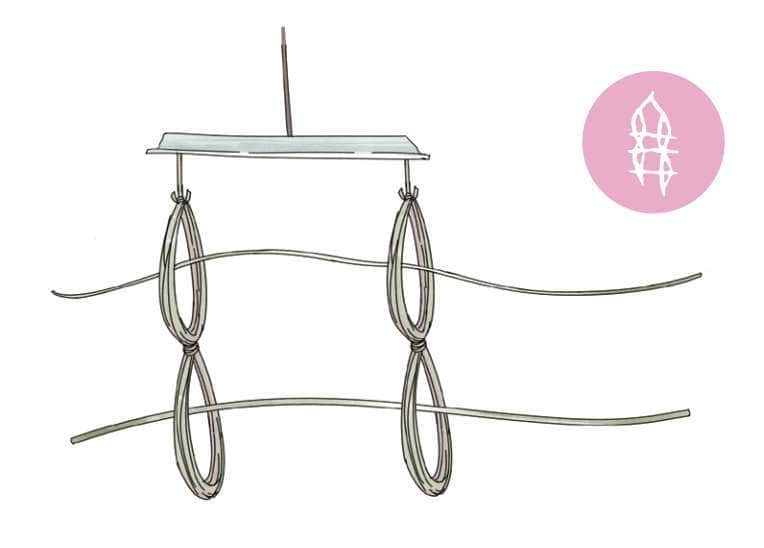

## 经·纬  
什么是经典？

“糸”是绞丝旁，由它组成的字大多是普普通通的纺织品。除此之外，古人也用“糸”造出了一些不平凡的字，它们都是什么呢？

在学习传统文化时，你是不是经常听到“四书五经”这个说法？其中的“经”就是从“糸”的字，与“经”相对的，还有一个“纬”字。在这一讲，我就给你介绍“经”“纬”二字，还有它们背后的古代经典的世界。

### 经/ 织布机上的竖线 /

抽象的“经”字最初其实是个象形字。

在周代金文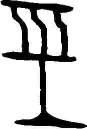中，“经”还不带绞丝旁，长得就像一架织布机——上下是架子，中间的三竖是织布机上的经线。《说文解字》中说：“经，织从（纵）丝也。”纵就是竖，也就是字形里的三竖。在织布时，要先用架子把丝线上下绷直，做成经线，然后在它们中间横向用梭子引线，纵横交错，密织成布。后来，古人给加上了“糸”，变成了形声字“经”。

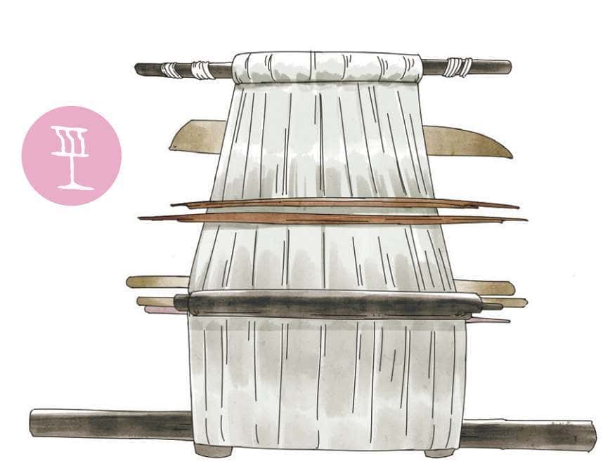

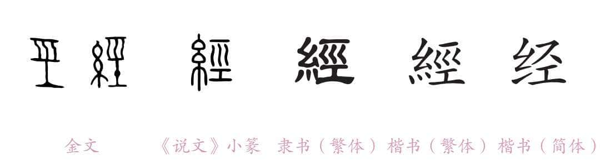

在织布机上，竖着的经线总是绷紧不动，因此引申出“恒常不变”的含义。我们常说“天经地义”，“经”就是不变的意思。古人将古书中价值永恒、奠定了中华文化底色的书，称作“经”书。

我们现在常说“四书五经”，其实，在中国历史上最早有“六经”，是孔子的主要教材。六经指《诗》《书》《礼》《乐》《易》《春秋》。其中《乐》早已失传，到了汉代，人们只说“五经”，也就是《诗》《书》《礼》《易》《春秋》。

随着历史的发展，儒家将“五经”扩充至“十三经”，将其作为儒家最重要的经典。

十三经都包括什么呢？

首先是《周易》，它记载了古代的算卦法则，更体现出古人对于天道的理解。

其次是《尚书》，它记录了尧、舜、禹、汤，一直到文王、武王、周公、成王的历史，留下了古代圣人的思想言行。

接着是《礼》，《礼》是规范，从政治制度到个人行为，无所不包，内容繁多，因此《礼》又分成“三礼”——《周礼》主要讲周代的政治制度，《仪礼》主要讲古代的礼仪规范，《礼记》主要讲礼的精神和道理。“四书”中的《大学》《中庸》两篇，就出自《礼记》。

文学的经典有《诗经》。《诗经》记录了先秦时期的歌谣，《论语》对它评价很高：“诗三百，一言以蔽之，曰思无邪。”《诗经》的思想纯正，读来可以陶冶性情。

至于《春秋》，顾名思义，记录了春秋时期的历史，共分“三传”——《左传》《公羊传》《穀（gǔ）梁传》，其中《左传》最为详细。

上面九部经典，在唐代被称为“九经”，后人又加入《论语》《孟子》《孝经》《尔雅》四部经典。于是，就有了儒家的“十三经”。

### 纬/ 织布机上的横线 /

“经”是织布的竖线，“纬”则是织布机上穿梭在竖线中的横线，《说文解字》说它是“织横丝也”。

“经”很重要，“纬”同样不可或缺。如果你有地球仪的话，会在上面发现经线和纬线：南北竖着的是经线，东西横着的是纬线。地球上的任何一点，都能用经纬来定位。没有纬线，经线的作用也无法凸显，二者构成地理坐标中最基本的维度。

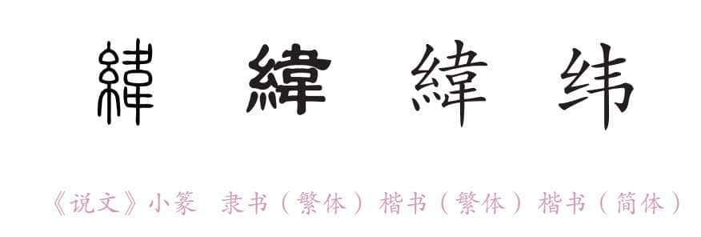

地球仪上有经纬，古人对图书的分类也有经纬。经书作为最重要的文化经典，深奥难懂，于是，汉代古人创作了解释经书的著作，它们就像织布的横线一样，辅助经书，因此被称为“纬书”。纬书的名字一般都很奇怪，比如《乾凿度》《通卦验》《元命苞》，听上去神神秘秘的。

经书、纬书相辅相成，共同记载着古代的历史文化。在纬书里，有很多神秘的，甚至是迷信的内容。比如天上下冰雹，刮大风，秋天叶子变黄，明明是自然现象，纬书却为它赋予了政治寓意，认为伴随着特殊的天象，会发生灾害或动乱。到了最后，纬书中的内容多变为神秘传说，内容不再可信，也就大多失传了。

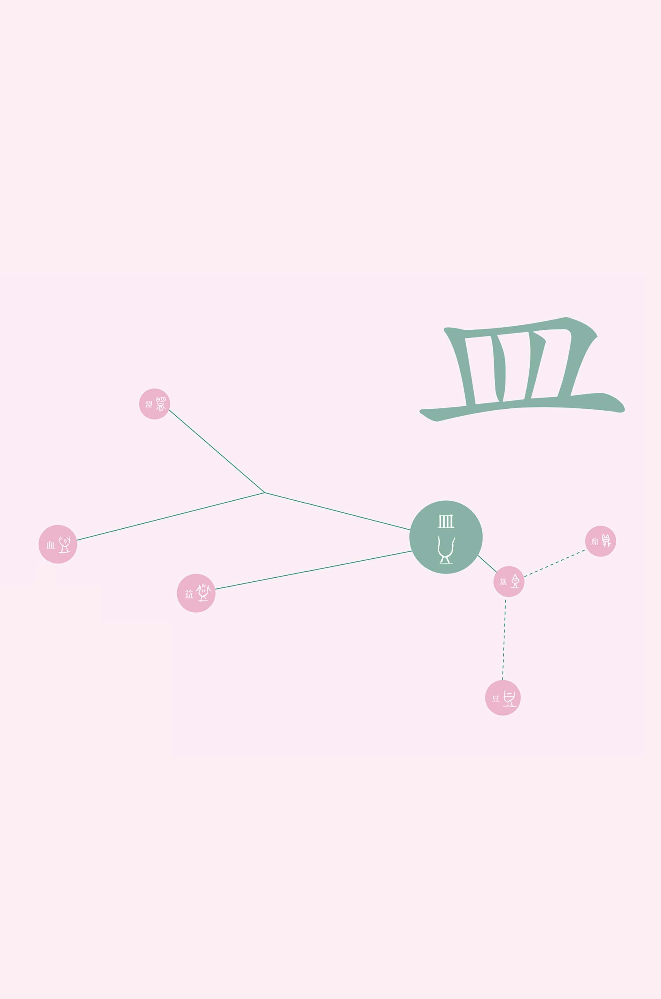

## 皿·益  
和器皿有关的汉字

在汉字中，有一个和饮食密不可分的部首，那就是“皿”——古人各式各样的吃饭器具，大多都是从“皿”的。你可能会问，为什么从“皿”，“皿”又是什么呢？别急，让我们进入汉字世界一探究竟。

### 皿/ 器皿的象形 /

“皿”是一个典型的象形字，你看，它在甲骨文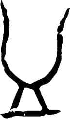、金文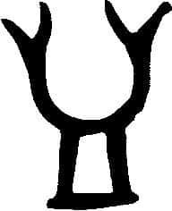中的形体，就像一个装东西的器皿。

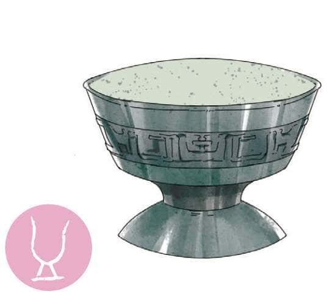

装什么东西呢？《说文解字》说：“皿，饭食之用器也。”“皿”泛指碗碟杯盘一类的饮食器皿。这个字在今天已经很少独立使用了，而是作为常用部首，用于表示各种各样的器皿。你看，“盆”“盂”“盏”“盅”这些字，或是食器，或是酒器，都是从“皿”的。往器皿里装东西，就是盛饭、盛汤的“盛”，它也是从“皿”的。

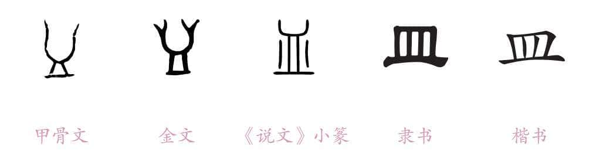

### 益/ 水满则“益” /

器皿用来盛水、盛饭，盛得太多，便会水满则“益”。你可能会疑惑，不应该是“水满则溢”吗？“益”字常用于“益处”，这个字里也有个“皿”字，它和器皿之间又是什么关系呢？

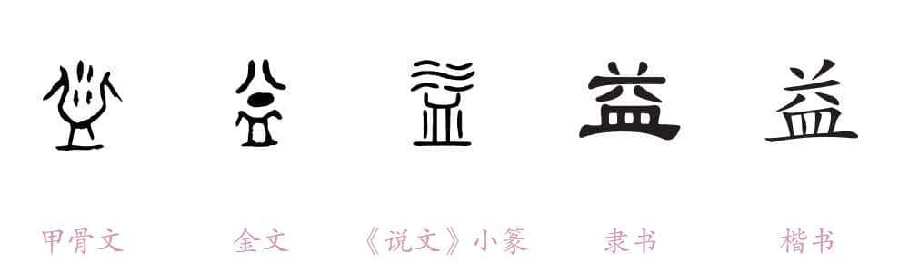

从甲骨文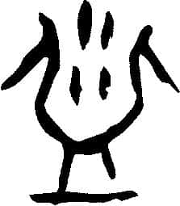以及后来的小篆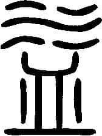能看出，“益”字下面是器皿，器皿里面盛着水。《说文解字》说：“益，饶也。从水皿。”“益”是一个从水从皿的会意字，“饶”是富裕的意思，“益”的本义是水很满，都要溢出器皿了。只是上面的“水”自小篆之后越写越抽象，慢慢演变成了“益”字。

“益”是水溢出来，水满则溢，又引申出增益、增加的含义。到了后来，人们为了区分这两个字，给“益”增加了三点水，专门创造出了“溢”字，来表示满溢、溢出的含义。而“益”便主要用于表示“益处”“收益”之义了。

## 簋  
簋是一个筐，粮食往里装

我国古代有各式各样的器皿，比如盉（hé）、盂、盥（guàn）、簋（guǐ）……这一讲要讲的“簋”，现在虽不常见，但它在古代很常用，也很有意思。我们先看它的字形：

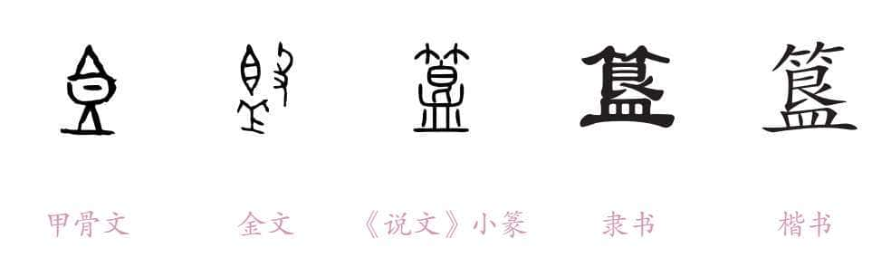

“簋”一开始是象形字，在甲骨文中写得很简单，就是一个盛满饭食的器皿。随着汉字的发展，古人在它下面加上了“皿”，在上面加上了“竹”，表示和器皿、竹子相关，于是，“簋”变成了一个会意字。

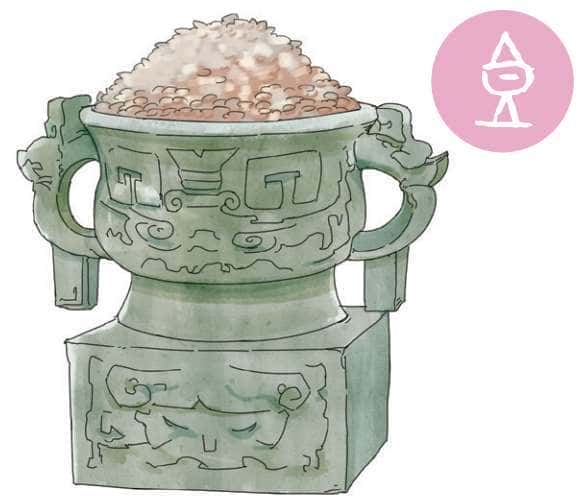

为什么要加上竹字头呢？这个部首提示了簋的材质：虽然出土的簋大都是青铜的，但竹字头告诉我们，古人生活中的簋大多是用竹子编的，只不过这种材质简陋的簋，容易腐烂，不能像青铜器一样传之久远。

竹子编的簋，不能盛肉。有汁有水的肉汤，用竹编的东西一装，会哩哩啦啦洒一地。因此许慎先生说：“簋，黍稷（shǔ jì）方器也。”黍稷是古代的农作物，泛指五谷，簋是用来装粮食、装黍稷的器皿。不过，许慎先生有一点说错了，古代的簋都是圆的，不是方的，我们可不要弄混。

除了簋，古代还有很多食器，首先要提到的就是贵重庄严、作为大国重器的“鼎”。

说“鼎”之前，我们先来看看一个字——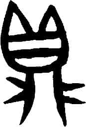。

你一定看得出来，这是个象形字。它是什么的象形呢？尖尖的耳朵、圆圆的脸、小小的爪子，看起来像不像一只小动物？把它和我们在《字里字外的动物王国》里讲过的动物汉字，放在一起比较一下：

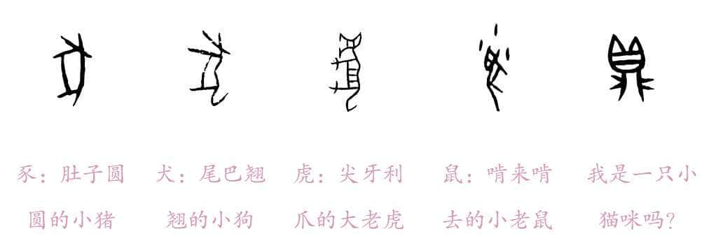

哈哈，这样一看，这个字还真像一只小猫。但其实，它是古文字中的“鼎”字，鼎可是古代极为重要的食器和礼器。

“鼎”的历史非常久远，在古文字中，它是一个象形字，画出了鼎的样子：下面是鼎的“足”，稳稳地站在地上；中间是鼎的“腹”，铸造着漂亮的纹样；上面是鼎的“耳”，中间可以穿上木杠，把鼎扛起来。大家可以仔细看看鼎的图片，认清楚它的耳、腹、足。

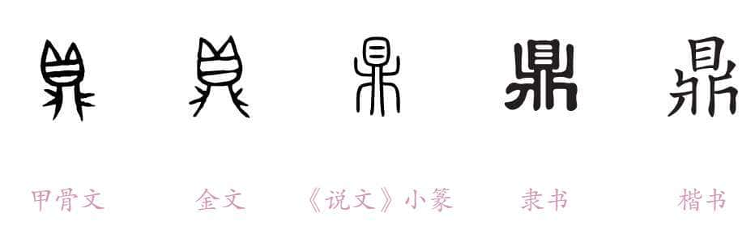

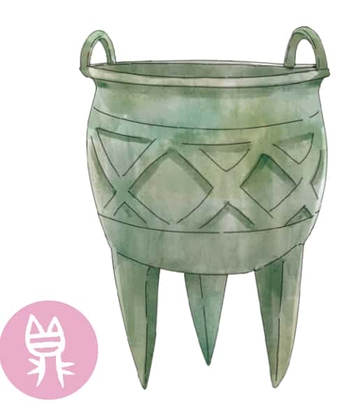

《说文解字》中说：“鼎，三足两耳，和五味之宝器也。”三足两耳，是它的样子；“和五味”，是它的功能，最早的鼎就是一口大锅。但这个锅可不一般，它象征着国家政权，也是大国国力的体现，是中国古人心目中的宝器！为什么呢？因为传说大禹收九牧之金（铜）铸造了九个鼎，来象征当时的九州[1]大地。

在历史中，与鼎有关的故事，往往和国家权力有关。

一个很有名的故事，就是楚庄王的“问鼎中原”。楚庄王是一个雄才大略的君主，很有野心，想要争霸天下。有一次，他问周天子的使者王孙满：“听说天子有九鼎，这九个大鼎得有多沉啊？”

要知道，鼎象征政权，问鼎有多沉，就是想掂掂周天子的分量——你周天子还能镇得住这天下吗！这个问题很刁钻，不好回答，但王孙满的回答很艺术：“在德不在鼎。”能不能震住天下，要看德行，而不是鼎，你问鼎就是问错了！这样不卑不亢、绵里藏针的回答，让楚庄王收敛了野心。到了后来，“问鼎”也就用来表示一个人的野心了。

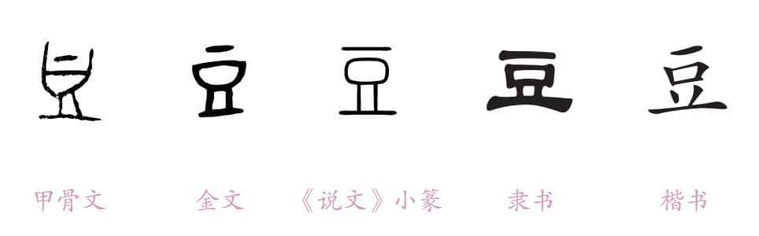

除了鼎，古代还有一种名字有些奇葩的食器——豆。

咦，怎么是黄豆、绿豆、小豆子的“豆”呢？

要知道，“豆”在古代可不是吃的。在古代，鼎是直接煮食物用的，就是一口大锅，但吃饭总不能端着锅吃，多难看啊。所以，古代有专门放在面前，只供一个人使用的食器，叫作“豆”。不信的话，看看它的字形就知道了。

从古至今，豆的写法基本上没变化。它是一个象形字，平平的底，直直的脚，圆圆的盘里装吃的。你可能要问，“豆”明明是个盘子啊，怎么设计得跟今天的高脚杯似的？要知道，古代很晚才有高高的桌椅，人们一开始都是席地而坐。如果只用盘子，吃东西就得趴下去，很不方便——所以，这只“高脚豆”真不能少！

《说文解字》说：“豆，古食肉器也。”许慎先生专门强调，“豆”是用来吃肉的，它和竹子做的簋不同，而是用陶或木头做的，因此可以装肉块儿、盛肉汤。至于豆子的“豆”，在古代写作“菽”字。

最后，我们再来回顾一下——簋是盛放粮食的小筐，鼎是煮饭做菜的大锅，豆是装肉盛汤的盘子。古人的饭桌离不了这三件套，上下五千年的美味都由它们装着，你有没有在这三个汉字中，闻到跨越千年的香味呢？

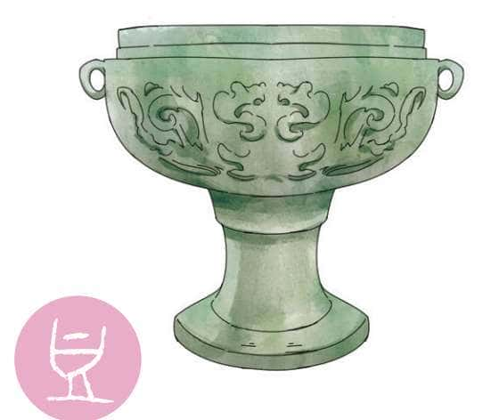

* * *

[1]大禹治水成功后，把天下划分为九州。

## 血·盟  
和器皿有关的仪式

除了与饮食有关，器皿还涉及一些非常有趣的礼制与风俗——歃（shà）血为盟。这一讲，我将为你讲解两个相关的字——“血”和“盟”。

“血”和“盟”的部首都是“皿”，二者都和器皿有关。你看，这是古文字中的“血”：

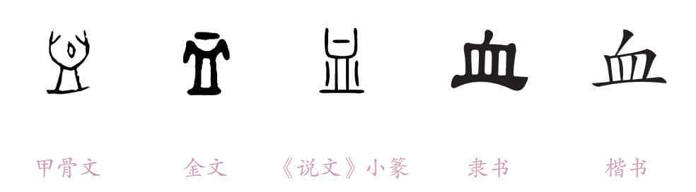

从甲骨文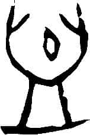开始，一直到金文、小篆，“血”的形体一脉相承——在皿中有一个点，表示祭祀时器皿中放的血。许慎先生在《说文解字》中说：“血，祭所荐牲血也。”准确说明了“血”的字义。在古代祭祀和歃血为盟时，需要用到牲畜的鲜血。

歃血为盟的仪式威严庄重。周朝时，人们杀掉牲畜，将鲜红的牲血滴入华贵的玉质器皿——玉敦之中。会盟者立于天地之间，向日月山川的神祇和列祖列宗郑重地宣读盟约内容。然后用手蘸上玉敦中的鲜血，涂抹在自己的嘴上，这叫作“含血”。最后，写有盟约内容的竹策被放在牲畜身上，一起掩埋。这便是歃血为盟，表示神灵祖先在上，若有违背，人神共弃，必遭天谴。

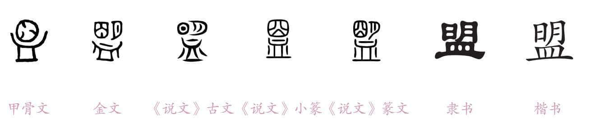

除了“血”字，“盟”也体现出古代歃血为盟时的文化心理。在“盟”的古字形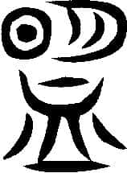中，“盟”的上面是“明”，表示两国之间的盟约，犹如太阳月亮一样明明白白，互不欺骗；的下面是“血”，就是“杀牲歃血”。不过，后来随着字形演变，下面的“血”变成了“皿”，于是有了今天的“盟”字。

在古书中，有很多精彩纷呈、扣人心弦的歃血为盟，比如“毛遂自荐”的故事：

战国时期，秦国攻打赵国，赵国的重臣平原君奉命去楚国求援。他要组建一个游说楚王的“忽悠团”，本来想找二十个人，但在门客里挑来挑去，只能选出十九个人来。

这时候，平原君手下一个默默无名的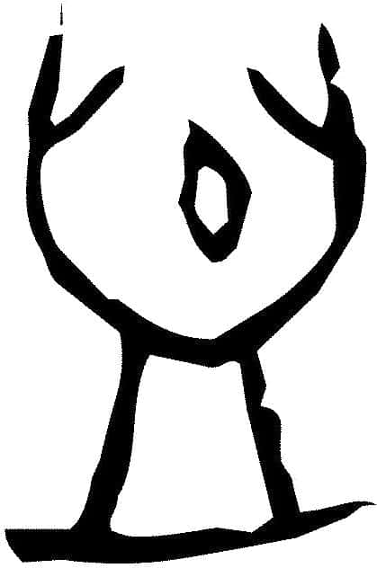门客——毛遂站了出来：“我可以去！”

平原君忍不住嘀咕起来，他问毛遂：

“先生来我这儿多久了？”

“三年！”

平原君一听，笑了：“我听说真正的人才，就像放在布袋子里的锥子一样，很快就会冒尖儿。您在我这儿三年，从没有人跟我说过您有才干，还是算了吧。”

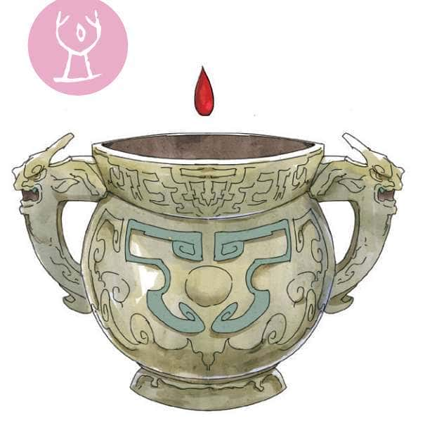

毛遂也不气，淡然道·“这次我去楚国，就是请您将我放入囊中，我必会连整个锥子头都露出来。”

于是，平原君带着毛遂去了楚国。到了谈判的日子，平原君百般劝说，楚王就是不肯发兵相救。平原君带去的其余十九人面面相觑，谁都没有办法。胶着之际，只见毛遂大步走到楚王面前：“和赵国结盟，一起抗秦，这个道理两句话就能说清。从日出到中午，楚王还无法决定，这究竟是为什么？”

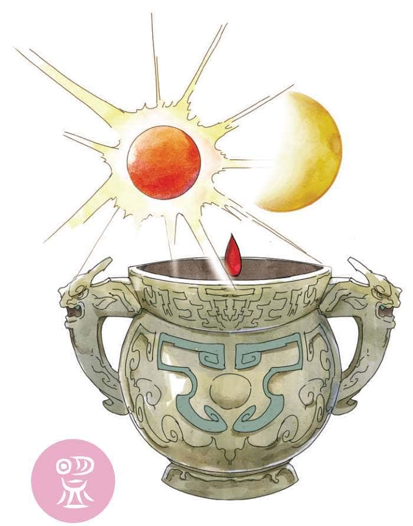

楚王大怒：“你是何人？这里没有你说话的份儿，还不下去！”

毛遂大笑，按剑向楚王逼近：“您呵斥我，不就是仗着楚国人多吗？但现在十步之内，您的命在我手里！而且我的主人就在殿中，您怎么能这么不顾礼节呢？况且，商汤凭着七十里的地盘就灭了夏桀统一天下，周文王凭着数百里的地盘就灭了纣王，使普天下的诸侯臣服，他们靠的是人多吗？不是。他们靠的是能够把握天下形势，趁机发挥他们的威力。现在楚国有五千里地盘，上百万人的军队，本可雄霸天下，可这般强国，秦国白起这么个小子带着几万人就攻克了楚国的鄢（yān）陵、郢（yǐng）都，还烧毁了夷陵。楚国世代被秦国欺负，楚怀王甚至被秦人挟持绑架，一生没有回到楚国，怀恨而死！这种奇耻大辱，是一百辈子也报不完的仇。连我们赵国都为你们感到羞耻，可您还不当回事，居然还不和我们一起抵抗暴秦！”

毛遂的话犹如锥子，狠狠地扎在了楚王心上，楚王当时便服了软：“确实如先生所言，我愿与赵国结盟。”

毛遂立即喊道：“快拿鸡、狗、马的血来。”他双手捧着盛满鲜血的铜盘，跪送上前：“请歃血为盟！”

毛遂三寸之舌，强于百万雄兵，你看，歃血为盟的背后，往往是紧张激烈、你死我活的政治博弈啊！

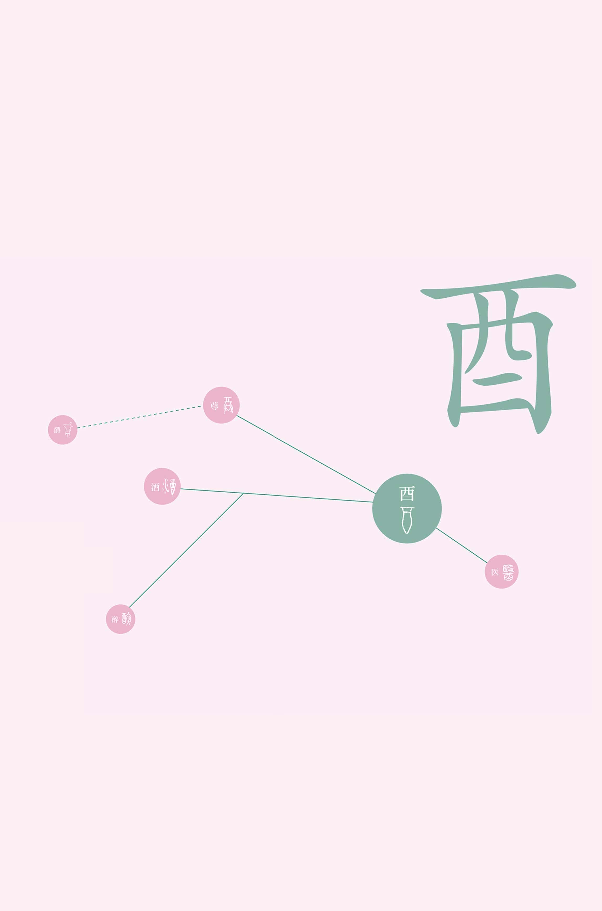

## 酉·酒·醉  
人生得意，一醉方休

你看过《水浒传》吗？梁山好汉为人豪爽，“大秤分金银，大碗吃酒肉”，那叫一个爽快！在古人看来，一顿好饭，光有吃食可不够，还得要有美酒做伴。在这一讲，我们就来说说和酒有关的字——“酉”“酒”和“醉”。

### 酉/ 一个酒坛子 /

讲“酒”之前，需要先讲“酉”字。“酉”念yǒu，它是什么意思呢？我们先来看古文字字形：

“酉”的历史十分悠久，在甲骨文里就已经有这个字了。你看它的样子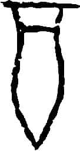像什么？

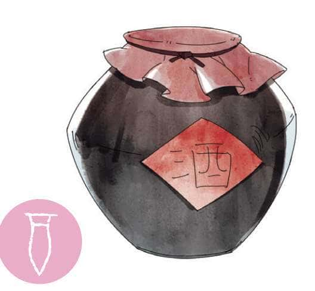

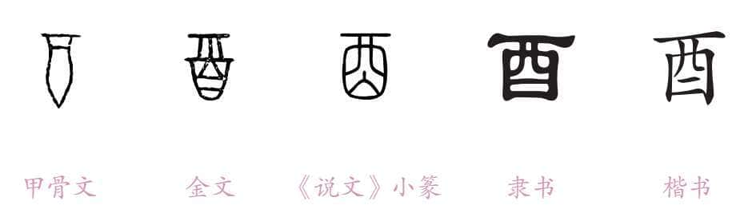

也许你已经猜出来了，它像一个装酒的坛子，这也是“酉”最早的意思——酒坛子。

不过，这个字义在今天已经不再使用了。我们最常见到的“酉”，是生肖的名字——“申猴酉鸡”中的“酉”，也是十二地支之一。

地支是什么呢？

地支是古人记录时间的一种方式，常常和天干配在一起。天干地支，是中国古代重要的文化常识，早在甲骨文中就已经有了。

我们今天用数字表示时间，2019年、2020年，1月、2月、3月，每个月30天左右，均为数字。古代也用数字记录时间，但和今天的数字不一样。古人有两组数字单位，第一组是天干，一共十个——甲、乙、丙、丁、戊、己、庚、辛、壬（rén）、癸（guǐ）。第二组就是地支，一共十二个——子、丑、寅、卯、辰、巳（sì）、午、未、申、酉、戌、亥。有了这两组数字，再把它们结合起来，就可以记录时间了。比如第一年是甲子年，天干的“甲”配地支的“子”，都是第一个数。第二年是乙丑年，第三年是丙寅年，第四年是丁卯年……

天干地支表
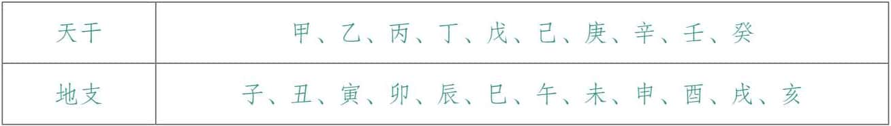

干支相配表
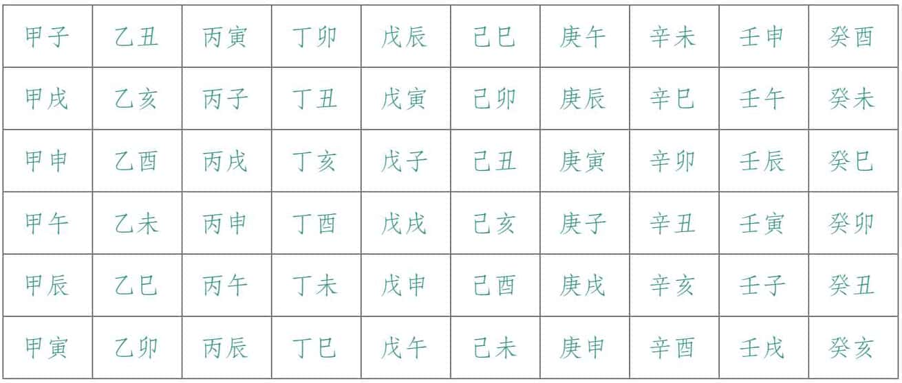

天干有十个，地支有十二个，配不齐！所以，就要取它们的最大公倍数，轮着相配，直到下一个甲子年出现。一轮下来，要过六十年，天干地支逢六十年循环一次，也就是所谓的“六十甲子”。

除了纪年，天干地支也可以用来记录日月，一年十二个月，正与十二地支吻合。“酉”对应八月。为什么是八月呢？因为八月稻谷成熟，就能酿酒了。

“酉”代表着酿酒的时节，哪怕作为地支，还是和酒密不可分。

### 酒/ 神奇的力量 /

“酒”是一个形声字，左边的“氵”是形符，表示酒是一种液体；右边的“酉”是声符，表示酒坛子，也用于表示“酒”的读音。

在古人看来，“酒”有一种特别的力量。《说文解字》中说：“酒，就也，所以就人性之善恶。”“就”是成就的意思，人性的善恶能被酒“成就”与催发。喝一壶酒，可能会英雄豪情，“路见不平一声吼，该出手时就出手”，也可能烂醉如泥，胡言乱语，可能诗情豪迈，“明月几时有，把酒问青天”，也可能酒后失德，放浪形骸之外。

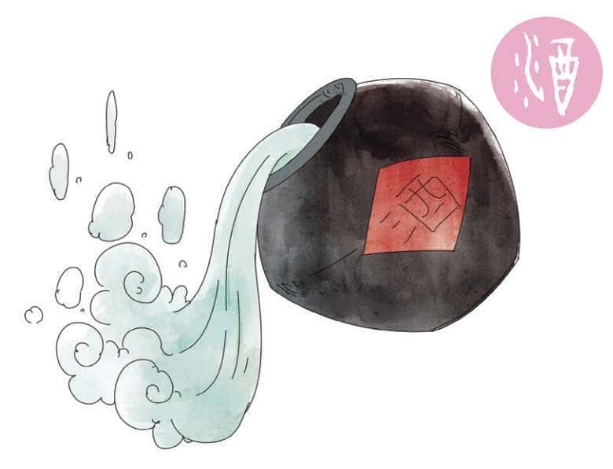

正因如此，古代圣人对酒很是警惕。相传“古者仪狄作酒醪（láo）”，有个叫仪狄的人发明了酒，这种奇妙的饮料被进献给大禹。“禹尝之而美”，大禹一尝，味道不错。但他马上发现，酒会让人情绪失控，所以“疏仪狄”，认为仪狄发明了一个坏东西，还是疏离他吧。大禹甚至感慨道：“以后一定会有因为酒而亡国的人呀。”

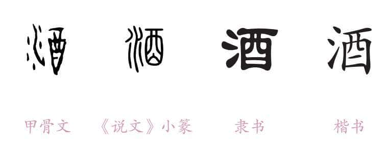

不仅大禹如此，周公对酒也很警惕，还专门下令禁酒，这就是《尚书》中的《酒诰》。秦国的商鞅在变法中也下过禁酒令。禁酒的原因，一方面是因为酒会坏事，另一方面，更是因为酿酒需要大量的粮食。贵族大量饮酒，豪奢无度，就会浪费粮食，让老百姓吃不饱饭。

但要注意的是，虽然统治者警惕酒的危害，可也离不开酒。因为酒除了用于宴饮，更是重要的税收来源。比如在汉武帝时期，因为对外四处征战，抗击匈奴，对内救灾频繁、兴修水利，导致国库捉襟见肘。为了增加收入，国家垄断了盐、铁、酒的制造和销售。宋朝时，国家不干涉民间对酒的生产和销售，但会对酒进行征税。许多朝代均是如此。

### 醉/ 醉而不乱 /

酒喝多了，就会昏昏沉沉，仿佛要睡着一样，这种晕乎乎的状态，就是“醉”。

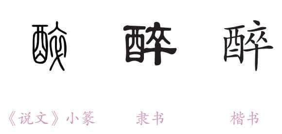

“醉”是一个形声字，左边是一个“酉”，表示和酒有关，右边是一个“卒”，表示读音，“卒”也有完成的意思，“醉”就是喝酒的“完成时”。怎么算喝完了呢？《说文解字》中说：“醉，卒也。卒其度量，不至于乱也。”

在古人看来，“醉”是你能喝多少就喝多少，“卒其度量”，以每个人自己的酒量为准。虽然喝得有些微醺（xūn），但“不至于乱”，不能丧失理性，借着酒劲去做坏事。你看，尽管饮酒欢乐，但古人很清楚，喝酒时要有节制和理性。

古人很爱喝酒，留下很多与酒有关的佳话。最出名的当属大诗人李白，他有一首名篇叫《将（qiāng）进酒》，什么意思呢？就是劝人赶紧喝酒！其中的名句“人生得意须尽欢，莫使金樽空对月。天生我材必有用，千金散尽还复来”，写出了无尽的快意与豪情。

人生得意，酣畅淋漓，李白就是这么爱酒！连诗圣杜甫也不禁写诗赞叹他：

李白斗酒诗百篇，长安市上酒家眠。

天子呼来不上船，自称臣是酒中仙。

李白边喝酒边作诗，酒喝得越多，诗写得越多，经常在长安的酒家里喝醉睡着。这时，唐玄宗让人请他去写诗，他可不去。为什么？我李太白是醉酒的仙人，不伺候你人间的皇帝。

就这样，李白“酒中仙”的名号不胫而走。

## 尊  
盛酒的器皿

说完了酒，还要说说盛酒的器皿，夜光杯、白玉杯、犀角杯……古代的酒器琳琅满目。在先秦时期，古人常用的酒器是什么呢？有尊、有爵，它们都被记录在古老的汉字中。

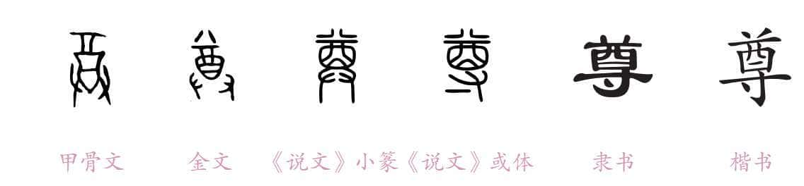

先看“尊”。尊是盛酒的器具，你看，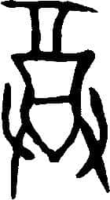是甲骨文中的“尊”，上面是一个“酉”，底下是两只手——两只手捧着一个酒坛子，就是最早的“尊”。从甲骨文到金文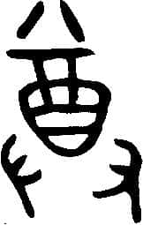，这个字的上面多了一个像“八”一样的装饰符号。等到了小篆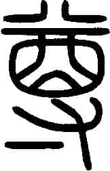，下面的手也省略了一只，这和今天的写法已经十分接近了。

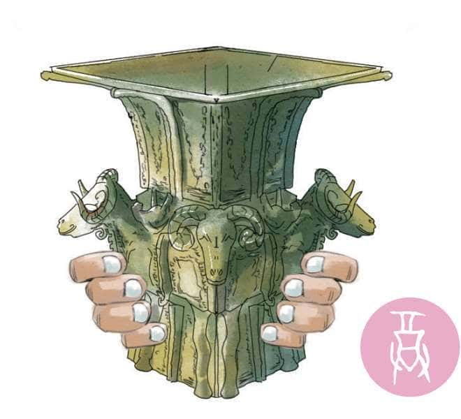

古代的尊十分精美，充分发挥了古人的想象力——既然喜欢喝酒，那就用精致华贵的器皿来装酒，就像今天我们给美酒设计漂亮的酒瓶一样。在出土文物中，有一类动物形象的尊特别有趣：

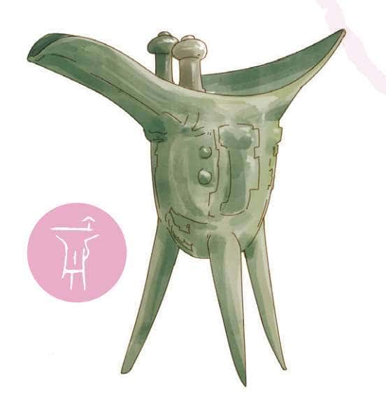

殷商时期，中原是有大象的，于是古人制作了象尊。肥硕敦实的象尊，长鼻高翘，美酒盛于肚中，通过掏空的鼻子倒出酒来。还有犀牛尊，它的外形是一只强壮健硕的犀牛，可以通过犀牛角来倒酒。还有鸷（zhì）鸟尊，外形是一只胖胖的猛禽，可以通过鸟喙把酒倒出来。它们都是古代青铜器的珍品。

“尊”除了用于酒器，也是祭祀的礼器。给祖先和神灵敬酒时，要用两只手捧着酒尊，恭恭敬敬，表示尊重肃敬。因此，“尊”还引申出尊重、尊奉、尊贵的意思。

有了酒壶“尊”，还需要酒杯“爵”。

最初，“爵”字有两种写法，一种写法是酒杯的象形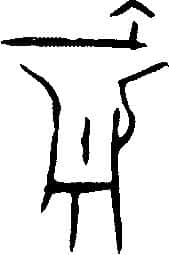。还有一种写法，是在酒杯的旁边添加一个表示手的“又”——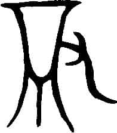，人们在喝酒时，要把酒杯拿在手里。从“又”的“爵”不断发展，变成《说文解字》小篆中繁复的字形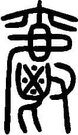。中左下方是“鬯”（chàng），是古代的一种美酒。这个字太复杂了，随着汉字的简化，一步一步变成了今天的形体，“又”也变成了同样与手有关的“寸”。

爵的形状很特别，下面是三条腿，上面往嘴里倒酒的流线型部件叫作“流”。在杯口左右两边，有两根立柱。对于这两根小柱子的作用，人们众说纷纭。有人认为，这两根小柱子是节制饮酒的——用爵喝酒，必须要小口抿，如果大口猛灌，两根小柱子可能会插到鼻孔里，或是戳到脸和眼睛上。也有人认为，这两个小柱子上，可以挂肉，这样既能吃肉又能喝酒，岂不美哉。还有人认为，这两个小柱子可以用来分开碍事的胡子，古人胡子长，有小柱子来分开胡子，喝酒就方便多了。三种说法虽然都很有趣，但没什么道理，甚至还有些滑稽。

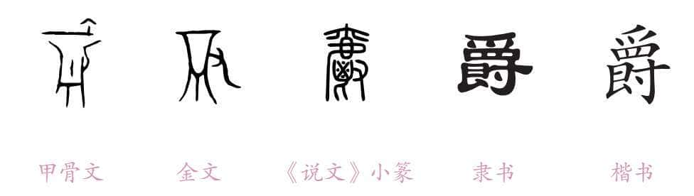

后来，人们通过考古发现，有的爵的两根小柱子周围，有纺织品的残存物，爵底还有香茅残渣。于是学者提出，小柱子是用来挂过滤网的。为什么要挂过滤网呢？因为古代造酒提纯度不够，酒里难免有渣滓，所以古人以“流”的尖端和两个小柱子为支点，在上面挂上用来过滤的布网，这样就能起到提纯浊酒的作用。

除了酒器外，爵还有一种很重要的作用。《说文解字》说：“爵，礼器也。”爵不仅是喝酒的工具，在礼乐文化盛行的年代里，也是重要礼器，和“尊”一起用于祭祀和典礼。因此，“爵”和“尊”一样也有“尊贵”的含义，可以表示爵位，比如古代五爵——公爵、侯爵、伯爵、子爵、男爵。也有人认为，爵位与古代饮酒的次序有关，天子赐予爵位时，往往同时赐予百户牛酒、赐酺（pú）[1]，目的就是通过酒食之礼，来重新确认获爵者的新席次、新身份。

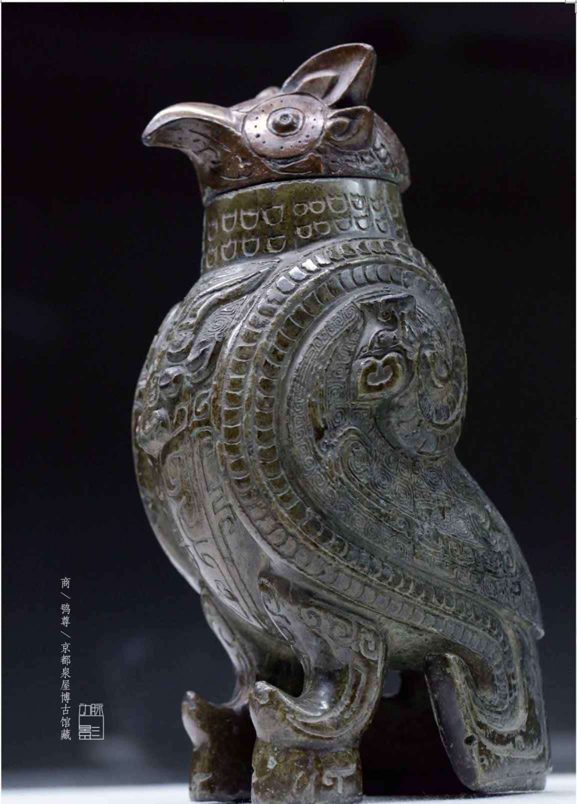

* * *

[1]臣民聚会饮酒。

## 医  
酒也是一种灵丹妙药

从“酉”的字和酒密不可分，但有一个字虽然从“酉”，它的字义却和酒关系不大。这个字在我们生活中十分重要，谁都离不开，又都有点儿敬重它——它就是“医”字。

你也许会觉得奇怪，“医”和“酉”有什么关系呢？要知道，我们今天的“医”是简化后的字形。繁体字中的“医”写作“醫”，上面的“殹”念yì，下面是“酉”，这是一个“从酉殹声”的形声字。后来人们觉得这个字太难写了，就去掉了“酉”，并把“殹”截取了左半边，写作“医”。这一简化不要紧，我们也就看不出医生与酉、酒之间的关系了。

“医”和酒真的有关系吗？回答这个问题，我们先要了解一下古代的中医文化。《说文解字》中说：“医，治病工也。”医生是一个特殊的工种，负责治病救人。在古代医生看来，酒具有发散的功能，因此可以用来做药引子，帮助扩散药性，这是古代中医的一个文化传统，“医”也因此与酒密不可分。

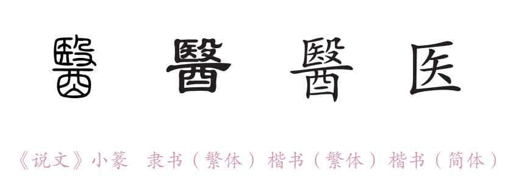

中国历史上有很多名医，最著名的有四大名医，他们是春秋时期的扁鹊，东汉末年的华佗、张仲景，以及唐朝的药王孙思邈（miǎo）。

其中，相传华佗发明了一种叫“麻沸散”的麻醉药。据《后汉书·华佗传》中所言，华佗会让病人以酒送服麻沸散，之后病人便会像醉了一样失去知觉，可以进行手术。除此之外，在张仲景的医学名著《伤寒论》、唐代“药王”孙思邈的《千金方》和明代名医李时珍的《本草纲目》中，也都有“以酒入药”的记载。

当然，我们今天吃药的时候，可不能随便喝酒啊。

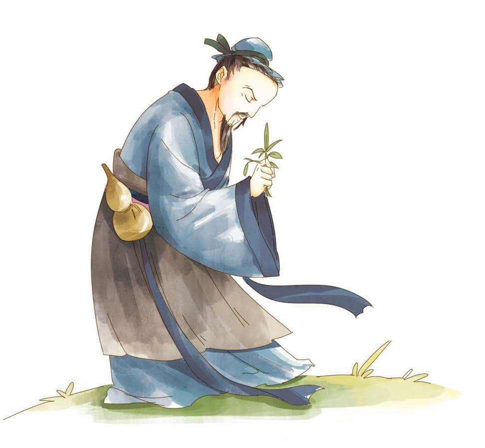

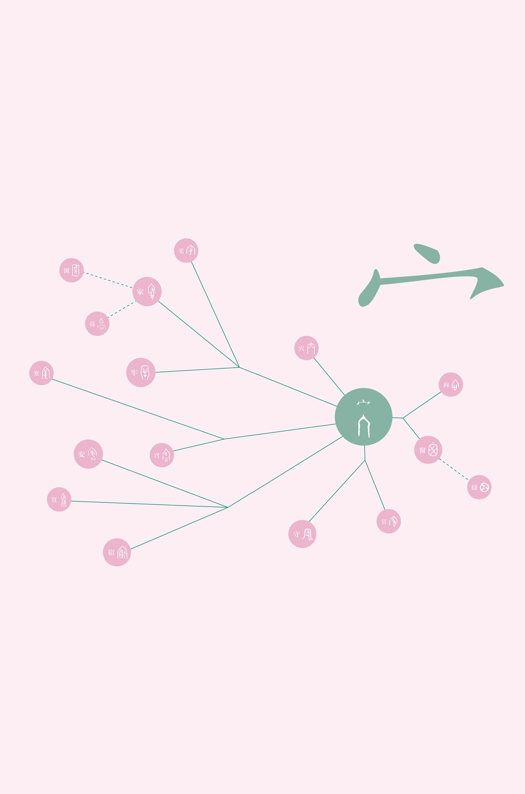

## 宀·穴  
原始人的房子

我们总说“安居乐业”，这个成语出自《老子》：“甘其食，美其服；安其居，乐其俗。”它代表了无数人对生活的畅想：安心地居住，愉快地劳作。可你有没有想过，我们的祖先最早居住的房子长成什么样子？风雨不动、安全舒适的房屋经过了怎样的发展变化？这一讲，我将为你介绍和房屋有关的汉字，先从早期的房子——“宀”和“穴”说起吧。

### 宀/ 房屋的象形 /

“宀”是今天常用的偏旁部首——宝盖头，不过，在古文字中，它是一个独立的字，读作mián。“宀”字的历史相当悠久，在甲骨文中就已经出现了。它是一个象形字，就像一座有着尖尖屋顶的房子。

《说文解字》对“宀”的解释是“交覆深屋也”。这个解释看似生僻，其实不难理解——“交覆”指房顶从四面八方覆盖下去，“深屋”是指院落深深，房子不止一间。

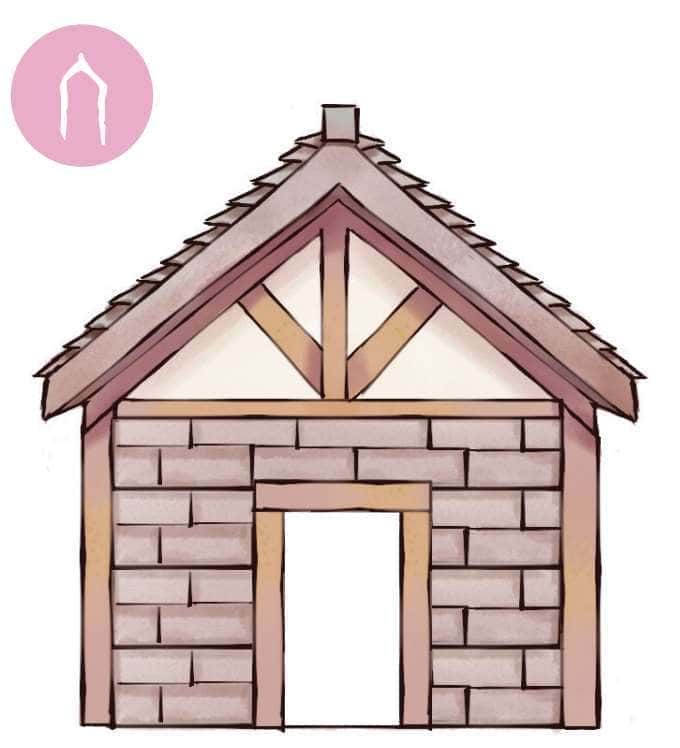

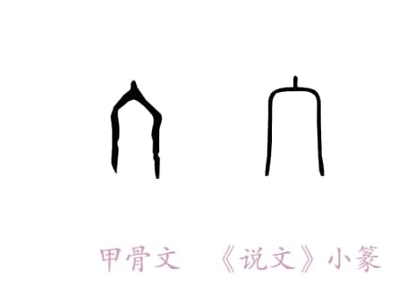

后来，“宀”不再单独使用，而是成为一个十分常用的偏旁部首，可以组成各种各样的字。这些字都和房屋密不可分——“家”“宅”“室”“宫”，是不同的房屋；“安”“定”，是住在屋子里的安然自得；“宿”“寝”是在屋子里安睡；“宇”“宙”，所谓“四方上下曰宇，古往今来曰宙”，是将这广阔的时间与空间类比成房屋……

### 穴/ 原始人的地穴 /

从简陋的房屋到“广厦千万间”，古人的住所经历了漫长的历史发展过程。在有房屋之前，古人住在哪里呢？——“穴”字会告诉你答案。

“穴”字的上头是“宀”，底下是“八”，“八”表示空间的区分。

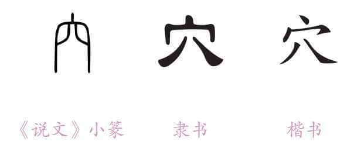

“穴”是一种原始住所，《说文解字》中说：“穴，土室也。”原始人最初住在简陋的土洞里。宋太宗的枕边书《太平御览》对此也有讲解：“上古皆穴处，有圣人教之巢居，号大巢氏。今南方人巢居，北方人穴处，古之遗俗也。”上古时代，人们有两种居住方式。一种是穴居，一种是巢居。

穴居，是在山崖上挖一个山洞，或是从地面向下挖一个地洞。根据考古，居住在北方的古人会挖一种类似袋子的洞穴用于居住，这种洞穴叫“袋形穴”，有时古人还会在穴上面加一个草棚子。

巢居，是像鸟和猩猩一样住在树上。南方潮湿，不适宜住在洞穴里，有一位圣人便教大家在树上搭窝棚。先在树上的分枝开阔处铺好枝干茎叶，搭成“地板”，然后再用枝干搭建出一个可以遮风避雨的棚子。人们赞颂圣人的智慧，尊称他为“大巢氏”。

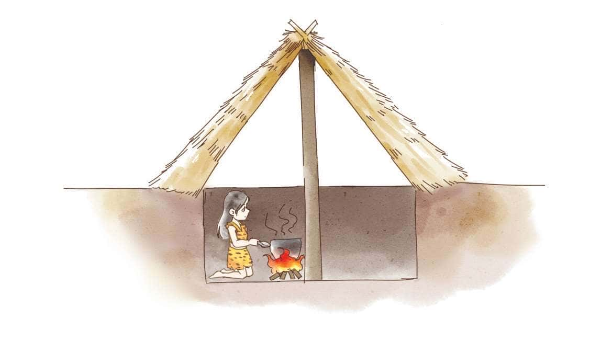

## 家·宅·牢  
房子和动物的关系

穴居太辛苦，随着生产的发展、技术的进步，我们的祖先一步步掌握了建造住宅的艺术。房子也从穴居和巢居跃升为独栋小屋。在这一讲，我们将从汉字和房屋发展的角度，重新认识一下“家”“宅”“牢”这三个字。

### 家/ 我们的家要养猪 /

“家”是一个很有意思的字，人们面对这个字时，也许会有些迷茫——“家”意味着血脉相聚、家庭归属，可“豕（shǐ）”是猪的意思。“家”字里为什么没有“人”，反而却有一头小猪呢？

对此，许慎先生在《说文解字》中的解释是：“家，居也。从宀，豭（jiā）省声。”在他看来，家是我们居住的地方。“宀”是形符，“豭”是声符。但“豭”的形体太复杂了，不好写，于是古人截取了简省的形体，把声符“豭”右边的“叚”去掉，只留“豕”字，这种简省的做法，叫作“豭省声”——按照许慎先生的解释，“家”和“豕”没有意义关联，只有声音上的渊源。

不过，很多人并不同意许慎先生的看法，他们认为“家”和“豕”

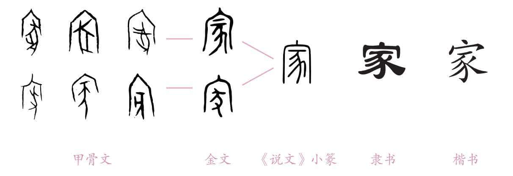

是有关系的，它其实是一个“从宀从豕”的会意字。那么，这个“意”是怎么“会”出来的呢？

有人说，一个家庭有钱了，就开始养猪，养猪是家庭财富的象征。也有人说，最开始的“家”指的是猪的家，也就是猪圈（juàn）。还有人说，一个人“家”里很乱，乱得像住了头猪，这就是“家”……

这些说法，好像都有些道理。但真正的答案，还是要去古老的甲骨文中去探寻。

在甲骨文中，“家”有两类写法。第一行写法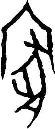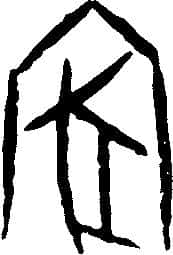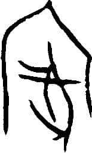，“宀”的下面是“豕”，房子中住着一头小猪；第二行写法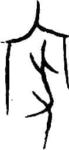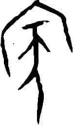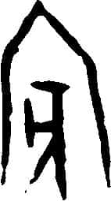，房子里不是小猪了，而是“犬”——既然“家”里面既能住“豕”，又能住“犬”，那“家”一定不是专指猪的家，也不是说家里乱得像住了头猪。

其实，“家”字暗含着古人生活方式的转折，也暗含着古人人畜共居格局的秘密。

在旧石器时代，以游猎和采摘为生的原始人住在自然洞窟里，或是栖居在大树上。食物贫乏，逼迫人类不断地流浪、迁徙。那时候，古人无以为家。后来，古人使用粗制的石器采伐枝干，建造简陋的窝棚，进入穴居和巢居的时代。不过穴居和巢居太过粗陋，下雨时，滂沱的雨水会灌进屋内，各种各样的小虫子和凶猛的野兽也时常光顾。于是，人们慢慢改良，创造出现在房屋的雏形。

再后来，在狩猎和采集之外，古人开始驯养家畜，培育谷物，进行耕种，农耕文明初现。古人何时开始驯化家猪的呢？考古学家告诉我们，中国的家猪大约出现在1万年前。在河北徐水南庄头遗址出土了距今1万年左右的家猪遗骸，在河南新郑裴李岗和浙江余姚河姆渡等遗址中，也出土了距今8000年到7000年的猪骨和陶猪，其形态属于原始家猪。猪从最早的狩猎对象，变为了被驯养的家畜，参与到中国古人的生活里、文化里，也投射在古老的汉字中。

有了家畜，食物日益充足，促进了古人的定居生活和建筑的发展。聪明勤劳的古人，为了在有限的条件下更好地养猪，发明了二层吊脚楼——上面住人，下面圈养家畜。在那个物质贫乏的远古年代里，猪以人的残羹冷炙为食，并为一个家庭提供珍贵而稳定的肉食来源。这是古人心中的安稳生活，也是一个幸福小家庭的开始。

于是，便有了“家”字。

除了“家”，这种人畜共居的建筑形态也在“高”字里有所体现。在甲骨文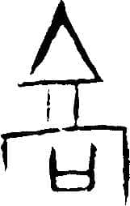中，“高”就像古人居住的二层小楼——人在楼上，下面的一楼是用木桩子搭成的地基，也是古人养猪、养家畜的地方。中国西南地区的少数民族，尤其是贵州山区苗乡村寨的传统干栏式住宅，多多少少保留了人畜共居的建筑结构。据方志记载，苗人喜欢住小楼，上层存储谷物，中层住人，下层圈养牲畜。

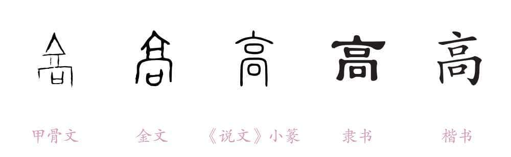

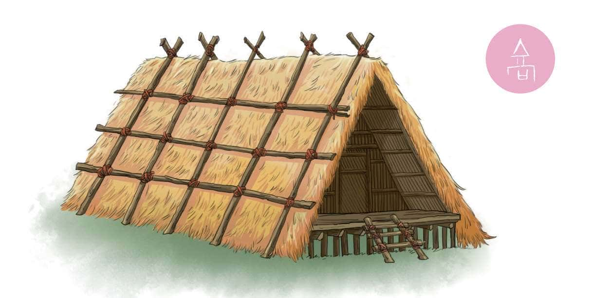

不过，人和猪住在上下楼，毕竟不方便——猪脏脏的，睡觉还打呼噜，我们难免会嫌弃它！

怎么办呢？随着社会发展，人和猪渐渐地分了家，猪不再住在“高”里，而是有了独立的住处，这就是“圂”（hùn）。

“圂”字不常见，它的外面是一个“囗”（wéi），里面是“豕”。它是一个会意字，表示把猪围起来，这就是古代的猪圈。除了猪圈，“圂”还有一个很有意思的字义。许慎先生说：“圂，厕也。”

“圂”还有厕所的意思！可是，为什么猪圈和厕所是同一个地方呢？要知道，古代的猪圈往往就是厕所，人排出的粪便，直接成了猪的饲料。人的粪便和猪的粪便又都可以积肥，为田里的农作物提供养分。

不信？你看右页的汉代陶猪圈，上面是厕所，下面就是猪圈！

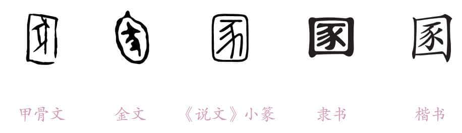

说到这里，你可能还会问一个问题：“厕”字呢？它和厕所有什么关系呢？

在汉字中，“厕”和“侧身”的“侧”读音相近，意义相通——“侧”是身体的两旁，“厕所”就是“侧所”，指在院落中居于两侧的地方。厕所名字的由来也告诉我们，猪和人类已经分家，它们被赶到了院落的边角之处。

从“家”代表的人猪共居，到“圂”“厕”代表的人猪分家，汉字以自己的独特方式，记录下了人类居所的发展与变迁。

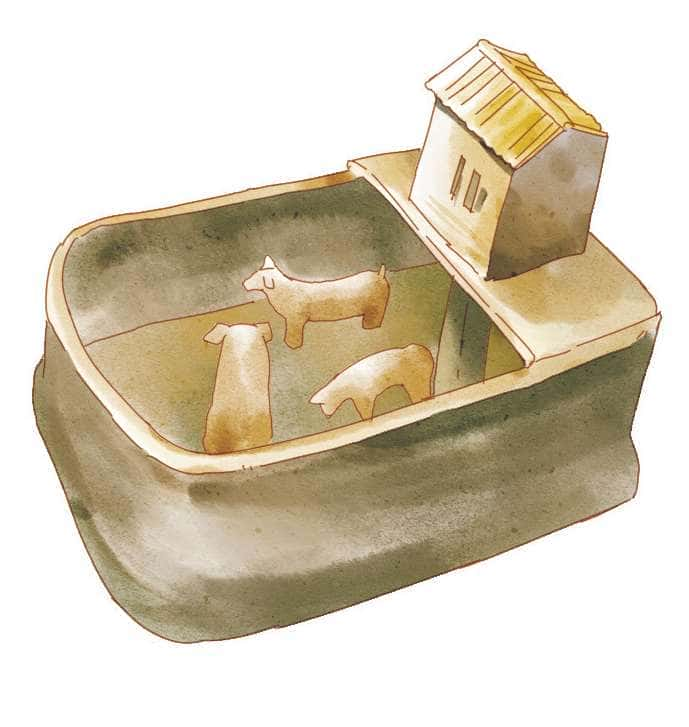

### 宅****牢/ 用途不同的房子 /

“宅”和“牢”是用途不同的房子。

“宅”字的历史非常悠久，早在甲骨文中就已出现。这个字从宀乇（zhé）声，是一个形声字。

什么是“宅”呢？古人说，“人之居舍曰宅”——让人居住的地方叫作宅。除了指房屋住宅，“宅”也指居住在某个地域。在今天的陕西宝鸡，出土过一个著名的青铜器叫何尊。何尊的铭文有一句话叫“宅兹中国”。“宅”指住在这儿，“兹”是此地的意思，“宅兹中国”就指安居在中国，这也是“中国”一词可考的最早文物。

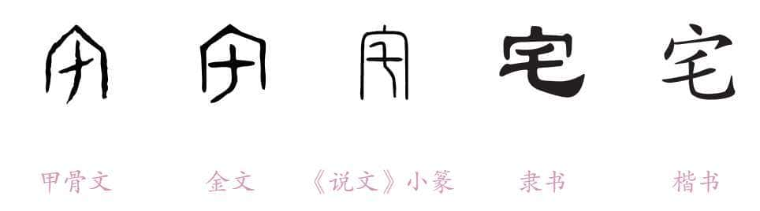

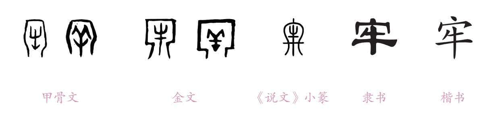

至于“牢”，现在常指“囚牢”，但在造字时，“牢”的功能并不是关人，而是关牲畜。《说文解字》中就有“养牛马圈（juàn）也”的说法。

从“牢”的甲骨文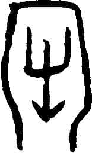和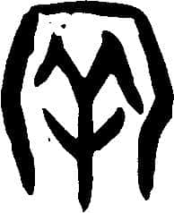可以看出，一个围栏里有牛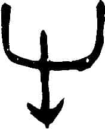也有羊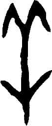，因此，“牢”的本义是圈养牛羊马等牲畜的栏圈。明白了这一点，也就懂得为什么有一个成语叫“亡羊补牢”了。

把犯人关进牢房里，就像把牛羊关进“牢”里一样，因此，“牢”字又引申出牢房的含义。作为栏圈的“牢”和牢房都很坚固，所以，“牢”又有了牢固、牢靠、牢不可破的意思。

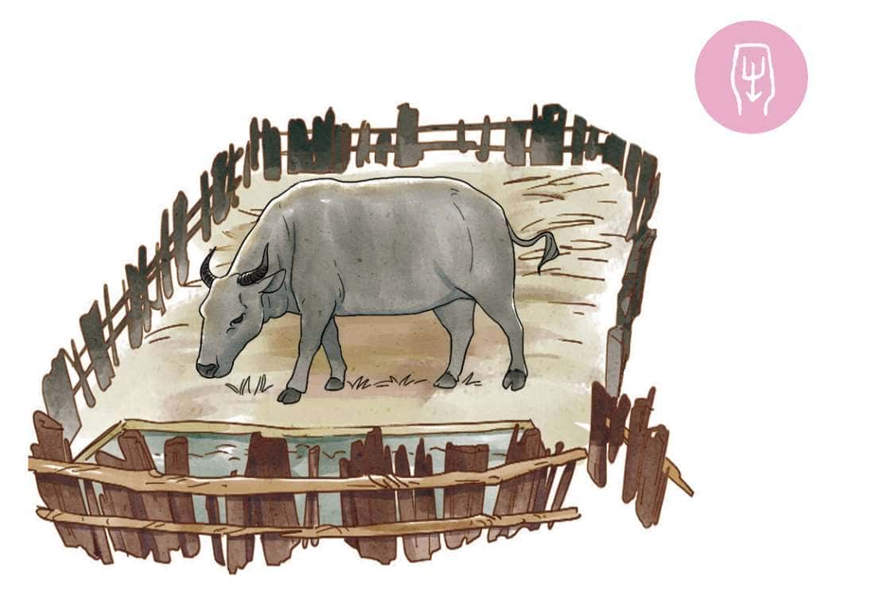

## 向·窗  
窗户和烟囱

我为你介绍了穴居的“穴”字、可以养猪的“家”字，这一讲，古人的房子又有了新的升级换代——加上了窗户。

在汉字中，有哪些和窗户有关的字呢？

### 向/ 朝北的窗户 /

先说一说“方向”的“向”。咦，方向和窗户有什么关系呢？让我们去古文字中寻找答案。

从甲骨文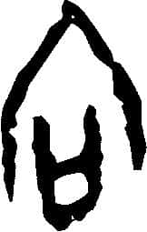到小篆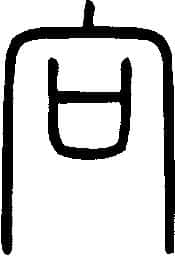，“向”的字形一脉相承：外面是房屋的轮廓，也就是“宀”，房屋里面有一个“口”——窗户的象形。

《说文解字》解释说：“向，北出牖（yǒu）也。从宀从口。《诗》曰：‘塞向墐（jìn）户。’”“牖”是窗户，“向”特指向北开的窗户，所以是“北出牖也”。“墐”是用泥涂塞的意思。在古人的生活经验中，冷风大多从北方吹来。在那个没有暖气的时代，为了抵御冬天的刺骨寒风，必须用泥土将北面的门窗缝隙封堵起来，这就是《诗经》所说的“塞向墐户”。

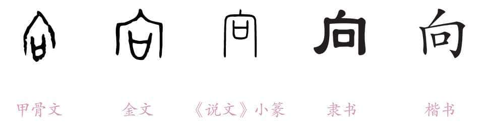

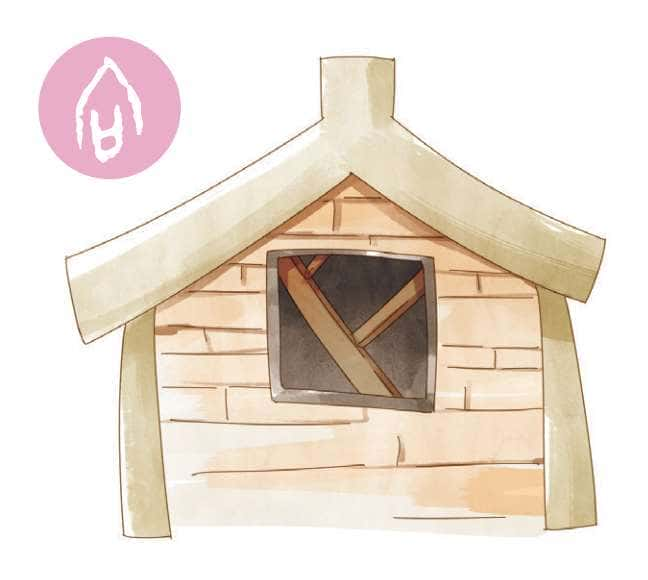

明确了“向”的本义是窗户，我们再回到一开始提出的问题：方向和窗户有什么关系呢？打开窗户，自然而然面朝窗外的方向。因此，“向”引申出方向、朝向之义。

### 窗/ 窗户与烟囱有关 /

和“向”相比，我们今天常用的“窗”字反倒有些不好讲，为什么这么说呢？因为它在《说文解字》中有三种写法。

在《说文》的三个字形中，第一个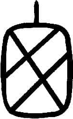其实是烟囱的“囱”；第二个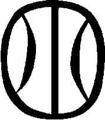是高度象形的古文字—— 一个四四方方的窗框里，有几道窗格；第三个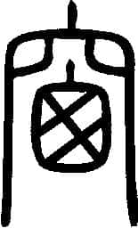是在“囱”的基础上加了一个“穴”，这就是我们今天最常用的“窗”字。

你可能会好奇，烟囱和窗户有什么关系呢？这与古人的建筑技术相关。聪明的古人很早就已发明了以土筑墙的版筑技术，到了周代，特别是春秋战国时期，相关工艺已经非常成熟：筑墙时，先打好木桩，然后立起两块木板，在两板之间填入泥土，用杵夯（hāng）实，筑成墙体。在砖瓦未曾发明的时代，用版筑方法筑起的土墙还不够结实，无法开出宽大明亮的窗户。要知道，窗户做得太大，则窗户上方的夯土得不到支撑，很容易塌掉。因此，早期的窗户很小，往往是在墙上挖一扇小窗，用窗格支撑起来，让阳光和空气透进来，便已足够了。从这个角度来看，窗和同样窄小的烟囱颇为相似，窗户和烟囱也都用同一个“囱”字来表示。

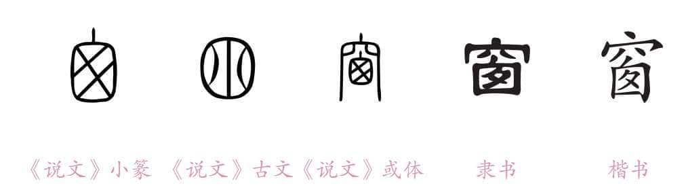

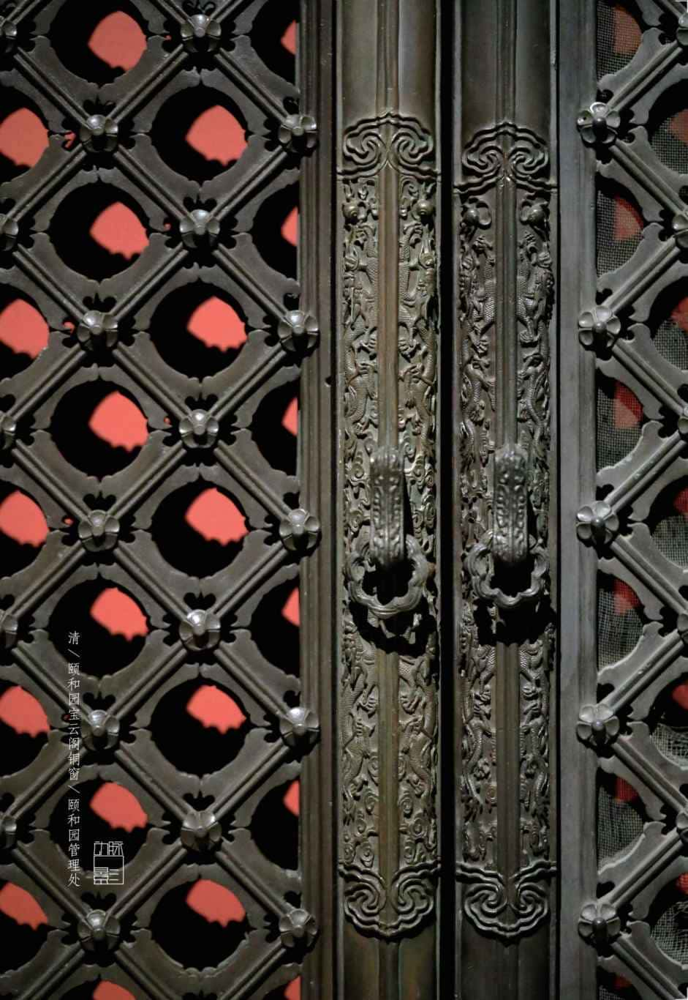

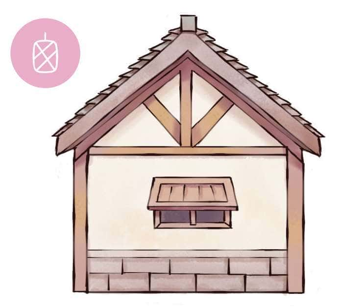

但窗户和烟囱毕竟不同，为了区别，古人在“囱”上面加上“穴”，创造出“窗”字。

除了“窗”，还有一个和窗户有关的好玩的字。你看它是谁？

不用犹豫，这个字你一眼就能认出来——它是囧（jiǒng）——郁闷的方脸，无奈的大嘴，一对尴尬的八字眉，真是“好囧”啊！

“囧”字可不是互联网时代的新造字，它年纪很大，早在甲骨文中就已存在，是个三千多岁的资深汉字。从淹没在历史中不为人知，到变身为网络流行用语，“囧”字的人生也是跌宕起伏。

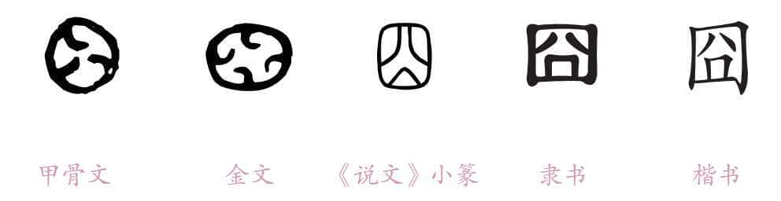

在历史的长河里，它的含义一点儿也不“囧”。从甲骨文到楷书，它并不表示窘迫、困窘的意思，而是窗户的象形。《说文解字》解释说：“囧，窗牖丽廔（lóu）闿（kāi）明。象形。”“窗牖”指窗户，“丽廔”是窗格交错的样子，“闿明”指明亮、敞亮。光线透过交错的窗格射进屋内，光明透亮，这就是“囧”的本义。

至于“囧”在今天的用法，还是因为它长得太有趣了，怎么看怎么像一张苦恼尴尬的面孔，难怪人们错解了它的意思呢。

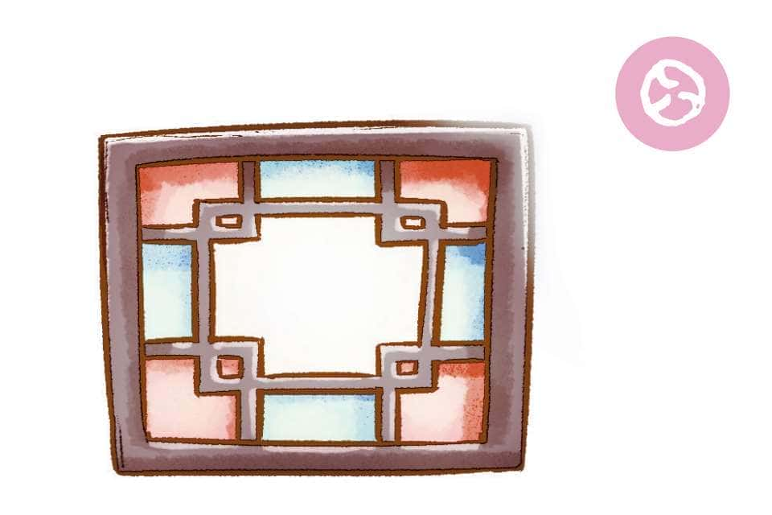

## 室·宫  
讲究的房子

古代大家大户的房子比较讲究，比如要坐北朝南、几进几出。这一讲，我们要认识的“室”“宫”二字，便与房子的格局有关。

### 室/ 最里面的屋子 /

在甲骨文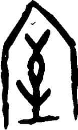中，“室”是一个从“宀”从“至”的会意字。“至”表示箭射到目的地，也就是到达的意思，“室”就是一个人要到达的地方。《说文解字》中又说“室，实也”——人到达屋内，让屋内的空间变得充实起来。

“室”和“到达”的关系，很能体现出古代的房屋规制。我们中国在北半球，坐北朝南的房子采光最好，因此，古代院落一般都是坐北朝南，冬暖夏凉。院落的正中间是大门，门的两边有两间小屋子，叫作“塾”，其中西侧的“塾”是教育子弟的地方。进入大门后，你会看到一个很大的庭院，庭院中间有一个碑，是家族祭祀时拴牲口的地方。

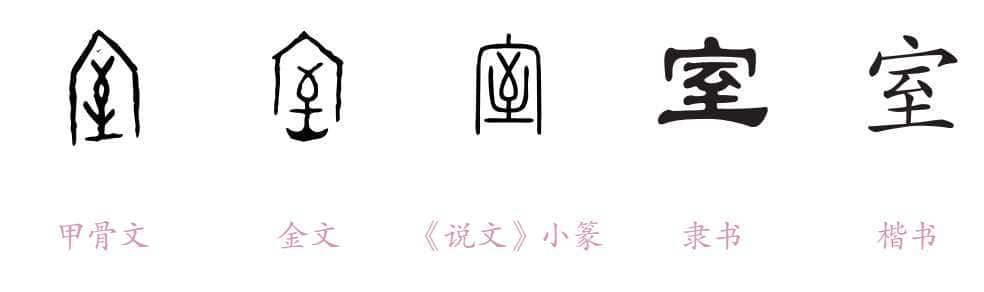

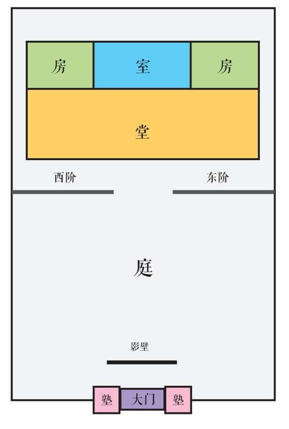

进了庭院往里走，第一个建筑是“堂”。堂前东西两侧都有台阶，称为“东阶”“西阶”。“堂”是古代接待客人、举行典礼的地方，一定要宽敞明亮。因此，“大堂”“厅堂”“殿堂”“富丽堂皇”“堂堂正正”等词中，“堂”都有“大”的意思。

从“堂”再往里走，就是“室”。要注意，我们不是一下子就来到了室，而是从门口一路穿过庭院、大堂，最终到达室内，这也就是“室”字从“至”的原因。“室”是院落最靠里的屋子，有内部、私人的特点，因此，我们说“卧室”，而不说“卧堂”“卧厅”——“室”与“厅”“堂”还是内外有别的。

室的旁边是房。“房”字是个形声字，形符是“户”，声符是“方”。“户”可以指门，也可以指窗户，从户的字往往跟房屋密切相关。《说文解字》中说：“房，室在旁也。”“室”在中间，“房”在两旁，“房”和旁边的“旁”是同源的。

“室”和“房”不仅房屋位置有差别，住在里面的人的地位也不同。在中国古代，一个男人可以有妻有妾，正妻要住在正中间，称为“正室夫人”，其他妾侍住在两侧的房子里，称为“偏房”，由此也能看出“房”和家族身份的关联。

### 宫/ 皇帝的院落 /

说起“宫”，我们会想到“宫殿”“宫廷”，认为只有帝王居住的地方才叫“宫”。其实在古代，“宫”没那么高级和奢华。

从甲骨文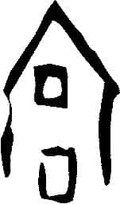、金文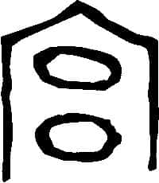，一直到小篆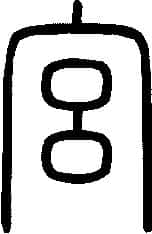，“宫”的字形一脉相承。“宫”从“宀”，表示和房屋有关。里头的小方块是一间一间的屋子，因此，“宫”指的是一整套的房屋院落。

古代阶级分化严重，能住得起一整套大房子的，大多是贵族皇室。正因如此，“宫”后来专指帝王的居所，用于“宫殿”“宫廷”等词。

中国现存规模最大、保存最完整的帝王宫殿是故宫。故宫旧称紫禁城，古人用紫微垣（天区名）来比喻帝王，帝王的居所在秦汉时又称为“禁中”，意思是门户有禁，不得随便入内，所以称为紫禁城。

这座恢宏的宫殿坐落于北京市中心，于明朝永乐四年（1406）筹建，永乐十五年（1417）开工，永乐十八年（1420）落成。从明成祖朱棣到中国末代皇帝溥仪，在500多年的光阴里，它见证了24位帝王和明清两个朝代的兴亡交替。

作为“一整套的大房子”，故宫是古代木制建筑格局的极致。现存宫宇足足有9000多间，分为外朝和内廷。外朝是皇帝行使权力的场所，其中最重要的建筑是太和殿——皇帝举办登基大典的地方。内廷有皇帝处理日常政务的乾清宫、皇后居住的坤宁宫、太后居住的慈宁宫等。

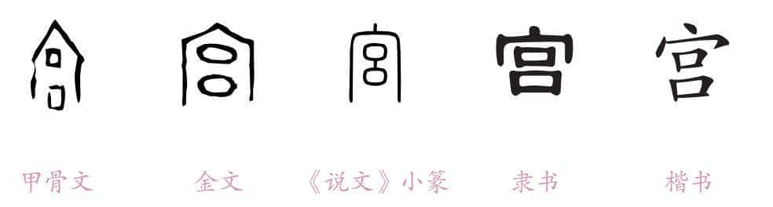

1912年清朝被推翻之后，这座宫殿最后一位主人——末代皇帝溥仪退位，并于1924年黯然神伤地离开了皇宫。1925年，在明清皇宫和宫廷旧藏文物的基础上，故宫博物院成立。昔日戒备森严的皇宫自此成为传播文化的博物馆，而紫禁城也就成了“故宫”——曾经故往的帝王宫殿。

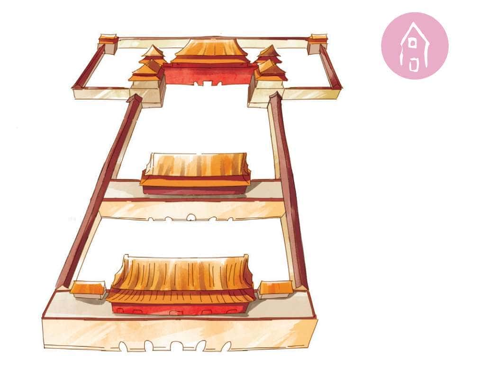

## 安·宜·宿  
安居乐业的家园

房屋为我们遮风挡雨，让我们远离大自然中的种种危险。相比于风餐露宿，人住在坚固的屋子里，会特别有安全感。因此，以“宀”为部首的字，往往和安定、安宁的状态有关。在这一讲，我们要讲的便是安定的“安”、适宜的“宜”，还有安然入睡的“宿”。

### 安/ 安定的家园 /

“安”是一个从宀从女的会意字。这个字体现出古人对安定生活的美好想象。

《说文解字》说：“安，静也，从女在宀下。”搭一间遮风避雨的屋子，迎娶一位值得终身相守的女子，组建一个美满的家庭！这便是“安”字传递给我们的文化意蕴——成家立业，意味着生活的安定。

“安”由安定延伸出“安宁”“安逸”“安好”“安康”“安乐”“安全”等用法。生活安定了，我们的心也容易静下来，所以“安”还可以表示沉静的状态，有了“安静”“安然”等词。还有“心安理得”，一个人做的事情无愧于心，符合道理，他的整个生命自然是安稳无亏的。

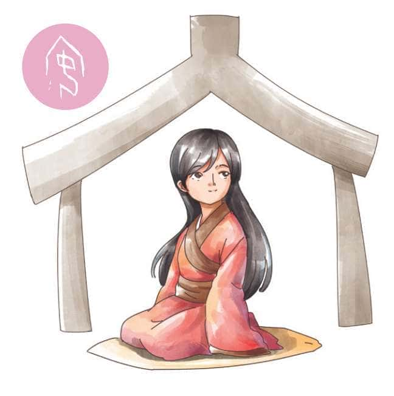

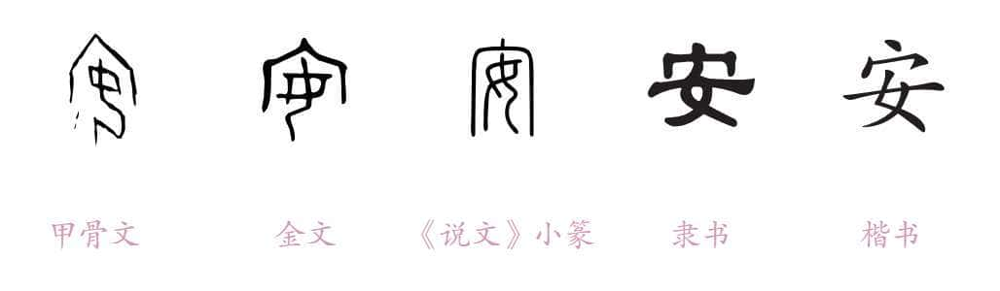

这样美好的“安”字，老百姓喜欢，皇帝也喜欢。在古代朝堂上，大臣为了表示对皇帝的尊重和忠诚，要给皇帝“请安”，问候皇帝是否安好。每次上折子，都要恭恭敬敬地落笔写上“恭请皇上圣安”——因为皇上身份尊贵，所以要说“圣安”。皇帝会怎么回答呢？他们会说“朕躬安”。“朕”是皇帝的自称，“躬”是身体，“安”表示很安定，“朕躬安”的意思是说“我身体不错”。大臣觐见完毕，准备离开时，皇上还会让臣子“跪安”，意思是大臣们跪下请个安，就可以退下了。

给皇帝“请安”真麻烦，皇帝是“安”了，大臣们心里可都很紧张，生怕哪句话说错了，惹怒龙颜。

### 宜/ 适宜与祭祀 /

“宜”是一种适合的状态，说一个地方“宜居”，是说它适合居住；说一个地方“风景宜人”，是说它风景秀丽，让人心旷神怡。

和“安”一样，“宜”字里也有个“宀”，这是房子适宜居住的意思吗？

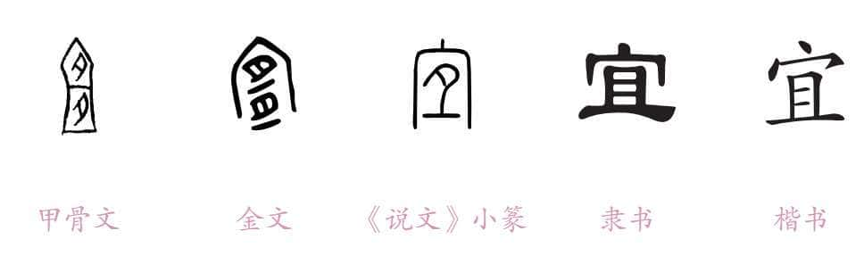

并非如此。

在甲骨文里，“宜”不从“宀”。它和古代祭祀有关，字形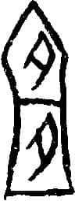中画出了祭祀时放肉的架子，还有两块祭肉。用肉祭祀神灵，获得庇佑，自然是最为“适宜”的事情了。到了周代金文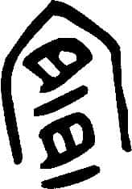，“宜”的上方添加了“宀”，用肉祭祀神灵的行为从室外搬进了屋里。再到后来，随着汉字的不断发展，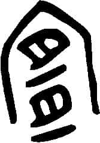慢慢演变成了今天的形体。

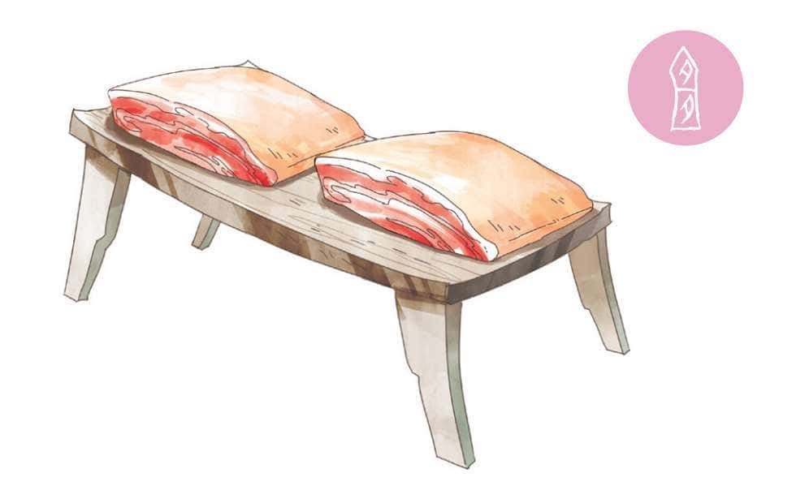

### 宿/ 为什么叫“宿”舍？ /

你知道“宿”这个字是怎么造出来的吗？“宿”，包括“宀”“人”“百”三个字形，它是一百个人住的宿舍吗？

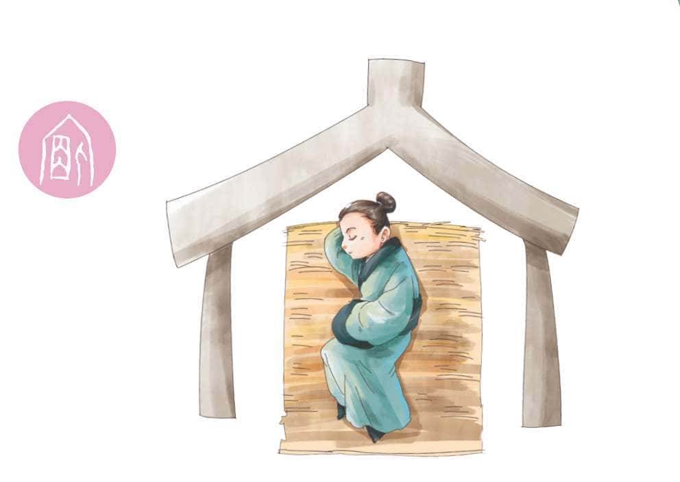

当然不是。“百”的出现，是“宿”在发展演化中，给我们开的小玩笑。

在甲骨文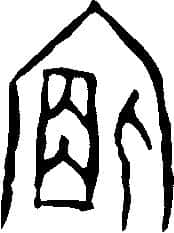中，“宿”是一个会意字，上方是“宀”，表示房屋，下方一个人、一张席——“宿”也是个让人舒服的字，表示人安然地睡在席子之上，用于“住宿”“宿营”“宿舍”等。只不过，表示席子的字形，在汉字演化的过程中，慢慢被错写成了“百”。于是，有了让人难解其意的“宿”字。

人睡觉一般在晚上。古代没有电灯，照明不易，可没有那么多夜猫子。所以，“宿”也有夜晚的意思，读作“xiǔ”，一宿就是一夜。

睡觉的时候，人的身心静止下来，很长时间都不会发生改变。因此，“宿”（sù）又引申出“一向”“向来”的意思，有时间长久的含义。在汉语中，我们把一直以来的愿望称为“宿愿”，一直以来的矛盾称为“宿怨”“宿敌”，都是这个意思。

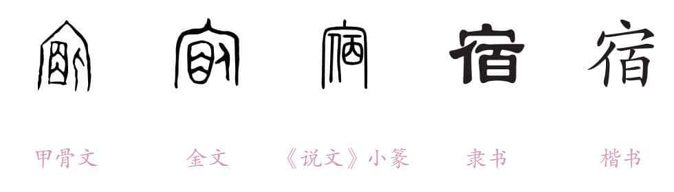

若将“宿”的静止状态放在人生之中，“宿”又有了时间积累的含义，可以用来形容老人。我们把打了一辈子仗的老将军叫“宿将”，把教了一辈子书的先生叫作“宿儒”——无论久战沙场，还是一生浸于纸笔书卷之间，都是一种稳定而恒久的状态。

## 官·守  
屋子中的大官

不同的房屋住着不同身份的人。这一讲，在宀下住着的，是“官”和“守”。他们都是居住在高大房屋中的人。

### 官/ 中国古代的“官” /

中国很早就有“官”字了。“官”是个十分形象的会意字，许慎先生在《说文解字》中说：“官，吏事君也。从宀，从 （duī）， 犹众也，此与师同义。”意思就是，“官”是辅助国君、管理百姓的官吏。上面的“宀”表示房屋，下面的“  ”是繁体字“師”（师）的左半边，表示众多的人——老师要教育各种各样的学生，官员要管理各种各样的百姓，“师”和“官”都从“𠂤”，都要和人民大众打交道。

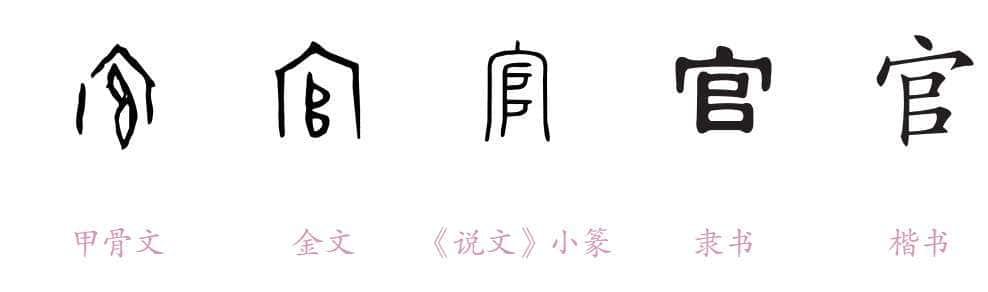

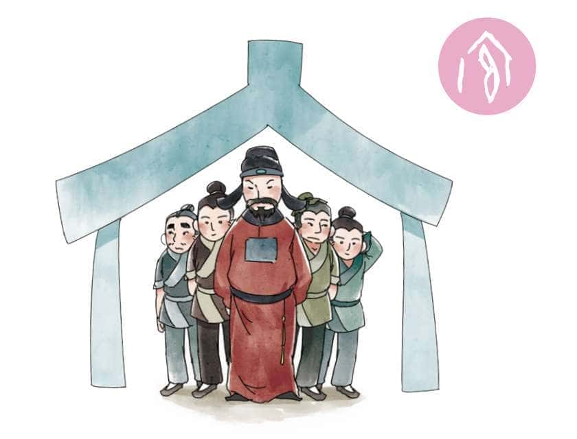

为了维护国家的正常运转，让政令自上而下地传达至各个县镇，现代有公务员系统，古代则有非常庞大的官僚体系——比如“三公九卿制”。

秦朝时的三公指丞相[1]、御史大夫和太尉。太尉负责掌管军队，御史大夫负责监察百官，就像现在监督公务员的监察委一样。丞相则负责统筹政务，是辅佐皇帝处理政务的最高行政长官。到了汉代，三公变成了“司徒”“司马”和“司空”，司徒最大，也就是丞相——“徒”有众多的意思，“司徒”的得名和“官”造字的思路差不多；司马从字面上看，是管马的官员，但这可不是“弼马温”那样的小官，他负责管理战马，是负责军事的长官；司空最开始写作“司工”，也就是管理工程、建筑的长官。

在三公之中，丞相统领百官，权力极大，有的还可以自己独立招募属官，真可谓“一人之下，万人之上”。在历史上，秦朝的丞相李斯、汉高祖刘邦的丞相萧何，还有我们熟知的诸葛亮——诸葛丞相，都是一代名臣。但是，丞相权力过大，也难免功高盖主，威胁皇权。在历朝历代，皇帝与丞相之间既相互配合，也相互制约、相互猜忌。比如明太祖朱元璋为了将大权紧握在手中，不设宰相一职，而是将相权分拆给户部、吏部、兵部、礼部、工部、刑部六部，自己直接统治六部。但皇帝一个人毕竟精力有限，所以，为了找人分担自己的工作，朱元璋只得挑选一些殿阁大学士，来帮助他批阅奏章。这些大学士是顾问身份，不能执政，这样可以避免他们大权在握。不过，在皇权的更替中，殿阁大学士慢慢组成内阁，内阁又渐渐由朝臣兼任，权力越来越重。君权和相权之间这种此消彼长的关系，是中国历史上很有意思的一个现象。

三公之下，还有“九卿”。汉代的“九卿”包括太常、光禄勋、卫尉、太仆、廷尉、大鸿胪、宗正、司农、少府，负责各种各样的政务。隋唐在此基础上调整为三省六部。三省指尚书省、中书省、门下省，六部指吏、户、礼、兵、刑、工六部。吏部掌管官吏任免调动，户部掌管户籍和财政收支，礼部掌管宗庙、祭祀、科举、接待外国使臣等大小事宜，兵部掌管军队、军械，刑部掌管司法刑狱，工部掌管工程水利等。

光是简单一说，就出现了这么多的官，要是详细说，那可不得了！中国地大物博，想要建立一个庞大而高效的政府，保持祖国的强盛与统一，非常不易。没有一整套官僚系统的支撑，是无法实现的。

### 守/ 什么是“太守”？ /

无论是丞相还是宰相，无论是三公九卿还是三省六部，都是中央官员。在这些中央官员之外，还有地方官，比如，地方的行政长官叫作“太守”——这也是一个从“宀”的字。

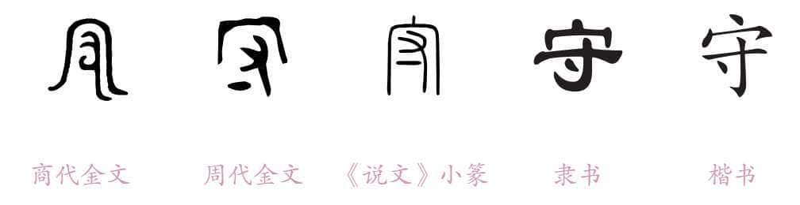

说到“太守”，我们可以想一想，为什么把地方官叫作“太守”呢？我们先看“守”字的古文字字形：

“守”字历史悠久，它的古字形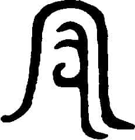上面是“宀”，表示一间屋子，屋子下是一只手，字义很简单，就是保护好屋子！周代金文字形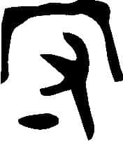中，上面还是屋子，下面的手上多了一个小短横，指着手腕横纹下面寸口的位置。腕横纹下面三个手指头处一比，就是一寸。“寸”是用于度量的标准单位，因此也有法度的意思。“守”字里有“寸”，说明这个字和国家法度有关——保家卫国，守护疆土，为国家维系法度，因此古人把地方官叫作“守”。

 《说文解字》中说：“守，守官也。”官员要恪尽职守，保护民众。引申开来，“守”便有守护、遵守的含义。我们要做一个“守法”的好公民，当学生要“遵守”纪律，和别人约定好时间后要“守时”，都是对规则和约定的尊重。

除此之外，我们还将那些特别贪财吝啬的人，叫作“守财奴”，他们这一辈子的目的就是挣钱，然后把钱守住！你知道《儒林外史》吗？这是中国历史上非常有名的一部小说，作者是清代的吴敬梓。在这本书里，描写了一个十分经典的守财奴，叫严监生。

严监生临死的时候，一直不肯咽气，他颤颤巍巍地伸出两个手指，却说不出话。家人围着他问：“老爷，是不是还有两个亲人没见面？”严监生摇摇头。家人又问：“老爷，是不是有两笔银子没有交代？”严监生把两眼睁得溜圆，把头又狠狠地摇了几摇，越发指得紧了。最后有一个小妾明白过来了，跟严监生说：“老爷，您就闭眼走吧，我知道您的意思，灯里头有两根灯芯，您是觉得浪费了吧，我这就拿掉一根。”严监生看到灯芯拔了出来，一下子放心地闭了眼睛——作为一个守财奴，能够吝啬到生命的最后一刻，真是既可笑，又可悲。

无独有偶，在法国大作家巴尔扎克的小说《欧也妮·葛朗台》中，也描写了一个经典的守财奴——老葛朗台。在他临死的时候，神父拿着十字架为他祈祷，让他亲吻圣像。你猜他怎么样？看到十字架是镀金的，贪心大动，竟然爆发出最后的力量，伸出枯瘦的双手，想把十字架抢过来！这最后的贪婪，让他很快送了命。

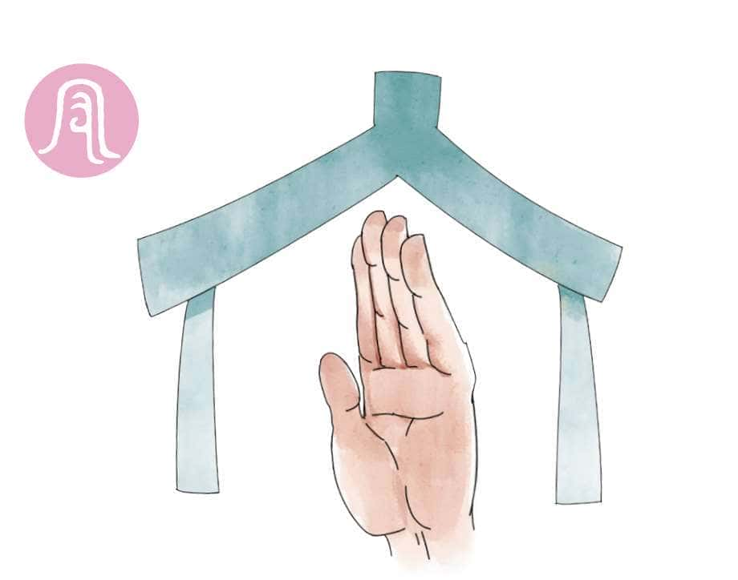

* * *

[1]有的朝代丞相也称“宰相”“相邦”“相国”等。

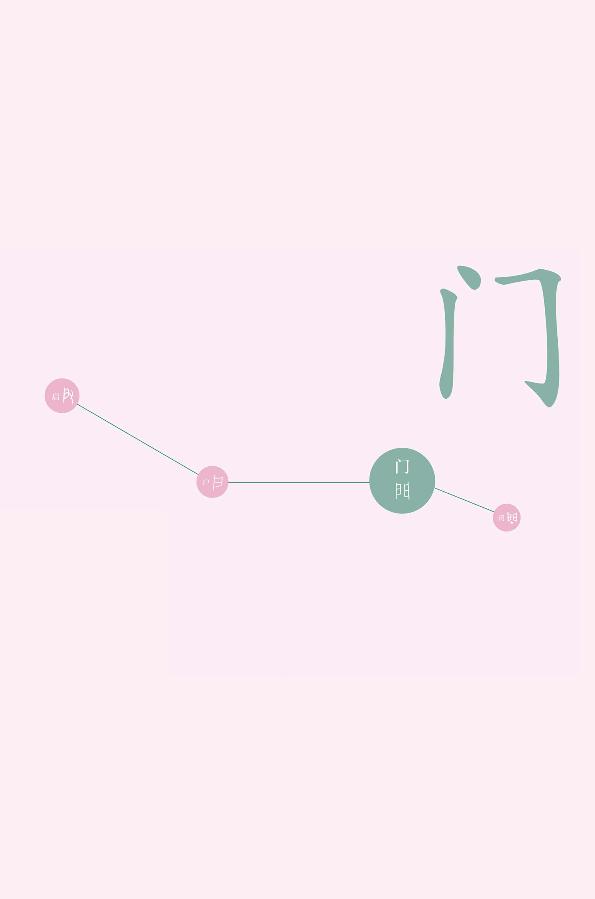

## 门·户  
安全的保障

在和“宀”有关的汉字里，我们重新认识了古代各种各样的房屋建筑。有房子便要有门，它既是安全的保障，也是家园的象征。这一讲，我将介绍古代的两扇门——“门”和“户”。

### 门/ 双扇门 /

古代很早便有门了，在甲骨文中就已经出现了“门”字——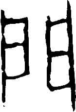画出了两扇对开的大门的样子。这个字形一脉相承，直到汉字简化之后，才有了我们今天的写法——“门”。

“门”是大门的意思，在《说文解字》中，许慎先生有一个非常有意思的说法——“门，闻也”。在这里，“闻”不是用鼻子闻气味，而是“听到”的意思。我们总说“听闻”“两耳不闻窗外事，一心只读圣贤书”，“闻”有听到的意思。我们去别人家登门拜访，要先敲门、叫门，主人听闻敲门声，再来开门，这便是“门，闻也”。

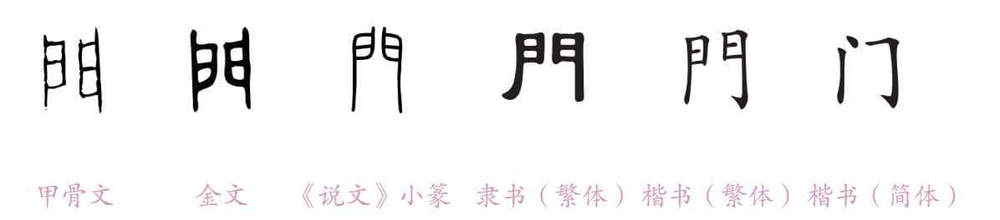

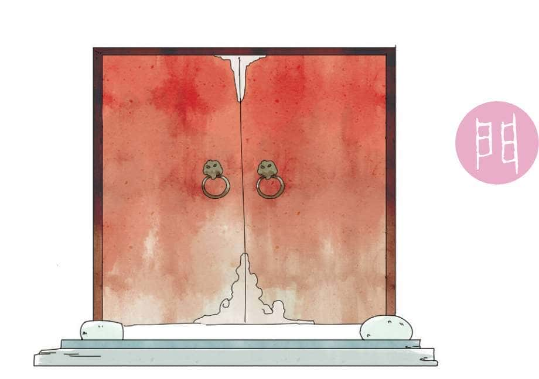

在中国古代有不同的门，比如将帅的营门叫“辕门”。相传黄帝和蚩尤作战的时候，用两辆战车的车辕一搭，形成一个门形的营垒，这便是最早的“辕门”。

《三国演义》中有“吕奉先辕门射戟”的故事。袁术派大将纪灵攻打刘备，怕虎踞徐州的吕布救援刘备，便给吕布送去粮食，让他按兵不动。刘备兵少力弱，便修书一封，向吕布求援。吕布心想，若自己不救刘备，袁术灭掉刘备后必定图谋他的地盘，不如救刘备一命，可他又不想得罪袁术。怎么办呢？

思来想去，吕布灵机一动，他请来纪灵和刘备，让人把自己的方天画戟立在辕门之下，自己远远地站在营地之中，对双方说道：“诸君请看，我射一箭！若能射中方天画戟的尖儿，你们就停战休兵。如果射不中，你们再接着打。如何？战或不战，全凭天命！”纪灵心想，从我们营地到辕门，足足有一百五十多步，赌一赌无妨。想不到吕布轻舒猿臂，弯弓搭箭，箭若流星，正中目标！于是刘备和袁术两家罢斗，刘备也避免了一场灭顶之灾。

除了辕门，古代还有一种坚固的城门叫作“悬门”—— 一般的门都是左右推开，专用于城池的“悬门”则类似一个千斤闸，从上往下落。这种奇怪的设计有特殊的军事用途，可以用来诱敌深入，待时机成熟，城中守军便落下悬门，将冲入城中、孤立无援的敌军一举围歼。

《左传》中记载了“叔梁纥（hé）力举悬门”的故事。叔梁纥是孔子的父亲，是春秋时期著名的大力士。他率兵攻打一个叫偪（bī）阳的小城，偪阳的城门就是悬门。叔梁纥领兵冲进城中，不料身后一声巨响。啊！敌人放下了悬门！

按照常理，悬门一落，冲进去的战士很难幸免于难。但叔梁纥非同小可，他是个大力士啊！他冲上前去，大吼一声：“开！”用短木桩一下子把悬门托住，从容地指挥自己的战士撤离。这一下子，城墙上的守军都震惊了，“太猛了！”“太猛了！”此事名震诸侯，人们纷纷称赞叔梁纥是“有力如虎者”。

### 户/ 单扇门 /

在现代汉语中，“户”更容易被理解为“窗户”。但在古代汉语中，“户”不是窗，而是门——所谓“门户”“关门闭户”，都是指门。

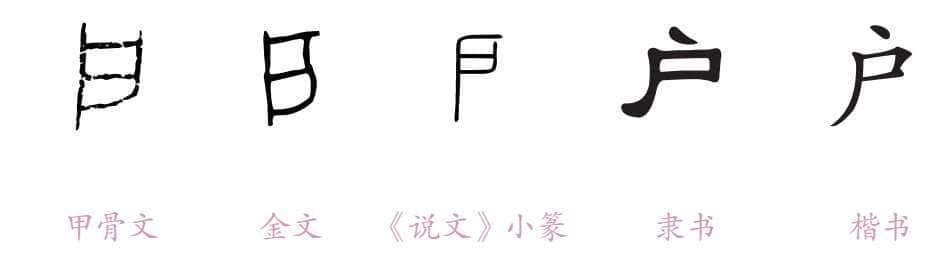

“户”与门的关联，从它的古文字中可以一探究竟。“户”的古文字形体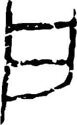是一个象形字。《说文解字》中有“半门曰户”的说法——“门”是两扇门，“户”是“门”的一半，是其中的一扇。

许慎先生对“户”的解释很有意思：“户，护也。”关门闭户的“户”是用来保护人们的，所以，“户”加一个“扌”就是“护”，关上城门，把敌人拒之于外，也就是保护了门内的人。

“户”指门，一扇门中住着一家人。因此，“户”也用来表示住户、人口。我们每家都有“户口本”，里面记录了一家住了多少人。“户”也可以指家庭，我们常说“门当户对”，就是两个家庭的条件差不多。有意思的是，“户”也可以表示经济单位，我们在银行存钱要“开户”，建立一个管理存款的“户头”—— 一个只对自己打开的财富之门。

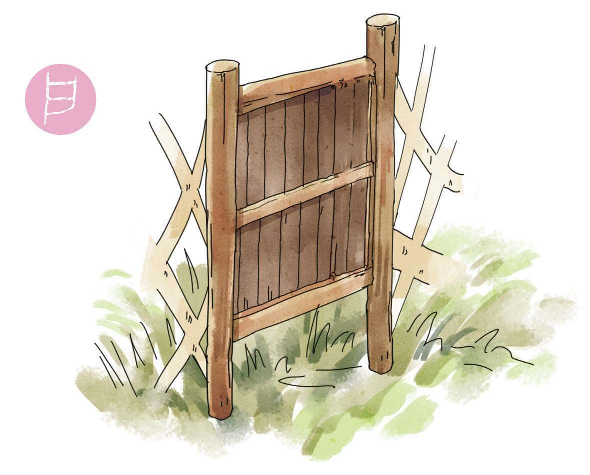

## 启·闭  
开门与关门

一扇门是“户”，两扇门是“门”，在汉字中和开门有关的“启”、和关门有关的“闭”，都与“门”“户”有关。

### 启/ 两手轻轻，把门开启 /

在甲骨文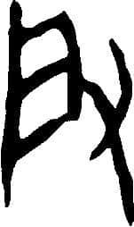中，“启”的写法很清晰——左边是“户”，右边是“手”——用手把门推开。在敲门的时候，人们会一边敲门，一边喊：“是我，是我，快来开门！”这时候，嘴巴就有用了。因此，在“启”的西周金文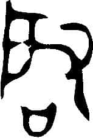中，上面左边是一扇门，右边是一个表示手的“又”，下面加上了一张“口”。到了小篆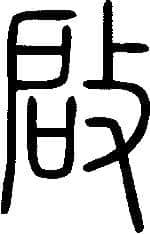，“又”变成了表示手的“攴”和“攵”，这也是繁体字“啟”的来源。随着汉字的简化，“啓”又被简化为我们熟悉的“启”。

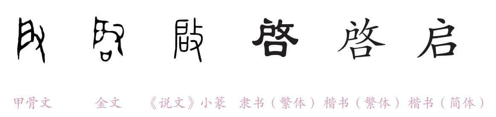

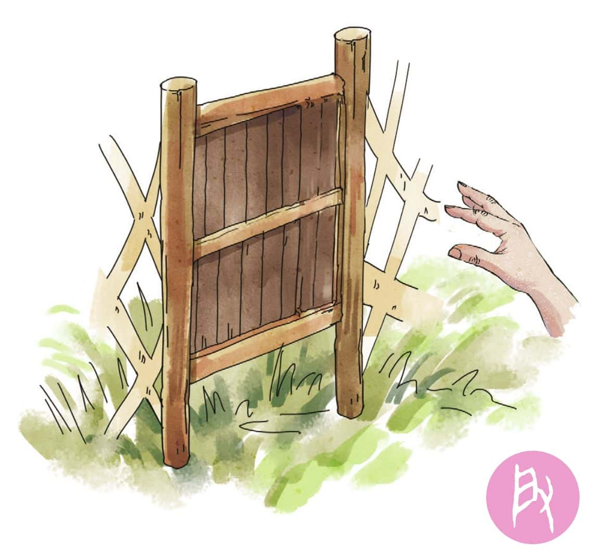

在中国文化中，开门有特殊的寓意：人在困惑的时候，心灵仿佛也是紧锁的，一旦问题想明白，内心的大门也就随之开启。因此，“启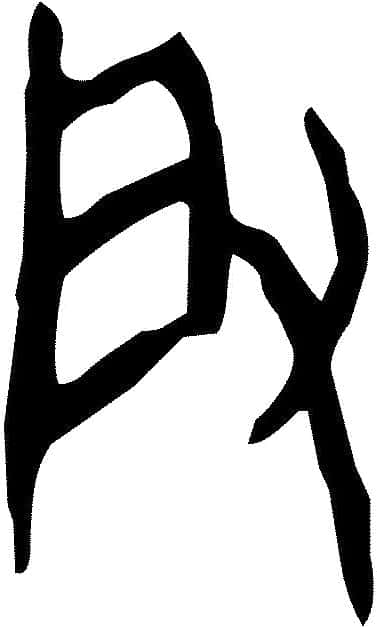发”“启示”“启迪”等词，都表示“心开意解”的状态。大思想家孔子在教导学生的时候，就特别注重启发他们。

在《论语》中，孔子说：“不愤不启，不悱不发。”只有学生进入“愤”与“悱”的状态，才能去启发他的心灵。

那么，什么是“愤”和“悱”呢？

“愤”是内心情感涌动，将出而未出，这是一种郁积的状态。有时候，我们心里憋着一个困惑，魂牵梦绕，内心翻涌，这种憋着想不出来的状态就叫“愤”。“悱”的意思与之相似，宋代大儒朱熹解释说：“口欲言而未能之貌。”心里大概知道道理，嘴巴却不能准确地表达出来，就是“悱”。

“愤”和“悱”是启发的最佳时机。孔子认为，在学习的过程中，先要让学生有充分的思考和积极的探索，千思万想，眼看要想出来了，就差临门一脚，这个时候获得老师的启发，才能一下子豁然开朗，牢记于心。我们学习的时候也是一样，先要自己充分开动脑筋，然后再去寻求老师的帮助。如果一个问题还没怎么思考，就急急忙忙去问老师，你的收获不会太大。

### 闭/ 两手用力，把门关闭 /

和“启”相对的是“闭”字。现代汉字中的“闭”，是“门”里一个“才”。“才”和关闭有什么关系呢？不太好解释，还是让我们走进古文字的世界。

若看金文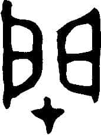，你会发现，“闭”的里面不是“才”，而是一个“十”字，这可不是什么十字架，而是古人画的门闩——把两扇门合起来，用一根横木横插在门内，门就不能从外面推开了，这就是“闭”的字形来源。由于门闩的形象比较特殊，很难专门造一个字，和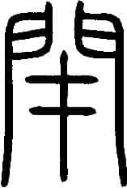渐渐发生讹变，门闩的形状错写成“才”字，于是，有了“閉”字，之后又简写为“闭”。

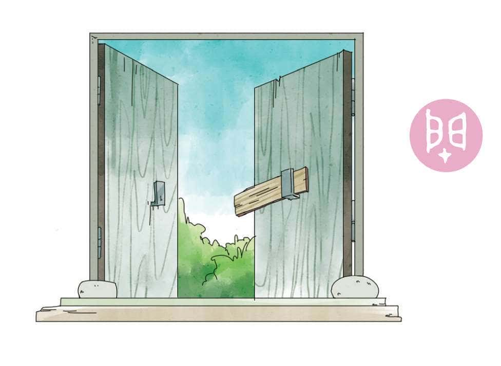

“启”表示开导开启，“闭”则表示闭塞不通。一个人的性格“封闭”，心灵“闭塞”，就不怎么与外人交流，不肯敞开心扉。别人要想走进他的心灵世界，难免要吃“闭门羹”。

一个人的心灵不能闭塞，一个国家更应如此。中国古代在很长一段时间“闭关锁国”——拒绝向世界开放，就像把国家的大门紧锁起来一样。关上门看似安全，但无论是科技、文化还是经济，都缺乏与其他国家的交流，容易落后。闭关锁国的大清帝国，错失了工业革命的进程。最终，紧闭的国门被其他国家的坚船利炮轰开，这是惨痛的历史教训。因此，我们要改革开放，积极主动地拥抱世界。要知道，无论是做人，还是管理一个单位、治理一个国家，保持开放自信、乐于交流的心态，都是十分必要的。

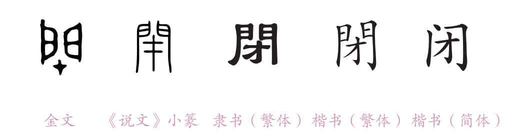

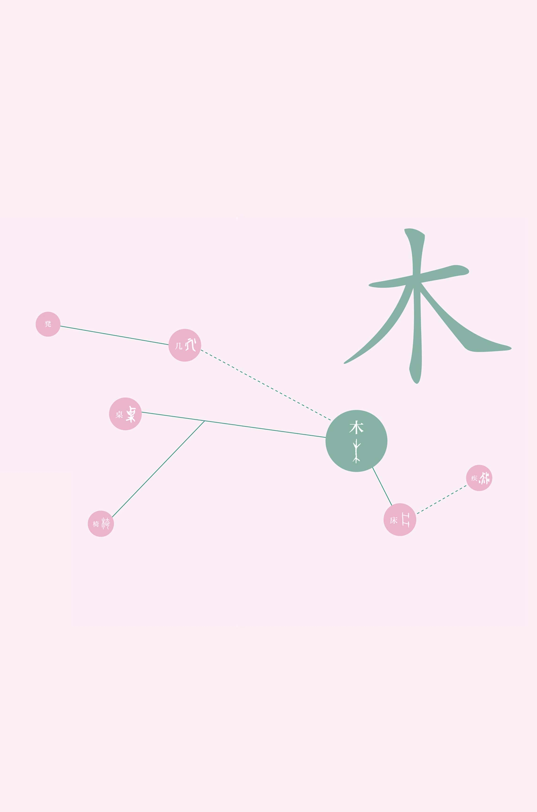

## 几·桌·凳·椅  
古人的家具

讲完了与房屋建筑有关的汉字，在这一讲，我会为你介绍古人房子里最常用的几种家具——“几”和“桌”、“凳”和“椅”。从这几个字中，我们能看到中国桌椅板凳的发展史。

### 几****桌/ 桌子的发展史 /

桌子的故事，需要从“几”字讲起。今天的“几”有两个读音，用作“几个”“几何”时读为jĭ，用作“茶几”时读为jī。

很多人不明白，“茶几”为什么用“几”字呢？答案很简单，因为，“几”的本义就是桌子呀。“几”在古文字中是个资历很老的汉字，它是个象形字。《说文解字》中说：“几，踞几也。象形。”什么叫“踞几”呢？古人席地而坐，这个姿势坐久了不舒服，往往要有一个矮矮的案子靠着。从甲骨文的字形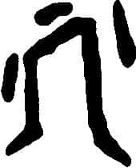来看，“几”就是这样的小案子、小桌子，上面像桌子的桌面，两侧像桌子脚，这是一种很古老的家具。

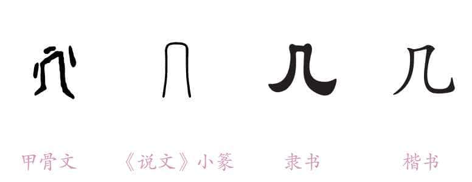

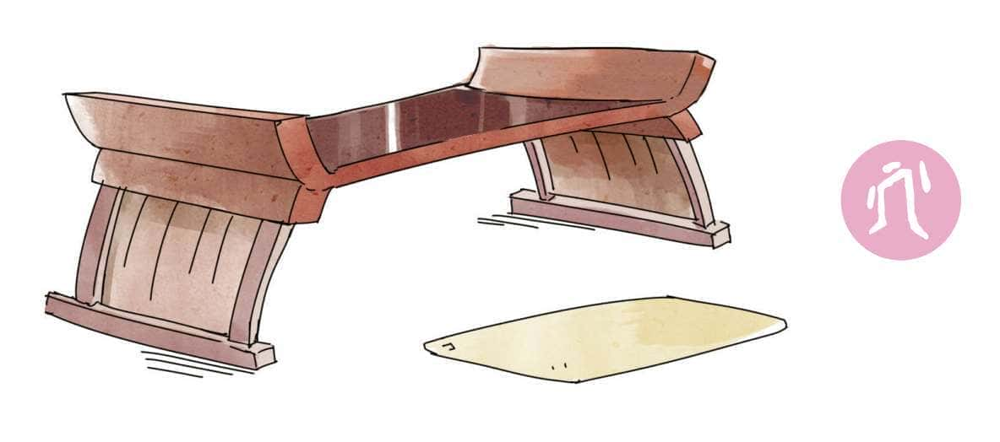

有时候，我们上课犯困，顺势趴在桌子上就睡着了。古人也是一样，坐着感觉累了，就往几上一靠。《庄子》中记载古人“隐几而坐”，这是一种十分放松、舒畅的身体状态。

后来，随着时代的进步，古人逐渐改变了席地而坐的习惯，开始越坐越高，进而有了桌椅。至于“几”，则慢慢只用于低矮的“茶几”“几案”。

明代有一本字典，叫《正字通》，其中记载道：“呼几案曰桌。”意思是把几案叫作桌。大概在当时，人们已经不怎么区别“几”和“桌”了。现在，让我们来看看比“几”晚出现的“桌”字。

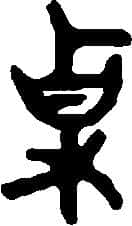是战国文字中的“桌”，它其实是由卓越的“卓”演变而来的。“卓”有高的意思，在“卓”的下面添加一个“木”，古人以此来表示桌子由木头制造。后来，“卓”与“木”的笔画发生粘连，就

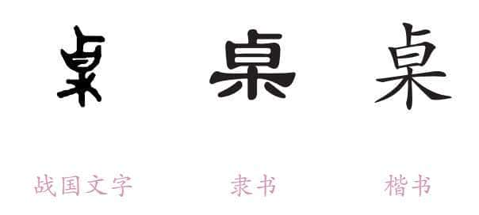

形成了“桌”字。

桌取代几，成为古人最重要的家具之一，大概是在宋明之后的事情了。随着桌子的普及，“桌”不仅用作名词，也能用作量词——一桌菜、一桌人、一桌宴席。可以说，“桌”的用法非常广泛。

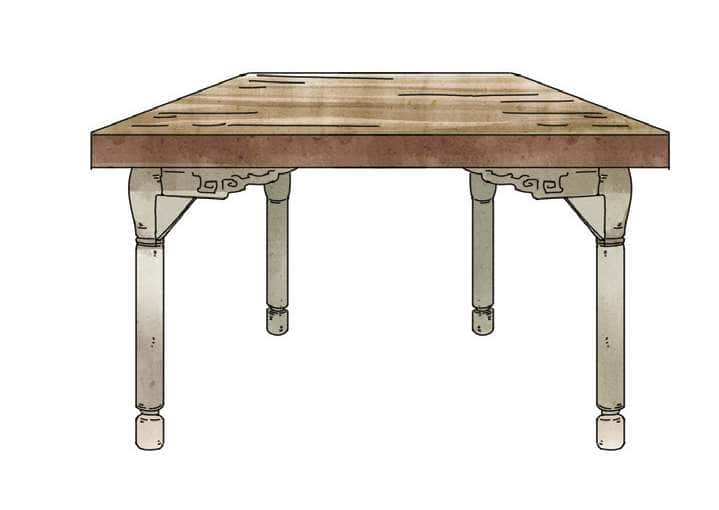

### 凳****椅/ 椅子的发展史 /

说完了桌子，我们再来看古人的坐具。中国人最早的坐姿是跪坐，坐具是简约的席子。因此，会有“坐席”“宴席”“席位”等词。如果中国人最早的坐具是凳子的话，估计现在常用的是“坐凳”“宴凳”“席凳”了。

凳子和椅子是后来才有的坐具，二者并不相同。“凳”是一个形声字，下面是“几”，是它的形符；上面是“登”，是它的声符。在汉语中，凳子和攀登的“登”是同源的。清代学者钱大昕说：“盖以登床得名，后人稍高之，以为坐具耳。”凳子最开始没有靠背，也很矮，很像我们今天说的“小板凳”，它的作用是用来踩着上床。后来人们逐渐把凳子加高，它才变成一种独立的坐具。

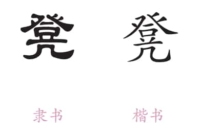

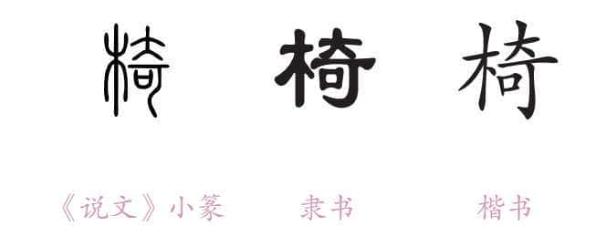

至于椅，诞生的更晚一些，它比凳子高，还有一个靠背，人们可以倚靠着休息。从汉字角度而言，“椅”和“倚”是同源的，“椅”的名字来源于倚靠之义，所以宋代以前，椅子还曾直接写作“倚子”呢。

从几、凳到桌、椅，中国古人设计的家具真是越来越舒服了。

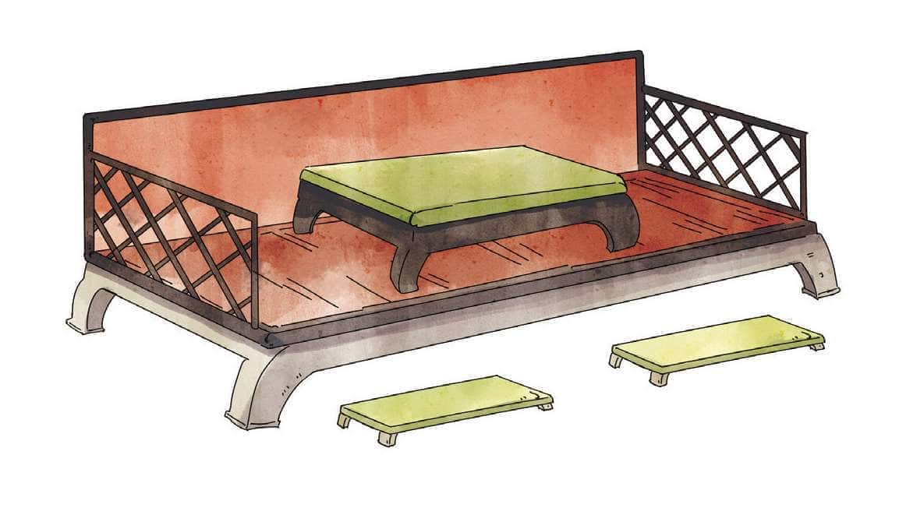

## 床  
床是用来坐的？

不知道你是否注意，上面讲到的桌、凳、椅，我都没介绍它们的甲骨文、金文字形，这是为什么呢？因为古人最初是没有这些家具的，自然也没有相关的古文字。可“床”不一样，它的字形十分古老，在很久很久以前，床就是一种重要的家具了。

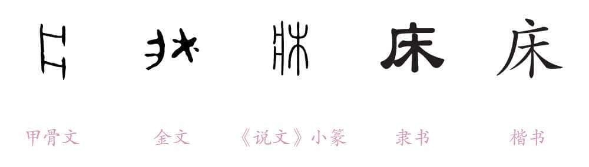

早在甲骨文中，就已经有了“床”的形体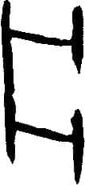，这是竖着写的，你把它横过来，便能清晰地看到床面和床腿。大多数床都是木制的，所以古人在金文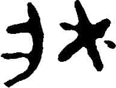中增加了“木”，后代的字形也基本上沿袭这一形体。

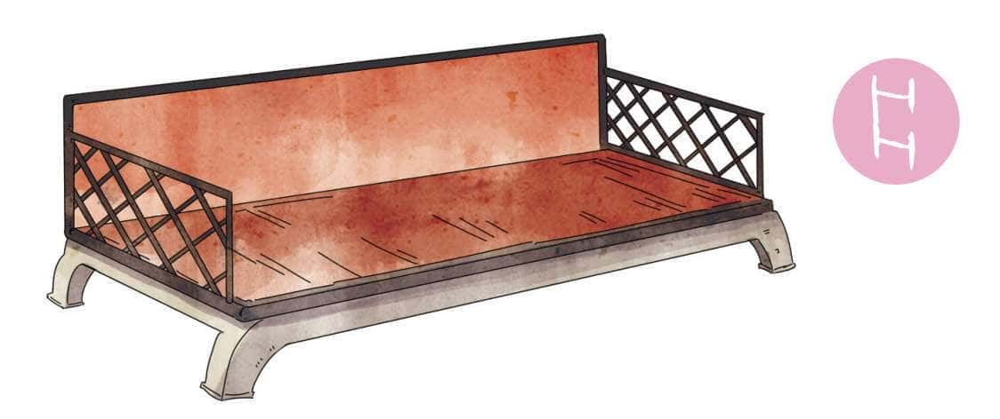

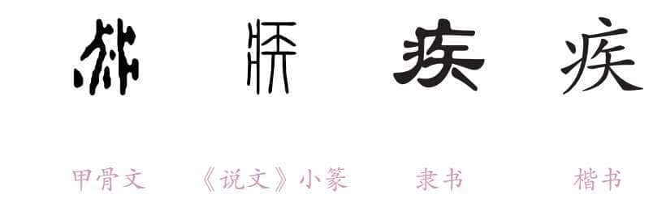

床的一大功能当然是用于睡觉了。《论语》中记载了“宰予昼寝”的故事。宰予是孔子的弟子，有一次，孔子发现他白天躺在床上睡懒觉，便严厉地批评他：“朽木不可雕也，粪土之墙不可杇（wū）也！”你就是一块不能雕琢的烂木头，粉刷不了的烂墙！孔子之所以这么生气，是因为古人讲究勤勉地学习劳作，白天是不能躺在床上睡大觉的。

当然，除了晚上睡觉，人生病了也会卧床休息。你看，甲骨文的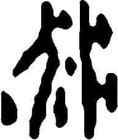（疾）字，就像一个人躺在床上满身大汗的样子，生病了可真不好受！后来，“疾”变成了形声字，病字头“疒”是形符，表示与疾病有关，“矢”是声符。

除了用于安睡，床还有一个让我们比较陌生的功能。东汉刘熙的《释名》中记载：“人所坐卧曰床。”在古代，床既是一种卧具，也和凳子椅子一样，是一种坐具。

对此，古文中有很多相关记载。比如，《后汉书》中有一个叫向栩的人，他“常于灶北坐板床上，如是积久，板乃有膝踝足指之处”。古人屈腿而坐，坐得久了，膝盖、脚踝、脚背、脚趾都在床板上留下印记。再比如《史记》记载了西门豹治理邺城的故事，邺城有个不好的风俗，“如嫁女床席，令女居其上”，让年轻姑娘坐在“床”上，放进河里“嫁”给河神。这里的“床”都是坐床。

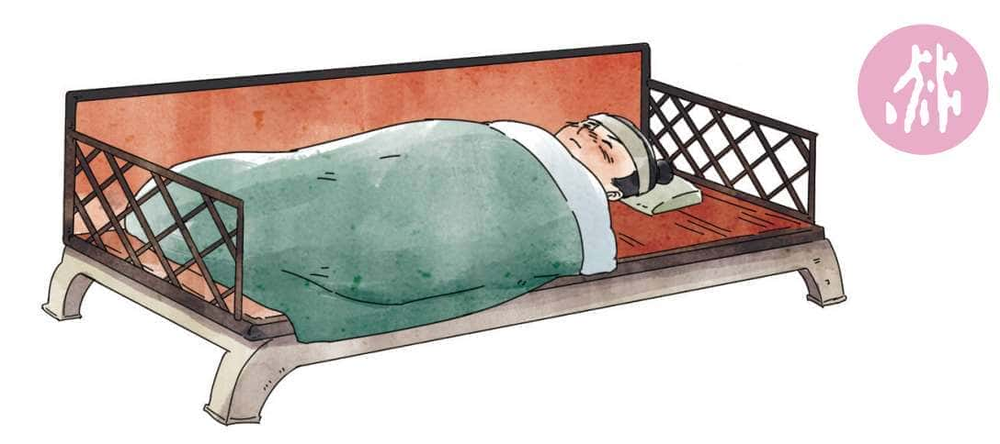

除了史料，古代绘画中也有床作为坐具的身影。在名画《韩熙载夜宴图》中，主角韩熙载端坐在床上，几位宾客则和我们一样，坐在椅子上。这幅画让我们直观地看到床作为坐具的模样。

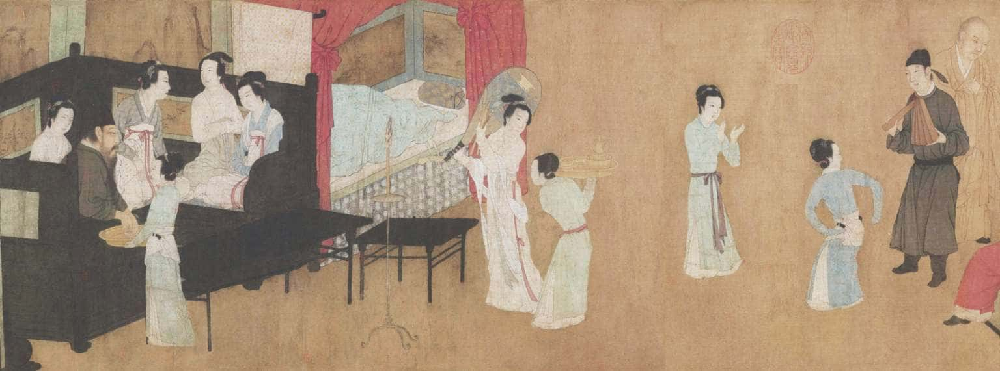

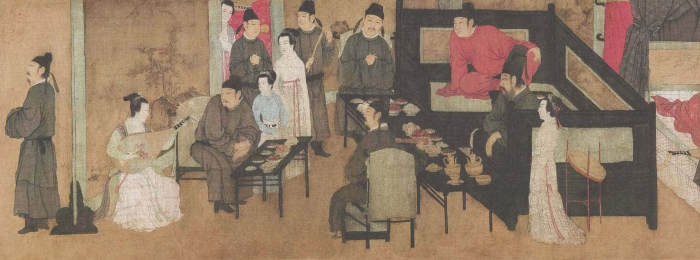 
五代／顾闳中《韩熙载夜宴图》／故宫博物院藏

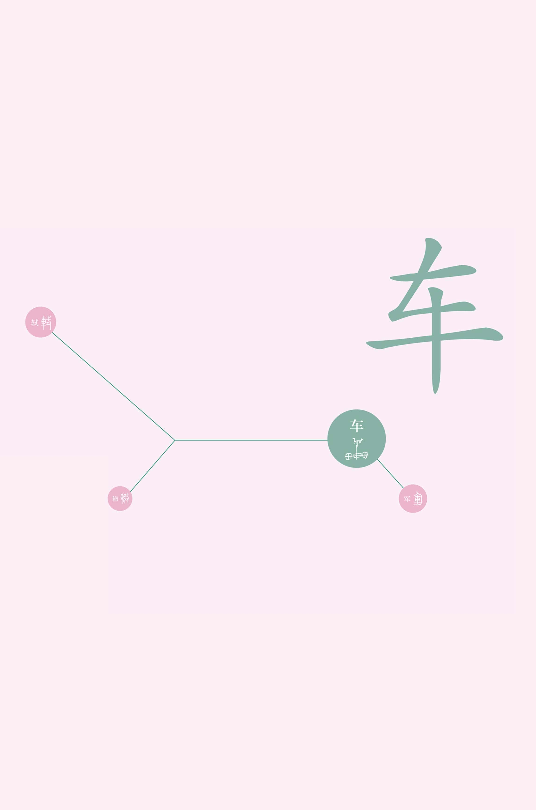

## 车  
古代的车什么样？

人们总说“衣食住行”，讲完了汉字中与“衣”有关的“衣”“帽”“丝”，与“食”有关的“酒”，与“住”有关的“安”“门”等字，我接下来要为你介绍与出行有关的汉字。出行离不开交通工具，古人最重要的交通工具有两个：一个是马，一个是车。在《字里字外的动物王国》里，我们已经介绍了“马”字，在这里，我将为你讲解“车”字。

中国古人很早就发明了车，在河南安阳殷墟，出土了殷商时期遗存的车，在甲骨文的字形中，我们也能看到殷商时期车的样子。

在甲骨文中，“车”是一个象形字，有很多种写法，我们先从最复杂的看起。你看，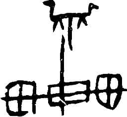这个字下面像三个“田”，但请注意，它们不是“田”。左右两个是圆圆的车轮，中间的叫作“舆”（yú），是车上站人的地方。字形上面延伸出去的部分，是用来驾马、拴马的车轭（è）、车辕等部件。这个复杂的“车”，为我们形象地展现出古代车的样子。

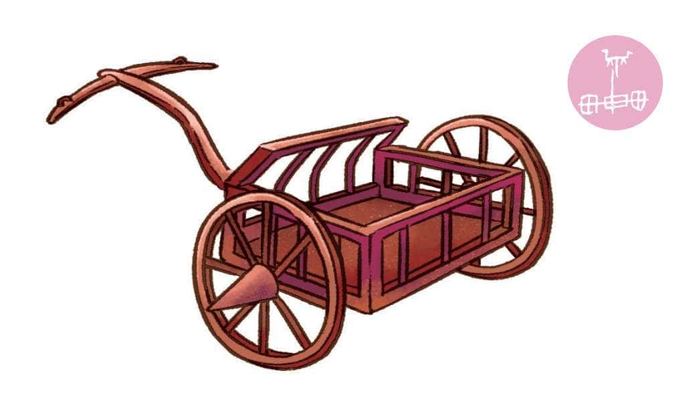

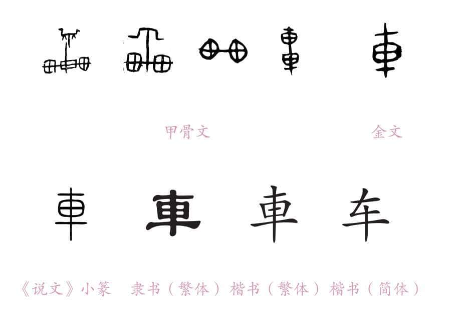

这个字虽然惟妙惟肖，但写起来却很麻烦。于是，“车”逐渐简化，先是去掉了车舆、简化了车辕，写作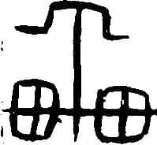。后来干脆只保留了两个轮子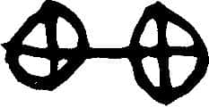，看上去好像我们今天自行车的车轱辘。然后古人又将它竖起来写作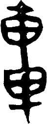，越来越像今天的“车”字啦。但这样的写法还是不够简便，于是只留下一个车轮，就有了繁体字中的“車”。接着，便是汉字进一步简化，根据草书的写法，有了今天的“车”字。你看，不断追求书写的简便，是汉字发展的根本动力呢。

古代的车是谁发明的呢？《说文解字》说：“车，舆轮之总名。夏后时奚仲所造。”许慎先生指出，将车舆和车轮组合起来，就是车。它的发明者是夏代的奚仲，可真够早的！

甲骨文看着毕竟有些抽象，古代的车到底长什么样子呢？在秦始皇殉葬的兵马俑坑中，出土过一件铜车马，做得惟妙惟肖，是秦始皇车驾的模型。考古学家根据它还原了当时的一整套车马，真是美轮美奂！你要是有机会，一定要去陕西的秦始皇帝陵博物院看一看当时车的模样。

像秦始皇这样的古代帝王出门，一般不止有一辆车。究其原因，一是要彰显天子的威仪与排场，二是“狡兔三车”，以防刺客。秦始皇出门的时候，不仅有自己乘坐的正车，还有好多混淆视听的“副车”——共计三十六辆。《史记》中就记载了一次刺杀秦始皇误中副车的故事。

故事的主角是历史上赫赫有名的张良。张良祖上是韩国人，世代在朝中为官。韩国被秦国所灭时，张良家还是很富裕的，有奴仆三百人。但张良即便是亲弟弟去世，在葬礼上也非常节俭，要集中财力寻找合适的刺客，以报亡国之仇。后来，张良买通了一个大力士，此人天生神力，兵器是一个重达一百二十斤（约合现在的六十二斤）的大铁锤。

张良和大力士趁秦始皇东巡时，在博浪沙进行偷袭。大力士用大铁锤猛地砸向秦始皇的车驾，“咣”的一声，车体瞬间四分五裂——可没想到的是，夺命的铁锤没有砸中正主，而是砸到了副车上，让秦始皇捡了一条命。

那从秦陵出土的铜车马，是不是一辆“副车”呢？这个问题还真的不太好说！

## 军  
周王有多少大军？

在古代，车是重要的战争用具，春秋时期的战争主要是车战——一车四马，上面有三名战士，分别负责驾车、射箭和攻击格斗。

正因如此，“军”这个字也是从“车”的。你看金文、小篆中的“军”，里面是“车”，外面是“包”的古字，把战车环绕包围成一圈，就是古人的军营。

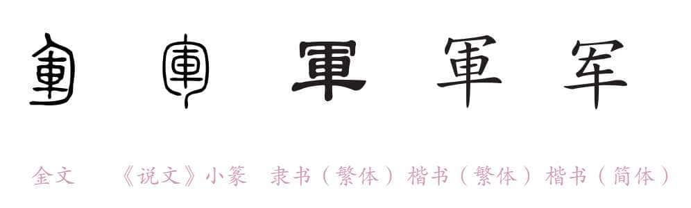

古代一个军有多少人呢？根据《周礼》记载，周朝时一军有12500人，除了军，2500人为师，500人为旅，100人为卒，25人为两，5人为伍。周王统帅六军，所以手下有个7万多人。不过人们对这个数字尚有争议。

春秋时期，军队作战以车战为主。那时候，战车的单位不是“辆”而是“乘（shèng）”，因此人们用“百乘之国”“千乘之国”“万乘之国”来形容国家的实力。“万乘之国”就是天下霸主了，这样的国家拥有多少军队呢？一般来说，一辆战车上会配备3名甲士、72名步卒。依此计算，“万乘之国”的霸主会拥有上万辆战车，战士超过75万人。

军队和国家都用战车来计数，可见车马在战争中的重要地位。正因如此，古人非常看重战车的质量，甚至有在大战之前争夺战车的故事。根据《左传》记载，有一次郑国要出兵打仗，当时的两个贵族颍考叔和子都，竟然为争夺战车而争吵起来。颍考叔是个大力士，兴许觉得自己吵不过子都，干脆就抢吧！夹起车辕，健步如飞。子都急坏了，拔出一杆戟就去追他。两个人一直跑到大路上，子都眼看着颍考叔拉着车跑得没影儿，怒火冲天。

你看，古人为了获得一辆好车，也是拼了！

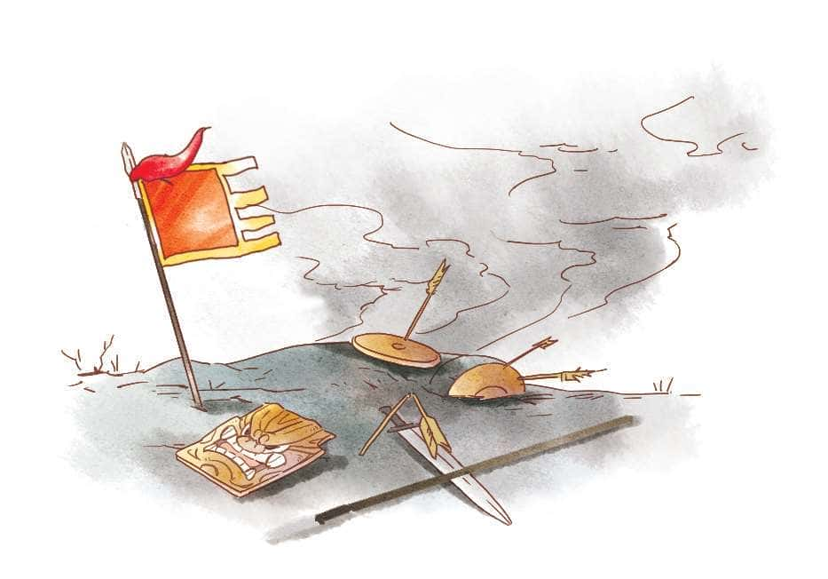

## 轼·辙  
那些和车有关的人名

宋朝有个很出名的父子文人组合——“三苏”。父亲叫苏洵，两个儿子分别叫苏轼和苏辙，父子三人都在“唐宋八大家”之列。

苏洵给孩子起名字很有特色，名字都和车有关。这可不是因为他和现在的男生一样喜欢车，而是暗含着对孩子的寄语和嘱咐。

### 轼/ 车前的横木 /

“轼”字从车，是车上的一个部位。《说文解字》说：“轼，车前也。”它是古代车前的横杠，人们站在车上往前眺望时，可以扶着“轼”以免摔倒。作战的时候，也可以踩着“轼”瞭望远方，查探敌情。

苏洵为什么要给儿子起名为苏轼呢？在散文《名二子说》中，苏洵解释道，车轮、车的辐条、车盖、车的中轴横木，各司其职，缺一不可。只有车上的轼没有实际用途，只是装饰。但没有轼，一辆车也不是完整的。给孩子起名苏轼，就是希望他能懂得掩饰自己的锋芒，不要太过外露。

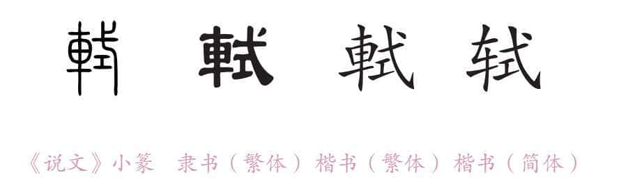

苏轼字子瞻，“瞻”的意思是往远处看。你看，他的名是车上的一个部位，字是这个部位的使用功能，苏轼的名和字，都与车有关。

### 辙/ 车轮压过的痕迹 /

苏轼有个弟弟叫苏辙。他们兄弟的感情特别好，苏轼那首著名的《水调歌头·明月几时有》就是写给弟弟的词。

苏辙的名字也和车有关，辙的意思是“车迹”，也就是车轮在地上压过的痕迹。在《名二子说》中，苏洵解释道，天下的车行进时，会压出一道道车辙。后面的车为了避免倾覆，都要尽量压着前面的车辙前进。可人们在谈论车马的行进、功用时，却想不到车辙。不过车辙也有车辙的好处，万一马车倾覆，倾覆的灾难也影响不了车辙。在他看来，车辙善于处在福祸之间，这是一种内敛持重又淡泊自在的人生态度。所以，苏洵给孩子起名为苏辙。

苏辙的字是子由，“由”有跟从的意思，一辆车接着一辆，车辙正是它们共同的前行轨道。因此，苏辙的名和字也都与车有关。

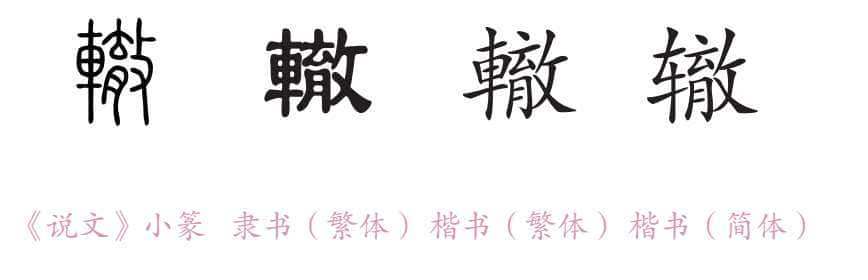

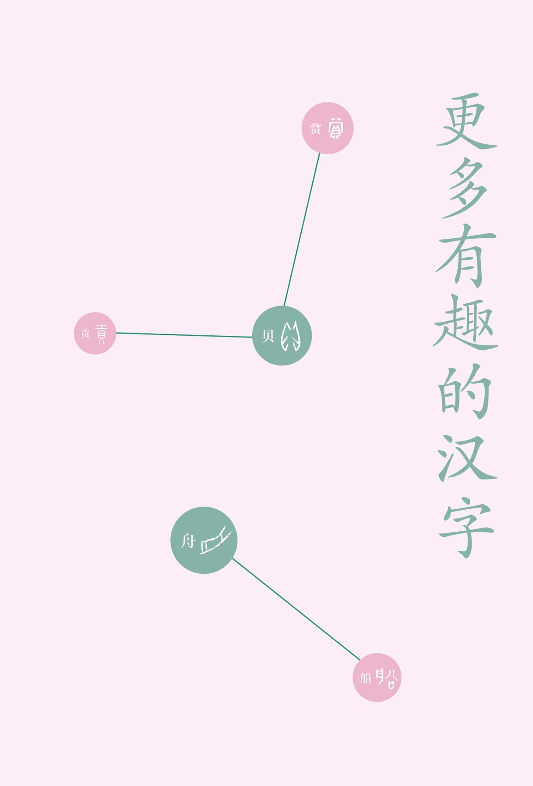

## 贝·贡·赏  
与钱有关的故事

在这一讲，我将为你介绍和古代货币有关的字。说到货币，你肯定会想到“钱”字——“钱”是从“金”的，无论黄金、白银、铜钱，都是金属货币。但是，在遥远的造字时期，最早的货币可不是金属，而是贝壳。

### 贝/ 古代货币 /

让我们先来看“贝”字。“贝”是一个历史悠久的象形字，在甲骨文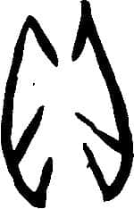中，画出了一枚贝壳的形状。这个形体经过金文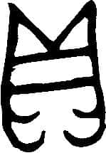、小篆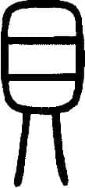的发展演变，变为繁体字“貝”。至于“贝”，则是参考草书写法而造的简体字。

许慎先生在《说文解字》中为我们介绍了古代钱币的发展史，他说：“古者货贝而宝龟，周而有泉，至秦废贝行钱。”上古时期，人们把贝壳作为货币，同时认为乌龟壳非常宝贵——殷商时期以龟甲占卜，与这种观念也不无关系。到了周代，人们把货币称为“泉”，泉水流动，货币就像水流一样，在社会中流通运行。到了秦朝之后，再没有人用贝币了，而是改用钱币。至于“钱”，你可能难以想象，它本来是农具，但由于读音和“泉”相近，便被假借过来表示钱币了。

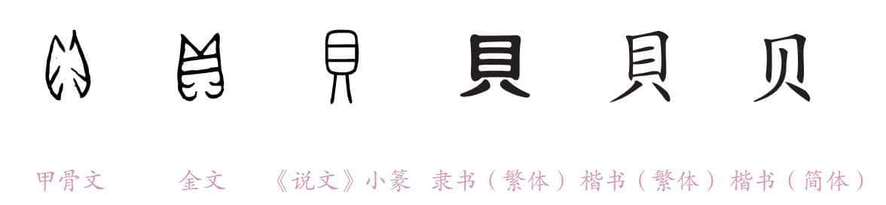

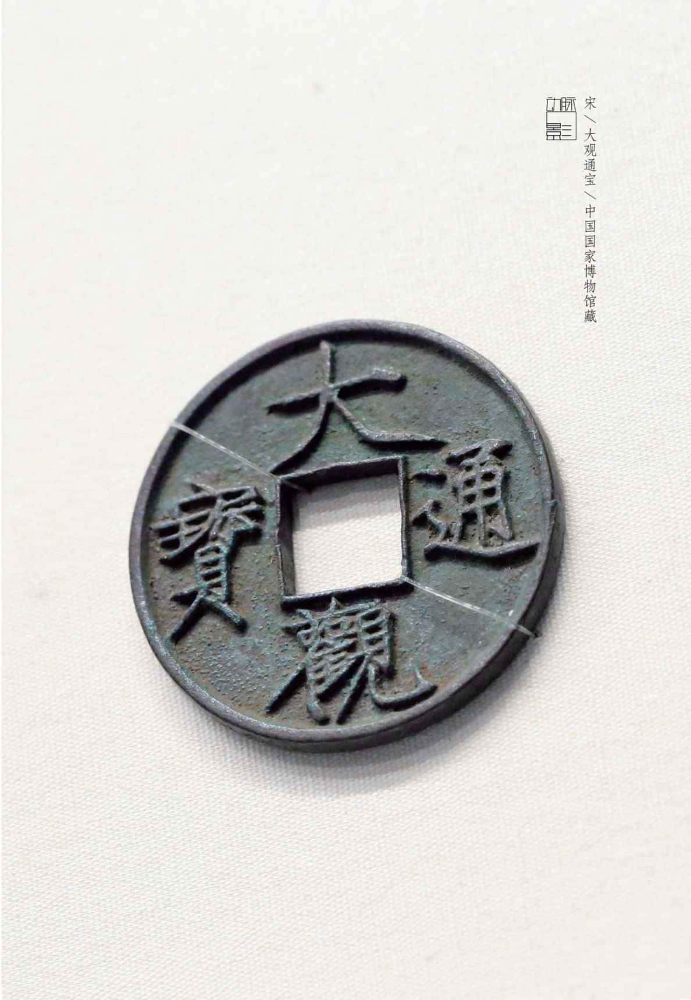

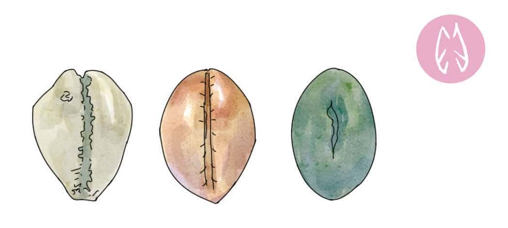

为什么贝壳可以作为货币呢？要知道，我们中国人的祖先生活在内陆，离海洋很远。他们很少见到贝壳，觉得这种美丽、珍奇的小东西十分宝贵，便用它作为货币、交换货物。除了真正的海贝，古人也用金属制作贝币，在考古发现中，就曾发掘出很多铜贝币，还有浇铸贝币用的陶范。

### 贡/ 给天子的贡品 /

贝壳是古代的货币，反映在字形中，很多和财富有关的字都从贝，比如“贡”“赏”“贫”“贱”“贵”等。其中的“贡”和“赏”，涉及天子的财富，以及古代的进贡赏赐制度。

“贡”是一个“从贝工声”的形声字，《说文解字》中说：“贡，献功也。”“贡”是四方给天子的贡品。

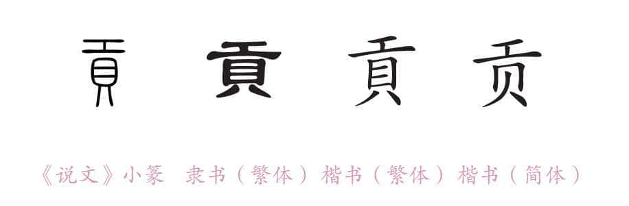

古代天子分封诸侯，诸侯每年向天子进献各地的贡品，这也是现代汉语中“贡献”一词的来源。古人爱玉，贡品中自然少不了玉器。在殷墟妇好墓中就发现过进贡的玉戈，上面有“卢方皆入戈五”的字样，意思是商代时卢方这个方国，国主的私名为皆，他进献给商王的贡品是五个玉戈。

为什么要有进贡制度呢？一是为了供养皇室，二是天子以此强调自身的威严，鞭策诸侯践行好为臣之道。只不过，古代的“贡献”是给帝王的，今天的“贡献”则是面向大众，面向社会和人民。

### 赏/ 天子的赏赐 /

臣子向天子进贡，天子也要赏赐臣子。下面就来讲讲“赏”字。

“赏”从古至今的字形基本没有变化，它是一个标准的形声字，下面的“贝”是形符，上面的“尚”是声符。

许慎先生说：“赏，赐有功也。”“赏”是把好东西赐给有功劳的人，可以组成“奖赏”“赏赐”“封赏”等词。

古代帝王封赏大臣，往往都是大手笔，有赏赐爵位的，有赏赐土地的，还有大笔赏钱的！先秦时期，“分封”和“赏赐”密不可分。在金文中，经常有天子赏赐“金”（青铜）的记载，这些赏“金”被古人铸造成精美的青铜器，留作纪念、感谢圣恩。有的时候，天子还会赏给臣子土地、牛羊，还有相当数量的人民——在奴隶社会和封建社会，奴隶与平民对贵族来说，不过是一种赏赐的物品。

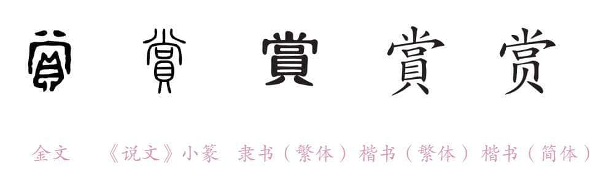

有时候，天子的赏赐还很任性，无关功绩。比如在汉代初期，汉文帝有一个宠臣叫邓通。有人给他算命，说他会冻饿而死。满心担忧的邓通跑去向汉文帝哭诉，汉文帝心一软，干脆赏给他一座铜山，让他自己铸钱，这下总不会缺钱冻饿了吧——好家伙，这是赏给他一个印钞机啊！不过，天意弄人，后来汉文帝去世，景帝继位，不喜欢邓通的景帝没收了他的全部家产，潦倒的邓通最终还是落魄至死。

不管是按功赏赐，还是任性封赏，在奖赏的过程中，都体现出对被赏赐者的充分认可。因此，“赏”又延伸出喜欢的情感，用于观赏、赏花、赏月、赏雪等词，表示对于自然美景的喜爱之情，或者用于“欣赏”一门艺术，“赏识”一个可爱的人。

## 舟·船  
木质的小舟与大船

古人在陆地上跋涉需要乘车驾马，想要渡过江河，就需要乘船了。有一个成语叫“舟车劳顿”，意思是出门乘船、坐车十分辛苦。这里舟和车连用，足见在古人心目中，它们是最常用的交通工具了。在这一讲，我就为你介绍和水上交通有关的字——“舟”和“船”。

### 舟/ 一只摇曳的小船 /

“舟”字出现得很早，甲骨文中的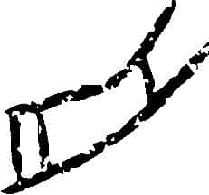（舟）是一只小小的船，这个形体发展到金文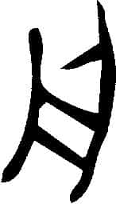、小篆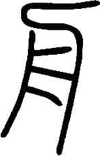，书写逐渐规范，最终变为今天的“舟”字。

舟是谁发明的呢？《说文解字》中说：“古者共鼓、货狄刳（kū）木为舟，剡（yǎn）木为楫，以济不通。”许慎先生指出，“舟”最初是由共鼓、货狄这两个人发明的。他们砍下粗壮的树木，把中间挖空，做成舟和船桨来帮人们渡过江河。舟船的发明，是否真是这两位古代“发明家”的功劳，我们不得而知。不过我们能知道的是，舟的发明非常早，早在河姆渡新石器时代的遗址中，就已经发现7000年前的木桨了。

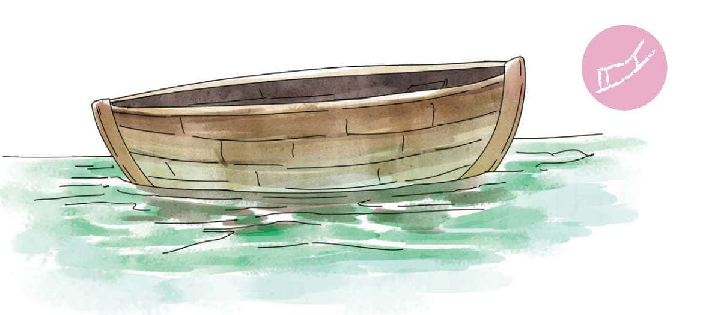

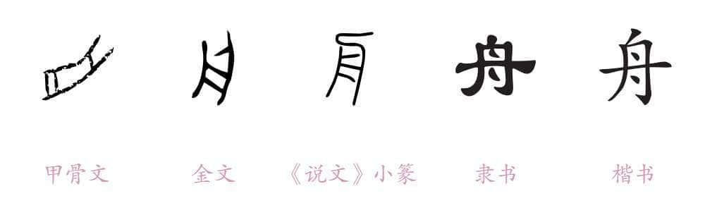

古人心目中的“舟”，一般都是小小的独木船。它有两个特点，一是小巧，二是轻快，因此也有“小舟”“轻舟”之名。我们可以想象一下，古人常说“一叶扁舟”，小舟轻飘飘地在江湖上游荡，像一片轻盈的叶子，逍遥自在。

正因如此，小舟在诗词里是自由自在的象征。李白在《早发白帝城》里写道：“两岸猿声啼不住，轻舟已过万重山。”小舟在水面上飞快地移动，不一会儿就经过了万重青山。柳宗元的《江雪》中有这样的名句：“孤舟蓑（suō）笠翁，独钓寒江雪。”在下雪的江面上，只有一个穿着蓑衣、戴着斗笠的老翁，坐在孤舟上垂钓。看上去孤零零的，但是他一个人却拥有了全部寒江雪景，这是一种隐士的风范。李白还说过，“人生在世不称意，明朝散发弄扁舟”，一个人活得不痛快，就不要再受管束了，明早开始，我要披散着头发，驾着一叶小舟，想去哪儿就去哪儿，这是何等自由！

“舟”小巧轻快，但独自漂荡在江海之上，也常给人以孤独无依的感觉。因此，古诗中“舟”也常象征孤寂。在唐代诗人韦应物的《滁（chú）州西涧》中，有两句很美的诗：“春潮带雨晚来急，野渡无人舟自横。”春天的傍晚下着大雨，潮水来得特别急，鲜有人至的渡口拴着一只小舟，被潮水冲得摇摆不定，漂来荡去。这句诗里寄寓着诗人怀才不遇、冷落凄凉的忧伤之情。

此外，诗圣杜甫在《秋兴八首》里写道：“江间波浪兼天涌，塞上风云接地阴。丛菊两开他日泪，孤舟一系故园心。”长江三峡一带，水流湍急，汹涌的波浪似乎要奔腾到天上。在这样的环境中，小舟早该被冲得无影无踪，可它却在风浪中孤独摇曳，这是因为还有一根绳子牵系着它——对诗人而言，拴住游子的绳子，是思念故乡的心啊。

在这两首诗中，小舟都是飘零的，甚至是可怜的，它们在骇人的波涛中显得那样弱小，在茫茫的水面上显得那样孤独。

### 船/ 什么是船，什么是舟？ /

讲完了“舟”，再来看“船”字。“船”是一个形声字，从金文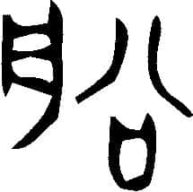到楷书“船”，字形变化不大。左边是“舟”，是形符，表示船的字义，右边是“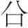”（yǎn），是声符，和“船”的读音相近。

《说文解字》中说：“船，舟也。”船和舟互相解释，是因为它们类别相同。实际上，二者之间是有区别的，船是大舟。

船比舟大，这在汉语词汇中也有鲜明的体现。想想看，我们会说小舟、轻舟、扁舟、独木舟，却不会说大舟。而至于船，我们会说帆船、轮船、坚船利炮，一个比一个大。

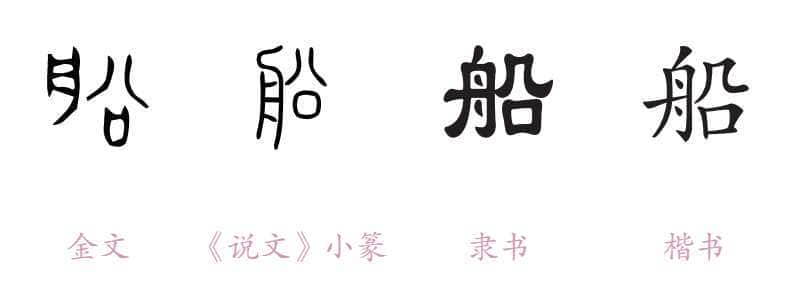

在“舟”字里，我们讲的是7000年前的小舟，而在“船”字里，我要讲的则是令人震撼的郑和宝船。

明朝的造船工艺在全世界都是领先的，可以用“高超”二字概括。在明朝永乐三年（1405），也就是600多年前，当时的永乐皇帝朱棣做出了派遣郑和下西洋的决定。于是，有了郑和七下西洋的壮阔故事，他历经28年之久，途经中国南海至印度洋30多个国家和地区，真是了不起！

郑和乘坐的宝船有多大呢？《明史·郑和传》记载，郑和宝船有44丈长，18丈宽。针对宝船的大小，一直有不同争论。有人认为，郑和宝船有100多米长，也有人认为，那个年代不大可能造得出这样万吨级别的大船，70米应该是比较合理的尺寸。

这样的巨船巍如山岳，一艘可乘坐千人。郑和的船队，大大小小的船加在一起浩浩荡荡，足足有27800人之众。在现代社会，载客量四五千人的巨型邮轮比比皆是，并不稀奇。但在600多年前，如群山般巍峨的巨大船队行进在广阔的海上，是多么令人震撼。

