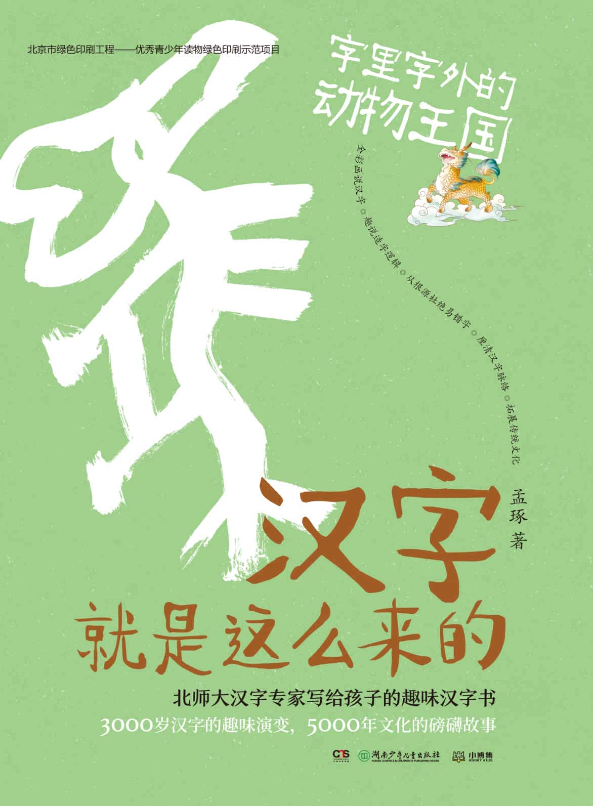

# 版权信息

书名：汉字就是这么来的·字里字外的动物王国

作者：孟琢

出版社：湖南少年儿童出版社

出版时间：2020-08-01

ISBN：9787556251933

本书由天津博集新媒科技有限公司授权亚马逊发行

版权所有 侵权必究

# 目录  
CONTENTS

**牛 
牛·牧 拿着棍子赶牛群 

物·件 “牛”字里的万事万物 

半·解 庖丁解牛的智慧 
**

**羊 
羊·羔·膻 吉祥的羊和奇怪的羊膻味 

美·善 与羊有关的“美”与“善” 

群 合群的羊 
**

**犬 
犬·狗 犬与狗的区别 

莽·突·伏 狗的动态和静态 

状·类 狗的抽象含义 

独 独行的狗 

狂·狷 与狗有关的品性 

狐 有灵性的狐狸 
**

**马 
马·骄·驹 大马为骄，小马为驹 

骈·驷 马车与文章 
**

**鹿 
鹿·尘 轻盈的小鹿与飞扬的尘土 

麒·麟 神兽和鹿有什么关系呢？ 
**

**兔 
兔 画一个“兔”字 

逸·冤 逃跑的兔子很委屈 
**

**鸟 
隹·雀·只·双·集 短尾巴鸟的故事 

鸟·乌 长尾巴鸟与乌鸦 

凤·凰·燕 中国文化中的神鸟 

飞·羽·习 小鸟是如何学习的？ 
**

**更多有趣的汉字 
鼠·窜 跑来跑去的老鼠 

龙 造一个神秘的“龙”字 

象·像 想象中的大象 

虎·彪 百兽之王的花纹 

豕·猪·豚 小猪味美，野猪凶猛 

鱼·渔 在水中捕鱼 

龟 神奇的乌龟 
**

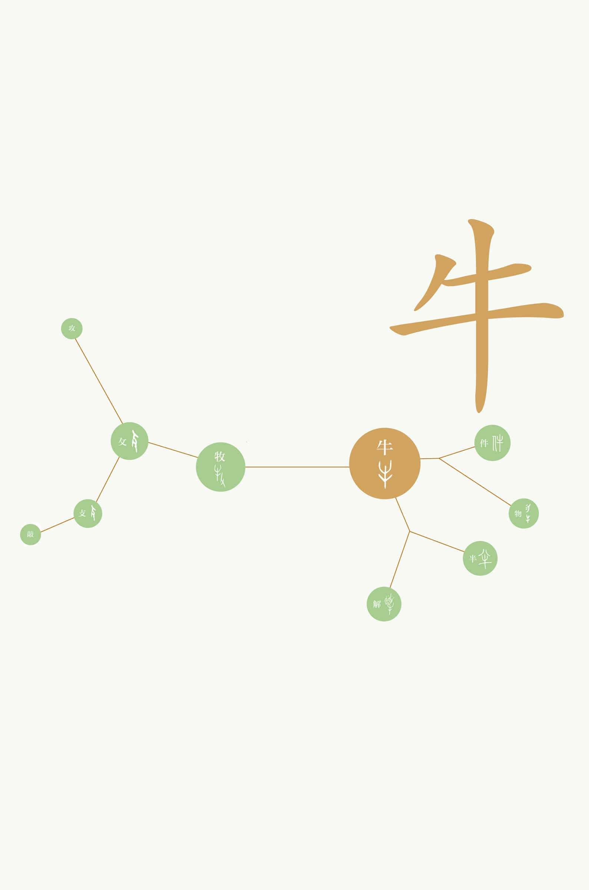

## 牛·牧  
拿着棍子赶牛群

在汉字动物园中，有各种各样、大大小小的动物。有温顺食草的牛羊，自在奔驰的骏马，看家护院的小狗……这些动物变化成一个个我们熟悉的部首——反犬旁、马字旁……它们巧妙地藏在“件”“家”“莽”等一个个汉字里。在《说文解字》[1]中，和六畜有关的字一共有500多个。这些动物的故事从哪里讲起呢？就从“牛”开始吧！

### 牛/ 这个字里有对大犄角 /

想一想，如果你是造字的仓颉[2]，会怎么给哞哞叫的牛造字呢？让我们先看一看“牛”在古文字中的写法。

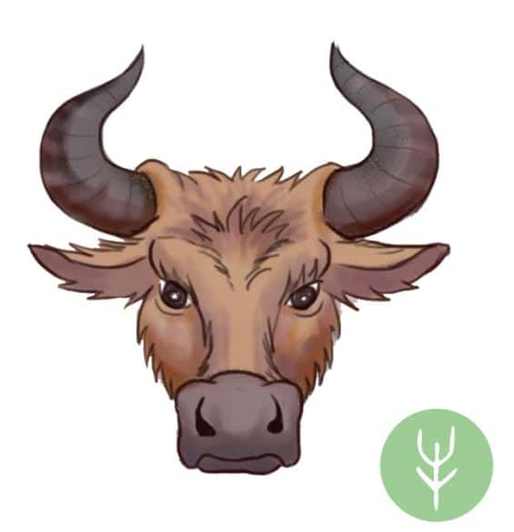

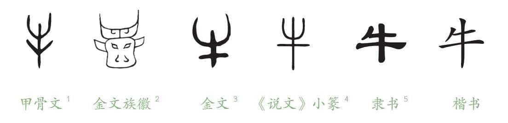

**1.**甲骨文是目前能看到的最古老的汉字，它是中国商周时期的文字，因为刻写在龟甲兽骨上，所以被叫作“甲骨文”。

**2.**作为部族图腾标志的文字，金文族徽具有高度图形化的特点。

**3.**甲骨文之后的文字叫金文，也叫“钟鼎文”，是商周时期铸刻在青铜器上的文字。我们见到的青铜器大多数是青黑色的，但它刚刚铸造出来的时候，其实是耀眼夺目的金黄色。所以，叫作“金文”。

**4.**战国时期，各诸侯国的文字不同，严重影响诸侯国之间的思想交流。秦灭六国之后，除了统一国土之外，也统一了度量衡，统一了文字，规定了标准字体——小篆。

**5.**隶书由篆书简化演变而成。小篆字形规整、端庄大方，但不易书写。秦国以法治国，政令繁多，大小官吏用小篆书写，效率不高，于是他们在办公过程中自觉地简化了汉字，用一种简便的字体书写了大量的公文，这便是隶书。从小篆到隶书发展演变的过程，叫作“隶变”。

在早期古文字中，“牛”是一个非常形象的字，弯弯的角，大大的鼻孔，一看就是个牛头，这是个象形字。什么是“象形字”呢？古人在造字的时候，用绘画的方式描绘出事物的样子，画得很像，这就是象形字。

从甲骨文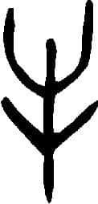到西周金文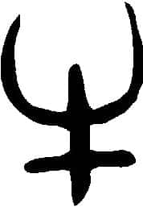，再到小篆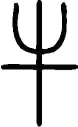，“牛”字的写法一脉相承。

《说文解字》说：“牛，大牲也。”意思是说，牛是一种很大的牲畜。书里还说“象角头三，封尾之形”。这又是什么意思呢？你看小篆字形的三笔，中间是脑袋，两边是朝上的牛角。字形下方用抽象的笔画，表示牛身子和牛尾巴。可以说，“牛”是一个典型的象形字，古人在造字的时候，把握住了牛最典型的特点——牛角。

牛在古代的地位十分重要。古人常说“五谷丰登，六畜兴旺”，所谓“六畜”，指的是马、牛、羊、鸡、犬（狗）、豕（猪）。

在六畜中，牛的地位相当显赫。古人祭祀祖先要宰杀家畜，最隆重的祭祀被称为“太牢”。为什么叫太牢呢？因为用于祭祀的牲畜，都要圈养在一起，“牢”最初指圈养牲畜的地方，所以叫“太牢”。太牢用三种牲畜来祭祀——牛、羊、猪。缺了牛，光用羊和猪的祭祀，在隆重程度上低了一级，被称为“少牢”。根据古代的礼仪法度，天子祭祀的规格是太牢，诸侯的规格是少牢。不同祭祀，对于祭品的规格、种类、公母，甚至毛色都有严格的规定。这些用于祭祀祖先和神灵的牲畜，被统称为“牺牲”。在古人看来，生命是对神灵最虔诚的祭祀，所以，“牺牲”这个词的含义慢慢扩展为“为了某种高尚的目的而献身”。

作为“大牲”的牛，在古人的生活里扮演着极其重要的角色，这份影响力也体现在了汉字汉语里，“牛”衍生出大量的字形、词语、谚语，这也是我们从“牛”讲起的原因。

和“牛”有关的词语，颇有意思，充分体现了牛的特点。比如，在古人的观念里，牛最根本的特点就是大，这种观念直接影响到我们今天的语言。

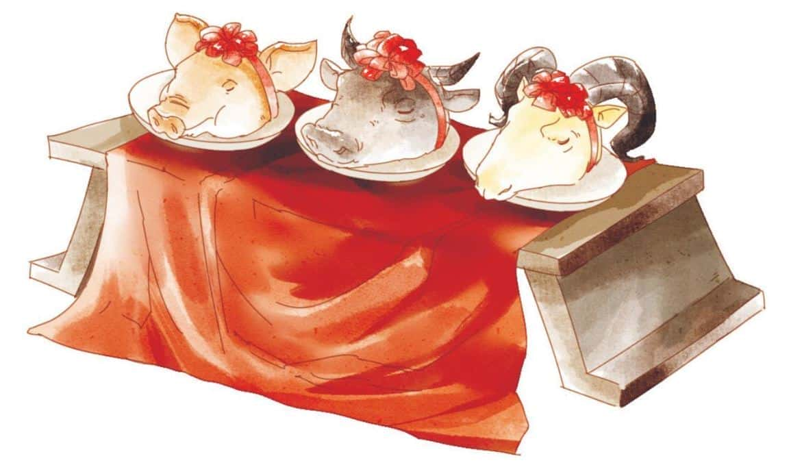

牛很大，身上的毛特别多，因此有个成语叫“多如牛毛”，形容事物特别多，简直像牛毛一样。在《西游记》的故事里，尽管孙悟空拔一把毛，就能变出千千万万个小猴子，但是我们从来不说“多如猴毛”，只说“多如牛毛”——按照这个道理，牛魔王如果有孙悟空的本事，就能变出数不清的小牛，打败孙悟空。可惜《西游记》没有这么写，吴承恩先生[3]似乎更向着猴子呢。

牛很大，我们说大话的时候，好像只要用嘴“呼”地一吹，就能吹出一头牛来，这叫“吹牛”。为什么不说“吹猪”或“吹羊”呢？因为它们没有牛那样大，吹起来没感觉。

当我们夸别人厉害的时候，还会说“你真牛”，这里的牛也不能用别的动物代替——“你真猴”“你真猪”可不好听。要知道，牛很大，“你真牛”就是“你本事真大”的意思。

### 牧/ 这个字里为何有“牛”没有“羊”？ /

接下来，我们讲一个和管理牛有关的字——“牧”。

这是一个会意字。什么是会意字？

会意字就像拼积木一样，把不同的字拼合在一起，组合它们的含义，造出新字，表达新义。比如“牧”字，它的左边是“牛”，右边是反文旁“攵”。反文旁是什么意思呢？

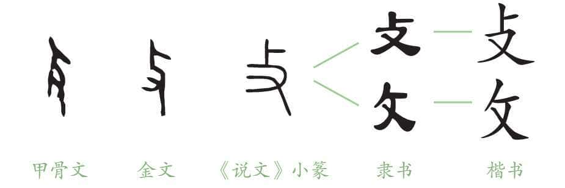

其实，反文旁来自“攴”（pū）。“攴”的甲骨文字形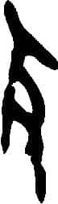和金文字形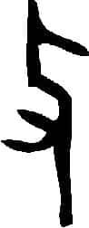很形象，下面是手，手里拿着一根小棍子，表示敲打。所以，表示敲打的“敲”字里有个“攴”，“攻”这种有攻击性的汉字里也有反文旁。“牧”字同理，是一个“牛”加一个挥舞棍子的“手”，合起来组成一个新的含义：手里拿着棍子赶牛，表示放牧。这就是会意字。

你也许会问，牧牛和牧羊都很常见，可“牧”字里为什么只有“牛”没有“羊”呢？

说起来，古人造“牧”的时候，其实不仅选取了“牛”的形象，创造出了甲骨文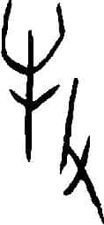，他们也用过“羊”的形象，创造了甲骨文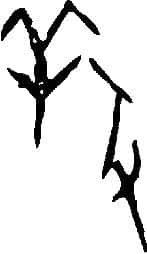。但在汉字演变的过程中，人们最终选择了带牛的“牧”字——也许，这与“牛”在人类世界中的重要性有关。

我们的祖先从何时开始放牧牛群的呢？

在漫长的历史长河里，人类驯化的动物和植物有很多。我们的祖先在六七千年前驯化了牛，在五千年前驯化了羊，在七千年前到五千年前，驯化了粟粒（小米）……他们一步步地将野生的猪、鸡、犬、牛、羊、马驯化为家养的“六畜”，将麦、豆等野生植物驯化为可以耕种的“五谷”，期待着“五谷丰登，六畜兴旺”的美好图景。

人对大自然的“驯化”催生了农业，也催生了畜牧业的发展。除了牛以外，古人还牧马、放羊。在古代，东北有个少数民族，叫黑水靺鞨（mò hé），他们还能放牧猪群！想象一下，一群人拿着小鞭子，在广阔的东北平原上赶着一群小猪，画面十分可爱。

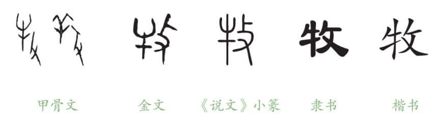

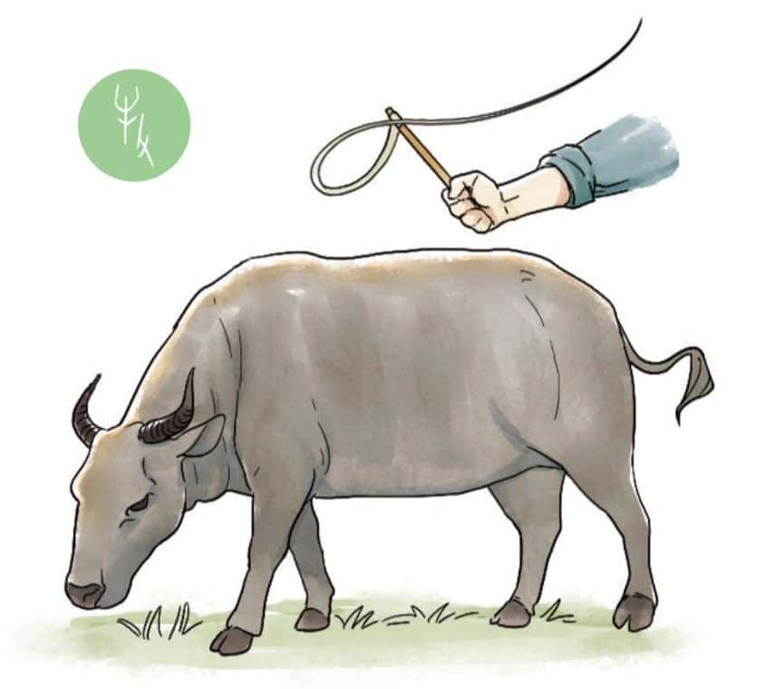

* * *

[1] 《说文解字》是中国历史上第一部系统分析汉字字形、讲解汉字字理的字典，简称《说文》，作者是东汉的许慎。在体例上，它开创了部首编排法；在内容上，它用六书系统地解说汉字，并保存了部分早期古文字的写法，为我们研究甲骨文、金文等提供了依据。六书是六种汉字造字法，包括象形、会意、指事、形声、转注和假借。

[2] 仓颉是黄帝的史官，传说他长着四只眼睛。古人认为是他创造了汉字。

[3] 吴承恩是《西游记》的作者。吴承恩年少的时候，就已经因文学才华而闻名乡里，但他在科举上却屡遭挫折，直到四五十岁才成为岁贡生。岁贡是明清科举制度名目的一种。府学、州学、县学每年都会按学历高低排序，然后按规定的名额，依次选送一些人到国家最高教育管理机关和最高学府国子监去。后来，吴承恩因为母老家贫，不得已去做了个小官——县丞（辅助县令管理县城的官员）。可他不肯阿谀奉承，最后辞官回家，晚年纵情于美酒和诗书之中。

## 物·件  
“牛”字里的万事万物

如前文所言，在古代，牛与人类的关系十分密切。在农耕时代，它们是种地的主力军，也是祭祀中最珍贵的祭品。牛如此重要，以至于《礼记·王制》[1]中提及“诸侯无故不杀牛”，意思是诸侯不能随随便便杀牛。秦朝时甚至有专项法令规定，杀牛入罪。唐代的《厩库律》[2]也规定，杀牛要被判徒刑[3]一年半，而当时盗卖一亩以下田地的人，刑罚也不过是笞刑[4]而已。

牛如此重要，它在汉字的世界中，也成了万物的象征。接下来我们要讲的两个字——“物”和“件”，都体现出了牛的这一特点。

### 物/ 象征万物的牛 /

“物”和“件”都是事物的名称，它们的字形中都有一个“牛”。

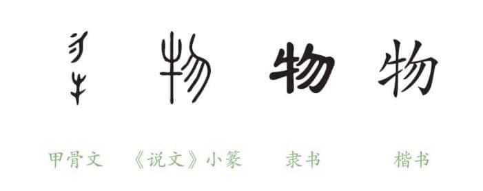

先看“物”字。《说文解字》中提到，“物”字“从牛，勿声”。“物”是个形声字，“牛”是形符，“勿”是声符。从甲骨文到楷书，它的形体基本上没有变化。

这里又讲到了一个新的概念——形声字。什么是形声字？

和象形、会意一样，形声也是古人造字的一种方法，形声字可以一分为二，一半是形符，一半是声符。形符用于表达汉字的字义，声符用于提示汉字的读音。

比如“蜘蛛”，它们的形符都是“虫”，表示这两个字与虫有关。“知”“朱”分别是两个字的声符，用来表示“蜘”“蛛”的读音。我们总说“秀才识字念半边”，这种撞大运的念法，“撞”的就是形声字。但要注意，念声符可不一定能百分百念对生字，有的声符只有古代的读音才和生字相同，而有的声符选取的是与生字读音相近的字。比如，形声字“辉”的读音和声符“军”可一点也不像，这是因为“军”的发音在历史变迁中发生变化，不再和“辉”相近了。再比如形声字“河”，它的声符“可”和“河”读音相似，但并不完全相同。

让我们再回到形声字“物”。形符“牛”表示“物”的含义与牛有关，声符“勿”则用于提示“物”字的读音，这种造字方法是不是很巧妙呢？

在古代，“物”最初指一种特殊的杂毛牛，但这个用法后来很少使用。一般来说，“物”指万事万物，所谓“事物”“物体”“物品”“物类”，大都是这个意思。

许慎先生在《说文解字》中是如何解释“物”的呢？他说：“物，万物也。”意思是说，“物”指万事万物。我们今天组词会说“动物”“植物”“矿物”……各种各样的物，包括了世界上林林总总的存在。

“物”用“牛”来造字，说明“牛”是万事万物的象征。

### 件/ “牛”字里的百千万件 /

我们再来看看“件”字。

“件”是一个量词，我们说东西的数量，会说“一件”“两件”，直到“百千万件”。许慎先生在《说文解字》中说：“件，分也。从人，从牛。”即“件”最开始的意思是“分”，一件、两件的事物，都是拆分出来的结果。

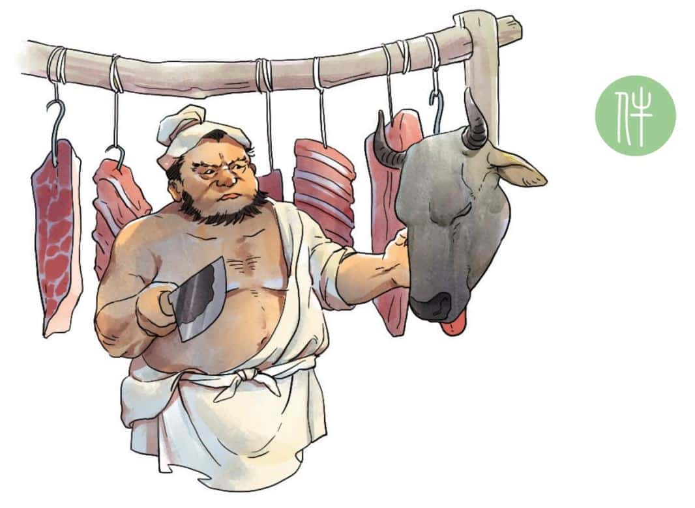

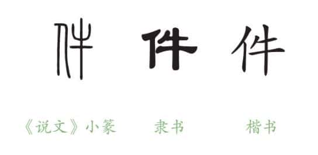

“件”和“牛”有什么关系呢？

许慎先生继续说：“牛，大物，故可分。”意思是说，牛的体形很大，是“大物”，人们可以将它分成一块一块的，也就是所谓的“庖丁解牛”。

一件、两件、三件的事物，都是从整体中拆分出来的，这和牛可以分解的道理一样。因此，古人用“牛”来组成可以表示各种各样事物的“件”字。

* * *

[1] 《礼记》是儒家的重要经典，是对周代礼仪制度的深入阐发，其中《大学》《中庸》《学记》《乐记》等篇目，都是非常重要的文化经典。

[2] 《厩库律》是牲畜饲养、仓库管理方面的法典。

[3] 徒刑，古代的一种刑罚，剥夺犯罪者人身自由，将犯人拘禁起来，并进行强制劳动。

[4] 笞刑，古代的一种刑罚，用荆条或竹板敲打犯人的臀﹑腿或背，有点像今天的打屁股。

## 半·解  
庖丁解牛的智慧

牛是万物的代表，也是美味的食物，可以煮出香喷喷的牛肉。《水浒传》中的英雄总是大口喝酒、大口吃肉。好汉武松去景阳冈打虎，就一下子吃了四斤熟牛肉，连饮十五碗酒。

无论是太牢祭祀，还是酣畅淋漓地吃牛肉，都得杀牛。那么古人是如何杀牛的呢？让我们通过“半”和“解”这两个汉字来看一看吧。

### 半/ 一分为二 /

顾名思义，“半”是把一个东西从中间分成两半。你可能会问，“半”和“牛”有什么关系呢？答案还是要从古文字里去寻找。

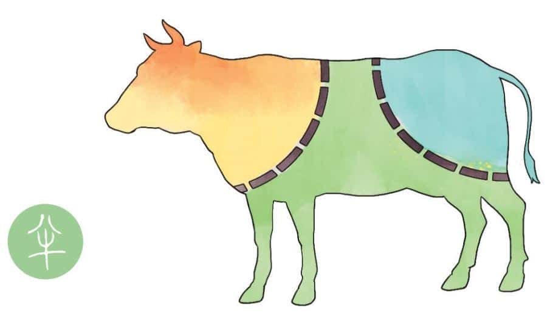

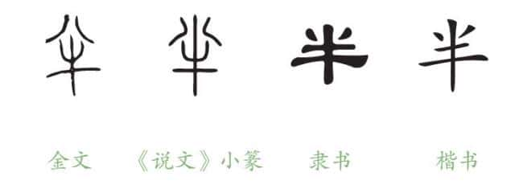

在金文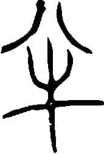和小篆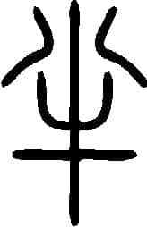中，“半”由“八”和“牛”组成。二分为四，四分为八，“八”字像一个东西被分成两半，有分开、拆分的特点。“八”的这一特点，在“分”字里也有体现——“分”字上面一个“八”，下面一把刀，它的字义就是用刀将东西分成两半。《说文解字》中说：“半，物中分也。”牛是很大的牲畜，可以从中间分成两半，这便是“半”的含义。

“半”是事物的二分之一。有个成语叫“半斤八两”——为什么不说“半斤五两”呢？这是因为在古代，一斤是十六两，十六除以二，半斤正好是八两。

### 解/ 用刀把牛角“解”下来 /

讲完了“半”字，我们再来看看“解”字。

“解”有“拆解”“解开”的意思，它由三个部分组成——“角”“刀”和“牛”。这是一个会意字。

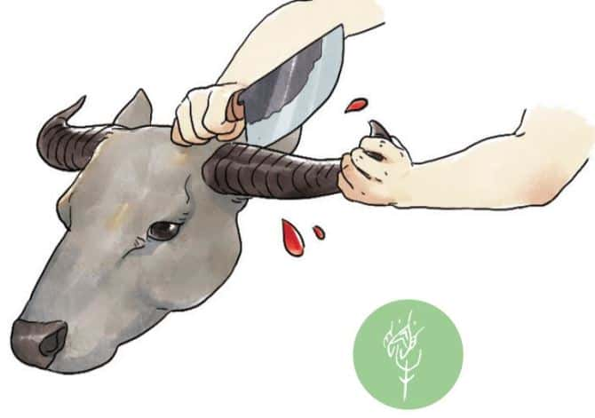

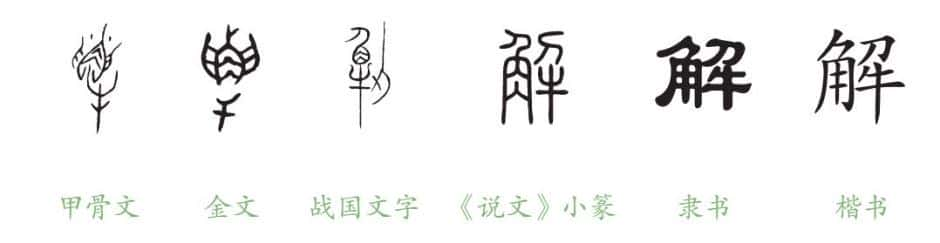

在前面“牧”字的部分，我讲过会意字的造字法，你能用同样的造字逻辑，来猜猜“解”字的本义吗？

聪明的你可能已经猜到了，“解”字最初的意思，就是用刀把牛角割下来。

在甲骨文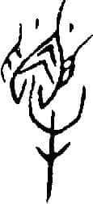中，“解”的下面是一头牛，牛头上有个尖尖的牛角。在牛角旁边有两只手，还有几个小点。这两只手在干什么呢？它们在用力地把牛角从牛头上弄下来。至于那些零散的小点，则是溅落的牛血。到了战国文字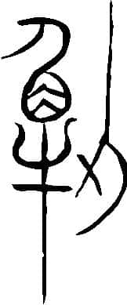，牛角旁边多了一把刀。《说文解字》说“解”是“从刀判牛角”——“判”字里右边一把刀（立刀旁），左边一个“半”，是分开的意思——牛角用手是拽不下来的，“从刀判牛角”指用刀把牛角从牛头上割下来，这也是“解”的字义来源。

在汉语中，“解”衍生出诸多用法，都和“分解、分割”的本义有关。“解”是让事物分开。系紧的鞋带要“解开”，做完课间操要“解散”。“解”还是一种自由自在的状态，“解放”是让奴隶获得自由。你有好多好多的作业，终于写完了，伸伸懒腰，也可以说自己“解脱”了。

除此之外，“解”也是按照道理、顺应规律来做事。“解释”是把事物的道理说明白，“理解”是按照规律把握万物，“解题”是根据数学、物理、化学等的规律，得出正确的答案。许慎先生的《说文解字》，书名的意思就是要把汉字的规律讲解明白。在这层字义里，蕴含有“庖丁解牛”的智慧。

“庖丁解牛”的故事出自《庄子》[1]，故事的主人公庖丁是一个非常善于杀牛的人。

要注意的是，庖丁并不姓“庖”，“庖”指的是他的职业——厨师。中国有句话叫“君子远庖厨”[2]，讲的是君子的仁爱之心：君子看到野兽活着，不忍心见它们死去；听到野兽的声音，不忍心食用它们的肉。君子有仁爱的心，所以会“远庖厨”，即远离厨房。

庖丁是战国时期有名的大厨，刀法十分了得，他的工作就是专门给梁惠王杀牛。有一天，梁惠王去看庖丁杀牛，发现他杀牛时，就像跳舞一样，钢刀在牛的身上熟练地游走，只听“咚咚咚”一阵响，一整头牛一下子散落在地，被分割成块。

梁惠王惊呆了，庖丁杀牛为什么能如此干脆利落，甚至还有一种美感呢？

于是，梁惠王问庖丁：“你杀牛时，有什么诀窍吗？”

庖丁告诉梁惠王：“我杀牛可是大有道理的！我最初杀牛的时候，眼里看到的是一头完整的牛。三年后，我眼前不再是一整头牛。现在，我用精神和心去看牛，眼中不再是牛，而是牛的生理结构。我的刀在牛骨头和牛肉之间的缝隙中游走，就像鱼在水里游。一般的厨师，只会‘咣咣咣’一顿猛砍，刀一个月就要换一回；好一点的厨师呢，只割不砍，刀一年也要换一回；而我的刀用了十九年了，就像刚刚磨出来的一样。为什么呢？因为刀只在牛骨头的缝隙中自由游走，所以不会被磨坏。”

很多人用这篇寓言来讲工匠精神，可是，庄子先生作为道家学派的创始人，为什么要讲一个擅长杀牛，做好匠人的故事呢？

其实，“庖丁解牛”选自《庄子·养生主》，这是一篇讲“养生之道”的寓言故事。听完庖丁的解说，梁惠王的回应是：“善哉！吾闻庖丁之言，得养生焉。”意思是听了庖丁的一席话，我知道该如何养生了。

为什么杀牛和养生有关呢？

我们前面讲过，牛是万物的象征。“庖丁解牛”不是在讲杀牛的方法，他刀下的牛，其实代表着纷繁复杂的世界。在生活中，我们总会碰到各种各样陌生的难题，这个故事告诉我们如何养心、如何养生——一个有智慧的人面对广阔无垠的世界，要从容淡定地找到万事万物的规律，像庖丁一样游刃有余，让智慧的锋芒在万物的缝隙中游走，这便是“解”字中的大智慧。

* * *

[1] 《庄子》是一部重要的道家经典，由战国时期的哲学家庄周和他的弟子所作。

[2] 这句话经常被错用，人们会断章取义，将这句话理解为：君子应该专心于学习和事业，不下厨房不做家务。其实，这句话的原始语境是：“君子之于禽兽也，见其生，不忍见其死，闻其声，不忍食其肉。是以君子远庖厨也。”

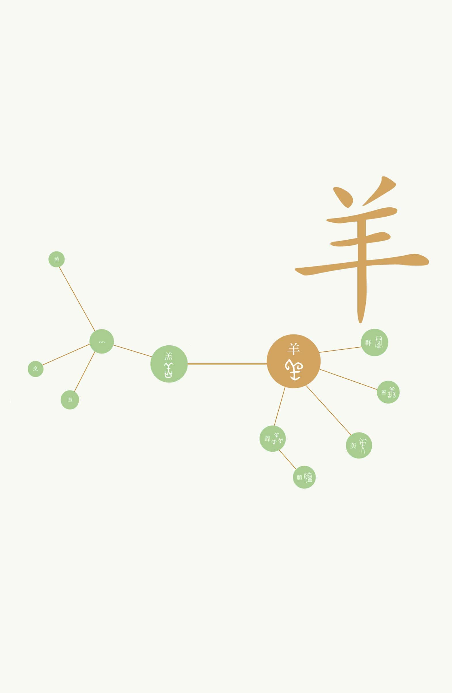

## 羊·羔·膻  
吉祥的羊和奇怪的羊膻味

“天苍苍，野茫茫，风吹草低见牛羊。”在家畜中，羊和牛同样重要。中国新石器早期的河姆渡遗址[1]中出土过陶羊，晚期的仰韶遗址中出土过羊骨。作为古人最早驯化的牲畜之一，羊为我们的祖先提供了食物和日常用品，并在语言和文化中，被赋予了各种各样丰富的含义。

这一讲的主角是咩咩叫的温顺小羊，我们将分享三个字——“羊”“羔”“膻”。

### 羊/ 古人如何给羊造字？ /

你见过小羊吗？羊是古人生活中最为常见的动物，对于这种非常熟悉的动物，古人会如何造字呢？

也许你已经猜到了，没错，是象形，把羊的样子画下来。在《说文解字》中，许慎先生引用了孔子的说法：“牛羊之字，以形举也。”意思是说，人们根据动物的形体造出了“牛”和“羊”这两个字，它们是典型的象形字。

还记得古文字中的“牛”吗？“羊”的写法和“牛”形成了鲜明的对比——“牛”角上弯，“羊”角下卷，古人在“牛”的甲骨文和“羊”的甲骨文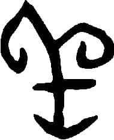中，充分体现出牛角与羊角的差别。你看，古人造象形字，一定会把握事物最鲜明的特点，用简单的笔画表示具体的事物，凸显它们的不同之处。

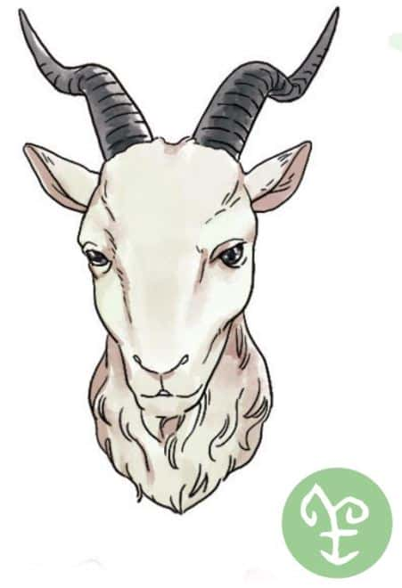

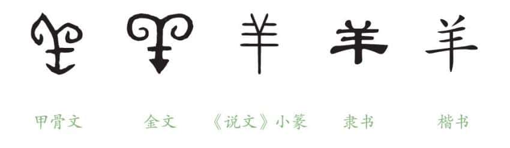

从甲骨文到金文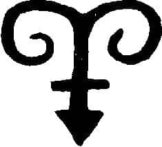，羊的形体一脉相承。到小篆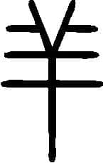时，羊的写法稍有变化，《说文解字》说这个字“象头角足尾之形”，小篆上面的部分，表示羊头、羊角；下面的两横，像羊的四条腿；最后伸出来的一竖，则是羊的大尾巴。到了今天，“羊”字的写法又有了变化，弯弯的羊角最终变成了简单易写的两个点。

讲清楚了字形，那古人如何解释“羊”的意思呢？

《说文解字》说：“羊，祥也。”许慎先生没有说羊是一种什么样的动物——因为人们太熟悉它了——而是用“祥”来解释羊的特点。羊和吉祥有关系吗？

当然有！

在古人心目中，羊是一种特别美好的动物，是吉祥的象征。瓷器上有一款经典的吉祥纹样，叫“三羊开泰”，是“三阳开泰”的谐音。每年冬至的时候，白昼的时间最短，往后白昼的时间慢慢变长，阴气渐渐散去，而阳气越来越盛，所以古人说冬至一阳生，十二月二阳生，正月三阳开泰，冬去春回，阴消阳长，万物复苏。因此，旧时人们常用“三阳开泰”来作为新一年开头的吉祥语。“三羊开泰”的图样是三只羊，取的便是“三阳”二字的谐音[2]。

古人为什么觉得羊吉祥呢？因为羊有很多优点和好的品质。

首先，羊为古人提供了美味佳肴。直到今天，我们还是喜欢在萧瑟的寒冬里围着火锅涮羊肉，羊肉不仅味美，还能滋补身体。其次，羊性格温顺，总是成群结队，容易牧养。最后，羊是一种有道德的动物。汉代有个大学者叫董仲舒[3]，他有一本书叫《春秋繁露》，里面说：“羔有角而不任，设备而不用，类好仁者；执之不鸣，杀之不啼，类死义者；羔食于其母，必跪而受之，类知礼者；故羊之为言犹祥与，故卿以为贽（zhì）。”在他看来，小羊有羊角但不顶人，这是仁；被人抓住，临近宰杀，却不叫不哭，这是义；吃奶的时候，小羊一定要跪着吃，表现出对羊妈妈的感恩之心，这是礼（在注重道德的古人看来，这是一种宝贵的孝道）。董仲舒认为小羊有仁、义、礼的君子之风，是吉祥的象征，公卿送礼物就应该送羊。

古人将吉祥的羊作为礼物来送人，在现代社会，也延续着类似的风俗。在今天的河北邯郸一带，姥爷、舅舅就有给外孙、外甥送羊的习俗。最早大家送的是活羊，后来为了便利，改送白面蒸的羊馍馍。这里面的第一重寓意是羊羔跪乳，教育孩子要像小羊一样孝顺父母；第二重寓意是“羊”与“阳”同音，送羊有给孩子送阳寿[4]的美好祝福。

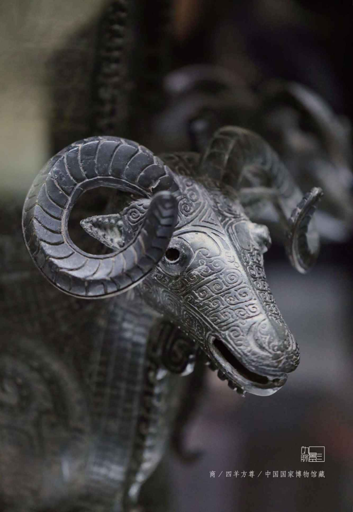

### 羔/ 美味的小羊羔 /

讲完了“羊”字，我们再来看“羔”字。

我们把小羊叫作“羊羔”，《说文解字》说：“羔，羊子也。”羊的孩子，自然是小羊。“羔”字下面是四个点，我们通常叫作“四点水”。

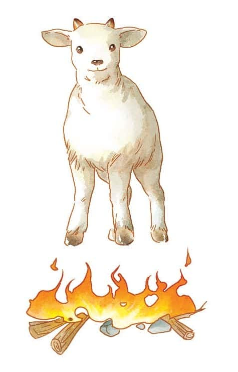

说到这里，你是不是想问，四点水画的是什么？是地上的水吗？还是四只羊蹄抽象演变的结果？

都不是！

真正的答案要从古文字中去寻找。看甲骨文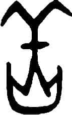和小篆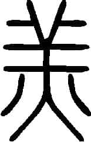你就明白了，“羔”的上面是羊，下面其实是火。古代有个叫徐灏[5]（hào）的学者，他指出“羔”字的意思是“羊炙”，也就是烤羊。你看这个字，像不像在火上烤全羊呢？

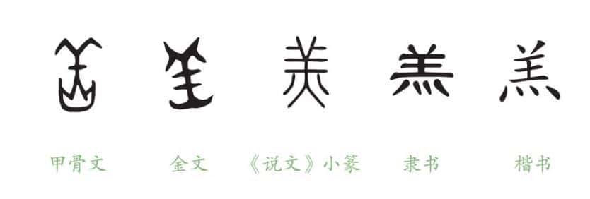

也许是因为小羊羔肉嫩，烤起来格外好吃，所以古人用烤羊的画面给羊羔造字。在这个汉字里，我们仿佛看见古人正在对着烤羊肉流口水呢。

讲完了“羔”字，我们会惊讶地发现，原来“四点水”这个名字起错了，它应该叫“四点火”才对。明白了“四点水”的含义，我们也就会明白，为什么“蒸”“煮”“烹”这些与做饭有关的字，下面都是“四点水”了，那是古人享受美味时点燃的熊熊烈火。

### 膻/ 羊的味道 /

有人享受羊肉的美味，也有人嫌弃羊肉的怪味。这就要说到第三个字——“膻”。

“膻”字主要用于“羊膻味”。你可能会猜，这个字是不是和“物”一样，也是个形声字，并好奇地发问：“膻”字里为什么没有羊呢？

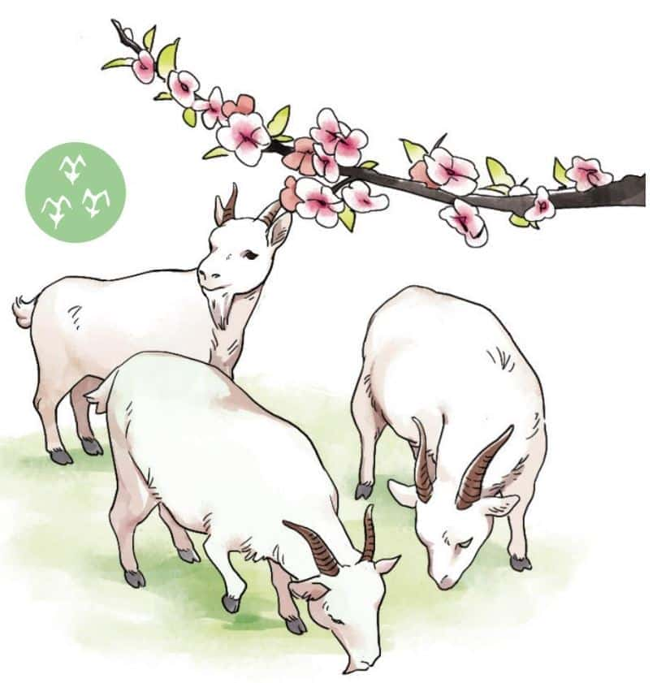

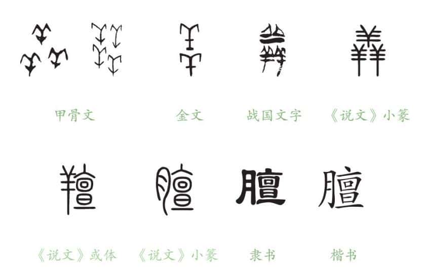

解开谜题之前，我们需要先来看看另外一个字——“羴”（shān）。

“羴”字的甲骨文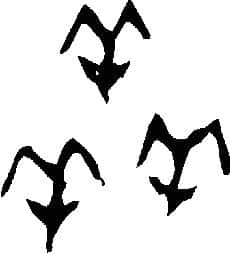、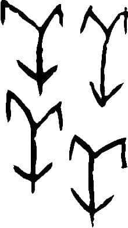和金文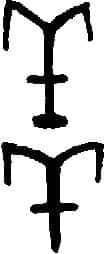中，羊的数目不定，有时是两只，有时是三四只。到了战国以后，“羴”字才逐渐确定为三只羊。

为什么是三只呢？

在古代，“三”表示数目众多。比如三个木组成“森”，表示很多树组成的森林；三个人组成“众”，表示群众；成语“三人成虎”[6]里的“三人”，不是确切的三个人，而是指传播谣言的很多人。

“羴”字里隐藏着这么多只羊，古人是不是掉进羊圈里了？

不是的，《说文解字》说：“羴，羊臭也。”这里的“臭”不是臭味的意思，它读作xiù，泛指味道。羊臭，指的就是羊身上散发的气味。

说到这儿，你一定明白了，“羴”就是我们今天说的羊膻味。看到满是羊的“羴”字，我们仿佛也闻到了羊身上特有的浓浓气息。

那“羴”字和“膻”字有什么关系吗？

在《说文解字》中，“羴”字还有另一种写法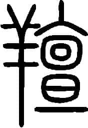，左边是形符“羊”，右边是声符“亶”（dǎn），这是一个形声字。后来，在汉字的发展演变中，这个字的偏旁从“羊”变成了“肉”。“肉”在小篆里的字形是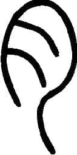，和“月”的小篆字形很像，随着时间的流逝，“肉”越写越像“月”，变成了我们熟悉的肉月旁[7]，于是，便有了现在的“膻”字。

* * *

[1] 距今约7000～5000年。

[2] 中国的很多吉祥图样都是取自谐音，比如画蝙蝠取自“福”字的谐音，“金玉满堂”图样里画金鱼，取自“金玉”的谐音。

[3] 董仲舒，西汉著名哲学家、儒家大家。他的著作流传较少，现在保存下来的有《天人三策》《春秋繁露》等。政治上，他主张“罢黜百家，独尊儒术”，让皇帝罢黜墨家、法家、道家等流派，只用儒家思想来治理天下。

[4] 即寿命。古人将世间分为阳间和阴间，人活着的时候居住在阳间，等去世后则前往阴间，也就是阴曹地府。人在阳间的寿命，便叫作“阳寿”。

[5] 清代学者，为《说文解字注》做过注解。

[6] 这个成语的意思是闹市里本来没有老虎，传言有虎的人多了，大家就信以为真。人们用“三人成虎”比喻谣言或讹传一再重复，便能蛊惑人心。

[7] 肉月旁的字还有“肝”“脾”“腿”“脸”“肥”等，以肉月旁为部首的字，多和肉有关。要记住，这是肉月旁，这个部首来自“肉”，而不是月亮。

## 美·善  
与羊有关的“美”与“善”

羊是古人心中的美味，也是好品格和吉祥的象征，因此，和羊有关的字也往往带有美好的含义。

在这一讲中，我要给大家介绍两个和“羊”有关的字——美丽的“美”和善良的“善”。让我们一起来看一看，“美”“善”和羊有什么关系吧！

### 美/ 羊为何很美？ /

先说“美”字。

这个字我们再熟悉不过了，想夸人漂亮，要说“你真美”。古人是怎么给“美”造字的呢？这个字和羊有什么关系呢？让我们在古文字中寻找答案吧。

甲骨文中的“美”歪歪扭扭的，看上去有点奇怪。如果仔细看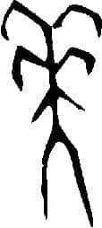的话，可以看出“美”的下面是一个“大”字，上面是“羊”字，弯曲下来的是大大的羊角。

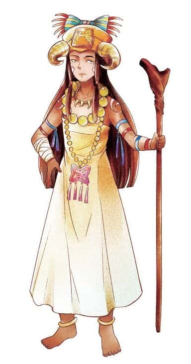

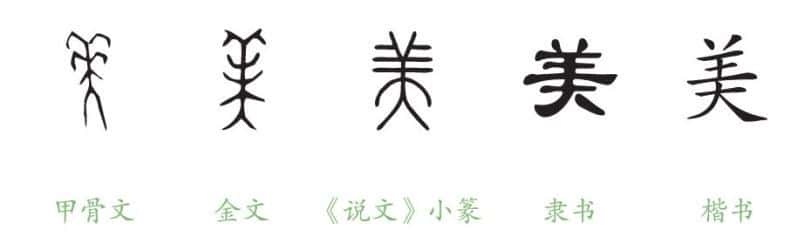

“大”在甲骨文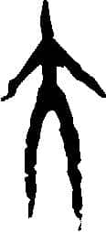里，是正面站立、手脚用力张开的人，看上去很有气势。这个字一直在不断发展，从金文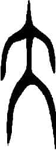再到小篆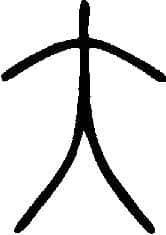，一脉相承。随着汉字的隶变[1]，字里的两只手越写越平直，终于变成了今天的“大”。

《说文解字》认为“天大、地大、人亦大”，古人用人张开双臂的形象来表示天地之大，体现出人与天地并重的文化气魄。

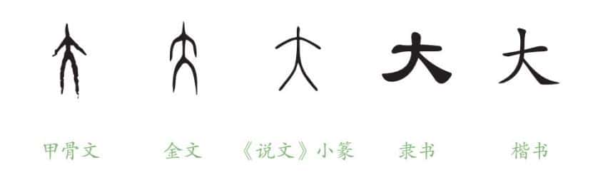

讲完了“大”字，再来一起看看“美”字，人的脑袋上为什么会有只羊呢？“羊”和“美”的关系是什么呢？

有人说，甲骨文描绘的是头上戴着羊角的大酋长，他们戴着酷酷的羊头饰，因此看上去很美。

关于“美”还有另外一种解释——羊大为美。许慎先生认为“羊在六畜主给膳也”，意思是说，在牲畜中，羊是主要用来当作食物的。他认为“美”的含义最初取自羊肉的鲜美。因为羊肉好吃，所以大大的肥羊，便是美。当代美学大师朱光潜先生也是这一观点的支持者，他在代表作《谈美书简》中曾明确指出：“汉文‘美’就起源于羊羹的味道。”

你可能还想问，为什么是“羊大为美”呢？美好的东西一定要大吗？小羊难道不美吗？关于这一点，就要说到古人对美的看法了。

在古人心目中，“美”和“大”是密不可分的。有一个成语叫“美轮美奂”，高高大大、富丽堂皇的房子才有壮阔之美。再比如说，古人觉得高大壮硕的姑娘最美。如果穿越时空，回到先秦，你看到的美女一定不像现在电视里的那样柳腰纤纤、体态盈盈，古人并不喜欢这样的身材。在他们看来，标准的美女是“硕人”——身材硕大、体魄强健的姑娘。

时间再往前倒退，回到西周，倾城倾国的褒姒（bāo sì）也应该是个高高大大的女子。

你听过“烽火戏诸侯”的故事吗？

西周末年，周幽王有个宠妃叫褒姒，长得十分美丽，只是不爱笑，整天郁郁寡欢。周幽王为了哄美人开心，就在烽火台上燃起烽火。烽火可不是随便就能点燃的，要知道，古人住得远，又没有电话，所以大家约定如果天子有难，烽火就是求援信号。

各国诸侯看到烽火，以为周王室发生了危险，匆匆赶来救驾。

看到诸侯们一个个慌慌张张、气喘吁吁的蠢样子，褒姒忍不住开怀大笑。

烽火台下的诸侯们听到她的笑声，全都十分生气。“好啊，我们对天子忠心耿耿，可天子却在戏耍我们！”

后来，犬戎真的入侵，周幽王急忙点燃烽火，可这一次再也没有人来救他了。

这个故事是中国古代版的《狼来了》。回到褒姒身上，她是个什么样的美女呢？如果她是个瘦瘦小小、弱柳扶风的姑娘，站在城头上莞尔一笑，诸侯怎么会听见她的笑声呢？

由此可见，褒姒是个大块头的姑娘，肺活量非常好。她昂首挺胸地站在城楼上，看着下面的各路诸侯，发出了“哈哈哈”的爽朗笑声。《诗经》就用“硕人”来形容褒姒呢。

从“硕人”的审美中，我们可以知道，古人喜欢大的东西，大在古代意味着好，意味着美。

那“美”到底指的是头上戴着羊角的大酋长，还是羊大为美呢？虽然还没有定论，但无论是哪种解释，我们可以肯定的是，“美”字都和“羊”字密不可分。

### 善/ 说一说羊 /

讲完了“美”，再来看看“善”字。

在今天的写法中，“善”的上面是羊，下面的字有点复杂。要想弄明白这个字，还是要从古文字的写法说起。

在金文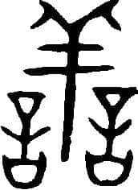和《说文》古文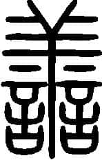中，“善”的上面都有一个“羊”，下面是两个“言”。到了《说文》小篆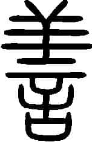，两个“言”变成了一个“言”。无论“言”的个数怎样变化，都说明“善”这个字和说话有关。因此，有人把“善”字解释为谈论和羊有关的话题：

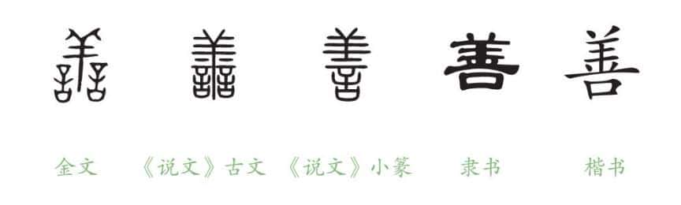

“你家的羊养得怎么样？”

“不错！又肥又大！”

“嗯！善！”

羊是美好的动物，所以谈论羊也表示好事情。这个说法不免有些猜测的成分，但告诉我们“善”和“羊”密不可分。《说文解字》对“善”的解释是“吉也”，有很强的褒义色彩。由于“羊”的吉祥含义，“美”和“善”都用“羊”来参与造字，表示一种正面的价值、美好的品质。“善人”是好心肠的人，“善举”是帮助别人的好行为……这些好品质，都用“羊”来象征。你看，古人心目中的“羊”，真的很棒呢。

另外，在古代汉语中，“善”也可以用来表示应答，表示“好的”。比如，我问你：“我们一起学习《说文解字》好不好？”若仿效古人的口气，你就要回答：“善！”也就是“好”的意思。

和尚们经常说“善哉，善哉”，其实意思就是“好啊，好啊”。

* * *

[1] 隶变是指汉字从篆书演变为隶书的过程。在这一变化中，汉字的书写单位由线条变成笔画，字形结构也变得更为简省，易于书写。

## 群  
合群的羊

在这一讲，我给大家介绍“群”这个字。“群”是一个古老的汉字。“群”和羊有什么关系呢？这还要从汉字和羊的习性说起。

在“群”的金文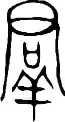中，下面是“羊”，上面是“君”，“君”在古代的发音和“群”相近，这是一个标准的形声字。

古人很早就认识到羊群居的特点。宋代有一位学者叫徐铉（xuàn），他是整理《说文解字》的大功臣。他说：“羊性好群，故从羊。”意思是说，羊喜欢扎堆群居，所以古人用“羊”来为“群”造字。

从金文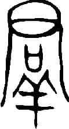到《说文》小篆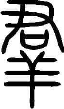，从隶书到楷书，“群”字的写法一脉相承，唯一的变化，就是从上下结构变成了今天的左右结构。

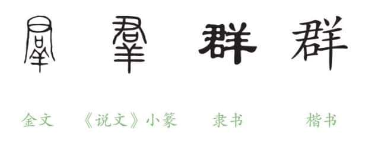

在汉语中，“群”最开始表示动物聚集。先秦时期有一本重要的史书叫《国语》，书中说：“兽三为群，人三为众。”这里的“三”不是一个具体数字，而是泛指数量众多。这句话说的是，很多动物聚在一起，这叫“群”；很多人聚在一起，这叫“众”。我们今天说的“群众”一词，其中的“群”与“众”最开始是有分别的。

“群”可以很热闹。《说文解字》说：“群，辈也。”“辈”指同辈，我们的兄弟姐妹、同学朋友都是同辈人，大家聚集在一起，就是一个热热闹闹的群体。

“群”也可以很无聊。在《论语》中，孔子说有些人“群居终日，言不及义”。意思是说，如果一大群人整天聚在一起，说一些轻浮无聊的话，就没劲透了。

“群”也可以很积极。比如“群策群力”，大家聚在一起共同出主意，出力量。

“群”也可以是一种君子的状态。在《礼记·学记》中有个词叫“敬业乐群”。“敬业”是指认真对待学业、尊敬长者，“乐群”是指在群体中和别人愉快相处。在古人看来，“敬业乐群”是一种基本的君子修养。

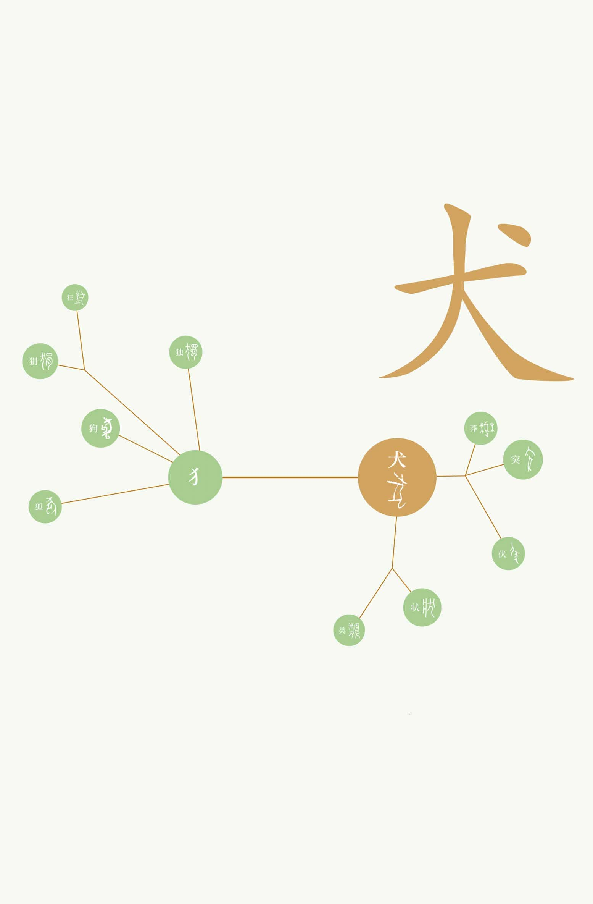

## 犬·狗  
犬与狗的区别

在六畜中，狗和人类的关系最为亲密，被誉为人类最好的朋友。它们与人类之间的友情，可以追溯到新石器时代。当人类处于狩猎文明时，狗为我们猎取食物、驱赶野兽；待畜牧业兴盛，狗又化身勤劳的牧羊犬，为人类放牧牛羊；等进入农耕文明之后，狗则专心致志为我们看家护院。

作为人类的好朋友，狗早早地就被古人“画”进了汉字里。在这一讲，我将和你分享跟狗有关的字——“犬”和“狗”。

### 犬/ 爱摇尾巴的犬 /

在我们今天的语言习惯里，“犬”和“狗”是一个意思，但在古代，这两个字其实并不相同。现代人口中的“狗”，古人多用“犬”来称呼。

许慎先生在《说文解字》中引用了孔子的说法，“视犬之字如画狗也”，意思是“犬”这个字看上去就是画了一只狗。和“牛”“羊”一样，同样古老的“犬”字也是一个标准的象形字。

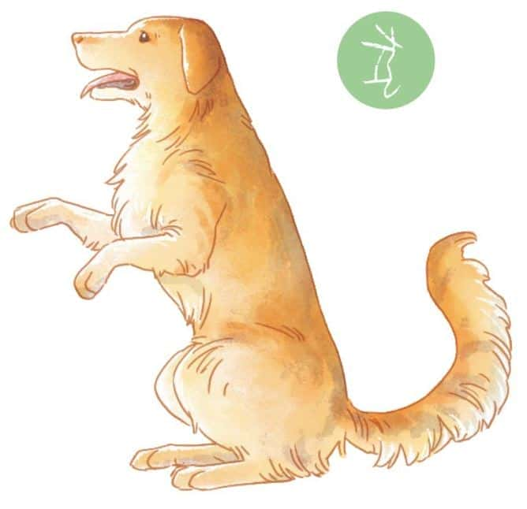

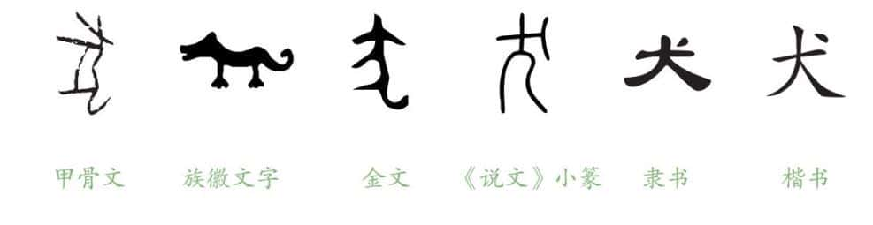

古人造“牛”字时，突出了向上的牛角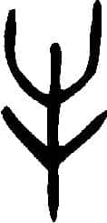；造“羊”字时，突出了弯弯的羊角；那古人造“犬”字时，又会怎样体现狗的特点呢？

你养过狗吗？小狗高兴的时候，会冲你摇尾巴，毛茸茸的尾巴翘起来，左摇右摆，十分可爱。因此，古人造“犬”字时，格外突出了狗尾巴——在甲骨文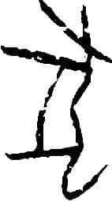中，“犬”就有一条弯弯的尾巴，仿佛在向你摆动一样。

“犬”字到了西周金文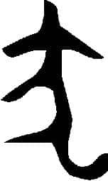，特别是在族徽文字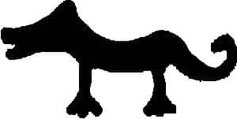里，变得特别形象，就是一只灵巧的、可爱的狗。再到小篆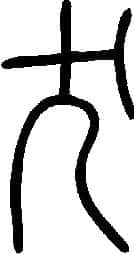，“犬”的字形开始变得抽象，但依旧能够看出小狗矫健的身形。

在汉语中，“犬”可以和不同的动物搭配。有一个成语叫“犬马之劳”，表示像狗和马一样为他人服务，这是一种谦虚的言辞。古代的臣子投奔君主，会说“愿效犬马之劳”，表示自己忠心耿耿、积极上进。

除了和马之外，犬和鸡也有不解之缘。有个成语叫“一人得道，鸡犬升天”[1]。

这个成语是什么意思呢？

相传汉代淮南王刘安[2]有很多修仙的朋友。他们一起炼丹，一起求仙。有一天，丹房里轰隆一声巨响，仙丹炼好了！淮南王吃了仙丹，飘飘摇摇，升天成仙。剩下的仙丹洒落在庭院里，家里的鸡和狗吃了，也都跟着升了天。古人用“一人得道，鸡犬升天”来形容一个人得势，他的亲戚朋友也跟着沾光。

虽然是个传说，但透过成语，我们能看出鸡和狗是一对难兄难弟——鸡犬不宁、鸡飞狗跳、鸡鸣狗盗……有这两种动物的成语，通常都不是什么好词。

还有一种动物，也可以和“犬”搭配使用，那就是天上凶猛矫健的老鹰。驯化了的鹰和犬，是打猎时的好帮手，“鹰犬”这个词，用于指受驱使、做爪牙的人。当然，这也不是什么好词。在武侠小说中，正义的侠客被朝廷追捕时，他们常会骂那些追捕者：“你们这些朝廷的鹰犬！”

### 狗/ 蜷缩一团的小狗 /

说完了“犬”，我们再来看“狗”字。

狗是人类的好朋友，很多人家里都有“汪星人”。但你有没有想过，“狗”和“犬”有什么区别呢？

在汉字中，“狗”左边的反犬旁来自“犬”字，右边是句号的“句”。“句”在古代也念gōu，表示蜷缩起来的样子。我们常用的句号，不就是一个紧缩成一团的小圈圈嘛。因此，“狗”在古代往往表示小狗，表示小狗缩成一团的样子。

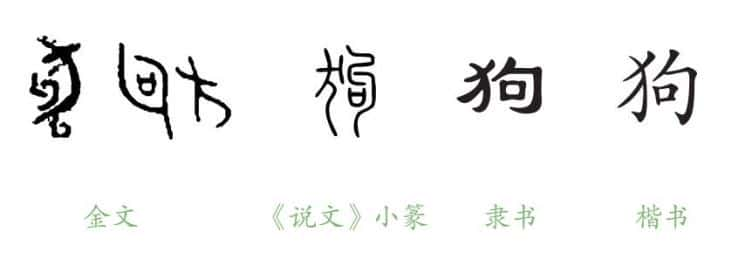

狗虽然可爱，对人忠心耿耿，但“狗”这个字却经常出现在贬义词里。有人仗势欺人，我们说他“狗仗人势”；有人一张嘴就说些难听话，我们说他“狗嘴里吐不出象牙”；有的朋友品行不端、不务正业，这叫“狐朋狗友”；有人小偷小摸，则叫“鸡鸣狗盗”；有人不顾廉耻、到处钻营，则是“蝇营狗苟”……

古人对狗的态度真是复杂，既关系密切，同时又充满鄙视。

到了今天，我们养狗不再是为了看家护院，更多的是一种心灵的陪伴。词语的发展演变和生活、文化密切相关，随着时间的推移，也许“犬”“狗”二字也会慢慢摆脱贬义的语言色彩呢。

* * *

[1] 出自东晋葛洪《神仙传·刘安》。

[2] 淮南王刘安组织门客撰写了《淮南子》。

## 莽·突·伏  
狗的动态和静态

上一讲讲了“犬”字和“狗”字，驯化了的小狗是打猎的好帮手，于是就有了“猎狗”一词。在这一讲，我将和你分享几个和猎狗有关的会意字——“莽”“突”“伏”。在这三个字中，都能看到猎狗的英姿。

### 莽/ 莽撞的猎狗 /

一个人鲁莽冒失，就是莽撞。问题在于，“莽撞”和“狗”有什么关系呢？

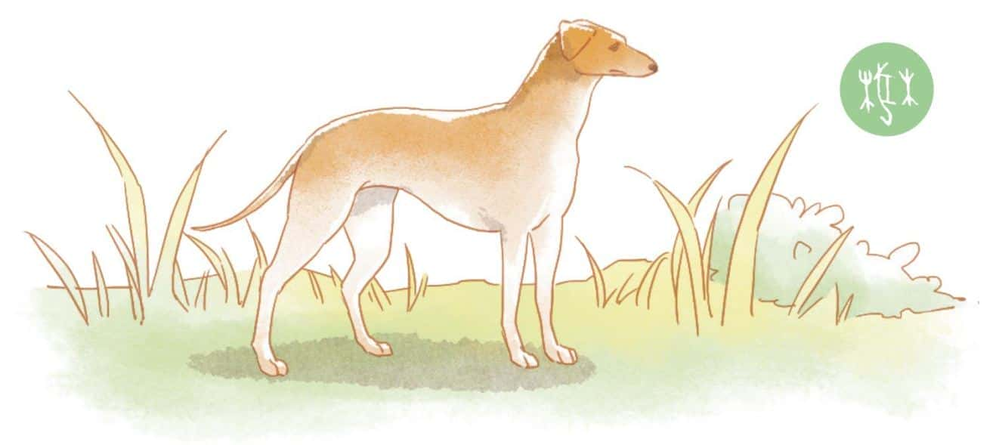

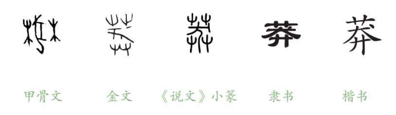

“莽”是一个古老的会意字，在甲骨文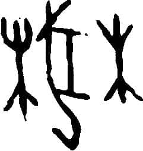中，左右两边各有一个“木”字，表示树木，中间是一个“犬”字。到了金文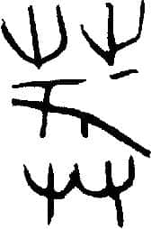中，左右的“木”字变成了上下的“艸”字，这是草的意思，中间的字仍然是“犬”。

“莽”就是一只狗藏在草丛中。这是什么意思呢？《说文解字》说：“南昌谓犬善逐兔艸中为莽。”意思是说，“莽”是南昌一带的方言，指的是善于在草丛中追兔子的猎狗。

正因为“追兔子的猎狗”有凶猛粗鲁的特点，我们才用“莽撞”指说话不注意，做事不小心，行为轻率粗鲁；用“鲁莽”表示说话做事不经考虑；用“莽夫”形容那些粗鲁冒失的人。

《水浒传》里有一个好汉叫李逵，长得很黑，外号“黑旋风”。这位“黑旋风”手拿两柄大斧，尽管讲义气，但打仗时不分好坏，一通乱砍，还会滥杀百姓，伤及无辜。这样的人，就是一个典型的莽夫。

### 突/ 什么是突然？ /

“突”也是一个会意字，你看这个字很有意思。

在甲骨文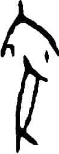中，上面是一个“穴”，下面是一个“犬”。到了小篆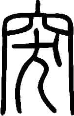，字形进一步规整，直到今天，“突”的写法都没有太大改变。

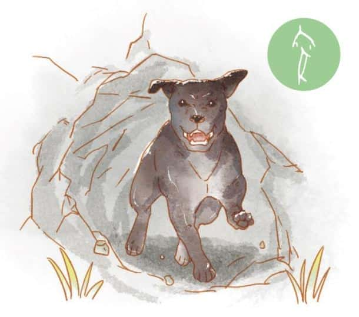

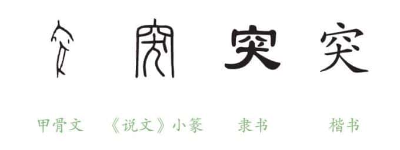

我们常说“突然”，什么是突然呢？“突然”和“犬”又有怎样的关联呢？

在《说文解字》中，许慎先生为我们解答了这一问题。他说：“突，犬从穴中暂出也。”“暂出”就是一下子冲出来。想象一下，你在山林里走路，看见前面有一个小山洞，一时好奇，想看看里面有什么。结果——“汪！汪！汪！”一只恶犬从洞穴里冲了出来。这种感觉真是太“突然”了。

“突”，就是凶猛的大狗从洞穴里冲出来的样子，表示意料不到的情形。

明白了“突”的本义，就能更好地理解“突”组成的词语。“突出”是比别人高出一大截；人与人之间有了矛盾，叫“冲突”；军队里冲锋陷阵的队伍，叫“突击队”……在这些词语中，都有一种勇猛的、格外突出的感觉。

### 伏/ 会埋伏的狗 /

“莽”和“突”都是狗的动态——无论是追兔子，还是冲出来吓人，都是奔跑中的狗，而“伏”描绘的则是静态的狗。

在金文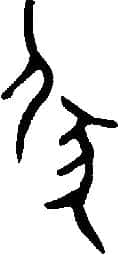中，“伏”的左上方是一个侧面站立的人，下面是一个“犬”字。到了小篆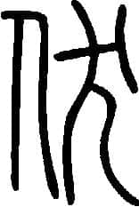，“伏”的写法稍有变化，左边是“人”，右边是“犬”，这种写法一直延续至今。

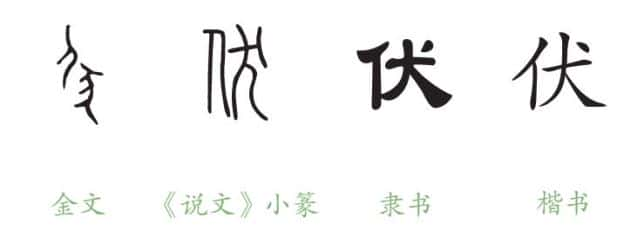

由一个人和一只狗组成的“伏”字到底是什么意思呢？《说文解字》说，“伏”的本义是“司也”。“伏”是一个会意字，“司”其实就是“伺”，也就是狗悄悄伏低，等有人经过的时候，伺机而动，冲出来咬一口。

正因如此，“伏”组成的词语有埋伏、潜藏的含义。写小说要有“伏笔”，在长长的故事中提前埋下一些线索；打仗的时候可以“伏击”，预先埋伏好的军队就叫“伏兵”——战士们先躲起来，等敌人经过时，再伺机发动进攻。

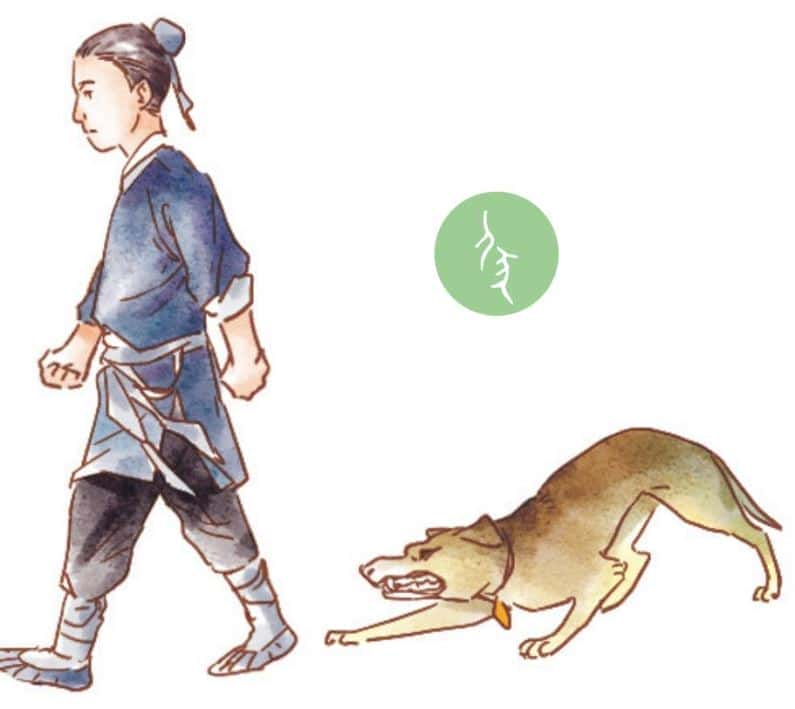

## 状·类  
狗的抽象含义

上一讲的“莽”“突”“伏”，刻画的是“犬”或动或静的具体形态，这一讲涉及的“状”“类”，则是由“犬”衍生出的含义比较抽象的字。

“状”用于“状况”“状态”，“类”用于“分类”“类别”。这两个字和犬有什么关系呢？在这一讲中，我将会揭晓答案。

### 状/ 狗的模样 /

形状、状态、状貌，都是在描述万事万物的样子。你有没有想过，为什么“状”和犬有关呢？

“状”是个形声字，“从犬，爿（pán）声”，“爿”是声符，“犬”是形符。许慎先生在《说文解字》中说：“状，犬形也。”“状”的本义是狗的形状。古人和狗的关系非常亲密，非常熟悉狗的样子，“状”进而由狗的形状引申为万物的形状。

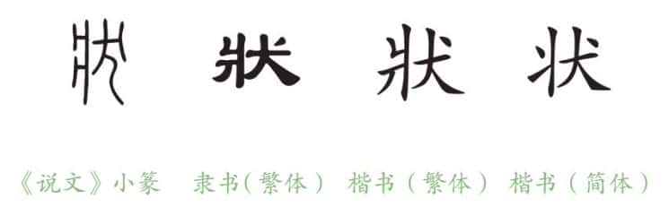

### 类/ 犬与世间万类 /

讲完“状”字，再来看看“类”字。

现在的“类”字，上面一个“米”，下面一个“大”。大米和类别有什么关系呢？而且仔细瞧瞧，在这个字中，也没有“犬”。

别急，“类”字里丢失的“犬”，在繁体字中就能重新找回。“类”的繁体字“類”，它的声符是“頪（lèi）”，形符是“犬”，依然与犬有关。

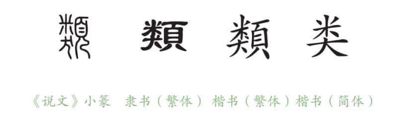

它们的关系是什么呢？许慎先生在《说文解字》中的解答是：“种类相似，唯犬为甚。”意思是在动物世界里，同一类别之间最相似的便是犬类了。猫和老虎都是猫科动物，但大小悬殊，长相各异；人类和猴子都是灵长类，但我们和猴子太不像了。唯有狗，无论是大狗还是小狗，胖狗还是瘦狗，猎犬还是中华田园犬……看上去都差不多，都属于同一类别。

因此，古人用“犬”来给类别的“類”造字。不过这个字写起来太复杂了，所以在汉字简化时，人们将“類”简化为“类”，丢失了“犬”，我觉得这个字简化得并不好。

动物世界中，有各种各样的类别，人类世界也是如此。

人和人之间的类别，可以来自先天，比如男和女不是一类；也可能来自社会，比如贫富贵贱的不同。在中国古代贵族掌权的时代里，阶层划分森严，贵族和平民百姓之间的鸿沟，是最大的“类”——出身权贵，就能学习文化、掌握大权；出身平民，则大多目不识丁、无缘朝堂。中国历史上的大圣人孔子，就生活在这样的时代。

那时候，教育资源被垄断在贵族手中，平民子弟想要读书识字，只能卑躬屈膝地侍奉贵族，在辛劳之余学习一点知识。孔子少年时期，为了读书求学，便经历了这样一番困苦。

孔子的爸爸叫叔梁纥，是春秋时期鲁国的大夫[1]，但他在孔子很小的时候就去世了。孔子和母亲相依为命，生活艰辛，求学问道更是艰苦万分。在《论语》中，记载了孔子少年求学时的一件往事：

子入大庙，每事问。或曰：“孰谓鄹[2]（zōu）人之子知礼乎？入大庙，每事问。”子闻之曰：“是礼也。”

大庙也就是太庙，这是贵族礼乐文教的中心。孔子在小的时候有幸进入太庙，帮助贵族操办祭祀，自然不会放过这个学习的好机会。他求知若渴，总是问来问去。

“咦，这个鼎为什么摆在这里啊？”

“哎，您为什么要行跪拜礼呢？”

……

小孔子问着问着，惹恼了正在祭祀的贵族。贵族生气地呵责他：“谁说叔梁纥家的儿子懂得礼仪啊，你看看你，什么事都问来问去，真烦人！”

小孔子自有一种不屈不挠的气度，他坦然答道：“这就是礼！”把礼仪的道理、规矩问清楚，这就是对“礼”最大的敬意。

孔子成年后，有感自己幼年求学时的艰辛，实在不忍心看到平民子弟求学无门。于是，孔子想了一个好办法，开门授徒，兴办平民教育，把知识与文化无私地传播出去。孔子有一句很有名的话——有教无类。

这是一句豪迈的教育宣言！在这里，“类”是类别，指的是一个人的身份地位。孔子的教育向所有人开放，一视同仁，不考虑弟子的出身和社会地位。在孔子的众多弟子中，颜回、原宪都是穷人家的孩子，但他们因为品格高洁、求学刻苦，都成了令人尊重的道德君子。

* * *

[1] 大（dà）夫是官职的名称。

[2] 地名，在今山东曲阜东南。

## 独  
独行的狗

讲羊的时候，我们认识了“群”，现在讲讲它的反义词——“独”。“独”字里有个反犬旁，说明它和“犬”有关。

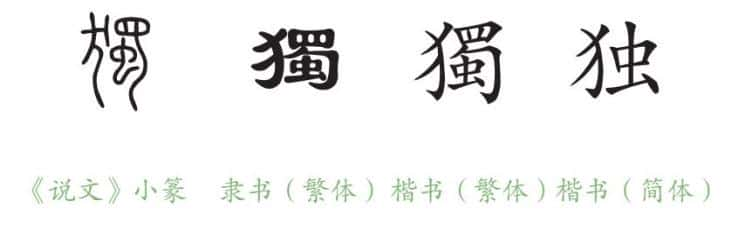

“独”的繁体字写作“獨”。在小篆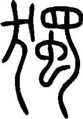中，“獨”的左边是“犬”，右边是蜀国的“蜀”，“蜀”的读音和“独”相近，因此，“獨”是一个从犬蜀声的形声字。从小篆到楷书，它的字形没有发生大的变化。到了现代，右边的“蜀”简化成“虫”，“獨”也就变成了今天的“独”。

“独”和“犬”有什么关系呢？

《说文解字》将“独”解释为“犬相得而斗也”。两只狗相遇，会“汪汪汪”乱叫，好像要打起来，这就是“犬相得而斗也”。小狗总爱打架，不是十分合群，因此总是独来独往、特立独行的。

与合群的羊不同，狗喜欢相斗，经常独来独往。许慎先生注意到羊和犬的区别，他说：“羊为群，犬为独也。”羊的特点是群居，狗的特点是独居。这种区别也体现在造字中：“羊”构成了“群”，“犬”构成了“独”。

在汉语中，“独”可以组成很多词语：不依靠别人叫“独立”；总是一个人太“孤独”；每个人既要“独立思考”，又要多交朋友，学会乐群；如果一个统治者，什么事都自己说了算，这叫“独裁”；如果一个人只按照自己的想法做事，完全不听别人的意见，这叫“独断专行”。

中国古人还有一个说法，叫“慎独”。这是什么意思呢？

这是一个很“高级”的词，是儒家提倡的一种道德境界。《中庸》提出“君子慎其独也”。当我们和别人在一起时，做事会守规矩。但一旦独自一人，没有了外在的制约，自己的思想与行为都不会被人看见，就可能做坏事、犯错误。所以，重视道德修养的古人强调“独”自一个人的时候，自己的言行更要“慎”重，用高度的自律约束自己。在一个人独处无人注意的情况下，仍能自觉地遵循道德修养，这就是“慎独”，是古代君子的一种宝贵品质。

## 狂·狷  
与狗有关的品性

“狂狷”是古人重要的品德之一。真奇怪，这两个字看起来很张狂的样子，为什么会是好词呢？它们和“犬”又有什么关系呢？

### 狂/ 可怕的狂犬 /

“狂”“狷”这两个从犬的字，代表了人的两种性格特点。

先来看“狂”字。在甲骨文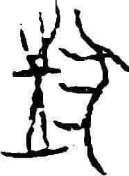和金文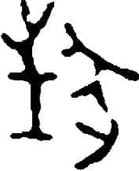中，左边是“王”，这是它的声符，右边是“犬”，这是它的形符。“狂”是一个形声字，最开始是右形左声。随着汉字的发展，小篆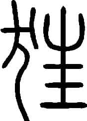变成了形符在左，声符在右。这个写法从小篆、隶书一直延续到今天。

“狂”是什么意思呢？

《说文解字》说：“狂，狾（zhì）犬也。”“狾”是疯狂的意思，因此，“狂”最开始表示狂犬，也就是发疯的狗。古人早已意识到狂犬的可怕，《左传》中记载，如果出现了狂犬，所有老百姓都会拿起棍棒，一起把它赶出城。《汉书》则说，在干旱的年份狗容易得狂犬病。发疯的狗眼睛红红的，流着口水，看见人就要“汪汪”乱咬，人们看见这样的狗都很害怕，老远就躲开了。

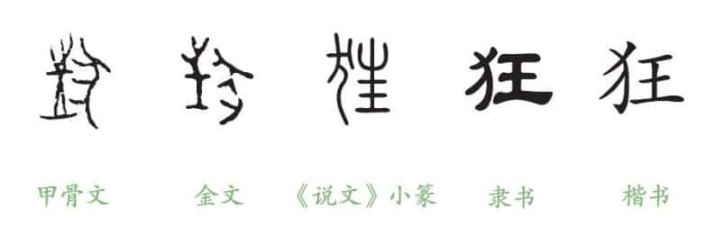

因此，“狂”就是狗发疯的状态，引申出疯狂、狂躁的意思。

在汉语中，“狂”能组成很多词，大都有强烈、失控的特点。比如“狂风”是特别猛烈的风，“疯狂”指人的精神与行为失去了控制；一个人像狂犬一样乱咬人，态度嚣张跋扈，不把别人放在眼里，这叫“狂妄”。除此之外，发疯的狗还有一个特点——不服管束。因此，“狂”还可以表示无拘无束的状态。比如每年的圣诞节狂欢夜，从字面上看，“狂欢夜”就是一个彻底自由、没有束缚的夜晚——疯起来，像快乐的小狗一样。

### 狷/ 性情高洁 /

“狷”字读作juàn，在今天并不常见。《说文解字》里说：“狷，褊（biǎn）急也。”意思是一个人心胸狭窄，又容易着急。

“狷”与“狂”两个字都不算太好，但它们在一起能组成一个很好的词——“狂狷”。这个词是什么意思呢？又好在哪里呢？

狂狷是古人的重要品德，它的含义，还要看孔夫子的解释。

在《论语》中，孔子说：“不得中行而与之，必也狂狷乎！”他的意思是，如果不能和那些做事恰到好处的人共事，那我一定会挑选那些狂者和狷者。

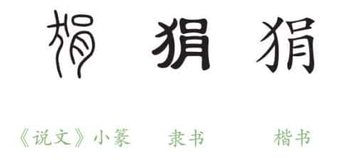

为什么呢？孔子紧接着解释说：“狂者进取，狷者有所不为也。”

在孔子看来，“狂者”是激进的，他们在道德和事业上拼命进取，尽管可能志大才疏——理想很丰满，现实很骨感，但他们一直在积极地改造自己、改造世界，古代很多侠客就是如此。

“狷者”呢？他们为人清高，不像狂者那样主动热情地去做一些好事，但却有自己高洁的操守，绝对不和坏人同流合污，这就是“有所不为”，古代很多隐士就是如此。

“狂”和“狷”代表了两种生命态度——“狂”指的是努力进取，“狷”指的是消极无为。和兼具两种品质的“中行之士”相比，他们显得有些偏激。但孔子为什么赞赏这些有缺点的人呢？

因为他们都是真性情的人！在这个世界上，总有一些“好好先生”，他们善于附和别人，看起来既得体、又合群，但实际上却没有自己的追求和原则。在孔子看来，哪怕是过于激进、不太合群，也远远胜过那些虚伪的“好好先生”。

你看，孔夫子并不是一个教条主义的人，他欣赏性情中人，这种生命中真诚的意气，是儒家重要的精神追求。

## 狐  
有灵性的狐狸

讲完了忠诚可爱的狗，我再来介绍一种聪明伶俐有灵性的动物——狐狸！

“狐”字的历史非常悠久。

在甲骨文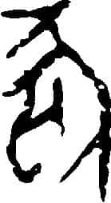中，“狐”是一个形声字，左边是声符“亡”，它的古音和“狐”相近。右边是形符“犬”，说明这是一种和狗有点像的小动物。随着汉字的发展，人们替换了“狐”的声符，小篆中的“狐”从犬，声符变成了“瓜”，这种写法一直延续至今。

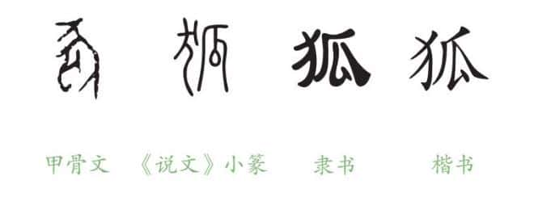

在《说文解字》中，许慎先生总结了狐狸的三个特点：第一，“其色中和”，狐狸的皮毛是黄色的，在古人眼中，黄色是各种色彩调和出的颜色，所以是“中和”；第二，“小前大后”，狐狸鼻子尖，尾巴大，前面小，后面大；第三，“死则丘首”，狐狸不忘本，如果死在外面，一定会把头朝向洞穴的方向，是一种有灵性的动物。所以，古人也用“狐死首丘”比喻不忘本或怀念故乡。

狐狸的灵性，赋予了这种动物神奇的幻想色彩。古人常将狐狸与鬼怪并谈。《说文解字》中说：“狐，妖兽也，鬼所乘之。”意思是说，狐是一种妖兽，是鬼的坐骑。除此之外，还有很多狐仙、狐狸精的传说。比如古书《抱朴子》[1]记载，狐狸过了三百岁，就能变成人的样子；清代文学家蒲松龄写了一本《聊斋志异》，里面也讲了很多关于狐仙的故事。

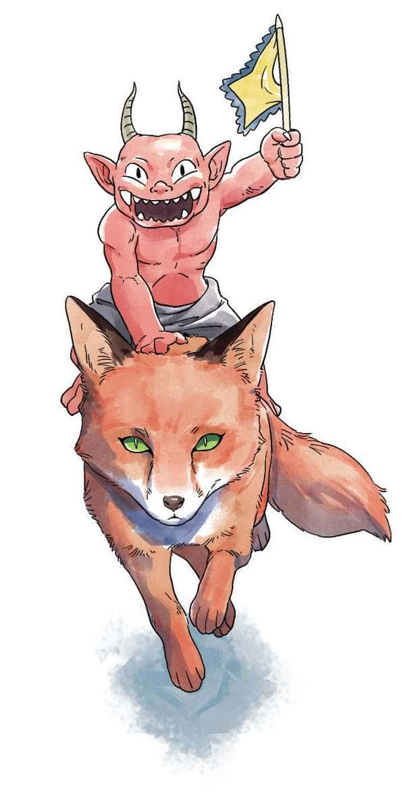

在古人眼中，狐狸是一种狡猾的动物，这也反映在和“狐”有关的词语中。狐狸看上去鬼鬼祟祟的，心思很多，因此有个词叫“狐疑”——像狐狸一样多疑。狐狸也用来指称坏人，“狐朋狗友”指的就是那些给你出坏主意的朋友。

还有一个成语叫“狐假虎威”。很多人以为这个故事来自国外的《伊索寓言》，其实它出自我们中国的《战国策》。

楚宣王有一天问大臣：“听说北方诸侯都害怕楚令尹[2]昭奚恤，这是真的吗？”

古人喜欢用故事讲道理。大臣江乙就给楚宣王讲了“狐假虎威”的故事。

在大森林中，老虎捉到一只狐狸。狐狸骗老虎说：“你知道吗？上天派我掌管百兽，你吃了我，就违背了上天的命令。不信的话，你跟我在森林里走一圈，大家看到我都会吓得逃走！”

老虎半信半疑地跟在狐狸后面，小动物们见了，纷纷逃走。老虎上了狐狸的当，不知道动物们真正害怕的是自己，狐狸不过是借着自己的威风罢了。

讲完了故事，江乙继续说道：“大王有百万大军，国土方圆五千里，但由昭奚恤独揽大权。这就像百兽怕的不是狐狸而是老虎一样，北方诸侯不是害怕昭奚恤，而是害怕大王您呀。”

* * *

[1] 《抱朴子》的作者是东晋的葛洪。葛洪，号抱朴子，是东晋著名的思想家，也是一名道士，喜欢研究道家的长生之术。《抱朴子》的主要内容是神仙方药、鬼怪变化、养生延年等，反映了作者内神仙而外儒术的思想。

[2] 令尹是春秋战国时楚国独设的官职，是楚国的最高官职，掌握军政大权。

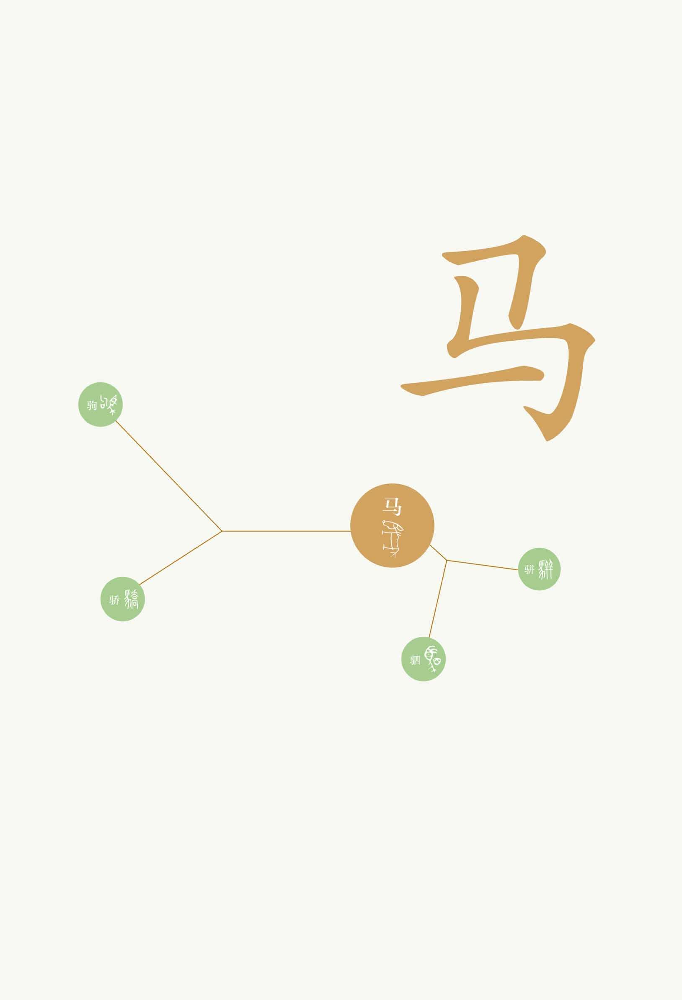

## 马·骄·驹  
大马为骄，小马为驹

在《说文解字》里，《马部》收字100多个，极其丰富，马的毛色、优劣、性别、脾性、年龄、高矮等，均有对应的汉字。以颜色为例，“驳”指马的毛色驳杂不纯，“骓”指毛色苍白相间的马，“骊”是纯黑色的马……造字的丰富性，体现出马对于古人的重要意义。不过随着马在人类生活中的作用不断减弱，很多相关的字在字典里沉睡，甚至消失在历史的尘埃里。

在这一讲，我将给大家介绍“马”字，以及由马匹大小衍生出的“骄”“驹”二字。

### 马/ 飞奔的千里马 /

“马”是个象形字。善于观察自然的古人，在这个字里画下了马的哪些特征呢？长长的马脸，善于奔跑的长腿，又大又漂亮的尾巴，马背上飘逸的鬃毛——这些特征，在甲骨文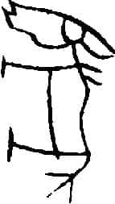中都形象地表现了出来。从甲骨文到金文、小篆，再到后来的隶书、楷书，“马”字越来越抽象，但鬃毛、长腿的特点，始终有所保存。

在古代，马是坐骑，能带着古人驰骋天涯，所以，有“快马加鞭”“马不停蹄”“走马观花”等与速度密不可分的成语。同为坐骑，马有优劣，有跑得慢的“驽（nú）马”，也有日行千里的“千里马”。千里马不常有，所以人们用“千里马”来形容难得的人才。古人钟情好马，在历史上留下了很多关于千里马的典故。比如下面这个“千金市骨”的故事。

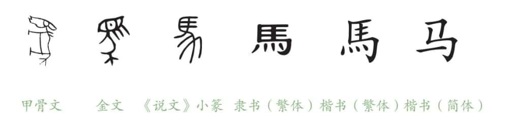

古代有一个国君，特别想拥有一匹千里马，找了三年而不得，便下令说：“谁能买来千里马，我重重有赏！”

有一个内侍说：“我行！但要黄金千两！”

虽然整整一千两黄金的价格很高昂，但这位国君特别想要千里马，咬咬牙还是答应了。结果，这位内侍花了五百金，只带回来一副千里马的骨架。

国君勃然大怒：“让你买千里马，你却花了五百金带回一匹死马，你当我傻吗！”

不料内侍从容答道：“大王，请放心！您连千里马的骨架都舍得花这么多钱，这说明什么？说明您真心爱马！这事要是传出去，一定会有人主动向您献马的！”

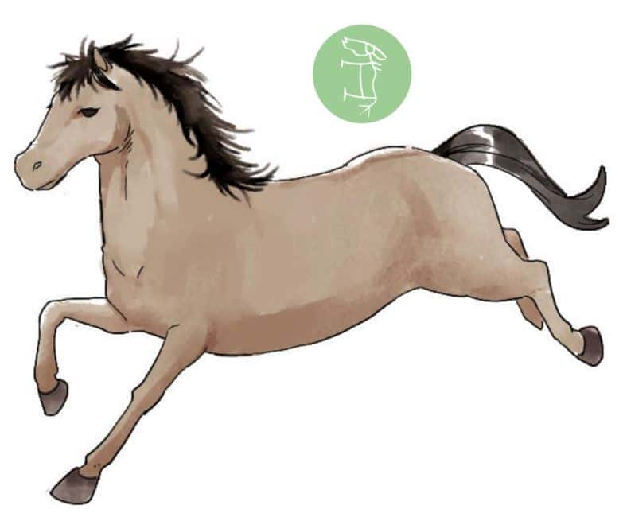

国君半信半疑，没过多久，竟和内侍说的一样，好几匹千里马被送到国君面前。这个故事告诉我们，只要诚心求才，人才一定会来到你这里。

有了人才，还要有辨别人才的眼睛。古人说：“千里马常有，而伯乐不常有。”那“伯乐”是谁呢？伯乐就是能识别千里马的高手。

有一次伯乐出门，遇见一匹吃力拉车的瘦马，骨瘦如柴，非常憔悴。伯乐看着它，不禁伤心落泪：“这是一匹千里马啊！怎么沦落到这个境地？”

听到伯乐的话，马低下头，猛地喷气，抬起头，长鸣不已，苍凉的嘶鸣一直传到天上。人们这才知道，这果然是一匹非同寻常的马！

伯乐识马，所以我们也经常用“伯乐”来比喻善于识人和举荐人才的人。

### 骄/ 骄傲的高头大马 /

“骄傲”是个常见词，可你有没有想过，为什么“骄”的左边是一匹马呢？

“骄”是个“从马乔声”的形声字，许慎先生在《说文解字》中这样形容，“马高六尺为骄”。古尺比今天的尺短，大概是23厘米左右[1]，身高在1米4左右的马，在古代叫作“骄”——从这个高度来看，古代无论人的身高还是马的身高，都和今天差了不少。

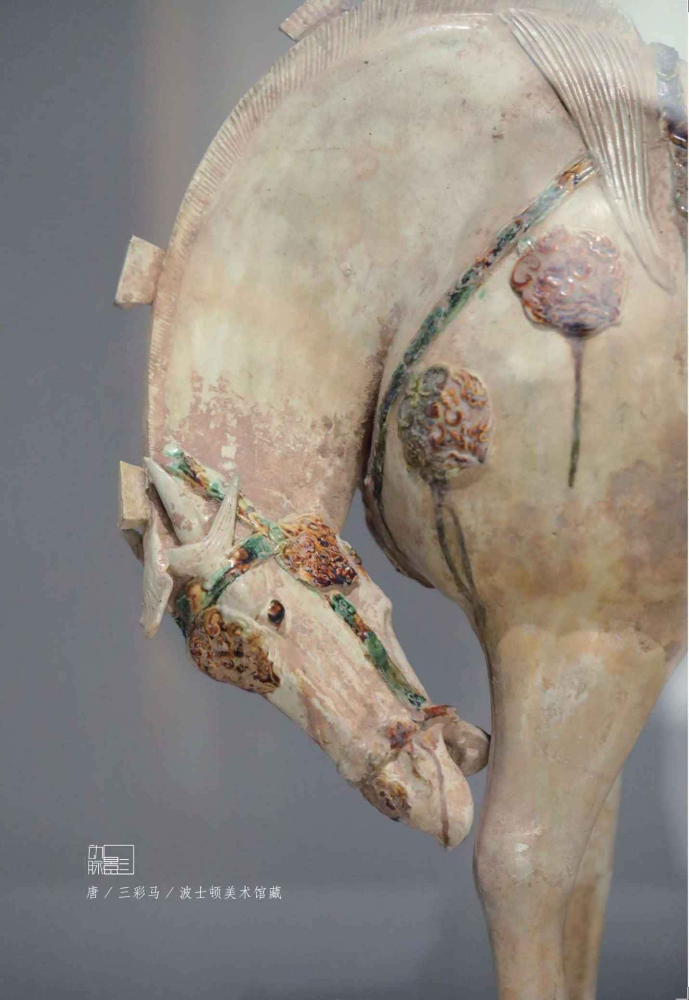

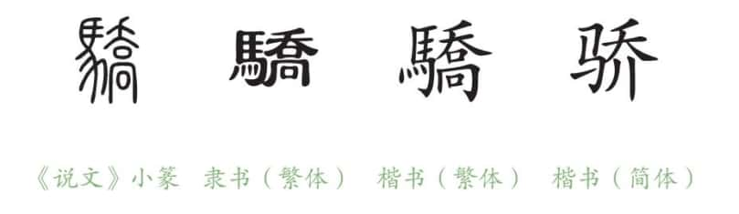

“骄”比一般的马更为高大，身高腿长，傲视群伦，因此被用于“骄傲”的“骄”。古人推崇谦虚，不喜骄傲，为人要“泰而不骄”，求学要“不耻下问”，胸怀要“虚怀若谷”……这种道德追求与修养体现在为人处世的方方面面，甚至连称呼的细节上也强调自谦——他们称自己是“鄙人”“不才”，对外称妻子为“贱内”，称儿子为“犬子”。对古人而言，“骄”可不是什么好字眼，衍生出的词也多有贬义色彩，比如“骄横”“骄纵”“骄奢淫逸”“志骄意满”等。

### 驹/ 前途无量的小马驹 /

“骄”是高头大马，古人又是怎么称呼小马的呢？

古人将小马称作“驹”，许慎先生在《说文解字》中用“马二岁曰驹”来解释“驹”。“驹”指的是两岁大的小马[2]，它是一个“从马句声”的形声字。

之前讲“狗”字时说过，“句”在古代也念gōu，表示蜷缩起来的样子。在汉字中，含“句”的字大多有弯曲的意思，比如，佝偻的“佝”，老人的背就是弯弯的；句号的“句”，句号也是弯弯的一个圈。马驹是小马，它刚出生的时候，也是蜷成一团的样子。

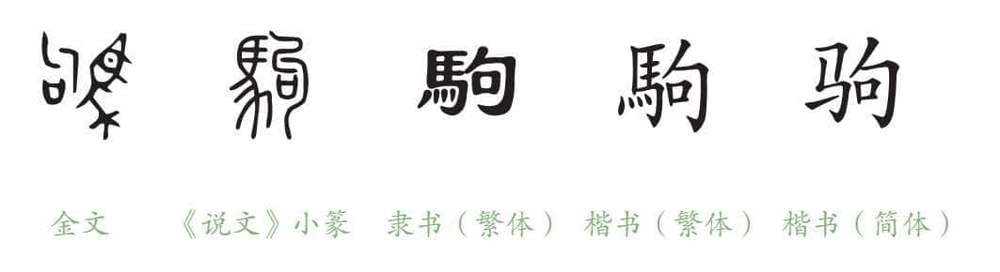

有千里马，自然有小千里马，古人把有希望、有前途的年轻人称作“千里驹”，也就是未来的千里马。在《三国志·魏书·曹休传》中，曹操曾经称赞曹休[3]说：“此吾家千里驹也！”意思就是说曹休是曹家未来的千里马。

* * *

[1] 现代的一尺，约为33厘米。

[2] 不同年岁的马在古代有不同的专称。

[3] 曹操的族子，魏国名将。

## 骈·驷  
马车与文章

相比“骄”“驹”，这一讲的“骈”（pián）“驷”（sì）二字比较陌生。在古代，它们与古人的交通生活密不可分。古代没有电动车、自行车，马奔跑的时候鬃毛飞扬，俊逸潇洒，神采英拔，是古人最重要的交通工具，可以骑乘，也能拉车。“骈”“驷”二字，便由此而来。

### 骈/ 马车和骈文 /

先看“骈”字，这是一个“从马并声”的形声字。左边一个“马”，表示“骈”和马有关；右边是声符“并”，提示读音。

许慎先生在《说文解字》中说：“骈，驾二马也。”意思是驾两匹马的马车就是骈。

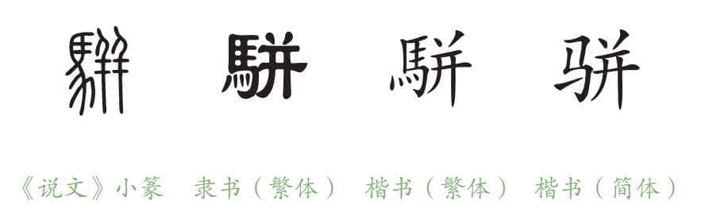

那么，古代的马车是什么样子的呢？

先秦马车的结构非常清晰，有车厢、车轮、车辕，装在车辕上的一根横木，叫作衡，衡的两边各有一个轭（è），用来架在马脖子上。两匹马拉的车，就叫作“骈”。

在今天，我们很少用到“骈”的本义，一来马车很少见，二来就算见到“骈”字，我们更容易想到的不是马车，而是骈文。

骈文是古代的一种重要文体。也许，你还没有读到过骈文，但我一讲你就会发现，骈文和我们的语文学习密不可分。

“骈”指的是两匹马并列拉车，这种状态，特别像汉语中的对偶句。什么是对偶呢？就是两个对称的句子。比如，过年的时候，家里要贴春联，春联的特点就是两两相对。你看：

东风吹出千山绿

春雨洒来万象新

这是一个标准的春联，“东风”对“春雨”，“吹出”对“洒来”，“千山”对“万象”，“绿”对“新”——整整齐齐，彼此相对，这就是对偶。

在古诗中，对偶是一种重要的修辞方式。比如，大诗人杜甫的《绝句》：

两个黄鹂鸣翠柳，一行白鹭上青天。

窗含西岭千秋雪，门泊东吴万里船。

诗中，“两”和“一”是数量；“黄”和“白”，“翠”和“青”都是颜色；“鹂”和“鹭”都是鸟；“鸣”和“上”都是动态；“柳”和“天”相对应。这种句式，就像两匹马并排拉车一样，两相呼应，整整齐齐，这就是“骈”。骈文，就是使用了大量对偶句的文章。在文学史上，骈文起源于汉魏，盛行于六朝，到唐朝时开始有“骈文”的名称，通篇讲究工稳对仗、句式整齐、平仄协调、音律和谐，使得它朗朗上口，优美动人。比如，唐代大诗人王勃的名篇《滕王阁序》里，就有很多对仗精巧的句子：

落霞与孤鹜（wù）齐飞，秋水共长天一色。渔舟唱晚，响穷彭蠡（lǐ）之滨；雁阵惊寒，声断衡阳之浦。

这些句子，也许你还不能完全读懂，但可以试着朗诵一下，感受语言中铿锵悠扬的韵律之美。读这篇文章，仿佛登上了高高的滕王阁，远望秋江万里，大千美景尽收眼底……

### 驷/ 一言既出，驷马难追 /

“骈”是两匹马驾车，是小马车。大一点的马车要用四匹马，就是“驷”。

“驷”也是一个形声字，从马四声，“四”用于表音，也表示四马拉车。许慎先生在《说文解字》中说：“驷，一乘（shèng）也。”“乘”是古代的马车单位，“驷”是标准的马车配置。四匹马各有分工——中间两匹叫服马，负责用力拉车；左右两匹叫骖（cān）马，主管左右拐弯。人们常说的“一言既出，驷马难追”，意思是说出口的话连四匹马的马车都追不上，表明话说出去，绝不后悔。

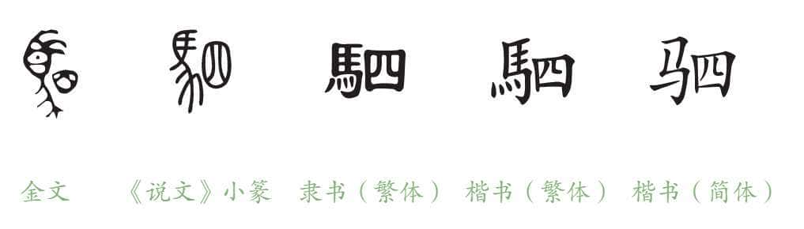

在古代，马车有两种重要的功能。

一种是社会阶级、财富、地位的象征。在古代，人的身份等级不同，车驾的等级也就不同。天子的座驾等级最高，在“驷”之外，还有六马车驾，所谓“时乘六龙”——六匹骏马，犹如六条蛟龙，充分彰显出君王的威严气度。

另一种功能是用于战争。在春秋时期以车战为主，通常一驾马车上有三名战士，中间的是驭手，也就是驾车的司机；左边的叫“车左”，负责射箭；右边的叫“车右”，一般由大力士担当，是作战的主力，持矛，主击刺。马车后面配有七十二个步兵。三个车手，加上七十二名步兵，总共七十五个人，这是先秦战争中的基本作战单位——“乘”。

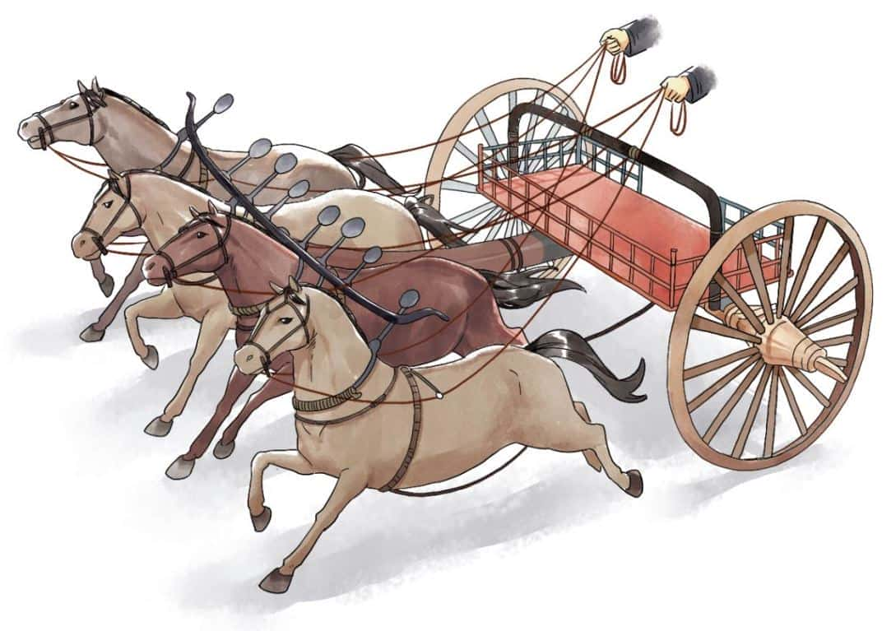

拥有多少战车，是衡量一个国家军事实力的重要标准。所谓“千乘之国”，就是有一千辆战车的国家。算起来，这个国家至少有七万五千人的兵力，在当时来说是十分强大的。而“万乘之君”——拥有一万辆战车的君王，更是当之无愧的天下霸主。

正因为车马在政治和军事上的重要性，自商朝晚期开始，帝王的墓葬中有车马葬，车马要随着君王生命的结束，一同前往死者的世界，继续服务和护卫君王。

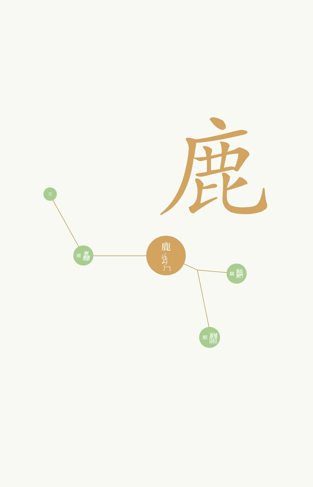

## 鹿·尘  
轻盈的小鹿与飞扬的尘土

在中国文化里，鹿被同时赋予了政治色彩和神话色彩。鹿不仅出现在几千年前仰韶文化的彩陶上，也跳跃在刻有甲骨文的兽骨上；不仅出现在西周初期盛酒的青铜器貉子卣（yǒu）上，也能在《诗经·小雅·鹿鸣》里看到……

在这一讲中，我将介绍汉字中的“鹿”字，还有和它密不可分的“尘”字。

尘土的“尘”和“鹿”又有什么关系？别急，这个故事还要从一头灵巧、美丽的小鹿说起。

### 鹿/ 轻盈跳跃的小鹿 /

在大自然中，鹿的身姿轻盈，这个特点在汉字中也有所体现。

“鹿”是一个标准的象形字。在甲骨文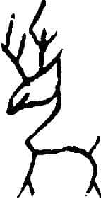和金文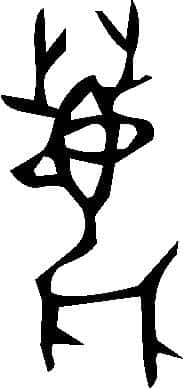中，“鹿”字突出了高大的犄角，轻盈的身形，和我们之前看到的“犬”“马”等都不一样。许慎先生在《说文解字》中说，鹿“象头角四足之形”。仔细看小篆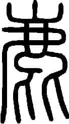，上面的鹿角和鹿头，下面的四条鹿腿，还能依稀辨别。到了楷书，“鹿”的四条腿抽象成了“比”，已经看不出象形的样子了。

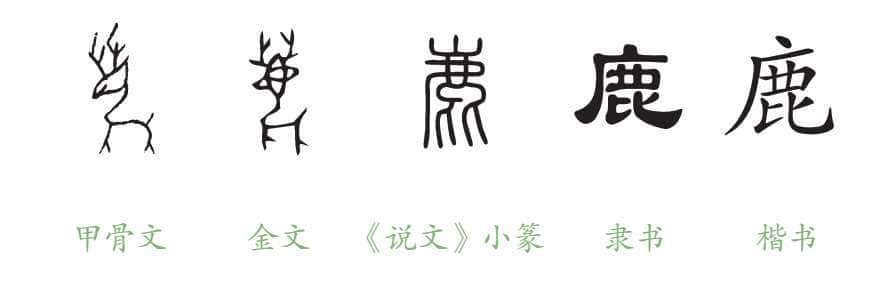

在中国文化里，“鹿”有一个很有意思的政治内涵。有一个成语叫“逐鹿中原”，指的是古代英雄豪杰争夺天下。问题在于，世界上有那么多奇珍异宝，争夺天下为什么要称作“逐鹿”呢？这其实体现出了鹿在古人心中的地位。

和虎皮一样，鹿的皮毛色彩斑斓，十分美丽。在先秦，鹿皮是做客时的常备礼物，也是结婚时少不了的聘礼。另外，“鹿”有非常好的谐音。众所周知，中国人特别重视谐音，比如，我们喜欢8，不喜欢4，因为8的谐音是“发达”“发财”的“发”，而4的谐音是不吉利的“死”。汉字中的同音字很多，但找不出一个和“死”同音的字，这便是谐音带来的忌讳。“鹿”的谐音是“福禄寿喜”的“禄”。“禄”是上天赐予的好运气，也是俸禄，把鹿皮作为礼物，就有了送“禄”的寓意。

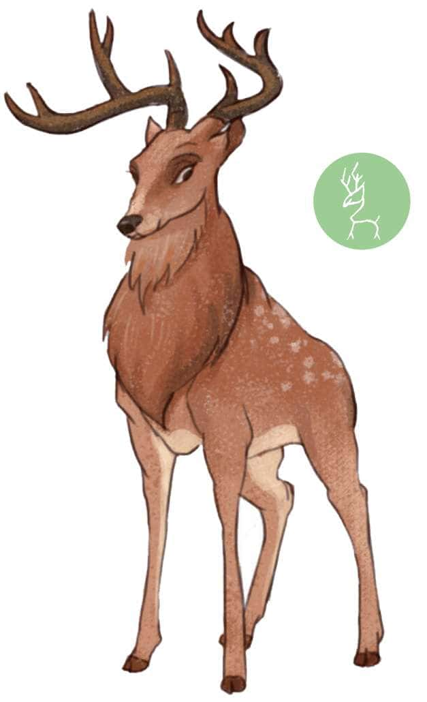

但是，鹿跑得太快，它象征的“禄”很难追到手。因此，古人用“鹿”比喻政权，这是要追逐的对象。秦朝末年，群雄并起，争夺天下，《史记》记载“秦失其鹿，天下共逐之”，谁抓住了这头鹿，谁就是天下的主人。这个典故后来衍生出成语“逐鹿中原”。汉末的曹操、刘备、孙权、袁绍，隋末的李渊，元末的朱元璋、陈友谅，都是逐鹿中原、争夺天下的豪杰。

除了政治内涵，鹿还有神话色彩。鹿角春生秋落，恰好对应着四季更迭、生死循环。鹿徜徉于林木之间，率真自由，又贴合道家对归隐山林、遁世升仙的向往。因此，鹿慢慢发展为避世修仙的象征，也成为神话传说中祥瑞辟邪的灵兽，成了仙人的坐骑。

### 尘/ 鹿群扬起的尘土 /

讲完了“鹿”字，我们再看看“尘”字。这个字和“鹿”有什么关系呢？

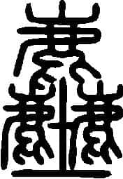是小篆中的“尘”字，上面三头小鹿，下面一个“土”。许慎先生在《说文解字》中说：“尘，鹿行扬土也。”一群姿态轻盈的小鹿奔跑时扬起尘土，古人根据这个意象，造出了尘土的“尘”。

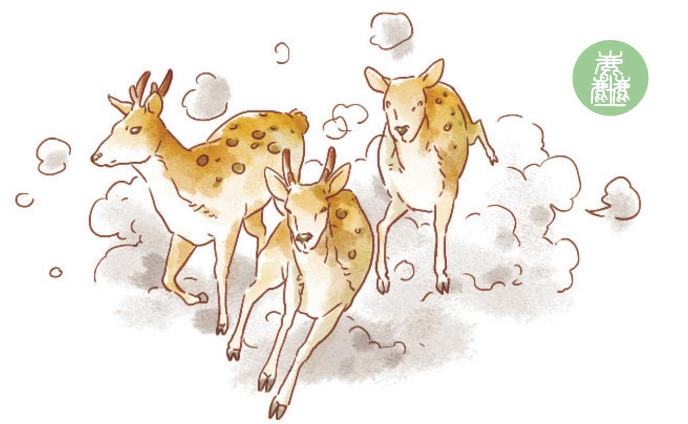

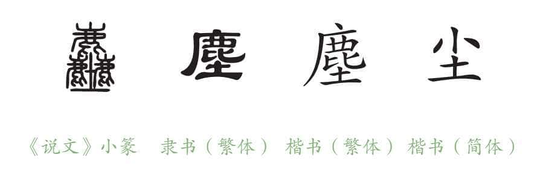

这个字非常形象，但有一个缺点，太难写了。因此，字被不断简化：先是上面的三头小鹿，简化为一头，写作“塵”，毕竟一头奔跑的小鹿也能扬起尘土。后来，图省事的人们干脆把上头的“鹿”字换成了“小”字，这个字的造字思路也随之彻底改变——小是灰尘的特点，小土为尘，也讲得通。

从“尘”字的演变历史中，我们能看到汉字发展的规律：追求简化，追求书写的便利。

## 麒·麟  
神兽和鹿有什么关系呢？

轻盈的鹿是古人心目中美丽珍贵、富有灵性的动物，在造字时，“鹿”与美好的神兽也有着千丝万缕的联系。这一讲的主角便是神兽麒麟。

“麒”“麟”两个字左边都是“鹿”，右边分别是“其”和“粦”（lín），表示“麒”“麟”的字音，这是两个典型的形声字。麒麟是深受古人喜爱的神兽，有很高的地位。《孟子》中说，麒麟在众多走兽中“出于其类，拔乎其萃”。我们今天还用“出类拔萃”形容一个人特别优秀。

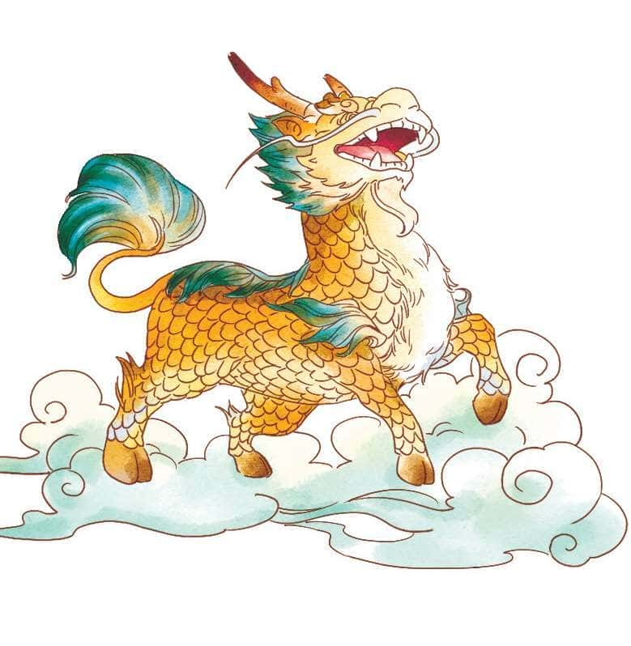

在古人心中，麒麟是怎样的动物呢？为何会有这么高的地位呢？首先，麒麟是集大成的动物。根据古书记载，麒麟的角像鹿，尾巴像牛，身体像麋鹿，身上还披挂着一层鳞甲。在麒麟身上，我们能看到各种动物的影子，集百兽之大成。

其次，麒麟还是一种心怀仁爱的动物。古人说麒麟“设武备而不为害，所以为仁也”，意思是麒麟有角作为武器，却不随意伤害他人，体现出仁爱的品质。

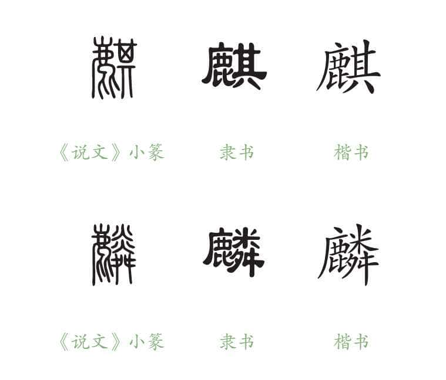

正因如此，古人将麒麟看作吉祥的神兽、盛世的象征，将它们绘制在“麒麟送子”“麒麟献瑞”等吉祥图样里，造成青铜塑像摆放在宫殿里，也绣在古代官员的官服上[1]。

麒麟在典籍中留下很多传说，其中有一个与孔子有关——它曾引得圣人孔子落下了伤感的眼泪。

孔子晚年时不再周游列国，而是回到自己的家乡鲁国，对以前史官编的史书进行整理和修订，这就是著名的《春秋》。孔子眼中的历史，是一个不断堕落的过程——礼崩乐坏，人心不古，儿子杀害父亲，臣子伤害国君。天下大乱，莫过于此。

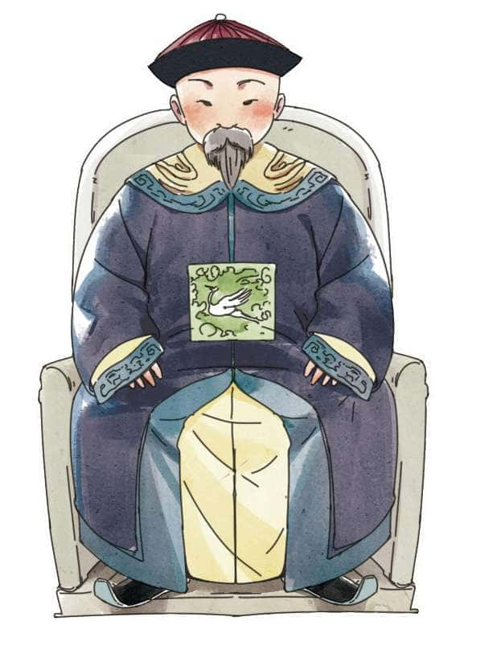

孔子越写心情越低落，这样一个乱世，何时是个头呢？百姓的苦难，什么时候才能结束呢？

有一天，一群人闹哄哄地来到孔子的面前：“您看看，这是什么动物？”

原来，鲁国贵族孙叔氏的手下抓住了一只很特别的怪兽。孔子一看，狮头、虎眼、龙鳞、鹿角，这不是麒麟吗？这种神兽一般不会出现在乱世之中。孔子心中感慨极了，麒麟啊麒麟，在乱世之中，没人认得你、尊敬你，你还要承受被捕捉的屈辱，你来做什么呢？

孔子也由此想到了自己，自己的一生不也是如此吗？怀抱仁义理想，周游列国，想要改变这个黑暗混乱的世界，却只收获了颠沛流离，饱经困苦，礼崩乐坏依旧……

想到这里，孔子潸然泪下，从此不再编写《春秋》——现实让人绝望，历史让人无奈，还写什么呢？这就是“绝笔于获麟”的典故。在这个典故中，透露出孔子身处乱世最深刻的无奈与失望。就在“绝笔于获麟”的两年之后，孔子也永远离开了这个世间。

* * *

[1] 明清官员官阶不同，官服上绣的图样也不同。明代规定九品文武官员衣服上的图样分别为：文官用鸟类，一品仙鹤，二品锦鸡，三品孔雀，四品云雀，五品白鹇，六品鹭鸶，七品（xī chì），八品黄鹂，九品鹌鹑；武官用兽类，一品和二品狮子，三品老虎，四品豹，五品熊，六品和七品彪，八品犀牛，九品海马。公、侯、伯与驸马则用麒麟、白泽。

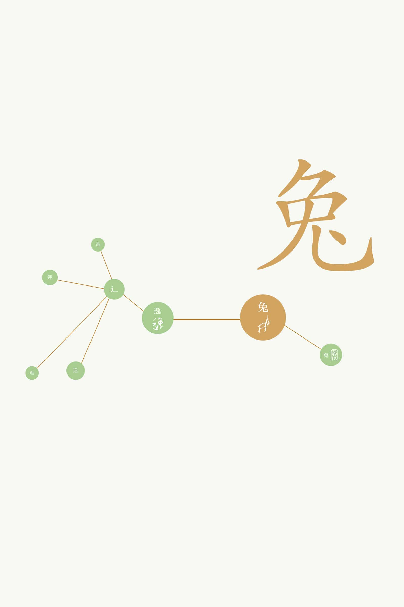

## 兔  
画一个“兔”字

兔子性格温顺、灵巧可爱。“兔”在甲骨文中的字形是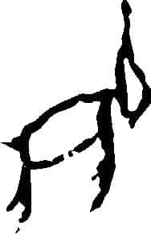，这是一个标准的象形字。

古人在造这个字时，突出了兔子的长耳朵，以及短短的、绒绒的小尾巴，真是惟妙惟肖的一个字！

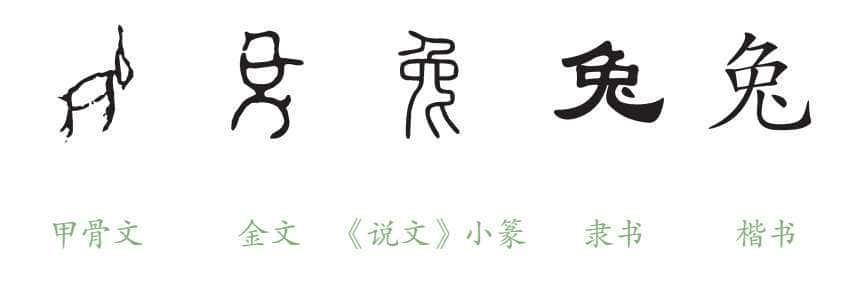

随着汉字的发展，到了小篆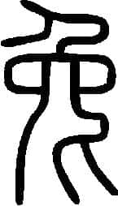，“兔”的象形有所减弱。许慎先生在《说文解字》中说：“兔，兽名。象踞，后其尾形。”小篆是一只蹲在地上的小兔子的样子，上面是兔子脑袋，右下角的一小撇，是兔子的小尾巴。如今的“兔”字，在竖弯钩中有一点，就是从小篆沿袭而来的兔尾巴。

很多人识字的时候，分不清“兔”和“免”。兔子的“兔”和免除、免费的“免”有什么区别呢？关键就在那一点！兔子有尾巴，所以“兔”比“免”多一点。

在太牢、少牢之外，兔子也是牺牲（用来祭祀的牲畜）之一，是具备灵性，可以通达神灵的祭品。《礼记》里记载的祭品有八种，分别是牛、豕、豚、羊、鸡、犬、雉、兔。

中国古代的兔子主要是灰兔，物以稀为贵，赤兔和白兔格外难得，便被视为祥瑞的象征。古人认为，王者品德高尚，就会出现赤兔；王者特别尊老，就会出现白兔。赤兔白兔的出现，昭示着上天对有德君主的称赞。因此，史书中常常可以看到白兔被当作祥瑞进献给皇帝的记载。

能通达天神的兔子，也成为神话传说中的角色。在有的神话里，它为西王母捣制长生不死药；在嫦娥的故事中，它是清冷月宫中陪伴嫦娥仙子的月兔，在桂花树下拿着玉杵捣药。捣药玉兔又衍生出兔儿爷的传说，据说，有一年京城瘟疫横行，月兔不忍，便从月宫下凡，走遍京城各处，医治病患，祛除瘟疫。人们为了感念它的恩情，便用泥捏出一个个兔儿爷，加以纪念。

了解了作为神仙的兔子之后，我们再来看看现实生活中作为动物的兔子。

在古人看来，兔子是一种憨态可掬、不太聪明的动物。关于兔子的傻，有一个很有名的成语叫“守株待兔”。从前有一个农夫在种地，一只兔子突然跑出来，撞在树桩上，撞死了。于是，这个农夫把兔子捡回家，美美地吃了一顿兔肉。从此之后，他再也不种地了，天天守在树桩边上，等着另一只傻兔子撞过来。

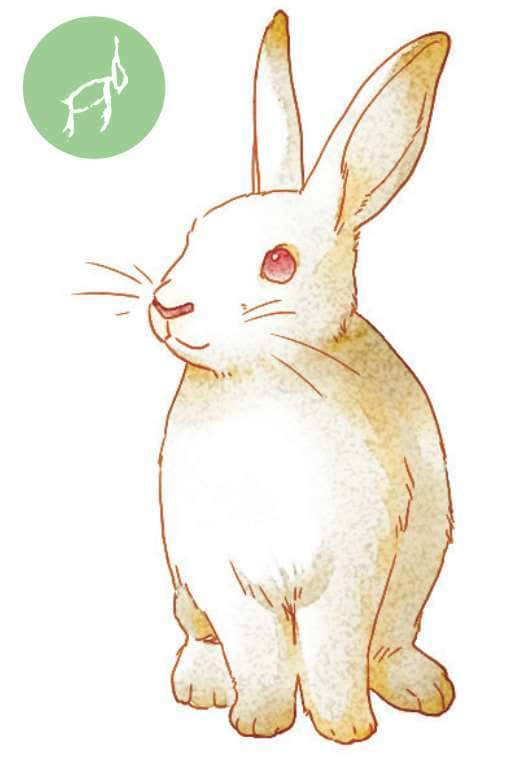

## 逸·冤  
逃跑的兔子很委屈

“逸”用于飘逸、逃逸，“冤”用于冤枉，你有没有想过，这两个字里为什么都有一只小兔子呢？

### 逸/ 小兔快跑！ /

“逸”字与兔子的关系，兴许你已经猜得八九不离十。没错，它与兔子快跑有关。

“逸”是个会意字，“兔”加走字底“辶”。以“辶”为部首的字，多和走有关，比如“逃”“逛”“迎”“送”等，“逸”也是如此。

许慎先生在《说文解字》中说：“逸，失也。……兔谩訑善逃也。”什么是“失”呢？就是跑得太快，跟兔子一样，一下子就失去了踪影。“谩訑”是欺骗的意思。有时候，一只兔子眼看要被抓住了，就装死不动，等猎犬放松了警惕，再“嗖”的一下逃走。这便是“逸”，古人用“兔”来造“逸”字，就是因为兔子善于逃跑。

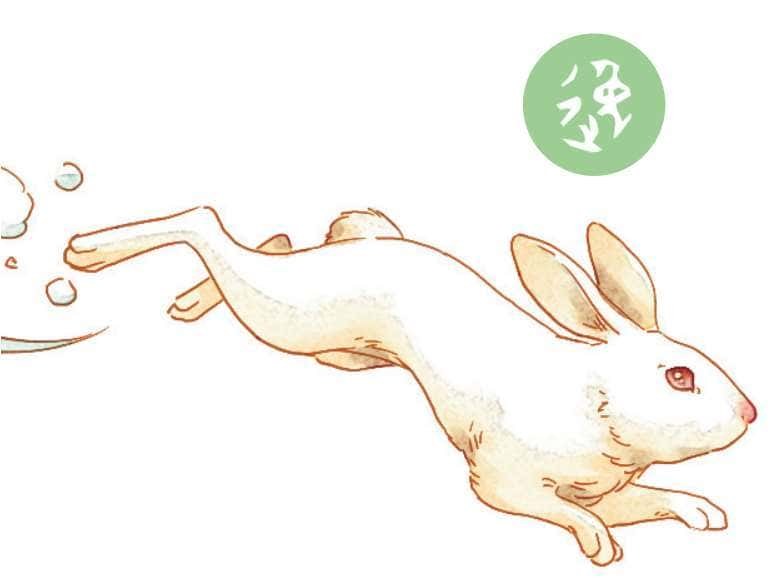

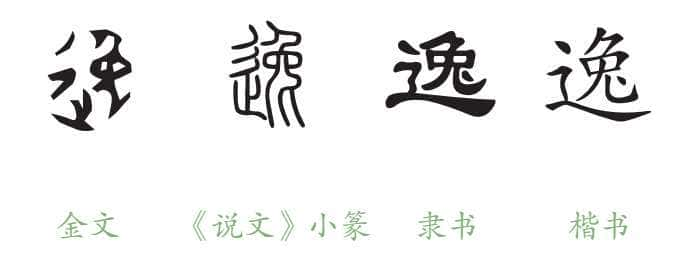

“逸”是兔子高速奔跑的状态，在汉语中，用来指快速移动。如果我们说一个人“行笔飘逸”，就是说他写字很快，潇洒自如。兔子逃逸出来后，安全又自由。因此，“逸”又引申出安定、闲适的意思。我们常说学习、玩耍要“劳逸结合”，这里的“逸”就是一种自由舒服的状态。

### 冤/ 受了委屈的兔子 /

“冤”是个看起来很可怜很委屈的字。许慎先生在《说文解字》中是怎么讲解“冤”的呢？

他说：“冤，屈也。从兔，从冖。兔在冖下不得走，益屈折也。”“冤”的上面是“冖”，下面是“兔”，这是一个会意字。“冖”是罩子的意思，在表示帽子的“冠”、表示头巾的“巾”中，都有“冖”，表示用帽子和头巾把头罩起来。“兔在冖下”，是把兔子关在牢笼里，它就“不得走”——古代的“走”指的不是优哉游哉的散步，而是快跑的意思。因此，“冤”就是把兔子罩起来，然后它就跑不掉了。“益屈折也”的意思是，兔子被关在笼子里，它会非常害怕，把身体紧紧蜷缩起来，显得特别委屈。

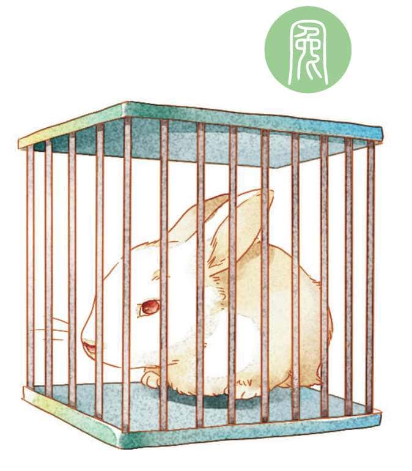

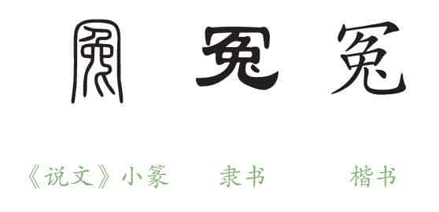

古人用关在笼子里缩成一团的小兔子，表达一种压抑委屈的、有话说不出来的心理状态，这就是“冤”。

“冤”常用于“不白之冤”。这个词跟白色有什么关系呢？其实，“白”是辩白的意思，“不白之冤”是指得不到辩白、昭雪的冤屈。“不白之冤”有一天也可能“沉冤得雪”。要注意，“雪”不是雪花的意思，而是动词，有洗刷的含义，用于“雪耻”“雪恨”等词。“沉冤得雪”指沉积很久的冤情终于得到洗刷。

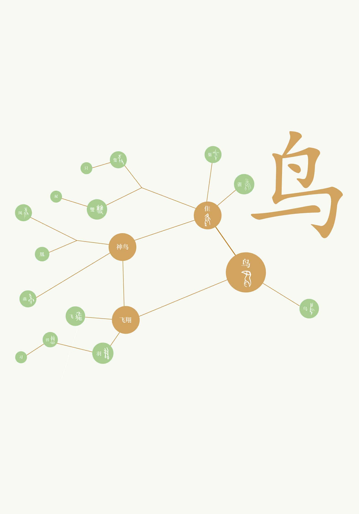

## 隹·雀·只·双·集  
短尾巴鸟的故事

在汉字的世界里，与鸟类相关的字极其丰富，包括小鸟的名称、叫声、动作、数量、性质……在《说文解字》里，许慎先生把鸟分成了三类：“隹”（短尾巴鸟）、“鸟”（长尾巴鸟），以及神鸟。其中，《隹部》的字有50多个，《鸟部》的字有100多个。以现在的标准来看，这种对鸟的划分并不科学，不过这些字大部分诞生在遥远的三千多年前，分类有误也不足为奇。

在这一讲，我们先来认识一下“隹”，以及相关的“雀”“只”“双”“集”。

### 隹****雀/ 短尾巴小鸟 /

甲骨文中的“隹”——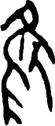形象鲜明，是一只嘴巴小，挥舞着翅膀的鸟。这只鸟有什么特点呢？《说文解字》中说：“隹，鸟之短尾总名也。”即短尾巴的鸟都叫作“隹”。

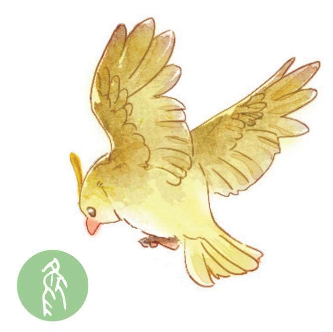

现在，“隹”这个字不常用了，主要藏身在一个个与鸟有关的汉字里。比如我们要讲的“雀”字。

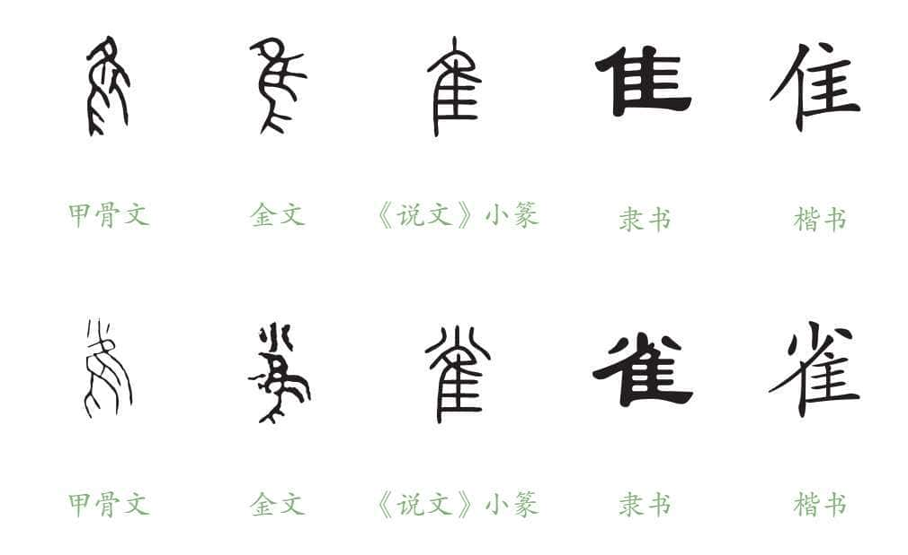

“雀”是个会意字，这个字很容易理解：下面的“隹”指短尾鸟，上面是个“小”字，合起来指小鸟——麻雀。《说文解字》对“雀”的解释就是“依人小鸟也”，在许慎先生看来，麻雀是一种很亲近人的小鸟。

我们现在用“雀”字时，不仅用于短尾巴的“麻雀”“云雀”，也用于长尾巴的“孔雀”，并没有局限于“短尾鸟”的最初含义。

### 只****双/ 抓住了几只鸟？ /

“只”与“双”两个字，看似字形差别很大，但其实在古代，它们的字形非常相似，含义也有互通的地方。“只”和“双”的繁体字分别是“隻”和“雙”，它们的相像之处，可谓一目了然。

“隻”上面是个短尾鸟“隹”，下面是“又”，在汉字里，“又”与手有关，在甲骨文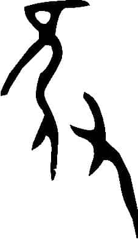中，就能看出这个字画的是一只手抓着一只鸟。《说文解字》中说：“隻，鸟一枚也。”这个字原本就是一只鸟的意思。

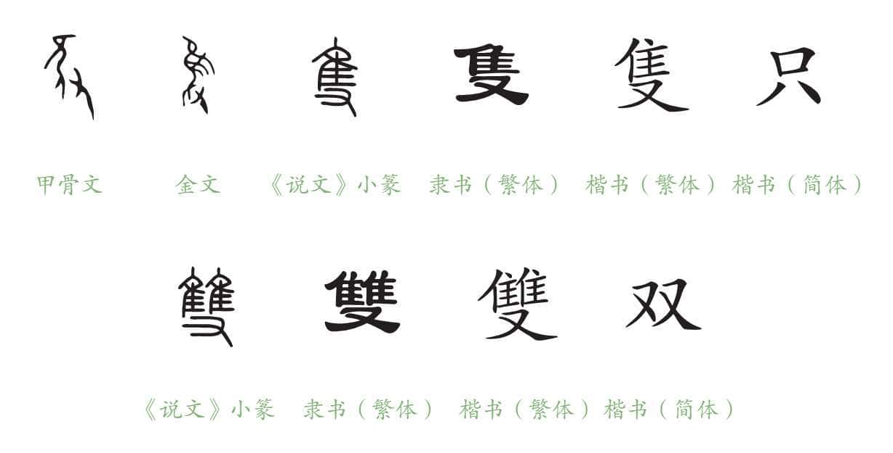

同理，“雙”是一只手抓着两只鸟。《说文解字》中说：“雙，隹二枚也。”即“雙”是指两只鸟。

后来，这两个字的含义变得更加广泛，成为通用量词，用于“一只猫”“一双鞋”等。不过这两个字的写法太复杂了，在汉字简化过程中，被简化为了我们熟悉的“只”和“双”。

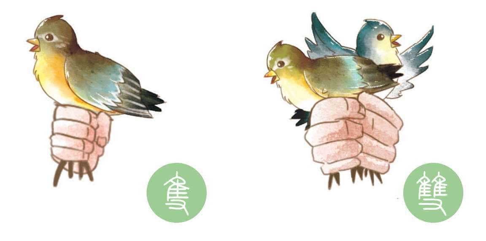

### 集/ 栖息在树上 /

“集”是个很有意思的字，乍一看和鸟没有任何关系。但讲明白后，你会恍然大悟：“哇，原来如此！”

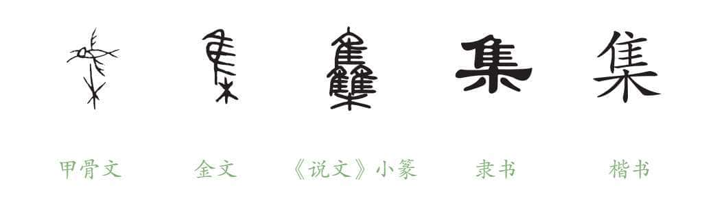

“集”字的甲骨文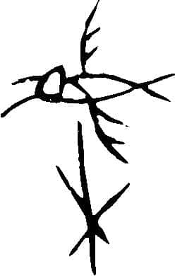非常形象，下面是一棵树，上面落着一只鸟。《说文解字》将它解释为：“群鸟在木上也。”即一群鸟落在树上。你可能会困惑，明明只有一只鸟呀，别着急，让我们一起看小篆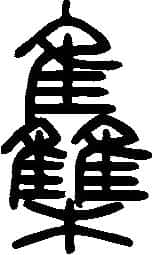。在小篆字形里，上面是三个“隹”，古人习惯于用三来表示很多，比如用三个“木”的“森”表示茂密的森林。因此，“集”是指一群鸟集中栖息在树上。在古诗中，我们能看到同样的用法，《诗经》中的“黄鸟于飞，集于灌木”，李白的“众鸟集荣柯”，描写的都是一群鸟的聚集。

不过，写起来实在太复杂了，在汉字演变过程中，渐渐简化成了“集”。在这里，我们重新认识了“集”，日后再次使用它时，你也许会感受到众鸟飞翔云集的诗意，这就是来自汉字的浪漫。

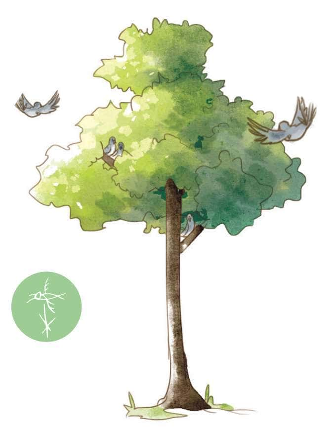

## 鸟·乌  
长尾巴鸟与乌鸦

认识了短尾巴的“隹”，我们再来认识一下长尾巴的“鸟”，以及与它相似的“乌”。

### 鸟/ 翱翔天际的鸟 /

和“隹”一样，“鸟”也是一个标准的象形字。我们先看一看甲骨文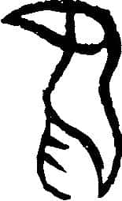，这个字就是一只惟妙惟肖的小鸟——尖尖的喙，大大的眼睛，柔顺美丽的羽毛，十分活灵活现。

许慎先生在《说文解字》中说：“鸟，长尾禽总名也。”即“鸟”是长尾巴鸟的统称。在甲骨文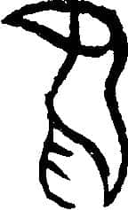中，尾巴画得还不是特别长，但到了金文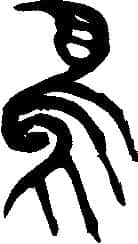，“鸟”这个字拥有了美丽的尾羽，也增添了许多美感。

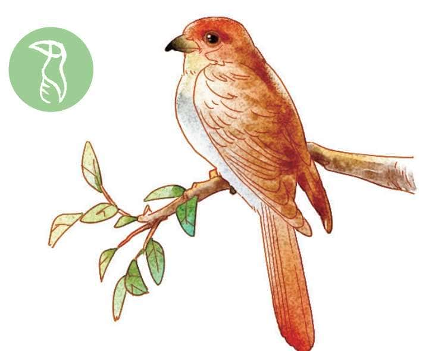

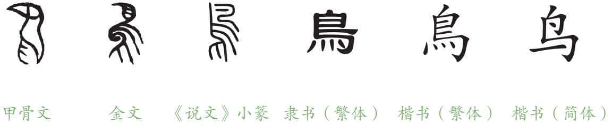

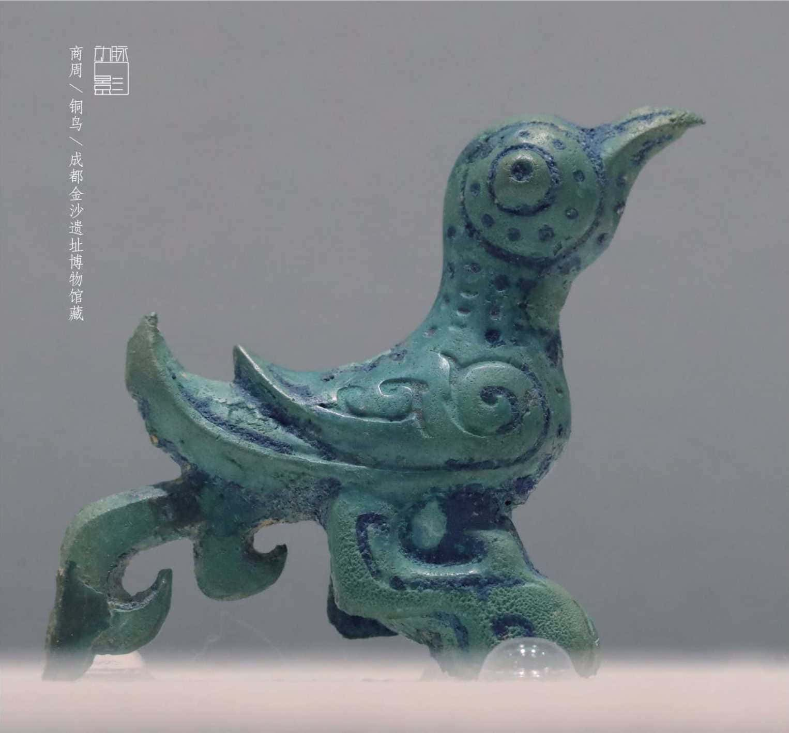

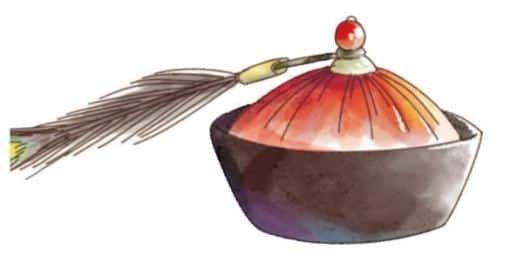

古人喜爱飞鸟色彩斑斓的尾羽，也将其作为装饰。在清朝礼帽上，就有小鸟美丽的尾羽，和顶珠一起被称为“顶戴花翎”。清朝官员礼帽顶部装有顶珠，根据材料及颜色的不同，可以区别官员品级高低。在朝冠顶子上，一品用红宝石，二品用红珊瑚，三品用蓝宝石，四品用青金石，五品用水晶……在顶珠下，装有二寸长短的翎管，用于安插花翎。花翎包括以鹖（hé）尾羽做成的蓝翎和用孔雀尾羽做成的孔雀翎。根据孔雀翎上眼状圆形图案的多少，又有一眼、两眼、三眼之分，其中以三眼花翎最为贵重。

### 乌/ 孝顺的乌鸦 /

乌鸦的“乌”字和飞鸟的“鸟”字很容易写混。在简体字中，“乌”只比“鸟”少了一点，形体非常相近。在古老的汉字中，这两个字也不好分辨，易于混淆的问题，可以说是历史悠久了。

在西周金文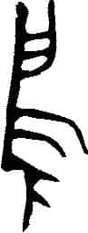中，“乌”就是一只乌鸦的样子，和“鸟”差不多。到了小篆中，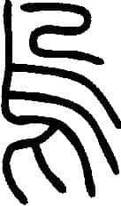（乌）比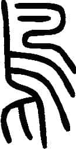（鸟）少了一点，不仔细看，还真分辨不出来。也许是因为“鸟”中一点为点睛，而乌鸦通体漆黑，看不到黑黑的眼睛，所以便少写一点。

俗语常说“天下乌鸦一般黑”，“乌”还引申出了黑色的意思。比如，“乌贼”“乌梅”“乌发”“乌巾”，指的都是黑色的事物。乌鸦喜欢成群活动，在北方的冬天，每年都会有成群的乌鸦飞来过冬，真是遮天蔽日。一大群乌鸦呼呼啦啦聚在一起，就叫“乌合”，所以有个成语叫“乌合之众”，指无组织无纪律的一群人。在我们北京师范大学里，每年都会有成群结队的乌鸦，盘旋在校园的天空中，也是别有特色的一番景致。

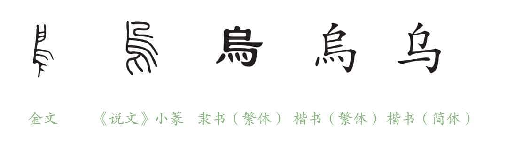

在中国人心中，对乌鸦的感情非常复杂，既有赞颂，也有贬毁。

赞颂什么呢？《说文解字》中说：“乌，孝鸟也。”意思是乌鸦是一种孝顺的鸟。在古人看来，乌鸦懂得反哺。小乌鸦没法独立捕食，大乌鸦远远地叼来食物，喂它们长大。等小乌鸦长大了，大乌鸦也就变成了老乌鸦。这个时候，小乌鸦反过来喂养自己的父母，这就是反哺。因此，有“慈乌反哺”的成语和美谈。

至于对乌鸦的贬毁，则是因为乌鸦钟爱腐肉，总与死亡相伴，因此被认为是不吉利的形象。有的人说话很不注意，总说“完蛋了”“要死啊”“倒霉啊”，就被称为“乌鸦嘴”。

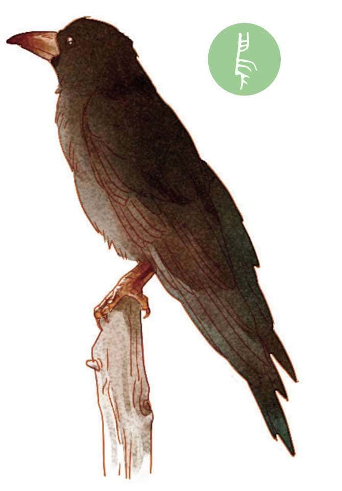

## 凤·凰·燕  
中国文化中的神鸟

你看过电影《神奇动物在哪里》吗？在魔法世界中，大大小小的神奇动物充满了奇幻的魅力与趣味。在中国文化里，也有各式各样的神奇动物。其中，有两种中国古人心中的神鸟：绚丽的凤凰和翩然飞过的燕子。

咦，燕子有什么神奇的？别急，让我从凤凰开始，为你慢慢道来。

### 凤****凰/ 何为凤？何为凰？ /

毫无疑问，凤凰是古人心目中最重要的神鸟。无论是东方还是西方，都有关于凤凰的传说。

先看“凤”字。在甲骨文中，“凤”是一个象形字，古人画了一只翅膀很大的鸟，头顶高冠，气派十足。我们学过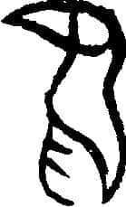（鸟）、（隹），和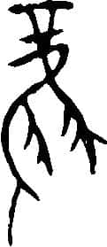（凤）一比，它们瞬间都黯然失色了。

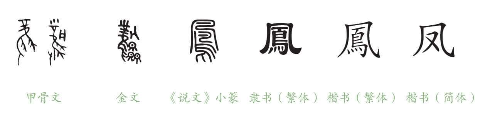

在甲骨文的另一种写法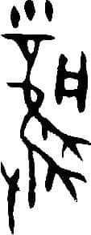中，“凤”的旁边添加了一个“凡”字，作为声符。这个字形发展到小篆，写为“从鸟凡声”的形声字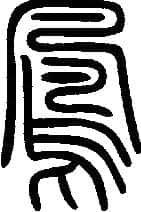。后来，它进一步规范，发展为繁体字“鳳”。等到汉字简化时，“鳳”中的“鸟”简化为“又”，最终简化为“凤”。我认为，这个字简化得也不算好。

凤凰美丽动人，许慎先生在《说文解字》中对“凤”的描述是：“神鸟也。”

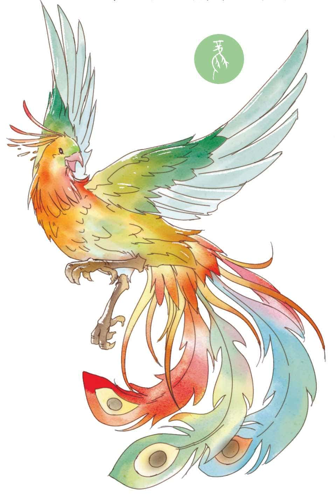

那么“凤”的神奇之处在哪里呢？

首先是凤的外表：凤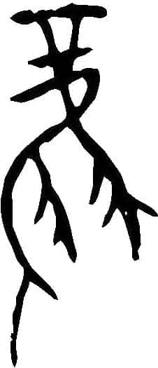凰的上半身像飞鸿，下半身像麒麟，有着蛇一样长长的脖子，鱼一样流线型的尾翼，龙一样的花纹，老虎一样的后背，燕子一样的下巴，雄鸡一样的嘴。而且，凤凰身披五色羽毛，绚丽夺目。让人忍不住赞叹，真是一只漂亮的大鸟。

除了绚丽的外表外，凤凰的习性也很神奇。据说，凤凰来自道德高尚的君子之国，白日翱翔四海之外，飞越仙山昆仑，在昆仑山下的弱水之渊梳洗羽毛，夜间在北方寒风的源头——风穴中安眠。它是吉祥的象征，一旦出现，便会带来太平盛世，天下安宁。

正因如此，古人用凤凰来比喻仁人君子。《论语》记载，楚国的接舆（yú）对孔子说：“凤兮凤兮，何德之衰？往者不可谏，来者犹可追。”他劝孔子归隐，就用“凤兮凤兮”称呼孔子——孔丘啊孔丘，你是一个像凤凰一样的君子，世道这样乱，为什么不归隐呢？

接舆为什么不说“凰兮凰兮”，而说“凤兮凤兮”呢？因为，“凤”和“凰”是两个字，它们之间是有区别的。

凤是雄鸟，凰是雌鸟。《尔雅》中说“凤，其雌凰”，就是这个意思。孔子为男性君子，所以用“凤”。而“凤凰”合为一词，则是后期语言发展的结果了。

### 燕/ 商朝的神鸟 /

“燕”在甲骨文中的写法是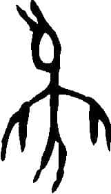，像极了一只小燕子——小小的脑袋、尖尖的嘴、张开的翅膀、分开的尾翼，这是一个典型的象形字。随着汉字的发展，小篆中“燕”字似乎不那么“象形”了，但字形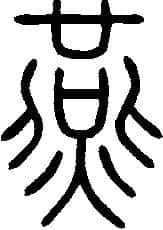中笔画的用意还是一样的。许慎先生在《说文解字》中说：“燕，玄鸟也。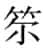（niè）口，布翅，枝尾。”这句话是什么意思呢？“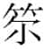”是夹子，即燕子嘴巴尖尖，像夹子一样；“布翅”是翅膀张开来的意思；“枝尾”指尾翼分开。

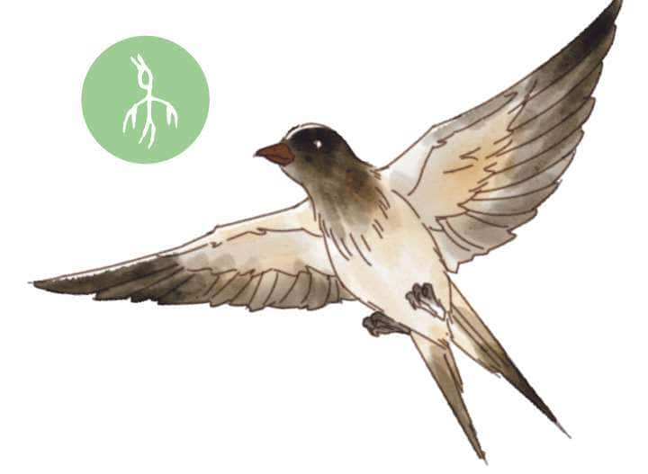

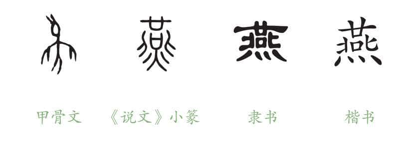

许慎先生将燕子称为“玄鸟”，玄鸟不是很玄妙的鸟，而是指黑色的鸟。这是燕子还是神鸟时的名字，而它的神鸟生涯，还要从商朝讲起。

在《诗经》中，有一句“天命玄鸟，降而生商”，意思是上天派来一只燕子，生出了商朝的祖先。

咦，这是怎么回事？

在《史记》中，也详细记载了“玄鸟生商”的神奇故事。

上古时期，有一个名叫帝喾（kù）的君主，他的妃子简狄去河边沐浴，走着走着，突然看见地上有个燕子蛋。简狄是个馋嘴的姑娘，一口就将蛋吞了下去。不久之后，她就怀孕了，而孕育的孩子就是商朝的始祖——契。

燕子是商朝的祖先，也是商朝的图腾，它的形象也留在了商朝的青铜器上。不过到了后来，燕子渐渐飞出神话故事，转而“飞入寻常百姓家”，成了一种普通但惹人喜爱的鸟。

## 飞·羽·习  
小鸟是如何学习的？

中西方传说中，有不少关于飞翔的故事。先秦时有鲁班和墨子制造木鸟飞上天的传说，东汉时也有张衡制作木鸟飞翔数里的故事。希腊神话中，能工巧匠代达罗斯借助蜡和羽毛制成的双翼，逃离克里特岛……这些故事里，寄托着人类对于飞鸟的羡慕和对于飞翔的执念。也正是因为徜徉蓝天、翱翔寰宇的强烈愿望，人类创造了飞机。

这一讲中我们要认识的便是“飞”字，以及和它相关的“羽”字和“习”字。

### 飞/ 一飞冲天 /

今天的“飞”是简化后的产物，我们还是要从古文字看起。

从战国文字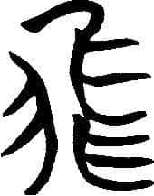到小篆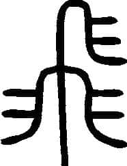，可以看出“飞”是一个象形字，就是一只小鸟张开翅膀，在天空飞翔的样子。因此，许慎先生在《说文解字》中讲解道：“飞，鸟翥（zhù）也。”“翥”是高高飞起的意思，“飞”的本义就是小鸟飞翔。从小篆到隶书、楷书，“飞”的字形基本上一脉相承。到了汉字简化，才把繁体的“飛”省去大半，变成了今天的“飞”字。

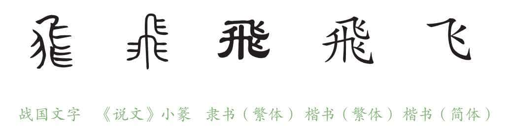

关于“飞”，春秋时期，有楚庄王“一飞冲天”的故事。

楚庄王即位的时候，年纪不大。他不理朝政，整日吃喝玩乐，放任奸臣胡作非为，一晃就是三年。

有位大臣实在看不下去了，又不能直说，便问楚庄王：“大王，楚国郊外有一只大鸟特别奇怪。它待了三年，不展翅，不叫也不飞，您说这是怎么回事？”

楚庄王并不傻，一听就明白了，这说的是我啊！他回答道：“三年不飞，一飞冲天；三年不鸣，一鸣惊人。”

于是半年后，楚庄王开始励精图治，把奸臣一网打尽，重用贤良之士——原来，不展翅，是为了等待羽翼丰满，不飞不鸣，是为深入观察民生百态。他之前的无所作为，是在审视局势，摸清谁好谁坏、谁忠谁奸，从而有的放矢，直击要害。

最终，“一飞冲天”的楚庄王打败了强大的晋国，成了春秋五霸之一。

### 羽/ 两根鸟羽 /

羽毛是鸟飞行的根本，在“飞”字的古文字形中，就突出了鸟羽的形状。那么，古人又是如何给“羽”造字的呢？

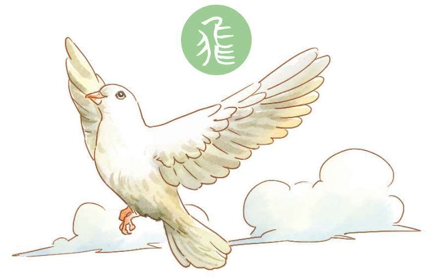

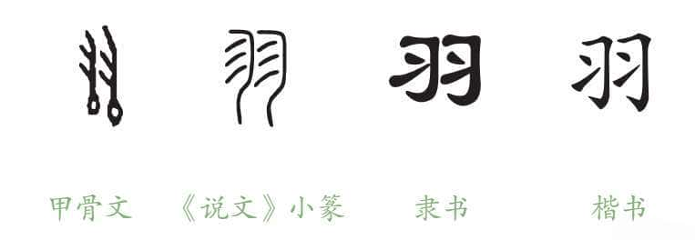

从甲骨文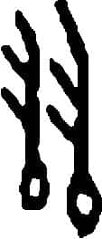到小篆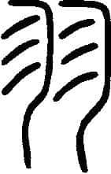，这个字一脉相承，都画出了两根长长的羽毛。《说文解字》中说：“羽，鸟长毛也。”“羽”是鸟类的长毛，也就是一般说的正羽，又长又硬，能够扇起风来，和贴身的小绒毛不一样。三国大将关羽，字云长，他的名字中的寓意，便是拥有鸟“羽”，翱翔“云”端。

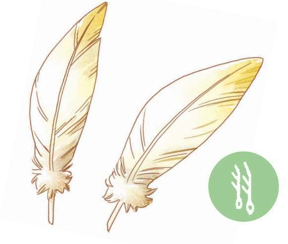

“羽”字和表示翅膀的“翼”字可以组成一个词——“羽翼”。小鸟靠羽翼高飞，因此，羽翼也可以指人的势力。一个人势力还不够强大，便是“羽翼未丰”，就像小鸟的羽毛没有长齐一样。楚庄王即位三年，还是羽翼未丰。等到他力量强大，便叫“羽翼丰满”。这个时候，便可励精图治，一飞冲天。

此外，“羽”字可以和“毛”字连用为“羽毛”。羽毛不仅是鸟羽，也可以指类似的东西，比如我们常玩的羽毛球上的“羽毛”，就是一种人造羽毛。

### 习/ 学习就是学飞 /

“习”字，看上去很抽象，但它在古文字中可是既形象又有趣。

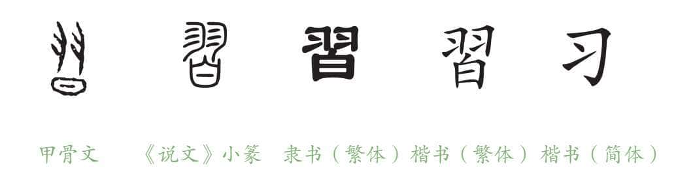

在甲骨文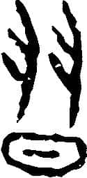中，“习”字从羽从日。小篆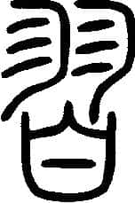基本上延续了甲骨文的形体，上面都是“羽”字，下面有的是“日”字，有的是“白”字。到了汉字简化的时候，省去了下边的“日”字或“白”字，又把“羽”字砍掉半边，写作“习”。

从古文字能看出，“习”和羽毛密不可分。许慎先生在《说文解字》中将“习”解释为“数飞也”。这里的“数”读作“shuò”，是屡次、多次的意思，“数飞”就是经常地飞。原来，“习”指的是小鸟不停地学飞。《论语》中说：“学而时习之。”其中，“学”是精神上的觉悟，“习”是不断的行为实践。在这句话中，蕴含着知行合一的道理。

此外，“习”是一种反复行为，我们经常做一件事，就是“习惯”。而大家共同的习惯，也就形成了社会的“习俗”。

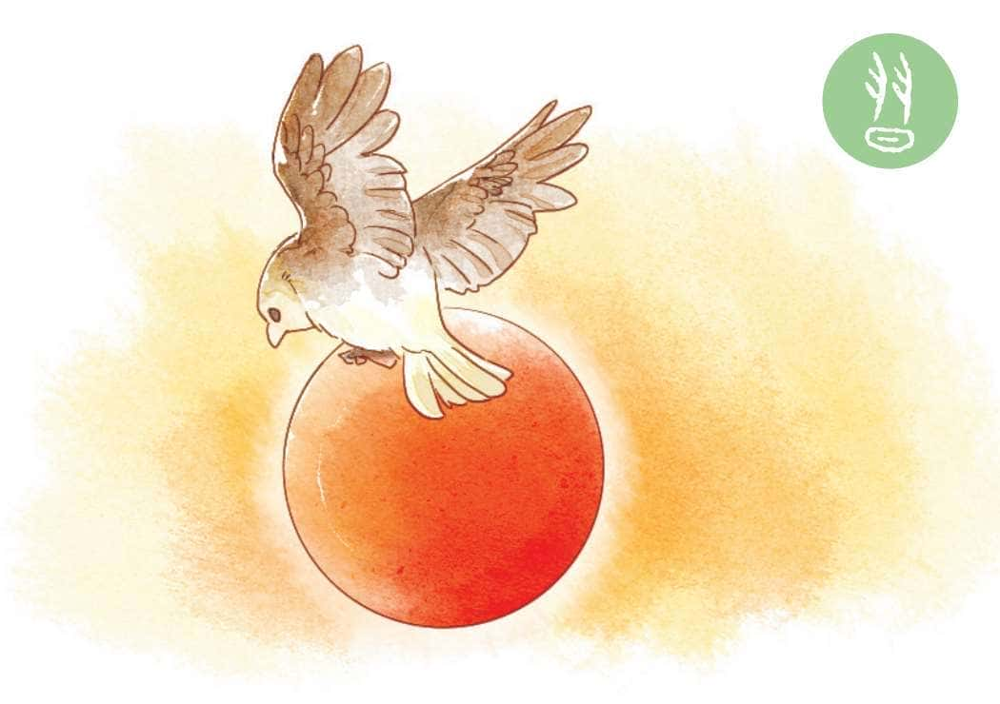

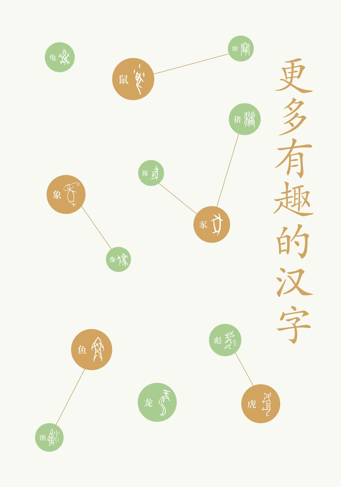

## 鼠·窜  
跑来跑去的老鼠

老鼠作为人类生活中一种常见的动物，很早就融入了中国文化。它是十二生肖之首，和“牛”“羊”“犬”一样，早早地就在甲骨文里拥有了自己的位置。

在这一讲中，将介绍与老鼠相关的字，分别是老鼠的“鼠”和好动的“窜”。

### 鼠/ 小老鼠，大门牙，长尾巴 /

“鼠”是一个历史悠久的象形字。

在甲骨文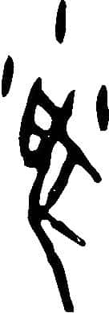中，“鼠”是一个瘦瘦小小的动物，身后拖着长尾巴，有大大的门牙。它的嘴边还有几个点，就像老鼠咬掉的木渣一样。

《说文解字》中谈到“鼠”时说：“穴虫之总名也。”这个解释很有意思，“穴虫”就是居住在洞穴中的动物，“鼠”是它们的统称，土拨鼠、鼹鼠、海狸鼠等都可以称作鼠。

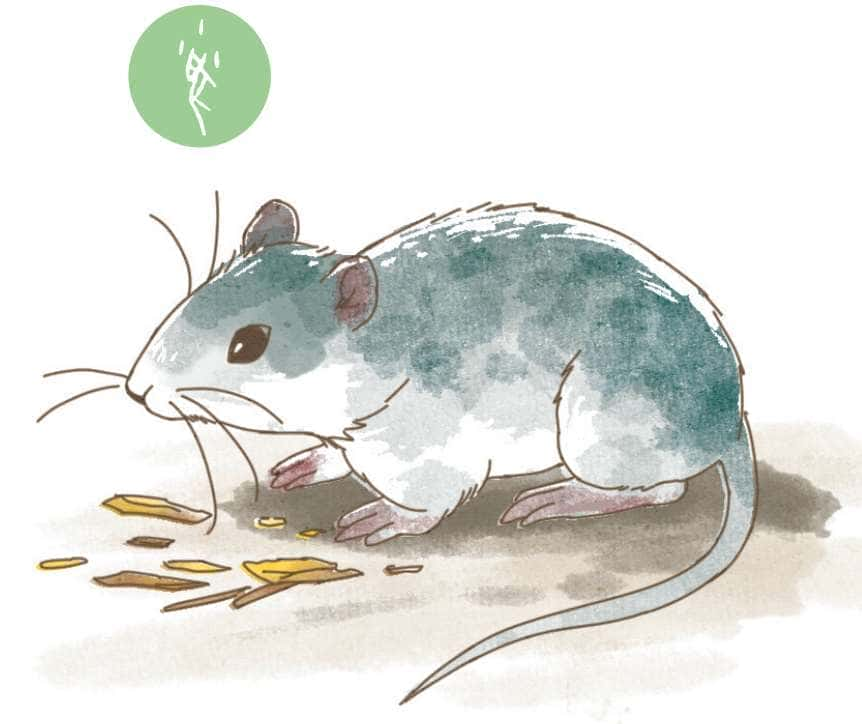

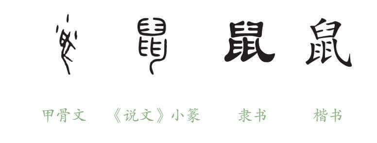

在汉语中，“鼠”可以组成不同的词。比如，词语感情色彩中性一点的，有“鼠标”。鼠标是一个外来词，在英文里，鼠标叫作“mouse”，就是老鼠的意思。取这个名字，是因为它和老鼠很像——撅着胖胖的屁股，身后的电线像老鼠尾巴。“mouse”是用来在电脑系统里进行标记和选择的工具，所以中国人用老鼠加类名的方式来翻译，有了“鼠标”一词。这个翻译，是不是很准确呢？

除了中性词外，“鼠”组成的词多为贬义，比如“鼠目寸光”和“鼠辈”。老鼠的眼睛很小，只盯着眼前的美食，人们用“鼠目寸光”来形容人眼光短，见识浅；而“鼠辈”则被用来指小人。

### 窜/ 抱头鼠窜 /

“过街老鼠，人人喊打”，老鼠经常被追打得跑来跑去。人们为此还造出了一个词，叫“抱头鼠窜”，形容急忙逃走的狼狈相。接下来要讲的字就是“窜”。

除了字义和老鼠有关以外，“窜”在字形上也和老鼠有关。有什么关系呢？看看“窜”的小篆字形就知道了。

小篆中的“窜”写作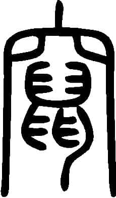，这是一个会意字，上面是洞穴的“穴”，下面是“鼠”。《说文解字》说这个字“从鼠在穴中”。小老鼠为什么跑到洞穴里呢？许慎先生在《说文解字》中解释说：“窜，匿也。”小老鼠跑到洞穴里，就是为了藏匿起来。

小篆很复杂，即使到了隶书和楷书，写作“竄”，笔画依旧很多，写起来非常不方便。于是，人们将“竄”简化，变为“从穴串声”的形声字“窜”。不过，这个字虽然方便书写，却没了小老鼠逃窜的画面感。

怕事的老鼠躲起来，不免让人鄙视。因此，由“窜”组成的词多有贬义色彩。比如“窜改”，意思是偷偷改动成语、文件、古书等等。

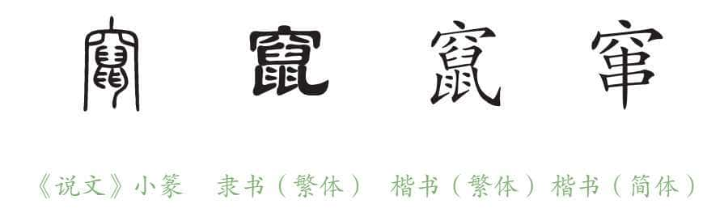

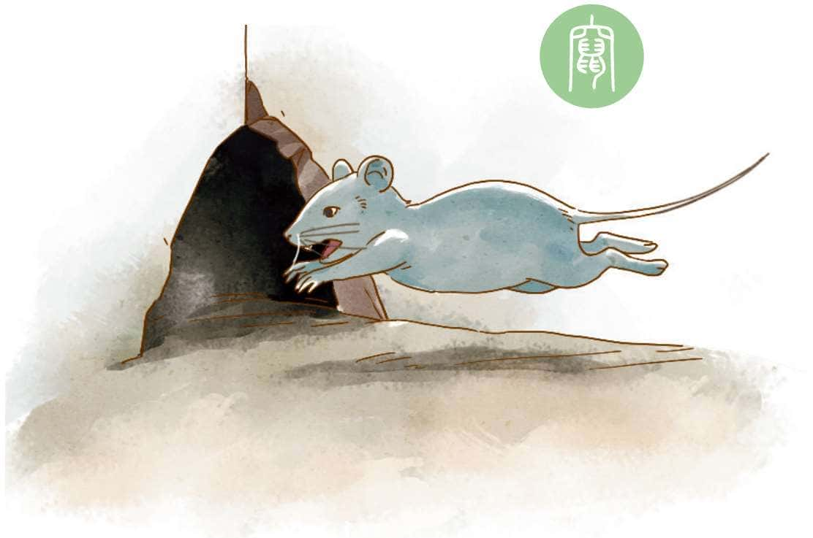

## 龙  
造一个神秘的“龙”字

中华民族是龙的传人，高飞在天的神龙，腾云驾雾，行云布雨，让人充满了奇妙的遐想。可以说，没有一种动物像龙这样神秘莫测。

这样神奇的动物，在汉字中又会展现出怎样的面貌呢？古人又是从什么时候开始，想象出龙的形象呢？

古老的汉字给我们提供了答案。早在甲骨文中，就已经出现了“龙”字。你看，这是一个典型的象形字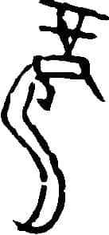——弯弯曲曲的身体、张开的嘴、高贵华丽的龙冠，这是古人对龙最早的想象。

从甲骨文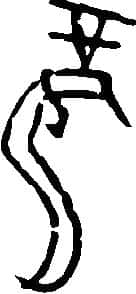到小篆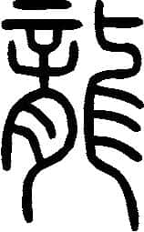，从小篆到隶书，乃至楷书中的繁体“龍”，龙的形象始终传承不变。直到汉字简化，“龍”才简化成今天“龙”的样子。

“龙”是一种什么样的动物呢？许慎先生在《说文解字》中描述说：“龙，鳞虫之长。能幽能明，能细能巨，能短能长，春分而登天，秋分而潜渊。”这句话的意思是，龙也是一种“虫”，它身上有鳞片，是“鳞虫”中的老大。尽管是虫，但龙变化莫测，有时看不清它的样子，有时又一下子出现在你面前。龙能任意变化身体的长短粗细。它既能飞上云霄，也能潜入水底，春天时振奋于长天之上，秋天里沉潜于深渊之间。

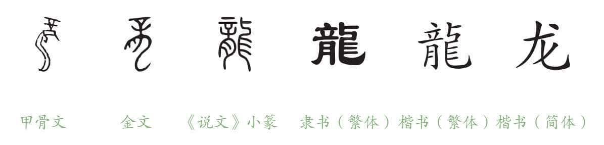

上天入地，千变万化，龙真是一种难以琢磨的神奇动物啊！因此，古人往往用龙来比喻那些高深莫测的人物。

孔子年轻的时候，曾经见过老子。与老子谈话归来，弟子们问他：“老师，您觉得老子这位先生，是个什么样的人呢？”

孔子长叹一声：“飞鸟，我知道它们善于翱翔；鱼，我知道它们善于游泳；走兽，我知道它们善于奔跑。但是龙呢？它隐身于厚厚的云层之中，高深莫测，我丝毫不了解。知识渊博的老子就像龙一样，出神入化！”

你看，这就是孔子口中的老子——孔子是儒家的创始人，老子是道家的创始人，儒道两家在一开始的时候，惺惺相惜、互相尊重。

直到今天，我们还用龙来形容高人，特别是那些让人摸不透、难以把握的神秘人物。在《三国演义》中，鼎鼎有名的诸葛亮被称为“卧龙”——他还没出山时，就像龙躺着休息，一旦出山，必然是飞龙在天，彪炳千秋。

除了形容高人，龙还是皇帝的象征。《周易》中说：“九五，飞龙在天。”龙高飞云端，皇帝是地位最高的人，因此，古人把帝王叫作“九五之尊”。在中国古代，皇帝生活的方方面面，都和龙挂钩——坐的椅子叫龙椅，睡的床叫龙床，穿的衣服叫龙袍，身体叫龙体，表情叫龙颜，甚至还有龙马桶、龙内裤……

在中国人的心目中，龙聚集了各种美好神奇的品质，是中华民族的文化象征。因此，中国人特别崇拜、喜爱这种神奇的动物。在汉语中，龙有着很多美好的寓意——“龙腾虎跃”“龙吟虎啸”“龙马精神”，都能用来形容精神饱满、神采飞扬的状态。

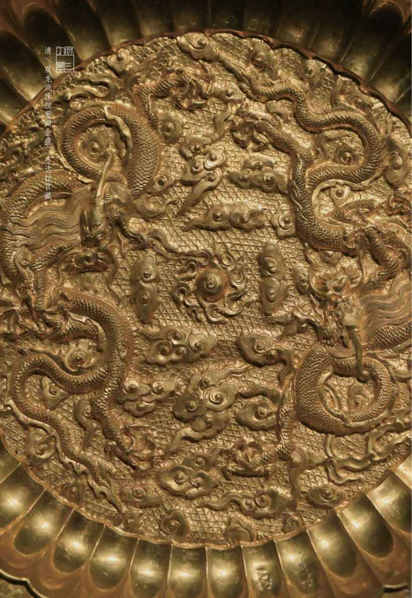

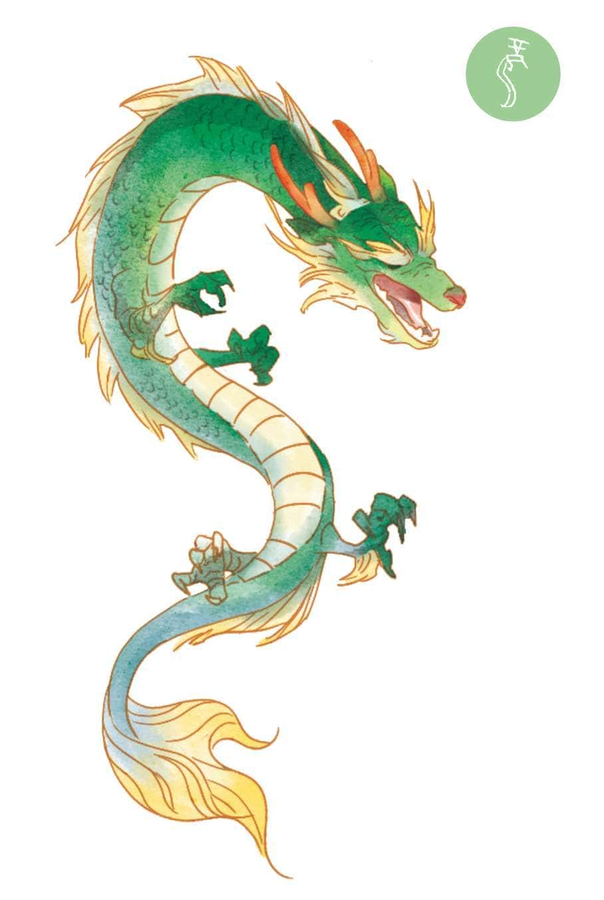

## 象·像  
想象中的大象

在我们的印象中，大象生活在南方，在丛林茂密的西双版纳，或是苍茫广阔的非洲大草原，都有这种巨大动物的身影。在中原地区，好像没有野生大象，但根据甲骨文的记载，在遥远的殷商时期，中原大地上曾生活着许许多多的大象。

这一讲，我要讲的便是“象”和“像”两个字。

### 象/ 罕见的大象 /

“象”是甲骨文中十分常见的一个字。你看，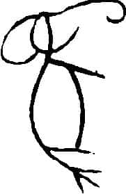和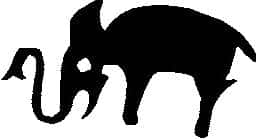就是甲骨文和殷商金文（族徽文字）中的“象”。这头大象，是不是特别活灵活现？大大的耳朵，庞大的身躯，长长的鼻子，真是惟妙惟肖。甲骨文是殷商时期的文字，因此，这个字的存在，说明在那时的中原大地上，是生活着野生象群的。

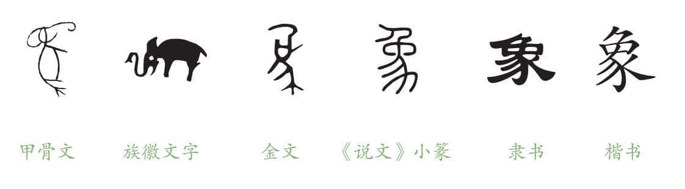

到了西周金文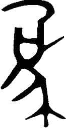，还能辨认出象的大脑袋、长鼻子。到了小篆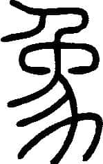，字形进一步抽象，和今天的“象”字几乎已经一样了。

许慎先生在《说文解字》中说：“象，长鼻牙，南越大兽，三年一乳。象耳牙四足之形。”在许慎先生看来，“象”是一个象形字，画出了象耳、象牙、象腿的形状。它最鲜明的特点，是长长的鼻子和象牙。在汉代，中原已经很少有野生大象了，它们的生活区域越来越靠南。因此，东汉的许慎先生把“象”称为“南越大兽”——是南方的特产。

对生活在中原的古人来说，大象此时已是一种十分陌生的动物，因此才有了“曹冲称象”的成语。

东吴孙权送给曹操一头大象。曹操是北方人，没见过大象，他很好奇：“这头大象这么大，该有多重啊！”

于是曹操问手下的谋士：“诸位爱卿，谁能把大象的重量称出来？”众多谋士面面相觑，你看看我，我看看你，一时间都想不出法子。

这时候，曹操五六岁的儿子曹冲站了出来，他说：“爹爹，我有个好办法！把大象运到一艘大船上，船受重会下沉，在水面达到的地方做个记号。再把大象牵出来，换上各种各样的货物，等船再次下沉到记号时，称一称船上的货物，就知道大象的重量了。”

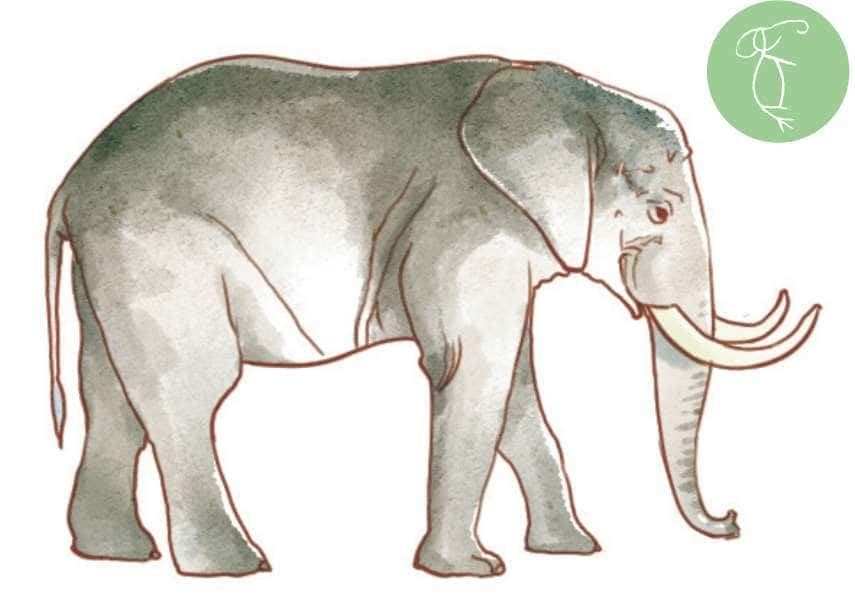

曹冲巧妙地把大象整体的重量，转化成了一堆货物的重量，从而成功地称出了大象的体重。

### 像/ 想象与想“像”，很“象”与很像 /

很多人容易将“想象”错写为“想像”。在“想象”这个词里，为什么是大象的“象”呢？这是因为，大象在中原基本绝迹后，古人对它越来越不熟悉。大象很少见，所以难免要“想象”。我们常说要有“想象力”，最初的“想象”，其实就是想出一头大象来。

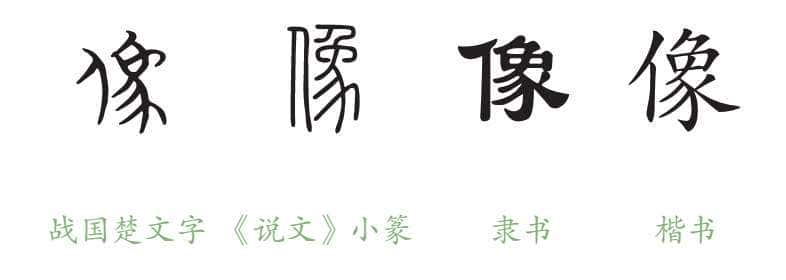

读到这儿，你可能不信，别急，我们来看看下面的证据。

中国古代有一位大思想家韩非子，他是法家的代表人物。在《韩非子》一书中，他说：

人希见生象也，而得死象之骨，案其图以想其生也。

这句话的意思是，一般人见不到活的大象，只能根据大象的骨头，或者是大象的图画，来构想出真的大象的样子。所以古人说的“想象”，是指依据各种线索，在脑海中想出那头平常看不到的大象。

知道了这些知识，便再也不会把“想象”错写为“想像”了。

那“像”字又是什么意思呢？它和“象”字又有什么区别呢？

在想象的过程中，我们常常要问自己：我头脑里想出的那头大象，和真实的大象，它们的样子是一样的吗？

衡量一个人的想象正确与否，关键在于“像”还是“不像”。许慎先生在《说文解字》中说：“像，象也。”这告诉我们，“像”和“象”含义相通，“像”就是想象得很相似、很像。

在汉语中，“像”还能组成“肖像”一词。什么是肖像呢？“肖”在古代是骨肉相似的意思，也延伸出相像的含义。一幅好的肖像画，就是要和真人一模一样，特别像。

## 虎·彪  
百兽之王的花纹

在中国文化中，最厉害的动物是老虎，它被誉为百兽之王。在这一讲，我来为你介绍汉字中的“虎”和“彪”，带你一起感受古文字中的虎虎生威！

### 虎/ 长着血盆大口的老虎 /

甲骨文中的“虎”，是一个标准的象形字，突出了老虎的三个特点：尖锐的利爪用力张开，仿佛要抓人一样；身上有道道斑纹，这是虎皮独有的特点；血盆大口、锋利的牙齿，看上去十分可怕。怪不得古人用“身处虎口”这个词来形容危险的境地。

“虎”字惟妙惟肖地展现出老虎的凶猛形象，虽然随着文字发展，老虎形体的特点有所减弱，但血盆大口和利爪獠牙，还都依稀可辨。

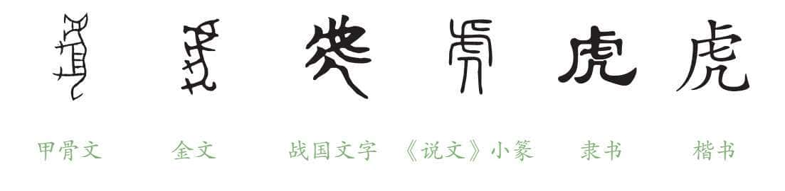

许慎先生在《说文解字》中说：“虎，山兽之君。”老虎是山中野兽的君主，被称作百兽之王。《周易》说：“云从龙，风从虎。”飞龙在天，总有团团云彩伴随着它；老虎出山，常常伴随着阵阵腥风。老虎凶猛，古人挑战老虎需要巨大的勇气。汉代有一位投笔从戎的大英雄班超，他有一句掷地有声的话：“不入虎穴，不得虎子！”这句话的意思是，不进入危险的虎穴，就抓不到小老虎，比喻不历艰险，就不能获得成功。

老虎如此厉害，古人用它来形容威猛厉害的人。早在《诗经》中，人们就用“矫矫虎臣”形容像老虎一样威风矫健的大将军。在《三国志》中，刘备的两位将领关羽和张飞被称作“万人之敌”“为世虎臣”。《三国演义》中，他们一个过五关斩六将、斩颜良诛文丑，一个长坂坡一声吼，喝断桥梁水倒流，吓得敌将肝胆俱碎。

除了“虎臣”，人们还用“英雄虎胆”形容英雄无畏，用“虎背熊腰”形容人健壮有力，用“虎头虎脑”形容人壮健憨厚。此外，虎和龙也经常搭配，形容人精神旺健，比如“龙腾虎跃”“生龙活虎”；一个地方看上去不起眼，实际上却有很多人才，则叫“藏龙卧虎”。

### 彪/ 虎皮上的花纹 /

说完了“虎”字，我们再看“彪”字。

在《水浒传》里，英雄好汉山大王总喜欢坐“虎皮交椅”，在凳子上铺上整张虎皮，相当霸气。在汉字中，古人专门为虎皮造了一个字，那就是“彪”。

“彪”是一个从虎从彡（shān）的会意字，“虎”不难理解，右边的“彡”是什么意思呢？在汉字中，彩色的“彩”字也是从彡的，许慎先生在《说文解字》中说彡是“毛饰画文也”——用毛笔画出的纹彩。老虎身上色彩斑斓的皮毛，仿佛画家笔下的精美纹饰，所以“彪”就指老虎身上的花纹。

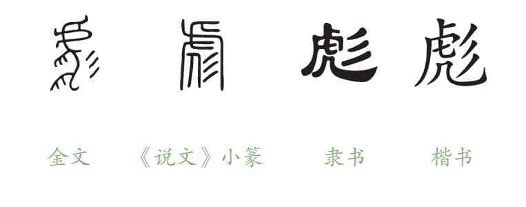

老虎身上的花纹太漂亮了，特别显眼，因此有一个词叫“彪炳”——“彪”是纹饰美丽，“炳”是光彩耀人，合在一起指文采焕发。如果一个人的道德功业特别耀眼，在历史上留下英名，我们就说他“彪炳千古”。像诸葛亮、岳飞、林则徐这样的历史名人，都是彪炳千古的伟大人物。

有意思的是，除了指老虎身上的花纹之外，“彪”还指小老虎。我们说一个人“彪悍”，是说他像小老虎一样勇猛；说一个人是“彪形大汉”，也是说他像小老虎一样健壮。

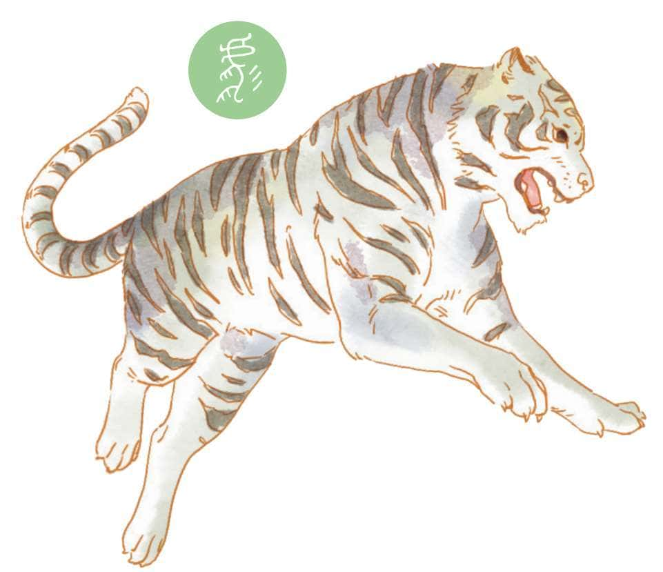

## 豕·猪·豚  
小猪味美，野猪凶猛

唐代诗人王绩有一首诗：“小池聊养鹤，闲田且牧猪。”从诗文中可见，猪与我们的生活密不可分。从旧石器时代开始，猪便参与了古人的生活。在他们心目中，猪的形象有超越动物本身的文化内涵。这一讲，我将介绍三个与猪有关的汉字——“豕”（shǐ）、“猪”和“豚”（tún），它们之间有什么区别呢？

### 豕/ 凶猛威武的大野猪 /

在古代，“豕”比“猪”更为悠久。你看，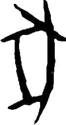是甲骨文中的“豕”，把它的脑袋侧过来，就是一头猪的样子：大大的肚子，短短的尾巴，多么活灵活现啊。

从甲骨文到金文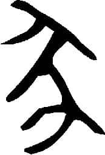，再到小篆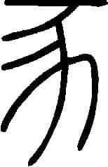，“豕”的字形变得不那么象形了：猪的头缩回去，变成了一条横线；下面不再是胖胖的肚子，而是变成几条直直的笔画。为了便于书写，这个字越来越抽象。

咦？如果“豕”画的是猪，那它和“猪”的字义是完全相同的吗？二者有什么区别呢？

许慎先生在《说文解字》中说：“豕，彘（zhì）也。竭其尾，故谓之豕，象毛足而后有尾。”“彘”这个字今天很少见，它也是猪的意思。“豕”的特点是“竭其尾”——“竭”是“揭”的通假字，表示高举，“揭竿而起”就是举起竹竿造反。猪生气的时候，会“竭其尾”，把尾巴竖起来，变成凶猛的“斗猪”。“象毛足而后有尾”这是说“豕”字中几条直直的笔画，像猪的毛和四肢，后面还拖着一条短短的尾巴。

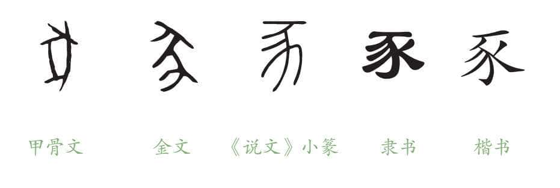

许慎先生笔下的猪怎么这么凶呢？原来，“豕”在古代是一种矫健而凶猛的动物——森林中横行霸道的大野猪。在后羿射日的传说中，便有一头这样的大野猪。那时天上有十个太阳暴晒人间，庄稼枯萎，饿殍遍野，饥饿无力的人们被各种各样的野兽欺负，其中就有一头像山一样庞大的大野猪，它的名字叫“封豨（xī）”。

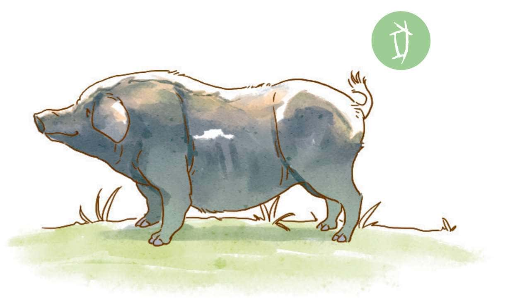

### 猪/ 长发飘飘的长毛猪 /

说完了凶猛的大野猪“豕”，我们再来看熟悉的“猪”字。

“猪”的繁体字形为“豬”，它的左边是“豕”，表示和猪相关。随着汉字的演变，“豕”变成了我们熟悉的反犬旁“犭”，表示猪是一种动物。

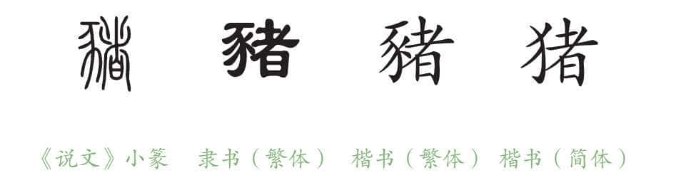

许慎先生在《说文解字》中对“猪”的解释为“豕而三毛丛居者”。今天的“猪”是一种泛称，大猪小猪、黑猪白猪，都叫猪。但在古代，“猪”专指“三毛丛居”的猪。

这是什么意思呢？“三毛丛居”的意思是一个毛囊里有三根毛，指的是一种毛特别多的猪。要知道，猪毛是一种很有用的东西，猪的鬃（zōng）毛软硬适中、韧性好、弹性强、耐摩擦，做成的刷子不易弯曲，特别适宜刷大炮管子里的膛线—膛线是炮管里一圈一圈的纹路，必须用猪鬃才能刷干净。因此，在战火纷飞的年代，猪鬃是一种战略物资，可不是随便就能买到。

说到猪毛，很容易联想到一头很熟悉的猪——猪八戒。猪八戒手拿钉耙，好吃懒做，胆子还小，经常被孙悟空揪耳朵。但你知不知道，八戒在遇到唐僧之前叫什么呢？他最初的名字是“猪刚鬣（liè）”，“刚鬣”就是又硬又直的猪鬃毛。

### 豚/ 圆滚滚的小肉猪 /

“豕”“猪”二字，反映出古人心中猪的两个特点：一是矫健凶猛，二是有浓密的鬃毛。至于“豚”这个字，则反映出猪的第三个特点——好吃！

古人喜欢吃猪肉，便专门造了一个字，来强调猪肉的美味，这就是“豚”。

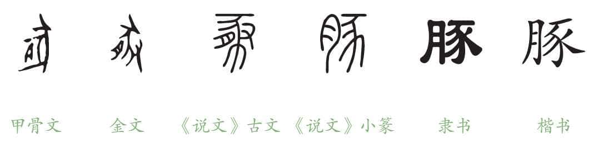

早在甲骨文中，就有“豚”字了。甲骨文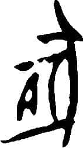的右边是一个“豕”，左边是一块肉。“豕”和“肉”放在一起，是什么意思呢？就是一头圆滚滚的小肉猪。在金文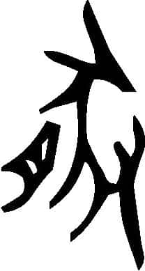中，这个字的右边多出一个“又”字。“又”是手的意思，这个字表示手里抓着一头有肉的小猪。“豚”圆圆的、肉肉的，吃起来味美汁多，我们把类似的动物也叫豚——河豚、江豚、海豚、豚鼠，都是香喷喷的美味。

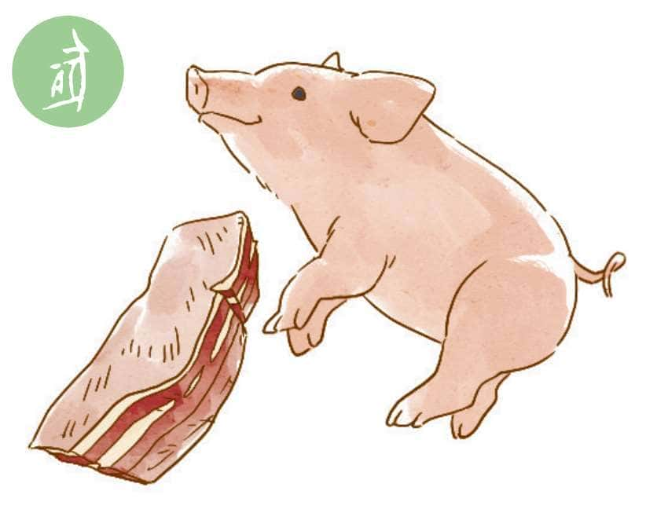

“豚”在古代的功用和表示大野猪的“豕”不一样。《说文解字》中说：“豚，小豕也。……从又持肉，以给祠祀。”“豚”是小猪，肉质细嫩鲜美，人们抓住了这头小猪，就拿去当作祭品，用来祭祀祖先和神灵。

由于味道鲜美，“豚”也是古人馈赠送礼的佳品。《论语》记载，鲁国有一名叫阳货的大臣，他想见孔子，将孔子拉入朝堂。可孔子却不愿意见他，怎么办呢？他派人给孔子送了一只“豚”。根据礼制，孔子要回礼，这样阳货便能见到孔子了。可孔子还是不想见他，便趁阳货不在家的时候，前往拜谢。不料，二人在路中相遇。

阳货对孔子说道：“有治国方略，却任凭国家混乱，您的这种做法，可以称作仁爱吗？”

孔子回答道：“不可以。”

阳货又问：“想要做出一番事业，却屡次错过时机，可以称作聪明吗？”

孔子回答道：“不可以。”

阳货接着说道：“时光流逝，时不我待。”

孔子无奈地说：“好吧，我还是入仕做官吧。”

你看，一只“豚”起到的作用是不是很大？

## 鱼·渔  
在水中捕鱼

古代的大哲学家庄子曾在桥上感慨，你看那水中的小鱼，真是快乐，摇曳着尾巴，徜徉游荡，颇有一种自由自在的感觉。在这一讲，我就给大家介绍一下汉字中的“鱼”和“渔”。

### 鱼/ 鲤鱼与孔子 /

中国古人很早就开始捕鱼、吃鱼，所以“鱼”字的出现相当早。

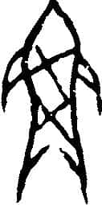是甲骨文中的“鱼”，画出了鱼头、鱼鳍、鱼尾，甚至还有鱼鳞，看着就像是活灵活现的一条小鱼！这个形体延续到小篆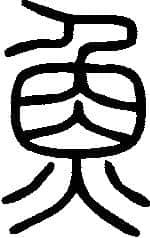时，虽然“鱼”的字形稍有变化，但基本形状一直传承不息，是个历史悠久的象形字。

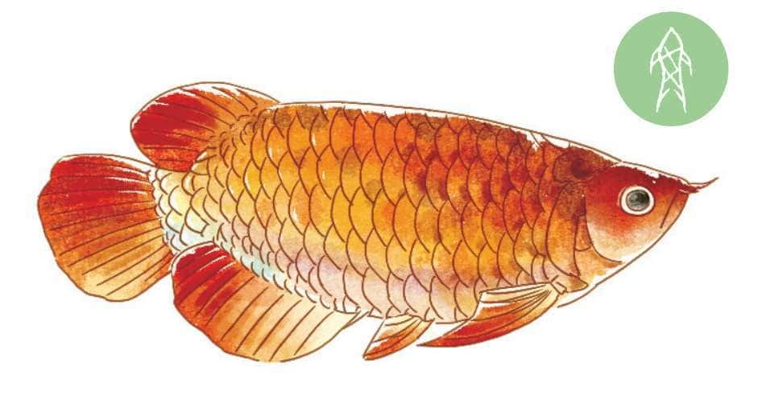

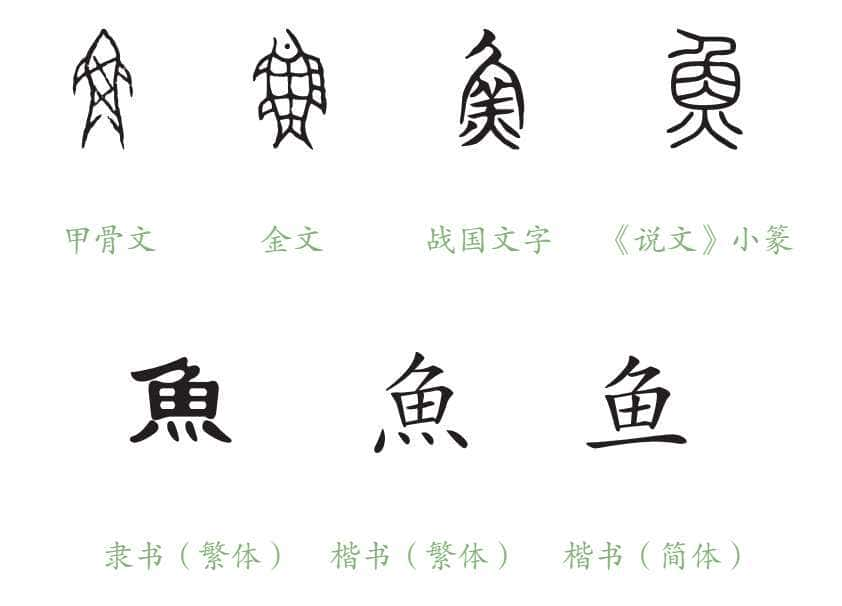

许慎先生在《说文解字》中说：“鱼，水虫也。”“虫”在古代是动物的代名词，鱼生活在水中，因此是“水虫”。许慎先生还说：“鱼尾与燕尾相似。”燕子尾羽尖尖、分成两边，呈现出美丽的流线型，和鱼尾很像。

在小篆中，“燕”和“鱼”的尾巴都写得很像“火”，这可不是烤鸟、烤鱼的意思，而是尾巴的象形。到了繁体字中，描绘尾巴的“火”变成了四点水，“燕”和“魚”的下部依然相同。后来随着汉字简化，“鱼”的下面写成一横，就看不出两个字的相似之处了。

在水中生活的动物，经常以“鱼”为偏旁，比如鲫鱼、鲶鱼、鲢鱼、鳜鱼、凶猛的大鲨鱼等鱼类，还有哺乳类的鲸鱼、两栖类的鳄鱼——在古人眼中，它们都是鱼。

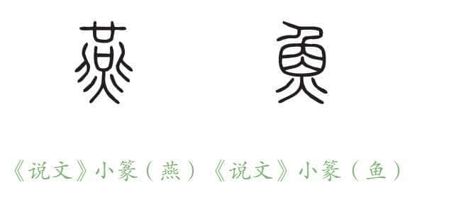

在众多鱼中，古人最喜欢的是什么呢？

可能是鲤鱼。因为鲤鱼不仅肥美，在东方文化中，还象征着健康的男孩。“鲤鱼跳龙门”的成语表示奋发向上，取得了不起的成就。

说到鲤鱼，历史上还有用“鲤”字给自己儿子取名的人，这个人就是孔子。

孔子生第一个儿子的时候，鲁国的国君鲁昭公听说了：“嗯，那个优秀的小伙子都有儿子了，去给他送个礼物，祝贺一下吧！”

送什么呢？鲁昭公派人送了一条漂亮的大鲤鱼。孔子生了儿子，又得到国君的祝贺，真是双喜临门，所以就给儿子取名孔鲤，字伯鱼[1]。

### 渔/ “鱼”与打鱼 /

打鱼是古代重要的生产活动，捕鱼的行为和抓到的小鱼，最开始都用“鱼”字来表示，但这样容易混淆——古人如果说“我欲鱼”，那是想要吃鱼，还是想要去打鱼呢？因此，要把鱼和打鱼分开造字。

怎么造字呢？古人想了个好办法，在“鱼”字旁边加了个“水”字，创造了甲骨文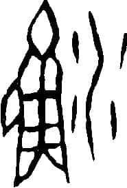，表示捕鱼是在水中进行的活动。这个字一直沿用到今天，成为捕鱼的专用字“渔”。

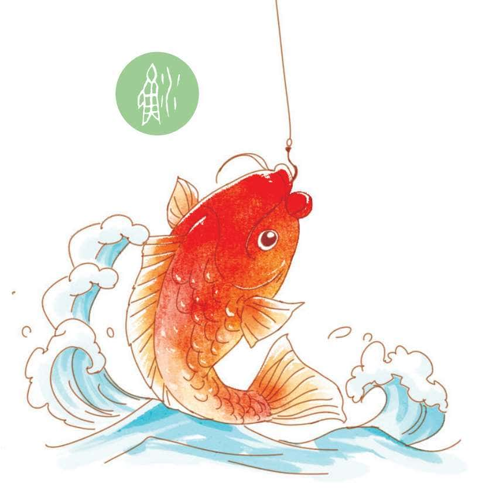

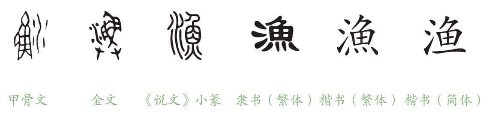

从“鱼”到“渔”，体现出古人在捕猎上的进步。人们常说“授人以鱼，不如授人以渔”——与其送你几条鱼，不如教给你打鱼的方法。掌握了方法，才能源源不断地有所收获。

在古人看来，打鱼和种地、砍柴不同，它是一种潇洒、闲适的活动。《滕王阁序》中提到“渔舟唱晚，响穷彭蠡之滨”，意思是渔夫整天打鱼，傍晚回家，在泛舟自得之际，唱出悠扬动听的渔歌，十分自在。

* * *

[1] 古人用“伯、仲、叔、季”来表示家中孩子的排行。

## 龟  
神奇的乌龟

“龟”这个字与汉字相伴而生，最早的汉字——甲骨文，就是刻在龟甲上的文字。在甲骨文中，“龟”有两种写法，都是象形字。你看，第一个“龟”是乌龟的俯瞰图，描绘出圆圆的脑袋、背甲、爪子和小尾巴。第二个“龟”则是侧面图，同样惟妙惟肖地画出了乌龟的样子。

甲骨文的第二种形体传承了下来，从小篆、隶书，一直到繁体字中的“龜”，都是乌龟侧面的样子。这种写法生动形象，但也有一个致命缺点，那就是笔画太烦琐了。怎么办呢？只有简化，于是这才有了今天的“龟”字。

也有人质疑简体字，认为简体字的“龟”只勉强能看出乌龟壳的痕迹，丢失了古文字的准确和意趣。要知道，繁体字固然保存了汉字的文化信息，但有的字实在难写、难认，只有简化汉字，让更多人掌握、使用汉字，才能更好地传承文化，更好地亲近古人的思想，这才是真正的保存文化。

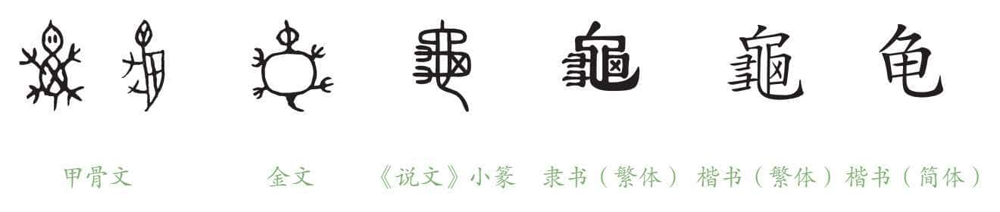

对于“龟”的特点，许慎先生在《说文解字》中说：“龟，旧也。外骨内肉者也。”什么是“外骨内肉”呢？你看看乌龟就知道了，乌龟藏在坚硬的龟壳里，外面是骨头、里面是肉。

除此之外，古人眼中“龟”最重要的特点就是“旧”。什么是“旧”呢？就是时间久远，所谓“千年王八万年龟”，“旧”是指漫长岁月留下的痕迹。在古人看来，历经沧桑的乌龟身上有一种神奇的力量。古有“四灵”之说——东方青龙，西方白虎，南方朱雀，北方玄武。其中，玄武就是乌龟，它和青龙、朱雀、白虎等神兽并列，足见它在古人心中的地位了。

此外，神奇的乌龟还能用于预测未来。古人很早开始，就用龟甲进行占卜。《论语》记载，古代贵族家里会收藏大乌龟——乌龟越大，活得越久，占卜起来也就越灵验。在殷商时期，人们会在乌龟的腹甲上钻眼，然后置于火中。甲骨受热不均，容易爆裂。古人便根据甲骨上出现的裂纹，判断事情的吉凶，推测上天的旨意。

关于占卜灵龟，还有一个很有趣的小故事。

楚王曾派人请庄子做丞相，庄子先生没有直接拒绝，而是问来人：“听说你们楚国有个神龟，死的时候已经三千多岁了。它的龟壳被供奉在楚国的庙堂上。你说，它是愿意死了享受香火呢？还是活着在烂泥中打滚呢？”

楚国使者想了想说：“乌龟嘛，当然喜欢在烂泥里打滚啦。”

于是庄子说道：“对喽！我也宁愿在烂泥里打滚。”

庄子用乌龟代指自己，表达热爱自由，不愿做官的意愿。

到了今天，乌龟身上的神性逐渐消除，除了代表长寿之外，渐渐地变成了带有贬义色彩的动物，很多骂人的话里都有乌龟的身影。可以说，乌龟的地位一落千丈。动物身上的文化内涵，随着历史的发展而不断变化，这也是一件很有意思的事情。

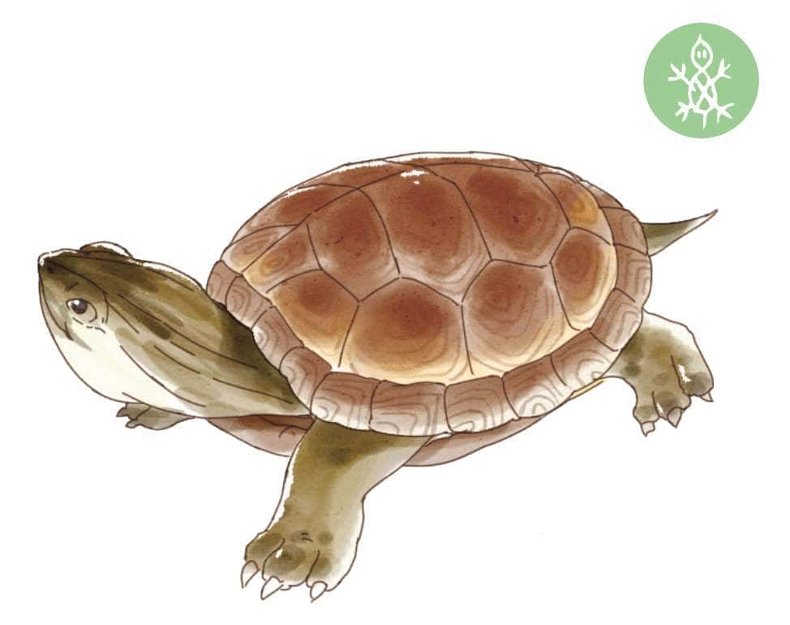

