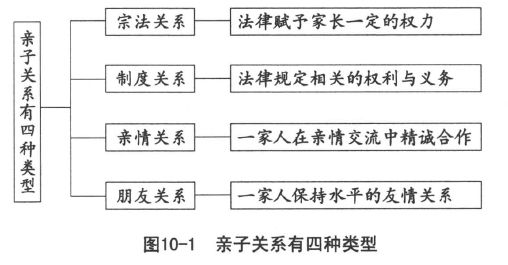

 *第十章　成年以后享受既成的关系*

亲子关系是我们自己建立的，

所有的成果都必须自作自受。

各种亲子关系各有不同因缘，

我们只需尽心尽力以求心安。

自己先放宽心胸来尊重包容，

相信许多问题都能迎刃而解。

《孟子》中记载：万章问孟子这样的问题：有人说，从尧帝到夏禹，德行就衰落了。禹不像尧那样，传位给贤人，却传给自己的儿子。是这样的吗？孟子回答：不是这样的。天意要给贤人，就给贤人。天意要给儿子，就给儿子。一个人的儿子贤或不贤，都是天意，并非人力所能做到的。尧帝死后，天下的百姓不归从尧的儿子而归舜。舜死了，禹避开舜的儿子到阳城去。天下的百姓不归从舜的儿子，却归从他。禹死了，益避开禹的儿子到箕山的北边。天下的百姓不到益那里去，却拥护启说：这是我们君王的儿子。尧子舜子不贤，禹的儿子贤，并不是尧、舜、禹自己所能够完全掌控的。所以孔子说，唐尧、虞舜让位给贤人，夏商周三代传位给儿子，道理是一样的，那就是得人心者昌。凡是品德良好，一心为民服务的伟大人物，都将获得百姓的衷心拥戴，成为贤明的君王。传子不传贤，传贤不传子，实际上是一样的：谁贤就传给谁。

这种君王与百姓的关系，究竟是天意，还是人为？依据我们中国人的智慧，是把天意和人为合起来想，并不分开来看，可以说既是天意，也是人为。天意要给贤人，天意要禹的儿子成为贤人，天意就是要给禹的儿子，让他来继位。禹的儿子，必须有良好的表现，才能获得大家的拥戴，而他的表现，属于人为的具体事实。天意和人为，其实是一体两面，合而为一的。

同样的道理，子女并不是父母所制造，就好像制造一个木偶或稻草人那样。实际上父母也不能制造子女，如果老天不允许的话，就算再努力，再费心，也不一定生得出来。很多人希望自己有个孩子，却偏偏没有。这种事实，充分证明并不是单凭父母的意志，就能够决定要不要生育、生男或育女、一个或多个。

子女从哪里来和人从哪里来，实际上是同样的问题。人从哪里来？答案如果是从母亲的子宫生出来，相信大家都不能满意。人从哪里来？西方的答案是：人是上帝创造出来的。这种神本位的说法，越来越多的人不愿意接受。于是达尔文说：人是动物进化而成的。这种物本位的说法，迄今并未获得证明。中国人一向秉持人本位，最通俗的说法莫过于：人是自己搞出来的。

我们常说，你怎么把自己搞成这个样子？意思是说，我们的一切，都是我们自己搞出来的。

人是自己搞出来的，却不是父母制造出来的。可见子女的出生，决定权不在父母，而在子女自身。子女要来，有时候父母想挡都挡不住。要来的是儿子还是女儿，同样由子女自己决定，父母只能够企盼而已。

子女怎么来的呢？这迄今仍然是一个解不开的谜。有了父精母血，不一定能够成孕；就算怀了孕，也未必就生得下来。生男育女，到底是必然还是偶然的？

我们仍然依据中国人合起来看的智慧，将必然和偶然合起来看，却不分开来想。既是必然，也是偶然；既不是必然，也并非偶然。那么是什么呢？把必然和偶然合在一起，合出一个自然。会生的自然会生，不会生的也是自然不会生。进一步追问什么叫做自然？其实也相当简单，不知其然而然，即为自然。凡是知其然而然的，人为的比例必然增大，也就越来越不合乎自然。

如果父母可以控制要生或不生，能够决定生男或育女，请问，人类能不大乱？父母可以表现自己的意志，坚定其必然的决心。子女要来或不来，合不合乎父母的企盼？据统计显示，仍然难以掌控，偶然的比率甚高。

偶然之中有必然的成分，必然之中有偶然的可能，这就是自然。孔子说：谋事在人，成事在天。这里所说的天，其实就是自然。我们常说：子女是上天所赐，上天也就是自然。但是，我们最好进一步明白：子女是上天托付给父母的宝贝。上天作为媒介，把这样的子女托付给这样的父母，必定有相当的道理。而其目的则是要求这样的父母把所托付的子女教养成为有用的人。父母承受上天的托付，就必须尽心尽力把子女教养好，不辜负上天的好意，也不抹杀子女的潜能。

子女各有不同的潜能，只有上天最知道。上天为子女找到合适的父母，便是希望父母善尽启发子女潜能的教养责任。父母应该秉持上天的意愿，就子女的潜能，启发出不一样的子女，而不是通过统一的教材、一致的标准把子女培育成为制式的“平均人”。可惜我们现在的教育，特别是学校教育，很明显就在严格地执行这样的模式。父母也为了追求更好的物质生活，专心专意发展事业，却将教养子女当做副业来看待。甚至为了满足父母的虚荣心，把子女看成展览品或装饰品，认为反正是自己的孩子，依照自己的方式来养育便是。

# 人生的一切都是自作自受

## 父母的责任

我们经过很长时间的考察，认为人生只有一条规律，那就是：自作自受。就亲子关系来说，父母自作自受，子女也同样自作自受。

薪水网站Salary.com曾公布一份研究报告，估算出全美540万位家庭主妇的薪水，把加班费也算进去，年薪应该为13.1471万美元，相当于高层主管的行情。网站表示，依据北美人力市场的薪资标准，每周工作44小时，基本工资就有827美元，年薪约为4.3万美元。而一周超时工作60小时的母亲，一年应该获得8.8万美元的加班费。报告出炉后，引起极大的反响。许多主妇高兴地说：“终于有人把我们的辛苦付出换算为实质的金额，让全职母亲的辛劳获得实际的肯定。”母亲具有这样的念头，其所作所为所包含的爱心，可以说完全被抹煞了。子女长大以后，发觉母亲有这样的想法，顶多以物质来回报，也就是孝而不敬，最终还是母亲自己要承受这种恶果。幸好有更多的母亲认为自己为子女付出的心血是不能用金钱来衡量的。这种母爱无价的观念，同样会引起子女母恩难报的响应。孩子的心和怀念，永远不是金钱所能够衡量的。

婴儿的游戏主要在运动身体和拨弄玩具。父母只需要让他穿上宽松的衣服，以免束缚他的自由活动。然后拿一些可以敲击、摇摆、抛掷、撕捏的简单玩具，只要安全，不至于割伤婴儿，并不需要什么正式的玩具。未满周岁以前，提供给婴儿的玩具不能因婴儿随意加以损坏而予以禁止。父母给他，就是要他充分拨弄，从中获得身体的运动和手足的活动，并且进而认识东西的粗细、软硬、坚韧度、易碎性以及其他特性。现代父母过早提供固定的玩具，反而不能达到这样的效能。

幼儿比婴儿的需求更加复杂。除了玩弄之外，还要开始简单的制作。譬如穿珠子、剪纸、用沙做月饼、用软土和积木做成各式各样的东西。无论作品怎样幼稚，都是幼儿想象的结果。现代父母为求方便，不鼓励幼儿自出心裁，多方尝试。受到玩具业者的宣传，指定既成的玩具，或者提供固定的模型，要幼儿跟着去完成。等到幼儿的创造力丧失殆尽，再想尽办法来启发、培育孩子的创造力，一切都已晚。父母自以为是，也将自作自受。

子女也是一样。依据调查，逾四成孩子表示，很少或从不向妈妈吐露心事。他们宁可闷在心里，或者向朋友吐露。长大以后，更觉得专家学者所说的“代沟”确实存在，因此更加和父母保持距离，不敢吐露心声。

有一位华裔加拿大人，童年时常被她的华人妈妈责备，觉得十分沮丧。长大后，她成为一位社会学者，还特别安排了一段“学术寻亲之旅”，远赴上海研究华人的孝道行为，把研究的结果和西方的数据相比较。结论认为中国人和西方人对父母一样孝顺，只是表达的方式并不相同。这位加皮尔教授（Neena Chappell）在香港大学“孝的中西文化”讲座中，坦承她在加拿大的小镇长大，父亲是白人，母亲则是福建人。她自幼和父亲的关系比较亲近，认为妈妈和她比较疏离，而且不容许她有自己的意见，为此她曾向母亲挑战。在她的记忆当中，妈妈从来没有夸奖过她，使她一度以为自己真的又蠢又丑，难怪妈妈很不喜欢她。一直到自己长大成人，结婚当了母亲，教导漂亮的女儿如何面对男孩追求时引起女儿的反驳和抗拒，这才恍然大悟，当年母亲对待自己的方式相当有道理。原来她的漂亮女儿，大声批评加皮尔教授，不应该称赞自己的女儿长得漂亮，以免使她因而骄傲，难以取得男孩的欣赏。子女如何看待父母以及如何与父母因应，事实上也是自作自受，丝毫没有例外。

既然亲子关系是这一家人中父母子女之间的关系，就可以由这一家人自己互动，产生某种关系。外人并没有权力，实际上也没有必要加以干预或批评。

除非这一家人出现某些偏差现象，产生危害社会或违反法律的行为，我们才有责任提出控诉，或者报警取缔。否则清官难断家务事，不如由这一家人自作自受。家有家风，家家有本难念的经，大概就是如此。

上天把这样的子女托付给这样的父母，想来一定有上天的道理。我们不是上天，也不是上天的代表，只好尊重上天的选择和媒介。要怎样教养子女，应该是父母自己凭良心做出来的决定，我们用不着担心，也毋庸操心。长久以来，我们并没有《慈经》，恐怕与此有关。

但是，出于笔者的自作自受，我们愿意提出若干建议，当然也是经过深思熟虑，才勉为其难地提供参考。

首先，我们认为，既然子女不是父母制造出来的成品，而是受上天托付，希望父母将其教养成为有用的人，父母就不应该喜欢怎样教养便怎样教养。我们必须转换一下教养的观念，以应该怎样教养才合适来取代自己的喜好。对自己的产品，可以凭着自己的喜好来加以处理，对上天托付的宝贝不可以如此。

其次，我们认为教养子女必须具有相当的权威。子女和父母吵架，虽然说并不是好事，却也不是什么大不了的事情。如果不加以斥责，那是父母的修养良好。若是斥责也没有用，责备也阻止不了，请问父母如何教养子女？身为父母，不一定就具有权威。有些孩子就是不听父母的话，如果父母认为自己一定有教养子女的权威，根本就是笑话。教养子女的权威是上天所赋予的，上天把这种教养子女的权威赋予父母，是要父母好好教养子女，把子女培育成为有用的人。如果不是这样，父母就不能动用上天赋予的权威，否则便是滥用权威，必须自作自受，谁也帮不上忙。

同时，我们认为上天把子女托付给父母，同样赋予父母教养所需的权威。可见在合理的情况下，父母对子女加以责备、处罚、教育、指导，不但必要，而且十分重要。父母对待子女，多问应该不应该，少问喜欢不喜欢。因此应该责备的时候，一定要加以责备；应该处罚的时候，也不应该马虎放过。现代父母接受不可体罚的新主张，竟然一下子就将“玉不琢不成器”、“人不打不成材”的古训全部抛诸脑后，是不是过分喜新厌旧呢？应该不打时，当然不能打；非打不可时，怎么可以逃避应该打的责任呢？

再没有现代知识的父母，也深知“既然把子女生下来，就应该负起责任，把子女教养成人”的道理。因为做与不做，有效与否，基本上都一定要自作自受。

我们常说：娶媳妇先看她的妈妈。看见母亲，就可以知道女儿将来会变成什么样子，女儿的缺点通常就是母亲的缺点。母亲为了女儿结婚以后减少和丈夫吵架，在任何场合都要格外尊重父亲，让女儿从小耳濡目染，将来对丈夫十分尊重，自然家庭更加和谐。如果母亲在女儿面前，毫无顾忌地批评父亲，什么不守信用、没有时间观念、不会赚钱、没有出息、不像个男人、赌徒、酒鬼的话都骂得出来，女儿就会丧失对父亲的尊敬，对老师、对同学、对朋友也会失去信心，连带着不久之后，对母亲也不尊敬了，这才是自作自受。

有些人对男女不平等耿耿于怀。看到妻子百般迁就丈夫，十分尊敬的样子，便以为重男轻女。其实，真正聪明的妻子，在公开场合，也就是有第三者在场的时候，会处处尊重丈夫，她也就同时获得了一定的权威。妻子可以在夫妻单独相处时，给丈夫一些劝告，甚至埋怨。公开让丈夫没有面子，相信吃亏的必然是妻子，这是很多高唱男女平等的妇女一直没有搞清楚、弄明白的地方，这也难怪妇女运动始终没有成效。

教育是长期的，不能求急效。严父在短时期内，由于引起子女的害怕，通常备受委屈。往昔主张严父慈母，实在是牺牲男性、爱护女性的好意，想不到又被男尊女卑的成见曲解为父权至上。父亲除委屈之外，又添增许多冤枉。不求甚解却又自以为是，令人至感无奈。

在现代家庭，几乎都是母亲喜欢斥责孩子，为子女所厌恶，反而平时不大接触孩子的父亲偶尔买些东西回来，逗得子女十分喜欢。难道这样的改变是好的吗？

笔者出生于三代同堂的复式家庭，由于长孙的缘故，祖父每天清晨就牵着笔者的小手，到外面买早餐吃。回家后攀爬到庭院中的含笑树上，用不着下来，祖父就会叫人送东西给笔者享用。母亲一生不出恶言，在笔者记忆里，她从来没有骂过谁，也没有说过任何人的坏话。父亲处在这种境况中，如果再不扮演严父的角色，笔者真的不敢想象会变成什么样子。父亲不但严厉，而且丝毫都不放松，打骂不断，出口绝不留情。笔者年幼时，有一段时间只想和母亲说话，看见父亲总是敬而远之，随时准备听从命令和指示。但是，长大成人以后，一直对父亲十分尊敬，父子之间也越来越有话讲。经常有人询问笔者，这一辈子最受益的老师是谁？笔者会毫不犹豫地回答：父亲。可见严父只要当得合理，终究会赢得子女的理解。做父亲的，不得不如此啊！

## 教养子女的艺术

陈龙安教授热衷于“创造力”的研究，认为创造力对今日的人类，不仅限于科学研究的工作。实际上，受到科技成就的启迪，人们正尝试着运用神奇的创造力来解决我们所有的难题，包括父母亲所遭遇的教养问题。他认为父母的创意是子女快乐的源泉，拥有创意的父母，便是具有创造力的父母，他们有很多新点子、新方法，活像伟大的魔术师那般造就了甜蜜和谐的亲子关系。

他把教养子女的艺术，归纳出十大法则。兹简述如下，以资参考。

### 父母在气头上不斥骂子女

情绪化的父母很容易破坏亲子的感情。孩子有时候故意惹父母生气，父母最好不要中计，只要父母情绪稳定，责骂时能够顾及孩子的自尊心，大多能够促使孩子反省改过。小家庭的母亲，经常独自担负起教育子女的责任。由于孤独地封闭在家中，缺乏共同分担责任的人，母亲往往紧跟着子女，把教育子女当成商场上的竞争，希望自己的孩子能够出人头地，让大家刮目相看。这样的母亲，最容易在气头上斥骂子女。因此父亲必须负起责任，帮助妻子脱离这种“只有孩子”的生活，制造与其他母亲交谈的机会，切磋教育子女的方法，以解除子女带来的困扰。

### 子女有怪癖或遇到挫折时父母不应该斥骂

孩子的怪癖可能是不适应行为或情绪困扰的表现，父母最好深入了解，妥当处理。子女遭遇挫折时，父母若是加以斥责，会让孩子害怕失败而趋于消极。子女闯祸时，自己也觉得难过，父母如果忽视子女的挫折感而加以斥责，表示父母不信任子女，子女也因此对任何事情都产生怀疑，尽往坏处想。

### 父母不应该唠唠叨叨地责骂子女

最好的办法是制定一个“检讨时间”，以避免母亲及孩童情绪上的激动。如果检讨时间定于每天下午七时十五分，母亲最好在七时以前，考虑好当天要纠正的事项。有了充足的准备时间，就可以冷静思考，避免冲动。又因为检讨的时间，只有十五分钟，最好每回只提出一个主题。由于母亲必须针对这个主题，做好周全的考虑，当然就不会唠叨。

### 父母不做忽视子女人格的斥责

尊重孩子，设身处地站在孩子的立场来看孩子的行为，以建立互信的亲子关系。信赖并不是一朝一夕就能够建立的，必须从孩子小的时候就让孩子发挥个性特质，不滥用父母的权威来对待子女。譬如不强迫子女沟通，孩子收藏宝贝不要加以责骂等。

### 父母不要做出比较性的斥骂

每个孩子都不一样，都有其独立自主的个性。把孩子拿来相互比较，只会造成彼此间的敌视，并没有好处。兄弟吵架时，父母不应该只责骂年长的孩子。不要说什么“哥哥不该欺负弟弟”，这样兄弟的感情才不致受到破坏。父母也不要介入孩子的友情，不要批评子女的朋友。因为这样一来，就会养成子女挖掘朋友缺点的不良习惯。

### 父母对子女的责备方式要一致

管教态度和要求不一致，是造成孩子行为适应不良的最大因素。父母最好采取同样的标准，不要有意见上的分歧。纠正孩子是每个成人的责任，不要假借父亲或其他人的名义来斥责孩子。当然，注意幼小子女对于时间和各种特殊场合的混淆，也是大人应有的态度。父母在子女面前不能说：“那是祖母的不对。”应该说：“祖母是老一辈的人，所以有那种想法。你是年轻人，不一定这样想，彼此的想法不相同，并没有什么不对的地方。”

### 父母对子女最好多鼓励少责备

多一分鼓励，少一分责备，孩子的自尊心与自信心就会逐渐培养出来。但是，父母一定要先弄清楚再褒奖，以免牛头不对马嘴，反而使孩子觉得扫兴。报上常刊登小孩被责备后离家出走的消息，致使有些父母不敢轻易责骂孩子。但若不敢责备，却一味夸奖，对子女仍然是一种伤害。譬如逞凶好斗的孩子，若不给予适当的指责，孩子就会认为不受重视，而更加乖戾起来。

### 父母不要以自己的喜好来斥责孩子

孩子的性格并不是责骂就能够改变的。斥责的用语，不要牵涉到性别上面。父母不应该把孩子所提出的理由用来当成责骂的借口。同时避免使用金钱来奖励，宁可说一声“谢谢”。

### 父母斥责子女时要想想子女行为的背景

孩子的行为背后一定有其特殊的原因。先设法加以了解，悉心关怀与体会，才能够对症下药，解决许多管教的问题。如果对子女不信任，一直存有责骂的念头，就无法教养出有自制力的孩子。年幼子女犯错时，应该握住他的双手，看着他的眼睛，严正地纠正他。和孩子说话时，眼睛不看着他，并不是良好有效的沟通态度。

### 父母最好采取孩子能够接纳的斥责方式

父母教养孩子，除了斥责与褒奖之外，还应该重视亲子关系的建立与维系。彼此信任、体谅与关怀，才是最重要的。孩子有一段时期好说歪理，不过是一种自我肯定的反抗现象。父母出于亲子关系的维系，最好还是少斥责多引导。

# 各种亲子关系自有因缘

## 亲子关系的四种类型

西方学者分析亲子关系，特别是父子关系，概略分成四种类型，即宗法关系、制度关系、亲情关系与朋友关系（如图10-1所示）。

### 宗法关系

中国的家族是父系的，母亲的亲属称为外亲，并不是本宗。外亲的范围很狭窄，只限于母亲的父母、兄弟姐妹以及兄弟姐妹的子女。姑母虽然是本宗，但是结婚以后便归于异宗。凡是同一始祖的男性后裔都属于同一宗族，具有垂直的宗法关系。父祖是一家之长，经济、法律、宗教的权力都在他的手中。中国的宗族强调祖先崇拜，家族的绵延、团结家族的伦理，都以祖先崇拜为中心。在宗法时代，家长的权力是法律所赋予的。罗马时代父权包括生杀权的情况，在中国也同样出现过。子孙违犯教令，祖父母有权加以处罚，有时无心致死，也不是不可能。元、明、清的法律，除了故意杀死并无违犯的子孙之外，子孙有殴骂不孝的行为，被父母杀死，是可以免罪的。这种宗法关系，影响到日本、韩国及越南。

### 制度关系

父子及夫妻关系，都由法律规定，包括财产权在内。欧洲、美国的亲子关系也大致如此。在西洋社会中，由于实行核心家庭制度，家中人只有夫妻或父母及未婚的子女。一旦子女长大成人，就会各自结婚离开父母，另行建立各自的新家庭。剩下一对老年父母，大多依赖自己的积蓄，以维持生活。否则就住进政府、教会或其他私人机构所建立的养老院，以度余年。子女按时到院中探望，父母亡故时尽送终的责任。政府为了负责老年人的生活，可以依法从税收中拨款，经营老人福利与老人之家。国民缴纳的税赋中，有一部分是用来照顾老年父母之用，因此，亲子之间形成若干制度关系。

### 亲情关系

社会的精英分子大多以上述宗法关系和制度关系为主轴。对绝大多数非精英的一般民众来说，亲子之间的亲情才是主要的关系。全世界的大多数老百姓，一家人相处，不管外界的情况如何，环境怎样演变，仍然以亲情为主，并没有权力斗争、利害关系的纠葛，所以亲情的交流反而更加和谐愉快。

### 朋友关系

若是教养的成效良好，亲子关系就会十分融洽，双方逐渐从垂直关系转为水平关系。父子一同出去打猎、捕鱼、玩球、赛马，达到水乳交融的境界。父亲不再高高在上，子女也不再视父亲为长辈而保持距离。美国家庭，子女直呼父母的名字，父母也欣然接受，父母与子女已经有如朋友一般没大没小了。

时至今日，我们放眼整个社会的亲子关系，可以说以亲情关系为主。宗法关系只存在于极少数有心人士心中，属于特殊情况。制度关系非不得已不被重视。至于朋友关系，也只有极少数自命现代化，其实却是十足的西化人士才会以此自夸，认为和一般人不一样、不同凡响。

## 子女不是报恩来的，便是报仇来的

中国传统观念中另有一番说法，认为亲子关系决定于两代之间的恩怨。我们常说：子女不是报恩来的，便是报仇来的。基于不是冤家不聚首的原理，没有恩怨关系，大概不可能成为父母子女一家人。

很多人听到这种说法，都会提高警觉地提出询问：要怎样分辨才能够弄清楚、搞明白子女究竟是报恩的还是报仇的？这充分显现中国人对这些事情宁可信其有、不可信其无的心态。我们先不考虑这种说法的真假，因为在我们的文化中，科学性的求真并不是最优先的反应。我们比较重视道德性的求善，把真假暂时摆在一边，存而不论，却把如何分辨报恩报仇，以求趋吉避凶当做首善的选择。反正有没有这回事，谁也说不清楚，现代科学也难以证明，不如姑妄信之，用孔子“祭神如神在”的精神，通过“善”来求“真”。而不是用西方人的方式，把“善”的观念放在“真”的基础上面来衡量。

怎么分辨子女的来意是报恩或报仇？答案又是十分中国式、千篇一律的：很难讲。不是含糊不清，也不是怕负责任，而是千真万确的，很不容易说明白、讲清楚。因为初生的子女有口难言，张开嘴巴只会啼哭，不能够说话。那时候子女十分天真，一定会说实在话。所以上天为了保护他，使他有话说不出来，以免一开口就说是报仇来的，很快就被扼杀了。就算开口表明是报恩来的，大家也未必相信，倒不如不说为宜。何况长大以后，受到环境的影响，也很可能改变主意。原先要来报恩的，变成非报仇不可；本来是要报仇的，却转念成为报恩的孝子孝女。我们的建议是，不必费心去探究子女是报恩或报仇来的，因为花再多时间，费再大心力，也无从看起，更难以判断，不如不去管它，好好教养便是。

小燕自幼表现得十分乖巧可爱，深得父母的疼爱。大家总以为她一定是报恩来的，完全没有报仇的企图。不料初中毕业前夕，小燕高高兴兴去参加毕业旅行。一路上每天晚上打电话回家，和父母聊得很开心，却在返程途中，出了大车祸，当场死于非命。大家这才明白，小燕原来是报仇来的。先取得父母的疼爱，再用车祸来重创父母的心。从此以后，家人不再欢乐，岂不是大仇已报？用报恩的方式来报仇，简直不费吹灰之力，轻而易举，却收到非常大的效果。是不是如此？又有什么人可以判定？事实上这种案例不少，令人提心吊胆。

相反的，阿雄从小顽皮捣蛋，经常惹父母生气。不喜欢读书，整天找机会逃学，到外面游荡。无论如何，都令人怀疑他是报仇来的，丝毫没有报恩的迹象。好不容易初中毕业，便不再升学，跑去一家工厂当作业员。由于对工作很有兴趣，技术越来越好，对待同仁也十分关怀，被晋升为领班。后来父母年老退休，又生病住院，阿雄全力照顾，孝心令人至为感动。大家都说他是报恩来的，而且说幸好没有继续求学，像隔壁朱家的儿子，留学国外，一直不愿意回来，弄得年老双亲无人照料。

用报仇的方式来达成报恩的心愿，也是常见的事实。人的一生，几乎是变化难测，我们凭什么论断子女是干什么来的？不如不去管它，用心加以教养。说不定报恩的依然报恩，而原本要报仇的也改变心意，报起恩来，岂不是人间的美事？教养的目的，不就在于此？

人性是善是恶，并没有定论。既然可善可恶，证明教养子女的目的，即在塑造子女，使其变成有用的人。不一定要报答父母的恩惠，却一定要有益于社会人群。

美国伊利诺伊州立医院精神科有一位名为萨提尔（Virginia M. Satir）的女教授开设了“家庭动力学”课程。她指出家庭所产生的麻烦，通常来自下述四个方面：

第一，自我价值，也就是对自己的感觉和想法。每一个人都有自我价值，只是有正向和负向，并不相同。

第二，沟通，也就是人与人之间的往来。每一个人都有沟通，问题是如何沟通和沟通的结果是什么？

第三，家庭系统，也就是家人之间的行为规则。这些规则是僵硬、非人性的，不能协调的，而且是一成不变的，还是弹性的、合乎人性要求的、合适的，而且是依情境改变的？不同的行为规则，构成不一样的家庭二系统。

第四，社会联系，也就是家人与外界的联系情况。到底是惧怕的、讨好的和责备的，还是开放的、希望的？

一般而言，我们不大会想象：我们的家庭像什么？除非家中已经发生严重的问题，譬如离婚、儿子变成流氓、破产等家庭危机。我们也很少会想，我们家人彼此信任、相亲相爱吗？因为我们大多认定，一家人就是一家人，还有什么好怀疑的。我们更不会去想，和家人生活在一起觉得有趣吗？感到兴奋吗？我们大多日复一日、月复一月、年复一年地无奈地过着日子。

萨提尔教授却希望我们从家庭气氛中闻出一些味道。有些家人相处，气氛冷淡而不自在，每个人面无表情，面目可憎。虽然彼此仍然在一起，双方却保持距离，不愿意靠近。生活中不但没有兴趣，而且充满厌倦和无奈感。有些家庭充满压力，让人觉得头晕目眩，似乎随时都可能爆发战争。她认为“利用身体来说话”一直是人类对外界自然的反应。在一个烦恼的家庭气氛中成长的人，脸部的表情往往是僵硬的、冷淡的或者可怜兮兮的，眼光下斜，声音不明朗，耳朵经常有听却没有听到。父母忙于指示子女“什么应该做”、“什么不可以做”，却从来不去体会孩子的真实心境。孩子在这种气氛中成长，学会了沉默，不敢问：“我是谁？”果真是“无冤不成夫妻，无仇不成父子”！生命如此可贵，家庭生活却百般无奈。在这种无望也无助的气氛中，往往有人并不灰心，当然也不死心，唠叨不停、喋喋不休，努力地想要挽回家庭的亲情，建立良好的亲子关系。可是日复一日，并没有什么改变的征兆，似乎已经难以挽回。

什么样的家庭气氛才是滋润可爱的呢？整个家庭充满真诚、活力及爱心。每个人说话时，都有人聆听；别人说话时，自己也会注意听。大家都有做错的权利，因为没有人怀疑他是故意的。勇于尝试，不必害怕做错，反而从中可以学习到很多东西。这种家庭的每一个人，声音优美清晰，身体骨架柔顺，脸部表情自然轻松，眼光柔和正视，显得和乐而安详。

遇到孩子不知道父母多么忙碌，大声嚷着：“妈妈，我的皮鞋在哪里”或者“爸爸，我要喝水”时，烦恼的家庭和滋润的家庭反应完全不同。在麻烦的家庭里，父母会不耐烦地甚至生气地大喊：“你自己不会找吗？”“捣蛋，走开，没有看到爸爸正在忙吗？”完全无视孩子由于能力不足所发出的求助本能。几次下来，孩子就会觉得“我是没有价值的”、“别人不会理我”，长大以后，就会形成一种“你若不听我讲话，就是不关心我”的错觉，养成忽略环境因素的态度。

在滋润家庭中，父母会说：“妈妈正忙着烧菜，有什么事，等一下再说，好吗？”“要喝水，我知道了。爸爸把这一行字打好，就来帮你倒。”在这种清楚交代的情况下，子女就会明白父母忙碌，因而感觉到“这个时候是不适合的”，发展出判断环境因素的适应能力，也培养出良好的个人价值感。

## 克服万难，把子女教养成为有用的人

教养子女是世间最难的事情，需要父母同心协力，并且不断地克服各种问题。父母和子女，每一个人都不断地改变，内外环境也在日新月异地变迁。亲子关系是活的，会变动的，不是死的，所以不可能固定下来。

夫妻结婚之前，通常只看到对方的一面，婚后暴露了更多的事情，有人打算改变它，有人则接纳它，并且愉快地继续生活下去。父母有了子女，更应该明白每一个人都是独特的，即使在某方面十分相似，配上其他条件之后，也不一样了。亲子关系有十大危机，萨提尔教授认为每一次出现危机，都需要调适和重新整合。

■第一个危机是受胎、怀孕和生产。

■第二个危机是当孩子开始学说话，很少人知道这个时候需要多少调适。

■第三个危机是孩子和家庭外界开始有正式的接触。老师是父母的扩大与延伸，即使很受欢迎，也需要合理的调适。

■第四个危机是大危机，正值孩子迈入青春期。

■第五个危机是孩子长大成人，正要离开家庭独立，这时候常有失去子女的感觉。

■第六个危机是子女结婚，家庭中出现新人，必须要被家人接受。

■第七个危机是妇女更年期的到来。

■第八个危机是男人的更年期，这是不可预测的，不知道会产生什么后果。

■第九个危机是进入祖父母的时期，充满权力和陷阱。

■第十个危机是配偶去世，然后轮到另一位。

家庭是一个社会单位，在这么小的空间和如此短的时间内，有那么多的改变需要大家去调适。当第三、第四个危机过去，就变得更加紧张和烦恼。但是，换一个角度来看，这是很好的学习机会，当我们知道发生了什么事情的时候，我们大可以轻松一下，以决定下一个改变方向。对多数人来说，这应该是正常而自然的过程，不要认为它是不正常的。

人生就是出生、成长、工作、结婚、成为父母、教养子女、变老和死亡的历程，走一步算一步，不必急也不能缓。这当中的变量太多，并不是我们自己所能够完全加以控制的，最好尽人事以听天命，不怨天也不尤人！有什么样的亲子关系，随缘就好，反正已经尽力了。

我们常说随缘，细分起来，缘是一种机会、一种关系，也是一种成果。

先说机会，两个人认识，原本就是机会所促成的，所以称为有缘。我们相信有缘千里来相会，好像是注定的命运，谁都逃不掉。

有机会认识，并不一定继续交往。就算常聚首，也未必会有结婚的念头。由恋爱而结婚，种种机会，终于造成夫妻关系。结婚成家，也不一定生男育女，更难料生多生少。生育子女，可以说是一种难得的成果。因为机会很多，却不一定产生亲子关系，未必有成果。

既然有缘成为亲子关系，不论是哪一种，最好保持“既来之则安之”的态度。欢迎子女的来临，并且用心教养成人。

不论子女长相如何、资质如何、潜力如何、将来如何，父母最好都把他当做一个人来看待，既不是父母的附属品，也不是非人的小东西。

我们都接受社会的制约，喜欢成为大家所公认的那个好模式，而且认为唯有如此才是好的。每个男人都应该找到合适的女人，结婚生育子女，进而工作、退休，然后死亡。按照这样的模式，即为成功人士。否则便是异类，当然也是失败者。

当然，任何时代都会出现若干异类分子，他们最大的贡献便是为多元的社会添加一些色彩。至于是不是值得，那是个人的价值观，也由个人自作自受。严格说起来，他人并没有权利加以置评，看看热闹就好。

# 放宽心胸彼此尊重包容

亲子关系其实就是人类社会的缩影。简单几个人，而且具有父母子女这样亲密的关系，却经常闹得天翻地覆，彼此好像有什么深仇大恨似的。可以让我们充分了解社会人群的相处是何等的复杂，多么的困难。

人与人之间最重要的莫过于体会彼此的感觉，同时相互真诚地沟通，才是真正的相处。人和一般动物的不同，应该也在这个地方，只有大家互相尊重，彼此包容，各种社会问题，譬如贫穷、歧视、秩序以及身体的伤害等才有迎刃而解的可能。

我国的大学之道，实际上就在探讨这样的问题，并且提出具体可行的途径。它指出做人的根本道理在明白自己的定位，站稳应有的立场。有了定位和立场，才能够坚定不移，去除私心，凡事为大家着想。只要大家遵循修身、齐家、治国、平天下的大道，地球村的形成应该是指日可待的。孔子倡导的世界大同，在二十一世纪应该可以实现。大同的意思，其实是小异。也就是人人放宽心胸，彼此尊重包容，地球村才有可能和谐安宁，全球化和本土化的冲突，也才能够获得化解。

## 把“人”做好最重要

修身的重点，在每个人不论身居何处，从事什么行业，担任什么职务，都应该先把自己这个“人”做好。做一个“人”，是我们安身立命的共同基础，人人都必须加以重视，并且和他“人”分享做“人”的信心、勇气和包容。地球上的人类，不论种族、肤色、性别、个性、地区、职业和地位，都应该通过修身，把“人”做好，以建立共同的基础，发挥共同的力量，寻求共同的幸福。尽管我们都可能说错话、做错事，觉得自己很糟糕，也很没有希望，但是，在错误中成长，从跌倒的地方爬起来，不也是我们共同的经验？

我们所要做的，便是按照“物格而后知至，知至而后意诚，意诚而后心正，心正而后身修，身修而后家齐，家齐而后国治，国治而后天下平”的次序逐一加以实践，并且用心体会改善，日有寸进，必然有大成就。

物格的意思，是把各种事物的性理都弄得很明白。明白各种事物的性理，就能够把自己的智能启发出来，把智能推广到极点，认识得十分明确，那就是知至。知至的时候，自己所产生的意念，才能够真诚。意念真诚，心就会随着端正，比较容易去除成见、歧见和私念。心正之后，就会不断反省，检讨并修正自己的言行举止，修治好自己的身。一家人都修治自己的身，家人就会和谐相处，并且扩大到整个家族，即为齐家。家齐之后，治国就相对地容易收到宏效。国治进一步扩展到全世界，就能够对地球村的形成给予很大的助力，当然可以平天下。

我们把亲子关系的性理弄清楚以后，父母子女就比较容易找到自己的定位，扮演好自己的角色，站稳各自的立场。彼此意念真诚，能够主动地利用自己的聪明才智来改变自己的家庭，而不是被动地等待别人做出改变，却又互相埋怨、责骂，数落家人的不是。

只有大家明白“没有人会因为自己的怨责而改变”的道理，我们才可能停止抱怨；只有大家觉悟“强制的暴力，反而更加引起抗拒”的事实，我们才会发挥聪明才智，选用合理的方式、有效的方法，来掌握正确的方向；只有大家知道“不怕批评才能上进”的要旨，我们才肯虚心接受批评，不但不害怕，而且深表欢迎。

依据希腊神话的记载，创造希腊黄金时代的克罗那斯神，由于天象的预警，告诉他将会被自己的儿子杀死，因而他下定决心，每生一个儿子，就要把他吃掉。他的妻子为了保护新生的儿子，偷偷跑到克里特岛生下儿子后，由侍女带回一包石头献给克罗那斯，想不到他也习惯性地把那一包石头吃下去。

中国古代宫廷中，父子为了争夺权力而相残的案例也不少。汉武帝接获密报，指称太子造反，便派丞相前往捉拿，迫使太子自缢，史称“巫蛊之祸”。

这种极端的例子，只能当做例外，因为出现的机率毕竟十分微小。应该当做人类的警示，希望不再重现。

在一般人的脑海中总有一些概念，认为长大成人就应该结婚，然后生男育女，一直忙碌到退休，然后死亡。结婚的年龄，通常男性在三十五岁以前，因为过了三十五岁，就很可能拖延到四十岁。单独一个人，过着王老五的生活，毕竟不是愉快的选择。女性由于生育的关系，一般都比男性早婚，大约在二十八岁以前。现代普遍迟婚，也不希望拖过三十岁，以免被人称为老姑婆，不容易找到结婚的对象。结婚之后，如果配偶死亡，基本上可以再娶或再嫁。若是离婚，那就成为婚姻的失败者。现代西风东渐，而且愈演愈烈，离婚率节节升高，造成很多社会问题，导致年轻人对婚姻失去信心，甚至产生恐惧结婚的心理，影响相当重大。没有结婚而生小孩，以前称为私生子，现在似乎也越来越无所谓，公开亮相，并不需要躲避众人的眼光。结婚好几次，大家会认为奇怪，相信这当中一定有问题。异族通婚，令人看起来总觉得相当不一样。

如今，交通发达，信息交流迅速，人类的包容性逐渐扩大，有些事情见怪不怪，大家也就不认为怪异而加以接受。亲子关系也是如此，各人有各人的见解，每家有不一样的生活理念，从而发展出不相同的亲子关系。

萨提尔教授明白指出：在许多关于人类历史的研究中，发现在某一社会不被允许的若干情况，在另一社会却成为大家接受的社会制度。譬如我们的婚姻是一夫一妻制，可是回教社会，却容许一夫多妻。同样在中国，有男女合婚，也有以女性为主的走婚方式。人与人相处的蓝图，是由于每个社会的不同而设计的，并没有什么对或不对，而是合适不合适而已！

最好的方式应该是促使自己更加真实，更有“人”的味道。中华文化首重成己，就是希望人人都重视修身，然后以既修之身来从事齐家的神圣任务。以成年人来说，男女之间关系最为密切的当然是夫妇，其次是父母子女，再次为兄弟姐妹。以此类推，按着由亲而疏、由近及远的原则。远古时代，子女只知道自己的母亲，却不知道父亲是谁，从而造成血统混乱，社会秩序也难以维持。所以夫妇必须慎始善终，长期好合，才能够进一步促使父子亲、兄弟笃，获得家庭的快乐与幸福。

中华民族的情感特别丰富，不但对生活着的人有情，而且扩展及已死亡的亲属，乃至和自己完全没有亲属关系的古人以及他们的事迹。宋代大诗人苏轼在他的妻子死后十年，仍然念念不忘，在《临江仙》中写下“十年生死两茫茫，不思量，自难忘。千里孤坟，无处话凄凉。纵使相逢应不识，尘满面，鬓如霜。……相对无言，惟有泪千行”的感人词句。不像现代人妻子死亡，不久便续娶一个更年轻更貌美的，还说什么“大丈夫不可一日无妻”。

儒家思想的要旨即在人情至上，对人情十分尊重和珍惜。春秋二祭，表示对已故父母及先祖的情分。父母慈爱，子女孝顺，加上兄弟友爱，更是家庭中重情的表现。孔子的学生宰予，曾经批评守丧三年太久，认为一年就够了。孔子问他：父母死亡不久，自己能够吃好的、穿好的、过好日子吗？宰予回答：当然可以。孔子说：你心里过得去，就按照你自己的办法去处理。儒家重情，表现在充分尊重每一个人的选择。我们常常把古人的言论解释得十分固定，丝毫没有弹性，以致食古不化，曲解了原意，这才引起很多的误解。

孔子骂宰予不仁，谴责他对父母无情，却又赞成宰予的选择，认为心安就可以，也是对弟子的一番至情。当年墨家极力主张废除丧葬仪式，孟子依据恻隐之心，为葬礼提出辩护。他说：远古时代，父母死亡以后，随便丢弃在沟里。隔了一段时间，偶然再经过弃尸的地方，看见许多虫聚集在一起，吸吮腐烂的尸体，觉得非常难过，不敢正眼相看。于是走回家里，拿出锄头、铲子，把尸体用泥土掩盖起来。对父母的亲情完全表现出来，这才稍微心安。他认为棺椁的目的，不是为了排场，而是不忍使死者的肌肤直接和泥土接触。人子的情分，便是对死者虽死犹生的态度，把人性的尊严提高到异于禽兽的地步。

对于礼俗习惯，孔子主张“从众”和“特立独行”兼顾并重。能够入境随俗，顺从当时当地众人的习惯，最好从众；若是坚持特立独行，孔子也给予相当的尊重。但是，从众的和特立独行的都应该安分，不要彼此干扰，以维持社会人群的和谐安宁。偏偏现代社会，以新奇怪异为新闻传播的重点，给大多数从众的人们造成很大的不安，却反过来自称“弱势族群”，希望大多数从众的族群接受他们，并进而欣赏他们，好像要搞到以这些少数又少数的特立独行作为竞相仿效的对象才肯罢休。请问这些极少数的人士，跟大多数人有情吗？够尊重吗？少数人特立独行，若是低调进行，不引起大家的注意，当然可以接受。如果极力炒作，以偏为正，岂不妨害了媒体作为大众传播，有益世道人心的根本作用？但是，我们借着可笑的“平衡报导”，徒然把极少数和大多数不公平地等量齐观，各派代表侃侃而谈，好像已经发展到势均力敌的态势，更加制造了大家的不安。少数的特例，原本不足以形成什么气候，经过不妥当的媒体报导，反而变成潮流趋势，岂非可笑？

亲子关系也是如此，尽管各个社会有其不一样的设计。我们要么不要在当地生活，要么最好入境随俗，以从众的心态来塑造自家的亲子关系。

美国教育家利奥·巴士卡力（Leo Buscaglia）在其名著《爱，生活与学习》一书中指出，我们要教孩子的第一件事情，应该是每一天、每一时刻，都是神圣的。我们必须自己先具有这种信念，才能够使孩子相信，无论面对什么人，我们最好都充满着敬畏、倾慕的心情。不同人种、不一样的民族、每一个人，都有着个别差异，却全都令人敬畏。我们一定要让孩子及早发现这一点，以免他们逐渐丧失这样的念头，因此不敢和别人不同，逐渐失去个别的差异。对人们来说，这是一种不可弥补的损失。

我们不需要把孩子从生活中隔离，过分地加以保护，以免孩子丧失生活能力。我们如果不让孩子亲自体会生活，他们如何能觉晓人生的真味——快乐、痛苦、死亡与神奇？不要隐瞒他们，不要使他们成为温室中禁不起风雨的花草。

然后，我们还应该教导孩子尊重别人。他们不可能生长在这个世界而唯我独尊，不与他人交往，他们会有更多的朋友、伙伴，他们的世界将更为丰富辽阔。让孩子认识生命的持续也十分重要。有人喜欢把人分门别类，把同年龄的人合起来。年轻人不和老年人接触，难免对长者失去同情心和尊重感。他们看不到自己也有老的一天，走到终点的一天，从而对生命不能有深刻的认识。

## 亲子关系的长远理想

二十世纪的科技发展，为人类带来很多的好处。但是，人类忙于研究物质，反而在物质文明中迷失了自己。我们为物质所诱惑、所陶醉、所催眠，除了物质之外，不再对其他感兴趣。诚如先圣先贤所说：“良知为物欲所蔽”，因而“利令智昏”。只知道“科学万能”，却不能向上发展人类所独有的智慧，不知不觉成为物质世界的奴隶，丧失了人生的理想。于是生活腐化，人格也随着瓦解。物质文明成为精神文明的克星，应该是人类现代化所面临的最大危机。

自然科学不断翻新，竟然导致大家产生一种十分严重的误解：认为人文社会也应该和自然科学一样日新月异。说什么创新是唯一的道路，引起盲目的求新求变。特别是一句“回到自然”，就把人类从“万物之灵”拉回到“一般动物”。

两千多年前，我们的先圣先贤已经明白“生活的方式可以变，生活的法则不能变”的道理。我们不采取神本位思想，不依赖神来维持道德的信仰。坚决地采取人本位思想，从变动不已的宇宙中寻找出人类不变的生活法则，那就是“合理的调整”，称为“中庸”，并把它明定为“天下之正道”。生活方式必须依据不可变的生活原则，适时适地做出合理的调整，而不是求新求变地乱变，以致偏离正道、离经叛道。

父母的重大责任便是把子女培养成为异于禽兽的万物之灵。关于这一点我们已经反复说明，可以说在子女从小到大的过程中，都应该时时警惕、不断自勉。今日宏伟建筑物的大门两旁，常见的装饰物便是百兽之王的狮子。我们把一对狮子摆在大门的两边，表示人类历经长期的人与兽争之后，终于战胜了百兽之王。把狮子放在大门两旁，表示人类的辉煌成果。我们更希望能够再提升层次，减少兽性而提高人性，成为真正异于禽兽的人。

子女经过长期的学习，究竟能不能从兽性当中挣脱？这时候应该是到了验收成果的时候。子女成年，父母的年纪也老大了，对父母来说，若是已经尽心尽力，应该可以告慰祖先，尽了传宗（传递家风、延续这一家的特色）的责任。对子女而言，则是责任刚刚开始。如何择偶、成婚？怎样生男育女？一连串的人生责任，现在刚要起步。由夫妇关系到亲子关系，都应该小心谨慎，以免由于一时大意，造成难以弥补的祸害。

宇宙是一个生生不息的大环境，人类的生命十分有限，必须代代相传，才能够把生生不息的法则持续维持，产生合理的变化。中华文化几千年来能够“持续中有变化，变化中有持续”，便是一代又一代人掌握了“人之所以为人”的要领，发展出一以贯之的伦理精神。

子女长大了，父母得以安享天伦之乐，这才是“幼年惜福、成年造福、晚年享福”的人间仙境。一家人在一起，少谈那些稀奇古怪的事情，多谈论一些孝父母、敬长上的良好案例，使人伦道德能够一代一代地传承下去。科技的发展，应该接受伦理道德的制约，真正为人类所用，而不是成为失控的怪兽，反过来要毁灭人类。这才是人类的幸福，也是亲子关系共同努力、一致向往的目标。

