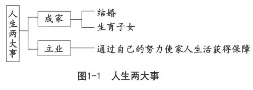
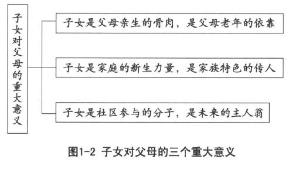
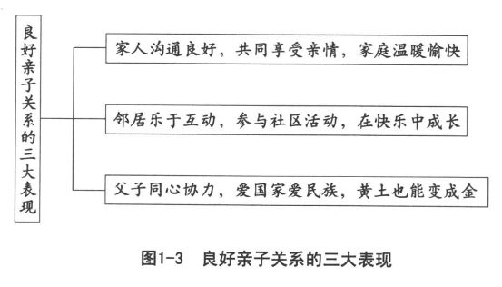
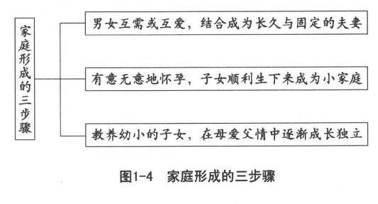
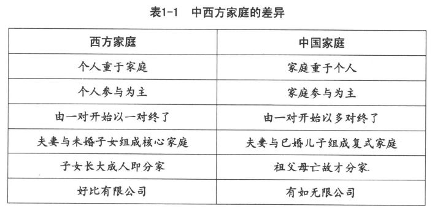
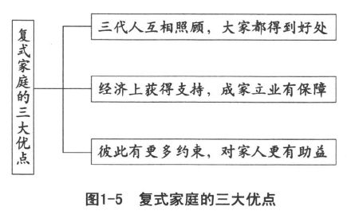
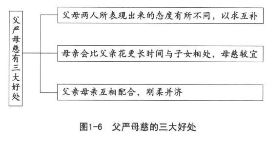
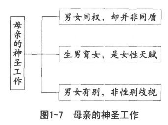

 *第一章　家庭需要良好的亲子关系*

教养子女是母亲最高的天职，

父亲要负起养家的全部责任。

两性应该拥有同等的工作权，

不能以金钱衡量母亲的工作。

为了培育优秀而珍贵的子女，

最好暂离荣耀从职场退下来。

家庭中各分子在对外活动中所具备的代表性可以分为个人参与和家庭参与两方面。对外活动仅仅代表个人的，称为个人参与，个人参与仅表示自己的所言所行、所作所为，与家庭无关，纯属个人的事件，由个人决定，也由个人负责。若是家庭中各分子在对外活动中不仅代表个人，而且还代表整个家庭，那就是家庭参与，由家人决定如何参与，结果也由家人共同负责。

自古以来，中国社会的基本单位就是家庭，而不是个人。虽然在聚会中或团体行动中时常以个人出现，但是这些个人参与和西方社会常见的个人参与并不相同，通常并不是这一个人，而是其所属的那个家庭，我们称为家庭参与。

站在家庭参与的立场，家庭中的任何分子在外面的言行举止，都会被当做这一家人的表现。如果牵涉到财务或法律问题，也会要求这一家人共同负责。家庭是社会的参与单位，这使我们更加重视一家人的良好亲子关系，因为彼此互依互赖、血浓于水而且切割不断，所以更需要良好的关系来保障共同的安全与荣誉，祸福同担、荣辱与共，谁都逃脱不掉，也躲避不了。我们把“齐家”看做“治国”的基础，可见家庭的重要性，家庭在我们的心目中实在非同小可。

现代家庭的凝聚力，实际上已经大不如前，家庭参与逐渐演变为个人参与，一家人出现不同的立场，产生不一样的意愿，似乎谁也不足以代表整个家庭。家长的地位也不像往昔那么稳固，因为家长的代表性已经遭受严重的挑战，想要代表家庭，有时十分困难。不能代表家庭，就谈不上家庭参与，只能够代表自己，只是个人参与。

对于是家庭参与还是个人参与，我们认为，家庭参与和个人参与应该兼顾并重，从而使两种方式都能够发挥优点。这也应该是现代家庭所需要的亲子关系。通过家人共同商议，建立家庭共识，只要是家人所认同的独特家风，就可以顺利地延续下去。家庭的代表者不一定限于家长，也可以因时、因地、因事制宜，推举出合适的代表人选。需要家庭参与的时候，便发挥全家人的力量，需要个人参与的时候，便充分发挥个人的专长。

要达到这种现代化的家庭理想，良好的亲子关系仍然是必要而且重要的因素，唯有家人关系良好，才能够真正做到分中有合（家庭参与）与合中有分（个人参与）在同一家庭中并行不悖，并且大家可以同心协力，在和而不同的和谐气氛下，营造这一个家庭的独特家风。

请问各位，贵府是完全家庭参与，还是完全个人参与，抑或是家庭参与和个人参与兼顾并重？各位可以先了解自己的家庭关系现状，再来合理调整。

成家立业原本是人生的两件大事。成家包括结婚和生育子女，立业指的是为人父母必须努力使家人的生活获得保障（如图1-1所示）。子女是成家立业的原动力，在家庭中意义十分重大。子女既是父母的骨肉，又是家庭的生力军，也是社区的未来主人。但是，先决条件是亲子关系良好，否则这些意义尽失，还可能产生负面作用。

亲子关系看起来是家务事，实际上却影响到邻里社区、国家社会，甚至整个世界。

良好的亲子关系，应该从慎选配偶、健全婚姻关系开始。婚前的基础具有情爱和文化两个层面，如果没有清楚的认识以及正确的抉择，势必影响后来的亲子关系。因此，亲子教育实际上也应该从婚前择偶着手。男女双方，都能够为未来的子女着想，替他们寻找好的父母。对优生的条件，双方都会用心地考虑；对门当户对的观念，也不致由于一知半解而盲目排斥。至少不会视婚姻为儿戏，以致无意中种下后来恶劣亲子关系的祸根。若是不幸已成定局，那就只好加倍用心，在现实情况中，花费更多的时间和精力，以更大的忍耐和毅力，来改善并促进良好的亲子关系。

# 人生的大事是成家立业

成家的意思，是男女成年之后，经过择偶的过程，正式结婚，组成一个家庭并生育子女。立业的用意，则是既然成家，应该为家庭的生计负起责任，建立稳固的经济基础，使家人获得生活的保障，不能再像婚前那样，依靠父兄来养家。

现代人普遍对立业很有兴趣，对成家却能拖就拖，不但结婚的年龄往后拖延，而且不打算结婚的人也愈来愈多。还有人只谈恋爱不结婚，或者先说好不生小孩才结婚。天伦之乐，似乎已经不见踪影；亲子关系，也跟着愈来愈恶劣。重立业却轻成家，人生大事只算是完成了一半，这样的现代人实在谈不上幸福，人生也不够圆满。

一般人想到成家，总认为男女双方已经到了结婚年龄，征得双方父母的同意，在郑重的结婚典礼中向众亲友宣告结为夫妻，便等于成了家，顶多再加上独立的居所。至于其他事宜，却殊少顾及。

实际上，结婚不过是成家的第一步，我们常把没有生育子女的年轻夫妻称为小两口。这表示结婚之后，还需要迈进第二步，即至少生一个孩子，这样才真正成为一个家。大部分父母都盼望自己的子女在送入洞房之后，不久就生育子女。可见成家的意思，是结了婚、生育了子女，只有这样，大家才能安下心来。

生育子女不但是父母的事情，更关系到这一家的祖先，具有十分重要的意义。中国人的家，已经由家庭扩大到家族。结婚典礼中，新郎新娘必须通过一拜天地、二拜祖先、三拜高堂之后，才能够夫妻对拜。这表示谢天谢地，使男女长大成人，又有缘分结成夫妻，希望祖先之灵能够接受这一对新人，成为这个家族的一分子；然后新郎带着新娘，见过公婆；之后才是夫妻相互承诺，要在天地、祖先和父母的爱护和指导下，成为世界、家族和家庭中受到欢迎和尊重的一对。

## 子女对于父母的三大意义

天地、祖先和父母有一个共同的愿望，那就是我们常说的“早生贵子”。这里的“子”，当然包含女儿在内。因为若是重视儿子，不重视女儿，岂非失去平衡？天地之间，必须有男有女，才能够生生不息。生男育女，应该是一样好才对。天地需要人来治理、改善，祖先需要后代子孙来光大家族的品德和事业，而父母也需要子女生育孙辈才能够享受晚年含饴弄孙的乐趣。总的来说，子女对父母有以下三个重大意义（如图1-2所示）：

### 子女是父母亲生的骨肉，是父母老年的依靠

子女从哪里来？为什么而来？为什么在这个时候来？长大以后会变成什么样子？尽管我们十分关心这些问题，迄今却尚未有明确的答案。但是，我们都很清楚，子女是父母亲生的骨肉。

父精母血，提供子女塑造自己的材料，没有父母，子女不可能凭空诞生。血浓于水，表示一家人的关系密切、非同寻常。许多国家采取血统主义，主张以血统来决定国籍，不论在本国或外国出生，皆依父母的国籍为准，父母是中国人，子女便跟着成为中国人。

我们常常谢天谢地，并不需要赋予宗教的意义，因为我们不忘本，所以要谢天地。如果说苍天大地是我们的本，父母便是我们的根。对中国人来说，基于不忘根本的道理，虽然天地偶有不仁，我们还是要常常谢天谢地，那么孝顺父母也成为子女天经地义的事情了。

中国社会重视孝道，却很少讨论为人父母的慈道。我们只能说往昔的孝道有很多不切合时宜的要求，现代的孝道，其内涵可以兼顾家庭参与与个人参与的不同需求来做出合理的调整。相信没有人会大胆到公然否定孝道的价值。

请问，子女应不应该成为父母老年的依靠？如果不能，会不会愈来愈多的人不想生小孩？会不会愈来愈多的父母为了预留养老的费用，对子女的教育不愿意尽心尽力？这对亲子关系可能会产生什么样的影响？但是，父母能够存心期待子女来防老吗？万一子女能力有限，做不到怎么办？会不会使得亲子关系演变成为投资或放债行为？

父母固然不应该存有养儿防老的观念，以免亲子关系变成投资放债的经济行为。有一位相当成功的企业家，居然在电视上公开指称自己的母亲具有投资眼光，知道在他身上放债，所以收获甚丰。这种对亲子关系的侮辱，父母如有判断能力，必然觉得十分伤心。

重男轻女的观念，其实也便由此而产生。因为男子的经济能力较强，当然值得投资，放心在儿子身上放债；而女子的经济能力较弱，唯恐本利难以收回，所以采取偏而不公的态度。事实上，现代男女教育机会平等，就算父母仍然有借贷的观念，也应该抱有生男育女一样好的观念才对。

养儿防老，如果成为一种权利思想，那么亲子关系便永远离不开利害的考虑，难免会重男轻女。养儿防老，应该成为一种义务观念，不但要把“儿”的范围扩大到儿子和女儿，而且要求的主体也要由父母移转到子女身上，不必等待父母提出要求，子女就应把它当做义务，尽力而为。

为父母的施恩不望报，不能把子女当做投资、放债的对象；为子女的却必须不忘根本，恪尽养儿防老的义务，成为父母老年时精神和物质的主要依靠。

### 子女是家庭的新生力量，是家族特色的传人

生老病死是人生必经的过程，有生必有死是千古不变的定律。民族的延续，有赖于生命的继续，如果一个民族的出生率低于死亡率，这个民族很快就会消失。家庭是构成民族的单位，不生子女或子女夭折，家庭后继无人，民族也将难以延续。子女是家庭的生力军，当子女结婚的时候，大家都祝贺新人早生贵子，在食品或衣物中放上象征早生子女的物件，用意都是希望家族能够延续。

生命的继续固然十分重要，文化的持续发展更是民族延续的要件。若是一个民族的文化不能精进，势必会被其他民族所同化，就算人口众多，也将空有民族的名义。因此，一个家族的生生不息，除了要人丁旺盛之外，文化的培养尤其不能忽视。中国历代家庭都以光宗耀祖来勉励子孙，希望一代比一代强，更能够为国家社会作出更多的贡献。

中国的家庭，如果被称呼为世家，便是莫大的荣誉。出身世家，在各方面都会获得礼遇，当然很光荣。世家其实就是势家，拥有强大的势力，在社会上备受尊重和推崇。现代的世家，主要表现在良好的家风上。把子女培养成优良家风的继承人，发挥家族的特色，提升家庭的名声，则是世家努力的目标。

### 子女是社区参与的分子，是未来的主人翁

全球化的浪潮，促进了世界大同理想的实现。但是大同不是一同，不可能忽视小异的存在，所以国家与国家之间，仍然保留相当的差异性。国家的特色不应该完全被抹杀，否则世界各地完全一致，势必导致人类的退步，世界也将陷入毁灭的危机。

国家的特色主要依赖社区来塑造，因为一国之内，也需要保持大同小异的情况，才能够均衡发展而不偏倚。社区的观念，主要是“出入相友、守望相助、疾病相扶持”的现代化。二次世界大战后，在联合国的积极倡导下，社会建设被视为改善民众生活、解决社会问题、有计划地引导社会变迁、促进民生基层建设的有效途径。社区是地方民众共同生活的地方，大家生活在一起，活动在一起，欢乐在一起，培养出共同的情感，也享有共同的文化。

社区的活动，需要民众的热情参与。最理想的情况莫过于全员参与，大家一起来参与，共同规划和执行。子女从小参与社区活动，长大以后，自然能成为国家的主人翁。使家风融入社区，更能增加社区的多样性。若是能够为邻里所接受，成为社区文化的主流，那就更为可贵了。

这些重大的意义，必须亲子关系良好才具有正面的价值，否则骨肉相残，比什么都可怕。父母日渐苍老，子女却一天天长大，子女残害父母不但难以提防，而且抵挡不住。子女的恶劣行为败坏家风，造成家门的不幸。倘若家族的名声因此而蒙羞，父母的罪过实在不小。亲子关系不好、家人失和导致家庭不安，还会影响到邻里社区，令大家都躲得远远的，避之唯恐不及。

可见亲子关系并不是单纯的家务事。我们常说远亲不如近邻，指的是善良和睦的邻居。唯有亲子关系良好，才有可能善尽守望相助的责任。如果亲子关系不好，简直就是恶邻，怎么可能比远亲来得更好呢？

家族的香火固然需要延续，但是家族的文化更需要发扬光大。家族的团结以及荣誉，实际上都以良好的亲子关系为基础，再向外扩大，国家的强盛、民族的兴旺甚至世界的繁荣，都有赖于亲子关系的合理调整。

## 良好亲子关系的主要表现

良好的亲子关系具有以下三种主要表现（如图1-3所示）：

### 家人沟通良好，共同享受亲情，家庭温暖愉快

很多人知道“父母不好当”，却很少人体谅“子女不好做”。专家学者喜欢说“代沟”，好像两代之间有一条横沟，彼此很不容易沟通。其实，有没有代沟，完全看父母怎么想。认为有，它就活生生地存在；认为没有，它便不能产生作用。代沟只是一种警示，未必就是事实。父母把代沟看成可能的障碍，设法加以排除，才是正确的态度。不应该用代沟做借口，来掩饰自己的失责。家人的乐趣，主要在于沟通良好。只有家人彼此倾诉，才是真正的亲情。一家人父母心中有子女，子女心中也有父母，才能够愉快相处，让彼此充满温暖的感觉。

譬如做母亲的，最好对女儿的行动了如指掌。然而在现实生活中，当女儿在母亲身边若无其事地喊叫“妈妈”的时候，有的母亲立即会露出凶得可怕的眼神，逼问女儿想说什么。请问女儿会不会害怕得把原本要说的话一下子咽回去，甚至影响到以后真正有事也不敢禀告母亲？

父母平时应该多和子女谈心，而不应该“无事说大道理，做错事就教训”。经常保持密切的关系，充分了解子女的心灵动态，一家人自然会沟通良好，不受代沟的影响。

父母要想让子女把自己当做商量的对象，父母就应该也让子女知晓自己一天的生活。不能借口工作忙碌或者认为子女年幼不懂事，便不和子女谈心，以防日久产生代沟，被专家学者不幸言中，这样不但会失去家人的关心，也让亲情日益淡薄，而家庭的温暖愉快就更谈不上了。

### 邻居乐于互动，参与社区活动，在快乐中成长

亲子关系良好，邻居就会乐于往来互助，各种社区活动，无论是家庭参与还是个人参与，都会受到大家的欢迎。今日的社区，实际上比往昔我们所重视的家族还要重要，因为社区的形成，是民众自动自发地自然塑造而成的。

我们通常都会十分关心我们和我们的住家、我们和周遭的人以及周遭的环境有着什么样的关系，自己所居住的社区有哪些产业、资源、景观、文化和居民。我们必须衷心感谢祖先的努力，留下这样美好的自然环境，譬如清净的空气、清澈的河川、甘甜的水源以及郁郁葱葱的树林。不论是山村的茅屋、整齐的梯田、具有历史记忆的街道、充满喜悦的割稻情景或者是高楼大厦、宽广的车道、繁荣的街市，都需要子女趁着年幼，热心参与相关的活动，以坚定决心，长大以后好好把这一片壮丽景观继续守护下去。父母带着子女参与邻里的集会、社区的活动，不但有利于社区的发展，而且子女还能够在快乐中茁壮成长。

### 父子同心协力，爱国家爱民族，黄土也能变成金

国家的演进，由神权而君权，逐渐演变为民权。民权国家以民族为骨干，彼此对立并存，由于种种利害关系，加上思想观念不同，经常引起国际间的惨烈战争，使人类遭受不可计数的损失。现代科学先进，交通发达，知识进步，经济互通，促使国与国之间形成不可分离的密切关系，加之言语沟通和风俗习惯的相互渗透，地球村已经逐渐形成。世界各国的大同，相信不久即能实现。我们身为中华民族，更应该致力于发扬中华文化，使其成为世界文化的主流，对全人类作出更大的贡献。父子关系，向来为中华文化的重要特色；家齐然后国治，也是中华文化的重要主张。我们深信，亲子关系的最佳表现在于，全家人不分男女老幼都能够同心协力，坚持用正大光明的途径，在合乎法律与道德的道路上，互相勉励支持，不起邪念，不走歪路，在爱国家爱民族的前提下，共同奋斗，以富家促进富国。

我们常说“父子同心，黄土也会变成金”，亲子关系良好，才谈得上家庭的发展、民族的兴盛、国家的富强。人生的大事是成家立业，成家的大事在于生育子女，而生男育女的大事，应该是亲子关系正常合理。

合理的标准，由于各民族的风土人情不尽相同，所以有差异。我们必须静下心来，先看看中西方家庭究竟有哪些主要的区别。因为现代信息发达、交通便利，很容易受到外来的影响，从而迷失了自己，唯有仔细分辨，才能够明白其中的差异。这对自己的选择，当然有很大的助益。

现在，请静下心来，看看自己家里的亲子关系。彼此之间的沟通，是不是良好？能不能共同享受亲情？一家人在一起，是不是觉得十分愉快？每次回到家里，是不是觉得格外温暖？左邻右舍和自己的家庭比较起来，有什么不一样的地方？邻居的互动，呈现什么样的情况？社区活动能不能吸引大家的参与？自己所重视的是个人参与还是家庭参与？遇到事情，亲子能不能同心协力？对于社区、民族、社会、国家以及整个世界，有没有共同的认识，还是根本不关心？

这些反省，可以促进自己对亲子关系的了解。如果拿出来共同讨论，更有助于家人建立共识。

# 中西方家庭比较

## 家庭形成的三步骤

中西方家庭大同小异，尽管有一些不相同的地方，但很多地方是一样的。因为家庭的形成，通常需要以下三个共同的步骤（如图1-4所示）：

### 男女互需或互爱，结合成为长久与固定的夫妻

通常男女到了身心成熟的年龄，就会寻求异性，选择和追求共同组合家庭的另一半，我们称之为择偶。现代社会，恋爱的风气逐渐兴盛，不论是互需或互爱，还是互需加上互爱，都是家庭形成的第一步。

### 有意无意地怀孕，子女顺利生下来成为小家庭

结婚以后，小两口有计划地生育，或者无意中怀孕，顺利把子女生下来，才算真正形成一个小家庭。现代医药发达，治疗不孕或以其他方法帮助生育，都有可行的办法。生男育女便是家庭形成的第二步。

### 教养幼小的子女，在母爱父情中逐渐成长独立

父母会本能地爱护自己的幼小子女，但是父母也明白自己会老，不可能长期保护幼小。因此，必须用心教育幼小，使其能够满足自身的需要，而不应该让子女自生自灭，没有保障生存的能力。教养子女便成为家庭形成的第三步。

求生存是人类共同的愿望，基本的需要也大抵相同。但是满足这些需求，所采取的方法或途径则因各地的生态环境不同而产生很多不一样的特性。中西方家庭的组合都是为了求生存，为了满足父母和子女的基本需要。然而由于居住的地域不同，所以形成了不一样的家庭结构和制度。我们不妨从以下两方面来做一些简单的比较（如表1-1所示）：

## 西方的家庭结构

在家庭结构方面，西方大多以单纯的核心家庭为主。核心家庭，便是通常所说的小家庭，由一对年轻的夫妻开始，而以一对年老的夫妇结束。其特色说明如下：

### 由一对开始以一对终了，夫妻与未婚子女同住

新郎与新娘在郑重的结婚典礼中结成夫妻，回到小两口自己的家。这一对年轻的夫妻便离开原先各自的家庭，开始构筑属于自己的新家庭。不论所居住的房屋是买来的或者租用的，都是自己的新居，经过生男育女的过程，等到子女长大成人，再各自结婚离去，这个家庭又回复刚开始时的那一对夫妻的状态。只不过年华流逝，岁月不饶人，一对年轻的夫妻已经变成一对年迈的夫妇。这种由一对（年轻夫妻）开始、以一对（年老夫妇）终了、夫妻只与未婚子女同住的家庭结构便是核心家庭的特色。

### 男女结成夫妻称为一对，与子女共组核心家庭

西方社会把尚未生男育女的年轻夫妻称为小两口，有了至少一个孩子之后才成为一个家。核心家庭指的是夫妻和自己的子女，并不包括自己的父母在内，因为已婚子女不再与父母同住。西方人所说的结婚成家，是指离开自己原先与父母同住的家庭，另组自己与另一半所构成的新家庭。结婚之后不再与父母同住，是核心家庭的另一特色。

### 子女成人陆续结婚离去，老夫老妻成年老一对

核心家庭的天伦之乐，只限于父母和子女这两代。一旦子女长大成人，各自择偶恋爱、结婚离去之后，这个核心家庭又回到原先的一对。年老的父母不能获得儿子和媳妇的奉养，也难以享受晚年含饴弄孙的乐趣。只能照顾下一代，很难奉养上一代，造成“快快乐乐地成家，孤单寂寞地收场”，这成为核心家庭的又一个特色。

## 中国的家庭结构

中国的家庭结构，则以复式家庭为主干，通常由祖父母、父母和子女三代所组成，结婚早的，可能延伸到五代同堂。其特色说明如下：

### 由一对开始以多对终了，组成三代到五代的大家庭

中国人喜欢在结婚仪式的终了高喊“送入洞房”，所谓洞房，指的是新郎的父母家中那个特别装扮过的新房。新婚夫妻并不离开丈夫的父母另外构筑新家庭，而是长期居住在丈夫的父母家里，并在那里生男育女。这种由一对（年轻夫妻）开始、以多对（年老和年轻夫妻）终了、构成三代到五代同堂的景象，成为复式家庭的一大特色。

### 女儿长大结婚离开家庭，儿子全家都住在家里

中国人的家庭，在距今三千多年前的周朝，便已经发展成为复式家庭。那时候是农业社会，人力的需求很大，男性的体力比较强大，所以成为家庭中的主要力量。那时以男人为家庭的代表，接受政府分配的农地，到了六十岁，体力无法负担耕种的工作，就要把所分配的农田归还给政府。如果他的儿子已经长大成人，而且愿意种田，只要按照规定办好手续，便可以继承父业，把父亲所分配的田地接下来耕种。有了这样的方便，中国人才会设法把儿子留在家里继续种田，同时把女儿嫁出去，帮助夫家把家事做好。女儿长大结婚，离开父母，儿子全家都留在父母家里，等到儿子的子女长大成人，同样把女儿嫁出去，把媳妇娶进来，这成为复式家庭的另一特色，便是通常所说的男系家庭。

### 一家人能自立但不分开，祖父母亡故才能分家

第一代的父母带着他们的子女构成一个小家庭。当他们的子女长大成人以后，女儿嫁出去，儿子则结婚生子，仍旧和父母住在一起。这时候原先那个小家庭就变成大家庭，其中包含着两个、三个甚至好几个小家庭。这种家庭中有家庭的复式家庭，通常要等到第一代父母已经成为祖父母或曾祖父母直至亡故以后，才会各自分家。大家庭中的小家庭实际上已经能够自立，但是如果第一代的父母仍然健在，除非有重大或特殊的原因，通常都会聚集在一起，这成为复式家庭的又一特色。

## 中西方家庭制度

在家庭制度方面，我们认为西方家庭好比有限公司，而中国人的家庭则比较近于无限公司。兹分别说明如下，以供参考。

### 西方家庭好比有限公司

核心家庭由父母和子女共同组成，但是子女成长到十八岁以后，就要离开家庭独立生活。西方社会的个人主义所强调的自由、独立和契约行为，对西方的家庭制度产生了很大的破坏作用。子女到了十八岁，便向往自由，要求独立，就算经济不能自主，也要依赖契约，向银行贷款，先用再说，以后赚钱再慢慢偿还。政府也会提供各种贷款机会，帮助年轻人独立自主。父母对子女只负起有限的责任，使得西方核心家庭好像有限公司那样，不必担负无限的责任。父母对子女的教养和影响，实际上也是有限的，因此亲子关系显得非常淡薄。

### 中国家庭比较接近无限公司

中国家庭不论子女长到什么年龄，在父母眼中，都永远是不完全成熟的孩子。儿子长大结婚后，与妻子同居在父母家中，不必寻觅自己的寓所，就算儿子的儿子长大成人后仍然可以留在父母家中。复式家庭为子女提供一辈子的支持，使子女比较有勇气主张正义。因为父母时常鼓励子女不畏强权威胁，大不了回家吃自己，家中随时可以加一双筷子，使子女并无后顾之忧。当然，这也很可能养成子女“天塌下来也有父母去顶”的依赖心理，从而偷懒，怕吃苦。父母对子女以及子女的子女负起无限的责任，强调一家人血浓于水，能够长久地互依互赖，实在具有无限公司的架势。

## 中国复式家庭的好处

西方人如果看得懂中国人的复式家庭所具有的浓厚亲情以及彼此互相依赖的好处，大致都会对三代同堂产生良好的观感，甚至羡慕地说：“做中国人真好！”因为这种复式家庭，至少具有以下三大优点（如图1-5所示）：

### 三代人互相照顾，大家都得到好处

中国人的传统婚礼，都是由新郎亲自到新娘家中迎娶新娘，这不但表示了对女方的尊重和恭敬，而且赋予了新娘十分重大的责任。这份责任就是帮助新郎把家务料理好，并且用心奉养二老。不像西方人举行婚礼，由新娘的父亲或长辈把新娘交给新郎。这对中国人来说，实在是对新娘不够尊重。把新娘交出去，由新郎接过来，等于两位新人彼此结合，不一定代表两个家庭的联姻。中国人的婚礼，新娘由新郎迎进家门，马上有两位或四位年高德厚、儿女双全的端庄妇人，细心打开轿帘，亲自把新娘扶出轿来，陪伴着缓慢走向礼堂。其中对新娘的照顾和体贴，代表了新郎全家人的诚意。新娘见过公婆，决定做个好媳妇，把公婆当做自己的父母看待，当然就会全心全意融入新郎的家庭。生男育女之后，祖父母更是欣喜，在家含饴弄孙，退休生活也显得更为温暖幸福。

年轻力壮的第二代，可以在双亲的指导和协助下全心投入事业，不但没有后顾之忧，而且遇有疑难还可依靠父母，可以就近向其请教。由于天天见面，长期相处，对于事务的经过和发展比较清楚，当然可以放心地互相商量。一家人祸福与共，更能够同心协力。

幼小的第三代获益更多，随时回家都有长辈照顾，父母忙碌时，还有祖父母照料。有祖父母在家，父母吵架的次数减少，剧烈冲突的概率降低，这对第三代幼小的心灵大有助益。父母缺乏某些经验，可以在祖父母处获得补足，在教养方面，必然更有助益。

由此看来，中国复式家庭的好处是使一家老、中、幼都各有好处，使家庭成为理想的家园。

### 经济上获得支持，成家立业有保障

西方人结婚时，一定要考虑居住的地方，就算能够贷款，终究也是一种负担。由于家庭不过是有限公司的组合，所以父母不愿意在子女身上多花费金钱，反而提早为自己的老年生活盘算，预先做好退休以后的计划。

中国的复式家庭，具有无限公司的特质，父母认为子女的事便是自己的事，一家人应该关系密切，谁也不应该只为自己着想。所以儿子结婚，就应该及早准备好洞房，成家后仍然和父母住在一起，经济上也不必独立，大家团结起来，更加有力量。往昔的规矩很清楚，父亲在，儿子不应该有私财。换句话说，父亲在世的时候，儿子必须把所有的收入全部献给父亲，全家人的生活费用委托父亲统筹分配。事实上，这种状况不可能完全做到，兄弟们长大后，各自结婚生男育女，也大多采取同居分炊的方式。但是，一家人在经济上互相支持、彼此分享的做法，仍然是值得重视的。而立业的年轻人，由于背后有家人支持，更容易发展。

在复式家庭中，年轻人成家立业会得到更多的保障，立足点更加稳定，自然减轻了很多压力。

### 彼此有更多约束，对家人更有助益

在三代同堂的家庭中，每个成员彼此的观点难免有不相同的地方，为了整体的和谐与安宁，每一个成员都必须自我约束，以免引起大家的反感。此时，家庭伦理就成为十分重要的规范。“伦”的意思，是做好定位，确定家庭中每一位成员的位置；“理”表示各人应该遵循的原则，并且理应如此，不得擅自变动。一家人相处，各有定位，各有原则，彼此合理相待，在互相协助、互相依赖中，各人恪尽应负的责任。中国的家庭伦理，以父子有亲、夫妇有别、长幼有序为三大主轴。父子有亲的意思是父母和子女充满了可贵的亲情，父母慈爱而子女孝顺，大家一起努力，以光宗耀祖，使一家人都有面子；夫妇有别的意思是夫妻同样重要，必须将体力、性格、情绪各方面的差异做合理的调适，务求互相配合，共同合作，以实现彼此的愿望；长幼有序的意思则是确立礼让的基础，以长幼定次序，减少争执，避免互相争夺，增进和谐的气氛。

家人重视伦理，彼此加强约束，人人自律，三代同堂的乐趣必然为大家所向往。

不错，长久以来，我们也发现复式家庭有很多弊端，大多由于人多嘴杂，大家的意见很难达成一致，加上个人自由、独立自主的观念趁机而入，使很多年轻人结婚前便私自发誓，婚后不和父母住在一起，就算勉强维持复式家庭的形式，也是貌合神离。首先是婆媳不和，儿子夹在中间，不知如何是好，以致父子之间也产生矛盾；生育子女之后，更由于两代之间的教养观念不同，很不容易取得一致，因而会出现闹意见、斗意气的状况，以致家庭伦理遭到严重破坏，从而使复式家庭面临更大的挑战。

亲子关系取决于家人的观念，无论是家庭结构还是形式，实际上都是观念的产物。如何教养子女？在子女的幼小心灵中应注入什么样的观念？事实上这些因素足以影响子女的一生。我们认为，复式家庭的优点和弊端都是由人的观念来决定的，大家都往好处想，也向好处做，优点就出现了；而若大家都往坏处想，又向坏处做，弊端自然会不断产生。所以，从小接受良好的教养，端正结婚、成家、立业、教养子女的观念，形成正常而良好的复式家庭，当然是人类理想的生活方式。

现在，我们暂且停下来，看看我们自己的家庭是不是给人一种不中不西的感觉？因为近百年来，我们脑海里充满了“融合中西，取长补短”的念头，总觉得自己的缺失要借重西方的长处来加以改善。结果却由于“知中不知西”、“知西不知中”甚至“中西都不很了解”，以致使两种观念混杂而难以融合，矛盾无法调和，搞成今天这个样子，还自认为现代化。我们最好能正本清源，先把自己的观念弄清楚，再把西方观念的来龙去脉也好好研究一下，以便找出真正适合我们的合理亲子关系。

# 合理的亲子关系取决于良好的婚姻关系

亲子关系应该是婚姻关系的延伸，可惜恋爱中的情人往往迷失于没有条件的爱情理想，严重地忽略了原来有一定条件的婚姻实际。婚前不考虑结婚的条件，很容易为情所迷，甚至为色所诱，埋下了很多祸端；婚后才猛然觉醒，原来婚姻有很多必需的条件竟然被自己忽略；最后，罗曼史很快褪色，留下来一大堆苦恼和难题。

婚后的苦恼和难题首先来自于与家人的关系，究竟是大家庭中增添了生力军，还是小家庭从大家庭中割舍出来？前者可能因为娶得了贤妻，后者则很可能因为娶了妻子忘了爹娘。这一切的责任，好像很难避免地推到了新娘头上。因为儿子为了结婚，就想搬出去住，父母认为，八成是媳妇搞的鬼，如果新居恰好又邻新娘的娘家，那就更加可疑，大概是女方早有计划，要把自己的儿子抢走。如此下来，新家变成冤家，以后问题多多，对于双方的亲子关系，必然有很大影响。

## 婚姻基础影响亲子关系

在子女诞生之前，夫妻便为要不要生育、该不该现在生育甚至要不要想办法拿掉胎儿而争吵不休。在这种状况下，请问胎教如何进行？母子的健康怎么可能良好？子女诞生之后，由于缺乏经验，怎么教养得宜？就算此时父母及时伸出援手，也会因为与父母在心理上已经产生距离，有些话不方便明说，有些事不方便主张，以致老人家愈来愈觉得自己变成了儿孙的帮手或佣人，不但没有乐趣，而且会萌生早日脱手的念头。

年轻人在婚前谈情说爱，以为人生就是情爱和性事，双方在这些方面有共识，彼此欣赏、爱慕，一声“来电了”，便认为情投意合，于是步上红毯。而对于怎样和家人相处、怎样生男育女、怎样分工合作，根本不加思考。这就难怪婚后会经常手忙脚乱，不知如何是好，若身边再缺乏父母的提醒，自己难免会摸索得十分痛苦。

我们建议，两人若是有意结为夫妻，至少要在婚前对亲子关系达成若干共识，奠定良好的基础，以利于未来的兴家教子。换句话说，最好做出一定的准备再结婚。

夫妻双方都应该认定，良好的婚姻关系才能够产生合理的亲子关系，婚后或共同生活在大家庭中，或另组小家庭，都要在婚前有所考虑。事实上，由于实际情况的限制，复式家庭愈来愈不容易维持原有的面貌。因此，我们建议，维持复式家庭的精神，采取小家庭的形式，尽量住在父母家的附近，平日加强联系。这样看起来像核心家庭，却具有复式家庭的密切互动关系。一家人必须和谐互助，家庭才能和乐，如果小家庭只顾自己，必然得不到大家庭的关心和协助。这些都是恋爱中的情侣必须及早建立的共识。只有具有合的观念，才能增进彼此的关系，而处处要分，自己一定吃大亏。

夫妻婚前最好能冷静地认识到，两人生长在不同的家庭中，各有不一样的观念和背景，今后要共同生活，必须将双方的观念拿出来比对一下，譬如商量协调家庭、亲子、教养方面的意见，以求在求同存异中建立一些共识，这对于亲子关系，必然有良好的作用。

生男育女之后，小两口升格，当了父亲母亲。但在欣喜之余，不要忘记自己的责任。生育的过程固然十分痛苦，而且会有相当的危险性，但比起教养，生育还算是容易的，此时子女教育的责任才刚刚开始，必须用一辈子的时间，投入大量的心力来教养自己的宝贝，才对得起上天，对得起父母，也对得起自己。与教来比，养也比较容易，教育子女，实在是最为艰巨的任务。

## 亲子关系中父母的角色分配

只有父母双方在子女面前表现出一致性，子女幼小的心灵才能够知所遵循，并在学习中逐渐养成习惯。父母之间的差异性，往往会造成孩子投机取巧的习性，比如，某些事情向父亲要求，某些东西则瞒着父亲向母亲索取。利用父母之间的矛盾来满足自己需求的孩子，当然会养成投机取巧的不良心态。如果长大以后变本加厉，父母所承受的恶果恐怕是意料中的事情。当然，父母不可能保持高度的一致性，在若干问题上，难免有不同的看法，这时候最好关起门来商量，避免在子女面前发生争执。父母单独交换意见，获得妥协，再打开门来，在子女面前表现一致性，这应该是比较妥当的教养子女的方式。

最可怕的莫过于父母中的一方以牺牲对方来讨好子女。换句话说，就是用出卖对方的方式来争取子女的欢心。我们常常听见做妈妈的恐吓子女：“再不听话，等爸爸回来，就知道皮痛了！”不管有意或无意，这都是在暗示子女和母亲相处比较安逸，和父亲相处就不那么安全了。此时母亲最好改用这样的说法：“爸爸在外面，工作又累又辛苦，你（们）希望他回家来看到你（们）就生气吗？”子女一定回答“不希望”。母亲接着说：“这样很好，我会告诉爸爸，你（们）今天很乖，也不希望爸爸生气，以免伤了身体。所以我们现在要做一些改变，把这种情况调整过来，好不好？”

夫妻是合作的伙伴，无论伤害哪一方，或者出卖哪一方，实际上对双方都很不利，应该尽力加以避免。

分工合作，最方便有效的原则是父严母慈。为什么呢？我们提出三个好处，供大家参考（如图1-6所示）。

### 父母两人所表现出来的态度有所不同，以求互补

若父母都很刚硬，子女谁都不敢碰，只好压抑自己，有话不敢说，就容易造成家庭中沟通不良。这是父母的责任。若父母都很柔和，子女谁都不必顾忌，就会容易造成子女说了算，谁都阻挡不了的可怕情况。这同样是父母的责任。不如父严母慈，双方软硬兼施，一刚一柔，就可以收到刚柔并济、互相配合的功效。子女方便沟通，父母才能够掌握实际状况，做出合理的教导和辅助。有人喜欢说这是黑白脸的扮演，我们则建议把它看做预留弹性，完全是为子女着想，而不是站在父母这一面，存心戏弄子女。

### 母亲会比父亲花更长时间与子女相处，母慈较宜

如果母亲较严而父亲较慈，就会造成子女和母亲在一起的时候勉强忍受，等到父亲下班回家，子女便会把一肚子委屈向父亲倾诉，将所有要求向父亲提出，结果累坏了父亲，也气坏了母亲。不如父严母慈，让子女长时间享受母爱，等父亲回家时，做出一些重点提示，以资警惕和改进，这样更有助于家庭的和睦进步。我们认为，男女同权而不同质，父母双方同样拥有对子女的教养权，却由于男女有别，各有各的特质，所以表现出不同的角色扮演。

### 父亲母亲互相配合，刚柔并济

换句话说，父亲应有男人的威严，而母亲应有女人的仁慈，这对子女对自身性别的认识有很大的帮助。不像现在很多家庭，把儿子教养得像女性，女儿教养得却像男性，这简直是非人表现。父母变得中性化，子女也跟着向中性化发展。这样的教养到底好不好，各位可以自行辨别。父亲平日十分刚强，但是一旦柔和起来，很可能胜过母亲；母亲平时十分柔和，但有时候会比父亲更加刚硬。这种刚中带柔和柔中有刚的特色，也不是中性家庭能够看到的。

当然，如果父母双方愿意改变为父慈母严，我们也不会反对。因为角色扮演，最好配合个人的人格特质，配合度愈高，扮演起来的效果愈好。

无论如何，在教养子女方面，母亲所付出的时间和精力远比父亲多。同样，在子女心目中，母亲的伟大也远远超越了父亲。因此可以说，教养子女是母亲最高的天赋（如图1-7所示）。虽然父亲也应该负起责任，但再怎么说也比不上母亲。身为母亲，可以说整天由早忙到晚，时时刻刻都在操心子女的事情。母亲这份工作，比起父亲每天上下班、领固定薪水，不但所花的时间更长，而且所费的心思也更多。如果母亲比照父亲那样支领月薪，恐怕父亲把所领的全部交给母亲，也不能满足母亲的期望。所以我们才明白，为什么母亲不必上班，父亲却把辛苦工作获得的报酬心甘情愿地全部奉上。原来不能够用金钱衡量的工作，实在比以金钱作为报酬的事务要高贵得多。做母亲的，能够善尽教养子女的天职，完成这种无法用金钱来衡量的神圣任务，应该引以为豪。

现代职业妇女逐渐增多，她们所持的理由，不外乎丈夫的收入不够，家庭生活有赖于自己的收入，或者对某种工作有兴趣，而且这种兴趣超越了处理家务、教养子女的兴趣。更糟糕的是，受到男女平等思想的影响，很多女性认为，男女不应该在职业上受到不平等的待遇，在她们看来，女性拥有职业，好像比管家育儿来得高尚而有面子。这种思想完全忽略了男女有别的事实，也不重视女性的天职。

男女同权不同质，男女最大的不同，便是只有女性才会生育儿女。这种不同的质，对于女性的职业必然产生重大的影响。我们不能够有性别歧视，却无法改变性别差异的实际状况。男女有别并不是性别歧视，男女平等也不表示男女同质。

母亲的工作，不能以金钱来衡量，也无法用金钱做报酬。教养出好子女，不但子女幸福快乐，母亲自己也必然幸福快乐。我们并不反对女性享有同等的工作权，女性也应具有同等的职业自由。但是，我们认为，从怀孕开始，最好能够暂时从职场上退下来，专心把生育的工作做好，等到子女长大，再逐渐恢复自己的职业。这对家庭、对子女、对自己都有很大的好处。

有些女性，为了职业而不生子女。这种天真的想法，不但使自己失去很多人生的乐趣，而且当有朝一日产生不一样的念头时，自己却已经过了生育年龄。这对女性来说，更是后悔莫及。那时候另一半还具有生育能力，这岂不是徒增很多烦恼，出现很大的危机？

还没有结婚的男女朋友，最好记住“爱情没有条件，而结婚应该有条件”这句话。好好考虑双方的实际状况，预先虚拟一下，结婚之后可能产生哪些问题、有哪些可能后悔的地方，事先加以避免，以增加婚姻的稳定性，这对未来的亲子关系，也能添加一些好的营养。

已经成家的夫妻，最好应明白“男女同权不同质”的道理。尽管双方都拥有同等的权利，却由于男女有一些先天的不同，所以男女会扮演不一样的角色，不必完全求同，这对于改善亲子关系，更具有良好的作用。

