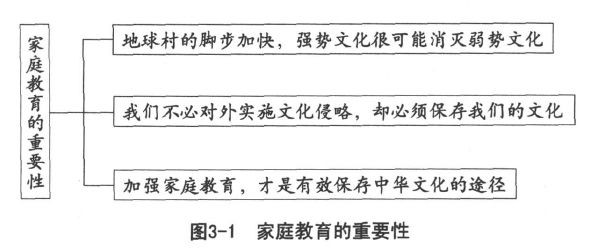
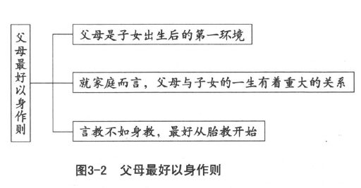
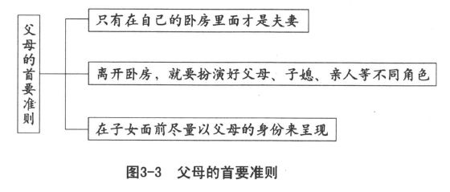
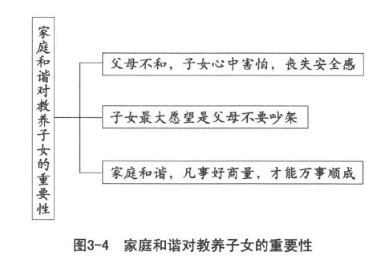
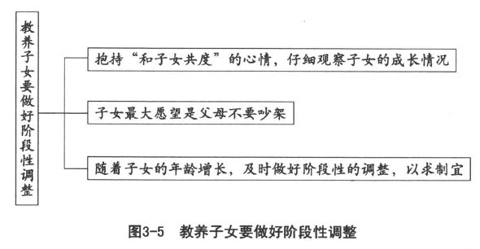

 *第三章　现代人更重视家庭教育*

言教不如身教，最好从胎教开始。

父母离开卧室，就应该像个父母。

孝顺要有敬意，不能像平辈朋友。

既然都是人类，最好当做“人父母”。

观察子女状况，一定要照单全收。

每遇阶段调整，都应该预先商量。

我国自古以来就十分重视家庭教育。旅美人类学家许娘光先生研究指出：中国的社会结构以家庭为基础；家庭中的成员关系，以父与子的关系为主轴；其他的人际关系，都以此主轴为出发点。父子的关系，不但发生作用于家庭之中，而且会扩及宗族乃至国家。中国古代的君臣关系，实际就是父子关系的投射。

人类的幼稚期太长，如果没有家庭组织给予幼小子女爱护与营养，人类必定不能生存。家庭对人类特别重要，因为家庭是孩子长大既而塑造人性的温室。如果缺乏家庭的照料，就算子女得以幸运生存下来，也会和一般动物那样，徒有兽性而没有人性。子女在婴儿时期，如果得不到家庭的温暖，长大以后必多冷酷无情，甚至孤僻乖张。人类从家庭中感受由推爱而推食的“仁心”（仁人的心），比较容易消解人间因隔阂而形成的对立，而且易于扩展人间因互助所形成的通道，这便是我们所重视的“仁道”。人类为什么不能离开“仁道”？就是因为唯有人类才有这么长久的幼稚期。一只小鸡出了蛋壳，便能行走、觅食，以自谋生活。一个婴儿要想能够行走，非一两年时间不可；到了能够独立谋生，更非一二十年做不到。在这段长久的依赖期内，如果得不到他人的同情与扶助，根本没有办法生存。因此，家庭成为社会的肇端。社会学家指出家庭是初级的社会单位，无论什么时代，无论什么社会，都有家庭的存在。

钱穆教授说过，中华文化有三大传统：一是中国人，一是中国的家，一是中国的国。每一个中国人，在我们特有的家与国之下，也就有了我们的天下。他认为中国人理想中的修身、齐家、治国、平天下，应该一以贯之，虽然不一定会平到中国以外那个属于全人类的天下，至少我们中国人心目中的天下，能够达到一个比较特殊的理想，也就是获得其平了。我们中国人的家和外国人的家有很多不一样的地方，值得我们珍惜、爱护和看重，不能够任意加以毁坏。用一个连自己也搞不清楚的“现代化”理论便把珍贵的文化遗产丢掉，实在是非常不理性也不明智的。

现代化是全人类共同追求的目标，全球的各个国家，都在不同的阶段中，企图摆脱传统的束缚而朝向这一目标奋力迈进。现代化最重要的一环，应该是人民生活的现代化。换句话说，现代生活是现代化最重要的部分。但是，什么是现代生活呢？就家庭来说，经济意义已经逐渐减弱，而教养与情感的培植却愈显重要。21世纪人类最难解决的全球化与本土化之间的平衡问题，恐怕只有依赖家庭教育，才能够合理地化解（如图3-1所示）。

全球化是现代化的重要指标，但其所引起的本土化减弱却成为十分麻烦的问题。各民族为求保存自己的本土文化，势必在全球化的浪潮中更加强调原有的文化，以免遭受强势文化的侵略而丧失了自己的文化，于是家庭教育便成为保持并发扬本土文化最为坚固有效的堡垒。如何与其他民族相处？如何融合其他民族的文化，却能够不失去本土的色彩？实在是现代家庭必须负担的任务。

当我们接触西方文化，发现西方社会提倡权利平等而导致不尊重对方，强调个人主义而产生代沟甚至影响社会安定的时候，是不是应该想想我们尊敬长上、敬老尊贤、家庭稳定、重视伦理、安定社会的一些好处？特别是西方青少年的种种乱象和犯罪行为，是不是让我们想起家庭恪尽教养的功能？然后以稳定的家庭、正常的亲子关系，帮助青少年免于紧张、焦虑和迷惑以获得正常的发展？或者盲目跟进，弄得和西方一样，才来后悔呢？能不能坚定信心，认清家庭必须善尽教养子女的责任？而亲子关系其实就是正常的教养关系。

生物界的亲子关系，说起来十分可怕，而且可悲。有些雄性动物授精以后立即死亡，雌性动物产子以后也告死灭，只有最简单的原生物亚米巴由于无亲无子，所以不老而且不死。但是亚米巴的生殖是分裂为二而各取其中之一，只能称为兄弟，而不是亲子。人和其他动物所生的儿女，完全不同于父母。既然有生的事实，也就免不了死的现象。人有死亡，基本原因即在人有诞生。子女的出生，象征父母的年纪老大，更加接近死亡。因此教养子女的责任，就更加不能忽视。否则父母死亡，子女又不能承接，这个家庭怎么能够生生不息呢？

# 以身作则，做子女的好榜样

笔者有一位朋友，在大学教书，育有一男一女，都教育得十分成功。笔者向他请教教养方法，他回答说：“没有什么好方法，完全是因为我的收入不多、生活穷困的关系。”他接着说明：由于薪资不高，课余除了看书之外，根本没有余钱可以从事其他活动。想不到子女从小耳濡目染，竟然也养成有时间就看书的好习惯。他略为辅导，指引看一些好书，子女的学业成绩一直不用操心，课后又喜欢在家阅读，没有不良的三朋四友，生活单纯，不容易沾染不良习气，所以品德也不错。

## 以身作则必须从胎教开始

父母是子女出生以后首先接触到的人，对子女的成长和学习具有十分重要的关系。可以说，母亲的子宫是子女的第一个家庭环境，父母二人是子女的第二个家庭环境，家人、亲友和家中的装潢和摆设则是子女的第三个家庭环境。家庭对于子女的一生，影响非常重大，近朱者赤、近墨者黑，父母的责任，由此可见。父母以身作则，必须从胎教开始（如图3-2所示）。

古人非常重视胎教：妇女怀孕时，不能倒着身子睡觉，坐着或站着都要端正而不歪斜，不能吃怪味的食物，不能听下流放荡的音乐，不能看乱七八糟的颜色，不能接触有害身心的字画。因为古人认为这样生下来的子女才会容貌端正、才智过人。现代中外儿童教育专家也都认为子女出生以前应该进行早期教育。不但要考虑胎儿的健康，而且要顾及胎儿的品德和智力。妇女怀孕时，应多看好书，多想美好的事情，多听悦耳的音乐，多欣赏大自然的美景和美好的艺术作品，保持心情愉快，多做好事情。中国人的禁忌好像要多一点：不能拿剪刀，不能搬重物，不能受惊吓，不能钉钉子，不能移动睡床，不能闻太刺激的味道，不能吹风，不能吃太冷的东西，不能出远门，不能乱动房内的物品，不能观看丑陋的景象。这都证明，在子女出生之前，我们已经对其给予了很热烈的欢迎、很多的关怀，希望子女将来长大，也懂得关怀别人、受到欢迎。

现代人深受西方的影响，已经不很了解什么叫做关怀。父母对子女的关怀，大多依据西方的标准，扭曲成父母对子女的干预。实际上，以前中国社会之所以充满了人情的温暖，便是彼此关怀所表现的特色。人和人的关系，不但互为感应，而且多彩多姿，富有变化。就算夫妻吵架，也可以找朋友诉诉苦，或者妻子回娘家暂住几天，等到情绪平静下来，再由丈夫把她接回家里，夫妻和好如初。因此减少了离婚的可能性。这种人与人的关怀，在西方社会很不容易产生，所以他们的离婚率很高。不幸的是，我们很快就学得人间的疏离，愈来愈不懂得关怀，离婚率也节节升高，成为一种令人伤感的“时尚”。

## 子女的学习生涯从模仿开始

子女刚出生时，犹如一张白纸，父母着以什么颜色，就可能染上什么颜色。子女的学习生涯从模仿开始，而模仿的对象，最早出现的便是父母，所以父母的一举一动、一言一行都必须谨慎。最要紧的一句话是：在子女面前，父母最好忘记自己是夫妻，却应该牢记自己是子女的父母。唯有如此，才能够时时扮演好父母的角色。记住，生儿育女之后，只有夫妻二人单独相处的特别时刻，才可以放松而以夫妻的情分相见，有子女在场，最好以父母的角色为重。为人父母者必须牢记如下首要准则（如图3-3所示）。

为什么婚后两代之间，特别是婆媳大多处得不愉快？其实主要原因即在年轻夫妻不懂事，不知道只有公婆不在场的时候自己才是夫妻，公婆在场时，凡事以公婆为重，自己只能够扮演子媳的角色，暂时忘记自己是夫妻。只要有这一条，就足够减少很多不愉快的事情，使人生的大道，走起来更为畅通和快乐。

夫妻的角色，当然和父母不一样。许多教养的问题，根源便是父母不以父母的角色出现，却在子女面前扮演夫妻的角色。好夫妻未必是好父母，为了教养子女，好父母应该比好夫妻更为优先。有人批评中国家庭太严肃，不如西方家庭那么轻松，因而怪罪礼教吃人，把中国人绑得太紧。实际上，我们今天身受无法管教子女的大害，便是放得太松的缘故。紧要放松容易，松要返紧很难啊！

我们的亲子关系便是在传承的过程中有一代放松了，以致很难恢复原有的样子。现代的父母，对子女几乎都很无奈，开口就是“子女长大了，我们管不了”，或者“时代不同了，子女的事情，他们自己会管，我们少操心”。当父母怪罪礼教吃人的时候，并没有寻找一条合理的途径，准备好一套取代的方案，就把礼教废掉。子女在这种情况下长大，又怎么去教养他们的下一代呢？所以必须正本清源，好好地想一想子女的一生究竟以什么作为发展的基础，然后好好地帮助子女把必要的基础打好。

## 子女一生的幸福从好习惯的养成开始

子女一生是否幸福，取决于是否养成良好的习惯。养成良好的习惯，自然幸福；养成一大堆不良习惯，当然不可能幸福。子女的好习惯，必须自幼养成，不能到了长大时才想要加以矫正。有些父母在子女幼小时，就发现他们有不良习惯，但都一笑置之，认为子女“还小嘛，长大以后就不会这样”而不予纠正。其实良好的习惯必须自幼养成，不好的毛病也应该在小时候趁早加以改正。

### 在潜移默化中培养子女的良好习惯

父母的言行成为子女耳濡目染的对象。我们说过，有什么样的父母，就会教养出什么样的子女。子女对父母来说，是一面明亮的镜子，清楚地反映出父母的模样。父母打算让子女养成怎样的习惯，最好自己率先做到，以身作则。有一些实在做不到的，最好的方式是由父母向子女说明，比如，母亲可以对子女说：“你爸爸一生最难过的，就是小时候不小心，养成这种不好的习惯，一直想改，才发觉习惯一旦养成，要改实在很困难。我们不要讲他，更不要笑他，免得他更难过。我们最好一同鼓励他，使他更有信心，早一点改变。”母亲的不良习惯，同样由父亲委婉地向子女解释。为什么不能由当事人自己说明呢？因为那样一来，子女很可能认为是父母在寻找理由为自己辩解，这无形中又让子女增添了一种坏习惯。家庭是子女最重要的教室，一切基础都在这里奠定，所以人生最要紧的是家庭生活。

现代家庭已经全然被电视节目入侵。制作单位原本想要运用这种现代化科技，把教育送进家庭，达到家家有电视、户户受教育的美好目标，想不到一句“市场导向”，就把原先的目标完全毁灭。为了取得高收视率，制作人不得不做出连自己都不想看、也不敢看的节目，但这就等于向品德教育宣战。为了生存必须想办法赚钱，赚到钱又失去了良心，毒害了全民的家庭，实在令人心寒。

当然，这种现象并不是电视这种行业的专利。当前社会，种菜的人自己不敢吃，制药的人自己不敢服用，都是为了市场而丧失良心的后果。根本原因，即在长久以来疏于教养子女，一代比一代放松家庭教育。如果不能及时注意，加强教养，恐怕不久的将来，就会成为十分严重的社会问题。

电视或电影的许多情节，原本出于市场区隔的需要，是拍摄给成年人观看的，可是现在却逐渐放宽尺度，成为孩子们最好奇也最爱看的影片。我们说孩子愈来愈早熟，实在是推卸责任的借口。我们不明白电视教育的重要性，不能为子女选择好节目，或者出于溺爱的心理，让孩子过早接触打斗砍杀、作奸犯科、暴露色情的影片，无形中将各种毒素灌入孩子的头脑，以致产生了可怕的后果。

### 父母的生活调适

子女尚未来临时，父母是这个小家庭的主人，两个人享有很大的自由。只要门关起来，爱怎么样就怎么样，既不干扰他人，也不必承受他人的干扰。

子女出生以后，正式成为这个小家庭的一分子，将来父母年迈，说不定还要把他当成主人翁。在这种情况下，尊重子女的存在与自由，势必削弱、减少父母的自由，自由度忽然间由50％减少到33.3％。做父母的如果不是为了繁衍后代这一重大责任，相信谁也不愿意放弃自己的自由。

我们也许认为，大人们的交往有实际的需要，也是成人世界的事情，和孩子无关。我们可以放心做大人们爱做的事，不必担心孩子的反应，因为孩子既看不懂，也不会有意见。不料孩子在这种情况下，竟然不知不觉养成了很多不良的习惯。而这种间接的影响往往比直接的教导更具有决定性的作用。

儒家一再倡导，家庭是家人的安全住所，主张大门可以不闭，内室的门一定要关牢，便是基于夫妻的室内形象不要向家人公开。而现在很多父母随时随地表现出夫妻的形象，当着子女的面过分裸露，甚至做出性爱的动作，又不知道如何恰当地向子女说明。这也成为现代青少年早熟却不知如何应对的乱源。

有些父母对待佣人作威作福，看不顺眼便大声斥责。子女看到父母的样子，就会依样画葫芦，采取同样的态度对待佣人，结果可想而知。还有一些有钱人家把教养子女的重大责任，轻易地交托给佣人，这样当然难逃“富不过三代”的厄运。

如果佣人难请，父母对待佣人的态度便会180度调转过来，以致巴结佣人、讨好佣人，和佣人过分亲近，这样同样会产生不良后果。子女会误认为佣人和父母一样可靠，因而完全接受佣人的教导，完全相信佣人的话，以致带来更大的危险。对待佣人尚且如此困难，对待亲人和宾客，那就更不容易了。子女看在眼里，记在心里，父母的一举一动，都逃不过子女雪亮的眼睛。

对父母而言，偶尔找一些刺激原本是人之常情。因为人生在世，难免嫌弃平淡、不甘寂寞。于是呼朋引友，在家吃饭喝酒、猜拳斗酒，还会去唱卡拉OK或者打麻将、玩桥牌、跳迪斯科、玩电动玩具。这时我们有没有想过幼小的子女有什么样的感受？

父母想要和朋友聚会，或者基于实际需要，不得不参与各种应酬活动，我们当然不会反对。我们只是建议，不要在自己家里当着子女的面从事这些活动，想要玩乐吵闹，到外面去，这对教育子女有很大的助益。

### 家中的装潢和摆设，也需要父母以身作则、妥当安排

住家但求够用，不必求广大豪华。子女从小享受惯了，将来长大离开家庭，若是一时能力不及，不能获得同等的享受，岂不倍觉辛苦？倒不如先让子女居住比较小的房屋，多少受一些束缚，对子女更有帮助。

所用的家具以合用为宜，不必要求奢侈。因为人的生活水平，由节俭进入奢侈很容易适应，由奢侈重返节俭就十分困难。家具的选用，最好安全舒适，求其整齐清洁。如果可能的话，婴儿要有自己的睡床。长大成为儿童以后，尽可能让他有单独的房间。因为孩子在出生后第一年的体验会决定他们的成长和自我意识。在欧美社会，婴儿一出生就单独睡在自己的房间。中国人大多并不如此，婴儿出生后，大多跟父母一起睡，如果无法做到，至少也要睡在同一个房间。

我们认为，不必急于培养子女的独立精神，而应该一步一步逐渐放手，这样比较合乎人性。我们的教养目标设定在“独立中有依赖，才能够与他人合作；依赖中有独立，才不致迷失了自我”。人毕竟是合群的动物，过分求其独立，与他人格格不入，并没有好处。不使孩子过分依赖，固然十分重要；不使孩子过分独立，应该也是教育子女的重大指标。

### 父母最好彼此相约，时时注意自律

凡是不期望子女学的、做的，父母都不要做，以免孩子看惯了父母的做法，很快就模仿。有一位喜欢抽烟、喝酒的朋友，一直认为自己并没有什么不良的嗜好，喝喝酒、抽抽烟应该无可厚非。有一天，忽然发现女儿也拿着一根烟。他一下子呆住了，觉得骂也不是，不骂也不是，心里十分难过。不久又发现儿子拿着酒杯，有模有样地喝着。他这才惊觉原来自己的爱好起了不良作用，于是当着全家人宣誓戒酒戒烟，儿子和女儿很快也放弃了这两种尝试。

妈妈带着女儿上街，看到喜欢的衣物马上购买，回家以后还到处炫耀，展示一番。女儿下一次到玩具商店，喜欢的就要买，妈妈不答应，女儿就索性往地上一坐，大声啼哭，弄得妈妈不得不投降。这又使子女养成了坏习惯。

身教重于言教，如果只和子女空谈理论，讨论原则，父母的实际行动不能够配合，恐怕很难收到效果。譬如父母告诉子女不要睡懒觉，自己却蒙头大睡，日上三竿还不起床，那么父母即使费尽口舌，大概也不能使子女信服。

我们说了这么多，看似要求父母成为圣人，其实“天下无不是的父母”只不过是祈使句，代表对父母的高度期待。就算我们把它当做陈述句来解释，也应该站在子女的立场，而不是基于父母的观点。

### 孝顺父母要有敬意

子女对父母的孝顺，如果缺乏一个“敬”字，把父母当做平辈的朋友看待，就不能算是真正的孝顺。尽管父母有些地方做得并不令子女满意，但是起码已经尽力。为人子女的，应该对父母存有敬意，不应该批评或指责父母。

视父母为“无不是”便是一种尊敬，而不是盲目地顺从。亲子关系中包含着非常重要的亲情，情是中华文化的骨干，我们不像西方那样，从柏拉图、亚里士多德开始便以理性为主，情的地位在西方并未受到重视。情就是情感，儒家重孝，便是通过亲子的情感来提升人的道德水平。无情的人道德修养不可能良好，所以我们一方面寄望父母以身作则，做子女的好榜样；一方面也期待子女能够抱持“天下无不是的父母”的心情，来尊敬父母。孔子不认为坦白到出面指证父亲偷羊的儿子是正直的人，便是由于这种表现简直不近人情，哪里是正直？凡事发乎情止乎礼，家人相处一定要有亲情。只要发乎情而又止乎礼，就相当合理，因此我们对父母或者对子女，都不要苛求才好。

# 维持家庭的和谐与安宁

## 家和万事成

家庭的和谐，对于教养子女至关重要（如图3-4所示）。在子女面前，父母绝不要轻易互相责骂，或者怒目相向，甚至出手伤人。有什么问题，最好避开子女再来商量解决。在子女面前，尽量维持和谐的气氛，这样子女的身心才能健康发展。吵架的父母经常低估了吵架在子女心中造成的深刻影响。心理学家研究证实，父母在生气时的所作所为，俩人也许一转眼就忘记了，但是子女仍会记在心里久久不能忘怀，而且会给他们造成不安或不幸的感觉。许多西方儿童呐喊着“上帝啊！不要让爸妈吵得那么厉害”，就是因为心中害怕，怕有一天父母不再爱他，或者有一个会离开他，从而使其幼小的心灵失去安全感。

如果尝试着让子女表达对父母的期望，相信很多子女会提出“父母吵架时，其中一位应该先停止”的建议。可见，子女对父母的吵架，印象有多深，体会有多明确。

子女平日接触最多的便是父母，受其影响当然最大，因此父母之间必须和睦。我们发现许多不良青少年，他们的父母不是离婚，就是感情不睦。我们固然不能也不必歧视单亲家庭，但是离婚的父母，最好设身处地替子女想一想，他们是何等的无辜。事实上，离过婚以后，有很多当事人后悔的案例。何况再次结婚，也有很多人承认再婚的对象竟然和第一次婚姻的配偶十分相像。既然所爱的就是这一种类型，为什么不在结婚之后，索性睁一只眼闭一只眼求得相安无事呢？只有婚前睁大眼睛，相信婚姻是有条件的，能够把婚姻当成大事，力求谨慎，婚后才可以互相包容、彼此尊重、凡事好商量、和谐共处。

## 不做“神父母”、“鬼父母”，要做“人父母”

我们无意也无法将父母分类，但是经过长期观察，笔者却发现父母经常有不同的表现，大略分成下述三种类型：

### 把自己当成神的“神父母”

由于神具有无边的法力，所以这类父母可以任意责罚、鞭打、驱使、命令子女，没有什么慈爱，不论什么公正，甚至不需要合法。凡是顺我、信我的，便给一些好处；逆我、疑我的，当即给予处罚。这种“神父母”，在子女幼小时，的确具有相当威力。可是，子女到了两三岁以后，就会开始要求独立自主，从抗拒大小便的训练开始，渐进为对父母的指示不愿意接受，这种摆脱父母管教的欲望，到青春期会达到最高峰。这时“神父母”势必受到严峻的挑战，若是父母仍然坚持采用神的方式，一心一意要保持至高无上的权威，很可能就会仿效某些神明（神明会通过神通和神迹，使信徒心生恐惧而加深信仰），迫使子女产生一种不正常的心态：认为父母是完美的，父母不满意，永远是子女的错误，从而认定自己是不好的，至少不如父母那么好，认为自己是软弱的，至少不如父母那么坚强。于是，子女就会像某些信徒那样，永远依赖神的保佑，一切听从神的指示。这样的子女永远长不大，这样的家庭，表面上看起来十分和谐，实际上却是和稀泥，严重地扭曲了和谐的本意。父母的权威，达到神的程度，子女只能够顶礼膜拜，一切听命，永远不能独立，这哪里是真正的和谐？

和谐并不是讨好，无论父母讨好子女或是子女讨好父母，都不可能和谐。和谐也不应该是和稀泥，因为教养的目的，在培养正确的是非观，从教养的过程当中，养成子女慎断是非的态度和能力。就以学校上课为例，如果要问一位学生：为什么匆匆忙忙赶去上课？大部分答案是：迟到会挨老师的骂。再问为什么不可以干脆不去上课？答案也是：不上课会被记旷课。大多数学生根本不明白上课的真正用意，以致满脑子“为父母读书”、“为老师上课”的错误观念，足见不能明辨是非。和谐的目的在求圆满中分是非，而不是没有是非。

高压式的教养不但不易收效，而且会加重子女反抗父母权威的心理。“神父母”的心态，如果不能加以调整，很可能愈演愈烈，终至一发不可收拾。

### 把自己当做鬼的“鬼父母”

当父母的权威失去效力或者遭受严峻的挑战而感到吃力时，“神父母”当不成，很可能就转变为“鬼父母”，以加强子女的恐惧感和无助感来巩固自己的地位。他们动不动就威胁、恐吓，使子女在恐惧中完全服从命令。在子女的心中，时时有雷电的预感，而且知道来自父母的“雷电”随时会打下来。他们不敢期望晴空万里，也不敢期待风和日丽，却一心一意期望“雷电”早一点出现，然后再莫名其妙地等待下一次“雷电”的来临。这种家庭，离和谐太远；这样的“鬼父母”，不是把子女整死，就是逼使子女稍长大后便离家出走。

讲到无助感，子女就更加可怜。美国心理学家塞力曼（Seligman）曾经做过这样的实验：把狗关在实验箱内，用鞍绳绑牢，然后施以电击。刚开始时，狗会挣扎、扭动、哀叫、拉屎、撒尿。但是无论它做何反应，都于事无补，都不能逃避电击的痛苦。隔了一天，工作人员又把这条狗放进另外一个实验箱中，一端是电击装置，另一端则是没有电击的装置，中间只隔一道矮墙，很容易跨过去，狗如果想要逃避电击，只需轻松跨越矮墙，并不困难。但是，电击开始时，狗痛苦地哀鸣几声，便安静下来，不再挣扎，一副逆来顺受的样子，乖乖地承受电击的痛苦。虽然对这条狗的束缚已经解除，但它仍然毫无逃避的企图和反应。狗急居然也不会跳墙，因为它已经产生了无助感，变得十分消极。

“鬼父母”的最大“成就”，应该是促使无辜的子女学习到这种无助感，子女只知道无可奈何地忍受痛苦和折磨，却毫无冲破逆境的企图，更谈不上有发愤图强的行为表现。这种无助感并不是与生俱来的，完全是“鬼父母”的高压和恐吓所产生的恶果。

“神父母”有爱心，却要求子女百依百顺；“鬼父母”缺乏爱心，却也要求子女绝对服从。这两种父母，都不可能营造真正和谐的亲子关系，也不能使子女安心地生活。

### 把自己当做人的“人父母”

我们最好明白，任何人只要活着，就不可能是神。再神也不过是人，何必把自己看成神呢？但是，世界上似乎只有人喜欢装神弄鬼。有些人明知自己不可能是神，却一装再装，务求装得像神。结果装神不像反倒像鬼，那才是得不偿失。不如反过来想：我们既然生而为人，就应该把自己当做人看。只要把人做好，也就不枉来此度一生，问心无愧了。

父母把子女当做人看待，首先就会明白，人有个体差异，每个人各不相同，因此看待子女，也要有所区别，而且加以尊重，并不刻意求同。加上人各有不同的优缺点，不可能十全十美，所以不致苛求子女样样第一，不能稍有落后。

既然是人，终会衰老，需要子女的照顾。在金钱方面，也应该加以扶持。父母是向子女表明，将来不用子女的钱，先父母如果地下有灵，会不会认为自己的子女在怨责先父母竟然要自己的钱，或者自我标榜在是否用子女的钱这一方面表现卓绝？自己以身作则，奉养先父母，却向子女表示，自己不用子女的钱，是不是同时向子女暗示，自己比先父母更高明一些，或者更有本事，更有办法呢？子女赚钱奉养父母，主要的意义原本不在“养儿防老”，而是子女应该尽这份孝心。但不知道从什么时候开始，这一道理却被一些不明事理的人曲解为养儿防老，并且大加批评，这才蒙受不白之冤，以迄于今。

孩子求学期间，父母最好告诉子女，读完书赚了钱，必须奉养父母，以此来加强子女的责任感，这也是父母应尽的一份责任。父母可以不要子女奉养，却不能以此自我标榜，也不应该因此而倡导子女不必奉养父母。有些人为了不接受子女的奉养，避免养儿防老的讥讽，更下定决心，不生男育女，这是不是十分可笑的做法？

当然，父母不能存心养儿防老，不应该硬性规定子女要给多少钱，更不可以看子女给多少钱而表现出相应的态度。父母也不能够因为自己的钱够用，便认定子女不需要负有奉养父母的责任。孝心有精神的一面，同时也有物质的一面，子女的处境不同，不能一概而论。

是人就应该有仁心，对子女管教应该严格，但是必须出于爱心，严中有爱，子女即使一时不能接受，终究会体会父母的爱心，而逐渐了解父母的良苦用心。

子女逐渐长大，开始喜欢凡事表示意见，甚至和父母争辩。这时“人父母”就会想到自己是人，子女也是人，认为这种情况原本是人之常情，不致一时气愤便以子女无理取闹为由而加以斥责。出现这种情况，父母最好忍耐一下，等待争论过后，再向子女说明，相信效果会更好。

人都善于模仿，“人父母”当然明白子女会以父母为模仿对象。记得一位教育界人士曾经说过这么一句话：“父母不能以身作则，起码也应该以身作例。”不能够时时作则，至少也可以偶尔做例。譬如平日工作十分忙碌，经常不在家中，不能够每天按时分担某些家事，至少也应该利用短暂的时间做一些家事。再由另一半向子女说明：若不是工作太忙，一定会帮忙家事，自己再表示歉意，实在是不得已。

很少发脾气的人偶尔发发脾气，大家才会重视，因而才能够产生一些效果。若是动辄发脾气，大家习以为常，根本没有什么反应，那就是白发脾气，徒然伤害自己。“人父母”明白这个道理，在家很少发脾气、使性子、说重话，所以偶尔发一次脾气，就会给子女留下深刻的印象。同时为了避免父母再发脾气，也会特别小心。

严父，并不是整天板着面孔，不苟言笑。态度严峻的父亲，子女大多敬而远之，反而什么事情都想法隐瞒，从而产生很深的隔阂。严的意思，应该是绝不放松。但是所采取的方法和态度，仍然要因时、因地、因事制宜，才算合理。有些人一听到严，一想到严，就立刻认为那是至高无上的旧传统，便是不了解严父仍然有慈祥的一面。让子女轻松愉快，却仍然坚持自己的原则，丝毫都不放松，这才是受子女欢迎的严父。

人的成长，大多有一定的过程。譬如学习语言，一岁的新生儿女，由早期吸吮反射，发展到口腔动作的灵活、舌头肌肉的协调，能够经由哭、笑以及各种声音的模仿，在喃喃学语中奠定说话的基础。一岁半左右，可以使用单一的词汇来表达不同的语意，算是说话的开始。单一的词汇重复使用，是这个阶段的特点。两三岁时，能用简单的口语模仿大人的语气、语调，将所学的语汇组合成简单的句子。三岁以后，才能够逐渐用复杂的语句。大约七岁左右，才逐渐熟练。

“人父母”知道语言的学习过程，所以不致过于焦虑，一直担心子女的语言是不是出了什么问题。有些父母发现子女说话结结巴巴，便认为是口吃，因而刻意要求子女重说，以致增加很多不必要的压力，非但无济于事，反而加重了症状。实际这是不流利，不一定是口吃。但是也不必排斥子女的口吃问题而坚信自己的子女不会这样，这样只会延误治疗的时机。子女语言障碍的治疗，需要父母的参与和配合，父母需提供广阔的语言刺激环境，表现正确的语言模式，对子女施以爱心和关怀，这将有助于子女的语言发展。

子女在成长过程中，心理的变化很大，“人父母”会顺着这种变化而妥为调理。“人父母”也知道自己不一定了解子女，所以随时在日常生活中细心观察，多花一些时间和子女接近，从子女的情绪、读书心得以及兴趣转变，甚至吃饭、睡眠是不是正常等方面来加以注意。发现子女有错误，不会随意责骂，也不会轻易放过，必定以诚恳的态度婉言教导，以免引起子女的抗拒。

“人父母”不是圣贤，难免也会犯错，但是教养出来的“人子女”却会以“天下无不是的父母”来回应。这多么富有人情味。“人子女”有时也会心甘情愿地视父母为“神父母”，尽力顺从父母的指导。只要出于自愿，那就是正神，不可能变成邪神。“人父母”做得好，最起码不会成为子女心目中的“鬼父母”，“人父母”会维持人的身份地位，不愧为人，无愧于心，这样也就不枉此生了。

出于对“天下无不是的父母”的认识，子女不必对自己的父母做出什么评论。但是，自我反省对任何人都很有必要。父母应扪心自问：自己对待子女的方式是属于“神父母”、“鬼父母”还是“人父母”？或者站在子女的立场想一想：我们平日的表现，在子女心目中，会有什么样的反应？把父母当神，固然不好；把父母当鬼，那就更加不妙；若是把父母当做人看，就比较放心。但是同样是人，也有不一样的角色扮演，必须是人当中的父母，而不是人当中的朋友，更不是人当中的佣人。

人生有着阶段性的变化，子女的成长阶段，父母最好顺其自然，在教养的方式上做出合理的调整。相信只要调整得合理，必然有良好效果，而且必然会受到子女的欢迎。

# 教养子女要做好阶段性调整

## 制订长期的教养子女计划

父母对于子女的教养，最好制订长期计划。依据子女的年龄、实际状况，采取不同的教育方式。换句话说，教养子女要适时做好阶段性的调整，以求合理（如图3-5所示）。

### 子女入学以前，以培养良好习惯为主

尽量通过各种游戏或活动，提供各种玩具和用具，以促进孩童手指的灵活性和全身动作的协调性，在团体游戏中学习相互配合、协调谅解、分担任务的态度与方法。进行各种寓教于乐的活动，引导孩子从中学习所需要的生活经验，逐渐养成一些基本习惯。唯有亲子互动、共同欢乐，父母才知道子女真正的成长情形。这时候，父母还要常以笑容来鼓励子女表现真实的言行，因为明了子女，才有办法观察到子女的身心情况。

譬如婴儿笑的时候，父母也跟着笑，彼此产生交流，真正和孩子在一起。但是心理学家特别指出，不管花多少时间与子女在一起，都只能算陪伴子女，必须为子女做一些事情，才算是共同度过。如果父母仅仅是坐在一旁，各看各的书，或者一起看电视，根本没有注意到子女，这样的陪伴对子女并没有意义。因为只有量而缺乏质，不能真正地交流。对子女来说，父母也是独特的、唯一的、不可替代的。子女希望和父母在一起，更希望彼此有真正的交流，从而营造出温馨的气氛。在父母面前，子女是天真无邪的，所有言行都没有伪装，所以父母可以亲自去了解，对别人的评量和建议，最好只作为参考，未可尽信。父母观察子女的言行，不能够只凭一两次的发现便妄加判断，以免错怪了子女，让子女觉得冤枉而难以接受。

父母当然不可能在家专门教养子女，所以母亲就算原本在职场上工作，怀孕生育之后，也最好能够暂时辞去工作，在家担任全职妈妈。父亲工作之余，也应该抽时间和子女共度，使子女获得更周全的教养。

观察子女的行为，主要在了解子女的动机是什么，但是动机看不见，任意加以猜测也未必猜得准确。最好的方法就是多用耳朵听听子女在说些什么，为什么这样说，为什么在这个时候说这样的话。许多父母喜欢在子女面前滔滔不绝，却很少聆听子女所说的话。这种方式只能制造亲子之间的紧张和冲突，使两代之间更难互相了解。

父母用心聆听子女的话，才能够通过子女所说的话听出背后的动机，以便进一步了解子女真正的用意。要想让子女把心中的困惑或问题说出来，有赖于父母的沟通技巧。通常父母耐心听完子女所说的话后，只要适当地重复子女的那句话或者其中的几个字，便能够引导子女说出更多的话来。譬如子女说“我不去”时，父母不妨重复“不去”这几个字，子女往往就会顺势说出不去的原因。为了引导子女说出更多的话，父母必须设身处地站在子女的立场，配合子女的年龄、性别和所处的场合，以将心比心的方式，来细心加以体会。

对子女真实的身心情况，父母最好能秘而不宣。因为父母了解子女的目的，并不是为了寻找子女的缺失，更不是为了炫耀父母的精明，完全是出于有效辅导和合理教养的需要。如果把发现的缺失公开说出来，反而产生不良的后果，增加辅导的难度。我们都知道隐恶扬善是一种美德，可惜一般父母在对待子女时，经常忘了这一点，不但没有发扬这种美德，反而时常背道而驰，不惜揭子女的疮疤，伤害子女的自尊心，甚至逢人就说，生怕张扬得不够快速。

### 父母抱持“和子女同步成长”的心情，双方都不断学习

和子女同步成长，一方面可以了解子女，一方面也可以自我学习。因为子女不断成长，同时内外环境也在持续变化，所以父母不能够以固定不变的观点来观察子女和了解状况，必须一方面教导子女，一方面也从子女的实际反应学习到一些新的东西。这种“借由父母自己的调适，来改变子女的习惯”更容易促成亲子的和谐，使子女变得更乐于接受父母的教养。因为“要改变别人，只有先改变自己，才是最有效的方式”，父母从子女身上发现自己应该改变的地方，岂非自我成长？活到老，学到老，父母也不能例外。

如果发现子女的身心发展有什么不合适的地方，父母最好私底下记住要点，千万不要惊慌失措或者张扬出来，以免影响子女的心理。譬如父母第一次听到女儿说出“我讨厌妈妈”这句话的时候，多半十分吃惊，甚至愤怒。有些父亲还趁机指责母亲管教不当，双方大吵一番。有时就算父母十分理性，态度缓和，好好和女儿沟通、讲道理也没有用。其实，这时候不要马上有反应，应该暗中把女儿的话记下来，然后先回想一下，在自己的生命历程中，是不是也有过类似的经验？子女反抗父母或者讨厌父母，一定有原因，只是说不出来而已。如果父母没有办法了解，不妨向自己信得过的长者请教，交换意见，获得有效的方法，回头再来妥善地应对。

父母可以暂时搁置下来，等待大家情绪比较稳定的时候，让女儿有发表自己感受的机会，说出为什么讨厌妈妈。然后告诉女儿，自己当年和女儿一样大的时候，也曾经在心情不好的情况下，讲过这种话，后来很快就明白父母的爱心，于是非常惭愧。这种心平气和化解子女责难的方法，应该是很好的方法。

俗语说，欲速则不达。解决任何问题都需要一些时间，着急、生气、怒吼、责骂，都没有用。往往愈急愈使问题僵化，反而增加处理的难度。在子女幼小的心灵里，父母的情绪平稳、自尊自重，应该是最好的典范；若是急躁不安，丝毫没有耐性，恐怕迟早会成为子女的坏榜样。

我们最好分辨清楚：生活的法则是不变的，而生活方式则是可变的。子女入学以前和入学以后，所必须遵守的生活法则是一样的，并没有什么差别，不过生活方式有一些不同而已。在家要听父母的话，入学在校要听老师的话，这属于相同的生活法则。在家有什么不愉快，可以向父母说明，请求父母协助，在校同样可以请求老师处理。不过要附带一点，老师要照顾的学生，数量比父母要照料的子女多得多，所以需要特别嘱咐子女，如果老师忙不过来，或者没有处理好，可以回家后再告诉父母，不要在学校哭闹，惹人家笑话。有变有不变，最好向子女举例说明，使子女逐渐明白变与不变的道理，学习应变。

入学以后，父母必须率先尊重教师，使子女养成敬师的习惯。当子女和老师发生不愉快时，不能够在子女面前数落老师的不是，以免误导子女使之看不起老师，因为看不起老师的学生，不可能从老师那里学到东西。若是带着子女向老师兴师问罪，使老师尊严受损，万一怀恨在心，连本带利向孩子讨回公道，岂不是反而害了子女？常见有些父母，听子女哭诉老师体罚，便怒气冲天地找到学校，同样哭诉说：“我自己的孩子，我从来不曾打过，你凭什么打我的孩子？”幸亏老师没有这样回答：“就是因为做父母的不负责任，从来没有打过，我才不得不代替你们，做这样令人痛苦的事情。你们身为父母，不但不知感谢，还反过来骂我！”天下事本来就是公说公有理，婆也说婆有理，父母和老师这样吵来吵去，叫子女听谁的呢？

父母耐心教导子女，对自己培养平心静气的习惯也很有帮助。什么叫做耐心？就是一方面使自己耐下性子，一方面也让子女逐渐改变。可见亲子之间都需要不断调整，也表示双方都持续地成长，可喜可贺！

## 阶段性调整之前要充分沟通

随着子女的成长，父母能够率先做好阶段性的调整，才是亲子关系持续保持良好的保障。常见许多父母原本和子女处得很好，一段时间之后，便由于发生种种不愉快而耿耿于怀，这便是没有适时做好合理调整、难以及时应变的缘故。

孩子进入幼儿园是一个新的阶段；子女正式入学，成为小学生，又是另一个阶段，中学、大学也是不一样的阶段；大学毕业以后，成家立业以后，都是不同的阶段。不可以用一句“孩子在父母眼中永远长不大”便不知道及时调整教养的方式和态度，以致觉得“孩子长大了，翅膀硬了，不听话了”而自怨自艾。

父母会老，子女会长大，每一阶段，都有不同的需要，当然不能够永远采取同样的态度。

在做出阶段性调整之前，必须充分沟通，好好商量，这才能做出改变。而且不应该即说即做，丝毫不留余地，有些事情固然可以说了就算数，有些事情却应该保留若干弹性，适当留一些时间，逐渐调整过来，效果可能更好。家庭不是法庭，父母也不是法官，加上子女也不是罪犯，当然不必令出必行、判决就要执行。

子女断奶之后，逐渐具备走路和语言这两大重要的能力，于是行动的空间日益扩大，接触外界事物日益繁多，开始主动地、积极地与环境互动，父母最好看清这种重大的发展，明白幼儿的行为方式很可能和社会所认可的方式有所冲突，显得幼稚而且充满了危险。

父母在这一阶段，就应该逐渐在爱与限的界限上，小心谨慎地将幼儿纳入社会的正常轨道，促使子女顺利地社会化，特别是基本生活习惯的养成。譬如婴儿时期，父母或别人会把奶或汤送到子女嘴边。而幼儿时期，就要让子女自己使用汤匙或筷子，使其在适当的时间、合适的场所，以适当的姿势和顺序来进食。在这种阶段性的调整过程中，父母必须以身作则、再三示范，并且耐心教导，让孩子模仿学习。一味催促和斥责，幼儿不但不能接受，而且在人格形成方面还可能引起副作用。若子女在这一阶段养成不良的行为方式，以后要改会更加困难。

儿童心理学家告诉我们，社会化只有在幼儿的认知发展配合下才能迅速达成。一些看起来十分简单的生活习惯，仔细分析起来，实际都相当复杂。譬如坐着进食，似乎很容易做到，但是，坐的姿势、拿餐具的动作以及眼睛、手和嘴的协调，会着着实实调整一辈子。有些人迈入青春期，进食的姿势仍然十分幼稚，便是这一方面的习惯没有做好阶段性的调整。

幼儿有好奇心理，总是什么都想尝试。这时候为了安全起见，父母大多提出一些限制。如果由于限制太多，影响到子女的自由发展，使其产生强烈的不安和焦躁，那么长大以后，子女的行为方式也会受到不良影响。

社会是多样、多元的，那么幼儿的社会化到底以什么为对象？这就牵涉到父母的价值观。我们常说子女在十八岁以前，命运大多掌握在父母手中；十八岁以后，才真正能够自立。子女年纪愈小，愈没有独立自主的权利，一切听任父母的安排，可见父母的责任十分重大。要把幼小的子女带往何方？要让幼小的子女接受什么样的社会化？对于子女未来的发展至关重要。

法国婴儿长大后成为法国人，美国婴儿长大后成为美国人。即使是同一个国家，各地区的风土人情也略有不同。同样是中国人，南方的婴儿长大像南方人，北方婴儿长大像北方人。偏偏现在有一些父母，一心一意要把自己的亲生子女教养成美国人，有一点不像就不满意，非要尽力改变不可。具有这种价值取向的父母，教养出来的子女，想不做美国人事实上都很困难。

笔者有一次在荷兰的一处公园，远远看见一位年轻的黑发黄皮肤青年，待他走近时，笔者问他是不是中国人？他回说父母都是。再问他会不会讲中国话？他率直地回答不会。进一步追问为什么不会？他毫不避讳地回答：妈妈从小就禁止他说中国话。然后用手在脑袋前做了一个动作，表示妈妈的脑筋有问题。这位母亲对孩子的教养也许十分成功，可惜价值观有问题。相信子女长大以后，也会对父母的教养方式合理评估。

随着东西文化的快速交流，美国式的生活方式、社会风尚、科学知识与价值标准蜂拥而入，进而美国化的冲击也成为中国人近百年来的重大事件。当我们的社会贤达、地方士绅西装革履，过的是带有冷气、汽车的生活时，要想阻止我们的年轻子女进一步模仿牛仔、嬉皮，事实上十分困难。但是，美国社会的种种病态，也随着信息的快速传播而日益显露。希望我们的父母，不要以美国式标准为世界标准，更不必认为中国人要变得像美国人那样才算是现代化。唯有如此，我们的亲子关系才能够保留中华民族的特色。

阶段性调整怎样调整，固然由父母的价值观来决定，但是子女的感受也是父母必须注重的因素。谁也不是圣贤，不敢担保自己的价值观不会误导子女，所以最好的方式是随着子女的年纪增大，逐渐减少“绝对”的观念，放宽“相对”的角度，来开阔子女的视野。

譬如教导子女听老师的话，并不是绝对的。我们首先要坚定立场，不能够攻击老师，也不应该斥责孩子，要让委屈的子女在情绪上得以发泄，有机会把心中对老师的抱怨说出来。然后，想办法帮孩子解决当前的困难，等孩子冷静下来，再探询相关的细节，以便进一步了解真相。父母可以同意子女的看法，同情子女的诉苦，更应该帮助子女了解老师的用意。如果老师真的有一些偏差，也要鼓励子女勇敢地接受挑战，而不是要求学校更换老师，或者申请调班，变换孩子的班级。随着孩子逐渐成长，父母可以促使子女明白：老师也是人，同样可能犯错。进而告诉子女，将来学成后，在社会上工作，也可能遇到一些不讲理的人，不如趁早培养忍受困境和对付困难的良好习惯，这对自己有很大的助益。

