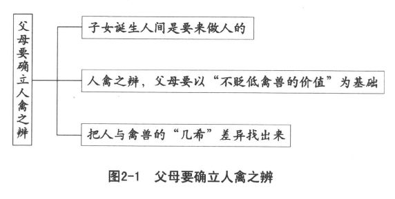
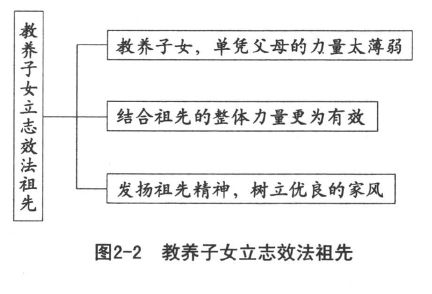
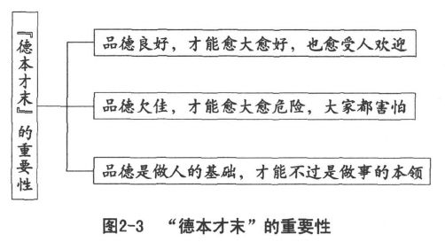

 *第二章　亲子关系决定于教养观念*

首先必须确立人禽之辨，

把子女教养成真正的人。

教养成为真正的中国人，

母语是文化传承的基础。

美化祖先家传增强信心，

教养子女立志效法祖先。

人是观念动物，具有什么样的教养观念，就会造就什么样的亲子关系。因为亲子关系由亲子双方所表现出来的态度、行为所决定，而双方的态度、行为又为各自的观念所左右。观念产生态度，行为决定关系，希望改善亲子关系，最有效的途径莫过于检讨自己的教养观念。

一般人不知不觉接受了很多不正确的观念，譬如不要让子女输在起跑线上，弄得幼小的子女疲于奔命，接受根本不必急着学习的东西，结果累坏了尚未成熟的身体。不错，音感和言语感觉在幼儿时期应该及早训练，但是练习小提琴、钢琴以及学习外国语言文字并不需要这么早就开始。不要输在起跑线上，真正的意思是一开始就要正确，以正确的方法，学习必要的东西，而不是一般人所说的时间要提早。父母自己不明白道理，就会把幼儿教师当做专家，几乎完全听从这些“专家”的话来指挥子女。并且因为子女受到“专家”的严格训练，也成了小“专家”，在家中便被父母娇生惯养。遇有宾客来访，父母为了展现子女的专长，显耀自己的心血，便会命令子女表演一番。大家礼貌的夸奖，会使子女以为自己真的与众不同，于是对父母其他的教导，既不重视也不接受，最终当然是害苦了子女。人生的根本条件是生活，而教育子女怎样生活，只有父母才能安排得最安全周到，而且可靠。自己的子女自己教，父母在子女的生活教育方面，必须负起重大的责任。

身为父母，最好采取反求诸己的心态，把自己所造成的亲子关系，冷静地检讨一番，想想为什么会这样。不要把责任全部推给子女，因为年轻的子女即使负有一半的责任，也很难有能力加以改变。父母自己就算只有一半的责任，总归有翻盘的能力。既然如此，求子女不如求自己，真正扛起责任，这对于改善亲子关系，应该更为有效。若是尚未生男育女，甚至还没有结婚，那就更好，趁早把自己的观念做一番梳理，将来采取合理的态度、行为，当然就会建立良好的亲子关系。

由于现代社会信息发达，传播迅速，加上平台广阔，几乎不受限制，所以有些信息难免粗制滥造，各种信息正误掺杂，真伪难辨，以致毫无系统。我们家里的抽屉、箱子、橱柜，每隔一段时间就会整理一下，把各种乱七八糟的东西清除掉。只有我们的脑袋，好像从小到大一直没有整理过，里面所装的观念，有对的，也有错的；有现代的，也有过时的；有幼稚的，当然也有成熟的。让它们混杂在一起，难怪脑筋很乱，该想的想不出来，不该想的反而想一大堆。这时候最好的办法，便是用虚拟的方式，把自己的脑袋翻转过来，将里面所有的观念都倒出来，然后逐一检查，认为对的、合用的，再重新装进去，对于自己无法辨识、难以判断的观念，还应该逐一列举出来，以便向高明者请教。

譬如对子女的观念，常见的至少有下列几种：

■子女是自己制造出来的，身为制造者的父母，当然有权力安排子女的一切，子女不能反抗。

■子女太麻烦，现代环境也不能用来防老、养老，不如干脆不生，减少很多麻烦，也少掉很多负担。

■如果生男育女，就应该负责教养成为有用的人。如果让我们自己衡量，根本没有这种能力，所以不如不生。

■反正是自己的子女，依照自己的喜好来养育就是，别人管不着，也用不着担心别人怎么看待。

■子女是上天托付给父母的，不能任凭自己的喜好，必须按照天道人理，好好教养，才不辜负上天。

■人和一般动物一样，大家都自生自灭，反正优胜劣汰，适者生存。生育子女是父母的责任，怎么活下去、成为什么样的人，还不是儿孙自有儿孙福。

■生育子女，就应该好好教养。在子女入学以前，必须重视对子女的教养，为子女奠定一生的优良基础。

■爱的教育，是父母应尽的责任。子女有自由发展的基本人权，不能由父母加以限制。

■有爱就必须要有限，有约束才是真爱，否则就是溺爱。所以父母必须对子女加以责备、处罚、教育。

■教养子女必须具有权威，父母不严，子女便不成才。自古棍棒底下出孝子，爱子女应该表现为勤教严管。

请问，您的看法比较接近哪一种，还是都不相同？是不是可以花一些时间，把自己的想法写下来，做一番整理？当然，我们更希望夫妻双方各拿一张白纸，不要彼此商量，先冷静地想几分钟，然后把自己的想法写下来，互相交换，看看是不是相近，不同的地方又在哪里。实际上，我们这些观念都有一定的道理，可惜都是片面的道理，并不是完全正确的道理。

# 父母要确立人禽之辨

没有人敢问这样的问题：“您的子女是人还是禽兽？”因为听者的反应很可能会使提问的人受不了。我们是活生生的人，子女也是活泼可爱的人，一家都是人，任何人只要被怀疑“是人吗？”被咒骂“像人吗？”就会认为是奇耻大辱，难以承受。

子女诞生人间，分明是要来做人的。身为父母，当然也盼望子女早日成人，绝对没有人一心一意要把子女养成禽兽。不幸的是，社会上竟然真会出现禽兽不如的东西（“畜生”）。我们也发现，有些父母真的把子女当成禽兽一样：养而不教，忍心让子女自生自灭，活得不像人样。所以，亲子关系实际上应该从人禽之辨着手（如图2-1所示）。

## 承认并接受人原有的兽性

说起人禽之辨，马上有人替禽兽辩护，说什么禽兽有什么不好？难道人就真的比禽兽高贵？因此我们必须特别申明，人禽之辨，最好以“不贬低禽兽的价值，不否认人性中含有兽性”为基础，以免一开始就掉入二分法的陷阱：以人性为善，而视兽性为恶。

由于禽兽没有理性和自由，只能够接受本能和冲动的支配，可以说无所谓善恶，不过是自然而然的非道德（不是不道德，当然也不是道德，纯粹与道德无关）的活动。林语堂说过：“人类继承动物和原始野人的遗传本能，也就是进化自然过程的产物。这一种知识已使旧时关于人性原善原恶的辩论变得没有意义了。战斗的本能、饥饿的本能、性欲的本能、结群的本能以及一般本能超过理智的优越力，这一切都已容易被人了解。你不能因为人有性的本能而责备他，就似你不能因为海狸有性的本能而责备它一样。”

孟子说：人和禽兽不同的地方，只在于极微小的地方。长久以来，我们一直把孟子所说的极微小的部分无限地扩大，造成鄙视兽性的观念，甚至以兽性为罪恶的源头，实是十分对不起孟子。读书必须举一反三，孟子说人和禽兽不同的地方很少，就在告诉我们人和禽兽相同的地方其实很多。人类所拥有的衣、食、住、行、育、乐，禽兽几乎全有，所不同的不过是人类比较体面而己。同样是吃饭，所吃的东西不一样，吃的方式也不一样；同样是居住，住的场所不相同，居住的方式也不相同；同样有乐趣，但是花样各不相同，仅此而已。

往昔我们过分强调人和禽兽不同，并且把人抬到十分崇高的地位，却将禽兽贬低到令人鄙视的地步。父母看见幼小的子女玩弄自己的性器官，马上大惊小怪，严厉加以制止。徒然使幼小的心灵遭受伤害，从此误认为性器官是肮脏的。子女一岁多时，父母开始向其介绍身体各部分的名称，眼睛、嘴巴、鼻子、眉毛、手、脚、头都一一介绍，只剩下一样性器官，从来不介绍，也使得子女不敢去说那一部分。三岁以后，子女在客人来访时，偶尔赤身露体走进客厅，马上被父母赶走，并加以责备。而如果穿着裤子，事态就没有那么严重。这就使子女逐渐认为：不可以让人家看见自己的裸体，特别是性器官。子女五六岁时，看见公鸡和母鸡、公狗和母狗在进行交配，很好奇，问父母它们在做什么？父母立即驱赶开鸡、狗，告诫子女不要看那种肮脏事。不错，我们的用意应该是以人性发展出来的理性来疏导兽性，转变兽性，促使本能与冲动能够由兽性的发作渐渐经由理性的运作来获得合理而有益的表现。

关于这一点，罗素在《权威与个人》一书中分析得十分透彻：“驱策我们那些野蛮祖先从事战争与狩猎活动的本能，需要寻找一个发泄口。如果无路可走，势必将迫使这些本能转变为恨与顽强难御的恶意。我们为这些本能找出很多无害的出口。譬如比赛和户外运动可以代替战斗本能，冒险、发现、创造可以代替狩猎。我们绝不能忽视这些本能，也用不着因而觉得遗憾。”

罗素认为有很多坏事由本能带来，而人类伟大成就中有很多最好的收获实际上也由本能而产生。他主张对于人的本能与冲动，不能够一味加以制止，也不能引向破坏性的出路，而应该多多找出能为人类生活带来快乐、光荣与灿烂光辉的出路。中山先生在《国民要以人格救国》的演讲中，也倡导“人本来是兽，所以多少带有兽性，人性很少。我们要人类进步，是在造就高尚人格。要人类有高尚人格，就在减少兽性，增多人性”。

## 教导子女人性与兽性相结合

我们现在提出一个问题：某小姐和男友热恋，她非常爱男友，也相信男友非常爱她。当男友提出要求，要和她发生性关系时，她应不应该答应？各位的第一反应，恐怕是这种问题不会发生在亲子关系上面，因为子女不可能拿这种问题向父母请教。年轻人遇到这样的困惑，通常会问老师、问同学、问朋友，有的甚至任何人都不问，自己想想便做出决定；有的想都不想，高兴都来不及，就满口答应；更新潮的，则是反过来要男友和她发生性关系。

就算子女拿这个问题向父母请教，相信很多父母也答不出来。放眼今日社会，非夫妻的男女关系逐渐司空见惯：大学女生兼差当应召女郎，中学女生上网要求援交。性行为的放任，使很多人认为婚前性行为简直不算什么。这种观念和行为刚开始还是欧美人士的专利，没过多久便流行全世界。可见在性事方面，人禽之间已经愈来愈难以分辨，甚至有些人的恶劣行径实在比禽兽还不如。性教育好像永远在背黑锅，成为大家交相指责的对象，也成为光怪离奇的性泛滥的借口。

我们应该了解，像这一类的教育，必须采取“矫枉过正”的方式，尽量拉得紧一些。孔子说的“取法乎上，才能得其中”应该是这个意思。否则稍微放松，就会造成今日这种不可收拾的局面。因此这一点非常值得性教育工作者警惕，我们大家更应该小心。

笔者在大学教学多年，当然也遇到女生询问类似的问题。笔者一向主张三分法，通过第三者的意见来避开双方当事人的尴尬。记得当时所引用的答案，是旅美哲学家吴森教授的一番话，他这样说过：“假如我反对婚前性行为，一定会招来不必要的辩论，也许以后没有人来选我的课。要是我赞成婚前性行为，那只不过是随波逐流，人云亦云，卑无高论。”他采用中国式沟通方法，先“道可道，非常道”一番，接着才说：“事情没有这么简单，要看你们两人爱的性质来决定。大体而言，爱可以分为两大类。一种爱是以‘关心’或‘顾念’（英文可用concern来表达）为主的，另一种爱是‘探究’和‘好奇’（英文可用wonder来表达）的成分居多。假如你们两人互相关注、互相珍重的话，已经有做夫妻的准备了。但假若你们的爱有一方是以wonder为主的话，恐怕你们的爱是不能维持太久的。”当时教室里鸦雀无声，同学们好像都相当满意。

三分法的意思是，遇到问题不必只依靠你和我双方来对谈，以免由于彼此看法不一致而造成面子上的不好看。若是其中一方恼羞成怒，更不容易沟通。遇到问题时，把合适的第三者搬出来，作为中介，避免双方直接碰撞，就可以减少面子的作用，达到顺畅沟通的效果。亲子之间的交谈，如果采用三分法，找一个双方都能够接受的第三者作为媒介，可以使交谈更加顺利而有效。孔子担当第三者的机会特别多，因为他是公认的万世师表。

### 人性和兽性大同小异

笔者再接再厉，继续引用吴森教授的话：“wonder和concern正是西方和中国文化之差异的根源。西方人对自然wonder，产生了用科学来征服自然。中国人重concern，成为世界上最讲究社会道德的民族。”

西方人对待自然物以wonder为主，所以特别看重人定胜天，要征服自然。中国人自古便感谢天地的覆载大恩，对天地怀抱无限感激和崇敬。我们把自然看做有生命的机体，对自然物采取欣赏的态度，因而形成艺术的意识。总体来说，我们对自然物的感情，远远超过西方人对自然物的感情。

人和禽兽的差异，说起来不过是大同小异。西方人以wonder为主，采用科学的方法来探讨人禽之辨，求真的结果偏重在大同的部分：认为人是动物的一种，和其他动物的差别不大。我们重视concern，通过艺术的心态来看待人禽之辨，求善、求美的结果使我们早在周武王时代就已经体会到“人为万物之灵”。虽然人禽的差异，只有“几希”（少之又少），但是就凭这“几希”，足为万物之灵。孔子为什么说“立人之道，曰仁与义”？他把仁和义看成做人的根本大道，便是把这“几希”明确化了。

吴森教授特别指出：孔子学说中的“仁”和柏拉图哲学中的“爱”，可以说是concern和wonder的一个显著而强烈的对比。“仁”是出自人类的本性的关怀心，由于关怀的对象不同而产生差等（不相等）的爱，但是这种差等，不是故意从理论上造成的，而是人性自然流露的现象。而“爱”是以wonder的精神来加以探索。柏拉图的爱，是不爱任何个人的。站在儒家的立场来说，这简直比墨子的兼爱更要不得。

相信和美国男性有过交往经验的女性朋友都会承认，美国男人对于女性的追求，大多出于wonder的心态。因此要求快速发生性关系，而在发生性关系之后，完成wonder的任务，很快就移情别恋，各自东西了。

吴森教授旅居美国，从事比较哲学与文化的教学和研究，特别指出美国人的基本心态是wonder和action（意为“行为”、“动作”）的结合体。他认为wonder可以溯源于古希腊，它支配着整个西方民族的性格，action则是开拓新大陆的精神。这种心态的特征，是爱自由独立，喜探究新奇，富冒险进取。从文化哲学的立场来看，实在是发展科学的原动力。科学家如果不具有这种探究精神，很不容易有所发现或发明。然而，这种精神表现在男女两性的关系上，便为我们东方道德所不容了。他们的探究新奇，在我们看来，简直不可思议。不幸的是，这种精神竟然随着科学技术的传播，经由好莱坞的扩散，快速地全球化。

### 教养子女要把性和感情联结在一起

时至今日，要想恢复从前绝口不谈性事，不向子女说明性方面的事情，不但不可能，而且没有必要。我们最好明白，对子女的性教育，并不是顺着子女的wonder，仅就婴孩的出生或生殖方面而施教。实际上单纯就生理现象和历程对孩子实施性教育，有害而无利。做父母的，必须在concern方面，把性和感情联结在一起。当子女问起有关性的问题时，应表现出一种坦然的表情，使用的名词也应力求妥当，以免粗野而难以入耳。当父母将“阴茎”、“阴门”说得像“心脏”、“胃肠”一样自然的时候，就不会难以启齿或吞吞吐吐，以致引起子女的恐惧或怀疑。如果孩子从外面的同伴那里学会粗野难听的用语，父母也不必紧张不安，只要冷静地告以正当的名词，让子女适当地加以运用，也就纠正过来了。

父母当然不用急于向幼小的子女介绍性器官，但是当子女问起的时候，不必惊慌，也不能责骂，更不能够用“去问爸爸”或“去问妈妈”来把责任推给对方。这种互相推诿的态度，只会使子女产生一种“只有父（母）亲才能告诉我”的偏差观念。当然，我们也认为，子女长到青少年时期，有关性方面的讨论，最好采取父子（父对子）、母女（母对女）的同性讨论。

几乎所有孩童，都喜欢做几种有关性的游戏，这是本能的表现，也是人和禽兽相同的部分。小孩的wonder，如摸弄自己的性器、故意露出性器等，都是正常的行为。父母只需要以身作则，并且逐渐引导子女学习正常的行为模式，使子女明白为什么吃饭要在餐桌上、会客要到客厅而不是卧房、大小便要进入厕所、外出要穿好衣鞋，等等。同样，使子女学会不能够赤裸身体乱跑以及脱下裤子游玩，让他们明白这些并不是因为罪恶或可耻，而是礼貌和纪律。

把子女的wonder视为当然，不必加以鄙视，同时有意无意地表现出人类特有的concern，使子女把本能的性和文明的感情联结起来，从而在不否认人性中含有兽性的基础上，逐渐弘扬人性，确立子女的人禽之辨。父母并非以人性为善，而视兽性为恶，却能够为原来具有的兽性，寻找一条妥善的出路，最终走进人性的光辉。

我们最好明白，子女是上天托付给父母的，并不是父母想要制造就能够造出来的。因此父母没有权力凭借自己的能力爱怎样教养子女就怎样教养子女。我们应该按照天道人理，学习良好合用的教养方式，好好教养子女，才不辜负上天的美意。子女生而为人，更要长大成人，我们把子女教养成人，和禽兽不同，这才合乎天道人理。

父母自己先确立人禽之辨，务求像人而不能产生禽兽的行为，然后把子女教养成人，而不是像对待禽兽一般饲养子女。父母心目中的优秀子女，不一定学业成绩优异，运动技能卓越，却应该是规规矩矩做人、实实在在做事的人，有人的模样，也有人的内涵，是一个堂堂正正的人。

# 把子女教成不一样的人

## 父母对子女的期待

我们已经下定决心，要把子女教养成人。不但有人的模样，而且具有人的内涵，和大家互动起来，也让大家认为他是真正的人。

但是，每一个孩子实际上都是独一无二的。这样才不会认错，想来也是上天的一番好意，要不然人人相同，岂非天下大乱！同样一对父母，所生的子女并不相同，兄弟姐妹个个不一样，这种差异性也增加了家庭中的乐趣，这真应该谢天谢地。

书本中所描述的孩子成长的情形，属于一般情况。事实上每一个孩子成长的情形，和书本中所说的难免有一些不相同的地方。我们不是希望子女出人头地吗？何必害怕子女与众不同呢？因此，这时候父母不但不应该大惊小怪，认为自己的子女是不是有什么差错、有什么不对，或者有什么问题，反而应该满心欢喜，这说明自己的子女毕竟有些特殊，果然与众不同。

每个孩子都是特殊的，有自己的饮食、睡眠、行动特性，这是十分正常的。父母必须顺其自然，让子女自由自在地成长。千万不要强迫子女，要求他们长得跟书本上所说的一模一样，那是不可能的，更是不必要的。

但是，顺其自然并不是听其自然。有很多父母在这个地方弄不清楚，以为父母应该采取放任的态度，让子女爱怎么样就怎么样，喜欢做什么就做什么。这样的溺爱，迟早会把子女宠坏。而子女长大以后，也不会原谅父母，而会抱怨父母不知管教，害得他们养成很多坏习惯，想改也改不掉，痛苦不堪又后悔莫及。这种顺其自然的放任主义，实际上等于忍心放手让子女自生自灭，以致使子女成为当今社会的祸害。

子女的成长，父母固然不应该加以干预，因为子女是父母所生，却不一定要按照父母的理想去成长。想生女儿，却来了个儿子；盼望儿子，偏偏生了个女儿。这种情况即在警示我们：既然没有能力支配孩子的性别，当然也就没有办法规范子女务必依照父母的需求，把自己塑造成让父母喜欢的那种模样。

父母不应该加以干预，并不表示完全不能够禁止。顺其自然，可以解释为不加以干预，也可以解释为“自然的部分不加以干预，不自然的部分应该加以禁止”。父母有责任帮助子女顺应自然，但不能够完全不禁止，致使子女因听其自然而产生很多不自然的行为态度。

旅美心理学家邱连煌教授看到英美社会在教养子女上的偏失现象，喟然长叹：“这种只要给予孩子们充分的爱，便无需对他们实施管教的育儿哲学，实为20世纪社会上的最大祸患！”他提出“爱与限”的主张，认为儿童固然需要父母的温情、同情、亲情，但是，光有爱尚嫌不足，除了爱之外，还要有“限”。教养儿女，要与他们“约法三章”，凡事先定规则，在明确的限度内辅导、教诲，加以督导、勉励，然后才能培养子女堂堂正正的行为态度。如果不加以限制，子女会像脱缰的野马，东奔西窜、横冲直撞，为个人惹来无穷困扰，也为父母平添无限烦忧。

他曾经举过这样一个例子：

有一位母亲跑到心理辅导处“求救”，说她有一个十三岁大的儿子，完全不受约束、不听劝告、不服从命令、不接受要求，甚至面对威胁利诱、连拐带压他都无动于衷。他夜夜在外闯荡，常常深夜两点还不回家，令人又生气又忧虑，真是拿他一点办法也没有。

心理辅导者静静听她倒完“苦水”后，要她把事情的发展始末说来听听。她想了一下说：“我清楚地记得，问题是这样开始的：当他两三岁的时候，有一天我抱他上床午睡，他大声抗议，我没有理睬，想不到他‘噗’的一声，将一口口水吐在我脸上。我当时并没有生气，因为我听某些专家说，碰到母子正面冲突之际，应该平心静气地加以解释，让孩子的情绪有宣泄的机会。所以我告诉他：‘用口水唾人是不礼貌的行为，下次不可……’话还没有讲完，又是一口口水喷过来。我一面擦干脸上的口水，一面想重新解释一番。不料还没有开口，‘水枪’第三次直射脸上。这时，我进退维谷，不知所措，狼狈地逃出他的房间，背后险些又中了他的第四次‘扫射’。”

也就是从那个时候开始，这对母子每逢冲突，她就从未占过上风。事态愈演愈烈，问题愈来愈严重，以致到了今日不可收拾的地步。这位母亲，不过是成千上万受到这种只爱不限的育儿哲学影响的受害者之一。

邱连煌教授指出：当初弗洛伊德的精神分析学说公之于世的时候，强调有些精神症状是因为过分压抑情感冲动所致。不幸的是，有许多人，包括有些专家在内，对它产生误解，或者响应过分强烈，深以为个人幼时的感情冲动若是受到压抑，长大以后会带来太多的焦虑、忧虑和疑虑。所以孩子若有愤怒时，要马上让他发泄；有怨怼时，要即刻让他申诉；有欲望时，也要立时让他获得满足。依据这样的推理，他们主张以“不禁止”的方法来教养子女。对子女的不良行为，一味容忍放纵，要么就是睁一只眼闭一只眼装就是没看见。这种长期和全面“不禁止”的结果就是难免不良少年满街跑，问题儿童到处都是。实际上，子女应该在父母的关怀、爱护下，逐渐把他人所发生的警戒转变为对自己的警戒，把外在的限制转变成对自己的限制，把客观的约束转变为对自己主观的约束。最后才能够成为有为有守、有道德、有原则、能屈能伸、能自主、能自律的正常人。

孩子的独特性，从生下来就已经注定了。父母从子女刚出生开始就应该尊重子女的独特性，接受他的饮食、睡眠、运动习性，还有脾气和情绪，顺着他，让他自然。孩子爱长成什么样子，就让他长成什么样子。父母应该把子女看做上天的恩赐，欢欢喜喜地接受。只要孩子顺其自然地成长，父母才能够喜欢。老实说，不喜欢又能怎么样？把男的换成女的，将黑皮肤换成白皮肤，做得到吗？人生原本就是不得不，对子女也不例外。

我们最好明白，有什么样的父母，自然生出什么样的子女。龙生龙，凤生凤，老鼠生儿会打洞。父母的遗传基因会使每个孩子对后天所处环境的刺激产生不一样的反应，所以每一个孩子都有一些个体差异。我们不应该要求每一个子女都要达到相同的标准，更不应该把自己的子女和别人的子女相比较，要求自己的子女和别人的子女一样。我们必须知道，自己的每一个子女实际上都是世间唯一、独特、不能比较而且无法取代的。所以，我们应该尊重每一个子女，无论其身高、体重、外貌如何，顺其自然就好。

在学业方面，我们也不应该要求子女比人家更好。读书当然十分重要，但是读书的目的在于明白道理，并不在于学业成绩。可惜很多父母常常不明白道理，只知道盲目要求子女用功读书，考出好成绩。有孩子表示情愿变成聋子、瞎子，便是由于受不了来自父母的这种压力，羡慕那些聋子、瞎子用不着上学所产生的恶果。在技能方面，父母实在也使不上力，因为子女的天分各不相同，同样的师资、同样的教材，使用同样的机械设备，学习同样的技术能力，有的人学得很好，有的人就是学不好，根本勉强不来，只求尽力就是了。

## 有爱就应该有限

父母对于子女的爱，表现在完全接受子女的成长情况。但是父母对于子女的限，则设定在子女的品德行为方面。父母必须提高警觉，在品德方面，应该要求子女不要逾越规矩，不要破坏秩序，更不可以横行霸道、惹是生非。

但也是基于这种认识，有些父母坚决奉行“棍棒底下出孝子”的古训，严厉要求，并且毫不手软，孩子痛得哇哇大叫，父母还连声吼叫“都是为你好”。这种方式，出发点可能很好，但不懂得儿童心理，所用的方法也不妥当，可以说效果并不明显。

做人最要紧的是生活，但现在人们却更重视知识，甚至因为追求知识而影响到生活。父母不知道教导子女如何生活，却急于要求子女早日学到很多知识和技能，实在是本末颠倒、不知轻重。甚至我们现在已经把家庭变成学校的一部分，只是为了课前准备和课后复习，几乎丧失了家庭教育的功能！

有一篇《美国儿童在压力中》的文章，提起今日的美国孩童所承受的压力比以前要大得多。似乎只要母亲一怀孕，就等于小孩子已经注册进入托儿所。所造成的后果是目前十岁到十二岁的儿童罹患哮喘、晕眩、胸腔疼痛、胃病等心因性疾病比十年前增加不少，九岁或十岁时就开始喝酒或吸食大麻的也很多，十五岁到十九岁的女孩当中将近有四分之一在十六岁以前就有过性交的经验，少女未婚生育，少年自杀的事件，都在快速增加。

我们当年把United States of America翻译成美国，实在不如日本人聪明，日本人把它称为“米国”。因为大多数人喜欢望文生义，看到美国，便认为是一个美丽的国家，似乎什么都美，都值得学习，以致有一位老太婆，到美国去旅游，一个月之后回到中国，便不断地向大家赞美，说美国小孩比中国小孩聪明。她说：“你看，人家美国小孩才几岁大，英语就讲得溜得不得了。不像我们的小孩，学那么多，英语还是说不好！”这些年来，我们热心学美国，好像好的学不来，坏的全学会了，何苦来哉！

父母将自己的子女和人家的子女相比，而且要求子女一定要赢过别人；学校明知道孩子具有个体差异，也认定孩子拥有不同的能力，却盲目要求人人都及格。实际上，如果孩子有某方面的特殊能力，就应该给予其不一样的教育刺激。不幸的是，很多儿童在课程上被逼得太紧，要求得太高。孩子们被迫去顺从环境，而课程却不一定能够顺应儿童的需要。

按理，学前教育所重视的，应该是游戏而不是学业。但是外行的父母，却急于打听幼儿园教不教写字，当一听到都在游戏时，父母就不把子女送来。

父母当然可以在家里教子女认字和写字，也可以带子女上街，引导子女注意广告看板、商店招牌。但是，不应该强迫子女非学不可，或者一定要学得正确。父母的责任，只在培养子女的兴趣和指导其方法，以使其养成良好的习惯。至于子女长成什么样的人，做成什么样的人，父母一定要充分加以尊重。

法国哲学家卢梭曾经提出自然主义的教育概念，认为儿童比教师、学校、教材更为重要。这种“儿童中心主义”主张，学校应把注意力集中在儿童现有的经验、活动与兴趣上，使之成为决定学校活动的唯一原则。后来，意大利教育家蒙台梭利（Maria Montessori）创立“儿童之家”，进行儿童教育的实验，他特别强调游戏法，认为游戏可以包含一切学习活动，用来培育儿童快乐、自发和创造的精神。

把儿童当做儿童，而不是成人。因为宇宙是一个变动的环境，知识和经验的价值，不能够求证于过去的历史，反而应求证于当时生活的需要，看看能不能获得满意的结果。杜威在《学校与社会》一书中说得十分明白：“我们的教育，正在起变化，把重心改变了。这个改变与哥白尼把宇宙的重心从地球移到太阳，是同样的一个革命成果，在教育上，儿童变成太阳，一切的教育设施，都应该环绕着太阳运行，所以儿童是中心，教育应为儿童而存在。”

虽然哥白尼的理论并不完全正确，但是所引发的改革精神仍然值得赞叹！

父母最好看清楚孩子发展的速度彼此不一致，有些孩子发展得较快，有些则较慢。而且孩子各方面的发展也不一样，有些孩子会认不少字，会写不少字，有些还不会。孔子早就提醒我们，必须因材施教。父母对子女的要求，当然应该依照子女的实际状况，而不应苛求。何况社会需要各种各样的人，彼此分工合作。我们依此推知，上天需要各种各样的人，而不是大家都一样。上天把子女托付给父母，最好依照子女的天分，让子女在快乐的生活中自然地成长。

父母可以启发、辅助、教导子女，却不应该要求子女接受各种指示。从前那种严格要求子女接受各种指示，严格要求子女服从长辈的教育理念都应该做出合理的调整。儿童天真无邪的特性、热忱的好奇心、丰富的想象力、爱好实验的探索，都是十分宝贵的潜力。父母只需要以正确的态度、良好的方式、有效的方法给予适当的启发，至于子女将来怎样发展、可能有哪些成就，那是子孙自己的福分，根本用不着我们操心。

# 发挥所长要有共同守则

## 厘清教育中变与不变的道理

1920年，杜威博士来到上海，随之杜威的理论几乎全盘支配了当时的中国教育。中国各地含有实践性质的学校有如雨后春笋，都本着杜威的理想而设置。这种盲目移植的现象，是在任何国家都未曾见到的，而所引发问题的严重性也更为明显。

我们冷静检讨，这种方式充其量只是抄袭，还谈不上模仿，因为模仿需要深度用心，抄袭则不用动脑筋，人云亦云。而且这只能说是杂糅，根本算不上融合，因为融合必具有自己的逻辑，而杂糅则是莫名其妙的产品。

杜威的教育理论实际上过分偏重“可变性”。留美多年的曾约农教授明确指出：“今日一般观念，已不免拿一个‘新’字来做‘进化’二字的脚注。断定一切旧的都不如新的。换句话说，只知宇宙在‘变’，时代在‘流’，而不知‘变’中有‘常’，‘流’中有‘住’。”

变是事实，我们承认宇宙是一个变局。但是，宇宙自然真的没有一成不变的事物吗？笔者上课时，多次要求同学放学回家看看妈妈有没有变。结果发现就算一切都在变，幸好妈妈的爱始终没有变。如此这个家才温暖，回家也才觉得安全。

我们赞成教育必须是变动的、应变的、向前的、进步的、推陈出新的，一切墨守成规、故步自封的教育都应该加以反对。但是，我们更相信孔子所说的：生活法则不可变而生活的方式可以变。大家用心分清可变与不可变的界限，才是知变又知常的良好方式。

16世纪以前，世界上的各种文化大多相信“过去比现在好”，这和我们常说的“一代不如一代”的观念非常相似。大家都相信，人心和人的作为都是一天一天败坏，今不如古。16世纪时，西方许多哲学家已经相信人类生活是进步的，并且大力提倡古不如今的观念。这种“明日比今日好，今日比昨日好”的假定，固然暗合人性本善，实际上却也偏向于“人类无限的完美性”。正如法国圣西门（Saintsimon）所说：“黄金时代不是隐藏在我们背后（指过去），而是展现在我们的前面（即未来）。它代表着完美的社会秩序。我们的祖先尚未见到它，有朝一日，我们的子孙将会到达斯境，这有赖于我们为其开辟坦途。”

这一番话，其实在愈变愈好的“变”中透露出必然完美、务必达成的“常”则，也就是有其“不变”性。没有不变，哪里有变？这种变中不变的道理，由于《易经》的启示，我们中国人早就深刻体会、铭记在心了。不幸的是，由于近四百年来科技的落后，我们便觉得样样不如人，以致把祖先的宝贵遗产全都忘记了。

如果只看到变的一面，否认不变的事实，就会产生“道德不但可变，而且必定要改”的错误观念。台湾社会曾经寄望“教育愈普及，社会愈有秩序，大家愈富有，社会愈能安宁”。现在几乎人人有受教育的机会，大学生满街都是，结果社会愈乱；人人都有钱，才发现家家都闹穷。有钱就花，没钱也要先花，弄得大家不安宁。可见基本的道德修养绝对不能变。我们在人格修养方面，一直认为今不如古，果然一代不如一代！

我们可以这么说：从物质文明来看，由于科技发达，带给人类很多好处，当然古不如今，愈来愈进步。但是从精神文明来看，由于重利用而轻正德，以致科学愈发达，物质文明愈进步，精神文明反而愈来愈倒退。

父母在物质方面要顺应时代的潮流，不必故步自封，不一定要子女和自己采取相同标准，吃尽同等的苦头。但是在精神方面，应该坚持各项不变的生活法则，先进德以修己，然后才能利用万物，发挥各人的长处。

## 教养子女要有一定的品德标准

子女的长处各有不同，要顺其自然，激发其各自发展的气力。子女的品德却必须维持一定的标准，就算才能再好，成就再高，也应该做一个堂堂正正的人。针对子女的品德，父母必须订立共同守则作为家规。我们列举几个重点，说明如下，以供大家共同勉励。

### 把子女教养成真正的人

父母以身作则，不能有禽兽的行为，应成为子女做人的好榜样。率先孝顺父母，让子女耳濡目染，使子女发自内心地孝顺父母，而非徒有形式；对自己的兄弟姐妹，要发挥“悌”的精神，不但友爱，而且互相帮助。这样的家庭才具有孝顺的氛围。由于孝悌为仁之本，子女能孝能悌，非但在家庭中不会出问题，将来长大，在社会上也是个安分的人。我们发现，凡是鄙视孝悌的人，通常貌忠而内奸，对长官只知道顺从，遇着好一点的位置，便不惜一切，务必争取到手；一旦利害关系用尽，即刻翻脸不认人。真正的人的家庭，必然重视孝悌，到这种家庭寻找对象，婚姻大多美满。

所谓门当户对，其实就是正常家庭对正常家庭，双方都讲求孝悌传家，将来教养出来的子女，也必然重视孝悌。孝顺并非人的天性，否则为什么古圣先贤费那么大的心思，不断地鼓吹倡导，仍然还有那么多不孝的行为？西方的基督教认为上帝创造世人，每一个人在上帝面前都是平等的个体。西方的父母按照这种宗旨，把子女教养成为独立自主的个人。但是，中国人最可爱的地方，便是就算信仰基督教，也会感念“身体发肤，受之父母”，不敢忘怀父母“生我、育我、抚我、鞠我”的大恩，秉持儒家的教诲，孝顺父母，未敢稍有懈怠。

20世纪的中国，受到西潮的冲击，有一些知识分子提出“非孝”的主张，强调“父母对子女并无恩”。孝道的观念，因此起了很大的变化。然而，普遍来看，中国人在孝顺父母方面，仍然远远胜过其他任何民族。

父母最好明白，孝顺是一种习惯，必须从小加以培育，及早培养子女孝顺的习惯。往昔的孝顺，由于行之久远，已经偏离原来的正道，产生很多偏差的观念，难免引起许多批评。我们现在不但无法也不必恢复往昔的做法，更不能把孝顺僵化成一套完整的制度，徒然使很多人敢怒而不敢言，变成表面亲爱而内心怨恨。我们将于后文第五章“子女应该养成正确的心态”第一节“遵行现代化孝道”中，详加说明。

西方文化认为人人都是上帝的子女，人类的所有行为，都只对上帝负责，因此很少谈及孝的问题。中华文化采取人本位思想，以德性和亲情来维系亲子关系，认为子女既然为父母所生，基于父母的教养大恩，应该知恩回报，孝顺父母，否则便是不肖子女，和畜生并无两样。

### 把子女教养成真正的中国人

如果问一位美国人：“你为什么是美国人？”答案肯定是：“因为我在美国出生。”如果问一位中国人：“你为什么是中国人？”答案迥然不同：“因为我的爸爸是中国人。”中国人只管爸爸是哪里人自己便是哪里人，不论在什么地方出生，都不致产生影响。因为我们的文化主张不忘本，没有父母就没有子女，子女为了不忘本，就随着父姓，也跟着父亲是哪里人就是哪里人，即使有生之年，从来没有到过那个地方，也会念念不忘，因为那是父母出生的地方。中国人最看不起数典忘祖的人，就算他功成名就，有很大的贡献，只要数典忘祖，我们就会认为他天理不容，终究会自作自受。

请问：生为中国人死为中国鬼的观念，应不应该因为美国主张以出生地来认定是哪里人而有所改变？一个人如果从来没有到过父亲出生的地方，便认为那个地方与自己无关，至少没有感情，是不是已经证明这个人的心中没有父亲的存在？至少对父亲不敬，也就是不孝顺？我们尊重每个人的选择，但是，事关重要的价值观，仍然值得大家深思。

尤其是全球化、国际化、现代化盛行的今日，哲学家竭尽心智，已经发觉“要解决人类的纷争、冲突，唯有借助于中国人的哲学”。换句话说，21世纪即将成为“西方科技结合中国哲学”的崭新时期，也就是以中华文化为主流，来包容世界各国的文化。因为只有中华文化广大的包容性，才有方法求同存异，使各种文化互相尊重，彼此共荣。中国人的“中”字，是“合理”的意思。只有凡事求合理的国家，才能称为“中国”；只有凡事都能够恰到好处的人，才够资格称为“中国人”。这是何其尊贵、庄严的名称，我们必须共勉。全世界都追求合理化，只有这样的全球化、国际化，才会更加和平圆满。

20世纪的中国人，很辛苦，在国际上也没有什么地位。但是，21世纪可以说已经完全不同，中国人愈来愈争气，在世界上广受重视。“东亚病夫”不见了，很多不好的习惯也都改掉了。21世纪的中国人，千万不要用20世纪的眼光、20世纪的标准、20世纪的思维来衡量自己的地位。做一个堂堂正正的中国人，正当时矣！

### 教养子女立志效法祖先

要教养出好的子女，单凭父母两个人的力量是不够的。毕竟我们都是人，而且是平凡的人，怎么可能教养出好的子女？就算三代同堂，也很可能是上两代的四个人反过来被第三代的“小霸王”或“小龙女”牵着鼻子走，弄得别人都在看笑话，而自己居然还很得意。这实在很可怕。古圣先贤设计一套祖先崇拜的方式，实际用意是结合祖先的整体力量来教养子女。孔子反对怪力乱神，不赞成迷信，却明确表示祭祀的时候要亲自参与，并且把神当做真实的存在，表现出虔诚的态度。

杨懋春教授认为，子女如以至诚恳切的情感纪念一位死去的亲人，定会设法将死者在生时的音容笑貌、举止动作、爱憎迎拒等情况尽情追思，在心中或梦中加以追忆。想念到极深时，人会抛弃理智，幻想所亲爱的人死后并未化为乌有，也不会转变为不成人形的可怕鬼怪，而是会像活人一样生活，也有像活人一样的各种需求与爱恶，只是行动上可以飘忽幻化，不受形体的拘束。于是逐渐建立一种信念，相信人死之后，血肉形体腐化，却换上了一个与生时相同的精灵相貌，并且保留着生时形体的各种属性，也就是保留各种生活方式与需要。这就使我们不忘在祖先死后，按时祭祀，供奉所需要的物品，并且乐于和祖先接近，倍觉温暖可亲。中国人的可爱处，即是“将别人的祖先称为鬼，却把自己的鬼尊称为祖宗”。我们延续祖先生命，供给祖先所需祭品，发扬祖先精神，还要借重祖先的力量来教养子女（如图2-2所示）。

有些人经常在子女面前辱骂祖先，说什么丑恶的中国人，直说到有一天子女不想做中国人。如此，我们就找不到中国子孙，变成没有中国人的中国，这对世界也是严重的损失。父母教养子女认同祖先，才能够孕育出家族思想。仅仅以父母为认同对象，不免倾向于个人主义。立祠堂、修家谱、表彰祖先，才能够激发子女重视家风。

### 教养子女确立“德本才末”的信念

现代人重视才能，认为子女迟早要投入竞争激烈的职场，如果不趁早培养各种才能，就要落于人后。于是四岁学钢琴，五岁学游泳，还要分出时间学外语和跳芭蕾舞，这样的孩子哪里有时间和心情来陶冶品德？教养的意思，是引领子女上进、避免堕落。因为人具有与生俱来的兽性，如果不教，兽性就会不断发展而阻碍了人性，子女就会堕落得犹如禽兽。所以，教养子女确立“德本才末”的信念尤为重要（如图2-3所示）。

人的品德并非生来圆满，必须妥善养育，才能改善原来的缺陷。有才能不一定受到欢迎，其中的关键即在于品德的好坏。品德不佳的，才能愈高强，大家愈不敢接近。所以，德本才末并不是不重视才能的发展，而是把品德修养当做基础。品德的培养必须趁早为之，子女愈大就愈不容易培养，因为做人的基础已经不稳固。既然年龄愈大，愈不容易培育，那么父母就要衡量轻重本末，最好以培养品德为优先，使子女明白德本才末，而知所轻重。

### 教养子女先把母语学好

中国人不但要说中国话，而且要深入认识中国字并且会写中国字，只会说不会写，不算懂得中国语言。语言学家告诉我们，一个人如果一辈子平平凡凡，那就无所谓。如果有一天真的出人头地，就必须将一种语言文字运用得十分精通，才能够把自己的想法明确地表达出来。那时候若是发现自己的语文能力不足以表达自己的创见，就会造成很大的遗憾。语言学家主张小学四年级开始学外语应该最为合适，因为十岁以前，必须一心一意把自己的母语学好，奠定坚实的基础，才不致因太早学习外国语言，弄得没有精通一种语言而抱憾终生。

一个人如果从十岁起就多种语言混杂使用，势必样样会说却没有一样精通，将来在应用语言方面，必然不能如意。网上已经出现把“列祖列宗”写成“劣祖劣宗”。这种现象不知道能不能唤醒那些急于早日让子女学习外语的朋友！我们也希望，父母能问一问子女：做梦的时候，说的是哪一种语言？如果子女连做梦都在说外语，大概就难以挽回，没有什么希望改变了。

子女要做什么样的人、要学习哪些技能，我们身为父母，最好尽量加以尊重。但是做人的品德修养，应该列为必修课，没有人可以例外。父母应该抓住这些共同守则，在子女身上打好基础，使子女站稳脚跟，其余的发展，可以依据子女的个体差异，将其教养成为独一无二的人。

放眼望去，现代中国人刚好相反，父母不重视子女的品德修养，反而十分注重子女的学业、技能。

对子女来说，父母之爱非常重要。孩子从小就在这种爱中长大，必然是十分充实而健全的人。然而，真正的父母之爱必须重视子女的品德。父母时时刻刻都要提醒子女：规规矩矩做人，并且要实实在在做人。把品行的基础打好，先做一个好人，再来学习其他技能。这样所学到的东西才不会乱用，才不会用来为害社会，使祖先蒙羞。这些道理，父母如果十分明白，便不致盲目逼孩子小小年龄就承受那么大的压力，整天不是学这个，就是学那个，而且这些技能将来还未必用得上，即使用了也没有把握用得合理，用得有益于社会。

