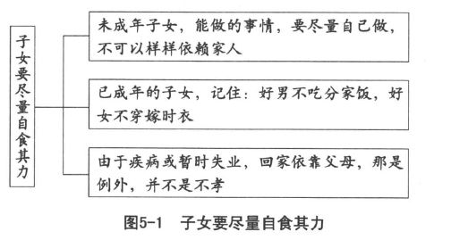
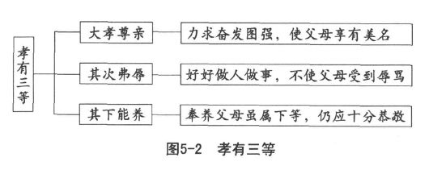

 第五章　子女应该养成正确的心态

学习孝顺父母的道理，是子女应尽的责任。

孝道是中华文化瑰宝，有待我们发扬光大。

关注父母的健康安宁，多为父母分忧分劳。

养口体不过只是下孝，养心志才算是上孝。

亲子关系不全由父母，子女也应该求自动。

若是不幸已经被宠坏，觉悟再觉悟速回头。

孔子把“父父”和“子子”并列，意思是二者具有相对应的关系。有“父父”才有“子子”，而有“子子”，也才能要求“父父”。因此我们说完了父母应负的责任，当然应该讨论子女必须养成的正确心态。“父父”的“父”字，第一个指父母，第二个指教养。父慈子孝，在父母为慈，在子女为孝，两者不可分开，要一并加以讨论。父慈的功能，必须发挥在教养子女方面，才是真正的慈爱。“子子”的“子”字，第一个指子女，第二个应该指孝顺。子孝当然是子女对父母的孝顺，必须尽心尽力。父母重视教养，子女恪尽孝道，家庭自然幸福快乐。

“孝道”这两个字，长久以来，经常被扭曲。自从西方文化东来之后，某些接受新风气、喜欢谈论欧美亲子关系的人士，对自己文化中的孝道提出很大的异议，甚至认为我们的亲子关系也应该向西方看齐，因而造成很多误解。孝道是中华文化的特色，全世界只有中华民族把《孝经》当做专书来研读。前面说过，虽然“万恶淫为首”看起来已经由于西风东渐而逐渐失去影响力，但“百善孝为先”仍然在我们的社会中深植人心。可惜大多数人，不能明白孝道的时代意义，因此不能表现出现代化的孝道。

旅美哲学家吴森先生，在美国开设中国哲学课程，不断接受西方学生对《论语》“其父攘羊”的故事提出质疑和反对。这一章的原文是：

叶公语孔子曰：“吾党有直躬者，其父攘羊，而子证之。”

孔子曰：“吾党之直者异于是，父为子隐，子为父隐，直在其中矣。”

意思是说，父亲偷了人家的羊，作为儿子的出面作证，牺牲亲情以顾全法律上的正义。这样不近人情的儿子，孔子并不认为可以称为“直躬”。于是批评的人，便指称孔子以亲情为重，而以国法为轻，甚至批评孔子鼓励犯法，不惜为了父子私情而违反国家法律。吴森教授却认为：

“吾党之直者异于是”是孔子对叶公称证父攘羊的儿子为“直躬”提出的一个温和的抗议。叶公是一位有官阶的人士，并不是孔子的弟子，孔子不可能用斥责弟子的语气来对待他，所以这一句话并不是叙述句或描写句，只是含蓄地告诉叶公，“证父攘羊为直躬”的道德标准并非普世价值，不是到处都被接受的。孔子并不是斩钉截铁地提出他的主张，只是在暗示叶公，可能还有其他的评判标准。孔子的基本态度，是不反对，也不完全赞成。

“父为子隐，子为父隐，直在其中矣”也不代表孔子的积极主张。这一句话的主要功用，在加强前一句话的力量。完整的意思大概是：你说“证父攘羊”便是“直”，我们的标准可不相同。“父为子隐，子为父隐”的人们，他们何尝没有“直”在其中呢？世界上的标准，不可能只有一种，否则文化差异要作何解释？孔子一向的主张是“无可无不可”，认为适时应变，才能够合理解决问题。而合理的标准也是变动的，孔子提出“父为子隐，子为父隐”的方式，不过是多一种选择，多一种参考而已，并不是只有这么一种方式才是唯一正确的途径。

我们的社会，秉承“先敬后罚”（敬酒不吃吃罚酒）的精神，通常先讲情理而后讲法理。中华文化艺术重于科学，很多科学性的东西到了我国都变得相当具有艺术性。孝道是艺术而不完全是科学，用这种心态来看我们的二十四孝故事，便不致认为其荒诞离奇而嗤之以鼻。我们不必追究，“哭竹”是否真的能够生笋，“卧冰求鲤”的父母是不是太狠心。只要告诉子女，这些并不是科学论证，而是启发大家，身为万物之灵必须讲求孝道，否则和禽兽没有什么两样。当然，找一些现代化的孝道题材供子女参考，让子女从现代的案例中学习，应该是很好的方式。我们非常不赞成借口与国际接轨，打着现代化的旗号，企图将孝道思想从中华文化的内涵中去除。几乎所有外国人，听到中国人的孝道观念和行为，大多表示激赏和羡慕，认为做人理应如此。可惜他们根本没有想过，对待子女要慈爱，对待父母要孝顺，原本是天经地义的事情。孝道是人类的瑰宝，不仅是中华文化的宝贝。

# 遵行现代化孝道

## 现代子女不好当

父母难为，现代的子女也不好当！不像往昔那样，凭借父母之命、媒妁之言，看看是否门当户对，把双方的八字一配，若是天作之合，那就先订婚，再完成婚礼，然后送进洞房，万事OK！结婚之后长期居住在男方的父母家里，好像理所当然。在那里生育子女，随时有长辈指导、照顾，似乎也十分方便。一直要到丈夫的父母过世，才开始和兄弟分家，自行建立家庭。这时候夫妻经验丰富，应该也不乏钱财，当然比较理想。这些原本是父母恩惠的过程，却由于年轻人喜欢独立、追求自由、不受父母约束而被整个推翻了。

现代年轻人，当恋爱成熟、开始讨论婚姻大事时，少女大多主张婚后立即有自己的家，不愿意与公婆同住。少男吞吞吐吐，征得父母的同意，就开始为居处伤脑筋。可以说还没有成家，就惹得双方家长不高兴，准小两口也吵吵闹闹、折折腾腾、烦恼一大堆。说不定还没有完婚，便由于意见不合而破裂。

再往前推，就很容易发现现代子女远比往昔难为得多。从小被电视、广播弄得还没有长大，就已经学坏了。在电视、广播还没有入侵家庭的时代，一家人团圆吃晚餐，用不着担心爸爸为什么还不回家，晚些回来会不、会引起争执。晚餐之后，孩子们习惯于坐在小凳子上，有耳朵却没有嘴巴地静静聆听长辈的交谈，从中学到很多做人做事的道理。这些道理听起来当然不如现代电视、广播那样多彩多姿、新奇刺激，但实质上却可靠、安全，而且真的管用。以往的孩子，并没有什么“代沟”、“性骚扰”、“沟通渠道不通畅”、“受压制”、“受虐待”、“暴力倾向”、“父权至上”等观念，也就没有这些奇怪的感觉。现代信息发达，孩子们随时可以接受这些观念，受到影响之后，好像觉得这些随时都在发生，而且情况十分严重，令人害怕！男孩子和男孩子手拉手，有同性恋的象征；男孩子和女孩子手拉手，就可能是一对！女孩子坐在王伯伯腿上，会不会被性侵害？爸爸多抱几回妹妹，是不是妹妹长大以后会提出控诉？

以前的孩子，受到大人的照顾，就觉得很幸福。现代孩子，总觉得大人没有按照孩子所需要的方法教养，就显得不够尊重——毕竟小孩子也是人，也应该受到尊重才对。

现代的孩子，很早就学很多知识，但对自身所流露的智慧，却由于缺乏适当的启发，以致十分贫乏。孩子满脑子都是：父母不能行使权威，必须以儿童为中心，实施爱的教育。听说西方社会，用不着孝顺父母，那该多好！便恨不得早日染头发、隆鼻子、画眼眶、穿牛仔裤、露出肚脐眼和臀沟，很快就变成“可爱”的美国人。

曾经看过一篇文章，摘录其中的一小段如下：

“直到师专毕业，面对父母，我仍潜藏一股恨意，曾经我不承认他们是我的父母。十年前，当我提着皮箱，走出家乡的车站时，我甚至希望从此不再看到他们。”

师专是小学师资的摇篮，师专毕业生，已经有资格担任小学老师，可见在为人做事方面，应该已经具备相当的条件。赤裸裸地写出内心对双亲的感觉，固然勇敢，却也十分可怜！一个人出身在“战火不断”的家庭，小时候遇到老师指定写“我的家庭”的作文时，便坦白写出：“我不爱妈妈，也不爱爸爸，长大后就不愿孝顺他们。我只要和小妹住在一块，不要爸爸也不要妈妈。”

班主任看后，特别叫去个别谈话。劝了好久，却一句也听不进去。最主要的原因是“父母之间的战火愈演愈烈，他们就会吵着要离婚，接着我和妹妹就像财产一样，被放在他们中间。母亲逼问我：‘你要爸爸，还是要妈妈？’另一次则是父亲逼问妹妹：‘你要妈妈，还是要爸爸？’有一次他们显然吵疯了心，竟然逼着我和妹妹一定要回答。我受不了，就大声对着他们说：‘我谁都不要，你们不是我的父母，我不要跟你们住。”，班主任没有办法，我们也没有办法，因为清官难断家务事。他们家的事，只好由他们一家人自作自受。

我们所关心的是，这一段心事公开之后，很可能带来很多负面的影响。很多类似的家庭，由于对其真正的状况很难做深入的比较，所以子女的反应很不相同。有些孩子也许会回答：“我要爸爸，也要妈妈，我们永远不要分开。”说不定父母感动之余，会回心转意。如今看了这一段看起来“理直气壮”的自述，又是受过师范教育的老师写的，便不由分说，模仿起来，万一造成家庭破裂，真不知是谁的罪过。古人常说：“文章千古事。”希望我们下笔务必要谨慎，又说：“家丑不可外扬。”便是家务事外人永远搞不清楚，说出来做什么？何况一段时间过去，很可能产生好的改变。一家人毕竟是一家人，过去的就让它过去，提它做什么？再说，一个人受教育，就是要宽以待人、严以律己。受这么多的教育，还要公开数落亲生父母的不是，何苦来哉！

现代子女，普遍认为有机会受教育与父母无关，完全是自己的奋斗。受了教育，就开始看不起自己的父母，认为他们生活在农业时代，无论观念和行为，都赶不上现代工商社会的潮流，可以说相当落伍。于是，孩子长大以后，经常把父母当做纠正的对象：这样不对，那样会惹人笑话，将小时候父母对自己的教导态度用来反制父母。要不然，就像这位师专毕业生那样，把心中的愤怒公之于世。他们描述得十分细致：“母亲的弱点是个性紧张，一旦有事没有在预期中完成，她就开始紧张、自责。而她自责的方式，就是不断重复没完成的那件事，而且责怪到别人身上。至于父亲的弱点，则是个性冲动，而且是没有预警式的暴怒。父亲一暴怒，如果不让其情绪发泄完毕，他是不会停止的。他骂、摔，极尽破坏之能事，母亲见状就更紧张，觉得一切都完了。如果情况太严重，母亲解决的方式就是躲起来。”原文的作者对父母的评语是：“我父母受的教育不多，加上个性耿直，因此面对冲突，就完全以本性来对抗。自己处理不来，就拿小孩来牵制双方，结果受害的就是我们。也许他们也不希望如此，可是他们无法控制。”

既然能体会父母的无能与无奈，为什么不能洗刷以往对父母的恶劣印象，还要坚持自己的愤怒？一直等到母亲去世，父亲对母亲开始追思，原文的作者才逐渐改善和父亲的关系。“童年的悲苦和少女时代的憎恶，似乎也随着岁月在记忆中逐渐模糊。”时间拖得太久了，很累人，人生苦短啊！

胡适说过：“我实在不要儿子，儿子自己来了。”前一句话是不是真的，那是胡适自己的事，后一句话则十分合理，我们的父母，是我们自己选的。许多人想生男育女，却生不出来；有些人不想生育，子女却要来就来，好像真的挡不住。可见主导权在子女，而不在父母。既然如此，子女对自己选择的父母，还有什么可抱怨的呢？子女不嫌母亲长得丑，当然也不能怪父亲脾气不好。“天下无不是的父母”，从这里看，果然很有道理。

## 孝顺需要后天的学习

子女选择父母，运用父精母血，自主地安排自己的一生，是不是更合乎自作自受的规律？我们所赖以生存的宇宙，是我们的根，没有天地，怎么可能出现人类？我们所选择的父母，是我们的本，没有父母，我们怎么生得出来？古圣先贤，要我们拜天谢地，孝顺父母，便是希望我们不要忘掉根本，以致成为忘恩负义的无情人。

大多数人都认为孝顺是人的本性，属于先天的本能。但是，王充在《论衡》中明白指出，子女对父母孝顺，并非像一般动物那样，建立在生物性的本能上面。父母生男生女，同样在生物性的基础之外，具有文化性的深刻意义。一般动物在任何场所，都可以随着生物性的冲动进行交配。人类则只有在自己的房间里面才能够有性行为，大庭广众之下必须有所节制。

孝顺如果纯属生物性的本能，人就没有资格称为万物之灵；孝顺如果提升到文化层次，那就必须经由学习，才能够深刻体会。不同的教养方式，固然产生不一样的孝顺态度；同样的教养方式，也不一定产生相同的孝顺行为。可见学习的心态和过程，对孝道的影响很大。

前面说过，我们有《孝经》而没有《慈经》，并不是重孝轻慈。因为孔子的主张一向是相对的，讲求双向性、互惠性，不可能只求子女孝顺而不重视做父母的道理。我们也知道，孝顺一旦形成制度，那就十分僵化，丧失弹性，也很难应变，根本不合因时制宜的要求。由于环境快速变迁，现代子女不可能回到从前，但是孝道的要求，也不应该由于今非昔比，就全盘加以否定。

现代化孝道，其实十分简单。首先要对自己的父母有信心，相信父母不可能不爱子女，更不可能害子女。因此在心理上，先认为“父母的话永远是对的”，不存心怀疑，也不应该当面顶撞，立即说出不接受的意见，而应该先遵照父母的指示用心去做。如果效果良好，为什么要反抗？若是遭遇困难，可以向父母请教解决的方法，进而在这样的过程中获得成长。

聪明的孩子，会主动把自己的事情向父母报告。譬如小华，从学校回家立即向父母说明，明天老师开会，学校放假，晚上可不可以多看一些电视节目？相信父母听了，也会欣然同意，说不定会找一些好节目给她看，大家都十分愉快。而小燕就不是这样，她放学回家，什么也不说，吃完晚饭就一直看电视，父亲十分生气，问她：“做一个学生，不做作业，一直看电视，行吗？”小燕这才回答：“明天老师要开会，学校放假，多看一些电视，不行吗？”小燕说得很有道理，父亲却觉得非常没有面子，板起脸来说：“老师要开会，没有作业是不是？好，把课本拿来，我出五十个题目，看你做到什么时候！”有人批评这样的父亲不对，我们则要反问，难道父亲不是人吗？难道子女不应该从中领悟到一些东西吗？将来长大，还不是要承受这样的互动吗？

父母太客气，对子女而言，并不是福气。当然，孩子毕竟不是大人，不懂事。所以母亲的角色十分重要，这时候母亲应该赶紧把小燕叫到一旁，告诉她以后碰到这种情形，应该事先告诉父亲，才不会挨骂。这一次已经错了，请爸爸少出几道题，还是要做完作业才可以睡觉。相信父亲也会改变主意，告诉小燕以后有什么事情，要让父母知道，才不会造成误会，白白挨骂，有时候还会很辛苦。

子女长大成人，更不应该顶撞或教训父母，以免忤逆不孝。兹举例说明如下，以供参考：

有一天，母亲把三立叫到房间里说：“儿子，妈看你这么努力，为什么这么久还没有升官？我看是没有送礼的缘故。妈没有什么好东西，只有这枚金戒指，放在这里也没有什么用，干脆拿去卖掉，你赶快去送礼，也好升官，让你爸爸高兴！”

三立心中存有“父母永远是对的”的观念，所以当场答应：“好，谢谢妈妈，我马上去办。”实际上三立心里明白：现代社会已经不能够送礼、走门路了，最好凭借自己的实力表现，大家才看得起。但是儿子长大了便教训父母，或者嘲笑父母跟不上潮流，太过落伍，毕竟是不孝的行为。所以三立并没有像一般人那样不懂事，用大道理来反驳母亲，辜负母亲的一片好意。他也不像一般人那样，立即遵照母亲的指示去做，完全不动脑筋地盲从，将来遭遇恶劣的后果，再反过来把责任推给母亲，令母亲伤心。他表面上答应，实际上并没有真的去做。这不是阳奉阴违，也不是欺骗母亲，完全是出于尊重母亲，既不伤害母亲的感情，让母亲没有面子，更不敢陷母亲于不义。

不久之后，母亲追问办理的状况，三立回答：“卖了，而且价钱还不错。礼也送了，上司十分高兴。”母亲很得意，三立自己也很愉快。

又过了一阵子，母亲问：“为什么礼也送了，这么久还没有动静？”

三立回答：“是啊，我明天去打听看看。”回来以后，小声地向母亲禀报：“妈妈，事情不妙，听说送礼的人，不但不升官，还要受处罚。”

母亲急着说：“那糟糕了，我岂不是害了你？”

三立说：“上司把送礼的名单公布出来，弄得很紧张，好在上面没有我的名字，所以没有影响。”

母亲问：“这怎么可能？”

三立说：“还不是妈妈平日对人家好，人家也对妈妈十分尊敬。我拿金戒指去卖的时候，老板怎么也不答应，一定要把钱借给我，要我有钱时还给他就好。我正要买礼物去送给上司，又听说现在规定得很严格，绝对不能有这种事情。我不相信，跑去上司那里，上司也亲口告诉我，说这是革新。我就把钱还给金店老板，等于没有送礼，所以不必受惩罚。”

母亲听了十分高兴，说自己好心好意却差一点害了儿子。幸亏儿子机灵，知道随机应变，见机行事，真不愧是孝顺的好儿子。

三立用不着一本正经地教训父母，照样可以达到忠谏父母的功效。有孝心，依然能够谏告父母，对不对？

# 关注父母的健康与安宁

## 子女要尽量自食其力

陈大齐先生认为，自食其力，不依靠他人以维持生活，是人生最基本的义务。因为假使此人要依靠他人以维持生活，彼人也要依靠他人以维持生活，人人都要依靠他人以维持生活，又有谁来帮助他人维持生活？一旦真正变成这种情况，世界上的人类不早就灭绝了吗？所以人必须自食其力，这是一个十分明显的道理。

子女的年龄如已达到自己能够谋生的阶段，当然要自食其力以不累父母（如图5-1所示）。俗语说得好：“好男不吃分家饭，好女不穿嫁时衣。”分家饭是父母祖先的遗产，嫁时衣指父母所制赠的衣物。这两句话的用意，即在勉励成年的子女要有自食其力的勇气，不能够存有依靠父母余荫的念头。分家饭是法律上应当继承的遗产，嫁时衣也是情谊上乐于制赠的礼物，尚且不能当做生活的泉源。若是子女不努力工作，却责怪父母不供给钱财，或者自己挥霍无度，反过来埋怨父母不肯满足其要求；还有些人在父母死后，抱怨没有大笔的遗产，甚至在父母生前，因为要不到钱，或者要得不够多，竟然挥刀砍杀父母，那可是不孝到了极点，完全丧失人性。子女当深以为戒。

幼小或少年时期的子女，自己还没有谋生的能力，不得不依赖父母的抚养。这时候应该认识自食其力的道理，并且预先做好准备：一方面养成勤俭的良好习惯，一方面加强学习，使自己具备自食其力的实力。就算父母经济富裕，也不应图闲逸，要不怕劳苦，不贪吃美味的食物，不贪穿漂亮的衣服。在经济寻常的家庭中，分担家事，帮助父母做一些杂务，从小勤劳、节俭，长大后自立，就算真的怀才不遇，收入不丰，也能够安之若素，不劳父母的接济。当然，这种说法不可能没有例外。有时候学业既成以后，一时找不到合适的工作，在这种情况下，可以暂时依赖父母；或者忽然罹患重病，自己的积蓄不足以支付巨大的医药费用，这时对父母的接济，自然也不必谢绝，只要认真医治，早日复原以安父母的心，便不失为孝顺的子女。重大伤残或弱智子女，多接受父母的抚养，多拖累父母，属于不得已的情况，不能够依常情来论断，尽力自求残而不废，也就不能加以苛求。可见自食其力的道理，也因人而不同。

出于这种相对性，当子女长大成人，父母体弱年迈以后，有些父母未必能够自食其力。这时候子女就应该反过来奉养父母，并且要出于恭敬的心，使父母有面子接受，而不应该像借债那样，表现出心不甘情不愿的样子，更不应该在父母跟前，显得自己比父母有办法，或者把自己的子女看得比自己的父母更为重要。

## 多为父母服劳

陈教授认为自食其力以免拖累父母，只不过是消极的做法，积极的子女应该进一步服劳与奉养父母。服劳的意思，是代替父母劳作，为父母分忧分劳；奉养的意思，则是供给父母衣食，使父母不必为生活而忧虑，得以安享余年。这两种行为，只是对父母最低限度的报答，子女应该尽力去做，不能够稍有应付的念头。

代替父母劳作，最好从小就养成习惯。因为年龄幼小，可以服小劳；年龄较大，就能够服较大的劳。子女不论年龄大小，都有为父母服劳的机会。幼年的子女可以帮助父母做一些轻松的事情，譬如父母回家，替父母拿出换穿的便鞋或拖鞋，再把外出穿的鞋子收起来；父母读报完毕或者阅读告一段落，把报纸、书刊、杂志放到固定的位置。少年的子女可以帮助父母做一些比较繁重的事情，譬如父母在洗擦桌椅时，可以帮忙分擦一部分或全部；每天利用一点时间扫地或擦拭门窗；有客人按门铃，前去应门。青年与成年的子女，服劳的机会更多，不论轻松或繁重的事情，只要能力许可，都应当分劳或代劳。

笔者在学期间，负责抄写先父的文稿，结果获得很大的好处。每次搬家，由于笔者在兄弟姐妹之中排行老大，所以装箱、捆扎、督运的经验十分丰富，迄今仍了如指掌。母亲常把采购的任务委派给笔者，因而在这方面也得益匪浅。

陈大齐教授研究得非常深入，指出能力是服劳的唯一限制。子女在分劳或代劳的时候，必须衡量自己的能力。凡是能力所及的，都应该服劳；能力所不及的，则不能承担。因为能力不及而贸然服劳，会把事情弄糟，害得父母反而需付出更大的精力以求善后。劳力方面的部分，一般要看所需要技巧的程度来决定能否服劳；劳心的事情，则要征得父母的同意，认为可行的部分，才可以代劳。

西方社会，兄姐为弟妹服务，譬如补习功课、教导技艺，父母也要付给报酬。中国社会，为弟妹补习功课或教导技艺，正可以减轻父母的辛劳，也是为父母服劳的一种方式，当然不能够向父母领取报酬，免得不像一家人。

美国人向来重视物质生活，电视机一打开，一片钱、钱、钱的声音，子女分担家事，也需要代价。譬如帮助父亲整理庭园草坪，要价美金八元；代替母亲洗衣洗碗，索价美金三元。一家人讨价还价，有如商场交易那般，且丝毫不逊色。现代中国人，竟也急起直追，在这方面迎头赶上。子女服劳有一定的价码，学习成果也按照成绩高低领取赏钱。邱连煌教授特别指出：这种不适当的奖赏，很容易摧残子女的内在动机，把原本喜欢的工作，变成以获得奖赏或报酬为最终目的。这种本末倒置的做法，对子女有害无益。

人类的动机，大体可以分为外在的和内在的两大类。譬如子女用功读书，为的是赢得父母的欢心、老师的称赞、同学的羡慕，或者可以获得奖章、奖品、奖状、奖金，这些显然是外在的动机。因为子女之所以用功读书，主要是为了他人，并不在于自己，于是学习本身不是目的，已经被当成手段。相反，子女终日手不释卷，只是喜欢读书，本来就把读书当做一件乐事。不管父母高不高兴，老师称不称赞，考试成绩如何，有没有奖品或奖金，都照样一有时间便读书。这样的动机，显然是内在的，为了自己，并不在乎别人。学习本身即是目的，并不是当做手段来争取学习以外的那些目标。对这样的子女，父母最好不要拿金钱来扼杀他们的求知欲。若是子女读书的外在动机淹没了内在动机，子女把注意力转移到他人的反应或物质的奖赏上，很可能就降低了读书的乐趣。

邱教授进一步分析，不当的奖赏如果过度使用，很可能导致下述四大危险：

第一，为了获得奖赏，孩子不得不尽力而为，心里却怀有被人操弄的困惑，难免产生怨愤，直接或间接影响了学习情绪。久而久之，视求学如劳役，认读书为苦差事。

第二，孩子被父母或老师奖赏惯了，可能会养成过分依赖的心理。将来进入社会，没有人为他们的行为表现打分数，不会有老师时常在身边督促、叮咛和给予奖品或奖金，更不会有人像父母那样能够提供讨价还价的机会。这时子女若是因此而停止学习，岂不是愈活愈退步了吗？

第三，孩子只是为了外在动机而学习，不免把学习行为当做谋“赏”的工具。一旦考试完毕，目标达成，而所期待的奖赏也已经到手，学习行为就会随即终止。若非必要，难得自动去翻动书本，以致所学很快就归还给老师，愈来愈让人觉得其一无所知。常见许多学生毕业之后，从此不再读书，就算参加学习，也是专听笑话，否则便打瞌睡。就是因为内在动机已经完全消失，完全丧失兴趣。

第四，孩子本来对数学、物理、化学、机械、音乐或绘画等其中的一样或几样具有浓厚的兴趣，完全是出于内在动机的推动。经过父母或老师甚至双方面不约而同持续给以物质奖赏，很可能不久之后，兴趣就转移了，从行为过程转到奖赏上面，内在动机逐渐减弱，而外在动机则不断增强，以前的为学习而学习改变成为奖赏而学习。从心理发展来看，这简直等于开倒车。

子女最好不要看到其他孩子获得奖赏，便要求自己的父母也比照办理。聪明的子女会把父母的奖赏当做一份惊喜，促使自己增强兴趣，而不是期待父母的奖赏，徒然使自己的兴趣转移，结果害了自己。

心理学家大多建议父母和老师多用口头称赞。因为这种荣誉的激励会冲击子女的内心，无形中更能提高原来的内在动机。至于金钱或物质奖赏，只能用做他律的辅助，务须逐步推向子女自律，其要领如下：

第一，对某些事物或技能的学习，如果孩子无精打采，不自动学习，这时不妨借重奖赏，以加其动机。孩子本来对这些事不具任何内在动机，所以不必担心会受到扭曲。但是重赏之下必有勇夫，不过是一时的权宜之计，等到孩子发生兴趣之后，就不必再给奖赏了。

第二，对某些复杂或艰深的活动，孩子尚未具备应有的基本能力，连尝试的勇气都没有，就更谈不上从中获得内心的满足。在这种时候实施奖赏，先诱导孩子学习那些基本能力，等到基本能力巩固以后，原先复杂的事物看起来也不复杂了，原先艰深的活动看起来也不艰深了，做起来得心应手，相当轻松愉快，内在的动机也随之增强了。

第三，给予实质的奖赏，最好赋予荣誉的象征。等到事情完成，或者活动告一段落，才突然给予奖赏。这种意外的惊喜，不致破坏内在的动机。当然，若能加上这样的意义：经过严格的评鉴，表现特殊；希望能够再接再厉，更上一层楼！那就更加圆满，效果也会更为良好。

子女尽量自食其力、乐于服劳，而且不盲目期待父母的物质奖赏，这对于父母的健康与安宁具有积极的意义。一方面使父母减少烦恼，一方面也使父母增加欢乐。父母心情愉快，身体自然健康。父母长寿，是子女的福气；父母健康安宁，则是子女孝顺的良好结果。

孔子说：子女关注父母的健康，是孝道的表现。对于父母的年龄，做子女的应该时刻放在心上。子女固然希望父母长寿，却也应该顾虑父母的年龄逐渐增高，身体难免越来越衰弱。特别是年老的父母，更应该节劳颐养，享受天伦之乐。这时候子女最好对老年人的保健卫生多一些了解，从旁调节父母的饮食和劳逸，或者实时对父母提出劝告，使父母能够健康、愉快而长寿。

依年龄来区分，四十五到六十五岁为初老期，六十五岁以上为老年期。在初老期，体内的变化主要表现在水分减少、脂肪增多、细胞数目减少、脏器萎缩、体重减轻等，某些人体功能逐渐下降。进入老年期以后，不但外表明显衰老，而且体力活动的能力也明显下降，其中尤以心血管系统及肾脏的老化最为显著；肌肉神经的功能普遍降低，特别是平常很少活动的老年人更是明显的迟钝；温度觉、触觉以及振动觉的敏感性下降，而味觉变化，希望食品中添加更多的调味剂；视觉和听觉的敏感度也下降，经常漏听、漏看，从而造成错误的判断，以致引起行动上的失误。

对现代人来说，由于运动不足，加以精神上时常处于高度的紧张状态，使心脏病、高血压、低血压、肥胖症、糖尿病、颈椎病、腰酸肩痛甚至癌症的发病率都大为提高。若不幸父母患有疾病，做子女的千万不要相信秘方，更不能误信仙丹，最好趁早带父母就医，向持有正式医师执照而且经验丰富的医师求诊。万一患了传染疾病，也应该遵守法令规定，住入隔离病院，不能不送而留在家中，以免传染家人，殃及邻居，反而成为传染中心。孝道不能违反法律，否则便是愚孝。

为求父母健康安宁，子女对父母不但要有爱心，而且要十分恭敬。爱是感情的表现，敬才是理智的态度，爱而不敬，很容易怠忽轻慢。子女对父母怠忽轻慢，便是心中没有父母的存在，根本就是把父母当做一般人看待。对待朋友尚且不敢怠慢，对生养教育自己的父母怎么敢如此？正像孔子指出的：对父母不恭敬，养父母就像养犬马一样。因此无论奉养或服劳，以及照顾父母的健康，服侍父母看病、养病，都应该特别注意，务须恭敬。

父母恼怒责骂时，子女不应该有怨恨的表示。如果父母年老久病，卧床三年五载，子女服侍汤药，清除便溺，洗涤衣服被褥，十分辛苦，父母又脾气暴躁，动不动就斥责辱骂，子女也必须和颜悦色，毫无怨言才对。

曾子以孝闻名，他认为子女应该以父母的乐为乐，以父母的忧为忧。子女如此，父母当然健康安宁。

子女对自己的健康也应该注重，因为父母最关心的是子女的健康。子女有了疾病，或者受到伤害，父母比子女还要紧张，还要忧伤难过。所以子女必须爱护身体，注意健康。孔子告诉我们，身体发肤，受之父母，不敢毁伤，这是孝道的开始。现在很多人不重视健康，任意损伤身体，晚上不睡觉，早晨不起床，三餐不定时，饮食也无定量，罹患上网成瘾症、手机不离症、电动玩具入迷症，不顾自己的身心健康。父母苦劝不听，用尽办法也无效。这样的子女，使父母不得安宁，更损害自己的健康，简直不孝之至！

# 务求做好人以显扬父母

## 大孝尊亲

孟子在《离娄篇》中指出，世俗所说的不孝，大约有五种：一是懒得劳动，不肯做事，也不能供养父母；二为喜欢赌博下棋，爱好喝酒，不顾父母的生活；三是贪得货财，私心妻子，不愿供养父母；四为放纵耳目的欲望，嗜好声色娱乐，致使父母受辱；五是倚恃勇猛有力，喜欢和人家打斗争讼，以致危害父母的安宁。

更早的时代，孟懿子向孔子请教怎样孝顺父母，孔子的答案只是“无违”，不要违背父母的合理主张，也就是传承父母的价值观。当父母在世时，子女应该依礼侍奉父母；当父母逝世时，子女应该依礼葬祭。

孟武伯以同样的问题请教，孔子回答：做子女的，只能够在生病的时候让父母担心。因为吃五谷长百病，子女再重视保健，也难免会生病。除了这种特殊情况，平日都应该守分、自律、自爱、自重，以免父母操心。

子游问孝，孔子的答案是：现在的人，以为孝顺就是能够奉养父母，但是人们在家里也养育犬马，如果只养而不敬，那么养父母跟养犬马有什么不同？

子夏问孝，孔子却这样回答：侍奉父母，贵在长久保持和颜悦色。这样比为父母服劳，侍奉父母饮食，实在要困难得多。和颜悦色表示恭敬的态度。

孔子时代，一般人奉养父母之外，还要注意恭敬，合乎礼节。到了孟子时代，竟然有许多不能供养父母的儿子。可见孟子时代，人民的生活比孔子时代更为困难，且子女生活散漫、不重纪律，也是一代不如一代。

子女孝顺父母，不但要在物质上细心照料，而且应该在精神上使父母觉得欣慰喜悦。孟子把物质上的奉养称为养口体，属于下孝；精神上的奉养称为养心志，才是上孝。孟子以曾子为例，说明侍奉父母的正道。他在《离娄篇》中这样描述：从前曾子奉养他的父亲曾皙，每餐必定有酒有肉。等到吃饱饭，曾子要把剩余的酒饭撤走，一定要问这些剩余的给谁吃。如果曾皙问起还有多的没有？曾子也必定回答：还有。曾皙去世以后，曾元这个孙辈就没有这么恭敬。曾元奉养曾子，每餐也照样有酒有肉，但是要把剩余的酒肉撤走时，并没有问要给谁吃。而当曾子问到还有没有时，曾元的回答是：没有。是不是想把剩余的酒肉，当做下一餐的食物，再端上来呢？

孟子认为曾子的恭敬才称得上养心志，而曾元的奉养不过是养口体罢了！以曾子的家教，尚且很不容易做好传承，何况一般家庭呢？

在孔子的弟子当中，曾子以孝闻名。曾子对于孝的体会和认识，应该是十分深刻而中肯的。他认为孝有三等：大孝尊亲，其次弗辱，其下能养（如图5-2所示）。生活上奉养父母，不使父母或自身受到羞辱，都属于次要的孝。只有积极奋发、集义行善，使父母享有美名，才算是大孝。我们常说的“光宗耀祖”、“扬名显亲”，完成父母未完成的事业，实际上都是对父母的大孝。

曾子说：子女的身体，是父母所给予的。用父母所给予的身体来行事，能不小心谨慎吗？日常生活过得不庄重，就不是孝；替上司做事，做得不忠实，就不是孝；主持一方面的工作，却不够认真，也不是孝；跟朋友交往，却不讲信用，也不是孝；奉命参与作战而缺乏勇气，便不是孝。以上这五点，如果都做不到的话，不但自己要受到法律的惩罚，而且牵连父母也要惹上麻烦。这样，做子女的敢不认真吗？

他认为小孝用体力，中孝兼用心智，大孝则永久维持孝心，也就是不论父母在世与否，都能够心目中有父母，终生不敢使父母蒙上耻辱。

## 子女要时常反省

现在的子女，说起来只有一个毛病，那就是心目中没有父母的存在。他们只知道有自己，不知道有父母，以自我为中心，想做什么就做什么，完全没有顾忌。由于长久以来都没有设限，或者有限制也不害怕，反正违反了也不会怎么样。父母不高兴，祖父母会出面阻止；父亲不喜欢，还有妈妈会支持，以致子女生成一副“只要我喜欢，有什么不可以”的派头。殊不知就凭这句话，便把自己害死了。

小时候，父亲在自己的心目中，通常是高高在上的“偶像”。自从听到“代沟”这个名词，便一知半解地认为自己应该和父亲保持距离。于是降低了父亲的权威，却麻木地随着同学或邻居一起去追星。小女孩看到陌创生的大男人，哇哇大叫，抢着上去握手，恨不得投怀送抱。回家后把巨幅相片悬挂在自己的房间里，眼睛还死盯着不放。请问：父亲的感觉如何？试问：这样的女儿，心中有父亲吗？今天的父母，实在也够可怜，一副随波逐流的样子，完全没有一点自我保护的能力。就这样放手，让自己疼爱的女儿踏上危险的前程，自己还要勉强装笑容，认为潮流如此，又奈何？这种无助感，使现代父母简直和未成熟的孩子同样可怜！

子女心中没有父母，父母心中也越来越没有子女的存在。特别是中国人，讲求彼此的交互作用：你心中有我，我心中自然有你；你心中无我，我心中为什么要有你？大家不方便明说，心中却确实有数。

把子女养得胖胖的，穿得很时髦，不过在表示父母有办法；将子女的时间排得满满的，学完钢琴，赶紧又送去学舞蹈，无非是亲友聚会时，多一种炫耀。父母心中没有子女，就不会用心为子女设想，吃亏的永远是子女。我们奉劝聪明的子女，最好心目当中有父母，以挽回父母心中的自己。否则亲子之间，你心中无我，我心中无你，对子女非常不利。子女心中有父母，并不需要像西方人那样，口口声声I love you。因为中国人不太相信说出口的话，反而认为整天挂在嘴上的大多虚假不实在。就算不是谎话，也是说说就算的客套话，并没有什么实质的意义。我们比较重视实际的行为表现，宁可做给父母看，也不要把它挂在嘴上。多做少说，始终是安全可靠的方式。以实际行动向父母表示心目中有父母，相信父母会接受感应，心目中也会有子女。这种互相关怀的亲子关系，充满了温暖，更使人终生不能忘怀。

子女心目中有父母，最具体的表现即在好好做人，不让父母生气，不使父母受辱。长大以后，更应该奋发图强，有好的成就，以显扬父母。小的时候，把父母当做行为的模范。按照孔子所说：父亲在世的时候，观察他的志趣；父亲过世以后，回想他的言行。以此作为检讨自己的标准，看看自己的孝行是不是合格。

子女对父母孝顺最起码的行为表现，至少包括下述十点：

第一，和父母住在一起，出外时务必禀告，回家时也要看到父母平安才能够放心；父母忙碌时，要设法分忧分劳；父母生病或身体欠安时，更应该首先探问，不可以若无其事，只顾述说自己的事情，甚至于增加烦恼。

第二，回家时，遇有亲友宾客，要请安问好。暂时不要说话，看看情况才说。外出时，也要禀告父母之后，向亲友宾客道别。亲友宾客有任何交代，要征得父母同意后，才能够有所答复，不应该擅自做主，自行决定。

第三，准备远行，或者离家一段时间，必须提早向父母禀告，不应该到时才告知父母。最好把请示和告知作出清楚的区分，事先多请示。除非紧急或不得已才可以临时告知，因为子女告知父母属于不恭敬的表现。

第四，有事禀告，也应该察言观色，尽量不要在父母亲忙碌或忧伤、烦恼的时刻提出，等待适当的时机，在合适的场合，还要注意自己的语气，做出合理的说明。有些事必须分段禀告，以免造成过分严重的刺激。

第五，重要或机密事宜，要单独向父母禀告，最好先让父母做好心理准备才简单扼要地报告。父母有疑问时，再作补充说明。自己能解决的部分要说清楚，需要父母指点或协助的地方，也应该仔细说明白。

第六，晚上就寝前，要先看看父母是否就寝，有没有什么需要帮忙的事情。如果父母遇到烦恼，也要和父母谈一些有趣的事情，使父母忘掉烦恼而安然就寝。

第七，离开家，要按时打电话回家。一方面向父母请安，一方面也报个平安。如遇重要事宜，更应该在电话中简要报告。什么时候可以回家，也应该事先禀告。

第八，生活要有规律，三餐最好定时定量。正餐之外，最好不要随便吃零食，尤其不要吃夜宵。小时候可以考虑上午十点、下午四点，各增加一次点心。大了以后，尽量纳入正轨。生病时当然不在此限，要听医生嘱咐。

第九，自己的事情，尽量自己做。有需要家人帮忙的地方，要征求对方的同意，不应该随便甩给别人，随时要大家帮忙。有时候紧急得很，还要全家总动员。

第十，培养勤劳、节约、耐苦、不浪费的好习惯。就算家中再富裕，也不应该好吃懒做、奢侈浪费、不能吃苦，因为任何真正成功的人，都是吃尽苦头才熬出来的。

除此之外，作为现代子女，还应该尽力做到下述十点：

第一，不要年纪轻轻就持有信用卡，养成寅吃卯粮的坏习惯。将来长大以后，自己能够赚钱，为了方便才持有信用卡，这才是负责任的行为。有了信用才持卡，但不能利用父母的信用做出危害父母的事情。

第二，不要看见别的小孩都有，自己也一定要拥有同样的东西。别人都有，自己不一定要有；自己所有的，别人不一定会有。这才是与众不同的表现，为什么一定要处处和别人相同，样样和别人一样呢？有些不同，更有趣。

第三，不要猛打电动玩具，因为人是活的，而电动玩具却是死的。活的人同死的玩具斗，死的一定是活人。记住，人会累，而电动玩具不会累。会累的人同不会累的电动玩具拼，人一定先死。

第四，不要迷于上网，因为计算机是工具，并不是玩具。把计算机当做工具来使用，是聪明人。一天到晚上网，分明是把计算机看做玩具，那就十分不聪明了。浪费时间和精力不说，还可能惹祸上身，因为网络上的坏人很多。

第五，正常结交朋友。和邻居交朋友，通过亲友的介绍，面对面逐渐认识，应该比较安全。不必舍近就远，交什么网友。就算偶尔过一把隐形人的干瘾，也应该保持安全距离，不要一下子现身，以致把自己害惨了。

第六，最好不要太早使用手机。因为电磁波对脑部的伤害实在很大。必要时才使用，而且要长话短说，尽量缩短通话的时间，以减轻伤害。电话的主要目的是让人家可以打得进来，不致耽误重要的事情。若是自己占用的时间很长，别人根本打不进来，岂不误了自己？

第七，不要在物质上要求太多。因为物质欲望会不断增加，结果自己的烦恼也跟着增加，实在很不幸。不如在精神方面力求精进，因为精神的修养不怕多，越多越快乐，越精进越有福气。多在精神上用心，才是幸福。

第八，一定要谦虚，千万不要自大。狂傲的人目中无人，到处和人家格格不入，以致什么事都办不了，还不是害了自己？只要有一点骄傲的心态，对学习就产生了阻碍。而且骄者必败，自古已然，不得不警惕避免才好。

第九，不要喜欢怎样就要怎样，而应该克制自己，多问应不应该，少问喜欢不喜欢。应该做的，即使自己不喜欢，也要勉强自己去做；喜欢做的，若是不应该做，就要发挥自律的力量不要去做，才是心目中有父母。

第十，注意饮食和健康，使自己活得长寿。放眼世界各地，凡是有卓越表现的人，大多是长寿人士。因为只有经过长久的历练和学习，才能够有出色的表现。何况生命有限，务必好好保健，以期有足够时间，多做些好事。

谢佐禹教授终生弘扬孝道，指出中国人的孝道是全世界文化中最为独特的道德。他在夏威夷的东西方哲人会议（1959）上，以英文发表长达万言的“孝与中国社会”的论文，引起东西方学者的热烈讨论。吴森教授也指出：孝的伦理观，是中华文化独特的产儿。他认为别的文化不是对“孝”排斥，其他的民族不是不懂得孝顺父母，但是没有像中华文化这样，把“孝”列为一个重要的道德思想，好让每一个人去企求。西方伦理学著作，从柏拉图到杜威，从来没有把“孝”列为德目。许烺光教授由中美社会的差异性，指出美国社会注重个人的独立，而中国社会则重视人与人之间的互相依存。他认为个人独立固然值得追求，但是很容易造成个人“孤立”的现象。对西方文化的“疏离”问题，宗教难以解决。物质生活的提升，反而增加其严重性。看起来最有效的解决方案，即在人与人之间的情感。当年孔子所说的：孝和悌，应该是仁的根本！意思便是孝悌的培养，应该是情感教育的基础，是化解疏离的妙方。吴森教授给“孝”下了一个定义，说它是人出生以后，通过和父母的交感作用，慢慢培养成对父母的敬意和爱心。孝实在是人类生活中一种十分自然的现象。现代子女更应该加以珍惜，并且用心发扬光大。

孝道和科学、民主不但没有矛盾，而且可以互补不足，共同建设二十一世纪的普世文化。民间流传的二十四孝故事，以今天的眼光来看，几乎都和神话无异。譬如天寒地冻，王祥孝亲心切，竟然脱光了衣服投身到冰冻的河里面去，这时河里面的冰块裂开，跳出一尾大鲤鱼。最终王祥没有冻死，而且圆了母亲想吃鲤鱼的梦。这个故事若以西方文化的科学标准来评量，简直荒诞离奇，怎么能够发挥教育的功能？但是中华文化的艺术标准，不能因此而断然割舍掉。艺术的题材不必完全真实，艺术的内容也可以虚构。父母只要告诉孩子，王祥所表现的孝心，令人十分感动。至于他所用的方法，在科学不发达的过去都十分危险，现代科学发达，当然不能采用这种方法。子女像看卡通片一样，自然从中吸取一些价值观和艺术感，这也是一种良好的心灵教育。今天的中国人很奇怪，看到西方的神迹，譬如处女生孩子、人具有原罪等便不敢置评，而对自己祖先遗留下来的故事却经常大肆攻击。

子女自我检讨，如果发现自己已经被宠坏了，那该怎么办？不聪明的孩子，几乎不可能被溺爱。因为反应不灵敏，不容易被宠爱。聪明孩子，只要看看祖父母、外祖父母、父母这六位尊亲以外的人，那种眼光、那种笑容、那种态度，实在很容易明白自己的状况。要不然，怎么算是聪明的孩子呢？被宠坏了，唯一的办法，就是自己救自己。眼前只有这么一条路走，那就是：觉悟，快觉悟，赶快回头。

父母把子女宠坏了，只有父母自己忍耐，再忍耐，永不放弃；而子女被宠坏了，也只有子女自己觉悟，再觉悟，赶快回头。世间事原本是自作自受，自己的事情，最好由自己处理，因为求神不如求人，而求人不如求己！

