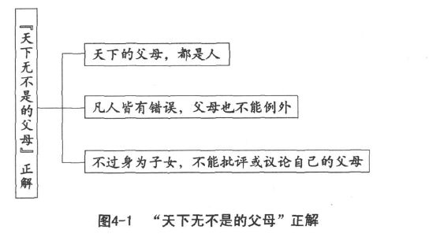
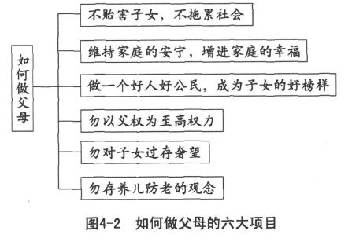
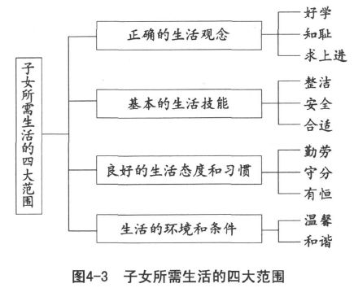
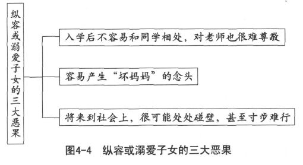
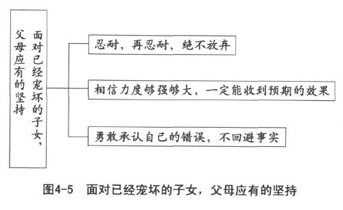

 *第四章　父母必须负起应负的责任*

父母难为必须用心善尽责任，

多生不如少生务必讲求优生。

至少要从怀孕开始重视胎教，

自己以身作则更加孝顺父母。

最好提供子女所需要的生活，

培养正确的观念和行为态度。

我国有《孝经》，意在指导子女如何孝顺父母，却没有《慈经》，说明父母应有的责任。陈大齐教授认为，大家之所以少谈为父之道，实在是有所顾忌。有父亲在堂的人，如果高谈如何做父亲，而所谈又是自己的父亲所未能做到的，则不免有指责自己父亲所短、讥刺自己父亲的嫌疑。父亲若己去世，自己则正在做父亲，负有管教子女的责任，这时候高谈如何做父亲，而所谈又有许多为自己所未能做到的，则不免暴露自己的所短，有作茧自缚的恐惧。大家为了免除嫌疑，不敢多谈；为了免除恐惧，也不愿多谈。

他认为这种情况，很值得同情、值得原谅，但是应该谈的总不能不谈，因此主张：我们只当问该不该谈？若是该谈的，就当放胆而谈。只要谈得合于理，就不必有所顾忌。陈大齐教授以为，如何做父亲，是一个应该大谈而特谈的问题。因为父亲在家庭中，居于最主要的地位，是家庭美满幸福的主要因素。当陈先生八十几岁的时候，父亲早已经去世，不致产生讥刺父亲的嫌疑；儿子已经进入中年，早已独立生活，也没有作茧自缚的恐惧，这才放心书写“如何做父亲”一文，详论为父之道。

笔者年轻的时候，曾拜读陈先生大作，深为感动。先父母毕生心血，几乎都以教养子女为重点，工作之余，完全用在我们这些子女身上。笔者六十岁以前，凡有大事，无不事先向家父母请示。如何教养子女？亦以家父母为不二典范。六十岁以后，才偶尔提出意见，向双亲请教。如今年逾七十，双亲仙逝，子女也都成家立业，更能够体会陈教授的心情。但是，写到这一章的时候，仍然诚惶诚恐。

孔子曾经说过“父父、子子”的道理，在《论语》中，子子的道理颇多，却没有父父的论说。这应该是当时人士对“天下无不是的父母”解读错误，以致孔子没有机会在这方面细加说明。“天下无不是的父母”，不能完全按照字面的解释，认为凡父母所为都是正确的。因为大家都知道人非圣贤，不可能不犯错误，父母是人，当然也不例外。“天下无不是的父母”，原意应该是“天下的父母都是人，都可能犯错（如图4-1所示）。只是身为子女，不应该也不必要加以议论或评判”。既然有“父父”的要求，便是“父亲应该做好自己的角色扮演”，因而“扮演不得当的父亲，最好自行改进”。我们说“父”，应该包含“母”在内。

陈大齐教授所说如何做父亲，可以扩大到父母双方，为此他提出六大项目（如图4-2所示）。

“无后为大”的“后”字，陈教授认为，应该解释为“身心健全的后代”，倡议“患有可能遗传并贻害子女以大患疾病的父母，必须自重，二千万不可拘于‘不孝有三，无后为大’的古训，便糊里糊涂有所生育”，以免直接贻害子女，间接拖累社会，成为既不慈又不义的人。

家庭的安宁，需要家人共同维持；家庭的幸福，也需要家人共同增进。温暖和睦的家庭，亲子关系才会良好。陈教授指出破坏家庭安宁最大的因素，莫过于丈夫对妻子的不忠以及父母对子女的偏爱。夫妇本来就应该互相拥有，不容第三者入侵。男女都应该坚守贞操，严守一夫一妻制，不能有外遇。对子女不能偏爱，以免造成争宠的恶果。

父母都重视人格修养，子女自然跟着学习。父母率先讲求忠信，做成好人，子女也就重视忠信，成为社会上有贡献的好公民。

父权至上根本就是不正当的表现。凡事互相对待，怎么可以片面无限增强一方的权威？古圣先贤在很多言论中已经表达不以父权为至高权力的意思，我们千万不要食古不化，又不求甚解，误认为严父便是父权至上，以致害得许多父亲不敢扮演严父的角色，反而对子女不利。

对子女存有过高的期望，是一般父母常见的弊病。人的资质各有不同，为什么优秀的子女一定要出生在自己的家中？何况人上有人，谦虚一些总归是好的。合理期待子女，对亲子关系十分有助益。

我们在这里，只想先说一声：“父母难为！”因为就算明白自己的责任，也可能由于各种难以控制的因素而难以达成。然而任何具有强烈责任感的父母，都会尽心尽力把父母的工作做好。出于这种原因，我们说“天下无不是的父母”显然有其缘由。难为，还是不得不为。站在这种立场，来说明父母应尽的责任，比较合乎人情义理，也更为实在可行。

# 多生子女不如讲求优生

这是一个讲求少生子女的时代，孩子生得少，就显得更加宝贝。少生就应该优生，生得少，当然要生得好。

往昔由于农业生产的实际需求，大家都希望多生子女，以充实家中的人力。那时候孩子生得多，大家都认为子孙满堂才是有福气。孩子生多了，父母反而不必担心子女的成长，因为一堆孩子当中，总会有一两个长进的，怕什么？由于负担重，也实在照顾不过来，所以常常任由子女自生自灭，实在很可怜！但是，大家都这样，也就见怪不怪，以为本来就应该如此。

现代人看到人口不断膨胀，几乎让地球承受不了。特别是中国，很早便倡导少生，最好只生一个，顶多两个，千万不要多生，以免父母受累，社会也受害。既然少生，首先就应该讲求优生，重质不重量才对。

## 优生从慎重择偶开始

真正的优生，要从结婚之前恋爱择偶的时候开始。保持冷静、公正、客观的态度，来观察对方，了解其身心健康、性情脾气、人格修养、教育水平、就业能力、处事态度以及潜在能力等特质，看看是不是合乎自己的期望，将来生男育女，符不符合优生的要求。但是，这样的人会谈恋爱吗？恋爱中的情人可能如此冷静吗？自由恋爱能够讲究这些婚姻条件吗？从这种角度来重新界定大家长久以来一直指责、批评的“父母之命”、“媒妁之言”、“门当户对”是不是相当有道理，丝毫不能马虎呢？

西方人为自己而结婚，男女受爱情的驱使，认为有必要结婚便可以做出决定，然后再告知父母和家人。中国人为大家而结婚，认为结婚是两家人的共同大事，必须承受父母之命，加上媒妁之言，讲求门当户对，祈求天作之合。新婚夫妇住在丈夫的父母家中，在那里生育自己的子女。一直到丈夫的父母去世后，才和其他兄弟分居。这种方式，对新婚夫妇来说，应该是一种很大的便利，既可以不用负担单独居住的庞大费用，又有自己最放心的父母帮助照顾年幼的子女。这实在是父母的恩惠，新婚夫妇应该觉得十分喜悦才对。全盘否定这种做法，认为这不合时代的潮流，实在是大错特错。

### 父母之命

如果真的以子女的终生幸福为立场，凭着父母的丰富经验，配合双方现有的条件，为子女设计婚姻，并且和子女商量，共同参与，充分交换意见，适时加以辅导。相信这样的父母之命，必能获得子女的欢迎与感谢。

### 媒妁之言

若是做媒的月下老人，不但德高望重，而且热诚待人、实事求是，绝不过分夸张或借机谋取利益，完全站在客观的立场，认为合适的才加以介绍，并且还要看双方的互动，尊重当事人和双方家庭的反应，丝毫不勉强，一切顺乎自然，又有什么不好？现代登报征婚、通过婚介所的活动、托亲朋好友介绍，难道不是媒妁之言的翻版和扩大？凭什么大加挞伐？

### 门当户对

讲求双方家庭的各种条件彼此相当，互相配称，以免穷家女儿嫁为富家媳妇，结果成为高级佣人，表面上十分风光，实际上满肚子苦水。富家女成为穷人的媳妇，巧妇难为无米之炊，加上生活富裕惯了，一旦贫穷，觉得更加难受，痛苦不堪。在尚未被爱情冲昏了头之前，先看看双方的家庭是否门当户对，应该是避免婚后紧张或不适应的最好办法。

可见父母之命、媒妁之言、门当户对的原来用意，并没有什么不对。我们也不能由于其行之日久，大家逐渐知其然而不知其所以然，产生很多偏差行为，便完全加以放弃。我们常说：是我们自己做错了，并不是古圣先贤所说的道理有问题。只要大家正本清源，真正走上正道，以现代化的方式来发扬父母之命、媒妁之言、门当户对的精神，使其产生实质作用，对婚姻就会有正面的作用，对优生也有很大的助益。运用得合理，才最重要。

父母的遗传当然很要紧，但是子女从父精母血当中怎样选择与组合，似乎更为重要。从前有一位才子，学问好得很，才华高得人人称羡，可惜人长得丑得不得了。偏偏有一位美貌艳丽的电影明星，非常欣赏他，写信向他求婚。才子知道，这位明星的美貌，自然不在话下，可是她的幼稚、肤浅和粗俗，也是众所周知。因此他回信拒绝，坦白指出：“我想不通你为什么会看上我，我不是长得很难看吗？怎么配得上你的美貌呢？”女明星毫不气馁，回信说：“我相信我们生出来的子女，应该会像我这样美貌，又像你那样聪明。”这位才子赶忙回信：“万一我们的子女不会选择，生出来像我这样丑，又像你那样笨，岂不是十分可怜？”

结婚之前，仔细想想父母之命、媒妁之言、门当户对的古训，至少把自己的对象先带回家让父母看一看，并且听听父母的意见，不应该等到恋爱成熟，才“告知”父母。像结婚这等大事，居然不事先征求父母的意见，看看父母是否允许，只是事到临头，才匆匆告知。意思是不管父母同意与否，自己就是要这么办，是不是大不敬，也就是不孝顺父母呢？自己的女儿竟然没有经过介绍人的提亲，让身为父母的有充分时间能够打听一下男方的状况，思虑一下女儿的幸福，便宣布即将结婚的消息，毕竟也是不孝的行为。婚前对父母不尊重，没有经过正式的媒介；婚后遇到什么问题，恐怕只好由年轻夫妻，硬着头皮去乱撞。实在是太冒险、太幼稚了。

冷静地分析双方家庭的社会地位、文化水平、生活方式、家庭声誉等，看看是不是相差太远，会不会造成婚姻生活的障碍。换句话说，看看是不是门当户对。婚后双方互相了解，彼此融洽，才不致由于所受家庭教育差异太大而产生困难，亲家相互排斥，变成冤家。

如果看这本书的时候，你已经结了婚，那就用不着追想婚前的事情，以免节外生枝，徒增烦恼。既然优生的第一个时期已经成为过去，不如好好把握优生的第二个黄金时间，那就是夫妻两个人平心静气地做好家庭计划：要不要生儿育女？要生几个？什么时候生？生男生女有没有关系？将来如何教养？务须谈出一个具体可行的计划，然后逐步付诸实施。

在合适的时期，有计划地怀孕，也是一种优生。可是，现代工商社会，夫妻的工作普遍十分忙碌，稍微有一点时间，便想要旅行度假，从事一些休闲活动。结果弄得忙上加忙，累了还要更累，实在有心无力，很不容易安静地讨论这些事情。就算真的讨论，也不过说一些好听话，相信没有人敢坦白指出：一定要生男孩，而且一个就好。果真如此，还没有生育，恐怕就会天天吵架，说不定根本生不出来，又有什么好吵的？可见知难行易在这方面是说不通的。

## 夫妻的孝心是最好的胎教

把握优生的第二个宝贵经验是重视胎教。虽然近来有科学信息否定胎教的功能，说什么胎儿根本在熟睡，不能接受胎教。实际上，很多妈妈都有过胎动的经验。胎儿对文字、语言当然完全不了解，但是，父母无言的信息，胎儿应该有所感应。妻子怀孕了，夫妻都十分欣喜，或者事情发生得太突然，双方为了要不要生下来争执不休。相信这些信息让胎儿很容易明白受欢迎或不受欢迎。胎儿接受信息之后，很可能会做出某些反应。

有些夫妻一想到快要做爸爸、妈妈了，就开始紧张起来，马上想到要多赚一些钱，多存一些钱，准备给即将到来的子女充当教育费用。谈论的话题围绕在想要让子女学这样、学那样，甚至有人想到要买一套房屋，使子女长大了有自己的家。可怜天下父母心，一下子就想得这么长远。可惜想的都是物质方面，却把精神方面几乎忘光了。

自己怀孕，只知道害喜不好受，为什么不想想妈妈当年怀自己时也受过同样的苦楚？说不定会更加厉害。看到妻子怀孕走起来都很不方便的样子，为什么不想想自己的妈妈当年也是如此？一心只扑在子女身上，却忘了爹娘，这是孝道的精神吗？

要优生，打从怀孕那一天开始，就应该更加孝顺父母。夫妻的孝心，才是最好的胎教，什么样的父母，就会养出什么样的子女。对于子女的影响，从怀孕开始。到子女三岁时，就能知道这孩子青年时的状况；通过观察子女六岁时的表现，大概就可以推知其老年的样子。三岁看大，六岁看老。学前的家庭教育，是人生的关键，千万要注意，因为转瞬就将过去。

要孝顺父母，必须抽出一些时间，重温圣哲的教诲。这些金科玉律经过漫长时间的考验，迄今仍然流传，必定有相当的道理，至少要比那些新的理论可靠得多。新理论虽然可能吸引大家的注意，但是很快就消失了。夫妻应该遵照古圣先贤的教诲，按照现在的实际状况，赋予现代化的精神，采取现代化的方式，在日常生活中，用心实践。这种合乎国情也合乎时代要求的胎教，是最上乘的胎教。

## 为子女打好做人的基础

孩子出生以后，父母便可以在家里播放《弟子规》、《千字文》、《三字经》。三岁到六岁之间，就教子女背诵这些经典，不用担心子女不明白其中的意思，也不必怀疑子女背诵起来会有困难。许多实例已经证明，孩子背诵要比大人容易得多，而且读经的孩子，不容易变坏。

《三字经》是从前教幼儿认字的一本书，总共三百八十八句，每句都只有三个字，所以称为《三字经》。内容大多用来宣扬伦理道德，现代却将骂人的话也叫做“三字经”。

《千字文》一共只有一千个字，但是全书每一个字都不相同。把这一千个各不相同的字连在一起，成为一篇通俗的文章。内容涵盖了自然、社会、历史、伦理、教育等方面，便于对初学者进行启蒙教育。

至于《弟子规》，和《三字经》一样，也是每句三个字，很容易念诵。《弟子规》把日常生活当中所需要的基本礼节、生活要领都一一作了说明，孩子背诵之后，一方面朗朗上口，一方面逐一实践，十分方便又有效。

孩子这一辈子，是要来做人的。父母辅助子女，愉快地把人做好，才是最正确有效的优生。做事本身，并不是目的，通过好好做事来把人做好，才是人生的真正目的。父母教养子女，最要紧的是在子女入学以前为其打好做人的基础。如何把事情做好，暂且不必着急，将来学校会好好加以教导。现代学校愈来愈商业化，愈来愈偏重知识的传授，很难教育出健全的人格。子女要怎样做人，要做成什么样的人，实际上还是依靠家庭的培育。父母亲在这一方面真的是责无旁贷呀！

子女是父母的一面镜子，从子女身上，可以找到父母的模样。

有一只螃蟹妈妈，批评小螃蟹走路的样子，说：“你这样横着走路，有多难看你知道吗？为什么不能直着走呢？”

小螃蟹说：“怎么直着走？请妈妈走个样子让我学好吗？”

于是螃蟹妈妈走了起来，大声说：“注意看，好好记住妈妈走路的样子。”

小螃蟹很天真，笑着说：“原来直着走和横着走都是一样的。”

螃蟹妈妈这才发现，原来自己也是横着走的。

《伊索寓言》里这一则故事告诉我们，父母的日常言谈和举止行为对子女的性格和教养，具有非常密切的关系。中国人喜欢说“龙生龙，凤生凤，老鼠生儿会打洞”，初听起来好像完全是遗传，实际上和后天的教养关系极为深远。教养子女，父母最好从自己着手，先改变自己。父母有好的榜样，子女模仿的结果，自然有好的样子。

父母怎样改变自己呢？首先，要从端正观念开始。因为观念产生态度，所有行为的背后，都有坚强的观念在支撑，要改变行为必须先调整观念，也就是多看圣哲的经典，来改变自己的行为。因为圣哲的教诲，是人生智慧的传承。父母在子女幼小的心灵中打好人生智慧的良好根基，子女愈长大，便活得愈有价值。

我们不赞成把以前的孝子孝女变成今日的孝爸孝妈，即不是子女孝顺父母，而是父母对子女百依百顺。我们也不赞成，把孝道变成一套完整的制度，强行地规范亲子的行为。我们坚定地相信，人禽之间的分辨，最关键的就是孝悌的道理。现代人解释孝道，大多采取西方的观点，以致严重地误解了孝道的原来用意。当然，历代的迂儒把孝道大大地僵化，也扭曲了其本来的面目。我们必须发扬“虞舜以孝感化父母和弟弟，改变不义的行为”的精神，以此来弘扬高级的孝道。

《孝经》第一章说得十分明白：“夫孝，德之本也，教之所由生也。”孝道是修身、齐家、治国、平天下的基本原则，不能因为西方社会并不重视便加以轻忽。

我们特别在父母的责任这一章说了很多孝道的重要性，便是希望大家深切了悟：我们既是子女的父母，也是父母的子女。如果为人父母，不能在孝道上面以身作则，反而迷失了方向，在父母跟前，对自己的子女百依百顺，岂不是直接伤害父母的感情？我们经常看到，年轻的父母把自己的子女当宝贝似的，眉开眼笑，可是对自己的父母，却有很多意见，不但语气不好，态度也相当轻率，处处显得自己比父母高明。难怪今天的父母，也希望子女长大了干脆搬出去住，免得整天看那种脸色，心里既烦又冷。

反过来说，在自己的子女面前，对自己的父母十分孝敬，做子女的典范，其实是最好的优生。子女的眼睛是雪亮的，父母怎样对待祖父母，将来自己长大以后，就会以同样的方式来对待父母。这种现世报应，是怎么都逃不掉的。

孔子说得好，如果只是拿食物供养父母，和饲养犬马有什么两样？供养父母时，子女的心中必须充满了敬和爱，以父母能够享用子女所敬奉的衣食为最大的快乐。在日常生活中，无论为父母做事，或者侍奉饮食，都应该诚恳，完全心甘情愿，没有丝毫勉强。子女看到自己的父母孝敬长辈，将来长大以后，大多亦步亦趋，也同样地孝顺。真正孝顺的孩子，才是优生的表现。

我们所说的优生，是广义的，并不是狭义的。因为准备妥当才生孩子的人终究是少数，明白优生的道理，才开始怀孕，有时候也生不出来。对于过去的种种，懊恼、后悔都无济于事，不如从现在开始，不管情况如何，都可以着手补救。只要方向正确，方法有效，方式也合理，都能够从事优生的补救。若是效果良好，谁说不算是优生呢？生之前优，是未雨绸缪；生以后优，是事后补救。两者兼顾并重，应该最为合适。父母以自己的孝道来启发子女的孝道，用自己的行为来引导子女的行为。这样的亲子关系，不但可以互相规范、彼此共同成长，而且培育出孝道的家风对社会也有莫大的贡献。

# 提供子女所需要的生活

孝道的第一步，应该是能养。成年子女，对年老的父母，有恭敬供养的责任。反过来说，父母对于未成年子女，同样应该提供其所需要的生活，而且要真诚关怀。

我们通常把成家与立业合在一起讲，意思是成家之后必须立业养家，为子女做好生活的准备。目的在提醒结了婚的男人或者当了父亲的年轻人，今后他的工作，不单是为父母或者大家庭，更是为自己所创立的这个小家庭，为了善尽父亲的责任，必须加倍努力工作，不能像以前那样，就算偷懒，也照样可以混饭吃。

为什么把养家糊口的责任全部归于男人？理由应该是：妇女的天职在生育子女，进而相夫教子，除非不得已，不需要女性在养育子女、料理家务之外，还要在职场上呕尽心血。虽然说夫妻两人上班，可以多挣一份薪水，但是仔细盘算，有时发现所损失的可能更多。

二十世纪中期，英美各国盛行妇女运动，倡导妇女离开家庭，到社会上工作，和男人一样彼此竞争，以显示男女的地位平等。妇女为了在职场中奋斗，有些干脆不结婚，或者结了婚不生育子女，以保持竞争力。自己养育子女的少之又少，即使有了子女，也交给托儿所、幼儿园。二次世界大战期间，苏联政府扩大宣传家庭生活的重要性。影响所及，美国的年轻妇女，绝大多数想结婚，婚后想生儿育女，而且多多益善。于是，妇女回到家庭，不再外出工作。特别是二十世纪五六十年代，由于经济繁荣，就业率很高，大家都以为收入没有问题，生活可以保持富裕。在这种情况下，丈夫有稳定的工作，全家生活不必担心，妇女自然不需要就业。迄今美国中上阶层的家庭，妇女专心家务、天天接送子女的现象仍然相当普遍。1970年以后，美国经济逐渐走下坡路，家庭生活难以维持，才逼迫妇女再度走出家庭，寻找工作。

可见全世界各地区，大多明白孩子最好在自己家中，由父母亲自教养，身心才能正常发展的道理。由于夫妇无法全都辞掉所有的工作专心做好专职的父母，以免家庭经济产生危机，只好男女分工，以男人为优先，到职场上冲锋陷阵，将妻子留在家中，专心相夫教子。

有人说妇女受那么多的教育，如果不到职场上作出贡献，岂不是很可惜？我们则认为妇女应该受教育，而且应该受良好的教育，用来教养民族的下一代，这样所作的贡献更大。男人专职教养子女，实际上不如女性。但是，如果有一对夫妻，彼此商量决定，由妻子上职场拼斗，而丈夫留在家里专职教养子女，我们也不会反对。只要认为在家教养子女，贡献不小于到职场上工作，那就十分正确了！

子女所需要的生活，范围十分广泛，包括正确的生活观念、基本的生活技能、良好的生活态度和习惯以及生活的环境和条件（如图4-3所示）。本节我们就针对子女所需要生活的四大范围作一下详述。

## 培养子女正确的生活观念

常听说西方社会是儿童的天堂、青年的战场、老年的坟墓。除了少数极为富有的家庭，大多数人终生都在寅吃卯粮，过着举债度日的生活。这是西方人不知惜福、不能造福的习惯所造成的难以享福的恶果。

中国人自古以来便十分重视福分，大家都知道祸福相随以及祸福自召的道理。我们的生活观念和西方完全不同，我们所重视的是少年要积福、中年要造福、晚年才能够享福。从小养成读书的习惯，培养好学的精神；兄弟友爱，必须和睦相处；家人以和为贵，不许搬弄是非；严于律己，宽以待人；做错事要勇于承认，知过必须能改；家财万贯不如一技随身，读书学习贵在实行；凡事自留余地，不能得理不饶人。列举起来，可以说不胜枚举。然而最终的目的，不外乎从小积福，把福分累积起来，以便日后造福之用。

福分从哪里来？并不是由天而降，也不是父母的庇荫，而是更需要自己的努力。常听说，福田靠心耕，就算祖上的遗产十分丰厚，留下很多田地，毕竟要靠这一代人自己去耕种。有福气的人，必须用心耕耘，才能有收获。具有正确的生活观念，产生合理的生活态度和行为，养成基本的生活技能，配合实际的生活条件，随遇而安，常动善念，多做善行，福分自然愈积愈多，称为自求多福。总之，福分需要亲自积累，不能假手他人。所以父母的责任，在教导子女培福积福，最基本的观念应该是好学、知耻和求上进。

好学是爱好学习，必须勤于学习圣哲的教诲，才能明白做人的道理。从小学习把人做好，自能积福。

知耻是凡事先想一想，怎样做才合理？如果不明白，要向父母或尊长请教，以免犯错。万一做错了，必须勇于改过，力求不再犯第二次。谨言慎行，是知耻的表现。知之为知之，不知为不知，那就更加不容易。

求上进是一辈子的事情，活到老就要学到老，永远不松懈。但是从小养成习惯，非常重要。人向高处走，应该像水往低处流一样自然，只要方向正确，方法合理。力求上进，永远不认输，可以说是优良的家风。

## 培养子女日后所需的生活技能

我们所有的生活技能，实际上都是后天学习得来的，没有一样是先天带来的。没有人生下来就会吃饭、洗澡、做家事，我们的谈吐、衣着、工作和游戏，基本上都必须经由学习和演练才逐渐成熟，就算啼哭、吵闹、嬉笑、撒娇、骂人、打架，也都是生下来以后经过模仿、学习所产生的结果。父母最好明白，管教子女，应该从日常生活当中培养子女正确的生活技能。一般人总认为一技之长指的是就业所需要的技能，却经常忽略了基本生活技能才是终其一生都需要的一技之长。缺乏生活技能，在日常生活上遭遇不便或产生困难，不但会受到他人的嘲笑，也会影响自己的生活。今天不健全的孩童实在为数太多，我们所认为健康而没有害病的孩童，严格说起来，只是处于“一般”、“还不错”的水平，实际上并不一定确确实实合乎标准。很多孩童缺乏生气和动力，主要原因即在于生活技能缺乏，造成很多不必要的生活压力所产生的恶果。

父母教导子女生活技能，最好从胎儿开始。怀孕六七个月以后，母亲就要常常变换自己的姿势，使胎儿学习调整姿态，寻求在子宫里面的平衡点。孕妇的活动量太少，姿势变换得不够多，胎儿所有的感官系统，包括视觉、听觉、触觉、嗅觉和味觉都会由于刺激减少而失去反应的机会。婴儿出生以后，也应该多动、多听、多玩，从中训练出良好的平衡感，以期终生受用。

孩子出生以后，首先要教导的是语言。这是人的一生都十分重要的生活技能。若人的语言能力欠佳，在很多地方都会吃亏。父母常在喂饭时和幼小子女说话，或者把子女抱在腿上和子女面对面地说话，目的都在训练子女的语言能力。两岁以前，不要急于纠正婴儿的发音，让婴儿想开口便开口，获得说话的愉悦。五岁以前，尽量保持单一的语言，培养直觉的反应。三岁左右听录音带，然后才看录像带，这样比较不会伤害儿童尚未发育完全的眼睛。至于学习外国语言，至少要等到小学四年级以后，以免影响到本国语言的学习和使用。有人受到“不要输在起跑线上”这一句话的误导，提早让子女学习外国语言。但现在很多实例告诉大家，小学四年级以前学习外国语言，并不一定比小学四年级以后才学有更好的成绩表现。

三岁大的子女应该开始训练基本生活能力，因为这时子女成长逐渐进入平衡期，此时训练基本生活能力最为有效。我们所说的“三岁看大”，实际上就是三岁的时候必须奠定大人所需生活技能的良好基础，最基本的是整洁、安全和合适。

整洁包括整齐和清洁，从小养成物归原位、把东西擦拭干净、摆放整齐的习惯，应该是必要的基本要求。

安全是一切行为的先决条件，不安全的事情不要轻易去冒险。在安全的范围内进行探索、尝试是父母必须善尽的责任，也是教导子女的重点。

至于合适与否，随时随地做出合理的调整，即为合适。这就牵涉到父母的价值观，也是家风传承的骨干。

## 培养子女良好的生活态度和习惯

生活态度和习惯其实是生活观念的具体表现。观念看不见，态度和习惯却看得见，所以比较容易观察。

孩子的观念不可能一下子就固定下来，而是变化不定的。一般来说，奇数的年龄，也就是一岁、三岁、五岁，属于平衡期，孩子经常表现得和天使那样，使父母十分开心；而偶数的年龄，也就是两岁、四岁和六岁，属于不平衡期，孩子表现得有如怪物、恶魔那般，令父母消受不了。这种起伏不定的曲线，代表孩子的学习过程，父母最好能够善加辅导，使孩子逐渐养成良好的生活态度。

一岁以前，婴儿对一切事物毫无所知，不能够保护自己，谈不上什么顺从或反抗。两岁时开始学会说“不”，开始最初的反抗期，这时“不”和“不要”成为最常使用的语言。原因相当简单，便是听多了父母常说这样的话语，模仿得来的结果。

父母希望子女少说一些“不”，就应该以身作则，少对子女说“不”。平日多说“是”，多说“好”，对子女有正面的影响。但是，幼童说“不”，并不一定表示相反的意见。有时候嘴巴说“不要”，动作上却配合父母的要求，做出一些合作的举动。对幼童来说，只能控制行动，并不能控制感觉。说“不”或“不要”，不过是控制不了的一种感觉。实际的动作，才能够表现出控制得了的行动。我们常说幼童天真无邪，便是有什么感觉就会随口说出来，不像大人那样，善于隐藏真正的感觉。童言无忌，希望大人对幼童那些随着感觉说出来的话，不要太过介意才好。

婴儿出生以后到三岁以前，是人生的开始阶段。这时的婴儿，大部分时间都在解决自己的基本生理需求，包括吃、喝、睡觉和保暖，很少能够牵涉到其他。两岁以前的婴儿，只有两种截然不同的生活态度，那就是信任或不信任。父母通过爱心和亲情，培养婴儿对人的信任感，使婴儿逐渐产生活泼自动的态度。缺乏安全感的婴儿，由于对人不信任，常表现出羞愧和怀疑的态度。

三岁到六岁之间，是培养孩童自动自发的最好时期。可惜在这段时期，大部分孩童承受父母太多的吓阻、责骂和怒斥，弄得不敢自动自发，终其一生都受害。

让孩童在自动自发中不断地摸索、学习，使其从各种不同的接触和互动过程中产生多种不同的态度。不论是自动自发的反抗或是自动自发的顺应，父母最好都采取顺其自然的方式，让孩子自动自发地改变。只要掌握勤劳、守分和有恒三大要则，便不难培养出孩子良好的生活态度。勤劳指不怕劳苦、不图安逸、喜欢做事和自己的事情尽量自己去做；守分是扮演好自己的角色，不能够凡事以自己为中心，只考虑自己而不管他人的感受；有恒则是凡事坚持，果敢坚忍，而且坚毅有恒心。

## 为子女创造良好的生活环境和条件

子女的身心健全与否和先后天都有关系。先天的不健全，有一部分来自父母的遗传。所以可能患有较大遗传疾病的父母，最好能够自重，以不生育为宜，以免造成子女在生活条件方面有所欠缺。

既然把子女生下来，父母就要负起责任，提供合理的生活环境。因为经济情况不佳，让子女生活在吃不饱、穿不暖的环境中，怎么能够教养出良好的子女呢？

先天的生活条件，加上后天的生活环境，这都是父母必须为子女设想的地方。就算经济宽裕，足以应付衣食，然而精力有限，也难能照顾众多的子女。所以多生不如少生，少生更应该讲求优生。有人批评节制生育，纯粹出于个人主义和利己思想。其实站在人道的立场，节制生育可以使子女获得较好的教养，实在有其必要性。

广义的生活环境，包括家中的衣食、装潢、设备和用品以及亲友之间的往来。把生活环境弄得太理想化、太单纯化，很可能减弱子女在生活上的防疫力，长大以后，很容易被社会上的恶势力所欺骗、凌辱和操纵，这对子女将来的适应力实在非常不利。这样说来，三代同堂和亲友的往来，增加了家庭生活环境的复杂化，对子女的成长实在是有利的因素。

面对亲友各种不同的教养意见，父母不应该当面加以阻止或反驳，以免伤害和气，也带给子女不良的示范。特别是面对长辈或贵宾的各种表现，更不应该当着子女的面给予难堪或者有不敬的表示。但是，私底下却应该向子女说明，为什么彼此有不一样的看法，仔细把不相同的地方做出分析和比较，相信更能增加子女的了解和信心。对于实在难以接受的亲友，我们建议父母采取敬而远之的方式，保持安全距离，以免发生纠纷。

居家环境，以温馨、和谐、愉快为主。房屋够住便好，不必求大；家具合用为宜，不能豪华奢侈。如果可能的话，婴儿要有自己的睡床，儿童也要有自己的房间，最起码要准备做作业的桌椅以及共同使用的书橱。

父母在物质生活方面但求小康，不能够奢华；在精神生活方面，则应该克制自己的欲望，约束自己的言行，随时随地都要考虑子女的立场，以求适宜。

# 绝对不能够纵容或溺爱子女

## 纵容或溺爱子女的恶果

在英美社会，曾经有一段时期认为：教养子女，只要给予充分的爱，便是最好的父母。这种号称“爱的教育”，产生了很大的弊端，造成了很多青少年问题。因为只爱不管，容易促使孩子为所欲为、无拘无束、予取予求，而且任性疏懒。结果学不到生活技能，又染上一大堆不良的生活习惯，自己缺乏生活能力，势必终生痛苦不堪。纵容和溺爱子女有如下三大恶果（如图4-4所示）。

### 入学后不容易和同学相处，对老师也很难尊敬

在家里受到父母纵容或溺爱的子女，一旦长大入学，首先遭遇的难题，便是从自由自在的生活转向有规律的生活。凡是以个人兴趣出发，想做什么就做什么的孩子，都将受到老师的关注、纠正甚至责骂。那时候再来调整，很可能父母和孩子都觉得十分困难。不如趁早使孩子养成规律生活的习惯，预先做好准备。

受纵容或溺爱的孩子，平日和父亲相处，并没有什么权威的感觉。父亲一切都会顺从孩子，不过是孩子的游戏伙伴。而对于颇有权威的老师，孩子真的不知道要如何面对。如果加上父母的特别交代：要好好听老师的话，还带有恐吓意味地说明——若是不听话，老师会骂的。孩子害怕老师，更不容易亲近老师并接受老师的教诲。

至于与同学相处，那就比接近老师更加困难。因为年龄相同的孩子往往互不相让，没有谁愿意给别人便宜，也没有相互之间的帮助和袒护，因而不断产生冲突。这种互相磨炼的机会，正是培养孩子社会性的良好方式。但是孩子适应不良，就会促使其社会化畸形发展，也就是在社会化的过程中出现不正常的状态。

被宠坏的孩子，容易把学校当做自己的家庭，将老师看成父亲那样的玩伴，又认为同学一定要处处礼让。结果发现事实并非如此，就会讨厌学校，不喜欢老师和同学，不愿意到学校上学，以致时常逃课或逃学。

### 容易产生“坏妈妈”的念头

如果妈妈不认同孩子的想法，一味强迫孩子上学，孩子会觉得妈妈一向对自己百依百顺，现在好像变了一个人似的，对上学这件事，要求特别严格。于是愤而称呼妈妈为“坏妈妈”，以表示自己十分不满。

### 将来到社会上，很可能处处碰壁，甚至寸步难行

种种现象都告诉我们：父母纵容或溺爱子女，固然使子女在家里逍遥自在，如鱼得水，可一旦离开家庭，就会寸步难行，处处碰壁，最终受苦受难的仍然是孩子。

现代人生得少，更加容易纵容或溺爱孩子。有小学老师告诉笔者，现代孩童，听到“饭来张口”、“衣来伸手”的语句，竟然认为理所当然。饭来的时候，当然要张口，否则怎么吃得进去？衣来的时候，一定要伸手，不然接不住怎么办？可见这一批被宠坏的孩子，已经丧失了体会、领悟的能力，将来的处境可想而知。现代父母也跟着潮流，喜欢乱改成语，认为是一种创新，结果却无意中害惨了下一代，弄得这些可怜的孩子将来长大以后更难沟通。

星星之火可以燎原，未雨绸缪最为重要。小时候不论是有意或无意的纵容，都可能宠坏了子女。过分被溺爱的孩子，在优越的环境中，只知道闲荡玩乐，花钱不在乎； 自私自利，一切只顾自己喜欢；学业成绩不佳，反而在不良刊物、影片中学到很多寻找刺激的方法用来麻醉自己，终至失去自我，也丧失了人性。到了这个时候，父母才来紧张、愤怒，恐怕已经太晚了。

防患于未然的工作，必须从胎教开始，一路慎重下来，丝毫不能有所疏忽。若是一时失察，或者不知不觉种下了纵容或溺爱的祸根，那该怎么办？

## 要改变子女，首先要改变自己

一般的父母，通常在面对重大打击时，会表现出一样的心路历程，即“D—A—B—D—A”五大步骤：

### D为Deny，即为否认

一方面否认自己纵容或溺爱，一方面也不承认自己的子女被纵容或被溺爱，把责任推给学校和社会。所以，大多数父母最普遍的反应都是老师没教好、社会风气不良，现代环境太复杂，对孩子的引诱太多，谁都难以应付，光是电视节目，就已经没有办法应对。

### A为Anger，即为气愤

对子女的行为，实在看不过去，认为自己对子女十分关心，更具有爱心，也相当用心，为什么子女会变成这样？因此愈想愈气愤，简直难以忍受。这种偏差行为，发生在别人的子女身上，还可以当做笑柄，偏偏发生在自己子女身上，能不生气？

### B为Bargaining，即为妥协

认为反正已经产生，责怪也没有用，气愤也是白费力气，不如彼此妥协，各自退让一步，以求相安无事。只要子女在父母面前不要过分不讲理，就算不满意，父母也打算勉强接受。子女识相一些，在家安分，在外面的事情，父母也不想管。

### D为Depression，即为沮丧

妥协的结果，通常只能暂时过渡。时间久了，各种乱象不断产生，父母受不了亲友和邻里的指责，觉得十分沮丧。究竟是祖上无德，还是自己的福分薄弱，居然生出这样的子女？于是心情恶劣，经常对子女怒目相向，破口大骂，甚至挥拳痛打，弄得全家人神经兮兮，气氛坏到极点。

### A为Acceptance，即为接受

打骂没有效果，被宠坏的事实愈来愈明显，子女甚至公然和父母顶撞，数落父母的不是。父母十分无奈，只好接受这种不幸的事实。这时候的父母，实际上已经放弃了教养的责任，也就是打算放手不管，让子女自生自灭。

这种态度，我们并不赞成。因为子女是父母所生，父母自然负有教养的责任，万万不能推卸。同时，子女的生活态度和习惯也不是先天带来的，而是后天所造成的。父母必须严肃地对待子女被溺爱的问题，设法加以改变。面对已经宠坏的子女，我们认为，父母应有所坚持（如图4-5所示）。

我们建议，父母只有一条路，那就是忍耐，再忍耐，永远不放弃。宇宙人生，实际上都是自作自受的历程。既然如此，对于自己所造成的错误或缺失，最好勇敢地承担，坦白地承认，并且不折不挠地想办法加以补救。

相信很多父母都接受这样的建议，而且身体力行，花费了很多时间和精力，但是，实际的效果不如预期，可以说很不理想，于是，不得不放弃了。

我们的看法则是所用的力道还不够强大。最好抱持信心，继续忍耐，再忍耐，等到力道够强够大，自然浪子回头金不换，发现子女比以前更加可爱，很值得父母用心。

为什么浪子回头金不换呢？因为从来没有变坏的孩子，对社会的黑暗面并没有足够的机会去认识，对温室以外的复杂环境完全没有调适的能力。一旦面临生活情境的变化，往往不知所措而产生严重的伤害。

我们当然不鼓励先让孩子变成浪子，再设法促使其早日回头，以便成为金不换。但是让孩子成为温室中的花朵，毕竟适应力太弱，也不是好事。让孩子在安全范围内，了解一些人间的不平和丑陋，应该也是教养的一大课题。我们通过不同亲友的互动，逐渐扩大子女的交往对象，便是面对不一样的教养主张，健全子女的防疫系统。可以由近亲走向家族，再扩展到社区，循序渐进。

如果子女被溺爱成浪子，我们就以“浪子回头金不换”来加以期待。这种亡羊补牢的措施，犹未为晚。

父母首先要勇敢地承认，这一切完全是自己的错误。当初尚未准备完妥，便匆匆忙忙当了父母。然后又过分相信爱的教育，认为在精神方面要尽量满足子女爱的需求，在物质方面要尽力满足子女的生理欲望。不料爱之不适足以害之，最终把子女溺爱到这种地步。

在子女入学之前，父母并没有把入学前的准备工作做好，包括吃饭、睡觉、大小便、穿脱衣服、讲求卫生等方面的正常习惯，能够不待老师督促，自己也能做得干净利落。入学之后，父母也不能辅导孩子适应学校生活，当孩子和老师发生冲突时，出于保护子女的心理，情不自禁地和孩子站在同一阵线，共同对抗老师。

凡此种种，都必须坦白地承认，勇敢地面对，才能够调整父母自己的心态。我们认为，想要改变子女，最好的办法，其实是先改变父母自己。因为父母一改变，子女就会逐渐跟着改变。若是父母自己不能够改变，却片面要求子女改变，恐怕十分困难，徒劳而无功。

## 探究影响子女偏差行为的四大因素

子女的偏差行为，必有其产生的原因。父母最好冷静地分别从遗传因素、家庭因素、学校因素和社会因素来加以探讨。兹分别说明如下，以供参考。

### 遗传因素

孩子的个性十分近似双亲，除非有后天的影响，否则很不容易加以改变。父母最好顺着遗传本性，因材施教，不能够由于不喜欢自己的某些部分，便寄望子女完全舍弃这些部分。孩子的偏差行为，如果来自遗传因素，父母最好抱持淡化的态度，尽量不去碰触，更不能够存心加以铲除，因为这是过分的奢望。

### 家庭因素

父母过分严苛或过分溺爱，都是不良的家庭因素。单亲家庭使孩子感觉到缺乏爱的孤独，在没有爱心滋润的家中，孩子的心灵容易受到伤害，言行易于乖张怪异。家庭缺乏和谐的气氛，家人时常吵吵闹闹，动不动就粗言秽语，甚至诉之暴力，孩子耳濡目染，备受心理压力。亲子之间存有歧见，也是偏差行为的导火线。

### 学校因素

同学之中良莠不齐，交到好同学彼此互相勉励，自然表现良好；若交上坏同学，那就结群为非作歹，愈来愈猖狂。老师采取专制式的领导，也容易引起孩子的偏差行为。学校的风气对孩子的影响很大，勤勉而富有爱心的校风，孩子的身心就比较健康；若是苛酷怠惰的校风，也容易让孩子产生怪异的心态。

### 社会因素

现代社会充斥不良漫画、电视节目以及害人至深的电动玩具，致使孩子荒废学业，浪费时间和精力，孩子不但身心健康受损，而且赌、抢、偷、骗的几率也甚为惊人。电视、广播深入每一家庭，各种暴力、色情、赌博的信息，可以说无孔不入，令人防不胜防，孩子很快受到感染，很容易变坏。

对于遗传因素，父母最好设法预先防患。若是已经成为事实，那就顺其自然，用淡化的方式加以接纳。

至于学校因素，父母只能够事先多方打听，为子女慎选合适的学校和老师。如果政府划定就学的学区，只好仿效当年孟母三迁的故事，更换居住的所在；若是能力不足，也只有碰运气了。有时候学校容易选，老师不容易指定，因为学校有学校的规定，并不是家长想调班就能够如愿的。就算选定好老师，也未必获得子女的欢迎。所以，同学校因素，父母所能掌握的成分并不大。

社会因素就更加复杂，可以说父母所能掌握的成分少之又少。社会政策是否合适？执行的成果如何？几乎是当今社会的重大难题。我们只能期待，很难控制。

这样说起来，父母所能够掌控的部分，不过是家庭因素。现代社会，父母普遍忙于生计，祖父母则年老力衰，加上管教的意见常不一致，因此很少真正了解孩子的实际情况。由于信息发达，孩子早已学成一套生存方式，尽量在父母跟前伪装成乖孩子，使父母更加不容易察觉孩子的缺点。若婚姻不稳定，则常使子女蒙受不必要的冤屈。亲子相聚的机会不多，有些只是陪在身边，却又各忙各的，根本缺乏交谈，很不容易彼此沟通。

父母对于孩子的行为，大多一知半解，甚至弄不清楚哪些是正常的，哪些则是偏差的。譬如孩子好玩、好动、好问，原本属于正常的行为表现，有些父母却由于其容易控制而施加干涉，反而使孩子的本性受到抑制，从而想办法伪装自己的言行，最终形成偏差的行为表现。

孩子经由尝试错误，不断摸索、学习，父母对此最好采取容忍的态度，予以接纳。只要在安全的范围内，就适度地让孩子在活动中获得一定的经验。孩子在快乐中成长，父母不能够过分加以干涉。孩子多问，是好的现象，父母随机教育，依孩子的年龄，做深入浅出的说明。

家庭中不需要酒柜吧台，不应该设置麻将桌，却必须开辟阅读的场所，布置良好的读书环境，并且依据子女的实际需要，选择或借阅合适的读物。一方面培养子女的良好气质，一方面则增广子女的见闻，对日后的生活必然有很大的助益。抽出时间，带领子女参观慈善机构，实地看一看幼儿园、孤儿院，让孩子了解社会上还有这么多值得同情的人，从而能够更加珍惜现有的生活。

父母爱子女，就必须肯定子女，永远不能够放弃教养的责任。孩子的偏差行为，不能够用强制的方式、专横的手段要求限期改善，却需要父母忍耐再忍耐，先改变自己的态度和行为，然后以负责到底的毅力来教养子女，相信必能感动子女，从而改过向善。即使在单亲家庭，只要教养得宜，也能够使子女克服孤独的苦闷，减少悲观的心理压力，通过与好朋友的互动，同样可以成为正常的孩子。

什么东西都能够登报申请作废，只有子女永远不能割舍，就算登报申明脱离父子关系，实际上也只是说说而已，并不具有法律效力。因为亲子关系是永久的，不能放弃。

