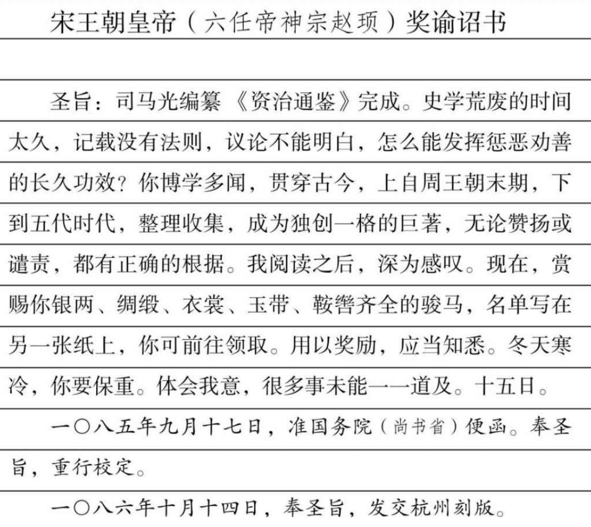

**臣光言：先奉敕編集歷代君臣事迹，又奉聖旨賜名《資治通鑑》，今已了畢者。**  

臣司马光言：

先前，接奉圣旨，要我编纂历代君臣事迹。不久，再接奉圣旨，赐名《资治通鉴》。现在，全书已完全定稿。

**伏念臣性識愚魯，學術荒疏，凡百事爲，皆出人下。獨於前史，粗嘗盡心，自幼至老，嗜之不厭。每患遷、固以來，文字繁多，自布衣之士，讀之不徧，況於人主，日有萬機，何暇周覽！臣常不自揆，欲删削宂長，舉撮機要，專取關國家盛衰，繫生民休戚，善可爲法，惡可爲戒者，爲編年一書，使先後有倫，精粗不雜，私家力薄，無由可成。**  

我性情愚昧而且鲁莽，学术更是荒疏，所做的事，都在别人之下。唯独对于历史，心有所爱，从幼到老，嗜好不倦。深深地感觉到，自从司马迁、班固以来，史籍越来越多，普通人有的是时间，还读不完，更何况高高在上的君王，日理万机，哪有闲暇？我常怀一种抱负，打算加以整理，删除多余的废话，摘取其中的精华，专门收集有关国家兴衰，人民悲欢，善可以为法，恶可以为戒的政治行为，编著一部编年史。使先后顺序，明确呈现，内容篇幅，繁简适当。只因为私人力量单薄，无法着手。  

**伏遇英宗皇帝，資睿智之性，敷文明之治，思歷覽古事，用恢張大猷，爰詔下臣，俾之編集。臣夙昔所願，一朝獲伸，踊躍奉承，惟懼不稱。先帝仍命自選辟官屬，於崇文院置局，許借龍圖、天章閣、三館、祕閣書籍，賜以御府筆墨繒帛及御前錢以供果餌，以內臣爲承受，眷遇之榮，近臣莫及。不幸書未進御，先帝違棄羣臣。陛下紹膺大統，欽承先志，寵以冠序，錫之嘉名，每開經筵，常令進讀。臣雖頑愚，荷兩朝知待如此其厚，隕身喪元，未足報塞，苟智力所及，豈敢有遺！會差知永興軍，以衰疾不任治劇，乞就宂官。陛下俯從所欲，曲賜容養，差判西京留司御史臺及提舉嵩山崇福宮，前後六任，仍聽以書局自隨，給之祿秩，不責職業。臣旣無他事，得以研精極慮，窮竭所有，日力不足，繼之以夜。徧閱舊史，旁采小說，簡牘盈積，浩如煙海，抉擿幽隱，校計豪釐。上起戰國，下終五代，凡一千三百六十二年，修成二百九十四卷。又略舉事目，年經國緯，以備檢尋，爲《目錄》三十卷。又參考羣書，評其同異，俾歸一塗，爲《考異》三十卷。合三百五十四卷。自治平開局，迨今始成，歲月淹久，其間抵牾，不敢自保，罪負之重，固無所逃。臣光誠惶誠懼，頓首頓首。**  

------  

| 称呼类型 | 具体名称    | 备注                      |
| ---- | ------- | ----------------------- |
| 庙号		 | 宋英宗     | 文中提到的“英宗皇帝”。            |
| 姓名   | 赵曙      | 文中开头提到的名字。              |
| 曾用名  | 赵宗实     | 文中括号里提到的名字（他过继给仁宗前叫这个）。 |
| 排序   | 北宋第五位皇帝 | 承接宋仁宗，开启了宋神宗时代。         |

------  

幸而遇到英宗皇帝（宋王朝五任帝赵曙），聪明睿智，关心文化推展，想了解古时政事，借此作为制定国家大计方针的根据。特地下令，教我着手编纂。往日的愿望，忽然可以发挥，欢欣鼓舞，不能自已。唯一恐惧的是，才疏学浅，难以胜任。先帝（五任帝赵宗实）又命我自己物色任用助手，在崇文院内，设立编辑局，准许向龙图阁、天章阁、“三馆”（昭文馆、集贤馆、国史馆）以及秘阁等图书馆，借用图书。并发给御用的笔墨纸砚，更特别犒赏，购买水果点心。并指定宦官充当联络官，直接可以奏报先帝。受恩之深，受宠之隆，近代从来没有。不幸书还没有进呈，先帝竟行去世。陛下（六任帝赵顼）继位大统，也继承遗志，颁赐序文，亲为本书命名。御前讲座时，也常命我宣读。我虽然愚昧，但受到两任皇上如此厚待，即令杀身枭首，也不能报答万一。只要能力够用，岂敢有丝毫惰怠？那时，政府派我代理永兴（陕西省西安市）战区司令官（知永兴军），因身体衰弱，又患病未痊，不能从事繁重工作，请求改调其他官职。陛下顾念下情，答应我的请求，命我担任西京（河南省洛阳市）留守政府监察总监（判西京留司御史台），兼任西京嵩山崇福宫管理官（提举西京嵩山崇福宫）。前后六次调动职务，都准允编辑局跟我一同迁移。并且只发经费，从不规定按时缴出成绩。我既没有其他重大事务，就投入全部精力，精细研究，竭尽心力。白天不够使用，继之以黑夜。不但选录正史，还从旁采及野史（小说）、书信和文件，堆积得好像大海。我们在最隐秘处发掘历史真相，对每一个字都校正它是否错误。上起战国，下至五代，凡一千三百六十二年，共二百九十四卷。另外，再编索引，以年月为纵的轨迹，以事件为横的叙述，便于读者查考，命名《目录》，凡三十卷。再另外，参考各种图书，考证它们的异同，说明真伪，再成《考异》三十卷。——总共三百五十四卷。回溯过去，自本世纪（十一世纪）六〇年代开始着手，到今天才算完成，悠悠岁月，中间受到政局影响，我自己都不敢相信能够平安，负罪至重，不容逃避。

**重念臣違離闕庭，十有五年，雖身處于外，區區之心，朝夕寤寐，何嘗不在陛下之左右！顧以駑蹇，無施而可，是以專事鉛槧，用酬大恩，庶竭涓塵，少裨海嶽。臣今骸骨癯瘁，目視昏近，齒牙無幾，神識衰耗，目前所爲，旋踵遺忘。臣之精力，盡於此書。伏望陛下寬其妄作之誅，察其願忠之意，以清閒之宴，時賜有覽，監前世之興衰，考當今之得失，嘉善矜惡，取得捨非，足以懋稽古之盛德，躋無前之至治。俾四海羣生，咸蒙其福，則臣雖委骨九泉，志願永畢矣！**  

臣司马光，诚惶诚恐，顿首顿首。敬请陛下垂念我远离中央，已十有五年，虽然身在外地，但区区之心，无论早上或黄昏，无论清醒或睡梦，何尝不在陛下左右。只以天性拙笨，无从效力，是以专门从事文字工作，报答皇恩，只求点滴之水和微粒之尘，以增加大海之深和大山之高。我现在骨骸憔悴，双目近视，牙齿几乎全部脱落，精神耗损枯竭。眼前办的事，一转身就都忘掉，残余精力，在此书上全部耗尽。敬请陛下（六任帝赵顼）宽恕我因妄自著作而应诛杀的重罪，俯察我一念之忠，在清闲休息的时候，顺手翻阅。==参考前代王朝的兴衰，考查当今政治措施的得失，嘉奖善良，排除罪恶，坚持正义，改正错误，就足可以追踪古代的盛世，使国家迈入以前从没有过的太平境界。==四海之内的苍生，都蒙受到福祉。那么，我虽葬身黄泉之下，平生志愿也已得到回报。  

**謹奉表陳進以聞。臣光誠惶誠懼，頓首頓首，謹言。**

**端明殿學士兼翰林侍讀學士太中大夫提舉西京嵩山崇福**

**宮上柱國河內郡開國公食邑二千六百戶食實封一千戶臣**

**司馬光　上表**

**元豐七年十一月進呈**  

端明殿学士兼翰林侍读学士、太中大夫、提举西京嵩山崇福宫、上柱国、河内郡开国公、食邑二千六百户、实封一千户臣司马光上表。

一〇八四年十一月进呈

**檢閱文字承事郞** **臣**  **司馬康**

**同修奉議郞** **臣** **范祖禹**

**同修祕書丞** **臣** **劉　恕**

**同修尚書屯田員外郞充集賢校理** **臣** **劉　攽**

**編集端明殿學士兼翰林侍讀學士太中大夫** **臣** **司馬光**

------

**獎諭詔書**
**敕司馬光：修《資治通鑑》成事。**

**史學之廢久矣，紀次無法，論議不明，豈足以懲勸，明久遠哉！卿博學多聞，貫穿今古，上但晚周，下迄五代，發揮綴緝，成一家之書，褒貶去取，有所據依。省閱以還，良深嘉歎！今賜卿銀絹、對衣、腰帶、鞍轡馬，具如別錄，至可領也。故茲獎諭。想宜知悉。**

**冬寒，卿比平安好。遣書，指不多及。　　十五日。**

**元豐八年九月十七日准尚書省劄子奉聖旨重行校定**

**元祐元年十月十四日奉聖旨下杭州鏤板**  

