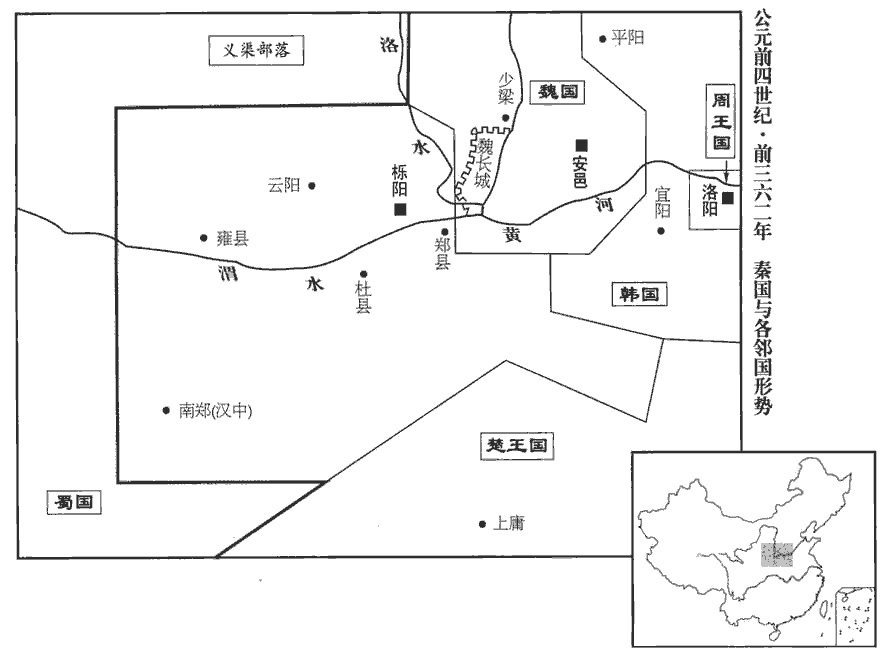
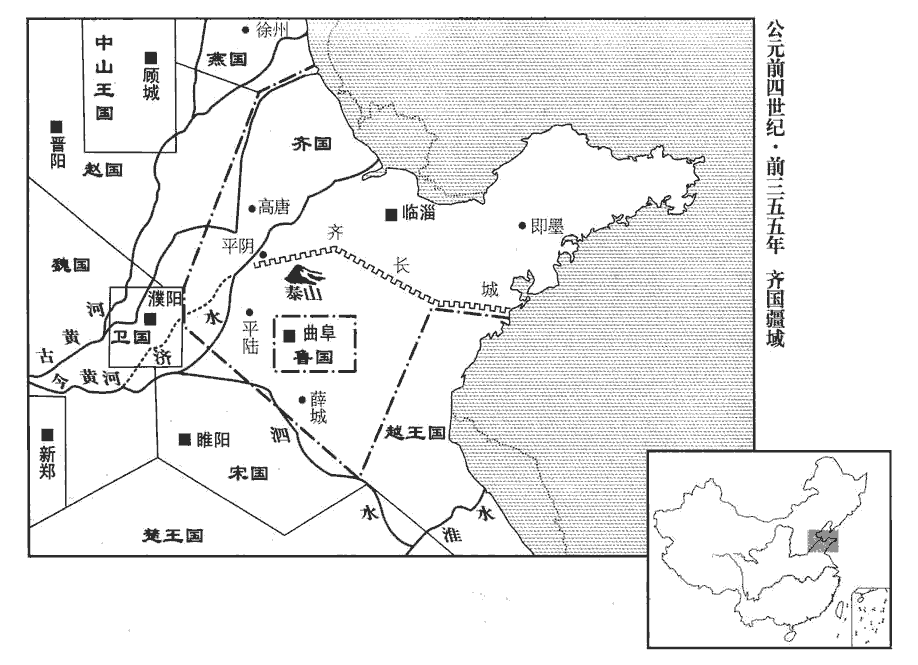
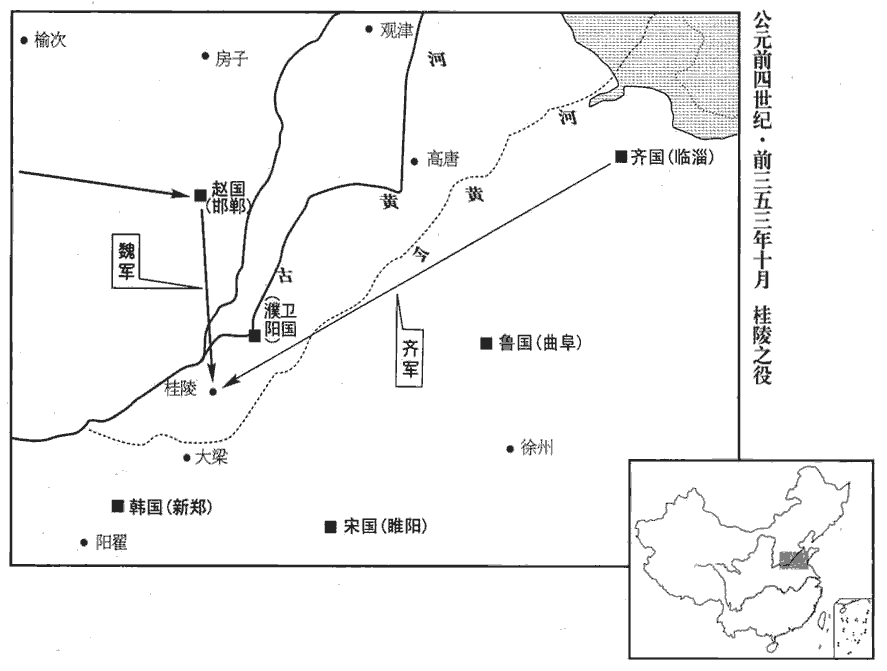
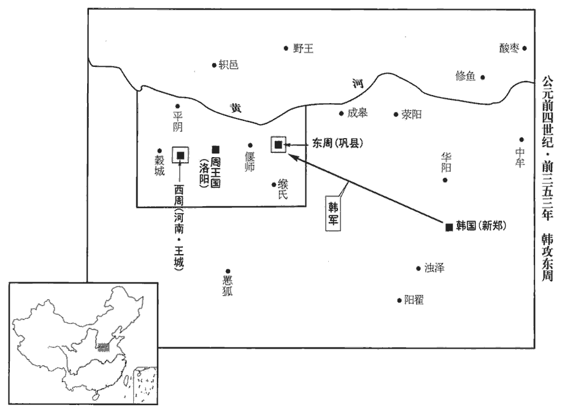
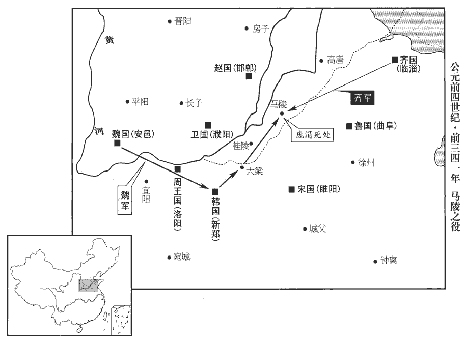
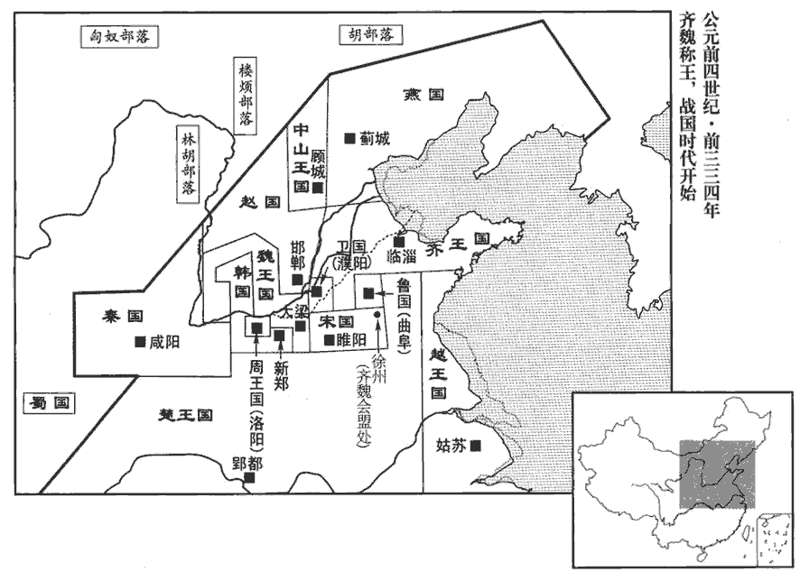
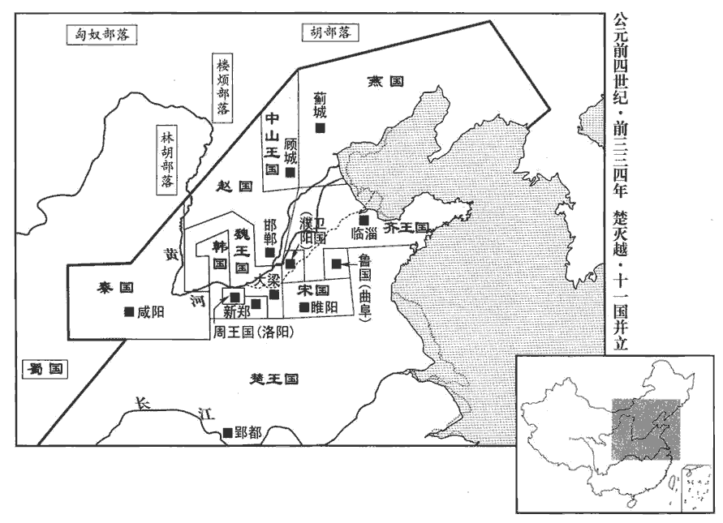
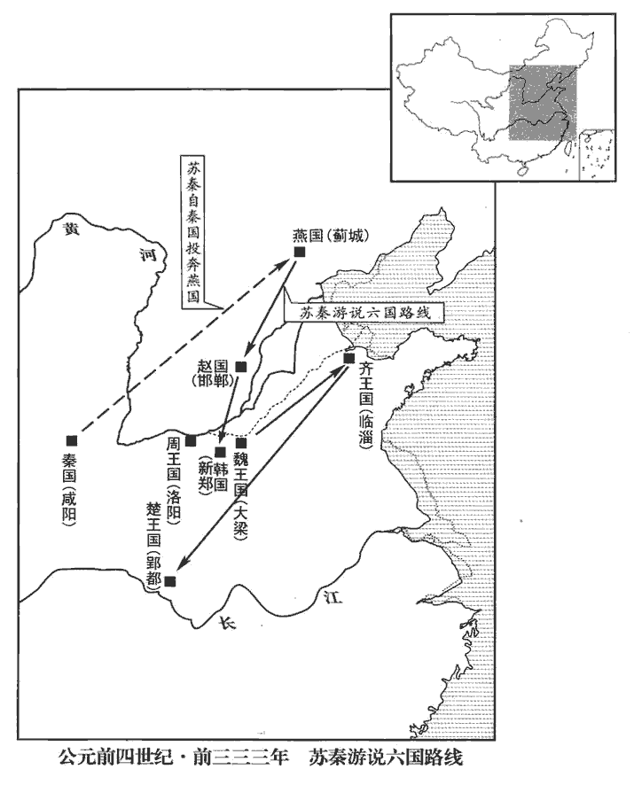
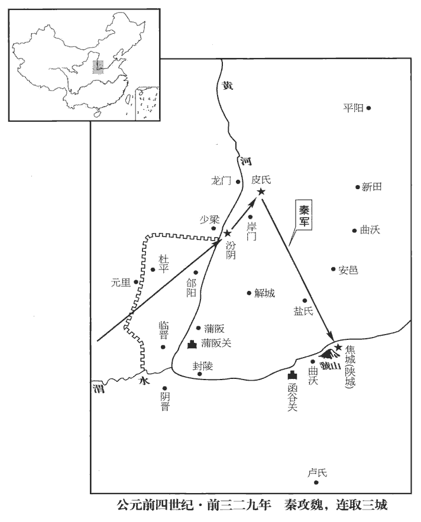

 周紀二起昭陽赤奮若（癸丑），盡上章困敦（庚子），凡四十八年。

# 顯王十一家諡法：行見中外曰顯；受祿於天曰顯；百辟惟刑曰顯。周公蓋未有此諡，而周之末世諡顯王曰顯，意謂後世傳寫周公諡法者遺之。

## 元年（癸丑，前三六八年）

1齊伐魏，取觀津‹山東武邑›。康曰：齊伐魏，魏惠王請獻觀以和，即觀津。余按班志信都國有觀津縣，與齊相去甚遠，且趙地也。又東郡有畔觀縣。水經：大河故瀆東逕五鹿之野，又東逕衛國故城南，古斟觀也。此其魏之觀津歟！徐廣曰：觀，今衛縣。史記正義曰：魏州觀城縣，古觀國。國語云：觀國，夏太康第五弟之所封也。觀，工喚翻。

〖译文〗 [1]齐国攻打魏国,夺取观津。

2趙侵齊，取長城‹山东平阴至胶南长城›。劉昭志：濟北盧縣有長城。史記蘇代說燕王曰：「齊有長城鉅防，」即此。

〖译文〗 [2]赵国入侵齐国，占领长城。

## 三年（乙卯，前三六六年）

1魏、韓會于宅陽‹河南滎陽东›。水經註曰：滎澤之際有沙城，世謂水城，非也。魏冉走芒卯，入北宅，即此宅陽城。括地志曰：宅陽故城，在鄭州滎陽縣東十七里。

〖译文〗 [1]魏国、韩国在宅阳举行会议。

2秦‹府栎阳，陕西临潼›敗魏師、韓師於洛陽‹河南洛阳东白马寺东›。洛陽在洛水之北，周公遷殷民於此，謂之成周。班志，屬河南郡。敗，補邁翻。

〖译文〗 [2]秦国在洛阳击败魏国和韩国军队。

## 四年（丙辰，前三六五年）

1魏‹府安邑，山西夏县›伐宋‹府睢阳，河南商丘›。

〖译文〗 [1]魏国攻打宋国。

## 五年（丁巳，前三六四年）

1秦‹府栎阳，陕西临潼›獻公敗三晉之師于石門‹陝西旬邑东›，水經註：馮翊雲陽縣有石門山。括地志：在雍州三原縣西北三十二里。又曰：堯門山，俗名石門，上有路，其狀若門。故老云：堯鑿山為門，因名之。武德中于此山南置石門縣，貞觀中改雲陽縣。斬首六萬。王賜以黼黻之服。黼者，刺繡為斧形；黻者刺繡為兩「己」相背。孔穎達曰：白與黑謂之黼，黑與青謂之黻。黼，音甫。黻，音弗。

〖译文〗 [1]秦献公在石门大败韩、赵、魏三国联军，斩首六万人。周王特地颁赏他绣有黑、白、青花纹的服饰。

## 七年（己未，前三六二年）

1魏敗韓師、趙師於澮‹山西翼城南浍河›。澮，古外翻。括地志：澮水在絳州翼城縣東南二十五里，水側有皮牢城。

〖译文〗 [1]魏国在浍地击败韩国和赵国军队。

2秦‹府栎阳，陕西临潼›、魏戰于少梁‹陝西韓城西南›，班志：馮翊夏陽縣，故少梁。師古曰：本梁國，為秦所滅，至惠文王十一年，更名夏陽。康曰：魏有大梁，故此稱「少」以別之。少，詩沼翻。夏，戶雅翻。更，工衡翻。魏師敗績；獲魏公孫痤cuó。左傳：師大崩曰敗績。痤，才何翻。

〖译文〗 [2]秦国、魏国在少梁激战，魏国军队大败而逃，公孙痤被俘。

3衛聲公薨，子成侯遬立。

〖译文〗 [3]卫国卫声公去世，其子卫速即位为卫成侯。

4燕‹府蓟城，北京›桓公薨，子文公立。燕，因肩翻。考異曰：史記蘇秦傳謂之「燕文侯」。按春秋時北燕簡公已稱公，文公之子易王尋稱王，豈文公獨稱侯乎！今從世家。

〖译文〗 [4]燕国燕桓公去世，其子即位为燕文公。

 

5秦獻公薨，子孝公立。索隱曰：孝公，名渠梁。孝公生二十一年矣。是時河、山‹华山›以東強國六，河自龍門上口，南抵華陰而東流，秦國在河之西。山自鳥鼠同穴連延為長安南山，至於泰華，秦國在山之西。韓、魏、趙、齊、楚、燕六國皆在河、山以東。華，戶化翻。燕，因肩翻。淮、泗之間小國十餘，南陽郡平氏縣東南有桐柏、大復山，淮水所出，東南至淮陵入海。泗水出魯國卞縣西南，至方與入沛。宋、魯、鄒、滕、薛、郳等國，國於其間。齊威王所謂「泗上十二諸侯」。楚、魏與秦接界。魏築長城，自鄭濱洛以北有上郡‹陝西延安›；鄭縣‹陝西華縣›，周宣王母弟鄭桓公封邑，班志屬京兆。洛，水名，非伊、洛之洛也。水經註：渭水東過華陰縣北，洛水入焉。洛水，古漆、沮之水也。又有長澗水，南出泰華之山側長城東而北流注於渭。史記所謂「魏築長城，自鄭濱洛」者也。宋白曰：今華州東南魏長城是也。上郡，漢屬并州，隋、唐之綏州、延州，秦、漢之上郡地也。濱，音賓。楚自漢中‹陝西汉中›，南有巴‹四川重庆›、黔中‹湖南沅陵›：漢中郡，漢屬益州，自晉以後為梁州。巴，即春秋巴子之國，漢為巴郡，屬益州，唐為巴、渝、渠、果諸州之地。黔中，漢為牂柯郡之地，唐為黔中節度。黔，渠今翻。皆以夷翟遇秦，翟，與狄同。擯斥之，不得與中國之會盟。擯，必刃翻。與，讀曰預。於是孝公發憤，布德修政，欲以強秦。憤，房粉翻，懣也，怒也。朱元晦曰：憤者，心求通而未得之意。

〖译文〗 [5]秦国秦献公去世，其子即位为秦孝公。孝公已经二十一岁了。这时黄河、崤山以东有六个强国，淮河、泗水流域十几个小国林立，楚国、魏国与秦国接壤。魏国筑有一道长城，从郑县沿着洛水直到上郡；楚国自汉中向南占有巴郡、黔中等地。各国都把秦国当作未开化的夷族，予以鄙视，不准参加中原各诸侯国的会议盟誓。目睹此情，秦孝公决心发愤图强，整顿国家，修明政治，让秦国强大起来。

## 八年（庚申，前三六一年）

1孝公下令國中曰：「昔我穆公‹嬴任好›，自岐‹陕西岐山东北›、雍‹陕西凤翔›之間修德行武，東平晉亂，以河為界，西霸戎翟，廣地千里，天子致伯，諸侯畢賀，令，力正翻，號令也，命令也。令者，出於上而行於下者也。岐山‹陝西岐山縣境›，周太王所邑。班志，岐山在扶風美陽縣西。雍縣‹陝西鳳翔›屬扶風。秦穆公娶晉獻公之女。獻公卒，晉國亂，穆公納惠公。惠公立而背河外之賂，又閉秦糴dí。穆公伐晉，執惠公，既而歸之；始征晉河東，置官司。惠公卒，子懷公立。穆公納文公而晉亂平。又能用由余及孟明，以霸西戎。天子致伯者，周禮九命作伯；古有九州，一為王畿，八州八伯，各主其方之諸侯；致伯者，以方伯之任致之穆公也。雍，於用翻。伯，如字。背，蒲妹翻。為後世開業甚光美。會往者厲、躁、簡公、出子之不寧，國家內憂，未遑外事，三晉攻奪我先君河西地‹陕西合阳、大荔一带，魏长城至黄河之间›，醜莫大焉。為，於偽翻。史記：秦厲共公卒，子躁公立。躁公卒，立其弟懷公。四年，庶長鼂cháo圍懷公，公自殺，乃立靈公。靈公卒，子獻公不得立，立靈公之季父，是為簡公。公卒而惠公立。惠公卒，子出子立。二年，庶長改殺出子，迎立獻公於河西。河西地，即魏所有西河之外。史記正義曰：自華州北至同州，并魏河西之地。躁，則到翻。共，讀曰恭。鼂，古朝字。長，知兩翻。華，戶化翻。獻公即位，鎮撫邊境，徙治櫟陽‹陝西臨潼›，史記：秦獻公二年，始治櫟陽。徐廣註曰：即漢萬年縣。余按漢志，櫟陽、萬年為兩縣，皆屬馮翊，後漢始省并。宋白曰：櫟陽，秦舊縣。漢高祖既葬太上皇于萬年陵，仍分櫟陽置萬年縣以為陵邑，理櫟陽城中，故櫟陽城亦名萬年城。後漢省櫟陽縣入萬年縣。後魏大統中，分萬年置鄣丘、宣武，又分置廣陽縣。周明帝省萬年入高陵、廣陽二縣，更于長安城中別置萬年縣。唐武德元年，又改廣陽為櫟陽，元和十五年，并移隸奉先縣以奉景陵。櫟，音藥。且欲東伐，復穆公之故地，修穆公之政令。寡人思念先君之意，常痛於心。賓客群臣有能出奇計強秦者，吾且尊官，與之分土。」謂裂地以封之，使各有分土。分，扶問翻。於是衛‹府濮阳，河南濮阳›公孫鞅聞是令下，乃西入秦。

〖译文〗 [1]秦孝公在国中下令说：“当年我国的国君秦穆公，立足于岐山、雍地，励精图治，向东平定了晋国之乱，以黄河划定国界；向西称霸于戎翟等族，占地广达千里；被周王赐与方伯重任，各诸侯国都来祝贺，所开辟的基业是多么光大宏伟。只是后来历代国君厉公、躁公、简公及出子造成国内动乱不息，才无力顾及外事。魏、赵、韩三国夺去了先王开创的河西领土，这是无比的耻崐辱。到献公即位时，平定安抚边境，把都城迁到栎阳，亲往治理，准备向东征讨，收复穆公时的旧地，重修穆公时的政策法令。我想到先辈的未竟之志，常常痛心疾首。现在宾客群臣中谁能献上奇计，让秦国强盛，我就封他为高官，给他封地。”卫国的公孙鞅听到这道命令，于是西行来到秦国。

公孫鞅者，衛之庶孫也。好刑名之學。師古曰：劉向別錄云；申子學好刑名。刑名者，循名以責實，其尊君卑臣，崇上抑下，合於六經。說者曰：刑，刑家；名，名家；即太史公所論六家之二也。此說非。劉原父曰：刑名，即并學兩家術耳。公孫非姓氏，以其先出於衛，父為衛侯則稱為公子，祖為衛侯則稱為公孫。鞅，於兩翻。事魏相公叔痤，痤知其賢，未及進。會病，魏惠王往問之曰：「公叔病如有【章︰十二行本二字互乙；乙十一行本同；孔本同。】不可諱，相，息亮翻。痤，才戈翻。不可諱，謂死也。俗語有之：「人不諱死」。將柰社稷何？」公叔曰：「痤之中庶子衛鞅，自戰國以來，大夫之家有中庶子，有舍人。年雖少，有奇才，少，詩照翻。願君舉國而聽之！」王嘿然。公叔曰：「君即不聽用鞅，必殺之，無令出境！」王許諾而去。令，力丁翻。公叔召鞅謝曰：「吾先君而後臣，先、後，皆去聲。故先為君謀，後以告子。此先、後，皆如字。為，於偽翻。子必速行矣！」鞅曰：「君不能用子之言任臣，又安能用子之言殺臣乎！」卒不去。卒，子恤翻。王出，謂左右曰：「公叔病甚，悲乎，欲令寡人以國聽衛鞅也！既又勸寡人殺之，豈不悖哉！」悖，蒲內翻。衛鞅既至秦，因嬖臣景監以求見孝公，嬖，博計翻，又卑義翻。史記正義：監，甲暫翻。康曰：景，姓，楚之族。監，古銜切，非。說以富國強兵之術；公大悅，與議國事。說，式芮翻。

〖译文〗 公孙鞅，是卫国宗族旁支后裔，喜好法家刑名之学。他在魏国国相公叔痤手下做事，公叔痤深知他的才干，但还未来得及推荐，就重病不起。魏惠王前来看望公叔痤，问道：“您如果不幸去世，国家大事如何来处置？”公叔痤说：“我手下任中庶子之职的公孙鞅，年纪虽轻，却有奇才，希望国君把国家交给他来治理！”魏惠王听罢默然不语。公叔痤又说：“如果国君您不采纳我的建议而重用公孙鞅，那就要杀掉他，不要让他到别的国家去。”魏惠王许诺后告辞而去。公叔痤又急忙召见公孙鞅道歉说：“我必须先忠于君上，然后才能照顾属下；所以先建议惠王杀你，现在又告诉你。你赶快逃走吧！”公孙鞅摇头说：“国君不能听从你的意见来任用我，又怎么能听从你的意见来杀我呢？”到底没有出逃。魏惠王离开公叔痤，果然对左右近臣说：“公叔痤病入膏肓，真是太可怜了。他先让我把国家交给公孙鞅去治理，一会儿又劝我杀了他，岂不是糊涂了吗？”公孙鞅到了秦国后，托宠臣景监推荐见到秦孝公，陈述了自己富国强兵的计划，孝公大喜过望，从此与他共商国家大事。

## 十年（壬戌，前三五九年）

1衛鞅欲變法，秦人不悅。衛鞅言于秦孝公曰：「夫民不可與慮始，而可與樂成。夫，音扶。樂，音洛。論至德者不和于俗，成大功者不謀於眾。是以聖人苟可以強國，不法其故。」索隱曰：言救弊為政之術，所為苟可以強國，則不必須要法於故事也。甘龍曰：「不然，索隱曰：甘，姓；龍，名。甘姓出春秋時甘昭公子帶之後。姓譜又曰：甘姓，商甘盤之後。緣法而治者，吏習而民安之。」治，直吏翻。衛鞅曰：「常人安於故俗，學者溺于所聞。溺，奴曆翻。以此兩者，居官守法可也，非所與論於法之外也。智者作法，愚者制焉；賢者更禮，不肖者拘焉。」更，工衡翻。公曰：「善。」以衛鞅為左庶長。劉卲爵制曰：春秋傳有庶長鮑，商君為政，備其法品為十八級，合關內侯、列侯，凡二十等。其制因古義。古者天子寄軍政于六卿，居則以田，警則以戰，所謂「入使治之，出使長之，素信者與眾相得」也。故啟伐有扈，乃召六卿，大夫之在軍為將者也。及周之六卿，亦以居軍。在國也，則以比長、閭胥、族師、黨、州長、卿大夫為稱；其在軍也，則以司馬、將軍、卒、伍為號，所以異在國之名也。秦依古制，其在軍賜爵為等級，其帥人皆更卒也。有功賜爵，則在軍吏之例。自一等以上至不更，四等，皆士也。大夫以上至五大夫，五等，比大夫也。九等，依九命之義也。自左庶長至大庶長，比九卿也。關內侯者，依古圻qí內子男之義也。秦都山西，以關內為王畿，故曰關內侯也。列侯者，依古列國諸侯之義也。然則卿、大夫、士下之品，皆仿古比朝之制而異其名，亦所以殊軍國也。古者以車戰，兵車一乘，步卒七十二人，分翼左右；車，大夫在左，御者處中，勇士為右，凡七十五人。一爵曰公士者，步卒之有爵為公士者也。二爵曰上造，造，成也，古者成士升于司徒曰造士，雖依此名，皆步卒也。三爵曰簪褭niǎo，御駟馬者。要褭者，古之名馬也；駕駟馬，其形似簪，故云簪褭也。四爵曰不更，不更者，為車右，不復與凡更卒同也。五爵曰大夫，大夫在車左者也。六爵為官大夫，七爵為公大夫，八爵為公乘，九爵為五大夫，皆軍吏也。吏民爵不得過公乘者，得貰shì與子若同產。然則公乘者，軍吏之爵最高者也；雖非臨戰，得公乘車，故曰公乘也。十爵為左庶長，十一爵為右庶長，十二爵為左更，十三爵為中更，十四爵為右更，十五爵為少上造，十六爵為大上造，十七爵為駟車庶長，十八爵為大庶長，十九爵為關內侯，二十爵為列侯。自左庶長至大庶長，皆卿大夫，皆軍將也；所將皆庶人、更卒也，故以「庶」、「更」為名。大庶長，即大將軍也；左、右庶長，即左、右偏裨將軍也。長，知丈翻。卒定變法之令。令民為什伍而相收司、連坐，索隱曰：收司，謂相糾發也。一家有罪，則九家連舉發；若不糾舉，則九家連坐。師古曰：五人為伍，二伍為什。康曰：司，猶管也。為什伍之法，使之相司相管。秦有見知連坐法。余謂連坐者，一家有罪，什伍皆相連坐罪也；見知乃漢法。卒，子恤翻。告奸者與斬敵首同賞，索隱曰：謂告奸一人則得爵一級，故云與斬敵首同賞。不告奸者與降敵同罰。索隱曰：律：降敵者誅其身，沒其家。今匿奸者，言當與之同罰。降，戶江翻。有軍功者，各以率受上爵；率，音律。為私斗者，各以輕重被刑大小。僇lù力本業，耕織致粟帛多者，復其身；僇，力竹翻，古戮字；說文：并力也。字林音遼。復，方目翻。漢法，除其賦、稅、役，皆謂之復。事末利及怠而貧者，舉以為收孥nú。索隱曰：末利，謂工、商。糾舉而收錄其妻子，沒為奴婢。秦法，一人有罪，收其室家。至漢文帝元年，始除收孥相坐法。孥，音奴。宗室非有軍功論，論，議也，有戰功之可論也。論，盧困翻，康盧昆切。不得為屬籍。屬籍，宗屬之籍也。孔穎達曰：漢之同宗有屬籍，則周家系之以姓是也。周禮小史之官，掌定帝系、世本，知世代昭穆。屬，殊玉翻。明尊卑爵秩等級，各以差次白虎通曰：爵者，盡也，所以盡人才也。毛晃曰：大夫以上預燕饗xiǎng，然後賜爵秩，以章有德。秩，職也，官也，積也，次也，常也，序也。名田宅、臣妾、衣服。有功者顯榮，無功者雖富無所芬華。

〖译文〗 [1]公孙鞅想实行变法改革，秦国的贵族都不赞同。他对秦孝公说：“对下层人，不能和他们商议开创的计划，只能和他们分享成功的利益。讲论至高道德的人，与凡夫俗子没有共同语言，要建成大业也不能去与众人商议。所以圣贤之人只要能够强国，就不必拘泥于旧传统。”大夫甘龙反驳说：“不对，按照旧章来治理，才能使官员熟悉规矩而百姓安定不乱。”公孙鞅说：“普通人只知道安于旧习，学者往往陷于所知范围不能自拔。这两种人，让他们做官守法可以，但不能和他们商讨旧章之外开创大业的事。聪明的人制订法规政策，愚笨的人只会受制于人；贤德的人因时而变，无能的人才死守成法。”秦孝公说：“说得好！”便任命公孙鞅为左庶长的要职。于是制定变法的法令。下令将人民编为五家一伍、十家一什，互相监督，犯法连坐。举报奸谋的人与杀敌立功的人获同等赏赐，隐匿不报的人按临阵降敌给以同等处罚。立军功者，可以获得上等爵位；私下斗殴内讧的，以其轻重程度处以大小刑罚。致力于本业，耕田织布生产粮食布匹多的人，免除他们的赋役。不务正业因懒惰而贫穷的人，全家收为国家奴隶。王亲国戚没有获得军功的，不能享有宗族的地位。明确由低到高的各级官阶等级，分别配给应享有的田地房宅、奴仆侍女、衣饰器物。使有功劳的人获得荣誉，无功劳的人即使富有也不能显耀。

令既具，未布，恐民之不信，乃立三丈之木于國都‹陝西臨潼›市南門，募民有能徙置北門者予十金。予，讀曰與。民怪之，莫敢徙。復曰：「能徙者予五十金。」復，扶又翻。有一人徙之，輒予五十金。李云：金方寸重一斤，為一金。程大昌演繁露曰：二十兩為一金，亦為一鎰。乃下令。

〖译文〗 法令已详细制订但尚未公布，公孙鞅怕百姓难以确信，于是在国都的集市南门立下一根长三丈的木杆，下令说有人能把它拿到北门去就赏给十金。百姓们感到此事很古怪，没人动手去搬。公孙鞅又说：“能拿过去的赏五十金。”于是有一个人半信半疑地拿着木杆到了北门，立刻获得了五十金的重赏。这时，公孙鞅才下令颁布变法法令。

令行期年，秦民之國都之，往也，如也。言新令之不便者以千數。於是太子犯法。衛鞅曰：「法之不行，自上犯之。太子，君嗣也，嗣，祥吏翻。不可施刑，刑其傅公子虔，黥qíng其師公孫賈。」墨涅其面曰黥。黥，音渠京翻。為後秦殺商君鞅張本。明日，秦人皆趨令。索隱曰：趨者，向也，附也，音七喻翻。行之十年，秦國道不拾遺，山無盜賊，民勇於公戰，怯於私斗，鄉邑大治。自是年至三十一年商鞅死，蓋鞅之行其法而致效在十年之間，又十年而致禍。治，直吏翻。秦民初言令不便者，有來言令便。衛鞅曰：「此皆亂法之民也！」盡遷之于邊。其後民莫敢議令。

〖译文〗 变法令颁布一年后，秦国百姓前往国都控诉新法使民不便的数以千计。这时太子也触犯了法律，公孙鞅说：“新法不能顺利施行，就在于上层人士带头违犯。”太子是国君的继承人，不能施以刑罚，便将他的老师公子虔处刑，将另一个老师公孙贾脸上刺字，以示惩戒。第二天，秦国人听说此事，都小心翼翼地遵从法令。新法施行十年，秦国一片路不拾遗、山无盗贼的太平景象，百姓勇于为国作战，不敢再行私斗，乡野城镇都得到了治理。这时，那些当初说新法不便的人中，有些又来说新法好，公孙鞅说：“这些人都是乱法的刁民！”把他们全部驱赶到边疆去住。此后老百姓不敢再议论法令的是非。

臣光曰：夫信者，人君之大寶也。夫，音扶。國保於民，民保於信，非信無以使民，非民無以守國。是故古之王者不欺四海，孔穎達曰：自今本昔曰古。霸者不欺四鄰，善為國者不欺其民，善為家者不欺其親。不善者反之，欺其鄰國，欺其百姓，甚者欺其兄弟，欺其父子。上不信下，下不信上，上下離心，以至於敗。所利不能藥其所傷，所獲不能補其所亡，豈不哀哉！昔齊桓公不背曹沫之盟，晉文公不貪伐原‹河南濟源西北›之利，魏文侯不棄虞人之期，姓譜：曹本自顓頊之玄孫陸終之子六安，是為曹姓。周武王封曹狹於邾，故邾，曹姓也。又云：曹，叔振鐸之後，武王母弟也，後以為氏。史記：齊桓公伐魯，魯莊公請平，桓公許之，與盟于柯‹山东阳谷东›。將盟，曹沫以匕首劫桓公於壇上，請反魯之侵地。桓公許之，曹沫去匕首而就臣位。桓公後悔，欲殺曹沫，管仲不可，遂反所侵地于魯。諸侯聞之，皆信齊而欲附焉。左傳：晉文公圍原‹河南濟源西北›，命三日之糧。原不降，命去之。諜出，曰：「原將降矣。」軍吏曰：「請待之。」公曰：「得原失信，所亡滋多。」退一舍而原降。魏文侯事見上卷威烈王二十三年。背，蒲妹翻。索隱曰：沫，音亡葛翻。左傳、穀梁并作「曹劌」。然則沫宜音劌，沫、劌聲相近而字異耳。秦孝公不廢徙木之賞。此四君者道非粹白，而商君尤稱刻薄，又處戰攻之世，天下趨於詐力，猶且不敢忘信以畜其民，處，昌呂翻。趨，七喻翻。畜，許六翻，養也。況為四海治平之政者哉！治，直吏翻。

〖译文〗 臣司马光曰：信誉，是君主至高无上的法宝。国家靠人民来保卫，人民靠信誉来保护；不讲信誉无法使人民服从，没有人民便无法维持国家。所以古代成就王道者不欺骗天下，建立霸业者不欺骗四方邻国，善于治国者不欺骗人民，善于治家者不欺骗亲人。只有蠢人才反其道而行之，欺骗邻国，欺骗百姓，甚至欺骗兄弟、父子。上不信下，下不信上，上下离心，以至一败涂地。靠欺骗所占的一点儿便宜救不了致命之伤，所得到的远远少于失去的，这岂不令人痛心！当年齐桓公不违背曹沫以胁迫手段订立的盟约，晋文公不贪图攻打原地而遵守信用，魏文侯不背弃与山野之人打猎的约会，秦孝公不收回对移动木杆之人的重赏，这四位君主的治国之道尚称不上完美，而公孙鞅可以说是过于刻薄了，但他们处于你攻我夺的战国乱世，天下尔虞我诈、斗智斗勇之时，尚且不敢忘记树立信誉以收服人民之心，又何况今日治理一统天下的当政者呢！

2韓‹府新郑，河南新郑›懿侯薨，子昭侯立。諡法：昭德有勞曰昭；聖聞周達曰昭。

〖译文〗 [2]韩国韩懿侯去世，其子即位为韩昭侯。

## 十一年（癸亥，前三五八年）

1秦敗韓師于西山‹河南宜陽熊耳山以西›。自宜陽熊耳東連嵩高，南至魯陽，皆韓之西山。敗，補邁翻。

〖译文〗 [1]秦国在西山击败韩国军队。

## 十二年（甲子，前三五七年）

1魏、韓【章：十二行本「韓」作「趙」；乙十一行本同；孔本同；張校同。】會於鄗hào‹河北柏鄉北›。班志，鄗縣屬中山郡。此時為趙地，後漢改曰高邑，唐為趙州柏鄉縣、贊皇縣地。鄗，呼各翻。

〖译文〗 [1]韩国、魏国在地举行会议。

## 十三年（乙丑，前三五六年）

1趙、燕會于阿‹山東东阿›。燕，因肩翻。

〖译文〗 [1]赵国、燕国在阿地举行会议。

2趙、齊、宋會于平陸‹山東汶上縣西北›。

〖译文〗 [2]赵国、齐国、宋国在平陆举行会议。

## 十四年（丙寅，前三五五年）

1齊威王、魏‹府安邑，山西夏县›惠王會田於郊。惠王曰：「齊亦有寶乎？」威王曰：「無有。」惠王曰：「寡人國雖小，尚有徑寸之珠，照車前後各十二乘者十枚。乘，繩證翻。豈以齊大國而無寶乎？」威王曰：「寡人之所以為寶者與王異。吾臣有檀子者，姓譜云：齊公族有食采于瑕丘檀城，因以為氏。使守南城，城在齊之南境，故曰南城。則楚人不敢為寇，泗上十二諸侯皆來朝。朝，直遙翻。吾臣有盼子者，使守高唐‹山東禹城縣西南›，則趙人不敢東漁於河。盼，匹莧翻，又披班翻。按丁度集韻，盼，與盻同。盼子，齊之同姓，即田盼也。班志，高唐縣屬平原郡。杜預曰：祝阿西北有高唐城。宋白曰：齊州章丘縣，古高唐，春秋、戰國之時為齊邑，故城在廢禹城縣西四十里。唐之禹城，漢祝阿也。吾吏有黔夫者，使守徐州‹河北大城›，姓譜：齊有黔敖、則黔亦姓也，音其淹翻。司馬彪曰：魯國薛縣，六國時曰徐州。徐，音舒。丁度集韻「徐」作「俆」xú，音同。則燕人祭北門，趙人祭西門，燕在齊之北，趙在齊之西。賈逵曰：燕、趙畏齊，故祭以求福。燕，因肩翻。徙而從者七千餘家。吾臣有種首者，使備盜賊，則道不拾遺。種，章勇翻。此四臣者，將照千里，豈特十二乘哉！」惠王有慚色。

〖译文〗 [1]齐威王、魏惠王在效野约会狩猎。魏惠王问：“齐国也有什么宝贝吗？”齐威王说：“没有。”魏惠王说：“我的国家虽小，尚有十颗直径一寸以上、可以照亮十二乘车子的大珍珠。以齐国之大，难道能没有宝贝？”齐威王说：“我对宝贝的看法和你可不一样。我的大臣中有位檀子，派他镇守南城，楚国不敢来犯，泗水流域的十二个诸侯国都来朝贺。我的大臣中还有位盼子，使他守高唐，赵国人怕得不敢向东到黄河边来打渔。我的官吏中有位黔夫，令他守徐州，燕国人在北门、赵国人在西门望空礼拜求福，相随来投奔的多达七千余家。我的大臣中有位种首，让他防备盗贼，便出现路不拾遗的太平景象。这四位大臣，光照千里，岂止是十二乘车子呢！”魏惠王听了面色十分惭愧。

 

2秦孝公、魏惠王會于杜平‹陝西澄城縣›。班志，京兆有杜陵縣，故周之杜伯國也。史記灌嬰傳：嬰以昌平侯食邑于杜平鄉。正義曰：杜平在唐之同州澄城縣界。魏世家作「社平」。

〖译文〗 [2]秦孝公、魏惠王在杜平举行会议。

3魯共公薨，子康公毛立。共，讀曰恭。

〖译文〗 [3]鲁国鲁共公去世，其子姬毛即位为鲁康公。

## 十五年（丁卯，前三五四年）

1秦敗魏師於元里‹陝西澄城縣南›，史記正義曰：元里亦在同州澄城縣界。敗，補邁翻。斬首七千級，秦法戰而斬敵人一首者，賜爵一級，因謂之級。取少梁‹陝西韓城西南›。少，詩照翻。

〖译文〗 [1]秦国在元里击败魏国军队，斩首七千余人，夺取少梁。

2魏惠王伐趙，圍邯鄲‹河北邯鄲›。楚王使景舍救趙。邯，音寒。鄲，音丹。昭、屈、景，皆楚之同姓，楚強族也，屈，九勿翻。

〖译文〗 [2]魏惠王率军攻打赵国，围困邯郸城。楚王派景舍为将出兵救赵。

## 十六年（戊辰，前三五三年）

1齊威王使田忌救趙‹府邯郸，河北邯郸›。

〖译文〗 [1]齐威王派田忌率军救赵。

初，孫臏與龐涓俱學兵法，姓譜：周文王子康叔封于衛，至武公子惠孫曾耳為衛上卿，因氏焉，後有孫武、孫臏，俱善兵。趙明誠金石錄有漢安平相孫根碑云：先出自有殷之裔子，武王定周，封比干墓，胤裔分析，定曰孫焉。姓譜又曰：龐姓，畢公高之後，支庶封于龐，因氏焉。臏，頻忍翻，刖刑也，去膝蓋骨。鄭玄曰：周改臏作刖，刖，斷足也。書傳云：決關梁、逾城郭而略盜者，其刑臏。孫臏蓋以刖足故呼為臏。說文：臏，膝端也；類篇：毗賓切。龐，薄江翻。涓，古玄翻。龐涓仕魏為將軍，將軍之官，自周以來有之。自以能不及孫臏，乃召之；至，則以法斷其兩足而黥之，斷，丁管翻。欲使終身廢棄。齊使者至魏，孫臏以刑徒陰見，說齊使者，齊使，疏吏翻，說，式芮翻。齊使者竊載與之齊。之，往也。田忌善而客待之，進于威王。威王問兵法，遂以為師。於是威王謀救趙，以孫臏為將；辭以刑餘之人不可，乃以田忌為將而孫子為師，居輜車中，坐為計謀。將，即亮翻。字林曰：軿píng車，有衣蔽、無後轅者謂之輜。釋名曰：有邸曰輜，無邸曰軿。傅子曰：周曰輜車，即輦也。康曰：軿車也，軍行所以載輜重。輜，楚持翻。軿，蒲眠翻。重，直用翻。

〖译文〗 起初，孙膑与庞涓一起学兵法，庞涓在魏国做将军，自己估量才能不如孙膑，便召孙膑前来魏国，又设计依法砍断孙膑的双脚，在脸上刺字，想使他终身成为废人。齐国使者来到魏国，孙膑以受刑罪人身份与他暗中相见，说动了齐国使者，偷偷地把孙膑藏在车中回到齐国。齐国大臣田忌把他奉为座上客，又推荐给齐威王。威王向他请教了兵法，于是延请他为老师。这时齐威王计划出兵援救赵国，任命孙膑为大将，孙膑以自己是个残疾之人坚决辞谢，齐威王便以田忌为大将、孙膑为军师，让他坐在帘车里，出谋划策。

田忌欲引兵之趙。孫子曰：「夫解雜亂紛糾者不控拳，索隱曰：謂事之雜亂紛糾也。解雜亂紛糾者，當善以手解之，不可控拳而擊之。余謂雜亂紛糾者，謂人斗者耳，非事也。康曰：拳，與絭juàn同。絭者，攘臂繩也。余謂當從索隱說，康說非。夫，音扶。救斗者不搏撠jǐ，索隱曰：搏撠，音博戟，謂救斗者當善撝huī解之，毋以手相搏撠，則其怒益熾矣。按撠，謂以手持撠以刺人也。余謂索隱之說善矣，但以撠為持撠以刺人則非也。撠，如漢書「撠太后掖」之撠，師古曰：撠，謂拘持之也。毛晃曰：索持曰搏，拘持曰撠。批亢搗虛，形格勢禁，則自為解耳。索隱曰：批，白結翻。亢，苦浪翻。按批者，相排批也，音白滅翻。亢，言敵人相亢拒也。搗者，擊也，沖也。虛，空也。謂前人相亢，必須批之，彼兵若虛則沖搗之，若批其相亢，擊搗彼虛，則是其形相格，其勢自禁止，則彼自為解也。康曰：亢，極也，高也。搗，築也。乘其高亢而批之，乘其虛而搗之，則其勢自解。批亢搗虛，所謂形格勢禁也。余謂索隱之說為長。蓋斗者方相亢拒，則排批之使解；虛者，兩敵距斗力所不及之處，搗之則雖欲斗，其勢不能不解，此易見也。格，各額翻，格正也，又擊也，斗也。吳都賦：「𥜿𥜿笑而被格」，本音如字，協韻音閣。𥜿，與狒同，音父沸翻。今梁、趙相攻，輕兵銳卒必竭於外，老弱疲於內；子不若引兵疾走魏都‹河南開封›，據其街路，沖其方虛，康曰：虛，音墟。余謂虛，如字，沖其方虛，即上所謂「搗虛」也。索隱之說，義亦如此。走，則湊翻。彼必釋趙以自救：是我一舉解趙之圍而收弊于魏也。」田忌從之。十月，邯鄲降魏。邯，音寒。鄲，音丹。降，戶江翻。魏師還，與齊戰于桂陵‹河南长垣西北›，魏師大敗。還，從宣翻，又音如字。水經註：濮渠與酸水會，水東逕滑台城南，又東南逕瓦亭南，又東南會於濮。濮渠之側有漆城。桂城亦曰桂陵，即田忌敗魏師處。史記正義曰：桂陵在曹州乘氏縣東南二十一里。濮，博木翻。

〖译文〗 田忌准备率兵前往赵国，孙膑说：“排解两方的斗殴，不能用拳脚将他们打开，更不能上手扶持一方帮着打，只能因势利导，乘虚而入，紧张的形势受到阻禁，就自然化解了。现在两国攻战正酣，精兵锐卒倾巢而出，国中只剩老弱病残；您不如率军急袭魏国都城，占据交通要道，冲击他们空虚的后方，魏军一定会放弃攻赵回兵救援。这样我们一举两得，既解了赵国之围，又给魏国国内以打击。”田忌听从了孙膑的计策。十月，赵国的邯郸城投降了魏国。魏军又急忙还师援救国内，在桂陵与齐国军队发生激战，魏军大败。

 

2韓伐東周‹府巩县，河南巩县›，取陵觀、廩lǐn丘。周室衰微，戰國之時僅有七邑，漢時之河南‹王城，河南洛陽王城公园一带›、洛陽‹河南洛陽东白马寺东›、穀成‹河南洛阳西北›、平陰‹河南孟津›、偃師‹河南偃師›、鞏‹河南鞏縣›、緱gōu氏‹河南偃師东南›是也。晉志曰：周考王封周桓公孫惠公于鞏，號東周，故戰國有東、西周，芒山、首山其界也。陵觀、廩丘皆當時邑聚之名，史無所考。廩丘，史記作「邢丘」。觀，古玩翻。

〖译文〗 [2]韩国攻打东周王朝，夺取陵观、廪丘。

3楚昭奚恤為相。江乙言于楚王曰：「人有愛其狗者，狗嘗溺井，昭、屈、景，楚之強族，所謂「三閭」者也。太史公曰：嬴姓分封為江氏。相，息亮翻。溺，奴弔翻。其鄰人見，欲入言之，狗當門而噬之。今昭奚恤常惡臣之見，亦猶是也。噬，時制翻。見，謂見楚王也。惡，烏路翻。且人有好揚人之善者，王曰：『此君子也』近之；好揚人之惡者，王曰：『此小人也，』遠之。好，呼到翻。近者，附近之近，去聲。遠，於願翻，推而遠之。推，吐雷翻。然則且有子弑其父、臣弑其主者，而王終己不知也。己，音紀。終己，猶言終身也。何者？以王好聞人之美而惡聞人之惡也。」王曰：「善，寡人願兩聞之。」江乙欲毀昭奚恤，故先設是言。

〖译文〗 [3]楚国任用昭奚恤为国相。江乙对楚王说：“有个宠爱自己狗的人，狗向井里撒尿，邻居看见了，想到他家里去告诉他，却被狗堵住门咬。现在昭奚恤常常阻挠我来见您，就像恶狗堵门一样。况且一有专说别人好话的人，您就说：‘这是君子啊！’便亲近他；而对爱指出别人缺点的人，您总是说：‘这是个小人。’便疏远他。然而人世间有儿子杀父亲、臣下杀君主的恶人，您却始终不知道。为什么呢？原因在于您只爱听对别人的称颂，不爱听对别人的指责呀！”楚王听后说：“你说得对，今后我要听取两方面的言论。

 

## 十七年（己巳，前三五二年）

1秦‹府栎阳，陕西临潼›大良造伐魏‹府安邑，山西夏县›。索隱曰：大良造，即大上造。余謂大良造，大上造之良者也。按史記秦紀：孝公十年，衛鞅為大良造，將兵圍魏安邑，降之。又按六國年表，秦孝公之十年，顯王之十七年，所謂大良造伐魏，即衛鞅將兵也。是時魏都安邑‹山西夏縣›，其兵猶強，龐涓、太子申、公子卬未敗，安邑不應遽降于秦。至顯王二十九年，卬軍既敗，魏獻河西之地于秦，始去安邑徙都大梁‹河南開封›。史記六國表不書徙大梁而世家書之，魏世家於是年不書安邑降秦而秦紀孝公十年書之。通鑑從魏世家，于顯王二十九年書魏去安邑，徙大梁，而是年不書魏安邑降秦，蓋亦疑而除去之。但大良造之下當有「衛鞅」二字，意謂傳寫通鑑者逸之。【章：十二行本正有「衛鞅」二字；乙十一行本同；孔本同；退齋校同。】

〖译文〗 [1]秦国大良造率军攻打魏国。

2諸侯圍魏襄陵‹河南睢县›。史記正義曰：襄陵故城，在兗州鄒縣。余按魏境時不至於鄒。班志，河東有襄陵縣。師古曰：晉襄公之陵，因以名縣。括地志：襄陵在晉州臨汾縣東南三十五里。宋白曰：後魏為禽昌縣；隋大業二年改為襄陵縣，以趙襄子、晉襄公俱陵於是邑也。

〖译文〗 [2]各诸侯国出兵围攻魏国襄陵城。

## 十八年（庚午，前三五一年）

1秦衛鞅圍魏固陽，降之。魏有上郡，北至固陽，漢五原郡稒gū陽縣是也。括地志：固陽在銀州銀城縣界。按魏築長城，自鄭濱洛，北抵銀州，至勝州固陽縣為塞也。固陽有連山，東至黃河，西南至夏、會等州。降，戶江翻。夏，戶雅翻。

〖译文〗 [1]秦国公孙鞅率军围攻魏国固阳，固阳归降。

2魏人歸趙邯鄲。邯，音寒。鄲，音丹。與趙盟漳水‹源出山西长子，流经河北邯郸东›上。記曲禮曰：涖牲曰盟。盟者，殺牲歃血，誓於神也。天下太平之時，諸侯不得擅相與盟，惟天子巡狩至方嶽之下，會畢，乃與諸侯相盟，同好惡，獎王室，以昭事神、訓民、事君，凡國有疑則盟，詛其不信者。至於五霸，有事而會，不協而盟。盟之為法，先鑿地為方坎，殺牲於坎上，割牲左耳，盛以珠盤；又取血，盛以玉敦；用血為盟書，成，乃歃血而讀書。左傳云：「坎用牲加書，」是也。班志：濁漳水出上党長子縣鹿谷山，東至鄴，入清漳。水經曰：出長子縣發鳩山，東至武安縣與清漳會，謂之交漳口。又東過鄴縣列人，又東北過鉅鹿信都，謂之衡漳；又東北過平舒縣南而東入海。漳，諸良翻。

〖译文〗 [2]魏国把夺来的邯郸城归还赵国，与赵国在漳水之畔缔结和约。

3韓‹府新郑，河南新郑›昭侯以申不害為相。諡法：昭德有勞曰昭；聖聞周達曰昭。姓譜：四岳之後封于申。周有申伯，鄭有大夫申侯，齊有申鮮虞。相，息亮翻。

〖译文〗 [3]韩昭侯任用申不害为国相。

申不害者，鄭之賤臣也，學黃、老、刑名，以干昭侯。黃、老，黃帝、老子之書。昭侯用為相，內修政教，外應諸侯，十五年，終申子之身，國治兵強。治，直吏翻。

〖译文〗 申不害，原是郑国的卑贱小臣，后来学习黄帝、老子著作和法家刑名学问，向韩昭侯游说。韩昭侯便用他为国相，对内整顿政治，对外积极开展交往，这样进行了十五年，直到申不害去世，韩国一直国盛兵强。

申子嘗請仕其從兄，從，才用翻；群從之從同。昭侯不許，申子有怨色。昭侯曰：「所為學於子者，欲以治國也。為，於偽翻。治，直之翻。今將聽子之謁而廢子之術乎！已其行子之術而廢子之請乎？子嘗教寡人修功勞，視次第；今有所私求，我將奚聽乎？」申子乃辟舍請罪曰：「君真其人也！」辟，讀曰避。

〖译文〗 申不害曾经请求让他的堂兄做个官，韩昭侯不同意，申不害很不高兴。韩昭侯对他说：“我之所以向你请教，就是想治理好国家。现在我是批准你的私请来破坏你创设的法度呢，还是推行你的法度而拒绝你的私请呢？你曾经开导我要按功劳高低来封赏等级，现在你却有私人的请求，我该听哪种意见呢？”申不害便离开了自己正式居室，另居别处，向韩昭侯请罪说：“您真是我企望效力的贤明君主！”

昭侯有弊袴kù，命藏之。袴，苦故翻，脛jìng衣也。侍者曰：「君亦不仁者矣，不賜左右而藏之！」昭侯曰：「吾聞明主愛一嚬pín一咲xiào，嚬有為嚬，咲有為咲。今袴豈特嚬咲哉！吾必待有功者。」言袴雖弊，其直猶重，固不止於嚬咲也。然人主之嚬咲，所關甚大，昭侯姑以此為言耳。為，於偽翻。嚬，與顰同，愁蹙之貌。咲，古笑字。

〖译文〗 韩昭侯有条破裤子，让侍从收藏起来，侍从说：“您真是太吝啬了，不赏给我们还让收起来。”韩昭侯说：“我知道贤明君主珍惜一举一动，一皱眉头，一个笑脸，都是有感而发。现在这裤子比皱眉笑脸更重要，必须等到有人立功才给。”

## 十九年（辛未，前三五零年）

1秦商鞅築冀闕宮庭於咸陽‹陕西咸阳›，索隱曰；冀闕，即魏闕也。爾雅：觀謂之闕。郭璞曰：宮門雙闕也。釋名；闕在門兩旁，中間闕然為道也。三輔黃圖曰：人臣至此，必思其所闕少。爾雅，宮謂之室。郭璞曰：宮，謂圍繞之也。說文曰：庭，朝中也。蒼頡篇曰：庭，直也。風俗通曰：庭，正也。言縣庭、郡庭、朝庭，皆取平均正直也。三輔黃圖曰：山南為陽，水北為陽。山水皆在陽，故曰咸陽。漢高帝更名新城，武帝更名渭城，屬右扶風。括地志：咸陽故城，在雍州咸陽縣東十五里，在長安城北四十五里。宋白曰：咸陽縣本周王季所都，秦又都之。三秦記：秦都在九嵕zōng山南，渭水北，山水俱陽，故名咸陽。二十九年，秦始封衛鞅于商，號商君；史以後所封書之。徙都之。令民父子、兄弟同室內息者為禁。息，止也。秦俗，父子、兄弟同室居止，商君始更制，禁同室內息者。堯教民以人倫，教之有序有別。秦用西戎之俗，至於男女無別，長幼無序。商君今為之禁，古道也，烏可例言之！白虎通曰：父，矩也，以法度教子也。子，孳也，孳孳無已也。兄，況也，況父法也。弟，悌也，心順、行篤也。并諸小鄉聚，集為一縣，縣置令、丞，凡三十一縣。廢井田，開阡陌。周禮，六鄉，鄉萬二千五百家。又百家之內曰鄉，五鄙為縣，縣二千五百家，此六遂之縣也。四甸為縣，此州里之縣也。周制：天子地方千里，分為百縣，縣有四郡。左傳趙鞅所謂「上大夫受縣，下大夫受郡」者也。秦并天下，置三十六郡，以監天下之縣，自是始統於郡矣。釋名曰：縣，懸也，懸於郡也。漢書音義所謂「大曰鄉，小曰聚」，亦秦制也。廣雅曰：聚，聚居也，音慈諭翻。縣令、丞之官始此。令，音力正翻。令，命也，告也，律也，法也，長也；使為一縣之長，以行誥命法律也。丞，翊也，副貳也。成周之制，田方里為井，井九百畝，八家各耕百畝；其中百畝，八十畝為公田，二十畝為廬舍。史記正義曰：南北曰阡，東西曰陌。劉伯莊曰：開田界道，使不相干。長，知兩翻。平斗、桶、權、衡、丈、尺。桶，索隱音統，非也；當作「甬」，音勇，斛也。沈括曰：予受詔考鐘律及鑄渾儀，求秦、漢以來度、量、斗、升，計六斗當今之一斗七升九合，秤三斤當今十三兩，一斤當今四兩三分兩之一，一兩當今六銖半。為升中方，古尺二寸五分十分分之三，今尺一寸八分百分分之四十五強。

〖译文〗 [1]秦国公孙鞅在咸阳修建宫殿，将国都迁到那里。又下令禁止百姓家庭不分长幼尊卑地父子、兄弟混居一堂。把四散的小村落合并到一起，成为一个县，设置县令、县丞等官员，共设了三十一个县。还废除旧的井田制度，打破原来的土地疆界。并统一斗、桶、权、衡、丈、尺等计量单位。

2秦、魏遇於彤‹陝西華縣西南›。彤，周彤伯所封之國，國于王畿之內。史記六國年表：商君反，死彤地。則其地當在漢京兆鄭縣界。彤，徒冬翻。

〖译文〗 [2]秦军和魏军在彤地发生遭遇战。

3趙成侯薨，公子緤xiè與太子爭立；緤敗，奔韓。緤，私列翻。趙成侯，敬侯之子，名種。太子，肅侯語也。

〖译文〗 [3]赵国赵成侯去世，公子赵绁与太子争夺君位，赵绁失败，逃奔韩国。

## 二十一年（癸酉，前三四八年）

1秦商鞅更為賦稅法，行之。井田既廢，則周什一之法不復用，蓋計畝而為賦稅之法。更，工衡翻。

〖译文〗 [1]秦国公孙鞅改革赋税制度，付诸实行。

## 二十二年（甲戌，前三四七年）

1趙公子范襲邯鄲，不勝而死。邯，音寒。鄲，音丹。

〖译文〗 [1]赵国公子范袭击邯郸，未能取胜却被杀死。

## 二十三年（乙亥，前三四六年）

1齊殺其大夫牟。

〖译文〗 [1]齐国杀死大夫田牟。

2魯康公薨，子景公偃立。

〖译文〗 [2]鲁国鲁康公去世，其子姬偃即位为鲁景公。

3衛‹河南濮陽›更貶號曰侯，服屬三晉。周成王封康叔為衛侯，其後世進爵為公；今寖以弱小，貶號曰侯。貶，悲檢翻。

〖译文〗 [3]卫国把自己的爵位降低为侯，臣服于韩、赵、魏三国。

## 二十五年（丁丑，前三四四年）

1諸侯會于京師。時天下宗周，以洛陽為京師。京，大也；師，眾也；京師，眾大之名也。

〖译文〗 [1]诸侯在京师举行会议。

## 二十六年（戊寅，前三四三年）

1王致伯于秦，伯，如字。伯者，周二伯、九伯之任。諸侯皆賀秦。秦孝公使公子少官帥師會諸侯于逢澤‹河南洛陽西›以朝王。左傳：逢澤有介麋焉，宋地也。杜預註曰：地理志言逢澤在滎陽開封縣東北；遠，疑非。括地志曰：逢澤在汴州浚儀縣東南二十四里。帥，音率。

〖译文〗 [1]周显王封秦国国君为诸侯之长，各国都来致贺。秦孝公命令公子少官率军队与诸侯在逢泽举行会议，以朝见周显王。

## 二十八年（庚辰，前三四一年）

1魏‹府安邑，山西夏县›龐涓伐韓‹府新郑，河南新鄭›。韓請救于齊。齊威王召大臣而謀曰：「蚤救孰與晚救？」成侯曰：「不如勿救。」鄒忌為齊相，封成侯。田忌曰：「弗救則韓且折而入于魏，折，而設翻。不如蚤救之。」孫臏曰：「夫韓、魏之兵未弊而救之。臏，頻忍翻，又毗賓翻。夫，音扶。是吾代韓受魏之兵，顧反聽命于韓也。且魏有破國之志，韓見亡，必東面而愬于齊矣。見亡，言見有亡國之勢也。愬，告愬也。吾因深結韓之親而晚承魏之弊，則可受重利而得尊名也。」王曰：「善。」乃陰許韓使而遣之。陰，暗也。使，疏吏翻。韓因恃齊。五戰不勝，而東委國于齊。

〖译文〗 [1]魏国庞涓率军攻打韩国。韩国派人向齐国求救。齐威王召集大臣商议说：“是早救好呢，还是晚救好呢？”成侯邹忌建议：“不如不救。”田忌不同意，说：“我们坐视不管，韩国就会灭亡，被魏国吞并。还是早些出兵救援为好。”孙膑却说：“现在韩国、魏国的军队士气正盛，我们就去救援，是我们代替韩国承受魏国的打击，反而听命于韩国了。这次魏国有吞并韩国的野心，待到韩国感到亡国迫在眉睫，一定会向东再来恳求齐国，那时我们再出兵，既可以加深与韩国的亲密关系，又可以乘魏国军队的疲弊，正是一举两得，名利双收。”齐威王说：“对。”便暗中答应韩国使臣的求救，让他回去，却迟迟不出兵。韩国以为有齐国的支持，便奋力抵抗，但经过五次大战都大败而归，只好把国家的命运寄托在东方齐国身上。

齊因起兵，使田忌、田嬰、田盼將之，盼，與盻同，音匹莧翻。將，即亮翻；下同。又音如字，領也。孫子為師，以救韓，直走魏都‹河南開封›。走，音奏。龐涓聞之，去韓而歸。龐，薄江翻。涓，工玄翻。魏人大發兵，以太子申為將，以禦齊師。孫子謂田忌曰：「彼三晉之兵素悍勇而輕齊，將，即亮翻。悍，下罕翻，又音汗。齊號為怯，善戰者因其勢而利導之。兵法：『百里而趣利者蹶上將，五十里而趣利者軍半至。』」此孫武子兵法也。趣，七喻翻。魏武帝曰：蹶，其月翻。蹶，猶挫也。劉氏曰：蹶，猶斃也。半至，謂軍趣利前後不相屬，半至半不至也。屬，陟玉翻。乃使齊軍入魏地為十萬灶，明日為五萬灶，又明日為二萬灶。龐涓行三日，大喜曰：「我固知齊軍怯，入吾地三日，士卒亡者過半矣！」過，工禾翻。乃棄其步軍，句斷。龐，薄江翻。涓，圭淵翻。與其輕銳倍日并行逐之。并行，兼程而行也。倍日，一日行兩日之程，亦兼程也。孫子度其行，暮當至馬陵‹河北大名›，司馬彪志：魏郡元城縣。註云：左傳成七年，會馬陵；杜預註，在縣東南，龐涓死處。虞喜志林：馬陵在濮州鄄juàn城東北六十里，澗谷深，可以置伏。度，徒洛翻。鄄，吉掾翻。馬陵道陿xiá而旁多阻隘，可伏兵，陿，與狹同。隘，烏懈翻。乃斫大樹，白而書之曰：「龐涓死此樹下！」於是令齊師善射者萬弩夾道而伏，期日暮見火舉而俱發。龐涓果夜到斫木下，見白書，以火燭之，讀未畢，萬弩俱發，魏師大亂相失。龐涓自知智窮兵敗，乃自剄，曰：「遂成豎子之名！」龐，薄江翻。涓，工玄翻。剄，古頂翻，斷首也；康古定切，非。豎，殊遇翻。說文：豎使布短衣。齊因乘勝大破魏師，虜太子申。

〖译文〗 齐国这时才出兵，派田忌、田婴、田盼为将军，孙膑为军师，前去援救韩国，仍用老办法，直袭魏国都城。庞涓听说，急忙放弃韩国，回兵国中。魏国集中了全部兵力，派太子申为将军，抵御齐国军队。孙膑对田忌说：“魏、赵、韩那些地方的士兵向来骠悍勇猛，看不起齐国；齐国士兵的名声也确实不佳。善于指挥作战的将军必须因势利导，扬长避短。《孙武兵法》说：‘从一百里外去奔袭会损失上将军，从五十里外去奔袭只有一半军队能到达。’”于是便命令齐国军队进入魏国地界后，做饭修造十万个灶，第二天减为五万个灶，第三天再减为二万个灶。庞涓率兵追击齐军三天，见此情况，大笑着说：“我早就知道齐兵胆小，进入我国三天，士兵已逃散一多半了。”于是丢掉步兵，亲率轻兵精锐日夜兼程追击齐军。孙膑估计魏军的行程当晚将到达马陵。马陵这个地方道路狭窄而多险隘，可以伏下重兵，孙膑便派人刮去一棵大树的树皮，在白树干上书写六个大字：“庞涓死此树下！”再从齐国军队中挑选万名优秀射箭手夹道埋伏，约定天黑后一见有火把亮光就万箭齐发。果然，庞涓在夜里赶到那棵树下，看见白树干上隐约有字，便令人举火照看，还未读完，两边箭如飞蝗，一齐射下，魏军大乱，溃不成军。庞涓自知败势无法挽回，便拔剑自尽，临死前叹息说：“让孙膑这小子成名了！”齐军乘势大破魏军，俘虏了太子申。

 

2成侯鄒忌惡田忌，鄒，以國為氏。惡，烏路翻。使人操十金，卜於市，操，七刀翻。曰。：「我，田忌之人也。我為將三戰三勝，欲行大事，可乎？」卜者出，因使人執之。田忌不能自明，率其徒攻臨淄，臨淄，齊國都也；城臨淄水，因以為名。班志，臨淄屬齊國。臣瓚曰：臨淄，即營丘，太公營之。淄，莊持翻。求成侯；不克，出奔楚。為下齊復田忌張本。

〖译文〗 [2]齐国成侯邹忌嫉恨田忌的赫赫战功，便派人拿着十金，去集市上算卦，问道：“我是田忌手下的人，田将军率军作战三战三胜，现在是举行登位大事的时候了吗？”待到算卦人出来，邹忌令人把他抓住，准备以此倾陷田忌。田忌无法洗刷清楚，一气之下率亲丁攻打国都临淄，想抓住邹忌，却不能取胜，只好出逃楚国。

## 二十九年（辛巳，前三四零年）

1衛鞅言于秦孝公曰：「秦之與魏，譬若人有腹心之疾，非魏并秦，秦即并魏。何者？魏居嶺阨之西，索隱曰：蓋安邑‹山西夏縣›以東，山嶺險厄之地，今蒲州中條以東，連汾、晉之險嶝，皆其地也。厄，於革翻。都安邑‹山西夏縣›，與秦界河，秦、魏以河為界也。而獨擅山東‹崤山以東›之利，擅，市戰翻。利則西侵秦，病則東收地。今以君之賢聖，國賴以盛；而魏往年大破于齊，諸侯畔之，可因此時伐魏。魏不支秦，必東徙，然後秦據河、山之固，東鄉以制諸侯，鄉，讀曰嚮。此帝王之業也。」公從之，使衛鞅將兵伐魏。魏使公子卬將而禦之。

〖译文〗 [1]公孙鞅对秦孝公说：“秦国与魏国的关系，譬如人有心腹大患，不是魏国吞并秦国，就是秦国攻占魏国。为什么呢？魏国东面是险厄山岭，建都于安邑城，与秦国以黄河为界，独享崤山以东的地利。它强盛时便向西侵入秦国，窘困时便向东收缩自保。现在秦国在您的贤明领导下，国势渐强；而魏国去年大败于齐国，各国都背弃了与它的盟约，我们可以乘此时攻伐魏国。魏国无法抵抗，只能向东迁徙。那时秦国据有黄河、崤山的险要，向东可以制服各诸侯国，就奠定了称王称霸的宏伟大业。”秦孝公听从了他的建议，派公孙鞅率兵攻打魏国。魏国也派公子为将军前来抵抗。

軍既相距，衛鞅遺公子卬書曰：「吾始與公子驩huān；今俱為兩國將，將，即亮翻。遺，于季翻。不忍相攻，可與公子面相見盟，樂飲而罷兵，以安秦、魏之民。」樂音洛。公子卬以為然，乃相與會；盟已，飲，盟已而飲也。而衛鞅伏甲士，襲虜公子卬，因攻魏師，大破之。

〖译文〗 两军对垒，公孙鞅派人送信给公子，写道：“当年我与公子您交情很好，现在都成为两军大将，不忍心互相攻杀。我们可以见面互相起誓结盟，畅饮之后罢兵回国，以使秦国、魏国的百姓安心。”公子信以为真，便前来赴会。两方盟誓已毕，正饮酒时，公孙鞅事先埋伏下的甲士冲出来，俘虏了公子，又乘势攻击魏军，使其大败。

魏惠王恐，使使獻河西之地‹黃河西岸，陝西東部›于秦以和。使使，下疏吏翻。因去安邑‹山西夏縣›，徙都大梁‹河南開封›。班志：陳留郡浚儀縣，故大梁。杜佑曰：汴州城西古城，戰國時魏惠王所築。乃歎曰：「吾恨不用公叔之言！」公叔言見上八年。

〖译文〗 魏惠王闻知败讯，十分惊恐，派人向秦国献出河西一带的地方以求和。此后他离开安邑，迁都到大梁。这时才叹息说：“我真后悔当年不听公叔痤的话杀掉公孙鞅！”

秦封衛鞅商於十五邑‹陝西丹凤至河南西峡›。班志：弘農郡商縣，商君邑。裴駰曰：商於之地在今順陽郡南鄉、丹水二縣，有商城在於中，故謂之商於。史記正義曰：丹水及商皆屬弘農，今言順陽，是魏、晉始分置順陽郡，商及丹水皆屬之也。水經註：丹水涇南鄉、丹水二縣之間，歷於中之北，所謂商於者也。杜佑曰：今鄧州內鄉縣東七里有於村，蓋秦所謂商州。商洛縣，古商邑，卨xiè所封也；漢為商縣。於，如字。號曰商君。

〖译文〗 秦国封赏给公孙鞅商於地方的十五个县。于是他号称为商君。

2齊、趙伐魏。

〖译文〗 [2]齐国、赵国攻打魏国。

3楚宣王薨，子威王商立。

〖译文〗 [3]楚国楚宣王去世，其子商继位为楚威王。

## 三十一年（癸未，前三三八年）

1秦孝公薨，子惠文王立。公子虔之徒告商君欲反，發吏捕之。商君亡之魏；之，如也，往也。魏人不受，復內之秦。內，讀曰納。怨其挾詐以破魏師，故不受。商君乃與其徒之商‹陕西丹凤›於‹河南西峡›，發兵北擊鄭‹陝西華縣›，之，往也，如也。鄭，京兆之鄭縣也，周宣王弟鄭桓公采邑，唐屬華州。宋白續通典曰：鄭縣古城在華州郡城北。秦人攻商君，殺之，車裂以徇，盡滅其家。車裂，古之轘huàn刑。轘，戶串翻。

〖译文〗 [1]秦国秦孝公去世，其子即位为秦惠文王。因公子虔的门下人指控商君要谋反，便派官吏前去捕捉他。商君急忙逃往魏国，魏国人拒不接纳，把他送回到秦国。商君只好与他的门徒来到封地商於，起兵向北攻打郑。秦国军队向商君进攻，将他斩杀，车裂分尸，全家老小也被杀光。

初，商君相秦，用法嚴酷，嘗臨渭論囚，渭水盡赤。相，息亮翻。水經：渭水出隴西首陽縣鳥鼠山，東流至秦都咸陽南。商君蓋臨此以論囚。決罪曰論。論，盧困翻。為相十年，人多怨之。按顯王十七年，秦以商鞅為大良造；十九年，商鞅徙秦都咸陽，廢井田，開阡陌，平權量。二十一年，更賦稅法，為相當在是年，至今年十年矣。趙良見商君，商君問曰：「子觀我治秦治，直之翻。孰與五羖gǔ大夫賢？」百里奚自賣以五羖羊之皮，為人養牛；秦穆公舉以為相，秦人謂之五羖大夫。羖，牡羊也。羖，音古。趙良曰：「千人之諾諾，不如一士之諤諤。引趙簡子之言。諾，應聲也。諤，謇jiǎn直也。僕請終日正言而無誅，可乎？」商君曰：「諾。」趙良曰：「五羖大夫，荊之鄙人也，穆公舉之牛口之下：孟子：百里奚，虞‹山西平陸›人也，以食牛干秦繆公。今曰荊之鄙人，按史記：晉滅虞，執百里傒，為秦繆夫人媵。百里傒亡秦走宛‹河南南陽›，楚鄙人執之；繆公以五羖羊皮贖之，以為上大夫。傒，讀與奚同。繆，讀與穆同。媵，以證翻。宛，於元翻。而加之百姓之上，秦國莫敢望焉。相秦六七年而東伐鄭‹河南新鄭›，謂左傳僖三十年與晉圍鄭也。相，息亮翻。三置晉君，一救荊禍。三置晉君，謂立惠公、懷公、文公也。索隱曰：十二諸侯年表，穆公二十八年，會晉伐楚朝周；此云救荊，未詳。余按左傳，晉既敗楚於城濮‹山东鄄城西南›，又敗秦于殽，穆公使闘克歸楚求成，所謂救荊禍，蓋指此也。秦諱楚，故其國記率謂楚為「荊」。太史公取秦記為史記，通鑑又因史記而成書，故亦以楚為荊。其為相也，勞不坐乘，古者車立乘，惟安車則坐乘耳。暑不張蓋。周禮：輪人為蓋。蓋，所以覆冒車上也。行于國中，不從車乘，乘，繩證翻。不操干戈。操，七刀翻。五羖大夫死，秦國男女流涕，童子不歌謠，舂者不相杵。記：鄰有喪，舂不相。註云：相杵者，以音聲相勸。相，息亮翻。今君之見也，因嬖人景監以為主；事見上八年。嬖，卑義翻，又博計翻。監，甲暫翻。其從政也，淩轢lì公族，殘傷百姓。轢，郎擊翻。車踐曰轢。公子虔杜門不出已八年矣。君又殺祝懽huān而黥公孫賈。祝，姓也。古有巫，史、祝之官，其子孫因以為姓。或曰：武王封黃帝之後于祝，其子孫因氏焉。黥，其京翻。懽同歡。詩曰：『得人者興，失人者崩。』逸詩也。此數者，非所以得人也。君之出也，後車載甲，多力而駢pián脅者為驂乘，杜預曰：駢脅，合幹也。駢，步田翻。乘，繩證翻。驂，讀曰參。持矛而操闟xì戟者旁車而趨。薛綜曰：闟之為言函也，取四戟函車邊。此蓋令力士旁車而趨，有急則操翕戟以禦之也。後漢志有闟戟車。晉志：闟戟車，長戟邪偃在後。唐韻：戟名曰闟，音所及翻。史記正義曰：顧野王云：矛，鋋chán也。方言云：矛，吳、楚、江、淮之間謂之鋋。釋名曰：戟，格也，旁有枝格。旁車之旁，音步浪翻。此一物不具，君固不出。書曰：『恃德者昌，恃力者亡。』逸書也。此數者，非恃德也。君之危若朝露，朝露易晞，言不久也。而尚貪商於之富，寵秦國之政，言以專秦國之政為寵也。畜百姓之怨。畜，讀曰蓄。秦王一旦捐賓客而不立朝，朝，直遙翻。秦國之所以收君者豈其微哉！」微，少也。趙良言豈少，蓋謂太子與其師傅將挾怨而殺之也。商君弗從。居五月而難作。難，乃旦翻。史言商君尚刑愎諫之禍速。

〖译文〗 起初，商君在秦国做国相时，制订法律极为严酷，他曾亲临渭河处决犯人，血流得河水都变红了。他任国相十年，招致很多人的怨恨。一次，赵良来见商君，商君问他：“你看我治理秦国，与当年的五大夫百里奚谁更高明？”赵良说：“一千个人唯唯诺诺，不如有一个人敢于直言不讳。请允许我全部说出心里的意见，而您不加以怪罪，可以吗？”商君说：“好吧！”赵良坦然而言：“五大夫，原是楚国的一个乡野之人，秦穆公把他从卑贱的养牛郎，提拔到万民之上、无人可及的崇高职位。他在秦国做国相六七年，向东讨伐了郑国，三次为晋国扶立国君，一次拯救楚国于危难之中。他做国相，劳累了也不乘车，炎热的夏天也不打起伞盖。他在国中视察，从没有众多车马随从前拥后呼，也不舞刀弄剑咄咄逼人。五大夫死的时候，秦国的男女老少都痛哭流涕，连儿童也不再唱歌谣，舂米的人也不再唱舂杵的谣曲，以遵守丧礼。现在再来看您。您起初以结交主上的宠幸心腹景监为进身之途，待到掌权执政，就凌辱践踏贵族大家，残害百姓。弄得公子虔被迫杜门不出已经有八年之久。您又杀死祝欢，给公孙贾以刺面的刑罚。《诗经》中说：‘得人心者兴旺，失人心者灭亡。’上述几件事，可算不上是得人心。您的出行，后面尾随大批车辆甲士，孔武有力的侍卫在身边护卫，持矛挥戟的武士在车旁疾驰。这些保卫措施缺了一样，您就绝不出行。《尚书》中说：‘倚仗仁德者昌盛，凭借暴力者灭亡。’上述的几件事，可算不上是以德服人。您的危险处境正像早晨的露水，没有多少时间了，却还贪恋商於地方的富庶收入，在秦国独断专行，积蓄下百姓的怨恨。一旦秦王有个三长两短，秦国用来逮捕您的罪名还会少吗？”商君没有听从赵良的劝告。只过了五个月就大难临头了。

## 三十二年（甲申，前三三七年）

1韓‹府新郑，河南新郑›申不害卒。卒，子恤翻。

〖译文〗 [1]韩国申不害去世。

## 三十三年（乙酉，前三三六年）

1宋‹府睢阳，河南商丘›太丘‹河南永城西北›社亡。班志，沛郡有太丘縣。又志曰：宋太丘社亡，周鼎淪沒于泗水中。爾雅：右陵太丘。釋云：謂丘之西有大阜者為太丘。宋太丘社亡，蓋依丘作社，于時亡去，咎證也。

〖译文〗 [1]宋国太丘县的祭祀神坛倒塌。

2鄒人孟軻見魏‹府大梁，河南开封›惠王，鄒‹山東鄒縣东南›，春秋之邾國也。班志，鄒縣屬魯國。宋白曰：淄州鄒平縣，漢舊縣。王曰：「叟，叟者，尊老之稱。稱，尺證翻。不遠千里而來，亦有以利吾國乎？」孟子曰：「君何必曰利，仁義而已矣！不遠千里，言不以千里為遠也。君曰何以利吾國，大夫曰何以利吾家，士庶人曰何以利吾身，上下交征利而國危矣。未有仁而遺其親者也，未有義而後其君者也。」後，戶豆翻。王曰：「善。」通鑑於此段前後書王，因孟子之文也。中間敘孟子答魏王之言，獨改「王」曰「君」，不與魏之稱王也。

〖译文〗 [2]邹地人士孟轲求见魏惠王，惠王问道：“老先生，您不远千里而来，能给我的国家带来什么利益呢？”孟轲说：“君主您何必张口就要利益，有了仁义就足够了！如果君主光说为国谋利益，大夫光说为家谋利益，士民百姓所说的也是如何让自身得到利益，上上下下都追逐利益，那么国家就危险了。只有仁爱的人不会抛弃他的亲人，忠义的人不会把国君放到脑后。”魏惠王点头说：“对。”

初，孟子師子思，嘗問牧民之道何先。子思曰：「先利之。」孟子曰：「君子所以教民者，亦仁義而已矣，何必利！」子思曰：「仁義固所以利之也，上不仁則下不得其所。上不義則下樂為詐也，樂，音洛。此為不利大矣。故易曰：『利者，義之和也。』易乾卦文言。又曰：『利用安身，以崇德也。』易大傳之辭。此皆利之大者也。」

〖译文〗 起初，孟轲拜孔为师，曾经请教治理百姓什么是当务之急。孔说：“叫他们先得到利益。”孟轲问道：“贤德的人教育百姓，只谈仁义就够了，何必要说利益？”孔说：“仁义原本就是利益！上不仁，则下无法安分；上不义，则下也尔虞我诈，这就造成最大的不利。所以《易经》中说：‘利，就是义的完美体现。’又说：‘用利益安顿人民，以弘扬道德。’这些是利益中最重要的。”

臣光曰：子思、孟子之言，一也。夫唯仁者為知仁義之為【章：十二行本無「爲」字；乙十一行本同。】利，不仁者不知也。夫，音扶。故孟子對梁王直以仁義而不及利者，所與言之人異故也。

〖译文〗 臣司马光曰：孔、孟子的话，都是一个道理。只有仁义的人才知道仁义是最大的利，不仁义的人是不知道的。所以孟子对魏惠王直接宣扬仁义，闭口不谈利，是因为谈话的对象不同的缘故。

## 三十四年（丙戌，前三三五年）

1秦伐韓，拔宜陽‹河南宜陽›。

〖译文〗 [1]秦国进攻韩国，攻克宜阳。

## 三十五年（丁亥，前三三四年）

1齊王、魏王會于徐州‹山東滕州南›以相王。史記正義曰：竹書紀年云：梁惠王三十年，下邳遷于薛，改曰徐州。續漢志曰：魯國薛縣，六國時曰徐州。與竹書合。徐，音舒。相王者，相立為王也。

〖译文〗 [1]齐王、魏王在徐州会面，互相尊称为王。

 

 

2韓‹府新郑，河南新郑›昭侯作高門，屈宜臼曰：「君必不出此門。許慎曰：屈宜臼，楚大夫，時在韓。屈，九勿翻。何也？不時。吾所謂時者，非時日也。夫人固有利、不利時。夫，音扶。往者君嘗利矣，不作高門。前年秦‹府咸阳，陕西咸阳›拔宜陽‹河南宜阳西›，今年旱，君不以此時恤民之急而顧益奢，此所謂時詘qū舉贏者也。詘，區勿翻。徐廣曰：時衰耗而作奢侈，言國家多難而勢詘，此時宜恤民之急，而舉事反若有贏餘者，失其所以為國之道矣。「時詘舉贏」，蓋古語也。贏，怡成翻。故曰不時。」

〖译文〗 [2]韩昭侯修建一座高大的门楼，屈宜臼对他说：“您肯定走不出这座门的。为什么呢？因为时运不宜。我所说的时候，并不是指时间。人生在世有顺利、不顺利的时候。过去您曾经有好时运，却没有修建高门楼。而去年秦国夺去了我们的宜阳，今年国内又大旱，您不在这时抚恤百姓的危难，反而奢侈挥霍，这正是古话所说的越穷越摆架子。所以我说时运不宜。”

3越‹都姑苏，江蘇蘇州›王無彊伐齊。越王句踐之後。自句踐至無彊，凡六世。句，音鉤。踐，音慈淺翻。齊王使人說之以伐齊不如伐楚之利。說，式芮翻。越王遂伐楚。楚人大敗之，敗，補邁翻。乘勝盡取吳故地，東至於浙江‹钱塘江›。越以此散，諸公族爭立，或為王，或為君，濱於海上，吳之故地，漢會稽、九江、丹楊、豫章、廬江、廣陵、臨淮等郡是也。越初都會稽，其境北至於禦兒，不能全有漢會稽一郡地；及其滅吳，始并有吳地。今楚取吳地至於浙江；則禦兒亦入于楚矣。浙江有三源：發於太末者謂之穀gǔ水，今之衢港是也；發于烏傷者，水經謂之吳寧溪，今之婺wù港是也；發於黝yǒu縣者，班志謂之漸江水，今之徽港是也，三水合為浙江，東至錢唐入海。浙，折也，言水屈折于群山之間也。釋名曰：江，共也，小水流入其中，所公共也。國於海上者，漢之甌越、閩越、駱越其後也。浙，之列翻。濱，音賓。會，古外翻。太末之太，孟康音闥。港，古項翻。婺，亡遇翻。黝，音伊。閩，眉巾翻。駱，音洛。朝服于楚。朝，直遙翻。

〖译文〗 [3]越国国王姒无强攻打齐国。齐王派人向他游说：伐齐国不如去攻楚国好处大。越王于是去攻打楚国，却大败而归。楚国趁势占领了原先吴国的旧地，向东一直到浙江。越国从此分崩瓦解，各家贵族争相为王，或自立为国君，分散在沿海一带，各自向楚国臣服。

## 三十六年（戊子，前三三三年）

1楚‹都郢都，湖北江陵›王伐齊‹都临淄，山东淄博东临淄镇›，圍徐州‹山東滕州南›。徐，音舒。

〖译文〗 [1]楚王攻打齐国，围困徐州。

2韓高門成。昭侯薨，卒如屈宜臼言。卒，子恤翻。子宣惠王立。宣惠，複諡也。

〖译文〗 [2]韩国的高大门楼修成。韩昭侯却死了，其子即位为韩宣惠王。

3初，洛陽‹河南洛阳东白马寺东›人蘇秦說秦王以兼天下之術，說，式芮翻。姓譜：蘇，己姓，顓頊裔孫吳回生陸終，陸終生昆吾，封于蘇，至周，蘇公。秦王不用其言。蘇秦乃去，說燕‹府蓟城，北京›文公曰：「燕之所以不犯寇被甲兵者，以趙‹府邯郸，河北邯郸›之為蔽其南也。燕，因肩翻。被，皮義翻。且秦之攻燕也，戰於千里之外；趙之攻燕也，戰於百里之內。燕南與趙接境；戰於百里之內，言其近也。秦欲攻燕，自蒲、潼下兵，則為趙所隔，故必逕上郡之西，出雲中、九原然後至燕，故云戰於千里之外。夫不憂百里之患而重千里之外，計無過於此者。夫，音扶。計無過於此者，言燕計之過，無甚於此。願大王與趙從親，從，子容翻。天下為一，則燕國必無患矣。」此蘇秦為燕至計，先定於胸中者。

〖译文〗 [3]当初，洛阳人苏秦向秦王进献兼并天下的计划，秦王却不采纳，苏秦于是离去，又游说燕文公道：“燕国之所以不遭受侵犯和掠夺，是因为南面有赵国做挡箭牌。秦国要想攻打燕国，必须远涉千里之外，而赵国要攻打燕国，只需行军百里以内。现在您不担忧眼前的灾患，反倒顾虑千里之外，办事情没有比这更错的了。我希望大王您能与赵国结为亲密友邦，两国一体，则燕国可以无忧无虑了。”

 

文公從之，資蘇秦車馬，以說趙肅侯曰：「當今之時，山東之建國莫強于趙，說，式芮翻。建國，猶言立國也。秦之所害亦莫如趙。然而秦不敢舉兵伐趙者，畏韓、魏之議其後也。秦之攻韓、魏也，無有名山大川之限，稍蠶食之，傅國都而止。傅，讀曰附，傅著之傅。韓、魏不能支秦，必入臣于秦；秦無韓、魏之規，則禍中于趙矣。中，竹仲翻。臣以天下地【章：十二行本「地」作「之」；乙十一行本同；孔本同；張校同。】圖案之，諸侯之地五倍于秦，料度諸侯之卒十倍于秦。料，音聊，又如字。度，徒洛翻。六國為一，并力西鄉而攻秦，鄉，讀曰嚮。秦必破矣。夫衡人者皆欲割諸侯之地以與秦，衡，讀曰橫。衡人，說客之連橫者。秦成則其身富榮，國被秦患而不與其憂，與，讀曰預。是以衡人日夜務以秦權恐愒qì諸侯，以求割地。索隱曰：恐，起拱翻。愒，許曷翻，又呼曷翻，謂相恐脅也。鄒氏愒音憩，義疏。故願大王熟計之也！竊為大王計，莫如一韓、魏、齊、楚、燕、趙為從親以畔秦，從，子容翻。畔，反也，反秦之所為也。秦之所為者衡也。令天下之將相會于洹水‹河南安阳北安阳河›之上，令，盧經翻，使也。將，即亮翻。相，息亮翻。徐廣曰：洹水出汲郡林慮縣。水經：洹水出上黨泫氏縣東北，出山逕鄴縣南，又東過內黃縣北，入于白溝。洹，音桓，又於元翻。慮，音廬。通質結盟，質，音致。約曰：『秦攻一國，五國各出銳師，或橈náo秦，服虔曰：橈，弱也，音奴教翻，又音乃卯翻。或救之。有不如約者，五國共伐之！』諸侯從親以擯秦，秦甲必不敢出於函谷‹河南靈寶东北›以害山東矣。」從，子容翻。擯，必刃翻。班志，弘農郡弘農縣有秦函谷關；漢武帝從楊僕之請，移關於新安縣。文穎曰：秦關在弘農縣衡嶺，後移在河南穀成縣。師古曰：今桃林縣有洪溜澗水，即古所謂函谷，其水北流入河，夾河之岸尚有舊關餘跡焉。穀成，即新安。杜佑曰：漢函谷關在漢新安縣東北一里，其秦關在今靈寶縣。肅侯大說，索隱曰：肅侯，名語。諡法：剛德克就曰肅；執心決斷曰肅。說，與悅同。厚待蘇秦。尊寵賜賚lài之，以約于諸侯。

〖译文〗 燕文公听从苏秦的劝告，资助他车马，让他去游说赵肃侯。苏秦对赵肃侯说道：“当今之时，崤山以东的国家以赵国最强，秦国的心腹之患也是赵国，然而秦国始终不敢起兵攻赵，就是怕韩国、魏国在背后算计。秦国要是攻打韩、魏两国，没有名山大川阻挡，只要吞并一些土地，很快就兵临国都。韩国、魏国不能抵挡秦国，必定会俯首称臣；秦国没有韩国、魏国的牵制，就立即把战祸蔓延到赵国头上。让我根据天下的地图来分析一下，各国的土地面积是秦国的五倍，估计各国的兵力是秦国的十倍，如果六国结成一气，向西进攻秦国，一定可以攻破。现在主张结好秦国的人都想割各国的土地去献给秦国，秦国成就霸业他们可以获得个人荣华富贵，而各国遭受秦国的践踏，他们却毫无分忧之感。所以这些人日日夜夜总是用秦国的威势来恐吓各国，以使各国割地。我劝大王好好地想一想！为大王着想，不如联合韩、魏、齐、楚、燕、赵各国为友邦，抵抗秦国，让各国派出大将、国相在洹水举行会议，互换人质，结成同盟，共同宣誓：‘如果秦国攻打某一国，其他五国都要派出精兵，或者进行牵制，或者进行救援。哪一国不遵守盟约，其他五国就一起讨伐它！’各国结成盟邦来对抗秦国，秦国就再也不敢派兵出函谷关来侵害崤山以东各国了。”赵肃侯听罢大喜，将苏秦奉为上宾，赏赐丰厚，让他去约会各国。

會秦使犀首伐魏，大敗其師四萬餘人，禽將龍賈，取雕陰‹陕西富县›，犀首，魏官名。公孫衍為此官，因號犀首，猶虎牙將軍之稱。龍姓出於龍伯氏，或云出於御龍氏。班志，上郡有雕陰道。括地志：雕陰故城，在鄜州洛交縣北二十里。敗，補邁翻。稱，尺證翻。且欲東兵。言引兵東下也。蘇秦恐秦兵至趙而敗從約，從，子容翻。念莫可使用于秦者，乃激怒張儀，入之于秦。

〖译文〗 这时秦国派犀首为大将攻打魏国，大败四万多魏军，活捉魏将龙贾，攻取雕阴，又要引兵东下。苏秦担心秦兵到赵国会挫败联合各国的计划，盘算没有别人可以到秦国去用计，于是用激将法挑动张仪，前往秦国。

張儀者，魏人，與蘇秦俱事鬼谷先生，蓋居於鬼谷，因以稱之。隋志，馮翊郡韓城縣有鬼谷。風俗通義曰：鬼谷先生，六國時縱橫家。索隱曰：扶風池陽、潁川陽城并有鬼谷，蓋是其人所居，因以為號。又樂壹註鬼谷子書云：蘇秦欲神祕其道，故假名鬼谷。學縱橫之術，縱，與從同，音子容翻。蘇秦自以為不及也。儀游諸侯無所遇，困于楚，蘇秦故召而辱之。儀恐，「恐」，史記作「怒」、念諸侯獨秦能苦趙，遂入秦。蘇秦陰遣其舍人齎金幣資儀，文穎曰：舍人，主厩內小吏官名也。師古曰：舍人，親近左右之通稱也；後遂為司屬官號。齎，則兮翻。儀得見秦王。秦王說之，說，讀曰悅。以為客卿。秦有客卿之官，以待自諸侯來者，其位為卿而以客禮待之也。舍人辭去，曰：「蘇君憂秦伐趙敗從約，敗，補邁翻。從，子容翻。以為非君莫能得秦柄；故激怒君，使臣陰奉給君資，盡蘇君之計謀也。」張儀曰：「嗟乎，此吾在術中而不悟，吾不及蘇君明矣。為吾謝蘇君，蘇君之時，儀何敢言！」為吾之為，於偽翻。為後蘇秦死，儀方出說六國張本。說，式芮翻。

〖译文〗 张仪，魏国人，当年与苏秦一起在鬼谷先生门下，学习联合、分裂各国的崐政治权术，苏秦自认为才能不及张仪。张仪游说各国没有被赏识，流落楚国，这时苏秦便召他前来，又加以羞辱。张仪被激怒，心想各国中只有秦国能让赵国吃苦头，便前往秦国。苏秦又暗中派门下小官送钱去资助张仪，使张仪见到了秦王。秦王很高兴，以客卿地位礼待张仪。苏秦派来的人告辞时对张仪说明：“苏秦先生担心秦国攻打赵国会挫败联合各国计划，认为除了您没有人能操纵秦国，所以故意激怒您，又暗中派我来供给您费用，这些都是苏秦先生的计谋啊！”张仪感慨地说：“罢了！我在别人的计谋中还不自知，我不如苏秦先生是很明显的事了。请代我拜谢苏秦先生，只要他活着，我张仪就不说二话！”

於是蘇秦說韓宣惠王曰：「韓地方九百餘里，帶甲數十萬，天下之強弓、勁弩、利劍皆從韓出。韓卒超足而射，百發不暇止。以韓卒之勇，被堅甲，蹠勁弩，被，皮義翻。蹠，之石翻，踏也。史記正義曰：欲放弩者皆坐，舉足踏弩材，手引湊機，然後發之。帶利劍，一人當百，不足言也。大王事秦，秦必求宜陽、成皋；韓之宜陽，西接境于秦，當函谷出兵之路。成皋，春秋鄭之制邑，亦曰虎牢，戰國時為鄭之屏蔽，皆韓之地。班志，宜陽屬弘農郡，成皋屬河南郡。今茲效之，明年復求割地。復，扶又翻。與則無地以給之；不與則棄前功，受後禍。且大王之地有盡而秦求無已，以有盡之地逆無已之求，此所謂市怨結禍者也。市，買也。凡以物買賣貿易曰市。不戰而地已削矣。鄙諺曰：『寧為雞口，無為牛後。』諺，魚變翻，俗言也。史記正義曰：雞口雖小，猶進食；牛後雖大，乃出糞。爾雅翼曰：蘇秦說韓王，「寧為雞尸，無為牛從。」尸，主也；一群之主，所以將眾也。從，從物者也，謂牛子也；隨群而往，制不在我者也。言寧為雞中之主，不為牛子之從後也。此本諸延篤註戰國策。夫以大王之賢，挾強韓之兵，而有牛後之名，臣竊為大王羞之！」夫，音扶。挾，戶頰翻。為，於偽翻。韓王從其言。

〖译文〗 于是苏秦又劝说韩宣惠王：“韩国方圆九百多里，有几十万甲士，天下的强弓、劲弩、利剑都产于韩国。韩国士兵双脚踏弩射箭，能连续百发以上。用这样勇猛的士兵，披上坚固的盔甲，张起强劲的弓弩，手持锋利宝剑，一个顶百个也不在话下。大王若是屈服秦国，秦国必定索要宜阳、成皋两城，现在满足了它，明年还会要割别的地。再给它已无地可给，不给又白费了以前的讨好，要蒙受后祸。况且大王的地有限而秦国的贪欲无止，以有限的地来迎合无穷的贪求，这正是自找苦吃，没打一仗就丢了土地。俗话说得好：‘宁为鸡口，无为牛后。’大王您这样贤明，拥有韩国的强兵，而落个尾从的名声，那时我也背地里要为您害羞了！”韩王听从了苏秦的劝说。

蘇秦說魏王曰：「大王之地方千里，地名雖小，然而田舍廬廡之數，廡，文甫翻。數，七欲翻，密也。曾無所芻牧。曾，才登翻。芻，刈草也。牧，放牧也。言魏民居蕃庶，無刈芻放牧之地也。人民之眾，車馬之多，日夜行不絕，輷輷殷殷，若有三軍之眾。輷，呼宏翻。殷，音隱。臣竊量大王之國不下楚。量，呂張翻，量度也。今竊聞大王之卒，武士二十萬，蒼頭二十萬，奮擊二十萬，廝徒十萬；武士，武卒也。詳見後第六卷秦昭襄王五十二年。蒼頭，謂著青帽；項羽傳有「異軍蒼頭特起」。奮擊，簡軍中之勇士敢奮力而擊敵者異之。蘇林曰：取薪之卒曰廝，音斯。車六百乘，騎五千匹；古者用車戰，戰國始用騎兵，車騎異用而并用矣。乘，繩證翻。騎，奇寄翻。乃聽於群臣之說，而欲臣事秦！【章：乙十一行本「秦」下有「願大王熟察之」六字；孔本同；張校同；退齋校同；百衲本缺葉。】故敝邑趙王使臣效愚計，奉明約，在大王之詔詔之。」魏王聽之。

〖译文〗 苏秦又对魏王说：“大王的领地方圆千里，表面上虽不算大，然而村镇房屋的稠密，已到了无处可放牧的地步。百姓、车马之多，日夜络绎不绝于道路，熙熙攘攘，好似千军万马。我私下估计，大王的国家不亚于楚国。现在听说大王有二十万武士、二十万苍头军、二十万敢死队、十万仆从、六百辆战车、五千匹战马，却打算听从群臣的浅见，去屈服秦国。所以我们赵王派我向您建议，订立盟约，望大王明察决断。”魏王也同意了苏秦的建议。

蘇秦說齊王曰：「齊四塞之國，地方二千餘里，帶甲數十萬，粟如丘山。三軍之良，五家之兵，三軍，謂三晉之軍。高誘曰：五家，即五國。進如鋒矢，戰如雷霆，解如風雨，即有軍役，未嘗倍泰山、絕清河、涉渤海者也。倍，與背同，音蒲妹翻，鄉倍之倍也。班志：泰山在泰山郡博縣東北。水經：淇水自館陶清淵東北過廣宗縣東，為清河，漢因置清河郡；清河又東過脩縣，與大河張甲故瀆合，又東過東光、南皮等縣，齊之北界也。又齊東、北皆阻海，漢渤海郡亦其境也。師古曰：郡在渤海之濱，因以為名。直度曰絕；由膝以上曰涉。臨淄之中七萬戶，臣竊度之，不下戶三男子，不待發於遠縣，而臨淄之卒固已二十一萬矣。臨淄甚富而實，其民無不斗雞、走狗、六博、闒tà鞠。說文曰：六博，局戲也。六箸十二棋，烏胄所作。楚辭：箟jùn蔽象棋有六博。鮑宏博經曰：琨蔽，玉箸也。各投六箸，行六棋，故曰六博。用十二棋，六棋白，六棋黑。所擲頭謂之瓊，瓊有五采，刻為一畫者謂之塞，刻為兩畫者謂之白，刻為三畫者謂之黑，一邊不刻者，五塞之間，謂之五塞。「闒鞠」，史記作「蹋鞠」，以皮為之，實之以毛，蹴蹋而戲。劉向曰：蹴鞠起于戰國之時，所以練武士，因嬉戲而講習之；或言黃帝所作。闒，徒臘翻。臨淄之塗，車轂擊，人肩摩，連衽成帷，揮汗成雨。夫韓、魏之所以重畏秦者，為與秦接境壤也。夫，音扶。為，於偽翻。兵出而相當，不十日而戰，勝存亡之機決矣。「而戰」句斷。「勝」下當有「負」字。以此觀之，文意明通。竊謂通鑑承史記元文之誤。韓、魏戰而勝秦，則兵半折，折，常列翻，摧折也。四境不守；戰而不勝，則國已危亡隨其後；是故韓、魏之所以重與秦戰而輕為之臣也。今秦之攻齊則不然，倍韓、魏之地，過衛陽晉之道‹山東鄆城縣东›，經乎亢父‹山東濟寧縣南›之險，車不得方軌，騎不得比行，水經註：瓠子河出東郡濮陽縣北河，南至濟陰句陽縣為新溝，又東過廩丘縣與濮水俱東。瓠河又逕陽晉城南，蘇秦所謂「衛陽晉之道」也。史記正義曰：陽晉故城在曹州乘氏縣西北三十七里。班志，亢父縣屬東平國。又括地志：亢父故城，在兗州任城縣南五十一里。亢，音抗，又音剛。，父音甫。說文：軌，車轍也。顏師古曰：車倂行為方軌。騎，奇寄翻。比，毗義翻，次也。行，戶剛翻，列也；凡行列之行皆同音。車倂讀曰并。百人守險，千人不敢過也。秦雖欲深入則狼顧，恐韓、魏之議其後也，爾雅翼：狼猛而敏給，能自顧其後；蓋狼行而屢顧，恐人掎jǐ其後故也。掎，居綺翻。是故恫疑、虛喝、驕矜而不敢進，恫，他紅翻，恐懼貌。高誘曰：虛喝，喘息懼貌。劉氏曰：秦自疑懼，虛作恐猲hè之辭以脅韓、魏也。史記正義曰：言秦雖至亢父，猶恐懼狼顧，虛作喝罵，驕溢矜誇而不敢進伐齊。喝，呼葛翻；亦作猲，音同。則秦之不能害齊亦明矣，夫不深料秦之無柰齊何，而欲西面而事之，是群臣之計過也。夫，音扶。今無臣事秦之名而有強國之實，臣是故願大王少留意計之！」齊王許之。少，始紹翻。

〖译文〗 苏秦再游说齐王说：“齐国四面要塞，广袤二千余里，披甲士兵几十万，谷积如山。精良的三军，郊外二十县的五都之兵，进攻像离弦利箭，作战如雷霆万钧，解散似风雨扫过。有了他们，即使遇到战事，也不用到泰山、清河、渤海一带去征兵。临淄城里有七万户，以我的猜度，每户男子不下三人，不用到边远县乡去征发，仅临淄城里的人已够二十一万兵了。临淄城富庶殷实，居民都斗鸡、赛狗、下棋、踢球。临淄的道路上，车多得互相碰撞，人多得摩肩接踵，衣服连起来成了帷帐，众人挥汗如同下雨。那韩国、魏国之所以十分害崐怕秦国，是因为与秦国接壤，出兵对阵，作战用不了十天，就到了存亡的生死关头。韩国、魏国如果打败了秦国，自身也损伤过半，边境难守；如果败给秦国，那么紧接着国家就濒临危亡。所以韩国、魏国对与秦国作战十分慎重，常常表示屈服忍让。而秦国来攻齐国就不一样了，要背靠韩国、魏国的国土，经过卫国阳晋之路，再经过亢父的险隘，车辆、骑兵都难以并行。只要有一百人守住险要，一千人也不敢通过。秦国即使想驱兵深入，也要顾忌韩、魏两国在它背后的活动，所以它虽骄横，却又疑心重重，虚张声势而不敢冒进攻齐，以此而见，秦国难以危害齐国是明显的。而你们不仔细考虑秦国对齐国的无可奈何，却要向西俯首称臣，这是齐国群臣的失策。现在听我的建议，齐国可以免去屈服于秦国的卑名，而获得强国的实际利益，因此我希望大王您能留意划算一下！”齐王也应允了苏秦的建议。

乃西南說楚威王曰：「楚，天下之強國也，地方六千餘里，帶甲百萬，車千乘，騎萬匹，楚在齊之西南，故蘇秦自齊而西南詣楚。說，式芮翻。乘，繩證翻。騎，奇寄翻。粟支十年，此霸王之資也。秦之所害莫如楚，楚強則秦弱，秦強則楚弱，其勢不兩立。故為大王計，莫如從親以孤秦。從，子容翻。臣請令山東之國令，盧經翻，使也。奉四時之獻，以承大王之明詔；委社稷，奉宗廟，練士厲兵，在大王之所用之。故從親則諸侯割地以事楚，衡合則楚割地以事秦，從，子容翻。衡，讀曰橫。此兩策者相去遠矣，大王何居焉？」楚王亦許之。

〖译文〗 最后，苏秦又到西南劝说楚威王道：“楚国，是天下的强国，有方圆六千余里，百万甲士，千辆战车，万匹战马，存粮可支持十年，这是称霸天下的资本。秦国的心腹之患莫过于楚国，楚国强则秦国弱，秦国强则楚国弱，两国势不两立。所以我为大王着想，不如联合各国孤立秦国。我可以让崤山以东各国四季向您进贡，以求得大王的抗秦明令；再把江山社稷、祖先宗庙都托付给您，练兵整军，听从您的指挥。由此而见，联合结盟则各国割地来归附楚国，横向亲秦则楚国要割地去归附秦国，这两种办法有天壤之别，大王您选择哪一种呢？”楚王也听从苏秦的劝说。

於是蘇秦為從約長，長，知丈翻。并相六國，相，息亮翻。北報趙，車騎輜重擬于王者。康曰：輜重，載物車也。行者之車，總曰輜重。韻書曰：輜，莊持翻，庫車也。重，直用翻。考異曰：史記蘇秦傳：「秦兵不敢闚函谷關十五年。」又云；「其後秦使犀首欺齊、魏，與共伐趙，蘇秦去趙而從約皆解。」齊、魏伐趙，敗從約，止在明年耳。其自相違戾如此！秦本紀：「惠文王七年，公子卬與魏戰，虜其將龍賈，」後二年事耳；烏在其不闚函谷十五年乎！此出於游談之士誇大蘇秦而云爾。今不取。

〖译文〗 于是苏秦成为主持六国联盟的纵约长，兼任六国的国相。他北归赵国复命时，车马随从之多，可与王君相比。

4齊威王薨，子宣王辟彊立；知成侯賣田忌，事見上二十八年。乃召而復之。

〖译文〗 [4]齐国齐威王去世，其子田辟强即位为齐宣王；他知道成侯邹忌陷害田忌，于是召回田忌复位。

5燕文公薨，子易王立。諡法：好更改舊曰易。燕，因肩翻。易，音如字。更，工衡翻。

〖译文〗 [5]燕国燕文公去世，其子即位为燕易王。

6衛‹府濮阳，河南濮阳›成侯薨，子平侯立諡法：治而無眚shěng曰平；執事有制曰平；布綱治紀曰平；又曰：惠無內德曰平。

〖译文〗 [6]卫国卫成侯去世，其子即位为卫平侯。

## 三十七年（己丑，前三三二年）

1秦‹府咸阳，陕西咸阳›惠王使犀首欺齊、魏‹府大梁，河南开封›，與共伐趙，以敗從約，敗，補邁翻。從，子容翻。趙肅侯讓蘇秦，蘇秦恐，請使燕‹府蓟城，北京›，必報齊。蘇秦去趙而從約皆解。趙人決河水以灌齊、魏之師，齊、魏之師乃去。

〖译文〗 [1]秦惠王派犀首逼迫齐国、魏国，共同出兵攻伐赵国，借此破坏各国盟约。赵肃侯斥责苏秦，苏秦十分恐惧，请求让他出使燕国，一定报复齐国。而苏秦一离开赵国，联合盟约便土崩瓦解。赵国引决黄河水淹灌齐国、魏国军队，齐国、魏国军队于是撤走。

2魏以陰晉‹陝西華陰东›為和于秦，實華陰‹陕西华阴东南›。班志，華陰，故陰晉，秦惠文王五年更名寧秦，漢高帝改曰華陰縣，屬京兆，以其地在華山之陰也。宋白曰：華陰分秦、晉之境：邊晉之西，則曰陰晉；邊秦之東，則曰寧秦。華，戶化翻。

〖译文〗 [2]魏国献出阴晋向秦国求和，阴晋实际上就是华阴。

3齊王伐燕，取十城；已而復歸之。

〖译文〗 [3]齐王攻打燕国，夺取十座城，不久又归还燕国。

## 三十九年（辛卯，前三三零年）

1秦伐魏，圍焦‹河南陝縣西›、曲沃‹河南灵宝东北›。班志，弘農郡陜縣有焦城，左傳所謂「晉與秦焦、瑕」者也。括地志：焦在陜城東百步。曲沃在陜西南三十二里，因曲沃水為名。酈道元曰：案春秋文公十三年，晉侯使詹嘉處瑕，守桃林之塞以備秦，時以曲沃之官守之，故曲沃之名遂為積古之傳。宋白曰：焦，古焦國。括地志：焦城在陜城東北百步，因焦水為名；周同姓所封。魏入少梁‹陝西韓城西南›、河西‹陕西境黃河以西›地于秦。少，詩照翻。二十九年，魏已使使獻河西于秦以和，今乃入其地。

〖译文〗 [1]秦国进攻魏国，围困焦城和曲沃。魏国向秦国献出少梁、河西之地。

## 四十年（壬辰，前三二九年）

1秦伐魏‹都大梁，河南开封›，渡河，取汾陰‹山西万荣西南榮河镇›、皮氏‹山西河津縣›，班志，汾陰縣屬河東郡。皮氏縣，故耿國，晉獻公以封趙夙者也，亦屬河東郡。括地志，汾陰故城，在蒲州汾陰縣北九里，皮氏故城，在絳州龍門縣西百八十步。拔焦‹河南陝縣西›。

〖译文〗 [1]秦国进攻魏国，渡过黄河，夺取汾阴、皮氏，攻克焦城。

2楚威王薨，子懷王槐立。諡法：慈仁短折曰懷；又懷，思也。槐，乎乖翻，又乎瑰翻。折，而設翻。

〖译文〗 [2]楚国楚威王去世，其子槐即位为楚怀王。

3宋‹府睢阳，河南商丘›公剔成之弟偃襲攻剔成；剔成奔齊，偃自立為君。剔，他曆翻。

〖译文〗 [3]宋国国君宋剔成的弟弟宋偃袭击宋剔成，宋剔成逃往齐国，宋偃自立为国君。

 

## 四十一年（癸巳，前三二八年）

1秦公子華、張儀帥師圍魏蒲陽‹山西隰县›，取之。史記正義曰：蒲陽在隰xí州隰川縣，蒲邑故城是也。帥，讀曰率。張儀言于秦王，請以蒲陽復與魏，而使公子繇質于魏。質，音致。儀因說魏王曰：「秦之遇魏甚厚，魏不可以無禮于秦。」魏因盡入上郡‹陝西延安›十五縣以謝焉。說，式芮翻。括地志曰：上郡故城在綏州上縣東南五十里，魏、秦之上郡地也。史記正義曰：按鄜、坊、丹、延等州，北至固陽，盡上郡地。魏築長城界秦，自華州鄭縣濱洛至慶州洛源縣自於山，即東北至勝州固陽，東至河西上郡之地，盡入于秦。秦之與魏者小，魏之謝秦者大，史言張儀為秦計者甚巧。張儀歸而相秦。相，息亮翻。

〖译文〗 [1]秦国公子华、张仪率军队围攻魏国蒲阳，予以攻占。张仪又建议秦王，把蒲阳还给魏国，并派公子繇到魏国去当人质。张仪于是劝说魏王道：“秦国待魏国十分宽厚，魏国可不能对秦国不讲礼义。”魏国于是拿出上郡的十五个县来报答秦国。张仪回国后被任命为秦国国相。

## 四十二年（甲午，前三二七年）

1秦縣義渠‹甘肅西峰›，以其君為臣。義渠，西戎國名，秦取之以為縣。班志，義渠道屬北地郡。括地志：寧、慶、原三州，秦之北地郡也。

〖译文〗 [1]秦国夺取西戎的义渠国，改为一个县，把国君当作臣下。

2秦歸焦‹河南陝縣西›、曲沃‹河南灵宝东北›于魏。既取而復歸之。秦之于魏，若玩弄嬰兒于掌股之上耳。

〖译文〗 [2]秦国归还焦城、曲沃给魏国。

## 四十三年（乙未，前三二六年）

1趙‹府邯郸，河北邯郸›肅侯薨：索隱曰：肅侯，名語。子武靈王立；置博聞師三人，左、右司過三人，先問先君貴臣肥義，加其秩。索隱曰：武靈王，名雍。姓譜：肥姓，肥子之後，以國為姓。

〖译文〗 [1]赵国赵肃侯去世，其子即位为赵武灵王；设置“博闻师”的官职三人，又设左、右司过的官职三人。即位后先问候先王的贵臣肥义，增加了他的俸禄。

## 四十四年（丙申，前三二五年）

1夏，四月，戊午‹四›，秦初稱王。

〖译文〗 [1]夏季，四月，戊午（初四），秦国君首次称王。

2衛‹府濮阳，河南濮阳›平侯薨，子嗣君立。嗣，祥吏翻。衛有胥靡亡之魏‹都大梁，河南开封›，漢書音義曰：胥，相也。靡，隨也。古者相隨坐輕刑之名，謂罪不至於撲刑者，令衣褐帶索，相隨以執役。朱元晦曰：胥靡者，連鎖役作也。胥，新於翻。靡，母被翻。因為魏王之后治病。為，於偽翻。治，直之翻。嗣君聞之，【章：十二行本「之」下有「使人」二字；乙十一行本同；孔本同；退齋校同。】請以五十金買之。五反，魏不與，乃以左氏‹山东定陶东›易之。左右諫曰：「夫以一都買一胥靡，可乎？」夫，音扶；下同。嗣君曰：「非子所知也！夫治無小，亂無大。治，直吏翻。法不立，誅不必，雖有十左氏，無益也。法立，誅必，失十左氏，無害也。」魏王聞之曰：「人主之欲，不聽之不祥。」因載而往，徒獻之。此學申、韓者為之說耳。

〖译文〗 [2]卫国卫平侯去世，其子嗣君即位。卫国有个苦役犯逃到魏国，为魏国王后治病。卫嗣君听说后，要求用五十金把他买回来，经过五次反复，魏国仍是不给，便打算用左氏城去换。左右侍臣劝谏说：“用一个城去买一个逃犯，值得吗？”嗣君答道：“这你们就不懂了！治理政事不忽略小事，就不会有大乱子。如果法度不建立，当杀的不杀，即使有十个左氏城，也是无用的。法度严明，违法必究，失去十个左氏城，也终无大害。”魏王听说这件事，感叹说：“国君的愿望，不满足他恐怕会不吉利。”于是用车把逃犯送回卫国，未取报偿。

## 四十五年（丁酉，前三二四年）

1秦張儀帥師伐魏，取陜‹河南陝縣西›。班志，陜縣屬弘農郡，故虢國。北虢在大陽，東虢在滎陽，西虢在雍州。周、召分陜而治，即此陜也。帥，讀曰率。陜，失冉翻。召，讀曰邵。

〖译文〗 [1]秦国张仪率军攻打魏国，夺取陕。

2蘇秦通于燕文公之夫人，易王知之。蘇秦恐，乃說易王曰：「臣居燕不能使燕重，而在齊則燕重。」易王許之。燕，因肩翻。易，音如字。說，式芮翻。諡法：好更改舊曰易。註：變故改常。乃偽得罪于燕而奔齊，齊宣王以為客卿。蘇秦說齊王高宮室，大苑囿，以明得意，欲以敝齊而為燕。說，式芮翻。為後齊大夫殺蘇秦張本。

〖译文〗 [2]苏秦与已故燕文公的夫人私通，被燕易王发现。苏秦十分恐惧，于是对燕易王说：“我留在燕国不能使燕国变得重要，而我要是在齐国，可以设法增强燕国的力量。”易王同意了，苏秦便伪装得罪燕国逃奔齐国，齐宣王留他崐做客卿。苏秦鼓动齐王增高宫殿、扩大林园，显示齐王的地位，想借此来削弱齐国的财力，为燕国效劳。

## 四十六年（戊戌，前三二三年）

1秦張儀及齊、楚之相會齧桑‹江蘇沛縣西南›。相，悉亮翻。服虔曰：齧桑，翟地。徐廣曰：在梁與彭城之間。裴駰曰：晉地。索隱曰：衛地。余按漢武帝瓠子歌曰：「齧桑浮兮淮、泗滿，」及塞決河而梁、楚之地復寧，無水災。後漢王梁擊佼彊、蘇茂于楚、沛間，拔大梁、齧桑，則徐說為近之。齧，五結翻。

〖译文〗 [1]秦国张仪与齐国、楚国的国相在啮桑举行会议。

2韓‹府新郑，河南新郑›、燕‹府蓟城，北京›皆稱王。趙‹府邯郸，河北邯郸›武靈王‹雍›獨不肯，曰：「無其實，敢處其名乎？」令國人謂己曰君。趙武靈王之不肯稱王，非守君臣之分，居之以謙也，將求其所大欲而力未能稱心也。處，昌呂翻。令，力丁翻，使也；又力正翻，命令也。分，扶問翻。稱，尺證翻。

〖译文〗 [2]韩国、燕国都自称为王，唯独赵国赵武灵王当时还不愿称王，他说：“没有这样的实力，怎么敢用这样的名分！”命令国中人称呼他为君。

## 四十七年（己亥，前三二二年）

1秦張儀自齧桑‹江苏沛县西南›還而免相，相魏。齧，魚結翻。還，從宣翻，又音如字。免相，免秦相而相魏。相，息亮翻。欲令魏先事秦而諸侯效之；魏王不聽。秦王伐魏，取曲沃‹山西聞喜›、平周‹山西介休西›，令，力丁翻。此曲沃在河東，晉桓叔所封之邑；漢武帝改名聞喜。史記正義曰：絳州桐鄉縣，晉曲沃邑。十三州志：古平周邑在汾州介休縣西四十里。復陰厚張儀益甚。

〖译文〗 [1]秦国张仪从啮桑归来后被免去国相职务，改任魏国国相。他想让魏国臣服秦国，为各国带头，但魏王没有听从。秦王便派兵进攻魏国，夺取曲沃、平周，又暗中送给张仪丰厚财物。

## 四十八年（庚子，前三二一年）

1王崩，子慎靚王定立。靚，疾正翻。

〖译文〗 [1]周显王去世，其子姬定即位为周慎靓王。

2燕易王薨，子噲立。燕，因肩翻。易，音如字。噲，苦夬翻。

〖译文〗 [2]燕国燕易王去世，其子姬哙即位。

3齊王封田嬰于薛‹山東滕州南›，班志，薛縣屬魯國，夏奚仲之國；後遷于邳，仲虺居之。括地志：故薛城在今徐州滕縣界。史記正義曰：薛故城在今徐州滕縣南四十四里。號曰靖郭君。杜佑曰：戰國之際，秦、項之間，權設班寵有加賜邑封君者，蓋假其位號，或空受其爵，如靖郭、武安之類是也。至漢尤多，蓋在封爵之外別加美號。史記列傳云：嬰諡為靖郭君。索隱曰：靖郭，或封邑號，故漢駟鈞封靖郭侯。靖郭君言于齊王曰：「五官之計。不可不日聽而數覽也。」記曾子問：諸侯出，命國家五官而後行。註云：五官，五大夫典事者。命者，敕之以其職。正義云：案太宰職云：建其牧，立其監，設其參，傅其伍，是諸侯有三卿、五大夫。經云五官，故云五大夫。以屬官大夫，其數眾多，直云五者，據典國事言之。不云命卿者，或從君出行，或雖在國留守，總主群吏，如三公然，不專主一事，且尊之。既命五大夫，則卿亦命之可知，故不顯言命卿也。余謂此所謂五官，蓋亦言典事五大夫也。數，所角翻。王從之；已而厭之，悉以委靖郭君。靖郭君由是得專齊之權。

〖译文〗 [3]齐王把薛城封给田婴，号称靖郭君。靖郭君对齐王说：“各主管大臣的报告，您应该每天亲自听取并反复审核。”齐王照此做去，不久就厌烦了，全部委托给靖郭君代办。于是，齐国的大权全部落到田婴手中。

靖郭君欲城薛‹山東滕州南›，客謂靖郭君曰：「君不聞海大魚乎？網不能止，鉤不能牽，蕩而失水，則螻蟻制焉。今夫齊，亦君之水也。夫，音扶。君長有齊，奚以薛為！苟為失齊，雖隆薛之城到於天，庸足恃乎！」乃不果城。隆，高也，崇也。庸，常也。

〖译文〗 靖郭君想在薛建城，一个幕客对他劝阻说：“您没有看到海里的大鱼吗？海网罩不住它，鱼钩也牵不住它，然而它一离开海水，连小小蚂蚁也可以制它于死地。今天的齐国，就是您的汪洋大海。您能长期掌握住齐国，又要薛城做什么！如果失去齐国大权，即使把薛城城墙砌到天上，也保不住自己！”靖郭君于是放弃了扩建计划。

靖郭君有子四十【章：十二行本「十」下有「餘」字；乙十一行本同；孔本同。】人，其賤妾之子曰文。文通儻饒智略，通，達也。儻，倜儻卓異也。饒智略，言智略有餘也。說靖郭君以散財養士。靖郭君使文主家待賓客，賓客爭譽其美，說，式芮翻。譽，音餘。皆請靖郭君以文為嗣。靖郭君卒，嗣，祥吏翻。卒，子恤翻。文嗣為薛公，號曰孟嘗君。史記列傳曰：諡曰孟嘗君。索隱曰：號曰孟嘗君；曰諡，非也。孟，字；嘗，邑名。嘗邑在薛之旁。孟嘗君招致諸侯游士及有罪亡人，皆舍業厚遇之，舍業，為之築舍，立居業也。存救其親戚，食客常數千人，各自以為孟嘗君親己，由是孟嘗君之名重天下。

〖译文〗 靖郭君有四十个儿子，其中一个地位卑贱的小老婆生的儿子叫田文。田文风流通达、富有智谋，他建议靖郭君广散钱财，蓄养心腹之士。靖郭君便让田文主持家政，接待宾客，宾客都在靖郭君面前争相称赞田文，建议让他做继承人。靖郭君死后，田文果然接班做了薛公，号为孟尝君。他四处招揽收留各国的游士和有罪出逃的人才，为他们添置家产，给以丰厚待遇，还救济他们的亲戚。这样，孟尝君门下收养的食客常达几千人，都各自认为孟尝君亲近自己。因此孟尝君的美名传遍天下。

臣光曰：君子之養士，以為民也。易曰：「聖人養賢，以及萬民。」頤卦彖tuàn辭也。為，於偽翻。夫賢者，其德足以敦化正俗，其才足以頓綱振紀，頓，謂整頓。夫，音扶。其明足以燭微慮遠，其強足以結仁固義；大則利天下，小則利一國。是以君子豐祿以富之，隆爵以尊之；養一人而及萬人者，養賢之道也。今孟嘗君之養士也，不恤智愚，不擇臧否，否，補美翻。盜其君之祿，以立私黨，張虛譽，上以侮其君，下以蠹其民，是奸人之雄也，烏足尚哉！書曰：「受為天下逋逃主、萃淵藪sǒu。」此之謂也。

〖译文〗 臣司马光曰：贤德的君子收养士人，是为了百姓的利益。《易经》说：“崐圣人收养贤良人才，恩泽及于天下百姓。”士人中贤良的人，道德操守足以匡正风俗，才干足以整顿纲纪，见识足以高瞻远瞩、洞察一切，毅力足以团结仁人志士；用到大处可以有利于天下，用到小处可以有利于一国。所以贤德的君子用丰厚的俸禄来收养他们，用尊崇的地位来礼待他们。蓄养一个人就能使天下百姓都普被恩泽，这是养贤之道的真谛。然而孟尝君的养士，不分聪明愚笨，不论好人坏人，一概收留；他盗用国库的薪俸，结立自己的私党，沽名钓誉，对上欺瞒国君，对下盘剥百姓，真是一个奸雄，决不值得颂扬！《尚书》说：“商纣王是收留天下罪人的窝主、藏污纳垢的匪巢。”孟尝君也正是这种情况。

4孟嘗君聘于楚，楚王遺之象牀。登徒直送之，象牀，以象齒為之。登徒，姓也；直，其名。遺，于季翻。不欲行，謂孟嘗君門人公孫戌曰：「象牀之直千金，苟傷之毫髮，則賣妻子不足償也。足下能使僕無行者，有先人之寶劍，願獻之。」公孫戌許諾，姓譜：公孫氏出於黃帝。釋名曰：劍，檢也，所以防檢非常也。戌，音恤。償，辰羊翻，報也。諾，奴各翻。以言許人曰諾。入見孟嘗君曰：「小國所以皆致相印於君者，以君能振達貧窮，存亡繼絕，故莫不悅君之義，慕君之廉也。今始至楚而受象牀，則未至之國將何以待君哉！」孟嘗君曰：「善。」遂不受。公孫戌趨去，未至中閨，閨，涓畦翻。宮中小門曰閨，上圓下方如圭，故謂之閨。孟嘗君召而反之，曰：「子何足之高，志之揚也？」公孫戌以實對。孟嘗君乃書門版曰：「有能揚文之名，止文之過，私得寶於外者，疾入諫！」

〖译文〗 [4]孟尝君代表齐国前往楚国访问，楚王送他一张象牙床。孟尝君令登徒直先护送象牙床回国。登徒直却不愿意去，他对孟尝君门下人公孙戌说：“象牙床价值千金，如果有一丝一毫的损伤，我就是卖了妻子儿女也赔不起啊！你要是能让我躲过这趟差使，我有一把祖传的宝剑，愿意送给你。”公孙戌答应了。他见到孟尝君说：“各个小国家之所以都延请您担任国相，是因为您能扶助弱小贫穷，使灭亡的国家复存，使后嗣断绝者延续，大家十分钦佩您的仁义，仰慕您的廉洁。现在您刚到楚国就接受了象牙床的厚礼，那些还没去的国家又拿什么来接待您呢！”孟尝君听罢回答说：“你说得有理。”于是决定谢绝楚国的象牙床厚礼。公孙戌告辞快步离开，还没出小宫门，孟尝君就把他叫了回来，问道：“你为什么那么趾高气昂、神采飞扬呢？”公孙戌只得把赚了宝剑的事如实报告。孟尝君于是令人在门上贴出布告，写道：“无论何人，只要能宏扬我田文的名声，劝止我田文的过失，即使他私下接受了别人的馈赠，也没关系，请赶快来提出意见。”

臣光曰：孟嘗君可謂能用諫矣。苟其言之善也，雖懷詐諼xuān之心，猶將用之，諼，許元翻。況盡忠無私以事其上乎！詩云：「采葑采菲，無以下體。」詩邶谷風之辭。毛氏傳曰：葑，須也。菲，芴wù也。鄭氏箋曰：此二菜，蔓菁與葍fú之類也，皆上下可食，然其根有美時，有惡時，采之者不可以根惡并棄其葉。下體，謂根莖也。陸璣草木疏曰：葑，蕪菁也。郭璞曰：今菘菜。陸德明曰：江南有菘，江北有蔓菁，相似而異。爾雅曰：菲，芴；又曰：菲，息菜。郭璞曰：菲，芴，土瓜；息菜，似蕪菁，華紫赤色，可食。葍，大葉，白華，根如指，色白，可食。菲，敷尾翻。邶，蒲昧翻。芴，扶拂翻。蔓，謨官翻。葍，方六翻。孟嘗君有焉。

〖译文〗 臣司马光曰：孟尝君可以算是能虚心接受意见的人了。只要提的意见对，即使是别有用心，他也予以采纳，更何况那些毫无私心的尽忠之言呢！《诗经》写道：“采集蔓菁，采集土瓜，根好根坏不要管它。”孟尝君是做到了这种兼容并包的雅度。

5韓‹都新郑，河南新郑›宣惠王欲兩用公仲、公叔為政，問于繆留。繆，莫留翻，姓也；今靡幼翻，又音穆。對曰：「不可，晉用六卿而國分；齊簡公用陳成子及闞止而見殺；魏用犀首、張儀而西河之外亡。晉六卿，智氏、范氏、中行氏、趙氏、韓氏、魏氏也。自晉文、襄以來，迭秉國政，後皆強大，卒分晉國。齊簡公使闞止為政，陳成子憚之；已而陳常殺闞止，弑簡公。闞，以邑為氏。蘇代曰：魏相犀首，必右韓而左魏；相張儀，必右秦而左魏。蓋二相外各倚與國以為重而內爭權，所以魏日削也。闞，戶監翻。行，戶剛翻。恒，戶登翻。卒，子恤翻。相，息亮翻。今君兩用之，其多力者內樹黨，其寡力者藉外權。群臣有內樹黨以驕主，有外為交以削地，君之國危矣。」

〖译文〗 [5]韩宣惠王想让公仲、公叔来分别掌管国家政事，征求缪留的意见。缪留回答说：“不行。过去晋国重用六家大臣，而国家被瓜分了；齐简公让陈成子和阚止分别掌权，而自身被杀；魏国任用犀首和张仪，结果沦失了西河的大片领土。现在您打算两家并重，那么强的一方必然会在国内结党营私，弱的一方便要去寻求外国支援。群臣中有在国内结党营私、欺凌主上的，有里通外国卖国求荣的，您的国家就危险了。”

