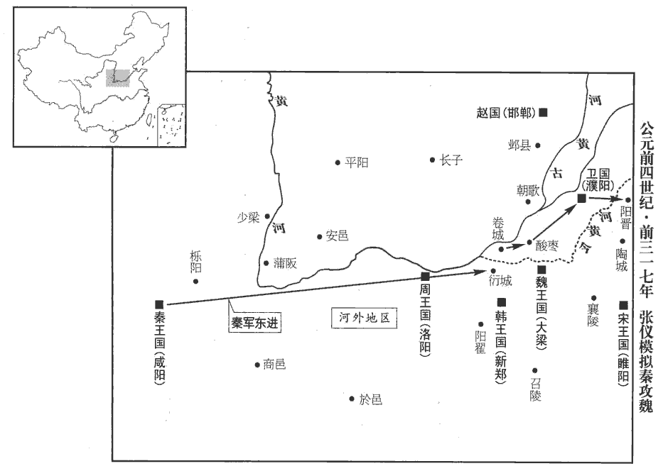
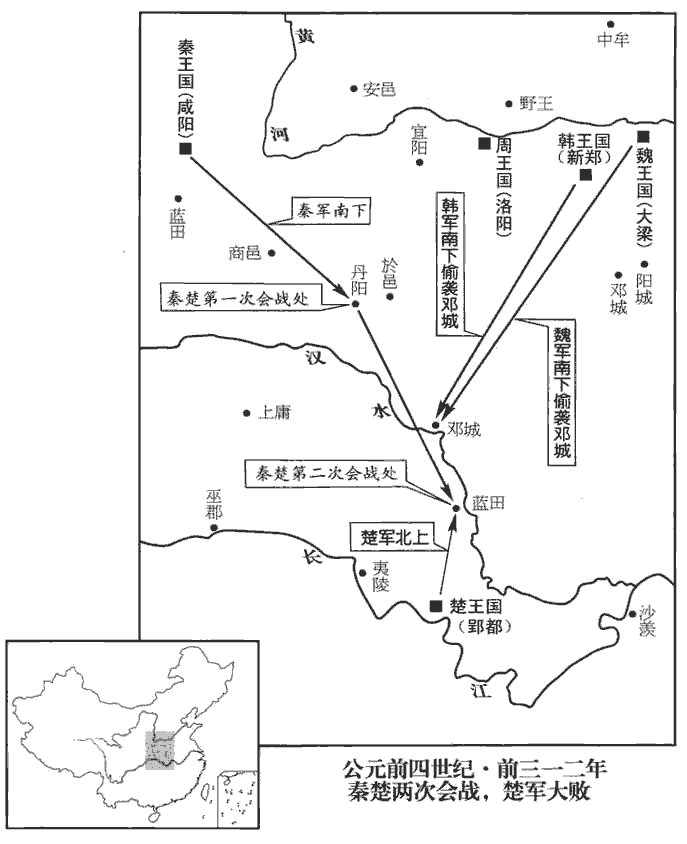
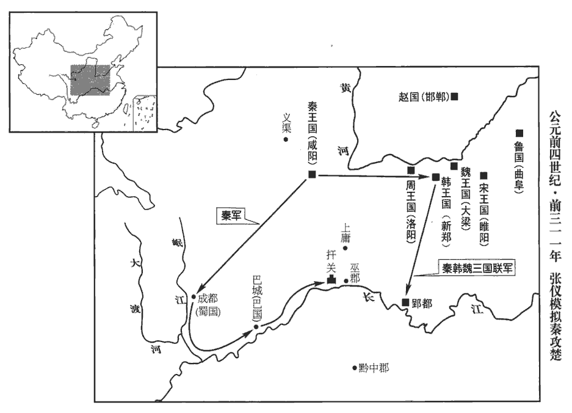
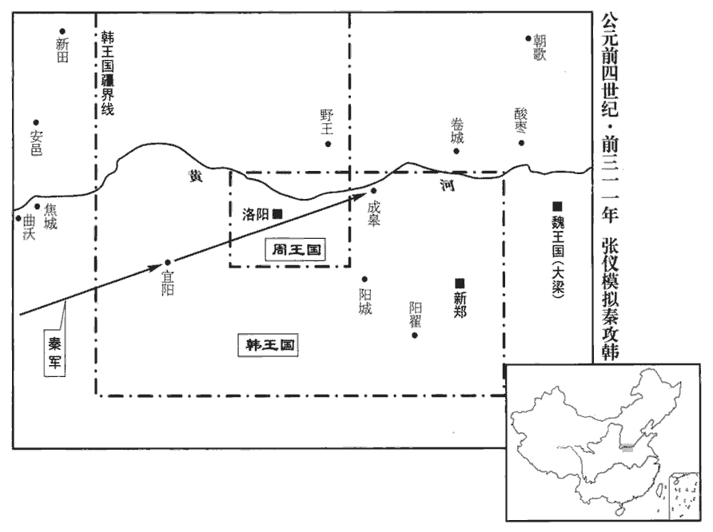
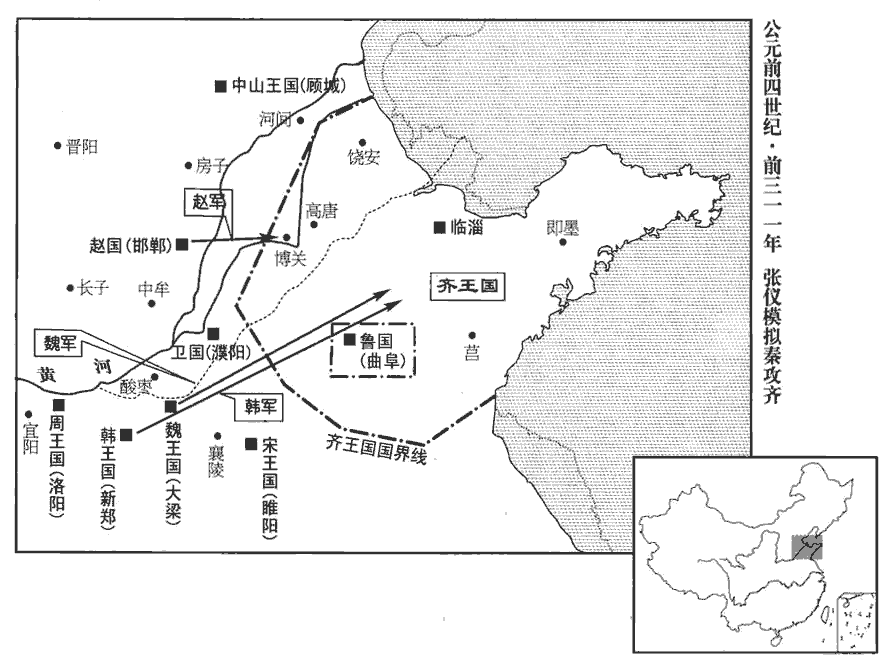
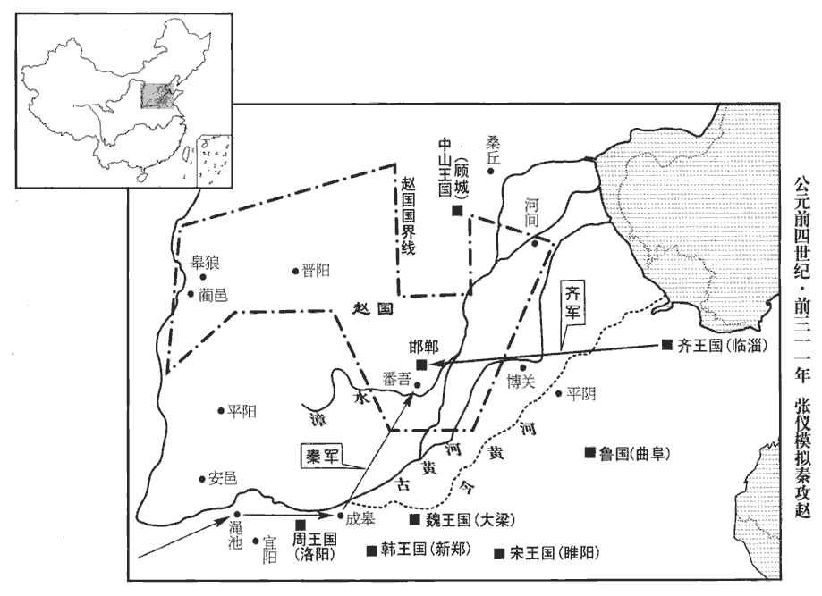
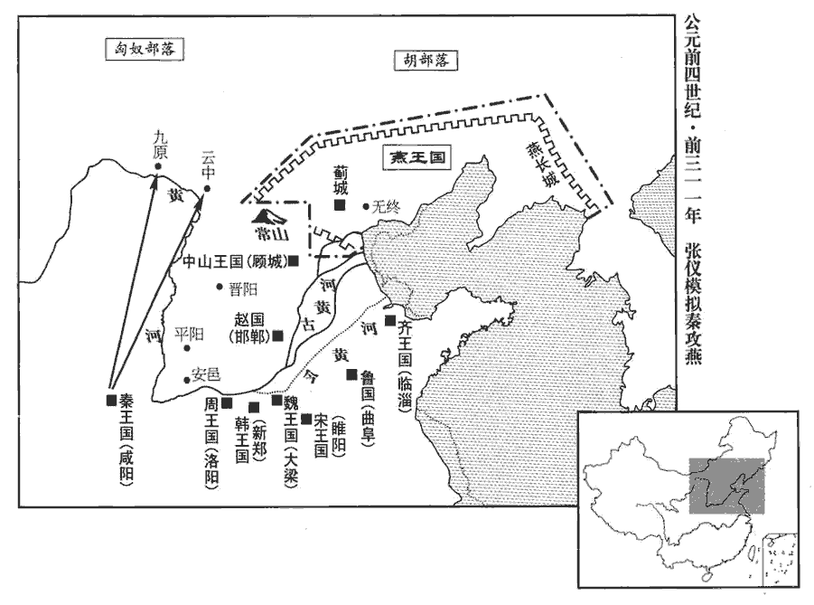
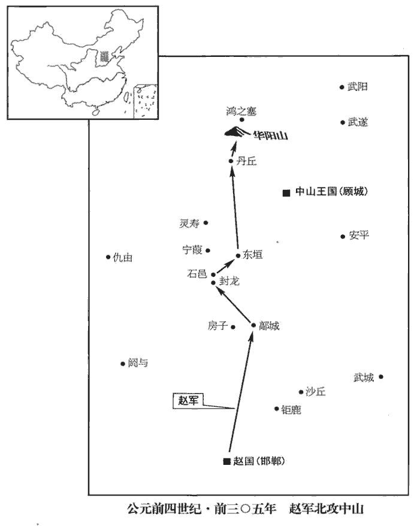

 周紀三起重光赤奮若（辛丑），盡昭陽大淵獻（癸亥），凡二十有三年。

# 慎靚王諱定，顯王之子也。此複諡也。以諡法言之，諡法：敏以敬曰慎；柔德安眾曰靖。靚，疾正翻。

## 元年（辛丑，前三二零年）

1衛‹府濮阳，河南濮阳›更貶號曰君。顯王二十三年，衛已貶號曰侯；介於秦、魏之間，國日以削弱，因更貶其號曰君。更，居孟翻。貶，悲檢翻。

〖译文〗 [1]卫国国君再次把自己的爵位由侯降到君。

## 二年（壬寅，前三一九年）

1秦伐韓，取鄢‹河南鄢陵北›。春秋「晉敗楚師于鄢陵」，既此鄢也。班志作「傿陵」，屬潁川郡。鄢，音謁晚翻，又於建翻，師古音偃。史記正義曰：許州鄢陵縣西北十五里有鄢陵故城。

〖译文〗 [1]秦国进攻韩国，夺取鄢陵。

2魏‹都大梁，河南开封›惠王薨，子襄王立。索隱曰：系本曰：襄王，名嗣。今按系本即世本，司馬貞避唐諱，改「世」為「系」。考異曰；史記魏世家云：惠王三十六年卒，子襄王立。襄王十六年卒，子哀王立。哀王二十三年卒，子昭王立。六國表：惠王元辛亥，終丙戌；襄王元丁亥，終壬寅；哀王元癸卯，終乙丑。按杜預春秋後序云：太康初，汲縣有發舊塚者，大得古書，其紀年篇起自夏、殷、周，皆三代王事，無諸國別也；惟特記晉國，起自殤叔，次文侯、昭侯，以至曲沃莊伯，皆用夏正，編年相次；晉國滅，獨記魏事，下至魏哀王之二十年：蓋魏國之史記也。哀王于史記，襄王之子，惠王之孫也。古書紀年篇，惠王三十六年改元，從一年始，至十六年而稱惠成王卒，即惠王也；疑史記誤分惠成之世以為後王年也。哀王二十三年乃卒，故特不稱諡，謂之「今王」。裴駰魏世家註引和嶠云：紀年起自黃帝，終於魏之今王；今王者，魏惠成王子。按太史公書，惠成王但言惠王，惠王子曰襄王，襄王子曰哀王。惠王三十六年卒，襄王立十六年卒，并惠、襄為五十二年。今按古文惠成王立三十六年，改元，稱一年，改元後十七年卒。太史公書為誤分惠成之世以為二王之年數也。世本，惠王生襄王而無哀王，然則「今王」者，魏襄王也。彼既魏史，所書魏事必得其真，今從之。孟子入見而出，語人曰：「望之不似人君，就之而不見所畏焉。入見，賢遍翻。語，牛倨翻。卒然問曰：『天下惡乎定？』卒，七沒翻。惡，音烏，何也。吾對曰：『定於一。』『孰能一之？』此一語，魏襄王以問孟子。對曰：『不嗜殺人者能一之。』『孰能與之？』此語亦襄王問。對曰：『天下莫不與也。王知夫苗乎？夫，音扶。七、八月之間旱，則苗槁gǎo矣。孟子此言，用周正也。周七、八月，夏五、六月也。槁，音考，乾枯也。夏，戶雅翻。幹，音干。天油然作雲，沛然下雨，則苗浡bó然興之矣。油然，雲盛貌。沛然，雨盛貌。浡然，興起貌。沛，普蓋翻。浡，音勃。其如是，孰能禦之？』」

〖译文〗 [2]魏惠王去世，其子即位为魏襄王。孟轲前去拜见他，离开后对别人说：“襄王的样子就不像一个君主，和他接触也无法产生敬畏之感。他猛然问我：‘天下怎样才能安定？’我回答说：‘统一才能安定。’他又问：‘谁能统一？’回答：‘不滥杀人的人能统一。’‘谁愿意让他统一呢？’我回答说：‘天下的百姓都愿意。大王您知道禾苗吧，七八月间遇上大旱，禾苗都干枯萎靡。这时天上乌云密布，大雨滂沱，禾苗就生机勃勃，一片葱郁。这样的势头，谁能阻挡！’”

## 三年（癸卯，前三一八年）

1楚‹都郢都，湖北江陵›、趙‹府邯郸，河北邯郸›、魏‹都大梁，河南开封›、韓‹都新郑，河南新郑›、燕‹都蓟城，北京›同伐秦‹都咸阳，陕西咸阳›，攻函谷關‹河南靈寶东北›。燕，因肩翻，註已見上。宋白曰：函谷關在弘農。地理志註云：謂道形如函，孫卿子所謂「秦有松柏之塞」是也。秦人出兵逆之，五國之師皆敗走。

〖译文〗 [1]楚国、赵国、魏国、韩国、燕国联合讨伐秦国，进攻函谷关。秦国出兵迎敌，五国联军败退而回。

2宋‹府睢阳，河南商丘›初稱王。

〖译文〗 [2]宋国国君开始称王。

## 四年（甲辰，前三一七年）

1秦敗韓師于脩魚‹河南原阳›，斬首八萬級，虜其將䱸sōu、申差于濁澤‹河南新郑西南›。敗，補邁翻。索隱曰：脩魚，地名。䱸、申差，二將名。索，山客翻。將，即亮翻。䱸，音瘦，又疏鳩翻。「濁澤」，年表作「觀澤」。括地志，觀澤在魏州頓丘縣東十八里。諸侯振恐。

〖译文〗 [1]秦国在鱼大败韩国军队，杀死八万人，于浊泽俘虏韩军大将和申差。各国震惊。

2齊大夫與蘇秦爭寵，使人刺秦，殺之。刺，七亦翻。

〖译文〗 [2]齐国大夫与苏秦争权，派人刺杀了苏秦。

3張儀說魏襄王曰：「梁地方不至千里，卒不過三十萬，地四平，無名山大川之限，卒戍楚、韓、齊、趙之境，戍，舂遇翻；字從「人」，從「戈」，人荷戈，所以戍也。梁地南接楚，西接韓，東接齊，北接趙。守亭、障者不過【章：十二行本「過」作「下」；乙十一行本同；孔本同；張校同。】十萬，說文：亭，民所安定也，道路所舍也。障，堡障也，隔也，塞也，所以隔塞敵人也。梁之地勢固戰場也。夫諸侯之約從，盟于洹水‹河南安阳北安阳河›之上，結為兄弟以相堅也。事見上卷顯王二十六年。夫，音扶。從，子容翻。洹，於元翻。今親兄弟同父母，尚有爭錢財相殺傷，而欲恃反覆蘇秦之餘謀，其不可成亦明矣？大王不事秦，秦下兵攻河外‹黃河以南›，據卷‹河南原阳西›、衍‹河南郑州北›、酸棗‹河南延津›，後漢志：卷縣屬河南郡，酸棗縣屬陳留郡。水經註：河水逕卷縣北，又東至酸棗、延津，二邑皆河津之要也。卷，逵員翻。衍，以善翻。劫衛，取陽晉‹山東鄆城東›，則趙不南，趙不南則梁不北，梁不北則從道絕，從道絕則大王之國欲毋危不可得也。從道，謂約從之路也。從，子容翻。故願大王審定計議，且賜骸骨。」人臣委身以事君，身非我之有矣，故於其乞退也，謂之乞骸骨。骸，戶皆翻。魏王乃倍從約，倍，蒲妹翻。而因儀以請成于秦。張儀歸，復相秦。儀罷秦相相魏，見上卷顯王四十七年。相，息亮翻。

〖译文〗 [3]张仪劝说魏襄王道：“魏国地方不满千里，士兵不足三十万，地势四下平坦，没有崇关大河的险要。防军分别守卫与楚、韩、齐、赵接壤的边界，用来扼守要塞的不过十万人，所以，魏国历来是厮杀的战场。各国约定联合抗秦，在洹水结盟，作为兄弟之邦互相救援。然而同一父母的亲兄弟，有时还为争夺钱财互相残杀，各国之间，想靠反复无常小人苏秦的一番伎俩，就结成同盟，明显是不足恃的。大王您不与秦国结好，秦国就会发兵进攻河外，占据卷县、酸枣等地，袭击卫国，夺取阳晋。那时，赵国不能南下，魏国也不能北上，南北隔绝，就谈不上联合抗秦，大王您的国家想避免危险也不可能了。所以我希望大王您能深思熟虑，拿定主意，让我辞去魏国相位，回秦国去筹划修好。”魏王于是背弃了联合抗秦的盟约，派张仪前往秦国去求和。张仪回到秦国，再次出任国相。

 

4魯‹府曲阜，山东曲阜›景公薨，子平公旅立。諡法：由義而濟曰景；布義行剛曰景。

〖译文〗 [4]鲁国鲁景公去世，其子姬旅即位为鲁平公。

## 五年（乙巳，前三一六年）

1巴‹府巴城，四川重慶›、蜀‹府成都，四川成都›相攻擊，巴，春秋巴子之國。蜀，蠶叢、魚鳧之後。華陽國志曰：昔蜀王封其弟于漢中，號曰苴jū侯，因命其邑曰葭萌。苴侯與巴王為好。後巴與蜀為讎，蜀王怒，伐苴侯，苴侯奔巴。巴求救于秦，秦伐蜀，蜀王敗死。秦滅蜀，因遂滅巴、苴，置巴、蜀二郡。史記正義曰：巴子城在合州石鏡縣南五里，故墊江縣也。宋白曰：巴子後理閬中。揚雄蜀本紀曰：蜀王本治廣都樊鄉，徙居成都。華，戶化翻。苴，子餘翻。葭，音家。萌，謨耕翻。墊，音疊。閬，音浪。俱告急于秦‹都咸阳，陕西咸阳›。秦惠王欲伐蜀，以為道險陿難至，陿與狹同。漢書趙充國傳註：山陗而夾水曰陿。而韓又來侵，猶豫未能決。說文：猶，玃屬，居山中；聞人聲，豫登木，無人乃下。世謂不決曰猶豫。一說，隴西謂犬子為猶，犬導人行，忽先忽後，故曰猶豫。又一說，猶豫，犬也，犬為人行，好先行，卻住以俟其人，百步之間，如是者數四；先者，豫也，遂曰猶豫。猶，夷周翻，又餘救翻。玃，厥縛翻。為，於偽翻。好，呼到翻。司馬錯請伐蜀。史記：重、黎之後，至周宣王時為程伯休父，為司馬氏。錯，七各翻，又七故翻。重，直龍翻。父，音甫。張儀曰：「不如伐韓。」王曰：「請聞其說。」儀曰：「親魏，善楚，下兵三川‹伊水、洛水、黃河交匯處，即大洛陽地區›，攻新城‹河南伊川›、宜陽‹河南宜陽西›，伊水、洛水、河水為三川。秦後置三川郡，漢改為河南郡。班志，新城縣屬河南郡。括地志：洛州伊闕縣本漢新城縣，在州南七十里。隋文帝改新城為伊闕，取伊闕山為名。以臨二周之郊，周分為東、西，故曰二周。據九鼎，昔夏禹貢金九牧，鑄鼎象物，桀有昏德，鼎遷于商；商紂暴虐，鼎遷于周；成王定鼎於郟jiá鄏rǔ‹洛陽›，寶之，以為三代共器。夏，戶雅翻。郟，音夾。鄏，音辱。按圖籍，圖籍，謂天下之圖籍，周官職方氏所掌是也。挾天子以令于天下，天下莫敢不聽，此王業也。臣聞爭名者於朝，爭利者於市。今三川、周室，天下之朝市也，朝，直遙翻。周禮大宗伯註云：朝，猶朝也，欲其來之早也。人君昕旦親政貴早，聲轉為朝。猶朝，陟遙翻。而王不爭焉，顧爭于戎翟，去王業遠矣。」翟，與狄同。司馬錯曰：「不然。臣聞欲富國者務廣其地，欲強兵者務富其民，欲王者務博其德，欲王，於況翻，又如字。三資者備而王隨之矣。今王地小民貧，故臣願先從事于易。易，弋豉翻。夫蜀，西僻之國而戎翟之長也，夫，音扶。長，知丈翻。有桀、紂之亂；以秦攻之，譬如使豺狼逐群羊；豺，徂齋翻。得其地足以廣國，取其財足以富民，繕兵不傷眾而彼已服焉。彼，謂蜀也。拔一國而天下不以為暴，利盡四【章：十二行本「四」作「西」；乙十一行本同。】海而天下不以為貪，是我一舉而名實附也，而又有禁暴止亂之名。今攻韓，劫天子，惡名也，而未必利也；又有不義之名，而攻天下所不欲，危矣。臣請論其故：周，天下之宗室也。周室為天下所宗，故謂之宗室。齊，韓之與國也。鄰國相親睦者，謂之與國。周自知失九鼎，韓自知亡三川，將二國并力合謀，以因乎齊、趙而求解乎楚、魏，并，必正翻。求解者，先與之構怨隙而今求和解也。以鼎與楚，以地與魏，王弗能止也。此臣之所謂危也。不如伐蜀完。」完，全也。言以兵伐蜀，十全必取也。王從錯計，錯，七各翻，又七故翻。起兵伐蜀；十月取之。取，言易也。易，弋豉翻。貶蜀王，更號為侯；貶，悲檢翻。更，工衡翻。而使陳莊相蜀。相，息亮翻。蜀既屬秦，秦以益強，富厚，輕諸侯。

〖译文〗 [1]巴国、蜀国互相攻击，都来向秦国告急求救，秦惠王想出兵讨伐蜀国，但顾虑道路险峻难行，韩国又可能来侵犯，所以犹豫不决。司马错建议他仍旧出兵伐蜀，张仪却说：“不如去征讨韩国。”秦惠王说：“请谈谈你的见解。”张仪便陈述道：“我们应该与魏国、楚国亲善友好，然后出兵黄河、伊水、洛水一带，攻取新城、宜阳，兵临东西周王都，控制象征王权的九鼎和天下版图，挟持天子以号令天下，各国就不敢不从，这是称王的大业。我听人说，要博取名声应该去朝廷，要赚取金钱应该去集市。现在的黄河、伊洛一带和周朝王室，正好比天下的朝廷和集市，而大王您不去那里争雄，反倒纠缠于远方的戎狄小族争斗，这可不是帝王的大业啊！”司马错反驳张仪说：“不对。我也听说有这样的话：想要使国家富强必须先开拓疆土，想要使军队强大必须先让老百姓富庶，想要成就帝王大业必须先树立德望。这三个条件具备，帝王大业也就水到渠成。现在大王的国家地小民贫，所以我建议先从容易之事做起。蜀国，是西南偏僻之国，又是戎狄之族的首领，政治昏乱，如同夏桀、商纣；以秦国大兵攻蜀，就像狼入羊群一样。攻占它的土地可以扩大秦国疆域，夺取它的财富可以赡养百姓，而军队不须有大的伤亡就可以使蜀国屈服。这样，吞并一个国家而天下并不认为秦国强暴，获取广泛的利益天下也不认为秦国贪婪，我们一举两得、名利双收，更享有除暴安良的美誉。秦国若是攻打韩国、劫持周天子，就会臭名远扬，也不见得有什么实际利益。蒙受不义之名，攻打天下人所不愿攻占的地方，那可是很危险的！请让我细说其中的原因：周朝，是天下尊崇的王室；齐国，是韩国的亲睦友邦。周朝自知要失去九鼎，韩国自知要失去伊洛一带领土，两国将会齐心合力，共同谋划，求得齐国、赵国的援助，并与有旧怨的楚国、魏国和解，甚至不惜把鼎送给楚国，把土地割让给魏国，对此，大王您只能束手无策。这就是我所说的危险所在。所以，攻打蜀国才是十拿九稳的上策。”秦惠王听从了司马错的建议，起兵伐蜀，仅用了十个月就攻克全境，把蜀王降为侯，又任命陈庄为蜀国国相。蜀国为秦国吞并以后，秦国更加富庶和强盛而轻视周围各国。

2蘇秦既死，三年，蘇秦死于齊。秦弟代、厲亦以遊說顯于諸侯。說，式芮翻。燕‹都蓟城，北京›相子之與蘇代婚，欲得燕權。蘇代使于齊而還，燕，因肩翻。相，息亮翻。使，疏吏翻。還，從宣翻。燕王噲問曰：「齊王其霸乎？」噲，苦夬guài翻。對曰：「不能。」王曰：「何故？」對曰：「不信其臣。」於是燕王專任子之。鹿毛壽謂燕王曰：劉伯莊曰：鹿毛壽，人姓名；又曰潘壽。春秋後語作「唐毛壽」。徐廣曰：一作「厝cuò毛」。如徐廣一作之說，當作「厝」。厝，音秦昔翻。清河有厝縣。「人之謂堯賢者，以其能讓天下也。今王以國讓子之，是王與堯同名也。」燕王因屬國於子之，屬，之欲翻，付也，托也。子之大重。或曰：「禹薦益而以啟人為吏，孟子曰：禹薦益于天，禹崩，天下之人不之益而之啟，曰：「吾君之子也。」索隱曰：人，猶臣也。謂以啟臣為益吏。索，山客翻。及老而以啟為不足任天下，任，音壬。傳之於益。啟與交黨攻益，奪之，天下謂禹名傳天下於益，而實令啟自取之。按或曰一段事，與師春紀伊尹放太甲，潛出自桐，殺伊尹，事頗相類，古書雜記固多也。今王言屬國於子之而吏無非太子人者，是名屬子之而實太子用事也。」王因收印綬，自三百石吏已上而效之子之。後漢書輿服志曰：三王俗化雕文，詐偽漸生，始有印綬，以檢奸萌。周禮掌節有璽節，鄭氏註云：今之印章也。綬，組綬。古者佩玉以綬貫之。漢承秦制，乘輿璽綬；諸王以下，印以金、銀、銅為差，綬以赤、紫、青、黑、黃為差。印，信也，刻文合信也。綬，受也，轉相授受也。三百石吏，銅印，黑綬或黃綬。王制：諸侯大國之卿，食祿以田計之，為三十二夫之入。戰國之卿，食祿萬鐘，其僭jiàn差不度甚矣。漢制：三公秩萬石，至於斗食佐吏，凡十六等。三百石吏，第十等，奉月四十斛。綬，音受。璽，斯氏翻。組，祖五翻。乘，繩證翻。奉，與俸同，音扶用翻。子之南面行王事，而噲老，不聽政，顧為臣，顧，反也。噲，苦夬翻。國事皆決於子之。為後燕亂張本。

〖译文〗 [2]苏秦死后，他的弟弟苏代、苏厉也以游说著称于各国。燕国相子之便崐与苏代结为通姻亲家，想谋得燕国大权。苏代出使齐国归来，燕王姬哙问他：“齐王能称霸吗？”苏代回答：“不能。”燕王又问：“为什么？”回答说：“他不信任臣僚。”于是燕王把大权交给子之。鹿毛寿也对燕王说：“人们称道尧是贤明君主，就是因为他能让出天下。现在燕王您要是把国家让给子之，就能与尧有同样的名声。”燕王于是把国家嘱托给了子之。子之从此大权集于一身。还有人对燕王说：“上古时禹推荐益为接班人，又任命儿子启的属下作益的官吏。到老时，禹说启不能胜任治理天下的重责，把君位传给益。然而启勾结自己的党羽攻击益，很快夺取了君位。因此天下人都说禹明着是传天下给益，而实际上是安排儿子启去自己夺位。现在燕王您虽然说了把国家交给子之，但官员都是太子的人，这同样是名义属于子之而实权在太子手里啊！”燕王便下令收缴所有官印，把三百石俸禄以上的官职都交给子之任命。从此，子之面南称王，姬哙年老，不再听理政事，反而成了臣子，国家大事都由子之来决断。

## 六年（丙午，前三一五年）

1王崩，子赧王延立。

〖译文〗 [1]周慎靓王去世，其子姬延即位为周赧王。

# 赧王上劉伯莊曰：赧，慚之甚也。輕微危弱，寄住東、西，足為慚赧，故號之曰赧；諡法本無赧字也。赧，音奴版翻。

## 元年（丁未，前三一四年）

1秦人侵義渠‹甘肅西峰›，得二十五城。義渠，戎國名。按上卷顯王四十二年，秦縣義渠，以其君為臣，是已得義渠矣。今又侵得二十五城，何也？蓋先此秦以義渠為縣，君為臣，雖臣屬於秦，義渠之國未滅也，秦稍蠶食侵其地。今得二十五城，義渠之國所餘無幾矣。蓋秦兼併諸侯，不盡其國不止也。左傳：有鐘鼓曰伐，無曰侵。穀梁傳：苞人民、驅牛馬曰侵。斬樹木、壞宮室曰伐。無幾，居豈翻。傳，直戀翻。壞，音怪。

〖译文〗 [1]秦国入侵义渠，夺取二十五个城镇。

2魏人叛秦，秦人伐魏，取曲沃‹河南三门峡西南›而歸其人。又敗韓於岸門‹山西河津南›，續漢志，潁川郡潁陰縣有岸亭。註引徐廣云；岸亭，即岸門。括地志：岸門在今許州長社縣東北二十八里，今名長武亭。敗，補邁翻。韓太子倉入質于秦以和。質，音致。

〖译文〗 [2]魏国反叛秦国，于是秦国讨伐魏国，攻占曲沃城，却将城中百姓驱归魏国。又在岸门打败韩国，韩国将太子韩仓送到秦国作为人质，以求和好。

3燕子之為王三年，國內大亂。將軍市被與太子平謀攻子之。齊王令人謂太子曰：令，盧經翻。「寡人聞太子將飭君臣之義，明父子之位，寡人之國【章：十二行本「國」下有「雖小」二字；乙十一行本同；孔本同；退齋校同。】唯太子所以令之。」飭，整也，修也，治也。治，直之翻。飭君臣之義，言太子平將治子之僭王之罪也。明父子之位，言太子平當繼其父噲之位也。令，力政翻，命令也，號令也。太子因要党聚眾，要，一遙翻，要結也。使市被攻子之，不克。市被反攻太子。搆難數月，難，乃旦翻。死者數萬人，百姓恫恐。恫，它紅翻，痛也。齊王令章子將五都之兵，因北地之眾以伐燕。將，即亮翻，又音如字，領也。邑有先王之廟曰都。或曰：都，邑之大者。北地，齊之北境也，蓋漢千乘、清河、勃海之地。燕，因肩翻；下同。乘，繩證翻。燕士卒不戰，城門不閉。齊人取子之，醢之，醢，呼改翻，肉醬也。遂殺燕王噲。噲，苦夬翻。

〖译文〗 [3]燕国子之作国王三年，国内大乱，将军市被与太子姬平合谋攻打子之。齐王派人对燕太子说：“我听说您将要整饬君臣大义，申明父子名位，我的国家愿意支持您的号召，做坚强后盾。”燕太子于是聚集死党，派将军市被进攻子之，却没有得手，市被反倒戈攻打太子。国内动乱几个月，死亡达几万人，人心惶惶。此时，齐王命章子为大将，率领国都周围五城的军队及北方的部队征伐燕国。燕国士兵毫无战意，城门大开不守。齐国便捕获了子之，把他剁成肉酱。燕王姬哙也同时被杀。

齊王問孟子曰：「或謂寡人勿取燕，或謂寡人取之。以萬乘之國伐萬乘之國，古者天子之地方千里，出兵車萬乘。七國兼併以強大，于時皆為萬乘之國。乘，繩證翻。五旬而舉之，十日為旬，五旬，五十日。人力不至於此；不取，必有天殃。殃，咎也，禍也。取之何如？」孟子對曰：「取之而燕民悅則取之，古之人有行之者，武王是也。取之而燕民不悅則勿取，古之人有行之者，文王是也。以萬乘之國伐萬乘之國，簞食壺漿以迎王師，簞，竹器也；圓曰簞，方曰笥。簞，音丹。食，祥吏翻，熟食也。漿，水也，酢cù漿也。笥，相吏翻。酢，倉故翻。豈有他哉？避水火也。如水益深，如火益熱，亦運而已矣！」運，轉也。言燕之民將轉而之他國也。

〖译文〗 齐王请教孟轲：“有人建议我不要攻占燕国，有人却建议我乘机吞并它。我想，以万乘兵车的大国去进攻另一个同样的大国，五十天就征服，这靠人的力量是作不到的，只能是天意。现在我若不吞并燕国，上天一定会降祸怪罪。我把燕国并入齐国，怎么样？”孟轲回答说：“吞并后如果燕国人民很高兴，那就吞并吧，古代有这样做的，比如周武王。吞并而使燕国人民气愤，就不要吞并，古代也有这样行事的，比如周文王。齐国以万乘兵车大国征讨另一个大国，那里的百姓都捧着食品、茶水来迎接齐军，没有别的原因，就是为了跳出水深火热的战祸啊！如果新统治下水更深，火更热，百姓又将转而投奔别的国家了。”

諸侯將謀救燕，齊王謂孟子曰：「諸侯多謀伐寡人者，何以待之？」對曰：「臣聞七十里為政於天下者，湯是也；未聞以千里畏人者也。書曰：『徯我后，后來其蘇。』書仲虺之誥之辭。徯，戶禮翻，待也。后，君也。今燕虐其民，王往而征之，民以為將拯己於水火之中也，拯，上舉也，援也，救也，助也，音之淩翻。簞食壺漿以迎王師。若殺其父兄，系累其子弟，趙岐曰：系累，縛結也。系，戶計翻。累，力追翻。毀其宗廟，遷其重器。重器，國之寶鎮。如之何其可也！天下固畏齊之強也，今又倍地齊并燕則地倍其舊。燕，因肩翻。而不行仁政，是動天下之兵也。王速出令。反其旄倪，令，力政翻。趙岐曰：旄，老旄；倪，弱小。陸德明曰：倪，謂翳倪小兒也。記曲禮曰：八十、九十曰耄，註云：耄，惛忘也。旄，讀曰耄。倪，五兮翻。翳，與繄同，音煙兮翻。止其重器，謀于燕眾，置君而後去之，則猶可及止也。」齊王不聽。

〖译文〗 各国策划援救燕国。齐王又对孟轲问道：“各国都谋划来讨伐我，怎么办？”回答说：“我听说过只占有七十里而能统一号令天下的例子，就是商王汤。没听说过拥有千里之广的国家而总是畏惧别人的。《尚书》说：“盼望我们的君主，他来了我们就可以获得解救。’现在燕国虐待它的百姓，大王前往征服它，燕国人民认为是从水深火热中拯救了他们，都箪食壶浆前来迎接仁义之师。您如果杀了他们的父兄，囚捕他们的子弟，毁坏他们的祖庙，掠夺他们的国宝，那可就不行了。天下本来就畏惧齐国的强大，现在齐国土地又增加了一倍，如果不施行仁政，那么就会招致天下的讨伐。大王您应该立即下令，释放被捕的老幼百姓，停止掠夺燕国的财宝，与燕国民众商议，推举新的国君，然后离开燕国，这样做还来得及。”齐王却没有采纳孟轲的劝告。

已而燕人叛。是時燕人雖未立太子平，固已相帥叛齊矣。王曰：「吾甚慚於孟子。」陳賈曰：「王無患焉。」乃見孟子，曰：「周公何人也？」曰：「古聖人也。」陳賈曰：「周公使管叔監商，古殷、商通稱，商者，以始封為國號，殷者，以都亳為國號。按孟子，陳賈只云「監殷」，今通鑑云「監商」，避宋廟諱也。監，古銜翻。管叔以商畔也。周公知其將畔而使之與？」畔，與叛同。與，讀曰歟，下同。曰：「不知也。」陳賈曰：「然則聖人亦有過與？」曰：「周公，弟也，管叔，兄也，周公之過不亦宜乎！且古之君子，過則改之；今之君子，過則順之。古之君子，其過也如日月之食，民皆見之；及其更也，更，工衡翻，更改。民皆仰之。今之君子，豈徒順之，又從為之辭！」

〖译文〗 不久，燕国人果然纷纷反叛齐国，齐王叹息道：“我真惭愧没听孟轲的话。”陈贾说：“大王不用担心。”于是他前去见孟轲，问：“周公是什么样的人？”回答说：“是古代的圣人。”陈贾又说：“周公派管叔监视商朝旧地，管叔却在商地反叛。难道周公预先知道管叔会反叛而仍派他去吗？”回答：“周公预先不知道。”陈贾便说：“如此说来圣人也会犯错误吗？”孟轲说：“周公，是弟弟，管叔，是哥哥，周公的错误是可以理解的。况且古代的君子，有了错误就改；现在的所谓君子，有了错误听之任之。古代的君子，他的过失像日食月食，人民都看得到；待到他改正，人民便更加景仰他。现在的君子，不但听任错误不改，反而寻找托辞。”

4是歲，齊宣王薨，子湣王地立。湣，讀曰閔。

〖译文〗 [4]同年，齐国齐宣王去世，其子田地即位为齐王。

## 二年（戊申，前三一三年）

1秦右更疾伐趙，右更，秦爵第十四。師古曰：左、右、中更，皆主領更卒而部其役使也。更，工衡翻。拔藺‹山西離石縣西›，虜其將莊豹。莊姓有出於宋者，左傳所謂戴、武、莊之族是也；有出於楚者，楚莊王之後，莊蹻是也。齊之莊暴，楚之莊辛，蒙之莊周，與此莊豹，其時適相先後，莫能審其所自出。

〖译文〗 [1]秦国派名叫疾的右更官员，率军讨伐赵国。攻占蔺地，俘虏赵将庄豹。

2秦王欲伐齊，患齊、楚之從親，從，子容翻。乃使張儀至楚，說楚王曰：「大王誠能聽臣，閉關絕約于齊，說，式芮翻。閉關者，古之列國各置關尹，敵國賓至，關尹以告，則行理以節逆之。閉關則距絕其使，不為通也。使，疏吏翻。臣請獻商‹陕西丹凤›、於‹河南西峡›之地六百里，使秦女得為大王箕帚之妾，於，如字。箕帚之妾，猶言備灑掃也。帚，止酉翻，篲也。秦、楚嫁女娶婦，長為兄弟之國。」楚王說而許之。說，讀曰悅。群臣皆賀，陳軫獨吊。陳姓出於舜，周武王封舜後於陳，子孫以國為氏。王怒曰：「寡人不興師而得六百里地，何吊也？」對曰：「不然。以臣觀之，商於之地不可得而齊、秦合，齊、秦合則患必至矣。」王曰：「有說乎？」對曰：「夫秦之所以重楚者，以其有齊也。夫，音扶，發語辭。今閉關絕約于齊則楚孤，秦奚貪夫孤國而與之商於之地六百里！張儀至秦，必負王。是王北絕齊交，西生患于秦也，楚東北接齊，西接秦。兩國之兵必俱至。為王計者，不若陰合而陽絕于齊，使人隨張儀，苟與吾地，絕齊未晚也。」王曰：「願陳子閉口，毋復言，以待寡人得地！」毋，音無，毋者，禁止之辭。復，扶又翻，再又也。乃以相印授張儀，相，息亮翻。厚賜之。遂閉關絕約于齊，使一將軍隨張儀至秦。班固百官表：將軍，周末官，秦、漢因之。

〖译文〗 [2]秦王想征伐齐国，又顾虑齐国与楚国有互助条约，便派张仪前往楚国。张仪对楚王说：“大王如果能听从我的建议，与齐国废除盟约，断绝邦交，我可以向楚国献上商於地方的六百里土地，让秦国的美女 来做侍奉您的妾婢。秦、楚两国互通婚嫁，就能永远结为兄弟之邦。”楚王十分高兴，允诺张仪的建议。群臣都前来祝贺，只有陈轸表示哀痛。楚王恼怒地问：“我一兵未发而得到六百里土地，有什么不好？”陈轸回答：“您的想法不对。以我之见，商於的土地不会到手，齐国、秦国却会联合起来，齐、秦一联合，楚国即将祸事临门了。”楚王问：“你有什么解释呢？”陈轸回答：“秦国之所以重视楚国，就是因为我们有齐国作盟友。现在我们如果与齐国毁约断交，楚国便孤立了，秦国又怎么会偏爱一个孤立无援的国家而白送商於六百里地呢！张仪回到秦国以后，一定会背弃对大王您的许诺。那时大王北与齐国断交，西与秦国生崐出怨仇，两国必定联合发兵夹攻。为您算计，不如我们暗中与齐国仍旧修好而只表面上绝交，派人随张仪回去，如果真的割让给我们土地，再与齐国绝交也不晚。”楚王斥责道：“请你陈先生闭上嘴巴，不要再说废话了，等着看我去接收大片土地吧！”于是把国相大印授给张仪，又重重赏赐他。随后下令与齐国毁约断交，派一名将军同张仪前往秦国。

張儀詳墮車，詳，讀曰佯，詐也。【章：乙十一行本正作「佯」。】不朝三月。朝，直遙翻。楚王聞之，曰：「儀以寡人絕齊未甚邪？」邪，余遮翻。邪，疑辭也。乃使勇士宋遺借宋之符，北罵齊王。既閉關絕約，則齊、楚之信使不通，故使宋遺借宋符以至齊。宋，姓也。周武王封微子于宋，子孫以國為氏。齊王大怒，折節以事秦，折，而設翻。齊、秦之交合。儀歸而詐疾，待齊、秦之交合乃朝。張儀乃朝，見楚使者曰：「子何不受地？從某至某，廣袤六里。」朝，直遙翻。使，疏吏翻。東西曰廣，南北曰袤。廣，古曠翻，又讀如字。袤，音茂。使者怒，還報楚王。還，從宣翻，又音如字。楚王大怒，欲發兵而攻秦。陳軫曰：「軫可發口言乎？攻之不如因賂之以一名都，與之并力【章：十二行本「力」作「兵」；乙十一行本同；孔本同。】而攻齊，是我亡地于秦，取償于齊也。償，辰羊翻，報也。今王已絕于齊而責欺于秦，是吾合齊、秦之交而來天下之兵也，國必大傷矣！」楚王不聽，使屈匄gài帥師伐秦。屈，姓也，音九勿翻，匄，居大翻。帥，讀曰率。秦亦發兵使庶長章擊之。長，知丈翻。按史記樗chū里子傳，庶長章，姓魏。

〖译文〗 张仪回国后，假装从车上跌下，三个月不上朝。楚王听说后自语道：“张仪是不是觉得我与齐国断交做得还不够？”便派勇士宋遗借了宋国的符节，北上到齐国去辱骂齐王。齐王大怒，立即降低身份去讨好秦国，齐国、秦国于是和好。这时张仪才上朝，见到楚国使者，故作惊讶地问：“你为何还不去接受割地？从某处到某处，有六里多见方。”使者愤怒地回国报告楚王，楚王勃然大怒，想发兵攻打秦国。陈轸说：“我可以开口说话吗？攻秦国还不如用一座大城的代价去收买它，与秦国合力攻齐国。这样我们从秦国失了地，还可以在齐国得到补偿。现在大王您已经与齐国断交，又去质问秦国的欺骗行为，是我们促使齐国、秦国和好而招来天下的军队了，国家一定会有大损失！”楚王仍是不听他的劝告，派屈率军队征讨秦国，秦国也任命魏章为庶长之职，起兵迎击。

## 三年（己酉，前三一二年）

1春，秦師及楚戰于丹陽‹河南淅川縣境，丹水北岸一帶›，索隱曰：此丹陽在漢中。劉昭曰：南郡枝江縣有丹陽聚，即秦破楚處。李𡌴輿地紀勝曰：丹陽在今歸州秭歸縣東八里屈沱楚王城是也。余按楚遣屈匄伐秦，秦發兵逆擊之，枝江之丹陽則距郢逼近，秭歸之丹陽則不當秦、楚之路。索隱因下文遂取漢中，即謂丹陽在漢中，皆非也。此丹陽謂丹水之陽。班志：丹水出上洛塚嶺山，東至析入鈞水，其水蓋在弘農丹水、析兩縣之間，武關之外也。秦、楚交戰當在此水之陽。楚師既敗，秦師乘勝取上庸路西入以收漢中，其勢易矣。索，山客翻。𡌴與埴同。屈，九勿翻。塚，知隴翻。易，弋豉翻。楚師大敗，斬甲士八萬，虜屈匄及列侯、執珪七十餘人，執珪，楚爵也，執珪而朝者也。遂取漢中郡‹汉水中上游›。自沔陽、成固至新城、上庸，時皆漢中郡之地。釋名曰：郡，群也，人所群聚也。黃義仲十三州記曰：郡之言君也。改公侯之封而言君者，至尊也。今郡字，「君」在其左，「邑」在其右，君為元首，邑以載民，故取名於君，謂之郡。楚王悉發國內兵以復襲秦，復，扶又翻。戰于藍田‹湖北钟祥›，班志，藍田縣屬京兆，秦孝公置。史記正義曰：藍田縣在雍州東南八十里。從藍田關入藍田縣，時楚襲秦深入。楚師大敗。韓、魏聞楚之困，南襲楚，至鄧‹湖北襄樊›。鄧，春秋鄧國之地。班志，鄧縣屬南陽郡。杜預曰：潁川召陵縣西有鄧城。括地志曰：故鄧城在豫州郾yǎn陵縣東三十五里，所謂在古召陵西十里者也。召，讀曰邵。楚人聞之，乃引兵歸，割兩城以請平于秦。

〖译文〗 [1]春季，秦、楚两国军队在丹阳大战，楚军大败，八万甲士被杀，屈及以下的列侯、执圭等七十多名官员被俘。秦军乘势夺取了汉中郡。楚王又征发国内全部兵力再次袭击秦国，在蓝田决战，楚军再次大败。韩、魏等国见楚国危困，也向南袭击楚国，直达邓。楚国听说了，只好率军回救，割让两座城向秦国求和。

 

2燕人共立太子平，是為昭王。燕，因肩翻。昭王于破燕之後【章：十二行本「後」下有「卽位」二字；乙十一行本同；孔本同；張校同。】言燕國為齊所破，己承其後也。吊死問孤，與百姓同甘苦，卑身厚幣以招賢者。謂郭隗wěi曰：「齊因孤之國亂而襲破燕，孤極知燕小力少，臧文仲曰：列國有凶稱孤，禮也。杜預曰：列國諸侯無凶則稱寡人。郭姓出於周之虢公，世亦謂虢公為郭公。隗，五罪翻。少，始紹翻。不足以報；然誠得賢士與共國，以雪先王之恥，謂燕王噲破國之恥。噲，苦夬翻。孤之願也。先生視可者，得身事之！」郭隗曰：「古之人君有以千金使涓人求千里馬者，春秋以來，諸侯之國有涓人，秦、漢之間有中涓。師古曰：涓，潔也。言其在中主知潔清灑掃之事，蓋王之親舊左右也。應劭曰：涓人如謁者。涓，古玄翻。灑，所賣翻；掃，所報翻；又皆音如字。馬已死，買其首五百金而返。君大怒，涓人曰：『死馬且買之，況生者乎！馬今至矣。』不期年，千里之馬至者三。期，讀曰朞。今王必欲致士，先從隗始，況賢於隗者，豈遠千里哉！」言燕王若加禮于郭隗，則四方之賢士聞之，將不以千里為遠而來。於是昭王為隗改築宮而師事之。於是士爭趣燕：為，於偽翻。趣，七喻翻。樂毅自魏往，劇辛自趙往。劇，竭戟翻。劇，姓；辛，名。劇姓莫知其所自出。班志，北海郡有劇縣，蓋其先以縣為姓也。昭王以樂毅為亞卿，任以國政。為燕用樂毅破齊張本。

〖译文〗 [2]燕国贵族共同推举太子姬平为燕昭王。昭王是在燕国被齐国攻破后即位的，他凭吊死者，探访贫孤，与百姓同甘共苦。自己纡尊降贵，用重金来招募人才。他问郭隗：“齐国乘我们的内乱而攻破燕国，我深知燕国国小力少，不足以报仇。然而招揽贤士与他们共商国是，以雪先王的耻辱，始终是我的愿望。先生您如果见到合适人才，我一定亲自服侍他。”郭隗说：“古时候有个君主派一个负责洒扫的涓人用千金去购求千里马，那个人找到一匹已死的千里马，用五百金买下马头带回。君主大怒，涓人解释说：‘死马您还买，何况活的呢！天下人知道了，好马就会送上来的。’不到一年，果然得到了三匹千里马。现在大王您打算招致人才，就请先从我郭隗开始，比我贤良的人，都会不远千里前来的。”于是燕昭王为郭隗翻建府第，尊他为老师。各地的贤士果然争相来到燕国：乐毅从魏国来，剧辛从赵国来。昭王奉乐毅为亚卿高位，委托以国家大事。

3韓宣惠王薨，子襄王倉立。

〖译文〗 [3]韩国韩宣惠王去世，其子韩仓即位为韩襄王。

## 四年（庚戌，前三一一年）

1蜀‹四川成都›相殺蜀侯。相，息亮翻。蜀相，蓋陳莊也。

〖译文〗 [1]蜀国国相杀死封侯的国君。

2秦惠王使人告楚懷王，請以武關‹陝西丹鳳縣東南›之外易黔中‹府湖南沅陵，湖南西部及貴州北部›地。武關，左傳之少習，地在漢弘農郡析縣西百七十里，道通南陽。晉太康地志曰：武關當冠軍西。括地志曰：武關在商州上洛縣東。武關之外，蓋秦丹、析、商於之地。黔，音琴。少，始照翻。冠，工玩翻。於，音如字。楚王曰：「不願易地，願得張儀而獻黔中地。」張儀聞之，請行。王曰：「楚將甘心於子，楚王以墮張儀之詐，故欲甘心焉。柰何行？」張儀曰：「秦強楚弱，大王在，楚不宜敢取臣。且臣善其嬖臣靳jìn尚，嬖，匹計翻，又卑義翻。靳，居焮翻，姓也。靳尚得事幸姬鄭袖，鄭，以國為氏。「袖」，戰國策作「褏」，古字也。袖之言，王無不聽者。」遂往。楚王囚，將殺之。靳尚謂鄭袖曰：「秦王甚愛張儀，將以上庸‹湖北竹山›六縣及美女贖之。上庸，春秋庸國。班志，上庸縣屬漢中郡。史記正義：上庸縣，今房州。宋白曰：今房州竹山縣古城，即漢上庸縣。王重地尊秦，秦女必貴而夫人斥矣。」於是鄭袖日夜泣于楚王曰：「臣各為其主耳。為，于偽翻。今殺張儀，秦必大怒。妾請子母俱遷江南，毋為秦所魚肉也。」王乃赦張儀而厚禮之。張儀因說楚王曰：「夫為從者無以異於驅群羊而攻猛虎，不格明矣。說，式芮翻。夫，音扶。從，子容翻。格，當也。劉伯莊曰：格，各額翻，其字宜從「手」。余據字書，格，擊也，闘也，從「木」亦通。今王不事秦，秦劫韓驅梁而攻楚，則楚危矣。秦西有巴‹四川重慶›、蜀‹四川成都›，治船積粟，浮岷江而下，治，直之翻。江水出蜀郡湔氐道之岷山，故謂之岷江。釋名曰：江，共也；小流入其中，所公共也。一日行五百餘里，不至十日而拒【章：十二行本「拒」作「距」；乙十一行本同。】扞關‹重庆奉節东›，徐廣曰：巴郡魚復縣有扞關。史記正義曰：在峽州巴山縣界。扞，寒旦翻。扞關驚則從境以東盡城守矣，境，楚境也。扞關，楚之西境，從境以東，謂扞關以東也。黔中‹湖南沅陵›、巫郡‹重庆巫山縣›非王之有。黔，巨今翻。班志，巫縣屬南郡。酈道元曰：縣故楚之巫郡。杜佑曰：今歸州巴東縣是也。秦舉甲出武關‹陕西丹凤东南›，則北地絕。北地，楚北境之地，陳、蔡、汝、潁是也。秦兵之攻楚也，危難在三月之內。難，乃旦翻。而楚待諸侯之救在半歲之外，夫待弱國之救，忘強秦之禍，此臣所為大王患也。夫，音扶。為，於偽翻。大王誠能聽臣，臣【章：十二行本不重「臣」字；乙十一行本同；孔本同。】請令秦、楚長為兄弟之國，無相攻伐。」令，力丁翻。楚王已得張儀而重出黔中地，重，難也。以地為重，意難割棄之。乃許之。

〖译文〗 [2]秦惠王派人通知楚怀王，想用武关以外的地方换黔中之地。楚王说：“我不愿换地，只想用黔中之地来换张仪。”张仪听说后，请求秦王同 意。秦王问：“楚国要杀死你才甘心，你为什么还要去？”张仪说：“秦国强，楚国弱，只要大王您在，估计楚国不敢把我怎么样。而且我和楚王的宠臣靳尚关系密切，靳尚又侍奉楚王的爱姬郑袖，郑袖的话，楚王没有不听的。”于是欣然前往楚国。楚王把他下在狱中，准备处死。靳尚对郑袖说：“秦王十分宠爱张仪，想用上庸等六个县及美女来赎回他。大王看重土地，又尊重秦国，那样秦国的美女将被宠幸，您就会遭到冷落。”于是郑袖日夜在楚王面前哭着哀求：“当年的事，不过是臣各为其主。现在要是杀了张仪，秦国必定震怒。我请求让我们母子两人先迁居江南，不要成为秦国刀下的鱼肉。”楚王于是赦免了张仪，还以厚礼相待。张仪劝说楚王道：“倡导各国联合抗秦，简直是赶着羊群去进攻猛虎，明显无法相斗。现在大王您不肯听命秦国，秦国如果逼迫韩国、驱使魏国来联合攻楚，楚国可就危险了。秦国西部有巴、蜀两地，备船积粮，沿岷江而下，一天可行五百余里，不到十天就兵临关。关惊动，则由此以东的各城都要修治守备，黔中、巫郡便不再是大王您的了。秦国如果大举甲兵攻出武关，那么楚国的北部就成为绝地，秦兵再南攻楚国，楚国的存亡只在三个月以内，而楚国等待各国来救援要在半年以上。坐等那些弱国来救，而忘记了强秦的威胁，我可要为大王您现在的做法担心啊！大王如果能诚心诚意地听我的意见，我可以让楚国、秦国永久结为兄弟之邦，不再互相攻杀。”楚王虽然已经得到了张仪，却又舍不得拿黔中之地来交换，于是同意了张仪的建议，让他离开。

 

張儀遂之韓，說韓王曰：「韓地險惡山居，之，如也，自楚如韓也。韓有宜陽、成皋，南盡魯陽，皆山險之地。說，式芮翻。五穀所生，非菽而麥，菽，式竹翻，豆也。國無二歲之食，見卒不過二十萬。見卒，見在之兵。見，賢遍翻。秦被甲百余萬。被，皮義翻。山東之士被甲蒙胄以會戰，秦人捐甲徒裼xī以趨敵，胄，今謂之兜鍪móu。捐，與專翻，棄也。徒，徒行也。裼，音錫，袒也。趨，七喻翻。鍪，音牟。左挈qiè人頭，右挾生虜。夫戰孟賁、烏獲之士以攻不服之弱國，挾，戶頰翻。孟賁、烏獲，古之勇士。賁，音奔。無異垂千鈞之重於鳥卵之上，必無幸矣。三十斤為鈞。必無幸矣，言無幸而獲全之理。大王不事秦，秦下甲據宜陽‹河南宜陽›，塞成皋‹河南滎陽西北›，下，遐稼翻。塞，悉則翻。則王之國分矣，鴻臺之宮，桑林之苑，非王之有也。為大王計，莫如事秦以攻楚，以轉禍而悅秦，計無便於此者。」韓王許之。

〖译文〗 张仪便前往韩国，劝说韩王：“韩国地方险恶多山，所产五谷，不是豆子而是杂麦，国家口粮积存不够两年，现在军中的士兵不过二十万，秦国却有甲兵一百余万。崤山以东的人要披上盔甲才可以参战，而秦国人个个赤膊便能上阵迎敌，左手提着人头，右手夹着俘虏。秦国用孟贲、乌获那些勇士们来进攻不肯臣服的弱国，正像在鸟蛋上压下千钧重石，无一可幸免。大王您不肯迎合秦国，若秦国发下甲兵占踞宜阳，扼守成皋，大王的国家就被分裂，鸿台的宫殿，桑林的园苑，就不再是您能享有的了。为大王着想，您不如结好秦国进攻楚国，既转嫁了祸灾又取得秦国欢心，没有比这更好的主意了！”韩王听从了张仪的意见。

 

張儀歸報，秦王封以六邑，號武信君。復使東說齊王曰：「從人說大王者復，扶又翻。從人，合從之人也。從，子容翻。說，式芮翻。必曰：『齊蔽于三晉，地廣民眾，兵強士勇，雖有百秦，將無柰齊何。』大王賢其說而不計其實。今秦、楚嫁女娶婦，為昆弟之國；韓獻宜陽；梁效河外‹黄河以南›；河外，秦蓋以河東為河外，梁則以河西為河外，張儀以秦言之也。趙王入朝，割河間‹河北献县›以事秦。朝，直遙翻。河間，趙地。漢文帝二年，分為河間國。應劭曰：在兩河之間。唐為瀛州。大王不事秦，秦驅韓、梁攻齊之南地，漢泰山、城陽，齊南境之地也。悉趙兵，渡清河，指博關‹山東茌平西北›，臨菑‹山东淄博东临淄镇›、即墨‹山東平度›非王之有也！博關在濟州西界之博陵。史記正義曰：博關在博州。趙兵從貝州渡清河指博關，則漯tà河以南臨菑、即墨危矣。濟，子禮翻。漯，託合翻。國一日見攻，雖欲事秦，不可得也！」齊王許張儀。

〖译文〗 张仪回到秦国报告，秦王封赏给他六个城邑和武信君的爵位。又派他向东游说齐王说：“主张联合抗秦的人，必对您说：‘齐国有三晋作屏障，地广人多，兵强士勇，即使有一百个秦国，也拿齐国无可奈何。’大王您也总是称赞这种说法而不考虑实际情况。现在秦、楚两国互通婚姻，结为兄弟之国；韩国献给秦国宜阳；魏国交出河外之地；赵王也去朝见秦王，割让河间讨好秦国。大王若是不迎合秦国，秦国将驱使韩国、魏国之兵进攻齐国南部，再逼迫赵兵倾巢而出，渡过清河，直指博关。那时临淄、即墨等齐国心腹地带可就不属于您所有了。等到国家遭受攻击的那天，您再想讨好秦国，也来不及了！”齐王同样采纳了张仪的建议。

 

張儀去，西說趙王曰：「大王收率天下以擯秦，秦兵不敢出函谷關‹河南灵宝东北›十五年。擯，必刃翻。事見上卷顯王三十六年。大王之威行于山‹崤山›東，敝邑恐懼，春秋以來，列國交聘，行人率自稱其國曰敝邑。繕甲厲兵，力田積粟，愁居懾處，不敢動搖，懾，之涉翻，怖也，心伏也，失常也，失氣也。處，昌呂翻。唯大王有意督過之也。師古曰：督過，視責也。索隱曰：督者，正其事而責之；督過，是深責其過也。今以大王之力，舉巴、蜀，事見慎靚王五年。并漢中，事見上二年。包兩周，元年服韓、魏，則包兩周矣。守白馬之津‹河南滑縣›。班志，白馬縣屬東郡。水經註：白馬津在白馬城之西北。白馬城，唐為滑州治所。開山圖曰：白馬津東可二十許里，有白馬山，山上常有白馬群行，悲鳴則河決，馳走則山崩，後人因以名縣及津。按通鑑不語怪，今此註亦近于怪，姑以廣異聞耳。秦雖僻遠，然而心忿含怒之日久矣。今秦有敝甲凋兵軍于澠池‹河南澠池›，敝，敗惡也，凋，瘁也，半傷也。敗甲凋兵，謙其辭，言軍于澠池，則張其勢以臨趙矣。康曰：澠池，趙邑。余據趙與韓、魏接境，韓有野王、上党，魏有河東、河內，而澠池則秦地也，漢為縣，屬弘農郡，趙安能越韓、魏而有之！康說非是。澠，莫善翻；又莫忍翻。願渡河，逾漳，據番吾‹河北平山›，言欲自澠池北渡河，又自此東逾漳水而進據番吾，此亦張聲勢以臨趙也。番吾，即漢常山郡之蒲吾縣也。劉昭註曰：史記番吾君，杜預云：晉之蒲邑也。此說非。括地志：番吾故城，在恒州房山縣東二十里。番，音婆，又音盤。會邯鄲之下，願以甲子合戰，正殷紂之事。武王伐紂，癸亥陳于商郊，甲子昧爽，紂帥其旅若林，會於牧野，前徒倒戈，攻其後以北，遂以勝殷殺紂。張儀引以懼趙，其有所侮而動，亦已甚矣。邯鄲，趙都，音寒丹。謹使使臣先聞左右。使臣，上疏吏翻。今楚與秦為昆弟之國，而韓、梁稱東藩之臣，齊獻魚鹽之地，齊東瀕於海，海濱廣斥，魚鹽所出也。此時齊未嘗獻地于秦，張儀駕說以恐動趙耳。此斷趙之右肩也。夫斷右肩而與人斗，夫，音扶。斷，丁管翻。失其党而孤居，求欲毋危得乎！今秦發三將軍，其一軍塞午道，索隱曰：午道當在趙之東，齊之西。午道，地名也。鄭玄云：一縱一橫為午，謂交道也。塞，悉則翻。告齊使渡清河，軍於邯鄲之東，邯鄲，音寒丹。一軍軍成皋‹河南荥阳西北›，驅韓、梁軍於河外‹黄河以南›，史記正義曰：河外，謂鄭滑州，北臨河。余謂此河外，亦因趙而言之。一軍軍于澠池，約四國為一以攻趙，趙服必四分其地。言秦約齊、韓、魏四分趙地。臣竊為大王計，莫如與秦王面相約而口相結，常為兄弟之國也。」趙王許之。當時趙于山東最強，且主從約，張儀說之，亦費辭矣。

〖译文〗 张仪离开齐国，又向西游说赵王道：“大王带头联合各国抵抗秦国，使秦兵十五年不敢出函谷关侵犯各国。大王的威望在崤山以东传扬，我们秦国十分恐惧，缮甲厉兵，积蓄粮草，时刻担忧您的威慑，不敢放松警惕，唯恐大王您兴兵前来问罪。现在我们秦国托福您大王的神力，一举攻下巴、蜀，吞并汉中，包围两周，兵抵白马津。我们秦国虽然地处偏远，然而对赵国心含愤怒已不是一天了。如今秦国有一支不成样子的败甲残兵驻在渑池，愿意渡过黄河，越过漳水，进据番吾，前来邯郸城下相会。希望用古时甲子会战形式，重演武王伐纣的故事。为此，特派使臣我来通知您的左右。现在楚国与秦国结为兄弟之邦，韩国、魏国俯首称臣，齐国献出盛产鱼盐的海滨之地，这就像砍断了赵国的右臂。被砍断了右臂而与别人争斗，失去同党而又孤立无援，想要不灭亡，能办到吗！如果秦国派出三支大军，一支军队扼守午道，通知齐国渡过清河，在邯郸之东驻军；另一支军队驻扎成皋，驱使韩、魏军队进军河外；第三支军队驻扎渑池，约定四国联合攻赵，征服后必定四分其地。我为大王着想，不如与秦王当面亲口结下盟约，使两国成为长久的兄弟之国。”赵王也接受了张仪的劝说。

 

張儀乃北之燕，燕，因肩翻。說燕王曰：「今趙王已入朝，效河間‹河北献县›以事秦。張儀自趙至燕，借此氣勢而為是虛言以動燕耳。朝，直遙翻。大王不事秦，秦下甲雲中‹內蒙托克托›、九原‹內蒙包頭›。虞氏記曰：趙自五原河曲築長城，東至陰山，又於河西造大城，一箱崩不就，乃改卜陰山河曲而禱焉，晝見群鵠游於雲中，徘徊經日，見大光在其下，乃即其處築城，今雲中城是也。余謂此亦語怪，酈道元為後魏書之耳。宋白曰：勝州榆林縣界有雲中古城，趙武侯所築，秦置雲中郡，唐為單于都護府。班志：九原縣屬五原郡。漢之五原，即秦之九原郡也。唐為豐、鹽等州之地。宋白曰：唐豐州治九原縣。按雲中、九原，皆在燕之西，秦自上郡朔方下兵則可至。史記正義曰：古雲中、九原郡皆在勝州。雲中郡故城在榆林東北四十里。九原郡故城在勝州西界，今連谷縣是。下，遐稼翻。元為，於偽翻。驅趙而攻燕。則易水、長城非大王之有也！水經註：易水出涿郡故安縣閻鄉西山，東屆關城西南，即燕長城門也。易水又歷長城而東過范陽、容城、安次、泉州縣南而東入海。且今時齊、趙之于秦，猶郡縣也，不敢妄舉師以攻伐。今王事秦，長無齊、趙之患矣。」以利動之。燕王請獻常山‹恒山，山西灵丘南›之尾五城以和。常山，即北嶽恒山也。漢文帝諱恒，改曰常山，置常山郡。班志，常山在常山郡上曲陽縣西北，其尾則燕之西南界。

〖译文〗 最后，张仪北上到达燕国，对燕王说：“如今赵王已经去朝见秦王，并献出河间以迎合秦国。大王您不赶快结好秦国，秦国就会派甲兵到云中、九原，驱使赵国进攻燕国，易水、长城可就不是大王您的了！况且，现在齐国、赵国就像秦国的郡县一样，不敢妄起刀兵相攻伐。大王您服从秦国，就可以长年免除齐国、赵国的威胁了。”燕王于是请张仪献上恒山脚下的五个城以向秦国求和。

 

張儀歸報，未至咸陽，秦惠王薨，子武王立。索隱曰：武王，名蕩。武王自為太子時，不說張儀；說，讀曰悅。及即位，群臣多毀短之。毀短，訾zī毀而數其短也。諸侯聞儀與秦王有隙，隙，乞逆翻，怨隙也，釁隙也。物之有罅xià釁者為有隙，人之與人有怨者亦為有隙。皆畔衡，復合從。衡，讀曰橫。從，子容翻。以此觀之，此時六國之勢，利在合從，而從張儀連衡者，畏秦而搖於儀之說耳。

〖译文〗 张仪回国报告，还没到咸阳，秦惠王就去世了，其子秦武王继位。武王从做太子时就不喜欢张仪，等到他一即王位，郡臣中很多人便前来诽谤数说张仪的短处。各国听说张仪与秦王间发生矛盾,都放弃了对秦国的许诺，再次联合抗秦。

## 五年（辛亥，前三一零年）

1張儀說秦武王曰：「為王計者，東方有變，韓、魏皆在秦之東。說，式芮翻。然後王可以多割得地也。臣聞齊王甚憎臣，臣之所在，齊必伐之。臣願乞其不肖之身以之梁，不肖，謙言無所肖似也。魏都大梁‹河南開封›。齊必伐梁，齊、梁交兵而不能相去，言兵交不解，各欲去而不能也。王以其間伐韓，間，居莧翻，間隙也，又居閑翻，中間也。入三川‹伊、洛、黃河交匯處›，挾天子，案圖籍，此王業也！」張儀欲傾周而為秦；始終以此說為主。挾，戶頰翻。王許之。齊王果伐梁，梁王恐。張儀曰：「王勿患也！言勿以為患。請令齊罷兵。」令，盧經翻，使也；下同。乃使其舍人之楚，借使謂齊王曰：之，往也，如也。不敢徑遣人使齊，而往楚借使，借使，言借楚人以為使。借，子夜翻；康資昔切。使，疏吏翻。「甚矣王之託儀于秦也！」齊王曰：「何故？」楚使者曰：「張儀之去秦也，固與秦王謀矣，欲齊、梁相攻而令秦取三川也。今王果伐梁，是王內罷國而外伐與國，罷，讀曰疲。而信儀于秦王也。」齊王乃解兵還。還，從宣翻，又如字。張儀相魏一歲，卒。相，息亮翻。卒，子恤翻。

〖译文〗 [1]张仪向秦武王建议：“为大王您考虑，东方发生事变，大王才能乘机多割得土地。我听说齐王十分憎恨我，我居留在哪里，齐国必定要去攻打。我请求让我这个不肖之人到魏国去，齐国必定要讨伐魏国，齐国、魏国正打得难解难分的时候，大王便可以乘机攻打韩国，进军三川，挟持天子，掌握天下的版图，这是帝王大业呀！”秦王允许张仪到魏国去。齐国果然出兵攻魏，魏王十分惊恐。张仪安慰说：“大王不要担心！让我来退掉齐兵。”于是派他的手下人到楚国，借使臣之口对齐王说：“大王把张仪托付给秦国的办法真厉害呀！”齐王问：“怎么讲？”楚国使者说：“张仪离开秦国本来就是与秦王定下的计谋，想让齐、魏两国互相攻击而秦国乘机夺取三川地方。现在大王您果然攻打魏国，正是对内劳民伤财，对外结仇邻国，而使张仪重新获得秦王的信任。”齐王听罢，下令退兵回国。张仪在魏国做了一年的国相，便去世了。

儀與蘇秦皆以縱橫之術游諸侯，致位富貴，天下爭慕效之。縱，子容翻。又有魏人公孫衍者，號曰犀首，亦以談說顯名。說，式芮翻。其餘蘇代、蘇厲、周最、樓緩之徒，紛紜徧於天下，務以辯詐相高，不可勝紀，姓譜曰：周姓本自周平王子，別封汝川，人謂之周家，因氏焉。一云：以赧王為秦所滅，黜為庶人，百姓稱為周家，因氏焉。余按商有太史周任，謂為周姓所自出，夫豈不可！又赧王于時未滅，不可謂周最出於赧王。樓姓，夏少康之裔，周封為東樓公，子孫因氏焉。師古曰：紛紜，興作貌，又物多而亂貌。勝，音升。赧，奴版翻。夏，戶雅翻。少，始照翻。裔，苗裔。而儀、秦、衍最著。著者，顯著于時。

〖译文〗 张仪与苏秦都以合纵、连横的政治权术游说各国，达到富贵的高位，使天下人争相效法。还有个魏国人公孙衍，名号犀首，也以能说会道著称。其余的苏代、苏厉、周最、楼缓之流，纷纭而起，遍于天下，务必以诡辩诈术一争高下，多得举不胜举。然而还要数张仪、苏秦、公孙衍当时名声最为显赫。

孟子論之曰：或謂：「公孫衍、張儀豈不大丈夫哉，一怒而諸侯懼，安居而天下熄？」熄，滅也，火滅為熄。此言天下兵革之事熄滅也。孟子曰：「是惡足為大丈夫哉！惡，音烏。君子立天下之正位，行天下之正道，得志則與民由之，不得志則獨行其道，富貴不能淫，貧賤不能移，威武不能詘qū，詘，與屈同。是之謂大丈夫。」

〖译文〗 孟轲论之曰：有人说：“公孙衍、张仪难道不是大丈夫吗？他一怒而使各国恐惧，安居时又能使兵火息灭。”孟轲说：“那岂能称得上大丈夫！君子处世堂堂正正，行天下之正道，得志便带领百姓，同行正道，不得志便洁身自好，独行正道，富贵不能淫，贫贱不能移，威武不能屈，这才能算得是大丈夫。”

揚子《法言》曰：或問：「儀、秦學乎鬼谷術而習乎縱橫言，安中國者各十餘年，是夫？」夫，音扶。曰：「詐人也，聖人惡諸。」惡，烏路翻。曰：「孔子讀而儀、秦行，謂讀孔子之言而行儀、秦之事。何如也？」曰：「甚矣鳳鳴而鷙翰也！」翰，侯旰翻，又侯安翻，羽翰。「然則子貢不為歟？」曰：「亂而不解，子貢恥諸。太史公曰：子貢一出，存魯，亂齊，破吳，強晉而霸越。溫公曰：考其年與事皆不合，蓋六國遊說之士托為之辭，太史公不加考訂，因而記之；揚子雲亦據太史公書發此語也。說，式芮翻。說而不富貴，儀、秦恥諸。」說，式芮翻。或曰：「儀、秦其才矣乎，跡不蹈已？」宋咸曰：蹈，踐也；言儀、秦之才術超卓，自然不踐循舊人之跡。踐，慈演翻。曰：「昔在任人，帝而難之。書舜典：而難任人。孔安國註云：任，佞也；難，拒也；言佞人則斥遠之。任，音壬。難，乃旦翻。不以才乎？才乎才，非吾徒之才也！」

〖译文〗 扬雄《法言》曰：有人问：“张仪、苏秦学习鬼谷子的智术，运用合纵、连横的道理，各自使中国得到十几年的安定，是这样吗？”回答说：“骗人术。圣人对此十分厌恶。”又问：“读孔子的书而做张仪、苏秦那样的事，怎么样呢？”回答说：“这好像有凤凰般的嗓音却长着凶鸟的羽毛，糟透了！”再问：“然而孔子的弟子子贡不正是这样干的吗？”回答说：“子贡为的是排难解纷，张仪、苏秦为的是谋取富贵，游说的目的不同。”有人问：“张仪、苏秦能不蹈前人旧辙，也算是卓越的人才吧？”回答说：“上古时舜帝对奸佞之人加以拒斥，能说不考虑才干吗？那种人才倒是有才，但不是我们所认为的才干！”

2秦王使甘茂誅蜀相莊。四年，蜀相殺蜀侯，秦武王故誅之。史記「莊」作「壯」。案秦紀，秦既得蜀，使陳莊相蜀；從「莊」為是。

〖译文〗 [2]秦王派甘茂诛杀蜀国国相陈庄。

3秦王、魏王會于臨晉‹陕西大荔东›。班志，臨晉縣屬馮翊，故大荔也，秦取之，更名臨晉。應劭shào曰：臨晉水，故名。臣瓚曰：晉水在河之東，此縣在河之西，不得臨晉水。舊說，秦築高壘以臨晉國，故曰臨晉。章懷太子賢曰：臨晉故城，在今同州朝邑縣西南。余按唐書地理志，蒲州有臨晉縣。宋白曰：漢臨晉縣在今臨晉縣東南十八里，故解城是也。後魏改為北解縣。周省。隋分猗氏縣，置桑泉縣。唐天寶十二載，改臨晉縣。天寶之改縣，必有所據，則應劭臨晉水之說，未可厚非。秦之臨晉在河西，臣瓚、章懷之說皆是也。更，工衡翻。應，乙陵翻。瓚，藏旱翻。朝，直遙翻。解，戶買翻。載，祖亥翻。

〖译文〗 [3]秦王、魏王在临晋相会。

4趙武靈王納吳廣之女孟姚，吳姓，以國為氏。有寵，是為惠后。孔穎達曰：后，後也，言其後于天子，亦以廣後胤也。戰國諸侯僭王，亦稱其夫人為后。生子何。為立何而長子章爭國張本。長，知兩翻。

〖译文〗 [4]赵武灵王娶吴广的女儿吴孟姚为惠后，十分宠爱她，生下儿子赵何。

## 六年（壬子，前三零九年）

1秦初置丞相，以樗chū里疾為右丞相。應劭shào曰：丞者，承也；相者，助也。荀悅曰：秦本次國，命卿二人，故置左右丞相，無三公官。樗里疾，秦惠王之弟也。高誘曰：疾居渭南之陰鄉，其里有大樗樹，故號樗里子。相，息亮翻。樗，丑於翻。誘，羊久翻。

〖译文〗 [1]秦国设置丞相职务，任命樗里疾为右丞相。

## 七年（癸丑，前三零八年）

1秦、魏會于應‹河南魯山縣东›。左傳曰：邘yú、晉、應、韓，武之穆也。杜預註云：應國在襄陽城父縣西。余按襄陽無城父縣。後漢志，潁川父城縣西南有應鄉，古應國也。括地志曰：故應城因應山為名。古之應國在汝州魯山縣東三十里。應，乙陵翻。邘，音於。

〖译文〗 [1]秦国、魏国在应城举行会议。

2秦王使甘茂約魏以伐韓，而令向壽輔行。甘茂【章：十二行本「茂」下有「至魏」二字；乙十一行本同；孔本同；張校同；退齋校同。】令向壽還，謂王曰：「魏聽臣矣，令，盧經翻，使也。向，式讓翻，姓也。姓譜：向姓本自宋文公枝子向文旰gàn，旰孫戌以王父字為氏。余按左傳，向戌本出於宋桓公。孟子為齊卿，出吊于滕，王使王驩huān為輔行。趙岐註曰：輔行，副使也。旰，音幹。戌，音恤。傳，直戀翻。使，疏吏翻。然願王勿伐！」王迎甘茂於息壤而問其故。柳宗元曰：地長隆然而起，夷之而益高者為息壤。異書有云：鯀竊帝之息壤以堙洪水。意者此所謂息壤，蓋以地長得名。長，知兩翻。對曰：「宜陽大縣，其實郡也。杜佑曰：春秋時列國相滅，多以其地為縣，則縣大而郡小，故趙鞅曰：「上大夫受縣，下大夫受郡。」至於戰國，則郡大而縣小矣，故甘茂曰：「宜陽大縣。其實郡也。」漢官儀曰：凡郡：或以列國，陳、魯、齊、吳是也；或以舊邑，長沙、丹陽是也；或以山陵，泰山，山陽是也；或以川原，西河，河東是也；或以所出，金城城下得金，酒泉泉味如酒、豫章樟樹生庭、雁門雁之所育是也；或以號令，夏禹合諸侯，大計東冶之山會計，因名會稽是也。令，力正翻。名會，古外翻。今王倍數險，行千里，攻之難。倍，與背同，音蒲妹翻。數險，謂函谷及三崤之險。魯人有與曾參同姓名者殺人，人告其母，其母織自若也。參，所金翻，一音七南翻。及三人告之，其母投杼下機，逾牆而走。杼，直呂翻。說文曰：杼，機之持緯者，蓋今所謂梭。梭，蘇禾翻。臣之賢不若曾參，王之信臣又不如其母，疑臣者非特三人，臣恐大王之投杼也。魏文侯令樂羊將而攻中山‹都顾城，河北定州›，三年而拔之。事見一卷威烈王二十三年。令，音盧經翻。將，即亮翻。反而論功，文侯示之謗書一篋qiè。謗，訕也，毀也。篋，竹笥也，音古頰翻。樂羊再拜稽首曰：『此非臣之功，君之力也！』稽首，首至地也。稽，音啟。今臣，羇旅之臣也，甘茂，楚下蔡人，故云然。羇，居宜翻，寄也。旅，客也。樗里子、公孫奭shì挾韓而議之，王必聽之，樗，丑於翻。奭，施只翻。挾，戶頰翻。是王欺魏王而臣受公仲侈之怨也。」公仲侈，韓相也。王曰：「寡人弗聽也，請與子盟！」乃盟於息壤。秋，甘茂、庶長封帥師伐宜陽。長，知丈翻。帥，讀曰率。

〖译文〗 [2]秦王派甘茂去约定魏国共同进攻韩国，又让向寿作他的助手。甘茂命令向寿回国对秦王说：“魏国倒是听从了我的安排，不过我希望大王您不要进攻韩国！”秦王在息壤迎接甘茂，询问原因，甘茂回答说：“宜阳是个大县，其实应属郡一级。现在大王您下令面对多重险隘，不远千里，发兵进攻，是很困难的。鲁国有个与曾参同姓名的人杀了人，有人告诉曾参的母亲，他的母亲仍旧织布，泰然自若。等到先后来了三个人告诉她同样的事情，曾参母亲也扔下机杼，跳墙逃走了。我的贤良不如曾参，大王您对我的信任又不如曾参的母亲，猜疑我的人更不止三个人，所以我怕大王您将来也会有扔下机杼的举动。再说当年魏文侯任命乐羊为大将进攻中山国，三年才攻下。回来论功行赏，魏文侯向乐羊出示别人的指控书，多达一筐。乐羊一再叩头行礼说：‘这不是我的功劳，实在要归功于您信任啊！’现在我甘茂，是个寄居秦国的外籍人，樗里子、公孙将来抓住韩国的事情来攻击我，大王一定会听信他们。那时攻宜阳前功尽弃，结果是大王您背弃了与魏王的约定，而我遭受韩国国相公仲侈的怨恨。”秦王说：“我不会听他们的，可以和你起誓！”于是两人在息壤立下誓言。秋季，甘茂和名叫封的庶长率领大军前去攻打宜阳。

## 八年（甲寅，前三零七年）

1甘茂攻宜陽‹河南宜阳›，五月而不拔。樗里子、公孫奭果爭之。秦王召甘茂，欲罷兵。甘茂曰：「息壤在彼。」徴前盟也。王曰：「有之。」因大悉起兵以佐甘茂，佐，助也。斬首六萬，遂拔宜陽。韓公仲侈入謝于秦以請平。請平，猶請和也。

〖译文〗 [1]甘茂率军进攻宜阳，过了五个月还没有攻克。樗里子、公孙果然争相指责他。秦王便派人去召甘茂，想罢兵回国。甘茂只说：“息壤还在原来的地方。”秦王恍然大悟，说：“有这回事。”于是征发全部兵力去协助甘茂，结果杀死韩军六万人，攻陷宜阳。韩国相公仲侈只好来谢罪求和。

2秦武王好以力戲，好，呼到翻。力士任鄙、烏獲、孟說皆至大官。烏，姓也。春秋時，齊有大夫烏枝鳴。姓譜：孟姓，魯桓公之子仲孫之胤，仲孫為三桓之孟，故曰孟氏。任，音壬。說，讀曰悅。八月，王與孟說舉鼎，絕脈而薨；脈，莫獲翻。脈者，系絡臟腑，其血理分行于支體之間，人舉重而力不能勝，故脈絕而死。按史記甘茂傳云：武王至周而卒于周。蓋舉鼎者，舉九鼎也。世家以為龍文赤鼎。史記「脈」作「臏」。族孟說。族者，誅夷其族。武王無子，異母弟稷為質于燕，質，音致。燕，因肩翻。國人逆而立之，逆，迎也。是為昭襄王。昭襄王母羋八子，羋，楚姓也。漢因秦制，嫡稱皇后，次稱夫人，又有美人、良人、八子、七子、長使、少使之號。美人爵視二千石，比少上造。八子視千石，比中更。羋，亡氏翻。楚女也，實宣太后。

〖译文〗 [2]秦武王喜好习武较力，大力士任鄙、乌获、孟说都先后做了大官。八月，秦王与孟说举大铜鼎时，用力过猛，血管破裂而死。孟说及其家族被杀。秦武王没有儿子，异母弟弟嬴稷在燕国做人质，国中贵族于是迎回他立为秦昭襄王。秦昭襄王的母亲芈八子，是楚国女子，封为宣太后。

3趙‹府邯郸，河北邯郸›武靈王北略中山之地‹都顾城，河北定州›，略地之師速而疾。杜預曰：略者，總攝巡行之名也。至房子‹河北高邑›，班志，房子縣屬常山郡。史記正義曰：房子，今趙州縣。宋白曰：天寶元年改曰臨城。遂至【章：十二行本「至」作「之」；乙十一行本同；孔本同；張校同；退齋校同。】代‹河北蔚縣›，北至無窮，自代北出塞外，大漠數千里，故曰無窮。戰國策，武靈王曰：「昔先君襄王與代交地，城境封之，名曰無窮之門，所以詔後而期遠也。」西至河，登黃華之上。史記正義曰：黃華，蓋黃河側之山名。與肥義謀胡服騎射以教百姓，騎，奇寄翻。曰：「愚者所笑，賢者察焉。雖驅世以笑我，胡地‹内蒙西辽河上游›、中山，吾必有之！」遂胡服。

〖译文〗 赵武灵王向北进攻中山国，大兵经房子城，抵达代地，再向北直至大漠中的无穷，向西攻到黄河，登上黄华山顶，与大臣肥义商议让百姓穿短衣胡服，崐学骑马与射箭。他说：“愚蠢的人会嘲笑我，但聪明的人是可以理解的。即使天下的人都嘲笑我，我也这样做，一定能把北方胡人的领地和中山国都夺过来！”于是带头改穿胡服。

國人皆不欲，公子成稱疾不朝。朝，直遙翻。王使人請之曰：「家聽於親，親，謂父母。國聽於君。今寡人作教易服而公叔不服，吾恐天下議己【章：十二行本「己」作「之」；乙十一行本同；孔本同；張校同；退齋校同。】也。制國有常，利民為本；從政有經，令行為上。令，力政翻。明德先論於賤，而從政先信於貴，德欲其下及，故先論於賤；卑賤者感其德，則德廣所及可知矣。法行自貴近始，故先信於貴；貴近者奉法，則法之必行可知矣。故願慕公叔之義以成胡服之功也。」公子成再拜稽首曰：稽，音啟。「臣聞中國者，聖賢之所教也，禮樂之所用也，遠方之所觀赴也，蠻夷之所則效也。今王舍此而襲遠方之服，則，法也。舍，讀曰捨。襲，重衣也。變古之道，逆人之心，臣願王孰圖之也！」孰，古熟字，通。【章：十二行本正作「熟」；乙十一行本同；孔本同。】使者以報。王自往請之，使，疏吏翻。曰：「吾國東有齊、中山，按趙都邯鄲，東接于齊，中山在其東北，故史記趙世家載武靈王之言曰：「吾國東有河薄落之水，與齊、中山同之。」蓋河、薄落之水在趙之東，與齊、中山同此地險也。北有燕、東胡‹內蒙西辽河上游›，西有樓煩‹山西北部管涔山›、秦、韓之邊。史記正義曰：營州之境，即東胡、烏丸之地。林胡、樓煩，即嵐、勝之北也。班志：雁門郡樓煩縣。應劭註云：故樓煩胡地。嵐、勝以南，石州離石、藺等，七國時趙邊也，與秦隔河。晉、洺、潞、澤等州，皆七國時韓地，趙之西邊也。燕，因肩翻。今無騎射之備，則何以守之哉？騎，奇寄翻先時中山負齊之強兵，侵暴吾地，系累吾民，先，悉薦翻。累，力追翻。引水圍鄗hào‹河北柏鄉北›，微社稷之神靈，則鄗幾於不守也。鄗，趙邑，漢光武改為高邑，隋、唐為柏鄉縣地，唐屬趙州。鄗，呼各翻。幾，居衣翻。先君醜之，以為趙國之醜。故寡人變服騎射，欲以備四境之難，難，乃旦翻。報中山之怨。而叔順中國之俗，惡變服之名，惡，烏路翻。以忘鄗事之醜，非寡人之所望也！」公子成聽命，乃賜胡服；明日服而朝。朝，直遙翻。於是始出胡服令令，力政翻。而招騎射焉。

〖译文〗 国中的士人有不少反对，公子成假称有病，不来上朝。赵王派人前去说服他：“家事听从父母，国政服从国君，现在我向人民宣传改变服装，而叔父您不穿，我担心天下人会议论我徇私情。治理国家有一定章法，总以有利人民为根本；办理政事有一定常规，执行命令是最重要的。宣传道德要先针对卑贱的下层，而推行法令必须从贵族近臣做起。所以我希望能借助叔父您的榜样来完成改穿胡服的功业。”公子成拜谢道：“我听说，中国是在圣贤之人教化下，用礼乐仪制，使远方国家前来游观，让四方夷族学习效法的地方。现在君王您舍此不顾，去仿效远方外国的服装，是擅改古代习惯、违背人心的举动，我希望您慎重考虑。”使者回报赵王。赵王便亲自登门解释说：“我国东面有齐国、中山国；北面有燕国、东胡；西面是楼烦，与秦、韩两国接壤，如果没有骑马射箭的训练，怎么能守得住呢？先前中山国倚仗齐国的强兵，侵犯我们领土，掠夺人民，又引水围灌城，如果不是老天保佑，城几乎就失守了。此事先王深以为耻。所以我决心改变服装，学习骑射，想以此抵御四面的灾难，一报中山 国之仇。而叔父您一味依循中国旧俗，厌恶改变服装，已经忘记了城的奇耻大辱，我对您深感失望啊！”公子成翻然醒悟，欣然从命，赵王亲自赐给他胡服，第二天他便穿戴入朝。于是，赵王正式下达改穿胡服的法令，提倡学习骑马射箭。

## 九年（乙卯，前三零六年）

1秦昭王使向壽平宜陽‹河南宜陽›，平，正也，和也。正宜陽之疆界而和其民人也。向，式亮翻。而使樗里子、甘茂伐魏。甘茂言于王，以武遂‹山西垣曲东南›復歸之韓。史記正義曰：武遂本屬韓，近平陽。楚世家云：韓先王之墓在平陽，武遂去之七十里。去年秦拔宜陽，因涉河城武遂，今復歸之韓。復，音如字。向壽、公孫奭爭之，不能得，向，式讓翻。由此怨讒甘茂。茂懼，輟伐魏蒲阪‹山西永濟›，亡去。班志，蒲阪縣屬河東郡，舊曰蒲。應劭曰：秦始皇東巡，見長阪，因加「阪」云。括地志：蒲阪故城，在蒲州河東縣南五里。阪，音反。樗里子與魏講而罷兵，講，和也。甘茂奔齊。

〖译文〗 [1]秦昭王派向寿去平抚宜阳，又令樗里子、甘茂去攻打魏国。甘茂向秦王建议，把武遂归还给韩国。向寿、公孙坚决反对，但未能阻止，于是怨恨甘茂。甘茂心中恐惧，便中断对魏国蒲阪的进攻，逃走了。樗里子只好与魏国讲和退兵。结果甘茂投奔到齐国去了。

2趙王略中山地，至寧葭‹河北获鹿北›；水經註：衡漳水東北歷下博城西，又西逕樂鄉縣故城南，又東引葭水注之。葭，音加。西略胡地，至榆中‹內蒙毛乌素沙漠东北›。水經註：諸次水出上郡諸次山，其水東逕榆林塞，世又謂之榆林山，即漢書所謂「榆溪舊塞」者。自溪西去，悉榆柳之藪sǒu，緣歷沙陵，屆龜茲縣西出，故云廣長榆也。王恢曰「樹榆為塞」，謂此。蘇林以為榆中在上郡，非也。按始皇本紀：西北逐匈奴，自榆中并河以東，屬之陰山。然榆中在金城東五十許里，陰山在朔方東，以此推之，不得在上郡。余謂蘇林之說固未為盡，而道元所謂榆中在金城東五十許里亦非也。據衛青取河南地，案榆溪舊塞，正在唐麟、勝二州界，其西則接古上郡之境。況諸次水出上郡，逕榆林塞入河，則榆中在上郡之東明矣，諸次水無西流至金城、榆中之理。夷考其故，道元特以班志金城郡有榆中縣，遂牽合以為說，不知此一節之誤尤甚于蘇林也。史記正義曰：榆中，勝州北河北岸也。杜佑曰：勝州榆林郡南即秦榆林塞。林胡‹内蒙毛乌素沙漠东›王獻馬，如淳曰：林胡，即儋dān林。余謂此胡種落依阻林薄，因曰林胡。儋，都甘翻。種，章勇翻。歸，使樓緩之秦，仇液之韓。王賁之楚，歸，謂趙王自略中山歸也。仇，姓也。春秋時，宋有大夫仇牧。液，音亦。之，往也，如也。賁，音奔；康曰：離之父，翦之子。余按離父、翦子，秦將也；此王賁乃趙人，康說非是。將，即亮翻。富丁之魏，富，姓也。春秋時，周有大夫富辰。趙爵之齊；代‹河北蔚縣›相趙固主胡，致其兵。相，息亮翻。致者，使之至也。

〖译文〗 [2]赵王进攻中山国，兵抵宁葭；又向西攻打胡人，直至榆中。胡人的林胡王献马求和。赵王归来，派楼缓出使秦国，仇液出使韩国，王贲出使楚国，富丁出使魏国，赵爵出使齐国；命代相赵固主持胡人部落事务，召集胡兵。

3楚王與齊、韓合從。楚與齊、韓合從，尋即倍之，適足致齊、韓之兵耳。從，子容翻。

〖译文〗 [3]楚王与齐国、韩国订立同盟。

## 十年（丙辰，前三零五年）

1彗星見。彗星，世所謂掃星，本類星，末類彗，小者數寸，長或竟天，見則兵起，主掃除，除舊佈新。唐史臣曰：彗體無光，傅日以為光，故夕見則東指，晨見則西指，或長或短，光芒所及則為災。又曰：孛bèi星，彗之屬也，偏指曰彗，氣四出曰孛。孛者孛孛，非常惡氣之所生，災甚於彗。天文書謂五星之精為妖，歲星流為蒼彗，熒惑、填星散為赤彗、黃彗，太白、辰星變為白彗、黑彗。彗，祥歲翻，又徐醉翻，又旋芮翻。見，賢遍翻。掃，所報翻。傅，讀曰附。孛，蒲內翻。妖，於遙翻。填，讀曰鎮。

〖译文〗 [1]天空出现彗星。

2趙王伐中山‹都顾城，河北定州›，取丹丘‹河北曲陽西北›、爽陽‹河北涞源南›、鴻之塞‹河北涞源南›，又取鄗‹河北柏鄉北›、石邑‹河北石家庄›、封龍‹河北石家庄西南›、東垣yuán‹河北石家庄东北›。史記正義曰：丹丘，邢州縣。余按隋、唐志，邢州有內丘縣，漢之中丘縣也，未嘗有丹丘，不知其何據。「爽陽、鴻之塞，」史記作「華陽、鴟chī之塞」。括地志曰：北嶽別名曰華陽臺，即常山也，在定州恒陽縣北百四十里。徐廣曰：「鴟」作「鴻」，鴻上故關，今名汝城，在定州唐縣東北六十里。又有鴻上水，出唐縣北葛洪山，山接北嶽恒山，皆在定州界。班志，石邑縣屬常山郡，井陘山在西。括地志：石邑故城，在恒州鹿泉縣南三十五里。封龍山，一名飛龍山，在恒州鹿泉縣南四十五里，邑蓋因山為名。洪氏隸釋載後漢所立白石碑云：常山國元氏縣界有封龍山。東垣，即漢真定國之真定縣，漢高帝更名。史記正義曰：趙之東垣，在恒州真定縣南八里，故常山城是也。鄗，呼各翻。垣，於元翻。華，戶化翻。恒，戶登翻，鴟，丑之翻。陘，音刑。更，工衡翻。中山獻四邑以和。

〖译文〗 [2]赵王进攻中山国，夺取丹丘、爽阳、鸿之塞，又攻占城、石邑、封崐龙、东垣。中山国只好献出四城求和。

 

3秦宣太后‹芈八子›異父弟曰穰ráng侯魏冉，同父弟曰華陽君羋戎；王之同母弟曰高陵君、涇陽君。魏冉最賢，秦封穰侯于陶，陶即范蠡所居陶邑。孟康曰：陶即定陶。班志，定陶縣屬濟陰郡。下云封于穰與陶；穰縣屬南陽郡，去定陶差遠。水經註曰：穰侯封於穰，益封于陶，其免相也，出之陶而卒，陶有穰侯塚。穰，音人羊翻。華陽，即武王歸馬之地。水經註：洛水自上洛縣東北分為二水，枝渠東北出為門水，水東北歷陽華之山，即華陽也。華，音戶化翻。羋，眉婢翻。相，息亮翻。卒，子恤翻。塚，知隴翻。班志，高陵縣屬馮翊yì，涇陽縣屬安定。杜佑曰：京兆涇陽縣乃秦封涇陽君之地。漢涇陽縣在今平涼郡界涇陽故城是也。宋白曰：雍州涇陽本秦舊縣。與杜佑同。索隱曰：高陵君，名顯，涇陽君，名悝kuī。索，山客翻。悝，苦回翻。自惠王、武王時，任職用事，武王薨，諸弟爭立，唯魏冉力能立昭王。惠王，即惠文王。昭王，即昭襄王。昭王即位，以魏冉為將軍，衛咸陽。是歲，庶長壯及大臣、諸公子謀作亂。長，知丈翻。魏冉誅之；及惠文后皆不得良死，惠文后，昭王嫡母也。死於正命曰良死。悼武王后出居【章：十二行本「居」作「歸」；乙十一行本同；孔本同；退齋校同。】於魏，悼武王后，即秦武王后，昭王嫂也。王兄弟不善者，魏冉皆滅之。王少，宣太后自治事，任魏冉為政，威震秦國。少，詩照翻。治，直之翻。為范睢間魏冉張本。

〖译文〗 [3]秦国宣太后异父弟为穰侯魏冉，同父弟为华阳君芈戎；秦王的同母弟为高陵君、泾阳君。其中魏冉最贤良，从秦惠王、秦武王时起，就担任要职。秦武王死后，各兄弟间争夺王位，只有魏冉能独力扶立秦昭王。秦昭王即位后，任命魏冉为将军，守卫咸阳。当年，名叫壮的庶长及大臣、诸公子阴谋作乱，被魏冉镇压下去；因受到牵连，惠文后被害死，悼武王后也离开秦国流落到魏国。与秦昭王不和的兄弟，全都被魏冉处死。因秦昭王年幼，宣太后便亲自管理国家，任用魏冉执政，使他的威势震慑全国。

## 十一年（丁巳，前三零四年）

1秦王、楚王盟于黃棘‹河南新野东北›。史記正義曰：黃棘蓋在房、襄二州。余按班志，南陽郡有棘陽縣，應劭曰：縣在棘水之陽。秦復與楚上庸‹湖北竹山›。三年，秦敗楚師，虜屈匄，取楚上庸。

〖译文〗 [1]秦王、楚王在黄棘会盟，秦国把上庸归还给楚国。

## 十二年（戊午，前三零三年）

1彗星見。彗，祥歲翻，又徐醉翻，旋芮翻。見，賢遍翻

〖译文〗 [1]天空出现彗星。

2秦取魏蒲阪‹山西永濟›、晉陽‹阳晋，山西芮城西›、封陵‹山西芮城西南風陵渡›，「晉陽」，按史記世家作「陽晉」，其地當在蒲阪之東，風陵之西，大河之陽，且本晉地也，故謂之陽晉，蘇秦所謂「衛陽晉之道」，蓋以魏境有陽晉，故在衛境者稱「衛陽晉」以別之。括地志曰：晉陽故城，今名晉城，在蒲州虞鄉縣西。水經註：函谷關直北隔河有崇阜，巍然獨秀，世謂之風陵。酈道元所謂函谷，則潼關也。史記正義曰：封陵在蒲州。唐志：河中府河東縣南有風陵關。今若據括地志，則晉陽亦通又取韓武遂‹山西垣曲东南›。九年，秦歸韓武遂。

〖译文〗 [2]秦国攻取魏国蒲阪、晋阳、封陵；又夺去韩国的武遂。

3齊、韓、魏以楚負其從親，九年，楚與齊、韓合從，蓋即負之也。從，子容翻。合兵伐楚。楚王使太子橫為質于秦以請救。質，音致。秦客卿通將兵救楚，三國引兵去。將，即亮翻。又音如字，領也。

〖译文〗 [3]齐国、韩国、魏国因为楚国背叛抗秦同盟，联合出兵攻打楚国。楚王派太子芈横作为人质，向秦国求救。秦国派名叫通的客卿率军队援救楚国，三国联军于是退走。

## 十三年（己未，前三零二年）

1秦王、魏王、韓太子嬰會于臨晉‹陝西大荔东›，韓太子至咸陽而歸，秦復與魏蒲阪‹山西永濟›。阪，音反。去年秦取魏蒲阪。

〖译文〗 [1]秦王、魏王、韩国太子韩婴在临晋举行会议，韩国太子又前往秦国咸阳后才归去，秦国把蒲阪归还给魏国。

2秦大夫有私與楚太子斗者。太子殺之，亡歸。楚太子質秦而亡歸，復質于齊；秦以為言而誘陷其父，齊乘其父出而要之以利。

〖译文〗 [2]秦国有个大夫私下与楚国太子争斗，楚太子杀了他后，逃回楚国。

## 十四年（庚申，前三零一年）

1日有食之，既。

〖译文〗 [1]出现日全食。

2秦人取韓穰‹河南鄧州›。班志，穰縣屬南陽郡。以時考之，當屬楚。然韓得潁川之地，與南陽接境，七國兵爭，疆埸之間，一彼一此，或者此時穰屬韓歟？穰，人羊翻。

〖译文〗 [2]秦国夺取韩国穰城。

3蜀守煇huī叛秦，秦司馬錯往誅之。蜀守，蜀郡守也。史記秦紀作「蜀侯」。華陽國志曰：秦封王子煇為蜀侯。蜀侯祭，歸胙于王；後母疾之，加毒以進。王大怒，使司馬錯賜煇劍。守，音狩。煇，索隱音暉。

〖译文〗 [3]蜀地郡守嬴辉反叛秦国，秦国派司马错前去将他处死。

4秦庶長奐會韓、魏、齊兵伐楚，修楚太子亡歸之怨。長，知丈翻。敗其師於重丘，殺其將唐昩；遂取重丘。唐姓本于唐堯。春秋之時，有二重丘：衛孫蒯飲馬於重丘，杜預曰：曹邑，諸侯同盟于重丘，杜預曰：齊地。時楚之境皆不至此。呂氏春秋曰：齊令章子與韓、魏攻荊，荊使唐薎miè將兵應之，夾泚而軍；章子夜襲之，斬薎於是水之上。水經註曰：泚水又西，澳水注之。水北出茈cí丘山，南入于泚水。意者重丘即茈丘也。敗，補邁翻。將，即亮翻。「昩」，荀子作「蔑」，楊倞jìng註曰：與「昩」同，語音相近，當音末。索隱音莫葛翻。重，直龍翻。茈，才支翻。

〖译文〗 [4]秦国派名叫奂的庶长联合韩、魏、齐三国出兵攻打楚国，在重丘大败楚军，杀死楚将唐昧，夺取重丘。

5趙王伐中山‹都顾城，河北定州›，中山君奔齊。

〖译文〗 [5]赵王出兵攻打中山国，中山国君逃奔齐国。

## 十五年（辛酉，前三零零年）

1秦涇陽君為質于齊。質，音致。

〖译文〗 [1]秦国泾阳君到齐国去充当人质。

2秦華陽君伐楚，大破楚師，斬首三萬，殺其將景缺，取楚襄城‹河南襄城›。班志，襄城縣屬潁川郡，有西不羹，楚靈王所謂「大城陳、蔡、不羹，賦皆千乘」是也。將，即亮翻。陸德明曰：不羹，舊音郎；漢書地理志作「更」字，乘，繩證翻。楚王恐，使太子為質于齊以請平。為楚懷王入秦而卒、齊留太子以邀楚張本。

〖译文〗 [2]秦国派华阳君攻打楚国，大破楚军，杀死三万人，包括楚将景缺，夺取了襄城。楚王十分恐惧，把太子送到齐国，请求和解。

3秦樗里疾卒，以趙人樓緩為丞相。樗，丑於翻。卒，子恤翻。相，息亮翻。

〖译文〗 [3]秦国樗里疾去世，任命赵国人楼缓为丞相。

4趙武靈王愛少子何，欲及其生而立之。少，詩照翻。及其生者，及其生而親見之。

〖译文〗 [4]赵武灵王宠爱幼子赵何，想趁自己在世时立他为国君。

## 十六年（壬戌，前二九九年）

1五月，戊申，大朝東宮，朝，直遙翻。傳國于何，王廟見禮畢，出臨朝，廟見，始即位而見祖廟也。見，賢遍翻。大夫悉為臣。肥義為相國，并傅王。相國之官始此，秦、漢因之；漢、魏以降，其位望尊于丞相。相，息亮翻。武靈王自號「主父」。主父，言為國之主之父也。一曰，言其子主國而己則父也。主父欲使子治國，身胡服，將士大夫西北略胡地。治，直之翻。將，即亮翻，又如字。將自雲中‹內蒙托克托›、九原‹內蒙包頭›南襲咸陽‹陕西咸阳›，於是詐自為使者，入秦。使，疏吏翻。欲以觀秦地形及秦王之為人，秦王不知，已而怪其狀甚偉，非人臣之度，賓主相見，交際之禮已，方怪其非人臣。使人逐之；主父行已脫關矣，審問之，乃主父也。謂已脫身出秦關也。秦人大驚。

〖译文〗 [1]五月戊申（二十六日），赵王在东宫举行盛大仪式，把国君之位传给赵何。赵何祭祀宗庙之后，登位治理政事，他属下的大夫都成为朝廷大臣。又任命肥义为相国，并尊称为国君老师。赵武灵王自称“主父”。赵主父想让儿子在国中治事，身穿胡人服装率领文臣武将去攻打西北胡人领地。他计划从云中、九原向南袭击秦都咸阳，便自己扮作使者，前往秦国，想借此来侦察秦国地形及秦王的为人。秦王没有觉察，事后觉得此人相貌伟岸不凡，不像是臣子能有的风度，派人急忙去追赶他；而赵主父一行已经出了边关。经过一番盘问调查，秦国人才知道他就是赵主父，大惊失色。

2齊王、魏王會于韓‹河南新郑›。

〖译文〗 [2]齐王、魏王在韩国相会。

3秦人伐楚，取八城。秦王遺楚王書曰：「始寡人與王約為兄弟，盟于黃棘‹河南南阳南›，見上十一年。遺，于季翻。太子入質，至驩huān也。質，音致。見十二年。太子陵殺寡人之重臣，不謝而亡去。見十三年。寡人誠不勝怒，勝，音升。使兵侵君王之邊。謂戰重丘，取襄城。今聞君王乃令太子質于齊以求平。見十五年。寡人與楚接境，婚姻相親。妻父曰婚，婿父曰姻。字書：婚，昏也，禮娶以昏時，婦人陰也，故曰婚。婿家女之所因，故曰姻。字林：婚，婦家；姻，婿家。賈公彥曰：各據男女身，則男曰昏，女曰姻；若以親言之，則女之父曰婚，婿之父曰姻。余按張儀言秦、楚嫁女娶婦為昆弟之國；考之于史，自赧王四年至是年，秦、楚未嘗嫁娶也。至十九年，楚懷王死于秦。至二十三年，楚襄王逆婦于秦。蓋先已約親，其後襄王終喪，始逆婦成婚姻。而今秦、楚不驩，則無以令諸侯。令，力政翻。寡人願與君王會武關‹陝西商南东南›，面相約，結盟而去，寡人之願也。」

〖译文〗 [3]秦国攻打楚国，夺取八座城市。秦王派人给楚王送信，写道：“起初我与你约定两国为兄弟之邦，在黄棘盟誓，派楚太子到秦国为人质，彼此关系欢洽。不料楚太子辱杀我的重臣，不辞而别，使我无比愤慨，才派兵攻入你的境内。现在听说你又让太子到齐国充当人质，以求和解。我国与你们楚国互相接壤，结为婚姻亲家，要是秦、楚关系如此恶化，就无法号令其他国家。我想与你在武关会面，当面约定，结成友好同盟。这是我真心的愿望！”

楚王患之，欲往恐見欺，欲不往恐秦益怒。昭睢suī曰：「毋行而發兵自守耳！睢，息遺翻。又七餘翻。秦，虎狼也，有并諸侯之心，不可信也！」懷王之子【章：十二行本「子」下有「子」字；乙十一行本同；孔本同。】蘭勸王行，王乃入秦。秦王令一將軍詐為王，伏兵武關‹陝西丹鳳东南›，楚王至則閉關劫之，與俱西，至咸陽，朝章臺，如藩臣禮，朝，直遙翻。秦章臺宮在渭南。漢張敞走馬章臺街，孟康曰：在長安中；臣瓚曰：街在章臺下。漢長安在渭南，以此言之，章臺宮在渭南明矣。瓚，藏旱翻。要以割巫‹重庆巫山縣›、黔中郡‹湖南沅陵›。楚王欲盟，秦王欲先得地。楚王怒曰：「秦詐我，而又強要我以地！」要，一遙翻。黔，其今翻。強，其良翻，又其兩翻。因不復許。秦人留之。復，扶又翻。

〖译文〗 楚王十分为难，赴约怕落入圈套，不去又怕秦国更加恼怒。昭睢说：“大王不能去，应该赶快调兵固守。秦是虎狼之国，早有吞并各国的野心，决不可信任！”楚怀王的儿子芈兰却劝怀王去，于是怀王前往秦国。秦王让一位将军假扮为秦王，在武关伏下重兵，楚怀王一到便闭上关门，把他劫持到了西边的咸阳。又命令怀王朝拜秦国章台宫，行属国使臣的礼节，并逼迫怀王割让巫郡和黔中郡。怀王要求举行盟誓，秦王却坚持楚国先交出割地。楚怀王十分愤怒地斥责说：“秦王欺骗了我，还想用强暴逼迫我割地！”不再答应。秦国便把他扣留下来。

楚大臣患之，乃相與謀曰：「吾王在秦不得還，要以割地，而太子為質于齊，還，從宣翻，又音如字。要，一遙翻。質，音致。齊、秦合謀，則楚無國矣。」欲立王子之在國者。昭睢曰：「王與太子俱困于諸侯，今又倍王命而立其庶子，不宜！」睢，息隨翻。倍，蒲妹翻。乃詐赴于齊。詐言楚王薨而請太子還王楚。齊湣王召群臣謀之，或曰：「不若留太子以求楚之淮北。」湣，讀曰閔。楚滅陳、蔡，封畛zhěn於汝，滅越，取吳故地，并有古徐夷之地，皆在淮北，即楚所謂「下東國」。齊相曰：「不可！郢中‹湖北江陵›立王，郢，楚都。班志：南郡江陵縣，故楚郢都，楚文王自丹陽徙此；後九世，平王城之；又後十世，秦拔之，東徙壽春‹安徽壽縣›，亦名曰郢。水經：江水東逕江陵縣故城南，又東逕郢城南。註云：今江陵城，楚船官地，春秋之渚宮。郢城即子囊遺言所城者。劉昫xù曰：故楚都之郢城，今江陵縣北十五里紀南城是也。相，息亮翻。是吾抱空質而行不義於天下也。」質，音致。其人曰：「不然，郢中立王，因與其新王市曰：『予我下東國‹淮河以北›，吾為王殺太子。市，謂相要以利，如市道也。予，讀曰與。為，於偽翻。不然，將與三國共立之。』」三國，謂齊、韓、魏。齊王卒用其相計而歸楚太子。卒，子恤翻。楚人立之。

〖译文〗 楚国大臣十分震惊，互相商议说：“我们的君王扣在秦国回不来，被要胁崐割地，而太子又在齐国充当人质；如果齐国秦国一起算计我们，那楚国就完了。”便打算拥立一位在国内的王子继位为王。昭睢反对说：“君王和太子都被困在外国，现在我们违背君王的意旨去立其他儿子，实在不妥当。”于是假称楚王去世，到齐国去要求迎回太子。齐王召集群臣商议，有人建议：“不如扣下太子要求楚国割让淮河以北。”齐相说：“不可，如果楚国另立一王，我们就空有人质而落个天下指责的不义名声。”那人又说：“不怕，如果楚国新立一王，我们可以和新王作交易：‘给我下东国，我替你杀死太子，不然的话，我们就联合三个国家立太子为楚王。’”但齐王还是听从了国相的意见，归还楚太子，楚国便立太子为楚王。

4秦王聞孟嘗君之賢，使涇陽君為質于齊以請。孟嘗君來入秦，秦王以為丞相。質，音致。

〖译文〗 [4]秦王听说孟尝君的贤德名望，派泾阳君为齐国人质，邀请孟尝君前来。孟尝君到了秦国，秦王任命他为丞相。

## 十七年（癸亥，前二九八年）

1或謂秦王曰：「孟嘗君相秦，必先齊而後秦；先、後，皆去聲。秦其危哉！」秦王乃以樓緩為相，囚孟嘗君，欲殺之。孟嘗君使人求解于秦王幸姬，姬曰：「願得君狐白裘。」狐白裘，緝狐掖之皮為之，所謂千金之裘非一狐之掖者也。孟嘗君有狐白裘，已獻之秦王，無以應姬求。客有善為狗盜者，入秦藏中，物之所藏曰藏，音徂浪翻。盜狐白裘以獻姬。姬乃為之言于王而遣之。為，於偽翻。王後悔，使追之。孟嘗君至關，關法，雞鳴而出客，時尚蚤，蚤，古早字通。追者將至，客有善為雞鳴者，野雞聞之皆鳴，孟嘗君乃得脫歸。

〖译文〗 [1]有人劝告秦王：“孟尝君做秦国丞相，一定会先照顾齐国而后才考虑秦国，秦国实在危险！”秦王于是仍任楼缓为丞相，囚禁孟尝君，想杀掉他。孟尝君派人向秦王宠爱的姬妾求情，姬妾说：“我希望得到你那件白狐皮袍。”孟尝君确实有件白狐皮袍，但已经献给了秦王，无法满足姬妾的要求。他的幕僚中有个人善于盗窃，便潜入秦宫藏库，盗出白狐皮袍送给那个姬妾。姬妾于是替孟尝君说情让秦王释放他回国。可是秦王又后悔了，就派人去追。孟尝君急急逃到边关，按照守关制度，要等鸡叫才能放行过客，而这时天色还早。秦王派来追的人马上就到。幸亏孟尝君幕僚中有人善学鸡叫，四野的鸡一听他的叫声都引颈长鸣，孟尝君才得以出关脱身。

2楚人告于秦曰：「賴社稷神靈，國有王矣！」秦王怒，發兵出武關‹陕西丹凤东南›擊楚，斬首五萬，取十六城。

〖译文〗 [2]楚国通知秦国：“蒙上天神灵佑护，我们楚国又有君王了。”秦王恼羞成怒，发兵出武关进攻楚国，杀五万人，夺占十六座城。

3趙王封其弟【章：十二行本「弟」下有「勝」字；乙十一行本同。】為平原君。班志，平原縣屬平原郡。勝封于東武城，號平原君，非封于平原也。東武城屬清河郡，杜佑曰：今貝州武城縣是也。蓋定襄有武城，時同屬趙，故此加「東」也。平原君好士，好，呼到翻。食客嘗【章：十二行本「嘗」作「常」；乙十一行本同。】數千人。有公孫龍者，善為堅白同異之辯，漢書藝文志：公孫龍子十四篇。註云：即為堅白同異之辯者。成玄英莊子疏云：公孫龍著守白論，行於世。堅白，即守白也，言堅執其說，如墨子墨守之義。自堅白之論起，辯者互執是非，不勝異說。公孫龍能合眾異而為同，故謂之同異。史記註曰：晉太康地記云：汝南西平縣有龍淵，水可用淬刀劍，極堅利，故有堅白之論云：黃，所以為堅也；白，所以為利也。或曰：黃所以為不堅，白所以為不利。二說未知孰是。勝，音升。淬，取內翻。平原君客之。孔穿自魯適趙，按孔叢子，孔穿，孔子之後。孫愐曰：孔姓，殷湯之後，本自帝嚳元妃簡狄，吞乙卵生契，賜姓子氏；至湯，以其祖感乙而生，故名履，字天乙；後代以「子」加「乙」，始為孔氏。至宋孔父遭華督之難，其子奔魯，故孔子生於魯。愐，彌兗翻。嚳，苦沃翻。華，戶化翻。難，乃旦翻。與公孫龍論臧三耳，三耳，如莊子所載雞三足之說。莊子疏謂數起於一，一與一為二，二與一為三，三名雖立，實無定體，故雞可以為三足，則兩耳、三耳，其說亦猶是耳。一說，耳主聽，兩耳，形也，兼聽而言，可得為三。臧，臧獲之臧。臧獲，奴婢也。龍甚辯析。辯，別也；析，分也；言分別甚精微也。子高弗應，俄而辭出，明日復見平原君。子高，孔穿字也。復，扶又翻。平原君曰：「疇昔公孫之言信辯也，毛晃曰：疇，曩也；昔，夕也；疇昔，曩夕也。先生以為何如？」對曰：「然。幾能令臧三耳矣。毛晃曰：然，如也，是也，語決辭。幾，居依翻。令，使也，音力丁翻。雖然，實難！僕願得又問於君：今謂三耳甚難而實非也，謂兩耳甚易而實是也，不知君將從易而是者乎，其亦從難而非者乎？」平原君無以應。明日，謂公孫龍曰：「公無復與孔子高辯事也！易，弋豉翻。其人理勝於辭；公辭勝於理，終必受詘。」

〖译文〗 [3]赵王封弟弟赵胜为平原君。平原君好养士，门下的食客常有几千人。其中有个公孙龙，善于作“坚白同异”的辩论考证，平原君尊他为座上宾。孔穿从鲁国来到赵国，与公孙龙辩论“奴婢有三个耳朵”的观点，公孙龙辩解十分精微，孔穿无以对答，一会儿就告辞了。第二天他再见平原君，平原君问：“昨天公孙龙的一番论述头头是道，先生觉得如何？”回答说：“是的，他几乎能让奴婢真的长出三只耳朵来。说起来虽然如此，实际上是困难的。我想再请教您：现在论证三个耳朵十分困难，又非事实；论证两个耳朵十分容易而确属事实，不知道您将选择容易、真实的，还是选择困难、虚假的？”平原君也哑口无言。第二天，平原君对公孙龙说：“您不要再和孔穿辩论了，他的道理胜过言辞，而您的言辞胜过道理，最后肯定占不了上风。”

鄒衍過趙，過，古禾翻。平原君使與公孫龍論白馬非馬之說。此亦莊子所謂狗非犬之說。疏云：狗之與犬，一實兩名：名實合，則此為狗，彼為犬；名實離，則狗異於犬。又墨子曰：狗，犬也。然殺狗非狗殺犬也。大指與白馬非馬之說同。鄒子曰：「不可。夫辯者，別殊類使不相害，序異端使不相亂。抒意通指，夫，音扶。別，彼列翻。索隱曰：抒，音墅，抒者舒也；又常恕翻。康曰：亦音舒。明其所謂，使人與知焉，不務相迷也。與，音如字；又讀曰預。故勝者不失其所守，不勝者得其所求。辯以求是，辯雖不勝而得審其是，所謂得其所求也。若是，故辯可為也。及至煩文以相假，飾辭以相惇dūn，惇，都昆翻，迫也，詆也，誰何也。巧譬以相移，引人使不得及其意，如此害大道。夫繳紉【章：十二行本「紉」作「紛」；乙十一行本同；孔本同；熊校同。】爭言而競後息，索隱：繳，音糾；康吉吊切，非。言其言戾，紛然而爭，欲人先屈，務在人後方止也。不能無害君子，衍不為也。」座皆稱善。言一座之人皆稱衍言為善。公孫龍由是遂絀chù。通鑑書此，言小辯終不足破大道。絀，音敕律翻。說文曰：絀，貶下也。又讀與屈同。

〖译文〗 邹衍路过赵国，平原君让他和公孙龙辩论“白马非马”的观点。邹衍说：“不行。所谓辩论，应该区别不同类型，不相侵害；排列不同概念，不相混淆；抒发自己的意旨和一般概念，表明自己的观点，让别人理解，而不是困惑迷惘。如此，辩论的胜者能坚持自己的立场，不胜者也能得到他所追求的真理，这样的辩论是可以进行的。如果用繁文缛节来作为凭据，用巧言饰辞来互相诋毁，用华丽词藻来从偷换概念，吸引别人使之不得要领，就会妨害治学的根本道理。那种纠缠不休，咄咄逼人，总要别人认输才肯住口的作法，有害君子风度，我邹衍是绝不参加的。”在座的人听罢都齐声叫好。从此，公孙龙便受到了冷落 。

